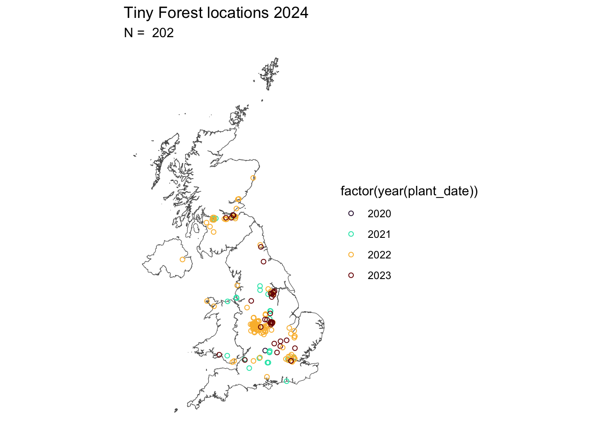
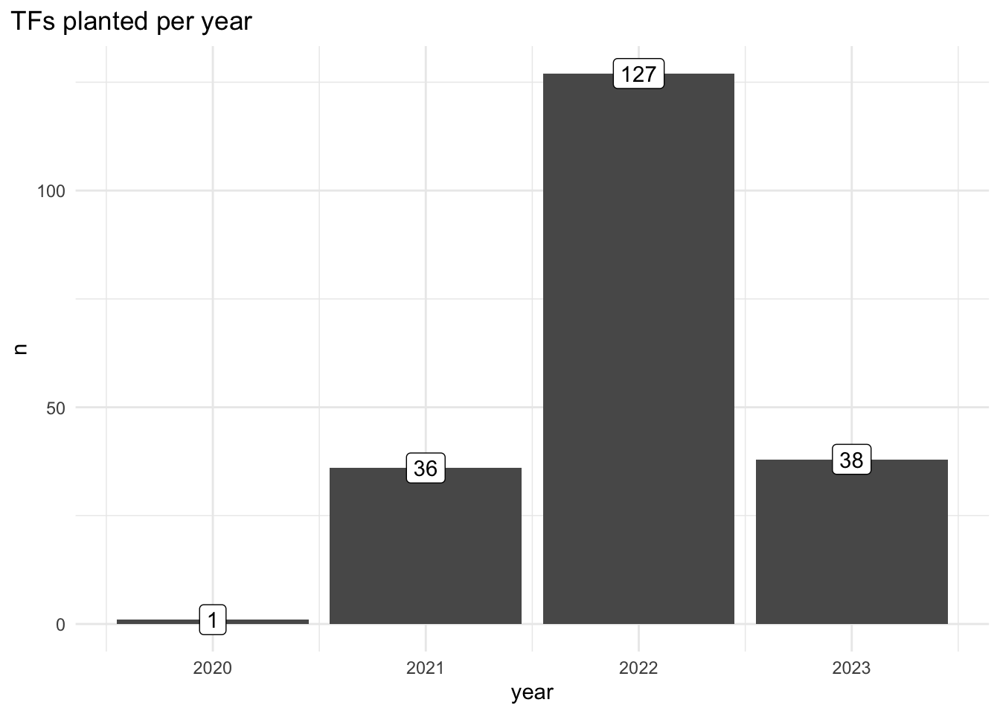
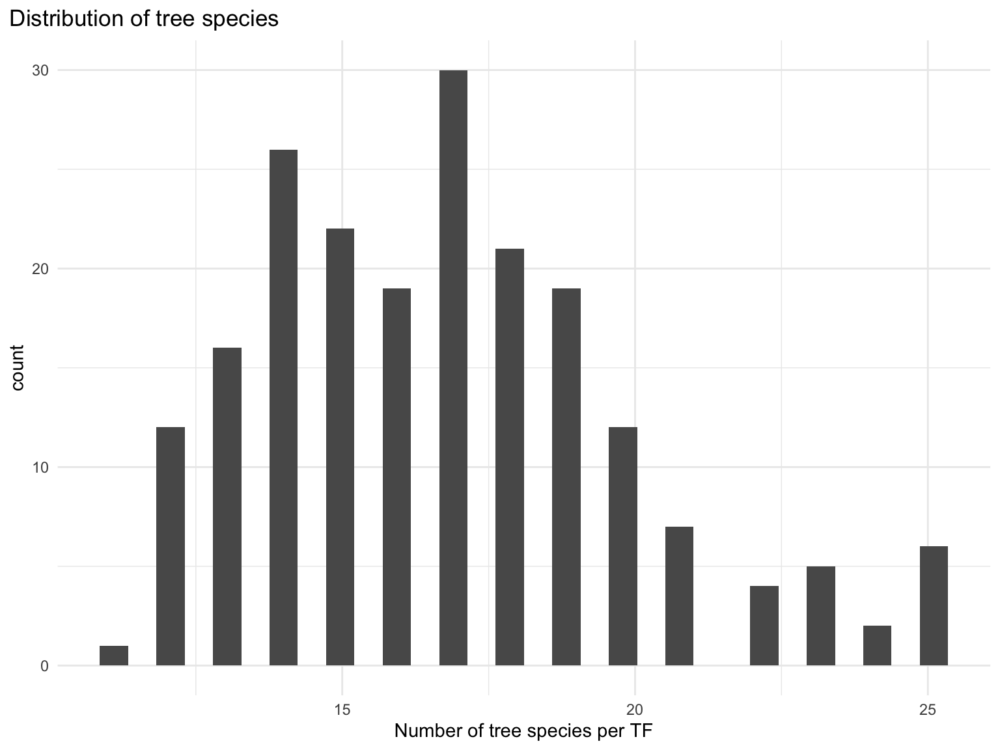
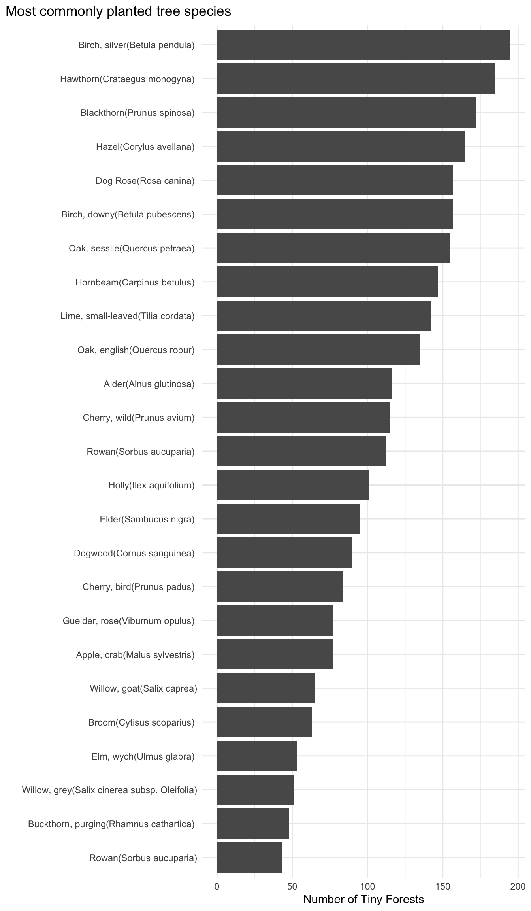
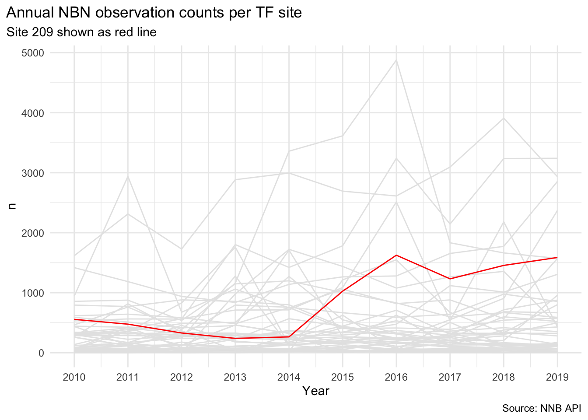
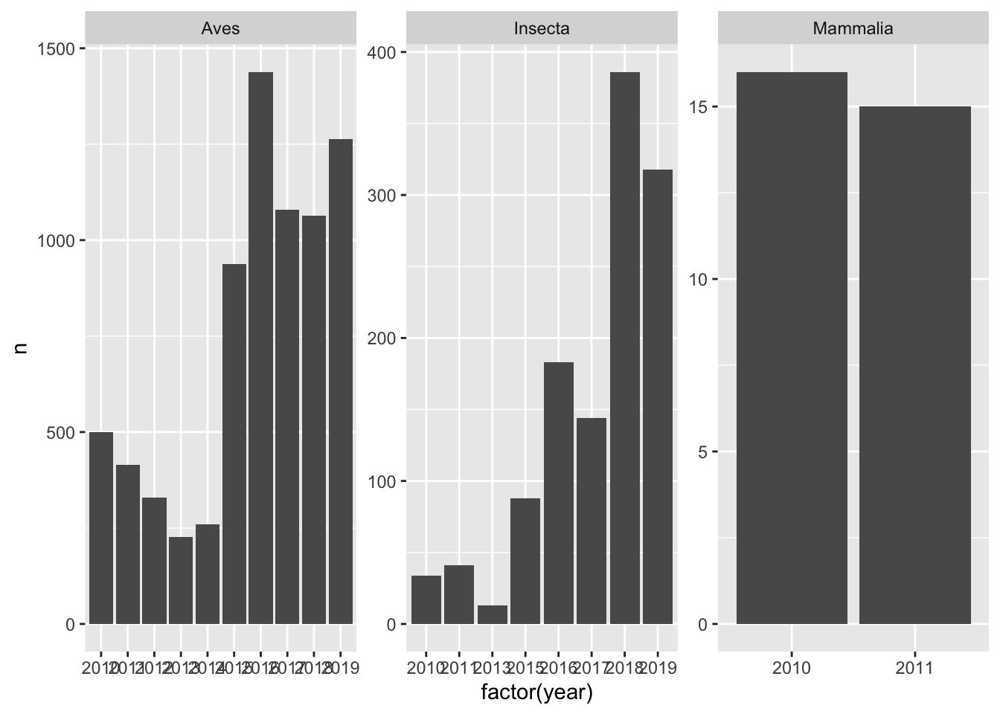
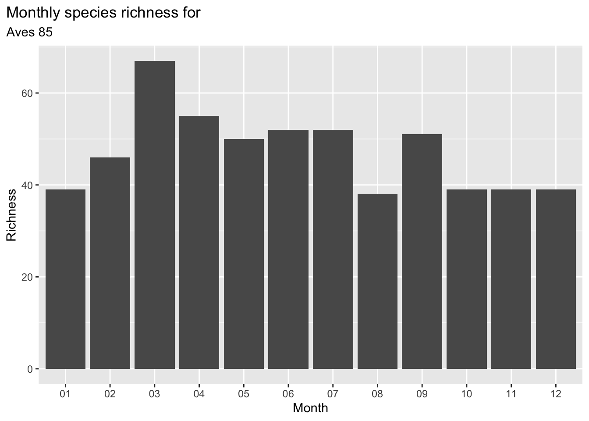
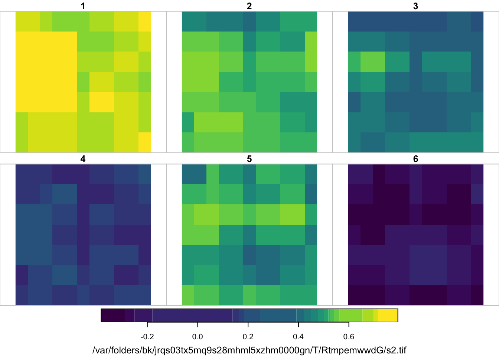
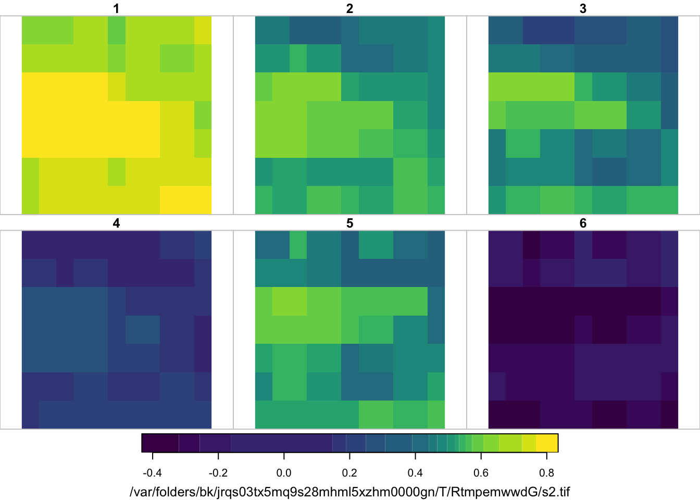
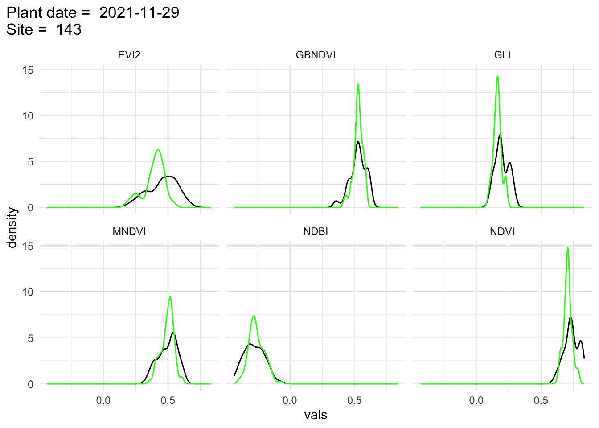

::: {.cell}

:::


## What is the `tinyForestR` package?

The aim of `tinyfoRest` is to provide set of tools designed to extract, manipulate and analyse data relevant to the location of Tiny Forests in the UK.

Specifically it extracts and processes landcover and biodiversity data from a range of sources for a given area around Tiny Forest locations, and provides a set of tools for analysing citizen science data derived directly from Tiny Forests.

Tiny Forests are small scale dense tree plantings usually in urban areas - and are managed by Earthwatch (<https://earthwatch.org.uk/get-involved/tiny-forest>)

## Getting started

The package is hosted on Github and is a work in progress. It can be installed by running `devtools::install_github("julianflowers/tinyfoRest")`. It loads another Github package `myScrapers` which is needed to download data from the Tiny Forest website.

The package makes use of a number of Application Programming Interfaces (APIs) some of which require API keys which will need to be applied for separately. This is outlined in the relevant sections of this vignette.

It uses a range of Python packages to access some datasets (in some cases Python packages are better developed than R). For this reason the first step is to run `initialise_tf()` to intialise the package.

This:

-   Loads the `reticulate` package which R uses to talk to Python

-   Sets up a Python virtual environment (VE) called `tinyforest`, and ensures R uses the correct version of Python by specifying the `RETICULATE_PYTHON` environment variable. It may be necessary to restart R to make sure R correctly uses this.

-   You will be asked if you want to remove the `tinyforest` environment. Say "no" unless you have a previous installation and are having trouble. It will create a clean install of the VE.

-   Installs a number of Python packages to the `tinyforest` environment. These include

    -   `earthengine-api` which enables access to Google Earth Engine (GEE)

    -   `geemap` - a set of added value tools to extract and manipulate GEE data

    -   `osdatahub` - access to Ordnance Survey National Geographic Database data.

    -   `OSGridConverter` - converts lat-longs to UK Grid references

-   Imports the relevant modules for use in other packages

### Install and initialise

First install and load the package.


::: {.cell}

```{.r .cell-code}
initialise_tf()
#> virtualenv: tinyforest
#> Using virtual environment 'tinyforest' ...
#> + /Users/julianflowers/.virtualenvs/tinyforest/bin/python -m pip install --upgrade --no-user earthengine-api geemap osdatahub OSGridConverter geedim plotly
```
:::


We can now run the `get_tf_data` function which scrapes the Tiny Forest sites web pages.


::: {.cell}

```{.r .cell-code}

tf_data <- get_tf_data()
#> Skipping install of 'myScrapers' from a github remote, the SHA1 (27d682b5) has not changed since last install.
#>   Use `force = TRUE` to force installation
#> Loading required package: httr
#>  ■■                                 2% |  ETA:  2m
#>  ■■                                 3% |  ETA:  2m
#>  ■■■                                6% |  ETA:  2m
#>  ■■■                                8% |  ETA:  2m
#>  ■■■■                               9% |  ETA:  2m
#>  ■■■■                              11% |  ETA:  2m
#>  ■■■■■                             13% |  ETA:  2m
#>  ■■■■■■                            15% |  ETA:  2m
#>  ■■■■■■                            17% |  ETA:  2m
#>  ■■■■■■                            18% |  ETA:  2m
#>  ■■■■■■■                           20% |  ETA:  2m
#>  ■■■■■■■■                          22% |  ETA:  2m
#>  ■■■■■■■■                          24% |  ETA:  2m
#>  ■■■■■■■■■                         26% |  ETA:  2m
#>  ■■■■■■■■■■                        28% |  ETA:  2m
#>  ■■■■■■■■■■                        31% |  ETA:  2m
#>  ■■■■■■■■■■■                       33% |  ETA:  2m
#>  ■■■■■■■■■■■                       35% |  ETA:  2m
#>  ■■■■■■■■■■■■                      37% |  ETA:  2m
#>  ■■■■■■■■■■■■■                     40% |  ETA:  2m
#>  ■■■■■■■■■■■■■■                    42% |  ETA:  1m
#>  ■■■■■■■■■■■■■■                    44% |  ETA:  1m
#>  ■■■■■■■■■■■■■■■                   46% |  ETA:  1m
#>  ■■■■■■■■■■■■■■■                   48% |  ETA:  1m
#>  ■■■■■■■■■■■■■■■■                  50% |  ETA:  1m
#>  ■■■■■■■■■■■■■■■■■                 53% |  ETA:  1m
#>  ■■■■■■■■■■■■■■■■■■                55% |  ETA:  1m
#>  ■■■■■■■■■■■■■■■■■■                57% |  ETA:  1m
#>  ■■■■■■■■■■■■■■■■■■■               59% |  ETA:  1m
#>  ■■■■■■■■■■■■■■■■■■■               62% |  ETA:  1m
#>  ■■■■■■■■■■■■■■■■■■■■              64% |  ETA:  1m
#>  ■■■■■■■■■■■■■■■■■■■■■             66% |  ETA: 49s
#>  ■■■■■■■■■■■■■■■■■■■■■             68% |  ETA: 46s
#>  ■■■■■■■■■■■■■■■■■■■■■■            70% |  ETA: 43s
#>  ■■■■■■■■■■■■■■■■■■■■■■■           72% |  ETA: 40s
#>  ■■■■■■■■■■■■■■■■■■■■■■■           75% |  ETA: 37s
#>  ■■■■■■■■■■■■■■■■■■■■■■■■          77% |  ETA: 34s
#>  ■■■■■■■■■■■■■■■■■■■■■■■■■         79% |  ETA: 30s
#>  ■■■■■■■■■■■■■■■■■■■■■■■■■         81% |  ETA: 27s
#>  ■■■■■■■■■■■■■■■■■■■■■■■■■■        83% |  ETA: 24s
#>  ■■■■■■■■■■■■■■■■■■■■■■■■■■■       85% |  ETA: 21s
#>  ■■■■■■■■■■■■■■■■■■■■■■■■■■■       88% |  ETA: 17s
#>  ■■■■■■■■■■■■■■■■■■■■■■■■■■■■      90% |  ETA: 14s
#>  ■■■■■■■■■■■■■■■■■■■■■■■■■■■■■     92% |  ETA: 11s
#>  ■■■■■■■■■■■■■■■■■■■■■■■■■■■■■     94% |  ETA:  8s
#>  ■■■■■■■■■■■■■■■■■■■■■■■■■■■■■■    97% |  ETA:  5s
#>  ■■■■■■■■■■■■■■■■■■■■■■■■■■■■■■■   99% |  ETA:  1s
#> Warning: Expected 2 pieces. Missing pieces filled with `NA` in 11 rows [222, 223, 224,
#> 225, 226, 227, 228, 229, 230, 231, 232].
#> Warning: Expected 6 pieces. Missing pieces filled with `NA` in 149 rows [1, 2, 3, 4, 5,
#> 11, 17, 19, 42, 43, 44, 46, 47, 49, 50, 51, 52, 53, 54, 55, ...].
#> Warning: There were 2 warnings in `mutate()`.
#> The first warning was:
#> ℹ In argument: `class_area = parse_number(class_area)`.
#> Caused by warning:
#> ! 19 parsing failures.
#> row col expected              actual
#>   1  -- a number Featured
#> Pathways:
#>   3  -- a number Featured
#> Pathways:
#>   4  -- a number Featured
#> Pathways:
#>   5  -- a number Featured
#> Pathways:
#>  56  -- a number Featured
#> Pathways 
#> ... ... ........ ...................
#> See problems(...) for more details.
#> ℹ Run `dplyr::last_dplyr_warnings()` to see the 1 remaining warning.
#> Spherical geometry (s2) switched off
#> although coordinates are longitude/latitude, st_union assumes that they are
#> planar
#> although coordinates are longitude/latitude, st_intersection assumes that they
#> are planar
#> Warning: attribute variables are assumed to be spatially constant throughout
#> all geometries
#> 164.279 sec elapsed
```
:::


Producing a simple map is as simple as loading `tf_data$map`.


::: {.cell}

```{.r .cell-code}

tf_data$map
```

::: {.cell-output-display}


```{=html}
<div class="leaflet html-widget html-fill-item" id="htmlwidget-5a8a87d6994d690e41a5" style="width:100%;height:464px;"></div>
<script type="application/json" data-for="htmlwidget-5a8a87d6994d690e41a5">{"x":{"options":{"minZoom":1,"maxZoom":52,"crs":{"crsClass":"L.CRS.EPSG3857","code":null,"proj4def":null,"projectedBounds":null,"options":{}},"preferCanvas":false,"bounceAtZoomLimits":false,"maxBounds":[[[-90,-370]],[[90,370]]]},"calls":[{"method":"addProviderTiles","args":["CartoDB.Positron","CartoDB.Positron","CartoDB.Positron",{"errorTileUrl":"","noWrap":false,"detectRetina":false,"pane":"tilePane"}]},{"method":"addProviderTiles","args":["CartoDB.DarkMatter","CartoDB.DarkMatter","CartoDB.DarkMatter",{"errorTileUrl":"","noWrap":false,"detectRetina":false,"pane":"tilePane"}]},{"method":"addProviderTiles","args":["OpenStreetMap","OpenStreetMap","OpenStreetMap",{"errorTileUrl":"","noWrap":false,"detectRetina":false,"pane":"tilePane"}]},{"method":"addProviderTiles","args":["Esri.WorldImagery","Esri.WorldImagery","Esri.WorldImagery",{"errorTileUrl":"","noWrap":false,"detectRetina":false,"pane":"tilePane"}]},{"method":"addProviderTiles","args":["OpenTopoMap","OpenTopoMap","OpenTopoMap",{"errorTileUrl":"","noWrap":false,"detectRetina":false,"pane":"tilePane"}]},{"method":"createMapPane","args":["point",440]},{"method":"addCircleMarkers","args":[[51.77788899999999,51.76913900000001,51.73477800000001,51.500278,55.87525,52.63213900000001,52.535444,51.511028,50.828,52.582056,51.54277800000001,51.55686099999999,51.404913,53.53533300000001,53.526,55.8599,55.86051800000001,55.852919,55.838286,55.97362699999999,55.915614,53.778685,53.407195,51.233563,51.40519500000001,52.76141000000001,52.577909,53.002925,53.009963,52.997873,53.65228,53.42442699999999,51.718875,51.457095,51.516779,55.970752,55.934302,55.85368699999999,55.83024,57.131053,51.40505,51.57851490000001,52.54009,51.427743,53.530082,53.110708,53.79721600000001,52.57619500000001,52.698821,52.679149,52.686275,52.680666,52.687002,52.58350741460279,52.594506,52.569163,52.561783,52.5867924941756,52.59225500000001,52.54142899999999,52.577422,52.6302218963334,52.607959,52.52012971648074,52.418404,52.615857,52.595457,52.56972,52.59713900000001,52.56138035305526,52.56559900000001,51.502237,51.589091,51.48467299999999,52.321905,52.39302378119749,52.415305,52.338248,52.79032000000001,52.534757,51.526791,51.56231900000001,52.22154500000001,52.176945,52.22713100000001,55.05403699999999,52.52917232249221,52.452385,52.493109,52.48490899999999,52.48354699999999,52.61622,52.800133,52.538881,52.55507,52.55062599999999,52.551111,52.545247,52.51446899999999,52.39184699999999,52.455751,52.582645,52.363456,52.57619500000001,52.360015,52.422284,52.566945,52.59173800000001,55.92988399999999,53.61104599999999,52.50331600000001,52.476982,52.27801600000001,52.503211,52.34629699999999,52.393919,52.661626,52.6610553628471,52.647034,52.62847300000001,52.64253900000001,52.6111,52.9084697960256,52.8815392834617,52.618517,52.432099,52.653263,52.68211300000001,55.83421,55.827102,56.46786399999999,55.90290775264437,55.45474299999999,56.18074975212664,55.84488399999999,55.62021000000001,55.86102215360309,55.920206,55.910308,55.744693,56.479028,55.871315,52.654316,52.41684699999999,52.51668799999999,50.964583,53.686272,51.45524699999999,51.41994099999999,51.619003,53.30228899999999,53.3125,53.15,52.4791686,52.38936045999999,52.30166899999999,51.603463,51.651119,51.45146599999999,54.601504,55.903733,51.64913900000001,51.85165736407679,53.318176,51.9141624,52.09693009000001,51.871505,52.06658205,52.58409349999999,52.62079522620645,51.47726099999999,52.73296554000001,52.63856294402584,52.6587077868186,52.65089023277611,52.67023137001485,52.650134,52.64003879110286,52.64532697000001,53.57564290000001,53.438482879399,53.501618,53.533876,53.600071,53.547756,53.616319,55.97935832000001,51.71868057295183,51.9949907,52.6239184672846,51.458749,52.92834220000001,52.508562,51.48627865064361,54.534438,54.991392,51.45876066254605,55.89811250760339,55.89556203678853,55.96773242591303,52.652722,52.7398493],[-1.469139,-1.215472,-1.239861,-2.600333,-4.160222,-1.174139,-1.861139,-0.227833,-0.298167,-2.146194,-1.786361,0.09075,-1.341047,-1.167639,-1.309611,-4.303606,-4.308922,-4.246042000000001,-4.289215,-3.226764,-3.158599,-1.749937,-3.026451999999999,-2.336653999999999,-1.292495,-1.22103,-2.076385,-1.16985,-1.197738,-1.179789,-1.748164,-3.042737,-1.231499,-2.106602,-0.3370569999999999,-3.248136000000001,-3.1123477,-3.565495,-4.259885,-2.1213439,-1.341114,0.096954,-1.362815,0.005939,-1.033692,-2.457967,-2.996617999999999,-2.073685,-1.832111,-1.823257,-1.819246,-1.912416,-1.928311,-1.95846134109726,-1.975394,-2.019838,-2.02768,-2.06688092579331,-1.976424,-1.993279,-1.909467,-1.99648580515203,-1.97451,-1.83107391563505,-1.942526,-2.059127,-2.148854,-2.12896,-2.101722,-2.074920820108497,-2.170968,0.127549,-0.196905,-0.205553,-1.671257,-1.46405264955692,-1.528072,-2.051136,-2.108104,-1.499698,0.147647,-1.750489,0.152687,0.11985,0.133424,-1.73862,-2.11865934332309,-2.136801999999999,-2.078593,-2.124418,-1.834239,-2.128933,-2.089367,-1.397622,-1.370149,-1.336776,-1.362255,-1.389992,-2.112841,-2.241009,-2.001718,-2.188287,-1.439056,-2.073685,-2.06217,-1.881578,-2.090502,-2.264747,-3.072584,-1.164036,-1.883135,-1.422557,-1.539299,-1.921354,-1.575018,-1.82891,-1.167585,-1.0690354564073,-1.053824,-1.073571,-1.173677,-1.16135,-1.44929677652072,-1.45708103453227,-1.155923,-1.952364,-1.053784,-1.841198,-4.354717099999999,-4.293608700000001,-2.956614,-4.251175737308021,-4.2808133,-3.03906745548079,-3.615064,-4.47898,-3.69404044206451,-3.2696146,-3.2288665,-4.669491,-2.905574,-3.097268,-1.161236,-1.12487,-1.663106,-1.371917,-1.302669,-3.162708,-3.257983,-3.536827,-3.517093,-4.642499999999999,-4.259167000000001,-0.1529916,0.11507062,-0.063399,-0.104395,-0.034409,-0.025275,-5.97831,-4.317083999999999,-3.973721,0.155275811345493,-2.228291,-0.6451366999999999,-0.2975755900000001,-0.512358,-0.63102201,-1.1487517,-1.16140114284363,-0.196531,-1.368716803,-1.195506494085819,-1.156425145855601,-1.154152620547443,-1.144402036243716,-1.161924,-1.172899119318505,-1.09688841,-1.0132841,-1.10901816092064,-1.01437,-1.095681,-1.014993,-1.162609,-0.9558480000000001,-3.22382907,-0.8222809859244966,-0.9732150999999999,-1.084136153397733,-0.059757,-1.1942976,-1.707666,-2.576260456382167,-1.556809,-1.701828,-0.06007444490000822,-3.609391110516,-3.31397641792687,-3.188277184166757,-1.072583,-1.4785701],6,null,"uk_tf",{"crs":{"crsClass":"L.CRS.EPSG3857","code":null,"proj4def":null,"projectedBounds":null,"options":{}},"pane":"point","stroke":true,"color":"#333333","weight":1,"opacity":0.9,"fill":true,"fillColor":"#6666FF","fillOpacity":0.6},null,null,["<div class='scrollableContainer'><table class=mapview-popup id='popup'><tr class='coord'><td><\/td><th><b>Feature ID&emsp;<\/b><\/th><td>1&emsp;<\/td><\/tr><tr><td>1<\/td><th>tf_id&emsp;<\/th><td>85&emsp;<\/td><\/tr><tr><td>2<\/td><th>planted_by&emsp;<\/th><td>Volunteer Group, Local Residents, Earthwatch\n\n&emsp;<\/td><\/tr><tr><td>3<\/td><th>plant_date&emsp;<\/th><td>2020-03-14&emsp;<\/td><\/tr><tr><td>4<\/td><th>area&emsp;<\/th><td>207&emsp;<\/td><\/tr><tr><td>5<\/td><th>class_area&emsp;<\/th><td> 30&emsp;<\/td><\/tr><tr><td>6<\/td><th>feature&emsp;<\/th><td>No&emsp;<\/td><\/tr><tr><td>7<\/td><th>trees&emsp;<\/th><td>Apple, crab(Malus sylvestris) | Birch, downy(Betula pubescens) | Birch, silver(Betula pendula) | Blackthorn(Prunus spinosa) | Dogwood(Cornus sanguinea) | Elder(Sambucus nigra) | Guelder, rose(Viburnum opulus) | Hazel(Corylus avellana) | Maple, field(Acer campestre) | Oak, english(Quercus robur) | Oak, sessile(Quercus petraea) | Willow, goat(Salix caprea)&emsp;<\/td><\/tr><tr><td>8<\/td><th>tf_age&emsp;<\/th><td>1444 days&emsp;<\/td><\/tr><tr><td>9<\/td><th>site&emsp;<\/th><td> 85&emsp;<\/td><\/tr><tr><td>10<\/td><th>geometry&emsp;<\/th><td>sfc_POINT&emsp;<\/td><\/tr><\/table><\/div>","<div class='scrollableContainer'><table class=mapview-popup id='popup'><tr class='coord'><td><\/td><th><b>Feature ID&emsp;<\/b><\/th><td>2&emsp;<\/td><\/tr><tr><td>1<\/td><th>tf_id&emsp;<\/th><td>86&emsp;<\/td><\/tr><tr><td>2<\/td><th>planted_by&emsp;<\/th><td>Volunteer Group, Landscape contractors\n\n&emsp;<\/td><\/tr><tr><td>3<\/td><th>plant_date&emsp;<\/th><td>2021-01-28&emsp;<\/td><\/tr><tr><td>4<\/td><th>area&emsp;<\/th><td>201&emsp;<\/td><\/tr><tr><td>5<\/td><th>class_area&emsp;<\/th><td> 16&emsp;<\/td><\/tr><tr><td>6<\/td><th>feature&emsp;<\/th><td>No&emsp;<\/td><\/tr><tr><td>7<\/td><th>trees&emsp;<\/th><td>Alder(Alnus glutinosa) | Apple, crab(Malus sylvestris) | Birch, silver(Betula pendula) | Blackthorn(Prunus spinosa) | Cherry, bird(Prunus padus) | Cherry, wild(Prunus avium) | Common privet(Ligustrum vulgare) | Dogwood(Cornus sanguinea) | Elder(Sambucus nigra) | Elm, wych(Ulmus glabra) | Guelder, rose(Viburnum opulus) | Hawthorn(Crataegus monogyna) | Hazel(Corylus avellana) | Hornbeam(Carpinus betulus) | Lime, large-leaved(Tilia platyphyllos) | Lime, small-leaved(Tilia cordata) | Maple, field(Acer campestre) | Oak, english(Quercus robur) | Rowan(Sorbus aucuparia) | Spindle(Euonymus europaea) | Wild service tree(Sorbus torminalis)&emsp;<\/td><\/tr><tr><td>8<\/td><th>tf_age&emsp;<\/th><td>1124 days&emsp;<\/td><\/tr><tr><td>9<\/td><th>site&emsp;<\/th><td> 86&emsp;<\/td><\/tr><tr><td>10<\/td><th>geometry&emsp;<\/th><td>sfc_POINT&emsp;<\/td><\/tr><\/table><\/div>","<div class='scrollableContainer'><table class=mapview-popup id='popup'><tr class='coord'><td><\/td><th><b>Feature ID&emsp;<\/b><\/th><td>3&emsp;<\/td><\/tr><tr><td>1<\/td><th>tf_id&emsp;<\/th><td>87&emsp;<\/td><\/tr><tr><td>2<\/td><th>planted_by&emsp;<\/th><td>Landscape contractors\n\n&emsp;<\/td><\/tr><tr><td>3<\/td><th>plant_date&emsp;<\/th><td>2021-02-04&emsp;<\/td><\/tr><tr><td>4<\/td><th>area&emsp;<\/th><td>206&emsp;<\/td><\/tr><tr><td>5<\/td><th>class_area&emsp;<\/th><td> 12&emsp;<\/td><\/tr><tr><td>6<\/td><th>feature&emsp;<\/th><td>No&emsp;<\/td><\/tr><tr><td>7<\/td><th>trees&emsp;<\/th><td>Alder(Alnus glutinosa) | Alder buckthorn(Frangula alnus) | Apple, crab(Malus sylvestris) | Birch, silver(Betula pendula) | Blackthorn(Prunus spinosa) | Cherry, wild(Prunus avium) | Dog Rose(Rosa canina) | Elder(Sambucus nigra) | Elm, wych(Ulmus glabra) | Guelder, rose(Viburnum opulus) | Hawthorn(Crataegus monogyna) | Hazel(Corylus avellana) | Hornbeam(Carpinus betulus) | Lime, small-leaved(Tilia cordata) | Oak, english(Quercus robur) | Oak, sessile(Quercus petraea) | Poplar, black(Poplus nigra) | Wild service tree(Sorbus torminalis) | Willow, goat(Salix caprea)&emsp;<\/td><\/tr><tr><td>8<\/td><th>tf_age&emsp;<\/th><td>1117 days&emsp;<\/td><\/tr><tr><td>9<\/td><th>site&emsp;<\/th><td> 87&emsp;<\/td><\/tr><tr><td>10<\/td><th>geometry&emsp;<\/th><td>sfc_POINT&emsp;<\/td><\/tr><\/table><\/div>","<div class='scrollableContainer'><table class=mapview-popup id='popup'><tr class='coord'><td><\/td><th><b>Feature ID&emsp;<\/b><\/th><td>4&emsp;<\/td><\/tr><tr><td>1<\/td><th>tf_id&emsp;<\/th><td>88&emsp;<\/td><\/tr><tr><td>2<\/td><th>planted_by&emsp;<\/th><td>Volunteer Group\n\n&emsp;<\/td><\/tr><tr><td>3<\/td><th>plant_date&emsp;<\/th><td>2021-02-04&emsp;<\/td><\/tr><tr><td>4<\/td><th>area&emsp;<\/th><td>205&emsp;<\/td><\/tr><tr><td>5<\/td><th>class_area&emsp;<\/th><td> 23&emsp;<\/td><\/tr><tr><td>6<\/td><th>feature&emsp;<\/th><td>No&emsp;<\/td><\/tr><tr><td>7<\/td><th>trees&emsp;<\/th><td>Alder(Alnus glutinosa) | Apple, crab(Malus sylvestris) | Beech, common(Fagus sylvatica) | Birch, downy(Betula pubescens) | Birch, silver(Betula pendula) | Blackthorn(Prunus spinosa) | Cherry, wild(Prunus avium) | Common privet(Ligustrum vulgare) | Dog Rose(Rosa canina) | Dogwood(Cornus sanguinea) | Elder(Sambucus nigra) | Guelder, rose(Viburnum opulus) | Hawthorn(Crataegus monogyna) | Hazel(Corylus avellana) | Hornbeam(Carpinus betulus) | Lime, large-leaved(Tilia platyphyllos) | Lime, small-leaved(Tilia cordata) | Maple, field(Acer campestre) | Oak, english(Quercus robur) | Spindle(Euonymus europaea) | Wayfaring tree(Viburnum lantana) | Whitebeam(Sorbus aria) | Wild service tree(Sorbus torminalis) | Willow, goat(Salix caprea)&emsp;<\/td><\/tr><tr><td>8<\/td><th>tf_age&emsp;<\/th><td>1117 days&emsp;<\/td><\/tr><tr><td>9<\/td><th>site&emsp;<\/th><td> 88&emsp;<\/td><\/tr><tr><td>10<\/td><th>geometry&emsp;<\/th><td>sfc_POINT&emsp;<\/td><\/tr><\/table><\/div>","<div class='scrollableContainer'><table class=mapview-popup id='popup'><tr class='coord'><td><\/td><th><b>Feature ID&emsp;<\/b><\/th><td>5&emsp;<\/td><\/tr><tr><td>1<\/td><th>tf_id&emsp;<\/th><td>89&emsp;<\/td><\/tr><tr><td>2<\/td><th>planted_by&emsp;<\/th><td>Landscape contractors\n\n&emsp;<\/td><\/tr><tr><td>3<\/td><th>plant_date&emsp;<\/th><td>2021-02-19&emsp;<\/td><\/tr><tr><td>4<\/td><th>area&emsp;<\/th><td>206&emsp;<\/td><\/tr><tr><td>5<\/td><th>class_area&emsp;<\/th><td> 22&emsp;<\/td><\/tr><tr><td>6<\/td><th>feature&emsp;<\/th><td>Yes&emsp;<\/td><\/tr><tr><td>7<\/td><th>trees&emsp;<\/th><td>Alder(Alnus glutinosa) | Apple, crab(Malus sylvestris) | Birch, downy(Betula pubescens) | Birch, silver(Betula pendula) | Broom(Cytisus scoparius) | Cherry, wild(Prunus avium) | Dog Rose(Rosa canina) | Elm, wych(Ulmus glabra) | Gorse(Ulex europaeus) | Hawthorn(Crataegus monogyna) | Hazel(Corylus avellana) | Heather(Calluna vulgaris) | Holly(Ilex aquifolium) | Lime, small-leaved(Tilia cordata) | Oak, sessile(Quercus petraea) | Pine, scots(Pinus sylvestris)&emsp;<\/td><\/tr><tr><td>8<\/td><th>tf_age&emsp;<\/th><td>1102 days&emsp;<\/td><\/tr><tr><td>9<\/td><th>site&emsp;<\/th><td> 89&emsp;<\/td><\/tr><tr><td>10<\/td><th>geometry&emsp;<\/th><td>sfc_POINT&emsp;<\/td><\/tr><\/table><\/div>","<div class='scrollableContainer'><table class=mapview-popup id='popup'><tr class='coord'><td><\/td><th><b>Feature ID&emsp;<\/b><\/th><td>6&emsp;<\/td><\/tr><tr><td>1<\/td><th>tf_id&emsp;<\/th><td>91&emsp;<\/td><\/tr><tr><td>2<\/td><th>planted_by&emsp;<\/th><td>School Children\n\n&emsp;<\/td><\/tr><tr><td>3<\/td><th>plant_date&emsp;<\/th><td>2021-02-26&emsp;<\/td><\/tr><tr><td>4<\/td><th>area&emsp;<\/th><td>205&emsp;<\/td><\/tr><tr><td>5<\/td><th>class_area&emsp;<\/th><td> 18&emsp;<\/td><\/tr><tr><td>6<\/td><th>feature&emsp;<\/th><td>No&emsp;<\/td><\/tr><tr><td>7<\/td><th>trees&emsp;<\/th><td>Alder buckthorn(Frangula alnus) | Apple, crab(Malus sylvestris) | Beech, common(Fagus sylvatica) | Birch, downy(Betula pubescens) | Birch, silver(Betula pendula) | Blackthorn(Prunus spinosa) | Cherry, wild(Prunus avium) | Dog Rose(Rosa canina) | Elm, wych(Ulmus glabra) | Guelder, rose(Viburnum opulus) | Hawthorn(Crataegus monogyna) | Hazel(Corylus avellana) | Heather(Calluna vulgaris) | Holly(Ilex aquifolium) | Hornbeam(Carpinus betulus) | Lime, large-leaved(Tilia platyphyllos) | Lime, small-leaved(Tilia cordata) | Oak, english(Quercus robur) | Oak, sessile(Quercus petraea) | Wild service tree(Sorbus torminalis)&emsp;<\/td><\/tr><tr><td>8<\/td><th>tf_age&emsp;<\/th><td>1095 days&emsp;<\/td><\/tr><tr><td>9<\/td><th>site&emsp;<\/th><td> 91&emsp;<\/td><\/tr><tr><td>10<\/td><th>geometry&emsp;<\/th><td>sfc_POINT&emsp;<\/td><\/tr><\/table><\/div>","<div class='scrollableContainer'><table class=mapview-popup id='popup'><tr class='coord'><td><\/td><th><b>Feature ID&emsp;<\/b><\/th><td>7&emsp;<\/td><\/tr><tr><td>1<\/td><th>tf_id&emsp;<\/th><td>92&emsp;<\/td><\/tr><tr><td>2<\/td><th>planted_by&emsp;<\/th><td>Landscape contractors\n\n&emsp;<\/td><\/tr><tr><td>3<\/td><th>plant_date&emsp;<\/th><td>2021-03-02&emsp;<\/td><\/tr><tr><td>4<\/td><th>area&emsp;<\/th><td>205&emsp;<\/td><\/tr><tr><td>5<\/td><th>class_area&emsp;<\/th><td> 18&emsp;<\/td><\/tr><tr><td>6<\/td><th>feature&emsp;<\/th><td>No&emsp;<\/td><\/tr><tr><td>7<\/td><th>trees&emsp;<\/th><td>Alder(Alnus glutinosa) | Apple, crab(Malus sylvestris) | Birch, downy(Betula pubescens) | Birch, silver(Betula pendula) | Blackthorn(Prunus spinosa) | Broom(Cytisus scoparius) | Cherry, bird(Prunus padus) | Dogwood(Cornus sanguinea) | Guelder, rose(Viburnum opulus) | Hawthorn(Crataegus monogyna) | Hazel(Corylus avellana) | Heather(Calluna vulgaris) | Hornbeam(Carpinus betulus) | Lime, large-leaved(Tilia platyphyllos) | Lime, small-leaved(Tilia cordata) | Oak, english(Quercus robur) | Oak, sessile(Quercus petraea) | Rowan(Sorbus aucuparia) | Wild service tree(Sorbus torminalis) | Willow, goat(Salix caprea) | Willow, grey(Salix cinerea subsp. Oleifolia)&emsp;<\/td><\/tr><tr><td>8<\/td><th>tf_age&emsp;<\/th><td>1091 days&emsp;<\/td><\/tr><tr><td>9<\/td><th>site&emsp;<\/th><td> 92&emsp;<\/td><\/tr><tr><td>10<\/td><th>geometry&emsp;<\/th><td>sfc_POINT&emsp;<\/td><\/tr><\/table><\/div>","<div class='scrollableContainer'><table class=mapview-popup id='popup'><tr class='coord'><td><\/td><th><b>Feature ID&emsp;<\/b><\/th><td>8&emsp;<\/td><\/tr><tr><td>1<\/td><th>tf_id&emsp;<\/th><td>93&emsp;<\/td><\/tr><tr><td>2<\/td><th>planted_by&emsp;<\/th><td>Corporate Employees\n\n&emsp;<\/td><\/tr><tr><td>3<\/td><th>plant_date&emsp;<\/th><td>2021-03-08&emsp;<\/td><\/tr><tr><td>4<\/td><th>area&emsp;<\/th><td>200&emsp;<\/td><\/tr><tr><td>5<\/td><th>class_area&emsp;<\/th><td> 21&emsp;<\/td><\/tr><tr><td>6<\/td><th>feature&emsp;<\/th><td>No&emsp;<\/td><\/tr><tr><td>7<\/td><th>trees&emsp;<\/th><td>Apple, crab(Malus sylvestris) | Beech, common(Fagus sylvatica) | Birch, silver(Betula pendula) | Blackthorn(Prunus spinosa) | Broom(Cytisus scoparius) | Cherry, wild(Prunus avium) | Dog Rose(Rosa canina) | Gorse(Ulex europaeus) | Hawthorn(Crataegus monogyna) | Hazel(Corylus avellana) | Holly(Ilex aquifolium) | Hornbeam(Carpinus betulus) | Lime, small-leaved(Tilia cordata) | Maple, field(Acer campestre) | Oak, sessile(Quercus petraea) | Rowan(Sorbus aucuparia) | Wild service tree(Sorbus torminalis)&emsp;<\/td><\/tr><tr><td>8<\/td><th>tf_age&emsp;<\/th><td>1085 days&emsp;<\/td><\/tr><tr><td>9<\/td><th>site&emsp;<\/th><td> 93&emsp;<\/td><\/tr><tr><td>10<\/td><th>geometry&emsp;<\/th><td>sfc_POINT&emsp;<\/td><\/tr><\/table><\/div>","<div class='scrollableContainer'><table class=mapview-popup id='popup'><tr class='coord'><td><\/td><th><b>Feature ID&emsp;<\/b><\/th><td>9&emsp;<\/td><\/tr><tr><td>1<\/td><th>tf_id&emsp;<\/th><td>94&emsp;<\/td><\/tr><tr><td>2<\/td><th>planted_by&emsp;<\/th><td>Landscape contractors\n\n&emsp;<\/td><\/tr><tr><td>3<\/td><th>plant_date&emsp;<\/th><td>2021-03-11&emsp;<\/td><\/tr><tr><td>4<\/td><th>area&emsp;<\/th><td>205&emsp;<\/td><\/tr><tr><td>5<\/td><th>class_area&emsp;<\/th><td> 28&emsp;<\/td><\/tr><tr><td>6<\/td><th>feature&emsp;<\/th><td>No&emsp;<\/td><\/tr><tr><td>7<\/td><th>trees&emsp;<\/th><td>Alder(Alnus glutinosa) | Birch, silver(Betula pendula) | Blackthorn(Prunus spinosa) | Dog Rose(Rosa canina) | Dogwood(Cornus sanguinea) | Gorse(Ulex europaeus) | Guelder, rose(Viburnum opulus) | Hawthorn(Crataegus monogyna) | Hazel(Corylus avellana) | Holly(Ilex aquifolium) | Hornbeam(Carpinus betulus) | Lime, small-leaved(Tilia cordata) | Oak, english(Quercus robur) | Oak, sessile(Quercus petraea) | Rowan(Sorbus aucuparia) | Wild service tree(Sorbus torminalis) | Willow, grey(Salix cinerea subsp. Oleifolia)&emsp;<\/td><\/tr><tr><td>8<\/td><th>tf_age&emsp;<\/th><td>1082 days&emsp;<\/td><\/tr><tr><td>9<\/td><th>site&emsp;<\/th><td> 94&emsp;<\/td><\/tr><tr><td>10<\/td><th>geometry&emsp;<\/th><td>sfc_POINT&emsp;<\/td><\/tr><\/table><\/div>","<div class='scrollableContainer'><table class=mapview-popup id='popup'><tr class='coord'><td><\/td><th><b>Feature ID&emsp;<\/b><\/th><td>10&emsp;<\/td><\/tr><tr><td>1<\/td><th>tf_id&emsp;<\/th><td>95&emsp;<\/td><\/tr><tr><td>2<\/td><th>planted_by&emsp;<\/th><td>School Children, Landscape contractors\n\n&emsp;<\/td><\/tr><tr><td>3<\/td><th>plant_date&emsp;<\/th><td>2021-03-10&emsp;<\/td><\/tr><tr><td>4<\/td><th>area&emsp;<\/th><td>205&emsp;<\/td><\/tr><tr><td>5<\/td><th>class_area&emsp;<\/th><td> 18&emsp;<\/td><\/tr><tr><td>6<\/td><th>feature&emsp;<\/th><td>No&emsp;<\/td><\/tr><tr><td>7<\/td><th>trees&emsp;<\/th><td>Beech, common(Fagus sylvatica) | Birch, downy(Betula pubescens) | Birch, silver(Betula pendula) | Blackthorn(Prunus spinosa) | Cherry, wild(Prunus avium) | Dog Rose(Rosa canina) | Elm, wych(Ulmus glabra) | Guelder, rose(Viburnum opulus) | Hawthorn(Crataegus monogyna) | Hazel(Corylus avellana) | Heather(Calluna vulgaris) | Hornbeam(Carpinus betulus) | Lime, large-leaved(Tilia platyphyllos) | Lime, small-leaved(Tilia cordata) | Oak, english(Quercus robur) | Oak, sessile(Quercus petraea) | Rowan(Sorbus aucuparia) | Wild service tree(Sorbus torminalis)&emsp;<\/td><\/tr><tr><td>8<\/td><th>tf_age&emsp;<\/th><td>1083 days&emsp;<\/td><\/tr><tr><td>9<\/td><th>site&emsp;<\/th><td> 95&emsp;<\/td><\/tr><tr><td>10<\/td><th>geometry&emsp;<\/th><td>sfc_POINT&emsp;<\/td><\/tr><\/table><\/div>","<div class='scrollableContainer'><table class=mapview-popup id='popup'><tr class='coord'><td><\/td><th><b>Feature ID&emsp;<\/b><\/th><td>11&emsp;<\/td><\/tr><tr><td>1<\/td><th>tf_id&emsp;<\/th><td>96&emsp;<\/td><\/tr><tr><td>2<\/td><th>planted_by&emsp;<\/th><td>Landscape contractors\n\n&emsp;<\/td><\/tr><tr><td>3<\/td><th>plant_date&emsp;<\/th><td>2021-03-11&emsp;<\/td><\/tr><tr><td>4<\/td><th>area&emsp;<\/th><td>205&emsp;<\/td><\/tr><tr><td>5<\/td><th>class_area&emsp;<\/th><td>  0&emsp;<\/td><\/tr><tr><td>6<\/td><th>feature&emsp;<\/th><td>NA&emsp;<\/td><\/tr><tr><td>7<\/td><th>trees&emsp;<\/th><td>Alder(Alnus glutinosa) | Apple, crab(Malus sylvestris) | Birch, silver(Betula pendula) | Blackthorn(Prunus spinosa) | Dog Rose(Rosa canina) | Dogwood(Cornus sanguinea) | Elm, wych(Ulmus glabra) | Guelder, rose(Viburnum opulus) | Hawthorn(Crataegus monogyna) | Hazel(Corylus avellana) | Hornbeam(Carpinus betulus) | Lime, small-leaved(Tilia cordata) | Oak, english(Quercus robur) | Wild service tree(Sorbus torminalis) | Willow, goat(Salix caprea) | Willow, grey(Salix cinerea subsp. Oleifolia)&emsp;<\/td><\/tr><tr><td>8<\/td><th>tf_age&emsp;<\/th><td>1082 days&emsp;<\/td><\/tr><tr><td>9<\/td><th>site&emsp;<\/th><td> 96&emsp;<\/td><\/tr><tr><td>10<\/td><th>geometry&emsp;<\/th><td>sfc_POINT&emsp;<\/td><\/tr><\/table><\/div>","<div class='scrollableContainer'><table class=mapview-popup id='popup'><tr class='coord'><td><\/td><th><b>Feature ID&emsp;<\/b><\/th><td>12&emsp;<\/td><\/tr><tr><td>1<\/td><th>tf_id&emsp;<\/th><td>97&emsp;<\/td><\/tr><tr><td>2<\/td><th>planted_by&emsp;<\/th><td>Landscape contractors\n\n&emsp;<\/td><\/tr><tr><td>3<\/td><th>plant_date&emsp;<\/th><td>2021-03-18&emsp;<\/td><\/tr><tr><td>4<\/td><th>area&emsp;<\/th><td>209&emsp;<\/td><\/tr><tr><td>5<\/td><th>class_area&emsp;<\/th><td> 34&emsp;<\/td><\/tr><tr><td>6<\/td><th>feature&emsp;<\/th><td>No&emsp;<\/td><\/tr><tr><td>7<\/td><th>trees&emsp;<\/th><td>Alder(Alnus glutinosa) | Alder buckthorn(Frangula alnus) | Apple, crab(Malus sylvestris) | Beech, common(Fagus sylvatica) | Birch, downy(Betula pubescens) | Birch, silver(Betula pendula) | Blackthorn(Prunus spinosa) | Broom(Cytisus scoparius) | Cherry, wild(Prunus avium) | Dog Rose(Rosa canina) | Hawthorn(Crataegus monogyna) | Hazel(Corylus avellana) | Heather(Calluna vulgaris) | Holly(Ilex aquifolium) | Hornbeam(Carpinus betulus) | Lime, large-leaved(Tilia platyphyllos) | Oak, english(Quercus robur) | Oak, sessile(Quercus petraea) | Rowan(Sorbus aucuparia) | Wild service tree(Sorbus torminalis) | Willow, goat(Salix caprea) | Willow, grey(Salix cinerea subsp. Oleifolia)&emsp;<\/td><\/tr><tr><td>8<\/td><th>tf_age&emsp;<\/th><td>1075 days&emsp;<\/td><\/tr><tr><td>9<\/td><th>site&emsp;<\/th><td> 97&emsp;<\/td><\/tr><tr><td>10<\/td><th>geometry&emsp;<\/th><td>sfc_POINT&emsp;<\/td><\/tr><\/table><\/div>","<div class='scrollableContainer'><table class=mapview-popup id='popup'><tr class='coord'><td><\/td><th><b>Feature ID&emsp;<\/b><\/th><td>13&emsp;<\/td><\/tr><tr><td>1<\/td><th>tf_id&emsp;<\/th><td>98&emsp;<\/td><\/tr><tr><td>2<\/td><th>planted_by&emsp;<\/th><td>Landscape contractors\n\n&emsp;<\/td><\/tr><tr><td>3<\/td><th>plant_date&emsp;<\/th><td>2021-03-26&emsp;<\/td><\/tr><tr><td>4<\/td><th>area&emsp;<\/th><td>202&emsp;<\/td><\/tr><tr><td>5<\/td><th>class_area&emsp;<\/th><td> 21&emsp;<\/td><\/tr><tr><td>6<\/td><th>feature&emsp;<\/th><td>NA&emsp;<\/td><\/tr><tr><td>7<\/td><th>trees&emsp;<\/th><td>Alder(Alnus glutinosa) | Alder buckthorn(Frangula alnus) | Apple, crab(Malus sylvestris) | Birch, downy(Betula pubescens) | Birch, silver(Betula pendula) | Cherry, wild(Prunus avium) | Dog Rose(Rosa canina) | Elder(Sambucus nigra) | Elm, wych(Ulmus glabra) | Hawthorn(Crataegus monogyna) | Hazel(Corylus avellana) | Holly(Ilex aquifolium) | Hornbeam(Carpinus betulus) | Lime, small-leaved(Tilia cordata) | Oak, english(Quercus robur) | Oak, sessile(Quercus petraea) | Wild service tree(Sorbus torminalis) | Willow, goat(Salix caprea) | Willow, grey(Salix cinerea subsp. Oleifolia)&emsp;<\/td><\/tr><tr><td>8<\/td><th>tf_age&emsp;<\/th><td>1067 days&emsp;<\/td><\/tr><tr><td>9<\/td><th>site&emsp;<\/th><td> 98&emsp;<\/td><\/tr><tr><td>10<\/td><th>geometry&emsp;<\/th><td>sfc_POINT&emsp;<\/td><\/tr><\/table><\/div>","<div class='scrollableContainer'><table class=mapview-popup id='popup'><tr class='coord'><td><\/td><th><b>Feature ID&emsp;<\/b><\/th><td>14&emsp;<\/td><\/tr><tr><td>1<\/td><th>tf_id&emsp;<\/th><td>99&emsp;<\/td><\/tr><tr><td>2<\/td><th>planted_by&emsp;<\/th><td>Landscape contractors\n\n&emsp;<\/td><\/tr><tr><td>3<\/td><th>plant_date&emsp;<\/th><td>2021-03-25&emsp;<\/td><\/tr><tr><td>4<\/td><th>area&emsp;<\/th><td>207&emsp;<\/td><\/tr><tr><td>5<\/td><th>class_area&emsp;<\/th><td> 31&emsp;<\/td><\/tr><tr><td>6<\/td><th>feature&emsp;<\/th><td>Yes&emsp;<\/td><\/tr><tr><td>7<\/td><th>trees&emsp;<\/th><td>Alder(Alnus glutinosa) | Apple, crab(Malus sylvestris) | Birch, silver(Betula pendula) | Blackthorn(Prunus spinosa) | Cherry, bird(Prunus padus) | Cherry, wild(Prunus avium) | Dog Rose(Rosa canina) | Elder(Sambucus nigra) | Elm, wych(Ulmus glabra) | Hawthorn(Crataegus monogyna) | Hazel(Corylus avellana) | Holly(Ilex aquifolium) | Hornbeam(Carpinus betulus) | Lime, small-leaved(Tilia cordata) | Maple, field(Acer campestre) | Oak, english(Quercus robur) | Spindle(Euonymus europaea) | Wild service tree(Sorbus torminalis) | Willow, goat(Salix caprea)&emsp;<\/td><\/tr><tr><td>8<\/td><th>tf_age&emsp;<\/th><td>1068 days&emsp;<\/td><\/tr><tr><td>9<\/td><th>site&emsp;<\/th><td> 99&emsp;<\/td><\/tr><tr><td>10<\/td><th>geometry&emsp;<\/th><td>sfc_POINT&emsp;<\/td><\/tr><\/table><\/div>","<div class='scrollableContainer'><table class=mapview-popup id='popup'><tr class='coord'><td><\/td><th><b>Feature ID&emsp;<\/b><\/th><td>15&emsp;<\/td><\/tr><tr><td>1<\/td><th>tf_id&emsp;<\/th><td>100&emsp;<\/td><\/tr><tr><td>2<\/td><th>planted_by&emsp;<\/th><td>Landscape contractors\n\n&emsp;<\/td><\/tr><tr><td>3<\/td><th>plant_date&emsp;<\/th><td>2021-03-26&emsp;<\/td><\/tr><tr><td>4<\/td><th>area&emsp;<\/th><td>204&emsp;<\/td><\/tr><tr><td>5<\/td><th>class_area&emsp;<\/th><td> 39&emsp;<\/td><\/tr><tr><td>6<\/td><th>feature&emsp;<\/th><td>Yes&emsp;<\/td><\/tr><tr><td>7<\/td><th>trees&emsp;<\/th><td>Apple, crab(Malus sylvestris) | Birch, downy(Betula pubescens) | Birch, silver(Betula pendula) | Blackthorn(Prunus spinosa) | Cherry, wild(Prunus avium) | Dog Rose(Rosa canina) | Elder(Sambucus nigra) | Elm, wych(Ulmus glabra) | Hawthorn(Crataegus monogyna) | Hazel(Corylus avellana) | Holly(Ilex aquifolium) | Hornbeam(Carpinus betulus) | Lime, small-leaved(Tilia cordata) | Maple, field(Acer campestre) | Oak, english(Quercus robur) | Oak, sessile(Quercus petraea) | Rowan(Sorbus aucuparia) | Spindle(Euonymus europaea) | Wild service tree(Sorbus torminalis)&emsp;<\/td><\/tr><tr><td>8<\/td><th>tf_age&emsp;<\/th><td>1067 days&emsp;<\/td><\/tr><tr><td>9<\/td><th>site&emsp;<\/th><td>100&emsp;<\/td><\/tr><tr><td>10<\/td><th>geometry&emsp;<\/th><td>sfc_POINT&emsp;<\/td><\/tr><\/table><\/div>","<div class='scrollableContainer'><table class=mapview-popup id='popup'><tr class='coord'><td><\/td><th><b>Feature ID&emsp;<\/b><\/th><td>16&emsp;<\/td><\/tr><tr><td>1<\/td><th>tf_id&emsp;<\/th><td>132&emsp;<\/td><\/tr><tr><td>2<\/td><th>planted_by&emsp;<\/th><td>Volunteer Group, Local Residents, School Children\n\n&emsp;<\/td><\/tr><tr><td>3<\/td><th>plant_date&emsp;<\/th><td>2021-10-21&emsp;<\/td><\/tr><tr><td>4<\/td><th>area&emsp;<\/th><td>149&emsp;<\/td><\/tr><tr><td>5<\/td><th>class_area&emsp;<\/th><td>  0&emsp;<\/td><\/tr><tr><td>6<\/td><th>feature&emsp;<\/th><td>Yes&emsp;<\/td><\/tr><tr><td>7<\/td><th>trees&emsp;<\/th><td>Alder(Alnus glutinosa) | Apple, crab(Malus sylvestris) | Bilberry(Vaccinium myrtillus) | Birch, downy(Betula pubescens) | Birch, silver(Betula pendula) | Cherry, bird(Prunus padus) | Dog Rose(Rosa canina) | Hazel(Corylus avellana) | Heather(Calluna vulgaris) | Holly(Ilex aquifolium) | Hornbeam(Carpinus betulus) | Juniper(Juniperus communis) | Oak, english(Quercus robur) | Oak, sessile(Quercus petraea) | Pine, scots(Pinus sylvestris)&emsp;<\/td><\/tr><tr><td>8<\/td><th>tf_age&emsp;<\/th><td> 858 days&emsp;<\/td><\/tr><tr><td>9<\/td><th>site&emsp;<\/th><td>132&emsp;<\/td><\/tr><tr><td>10<\/td><th>geometry&emsp;<\/th><td>sfc_POINT&emsp;<\/td><\/tr><\/table><\/div>","<div class='scrollableContainer'><table class=mapview-popup id='popup'><tr class='coord'><td><\/td><th><b>Feature ID&emsp;<\/b><\/th><td>17&emsp;<\/td><\/tr><tr><td>1<\/td><th>tf_id&emsp;<\/th><td>133&emsp;<\/td><\/tr><tr><td>2<\/td><th>planted_by&emsp;<\/th><td>Volunteer Group, Local Residents\n\n&emsp;<\/td><\/tr><tr><td>3<\/td><th>plant_date&emsp;<\/th><td>2021-10-22&emsp;<\/td><\/tr><tr><td>4<\/td><th>area&emsp;<\/th><td>155&emsp;<\/td><\/tr><tr><td>5<\/td><th>class_area&emsp;<\/th><td>  0&emsp;<\/td><\/tr><tr><td>6<\/td><th>feature&emsp;<\/th><td>No&emsp;<\/td><\/tr><tr><td>7<\/td><th>trees&emsp;<\/th><td>Alder(Alnus glutinosa) | Bilberry(Vaccinium myrtillus) | Birch, downy(Betula pubescens) | Birch, silver(Betula pendula) | Cherry, wild(Prunus avium) | Dog Rose(Rosa canina) | Hazel(Corylus avellana) | Heather(Calluna vulgaris) | Holly(Ilex aquifolium) | Hornbeam(Carpinus betulus) | Juniper(Juniperus communis) | Oak, english(Quercus robur) | Oak, sessile(Quercus petraea) | Pine, scots(Pinus sylvestris) | Rowan(Sorbus aucuparia) | Willow, grey(Salix cinerea subsp. Oleifolia)&emsp;<\/td><\/tr><tr><td>8<\/td><th>tf_age&emsp;<\/th><td> 857 days&emsp;<\/td><\/tr><tr><td>9<\/td><th>site&emsp;<\/th><td>133&emsp;<\/td><\/tr><tr><td>10<\/td><th>geometry&emsp;<\/th><td>sfc_POINT&emsp;<\/td><\/tr><\/table><\/div>","<div class='scrollableContainer'><table class=mapview-popup id='popup'><tr class='coord'><td><\/td><th><b>Feature ID&emsp;<\/b><\/th><td>18&emsp;<\/td><\/tr><tr><td>1<\/td><th>tf_id&emsp;<\/th><td>134&emsp;<\/td><\/tr><tr><td>2<\/td><th>planted_by&emsp;<\/th><td>Volunteer Group, Local Residents\n\n&emsp;<\/td><\/tr><tr><td>3<\/td><th>plant_date&emsp;<\/th><td>2021-10-18&emsp;<\/td><\/tr><tr><td>4<\/td><th>area&emsp;<\/th><td>138&emsp;<\/td><\/tr><tr><td>5<\/td><th>class_area&emsp;<\/th><td>  0&emsp;<\/td><\/tr><tr><td>6<\/td><th>feature&emsp;<\/th><td>No&emsp;<\/td><\/tr><tr><td>7<\/td><th>trees&emsp;<\/th><td>Alder(Alnus glutinosa) | Bilberry(Vaccinium myrtillus) | Birch, downy(Betula pubescens) | Birch, silver(Betula pendula) | Cherry, wild(Prunus avium) | Dog Rose(Rosa canina) | Hazel(Corylus avellana) | Heather(Calluna vulgaris) | Holly(Ilex aquifolium) | Hornbeam(Carpinus betulus) | Juniper(Juniperus communis) | Oak, english(Quercus robur) | Oak, sessile(Quercus petraea) | Pine, scots(Pinus sylvestris) | Rowan(Sorbus aucuparia)&emsp;<\/td><\/tr><tr><td>8<\/td><th>tf_age&emsp;<\/th><td> 861 days&emsp;<\/td><\/tr><tr><td>9<\/td><th>site&emsp;<\/th><td>134&emsp;<\/td><\/tr><tr><td>10<\/td><th>geometry&emsp;<\/th><td>sfc_POINT&emsp;<\/td><\/tr><\/table><\/div>","<div class='scrollableContainer'><table class=mapview-popup id='popup'><tr class='coord'><td><\/td><th><b>Feature ID&emsp;<\/b><\/th><td>19&emsp;<\/td><\/tr><tr><td>1<\/td><th>tf_id&emsp;<\/th><td>135&emsp;<\/td><\/tr><tr><td>2<\/td><th>planted_by&emsp;<\/th><td>Volunteer Group, Local Residents\n\n&emsp;<\/td><\/tr><tr><td>3<\/td><th>plant_date&emsp;<\/th><td>2021-10-19&emsp;<\/td><\/tr><tr><td>4<\/td><th>area&emsp;<\/th><td>207&emsp;<\/td><\/tr><tr><td>5<\/td><th>class_area&emsp;<\/th><td>  0&emsp;<\/td><\/tr><tr><td>6<\/td><th>feature&emsp;<\/th><td>No&emsp;<\/td><\/tr><tr><td>7<\/td><th>trees&emsp;<\/th><td>Alder(Alnus glutinosa) | Bilberry(Vaccinium myrtillus) | Birch, downy(Betula pubescens) | Birch, silver(Betula pendula) | Broom(Cytisus scoparius) | Cherry, wild(Prunus avium) | Dog Rose(Rosa canina) | Hazel(Corylus avellana) | Heather(Calluna vulgaris) | Holly(Ilex aquifolium) | Hornbeam(Carpinus betulus) | Juniper(Juniperus communis) | Oak, english(Quercus robur) | Oak, sessile(Quercus petraea) | Pine, scots(Pinus sylvestris) | Rowan(Sorbus aucuparia) | Willow, grey(Salix cinerea subsp. Oleifolia)&emsp;<\/td><\/tr><tr><td>8<\/td><th>tf_age&emsp;<\/th><td> 860 days&emsp;<\/td><\/tr><tr><td>9<\/td><th>site&emsp;<\/th><td>135&emsp;<\/td><\/tr><tr><td>10<\/td><th>geometry&emsp;<\/th><td>sfc_POINT&emsp;<\/td><\/tr><\/table><\/div>","<div class='scrollableContainer'><table class=mapview-popup id='popup'><tr class='coord'><td><\/td><th><b>Feature ID&emsp;<\/b><\/th><td>20&emsp;<\/td><\/tr><tr><td>1<\/td><th>tf_id&emsp;<\/th><td>136&emsp;<\/td><\/tr><tr><td>2<\/td><th>planted_by&emsp;<\/th><td>Volunteer Group\n\n&emsp;<\/td><\/tr><tr><td>3<\/td><th>plant_date&emsp;<\/th><td>2021-12-03&emsp;<\/td><\/tr><tr><td>4<\/td><th>area&emsp;<\/th><td>200&emsp;<\/td><\/tr><tr><td>5<\/td><th>class_area&emsp;<\/th><td> 16&emsp;<\/td><\/tr><tr><td>6<\/td><th>feature&emsp;<\/th><td>No&emsp;<\/td><\/tr><tr><td>7<\/td><th>trees&emsp;<\/th><td>Apple, crab(Malus sylvestris) | Bilberry(Vaccinium myrtillus) | Birch, downy(Betula pubescens) | Birch, silver(Betula pendula) | Blackthorn(Prunus spinosa) | Cherry, wild(Prunus avium) | Dog Rose(Rosa canina) | Elm, wych(Ulmus glabra) | Guelder, rose(Viburnum opulus) | Hawthorn(Crataegus monogyna) | Hazel(Corylus avellana) | Heather(Calluna vulgaris) | Holly(Ilex aquifolium) | Hornbeam(Carpinus betulus) | Juniper(Juniperus communis) | Oak, english(Quercus robur) | Oak, sessile(Quercus petraea) | Pine, scots(Pinus sylvestris) | Rowan(Sorbus aucuparia)&emsp;<\/td><\/tr><tr><td>8<\/td><th>tf_age&emsp;<\/th><td> 815 days&emsp;<\/td><\/tr><tr><td>9<\/td><th>site&emsp;<\/th><td>136&emsp;<\/td><\/tr><tr><td>10<\/td><th>geometry&emsp;<\/th><td>sfc_POINT&emsp;<\/td><\/tr><\/table><\/div>","<div class='scrollableContainer'><table class=mapview-popup id='popup'><tr class='coord'><td><\/td><th><b>Feature ID&emsp;<\/b><\/th><td>21&emsp;<\/td><\/tr><tr><td>1<\/td><th>tf_id&emsp;<\/th><td>137&emsp;<\/td><\/tr><tr><td>2<\/td><th>planted_by&emsp;<\/th><td>School Children\n\n&emsp;<\/td><\/tr><tr><td>3<\/td><th>plant_date&emsp;<\/th><td>2021-12-02&emsp;<\/td><\/tr><tr><td>4<\/td><th>area&emsp;<\/th><td>205&emsp;<\/td><\/tr><tr><td>5<\/td><th>class_area&emsp;<\/th><td> 25&emsp;<\/td><\/tr><tr><td>6<\/td><th>feature&emsp;<\/th><td>No&emsp;<\/td><\/tr><tr><td>7<\/td><th>trees&emsp;<\/th><td>Apple, crab(Malus sylvestris) | Bilberry(Vaccinium myrtillus) | Birch, downy(Betula pubescens) | Birch, silver(Betula pendula) | Blackthorn(Prunus spinosa) | Broom(Cytisus scoparius) | Cherry, wild(Prunus avium) | Dog Rose(Rosa canina) | Elm, wych(Ulmus glabra) | Gorse(Ulex europaeus) | Hawthorn(Crataegus monogyna) | Hazel(Corylus avellana) | Heather(Calluna vulgaris) | Holly(Ilex aquifolium) | Hornbeam(Carpinus betulus) | Juniper(Juniperus communis) | Oak, sessile(Quercus petraea) | Pine, scots(Pinus sylvestris) | Rowan(Sorbus aucuparia)&emsp;<\/td><\/tr><tr><td>8<\/td><th>tf_age&emsp;<\/th><td> 816 days&emsp;<\/td><\/tr><tr><td>9<\/td><th>site&emsp;<\/th><td>137&emsp;<\/td><\/tr><tr><td>10<\/td><th>geometry&emsp;<\/th><td>sfc_POINT&emsp;<\/td><\/tr><\/table><\/div>","<div class='scrollableContainer'><table class=mapview-popup id='popup'><tr class='coord'><td><\/td><th><b>Feature ID&emsp;<\/b><\/th><td>22&emsp;<\/td><\/tr><tr><td>1<\/td><th>tf_id&emsp;<\/th><td>138&emsp;<\/td><\/tr><tr><td>2<\/td><th>planted_by&emsp;<\/th><td>School Children\n\n&emsp;<\/td><\/tr><tr><td>3<\/td><th>plant_date&emsp;<\/th><td>2021-11-24&emsp;<\/td><\/tr><tr><td>4<\/td><th>area&emsp;<\/th><td>202&emsp;<\/td><\/tr><tr><td>5<\/td><th>class_area&emsp;<\/th><td> 43&emsp;<\/td><\/tr><tr><td>6<\/td><th>feature&emsp;<\/th><td>Yes&emsp;<\/td><\/tr><tr><td>7<\/td><th>trees&emsp;<\/th><td>Apple, crab(Malus sylvestris) | Beech, common(Fagus sylvatica) | Birch, downy(Betula pubescens) | Birch, silver(Betula pendula) | Blackthorn(Prunus spinosa) | Broom(Cytisus scoparius) | Dog Rose(Rosa canina) | Gorse(Ulex europaeus) | Guelder, rose(Viburnum opulus) | Hawthorn(Crataegus monogyna) | Hazel(Corylus avellana) | Heather(Calluna vulgaris) | Holly(Ilex aquifolium) | Hornbeam(Carpinus betulus) | Lime, small-leaved(Tilia cordata) | Oak, english(Quercus robur) | Oak, sessile(Quercus petraea) | Rowan(Sorbus aucuparia) | Willow, goat(Salix caprea)&emsp;<\/td><\/tr><tr><td>8<\/td><th>tf_age&emsp;<\/th><td> 824 days&emsp;<\/td><\/tr><tr><td>9<\/td><th>site&emsp;<\/th><td>138&emsp;<\/td><\/tr><tr><td>10<\/td><th>geometry&emsp;<\/th><td>sfc_POINT&emsp;<\/td><\/tr><\/table><\/div>","<div class='scrollableContainer'><table class=mapview-popup id='popup'><tr class='coord'><td><\/td><th><b>Feature ID&emsp;<\/b><\/th><td>23&emsp;<\/td><\/tr><tr><td>1<\/td><th>tf_id&emsp;<\/th><td>139&emsp;<\/td><\/tr><tr><td>2<\/td><th>planted_by&emsp;<\/th><td>School Children\n\n&emsp;<\/td><\/tr><tr><td>3<\/td><th>plant_date&emsp;<\/th><td>2021-11-16&emsp;<\/td><\/tr><tr><td>4<\/td><th>area&emsp;<\/th><td>205&emsp;<\/td><\/tr><tr><td>5<\/td><th>class_area&emsp;<\/th><td>  0&emsp;<\/td><\/tr><tr><td>6<\/td><th>feature&emsp;<\/th><td>No&emsp;<\/td><\/tr><tr><td>7<\/td><th>trees&emsp;<\/th><td>Alder(Alnus glutinosa) | Apple, crab(Malus sylvestris) | Birch, downy(Betula pubescens) | Birch, silver(Betula pendula) | Blackthorn(Prunus spinosa) | Cherry, bird(Prunus padus) | Cherry, wild(Prunus avium) | Dog Rose(Rosa canina) | Elm, wych(Ulmus glabra) | Guelder, rose(Viburnum opulus) | Hawthorn(Crataegus monogyna) | Hazel(Corylus avellana) | Hornbeam(Carpinus betulus) | Lime, small-leaved(Tilia cordata) | Oak, english(Quercus robur) | Wild service tree(Sorbus torminalis) | Willow, goat(Salix caprea)&emsp;<\/td><\/tr><tr><td>8<\/td><th>tf_age&emsp;<\/th><td> 832 days&emsp;<\/td><\/tr><tr><td>9<\/td><th>site&emsp;<\/th><td>139&emsp;<\/td><\/tr><tr><td>10<\/td><th>geometry&emsp;<\/th><td>sfc_POINT&emsp;<\/td><\/tr><\/table><\/div>","<div class='scrollableContainer'><table class=mapview-popup id='popup'><tr class='coord'><td><\/td><th><b>Feature ID&emsp;<\/b><\/th><td>24&emsp;<\/td><\/tr><tr><td>1<\/td><th>tf_id&emsp;<\/th><td>140&emsp;<\/td><\/tr><tr><td>2<\/td><th>planted_by&emsp;<\/th><td>Volunteer Group, Local Residents\n\n&emsp;<\/td><\/tr><tr><td>3<\/td><th>plant_date&emsp;<\/th><td>2021-11-13&emsp;<\/td><\/tr><tr><td>4<\/td><th>area&emsp;<\/th><td>205&emsp;<\/td><\/tr><tr><td>5<\/td><th>class_area&emsp;<\/th><td> 60&emsp;<\/td><\/tr><tr><td>6<\/td><th>feature&emsp;<\/th><td>Yes&emsp;<\/td><\/tr><tr><td>7<\/td><th>trees&emsp;<\/th><td>Apple, crab(Malus sylvestris) | Beech, common(Fagus sylvatica) | Birch, downy(Betula pubescens) | Birch, silver(Betula pendula) | Blackthorn(Prunus spinosa) | Cherry, wild(Prunus avium) | Dogwood(Cornus sanguinea) | Elder(Sambucus nigra) | Guelder, rose(Viburnum opulus) | Hawthorn(Crataegus monogyna) | Hazel(Corylus avellana) | Hornbeam(Carpinus betulus) | Lime, large-leaved(Tilia platyphyllos) | Lime, small-leaved(Tilia cordata) | Oak, english(Quercus robur) | Oak, sessile(Quercus petraea) | Spindle(Euonymus europaea) | Wild service tree(Sorbus torminalis)&emsp;<\/td><\/tr><tr><td>8<\/td><th>tf_age&emsp;<\/th><td> 835 days&emsp;<\/td><\/tr><tr><td>9<\/td><th>site&emsp;<\/th><td>140&emsp;<\/td><\/tr><tr><td>10<\/td><th>geometry&emsp;<\/th><td>sfc_POINT&emsp;<\/td><\/tr><\/table><\/div>","<div class='scrollableContainer'><table class=mapview-popup id='popup'><tr class='coord'><td><\/td><th><b>Feature ID&emsp;<\/b><\/th><td>25&emsp;<\/td><\/tr><tr><td>1<\/td><th>tf_id&emsp;<\/th><td>141&emsp;<\/td><\/tr><tr><td>2<\/td><th>planted_by&emsp;<\/th><td>Volunteer Group, Local Residents\n\n&emsp;<\/td><\/tr><tr><td>3<\/td><th>plant_date&emsp;<\/th><td>2021-11-26&emsp;<\/td><\/tr><tr><td>4<\/td><th>area&emsp;<\/th><td>196&emsp;<\/td><\/tr><tr><td>5<\/td><th>class_area&emsp;<\/th><td> 35&emsp;<\/td><\/tr><tr><td>6<\/td><th>feature&emsp;<\/th><td>Yes&emsp;<\/td><\/tr><tr><td>7<\/td><th>trees&emsp;<\/th><td>Apple, crab(Malus sylvestris) | Beech, common(Fagus sylvatica) | Birch, silver(Betula pendula) | Blackthorn(Prunus spinosa) | Broom(Cytisus scoparius) | Cherry, wild(Prunus avium) | Dog Rose(Rosa canina) | Gorse(Ulex europaeus) | Hawthorn(Crataegus monogyna) | Hazel(Corylus avellana) | Holly(Ilex aquifolium) | Hornbeam(Carpinus betulus) | Lime, large-leaved(Tilia platyphyllos) | Lime, small-leaved(Tilia cordata) | Oak, sessile(Quercus petraea) | Rowan(Sorbus aucuparia) | Wild service tree(Sorbus torminalis)&emsp;<\/td><\/tr><tr><td>8<\/td><th>tf_age&emsp;<\/th><td> 822 days&emsp;<\/td><\/tr><tr><td>9<\/td><th>site&emsp;<\/th><td>141&emsp;<\/td><\/tr><tr><td>10<\/td><th>geometry&emsp;<\/th><td>sfc_POINT&emsp;<\/td><\/tr><\/table><\/div>","<div class='scrollableContainer'><table class=mapview-popup id='popup'><tr class='coord'><td><\/td><th><b>Feature ID&emsp;<\/b><\/th><td>26&emsp;<\/td><\/tr><tr><td>1<\/td><th>tf_id&emsp;<\/th><td>142&emsp;<\/td><\/tr><tr><td>2<\/td><th>planted_by&emsp;<\/th><td>Volunteer Group, Local Residents, School Children\n\n&emsp;<\/td><\/tr><tr><td>3<\/td><th>plant_date&emsp;<\/th><td>2021-11-11&emsp;<\/td><\/tr><tr><td>4<\/td><th>area&emsp;<\/th><td>205&emsp;<\/td><\/tr><tr><td>5<\/td><th>class_area&emsp;<\/th><td> 25&emsp;<\/td><\/tr><tr><td>6<\/td><th>feature&emsp;<\/th><td>No&emsp;<\/td><\/tr><tr><td>7<\/td><th>trees&emsp;<\/th><td>Apple, crab(Malus sylvestris) | Beech, common(Fagus sylvatica) | Birch, downy(Betula pubescens) | Birch, silver(Betula pendula) | Blackthorn(Prunus spinosa) | Cherry, bird(Prunus padus) | Cherry, wild(Prunus avium) | Elder(Sambucus nigra) | Guelder, rose(Viburnum opulus) | Hawthorn(Crataegus monogyna) | Hazel(Corylus avellana) | Hornbeam(Carpinus betulus) | Lime, small-leaved(Tilia cordata) | Oak, english(Quercus robur) | Oak, sessile(Quercus petraea) | Rowan(Sorbus aucuparia)&emsp;<\/td><\/tr><tr><td>8<\/td><th>tf_age&emsp;<\/th><td> 837 days&emsp;<\/td><\/tr><tr><td>9<\/td><th>site&emsp;<\/th><td>142&emsp;<\/td><\/tr><tr><td>10<\/td><th>geometry&emsp;<\/th><td>sfc_POINT&emsp;<\/td><\/tr><\/table><\/div>","<div class='scrollableContainer'><table class=mapview-popup id='popup'><tr class='coord'><td><\/td><th><b>Feature ID&emsp;<\/b><\/th><td>27&emsp;<\/td><\/tr><tr><td>1<\/td><th>tf_id&emsp;<\/th><td>143&emsp;<\/td><\/tr><tr><td>2<\/td><th>planted_by&emsp;<\/th><td>School Children\n\n&emsp;<\/td><\/tr><tr><td>3<\/td><th>plant_date&emsp;<\/th><td>2021-11-29&emsp;<\/td><\/tr><tr><td>4<\/td><th>area&emsp;<\/th><td>204&emsp;<\/td><\/tr><tr><td>5<\/td><th>class_area&emsp;<\/th><td> 28&emsp;<\/td><\/tr><tr><td>6<\/td><th>feature&emsp;<\/th><td>No&emsp;<\/td><\/tr><tr><td>7<\/td><th>trees&emsp;<\/th><td>Apple, crab(Malus sylvestris) | Beech, common(Fagus sylvatica) | Bilberry(Vaccinium myrtillus) | Birch, downy(Betula pubescens) | Birch, silver(Betula pendula) | Blackthorn(Prunus spinosa) | Broom(Cytisus scoparius) | Dog Rose(Rosa canina) | Dogwood(Cornus sanguinea) | Elm, wych(Ulmus glabra) | Gorse(Ulex europaeus) | Guelder, rose(Viburnum opulus) | Hawthorn(Crataegus monogyna) | Hazel(Corylus avellana) | Heather(Calluna vulgaris) | Holly(Ilex aquifolium) | Hornbeam(Carpinus betulus) | Lime, small-leaved(Tilia cordata) | Oak, english(Quercus robur) | Oak, sessile(Quercus petraea) | Rowan(Sorbus aucuparia)&emsp;<\/td><\/tr><tr><td>8<\/td><th>tf_age&emsp;<\/th><td> 819 days&emsp;<\/td><\/tr><tr><td>9<\/td><th>site&emsp;<\/th><td>143&emsp;<\/td><\/tr><tr><td>10<\/td><th>geometry&emsp;<\/th><td>sfc_POINT&emsp;<\/td><\/tr><\/table><\/div>","<div class='scrollableContainer'><table class=mapview-popup id='popup'><tr class='coord'><td><\/td><th><b>Feature ID&emsp;<\/b><\/th><td>28&emsp;<\/td><\/tr><tr><td>1<\/td><th>tf_id&emsp;<\/th><td>144&emsp;<\/td><\/tr><tr><td>2<\/td><th>planted_by&emsp;<\/th><td>Volunteer Group, Local Residents\n\n&emsp;<\/td><\/tr><tr><td>3<\/td><th>plant_date&emsp;<\/th><td>2021-11-20&emsp;<\/td><\/tr><tr><td>4<\/td><th>area&emsp;<\/th><td>205&emsp;<\/td><\/tr><tr><td>5<\/td><th>class_area&emsp;<\/th><td> 56&emsp;<\/td><\/tr><tr><td>6<\/td><th>feature&emsp;<\/th><td>Yes&emsp;<\/td><\/tr><tr><td>7<\/td><th>trees&emsp;<\/th><td>Beech, common(Fagus sylvatica) | Bilberry(Vaccinium myrtillus) | Birch, downy(Betula pubescens) | Birch, silver(Betula pendula) | Blackthorn(Prunus spinosa) | Dog Rose(Rosa canina) | Elm, wych(Ulmus glabra) | Gorse(Ulex europaeus) | Hawthorn(Crataegus monogyna) | Hazel(Corylus avellana) | Heather(Calluna vulgaris) | Holly(Ilex aquifolium) | Hornbeam(Carpinus betulus) | Lime, small-leaved(Tilia cordata) | Oak, english(Quercus robur) | Oak, sessile(Quercus petraea) | Rowan(Sorbus aucuparia) | Spindle(Euonymus europaea) | Whitebeam(Sorbus aria)&emsp;<\/td><\/tr><tr><td>8<\/td><th>tf_age&emsp;<\/th><td> 828 days&emsp;<\/td><\/tr><tr><td>9<\/td><th>site&emsp;<\/th><td>144&emsp;<\/td><\/tr><tr><td>10<\/td><th>geometry&emsp;<\/th><td>sfc_POINT&emsp;<\/td><\/tr><\/table><\/div>","<div class='scrollableContainer'><table class=mapview-popup id='popup'><tr class='coord'><td><\/td><th><b>Feature ID&emsp;<\/b><\/th><td>29&emsp;<\/td><\/tr><tr><td>1<\/td><th>tf_id&emsp;<\/th><td>145&emsp;<\/td><\/tr><tr><td>2<\/td><th>planted_by&emsp;<\/th><td>School Children\n\n&emsp;<\/td><\/tr><tr><td>3<\/td><th>plant_date&emsp;<\/th><td>2021-12-15&emsp;<\/td><\/tr><tr><td>4<\/td><th>area&emsp;<\/th><td>205&emsp;<\/td><\/tr><tr><td>5<\/td><th>class_area&emsp;<\/th><td> 28&emsp;<\/td><\/tr><tr><td>6<\/td><th>feature&emsp;<\/th><td>No&emsp;<\/td><\/tr><tr><td>7<\/td><th>trees&emsp;<\/th><td>Beech, common(Fagus sylvatica) | Bilberry(Vaccinium myrtillus) | Birch, silver(Betula pendula) | Blackthorn(Prunus spinosa) | Gorse(Ulex europaeus) | Hawthorn(Crataegus monogyna) | Hazel(Corylus avellana) | Holly(Ilex aquifolium) | Hornbeam(Carpinus betulus) | Lime, small-leaved(Tilia cordata) | Oak, english(Quercus robur) | Oak, sessile(Quercus petraea) | Rowan(Sorbus aucuparia) | Spindle(Euonymus europaea) | Whitebeam(Sorbus aria)&emsp;<\/td><\/tr><tr><td>8<\/td><th>tf_age&emsp;<\/th><td> 803 days&emsp;<\/td><\/tr><tr><td>9<\/td><th>site&emsp;<\/th><td>145&emsp;<\/td><\/tr><tr><td>10<\/td><th>geometry&emsp;<\/th><td>sfc_POINT&emsp;<\/td><\/tr><\/table><\/div>","<div class='scrollableContainer'><table class=mapview-popup id='popup'><tr class='coord'><td><\/td><th><b>Feature ID&emsp;<\/b><\/th><td>30&emsp;<\/td><\/tr><tr><td>1<\/td><th>tf_id&emsp;<\/th><td>146&emsp;<\/td><\/tr><tr><td>2<\/td><th>planted_by&emsp;<\/th><td>Volunteer Group, Local Residents\n\n&emsp;<\/td><\/tr><tr><td>3<\/td><th>plant_date&emsp;<\/th><td>2021-11-06&emsp;<\/td><\/tr><tr><td>4<\/td><th>area&emsp;<\/th><td>200&emsp;<\/td><\/tr><tr><td>5<\/td><th>class_area&emsp;<\/th><td> 21&emsp;<\/td><\/tr><tr><td>6<\/td><th>feature&emsp;<\/th><td>No&emsp;<\/td><\/tr><tr><td>7<\/td><th>trees&emsp;<\/th><td>Beech, common(Fagus sylvatica) | Bilberry(Vaccinium myrtillus) | Birch, downy(Betula pubescens) | Birch, silver(Betula pendula) | Blackthorn(Prunus spinosa) | Gorse(Ulex europaeus) | Hawthorn(Crataegus monogyna) | Hazel(Corylus avellana) | Holly(Ilex aquifolium) | Hornbeam(Carpinus betulus) | Lime, small-leaved(Tilia cordata) | Oak, english(Quercus robur) | Oak, sessile(Quercus petraea) | Rowan(Sorbus aucuparia) | Spindle(Euonymus europaea)&emsp;<\/td><\/tr><tr><td>8<\/td><th>tf_age&emsp;<\/th><td> 842 days&emsp;<\/td><\/tr><tr><td>9<\/td><th>site&emsp;<\/th><td>146&emsp;<\/td><\/tr><tr><td>10<\/td><th>geometry&emsp;<\/th><td>sfc_POINT&emsp;<\/td><\/tr><\/table><\/div>","<div class='scrollableContainer'><table class=mapview-popup id='popup'><tr class='coord'><td><\/td><th><b>Feature ID&emsp;<\/b><\/th><td>31&emsp;<\/td><\/tr><tr><td>1<\/td><th>tf_id&emsp;<\/th><td>147&emsp;<\/td><\/tr><tr><td>2<\/td><th>planted_by&emsp;<\/th><td>School Children\n\n&emsp;<\/td><\/tr><tr><td>3<\/td><th>plant_date&emsp;<\/th><td>2021-12-08&emsp;<\/td><\/tr><tr><td>4<\/td><th>area&emsp;<\/th><td>209&emsp;<\/td><\/tr><tr><td>5<\/td><th>class_area&emsp;<\/th><td> 34&emsp;<\/td><\/tr><tr><td>6<\/td><th>feature&emsp;<\/th><td>No&emsp;<\/td><\/tr><tr><td>7<\/td><th>trees&emsp;<\/th><td>Apple, crab(Malus sylvestris) | Birch, downy(Betula pubescens) | Birch, silver(Betula pendula) | Blackthorn(Prunus spinosa) | Dog Rose(Rosa canina) | Elder(Sambucus nigra) | Elm, wych(Ulmus glabra) | Hawthorn(Crataegus monogyna) | Hazel(Corylus avellana) | Hornbeam(Carpinus betulus) | Lime, small-leaved(Tilia cordata) | Maple, field(Acer campestre) | Oak, english(Quercus robur) | Oak, sessile(Quercus petraea) | Rowan(Sorbus aucuparia) | Spindle(Euonymus europaea) | Wild service tree(Sorbus torminalis)&emsp;<\/td><\/tr><tr><td>8<\/td><th>tf_age&emsp;<\/th><td> 810 days&emsp;<\/td><\/tr><tr><td>9<\/td><th>site&emsp;<\/th><td>147&emsp;<\/td><\/tr><tr><td>10<\/td><th>geometry&emsp;<\/th><td>sfc_POINT&emsp;<\/td><\/tr><\/table><\/div>","<div class='scrollableContainer'><table class=mapview-popup id='popup'><tr class='coord'><td><\/td><th><b>Feature ID&emsp;<\/b><\/th><td>32&emsp;<\/td><\/tr><tr><td>1<\/td><th>tf_id&emsp;<\/th><td>148&emsp;<\/td><\/tr><tr><td>2<\/td><th>planted_by&emsp;<\/th><td>School Children\n\n&emsp;<\/td><\/tr><tr><td>3<\/td><th>plant_date&emsp;<\/th><td>2021-11-17&emsp;<\/td><\/tr><tr><td>4<\/td><th>area&emsp;<\/th><td>207&emsp;<\/td><\/tr><tr><td>5<\/td><th>class_area&emsp;<\/th><td> 32&emsp;<\/td><\/tr><tr><td>6<\/td><th>feature&emsp;<\/th><td>No&emsp;<\/td><\/tr><tr><td>7<\/td><th>trees&emsp;<\/th><td>Apple, crab(Malus sylvestris) | Birch, downy(Betula pubescens) | Birch, silver(Betula pendula) | Blackthorn(Prunus spinosa) | Broom(Cytisus scoparius) | Cherry, wild(Prunus avium) | Elm, wych(Ulmus glabra) | Guelder, rose(Viburnum opulus) | Hawthorn(Crataegus monogyna) | Hazel(Corylus avellana) | Heather(Calluna vulgaris) | Holly(Ilex aquifolium) | Hornbeam(Carpinus betulus) | Lime, small-leaved(Tilia cordata) | Oak, english(Quercus robur) | Oak, sessile(Quercus petraea) | Rowan(Sorbus aucuparia)&emsp;<\/td><\/tr><tr><td>8<\/td><th>tf_age&emsp;<\/th><td> 831 days&emsp;<\/td><\/tr><tr><td>9<\/td><th>site&emsp;<\/th><td>148&emsp;<\/td><\/tr><tr><td>10<\/td><th>geometry&emsp;<\/th><td>sfc_POINT&emsp;<\/td><\/tr><\/table><\/div>","<div class='scrollableContainer'><table class=mapview-popup id='popup'><tr class='coord'><td><\/td><th><b>Feature ID&emsp;<\/b><\/th><td>33&emsp;<\/td><\/tr><tr><td>1<\/td><th>tf_id&emsp;<\/th><td>149&emsp;<\/td><\/tr><tr><td>2<\/td><th>planted_by&emsp;<\/th><td>Volunteer Group, Local Residents\n\n&emsp;<\/td><\/tr><tr><td>3<\/td><th>plant_date&emsp;<\/th><td>2021-12-06&emsp;<\/td><\/tr><tr><td>4<\/td><th>area&emsp;<\/th><td>206&emsp;<\/td><\/tr><tr><td>5<\/td><th>class_area&emsp;<\/th><td> 39&emsp;<\/td><\/tr><tr><td>6<\/td><th>feature&emsp;<\/th><td>No&emsp;<\/td><\/tr><tr><td>7<\/td><th>trees&emsp;<\/th><td>Beech, common(Fagus sylvatica) | Birch, downy(Betula pubescens) | Birch, silver(Betula pendula) | Blackthorn(Prunus spinosa) | Broom(Cytisus scoparius) | Elm, wych(Ulmus glabra) | Gorse(Ulex europaeus) | Guelder, rose(Viburnum opulus) | Hawthorn(Crataegus monogyna) | Hazel(Corylus avellana) | Heather(Calluna vulgaris) | Holly(Ilex aquifolium) | Hornbeam(Carpinus betulus) | Lime, large-leaved(Tilia platyphyllos) | Lime, small-leaved(Tilia cordata) | Oak, english(Quercus robur) | Oak, sessile(Quercus petraea) | Rowan(Sorbus aucuparia)&emsp;<\/td><\/tr><tr><td>8<\/td><th>tf_age&emsp;<\/th><td> 812 days&emsp;<\/td><\/tr><tr><td>9<\/td><th>site&emsp;<\/th><td>149&emsp;<\/td><\/tr><tr><td>10<\/td><th>geometry&emsp;<\/th><td>sfc_POINT&emsp;<\/td><\/tr><\/table><\/div>","<div class='scrollableContainer'><table class=mapview-popup id='popup'><tr class='coord'><td><\/td><th><b>Feature ID&emsp;<\/b><\/th><td>34&emsp;<\/td><\/tr><tr><td>1<\/td><th>tf_id&emsp;<\/th><td>150&emsp;<\/td><\/tr><tr><td>2<\/td><th>planted_by&emsp;<\/th><td>Corporate Employees, Local Residents, School Children, Earthwatch\n\n&emsp;<\/td><\/tr><tr><td>3<\/td><th>plant_date&emsp;<\/th><td>2022-02-10&emsp;<\/td><\/tr><tr><td>4<\/td><th>area&emsp;<\/th><td>200&emsp;<\/td><\/tr><tr><td>5<\/td><th>class_area&emsp;<\/th><td> 10&emsp;<\/td><\/tr><tr><td>6<\/td><th>feature&emsp;<\/th><td>No&emsp;<\/td><\/tr><tr><td>7<\/td><th>trees&emsp;<\/th><td>Alder(Alnus glutinosa) | Apple, crab(Malus sylvestris) | Birch, downy(Betula pubescens) | Birch, silver(Betula pendula) | Blackthorn(Prunus spinosa) | Cherry, bird(Prunus padus) | Cherry, wild(Prunus avium) | Dog Rose(Rosa canina) | Dogwood(Cornus sanguinea) | Elder(Sambucus nigra) | Guelder, rose(Viburnum opulus) | Hawthorn(Crataegus monogyna) | Hazel(Corylus avellana) | Hornbeam(Carpinus betulus) | Lime, small-leaved(Tilia cordata) | Maple, field(Acer campestre) | Oak, english(Quercus robur) | Poplar, black(Poplus nigra) | Spindle(Euonymus europaea) | Wayfaring tree(Viburnum lantana) | Whitebeam(Sorbus aria) | Wild service tree(Sorbus torminalis) | Willow, goat(Salix caprea)&emsp;<\/td><\/tr><tr><td>8<\/td><th>tf_age&emsp;<\/th><td> 746 days&emsp;<\/td><\/tr><tr><td>9<\/td><th>site&emsp;<\/th><td>150&emsp;<\/td><\/tr><tr><td>10<\/td><th>geometry&emsp;<\/th><td>sfc_POINT&emsp;<\/td><\/tr><\/table><\/div>","<div class='scrollableContainer'><table class=mapview-popup id='popup'><tr class='coord'><td><\/td><th><b>Feature ID&emsp;<\/b><\/th><td>35&emsp;<\/td><\/tr><tr><td>1<\/td><th>tf_id&emsp;<\/th><td>151&emsp;<\/td><\/tr><tr><td>2<\/td><th>planted_by&emsp;<\/th><td>School Children, Earthwatch\n\n&emsp;<\/td><\/tr><tr><td>3<\/td><th>plant_date&emsp;<\/th><td>2022-02-25&emsp;<\/td><\/tr><tr><td>4<\/td><th>area&emsp;<\/th><td>175&emsp;<\/td><\/tr><tr><td>5<\/td><th>class_area&emsp;<\/th><td> 35&emsp;<\/td><\/tr><tr><td>6<\/td><th>feature&emsp;<\/th><td>Yes&emsp;<\/td><\/tr><tr><td>7<\/td><th>trees&emsp;<\/th><td>Apple, crab(Malus sylvestris) | Beech, common(Fagus sylvatica) | Birch, downy(Betula pubescens) | Birch, silver(Betula pendula) | Blackthorn(Prunus spinosa) | Cherry, wild(Prunus avium) | Dog Rose(Rosa canina) | Guelder, rose(Viburnum opulus) | Hawthorn(Crataegus monogyna) | Hazel(Corylus avellana) | Holly(Ilex aquifolium) | Hornbeam(Carpinus betulus) | Lime, small-leaved(Tilia cordata) | Wild service tree(Sorbus torminalis)&emsp;<\/td><\/tr><tr><td>8<\/td><th>tf_age&emsp;<\/th><td> 731 days&emsp;<\/td><\/tr><tr><td>9<\/td><th>site&emsp;<\/th><td>151&emsp;<\/td><\/tr><tr><td>10<\/td><th>geometry&emsp;<\/th><td>sfc_POINT&emsp;<\/td><\/tr><\/table><\/div>","<div class='scrollableContainer'><table class=mapview-popup id='popup'><tr class='coord'><td><\/td><th><b>Feature ID&emsp;<\/b><\/th><td>36&emsp;<\/td><\/tr><tr><td>1<\/td><th>tf_id&emsp;<\/th><td>153&emsp;<\/td><\/tr><tr><td>2<\/td><th>planted_by&emsp;<\/th><td>Local Residents\n\n&emsp;<\/td><\/tr><tr><td>3<\/td><th>plant_date&emsp;<\/th><td>2021-10-14&emsp;<\/td><\/tr><tr><td>4<\/td><th>area&emsp;<\/th><td>200&emsp;<\/td><\/tr><tr><td>5<\/td><th>class_area&emsp;<\/th><td> 40&emsp;<\/td><\/tr><tr><td>6<\/td><th>feature&emsp;<\/th><td>NA&emsp;<\/td><\/tr><tr><td>7<\/td><th>trees&emsp;<\/th><td>Apple, crab(Malus sylvestris) | Birch, downy(Betula pubescens) | Birch, silver(Betula pendula) | Blackthorn(Prunus spinosa) | Broom(Cytisus scoparius) | Cherry, bird(Prunus padus) | Cherry, wild(Prunus avium) | Dog Rose(Rosa canina) | Elder(Sambucus nigra) | Gorse(Ulex europaeus) | Hawthorn(Crataegus monogyna) | Hazel(Corylus avellana) | Oak, english(Quercus robur) | Oak, sessile(Quercus petraea) | Pine, scots(Pinus sylvestris) | Rowan(Sorbus aucuparia) | Willow, goat(Salix caprea)&emsp;<\/td><\/tr><tr><td>8<\/td><th>tf_age&emsp;<\/th><td> 865 days&emsp;<\/td><\/tr><tr><td>9<\/td><th>site&emsp;<\/th><td>153&emsp;<\/td><\/tr><tr><td>10<\/td><th>geometry&emsp;<\/th><td>sfc_POINT&emsp;<\/td><\/tr><\/table><\/div>","<div class='scrollableContainer'><table class=mapview-popup id='popup'><tr class='coord'><td><\/td><th><b>Feature ID&emsp;<\/b><\/th><td>37&emsp;<\/td><\/tr><tr><td>1<\/td><th>tf_id&emsp;<\/th><td>154&emsp;<\/td><\/tr><tr><td>2<\/td><th>planted_by&emsp;<\/th><td>Local Residents, School Children\n\n&emsp;<\/td><\/tr><tr><td>3<\/td><th>plant_date&emsp;<\/th><td>2022-01-09&emsp;<\/td><\/tr><tr><td>4<\/td><th>area&emsp;<\/th><td>200&emsp;<\/td><\/tr><tr><td>5<\/td><th>class_area&emsp;<\/th><td> 60&emsp;<\/td><\/tr><tr><td>6<\/td><th>feature&emsp;<\/th><td>NA&emsp;<\/td><\/tr><tr><td>7<\/td><th>trees&emsp;<\/th><td>Apple, crab(Malus sylvestris) | Birch, downy(Betula pubescens) | Birch, silver(Betula pendula) | Blackthorn(Prunus spinosa) | Broom(Cytisus scoparius) | Cherry, bird(Prunus padus) | Cherry, wild(Prunus avium) | Dog Rose(Rosa canina) | Elder(Sambucus nigra) | Gorse(Ulex europaeus) | Hawthorn(Crataegus monogyna) | Hazel(Corylus avellana) | Oak, english(Quercus robur) | Oak, sessile(Quercus petraea) | Pine, scots(Pinus sylvestris) | Rowan(Sorbus aucuparia) | Willow, goat(Salix caprea)&emsp;<\/td><\/tr><tr><td>8<\/td><th>tf_age&emsp;<\/th><td> 778 days&emsp;<\/td><\/tr><tr><td>9<\/td><th>site&emsp;<\/th><td>154&emsp;<\/td><\/tr><tr><td>10<\/td><th>geometry&emsp;<\/th><td>sfc_POINT&emsp;<\/td><\/tr><\/table><\/div>","<div class='scrollableContainer'><table class=mapview-popup id='popup'><tr class='coord'><td><\/td><th><b>Feature ID&emsp;<\/b><\/th><td>38&emsp;<\/td><\/tr><tr><td>1<\/td><th>tf_id&emsp;<\/th><td>155&emsp;<\/td><\/tr><tr><td>2<\/td><th>planted_by&emsp;<\/th><td>Volunteer Group, Local Residents, School Children\n\n&emsp;<\/td><\/tr><tr><td>3<\/td><th>plant_date&emsp;<\/th><td>2022-03-17&emsp;<\/td><\/tr><tr><td>4<\/td><th>area&emsp;<\/th><td>200&emsp;<\/td><\/tr><tr><td>5<\/td><th>class_area&emsp;<\/th><td>  0&emsp;<\/td><\/tr><tr><td>6<\/td><th>feature&emsp;<\/th><td>NA&emsp;<\/td><\/tr><tr><td>7<\/td><th>trees&emsp;<\/th><td>Alder(Alnus glutinosa) | Apple, crab(Malus sylvestris) | Birch, downy(Betula pubescens) | Birch, silver(Betula pendula) | Blackthorn(Prunus spinosa) | Broom(Cytisus scoparius) | Cherry, bird(Prunus padus) | Cherry, wild(Prunus avium) | Dog Rose(Rosa canina) | Elder(Sambucus nigra) | Gorse(Ulex europaeus) | Hawthorn(Crataegus monogyna) | Hazel(Corylus avellana) | Oak, english(Quercus robur) | Oak, sessile(Quercus petraea) | Pine, scots(Pinus sylvestris) | Rowan(Sorbus aucuparia) | Willow, goat(Salix caprea)&emsp;<\/td><\/tr><tr><td>8<\/td><th>tf_age&emsp;<\/th><td> 711 days&emsp;<\/td><\/tr><tr><td>9<\/td><th>site&emsp;<\/th><td>155&emsp;<\/td><\/tr><tr><td>10<\/td><th>geometry&emsp;<\/th><td>sfc_POINT&emsp;<\/td><\/tr><\/table><\/div>","<div class='scrollableContainer'><table class=mapview-popup id='popup'><tr class='coord'><td><\/td><th><b>Feature ID&emsp;<\/b><\/th><td>39&emsp;<\/td><\/tr><tr><td>1<\/td><th>tf_id&emsp;<\/th><td>156&emsp;<\/td><\/tr><tr><td>2<\/td><th>planted_by&emsp;<\/th><td>Volunteer Group, Local Residents, School Children\n\n&emsp;<\/td><\/tr><tr><td>3<\/td><th>plant_date&emsp;<\/th><td>2022-03-25&emsp;<\/td><\/tr><tr><td>4<\/td><th>area&emsp;<\/th><td>200&emsp;<\/td><\/tr><tr><td>5<\/td><th>class_area&emsp;<\/th><td>  0&emsp;<\/td><\/tr><tr><td>6<\/td><th>feature&emsp;<\/th><td>No&emsp;<\/td><\/tr><tr><td>7<\/td><th>trees&emsp;<\/th><td>Bilberry(Vaccinium myrtillus) | Birch, downy(Betula pubescens) | Birch, silver(Betula pendula) | Broom(Cytisus scoparius) | Cherry, wild(Prunus avium) | Dog Rose(Rosa canina) | Gorse(Ulex europaeus) | Hazel(Corylus avellana) | Heather(Calluna vulgaris) | Juniper(Juniperus communis) | Oak, english(Quercus robur) | Oak, sessile(Quercus petraea) | Pine, scots(Pinus sylvestris) | Rowan(Sorbus aucuparia)&emsp;<\/td><\/tr><tr><td>8<\/td><th>tf_age&emsp;<\/th><td> 703 days&emsp;<\/td><\/tr><tr><td>9<\/td><th>site&emsp;<\/th><td>156&emsp;<\/td><\/tr><tr><td>10<\/td><th>geometry&emsp;<\/th><td>sfc_POINT&emsp;<\/td><\/tr><\/table><\/div>","<div class='scrollableContainer'><table class=mapview-popup id='popup'><tr class='coord'><td><\/td><th><b>Feature ID&emsp;<\/b><\/th><td>40&emsp;<\/td><\/tr><tr><td>1<\/td><th>tf_id&emsp;<\/th><td>161&emsp;<\/td><\/tr><tr><td>2<\/td><th>planted_by&emsp;<\/th><td>Corporate Employees, School Children\n\n&emsp;<\/td><\/tr><tr><td>3<\/td><th>plant_date&emsp;<\/th><td>2022-03-16&emsp;<\/td><\/tr><tr><td>4<\/td><th>area&emsp;<\/th><td>100&emsp;<\/td><\/tr><tr><td>5<\/td><th>class_area&emsp;<\/th><td>  1&emsp;<\/td><\/tr><tr><td>6<\/td><th>feature&emsp;<\/th><td>NA&emsp;<\/td><\/tr><tr><td>7<\/td><th>trees&emsp;<\/th><td>Alder(Alnus glutinosa) | Alder, grey(Alnus incana) | Apple, crab(Malus sylvestris) | Ash(Fraxinus excelsior) | Birch, silver(Betula pendula) | Broom(Cytisus scoparius) | Cherry, wild(Prunus avium) | Dog Rose(Rosa canina) | Elder(Sambucus nigra) | Elm, english(Ulmus procera) | Gorse(Ulex europaeus) | Guelder, rose(Viburnum opulus) | Hawthorn(Crataegus monogyna) | Hazel(Corylus avellana) | Heather(Calluna vulgaris) | Holly(Ilex aquifolium) | Juniper(Juniperus communis) | Oak, english(Quercus robur) | Pine, scots(Pinus sylvestris) | Rowan(Sorbus aucuparia) | Whitebeam(Sorbus aria) | Willow, common osier(Salix viminalis)&emsp;<\/td><\/tr><tr><td>8<\/td><th>tf_age&emsp;<\/th><td> 712 days&emsp;<\/td><\/tr><tr><td>9<\/td><th>site&emsp;<\/th><td>161&emsp;<\/td><\/tr><tr><td>10<\/td><th>geometry&emsp;<\/th><td>sfc_POINT&emsp;<\/td><\/tr><\/table><\/div>","<div class='scrollableContainer'><table class=mapview-popup id='popup'><tr class='coord'><td><\/td><th><b>Feature ID&emsp;<\/b><\/th><td>41&emsp;<\/td><\/tr><tr><td>1<\/td><th>tf_id&emsp;<\/th><td>164&emsp;<\/td><\/tr><tr><td>2<\/td><th>planted_by&emsp;<\/th><td>Landscape contractors\n\n&emsp;<\/td><\/tr><tr><td>3<\/td><th>plant_date&emsp;<\/th><td>2021-03-26&emsp;<\/td><\/tr><tr><td>4<\/td><th>area&emsp;<\/th><td>202&emsp;<\/td><\/tr><tr><td>5<\/td><th>class_area&emsp;<\/th><td> 21&emsp;<\/td><\/tr><tr><td>6<\/td><th>feature&emsp;<\/th><td>NA&emsp;<\/td><\/tr><tr><td>7<\/td><th>trees&emsp;<\/th><td>Alder(Alnus glutinosa) | Alder buckthorn(Frangula alnus) | Apple, crab(Malus sylvestris) | Birch, downy(Betula pubescens) | Birch, silver(Betula pendula) | Cherry, wild(Prunus avium) | Dog Rose(Rosa canina) | Elder(Sambucus nigra) | Elm, wych(Ulmus glabra) | Hawthorn(Crataegus monogyna) | Hazel(Corylus avellana) | Holly(Ilex aquifolium) | Hornbeam(Carpinus betulus) | Lime, small-leaved(Tilia cordata) | Oak, english(Quercus robur) | Oak, sessile(Quercus petraea) | Wild service tree(Sorbus torminalis) | Willow, goat(Salix caprea) | Willow, grey(Salix cinerea subsp. Oleifolia)&emsp;<\/td><\/tr><tr><td>8<\/td><th>tf_age&emsp;<\/th><td>1067 days&emsp;<\/td><\/tr><tr><td>9<\/td><th>site&emsp;<\/th><td>164&emsp;<\/td><\/tr><tr><td>10<\/td><th>geometry&emsp;<\/th><td>sfc_POINT&emsp;<\/td><\/tr><\/table><\/div>","<div class='scrollableContainer'><table class=mapview-popup id='popup'><tr class='coord'><td><\/td><th><b>Feature ID&emsp;<\/b><\/th><td>42&emsp;<\/td><\/tr><tr><td>1<\/td><th>tf_id&emsp;<\/th><td>165&emsp;<\/td><\/tr><tr><td>2<\/td><th>planted_by&emsp;<\/th><td>School Children\n\n&emsp;<\/td><\/tr><tr><td>3<\/td><th>plant_date&emsp;<\/th><td>2022-03-15&emsp;<\/td><\/tr><tr><td>4<\/td><th>area&emsp;<\/th><td>202&emsp;<\/td><\/tr><tr><td>5<\/td><th>class_area&emsp;<\/th><td> 55&emsp;<\/td><\/tr><tr><td>6<\/td><th>feature&emsp;<\/th><td>Yes&emsp;<\/td><\/tr><tr><td>7<\/td><th>trees&emsp;<\/th><td>Alder(Alnus glutinosa) | Alder buckthorn(Frangula alnus) | Apple, crab(Malus sylvestris) | Beech, common(Fagus sylvatica) | Birch, downy(Betula pubescens) | Birch, silver(Betula pendula) | Blackthorn(Prunus spinosa) | Broom(Cytisus scoparius) | Cherry, wild(Prunus avium) | Dog Rose(Rosa canina) | Hawthorn(Crataegus monogyna) | Hazel(Corylus avellana) | Heather(Calluna vulgaris) | Holly(Ilex aquifolium) | Hornbeam(Carpinus betulus) | Lime, small-leaved(Tilia cordata) | Oak, english(Quercus robur) | Oak, sessile(Quercus petraea) | Rowan(Sorbus aucuparia) | Willow, goat(Salix caprea) | Willow, grey(Salix cinerea subsp. Oleifolia)&emsp;<\/td><\/tr><tr><td>8<\/td><th>tf_age&emsp;<\/th><td> 713 days&emsp;<\/td><\/tr><tr><td>9<\/td><th>site&emsp;<\/th><td>165&emsp;<\/td><\/tr><tr><td>10<\/td><th>geometry&emsp;<\/th><td>sfc_POINT&emsp;<\/td><\/tr><\/table><\/div>","<div class='scrollableContainer'><table class=mapview-popup id='popup'><tr class='coord'><td><\/td><th><b>Feature ID&emsp;<\/b><\/th><td>43&emsp;<\/td><\/tr><tr><td>1<\/td><th>tf_id&emsp;<\/th><td>167&emsp;<\/td><\/tr><tr><td>2<\/td><th>planted_by&emsp;<\/th><td>Local Residents, School Children\n\n&emsp;<\/td><\/tr><tr><td>3<\/td><th>plant_date&emsp;<\/th><td>2022-01-26&emsp;<\/td><\/tr><tr><td>4<\/td><th>area&emsp;<\/th><td>201&emsp;<\/td><\/tr><tr><td>5<\/td><th>class_area&emsp;<\/th><td>  2&emsp;<\/td><\/tr><tr><td>6<\/td><th>feature&emsp;<\/th><td>NA&emsp;<\/td><\/tr><tr><td>7<\/td><th>trees&emsp;<\/th><td>Alder(Alnus glutinosa) | Apple, crab(Malus sylvestris) | Beech, common(Fagus sylvatica) | Birch, downy(Betula pubescens) | Birch, silver(Betula pendula) | Blackthorn(Prunus spinosa) | Common privet(Ligustrum vulgare) | Dog Rose(Rosa canina) | Hazel(Corylus avellana) | Holly(Ilex aquifolium) | Lime, small-leaved(Tilia cordata) | Oak, english(Quercus robur) | Oak, sessile(Quercus petraea) | Spindle(Euonymus europaea) | Whitebeam(Sorbus aria) | Wild service tree(Sorbus torminalis)&emsp;<\/td><\/tr><tr><td>8<\/td><th>tf_age&emsp;<\/th><td> 761 days&emsp;<\/td><\/tr><tr><td>9<\/td><th>site&emsp;<\/th><td>167&emsp;<\/td><\/tr><tr><td>10<\/td><th>geometry&emsp;<\/th><td>sfc_POINT&emsp;<\/td><\/tr><\/table><\/div>","<div class='scrollableContainer'><table class=mapview-popup id='popup'><tr class='coord'><td><\/td><th><b>Feature ID&emsp;<\/b><\/th><td>44&emsp;<\/td><\/tr><tr><td>1<\/td><th>tf_id&emsp;<\/th><td>168&emsp;<\/td><\/tr><tr><td>2<\/td><th>planted_by&emsp;<\/th><td>Local Residents, School Children, Earthwatch\n\n&emsp;<\/td><\/tr><tr><td>3<\/td><th>plant_date&emsp;<\/th><td>2022-02-28&emsp;<\/td><\/tr><tr><td>4<\/td><th>area&emsp;<\/th><td>208&emsp;<\/td><\/tr><tr><td>5<\/td><th>class_area&emsp;<\/th><td> 41&emsp;<\/td><\/tr><tr><td>6<\/td><th>feature&emsp;<\/th><td>NA&emsp;<\/td><\/tr><tr><td>7<\/td><th>trees&emsp;<\/th><td>Apple, crab(Malus sylvestris) | Beech, common(Fagus sylvatica) | Birch, downy(Betula pubescens) | Birch, silver(Betula pendula) | Blackthorn(Prunus spinosa) | Cherry, wild(Prunus avium) | Dog Rose(Rosa canina) | Hawthorn(Crataegus monogyna) | Hazel(Corylus avellana) | Holly(Ilex aquifolium) | Hornbeam(Carpinus betulus) | Oak, english(Quercus robur) | Oak, sessile(Quercus petraea) | Wild service tree(Sorbus torminalis)&emsp;<\/td><\/tr><tr><td>8<\/td><th>tf_age&emsp;<\/th><td> 728 days&emsp;<\/td><\/tr><tr><td>9<\/td><th>site&emsp;<\/th><td>168&emsp;<\/td><\/tr><tr><td>10<\/td><th>geometry&emsp;<\/th><td>sfc_POINT&emsp;<\/td><\/tr><\/table><\/div>","<div class='scrollableContainer'><table class=mapview-popup id='popup'><tr class='coord'><td><\/td><th><b>Feature ID&emsp;<\/b><\/th><td>45&emsp;<\/td><\/tr><tr><td>1<\/td><th>tf_id&emsp;<\/th><td>170&emsp;<\/td><\/tr><tr><td>2<\/td><th>planted_by&emsp;<\/th><td>Landscape contractors\n\n&emsp;<\/td><\/tr><tr><td>3<\/td><th>plant_date&emsp;<\/th><td>2022-03-21&emsp;<\/td><\/tr><tr><td>4<\/td><th>area&emsp;<\/th><td>204&emsp;<\/td><\/tr><tr><td>5<\/td><th>class_area&emsp;<\/th><td> 18&emsp;<\/td><\/tr><tr><td>6<\/td><th>feature&emsp;<\/th><td>NA&emsp;<\/td><\/tr><tr><td>7<\/td><th>trees&emsp;<\/th><td>Alder(Alnus glutinosa) | Apple, crab(Malus sylvestris) | Birch, downy(Betula pubescens) | Birch, silver(Betula pendula) | Blackthorn(Prunus spinosa) | Cherry, bird(Prunus padus) | Cherry, wild(Prunus avium) | Common privet(Ligustrum vulgare) | Dog Rose(Rosa canina) | Dogwood(Cornus sanguinea) | Elder(Sambucus nigra) | Guelder, rose(Viburnum opulus) | Hawthorn(Crataegus monogyna) | Hazel(Corylus avellana) | Hornbeam(Carpinus betulus) | Lime, small-leaved(Tilia cordata) | Maple, field(Acer campestre) | Oak, english(Quercus robur) | Oak, sessile(Quercus petraea) | Rowan(Sorbus aucuparia) | Spindle(Euonymus europaea) | Willow, goat(Salix caprea)&emsp;<\/td><\/tr><tr><td>8<\/td><th>tf_age&emsp;<\/th><td> 707 days&emsp;<\/td><\/tr><tr><td>9<\/td><th>site&emsp;<\/th><td>170&emsp;<\/td><\/tr><tr><td>10<\/td><th>geometry&emsp;<\/th><td>sfc_POINT&emsp;<\/td><\/tr><\/table><\/div>","<div class='scrollableContainer'><table class=mapview-popup id='popup'><tr class='coord'><td><\/td><th><b>Feature ID&emsp;<\/b><\/th><td>46&emsp;<\/td><\/tr><tr><td>1<\/td><th>tf_id&emsp;<\/th><td>171&emsp;<\/td><\/tr><tr><td>2<\/td><th>planted_by&emsp;<\/th><td>Corporate Employees, Local Residents, Earthwatch, Landscape contractors\n\n&emsp;<\/td><\/tr><tr><td>3<\/td><th>plant_date&emsp;<\/th><td>2022-02-23&emsp;<\/td><\/tr><tr><td>4<\/td><th>area&emsp;<\/th><td>205&emsp;<\/td><\/tr><tr><td>5<\/td><th>class_area&emsp;<\/th><td>  0&emsp;<\/td><\/tr><tr><td>6<\/td><th>feature&emsp;<\/th><td>NA&emsp;<\/td><\/tr><tr><td>7<\/td><th>trees&emsp;<\/th><td>Alder buckthorn(Frangula alnus) | Apple, crab(Malus sylvestris) | Birch, downy(Betula pubescens) | Birch, silver(Betula pendula) | Blackthorn(Prunus spinosa) | Cherry, wild(Prunus avium) | Dog Rose(Rosa canina) | Dogwood(Cornus sanguinea) | Hawthorn(Crataegus monogyna) | Hazel(Corylus avellana) | Holly(Ilex aquifolium) | Hornbeam(Carpinus betulus) | Lime, small-leaved(Tilia cordata) | Oak, english(Quercus robur) | Oak, sessile(Quercus petraea) | Wild service tree(Sorbus torminalis)&emsp;<\/td><\/tr><tr><td>8<\/td><th>tf_age&emsp;<\/th><td> 733 days&emsp;<\/td><\/tr><tr><td>9<\/td><th>site&emsp;<\/th><td>171&emsp;<\/td><\/tr><tr><td>10<\/td><th>geometry&emsp;<\/th><td>sfc_POINT&emsp;<\/td><\/tr><\/table><\/div>","<div class='scrollableContainer'><table class=mapview-popup id='popup'><tr class='coord'><td><\/td><th><b>Feature ID&emsp;<\/b><\/th><td>47&emsp;<\/td><\/tr><tr><td>1<\/td><th>tf_id&emsp;<\/th><td>172&emsp;<\/td><\/tr><tr><td>2<\/td><th>planted_by&emsp;<\/th><td>Local Residents, School Children\n\n&emsp;<\/td><\/tr><tr><td>3<\/td><th>plant_date&emsp;<\/th><td>2022-03-25&emsp;<\/td><\/tr><tr><td>4<\/td><th>area&emsp;<\/th><td>200&emsp;<\/td><\/tr><tr><td>5<\/td><th>class_area&emsp;<\/th><td> 19&emsp;<\/td><\/tr><tr><td>6<\/td><th>feature&emsp;<\/th><td>NA&emsp;<\/td><\/tr><tr><td>7<\/td><th>trees&emsp;<\/th><td>Apple, crab(Malus sylvestris) | Birch, silver(Betula pendula) | Blackthorn(Prunus spinosa) | Cherry, wild(Prunus avium) | Elder(Sambucus nigra) | Gorse(Ulex europaeus) | Hawthorn(Crataegus monogyna) | Hazel(Corylus avellana) | Heather(Calluna vulgaris) | Hornbeam(Carpinus betulus) | Lime, small-leaved(Tilia cordata) | Oak, english(Quercus robur) | Oak, sessile(Quercus petraea)&emsp;<\/td><\/tr><tr><td>8<\/td><th>tf_age&emsp;<\/th><td> 703 days&emsp;<\/td><\/tr><tr><td>9<\/td><th>site&emsp;<\/th><td>172&emsp;<\/td><\/tr><tr><td>10<\/td><th>geometry&emsp;<\/th><td>sfc_POINT&emsp;<\/td><\/tr><\/table><\/div>","<div class='scrollableContainer'><table class=mapview-popup id='popup'><tr class='coord'><td><\/td><th><b>Feature ID&emsp;<\/b><\/th><td>48&emsp;<\/td><\/tr><tr><td>1<\/td><th>tf_id&emsp;<\/th><td>174&emsp;<\/td><\/tr><tr><td>2<\/td><th>planted_by&emsp;<\/th><td>Corporate Employees, Volunteer Group, School Children, Earthwatch, Landscape contractors\n\n&emsp;<\/td><\/tr><tr><td>3<\/td><th>plant_date&emsp;<\/th><td>2022-02-02&emsp;<\/td><\/tr><tr><td>4<\/td><th>area&emsp;<\/th><td>201&emsp;<\/td><\/tr><tr><td>5<\/td><th>class_area&emsp;<\/th><td> 16&emsp;<\/td><\/tr><tr><td>6<\/td><th>feature&emsp;<\/th><td>NA&emsp;<\/td><\/tr><tr><td>7<\/td><th>trees&emsp;<\/th><td>Alder(Alnus glutinosa) | Apple, crab(Malus sylvestris) | Birch, downy(Betula pubescens) | Birch, silver(Betula pendula) | Blackthorn(Prunus spinosa) | Cherry, bird(Prunus padus) | Hawthorn(Crataegus monogyna) | Hazel(Corylus avellana) | Hornbeam(Carpinus betulus) | Lime, large-leaved(Tilia platyphyllos) | Lime, small-leaved(Tilia cordata) | Oak, sessile(Quercus petraea) | Rowan(Sorbus aucuparia) | Willow, goat(Salix caprea)&emsp;<\/td><\/tr><tr><td>8<\/td><th>tf_age&emsp;<\/th><td> 754 days&emsp;<\/td><\/tr><tr><td>9<\/td><th>site&emsp;<\/th><td>174&emsp;<\/td><\/tr><tr><td>10<\/td><th>geometry&emsp;<\/th><td>sfc_POINT&emsp;<\/td><\/tr><\/table><\/div>","<div class='scrollableContainer'><table class=mapview-popup id='popup'><tr class='coord'><td><\/td><th><b>Feature ID&emsp;<\/b><\/th><td>49&emsp;<\/td><\/tr><tr><td>1<\/td><th>tf_id&emsp;<\/th><td>175&emsp;<\/td><\/tr><tr><td>2<\/td><th>planted_by&emsp;<\/th><td>Corporate Employees, Volunteer Group, Local Residents, Earthwatch, Landscape contractors\n\n&emsp;<\/td><\/tr><tr><td>3<\/td><th>plant_date&emsp;<\/th><td>2022-01-21&emsp;<\/td><\/tr><tr><td>4<\/td><th>area&emsp;<\/th><td>204&emsp;<\/td><\/tr><tr><td>5<\/td><th>class_area&emsp;<\/th><td>  0&emsp;<\/td><\/tr><tr><td>6<\/td><th>feature&emsp;<\/th><td>NA&emsp;<\/td><\/tr><tr><td>7<\/td><th>trees&emsp;<\/th><td>Alder(Alnus glutinosa) | Apple, crab(Malus sylvestris) | Birch, silver(Betula pendula) | Blackthorn(Prunus spinosa) | Buckthorn, purging(Rhamnus cathartica) | Cherry, bird(Prunus padus) | Cherry, wild(Prunus avium) | Dog Rose(Rosa canina) | Dogwood(Cornus sanguinea) | Elder(Sambucus nigra) | Hawthorn(Crataegus monogyna) | Hazel(Corylus avellana) | Lime, large-leaved(Tilia platyphyllos) | Lime, small-leaved(Tilia cordata) | Oak, english(Quercus robur) | Oak, sessile(Quercus petraea) | Pear, common(Pyrus communis) | Rowan(Sorbus aucuparia) | Wild service tree(Sorbus torminalis) | Willow, goat(Salix caprea)&emsp;<\/td><\/tr><tr><td>8<\/td><th>tf_age&emsp;<\/th><td> 766 days&emsp;<\/td><\/tr><tr><td>9<\/td><th>site&emsp;<\/th><td>175&emsp;<\/td><\/tr><tr><td>10<\/td><th>geometry&emsp;<\/th><td>sfc_POINT&emsp;<\/td><\/tr><\/table><\/div>","<div class='scrollableContainer'><table class=mapview-popup id='popup'><tr class='coord'><td><\/td><th><b>Feature ID&emsp;<\/b><\/th><td>50&emsp;<\/td><\/tr><tr><td>1<\/td><th>tf_id&emsp;<\/th><td>176&emsp;<\/td><\/tr><tr><td>2<\/td><th>planted_by&emsp;<\/th><td>Corporate Employees, Volunteer Group, Local Residents, Earthwatch, Landscape contractors\n\n&emsp;<\/td><\/tr><tr><td>3<\/td><th>plant_date&emsp;<\/th><td>2022-01-18&emsp;<\/td><\/tr><tr><td>4<\/td><th>area&emsp;<\/th><td>205&emsp;<\/td><\/tr><tr><td>5<\/td><th>class_area&emsp;<\/th><td>NA&emsp;<\/td><\/tr><tr><td>6<\/td><th>feature&emsp;<\/th><td>Yes&emsp;<\/td><\/tr><tr><td>7<\/td><th>trees&emsp;<\/th><td>Alder(Alnus glutinosa) | Apple, crab(Malus sylvestris) | Aspen(Populus tremula) | Birch, silver(Betula pendula) | Blackthorn(Prunus spinosa) | Dog Rose(Rosa canina) | Hawthorn(Crataegus monogyna) | Hazel(Corylus avellana) | Holly(Ilex aquifolium) | Hornbeam(Carpinus betulus) | Lime, large-leaved(Tilia platyphyllos) | Lime, small-leaved(Tilia cordata) | Oak, sessile(Quercus petraea) | Wild service tree(Sorbus torminalis)&emsp;<\/td><\/tr><tr><td>8<\/td><th>tf_age&emsp;<\/th><td> 769 days&emsp;<\/td><\/tr><tr><td>9<\/td><th>site&emsp;<\/th><td>176&emsp;<\/td><\/tr><tr><td>10<\/td><th>geometry&emsp;<\/th><td>sfc_POINT&emsp;<\/td><\/tr><\/table><\/div>","<div class='scrollableContainer'><table class=mapview-popup id='popup'><tr class='coord'><td><\/td><th><b>Feature ID&emsp;<\/b><\/th><td>51&emsp;<\/td><\/tr><tr><td>1<\/td><th>tf_id&emsp;<\/th><td>177&emsp;<\/td><\/tr><tr><td>2<\/td><th>planted_by&emsp;<\/th><td>Corporate Employees, Volunteer Group, Local Residents, Earthwatch, Landscape contractors\n\n&emsp;<\/td><\/tr><tr><td>3<\/td><th>plant_date&emsp;<\/th><td>2022-01-17&emsp;<\/td><\/tr><tr><td>4<\/td><th>area&emsp;<\/th><td>209&emsp;<\/td><\/tr><tr><td>5<\/td><th>class_area&emsp;<\/th><td>  0&emsp;<\/td><\/tr><tr><td>6<\/td><th>feature&emsp;<\/th><td>Yes&emsp;<\/td><\/tr><tr><td>7<\/td><th>trees&emsp;<\/th><td>Alder(Alnus glutinosa) | Birch, downy(Betula pubescens) | Blackthorn(Prunus spinosa) | Dog Rose(Rosa canina) | Hawthorn(Crataegus monogyna) | Hazel(Corylus avellana) | Holly(Ilex aquifolium) | Hornbeam(Carpinus betulus) | Lime, large-leaved(Tilia platyphyllos) | Lime, small-leaved(Tilia cordata) | Oak, english(Quercus robur) | Oak, sessile(Quercus petraea) | Rowan(Sorbus aucuparia) | Wild service tree(Sorbus torminalis) | Willow, goat(Salix caprea)&emsp;<\/td><\/tr><tr><td>8<\/td><th>tf_age&emsp;<\/th><td> 770 days&emsp;<\/td><\/tr><tr><td>9<\/td><th>site&emsp;<\/th><td>177&emsp;<\/td><\/tr><tr><td>10<\/td><th>geometry&emsp;<\/th><td>sfc_POINT&emsp;<\/td><\/tr><\/table><\/div>","<div class='scrollableContainer'><table class=mapview-popup id='popup'><tr class='coord'><td><\/td><th><b>Feature ID&emsp;<\/b><\/th><td>52&emsp;<\/td><\/tr><tr><td>1<\/td><th>tf_id&emsp;<\/th><td>179&emsp;<\/td><\/tr><tr><td>2<\/td><th>planted_by&emsp;<\/th><td>Corporate Employees, Volunteer Group, Local Residents, Earthwatch, Landscape contractors\n\n&emsp;<\/td><\/tr><tr><td>3<\/td><th>plant_date&emsp;<\/th><td>2022-01-19&emsp;<\/td><\/tr><tr><td>4<\/td><th>area&emsp;<\/th><td>201&emsp;<\/td><\/tr><tr><td>5<\/td><th>class_area&emsp;<\/th><td> 15&emsp;<\/td><\/tr><tr><td>6<\/td><th>feature&emsp;<\/th><td>NA&emsp;<\/td><\/tr><tr><td>7<\/td><th>trees&emsp;<\/th><td>Alder(Alnus glutinosa) | Apple, crab(Malus sylvestris) | Birch, silver(Betula pendula) | Blackthorn(Prunus spinosa) | Buckthorn, purging(Rhamnus cathartica) | Cherry, bird(Prunus padus) | Cherry, wild(Prunus avium) | Dog Rose(Rosa canina) | Dogwood(Cornus sanguinea) | Elder(Sambucus nigra) | Hawthorn(Crataegus monogyna) | Hazel(Corylus avellana) | Lime, large-leaved(Tilia platyphyllos) | Lime, small-leaved(Tilia cordata) | Oak, english(Quercus robur) | Oak, sessile(Quercus petraea) | Pear, common(Pyrus communis) | Rowan(Sorbus aucuparia) | Wild service tree(Sorbus torminalis) | Willow, goat(Salix caprea)&emsp;<\/td><\/tr><tr><td>8<\/td><th>tf_age&emsp;<\/th><td> 768 days&emsp;<\/td><\/tr><tr><td>9<\/td><th>site&emsp;<\/th><td>179&emsp;<\/td><\/tr><tr><td>10<\/td><th>geometry&emsp;<\/th><td>sfc_POINT&emsp;<\/td><\/tr><\/table><\/div>","<div class='scrollableContainer'><table class=mapview-popup id='popup'><tr class='coord'><td><\/td><th><b>Feature ID&emsp;<\/b><\/th><td>53&emsp;<\/td><\/tr><tr><td>1<\/td><th>tf_id&emsp;<\/th><td>180&emsp;<\/td><\/tr><tr><td>2<\/td><th>planted_by&emsp;<\/th><td>Corporate Employees, Volunteer Group, Local Residents, Earthwatch, Landscape contractors\n\n&emsp;<\/td><\/tr><tr><td>3<\/td><th>plant_date&emsp;<\/th><td>2022-01-20&emsp;<\/td><\/tr><tr><td>4<\/td><th>area&emsp;<\/th><td>207&emsp;<\/td><\/tr><tr><td>5<\/td><th>class_area&emsp;<\/th><td>  0&emsp;<\/td><\/tr><tr><td>6<\/td><th>feature&emsp;<\/th><td>NA&emsp;<\/td><\/tr><tr><td>7<\/td><th>trees&emsp;<\/th><td>Apple, crab(Malus sylvestris) | Aspen(Populus tremula) | Blackthorn(Prunus spinosa) | Cherry, bird(Prunus padus) | Dog Rose(Rosa canina) | Dogwood(Cornus sanguinea) | Elder(Sambucus nigra) | Hawthorn(Crataegus monogyna) | Hazel(Corylus avellana) | Hornbeam(Carpinus betulus) | Lime, small-leaved(Tilia cordata) | Oak, english(Quercus robur) | Rowan(Sorbus aucuparia) | Wild service tree(Sorbus torminalis) | Willow, goat(Salix caprea)&emsp;<\/td><\/tr><tr><td>8<\/td><th>tf_age&emsp;<\/th><td> 767 days&emsp;<\/td><\/tr><tr><td>9<\/td><th>site&emsp;<\/th><td>180&emsp;<\/td><\/tr><tr><td>10<\/td><th>geometry&emsp;<\/th><td>sfc_POINT&emsp;<\/td><\/tr><\/table><\/div>","<div class='scrollableContainer'><table class=mapview-popup id='popup'><tr class='coord'><td><\/td><th><b>Feature ID&emsp;<\/b><\/th><td>54&emsp;<\/td><\/tr><tr><td>1<\/td><th>tf_id&emsp;<\/th><td>181&emsp;<\/td><\/tr><tr><td>2<\/td><th>planted_by&emsp;<\/th><td>Corporate Employees, Volunteer Group, Local Residents, Earthwatch, Landscape contractors\n\n&emsp;<\/td><\/tr><tr><td>3<\/td><th>plant_date&emsp;<\/th><td>2022-01-10&emsp;<\/td><\/tr><tr><td>4<\/td><th>area&emsp;<\/th><td>201&emsp;<\/td><\/tr><tr><td>5<\/td><th>class_area&emsp;<\/th><td>  0&emsp;<\/td><\/tr><tr><td>6<\/td><th>feature&emsp;<\/th><td>NA&emsp;<\/td><\/tr><tr><td>7<\/td><th>trees&emsp;<\/th><td>Apple, crab(Malus sylvestris) | Aspen(Populus tremula) | Birch, downy(Betula pubescens) | Birch, silver(Betula pendula) | Blackthorn(Prunus spinosa) | Cherry, bird(Prunus padus) | Dog Rose(Rosa canina) | Dogwood(Cornus sanguinea) | Elder(Sambucus nigra) | Hawthorn(Crataegus monogyna) | Hazel(Corylus avellana) | Hornbeam(Carpinus betulus) | Lime, small-leaved(Tilia cordata) | Oak, english(Quercus robur) | Rowan(Sorbus aucuparia) | Wild service tree(Sorbus torminalis) | Willow, goat(Salix caprea)&emsp;<\/td><\/tr><tr><td>8<\/td><th>tf_age&emsp;<\/th><td> 777 days&emsp;<\/td><\/tr><tr><td>9<\/td><th>site&emsp;<\/th><td>181&emsp;<\/td><\/tr><tr><td>10<\/td><th>geometry&emsp;<\/th><td>sfc_POINT&emsp;<\/td><\/tr><\/table><\/div>","<div class='scrollableContainer'><table class=mapview-popup id='popup'><tr class='coord'><td><\/td><th><b>Feature ID&emsp;<\/b><\/th><td>55&emsp;<\/td><\/tr><tr><td>1<\/td><th>tf_id&emsp;<\/th><td>182&emsp;<\/td><\/tr><tr><td>2<\/td><th>planted_by&emsp;<\/th><td>Corporate Employees, Volunteer Group, Local Residents, Earthwatch, Landscape contractors\n\n&emsp;<\/td><\/tr><tr><td>3<\/td><th>plant_date&emsp;<\/th><td>2022-01-11&emsp;<\/td><\/tr><tr><td>4<\/td><th>area&emsp;<\/th><td>205&emsp;<\/td><\/tr><tr><td>5<\/td><th>class_area&emsp;<\/th><td> 16&emsp;<\/td><\/tr><tr><td>6<\/td><th>feature&emsp;<\/th><td>NA&emsp;<\/td><\/tr><tr><td>7<\/td><th>trees&emsp;<\/th><td>Apple, crab(Malus sylvestris) | Aspen(Populus tremula) | Birch, downy(Betula pubescens) | Birch, silver(Betula pendula) | Blackthorn(Prunus spinosa) | Cherry, bird(Prunus padus) | Dog Rose(Rosa canina) | Dogwood(Cornus sanguinea) | Elder(Sambucus nigra) | Hawthorn(Crataegus monogyna) | Hazel(Corylus avellana) | Hornbeam(Carpinus betulus) | Lime, small-leaved(Tilia cordata) | Oak, english(Quercus robur) | Rowan(Sorbus aucuparia) | Wild service tree(Sorbus torminalis) | Willow, goat(Salix caprea)&emsp;<\/td><\/tr><tr><td>8<\/td><th>tf_age&emsp;<\/th><td> 776 days&emsp;<\/td><\/tr><tr><td>9<\/td><th>site&emsp;<\/th><td>182&emsp;<\/td><\/tr><tr><td>10<\/td><th>geometry&emsp;<\/th><td>sfc_POINT&emsp;<\/td><\/tr><\/table><\/div>","<div class='scrollableContainer'><table class=mapview-popup id='popup'><tr class='coord'><td><\/td><th><b>Feature ID&emsp;<\/b><\/th><td>56&emsp;<\/td><\/tr><tr><td>1<\/td><th>tf_id&emsp;<\/th><td>183&emsp;<\/td><\/tr><tr><td>2<\/td><th>planted_by&emsp;<\/th><td>Corporate Employees, Volunteer Group, Local Residents, Earthwatch, Landscape contractors\n\n&emsp;<\/td><\/tr><tr><td>3<\/td><th>plant_date&emsp;<\/th><td>2022-01-13&emsp;<\/td><\/tr><tr><td>4<\/td><th>area&emsp;<\/th><td>210&emsp;<\/td><\/tr><tr><td>5<\/td><th>class_area&emsp;<\/th><td> 30&emsp;<\/td><\/tr><tr><td>6<\/td><th>feature&emsp;<\/th><td>NA&emsp;<\/td><\/tr><tr><td>7<\/td><th>trees&emsp;<\/th><td>Alder(Alnus glutinosa) | Apple, crab(Malus sylvestris) | Birch, silver(Betula pendula) | Blackthorn(Prunus spinosa) | Buckthorn, purging(Rhamnus cathartica) | Cherry, bird(Prunus padus) | Cherry, wild(Prunus avium) | Dog Rose(Rosa canina) | Dogwood(Cornus sanguinea) | Elder(Sambucus nigra) | Hawthorn(Crataegus monogyna) | Hazel(Corylus avellana) | Lime, large-leaved(Tilia platyphyllos) | Lime, small-leaved(Tilia cordata) | Oak, english(Quercus robur) | Oak, sessile(Quercus petraea) | Pear, common(Pyrus communis) | Rowan(Sorbus aucuparia) | Wild service tree(Sorbus torminalis) | Willow, goat(Salix caprea)&emsp;<\/td><\/tr><tr><td>8<\/td><th>tf_age&emsp;<\/th><td> 774 days&emsp;<\/td><\/tr><tr><td>9<\/td><th>site&emsp;<\/th><td>183&emsp;<\/td><\/tr><tr><td>10<\/td><th>geometry&emsp;<\/th><td>sfc_POINT&emsp;<\/td><\/tr><\/table><\/div>","<div class='scrollableContainer'><table class=mapview-popup id='popup'><tr class='coord'><td><\/td><th><b>Feature ID&emsp;<\/b><\/th><td>57&emsp;<\/td><\/tr><tr><td>1<\/td><th>tf_id&emsp;<\/th><td>184&emsp;<\/td><\/tr><tr><td>2<\/td><th>planted_by&emsp;<\/th><td>Corporate Employees, Volunteer Group, Local Residents, Earthwatch, Landscape contractors\n\n&emsp;<\/td><\/tr><tr><td>3<\/td><th>plant_date&emsp;<\/th><td>2022-01-13&emsp;<\/td><\/tr><tr><td>4<\/td><th>area&emsp;<\/th><td>210&emsp;<\/td><\/tr><tr><td>5<\/td><th>class_area&emsp;<\/th><td> 30&emsp;<\/td><\/tr><tr><td>6<\/td><th>feature&emsp;<\/th><td>NA&emsp;<\/td><\/tr><tr><td>7<\/td><th>trees&emsp;<\/th><td>Alder(Alnus glutinosa) | Apple, crab(Malus sylvestris) | Birch, downy(Betula pubescens) | Birch, silver(Betula pendula) | Blackthorn(Prunus spinosa) | Cherry, wild(Prunus avium) | Dog Rose(Rosa canina) | Hawthorn(Crataegus monogyna) | Hazel(Corylus avellana) | Holly(Ilex aquifolium) | Lime, small-leaved(Tilia cordata) | Oak, sessile(Quercus petraea) | Rowan(Sorbus aucuparia) | Wild service tree(Sorbus torminalis) | Willow, goat(Salix caprea) | Willow, grey(Salix cinerea subsp. Oleifolia)&emsp;<\/td><\/tr><tr><td>8<\/td><th>tf_age&emsp;<\/th><td> 774 days&emsp;<\/td><\/tr><tr><td>9<\/td><th>site&emsp;<\/th><td>184&emsp;<\/td><\/tr><tr><td>10<\/td><th>geometry&emsp;<\/th><td>sfc_POINT&emsp;<\/td><\/tr><\/table><\/div>","<div class='scrollableContainer'><table class=mapview-popup id='popup'><tr class='coord'><td><\/td><th><b>Feature ID&emsp;<\/b><\/th><td>58&emsp;<\/td><\/tr><tr><td>1<\/td><th>tf_id&emsp;<\/th><td>185&emsp;<\/td><\/tr><tr><td>2<\/td><th>planted_by&emsp;<\/th><td>Corporate Employees, Volunteer Group, Local Residents, Earthwatch, Landscape contractors\n\n&emsp;<\/td><\/tr><tr><td>3<\/td><th>plant_date&emsp;<\/th><td>2022-01-14&emsp;<\/td><\/tr><tr><td>4<\/td><th>area&emsp;<\/th><td>204&emsp;<\/td><\/tr><tr><td>5<\/td><th>class_area&emsp;<\/th><td>  0&emsp;<\/td><\/tr><tr><td>6<\/td><th>feature&emsp;<\/th><td>NA&emsp;<\/td><\/tr><tr><td>7<\/td><th>trees&emsp;<\/th><td>Alder(Alnus glutinosa) | Apple, crab(Malus sylvestris) | Birch, downy(Betula pubescens) | Birch, silver(Betula pendula) | Blackthorn(Prunus spinosa) | Cherry, wild(Prunus avium) | Dogwood(Cornus sanguinea) | Elder(Sambucus nigra) | Hawthorn(Crataegus monogyna) | Hazel(Corylus avellana) | Holly(Ilex aquifolium) | Hornbeam(Carpinus betulus) | Lime, large-leaved(Tilia platyphyllos) | Lime, small-leaved(Tilia cordata) | Oak, english(Quercus robur) | Oak, sessile(Quercus petraea) | Rowan(Sorbus aucuparia) | Wild service tree(Sorbus torminalis) | Willow, goat(Salix caprea) | Willow, grey(Salix cinerea subsp. Oleifolia)&emsp;<\/td><\/tr><tr><td>8<\/td><th>tf_age&emsp;<\/th><td> 773 days&emsp;<\/td><\/tr><tr><td>9<\/td><th>site&emsp;<\/th><td>185&emsp;<\/td><\/tr><tr><td>10<\/td><th>geometry&emsp;<\/th><td>sfc_POINT&emsp;<\/td><\/tr><\/table><\/div>","<div class='scrollableContainer'><table class=mapview-popup id='popup'><tr class='coord'><td><\/td><th><b>Feature ID&emsp;<\/b><\/th><td>59&emsp;<\/td><\/tr><tr><td>1<\/td><th>tf_id&emsp;<\/th><td>186&emsp;<\/td><\/tr><tr><td>2<\/td><th>planted_by&emsp;<\/th><td>Corporate Employees, Volunteer Group, Local Residents, Earthwatch, Landscape contractors\n\n&emsp;<\/td><\/tr><tr><td>3<\/td><th>plant_date&emsp;<\/th><td>2022-01-11&emsp;<\/td><\/tr><tr><td>4<\/td><th>area&emsp;<\/th><td>206&emsp;<\/td><\/tr><tr><td>5<\/td><th>class_area&emsp;<\/th><td>  0&emsp;<\/td><\/tr><tr><td>6<\/td><th>feature&emsp;<\/th><td>NA&emsp;<\/td><\/tr><tr><td>7<\/td><th>trees&emsp;<\/th><td>Alder(Alnus glutinosa) | Apple, crab(Malus sylvestris) | Birch, silver(Betula pendula) | Blackthorn(Prunus spinosa) | Buckthorn, purging(Rhamnus cathartica) | Cherry, bird(Prunus padus) | Cherry, wild(Prunus avium) | Dog Rose(Rosa canina) | Dogwood(Cornus sanguinea) | Elder(Sambucus nigra) | Hawthorn(Crataegus monogyna) | Hazel(Corylus avellana) | Lime, large-leaved(Tilia platyphyllos) | Lime, small-leaved(Tilia cordata) | Oak, english(Quercus robur) | Oak, sessile(Quercus petraea) | Pear, common(Pyrus communis) | Rowan(Sorbus aucuparia) | Wild service tree(Sorbus torminalis) | Willow, goat(Salix caprea)&emsp;<\/td><\/tr><tr><td>8<\/td><th>tf_age&emsp;<\/th><td> 776 days&emsp;<\/td><\/tr><tr><td>9<\/td><th>site&emsp;<\/th><td>186&emsp;<\/td><\/tr><tr><td>10<\/td><th>geometry&emsp;<\/th><td>sfc_POINT&emsp;<\/td><\/tr><\/table><\/div>","<div class='scrollableContainer'><table class=mapview-popup id='popup'><tr class='coord'><td><\/td><th><b>Feature ID&emsp;<\/b><\/th><td>60&emsp;<\/td><\/tr><tr><td>1<\/td><th>tf_id&emsp;<\/th><td>187&emsp;<\/td><\/tr><tr><td>2<\/td><th>planted_by&emsp;<\/th><td>Corporate Employees, Volunteer Group, School Children, Earthwatch, Landscape contractors\n\n&emsp;<\/td><\/tr><tr><td>3<\/td><th>plant_date&emsp;<\/th><td>2022-01-24&emsp;<\/td><\/tr><tr><td>4<\/td><th>area&emsp;<\/th><td>210&emsp;<\/td><\/tr><tr><td>5<\/td><th>class_area&emsp;<\/th><td> 14&emsp;<\/td><\/tr><tr><td>6<\/td><th>feature&emsp;<\/th><td>Yes&emsp;<\/td><\/tr><tr><td>7<\/td><th>trees&emsp;<\/th><td>Alder(Alnus glutinosa) | Apple, crab(Malus sylvestris) | Birch, downy(Betula pubescens) | Birch, silver(Betula pendula) | Blackthorn(Prunus spinosa) | Cherry, bird(Prunus padus) | Dog Rose(Rosa canina) | Dogwood(Cornus sanguinea) | Elder(Sambucus nigra) | Hawthorn(Crataegus monogyna) | Hazel(Corylus avellana) | Lime, large-leaved(Tilia platyphyllos) | Lime, small-leaved(Tilia cordata) | Oak, sessile(Quercus petraea) | Rowan(Sorbus aucuparia) | Willow, goat(Salix caprea)&emsp;<\/td><\/tr><tr><td>8<\/td><th>tf_age&emsp;<\/th><td> 763 days&emsp;<\/td><\/tr><tr><td>9<\/td><th>site&emsp;<\/th><td>187&emsp;<\/td><\/tr><tr><td>10<\/td><th>geometry&emsp;<\/th><td>sfc_POINT&emsp;<\/td><\/tr><\/table><\/div>","<div class='scrollableContainer'><table class=mapview-popup id='popup'><tr class='coord'><td><\/td><th><b>Feature ID&emsp;<\/b><\/th><td>61&emsp;<\/td><\/tr><tr><td>1<\/td><th>tf_id&emsp;<\/th><td>188&emsp;<\/td><\/tr><tr><td>2<\/td><th>planted_by&emsp;<\/th><td>Corporate Employees, Volunteer Group, Local Residents, Earthwatch, Landscape contractors\n\n&emsp;<\/td><\/tr><tr><td>3<\/td><th>plant_date&emsp;<\/th><td>2022-01-10&emsp;<\/td><\/tr><tr><td>4<\/td><th>area&emsp;<\/th><td>205&emsp;<\/td><\/tr><tr><td>5<\/td><th>class_area&emsp;<\/th><td> 21&emsp;<\/td><\/tr><tr><td>6<\/td><th>feature&emsp;<\/th><td>Yes&emsp;<\/td><\/tr><tr><td>7<\/td><th>trees&emsp;<\/th><td>Alder(Alnus glutinosa) | Apple, crab(Malus sylvestris) | Aspen(Populus tremula) | Birch, silver(Betula pendula) | Blackthorn(Prunus spinosa) | Dog Rose(Rosa canina) | Hawthorn(Crataegus monogyna) | Hazel(Corylus avellana) | Holly(Ilex aquifolium) | Hornbeam(Carpinus betulus) | Lime, large-leaved(Tilia platyphyllos) | Lime, small-leaved(Tilia cordata) | Oak, sessile(Quercus petraea) | Wild service tree(Sorbus torminalis)&emsp;<\/td><\/tr><tr><td>8<\/td><th>tf_age&emsp;<\/th><td> 777 days&emsp;<\/td><\/tr><tr><td>9<\/td><th>site&emsp;<\/th><td>188&emsp;<\/td><\/tr><tr><td>10<\/td><th>geometry&emsp;<\/th><td>sfc_POINT&emsp;<\/td><\/tr><\/table><\/div>","<div class='scrollableContainer'><table class=mapview-popup id='popup'><tr class='coord'><td><\/td><th><b>Feature ID&emsp;<\/b><\/th><td>62&emsp;<\/td><\/tr><tr><td>1<\/td><th>tf_id&emsp;<\/th><td>189&emsp;<\/td><\/tr><tr><td>2<\/td><th>planted_by&emsp;<\/th><td>Corporate Employees, Volunteer Group, Local Residents, Earthwatch, Landscape contractors\n\n&emsp;<\/td><\/tr><tr><td>3<\/td><th>plant_date&emsp;<\/th><td>2022-01-12&emsp;<\/td><\/tr><tr><td>4<\/td><th>area&emsp;<\/th><td>202&emsp;<\/td><\/tr><tr><td>5<\/td><th>class_area&emsp;<\/th><td>  0&emsp;<\/td><\/tr><tr><td>6<\/td><th>feature&emsp;<\/th><td>Yes&emsp;<\/td><\/tr><tr><td>7<\/td><th>trees&emsp;<\/th><td>Alder(Alnus glutinosa) | Apple, crab(Malus sylvestris) | Aspen(Populus tremula) | Birch, silver(Betula pendula) | Blackthorn(Prunus spinosa) | Cherry, wild(Prunus avium) | Dog Rose(Rosa canina) | Hawthorn(Crataegus monogyna) | Hazel(Corylus avellana) | Hornbeam(Carpinus betulus) | Lime, large-leaved(Tilia platyphyllos) | Lime, small-leaved(Tilia cordata) | Oak, sessile(Quercus petraea) | Wild service tree(Sorbus torminalis) | Willow, grey(Salix cinerea subsp. Oleifolia)&emsp;<\/td><\/tr><tr><td>8<\/td><th>tf_age&emsp;<\/th><td> 775 days&emsp;<\/td><\/tr><tr><td>9<\/td><th>site&emsp;<\/th><td>189&emsp;<\/td><\/tr><tr><td>10<\/td><th>geometry&emsp;<\/th><td>sfc_POINT&emsp;<\/td><\/tr><\/table><\/div>","<div class='scrollableContainer'><table class=mapview-popup id='popup'><tr class='coord'><td><\/td><th><b>Feature ID&emsp;<\/b><\/th><td>63&emsp;<\/td><\/tr><tr><td>1<\/td><th>tf_id&emsp;<\/th><td>190&emsp;<\/td><\/tr><tr><td>2<\/td><th>planted_by&emsp;<\/th><td>Corporate Employees, Volunteer Group, Local Residents, Earthwatch, Landscape contractors\n\n&emsp;<\/td><\/tr><tr><td>3<\/td><th>plant_date&emsp;<\/th><td>2022-01-12&emsp;<\/td><\/tr><tr><td>4<\/td><th>area&emsp;<\/th><td>205&emsp;<\/td><\/tr><tr><td>5<\/td><th>class_area&emsp;<\/th><td> 25&emsp;<\/td><\/tr><tr><td>6<\/td><th>feature&emsp;<\/th><td>Yes&emsp;<\/td><\/tr><tr><td>7<\/td><th>trees&emsp;<\/th><td>Alder(Alnus glutinosa) | Apple, crab(Malus sylvestris) | Aspen(Populus tremula) | Birch, silver(Betula pendula) | Blackthorn(Prunus spinosa) | Cherry, wild(Prunus avium) | Dog Rose(Rosa canina) | Hawthorn(Crataegus monogyna) | Hazel(Corylus avellana) | Holly(Ilex aquifolium) | Hornbeam(Carpinus betulus) | Lime, large-leaved(Tilia platyphyllos) | Lime, small-leaved(Tilia cordata) | Oak, sessile(Quercus petraea) | Wild service tree(Sorbus torminalis)&emsp;<\/td><\/tr><tr><td>8<\/td><th>tf_age&emsp;<\/th><td> 775 days&emsp;<\/td><\/tr><tr><td>9<\/td><th>site&emsp;<\/th><td>190&emsp;<\/td><\/tr><tr><td>10<\/td><th>geometry&emsp;<\/th><td>sfc_POINT&emsp;<\/td><\/tr><\/table><\/div>","<div class='scrollableContainer'><table class=mapview-popup id='popup'><tr class='coord'><td><\/td><th><b>Feature ID&emsp;<\/b><\/th><td>64&emsp;<\/td><\/tr><tr><td>1<\/td><th>tf_id&emsp;<\/th><td>191&emsp;<\/td><\/tr><tr><td>2<\/td><th>planted_by&emsp;<\/th><td>Corporate Employees, Volunteer Group, Local Residents, Earthwatch, Landscape contractors\n\n&emsp;<\/td><\/tr><tr><td>3<\/td><th>plant_date&emsp;<\/th><td>2022-01-29&emsp;<\/td><\/tr><tr><td>4<\/td><th>area&emsp;<\/th><td>205&emsp;<\/td><\/tr><tr><td>5<\/td><th>class_area&emsp;<\/th><td> 28&emsp;<\/td><\/tr><tr><td>6<\/td><th>feature&emsp;<\/th><td>NA&emsp;<\/td><\/tr><tr><td>7<\/td><th>trees&emsp;<\/th><td>Alder buckthorn(Frangula alnus) | Apple, crab(Malus sylvestris) | Aspen(Populus tremula) | Birch, downy(Betula pubescens) | Birch, silver(Betula pendula) | Blackthorn(Prunus spinosa) | Cherry, bird(Prunus padus) | Dogwood(Cornus sanguinea) | Elder(Sambucus nigra) | Hawthorn(Crataegus monogyna) | Hazel(Corylus avellana) | Hornbeam(Carpinus betulus) | Lime, small-leaved(Tilia cordata) | Oak, english(Quercus robur) | Rowan(Sorbus aucuparia) | Willow, goat(Salix caprea)&emsp;<\/td><\/tr><tr><td>8<\/td><th>tf_age&emsp;<\/th><td> 758 days&emsp;<\/td><\/tr><tr><td>9<\/td><th>site&emsp;<\/th><td>191&emsp;<\/td><\/tr><tr><td>10<\/td><th>geometry&emsp;<\/th><td>sfc_POINT&emsp;<\/td><\/tr><\/table><\/div>","<div class='scrollableContainer'><table class=mapview-popup id='popup'><tr class='coord'><td><\/td><th><b>Feature ID&emsp;<\/b><\/th><td>65&emsp;<\/td><\/tr><tr><td>1<\/td><th>tf_id&emsp;<\/th><td>192&emsp;<\/td><\/tr><tr><td>2<\/td><th>planted_by&emsp;<\/th><td>Corporate Employees, Volunteer Group, School Children, Earthwatch, Landscape contractors\n\n&emsp;<\/td><\/tr><tr><td>3<\/td><th>plant_date&emsp;<\/th><td>2022-01-26&emsp;<\/td><\/tr><tr><td>4<\/td><th>area&emsp;<\/th><td>201&emsp;<\/td><\/tr><tr><td>5<\/td><th>class_area&emsp;<\/th><td> 16&emsp;<\/td><\/tr><tr><td>6<\/td><th>feature&emsp;<\/th><td>NA&emsp;<\/td><\/tr><tr><td>7<\/td><th>trees&emsp;<\/th><td>Alder(Alnus glutinosa) | Alder buckthorn(Frangula alnus) | Birch, downy(Betula pubescens) | Birch, silver(Betula pendula) | Blackthorn(Prunus spinosa) | Dog Rose(Rosa canina) | Hawthorn(Crataegus monogyna) | Hazel(Corylus avellana) | Holly(Ilex aquifolium) | Hornbeam(Carpinus betulus) | Lime, large-leaved(Tilia platyphyllos) | Lime, small-leaved(Tilia cordata) | Oak, english(Quercus robur) | Oak, sessile(Quercus petraea) | Rowan(Sorbus aucuparia) | Willow, goat(Salix caprea)&emsp;<\/td><\/tr><tr><td>8<\/td><th>tf_age&emsp;<\/th><td> 761 days&emsp;<\/td><\/tr><tr><td>9<\/td><th>site&emsp;<\/th><td>192&emsp;<\/td><\/tr><tr><td>10<\/td><th>geometry&emsp;<\/th><td>sfc_POINT&emsp;<\/td><\/tr><\/table><\/div>","<div class='scrollableContainer'><table class=mapview-popup id='popup'><tr class='coord'><td><\/td><th><b>Feature ID&emsp;<\/b><\/th><td>66&emsp;<\/td><\/tr><tr><td>1<\/td><th>tf_id&emsp;<\/th><td>194&emsp;<\/td><\/tr><tr><td>2<\/td><th>planted_by&emsp;<\/th><td>Local Residents, Earthwatch\n\n&emsp;<\/td><\/tr><tr><td>3<\/td><th>plant_date&emsp;<\/th><td>2022-01-31&emsp;<\/td><\/tr><tr><td>4<\/td><th>area&emsp;<\/th><td>204&emsp;<\/td><\/tr><tr><td>5<\/td><th>class_area&emsp;<\/th><td> 18&emsp;<\/td><\/tr><tr><td>6<\/td><th>feature&emsp;<\/th><td>NA&emsp;<\/td><\/tr><tr><td>7<\/td><th>trees&emsp;<\/th><td>Alder(Alnus glutinosa) | Apple, crab(Malus sylvestris) | Birch, silver(Betula pendula) | Buckthorn, purging(Rhamnus cathartica) | Cherry, bird(Prunus padus) | Cherry, wild(Prunus avium) | Dog Rose(Rosa canina) | Dogwood(Cornus sanguinea) | Elder(Sambucus nigra) | Hawthorn(Crataegus monogyna) | Hazel(Corylus avellana) | Lime, large-leaved(Tilia platyphyllos) | Lime, small-leaved(Tilia cordata) | Oak, english(Quercus robur) | Oak, sessile(Quercus petraea) | Rowan(Sorbus aucuparia) | Wild service tree(Sorbus torminalis) | Willow, goat(Salix caprea)&emsp;<\/td><\/tr><tr><td>8<\/td><th>tf_age&emsp;<\/th><td> 756 days&emsp;<\/td><\/tr><tr><td>9<\/td><th>site&emsp;<\/th><td>194&emsp;<\/td><\/tr><tr><td>10<\/td><th>geometry&emsp;<\/th><td>sfc_POINT&emsp;<\/td><\/tr><\/table><\/div>","<div class='scrollableContainer'><table class=mapview-popup id='popup'><tr class='coord'><td><\/td><th><b>Feature ID&emsp;<\/b><\/th><td>67&emsp;<\/td><\/tr><tr><td>1<\/td><th>tf_id&emsp;<\/th><td>195&emsp;<\/td><\/tr><tr><td>2<\/td><th>planted_by&emsp;<\/th><td>Corporate Employees, Volunteer Group, Local Residents, Earthwatch, Landscape contractors\n\n&emsp;<\/td><\/tr><tr><td>3<\/td><th>plant_date&emsp;<\/th><td>2022-02-02&emsp;<\/td><\/tr><tr><td>4<\/td><th>area&emsp;<\/th><td>200&emsp;<\/td><\/tr><tr><td>5<\/td><th>class_area&emsp;<\/th><td> 22&emsp;<\/td><\/tr><tr><td>6<\/td><th>feature&emsp;<\/th><td>NA&emsp;<\/td><\/tr><tr><td>7<\/td><th>trees&emsp;<\/th><td>Alder(Alnus glutinosa) | Apple, crab(Malus sylvestris) | Aspen(Populus tremula) | Birch, downy(Betula pubescens) | Birch, silver(Betula pendula) | Blackthorn(Prunus spinosa) | Cherry, bird(Prunus padus) | Cherry, wild(Prunus avium) | Dog Rose(Rosa canina) | Dogwood(Cornus sanguinea) | Elder(Sambucus nigra) | Hawthorn(Crataegus monogyna) | Hazel(Corylus avellana) | Lime, large-leaved(Tilia platyphyllos) | Lime, small-leaved(Tilia cordata) | Oak, sessile(Quercus petraea) | Pear, common(Pyrus communis) | Rowan(Sorbus aucuparia)&emsp;<\/td><\/tr><tr><td>8<\/td><th>tf_age&emsp;<\/th><td> 754 days&emsp;<\/td><\/tr><tr><td>9<\/td><th>site&emsp;<\/th><td>195&emsp;<\/td><\/tr><tr><td>10<\/td><th>geometry&emsp;<\/th><td>sfc_POINT&emsp;<\/td><\/tr><\/table><\/div>","<div class='scrollableContainer'><table class=mapview-popup id='popup'><tr class='coord'><td><\/td><th><b>Feature ID&emsp;<\/b><\/th><td>68&emsp;<\/td><\/tr><tr><td>1<\/td><th>tf_id&emsp;<\/th><td>196&emsp;<\/td><\/tr><tr><td>2<\/td><th>planted_by&emsp;<\/th><td>Local Residents, Earthwatch\n\n&emsp;<\/td><\/tr><tr><td>3<\/td><th>plant_date&emsp;<\/th><td>2022-02-03&emsp;<\/td><\/tr><tr><td>4<\/td><th>area&emsp;<\/th><td>205&emsp;<\/td><\/tr><tr><td>5<\/td><th>class_area&emsp;<\/th><td> 45&emsp;<\/td><\/tr><tr><td>6<\/td><th>feature&emsp;<\/th><td>NA&emsp;<\/td><\/tr><tr><td>7<\/td><th>trees&emsp;<\/th><td>Alder(Alnus glutinosa) | Birch, downy(Betula pubescens) | Birch, silver(Betula pendula) | Blackthorn(Prunus spinosa) | Cherry, bird(Prunus padus) | Elder(Sambucus nigra) | Hawthorn(Crataegus monogyna) | Hazel(Corylus avellana) | Holly(Ilex aquifolium) | Hornbeam(Carpinus betulus) | Lime, small-leaved(Tilia cordata) | Oak, sessile(Quercus petraea) | Rowan(Sorbus aucuparia)&emsp;<\/td><\/tr><tr><td>8<\/td><th>tf_age&emsp;<\/th><td> 753 days&emsp;<\/td><\/tr><tr><td>9<\/td><th>site&emsp;<\/th><td>196&emsp;<\/td><\/tr><tr><td>10<\/td><th>geometry&emsp;<\/th><td>sfc_POINT&emsp;<\/td><\/tr><\/table><\/div>","<div class='scrollableContainer'><table class=mapview-popup id='popup'><tr class='coord'><td><\/td><th><b>Feature ID&emsp;<\/b><\/th><td>69&emsp;<\/td><\/tr><tr><td>1<\/td><th>tf_id&emsp;<\/th><td>197&emsp;<\/td><\/tr><tr><td>2<\/td><th>planted_by&emsp;<\/th><td>Local Residents, Earthwatch\n\n&emsp;<\/td><\/tr><tr><td>3<\/td><th>plant_date&emsp;<\/th><td>2022-02-04&emsp;<\/td><\/tr><tr><td>4<\/td><th>area&emsp;<\/th><td>204&emsp;<\/td><\/tr><tr><td>5<\/td><th>class_area&emsp;<\/th><td> 19&emsp;<\/td><\/tr><tr><td>6<\/td><th>feature&emsp;<\/th><td>NA&emsp;<\/td><\/tr><tr><td>7<\/td><th>trees&emsp;<\/th><td>Alder(Alnus glutinosa) | Apple, crab(Malus sylvestris) | Aspen(Populus tremula) | Birch, downy(Betula pubescens) | Birch, silver(Betula pendula) | Blackthorn(Prunus spinosa) | Cherry, wild(Prunus avium) | Dog Rose(Rosa canina) | Hawthorn(Crataegus monogyna) | Hazel(Corylus avellana) | Hornbeam(Carpinus betulus) | Lime, large-leaved(Tilia platyphyllos) | Lime, small-leaved(Tilia cordata) | Oak, sessile(Quercus petraea) | Willow, grey(Salix cinerea subsp. Oleifolia)&emsp;<\/td><\/tr><tr><td>8<\/td><th>tf_age&emsp;<\/th><td> 752 days&emsp;<\/td><\/tr><tr><td>9<\/td><th>site&emsp;<\/th><td>197&emsp;<\/td><\/tr><tr><td>10<\/td><th>geometry&emsp;<\/th><td>sfc_POINT&emsp;<\/td><\/tr><\/table><\/div>","<div class='scrollableContainer'><table class=mapview-popup id='popup'><tr class='coord'><td><\/td><th><b>Feature ID&emsp;<\/b><\/th><td>70&emsp;<\/td><\/tr><tr><td>1<\/td><th>tf_id&emsp;<\/th><td>198&emsp;<\/td><\/tr><tr><td>2<\/td><th>planted_by&emsp;<\/th><td>Corporate Employees, Volunteer Group, School Children, Earthwatch, Landscape contractors\n\n&emsp;<\/td><\/tr><tr><td>3<\/td><th>plant_date&emsp;<\/th><td>2022-02-03&emsp;<\/td><\/tr><tr><td>4<\/td><th>area&emsp;<\/th><td>208&emsp;<\/td><\/tr><tr><td>5<\/td><th>class_area&emsp;<\/th><td> 19&emsp;<\/td><\/tr><tr><td>6<\/td><th>feature&emsp;<\/th><td>NA&emsp;<\/td><\/tr><tr><td>7<\/td><th>trees&emsp;<\/th><td>Alder(Alnus glutinosa) | Apple, crab(Malus sylvestris) | Aspen(Populus tremula) | Birch, downy(Betula pubescens) | Birch, silver(Betula pendula) | Blackthorn(Prunus spinosa) | Buckthorn, purging(Rhamnus cathartica) | Cherry, bird(Prunus padus) | Cherry, wild(Prunus avium) | Dog Rose(Rosa canina) | Dogwood(Cornus sanguinea) | Elder(Sambucus nigra) | Hawthorn(Crataegus monogyna) | Hazel(Corylus avellana) | Hornbeam(Carpinus betulus) | Lime, large-leaved(Tilia platyphyllos) | Lime, small-leaved(Tilia cordata) | Oak, sessile(Quercus petraea) | Rowan(Sorbus aucuparia) | Willow, goat(Salix caprea)&emsp;<\/td><\/tr><tr><td>8<\/td><th>tf_age&emsp;<\/th><td> 753 days&emsp;<\/td><\/tr><tr><td>9<\/td><th>site&emsp;<\/th><td>198&emsp;<\/td><\/tr><tr><td>10<\/td><th>geometry&emsp;<\/th><td>sfc_POINT&emsp;<\/td><\/tr><\/table><\/div>","<div class='scrollableContainer'><table class=mapview-popup id='popup'><tr class='coord'><td><\/td><th><b>Feature ID&emsp;<\/b><\/th><td>71&emsp;<\/td><\/tr><tr><td>1<\/td><th>tf_id&emsp;<\/th><td>199&emsp;<\/td><\/tr><tr><td>2<\/td><th>planted_by&emsp;<\/th><td>Local Residents, Earthwatch\n\n&emsp;<\/td><\/tr><tr><td>3<\/td><th>plant_date&emsp;<\/th><td>2022-02-04&emsp;<\/td><\/tr><tr><td>4<\/td><th>area&emsp;<\/th><td>207&emsp;<\/td><\/tr><tr><td>5<\/td><th>class_area&emsp;<\/th><td> 24&emsp;<\/td><\/tr><tr><td>6<\/td><th>feature&emsp;<\/th><td>NA&emsp;<\/td><\/tr><tr><td>7<\/td><th>trees&emsp;<\/th><td>Alder(Alnus glutinosa) | Birch, downy(Betula pubescens) | Birch, silver(Betula pendula) | Blackthorn(Prunus spinosa) | Buckthorn, purging(Rhamnus cathartica) | Cherry, wild(Prunus avium) | Elder(Sambucus nigra) | Hawthorn(Crataegus monogyna) | Hazel(Corylus avellana) | Hornbeam(Carpinus betulus) | Lime, large-leaved(Tilia platyphyllos) | Lime, small-leaved(Tilia cordata) | Oak, sessile(Quercus petraea) | Pear, common(Pyrus communis) | Willow, grey(Salix cinerea subsp. Oleifolia)&emsp;<\/td><\/tr><tr><td>8<\/td><th>tf_age&emsp;<\/th><td> 752 days&emsp;<\/td><\/tr><tr><td>9<\/td><th>site&emsp;<\/th><td>199&emsp;<\/td><\/tr><tr><td>10<\/td><th>geometry&emsp;<\/th><td>sfc_POINT&emsp;<\/td><\/tr><\/table><\/div>","<div class='scrollableContainer'><table class=mapview-popup id='popup'><tr class='coord'><td><\/td><th><b>Feature ID&emsp;<\/b><\/th><td>72&emsp;<\/td><\/tr><tr><td>1<\/td><th>tf_id&emsp;<\/th><td>202&emsp;<\/td><\/tr><tr><td>2<\/td><th>planted_by&emsp;<\/th><td>Local Residents, School Children, Earthwatch\n\n&emsp;<\/td><\/tr><tr><td>3<\/td><th>plant_date&emsp;<\/th><td>2022-02-19&emsp;<\/td><\/tr><tr><td>4<\/td><th>area&emsp;<\/th><td>200&emsp;<\/td><\/tr><tr><td>5<\/td><th>class_area&emsp;<\/th><td> 28&emsp;<\/td><\/tr><tr><td>6<\/td><th>feature&emsp;<\/th><td>NA&emsp;<\/td><\/tr><tr><td>7<\/td><th>trees&emsp;<\/th><td>Alder(Alnus glutinosa) | Beech, common(Fagus sylvatica) | Birch, downy(Betula pubescens) | Birch, silver(Betula pendula) | Blackthorn(Prunus spinosa) | Cherry, wild(Prunus avium) | Dog Rose(Rosa canina) | Elder(Sambucus nigra) | Guelder, rose(Viburnum opulus) | Hazel(Corylus avellana) | Holly(Ilex aquifolium) | Hornbeam(Carpinus betulus) | Oak, english(Quercus robur) | Oak, sessile(Quercus petraea) | Rowan(Sorbus aucuparia) | Wild service tree(Sorbus torminalis) | Willow, goat(Salix caprea) | Willow, grey(Salix cinerea subsp. Oleifolia)&emsp;<\/td><\/tr><tr><td>8<\/td><th>tf_age&emsp;<\/th><td> 737 days&emsp;<\/td><\/tr><tr><td>9<\/td><th>site&emsp;<\/th><td>202&emsp;<\/td><\/tr><tr><td>10<\/td><th>geometry&emsp;<\/th><td>sfc_POINT&emsp;<\/td><\/tr><\/table><\/div>","<div class='scrollableContainer'><table class=mapview-popup id='popup'><tr class='coord'><td><\/td><th><b>Feature ID&emsp;<\/b><\/th><td>73&emsp;<\/td><\/tr><tr><td>1<\/td><th>tf_id&emsp;<\/th><td>203&emsp;<\/td><\/tr><tr><td>2<\/td><th>planted_by&emsp;<\/th><td>Volunteer Group, Local Residents, School Children, Earthwatch\n\n&emsp;<\/td><\/tr><tr><td>3<\/td><th>plant_date&emsp;<\/th><td>2022-02-24&emsp;<\/td><\/tr><tr><td>4<\/td><th>area&emsp;<\/th><td>205&emsp;<\/td><\/tr><tr><td>5<\/td><th>class_area&emsp;<\/th><td>  0&emsp;<\/td><\/tr><tr><td>6<\/td><th>feature&emsp;<\/th><td>NA&emsp;<\/td><\/tr><tr><td>7<\/td><th>trees&emsp;<\/th><td>Alder(Alnus glutinosa) | Alder buckthorn(Frangula alnus) | Apple, crab(Malus sylvestris) | Birch, downy(Betula pubescens) | Birch, silver(Betula pendula) | Blackthorn(Prunus spinosa) | Cherry, bird(Prunus padus) | Dog Rose(Rosa canina) | Elder(Sambucus nigra) | Guelder, rose(Viburnum opulus) | Hawthorn(Crataegus monogyna) | Hazel(Corylus avellana) | Holly(Ilex aquifolium) | Hornbeam(Carpinus betulus) | Lime, small-leaved(Tilia cordata) | Pine, scots(Pinus sylvestris) | Willow, goat(Salix caprea) | Willow, grey(Salix cinerea subsp. Oleifolia)&emsp;<\/td><\/tr><tr><td>8<\/td><th>tf_age&emsp;<\/th><td> 732 days&emsp;<\/td><\/tr><tr><td>9<\/td><th>site&emsp;<\/th><td>203&emsp;<\/td><\/tr><tr><td>10<\/td><th>geometry&emsp;<\/th><td>sfc_POINT&emsp;<\/td><\/tr><\/table><\/div>","<div class='scrollableContainer'><table class=mapview-popup id='popup'><tr class='coord'><td><\/td><th><b>Feature ID&emsp;<\/b><\/th><td>74&emsp;<\/td><\/tr><tr><td>1<\/td><th>tf_id&emsp;<\/th><td>204&emsp;<\/td><\/tr><tr><td>2<\/td><th>planted_by&emsp;<\/th><td>Local Residents, School Children, Earthwatch\n\n&emsp;<\/td><\/tr><tr><td>3<\/td><th>plant_date&emsp;<\/th><td>2022-03-01&emsp;<\/td><\/tr><tr><td>4<\/td><th>area&emsp;<\/th><td>196&emsp;<\/td><\/tr><tr><td>5<\/td><th>class_area&emsp;<\/th><td> 24&emsp;<\/td><\/tr><tr><td>6<\/td><th>feature&emsp;<\/th><td>NA&emsp;<\/td><\/tr><tr><td>7<\/td><th>trees&emsp;<\/th><td>Alder(Alnus glutinosa) | Apple, crab(Malus sylvestris) | Birch, silver(Betula pendula) | Blackthorn(Prunus spinosa) | Buckthorn, purging(Rhamnus cathartica) | Cherry, wild(Prunus avium) | Dog Rose(Rosa canina) | Dogwood(Cornus sanguinea) | Elder(Sambucus nigra) | Guelder, rose(Viburnum opulus) | Hawthorn(Crataegus monogyna) | Hazel(Corylus avellana) | Hornbeam(Carpinus betulus) | Lime, small-leaved(Tilia cordata) | Maple, field(Acer campestre) | Oak, sessile(Quercus petraea) | Rowan(Sorbus aucuparia) | Spindle(Euonymus europaea) | Wayfaring tree(Viburnum lantana)&emsp;<\/td><\/tr><tr><td>8<\/td><th>tf_age&emsp;<\/th><td> 727 days&emsp;<\/td><\/tr><tr><td>9<\/td><th>site&emsp;<\/th><td>204&emsp;<\/td><\/tr><tr><td>10<\/td><th>geometry&emsp;<\/th><td>sfc_POINT&emsp;<\/td><\/tr><\/table><\/div>","<div class='scrollableContainer'><table class=mapview-popup id='popup'><tr class='coord'><td><\/td><th><b>Feature ID&emsp;<\/b><\/th><td>75&emsp;<\/td><\/tr><tr><td>1<\/td><th>tf_id&emsp;<\/th><td>205&emsp;<\/td><\/tr><tr><td>2<\/td><th>planted_by&emsp;<\/th><td>Corporate Employees, Volunteer Group, School Children, Earthwatch, Landscape contractors\n\n&emsp;<\/td><\/tr><tr><td>3<\/td><th>plant_date&emsp;<\/th><td>2022-03-17&emsp;<\/td><\/tr><tr><td>4<\/td><th>area&emsp;<\/th><td>203&emsp;<\/td><\/tr><tr><td>5<\/td><th>class_area&emsp;<\/th><td> 24&emsp;<\/td><\/tr><tr><td>6<\/td><th>feature&emsp;<\/th><td>NA&emsp;<\/td><\/tr><tr><td>7<\/td><th>trees&emsp;<\/th><td>Alder(Alnus glutinosa) | Apple, crab(Malus sylvestris) | Aspen(Populus tremula) | Birch, downy(Betula pubescens) | Blackthorn(Prunus spinosa) | Dog Rose(Rosa canina) | Dogwood(Cornus sanguinea) | Elder(Sambucus nigra) | Hazel(Corylus avellana) | Hornbeam(Carpinus betulus) | Lime, small-leaved(Tilia cordata) | Oak, sessile(Quercus petraea) | Willow, grey(Salix cinerea subsp. Oleifolia)&emsp;<\/td><\/tr><tr><td>8<\/td><th>tf_age&emsp;<\/th><td> 711 days&emsp;<\/td><\/tr><tr><td>9<\/td><th>site&emsp;<\/th><td>205&emsp;<\/td><\/tr><tr><td>10<\/td><th>geometry&emsp;<\/th><td>sfc_POINT&emsp;<\/td><\/tr><\/table><\/div>","<div class='scrollableContainer'><table class=mapview-popup id='popup'><tr class='coord'><td><\/td><th><b>Feature ID&emsp;<\/b><\/th><td>76&emsp;<\/td><\/tr><tr><td>1<\/td><th>tf_id&emsp;<\/th><td>206&emsp;<\/td><\/tr><tr><td>2<\/td><th>planted_by&emsp;<\/th><td>Corporate Employees, Volunteer Group, School Children, Earthwatch, Landscape contractors\n\n&emsp;<\/td><\/tr><tr><td>3<\/td><th>plant_date&emsp;<\/th><td>2022-02-14&emsp;<\/td><\/tr><tr><td>4<\/td><th>area&emsp;<\/th><td>209&emsp;<\/td><\/tr><tr><td>5<\/td><th>class_area&emsp;<\/th><td>NA&emsp;<\/td><\/tr><tr><td>6<\/td><th>feature&emsp;<\/th><td>Yes&emsp;<\/td><\/tr><tr><td>7<\/td><th>trees&emsp;<\/th><td>Birch, downy(Betula pubescens) | Birch, silver(Betula pendula) | Blackthorn(Prunus spinosa) | Buckthorn, purging(Rhamnus cathartica) | Cherry, wild(Prunus avium) | Dog Rose(Rosa canina) | Elder(Sambucus nigra) | Hawthorn(Crataegus monogyna) | Hazel(Corylus avellana) | Holly(Ilex aquifolium) | Hornbeam(Carpinus betulus) | Lime, large-leaved(Tilia platyphyllos) | Lime, small-leaved(Tilia cordata) | Oak, sessile(Quercus petraea) | Rowan(Sorbus aucuparia)&emsp;<\/td><\/tr><tr><td>8<\/td><th>tf_age&emsp;<\/th><td> 742 days&emsp;<\/td><\/tr><tr><td>9<\/td><th>site&emsp;<\/th><td>206&emsp;<\/td><\/tr><tr><td>10<\/td><th>geometry&emsp;<\/th><td>sfc_POINT&emsp;<\/td><\/tr><\/table><\/div>","<div class='scrollableContainer'><table class=mapview-popup id='popup'><tr class='coord'><td><\/td><th><b>Feature ID&emsp;<\/b><\/th><td>77&emsp;<\/td><\/tr><tr><td>1<\/td><th>tf_id&emsp;<\/th><td>207&emsp;<\/td><\/tr><tr><td>2<\/td><th>planted_by&emsp;<\/th><td>Corporate Employees, Volunteer Group, School Children, Earthwatch, Landscape contractors\n\n&emsp;<\/td><\/tr><tr><td>3<\/td><th>plant_date&emsp;<\/th><td>2022-02-15&emsp;<\/td><\/tr><tr><td>4<\/td><th>area&emsp;<\/th><td>201&emsp;<\/td><\/tr><tr><td>5<\/td><th>class_area&emsp;<\/th><td> 16&emsp;<\/td><\/tr><tr><td>6<\/td><th>feature&emsp;<\/th><td>NA&emsp;<\/td><\/tr><tr><td>7<\/td><th>trees&emsp;<\/th><td>Apple, crab(Malus sylvestris) | Birch, downy(Betula pubescens) | Birch, silver(Betula pendula) | Blackthorn(Prunus spinosa) | Cherry, wild(Prunus avium) | Dog Rose(Rosa canina) | Dogwood(Cornus sanguinea) | Elder(Sambucus nigra) | Hawthorn(Crataegus monogyna) | Hazel(Corylus avellana) | Hornbeam(Carpinus betulus) | Lime, large-leaved(Tilia platyphyllos) | Lime, small-leaved(Tilia cordata) | Oak, sessile(Quercus petraea) | Pear, common(Pyrus communis) | Rowan(Sorbus aucuparia) | Willow, goat(Salix caprea)&emsp;<\/td><\/tr><tr><td>8<\/td><th>tf_age&emsp;<\/th><td> 741 days&emsp;<\/td><\/tr><tr><td>9<\/td><th>site&emsp;<\/th><td>207&emsp;<\/td><\/tr><tr><td>10<\/td><th>geometry&emsp;<\/th><td>sfc_POINT&emsp;<\/td><\/tr><\/table><\/div>","<div class='scrollableContainer'><table class=mapview-popup id='popup'><tr class='coord'><td><\/td><th><b>Feature ID&emsp;<\/b><\/th><td>78&emsp;<\/td><\/tr><tr><td>1<\/td><th>tf_id&emsp;<\/th><td>208&emsp;<\/td><\/tr><tr><td>2<\/td><th>planted_by&emsp;<\/th><td>Corporate Employees, Volunteer Group, Earthwatch, Landscape contractors, University Staff & Students\n\n&emsp;<\/td><\/tr><tr><td>3<\/td><th>plant_date&emsp;<\/th><td>2022-02-14&emsp;<\/td><\/tr><tr><td>4<\/td><th>area&emsp;<\/th><td>210&emsp;<\/td><\/tr><tr><td>5<\/td><th>class_area&emsp;<\/th><td> 32&emsp;<\/td><\/tr><tr><td>6<\/td><th>feature&emsp;<\/th><td>NA&emsp;<\/td><\/tr><tr><td>7<\/td><th>trees&emsp;<\/th><td>Alder(Alnus glutinosa) | Apple, crab(Malus sylvestris) | Birch, downy(Betula pubescens) | Birch, silver(Betula pendula) | Blackthorn(Prunus spinosa) | Buckthorn, purging(Rhamnus cathartica) | Cherry, wild(Prunus avium) | Dog Rose(Rosa canina) | Dogwood(Cornus sanguinea) | Elder(Sambucus nigra) | Hawthorn(Crataegus monogyna) | Hazel(Corylus avellana) | Hornbeam(Carpinus betulus) | Lime, large-leaved(Tilia platyphyllos) | Lime, small-leaved(Tilia cordata) | Oak, sessile(Quercus petraea) | Rowan(Sorbus aucuparia) | Willow, goat(Salix caprea)&emsp;<\/td><\/tr><tr><td>8<\/td><th>tf_age&emsp;<\/th><td> 742 days&emsp;<\/td><\/tr><tr><td>9<\/td><th>site&emsp;<\/th><td>208&emsp;<\/td><\/tr><tr><td>10<\/td><th>geometry&emsp;<\/th><td>sfc_POINT&emsp;<\/td><\/tr><\/table><\/div>","<div class='scrollableContainer'><table class=mapview-popup id='popup'><tr class='coord'><td><\/td><th><b>Feature ID&emsp;<\/b><\/th><td>79&emsp;<\/td><\/tr><tr><td>1<\/td><th>tf_id&emsp;<\/th><td>209&emsp;<\/td><\/tr><tr><td>2<\/td><th>planted_by&emsp;<\/th><td>Corporate Employees, Volunteer Group, School Children, Earthwatch, Landscape contractors\n\n&emsp;<\/td><\/tr><tr><td>3<\/td><th>plant_date&emsp;<\/th><td>2022-02-17&emsp;<\/td><\/tr><tr><td>4<\/td><th>area&emsp;<\/th><td>210&emsp;<\/td><\/tr><tr><td>5<\/td><th>class_area&emsp;<\/th><td> 46&emsp;<\/td><\/tr><tr><td>6<\/td><th>feature&emsp;<\/th><td>Yes&emsp;<\/td><\/tr><tr><td>7<\/td><th>trees&emsp;<\/th><td>Alder(Alnus glutinosa) | Apple, crab(Malus sylvestris) | Birch, downy(Betula pubescens) | Birch, silver(Betula pendula) | Blackthorn(Prunus spinosa) | Cherry, wild(Prunus avium) | Dog Rose(Rosa canina) | Elder(Sambucus nigra) | Hawthorn(Crataegus monogyna) | Hazel(Corylus avellana) | Holly(Ilex aquifolium) | Hornbeam(Carpinus betulus) | Lime, large-leaved(Tilia platyphyllos) | Lime, small-leaved(Tilia cordata) | Oak, sessile(Quercus petraea) | Pear, common(Pyrus communis) | Rowan(Sorbus aucuparia)&emsp;<\/td><\/tr><tr><td>8<\/td><th>tf_age&emsp;<\/th><td> 739 days&emsp;<\/td><\/tr><tr><td>9<\/td><th>site&emsp;<\/th><td>209&emsp;<\/td><\/tr><tr><td>10<\/td><th>geometry&emsp;<\/th><td>sfc_POINT&emsp;<\/td><\/tr><\/table><\/div>","<div class='scrollableContainer'><table class=mapview-popup id='popup'><tr class='coord'><td><\/td><th><b>Feature ID&emsp;<\/b><\/th><td>80&emsp;<\/td><\/tr><tr><td>1<\/td><th>tf_id&emsp;<\/th><td>210&emsp;<\/td><\/tr><tr><td>2<\/td><th>planted_by&emsp;<\/th><td>Corporate Employees, Volunteer Group, School Children, Earthwatch, Landscape contractors\n\n&emsp;<\/td><\/tr><tr><td>3<\/td><th>plant_date&emsp;<\/th><td>2022-02-15&emsp;<\/td><\/tr><tr><td>4<\/td><th>area&emsp;<\/th><td>210&emsp;<\/td><\/tr><tr><td>5<\/td><th>class_area&emsp;<\/th><td> 31&emsp;<\/td><\/tr><tr><td>6<\/td><th>feature&emsp;<\/th><td>Yes&emsp;<\/td><\/tr><tr><td>7<\/td><th>trees&emsp;<\/th><td>Alder(Alnus glutinosa) | Birch, downy(Betula pubescens) | Birch, silver(Betula pendula) | Blackthorn(Prunus spinosa) | Dog Rose(Rosa canina) | Hawthorn(Crataegus monogyna) | Hazel(Corylus avellana) | Holly(Ilex aquifolium) | Hornbeam(Carpinus betulus) | Lime, small-leaved(Tilia cordata) | Oak, sessile(Quercus petraea) | Rowan(Sorbus aucuparia) | Willow, goat(Salix caprea)&emsp;<\/td><\/tr><tr><td>8<\/td><th>tf_age&emsp;<\/th><td> 741 days&emsp;<\/td><\/tr><tr><td>9<\/td><th>site&emsp;<\/th><td>210&emsp;<\/td><\/tr><tr><td>10<\/td><th>geometry&emsp;<\/th><td>sfc_POINT&emsp;<\/td><\/tr><\/table><\/div>","<div class='scrollableContainer'><table class=mapview-popup id='popup'><tr class='coord'><td><\/td><th><b>Feature ID&emsp;<\/b><\/th><td>81&emsp;<\/td><\/tr><tr><td>1<\/td><th>tf_id&emsp;<\/th><td>211&emsp;<\/td><\/tr><tr><td>2<\/td><th>planted_by&emsp;<\/th><td>Corporate Employees, Earthwatch\n\n&emsp;<\/td><\/tr><tr><td>3<\/td><th>plant_date&emsp;<\/th><td>2022-04-06&emsp;<\/td><\/tr><tr><td>4<\/td><th>area&emsp;<\/th><td>200&emsp;<\/td><\/tr><tr><td>5<\/td><th>class_area&emsp;<\/th><td>  0&emsp;<\/td><\/tr><tr><td>6<\/td><th>feature&emsp;<\/th><td>NA&emsp;<\/td><\/tr><tr><td>7<\/td><th>trees&emsp;<\/th><td>Alder(Alnus glutinosa) | Beech, common(Fagus sylvatica) | Birch, downy(Betula pubescens) | Birch, silver(Betula pendula) | Blackthorn(Prunus spinosa) | Cherry, wild(Prunus avium) | Common privet(Ligustrum vulgare) | Dog Rose(Rosa canina) | Elder(Sambucus nigra) | Guelder, rose(Viburnum opulus) | Hazel(Corylus avellana) | Holly(Ilex aquifolium) | Hornbeam(Carpinus betulus) | Rowan(Sorbus aucuparia) | Wild service tree(Sorbus torminalis) | Willow, goat(Salix caprea) | Willow, grey(Salix cinerea subsp. Oleifolia)&emsp;<\/td><\/tr><tr><td>8<\/td><th>tf_age&emsp;<\/th><td> 691 days&emsp;<\/td><\/tr><tr><td>9<\/td><th>site&emsp;<\/th><td>211&emsp;<\/td><\/tr><tr><td>10<\/td><th>geometry&emsp;<\/th><td>sfc_POINT&emsp;<\/td><\/tr><\/table><\/div>","<div class='scrollableContainer'><table class=mapview-popup id='popup'><tr class='coord'><td><\/td><th><b>Feature ID&emsp;<\/b><\/th><td>82&emsp;<\/td><\/tr><tr><td>1<\/td><th>tf_id&emsp;<\/th><td>212&emsp;<\/td><\/tr><tr><td>2<\/td><th>planted_by&emsp;<\/th><td>Local Residents, Earthwatch, Landscape contractors\n\n&emsp;<\/td><\/tr><tr><td>3<\/td><th>plant_date&emsp;<\/th><td>2022-03-07&emsp;<\/td><\/tr><tr><td>4<\/td><th>area&emsp;<\/th><td>200&emsp;<\/td><\/tr><tr><td>5<\/td><th>class_area&emsp;<\/th><td>  3&emsp;<\/td><\/tr><tr><td>6<\/td><th>feature&emsp;<\/th><td>NA&emsp;<\/td><\/tr><tr><td>7<\/td><th>trees&emsp;<\/th><td>Apple, crab(Malus sylvestris) | Beech, common(Fagus sylvatica) | Birch, downy(Betula pubescens) | Birch, silver(Betula pendula) | Blackthorn(Prunus spinosa) | Cherry, wild(Prunus avium) | Dog Rose(Rosa canina) | Dogwood(Cornus sanguinea) | Elder(Sambucus nigra) | Elm, wych(Ulmus glabra) | Guelder, rose(Viburnum opulus) | Hawthorn(Crataegus monogyna) | Hazel(Corylus avellana) | Hornbeam(Carpinus betulus) | Lime, small-leaved(Tilia cordata) | Maple, field(Acer campestre) | Oak, english(Quercus robur) | Oak, sessile(Quercus petraea) | Poplar, black(Poplus nigra) | Rowan(Sorbus aucuparia) | Spindle(Euonymus europaea) | Wayfaring tree(Viburnum lantana) | Willow, goat(Salix caprea) | Willow, grey(Salix cinerea subsp. Oleifolia)&emsp;<\/td><\/tr><tr><td>8<\/td><th>tf_age&emsp;<\/th><td> 721 days&emsp;<\/td><\/tr><tr><td>9<\/td><th>site&emsp;<\/th><td>212&emsp;<\/td><\/tr><tr><td>10<\/td><th>geometry&emsp;<\/th><td>sfc_POINT&emsp;<\/td><\/tr><\/table><\/div>","<div class='scrollableContainer'><table class=mapview-popup id='popup'><tr class='coord'><td><\/td><th><b>Feature ID&emsp;<\/b><\/th><td>83&emsp;<\/td><\/tr><tr><td>1<\/td><th>tf_id&emsp;<\/th><td>214&emsp;<\/td><\/tr><tr><td>2<\/td><th>planted_by&emsp;<\/th><td>Volunteer Group, Local Residents, Earthwatch\n\n&emsp;<\/td><\/tr><tr><td>3<\/td><th>plant_date&emsp;<\/th><td>2022-03-26&emsp;<\/td><\/tr><tr><td>4<\/td><th>area&emsp;<\/th><td>201&emsp;<\/td><\/tr><tr><td>5<\/td><th>class_area&emsp;<\/th><td>  0&emsp;<\/td><\/tr><tr><td>6<\/td><th>feature&emsp;<\/th><td>NA&emsp;<\/td><\/tr><tr><td>7<\/td><th>trees&emsp;<\/th><td>Apple, crab(Malus sylvestris) | Birch, downy(Betula pubescens) | Birch, silver(Betula pendula) | Blackthorn(Prunus spinosa) | Cherry, wild(Prunus avium) | Dog Rose(Rosa canina) | Elder(Sambucus nigra) | Guelder, rose(Viburnum opulus) | Hawthorn(Crataegus monogyna) | Hazel(Corylus avellana) | Hornbeam(Carpinus betulus) | Lime, small-leaved(Tilia cordata) | Maple, field(Acer campestre) | Oak, english(Quercus robur)&emsp;<\/td><\/tr><tr><td>8<\/td><th>tf_age&emsp;<\/th><td> 702 days&emsp;<\/td><\/tr><tr><td>9<\/td><th>site&emsp;<\/th><td>214&emsp;<\/td><\/tr><tr><td>10<\/td><th>geometry&emsp;<\/th><td>sfc_POINT&emsp;<\/td><\/tr><\/table><\/div>","<div class='scrollableContainer'><table class=mapview-popup id='popup'><tr class='coord'><td><\/td><th><b>Feature ID&emsp;<\/b><\/th><td>84&emsp;<\/td><\/tr><tr><td>1<\/td><th>tf_id&emsp;<\/th><td>215&emsp;<\/td><\/tr><tr><td>2<\/td><th>planted_by&emsp;<\/th><td>School Children, Earthwatch, Landscape contractors\n\n&emsp;<\/td><\/tr><tr><td>3<\/td><th>plant_date&emsp;<\/th><td>2022-03-23&emsp;<\/td><\/tr><tr><td>4<\/td><th>area&emsp;<\/th><td>205&emsp;<\/td><\/tr><tr><td>5<\/td><th>class_area&emsp;<\/th><td> 30&emsp;<\/td><\/tr><tr><td>6<\/td><th>feature&emsp;<\/th><td>NA&emsp;<\/td><\/tr><tr><td>7<\/td><th>trees&emsp;<\/th><td>Alder(Alnus glutinosa) | Apple, crab(Malus sylvestris) | Birch, silver(Betula pendula) | Blackthorn(Prunus spinosa) | Cherry, bird(Prunus padus) | Guelder, rose(Viburnum opulus) | Hawthorn(Crataegus monogyna) | Hazel(Corylus avellana) | Heather(Calluna vulgaris) | Lime, small-leaved(Tilia cordata) | Maple, field(Acer campestre) | Oak, english(Quercus robur) | Rowan(Sorbus aucuparia)&emsp;<\/td><\/tr><tr><td>8<\/td><th>tf_age&emsp;<\/th><td> 705 days&emsp;<\/td><\/tr><tr><td>9<\/td><th>site&emsp;<\/th><td>215&emsp;<\/td><\/tr><tr><td>10<\/td><th>geometry&emsp;<\/th><td>sfc_POINT&emsp;<\/td><\/tr><\/table><\/div>","<div class='scrollableContainer'><table class=mapview-popup id='popup'><tr class='coord'><td><\/td><th><b>Feature ID&emsp;<\/b><\/th><td>85&emsp;<\/td><\/tr><tr><td>1<\/td><th>tf_id&emsp;<\/th><td>216&emsp;<\/td><\/tr><tr><td>2<\/td><th>planted_by&emsp;<\/th><td>School Children, Earthwatch\n\n&emsp;<\/td><\/tr><tr><td>3<\/td><th>plant_date&emsp;<\/th><td>2022-03-24&emsp;<\/td><\/tr><tr><td>4<\/td><th>area&emsp;<\/th><td>206&emsp;<\/td><\/tr><tr><td>5<\/td><th>class_area&emsp;<\/th><td> 39&emsp;<\/td><\/tr><tr><td>6<\/td><th>feature&emsp;<\/th><td>NA&emsp;<\/td><\/tr><tr><td>7<\/td><th>trees&emsp;<\/th><td>Alder(Alnus glutinosa) | Alder buckthorn(Frangula alnus) | Birch, downy(Betula pubescens) | Birch, silver(Betula pendula) | Broom(Cytisus scoparius) | Cherry, wild(Prunus avium) | Elder(Sambucus nigra) | Gorse(Ulex europaeus) | Hawthorn(Crataegus monogyna) | Hazel(Corylus avellana) | Heather(Calluna vulgaris) | Holly(Ilex aquifolium) | Hornbeam(Carpinus betulus) | Maple, field(Acer campestre) | Oak, english(Quercus robur) | Oak, sessile(Quercus petraea) | Willow, grey(Salix cinerea subsp. Oleifolia)&emsp;<\/td><\/tr><tr><td>8<\/td><th>tf_age&emsp;<\/th><td> 704 days&emsp;<\/td><\/tr><tr><td>9<\/td><th>site&emsp;<\/th><td>216&emsp;<\/td><\/tr><tr><td>10<\/td><th>geometry&emsp;<\/th><td>sfc_POINT&emsp;<\/td><\/tr><\/table><\/div>","<div class='scrollableContainer'><table class=mapview-popup id='popup'><tr class='coord'><td><\/td><th><b>Feature ID&emsp;<\/b><\/th><td>86&emsp;<\/td><\/tr><tr><td>1<\/td><th>tf_id&emsp;<\/th><td>217&emsp;<\/td><\/tr><tr><td>2<\/td><th>planted_by&emsp;<\/th><td>Corporate Employees, School Children, Earthwatch\n\n&emsp;<\/td><\/tr><tr><td>3<\/td><th>plant_date&emsp;<\/th><td>2022-03-16&emsp;<\/td><\/tr><tr><td>4<\/td><th>area&emsp;<\/th><td>200&emsp;<\/td><\/tr><tr><td>5<\/td><th>class_area&emsp;<\/th><td> 28&emsp;<\/td><\/tr><tr><td>6<\/td><th>feature&emsp;<\/th><td>NA&emsp;<\/td><\/tr><tr><td>7<\/td><th>trees&emsp;<\/th><td>Alder(Alnus glutinosa) | Birch, downy(Betula pubescens) | Birch, silver(Betula pendula) | Blackthorn(Prunus spinosa) | Cherry, bird(Prunus padus) | Cherry, wild(Prunus avium) | Common privet(Ligustrum vulgare) | Dog Rose(Rosa canina) | Dogwood(Cornus sanguinea) | Elm, wych(Ulmus glabra) | Hawthorn(Crataegus monogyna) | Hazel(Corylus avellana) | Holly(Ilex aquifolium) | Hornbeam(Carpinus betulus) | Lime, small-leaved(Tilia cordata) | Rowan(Sorbus aucuparia) | Spindle(Euonymus europaea) | Wayfaring tree(Viburnum lantana)&emsp;<\/td><\/tr><tr><td>8<\/td><th>tf_age&emsp;<\/th><td> 712 days&emsp;<\/td><\/tr><tr><td>9<\/td><th>site&emsp;<\/th><td>217&emsp;<\/td><\/tr><tr><td>10<\/td><th>geometry&emsp;<\/th><td>sfc_POINT&emsp;<\/td><\/tr><\/table><\/div>","<div class='scrollableContainer'><table class=mapview-popup id='popup'><tr class='coord'><td><\/td><th><b>Feature ID&emsp;<\/b><\/th><td>87&emsp;<\/td><\/tr><tr><td>1<\/td><th>tf_id&emsp;<\/th><td>218&emsp;<\/td><\/tr><tr><td>2<\/td><th>planted_by&emsp;<\/th><td>Corporate Employees, Volunteer Group, Local Residents, Earthwatch, Landscape contractors\n\n&emsp;<\/td><\/tr><tr><td>3<\/td><th>plant_date&emsp;<\/th><td>2022-02-21&emsp;<\/td><\/tr><tr><td>4<\/td><th>area&emsp;<\/th><td>205&emsp;<\/td><\/tr><tr><td>5<\/td><th>class_area&emsp;<\/th><td> 19&emsp;<\/td><\/tr><tr><td>6<\/td><th>feature&emsp;<\/th><td>NA&emsp;<\/td><\/tr><tr><td>7<\/td><th>trees&emsp;<\/th><td>Alder(Alnus glutinosa) | Apple, crab(Malus sylvestris) | Birch, downy(Betula pubescens) | Birch, silver(Betula pendula) | Blackthorn(Prunus spinosa) | Cherry, wild(Prunus avium) | Elder(Sambucus nigra) | Hawthorn(Crataegus monogyna) | Hazel(Corylus avellana) | Holly(Ilex aquifolium) | Hornbeam(Carpinus betulus) | Lime, small-leaved(Tilia cordata) | Oak, sessile(Quercus petraea) | Rowan(Sorbus aucuparia) | Willow, goat(Salix caprea)&emsp;<\/td><\/tr><tr><td>8<\/td><th>tf_age&emsp;<\/th><td> 735 days&emsp;<\/td><\/tr><tr><td>9<\/td><th>site&emsp;<\/th><td>218&emsp;<\/td><\/tr><tr><td>10<\/td><th>geometry&emsp;<\/th><td>sfc_POINT&emsp;<\/td><\/tr><\/table><\/div>","<div class='scrollableContainer'><table class=mapview-popup id='popup'><tr class='coord'><td><\/td><th><b>Feature ID&emsp;<\/b><\/th><td>88&emsp;<\/td><\/tr><tr><td>1<\/td><th>tf_id&emsp;<\/th><td>219&emsp;<\/td><\/tr><tr><td>2<\/td><th>planted_by&emsp;<\/th><td>Corporate Employees, Volunteer Group, Local Residents, Earthwatch, Landscape contractors\n\n&emsp;<\/td><\/tr><tr><td>3<\/td><th>plant_date&emsp;<\/th><td>2022-02-22&emsp;<\/td><\/tr><tr><td>4<\/td><th>area&emsp;<\/th><td>203&emsp;<\/td><\/tr><tr><td>5<\/td><th>class_area&emsp;<\/th><td>NA&emsp;<\/td><\/tr><tr><td>6<\/td><th>feature&emsp;<\/th><td>NA&emsp;<\/td><\/tr><tr><td>7<\/td><th>trees&emsp;<\/th><td>Alder(Alnus glutinosa) | Apple, crab(Malus sylvestris) | Birch, downy(Betula pubescens) | Birch, silver(Betula pendula) | Blackthorn(Prunus spinosa) | Cherry, wild(Prunus avium) | Elder(Sambucus nigra) | Hawthorn(Crataegus monogyna) | Hazel(Corylus avellana) | Holly(Ilex aquifolium) | Hornbeam(Carpinus betulus) | Lime, small-leaved(Tilia cordata) | Oak, sessile(Quercus petraea) | Rowan(Sorbus aucuparia) | Willow, goat(Salix caprea)&emsp;<\/td><\/tr><tr><td>8<\/td><th>tf_age&emsp;<\/th><td> 734 days&emsp;<\/td><\/tr><tr><td>9<\/td><th>site&emsp;<\/th><td>219&emsp;<\/td><\/tr><tr><td>10<\/td><th>geometry&emsp;<\/th><td>sfc_POINT&emsp;<\/td><\/tr><\/table><\/div>","<div class='scrollableContainer'><table class=mapview-popup id='popup'><tr class='coord'><td><\/td><th><b>Feature ID&emsp;<\/b><\/th><td>89&emsp;<\/td><\/tr><tr><td>1<\/td><th>tf_id&emsp;<\/th><td>220&emsp;<\/td><\/tr><tr><td>2<\/td><th>planted_by&emsp;<\/th><td>Corporate Employees, Volunteer Group, Local Residents, Earthwatch, Landscape contractors\n\n&emsp;<\/td><\/tr><tr><td>3<\/td><th>plant_date&emsp;<\/th><td>2022-02-24&emsp;<\/td><\/tr><tr><td>4<\/td><th>area&emsp;<\/th><td>209&emsp;<\/td><\/tr><tr><td>5<\/td><th>class_area&emsp;<\/th><td>NA&emsp;<\/td><\/tr><tr><td>6<\/td><th>feature&emsp;<\/th><td>Yes&emsp;<\/td><\/tr><tr><td>7<\/td><th>trees&emsp;<\/th><td>Alder(Alnus glutinosa) | Birch, downy(Betula pubescens) | Birch, silver(Betula pendula) | Blackthorn(Prunus spinosa) | Dog Rose(Rosa canina) | Dogwood(Cornus sanguinea) | Hawthorn(Crataegus monogyna) | Hazel(Corylus avellana) | Holly(Ilex aquifolium) | Hornbeam(Carpinus betulus) | Lime, small-leaved(Tilia cordata) | Oak, sessile(Quercus petraea) | Pear, common(Pyrus communis) | Rowan(Sorbus aucuparia)&emsp;<\/td><\/tr><tr><td>8<\/td><th>tf_age&emsp;<\/th><td> 732 days&emsp;<\/td><\/tr><tr><td>9<\/td><th>site&emsp;<\/th><td>220&emsp;<\/td><\/tr><tr><td>10<\/td><th>geometry&emsp;<\/th><td>sfc_POINT&emsp;<\/td><\/tr><\/table><\/div>","<div class='scrollableContainer'><table class=mapview-popup id='popup'><tr class='coord'><td><\/td><th><b>Feature ID&emsp;<\/b><\/th><td>90&emsp;<\/td><\/tr><tr><td>1<\/td><th>tf_id&emsp;<\/th><td>221&emsp;<\/td><\/tr><tr><td>2<\/td><th>planted_by&emsp;<\/th><td>Local Residents, Earthwatch\n\n&emsp;<\/td><\/tr><tr><td>3<\/td><th>plant_date&emsp;<\/th><td>2022-02-25&emsp;<\/td><\/tr><tr><td>4<\/td><th>area&emsp;<\/th><td>204&emsp;<\/td><\/tr><tr><td>5<\/td><th>class_area&emsp;<\/th><td>  0&emsp;<\/td><\/tr><tr><td>6<\/td><th>feature&emsp;<\/th><td>NA&emsp;<\/td><\/tr><tr><td>7<\/td><th>trees&emsp;<\/th><td>Apple, crab(Malus sylvestris) | Birch, downy(Betula pubescens) | Birch, silver(Betula pendula) | Blackthorn(Prunus spinosa) | Buckthorn, purging(Rhamnus cathartica) | Cherry, wild(Prunus avium) | Dog Rose(Rosa canina) | Dogwood(Cornus sanguinea) | Elder(Sambucus nigra) | Hawthorn(Crataegus monogyna) | Hazel(Corylus avellana) | Holly(Ilex aquifolium) | Hornbeam(Carpinus betulus) | Lime, small-leaved(Tilia cordata) | Pear, common(Pyrus communis) | Willow, goat(Salix caprea)&emsp;<\/td><\/tr><tr><td>8<\/td><th>tf_age&emsp;<\/th><td> 731 days&emsp;<\/td><\/tr><tr><td>9<\/td><th>site&emsp;<\/th><td>221&emsp;<\/td><\/tr><tr><td>10<\/td><th>geometry&emsp;<\/th><td>sfc_POINT&emsp;<\/td><\/tr><\/table><\/div>","<div class='scrollableContainer'><table class=mapview-popup id='popup'><tr class='coord'><td><\/td><th><b>Feature ID&emsp;<\/b><\/th><td>91&emsp;<\/td><\/tr><tr><td>1<\/td><th>tf_id&emsp;<\/th><td>222&emsp;<\/td><\/tr><tr><td>2<\/td><th>planted_by&emsp;<\/th><td>Corporate Employees, Volunteer Group, School Children, Earthwatch, Landscape contractors\n\n&emsp;<\/td><\/tr><tr><td>3<\/td><th>plant_date&emsp;<\/th><td>2022-04-07&emsp;<\/td><\/tr><tr><td>4<\/td><th>area&emsp;<\/th><td>201&emsp;<\/td><\/tr><tr><td>5<\/td><th>class_area&emsp;<\/th><td> 53&emsp;<\/td><\/tr><tr><td>6<\/td><th>feature&emsp;<\/th><td>NA&emsp;<\/td><\/tr><tr><td>7<\/td><th>trees&emsp;<\/th><td>Alder(Alnus glutinosa) | Apple, crab(Malus sylvestris) | Birch, downy(Betula pubescens) | Birch, silver(Betula pendula) | Blackthorn(Prunus spinosa) | Cherry, wild(Prunus avium) | Dogwood(Cornus sanguinea) | Hawthorn(Crataegus monogyna) | Hazel(Corylus avellana) | Hornbeam(Carpinus betulus) | Lime, small-leaved(Tilia cordata) | Oak, sessile(Quercus petraea) | Rowan(Sorbus aucuparia)&emsp;<\/td><\/tr><tr><td>8<\/td><th>tf_age&emsp;<\/th><td> 690 days&emsp;<\/td><\/tr><tr><td>9<\/td><th>site&emsp;<\/th><td>222&emsp;<\/td><\/tr><tr><td>10<\/td><th>geometry&emsp;<\/th><td>sfc_POINT&emsp;<\/td><\/tr><\/table><\/div>","<div class='scrollableContainer'><table class=mapview-popup id='popup'><tr class='coord'><td><\/td><th><b>Feature ID&emsp;<\/b><\/th><td>92&emsp;<\/td><\/tr><tr><td>1<\/td><th>tf_id&emsp;<\/th><td>224&emsp;<\/td><\/tr><tr><td>2<\/td><th>planted_by&emsp;<\/th><td>Corporate Employees, Volunteer Group, School Children, Earthwatch, Landscape contractors\n\n&emsp;<\/td><\/tr><tr><td>3<\/td><th>plant_date&emsp;<\/th><td>2022-03-08&emsp;<\/td><\/tr><tr><td>4<\/td><th>area&emsp;<\/th><td>200&emsp;<\/td><\/tr><tr><td>5<\/td><th>class_area&emsp;<\/th><td> 20&emsp;<\/td><\/tr><tr><td>6<\/td><th>feature&emsp;<\/th><td>Yes&emsp;<\/td><\/tr><tr><td>7<\/td><th>trees&emsp;<\/th><td>Alder(Alnus glutinosa) | Birch, downy(Betula pubescens) | Birch, silver(Betula pendula) | Blackthorn(Prunus spinosa) | Buckthorn, purging(Rhamnus cathartica) | Cherry, wild(Prunus avium) | Dog Rose(Rosa canina) | Dogwood(Cornus sanguinea) | Hawthorn(Crataegus monogyna) | Hazel(Corylus avellana) | Hornbeam(Carpinus betulus) | Lime, small-leaved(Tilia cordata) | Oak, sessile(Quercus petraea)&emsp;<\/td><\/tr><tr><td>8<\/td><th>tf_age&emsp;<\/th><td> 720 days&emsp;<\/td><\/tr><tr><td>9<\/td><th>site&emsp;<\/th><td>224&emsp;<\/td><\/tr><tr><td>10<\/td><th>geometry&emsp;<\/th><td>sfc_POINT&emsp;<\/td><\/tr><\/table><\/div>","<div class='scrollableContainer'><table class=mapview-popup id='popup'><tr class='coord'><td><\/td><th><b>Feature ID&emsp;<\/b><\/th><td>93&emsp;<\/td><\/tr><tr><td>1<\/td><th>tf_id&emsp;<\/th><td>225&emsp;<\/td><\/tr><tr><td>2<\/td><th>planted_by&emsp;<\/th><td>Corporate Employees, Volunteer Group, Local Residents, Earthwatch, Landscape contractors\n\n&emsp;<\/td><\/tr><tr><td>3<\/td><th>plant_date&emsp;<\/th><td>2022-03-11&emsp;<\/td><\/tr><tr><td>4<\/td><th>area&emsp;<\/th><td>207&emsp;<\/td><\/tr><tr><td>5<\/td><th>class_area&emsp;<\/th><td>  0&emsp;<\/td><\/tr><tr><td>6<\/td><th>feature&emsp;<\/th><td>NA&emsp;<\/td><\/tr><tr><td>7<\/td><th>trees&emsp;<\/th><td>Birch, downy(Betula pubescens) | Birch, silver(Betula pendula) | Blackthorn(Prunus spinosa) | Buckthorn, purging(Rhamnus cathartica) | Cherry, wild(Prunus avium) | Dog Rose(Rosa canina) | Dogwood(Cornus sanguinea) | Elder(Sambucus nigra) | Hawthorn(Crataegus monogyna) | Hazel(Corylus avellana) | Hornbeam(Carpinus betulus) | Lime, small-leaved(Tilia cordata) | Oak, english(Quercus robur) | Rowan(Sorbus aucuparia)&emsp;<\/td><\/tr><tr><td>8<\/td><th>tf_age&emsp;<\/th><td> 717 days&emsp;<\/td><\/tr><tr><td>9<\/td><th>site&emsp;<\/th><td>225&emsp;<\/td><\/tr><tr><td>10<\/td><th>geometry&emsp;<\/th><td>sfc_POINT&emsp;<\/td><\/tr><\/table><\/div>","<div class='scrollableContainer'><table class=mapview-popup id='popup'><tr class='coord'><td><\/td><th><b>Feature ID&emsp;<\/b><\/th><td>94&emsp;<\/td><\/tr><tr><td>1<\/td><th>tf_id&emsp;<\/th><td>226&emsp;<\/td><\/tr><tr><td>2<\/td><th>planted_by&emsp;<\/th><td>Corporate Employees, Volunteer Group, Local Residents, Earthwatch, Landscape contractors\n\n&emsp;<\/td><\/tr><tr><td>3<\/td><th>plant_date&emsp;<\/th><td>2022-02-28&emsp;<\/td><\/tr><tr><td>4<\/td><th>area&emsp;<\/th><td>202&emsp;<\/td><\/tr><tr><td>5<\/td><th>class_area&emsp;<\/th><td> 19&emsp;<\/td><\/tr><tr><td>6<\/td><th>feature&emsp;<\/th><td>Yes&emsp;<\/td><\/tr><tr><td>7<\/td><th>trees&emsp;<\/th><td>Aspen(Populus tremula) | Birch, downy(Betula pubescens) | Birch, silver(Betula pendula) | Blackthorn(Prunus spinosa) | Cherry, bird(Prunus padus) | Dogwood(Cornus sanguinea) | Hawthorn(Crataegus monogyna) | Hazel(Corylus avellana) | Hornbeam(Carpinus betulus) | Lime, small-leaved(Tilia cordata) | Oak, sessile(Quercus petraea) | Pear, common(Pyrus communis) | Rowan(Sorbus aucuparia)&emsp;<\/td><\/tr><tr><td>8<\/td><th>tf_age&emsp;<\/th><td> 728 days&emsp;<\/td><\/tr><tr><td>9<\/td><th>site&emsp;<\/th><td>226&emsp;<\/td><\/tr><tr><td>10<\/td><th>geometry&emsp;<\/th><td>sfc_POINT&emsp;<\/td><\/tr><\/table><\/div>","<div class='scrollableContainer'><table class=mapview-popup id='popup'><tr class='coord'><td><\/td><th><b>Feature ID&emsp;<\/b><\/th><td>95&emsp;<\/td><\/tr><tr><td>1<\/td><th>tf_id&emsp;<\/th><td>227&emsp;<\/td><\/tr><tr><td>2<\/td><th>planted_by&emsp;<\/th><td>Corporate Employees, Volunteer Group, Local Residents, Earthwatch, Landscape contractors\n\n&emsp;<\/td><\/tr><tr><td>3<\/td><th>plant_date&emsp;<\/th><td>2022-03-02&emsp;<\/td><\/tr><tr><td>4<\/td><th>area&emsp;<\/th><td>205&emsp;<\/td><\/tr><tr><td>5<\/td><th>class_area&emsp;<\/th><td>  0&emsp;<\/td><\/tr><tr><td>6<\/td><th>feature&emsp;<\/th><td>NA&emsp;<\/td><\/tr><tr><td>7<\/td><th>trees&emsp;<\/th><td>Birch, downy(Betula pubescens) | Birch, silver(Betula pendula) | Blackthorn(Prunus spinosa) | Cherry, bird(Prunus padus) | Elder(Sambucus nigra) | Hawthorn(Crataegus monogyna) | Hazel(Corylus avellana) | Holly(Ilex aquifolium) | Hornbeam(Carpinus betulus) | Lime, small-leaved(Tilia cordata) | Oak, sessile(Quercus petraea) | Rowan(Sorbus aucuparia)&emsp;<\/td><\/tr><tr><td>8<\/td><th>tf_age&emsp;<\/th><td> 726 days&emsp;<\/td><\/tr><tr><td>9<\/td><th>site&emsp;<\/th><td>227&emsp;<\/td><\/tr><tr><td>10<\/td><th>geometry&emsp;<\/th><td>sfc_POINT&emsp;<\/td><\/tr><\/table><\/div>","<div class='scrollableContainer'><table class=mapview-popup id='popup'><tr class='coord'><td><\/td><th><b>Feature ID&emsp;<\/b><\/th><td>96&emsp;<\/td><\/tr><tr><td>1<\/td><th>tf_id&emsp;<\/th><td>228&emsp;<\/td><\/tr><tr><td>2<\/td><th>planted_by&emsp;<\/th><td>Corporate Employees, Volunteer Group, Local Residents, Earthwatch, Landscape contractors\n\n&emsp;<\/td><\/tr><tr><td>3<\/td><th>plant_date&emsp;<\/th><td>2022-03-04&emsp;<\/td><\/tr><tr><td>4<\/td><th>area&emsp;<\/th><td>202&emsp;<\/td><\/tr><tr><td>5<\/td><th>class_area&emsp;<\/th><td> 18&emsp;<\/td><\/tr><tr><td>6<\/td><th>feature&emsp;<\/th><td>Yes&emsp;<\/td><\/tr><tr><td>7<\/td><th>trees&emsp;<\/th><td>Birch, downy(Betula pubescens) | Birch, silver(Betula pendula) | Blackthorn(Prunus spinosa) | Cherry, bird(Prunus padus) | Dogwood(Cornus sanguinea) | Hawthorn(Crataegus monogyna) | Hazel(Corylus avellana) | Hornbeam(Carpinus betulus) | Lime, small-leaved(Tilia cordata) | Oak, sessile(Quercus petraea) | Pear, common(Pyrus communis) | Rowan(Sorbus aucuparia)&emsp;<\/td><\/tr><tr><td>8<\/td><th>tf_age&emsp;<\/th><td> 724 days&emsp;<\/td><\/tr><tr><td>9<\/td><th>site&emsp;<\/th><td>228&emsp;<\/td><\/tr><tr><td>10<\/td><th>geometry&emsp;<\/th><td>sfc_POINT&emsp;<\/td><\/tr><\/table><\/div>","<div class='scrollableContainer'><table class=mapview-popup id='popup'><tr class='coord'><td><\/td><th><b>Feature ID&emsp;<\/b><\/th><td>97&emsp;<\/td><\/tr><tr><td>1<\/td><th>tf_id&emsp;<\/th><td>229&emsp;<\/td><\/tr><tr><td>2<\/td><th>planted_by&emsp;<\/th><td>Corporate Employees, Volunteer Group, Local Residents, Earthwatch, Landscape contractors\n\n&emsp;<\/td><\/tr><tr><td>3<\/td><th>plant_date&emsp;<\/th><td>2022-03-01&emsp;<\/td><\/tr><tr><td>4<\/td><th>area&emsp;<\/th><td>205&emsp;<\/td><\/tr><tr><td>5<\/td><th>class_area&emsp;<\/th><td> 27&emsp;<\/td><\/tr><tr><td>6<\/td><th>feature&emsp;<\/th><td>NA&emsp;<\/td><\/tr><tr><td>7<\/td><th>trees&emsp;<\/th><td>Birch, downy(Betula pubescens) | Birch, silver(Betula pendula) | Blackthorn(Prunus spinosa) | Cherry, bird(Prunus padus) | Dogwood(Cornus sanguinea) | Hawthorn(Crataegus monogyna) | Hazel(Corylus avellana) | Hornbeam(Carpinus betulus) | Lime, small-leaved(Tilia cordata) | Oak, sessile(Quercus petraea) | Pear, common(Pyrus communis) | Rowan(Sorbus aucuparia)&emsp;<\/td><\/tr><tr><td>8<\/td><th>tf_age&emsp;<\/th><td> 727 days&emsp;<\/td><\/tr><tr><td>9<\/td><th>site&emsp;<\/th><td>229&emsp;<\/td><\/tr><tr><td>10<\/td><th>geometry&emsp;<\/th><td>sfc_POINT&emsp;<\/td><\/tr><\/table><\/div>","<div class='scrollableContainer'><table class=mapview-popup id='popup'><tr class='coord'><td><\/td><th><b>Feature ID&emsp;<\/b><\/th><td>98&emsp;<\/td><\/tr><tr><td>1<\/td><th>tf_id&emsp;<\/th><td>230&emsp;<\/td><\/tr><tr><td>2<\/td><th>planted_by&emsp;<\/th><td>Local Residents, Earthwatch\n\n&emsp;<\/td><\/tr><tr><td>3<\/td><th>plant_date&emsp;<\/th><td>2022-03-03&emsp;<\/td><\/tr><tr><td>4<\/td><th>area&emsp;<\/th><td>205&emsp;<\/td><\/tr><tr><td>5<\/td><th>class_area&emsp;<\/th><td> 17&emsp;<\/td><\/tr><tr><td>6<\/td><th>feature&emsp;<\/th><td>Yes&emsp;<\/td><\/tr><tr><td>7<\/td><th>trees&emsp;<\/th><td>Birch, downy(Betula pubescens) | Birch, silver(Betula pendula) | Blackthorn(Prunus spinosa) | Cherry, bird(Prunus padus) | Elder(Sambucus nigra) | Hawthorn(Crataegus monogyna) | Hazel(Corylus avellana) | Holly(Ilex aquifolium) | Hornbeam(Carpinus betulus) | Lime, small-leaved(Tilia cordata) | Oak, sessile(Quercus petraea) | Rowan(Sorbus aucuparia)&emsp;<\/td><\/tr><tr><td>8<\/td><th>tf_age&emsp;<\/th><td> 725 days&emsp;<\/td><\/tr><tr><td>9<\/td><th>site&emsp;<\/th><td>230&emsp;<\/td><\/tr><tr><td>10<\/td><th>geometry&emsp;<\/th><td>sfc_POINT&emsp;<\/td><\/tr><\/table><\/div>","<div class='scrollableContainer'><table class=mapview-popup id='popup'><tr class='coord'><td><\/td><th><b>Feature ID&emsp;<\/b><\/th><td>99&emsp;<\/td><\/tr><tr><td>1<\/td><th>tf_id&emsp;<\/th><td>232&emsp;<\/td><\/tr><tr><td>2<\/td><th>planted_by&emsp;<\/th><td>Corporate Employees, Volunteer Group, School Children, Earthwatch, Landscape contractors\n\n&emsp;<\/td><\/tr><tr><td>3<\/td><th>plant_date&emsp;<\/th><td>2022-03-30&emsp;<\/td><\/tr><tr><td>4<\/td><th>area&emsp;<\/th><td>207&emsp;<\/td><\/tr><tr><td>5<\/td><th>class_area&emsp;<\/th><td> 16&emsp;<\/td><\/tr><tr><td>6<\/td><th>feature&emsp;<\/th><td>NA&emsp;<\/td><\/tr><tr><td>7<\/td><th>trees&emsp;<\/th><td>Alder, grey(Alnus incana) | Alder, red(Alnus rubra) | Apple, crab(Malus sylvestris) | Aspen(Populus tremula) | Birch, downy(Betula pubescens) | Blackthorn(Prunus spinosa) | Dog Rose(Rosa canina) | Hawthorn(Crataegus monogyna) | Lime, small-leaved(Tilia cordata) | Oak, sessile(Quercus petraea) | Pear, common(Pyrus communis) | Rowan(Sorbus aucuparia)&emsp;<\/td><\/tr><tr><td>8<\/td><th>tf_age&emsp;<\/th><td> 698 days&emsp;<\/td><\/tr><tr><td>9<\/td><th>site&emsp;<\/th><td>232&emsp;<\/td><\/tr><tr><td>10<\/td><th>geometry&emsp;<\/th><td>sfc_POINT&emsp;<\/td><\/tr><\/table><\/div>","<div class='scrollableContainer'><table class=mapview-popup id='popup'><tr class='coord'><td><\/td><th><b>Feature ID&emsp;<\/b><\/th><td>100&emsp;<\/td><\/tr><tr><td>1<\/td><th>tf_id&emsp;<\/th><td>233&emsp;<\/td><\/tr><tr><td>2<\/td><th>planted_by&emsp;<\/th><td>Corporate Employees, Volunteer Group, School Children, Earthwatch, Landscape contractors\n\n&emsp;<\/td><\/tr><tr><td>3<\/td><th>plant_date&emsp;<\/th><td>2022-03-17&emsp;<\/td><\/tr><tr><td>4<\/td><th>area&emsp;<\/th><td>210&emsp;<\/td><\/tr><tr><td>5<\/td><th>class_area&emsp;<\/th><td> 60&emsp;<\/td><\/tr><tr><td>6<\/td><th>feature&emsp;<\/th><td>Yes&emsp;<\/td><\/tr><tr><td>7<\/td><th>trees&emsp;<\/th><td>Alder(Alnus glutinosa) | Birch, downy(Betula pubescens) | Birch, silver(Betula pendula) | Blackthorn(Prunus spinosa) | Buckthorn, purging(Rhamnus cathartica) | Dog Rose(Rosa canina) | Dogwood(Cornus sanguinea) | Elder(Sambucus nigra) | Hawthorn(Crataegus monogyna) | Hornbeam(Carpinus betulus) | Lime, small-leaved(Tilia cordata) | Oak, sessile(Quercus petraea) | Rowan(Sorbus aucuparia)&emsp;<\/td><\/tr><tr><td>8<\/td><th>tf_age&emsp;<\/th><td> 711 days&emsp;<\/td><\/tr><tr><td>9<\/td><th>site&emsp;<\/th><td>233&emsp;<\/td><\/tr><tr><td>10<\/td><th>geometry&emsp;<\/th><td>sfc_POINT&emsp;<\/td><\/tr><\/table><\/div>","<div class='scrollableContainer'><table class=mapview-popup id='popup'><tr class='coord'><td><\/td><th><b>Feature ID&emsp;<\/b><\/th><td>101&emsp;<\/td><\/tr><tr><td>1<\/td><th>tf_id&emsp;<\/th><td>234&emsp;<\/td><\/tr><tr><td>2<\/td><th>planted_by&emsp;<\/th><td>Corporate Employees, Volunteer Group, School Children, Earthwatch, Landscape contractors\n\n&emsp;<\/td><\/tr><tr><td>3<\/td><th>plant_date&emsp;<\/th><td>2022-04-07&emsp;<\/td><\/tr><tr><td>4<\/td><th>area&emsp;<\/th><td>210&emsp;<\/td><\/tr><tr><td>5<\/td><th>class_area&emsp;<\/th><td> 46&emsp;<\/td><\/tr><tr><td>6<\/td><th>feature&emsp;<\/th><td>Yes&emsp;<\/td><\/tr><tr><td>7<\/td><th>trees&emsp;<\/th><td>Alder, red(Alnus rubra) | Aspen(Populus tremula) | Birch, downy(Betula pubescens) | Birch, silver(Betula pendula) | Blackthorn(Prunus spinosa) | Dog Rose(Rosa canina) | Dogwood(Cornus sanguinea) | Hawthorn(Crataegus monogyna) | Lime, small-leaved(Tilia cordata) | Oak, english(Quercus robur) | Oak, sessile(Quercus petraea) | Rowan(Sorbus aucuparia) | Willow, grey(Salix cinerea subsp. Oleifolia)&emsp;<\/td><\/tr><tr><td>8<\/td><th>tf_age&emsp;<\/th><td> 690 days&emsp;<\/td><\/tr><tr><td>9<\/td><th>site&emsp;<\/th><td>234&emsp;<\/td><\/tr><tr><td>10<\/td><th>geometry&emsp;<\/th><td>sfc_POINT&emsp;<\/td><\/tr><\/table><\/div>","<div class='scrollableContainer'><table class=mapview-popup id='popup'><tr class='coord'><td><\/td><th><b>Feature ID&emsp;<\/b><\/th><td>102&emsp;<\/td><\/tr><tr><td>1<\/td><th>tf_id&emsp;<\/th><td>235&emsp;<\/td><\/tr><tr><td>2<\/td><th>planted_by&emsp;<\/th><td>Corporate Employees, Volunteer Group, School Children, Earthwatch, Landscape contractors\n\n&emsp;<\/td><\/tr><tr><td>3<\/td><th>plant_date&emsp;<\/th><td>2022-04-07&emsp;<\/td><\/tr><tr><td>4<\/td><th>area&emsp;<\/th><td>210&emsp;<\/td><\/tr><tr><td>5<\/td><th>class_area&emsp;<\/th><td> 46&emsp;<\/td><\/tr><tr><td>6<\/td><th>feature&emsp;<\/th><td>Yes&emsp;<\/td><\/tr><tr><td>7<\/td><th>trees&emsp;<\/th><td>Alder, grey(Alnus incana) | Alder, red(Alnus rubra) | Apple, crab(Malus sylvestris) | Birch, downy(Betula pubescens) | Birch, silver(Betula pendula) | Blackthorn(Prunus spinosa) | Buckthorn, purging(Rhamnus cathartica) | Dog Rose(Rosa canina) | Dogwood(Cornus sanguinea) | Elder(Sambucus nigra) | Hawthorn, midland(Crataegus laevigata) | Lime, small-leaved(Tilia cordata) | Oak, sessile(Quercus petraea) | Pear, common(Pyrus communis) | Rowan(Sorbus aucuparia) | Willow, grey(Salix cinerea subsp. Oleifolia)&emsp;<\/td><\/tr><tr><td>8<\/td><th>tf_age&emsp;<\/th><td> 690 days&emsp;<\/td><\/tr><tr><td>9<\/td><th>site&emsp;<\/th><td>235&emsp;<\/td><\/tr><tr><td>10<\/td><th>geometry&emsp;<\/th><td>sfc_POINT&emsp;<\/td><\/tr><\/table><\/div>","<div class='scrollableContainer'><table class=mapview-popup id='popup'><tr class='coord'><td><\/td><th><b>Feature ID&emsp;<\/b><\/th><td>103&emsp;<\/td><\/tr><tr><td>1<\/td><th>tf_id&emsp;<\/th><td>236&emsp;<\/td><\/tr><tr><td>2<\/td><th>planted_by&emsp;<\/th><td>School Children, Earthwatch\n\n&emsp;<\/td><\/tr><tr><td>3<\/td><th>plant_date&emsp;<\/th><td>2022-03-28&emsp;<\/td><\/tr><tr><td>4<\/td><th>area&emsp;<\/th><td>206&emsp;<\/td><\/tr><tr><td>5<\/td><th>class_area&emsp;<\/th><td> 22&emsp;<\/td><\/tr><tr><td>6<\/td><th>feature&emsp;<\/th><td>Yes&emsp;<\/td><\/tr><tr><td>7<\/td><th>trees&emsp;<\/th><td>Alder(Alnus glutinosa) | Aspen(Populus tremula) | Birch, silver(Betula pendula) | Blackthorn(Prunus spinosa) | Buckthorn, purging(Rhamnus cathartica) | Cherry, wild(Prunus avium) | Dogwood(Cornus sanguinea) | Elder(Sambucus nigra) | Hawthorn(Crataegus monogyna) | Hazel(Corylus avellana) | Hornbeam(Carpinus betulus) | Lime, small-leaved(Tilia cordata) | Oak, sessile(Quercus petraea) | Rowan(Sorbus aucuparia)&emsp;<\/td><\/tr><tr><td>8<\/td><th>tf_age&emsp;<\/th><td> 700 days&emsp;<\/td><\/tr><tr><td>9<\/td><th>site&emsp;<\/th><td>236&emsp;<\/td><\/tr><tr><td>10<\/td><th>geometry&emsp;<\/th><td>sfc_POINT&emsp;<\/td><\/tr><\/table><\/div>","<div class='scrollableContainer'><table class=mapview-popup id='popup'><tr class='coord'><td><\/td><th><b>Feature ID&emsp;<\/b><\/th><td>104&emsp;<\/td><\/tr><tr><td>1<\/td><th>tf_id&emsp;<\/th><td>237&emsp;<\/td><\/tr><tr><td>2<\/td><th>planted_by&emsp;<\/th><td>Corporate Employees, Volunteer Group, School Children, Earthwatch, Landscape contractors\n\n&emsp;<\/td><\/tr><tr><td>3<\/td><th>plant_date&emsp;<\/th><td>2022-03-21&emsp;<\/td><\/tr><tr><td>4<\/td><th>area&emsp;<\/th><td>206&emsp;<\/td><\/tr><tr><td>5<\/td><th>class_area&emsp;<\/th><td> 26&emsp;<\/td><\/tr><tr><td>6<\/td><th>feature&emsp;<\/th><td>NA&emsp;<\/td><\/tr><tr><td>7<\/td><th>trees&emsp;<\/th><td>Alder, grey(Alnus incana) | Birch, downy(Betula pubescens) | Birch, silver(Betula pendula) | Blackthorn(Prunus spinosa) | Cherry, wild(Prunus avium) | Dog Rose(Rosa canina) | Hawthorn(Crataegus monogyna) | Hornbeam(Carpinus betulus) | Lime, small-leaved(Tilia cordata) | Oak, sessile(Quercus petraea) | Pear, common(Pyrus communis) | Rowan(Sorbus aucuparia) | Willow, goat(Salix caprea)&emsp;<\/td><\/tr><tr><td>8<\/td><th>tf_age&emsp;<\/th><td> 707 days&emsp;<\/td><\/tr><tr><td>9<\/td><th>site&emsp;<\/th><td>237&emsp;<\/td><\/tr><tr><td>10<\/td><th>geometry&emsp;<\/th><td>sfc_POINT&emsp;<\/td><\/tr><\/table><\/div>","<div class='scrollableContainer'><table class=mapview-popup id='popup'><tr class='coord'><td><\/td><th><b>Feature ID&emsp;<\/b><\/th><td>105&emsp;<\/td><\/tr><tr><td>1<\/td><th>tf_id&emsp;<\/th><td>238&emsp;<\/td><\/tr><tr><td>2<\/td><th>planted_by&emsp;<\/th><td>Corporate Employees, Volunteer Group, School Children, Earthwatch, Landscape contractors\n\n&emsp;<\/td><\/tr><tr><td>3<\/td><th>plant_date&emsp;<\/th><td>2022-03-31&emsp;<\/td><\/tr><tr><td>4<\/td><th>area&emsp;<\/th><td>203&emsp;<\/td><\/tr><tr><td>5<\/td><th>class_area&emsp;<\/th><td> 21&emsp;<\/td><\/tr><tr><td>6<\/td><th>feature&emsp;<\/th><td>NA&emsp;<\/td><\/tr><tr><td>7<\/td><th>trees&emsp;<\/th><td>Alder, grey(Alnus incana) | Alder, red(Alnus rubra) | Apple, crab(Malus sylvestris) | Aspen(Populus tremula) | Birch, downy(Betula pubescens) | Birch, silver(Betula pendula) | Blackthorn(Prunus spinosa) | Dog Rose(Rosa canina) | Dogwood(Cornus sanguinea) | Hawthorn(Crataegus monogyna) | Lime, small-leaved(Tilia cordata) | Oak, sessile(Quercus petraea) | Pear, common(Pyrus communis) | Rowan(Sorbus aucuparia)&emsp;<\/td><\/tr><tr><td>8<\/td><th>tf_age&emsp;<\/th><td> 697 days&emsp;<\/td><\/tr><tr><td>9<\/td><th>site&emsp;<\/th><td>238&emsp;<\/td><\/tr><tr><td>10<\/td><th>geometry&emsp;<\/th><td>sfc_POINT&emsp;<\/td><\/tr><\/table><\/div>","<div class='scrollableContainer'><table class=mapview-popup id='popup'><tr class='coord'><td><\/td><th><b>Feature ID&emsp;<\/b><\/th><td>106&emsp;<\/td><\/tr><tr><td>1<\/td><th>tf_id&emsp;<\/th><td>239&emsp;<\/td><\/tr><tr><td>2<\/td><th>planted_by&emsp;<\/th><td>Corporate Employees, Volunteer Group, School Children, Earthwatch, Landscape contractors\n\n&emsp;<\/td><\/tr><tr><td>3<\/td><th>plant_date&emsp;<\/th><td>2022-04-06&emsp;<\/td><\/tr><tr><td>4<\/td><th>area&emsp;<\/th><td>208&emsp;<\/td><\/tr><tr><td>5<\/td><th>class_area&emsp;<\/th><td> 22&emsp;<\/td><\/tr><tr><td>6<\/td><th>feature&emsp;<\/th><td>NA&emsp;<\/td><\/tr><tr><td>7<\/td><th>trees&emsp;<\/th><td>Alder, grey(Alnus incana) | Apple, crab(Malus sylvestris) | Birch, downy(Betula pubescens) | Birch, silver(Betula pendula) | Blackthorn(Prunus spinosa) | Cherry, wild(Prunus avium) | Dog Rose(Rosa canina) | Hawthorn(Crataegus monogyna) | Hornbeam(Carpinus betulus) | Lime, small-leaved(Tilia cordata) | Oak, sessile(Quercus petraea) | Pear, common(Pyrus communis) | Rowan(Sorbus aucuparia) | Willow, goat(Salix caprea)&emsp;<\/td><\/tr><tr><td>8<\/td><th>tf_age&emsp;<\/th><td> 691 days&emsp;<\/td><\/tr><tr><td>9<\/td><th>site&emsp;<\/th><td>239&emsp;<\/td><\/tr><tr><td>10<\/td><th>geometry&emsp;<\/th><td>sfc_POINT&emsp;<\/td><\/tr><\/table><\/div>","<div class='scrollableContainer'><table class=mapview-popup id='popup'><tr class='coord'><td><\/td><th><b>Feature ID&emsp;<\/b><\/th><td>107&emsp;<\/td><\/tr><tr><td>1<\/td><th>tf_id&emsp;<\/th><td>242&emsp;<\/td><\/tr><tr><td>2<\/td><th>planted_by&emsp;<\/th><td>Corporate Employees, Volunteer Group, School Children, Earthwatch, Landscape contractors\n\n&emsp;<\/td><\/tr><tr><td>3<\/td><th>plant_date&emsp;<\/th><td>2022-03-30&emsp;<\/td><\/tr><tr><td>4<\/td><th>area&emsp;<\/th><td>214&emsp;<\/td><\/tr><tr><td>5<\/td><th>class_area&emsp;<\/th><td> 30&emsp;<\/td><\/tr><tr><td>6<\/td><th>feature&emsp;<\/th><td>Yes&emsp;<\/td><\/tr><tr><td>7<\/td><th>trees&emsp;<\/th><td>Alder, grey(Alnus incana) | Alder, red(Alnus rubra) | Aspen(Populus tremula) | Birch, downy(Betula pubescens) | Birch, silver(Betula pendula) | Blackthorn(Prunus spinosa) | Buckthorn, purging(Rhamnus cathartica) | Dog Rose(Rosa canina) | Dogwood(Cornus sanguinea) | Elder(Sambucus nigra) | Hawthorn(Crataegus monogyna) | Lime, small-leaved(Tilia cordata) | Oak, sessile(Quercus petraea) | Pear, common(Pyrus communis) | Rowan(Sorbus aucuparia)&emsp;<\/td><\/tr><tr><td>8<\/td><th>tf_age&emsp;<\/th><td> 698 days&emsp;<\/td><\/tr><tr><td>9<\/td><th>site&emsp;<\/th><td>242&emsp;<\/td><\/tr><tr><td>10<\/td><th>geometry&emsp;<\/th><td>sfc_POINT&emsp;<\/td><\/tr><\/table><\/div>","<div class='scrollableContainer'><table class=mapview-popup id='popup'><tr class='coord'><td><\/td><th><b>Feature ID&emsp;<\/b><\/th><td>108&emsp;<\/td><\/tr><tr><td>1<\/td><th>tf_id&emsp;<\/th><td>243&emsp;<\/td><\/tr><tr><td>2<\/td><th>planted_by&emsp;<\/th><td>Corporate Employees, Volunteer Group, Local Residents, Earthwatch, Landscape contractors\n\n&emsp;<\/td><\/tr><tr><td>3<\/td><th>plant_date&emsp;<\/th><td>2022-03-19&emsp;<\/td><\/tr><tr><td>4<\/td><th>area&emsp;<\/th><td>209&emsp;<\/td><\/tr><tr><td>5<\/td><th>class_area&emsp;<\/th><td>  0&emsp;<\/td><\/tr><tr><td>6<\/td><th>feature&emsp;<\/th><td>NA&emsp;<\/td><\/tr><tr><td>7<\/td><th>trees&emsp;<\/th><td>Alder(Alnus glutinosa) | Apple, crab(Malus sylvestris) | Birch, downy(Betula pubescens) | Birch, silver(Betula pendula) | Blackthorn(Prunus spinosa) | Dog Rose(Rosa canina) | Hawthorn(Crataegus monogyna) | Holly(Ilex aquifolium) | Hornbeam(Carpinus betulus) | Lime, large-leaved(Tilia platyphyllos) | Lime, small-leaved(Tilia cordata) | Oak, sessile(Quercus petraea) | Rowan(Sorbus aucuparia) | Willow, grey(Salix cinerea subsp. Oleifolia)&emsp;<\/td><\/tr><tr><td>8<\/td><th>tf_age&emsp;<\/th><td> 709 days&emsp;<\/td><\/tr><tr><td>9<\/td><th>site&emsp;<\/th><td>243&emsp;<\/td><\/tr><tr><td>10<\/td><th>geometry&emsp;<\/th><td>sfc_POINT&emsp;<\/td><\/tr><\/table><\/div>","<div class='scrollableContainer'><table class=mapview-popup id='popup'><tr class='coord'><td><\/td><th><b>Feature ID&emsp;<\/b><\/th><td>109&emsp;<\/td><\/tr><tr><td>1<\/td><th>tf_id&emsp;<\/th><td>244&emsp;<\/td><\/tr><tr><td>2<\/td><th>planted_by&emsp;<\/th><td>School Children, University Staff & Students\n\n&emsp;<\/td><\/tr><tr><td>3<\/td><th>plant_date&emsp;<\/th><td>2022-02-24&emsp;<\/td><\/tr><tr><td>4<\/td><th>area&emsp;<\/th><td>312&emsp;<\/td><\/tr><tr><td>5<\/td><th>class_area&emsp;<\/th><td>220&emsp;<\/td><\/tr><tr><td>6<\/td><th>feature&emsp;<\/th><td>Yes&emsp;<\/td><\/tr><tr><td>7<\/td><th>trees&emsp;<\/th><td>Apple, crab(Malus sylvestris) | Birch, downy(Betula pubescens) | Birch, silver(Betula pendula) | Blackthorn(Prunus spinosa) | Broom(Cytisus scoparius) | Cherry, bird(Prunus padus) | Cherry, wild(Prunus avium) | Dog Rose(Rosa canina) | Elder(Sambucus nigra) | Gorse(Ulex europaeus) | Hawthorn(Crataegus monogyna) | Hazel(Corylus avellana) | Oak, english(Quercus robur) | Oak, sessile(Quercus petraea) | Pine, scots(Pinus sylvestris) | Rowan(Sorbus aucuparia) | Willow, goat(Salix caprea)&emsp;<\/td><\/tr><tr><td>8<\/td><th>tf_age&emsp;<\/th><td> 732 days&emsp;<\/td><\/tr><tr><td>9<\/td><th>site&emsp;<\/th><td>244&emsp;<\/td><\/tr><tr><td>10<\/td><th>geometry&emsp;<\/th><td>sfc_POINT&emsp;<\/td><\/tr><\/table><\/div>","<div class='scrollableContainer'><table class=mapview-popup id='popup'><tr class='coord'><td><\/td><th><b>Feature ID&emsp;<\/b><\/th><td>110&emsp;<\/td><\/tr><tr><td>1<\/td><th>tf_id&emsp;<\/th><td>245&emsp;<\/td><\/tr><tr><td>2<\/td><th>planted_by&emsp;<\/th><td>\n&emsp;<\/td><\/tr><tr><td>3<\/td><th>plant_date&emsp;<\/th><td>2022-04-01&emsp;<\/td><\/tr><tr><td>4<\/td><th>area&emsp;<\/th><td>200&emsp;<\/td><\/tr><tr><td>5<\/td><th>class_area&emsp;<\/th><td>NA&emsp;<\/td><\/tr><tr><td>6<\/td><th>feature&emsp;<\/th><td>NA&emsp;<\/td><\/tr><tr><td>7<\/td><th>trees&emsp;<\/th><td>Apple, crab(Malus sylvestris) | Beech, common(Fagus sylvatica) | Birch, downy(Betula pubescens) | Birch, silver(Betula pendula) | Blackthorn(Prunus spinosa) | Broom(Cytisus scoparius) | Cherry, wild(Prunus avium) | Dog Rose(Rosa canina) | Elder(Sambucus nigra) | Gorse(Ulex europaeus) | Guelder, rose(Viburnum opulus) | Hawthorn(Crataegus monogyna) | Hazel(Corylus avellana) | Heather(Calluna vulgaris) | Holly(Ilex aquifolium) | Hornbeam(Carpinus betulus) | Oak, english(Quercus robur) | Oak, sessile(Quercus petraea)&emsp;<\/td><\/tr><tr><td>8<\/td><th>tf_age&emsp;<\/th><td> 696 days&emsp;<\/td><\/tr><tr><td>9<\/td><th>site&emsp;<\/th><td>245&emsp;<\/td><\/tr><tr><td>10<\/td><th>geometry&emsp;<\/th><td>sfc_POINT&emsp;<\/td><\/tr><\/table><\/div>","<div class='scrollableContainer'><table class=mapview-popup id='popup'><tr class='coord'><td><\/td><th><b>Feature ID&emsp;<\/b><\/th><td>111&emsp;<\/td><\/tr><tr><td>1<\/td><th>tf_id&emsp;<\/th><td>246&emsp;<\/td><\/tr><tr><td>2<\/td><th>planted_by&emsp;<\/th><td>Corporate Employees, Volunteer Group, School Children, Earthwatch, Landscape contractors\n\n&emsp;<\/td><\/tr><tr><td>3<\/td><th>plant_date&emsp;<\/th><td>2022-03-14&emsp;<\/td><\/tr><tr><td>4<\/td><th>area&emsp;<\/th><td>210&emsp;<\/td><\/tr><tr><td>5<\/td><th>class_area&emsp;<\/th><td>NA&emsp;<\/td><\/tr><tr><td>6<\/td><th>feature&emsp;<\/th><td>NA&emsp;<\/td><\/tr><tr><td>7<\/td><th>trees&emsp;<\/th><td>Birch, downy(Betula pubescens) | Birch, silver(Betula pendula) | Blackthorn(Prunus spinosa) | Buckthorn, purging(Rhamnus cathartica) | Dog Rose(Rosa canina) | Dogwood(Cornus sanguinea) | Elder(Sambucus nigra) | Hawthorn(Crataegus monogyna) | Hornbeam(Carpinus betulus) | Lime, small-leaved(Tilia cordata) | Oak, sessile(Quercus petraea) | Rowan(Sorbus aucuparia)&emsp;<\/td><\/tr><tr><td>8<\/td><th>tf_age&emsp;<\/th><td> 714 days&emsp;<\/td><\/tr><tr><td>9<\/td><th>site&emsp;<\/th><td>246&emsp;<\/td><\/tr><tr><td>10<\/td><th>geometry&emsp;<\/th><td>sfc_POINT&emsp;<\/td><\/tr><\/table><\/div>","<div class='scrollableContainer'><table class=mapview-popup id='popup'><tr class='coord'><td><\/td><th><b>Feature ID&emsp;<\/b><\/th><td>112&emsp;<\/td><\/tr><tr><td>1<\/td><th>tf_id&emsp;<\/th><td>247&emsp;<\/td><\/tr><tr><td>2<\/td><th>planted_by&emsp;<\/th><td>Corporate Employees, Volunteer Group, School Children, Earthwatch, Landscape contractors\n\n&emsp;<\/td><\/tr><tr><td>3<\/td><th>plant_date&emsp;<\/th><td>2022-03-16&emsp;<\/td><\/tr><tr><td>4<\/td><th>area&emsp;<\/th><td>203&emsp;<\/td><\/tr><tr><td>5<\/td><th>class_area&emsp;<\/th><td> 19&emsp;<\/td><\/tr><tr><td>6<\/td><th>feature&emsp;<\/th><td>Yes&emsp;<\/td><\/tr><tr><td>7<\/td><th>trees&emsp;<\/th><td>Alder(Alnus glutinosa) | Apple, crab(Malus sylvestris) | Birch, downy(Betula pubescens) | Birch, silver(Betula pendula) | Blackthorn(Prunus spinosa) | Dog Rose(Rosa canina) | Dogwood(Cornus sanguinea) | Hawthorn(Crataegus monogyna) | Holly(Ilex aquifolium) | Hornbeam(Carpinus betulus) | Lime, small-leaved(Tilia cordata) | Oak, sessile(Quercus petraea) | Willow, grey(Salix cinerea subsp. Oleifolia)&emsp;<\/td><\/tr><tr><td>8<\/td><th>tf_age&emsp;<\/th><td> 712 days&emsp;<\/td><\/tr><tr><td>9<\/td><th>site&emsp;<\/th><td>247&emsp;<\/td><\/tr><tr><td>10<\/td><th>geometry&emsp;<\/th><td>sfc_POINT&emsp;<\/td><\/tr><\/table><\/div>","<div class='scrollableContainer'><table class=mapview-popup id='popup'><tr class='coord'><td><\/td><th><b>Feature ID&emsp;<\/b><\/th><td>113&emsp;<\/td><\/tr><tr><td>1<\/td><th>tf_id&emsp;<\/th><td>248&emsp;<\/td><\/tr><tr><td>2<\/td><th>planted_by&emsp;<\/th><td>Corporate Employees, Volunteer Group, School Children, Earthwatch, Landscape contractors\n\n&emsp;<\/td><\/tr><tr><td>3<\/td><th>plant_date&emsp;<\/th><td>2022-03-18&emsp;<\/td><\/tr><tr><td>4<\/td><th>area&emsp;<\/th><td>201&emsp;<\/td><\/tr><tr><td>5<\/td><th>class_area&emsp;<\/th><td> 20&emsp;<\/td><\/tr><tr><td>6<\/td><th>feature&emsp;<\/th><td>Yes&emsp;<\/td><\/tr><tr><td>7<\/td><th>trees&emsp;<\/th><td>Alder(Alnus glutinosa) | Apple, crab(Malus sylvestris) | Birch, downy(Betula pubescens) | Birch, silver(Betula pendula) | Blackthorn(Prunus spinosa) | Dog Rose(Rosa canina) | Dogwood(Cornus sanguinea) | Hawthorn(Crataegus monogyna) | Holly(Ilex aquifolium) | Hornbeam(Carpinus betulus) | Lime, small-leaved(Tilia cordata) | Oak, sessile(Quercus petraea) | Rowan(Sorbus aucuparia) | Willow, grey(Salix cinerea subsp. Oleifolia)&emsp;<\/td><\/tr><tr><td>8<\/td><th>tf_age&emsp;<\/th><td> 710 days&emsp;<\/td><\/tr><tr><td>9<\/td><th>site&emsp;<\/th><td>248&emsp;<\/td><\/tr><tr><td>10<\/td><th>geometry&emsp;<\/th><td>sfc_POINT&emsp;<\/td><\/tr><\/table><\/div>","<div class='scrollableContainer'><table class=mapview-popup id='popup'><tr class='coord'><td><\/td><th><b>Feature ID&emsp;<\/b><\/th><td>114&emsp;<\/td><\/tr><tr><td>1<\/td><th>tf_id&emsp;<\/th><td>249&emsp;<\/td><\/tr><tr><td>2<\/td><th>planted_by&emsp;<\/th><td>Corporate Employees, Volunteer Group, School Children, Earthwatch, Landscape contractors\n\n&emsp;<\/td><\/tr><tr><td>3<\/td><th>plant_date&emsp;<\/th><td>2022-03-15&emsp;<\/td><\/tr><tr><td>4<\/td><th>area&emsp;<\/th><td>207&emsp;<\/td><\/tr><tr><td>5<\/td><th>class_area&emsp;<\/th><td>NA&emsp;<\/td><\/tr><tr><td>6<\/td><th>feature&emsp;<\/th><td>NA&emsp;<\/td><\/tr><tr><td>7<\/td><th>trees&emsp;<\/th><td>Alder(Alnus glutinosa) | Birch, silver(Betula pendula) | Blackthorn(Prunus spinosa) | Buckthorn, purging(Rhamnus cathartica) | Cherry, wild(Prunus avium) | Dogwood(Cornus sanguinea) | Elder(Sambucus nigra) | Hawthorn(Crataegus monogyna) | Hazel(Corylus avellana) | Hornbeam(Carpinus betulus) | Lime, small-leaved(Tilia cordata) | Oak, sessile(Quercus petraea) | Rowan(Sorbus aucuparia)&emsp;<\/td><\/tr><tr><td>8<\/td><th>tf_age&emsp;<\/th><td> 713 days&emsp;<\/td><\/tr><tr><td>9<\/td><th>site&emsp;<\/th><td>249&emsp;<\/td><\/tr><tr><td>10<\/td><th>geometry&emsp;<\/th><td>sfc_POINT&emsp;<\/td><\/tr><\/table><\/div>","<div class='scrollableContainer'><table class=mapview-popup id='popup'><tr class='coord'><td><\/td><th><b>Feature ID&emsp;<\/b><\/th><td>115&emsp;<\/td><\/tr><tr><td>1<\/td><th>tf_id&emsp;<\/th><td>250&emsp;<\/td><\/tr><tr><td>2<\/td><th>planted_by&emsp;<\/th><td>Corporate Employees, Volunteer Group, School Children, Earthwatch, Landscape contractors\n\n&emsp;<\/td><\/tr><tr><td>3<\/td><th>plant_date&emsp;<\/th><td>2022-03-31&emsp;<\/td><\/tr><tr><td>4<\/td><th>area&emsp;<\/th><td>210&emsp;<\/td><\/tr><tr><td>5<\/td><th>class_area&emsp;<\/th><td> 17&emsp;<\/td><\/tr><tr><td>6<\/td><th>feature&emsp;<\/th><td>Yes&emsp;<\/td><\/tr><tr><td>7<\/td><th>trees&emsp;<\/th><td>Alder(Alnus glutinosa) | Apple, crab(Malus sylvestris) | Birch, downy(Betula pubescens) | Birch, silver(Betula pendula) | Blackthorn(Prunus spinosa) | Dog Rose(Rosa canina) | Dogwood(Cornus sanguinea) | Hawthorn(Crataegus monogyna) | Holly(Ilex aquifolium) | Hornbeam(Carpinus betulus) | Lime, small-leaved(Tilia cordata) | Oak, sessile(Quercus petraea) | Rowan(Sorbus aucuparia) | Willow, grey(Salix cinerea subsp. Oleifolia)&emsp;<\/td><\/tr><tr><td>8<\/td><th>tf_age&emsp;<\/th><td> 697 days&emsp;<\/td><\/tr><tr><td>9<\/td><th>site&emsp;<\/th><td>250&emsp;<\/td><\/tr><tr><td>10<\/td><th>geometry&emsp;<\/th><td>sfc_POINT&emsp;<\/td><\/tr><\/table><\/div>","<div class='scrollableContainer'><table class=mapview-popup id='popup'><tr class='coord'><td><\/td><th><b>Feature ID&emsp;<\/b><\/th><td>116&emsp;<\/td><\/tr><tr><td>1<\/td><th>tf_id&emsp;<\/th><td>252&emsp;<\/td><\/tr><tr><td>2<\/td><th>planted_by&emsp;<\/th><td>Corporate Employees, Earthwatch\n\n&emsp;<\/td><\/tr><tr><td>3<\/td><th>plant_date&emsp;<\/th><td>2022-04-14&emsp;<\/td><\/tr><tr><td>4<\/td><th>area&emsp;<\/th><td>206&emsp;<\/td><\/tr><tr><td>5<\/td><th>class_area&emsp;<\/th><td> 26&emsp;<\/td><\/tr><tr><td>6<\/td><th>feature&emsp;<\/th><td>NA&emsp;<\/td><\/tr><tr><td>7<\/td><th>trees&emsp;<\/th><td>Apple, crab(Malus sylvestris) | Birch, downy(Betula pubescens) | Birch, silver(Betula pendula) | Blackthorn(Prunus spinosa) | Dog Rose(Rosa canina) | Dogwood(Cornus sanguinea) | Elder(Sambucus nigra) | Hawthorn(Crataegus monogyna) | Lime, small-leaved(Tilia cordata) | Oak, sessile(Quercus petraea) | Pear, common(Pyrus communis) | Rowan(Sorbus aucuparia)&emsp;<\/td><\/tr><tr><td>8<\/td><th>tf_age&emsp;<\/th><td> 683 days&emsp;<\/td><\/tr><tr><td>9<\/td><th>site&emsp;<\/th><td>252&emsp;<\/td><\/tr><tr><td>10<\/td><th>geometry&emsp;<\/th><td>sfc_POINT&emsp;<\/td><\/tr><\/table><\/div>","<div class='scrollableContainer'><table class=mapview-popup id='popup'><tr class='coord'><td><\/td><th><b>Feature ID&emsp;<\/b><\/th><td>117&emsp;<\/td><\/tr><tr><td>1<\/td><th>tf_id&emsp;<\/th><td>253&emsp;<\/td><\/tr><tr><td>2<\/td><th>planted_by&emsp;<\/th><td>Corporate Employees, Volunteer Group, School Children, Earthwatch, Landscape contractors\n\n&emsp;<\/td><\/tr><tr><td>3<\/td><th>plant_date&emsp;<\/th><td>2022-03-25&emsp;<\/td><\/tr><tr><td>4<\/td><th>area&emsp;<\/th><td>208&emsp;<\/td><\/tr><tr><td>5<\/td><th>class_area&emsp;<\/th><td> 24&emsp;<\/td><\/tr><tr><td>6<\/td><th>feature&emsp;<\/th><td>Yes&emsp;<\/td><\/tr><tr><td>7<\/td><th>trees&emsp;<\/th><td>Alder, grey(Alnus incana) | Apple, crab(Malus sylvestris) | Birch, downy(Betula pubescens) | Birch, silver(Betula pendula) | Blackthorn(Prunus spinosa) | Cherry, wild(Prunus avium) | Dog Rose(Rosa canina) | Dogwood(Cornus sanguinea) | Hawthorn(Crataegus monogyna) | Hornbeam(Carpinus betulus) | Lime, small-leaved(Tilia cordata) | Oak, sessile(Quercus petraea) | Pear, common(Pyrus communis) | Rowan(Sorbus aucuparia) | Willow, grey(Salix cinerea subsp. Oleifolia)&emsp;<\/td><\/tr><tr><td>8<\/td><th>tf_age&emsp;<\/th><td> 703 days&emsp;<\/td><\/tr><tr><td>9<\/td><th>site&emsp;<\/th><td>253&emsp;<\/td><\/tr><tr><td>10<\/td><th>geometry&emsp;<\/th><td>sfc_POINT&emsp;<\/td><\/tr><\/table><\/div>","<div class='scrollableContainer'><table class=mapview-popup id='popup'><tr class='coord'><td><\/td><th><b>Feature ID&emsp;<\/b><\/th><td>118&emsp;<\/td><\/tr><tr><td>1<\/td><th>tf_id&emsp;<\/th><td>254&emsp;<\/td><\/tr><tr><td>2<\/td><th>planted_by&emsp;<\/th><td>Corporate Employees, Volunteer Group, School Children, Earthwatch, Landscape contractors\n\n&emsp;<\/td><\/tr><tr><td>3<\/td><th>plant_date&emsp;<\/th><td>2022-03-31&emsp;<\/td><\/tr><tr><td>4<\/td><th>area&emsp;<\/th><td>200&emsp;<\/td><\/tr><tr><td>5<\/td><th>class_area&emsp;<\/th><td> 26&emsp;<\/td><\/tr><tr><td>6<\/td><th>feature&emsp;<\/th><td>NA&emsp;<\/td><\/tr><tr><td>7<\/td><th>trees&emsp;<\/th><td>Alder, grey(Alnus incana) | Apple, crab(Malus sylvestris) | Birch, downy(Betula pubescens) | Birch, silver(Betula pendula) | Blackthorn(Prunus spinosa) | Cherry, wild(Prunus avium) | Dog Rose(Rosa canina) | Dogwood(Cornus sanguinea) | Elder(Sambucus nigra) | Hawthorn(Crataegus monogyna) | Hornbeam(Carpinus betulus) | Lime, small-leaved(Tilia cordata) | Rowan(Sorbus aucuparia) | Willow, goat(Salix caprea)&emsp;<\/td><\/tr><tr><td>8<\/td><th>tf_age&emsp;<\/th><td> 697 days&emsp;<\/td><\/tr><tr><td>9<\/td><th>site&emsp;<\/th><td>254&emsp;<\/td><\/tr><tr><td>10<\/td><th>geometry&emsp;<\/th><td>sfc_POINT&emsp;<\/td><\/tr><\/table><\/div>","<div class='scrollableContainer'><table class=mapview-popup id='popup'><tr class='coord'><td><\/td><th><b>Feature ID&emsp;<\/b><\/th><td>119&emsp;<\/td><\/tr><tr><td>1<\/td><th>tf_id&emsp;<\/th><td>255&emsp;<\/td><\/tr><tr><td>2<\/td><th>planted_by&emsp;<\/th><td>Corporate Employees, Volunteer Group, School Children, Earthwatch, Landscape contractors\n\n&emsp;<\/td><\/tr><tr><td>3<\/td><th>plant_date&emsp;<\/th><td>2022-03-23&emsp;<\/td><\/tr><tr><td>4<\/td><th>area&emsp;<\/th><td>213&emsp;<\/td><\/tr><tr><td>5<\/td><th>class_area&emsp;<\/th><td> 44&emsp;<\/td><\/tr><tr><td>6<\/td><th>feature&emsp;<\/th><td>NA&emsp;<\/td><\/tr><tr><td>7<\/td><th>trees&emsp;<\/th><td>Alder, grey(Alnus incana) | Apple, crab(Malus sylvestris) | Birch, downy(Betula pubescens) | Birch, silver(Betula pendula) | Blackthorn(Prunus spinosa) | Cherry, wild(Prunus avium) | Dog Rose(Rosa canina) | Dogwood(Cornus sanguinea) | Hawthorn(Crataegus monogyna) | Hornbeam(Carpinus betulus) | Lime, small-leaved(Tilia cordata) | Oak, sessile(Quercus petraea) | Pear, common(Pyrus communis) | Rowan(Sorbus aucuparia) | Willow, goat(Salix caprea)&emsp;<\/td><\/tr><tr><td>8<\/td><th>tf_age&emsp;<\/th><td> 705 days&emsp;<\/td><\/tr><tr><td>9<\/td><th>site&emsp;<\/th><td>255&emsp;<\/td><\/tr><tr><td>10<\/td><th>geometry&emsp;<\/th><td>sfc_POINT&emsp;<\/td><\/tr><\/table><\/div>","<div class='scrollableContainer'><table class=mapview-popup id='popup'><tr class='coord'><td><\/td><th><b>Feature ID&emsp;<\/b><\/th><td>120&emsp;<\/td><\/tr><tr><td>1<\/td><th>tf_id&emsp;<\/th><td>256&emsp;<\/td><\/tr><tr><td>2<\/td><th>planted_by&emsp;<\/th><td>Corporate Employees, Volunteer Group, School Children, Earthwatch, Landscape contractors\n\n&emsp;<\/td><\/tr><tr><td>3<\/td><th>plant_date&emsp;<\/th><td>2022-03-24&emsp;<\/td><\/tr><tr><td>4<\/td><th>area&emsp;<\/th><td>206&emsp;<\/td><\/tr><tr><td>5<\/td><th>class_area&emsp;<\/th><td> 27&emsp;<\/td><\/tr><tr><td>6<\/td><th>feature&emsp;<\/th><td>Yes&emsp;<\/td><\/tr><tr><td>7<\/td><th>trees&emsp;<\/th><td>Alder, grey(Alnus incana) | Apple, crab(Malus sylvestris) | Aspen(Populus tremula) | Birch, downy(Betula pubescens) | Birch, silver(Betula pendula) | Blackthorn(Prunus spinosa) | Cherry, wild(Prunus avium) | Dog Rose(Rosa canina) | Hawthorn(Crataegus monogyna) | Hornbeam(Carpinus betulus) | Lime, small-leaved(Tilia cordata) | Oak, sessile(Quercus petraea) | Pear, common(Pyrus communis) | Rowan(Sorbus aucuparia) | Willow, goat(Salix caprea)&emsp;<\/td><\/tr><tr><td>8<\/td><th>tf_age&emsp;<\/th><td> 704 days&emsp;<\/td><\/tr><tr><td>9<\/td><th>site&emsp;<\/th><td>256&emsp;<\/td><\/tr><tr><td>10<\/td><th>geometry&emsp;<\/th><td>sfc_POINT&emsp;<\/td><\/tr><\/table><\/div>","<div class='scrollableContainer'><table class=mapview-popup id='popup'><tr class='coord'><td><\/td><th><b>Feature ID&emsp;<\/b><\/th><td>121&emsp;<\/td><\/tr><tr><td>1<\/td><th>tf_id&emsp;<\/th><td>257&emsp;<\/td><\/tr><tr><td>2<\/td><th>planted_by&emsp;<\/th><td>Corporate Employees, Volunteer Group, School Children, Earthwatch, Landscape contractors\n\n&emsp;<\/td><\/tr><tr><td>3<\/td><th>plant_date&emsp;<\/th><td>2022-03-24&emsp;<\/td><\/tr><tr><td>4<\/td><th>area&emsp;<\/th><td>206&emsp;<\/td><\/tr><tr><td>5<\/td><th>class_area&emsp;<\/th><td> 24&emsp;<\/td><\/tr><tr><td>6<\/td><th>feature&emsp;<\/th><td>Yes&emsp;<\/td><\/tr><tr><td>7<\/td><th>trees&emsp;<\/th><td>Alder, grey(Alnus incana) | Birch, downy(Betula pubescens) | Birch, silver(Betula pendula) | Blackthorn(Prunus spinosa) | Buckthorn, purging(Rhamnus cathartica) | Cherry, wild(Prunus avium) | Dog Rose(Rosa canina) | Dogwood(Cornus sanguinea) | Hawthorn(Crataegus monogyna) | Hornbeam(Carpinus betulus) | Lime, small-leaved(Tilia cordata) | Oak, sessile(Quercus petraea) | Rowan(Sorbus aucuparia)&emsp;<\/td><\/tr><tr><td>8<\/td><th>tf_age&emsp;<\/th><td> 704 days&emsp;<\/td><\/tr><tr><td>9<\/td><th>site&emsp;<\/th><td>257&emsp;<\/td><\/tr><tr><td>10<\/td><th>geometry&emsp;<\/th><td>sfc_POINT&emsp;<\/td><\/tr><\/table><\/div>","<div class='scrollableContainer'><table class=mapview-popup id='popup'><tr class='coord'><td><\/td><th><b>Feature ID&emsp;<\/b><\/th><td>122&emsp;<\/td><\/tr><tr><td>1<\/td><th>tf_id&emsp;<\/th><td>258&emsp;<\/td><\/tr><tr><td>2<\/td><th>planted_by&emsp;<\/th><td>Corporate Employees, Volunteer Group, School Children, Earthwatch\n\n&emsp;<\/td><\/tr><tr><td>3<\/td><th>plant_date&emsp;<\/th><td>2022-04-08&emsp;<\/td><\/tr><tr><td>4<\/td><th>area&emsp;<\/th><td>206&emsp;<\/td><\/tr><tr><td>5<\/td><th>class_area&emsp;<\/th><td> 24&emsp;<\/td><\/tr><tr><td>6<\/td><th>feature&emsp;<\/th><td>Yes&emsp;<\/td><\/tr><tr><td>7<\/td><th>trees&emsp;<\/th><td>Alder, grey(Alnus incana) | Aspen(Populus tremula) | Birch, downy(Betula pubescens) | Birch, silver(Betula pendula) | Blackthorn(Prunus spinosa) | Cherry, wild(Prunus avium) | Dog Rose(Rosa canina) | Dogwood(Cornus sanguinea) | Hawthorn(Crataegus monogyna) | Hornbeam(Carpinus betulus) | Lime, small-leaved(Tilia cordata) | Oak, sessile(Quercus petraea) | Rowan(Sorbus aucuparia) | Willow, goat(Salix caprea)&emsp;<\/td><\/tr><tr><td>8<\/td><th>tf_age&emsp;<\/th><td> 689 days&emsp;<\/td><\/tr><tr><td>9<\/td><th>site&emsp;<\/th><td>258&emsp;<\/td><\/tr><tr><td>10<\/td><th>geometry&emsp;<\/th><td>sfc_POINT&emsp;<\/td><\/tr><\/table><\/div>","<div class='scrollableContainer'><table class=mapview-popup id='popup'><tr class='coord'><td><\/td><th><b>Feature ID&emsp;<\/b><\/th><td>123&emsp;<\/td><\/tr><tr><td>1<\/td><th>tf_id&emsp;<\/th><td>259&emsp;<\/td><\/tr><tr><td>2<\/td><th>planted_by&emsp;<\/th><td>Corporate Employees, Volunteer Group, Earthwatch, Landscape contractors\n\n&emsp;<\/td><\/tr><tr><td>3<\/td><th>plant_date&emsp;<\/th><td>2022-04-09&emsp;<\/td><\/tr><tr><td>4<\/td><th>area&emsp;<\/th><td>214&emsp;<\/td><\/tr><tr><td>5<\/td><th>class_area&emsp;<\/th><td>NA&emsp;<\/td><\/tr><tr><td>6<\/td><th>feature&emsp;<\/th><td>NA&emsp;<\/td><\/tr><tr><td>7<\/td><th>trees&emsp;<\/th><td>Aspen(Populus tremula) | Birch, downy(Betula pubescens) | Birch, silver(Betula pendula) | Blackthorn(Prunus spinosa) | Dog Rose(Rosa canina) | Dogwood(Cornus sanguinea) | Elder(Sambucus nigra) | Hawthorn(Crataegus monogyna) | Lime, small-leaved(Tilia cordata) | Oak, sessile(Quercus petraea) | Pear, common(Pyrus communis) | Rowan(Sorbus aucuparia)&emsp;<\/td><\/tr><tr><td>8<\/td><th>tf_age&emsp;<\/th><td> 688 days&emsp;<\/td><\/tr><tr><td>9<\/td><th>site&emsp;<\/th><td>259&emsp;<\/td><\/tr><tr><td>10<\/td><th>geometry&emsp;<\/th><td>sfc_POINT&emsp;<\/td><\/tr><\/table><\/div>","<div class='scrollableContainer'><table class=mapview-popup id='popup'><tr class='coord'><td><\/td><th><b>Feature ID&emsp;<\/b><\/th><td>124&emsp;<\/td><\/tr><tr><td>1<\/td><th>tf_id&emsp;<\/th><td>260&emsp;<\/td><\/tr><tr><td>2<\/td><th>planted_by&emsp;<\/th><td>Corporate Employees, Volunteer Group, Local Residents, Earthwatch, Landscape contractors\n\n&emsp;<\/td><\/tr><tr><td>3<\/td><th>plant_date&emsp;<\/th><td>2022-04-09&emsp;<\/td><\/tr><tr><td>4<\/td><th>area&emsp;<\/th><td>205&emsp;<\/td><\/tr><tr><td>5<\/td><th>class_area&emsp;<\/th><td>NA&emsp;<\/td><\/tr><tr><td>6<\/td><th>feature&emsp;<\/th><td>NA&emsp;<\/td><\/tr><tr><td>7<\/td><th>trees&emsp;<\/th><td>Apple, crab(Malus sylvestris) | Aspen(Populus tremula) | Birch, downy(Betula pubescens) | Blackthorn(Prunus spinosa) | Dog Rose(Rosa canina) | Hawthorn(Crataegus monogyna) | Lime, small-leaved(Tilia cordata) | Oak, sessile(Quercus petraea) | Pear, common(Pyrus communis) | Rowan(Sorbus aucuparia) | Willow, common osier(Salix viminalis) | Willow, grey(Salix cinerea subsp. Oleifolia)&emsp;<\/td><\/tr><tr><td>8<\/td><th>tf_age&emsp;<\/th><td> 688 days&emsp;<\/td><\/tr><tr><td>9<\/td><th>site&emsp;<\/th><td>260&emsp;<\/td><\/tr><tr><td>10<\/td><th>geometry&emsp;<\/th><td>sfc_POINT&emsp;<\/td><\/tr><\/table><\/div>","<div class='scrollableContainer'><table class=mapview-popup id='popup'><tr class='coord'><td><\/td><th><b>Feature ID&emsp;<\/b><\/th><td>125&emsp;<\/td><\/tr><tr><td>1<\/td><th>tf_id&emsp;<\/th><td>261&emsp;<\/td><\/tr><tr><td>2<\/td><th>planted_by&emsp;<\/th><td>Corporate Employees, Volunteer Group, School Children, Earthwatch, Landscape contractors\n\n&emsp;<\/td><\/tr><tr><td>3<\/td><th>plant_date&emsp;<\/th><td>2022-04-05&emsp;<\/td><\/tr><tr><td>4<\/td><th>area&emsp;<\/th><td>206&emsp;<\/td><\/tr><tr><td>5<\/td><th>class_area&emsp;<\/th><td> 24&emsp;<\/td><\/tr><tr><td>6<\/td><th>feature&emsp;<\/th><td>Yes&emsp;<\/td><\/tr><tr><td>7<\/td><th>trees&emsp;<\/th><td>Alder, grey(Alnus incana) | Aspen(Populus tremula) | Birch, downy(Betula pubescens) | Birch, silver(Betula pendula) | Blackthorn(Prunus spinosa) | Cherry, wild(Prunus avium) | Dog Rose(Rosa canina) | Dogwood(Cornus sanguinea) | Hawthorn(Crataegus monogyna) | Hornbeam(Carpinus betulus) | Lime, small-leaved(Tilia cordata) | Oak, sessile(Quercus petraea) | Rowan(Sorbus aucuparia) | Willow, goat(Salix caprea)&emsp;<\/td><\/tr><tr><td>8<\/td><th>tf_age&emsp;<\/th><td> 692 days&emsp;<\/td><\/tr><tr><td>9<\/td><th>site&emsp;<\/th><td>261&emsp;<\/td><\/tr><tr><td>10<\/td><th>geometry&emsp;<\/th><td>sfc_POINT&emsp;<\/td><\/tr><\/table><\/div>","<div class='scrollableContainer'><table class=mapview-popup id='popup'><tr class='coord'><td><\/td><th><b>Feature ID&emsp;<\/b><\/th><td>126&emsp;<\/td><\/tr><tr><td>1<\/td><th>tf_id&emsp;<\/th><td>263&emsp;<\/td><\/tr><tr><td>2<\/td><th>planted_by&emsp;<\/th><td>Corporate Employees, Volunteer Group, Local Residents, Earthwatch, Landscape contractors\n\n&emsp;<\/td><\/tr><tr><td>3<\/td><th>plant_date&emsp;<\/th><td>2022-04-01&emsp;<\/td><\/tr><tr><td>4<\/td><th>area&emsp;<\/th><td>197&emsp;<\/td><\/tr><tr><td>5<\/td><th>class_area&emsp;<\/th><td>NA&emsp;<\/td><\/tr><tr><td>6<\/td><th>feature&emsp;<\/th><td>NA&emsp;<\/td><\/tr><tr><td>7<\/td><th>trees&emsp;<\/th><td>Apple, crab(Malus sylvestris) | Aspen(Populus tremula) | Birch, downy(Betula pubescens) | Birch, silver(Betula pendula) | Blackthorn(Prunus spinosa) | Cherry Plum(Prunus cerasifera) | Dog Rose(Rosa canina) | Dogwood(Cornus sanguinea) | Lime, small-leaved(Tilia cordata) | Oak, sessile(Quercus petraea) | Pear, common(Pyrus communis) | Rowan(Sorbus aucuparia)&emsp;<\/td><\/tr><tr><td>8<\/td><th>tf_age&emsp;<\/th><td> 696 days&emsp;<\/td><\/tr><tr><td>9<\/td><th>site&emsp;<\/th><td>263&emsp;<\/td><\/tr><tr><td>10<\/td><th>geometry&emsp;<\/th><td>sfc_POINT&emsp;<\/td><\/tr><\/table><\/div>","<div class='scrollableContainer'><table class=mapview-popup id='popup'><tr class='coord'><td><\/td><th><b>Feature ID&emsp;<\/b><\/th><td>127&emsp;<\/td><\/tr><tr><td>1<\/td><th>tf_id&emsp;<\/th><td>264&emsp;<\/td><\/tr><tr><td>2<\/td><th>planted_by&emsp;<\/th><td>Corporate Employees, Volunteer Group, School Children, Earthwatch, Landscape contractors\n\n&emsp;<\/td><\/tr><tr><td>3<\/td><th>plant_date&emsp;<\/th><td>2022-04-19&emsp;<\/td><\/tr><tr><td>4<\/td><th>area&emsp;<\/th><td>208&emsp;<\/td><\/tr><tr><td>5<\/td><th>class_area&emsp;<\/th><td> 24&emsp;<\/td><\/tr><tr><td>6<\/td><th>feature&emsp;<\/th><td>Yes&emsp;<\/td><\/tr><tr><td>7<\/td><th>trees&emsp;<\/th><td>Alder, red(Alnus rubra) | Aspen(Populus tremula) | Birch, downy(Betula pubescens) | Birch, silver(Betula pendula) | Blackthorn(Prunus spinosa) | Dog Rose(Rosa canina) | Dogwood(Cornus sanguinea) | Elder(Sambucus nigra) | Hawthorn(Crataegus monogyna) | Lime, small-leaved(Tilia cordata) | Oak, english(Quercus robur) | Oak, sessile(Quercus petraea) | Pear, common(Pyrus communis) | Rowan(Sorbus aucuparia)&emsp;<\/td><\/tr><tr><td>8<\/td><th>tf_age&emsp;<\/th><td> 678 days&emsp;<\/td><\/tr><tr><td>9<\/td><th>site&emsp;<\/th><td>264&emsp;<\/td><\/tr><tr><td>10<\/td><th>geometry&emsp;<\/th><td>sfc_POINT&emsp;<\/td><\/tr><\/table><\/div>","<div class='scrollableContainer'><table class=mapview-popup id='popup'><tr class='coord'><td><\/td><th><b>Feature ID&emsp;<\/b><\/th><td>128&emsp;<\/td><\/tr><tr><td>1<\/td><th>tf_id&emsp;<\/th><td>265&emsp;<\/td><\/tr><tr><td>2<\/td><th>planted_by&emsp;<\/th><td>Corporate Employees, Volunteer Group, Local Residents, Earthwatch, Landscape contractors\n\n&emsp;<\/td><\/tr><tr><td>3<\/td><th>plant_date&emsp;<\/th><td>2022-04-11&emsp;<\/td><\/tr><tr><td>4<\/td><th>area&emsp;<\/th><td>206&emsp;<\/td><\/tr><tr><td>5<\/td><th>class_area&emsp;<\/th><td> 24&emsp;<\/td><\/tr><tr><td>6<\/td><th>feature&emsp;<\/th><td>Yes&emsp;<\/td><\/tr><tr><td>7<\/td><th>trees&emsp;<\/th><td>Apple, crab(Malus sylvestris) | Birch, downy(Betula pubescens) | Birch, silver(Betula pendula) | Blackthorn(Prunus spinosa) | Buckthorn, purging(Rhamnus cathartica) | Dog Rose(Rosa canina) | Dogwood(Cornus sanguinea) | Elder(Sambucus nigra) | Hawthorn(Crataegus monogyna) | Lime, small-leaved(Tilia cordata) | Oak, sessile(Quercus petraea) | Rowan(Sorbus aucuparia) | Willow, common osier(Salix viminalis)&emsp;<\/td><\/tr><tr><td>8<\/td><th>tf_age&emsp;<\/th><td> 686 days&emsp;<\/td><\/tr><tr><td>9<\/td><th>site&emsp;<\/th><td>265&emsp;<\/td><\/tr><tr><td>10<\/td><th>geometry&emsp;<\/th><td>sfc_POINT&emsp;<\/td><\/tr><\/table><\/div>","<div class='scrollableContainer'><table class=mapview-popup id='popup'><tr class='coord'><td><\/td><th><b>Feature ID&emsp;<\/b><\/th><td>129&emsp;<\/td><\/tr><tr><td>1<\/td><th>tf_id&emsp;<\/th><td>266&emsp;<\/td><\/tr><tr><td>2<\/td><th>planted_by&emsp;<\/th><td>Volunteer Group, Local Residents, School Children\n\n&emsp;<\/td><\/tr><tr><td>3<\/td><th>plant_date&emsp;<\/th><td>2022-03-24&emsp;<\/td><\/tr><tr><td>4<\/td><th>area&emsp;<\/th><td>200&emsp;<\/td><\/tr><tr><td>5<\/td><th>class_area&emsp;<\/th><td>  0&emsp;<\/td><\/tr><tr><td>6<\/td><th>feature&emsp;<\/th><td>NA&emsp;<\/td><\/tr><tr><td>7<\/td><th>trees&emsp;<\/th><td>Apple, crab(Malus sylvestris) | Bilberry(Vaccinium myrtillus) | Birch, downy(Betula pubescens) | Birch, silver(Betula pendula) | Cherry, wild(Prunus avium) | Dog Rose(Rosa canina) | Elder(Sambucus nigra) | Guelder, rose(Viburnum opulus) | Hazel(Corylus avellana) | Heather(Calluna vulgaris) | Juniper(Juniperus communis) | Oak, english(Quercus robur) | Pine, scots(Pinus sylvestris) | Rowan(Sorbus aucuparia)&emsp;<\/td><\/tr><tr><td>8<\/td><th>tf_age&emsp;<\/th><td> 704 days&emsp;<\/td><\/tr><tr><td>9<\/td><th>site&emsp;<\/th><td>266&emsp;<\/td><\/tr><tr><td>10<\/td><th>geometry&emsp;<\/th><td>sfc_POINT&emsp;<\/td><\/tr><\/table><\/div>","<div class='scrollableContainer'><table class=mapview-popup id='popup'><tr class='coord'><td><\/td><th><b>Feature ID&emsp;<\/b><\/th><td>130&emsp;<\/td><\/tr><tr><td>1<\/td><th>tf_id&emsp;<\/th><td>268&emsp;<\/td><\/tr><tr><td>2<\/td><th>planted_by&emsp;<\/th><td>Volunteer Group, Local Residents, School Children\n\n&emsp;<\/td><\/tr><tr><td>3<\/td><th>plant_date&emsp;<\/th><td>2022-03-21&emsp;<\/td><\/tr><tr><td>4<\/td><th>area&emsp;<\/th><td>200&emsp;<\/td><\/tr><tr><td>5<\/td><th>class_area&emsp;<\/th><td>  0&emsp;<\/td><\/tr><tr><td>6<\/td><th>feature&emsp;<\/th><td>NA&emsp;<\/td><\/tr><tr><td>7<\/td><th>trees&emsp;<\/th><td>Apple, crab(Malus sylvestris) | Bilberry(Vaccinium myrtillus) | Birch, downy(Betula pubescens) | Birch, silver(Betula pendula) | Cherry, wild(Prunus avium) | Dog Rose(Rosa canina) | Elder(Sambucus nigra) | Guelder, rose(Viburnum opulus) | Hazel(Corylus avellana) | Heather(Calluna vulgaris) | Juniper(Juniperus communis) | Oak, english(Quercus robur) | Pine, scots(Pinus sylvestris) | Rowan(Sorbus aucuparia)&emsp;<\/td><\/tr><tr><td>8<\/td><th>tf_age&emsp;<\/th><td> 707 days&emsp;<\/td><\/tr><tr><td>9<\/td><th>site&emsp;<\/th><td>268&emsp;<\/td><\/tr><tr><td>10<\/td><th>geometry&emsp;<\/th><td>sfc_POINT&emsp;<\/td><\/tr><\/table><\/div>","<div class='scrollableContainer'><table class=mapview-popup id='popup'><tr class='coord'><td><\/td><th><b>Feature ID&emsp;<\/b><\/th><td>131&emsp;<\/td><\/tr><tr><td>1<\/td><th>tf_id&emsp;<\/th><td>269&emsp;<\/td><\/tr><tr><td>2<\/td><th>planted_by&emsp;<\/th><td>Volunteer Group, Local Residents, School Children\n\n&emsp;<\/td><\/tr><tr><td>3<\/td><th>plant_date&emsp;<\/th><td>2022-03-26&emsp;<\/td><\/tr><tr><td>4<\/td><th>area&emsp;<\/th><td>200&emsp;<\/td><\/tr><tr><td>5<\/td><th>class_area&emsp;<\/th><td>  0&emsp;<\/td><\/tr><tr><td>6<\/td><th>feature&emsp;<\/th><td>NA&emsp;<\/td><\/tr><tr><td>7<\/td><th>trees&emsp;<\/th><td>Alder(Alnus glutinosa) | Aspen(Populus tremula) | Birch, downy(Betula pubescens) | Birch, silver(Betula pendula) | Blackthorn(Prunus spinosa) | Buckthorn, purging(Rhamnus cathartica) | Cherry, bird(Prunus padus) | Cherry, wild(Prunus avium) | Elder(Sambucus nigra) | Elm, wych(Ulmus glabra) | Guelder, rose(Viburnum opulus) | Hawthorn(Crataegus monogyna) | Maple, field(Acer campestre) | Oak, english(Quercus robur) | Rowan(Sorbus aucuparia) | Sea-buckthorn(Hippophae rhamnoides) | Spindle(Euonymus europaea) | Willow, goat(Salix caprea)&emsp;<\/td><\/tr><tr><td>8<\/td><th>tf_age&emsp;<\/th><td> 702 days&emsp;<\/td><\/tr><tr><td>9<\/td><th>site&emsp;<\/th><td>269&emsp;<\/td><\/tr><tr><td>10<\/td><th>geometry&emsp;<\/th><td>sfc_POINT&emsp;<\/td><\/tr><\/table><\/div>","<div class='scrollableContainer'><table class=mapview-popup id='popup'><tr class='coord'><td><\/td><th><b>Feature ID&emsp;<\/b><\/th><td>132&emsp;<\/td><\/tr><tr><td>1<\/td><th>tf_id&emsp;<\/th><td>270&emsp;<\/td><\/tr><tr><td>2<\/td><th>planted_by&emsp;<\/th><td>Volunteer Group, School Children\n\n&emsp;<\/td><\/tr><tr><td>3<\/td><th>plant_date&emsp;<\/th><td>2022-03-23&emsp;<\/td><\/tr><tr><td>4<\/td><th>area&emsp;<\/th><td>200&emsp;<\/td><\/tr><tr><td>5<\/td><th>class_area&emsp;<\/th><td>  0&emsp;<\/td><\/tr><tr><td>6<\/td><th>feature&emsp;<\/th><td>NA&emsp;<\/td><\/tr><tr><td>7<\/td><th>trees&emsp;<\/th><td>Alder(Alnus glutinosa) | Birch, downy(Betula pubescens) | Birch, silver(Betula pendula) | Broom(Cytisus scoparius) | Cherry, wild(Prunus avium) | Dog Rose(Rosa canina) | Guelder, rose(Viburnum opulus) | Hawthorn(Crataegus monogyna) | Hazel(Corylus avellana) | Heather(Calluna vulgaris) | Holly(Ilex aquifolium) | Oak, english(Quercus robur) | Pine, scots(Pinus sylvestris) | Rowan(Sorbus aucuparia)&emsp;<\/td><\/tr><tr><td>8<\/td><th>tf_age&emsp;<\/th><td> 705 days&emsp;<\/td><\/tr><tr><td>9<\/td><th>site&emsp;<\/th><td>270&emsp;<\/td><\/tr><tr><td>10<\/td><th>geometry&emsp;<\/th><td>sfc_POINT&emsp;<\/td><\/tr><\/table><\/div>","<div class='scrollableContainer'><table class=mapview-popup id='popup'><tr class='coord'><td><\/td><th><b>Feature ID&emsp;<\/b><\/th><td>133&emsp;<\/td><\/tr><tr><td>1<\/td><th>tf_id&emsp;<\/th><td>272&emsp;<\/td><\/tr><tr><td>2<\/td><th>planted_by&emsp;<\/th><td>Volunteer Group, Local Residents, School Children, Earthwatch\n\n&emsp;<\/td><\/tr><tr><td>3<\/td><th>plant_date&emsp;<\/th><td>2022-03-24&emsp;<\/td><\/tr><tr><td>4<\/td><th>area&emsp;<\/th><td>200&emsp;<\/td><\/tr><tr><td>5<\/td><th>class_area&emsp;<\/th><td>  0&emsp;<\/td><\/tr><tr><td>6<\/td><th>feature&emsp;<\/th><td>NA&emsp;<\/td><\/tr><tr><td>7<\/td><th>trees&emsp;<\/th><td>Alder(Alnus glutinosa) | Apple, crab(Malus sylvestris) | Aspen(Populus tremula) | Bilberry(Vaccinium myrtillus) | Birch, downy(Betula pubescens) | Birch, silver(Betula pendula) | Blackthorn(Prunus spinosa) | Cherry, bird(Prunus padus) | Cherry, wild(Prunus avium) | Elder(Sambucus nigra) | Elm, wych(Ulmus glabra) | Guelder, rose(Viburnum opulus) | Hawthorn(Crataegus monogyna) | Hazel(Corylus avellana) | Holly(Ilex aquifolium) | Lime, small-leaved(Tilia cordata) | Maple, field(Acer campestre) | Oak, english(Quercus robur) | Oak, sessile(Quercus petraea) | Pine, scots(Pinus sylvestris) | Rowan(Sorbus aucuparia) | Wild rasperry(Rubus idaeus) | Willow, goat(Salix caprea)&emsp;<\/td><\/tr><tr><td>8<\/td><th>tf_age&emsp;<\/th><td> 704 days&emsp;<\/td><\/tr><tr><td>9<\/td><th>site&emsp;<\/th><td>272&emsp;<\/td><\/tr><tr><td>10<\/td><th>geometry&emsp;<\/th><td>sfc_POINT&emsp;<\/td><\/tr><\/table><\/div>","<div class='scrollableContainer'><table class=mapview-popup id='popup'><tr class='coord'><td><\/td><th><b>Feature ID&emsp;<\/b><\/th><td>134&emsp;<\/td><\/tr><tr><td>1<\/td><th>tf_id&emsp;<\/th><td>274&emsp;<\/td><\/tr><tr><td>2<\/td><th>planted_by&emsp;<\/th><td>Volunteer Group, School Children\n\n&emsp;<\/td><\/tr><tr><td>3<\/td><th>plant_date&emsp;<\/th><td>2022-03-30&emsp;<\/td><\/tr><tr><td>4<\/td><th>area&emsp;<\/th><td>200&emsp;<\/td><\/tr><tr><td>5<\/td><th>class_area&emsp;<\/th><td>  0&emsp;<\/td><\/tr><tr><td>6<\/td><th>feature&emsp;<\/th><td>NA&emsp;<\/td><\/tr><tr><td>7<\/td><th>trees&emsp;<\/th><td>Alder(Alnus glutinosa) | Birch, silver(Betula pendula) | Broom(Cytisus scoparius) | Cherry, wild(Prunus avium) | Dog Rose(Rosa canina) | Hawthorn(Crataegus monogyna) | Hazel(Corylus avellana) | Heather(Calluna vulgaris) | Holly(Ilex aquifolium) | Oak, english(Quercus robur) | Pine, scots(Pinus sylvestris) | Rowan(Sorbus aucuparia)&emsp;<\/td><\/tr><tr><td>8<\/td><th>tf_age&emsp;<\/th><td> 698 days&emsp;<\/td><\/tr><tr><td>9<\/td><th>site&emsp;<\/th><td>274&emsp;<\/td><\/tr><tr><td>10<\/td><th>geometry&emsp;<\/th><td>sfc_POINT&emsp;<\/td><\/tr><\/table><\/div>","<div class='scrollableContainer'><table class=mapview-popup id='popup'><tr class='coord'><td><\/td><th><b>Feature ID&emsp;<\/b><\/th><td>135&emsp;<\/td><\/tr><tr><td>1<\/td><th>tf_id&emsp;<\/th><td>276&emsp;<\/td><\/tr><tr><td>2<\/td><th>planted_by&emsp;<\/th><td>Volunteer Group, Local Residents, School Children\n\n&emsp;<\/td><\/tr><tr><td>3<\/td><th>plant_date&emsp;<\/th><td>2022-03-16&emsp;<\/td><\/tr><tr><td>4<\/td><th>area&emsp;<\/th><td>200&emsp;<\/td><\/tr><tr><td>5<\/td><th>class_area&emsp;<\/th><td>  0&emsp;<\/td><\/tr><tr><td>6<\/td><th>feature&emsp;<\/th><td>NA&emsp;<\/td><\/tr><tr><td>7<\/td><th>trees&emsp;<\/th><td>Alder(Alnus glutinosa) | Apple, crab(Malus sylvestris) | Birch, downy(Betula pubescens) | Birch, silver(Betula pendula) | Blackthorn(Prunus spinosa) | Broom(Cytisus scoparius) | Cherry, bird(Prunus padus) | Cherry, wild(Prunus avium) | Dog Rose(Rosa canina) | Elder(Sambucus nigra) | Gorse(Ulex europaeus) | Hawthorn(Crataegus monogyna) | Hazel(Corylus avellana) | Oak, english(Quercus robur) | Oak, sessile(Quercus petraea) | Pine, scots(Pinus sylvestris) | Rowan(Sorbus aucuparia) | Willow, goat(Salix caprea)&emsp;<\/td><\/tr><tr><td>8<\/td><th>tf_age&emsp;<\/th><td> 712 days&emsp;<\/td><\/tr><tr><td>9<\/td><th>site&emsp;<\/th><td>276&emsp;<\/td><\/tr><tr><td>10<\/td><th>geometry&emsp;<\/th><td>sfc_POINT&emsp;<\/td><\/tr><\/table><\/div>","<div class='scrollableContainer'><table class=mapview-popup id='popup'><tr class='coord'><td><\/td><th><b>Feature ID&emsp;<\/b><\/th><td>136&emsp;<\/td><\/tr><tr><td>1<\/td><th>tf_id&emsp;<\/th><td>277&emsp;<\/td><\/tr><tr><td>2<\/td><th>planted_by&emsp;<\/th><td>Local Residents\n\n&emsp;<\/td><\/tr><tr><td>3<\/td><th>plant_date&emsp;<\/th><td>2022-03-22&emsp;<\/td><\/tr><tr><td>4<\/td><th>area&emsp;<\/th><td>200&emsp;<\/td><\/tr><tr><td>5<\/td><th>class_area&emsp;<\/th><td>NA&emsp;<\/td><\/tr><tr><td>6<\/td><th>feature&emsp;<\/th><td>NA&emsp;<\/td><\/tr><tr><td>7<\/td><th>trees&emsp;<\/th><td>Alder(Alnus glutinosa) | Apple, crab(Malus sylvestris) | Aspen(Populus tremula) | Bilberry(Vaccinium myrtillus) | Birch, downy(Betula pubescens) | Birch, silver(Betula pendula) | Blackthorn(Prunus spinosa) | Cherry, bird(Prunus padus) | Cherry, wild(Prunus avium) | Elder(Sambucus nigra) | Elm, wych(Ulmus glabra) | Guelder, rose(Viburnum opulus) | Hawthorn(Crataegus monogyna) | Hazel(Corylus avellana) | Holly(Ilex aquifolium) | Lime, small-leaved(Tilia cordata) | Maple, field(Acer campestre) | Oak, english(Quercus robur) | Oak, sessile(Quercus petraea) | Pine, scots(Pinus sylvestris) | Rowan(Sorbus aucuparia) | Wild rasperry(Rubus idaeus) | Willow, goat(Salix caprea)&emsp;<\/td><\/tr><tr><td>8<\/td><th>tf_age&emsp;<\/th><td> 706 days&emsp;<\/td><\/tr><tr><td>9<\/td><th>site&emsp;<\/th><td>277&emsp;<\/td><\/tr><tr><td>10<\/td><th>geometry&emsp;<\/th><td>sfc_POINT&emsp;<\/td><\/tr><\/table><\/div>","<div class='scrollableContainer'><table class=mapview-popup id='popup'><tr class='coord'><td><\/td><th><b>Feature ID&emsp;<\/b><\/th><td>137&emsp;<\/td><\/tr><tr><td>1<\/td><th>tf_id&emsp;<\/th><td>278&emsp;<\/td><\/tr><tr><td>2<\/td><th>planted_by&emsp;<\/th><td>Volunteer Group, Local Residents, School Children\n\n&emsp;<\/td><\/tr><tr><td>3<\/td><th>plant_date&emsp;<\/th><td>2022-03-15&emsp;<\/td><\/tr><tr><td>4<\/td><th>area&emsp;<\/th><td>200&emsp;<\/td><\/tr><tr><td>5<\/td><th>class_area&emsp;<\/th><td>  0&emsp;<\/td><\/tr><tr><td>6<\/td><th>feature&emsp;<\/th><td>NA&emsp;<\/td><\/tr><tr><td>7<\/td><th>trees&emsp;<\/th><td>Alder(Alnus glutinosa) | Apple, crab(Malus sylvestris) | Birch, downy(Betula pubescens) | Birch, silver(Betula pendula) | Blackthorn(Prunus spinosa) | Broom(Cytisus scoparius) | Cherry, bird(Prunus padus) | Cherry, wild(Prunus avium) | Dog Rose(Rosa canina) | Elder(Sambucus nigra) | Gorse(Ulex europaeus) | Hawthorn(Crataegus monogyna) | Hazel(Corylus avellana) | Oak, english(Quercus robur) | Oak, sessile(Quercus petraea) | Pine, scots(Pinus sylvestris) | Rowan(Sorbus aucuparia) | Willow, goat(Salix caprea)&emsp;<\/td><\/tr><tr><td>8<\/td><th>tf_age&emsp;<\/th><td> 713 days&emsp;<\/td><\/tr><tr><td>9<\/td><th>site&emsp;<\/th><td>278&emsp;<\/td><\/tr><tr><td>10<\/td><th>geometry&emsp;<\/th><td>sfc_POINT&emsp;<\/td><\/tr><\/table><\/div>","<div class='scrollableContainer'><table class=mapview-popup id='popup'><tr class='coord'><td><\/td><th><b>Feature ID&emsp;<\/b><\/th><td>138&emsp;<\/td><\/tr><tr><td>1<\/td><th>tf_id&emsp;<\/th><td>279&emsp;<\/td><\/tr><tr><td>2<\/td><th>planted_by&emsp;<\/th><td>Volunteer Group, Local Residents, School Children\n\n&emsp;<\/td><\/tr><tr><td>3<\/td><th>plant_date&emsp;<\/th><td>2022-03-22&emsp;<\/td><\/tr><tr><td>4<\/td><th>area&emsp;<\/th><td>200&emsp;<\/td><\/tr><tr><td>5<\/td><th>class_area&emsp;<\/th><td> 80&emsp;<\/td><\/tr><tr><td>6<\/td><th>feature&emsp;<\/th><td>NA&emsp;<\/td><\/tr><tr><td>7<\/td><th>trees&emsp;<\/th><td>Apple, crab(Malus sylvestris) | Birch, downy(Betula pubescens) | Birch, silver(Betula pendula) | Blackthorn(Prunus spinosa) | Broom(Cytisus scoparius) | Cherry, bird(Prunus padus) | Cherry, wild(Prunus avium) | Dog Rose(Rosa canina) | Elder(Sambucus nigra) | Gorse(Ulex europaeus) | Hawthorn(Crataegus monogyna) | Hazel(Corylus avellana) | Oak, english(Quercus robur) | Oak, sessile(Quercus petraea) | Pine, scots(Pinus sylvestris) | Rowan(Sorbus aucuparia) | Willow, goat(Salix caprea)&emsp;<\/td><\/tr><tr><td>8<\/td><th>tf_age&emsp;<\/th><td> 706 days&emsp;<\/td><\/tr><tr><td>9<\/td><th>site&emsp;<\/th><td>279&emsp;<\/td><\/tr><tr><td>10<\/td><th>geometry&emsp;<\/th><td>sfc_POINT&emsp;<\/td><\/tr><\/table><\/div>","<div class='scrollableContainer'><table class=mapview-popup id='popup'><tr class='coord'><td><\/td><th><b>Feature ID&emsp;<\/b><\/th><td>139&emsp;<\/td><\/tr><tr><td>1<\/td><th>tf_id&emsp;<\/th><td>280&emsp;<\/td><\/tr><tr><td>2<\/td><th>planted_by&emsp;<\/th><td>Volunteer Group, Local Residents, School Children\n\n&emsp;<\/td><\/tr><tr><td>3<\/td><th>plant_date&emsp;<\/th><td>2022-03-23&emsp;<\/td><\/tr><tr><td>4<\/td><th>area&emsp;<\/th><td>200&emsp;<\/td><\/tr><tr><td>5<\/td><th>class_area&emsp;<\/th><td> 20&emsp;<\/td><\/tr><tr><td>6<\/td><th>feature&emsp;<\/th><td>NA&emsp;<\/td><\/tr><tr><td>7<\/td><th>trees&emsp;<\/th><td>Apple, crab(Malus sylvestris) | Birch, downy(Betula pubescens) | Birch, silver(Betula pendula) | Blackthorn(Prunus spinosa) | Broom(Cytisus scoparius) | Cherry, bird(Prunus padus) | Cherry, wild(Prunus avium) | Dog Rose(Rosa canina) | Elder(Sambucus nigra) | Gorse(Ulex europaeus) | Hawthorn(Crataegus monogyna) | Hazel(Corylus avellana) | Oak, english(Quercus robur) | Oak, sessile(Quercus petraea) | Pine, scots(Pinus sylvestris) | Rowan(Sorbus aucuparia) | Willow, goat(Salix caprea)&emsp;<\/td><\/tr><tr><td>8<\/td><th>tf_age&emsp;<\/th><td> 705 days&emsp;<\/td><\/tr><tr><td>9<\/td><th>site&emsp;<\/th><td>280&emsp;<\/td><\/tr><tr><td>10<\/td><th>geometry&emsp;<\/th><td>sfc_POINT&emsp;<\/td><\/tr><\/table><\/div>","<div class='scrollableContainer'><table class=mapview-popup id='popup'><tr class='coord'><td><\/td><th><b>Feature ID&emsp;<\/b><\/th><td>140&emsp;<\/td><\/tr><tr><td>1<\/td><th>tf_id&emsp;<\/th><td>281&emsp;<\/td><\/tr><tr><td>2<\/td><th>planted_by&emsp;<\/th><td>Volunteer Group, Local Residents\n\n&emsp;<\/td><\/tr><tr><td>3<\/td><th>plant_date&emsp;<\/th><td>2022-03-20&emsp;<\/td><\/tr><tr><td>4<\/td><th>area&emsp;<\/th><td>200&emsp;<\/td><\/tr><tr><td>5<\/td><th>class_area&emsp;<\/th><td>NA&emsp;<\/td><\/tr><tr><td>6<\/td><th>feature&emsp;<\/th><td>NA&emsp;<\/td><\/tr><tr><td>7<\/td><th>trees&emsp;<\/th><td>Alder(Alnus glutinosa) | Apple, crab(Malus sylvestris) | Aspen(Populus tremula) | Bilberry(Vaccinium myrtillus) | Birch, downy(Betula pubescens) | Birch, silver(Betula pendula) | Blackthorn(Prunus spinosa) | Cherry, bird(Prunus padus) | Cherry, wild(Prunus avium) | Elder(Sambucus nigra) | Elm, wych(Ulmus glabra) | Guelder, rose(Viburnum opulus) | Hawthorn(Crataegus monogyna) | Hazel(Corylus avellana) | Holly(Ilex aquifolium) | Lime, small-leaved(Tilia cordata) | Maple, field(Acer campestre) | Oak, english(Quercus robur) | Oak, sessile(Quercus petraea) | Pine, scots(Pinus sylvestris) | Rowan(Sorbus aucuparia) | Wild rasperry(Rubus idaeus) | Willow, goat(Salix caprea)&emsp;<\/td><\/tr><tr><td>8<\/td><th>tf_age&emsp;<\/th><td> 708 days&emsp;<\/td><\/tr><tr><td>9<\/td><th>site&emsp;<\/th><td>281&emsp;<\/td><\/tr><tr><td>10<\/td><th>geometry&emsp;<\/th><td>sfc_POINT&emsp;<\/td><\/tr><\/table><\/div>","<div class='scrollableContainer'><table class=mapview-popup id='popup'><tr class='coord'><td><\/td><th><b>Feature ID&emsp;<\/b><\/th><td>141&emsp;<\/td><\/tr><tr><td>1<\/td><th>tf_id&emsp;<\/th><td>282&emsp;<\/td><\/tr><tr><td>2<\/td><th>planted_by&emsp;<\/th><td>Volunteer Group, Local Residents, School Children\n\n&emsp;<\/td><\/tr><tr><td>3<\/td><th>plant_date&emsp;<\/th><td>2022-03-27&emsp;<\/td><\/tr><tr><td>4<\/td><th>area&emsp;<\/th><td>200&emsp;<\/td><\/tr><tr><td>5<\/td><th>class_area&emsp;<\/th><td> 10&emsp;<\/td><\/tr><tr><td>6<\/td><th>feature&emsp;<\/th><td>NA&emsp;<\/td><\/tr><tr><td>7<\/td><th>trees&emsp;<\/th><td>Aspen(Populus tremula) | Birch, downy(Betula pubescens) | Birch, silver(Betula pendula) | Blackthorn(Prunus spinosa) | Cherry, bird(Prunus padus) | Cherry, wild(Prunus avium) | Elder(Sambucus nigra) | Elm, wych(Ulmus glabra) | Hawthorn(Crataegus monogyna) | Hornbeam(Carpinus betulus) | Maple, field(Acer campestre) | Oak, english(Quercus robur) | Rowan(Sorbus aucuparia) | Spindle(Euonymus europaea) | Willow, goat(Salix caprea)&emsp;<\/td><\/tr><tr><td>8<\/td><th>tf_age&emsp;<\/th><td> 701 days&emsp;<\/td><\/tr><tr><td>9<\/td><th>site&emsp;<\/th><td>282&emsp;<\/td><\/tr><tr><td>10<\/td><th>geometry&emsp;<\/th><td>sfc_POINT&emsp;<\/td><\/tr><\/table><\/div>","<div class='scrollableContainer'><table class=mapview-popup id='popup'><tr class='coord'><td><\/td><th><b>Feature ID&emsp;<\/b><\/th><td>142&emsp;<\/td><\/tr><tr><td>1<\/td><th>tf_id&emsp;<\/th><td>283&emsp;<\/td><\/tr><tr><td>2<\/td><th>planted_by&emsp;<\/th><td>School Children\n\n&emsp;<\/td><\/tr><tr><td>3<\/td><th>plant_date&emsp;<\/th><td>2022-04-07&emsp;<\/td><\/tr><tr><td>4<\/td><th>area&emsp;<\/th><td>200&emsp;<\/td><\/tr><tr><td>5<\/td><th>class_area&emsp;<\/th><td>  0&emsp;<\/td><\/tr><tr><td>6<\/td><th>feature&emsp;<\/th><td>NA&emsp;<\/td><\/tr><tr><td>7<\/td><th>trees&emsp;<\/th><td>Apple, crab(Malus sylvestris) | Birch, downy(Betula pubescens) | Birch, silver(Betula pendula) | Blackthorn(Prunus spinosa) | Broom(Cytisus scoparius) | Cherry, bird(Prunus padus) | Cherry, wild(Prunus avium) | Dog Rose(Rosa canina) | Elder(Sambucus nigra) | Gorse(Ulex europaeus) | Hawthorn(Crataegus monogyna) | Hazel(Corylus avellana) | Oak, english(Quercus robur) | Oak, sessile(Quercus petraea) | Pine, scots(Pinus sylvestris) | Rowan(Sorbus aucuparia) | Willow, goat(Salix caprea)&emsp;<\/td><\/tr><tr><td>8<\/td><th>tf_age&emsp;<\/th><td> 690 days&emsp;<\/td><\/tr><tr><td>9<\/td><th>site&emsp;<\/th><td>283&emsp;<\/td><\/tr><tr><td>10<\/td><th>geometry&emsp;<\/th><td>sfc_POINT&emsp;<\/td><\/tr><\/table><\/div>","<div class='scrollableContainer'><table class=mapview-popup id='popup'><tr class='coord'><td><\/td><th><b>Feature ID&emsp;<\/b><\/th><td>143&emsp;<\/td><\/tr><tr><td>1<\/td><th>tf_id&emsp;<\/th><td>287&emsp;<\/td><\/tr><tr><td>2<\/td><th>planted_by&emsp;<\/th><td>Corporate Employees, Volunteer Group, School Children, Earthwatch, Landscape contractors\n\n&emsp;<\/td><\/tr><tr><td>3<\/td><th>plant_date&emsp;<\/th><td>2022-04-08&emsp;<\/td><\/tr><tr><td>4<\/td><th>area&emsp;<\/th><td>206&emsp;<\/td><\/tr><tr><td>5<\/td><th>class_area&emsp;<\/th><td> 24&emsp;<\/td><\/tr><tr><td>6<\/td><th>feature&emsp;<\/th><td>Yes&emsp;<\/td><\/tr><tr><td>7<\/td><th>trees&emsp;<\/th><td>Aspen(Populus tremula) | Birch, downy(Betula pubescens) | Birch, silver(Betula pendula) | Blackthorn(Prunus spinosa) | Buckthorn, purging(Rhamnus cathartica) | Dog Rose(Rosa canina) | Dogwood(Cornus sanguinea) | Elder(Sambucus nigra) | Hawthorn(Crataegus monogyna) | Lime, small-leaved(Tilia cordata) | Oak, english(Quercus robur) | Oak, sessile(Quercus petraea) | Rowan(Sorbus aucuparia)&emsp;<\/td><\/tr><tr><td>8<\/td><th>tf_age&emsp;<\/th><td> 689 days&emsp;<\/td><\/tr><tr><td>9<\/td><th>site&emsp;<\/th><td>287&emsp;<\/td><\/tr><tr><td>10<\/td><th>geometry&emsp;<\/th><td>sfc_POINT&emsp;<\/td><\/tr><\/table><\/div>","<div class='scrollableContainer'><table class=mapview-popup id='popup'><tr class='coord'><td><\/td><th><b>Feature ID&emsp;<\/b><\/th><td>144&emsp;<\/td><\/tr><tr><td>1<\/td><th>tf_id&emsp;<\/th><td>288&emsp;<\/td><\/tr><tr><td>2<\/td><th>planted_by&emsp;<\/th><td>Corporate Employees, Volunteer Group, Local Residents, Earthwatch, Landscape contractors\n\n&emsp;<\/td><\/tr><tr><td>3<\/td><th>plant_date&emsp;<\/th><td>2022-04-14&emsp;<\/td><\/tr><tr><td>4<\/td><th>area&emsp;<\/th><td>201&emsp;<\/td><\/tr><tr><td>5<\/td><th>class_area&emsp;<\/th><td>NA&emsp;<\/td><\/tr><tr><td>6<\/td><th>feature&emsp;<\/th><td>NA&emsp;<\/td><\/tr><tr><td>7<\/td><th>trees&emsp;<\/th><td>Alder, red(Alnus rubra) | Aspen(Populus tremula) | Birch, downy(Betula pubescens) | Birch, silver(Betula pendula) | Blackthorn(Prunus spinosa) | Dog Rose(Rosa canina) | Dogwood(Cornus sanguinea) | Elder(Sambucus nigra) | Hawthorn(Crataegus monogyna) | Lime, small-leaved(Tilia cordata) | Oak, english(Quercus robur) | Oak, sessile(Quercus petraea) | Pear, common(Pyrus communis) | Rowan(Sorbus aucuparia)&emsp;<\/td><\/tr><tr><td>8<\/td><th>tf_age&emsp;<\/th><td> 683 days&emsp;<\/td><\/tr><tr><td>9<\/td><th>site&emsp;<\/th><td>288&emsp;<\/td><\/tr><tr><td>10<\/td><th>geometry&emsp;<\/th><td>sfc_POINT&emsp;<\/td><\/tr><\/table><\/div>","<div class='scrollableContainer'><table class=mapview-popup id='popup'><tr class='coord'><td><\/td><th><b>Feature ID&emsp;<\/b><\/th><td>145&emsp;<\/td><\/tr><tr><td>1<\/td><th>tf_id&emsp;<\/th><td>289&emsp;<\/td><\/tr><tr><td>2<\/td><th>planted_by&emsp;<\/th><td>Corporate Employees, Volunteer Group, Local Residents, Earthwatch, Landscape contractors\n\n&emsp;<\/td><\/tr><tr><td>3<\/td><th>plant_date&emsp;<\/th><td>2022-04-12&emsp;<\/td><\/tr><tr><td>4<\/td><th>area&emsp;<\/th><td>200&emsp;<\/td><\/tr><tr><td>5<\/td><th>class_area&emsp;<\/th><td>NA&emsp;<\/td><\/tr><tr><td>6<\/td><th>feature&emsp;<\/th><td>NA&emsp;<\/td><\/tr><tr><td>7<\/td><th>trees&emsp;<\/th><td>Alder, red(Alnus rubra) | Birch, downy(Betula pubescens) | Birch, silver(Betula pendula) | Blackthorn(Prunus spinosa) | Dog Rose(Rosa canina) | Dogwood(Cornus sanguinea) | Hawthorn(Crataegus monogyna) | Lime, small-leaved(Tilia cordata) | Oak, english(Quercus robur) | Rowan(Sorbus aucuparia) | Willow, goat(Salix caprea)&emsp;<\/td><\/tr><tr><td>8<\/td><th>tf_age&emsp;<\/th><td> 685 days&emsp;<\/td><\/tr><tr><td>9<\/td><th>site&emsp;<\/th><td>289&emsp;<\/td><\/tr><tr><td>10<\/td><th>geometry&emsp;<\/th><td>sfc_POINT&emsp;<\/td><\/tr><\/table><\/div>","<div class='scrollableContainer'><table class=mapview-popup id='popup'><tr class='coord'><td><\/td><th><b>Feature ID&emsp;<\/b><\/th><td>146&emsp;<\/td><\/tr><tr><td>1<\/td><th>tf_id&emsp;<\/th><td>290&emsp;<\/td><\/tr><tr><td>2<\/td><th>planted_by&emsp;<\/th><td>Local Residents, School Children\n\n&emsp;<\/td><\/tr><tr><td>3<\/td><th>plant_date&emsp;<\/th><td>2022-03-28&emsp;<\/td><\/tr><tr><td>4<\/td><th>area&emsp;<\/th><td>200&emsp;<\/td><\/tr><tr><td>5<\/td><th>class_area&emsp;<\/th><td>  0&emsp;<\/td><\/tr><tr><td>6<\/td><th>feature&emsp;<\/th><td>No&emsp;<\/td><\/tr><tr><td>7<\/td><th>trees&emsp;<\/th><td>Alder(Alnus glutinosa) | Alder buckthorn(Frangula alnus) | Apple, crab(Malus sylvestris) | Birch, downy(Betula pubescens) | Birch, silver(Betula pendula) | Broom(Cytisus scoparius) | Cherry, wild(Prunus avium) | Dog Rose(Rosa canina) | Dogwood(Cornus sanguinea) | Gorse(Ulex europaeus) | Hawthorn(Crataegus monogyna) | Hazel(Corylus avellana) | Heather(Calluna vulgaris) | Holly(Ilex aquifolium) | Hornbeam(Carpinus betulus) | Lime, small-leaved(Tilia cordata) | Oak, english(Quercus robur) | Oak, sessile(Quercus petraea) | Rowan(Sorbus aucuparia) | Spindle(Euonymus europaea) | Whitebeam(Sorbus aria) | Wild service tree(Sorbus torminalis) | Willow, grey(Salix cinerea subsp. Oleifolia)&emsp;<\/td><\/tr><tr><td>8<\/td><th>tf_age&emsp;<\/th><td> 700 days&emsp;<\/td><\/tr><tr><td>9<\/td><th>site&emsp;<\/th><td>290&emsp;<\/td><\/tr><tr><td>10<\/td><th>geometry&emsp;<\/th><td>sfc_POINT&emsp;<\/td><\/tr><\/table><\/div>","<div class='scrollableContainer'><table class=mapview-popup id='popup'><tr class='coord'><td><\/td><th><b>Feature ID&emsp;<\/b><\/th><td>147&emsp;<\/td><\/tr><tr><td>1<\/td><th>tf_id&emsp;<\/th><td>292&emsp;<\/td><\/tr><tr><td>2<\/td><th>planted_by&emsp;<\/th><td>Volunteer Group, Local Residents\n\n&emsp;<\/td><\/tr><tr><td>3<\/td><th>plant_date&emsp;<\/th><td>2022-03-08&emsp;<\/td><\/tr><tr><td>4<\/td><th>area&emsp;<\/th><td>200&emsp;<\/td><\/tr><tr><td>5<\/td><th>class_area&emsp;<\/th><td>  3&emsp;<\/td><\/tr><tr><td>6<\/td><th>feature&emsp;<\/th><td>NA&emsp;<\/td><\/tr><tr><td>7<\/td><th>trees&emsp;<\/th><td>Apple, crab(Malus sylvestris) | Beech, common(Fagus sylvatica) | Birch, downy(Betula pubescens) | Birch, silver(Betula pendula) | Blackthorn(Prunus spinosa) | Dog Rose(Rosa canina) | Elm, wych(Ulmus glabra) | Hawthorn(Crataegus monogyna) | Hazel(Corylus avellana) | Lime, small-leaved(Tilia cordata) | Oak, english(Quercus robur) | Oak, sessile(Quercus petraea) | Wayfaring tree(Viburnum lantana) | Willow, goat(Salix caprea)&emsp;<\/td><\/tr><tr><td>8<\/td><th>tf_age&emsp;<\/th><td> 720 days&emsp;<\/td><\/tr><tr><td>9<\/td><th>site&emsp;<\/th><td>292&emsp;<\/td><\/tr><tr><td>10<\/td><th>geometry&emsp;<\/th><td>sfc_POINT&emsp;<\/td><\/tr><\/table><\/div>","<div class='scrollableContainer'><table class=mapview-popup id='popup'><tr class='coord'><td><\/td><th><b>Feature ID&emsp;<\/b><\/th><td>148&emsp;<\/td><\/tr><tr><td>1<\/td><th>tf_id&emsp;<\/th><td>299&emsp;<\/td><\/tr><tr><td>2<\/td><th>planted_by&emsp;<\/th><td>\n&emsp;<\/td><\/tr><tr><td>3<\/td><th>plant_date&emsp;<\/th><td>2022-04-01&emsp;<\/td><\/tr><tr><td>4<\/td><th>area&emsp;<\/th><td>100&emsp;<\/td><\/tr><tr><td>5<\/td><th>class_area&emsp;<\/th><td>  0&emsp;<\/td><\/tr><tr><td>6<\/td><th>feature&emsp;<\/th><td>Yes&emsp;<\/td><\/tr><tr><td>7<\/td><th>trees&emsp;<\/th><td>Alder(Alnus glutinosa) | Apple, crab(Malus sylvestris) | Aspen(Populus tremula) | Birch, downy(Betula pubescens) | Birch, silver(Betula pendula) | Blackthorn(Prunus spinosa) | Cherry, bird(Prunus padus) | Cherry, wild(Prunus avium) | Common walnut (Juglans regia) | Dog Rose(Rosa canina) | Dogwood(Cornus sanguinea) | Elder(Sambucus nigra) | Guelder, rose(Viburnum opulus) | Hawthorn(Crataegus monogyna) | Hazel(Corylus avellana) | Holly(Ilex aquifolium) | Hornbeam(Carpinus betulus) | Maple, field(Acer campestre) | Oak, english(Quercus robur) | Oak, sessile(Quercus petraea) | Rowan(Sorbus aucuparia) | Spindle(Euonymus europaea) | Sweet chestnut(Castanea sativa) | Willow, eared(Salix aurita) | Willow, grey(Salix cinerea subsp. Oleifolia)&emsp;<\/td><\/tr><tr><td>8<\/td><th>tf_age&emsp;<\/th><td> 696 days&emsp;<\/td><\/tr><tr><td>9<\/td><th>site&emsp;<\/th><td>299&emsp;<\/td><\/tr><tr><td>10<\/td><th>geometry&emsp;<\/th><td>sfc_POINT&emsp;<\/td><\/tr><\/table><\/div>","<div class='scrollableContainer'><table class=mapview-popup id='popup'><tr class='coord'><td><\/td><th><b>Feature ID&emsp;<\/b><\/th><td>149&emsp;<\/td><\/tr><tr><td>1<\/td><th>tf_id&emsp;<\/th><td>300&emsp;<\/td><\/tr><tr><td>2<\/td><th>planted_by&emsp;<\/th><td>\n&emsp;<\/td><\/tr><tr><td>3<\/td><th>plant_date&emsp;<\/th><td>2022-04-01&emsp;<\/td><\/tr><tr><td>4<\/td><th>area&emsp;<\/th><td>100&emsp;<\/td><\/tr><tr><td>5<\/td><th>class_area&emsp;<\/th><td>  0&emsp;<\/td><\/tr><tr><td>6<\/td><th>feature&emsp;<\/th><td>NA&emsp;<\/td><\/tr><tr><td>7<\/td><th>trees&emsp;<\/th><td>Alder(Alnus glutinosa) | Apple, crab(Malus sylvestris) | Aspen(Populus tremula) | Birch, downy(Betula pubescens) | Birch, silver(Betula pendula) | Blackthorn(Prunus spinosa) | Cherry, bird(Prunus padus) | Cherry, wild(Prunus avium) | Common walnut (Juglans regia) | Dog Rose(Rosa canina) | Dogwood(Cornus sanguinea) | Elder(Sambucus nigra) | Guelder, rose(Viburnum opulus) | Hawthorn(Crataegus monogyna) | Hazel(Corylus avellana) | Holly(Ilex aquifolium) | Hornbeam(Carpinus betulus) | Maple, field(Acer campestre) | Oak, english(Quercus robur) | Oak, sessile(Quercus petraea) | Rowan(Sorbus aucuparia) | Spindle(Euonymus europaea) | Sweet chestnut(Castanea sativa) | Willow, eared(Salix aurita) | Willow, grey(Salix cinerea subsp. Oleifolia)&emsp;<\/td><\/tr><tr><td>8<\/td><th>tf_age&emsp;<\/th><td> 696 days&emsp;<\/td><\/tr><tr><td>9<\/td><th>site&emsp;<\/th><td>300&emsp;<\/td><\/tr><tr><td>10<\/td><th>geometry&emsp;<\/th><td>sfc_POINT&emsp;<\/td><\/tr><\/table><\/div>","<div class='scrollableContainer'><table class=mapview-popup id='popup'><tr class='coord'><td><\/td><th><b>Feature ID&emsp;<\/b><\/th><td>150&emsp;<\/td><\/tr><tr><td>1<\/td><th>tf_id&emsp;<\/th><td>301&emsp;<\/td><\/tr><tr><td>2<\/td><th>planted_by&emsp;<\/th><td>Volunteer Group, Local Residents, School Children\n\n&emsp;<\/td><\/tr><tr><td>3<\/td><th>plant_date&emsp;<\/th><td>2021-02-15&emsp;<\/td><\/tr><tr><td>4<\/td><th>area&emsp;<\/th><td>100&emsp;<\/td><\/tr><tr><td>5<\/td><th>class_area&emsp;<\/th><td>  0&emsp;<\/td><\/tr><tr><td>6<\/td><th>feature&emsp;<\/th><td>NA&emsp;<\/td><\/tr><tr><td>7<\/td><th>trees&emsp;<\/th><td>Alder(Alnus glutinosa) | Apple, crab(Malus sylvestris) | Aspen(Populus tremula) | Birch, downy(Betula pubescens) | Birch, silver(Betula pendula) | Blackthorn(Prunus spinosa) | Cherry, bird(Prunus padus) | Cherry, wild(Prunus avium) | Common walnut (Juglans regia) | Dog Rose(Rosa canina) | Dogwood(Cornus sanguinea) | Elder(Sambucus nigra) | Guelder, rose(Viburnum opulus) | Hawthorn(Crataegus monogyna) | Hazel(Corylus avellana) | Holly(Ilex aquifolium) | Hornbeam(Carpinus betulus) | Maple, field(Acer campestre) | Oak, english(Quercus robur) | Oak, sessile(Quercus petraea) | Rowan(Sorbus aucuparia) | Spindle(Euonymus europaea) | Sweet chestnut(Castanea sativa) | Willow, eared(Salix aurita) | Willow, grey(Salix cinerea subsp. Oleifolia)&emsp;<\/td><\/tr><tr><td>8<\/td><th>tf_age&emsp;<\/th><td>1106 days&emsp;<\/td><\/tr><tr><td>9<\/td><th>site&emsp;<\/th><td>301&emsp;<\/td><\/tr><tr><td>10<\/td><th>geometry&emsp;<\/th><td>sfc_POINT&emsp;<\/td><\/tr><\/table><\/div>","<div class='scrollableContainer'><table class=mapview-popup id='popup'><tr class='coord'><td><\/td><th><b>Feature ID&emsp;<\/b><\/th><td>151&emsp;<\/td><\/tr><tr><td>1<\/td><th>tf_id&emsp;<\/th><td>303&emsp;<\/td><\/tr><tr><td>2<\/td><th>planted_by&emsp;<\/th><td>Volunteer Group, Local Residents\n\n&emsp;<\/td><\/tr><tr><td>3<\/td><th>plant_date&emsp;<\/th><td>2021-03-09&emsp;<\/td><\/tr><tr><td>4<\/td><th>area&emsp;<\/th><td>100&emsp;<\/td><\/tr><tr><td>5<\/td><th>class_area&emsp;<\/th><td>  0&emsp;<\/td><\/tr><tr><td>6<\/td><th>feature&emsp;<\/th><td>NA&emsp;<\/td><\/tr><tr><td>7<\/td><th>trees&emsp;<\/th><td>Alder(Alnus glutinosa) | Apple, crab(Malus sylvestris) | Aspen(Populus tremula) | Birch, downy(Betula pubescens) | Birch, silver(Betula pendula) | Blackthorn(Prunus spinosa) | Cherry, bird(Prunus padus) | Cherry, wild(Prunus avium) | Common walnut (Juglans regia) | Dog Rose(Rosa canina) | Dogwood(Cornus sanguinea) | Elder(Sambucus nigra) | Guelder, rose(Viburnum opulus) | Hawthorn(Crataegus monogyna) | Hazel(Corylus avellana) | Holly(Ilex aquifolium) | Hornbeam(Carpinus betulus) | Maple, field(Acer campestre) | Oak, english(Quercus robur) | Oak, sessile(Quercus petraea) | Rowan(Sorbus aucuparia) | Spindle(Euonymus europaea) | Sweet chestnut(Castanea sativa) | Willow, eared(Salix aurita) | Willow, grey(Salix cinerea subsp. Oleifolia)&emsp;<\/td><\/tr><tr><td>8<\/td><th>tf_age&emsp;<\/th><td>1084 days&emsp;<\/td><\/tr><tr><td>9<\/td><th>site&emsp;<\/th><td>303&emsp;<\/td><\/tr><tr><td>10<\/td><th>geometry&emsp;<\/th><td>sfc_POINT&emsp;<\/td><\/tr><\/table><\/div>","<div class='scrollableContainer'><table class=mapview-popup id='popup'><tr class='coord'><td><\/td><th><b>Feature ID&emsp;<\/b><\/th><td>152&emsp;<\/td><\/tr><tr><td>1<\/td><th>tf_id&emsp;<\/th><td>304&emsp;<\/td><\/tr><tr><td>2<\/td><th>planted_by&emsp;<\/th><td>Volunteer Group, Local Residents\n\n&emsp;<\/td><\/tr><tr><td>3<\/td><th>plant_date&emsp;<\/th><td>2022-02-08&emsp;<\/td><\/tr><tr><td>4<\/td><th>area&emsp;<\/th><td>100&emsp;<\/td><\/tr><tr><td>5<\/td><th>class_area&emsp;<\/th><td>  0&emsp;<\/td><\/tr><tr><td>6<\/td><th>feature&emsp;<\/th><td>NA&emsp;<\/td><\/tr><tr><td>7<\/td><th>trees&emsp;<\/th><td>Alder(Alnus glutinosa) | Apple, crab(Malus sylvestris) | Aspen(Populus tremula) | Birch, downy(Betula pubescens) | Birch, silver(Betula pendula) | Blackthorn(Prunus spinosa) | Cherry, bird(Prunus padus) | Cherry, wild(Prunus avium) | Common walnut (Juglans regia) | Dog Rose(Rosa canina) | Dogwood(Cornus sanguinea) | Elder(Sambucus nigra) | Guelder, rose(Viburnum opulus) | Hawthorn(Crataegus monogyna) | Hazel(Corylus avellana) | Holly(Ilex aquifolium) | Hornbeam(Carpinus betulus) | Maple, field(Acer campestre) | Oak, english(Quercus robur) | Oak, sessile(Quercus petraea) | Rowan(Sorbus aucuparia) | Spindle(Euonymus europaea) | Sweet chestnut(Castanea sativa) | Willow, eared(Salix aurita) | Willow, grey(Salix cinerea subsp. Oleifolia)&emsp;<\/td><\/tr><tr><td>8<\/td><th>tf_age&emsp;<\/th><td> 748 days&emsp;<\/td><\/tr><tr><td>9<\/td><th>site&emsp;<\/th><td>304&emsp;<\/td><\/tr><tr><td>10<\/td><th>geometry&emsp;<\/th><td>sfc_POINT&emsp;<\/td><\/tr><\/table><\/div>","<div class='scrollableContainer'><table class=mapview-popup id='popup'><tr class='coord'><td><\/td><th><b>Feature ID&emsp;<\/b><\/th><td>153&emsp;<\/td><\/tr><tr><td>1<\/td><th>tf_id&emsp;<\/th><td>305&emsp;<\/td><\/tr><tr><td>2<\/td><th>planted_by&emsp;<\/th><td>Volunteer Group, Local Residents, School Children, Earthwatch\n\n&emsp;<\/td><\/tr><tr><td>3<\/td><th>plant_date&emsp;<\/th><td>2022-02-28&emsp;<\/td><\/tr><tr><td>4<\/td><th>area&emsp;<\/th><td>100&emsp;<\/td><\/tr><tr><td>5<\/td><th>class_area&emsp;<\/th><td>  0&emsp;<\/td><\/tr><tr><td>6<\/td><th>feature&emsp;<\/th><td>NA&emsp;<\/td><\/tr><tr><td>7<\/td><th>trees&emsp;<\/th><td>Alder(Alnus glutinosa) | Apple, crab(Malus sylvestris) | Aspen(Populus tremula) | Birch, downy(Betula pubescens) | Birch, silver(Betula pendula) | Blackthorn(Prunus spinosa) | Cherry, bird(Prunus padus) | Cherry, wild(Prunus avium) | Common walnut (Juglans regia) | Dog Rose(Rosa canina) | Dogwood(Cornus sanguinea) | Elder(Sambucus nigra) | Guelder, rose(Viburnum opulus) | Hawthorn(Crataegus monogyna) | Hazel(Corylus avellana) | Holly(Ilex aquifolium) | Hornbeam(Carpinus betulus) | Maple, field(Acer campestre) | Oak, english(Quercus robur) | Oak, sessile(Quercus petraea) | Rowan(Sorbus aucuparia) | Spindle(Euonymus europaea) | Sweet chestnut(Castanea sativa) | Willow, eared(Salix aurita) | Willow, grey(Salix cinerea subsp. Oleifolia)&emsp;<\/td><\/tr><tr><td>8<\/td><th>tf_age&emsp;<\/th><td> 728 days&emsp;<\/td><\/tr><tr><td>9<\/td><th>site&emsp;<\/th><td>305&emsp;<\/td><\/tr><tr><td>10<\/td><th>geometry&emsp;<\/th><td>sfc_POINT&emsp;<\/td><\/tr><\/table><\/div>","<div class='scrollableContainer'><table class=mapview-popup id='popup'><tr class='coord'><td><\/td><th><b>Feature ID&emsp;<\/b><\/th><td>154&emsp;<\/td><\/tr><tr><td>1<\/td><th>tf_id&emsp;<\/th><td>307&emsp;<\/td><\/tr><tr><td>2<\/td><th>planted_by&emsp;<\/th><td>School Children, Earthwatch\n\n&emsp;<\/td><\/tr><tr><td>3<\/td><th>plant_date&emsp;<\/th><td>2022-11-22&emsp;<\/td><\/tr><tr><td>4<\/td><th>area&emsp;<\/th><td>205&emsp;<\/td><\/tr><tr><td>5<\/td><th>class_area&emsp;<\/th><td> 18&emsp;<\/td><\/tr><tr><td>6<\/td><th>feature&emsp;<\/th><td>NA&emsp;<\/td><\/tr><tr><td>7<\/td><th>trees&emsp;<\/th><td>Alder(Alnus glutinosa) | Birch, downy(Betula pubescens) | Birch, silver(Betula pendula) | Blackthorn(Prunus spinosa) | Cherry, bird(Prunus padus) | Cherry, wild(Prunus avium) | Common privet(Ligustrum vulgare) | Dogwood(Cornus sanguinea) | Elder(Sambucus nigra) | Elm, wych(Ulmus glabra) | Guelder, rose(Viburnum opulus) | Hawthorn(Crataegus monogyna) | Hazel(Corylus avellana) | Hornbeam(Carpinus betulus) | Lime, small-leaved(Tilia cordata) | Maple, field(Acer campestre) | Oak, english(Quercus robur) | Rowan(Sorbus aucuparia) | Spindle(Euonymus europaea) | Willow, goat(Salix caprea)&emsp;<\/td><\/tr><tr><td>8<\/td><th>tf_age&emsp;<\/th><td> 461 days&emsp;<\/td><\/tr><tr><td>9<\/td><th>site&emsp;<\/th><td>307&emsp;<\/td><\/tr><tr><td>10<\/td><th>geometry&emsp;<\/th><td>sfc_POINT&emsp;<\/td><\/tr><\/table><\/div>","<div class='scrollableContainer'><table class=mapview-popup id='popup'><tr class='coord'><td><\/td><th><b>Feature ID&emsp;<\/b><\/th><td>155&emsp;<\/td><\/tr><tr><td>1<\/td><th>tf_id&emsp;<\/th><td>308&emsp;<\/td><\/tr><tr><td>2<\/td><th>planted_by&emsp;<\/th><td>School Children, Earthwatch, Landscape contractors\n\n&emsp;<\/td><\/tr><tr><td>3<\/td><th>plant_date&emsp;<\/th><td>2022-12-13&emsp;<\/td><\/tr><tr><td>4<\/td><th>area&emsp;<\/th><td>197&emsp;<\/td><\/tr><tr><td>5<\/td><th>class_area&emsp;<\/th><td> 28&emsp;<\/td><\/tr><tr><td>6<\/td><th>feature&emsp;<\/th><td>NA&emsp;<\/td><\/tr><tr><td>7<\/td><th>trees&emsp;<\/th><td>Alder(Alnus glutinosa) | Alder buckthorn(Frangula alnus) | Birch, downy(Betula pubescens) | Birch, silver(Betula pendula) | Cherry, bird(Prunus padus) | Dog Rose(Rosa canina) | Elm, wych(Ulmus glabra) | Guelder, rose(Viburnum opulus) | Hawthorn(Crataegus monogyna) | Hazel(Corylus avellana) | Holly(Ilex aquifolium) | Hornbeam(Carpinus betulus) | Oak, english(Quercus robur) | Oak, sessile(Quercus petraea) | Willow, grey(Salix cinerea subsp. Oleifolia)&emsp;<\/td><\/tr><tr><td>8<\/td><th>tf_age&emsp;<\/th><td> 440 days&emsp;<\/td><\/tr><tr><td>9<\/td><th>site&emsp;<\/th><td>308&emsp;<\/td><\/tr><tr><td>10<\/td><th>geometry&emsp;<\/th><td>sfc_POINT&emsp;<\/td><\/tr><\/table><\/div>","<div class='scrollableContainer'><table class=mapview-popup id='popup'><tr class='coord'><td><\/td><th><b>Feature ID&emsp;<\/b><\/th><td>156&emsp;<\/td><\/tr><tr><td>1<\/td><th>tf_id&emsp;<\/th><td>309&emsp;<\/td><\/tr><tr><td>2<\/td><th>planted_by&emsp;<\/th><td>School Children, Earthwatch\n\n&emsp;<\/td><\/tr><tr><td>3<\/td><th>plant_date&emsp;<\/th><td>2022-11-28&emsp;<\/td><\/tr><tr><td>4<\/td><th>area&emsp;<\/th><td>200&emsp;<\/td><\/tr><tr><td>5<\/td><th>class_area&emsp;<\/th><td> 18&emsp;<\/td><\/tr><tr><td>6<\/td><th>feature&emsp;<\/th><td>NA&emsp;<\/td><\/tr><tr><td>7<\/td><th>trees&emsp;<\/th><td>Birch, downy(Betula pubescens) | Birch, silver(Betula pendula) | Broom(Cytisus scoparius) | Cherry, bird(Prunus padus) | Dog Rose(Rosa canina) | Elm, wych(Ulmus glabra) | Gorse(Ulex europaeus) | Guelder, rose(Viburnum opulus) | Hawthorn(Crataegus monogyna) | Hazel(Corylus avellana) | Heather(Calluna vulgaris) | Holly(Ilex aquifolium) | Hornbeam(Carpinus betulus) | Oak, english(Quercus robur) | Oak, sessile(Quercus petraea) | Willow, grey(Salix cinerea subsp. Oleifolia)&emsp;<\/td><\/tr><tr><td>8<\/td><th>tf_age&emsp;<\/th><td> 455 days&emsp;<\/td><\/tr><tr><td>9<\/td><th>site&emsp;<\/th><td>309&emsp;<\/td><\/tr><tr><td>10<\/td><th>geometry&emsp;<\/th><td>sfc_POINT&emsp;<\/td><\/tr><\/table><\/div>","<div class='scrollableContainer'><table class=mapview-popup id='popup'><tr class='coord'><td><\/td><th><b>Feature ID&emsp;<\/b><\/th><td>157&emsp;<\/td><\/tr><tr><td>1<\/td><th>tf_id&emsp;<\/th><td>313&emsp;<\/td><\/tr><tr><td>2<\/td><th>planted_by&emsp;<\/th><td>Corporate Employees, Volunteer Group, Local Residents, Earthwatch, Landscape contractors\n\n&emsp;<\/td><\/tr><tr><td>3<\/td><th>plant_date&emsp;<\/th><td>2022-10-27&emsp;<\/td><\/tr><tr><td>4<\/td><th>area&emsp;<\/th><td>200&emsp;<\/td><\/tr><tr><td>5<\/td><th>class_area&emsp;<\/th><td> 20&emsp;<\/td><\/tr><tr><td>6<\/td><th>feature&emsp;<\/th><td>NA&emsp;<\/td><\/tr><tr><td>7<\/td><th>trees&emsp;<\/th><td>Birch, downy(Betula pubescens) | Birch, silver(Betula pendula) | Blackthorn(Prunus spinosa) | Dog Rose(Rosa canina) | Guelder, rose(Viburnum opulus) | Hawthorn(Crataegus monogyna) | Hazel(Corylus avellana) | Holly(Ilex aquifolium) | Hornbeam(Carpinus betulus) | Lime, large-leaved(Tilia platyphyllos) | Lime, small-leaved(Tilia cordata) | Oak, english(Quercus robur) | Oak, sessile(Quercus petraea) | Rowan(Sorbus aucuparia) | Whitebeam(Sorbus aria) | Wild service tree(Sorbus torminalis) | Willow, grey(Salix cinerea subsp. Oleifolia)&emsp;<\/td><\/tr><tr><td>8<\/td><th>tf_age&emsp;<\/th><td> 487 days&emsp;<\/td><\/tr><tr><td>9<\/td><th>site&emsp;<\/th><td>313&emsp;<\/td><\/tr><tr><td>10<\/td><th>geometry&emsp;<\/th><td>sfc_POINT&emsp;<\/td><\/tr><\/table><\/div>","<div class='scrollableContainer'><table class=mapview-popup id='popup'><tr class='coord'><td><\/td><th><b>Feature ID&emsp;<\/b><\/th><td>158&emsp;<\/td><\/tr><tr><td>1<\/td><th>tf_id&emsp;<\/th><td>315&emsp;<\/td><\/tr><tr><td>2<\/td><th>planted_by&emsp;<\/th><td>Local Residents, School Children\n\n&emsp;<\/td><\/tr><tr><td>3<\/td><th>plant_date&emsp;<\/th><td>2022-12-16&emsp;<\/td><\/tr><tr><td>4<\/td><th>area&emsp;<\/th><td>200&emsp;<\/td><\/tr><tr><td>5<\/td><th>class_area&emsp;<\/th><td>  0&emsp;<\/td><\/tr><tr><td>6<\/td><th>feature&emsp;<\/th><td>NA&emsp;<\/td><\/tr><tr><td>7<\/td><th>trees&emsp;<\/th><td>Beech, common(Fagus sylvatica) | Birch, downy(Betula pubescens) | Birch, silver(Betula pendula) | Blackthorn(Prunus spinosa) | Hawthorn(Crataegus monogyna) | Hazel(Corylus avellana) | Holly(Ilex aquifolium) | Lime, small-leaved(Tilia cordata) | Oak, english(Quercus robur) | Oak, sessile(Quercus petraea) | Rowan(Sorbus aucuparia) | Whitebeam(Sorbus aria) | Wild service tree(Sorbus torminalis) | Willow, goat(Salix caprea)&emsp;<\/td><\/tr><tr><td>8<\/td><th>tf_age&emsp;<\/th><td> 437 days&emsp;<\/td><\/tr><tr><td>9<\/td><th>site&emsp;<\/th><td>315&emsp;<\/td><\/tr><tr><td>10<\/td><th>geometry&emsp;<\/th><td>sfc_POINT&emsp;<\/td><\/tr><\/table><\/div>","<div class='scrollableContainer'><table class=mapview-popup id='popup'><tr class='coord'><td><\/td><th><b>Feature ID&emsp;<\/b><\/th><td>159&emsp;<\/td><\/tr><tr><td>1<\/td><th>tf_id&emsp;<\/th><td>316&emsp;<\/td><\/tr><tr><td>2<\/td><th>planted_by&emsp;<\/th><td>Volunteer Group, Local Residents\n\n&emsp;<\/td><\/tr><tr><td>3<\/td><th>plant_date&emsp;<\/th><td>2022-11-22&emsp;<\/td><\/tr><tr><td>4<\/td><th>area&emsp;<\/th><td>205&emsp;<\/td><\/tr><tr><td>5<\/td><th>class_area&emsp;<\/th><td> 74&emsp;<\/td><\/tr><tr><td>6<\/td><th>feature&emsp;<\/th><td>NA&emsp;<\/td><\/tr><tr><td>7<\/td><th>trees&emsp;<\/th><td>Alder(Alnus glutinosa) | Beech, common(Fagus sylvatica) | Birch, downy(Betula pubescens) | Birch, silver(Betula pendula) | Blackthorn(Prunus spinosa) | Broom(Cytisus scoparius) | Dog Rose(Rosa canina) | Elder(Sambucus nigra) | Elm, wych(Ulmus glabra) | Guelder, rose(Viburnum opulus) | Hawthorn(Crataegus monogyna) | Hazel(Corylus avellana) | Holly(Ilex aquifolium) | Hornbeam(Carpinus betulus) | Maple, field(Acer campestre) | Oak, english(Quercus robur) | Oak, sessile(Quercus petraea) | Spindle(Euonymus europaea) | Wild service tree(Sorbus torminalis) | Willow, goat(Salix caprea)&emsp;<\/td><\/tr><tr><td>8<\/td><th>tf_age&emsp;<\/th><td> 461 days&emsp;<\/td><\/tr><tr><td>9<\/td><th>site&emsp;<\/th><td>316&emsp;<\/td><\/tr><tr><td>10<\/td><th>geometry&emsp;<\/th><td>sfc_POINT&emsp;<\/td><\/tr><\/table><\/div>","<div class='scrollableContainer'><table class=mapview-popup id='popup'><tr class='coord'><td><\/td><th><b>Feature ID&emsp;<\/b><\/th><td>160&emsp;<\/td><\/tr><tr><td>1<\/td><th>tf_id&emsp;<\/th><td>317&emsp;<\/td><\/tr><tr><td>2<\/td><th>planted_by&emsp;<\/th><td>School Children, Earthwatch\n\n&emsp;<\/td><\/tr><tr><td>3<\/td><th>plant_date&emsp;<\/th><td>2022-11-09&emsp;<\/td><\/tr><tr><td>4<\/td><th>area&emsp;<\/th><td>200&emsp;<\/td><\/tr><tr><td>5<\/td><th>class_area&emsp;<\/th><td> 50&emsp;<\/td><\/tr><tr><td>6<\/td><th>feature&emsp;<\/th><td>NA&emsp;<\/td><\/tr><tr><td>7<\/td><th>trees&emsp;<\/th><td>Alder(Alnus glutinosa) | Bilberry(Vaccinium myrtillus) | Birch, downy(Betula pubescens) | Birch, silver(Betula pendula) | Broom(Cytisus scoparius) | Cherry, bird(Prunus padus) | Elm, wych(Ulmus glabra) | Gorse(Ulex europaeus) | Hawthorn(Crataegus monogyna) | Hazel(Corylus avellana) | Heather(Calluna vulgaris) | Holly(Ilex aquifolium) | Juniper(Juniperus communis) | Oak, english(Quercus robur) | Oak, sessile(Quercus petraea) | Willow, grey(Salix cinerea subsp. Oleifolia)&emsp;<\/td><\/tr><tr><td>8<\/td><th>tf_age&emsp;<\/th><td> 474 days&emsp;<\/td><\/tr><tr><td>9<\/td><th>site&emsp;<\/th><td>317&emsp;<\/td><\/tr><tr><td>10<\/td><th>geometry&emsp;<\/th><td>sfc_POINT&emsp;<\/td><\/tr><\/table><\/div>","<div class='scrollableContainer'><table class=mapview-popup id='popup'><tr class='coord'><td><\/td><th><b>Feature ID&emsp;<\/b><\/th><td>161&emsp;<\/td><\/tr><tr><td>1<\/td><th>tf_id&emsp;<\/th><td>318&emsp;<\/td><\/tr><tr><td>2<\/td><th>planted_by&emsp;<\/th><td>Volunteer Group, Earthwatch, University Staff & Students\n\n&emsp;<\/td><\/tr><tr><td>3<\/td><th>plant_date&emsp;<\/th><td>2022-11-16&emsp;<\/td><\/tr><tr><td>4<\/td><th>area&emsp;<\/th><td>200&emsp;<\/td><\/tr><tr><td>5<\/td><th>class_area&emsp;<\/th><td> 20&emsp;<\/td><\/tr><tr><td>6<\/td><th>feature&emsp;<\/th><td>NA&emsp;<\/td><\/tr><tr><td>7<\/td><th>trees&emsp;<\/th><td>Alder(Alnus glutinosa) | Bilberry(Vaccinium myrtillus) | Birch, downy(Betula pubescens) | Birch, silver(Betula pendula) | Broom(Cytisus scoparius) | Cherry, bird(Prunus padus) | Dog Rose(Rosa canina) | Elm, wych(Ulmus glabra) | Gorse(Ulex europaeus) | Hawthorn(Crataegus monogyna) | Hazel(Corylus avellana) | Heather(Calluna vulgaris) | Holly(Ilex aquifolium) | Hornbeam(Carpinus betulus) | Oak, english(Quercus robur) | Oak, sessile(Quercus petraea) | Pine, scots(Pinus sylvestris)&emsp;<\/td><\/tr><tr><td>8<\/td><th>tf_age&emsp;<\/th><td> 467 days&emsp;<\/td><\/tr><tr><td>9<\/td><th>site&emsp;<\/th><td>318&emsp;<\/td><\/tr><tr><td>10<\/td><th>geometry&emsp;<\/th><td>sfc_POINT&emsp;<\/td><\/tr><\/table><\/div>","<div class='scrollableContainer'><table class=mapview-popup id='popup'><tr class='coord'><td><\/td><th><b>Feature ID&emsp;<\/b><\/th><td>162&emsp;<\/td><\/tr><tr><td>1<\/td><th>tf_id&emsp;<\/th><td>319&emsp;<\/td><\/tr><tr><td>2<\/td><th>planted_by&emsp;<\/th><td>School Children\n\n&emsp;<\/td><\/tr><tr><td>3<\/td><th>plant_date&emsp;<\/th><td>2023-03-01&emsp;<\/td><\/tr><tr><td>4<\/td><th>area&emsp;<\/th><td>200&emsp;<\/td><\/tr><tr><td>5<\/td><th>class_area&emsp;<\/th><td>  0&emsp;<\/td><\/tr><tr><td>6<\/td><th>feature&emsp;<\/th><td>NA&emsp;<\/td><\/tr><tr><td>7<\/td><th>trees&emsp;<\/th><td>Alder(Alnus glutinosa) | Bilberry(Vaccinium myrtillus) | Birch, downy(Betula pubescens) | Birch, silver(Betula pendula) | Blackthorn(Prunus spinosa) | Cherry, wild(Prunus avium) | Dog Rose(Rosa canina) | Dogwood(Cornus sanguinea) | Hawthorn(Crataegus monogyna) | Hazel(Corylus avellana) | Holly(Ilex aquifolium) | Hornbeam(Carpinus betulus) | Lime, large-leaved(Tilia platyphyllos) | Maple, field(Acer campestre) | Oak, english(Quercus robur) | Oak, sessile(Quercus petraea) | Rowan(Sorbus aucuparia) | Wild service tree(Sorbus torminalis) | Willow, goat(Salix caprea)&emsp;<\/td><\/tr><tr><td>8<\/td><th>tf_age&emsp;<\/th><td> 362 days&emsp;<\/td><\/tr><tr><td>9<\/td><th>site&emsp;<\/th><td>319&emsp;<\/td><\/tr><tr><td>10<\/td><th>geometry&emsp;<\/th><td>sfc_POINT&emsp;<\/td><\/tr><\/table><\/div>","<div class='scrollableContainer'><table class=mapview-popup id='popup'><tr class='coord'><td><\/td><th><b>Feature ID&emsp;<\/b><\/th><td>163&emsp;<\/td><\/tr><tr><td>1<\/td><th>tf_id&emsp;<\/th><td>320&emsp;<\/td><\/tr><tr><td>2<\/td><th>planted_by&emsp;<\/th><td>Corporate Employees, Local Residents, School Children, Earthwatch\n\n&emsp;<\/td><\/tr><tr><td>3<\/td><th>plant_date&emsp;<\/th><td>2023-03-21&emsp;<\/td><\/tr><tr><td>4<\/td><th>area&emsp;<\/th><td>200&emsp;<\/td><\/tr><tr><td>5<\/td><th>class_area&emsp;<\/th><td> 30&emsp;<\/td><\/tr><tr><td>6<\/td><th>feature&emsp;<\/th><td>Yes&emsp;<\/td><\/tr><tr><td>7<\/td><th>trees&emsp;<\/th><td>Alder(Alnus glutinosa) | Apple, crab(Malus sylvestris) | Beech, common(Fagus sylvatica) | Birch, downy(Betula pubescens) | Birch, silver(Betula pendula) | Blackthorn(Prunus spinosa) | Cherry, wild(Prunus avium) | Dog Rose(Rosa canina) | Dogwood(Cornus sanguinea) | Guelder, rose(Viburnum opulus) | Hawthorn(Crataegus monogyna) | Hazel(Corylus avellana) | Lime, large-leaved(Tilia platyphyllos) | Oak, sessile(Quercus petraea) | Rowan(Sorbus aucuparia) | Wild service tree(Sorbus torminalis)&emsp;<\/td><\/tr><tr><td>8<\/td><th>tf_age&emsp;<\/th><td> 342 days&emsp;<\/td><\/tr><tr><td>9<\/td><th>site&emsp;<\/th><td>320&emsp;<\/td><\/tr><tr><td>10<\/td><th>geometry&emsp;<\/th><td>sfc_POINT&emsp;<\/td><\/tr><\/table><\/div>","<div class='scrollableContainer'><table class=mapview-popup id='popup'><tr class='coord'><td><\/td><th><b>Feature ID&emsp;<\/b><\/th><td>164&emsp;<\/td><\/tr><tr><td>1<\/td><th>tf_id&emsp;<\/th><td>321&emsp;<\/td><\/tr><tr><td>2<\/td><th>planted_by&emsp;<\/th><td>Volunteer Group, Local Residents, School Children, Earthwatch\n\n&emsp;<\/td><\/tr><tr><td>3<\/td><th>plant_date&emsp;<\/th><td>2023-02-04&emsp;<\/td><\/tr><tr><td>4<\/td><th>area&emsp;<\/th><td>200&emsp;<\/td><\/tr><tr><td>5<\/td><th>class_area&emsp;<\/th><td> 30&emsp;<\/td><\/tr><tr><td>6<\/td><th>feature&emsp;<\/th><td>NA&emsp;<\/td><\/tr><tr><td>7<\/td><th>trees&emsp;<\/th><td>Alder(Alnus glutinosa) | Birch, downy(Betula pubescens) | Birch, silver(Betula pendula) | Broom(Cytisus scoparius) | Buckthorn, purging(Rhamnus cathartica) | Cherry, bird(Prunus padus) | Dog Rose(Rosa canina) | Elm, wych(Ulmus glabra) | Guelder, rose(Viburnum opulus) | Hawthorn(Crataegus monogyna) | Hazel(Corylus avellana) | Heather(Calluna vulgaris) | Holly(Ilex aquifolium) | Hornbeam(Carpinus betulus) | Lime, small-leaved(Tilia cordata) | Oak, english(Quercus robur) | Willow, grey(Salix cinerea subsp. Oleifolia)&emsp;<\/td><\/tr><tr><td>8<\/td><th>tf_age&emsp;<\/th><td> 387 days&emsp;<\/td><\/tr><tr><td>9<\/td><th>site&emsp;<\/th><td>321&emsp;<\/td><\/tr><tr><td>10<\/td><th>geometry&emsp;<\/th><td>sfc_POINT&emsp;<\/td><\/tr><\/table><\/div>","<div class='scrollableContainer'><table class=mapview-popup id='popup'><tr class='coord'><td><\/td><th><b>Feature ID&emsp;<\/b><\/th><td>165&emsp;<\/td><\/tr><tr><td>1<\/td><th>tf_id&emsp;<\/th><td>323&emsp;<\/td><\/tr><tr><td>2<\/td><th>planted_by&emsp;<\/th><td>School Children, Earthwatch, Landscape contractors\n\n&emsp;<\/td><\/tr><tr><td>3<\/td><th>plant_date&emsp;<\/th><td>2023-02-27&emsp;<\/td><\/tr><tr><td>4<\/td><th>area&emsp;<\/th><td>197&emsp;<\/td><\/tr><tr><td>5<\/td><th>class_area&emsp;<\/th><td> 28&emsp;<\/td><\/tr><tr><td>6<\/td><th>feature&emsp;<\/th><td>NA&emsp;<\/td><\/tr><tr><td>7<\/td><th>trees&emsp;<\/th><td>Alder(Alnus glutinosa) | Apple, crab(Malus sylvestris) | Birch, downy(Betula pubescens) | Birch, silver(Betula pendula) | Blackthorn(Prunus spinosa) | Broom(Cytisus scoparius) | Cherry, bird(Prunus padus) | Cherry, wild(Prunus avium) | Dog Rose(Rosa canina) | Dogwood(Cornus sanguinea) | Guelder, rose(Viburnum opulus) | Hawthorn(Crataegus monogyna) | Holly(Ilex aquifolium) | Hornbeam(Carpinus betulus) | Lime, large-leaved(Tilia platyphyllos) | Lime, small-leaved(Tilia cordata) | Maple, field(Acer campestre) | Oak, english(Quercus robur) | Oak, sessile(Quercus petraea) | Rowan(Sorbus aucuparia) | Willow, grey(Salix cinerea subsp. Oleifolia)&emsp;<\/td><\/tr><tr><td>8<\/td><th>tf_age&emsp;<\/th><td> 364 days&emsp;<\/td><\/tr><tr><td>9<\/td><th>site&emsp;<\/th><td>323&emsp;<\/td><\/tr><tr><td>10<\/td><th>geometry&emsp;<\/th><td>sfc_POINT&emsp;<\/td><\/tr><\/table><\/div>","<div class='scrollableContainer'><table class=mapview-popup id='popup'><tr class='coord'><td><\/td><th><b>Feature ID&emsp;<\/b><\/th><td>166&emsp;<\/td><\/tr><tr><td>1<\/td><th>tf_id&emsp;<\/th><td>324&emsp;<\/td><\/tr><tr><td>2<\/td><th>planted_by&emsp;<\/th><td>Local Residents, School Children, Earthwatch\n\n&emsp;<\/td><\/tr><tr><td>3<\/td><th>plant_date&emsp;<\/th><td>2023-02-08&emsp;<\/td><\/tr><tr><td>4<\/td><th>area&emsp;<\/th><td>200&emsp;<\/td><\/tr><tr><td>5<\/td><th>class_area&emsp;<\/th><td> 20&emsp;<\/td><\/tr><tr><td>6<\/td><th>feature&emsp;<\/th><td>NA&emsp;<\/td><\/tr><tr><td>7<\/td><th>trees&emsp;<\/th><td>Alder(Alnus glutinosa) | Birch, downy(Betula pubescens) | Birch, silver(Betula pendula) | Blackthorn(Prunus spinosa) | Box, common(Buxus sempervirens) | Broom(Cytisus scoparius) | Buckthorn, purging(Rhamnus cathartica) | Cherry, bird(Prunus padus) | Elm, wych(Ulmus glabra) | Guelder, rose(Viburnum opulus) | Hawthorn(Crataegus monogyna) | Hazel(Corylus avellana) | Holly(Ilex aquifolium) | Hornbeam(Carpinus betulus) | Lime, small-leaved(Tilia cordata) | Maple, field(Acer campestre) | Oak, english(Quercus robur) | Rowan(Sorbus aucuparia)&emsp;<\/td><\/tr><tr><td>8<\/td><th>tf_age&emsp;<\/th><td> 383 days&emsp;<\/td><\/tr><tr><td>9<\/td><th>site&emsp;<\/th><td>324&emsp;<\/td><\/tr><tr><td>10<\/td><th>geometry&emsp;<\/th><td>sfc_POINT&emsp;<\/td><\/tr><\/table><\/div>","<div class='scrollableContainer'><table class=mapview-popup id='popup'><tr class='coord'><td><\/td><th><b>Feature ID&emsp;<\/b><\/th><td>167&emsp;<\/td><\/tr><tr><td>1<\/td><th>tf_id&emsp;<\/th><td>326&emsp;<\/td><\/tr><tr><td>2<\/td><th>planted_by&emsp;<\/th><td>Volunteer Group, Earthwatch, Landscape contractors\n\n&emsp;<\/td><\/tr><tr><td>3<\/td><th>plant_date&emsp;<\/th><td>2022-12-17&emsp;<\/td><\/tr><tr><td>4<\/td><th>area&emsp;<\/th><td>205&emsp;<\/td><\/tr><tr><td>5<\/td><th>class_area&emsp;<\/th><td> 18&emsp;<\/td><\/tr><tr><td>6<\/td><th>feature&emsp;<\/th><td>NA&emsp;<\/td><\/tr><tr><td>7<\/td><th>trees&emsp;<\/th><td>Birch, downy(Betula pubescens) | Birch, silver(Betula pendula) | Blackthorn(Prunus spinosa) | Box, common(Buxus sempervirens) | Buckthorn, purging(Rhamnus cathartica) | Dog Rose(Rosa canina) | Elm, wych(Ulmus glabra) | Guelder, rose(Viburnum opulus) | Hawthorn(Crataegus monogyna) | Hazel(Corylus avellana) | Holly(Ilex aquifolium) | Hornbeam(Carpinus betulus) | Lime, small-leaved(Tilia cordata) | Oak, english(Quercus robur) | Oak, sessile(Quercus petraea) | Rowan(Sorbus aucuparia) | Wild service tree(Sorbus torminalis)&emsp;<\/td><\/tr><tr><td>8<\/td><th>tf_age&emsp;<\/th><td> 436 days&emsp;<\/td><\/tr><tr><td>9<\/td><th>site&emsp;<\/th><td>326&emsp;<\/td><\/tr><tr><td>10<\/td><th>geometry&emsp;<\/th><td>sfc_POINT&emsp;<\/td><\/tr><\/table><\/div>","<div class='scrollableContainer'><table class=mapview-popup id='popup'><tr class='coord'><td><\/td><th><b>Feature ID&emsp;<\/b><\/th><td>168&emsp;<\/td><\/tr><tr><td>1<\/td><th>tf_id&emsp;<\/th><td>327&emsp;<\/td><\/tr><tr><td>2<\/td><th>planted_by&emsp;<\/th><td>Volunteer Group, Earthwatch, University Staff & Students\n\n&emsp;<\/td><\/tr><tr><td>3<\/td><th>plant_date&emsp;<\/th><td>2023-03-23&emsp;<\/td><\/tr><tr><td>4<\/td><th>area&emsp;<\/th><td>198&emsp;<\/td><\/tr><tr><td>5<\/td><th>class_area&emsp;<\/th><td> 28&emsp;<\/td><\/tr><tr><td>6<\/td><th>feature&emsp;<\/th><td>NA&emsp;<\/td><\/tr><tr><td>7<\/td><th>trees&emsp;<\/th><td>Alder(Alnus glutinosa) | Birch, downy(Betula pubescens) | Birch, silver(Betula pendula) | Blackthorn(Prunus spinosa) | Broom(Cytisus scoparius) | Cherry, wild(Prunus avium) | Dog Rose(Rosa canina) | Dogwood(Cornus sanguinea) | Hawthorn(Crataegus monogyna) | Hazel(Corylus avellana) | Hornbeam(Carpinus betulus) | Lime, large-leaved(Tilia platyphyllos) | Maple, field(Acer campestre) | Oak, english(Quercus robur) | Oak, sessile(Quercus petraea) | Rowan(Sorbus aucuparia) | Willow, goat(Salix caprea)&emsp;<\/td><\/tr><tr><td>8<\/td><th>tf_age&emsp;<\/th><td> 340 days&emsp;<\/td><\/tr><tr><td>9<\/td><th>site&emsp;<\/th><td>327&emsp;<\/td><\/tr><tr><td>10<\/td><th>geometry&emsp;<\/th><td>sfc_POINT&emsp;<\/td><\/tr><\/table><\/div>","<div class='scrollableContainer'><table class=mapview-popup id='popup'><tr class='coord'><td><\/td><th><b>Feature ID&emsp;<\/b><\/th><td>169&emsp;<\/td><\/tr><tr><td>1<\/td><th>tf_id&emsp;<\/th><td>329&emsp;<\/td><\/tr><tr><td>2<\/td><th>planted_by&emsp;<\/th><td>School Children, Earthwatch\n\n&emsp;<\/td><\/tr><tr><td>3<\/td><th>plant_date&emsp;<\/th><td>2023-01-31&emsp;<\/td><\/tr><tr><td>4<\/td><th>area&emsp;<\/th><td>200&emsp;<\/td><\/tr><tr><td>5<\/td><th>class_area&emsp;<\/th><td> 30&emsp;<\/td><\/tr><tr><td>6<\/td><th>feature&emsp;<\/th><td>NA&emsp;<\/td><\/tr><tr><td>7<\/td><th>trees&emsp;<\/th><td>Birch, downy(Betula pubescens) | Birch, silver(Betula pendula) | Broom(Cytisus scoparius) | Buckthorn, purging(Rhamnus cathartica) | Cherry, bird(Prunus padus) | Dog Rose(Rosa canina) | Elm, wych(Ulmus glabra) | Guelder, rose(Viburnum opulus) | Hawthorn(Crataegus monogyna) | Heather(Calluna vulgaris) | Holly(Ilex aquifolium) | Hornbeam(Carpinus betulus) | Oak, english(Quercus robur) | Oak, sessile(Quercus petraea)&emsp;<\/td><\/tr><tr><td>8<\/td><th>tf_age&emsp;<\/th><td> 391 days&emsp;<\/td><\/tr><tr><td>9<\/td><th>site&emsp;<\/th><td>329&emsp;<\/td><\/tr><tr><td>10<\/td><th>geometry&emsp;<\/th><td>sfc_POINT&emsp;<\/td><\/tr><\/table><\/div>","<div class='scrollableContainer'><table class=mapview-popup id='popup'><tr class='coord'><td><\/td><th><b>Feature ID&emsp;<\/b><\/th><td>170&emsp;<\/td><\/tr><tr><td>1<\/td><th>tf_id&emsp;<\/th><td>330&emsp;<\/td><\/tr><tr><td>2<\/td><th>planted_by&emsp;<\/th><td>School Children, Landscape contractors\n\n&emsp;<\/td><\/tr><tr><td>3<\/td><th>plant_date&emsp;<\/th><td>2022-12-14&emsp;<\/td><\/tr><tr><td>4<\/td><th>area&emsp;<\/th><td>200&emsp;<\/td><\/tr><tr><td>5<\/td><th>class_area&emsp;<\/th><td> 30&emsp;<\/td><\/tr><tr><td>6<\/td><th>feature&emsp;<\/th><td>NA&emsp;<\/td><\/tr><tr><td>7<\/td><th>trees&emsp;<\/th><td>Alder(Alnus glutinosa) | Alder buckthorn(Frangula alnus) | Birch, downy(Betula pubescens) | Birch, silver(Betula pendula) | Broom(Cytisus scoparius) | Buckthorn, purging(Rhamnus cathartica) | Cherry, bird(Prunus padus) | Dog Rose(Rosa canina) | Elm, wych(Ulmus glabra) | Guelder, rose(Viburnum opulus) | Hawthorn(Crataegus monogyna) | Holly(Ilex aquifolium) | Hornbeam(Carpinus betulus) | Oak, english(Quercus robur) | Oak, sessile(Quercus petraea)&emsp;<\/td><\/tr><tr><td>8<\/td><th>tf_age&emsp;<\/th><td> 439 days&emsp;<\/td><\/tr><tr><td>9<\/td><th>site&emsp;<\/th><td>330&emsp;<\/td><\/tr><tr><td>10<\/td><th>geometry&emsp;<\/th><td>sfc_POINT&emsp;<\/td><\/tr><\/table><\/div>","<div class='scrollableContainer'><table class=mapview-popup id='popup'><tr class='coord'><td><\/td><th><b>Feature ID&emsp;<\/b><\/th><td>171&emsp;<\/td><\/tr><tr><td>1<\/td><th>tf_id&emsp;<\/th><td>331&emsp;<\/td><\/tr><tr><td>2<\/td><th>planted_by&emsp;<\/th><td>Corporate Employees, Local Residents, School Children, Earthwatch\n\n&emsp;<\/td><\/tr><tr><td>3<\/td><th>plant_date&emsp;<\/th><td>2022-12-08&emsp;<\/td><\/tr><tr><td>4<\/td><th>area&emsp;<\/th><td>200&emsp;<\/td><\/tr><tr><td>5<\/td><th>class_area&emsp;<\/th><td> 30&emsp;<\/td><\/tr><tr><td>6<\/td><th>feature&emsp;<\/th><td>NA&emsp;<\/td><\/tr><tr><td>7<\/td><th>trees&emsp;<\/th><td>Birch, silver(Betula pendula) | Blackthorn(Prunus spinosa) | Broom(Cytisus scoparius) | Common privet(Ligustrum vulgare) | Dog Rose(Rosa canina) | Dogwood(Cornus sanguinea) | Elm, wych(Ulmus glabra) | Guelder, rose(Viburnum opulus) | Hawthorn(Crataegus monogyna) | Hazel(Corylus avellana) | Hornbeam(Carpinus betulus) | Lime, small-leaved(Tilia cordata) | Oak, english(Quercus robur) | Rowan(Sorbus aucuparia) | Spindle(Euonymus europaea) | Wayfaring tree(Viburnum lantana) | Whitebeam(Sorbus aria) | Wild service tree(Sorbus torminalis) | Willow, goat(Salix caprea)&emsp;<\/td><\/tr><tr><td>8<\/td><th>tf_age&emsp;<\/th><td> 445 days&emsp;<\/td><\/tr><tr><td>9<\/td><th>site&emsp;<\/th><td>331&emsp;<\/td><\/tr><tr><td>10<\/td><th>geometry&emsp;<\/th><td>sfc_POINT&emsp;<\/td><\/tr><\/table><\/div>","<div class='scrollableContainer'><table class=mapview-popup id='popup'><tr class='coord'><td><\/td><th><b>Feature ID&emsp;<\/b><\/th><td>172&emsp;<\/td><\/tr><tr><td>1<\/td><th>tf_id&emsp;<\/th><td>332&emsp;<\/td><\/tr><tr><td>2<\/td><th>planted_by&emsp;<\/th><td>Volunteer Group, Local Residents, School Children\n\n&emsp;<\/td><\/tr><tr><td>3<\/td><th>plant_date&emsp;<\/th><td>2023-11-29&emsp;<\/td><\/tr><tr><td>4<\/td><th>area&emsp;<\/th><td>204&emsp;<\/td><\/tr><tr><td>5<\/td><th>class_area&emsp;<\/th><td> 26&emsp;<\/td><\/tr><tr><td>6<\/td><th>feature&emsp;<\/th><td>No&emsp;<\/td><\/tr><tr><td>7<\/td><th>trees&emsp;<\/th><td>Birch, downy(Betula pubescens) | Birch, silver(Betula pendula) | Blackthorn(Prunus spinosa) | Broom(Cytisus scoparius) | Buckthorn, purging(Rhamnus cathartica) | Cherry, bird(Prunus padus) | Dog Rose(Rosa canina) | Dogwood(Cornus sanguinea) | Elder(Sambucus nigra) | Elm, wych(Ulmus glabra) | Guelder, rose(Viburnum opulus) | Hawthorn(Crataegus monogyna) | Hazel(Corylus avellana) | Hornbeam(Carpinus betulus) | Lime, small-leaved(Tilia cordata) | Oak, english(Quercus robur) | Oak, sessile(Quercus petraea) | Rowan(Sorbus aucuparia) | Willow, goat(Salix caprea)&emsp;<\/td><\/tr><tr><td>8<\/td><th>tf_age&emsp;<\/th><td>  89 days&emsp;<\/td><\/tr><tr><td>9<\/td><th>site&emsp;<\/th><td>332&emsp;<\/td><\/tr><tr><td>10<\/td><th>geometry&emsp;<\/th><td>sfc_POINT&emsp;<\/td><\/tr><\/table><\/div>","<div class='scrollableContainer'><table class=mapview-popup id='popup'><tr class='coord'><td><\/td><th><b>Feature ID&emsp;<\/b><\/th><td>173&emsp;<\/td><\/tr><tr><td>1<\/td><th>tf_id&emsp;<\/th><td>333&emsp;<\/td><\/tr><tr><td>2<\/td><th>planted_by&emsp;<\/th><td>School Children, Earthwatch\n\n&emsp;<\/td><\/tr><tr><td>3<\/td><th>plant_date&emsp;<\/th><td>2023-01-25&emsp;<\/td><\/tr><tr><td>4<\/td><th>area&emsp;<\/th><td>200&emsp;<\/td><\/tr><tr><td>5<\/td><th>class_area&emsp;<\/th><td> 30&emsp;<\/td><\/tr><tr><td>6<\/td><th>feature&emsp;<\/th><td>NA&emsp;<\/td><\/tr><tr><td>7<\/td><th>trees&emsp;<\/th><td>Alder(Alnus glutinosa) | Alder buckthorn(Frangula alnus) | Birch, downy(Betula pubescens) | Birch, silver(Betula pendula) | Blackthorn(Prunus spinosa) | Buckthorn, purging(Rhamnus cathartica) | Cherry, bird(Prunus padus) | Dog Rose(Rosa canina) | Elm, wych(Ulmus glabra) | Guelder, rose(Viburnum opulus) | Hawthorn(Crataegus monogyna) | Holly(Ilex aquifolium) | Hornbeam(Carpinus betulus) | Lime, small-leaved(Tilia cordata) | Maple, field(Acer campestre) | Oak, english(Quercus robur) | Rowan(Sorbus aucuparia) | Willow, grey(Salix cinerea subsp. Oleifolia)&emsp;<\/td><\/tr><tr><td>8<\/td><th>tf_age&emsp;<\/th><td> 397 days&emsp;<\/td><\/tr><tr><td>9<\/td><th>site&emsp;<\/th><td>333&emsp;<\/td><\/tr><tr><td>10<\/td><th>geometry&emsp;<\/th><td>sfc_POINT&emsp;<\/td><\/tr><\/table><\/div>","<div class='scrollableContainer'><table class=mapview-popup id='popup'><tr class='coord'><td><\/td><th><b>Feature ID&emsp;<\/b><\/th><td>174&emsp;<\/td><\/tr><tr><td>1<\/td><th>tf_id&emsp;<\/th><td>334&emsp;<\/td><\/tr><tr><td>2<\/td><th>planted_by&emsp;<\/th><td>\n&emsp;<\/td><\/tr><tr><td>3<\/td><th>plant_date&emsp;<\/th><td>2023-01-20&emsp;<\/td><\/tr><tr><td>4<\/td><th>area&emsp;<\/th><td>200&emsp;<\/td><\/tr><tr><td>5<\/td><th>class_area&emsp;<\/th><td> 30&emsp;<\/td><\/tr><tr><td>6<\/td><th>feature&emsp;<\/th><td>NA&emsp;<\/td><\/tr><tr><td>7<\/td><th>trees&emsp;<\/th><td>Alder(Alnus glutinosa) | Alder buckthorn(Frangula alnus) | Birch, downy(Betula pubescens) | Birch, silver(Betula pendula) | Blackthorn(Prunus spinosa) | Broom(Cytisus scoparius) | Buckthorn, purging(Rhamnus cathartica) | Cherry, bird(Prunus padus) | Cherry, wild(Prunus avium) | Elm, wych(Ulmus glabra) | Guelder, rose(Viburnum opulus) | Hawthorn(Crataegus monogyna) | Holly(Ilex aquifolium) | Hornbeam(Carpinus betulus) | Lime, small-leaved(Tilia cordata) | Maple, field(Acer campestre) | Oak, english(Quercus robur) | Oak, sessile(Quercus petraea) | Rowan(Sorbus aucuparia) | Willow, goat(Salix caprea)&emsp;<\/td><\/tr><tr><td>8<\/td><th>tf_age&emsp;<\/th><td> 402 days&emsp;<\/td><\/tr><tr><td>9<\/td><th>site&emsp;<\/th><td>334&emsp;<\/td><\/tr><tr><td>10<\/td><th>geometry&emsp;<\/th><td>sfc_POINT&emsp;<\/td><\/tr><\/table><\/div>","<div class='scrollableContainer'><table class=mapview-popup id='popup'><tr class='coord'><td><\/td><th><b>Feature ID&emsp;<\/b><\/th><td>175&emsp;<\/td><\/tr><tr><td>1<\/td><th>tf_id&emsp;<\/th><td>335&emsp;<\/td><\/tr><tr><td>2<\/td><th>planted_by&emsp;<\/th><td>Corporate Employees, School Children, Earthwatch\n\n&emsp;<\/td><\/tr><tr><td>3<\/td><th>plant_date&emsp;<\/th><td>2023-02-28&emsp;<\/td><\/tr><tr><td>4<\/td><th>area&emsp;<\/th><td>200&emsp;<\/td><\/tr><tr><td>5<\/td><th>class_area&emsp;<\/th><td> 30&emsp;<\/td><\/tr><tr><td>6<\/td><th>feature&emsp;<\/th><td>Yes&emsp;<\/td><\/tr><tr><td>7<\/td><th>trees&emsp;<\/th><td>Birch, downy(Betula pubescens) | Birch, silver(Betula pendula) | Blackthorn(Prunus spinosa) | Broom(Cytisus scoparius) | Buckthorn, purging(Rhamnus cathartica) | Cherry, bird(Prunus padus) | Dog Rose(Rosa canina) | Elm, wych(Ulmus glabra) | Guelder, rose(Viburnum opulus) | Hawthorn(Crataegus monogyna) | Hazel(Corylus avellana) | Holly(Ilex aquifolium) | Hornbeam(Carpinus betulus) | Lime, small-leaved(Tilia cordata) | Maple, field(Acer campestre) | Oak, english(Quercus robur) | Oak, sessile(Quercus petraea) | Rowan(Sorbus aucuparia)&emsp;<\/td><\/tr><tr><td>8<\/td><th>tf_age&emsp;<\/th><td> 363 days&emsp;<\/td><\/tr><tr><td>9<\/td><th>site&emsp;<\/th><td>335&emsp;<\/td><\/tr><tr><td>10<\/td><th>geometry&emsp;<\/th><td>sfc_POINT&emsp;<\/td><\/tr><\/table><\/div>","<div class='scrollableContainer'><table class=mapview-popup id='popup'><tr class='coord'><td><\/td><th><b>Feature ID&emsp;<\/b><\/th><td>176&emsp;<\/td><\/tr><tr><td>1<\/td><th>tf_id&emsp;<\/th><td>336&emsp;<\/td><\/tr><tr><td>2<\/td><th>planted_by&emsp;<\/th><td>School Children, Earthwatch\n\n&emsp;<\/td><\/tr><tr><td>3<\/td><th>plant_date&emsp;<\/th><td>2023-01-19&emsp;<\/td><\/tr><tr><td>4<\/td><th>area&emsp;<\/th><td>200&emsp;<\/td><\/tr><tr><td>5<\/td><th>class_area&emsp;<\/th><td> 30&emsp;<\/td><\/tr><tr><td>6<\/td><th>feature&emsp;<\/th><td>NA&emsp;<\/td><\/tr><tr><td>7<\/td><th>trees&emsp;<\/th><td>Alder(Alnus glutinosa) | Alder buckthorn(Frangula alnus) | Birch, downy(Betula pubescens) | Birch, silver(Betula pendula) | Blackthorn(Prunus spinosa) | Broom(Cytisus scoparius) | Buckthorn, purging(Rhamnus cathartica) | Cherry, bird(Prunus padus) | Dog Rose(Rosa canina) | Elm, wych(Ulmus glabra) | Guelder, rose(Viburnum opulus) | Hawthorn(Crataegus monogyna) | Holly(Ilex aquifolium) | Hornbeam(Carpinus betulus) | Lime, large-leaved(Tilia platyphyllos) | Lime, small-leaved(Tilia cordata) | Maple, field(Acer campestre) | Oak, english(Quercus robur) | Oak, sessile(Quercus petraea) | Rowan(Sorbus aucuparia) | Willow, goat(Salix caprea)&emsp;<\/td><\/tr><tr><td>8<\/td><th>tf_age&emsp;<\/th><td> 403 days&emsp;<\/td><\/tr><tr><td>9<\/td><th>site&emsp;<\/th><td>336&emsp;<\/td><\/tr><tr><td>10<\/td><th>geometry&emsp;<\/th><td>sfc_POINT&emsp;<\/td><\/tr><\/table><\/div>","<div class='scrollableContainer'><table class=mapview-popup id='popup'><tr class='coord'><td><\/td><th><b>Feature ID&emsp;<\/b><\/th><td>177&emsp;<\/td><\/tr><tr><td>1<\/td><th>tf_id&emsp;<\/th><td>337&emsp;<\/td><\/tr><tr><td>2<\/td><th>planted_by&emsp;<\/th><td>School Children, Earthwatch\n\n&emsp;<\/td><\/tr><tr><td>3<\/td><th>plant_date&emsp;<\/th><td>2023-03-09&emsp;<\/td><\/tr><tr><td>4<\/td><th>area&emsp;<\/th><td>200&emsp;<\/td><\/tr><tr><td>5<\/td><th>class_area&emsp;<\/th><td> 30&emsp;<\/td><\/tr><tr><td>6<\/td><th>feature&emsp;<\/th><td>NA&emsp;<\/td><\/tr><tr><td>7<\/td><th>trees&emsp;<\/th><td>Birch, downy(Betula pubescens) | Birch, silver(Betula pendula) | Blackthorn(Prunus spinosa) | Broom(Cytisus scoparius) | Cherry, bird(Prunus padus) | Dog Rose(Rosa canina) | Dogwood(Cornus sanguinea) | Elder(Sambucus nigra) | Guelder, rose(Viburnum opulus) | Hawthorn(Crataegus monogyna) | Hazel(Corylus avellana) | Holly(Ilex aquifolium) | Hornbeam(Carpinus betulus) | Lime, large-leaved(Tilia platyphyllos) | Lime, small-leaved(Tilia cordata) | Maple, field(Acer campestre) | Oak, english(Quercus robur) | Oak, sessile(Quercus petraea) | Rowan(Sorbus aucuparia)&emsp;<\/td><\/tr><tr><td>8<\/td><th>tf_age&emsp;<\/th><td> 354 days&emsp;<\/td><\/tr><tr><td>9<\/td><th>site&emsp;<\/th><td>337&emsp;<\/td><\/tr><tr><td>10<\/td><th>geometry&emsp;<\/th><td>sfc_POINT&emsp;<\/td><\/tr><\/table><\/div>","<div class='scrollableContainer'><table class=mapview-popup id='popup'><tr class='coord'><td><\/td><th><b>Feature ID&emsp;<\/b><\/th><td>178&emsp;<\/td><\/tr><tr><td>1<\/td><th>tf_id&emsp;<\/th><td>338&emsp;<\/td><\/tr><tr><td>2<\/td><th>planted_by&emsp;<\/th><td>School Children, Earthwatch\n\n&emsp;<\/td><\/tr><tr><td>3<\/td><th>plant_date&emsp;<\/th><td>2023-02-07&emsp;<\/td><\/tr><tr><td>4<\/td><th>area&emsp;<\/th><td>200&emsp;<\/td><\/tr><tr><td>5<\/td><th>class_area&emsp;<\/th><td> 30&emsp;<\/td><\/tr><tr><td>6<\/td><th>feature&emsp;<\/th><td>Yes&emsp;<\/td><\/tr><tr><td>7<\/td><th>trees&emsp;<\/th><td>Alder(Alnus glutinosa) | Alder buckthorn(Frangula alnus) | Birch, downy(Betula pubescens) | Birch, silver(Betula pendula) | Blackthorn(Prunus spinosa) | Broom(Cytisus scoparius) | Buckthorn, purging(Rhamnus cathartica) | Cherry, bird(Prunus padus) | Dog Rose(Rosa canina) | Elm, wych(Ulmus glabra) | Guelder, rose(Viburnum opulus) | Hawthorn(Crataegus monogyna) | Hazel(Corylus avellana) | Holly(Ilex aquifolium) | Hornbeam(Carpinus betulus) | Lime, small-leaved(Tilia cordata) | Maple, field(Acer campestre) | Oak, english(Quercus robur) | Oak, sessile(Quercus petraea) | Rowan(Sorbus aucuparia) | Willow, goat(Salix caprea)&emsp;<\/td><\/tr><tr><td>8<\/td><th>tf_age&emsp;<\/th><td> 384 days&emsp;<\/td><\/tr><tr><td>9<\/td><th>site&emsp;<\/th><td>338&emsp;<\/td><\/tr><tr><td>10<\/td><th>geometry&emsp;<\/th><td>sfc_POINT&emsp;<\/td><\/tr><\/table><\/div>","<div class='scrollableContainer'><table class=mapview-popup id='popup'><tr class='coord'><td><\/td><th><b>Feature ID&emsp;<\/b><\/th><td>179&emsp;<\/td><\/tr><tr><td>1<\/td><th>tf_id&emsp;<\/th><td>339&emsp;<\/td><\/tr><tr><td>2<\/td><th>planted_by&emsp;<\/th><td>School Children, Earthwatch, University Staff & Students\n\n&emsp;<\/td><\/tr><tr><td>3<\/td><th>plant_date&emsp;<\/th><td>2023-03-21&emsp;<\/td><\/tr><tr><td>4<\/td><th>area&emsp;<\/th><td>200&emsp;<\/td><\/tr><tr><td>5<\/td><th>class_area&emsp;<\/th><td> 30&emsp;<\/td><\/tr><tr><td>6<\/td><th>feature&emsp;<\/th><td>No&emsp;<\/td><\/tr><tr><td>7<\/td><th>trees&emsp;<\/th><td>Alder(Alnus glutinosa) | Beech, common(Fagus sylvatica) | Birch, downy(Betula pubescens) | Broom(Cytisus scoparius) | Buckthorn, purging(Rhamnus cathartica) | Cherry, wild(Prunus avium) | Dog Rose(Rosa canina) | Gorse(Ulex europaeus) | Hawthorn(Crataegus monogyna) | Hazel(Corylus avellana) | Heather(Calluna vulgaris) | Holly(Ilex aquifolium) | Hornbeam(Carpinus betulus) | Oak, sessile(Quercus petraea) | Wild service tree(Sorbus torminalis)&emsp;<\/td><\/tr><tr><td>8<\/td><th>tf_age&emsp;<\/th><td> 342 days&emsp;<\/td><\/tr><tr><td>9<\/td><th>site&emsp;<\/th><td>339&emsp;<\/td><\/tr><tr><td>10<\/td><th>geometry&emsp;<\/th><td>sfc_POINT&emsp;<\/td><\/tr><\/table><\/div>","<div class='scrollableContainer'><table class=mapview-popup id='popup'><tr class='coord'><td><\/td><th><b>Feature ID&emsp;<\/b><\/th><td>180&emsp;<\/td><\/tr><tr><td>1<\/td><th>tf_id&emsp;<\/th><td>342&emsp;<\/td><\/tr><tr><td>2<\/td><th>planted_by&emsp;<\/th><td>School Children, Landscape contractors\n\n&emsp;<\/td><\/tr><tr><td>3<\/td><th>plant_date&emsp;<\/th><td>2023-04-19&emsp;<\/td><\/tr><tr><td>4<\/td><th>area&emsp;<\/th><td>204&emsp;<\/td><\/tr><tr><td>5<\/td><th>class_area&emsp;<\/th><td> 20&emsp;<\/td><\/tr><tr><td>6<\/td><th>feature&emsp;<\/th><td>NA&emsp;<\/td><\/tr><tr><td>7<\/td><th>trees&emsp;<\/th><td>Alder(Alnus glutinosa) | Beech, common(Fagus sylvatica) | Birch, downy(Betula pubescens) | Birch, silver(Betula pendula) | Broom(Cytisus scoparius) | Buckthorn, purging(Rhamnus cathartica) | Cherry, bird(Prunus padus) | Gorse(Ulex europaeus) | Guelder, rose(Viburnum opulus) | Hawthorn(Crataegus monogyna) | Hazel(Corylus avellana) | Holly(Ilex aquifolium) | Hornbeam(Carpinus betulus) | Oak, english(Quercus robur) | Oak, sessile(Quercus petraea) | Willow, grey(Salix cinerea subsp. Oleifolia)&emsp;<\/td><\/tr><tr><td>8<\/td><th>tf_age&emsp;<\/th><td> 313 days&emsp;<\/td><\/tr><tr><td>9<\/td><th>site&emsp;<\/th><td>342&emsp;<\/td><\/tr><tr><td>10<\/td><th>geometry&emsp;<\/th><td>sfc_POINT&emsp;<\/td><\/tr><\/table><\/div>","<div class='scrollableContainer'><table class=mapview-popup id='popup'><tr class='coord'><td><\/td><th><b>Feature ID&emsp;<\/b><\/th><td>181&emsp;<\/td><\/tr><tr><td>1<\/td><th>tf_id&emsp;<\/th><td>343&emsp;<\/td><\/tr><tr><td>2<\/td><th>planted_by&emsp;<\/th><td>School Children\n\n&emsp;<\/td><\/tr><tr><td>3<\/td><th>plant_date&emsp;<\/th><td>2023-01-01&emsp;<\/td><\/tr><tr><td>4<\/td><th>area&emsp;<\/th><td>205&emsp;<\/td><\/tr><tr><td>5<\/td><th>class_area&emsp;<\/th><td> 18&emsp;<\/td><\/tr><tr><td>6<\/td><th>feature&emsp;<\/th><td>NA&emsp;<\/td><\/tr><tr><td>7<\/td><th>trees&emsp;<\/th><td>Alder(Alnus glutinosa) | Birch, downy(Betula pubescens) | Birch, silver(Betula pendula) | Blackthorn(Prunus spinosa) | Buckthorn, purging(Rhamnus cathartica) | Cherry, bird(Prunus padus) | Dog Rose(Rosa canina) | Dogwood(Cornus sanguinea) | Elder(Sambucus nigra) | Gorse(Ulex europaeus) | Guelder, rose(Viburnum opulus) | Hawthorn(Crataegus monogyna) | Hazel(Corylus avellana) | Holly(Ilex aquifolium) | Hornbeam(Carpinus betulus) | Maple, field(Acer campestre) | Oak, english(Quercus robur) | Oak, sessile(Quercus petraea) | Rowan(Sorbus aucuparia) | Spindle(Euonymus europaea)&emsp;<\/td><\/tr><tr><td>8<\/td><th>tf_age&emsp;<\/th><td> 421 days&emsp;<\/td><\/tr><tr><td>9<\/td><th>site&emsp;<\/th><td>343&emsp;<\/td><\/tr><tr><td>10<\/td><th>geometry&emsp;<\/th><td>sfc_POINT&emsp;<\/td><\/tr><\/table><\/div>","<div class='scrollableContainer'><table class=mapview-popup id='popup'><tr class='coord'><td><\/td><th><b>Feature ID&emsp;<\/b><\/th><td>182&emsp;<\/td><\/tr><tr><td>1<\/td><th>tf_id&emsp;<\/th><td>344&emsp;<\/td><\/tr><tr><td>2<\/td><th>planted_by&emsp;<\/th><td>\n&emsp;<\/td><\/tr><tr><td>3<\/td><th>plant_date&emsp;<\/th><td>2023-01-01&emsp;<\/td><\/tr><tr><td>4<\/td><th>area&emsp;<\/th><td>205&emsp;<\/td><\/tr><tr><td>5<\/td><th>class_area&emsp;<\/th><td> 18&emsp;<\/td><\/tr><tr><td>6<\/td><th>feature&emsp;<\/th><td>NA&emsp;<\/td><\/tr><tr><td>7<\/td><th>trees&emsp;<\/th><td>Alder(Alnus glutinosa) | Beech, common(Fagus sylvatica) | Birch, downy(Betula pubescens) | Birch, silver(Betula pendula) | Blackthorn(Prunus spinosa) | Broom(Cytisus scoparius) | Buckthorn, purging(Rhamnus cathartica) | Cherry, bird(Prunus padus) | Dogwood(Cornus sanguinea) | Guelder, rose(Viburnum opulus) | Hawthorn(Crataegus monogyna) | Hazel(Corylus avellana) | Oak, english(Quercus robur) | Oak, sessile(Quercus petraea) | Rowan(Sorbus aucuparia) | Spindle(Euonymus europaea) | Willow, goat(Salix caprea) | Willow, grey(Salix cinerea subsp. Oleifolia)&emsp;<\/td><\/tr><tr><td>8<\/td><th>tf_age&emsp;<\/th><td> 421 days&emsp;<\/td><\/tr><tr><td>9<\/td><th>site&emsp;<\/th><td>344&emsp;<\/td><\/tr><tr><td>10<\/td><th>geometry&emsp;<\/th><td>sfc_POINT&emsp;<\/td><\/tr><\/table><\/div>","<div class='scrollableContainer'><table class=mapview-popup id='popup'><tr class='coord'><td><\/td><th><b>Feature ID&emsp;<\/b><\/th><td>183&emsp;<\/td><\/tr><tr><td>1<\/td><th>tf_id&emsp;<\/th><td>345&emsp;<\/td><\/tr><tr><td>2<\/td><th>planted_by&emsp;<\/th><td>School Children\n\n&emsp;<\/td><\/tr><tr><td>3<\/td><th>plant_date&emsp;<\/th><td>2023-01-01&emsp;<\/td><\/tr><tr><td>4<\/td><th>area&emsp;<\/th><td>205&emsp;<\/td><\/tr><tr><td>5<\/td><th>class_area&emsp;<\/th><td> 18&emsp;<\/td><\/tr><tr><td>6<\/td><th>feature&emsp;<\/th><td>NA&emsp;<\/td><\/tr><tr><td>7<\/td><th>trees&emsp;<\/th><td>Alder(Alnus glutinosa) | Beech, common(Fagus sylvatica) | Birch, downy(Betula pubescens) | Birch, silver(Betula pendula) | Blackthorn(Prunus spinosa) | Broom(Cytisus scoparius) | Buckthorn, purging(Rhamnus cathartica) | Cherry, bird(Prunus padus) | Dog Rose(Rosa canina) | Dogwood(Cornus sanguinea) | Guelder, rose(Viburnum opulus) | Hawthorn(Crataegus monogyna) | Hazel(Corylus avellana) | Hornbeam(Carpinus betulus) | Oak, english(Quercus robur) | Oak, sessile(Quercus petraea) | Rowan(Sorbus aucuparia) | Spindle(Euonymus europaea) | Willow, grey(Salix cinerea subsp. Oleifolia)&emsp;<\/td><\/tr><tr><td>8<\/td><th>tf_age&emsp;<\/th><td> 421 days&emsp;<\/td><\/tr><tr><td>9<\/td><th>site&emsp;<\/th><td>345&emsp;<\/td><\/tr><tr><td>10<\/td><th>geometry&emsp;<\/th><td>sfc_POINT&emsp;<\/td><\/tr><\/table><\/div>","<div class='scrollableContainer'><table class=mapview-popup id='popup'><tr class='coord'><td><\/td><th><b>Feature ID&emsp;<\/b><\/th><td>184&emsp;<\/td><\/tr><tr><td>1<\/td><th>tf_id&emsp;<\/th><td>346&emsp;<\/td><\/tr><tr><td>2<\/td><th>planted_by&emsp;<\/th><td>School Children\n\n&emsp;<\/td><\/tr><tr><td>3<\/td><th>plant_date&emsp;<\/th><td>2023-01-01&emsp;<\/td><\/tr><tr><td>4<\/td><th>area&emsp;<\/th><td>205&emsp;<\/td><\/tr><tr><td>5<\/td><th>class_area&emsp;<\/th><td> 18&emsp;<\/td><\/tr><tr><td>6<\/td><th>feature&emsp;<\/th><td>NA&emsp;<\/td><\/tr><tr><td>7<\/td><th>trees&emsp;<\/th><td>Alder(Alnus glutinosa) | Beech, common(Fagus sylvatica) | Birch, downy(Betula pubescens) | Birch, silver(Betula pendula) | Broom(Cytisus scoparius) | Buckthorn, purging(Rhamnus cathartica) | Cherry, bird(Prunus padus) | Dog Rose(Rosa canina) | Gorse(Ulex europaeus) | Hawthorn(Crataegus monogyna) | Hazel(Corylus avellana) | Holly(Ilex aquifolium) | Hornbeam(Carpinus betulus) | Oak, english(Quercus robur) | Oak, sessile(Quercus petraea) | Willow, grey(Salix cinerea subsp. Oleifolia)&emsp;<\/td><\/tr><tr><td>8<\/td><th>tf_age&emsp;<\/th><td> 421 days&emsp;<\/td><\/tr><tr><td>9<\/td><th>site&emsp;<\/th><td>346&emsp;<\/td><\/tr><tr><td>10<\/td><th>geometry&emsp;<\/th><td>sfc_POINT&emsp;<\/td><\/tr><\/table><\/div>","<div class='scrollableContainer'><table class=mapview-popup id='popup'><tr class='coord'><td><\/td><th><b>Feature ID&emsp;<\/b><\/th><td>185&emsp;<\/td><\/tr><tr><td>1<\/td><th>tf_id&emsp;<\/th><td>347&emsp;<\/td><\/tr><tr><td>2<\/td><th>planted_by&emsp;<\/th><td>Earthwatch\n\n&emsp;<\/td><\/tr><tr><td>3<\/td><th>plant_date&emsp;<\/th><td>2023-01-01&emsp;<\/td><\/tr><tr><td>4<\/td><th>area&emsp;<\/th><td>190&emsp;<\/td><\/tr><tr><td>5<\/td><th>class_area&emsp;<\/th><td> 17&emsp;<\/td><\/tr><tr><td>6<\/td><th>feature&emsp;<\/th><td>NA&emsp;<\/td><\/tr><tr><td>7<\/td><th>trees&emsp;<\/th><td>Alder(Alnus glutinosa) | Beech, common(Fagus sylvatica) | Birch, downy(Betula pubescens) | Birch, silver(Betula pendula) | Blackthorn(Prunus spinosa) | Broom(Cytisus scoparius) | Buckthorn, purging(Rhamnus cathartica) | Dog Rose(Rosa canina) | Elder(Sambucus nigra) | Hawthorn(Crataegus monogyna) | Hazel(Corylus avellana) | Holly(Ilex aquifolium) | Hornbeam(Carpinus betulus) | Oak, english(Quercus robur) | Oak, sessile(Quercus petraea) | Rowan(Sorbus aucuparia) | Willow, grey(Salix cinerea subsp. Oleifolia)&emsp;<\/td><\/tr><tr><td>8<\/td><th>tf_age&emsp;<\/th><td> 421 days&emsp;<\/td><\/tr><tr><td>9<\/td><th>site&emsp;<\/th><td>347&emsp;<\/td><\/tr><tr><td>10<\/td><th>geometry&emsp;<\/th><td>sfc_POINT&emsp;<\/td><\/tr><\/table><\/div>","<div class='scrollableContainer'><table class=mapview-popup id='popup'><tr class='coord'><td><\/td><th><b>Feature ID&emsp;<\/b><\/th><td>186&emsp;<\/td><\/tr><tr><td>1<\/td><th>tf_id&emsp;<\/th><td>348&emsp;<\/td><\/tr><tr><td>2<\/td><th>planted_by&emsp;<\/th><td>Earthwatch\n\n&emsp;<\/td><\/tr><tr><td>3<\/td><th>plant_date&emsp;<\/th><td>2023-01-01&emsp;<\/td><\/tr><tr><td>4<\/td><th>area&emsp;<\/th><td>200&emsp;<\/td><\/tr><tr><td>5<\/td><th>class_area&emsp;<\/th><td> 20&emsp;<\/td><\/tr><tr><td>6<\/td><th>feature&emsp;<\/th><td>NA&emsp;<\/td><\/tr><tr><td>7<\/td><th>trees&emsp;<\/th><td>Alder(Alnus glutinosa) | Beech, common(Fagus sylvatica) | Birch, downy(Betula pubescens) | Birch, silver(Betula pendula) | Broom(Cytisus scoparius) | Buckthorn, purging(Rhamnus cathartica) | Cherry, bird(Prunus padus) | Dog Rose(Rosa canina) | Gorse(Ulex europaeus) | Hawthorn(Crataegus monogyna) | Hazel(Corylus avellana) | Holly(Ilex aquifolium) | Hornbeam(Carpinus betulus) | Oak, english(Quercus robur) | Oak, sessile(Quercus petraea)&emsp;<\/td><\/tr><tr><td>8<\/td><th>tf_age&emsp;<\/th><td> 421 days&emsp;<\/td><\/tr><tr><td>9<\/td><th>site&emsp;<\/th><td>348&emsp;<\/td><\/tr><tr><td>10<\/td><th>geometry&emsp;<\/th><td>sfc_POINT&emsp;<\/td><\/tr><\/table><\/div>","<div class='scrollableContainer'><table class=mapview-popup id='popup'><tr class='coord'><td><\/td><th><b>Feature ID&emsp;<\/b><\/th><td>187&emsp;<\/td><\/tr><tr><td>1<\/td><th>tf_id&emsp;<\/th><td>349&emsp;<\/td><\/tr><tr><td>2<\/td><th>planted_by&emsp;<\/th><td>Volunteer Group, Local Residents, School Children, Earthwatch\n\n&emsp;<\/td><\/tr><tr><td>3<\/td><th>plant_date&emsp;<\/th><td>2023-03-02&emsp;<\/td><\/tr><tr><td>4<\/td><th>area&emsp;<\/th><td>205&emsp;<\/td><\/tr><tr><td>5<\/td><th>class_area&emsp;<\/th><td> 25&emsp;<\/td><\/tr><tr><td>6<\/td><th>feature&emsp;<\/th><td>NA&emsp;<\/td><\/tr><tr><td>7<\/td><th>trees&emsp;<\/th><td>Alder(Alnus glutinosa) | Bilberry(Vaccinium myrtillus) | Birch, downy(Betula pubescens) | Birch, silver(Betula pendula) | Broom(Cytisus scoparius) | Cherry, bird(Prunus padus) | Elm, wych(Ulmus glabra) | Gorse(Ulex europaeus) | Guelder, rose(Viburnum opulus) | Hawthorn(Crataegus monogyna) | Hazel(Corylus avellana) | Heather(Calluna vulgaris) | Holly(Ilex aquifolium) | Hornbeam(Carpinus betulus) | Oak, english(Quercus robur) | Oak, sessile(Quercus petraea) | Pine, scots(Pinus sylvestris) | Willow, grey(Salix cinerea subsp. Oleifolia)&emsp;<\/td><\/tr><tr><td>8<\/td><th>tf_age&emsp;<\/th><td> 361 days&emsp;<\/td><\/tr><tr><td>9<\/td><th>site&emsp;<\/th><td>349&emsp;<\/td><\/tr><tr><td>10<\/td><th>geometry&emsp;<\/th><td>sfc_POINT&emsp;<\/td><\/tr><\/table><\/div>","<div class='scrollableContainer'><table class=mapview-popup id='popup'><tr class='coord'><td><\/td><th><b>Feature ID&emsp;<\/b><\/th><td>188&emsp;<\/td><\/tr><tr><td>1<\/td><th>tf_id&emsp;<\/th><td>352&emsp;<\/td><\/tr><tr><td>2<\/td><th>planted_by&emsp;<\/th><td>Corporate Employees, Volunteer Group, Earthwatch\n\n&emsp;<\/td><\/tr><tr><td>3<\/td><th>plant_date&emsp;<\/th><td>2023-02-09&emsp;<\/td><\/tr><tr><td>4<\/td><th>area&emsp;<\/th><td>199&emsp;<\/td><\/tr><tr><td>5<\/td><th>class_area&emsp;<\/th><td> 28&emsp;<\/td><\/tr><tr><td>6<\/td><th>feature&emsp;<\/th><td>NA&emsp;<\/td><\/tr><tr><td>7<\/td><th>trees&emsp;<\/th><td>Beech, common(Fagus sylvatica) | Birch, silver(Betula pendula) | Blackthorn(Prunus spinosa) | Box, common(Buxus sempervirens) | Broom(Cytisus scoparius) | Buckthorn, purging(Rhamnus cathartica) | Common privet(Ligustrum vulgare) | Dog Rose(Rosa canina) | Dogwood(Cornus sanguinea) | Elder(Sambucus nigra) | Guelder, rose(Viburnum opulus) | Hawthorn(Crataegus monogyna) | Hazel(Corylus avellana) | Hornbeam(Carpinus betulus) | Lime, small-leaved(Tilia cordata) | Maple, field(Acer campestre) | Oak, english(Quercus robur) | Rowan(Sorbus aucuparia) | Spindle(Euonymus europaea) | Wayfaring tree(Viburnum lantana) | Whitebeam(Sorbus aria) | Wild service tree(Sorbus torminalis)&emsp;<\/td><\/tr><tr><td>8<\/td><th>tf_age&emsp;<\/th><td> 382 days&emsp;<\/td><\/tr><tr><td>9<\/td><th>site&emsp;<\/th><td>352&emsp;<\/td><\/tr><tr><td>10<\/td><th>geometry&emsp;<\/th><td>sfc_POINT&emsp;<\/td><\/tr><\/table><\/div>","<div class='scrollableContainer'><table class=mapview-popup id='popup'><tr class='coord'><td><\/td><th><b>Feature ID&emsp;<\/b><\/th><td>189&emsp;<\/td><\/tr><tr><td>1<\/td><th>tf_id&emsp;<\/th><td>353&emsp;<\/td><\/tr><tr><td>2<\/td><th>planted_by&emsp;<\/th><td>Volunteer Group, Local Residents, Earthwatch\n\n&emsp;<\/td><\/tr><tr><td>3<\/td><th>plant_date&emsp;<\/th><td>2023-03-17&emsp;<\/td><\/tr><tr><td>4<\/td><th>area&emsp;<\/th><td>180&emsp;<\/td><\/tr><tr><td>5<\/td><th>class_area&emsp;<\/th><td>  0&emsp;<\/td><\/tr><tr><td>6<\/td><th>feature&emsp;<\/th><td>NA&emsp;<\/td><\/tr><tr><td>7<\/td><th>trees&emsp;<\/th><td>Alder(Alnus glutinosa) | Alder buckthorn(Frangula alnus) | Birch, downy(Betula pubescens) | Birch, silver(Betula pendula) | Cherry, bird(Prunus padus) | Cherry, wild(Prunus avium) | Common privet(Ligustrum vulgare) | Dog Rose(Rosa canina) | Dogwood(Cornus sanguinea) | Elm, wych(Ulmus glabra) | Guelder, rose(Viburnum opulus) | Hazel(Corylus avellana) | Hornbeam(Carpinus betulus) | Lime, small-leaved(Tilia cordata) | Oak, english(Quercus robur) | Rowan(Sorbus aucuparia) | Willow, goat(Salix caprea)&emsp;<\/td><\/tr><tr><td>8<\/td><th>tf_age&emsp;<\/th><td> 346 days&emsp;<\/td><\/tr><tr><td>9<\/td><th>site&emsp;<\/th><td>353&emsp;<\/td><\/tr><tr><td>10<\/td><th>geometry&emsp;<\/th><td>sfc_POINT&emsp;<\/td><\/tr><\/table><\/div>","<div class='scrollableContainer'><table class=mapview-popup id='popup'><tr class='coord'><td><\/td><th><b>Feature ID&emsp;<\/b><\/th><td>190&emsp;<\/td><\/tr><tr><td>1<\/td><th>tf_id&emsp;<\/th><td>355&emsp;<\/td><\/tr><tr><td>2<\/td><th>planted_by&emsp;<\/th><td>School Children, Earthwatch, Landscape contractors\n\n&emsp;<\/td><\/tr><tr><td>3<\/td><th>plant_date&emsp;<\/th><td>2023-02-14&emsp;<\/td><\/tr><tr><td>4<\/td><th>area&emsp;<\/th><td>200&emsp;<\/td><\/tr><tr><td>5<\/td><th>class_area&emsp;<\/th><td> 30&emsp;<\/td><\/tr><tr><td>6<\/td><th>feature&emsp;<\/th><td>NA&emsp;<\/td><\/tr><tr><td>7<\/td><th>trees&emsp;<\/th><td>Birch, downy(Betula pubescens) | Birch, silver(Betula pendula) | Blackthorn(Prunus spinosa) | Broom(Cytisus scoparius) | Buckthorn, purging(Rhamnus cathartica) | Cherry, bird(Prunus padus) | Dog Rose(Rosa canina) | Elm, wych(Ulmus glabra) | Guelder, rose(Viburnum opulus) | Hawthorn(Crataegus monogyna) | Hazel(Corylus avellana) | Holly(Ilex aquifolium) | Hornbeam(Carpinus betulus) | Lime, small-leaved(Tilia cordata) | Maple, field(Acer campestre) | Oak, english(Quercus robur) | Oak, sessile(Quercus petraea) | Rowan(Sorbus aucuparia)&emsp;<\/td><\/tr><tr><td>8<\/td><th>tf_age&emsp;<\/th><td> 377 days&emsp;<\/td><\/tr><tr><td>9<\/td><th>site&emsp;<\/th><td>355&emsp;<\/td><\/tr><tr><td>10<\/td><th>geometry&emsp;<\/th><td>sfc_POINT&emsp;<\/td><\/tr><\/table><\/div>","<div class='scrollableContainer'><table class=mapview-popup id='popup'><tr class='coord'><td><\/td><th><b>Feature ID&emsp;<\/b><\/th><td>191&emsp;<\/td><\/tr><tr><td>1<\/td><th>tf_id&emsp;<\/th><td>356&emsp;<\/td><\/tr><tr><td>2<\/td><th>planted_by&emsp;<\/th><td>Corporate Employees, Volunteer Group, Local Residents, School Children\n\n&emsp;<\/td><\/tr><tr><td>3<\/td><th>plant_date&emsp;<\/th><td>2023-03-08&emsp;<\/td><\/tr><tr><td>4<\/td><th>area&emsp;<\/th><td>200&emsp;<\/td><\/tr><tr><td>5<\/td><th>class_area&emsp;<\/th><td>  1&emsp;<\/td><\/tr><tr><td>6<\/td><th>feature&emsp;<\/th><td>NA&emsp;<\/td><\/tr><tr><td>7<\/td><th>trees&emsp;<\/th><td>Alder(Alnus glutinosa) | Birch, downy(Betula pubescens) | Birch, silver(Betula pendula) | Blackthorn(Prunus spinosa) | Broom(Cytisus scoparius) | Cherry, wild(Prunus avium) | Dog Rose(Rosa canina) | Dogwood(Cornus sanguinea) | Elder(Sambucus nigra) | Elm, wych(Ulmus glabra) | Guelder, rose(Viburnum opulus) | Hawthorn(Crataegus monogyna) | Hazel(Corylus avellana) | Hornbeam(Carpinus betulus) | Lime, small-leaved(Tilia cordata) | Oak, english(Quercus robur) | Rowan(Sorbus aucuparia) | Spindle(Euonymus europaea) | Wild service tree(Sorbus torminalis)&emsp;<\/td><\/tr><tr><td>8<\/td><th>tf_age&emsp;<\/th><td> 355 days&emsp;<\/td><\/tr><tr><td>9<\/td><th>site&emsp;<\/th><td>356&emsp;<\/td><\/tr><tr><td>10<\/td><th>geometry&emsp;<\/th><td>sfc_POINT&emsp;<\/td><\/tr><\/table><\/div>","<div class='scrollableContainer'><table class=mapview-popup id='popup'><tr class='coord'><td><\/td><th><b>Feature ID&emsp;<\/b><\/th><td>192&emsp;<\/td><\/tr><tr><td>1<\/td><th>tf_id&emsp;<\/th><td>357&emsp;<\/td><\/tr><tr><td>2<\/td><th>planted_by&emsp;<\/th><td>\n&emsp;<\/td><\/tr><tr><td>3<\/td><th>plant_date&emsp;<\/th><td>2023-03-24&emsp;<\/td><\/tr><tr><td>4<\/td><th>area&emsp;<\/th><td>200&emsp;<\/td><\/tr><tr><td>5<\/td><th>class_area&emsp;<\/th><td>  1&emsp;<\/td><\/tr><tr><td>6<\/td><th>feature&emsp;<\/th><td>NA&emsp;<\/td><\/tr><tr><td>7<\/td><th>trees&emsp;<\/th><td>Alder(Alnus glutinosa) | Beech, common(Fagus sylvatica) | Birch, downy(Betula pubescens) | Birch, silver(Betula pendula) | Buckthorn, purging(Rhamnus cathartica) | Cherry, bird(Prunus padus) | Cherry, wild(Prunus avium) | Dog Rose(Rosa canina) | Gorse(Ulex europaeus) | Hawthorn(Crataegus monogyna) | Hazel(Corylus avellana) | Holly(Ilex aquifolium) | Lime, large-leaved(Tilia platyphyllos) | Lime, small-leaved(Tilia cordata) | Maple, field(Acer campestre) | Oak, english(Quercus robur) | Rowan(Sorbus aucuparia) | Wild service tree(Sorbus torminalis) | Willow, goat(Salix caprea)&emsp;<\/td><\/tr><tr><td>8<\/td><th>tf_age&emsp;<\/th><td> 339 days&emsp;<\/td><\/tr><tr><td>9<\/td><th>site&emsp;<\/th><td>357&emsp;<\/td><\/tr><tr><td>10<\/td><th>geometry&emsp;<\/th><td>sfc_POINT&emsp;<\/td><\/tr><\/table><\/div>","<div class='scrollableContainer'><table class=mapview-popup id='popup'><tr class='coord'><td><\/td><th><b>Feature ID&emsp;<\/b><\/th><td>193&emsp;<\/td><\/tr><tr><td>1<\/td><th>tf_id&emsp;<\/th><td>359&emsp;<\/td><\/tr><tr><td>2<\/td><th>planted_by&emsp;<\/th><td>Corporate Employees, Local Residents, School Children\n\n&emsp;<\/td><\/tr><tr><td>3<\/td><th>plant_date&emsp;<\/th><td>2023-03-30&emsp;<\/td><\/tr><tr><td>4<\/td><th>area&emsp;<\/th><td>200&emsp;<\/td><\/tr><tr><td>5<\/td><th>class_area&emsp;<\/th><td>  1&emsp;<\/td><\/tr><tr><td>6<\/td><th>feature&emsp;<\/th><td>NA&emsp;<\/td><\/tr><tr><td>7<\/td><th>trees&emsp;<\/th><td>Birch, downy(Betula pubescens) | Birch, silver(Betula pendula) | Blackthorn(Prunus spinosa) | Cherry, wild(Prunus avium) | Dog Rose(Rosa canina) | Dogwood(Cornus sanguinea) | Elm, wych(Ulmus glabra) | Guelder, rose(Viburnum opulus) | Hawthorn(Crataegus monogyna) | Hazel(Corylus avellana) | Heather(Calluna vulgaris) | Lime, large-leaved(Tilia platyphyllos) | Lime, small-leaved(Tilia cordata) | Oak, english(Quercus robur) | Rowan(Sorbus aucuparia) | Spindle(Euonymus europaea) | Wild service tree(Sorbus torminalis)&emsp;<\/td><\/tr><tr><td>8<\/td><th>tf_age&emsp;<\/th><td> 333 days&emsp;<\/td><\/tr><tr><td>9<\/td><th>site&emsp;<\/th><td>359&emsp;<\/td><\/tr><tr><td>10<\/td><th>geometry&emsp;<\/th><td>sfc_POINT&emsp;<\/td><\/tr><\/table><\/div>","<div class='scrollableContainer'><table class=mapview-popup id='popup'><tr class='coord'><td><\/td><th><b>Feature ID&emsp;<\/b><\/th><td>194&emsp;<\/td><\/tr><tr><td>1<\/td><th>tf_id&emsp;<\/th><td>363&emsp;<\/td><\/tr><tr><td>2<\/td><th>planted_by&emsp;<\/th><td>\n&emsp;<\/td><\/tr><tr><td>3<\/td><th>plant_date&emsp;<\/th><td>2023-03-23&emsp;<\/td><\/tr><tr><td>4<\/td><th>area&emsp;<\/th><td>200&emsp;<\/td><\/tr><tr><td>5<\/td><th>class_area&emsp;<\/th><td>  1&emsp;<\/td><\/tr><tr><td>6<\/td><th>feature&emsp;<\/th><td>NA&emsp;<\/td><\/tr><tr><td>7<\/td><th>trees&emsp;<\/th><td>Alder(Alnus glutinosa) | Apple, crab(Malus sylvestris) | Beech, common(Fagus sylvatica) | Birch, silver(Betula pendula) | Blackthorn(Prunus spinosa) | Broom(Cytisus scoparius) | Cherry, wild(Prunus avium) | Dogwood(Cornus sanguinea) | Guelder, rose(Viburnum opulus) | Hazel(Corylus avellana) | Hornbeam(Carpinus betulus) | Oak, english(Quercus robur) | Rowan(Sorbus aucuparia) | Spindle(Euonymus europaea) | Wayfaring tree(Viburnum lantana) | Wild service tree(Sorbus torminalis)&emsp;<\/td><\/tr><tr><td>8<\/td><th>tf_age&emsp;<\/th><td> 340 days&emsp;<\/td><\/tr><tr><td>9<\/td><th>site&emsp;<\/th><td>363&emsp;<\/td><\/tr><tr><td>10<\/td><th>geometry&emsp;<\/th><td>sfc_POINT&emsp;<\/td><\/tr><\/table><\/div>","<div class='scrollableContainer'><table class=mapview-popup id='popup'><tr class='coord'><td><\/td><th><b>Feature ID&emsp;<\/b><\/th><td>195&emsp;<\/td><\/tr><tr><td>1<\/td><th>tf_id&emsp;<\/th><td>364&emsp;<\/td><\/tr><tr><td>2<\/td><th>planted_by&emsp;<\/th><td>Local Residents, School Children\n\n&emsp;<\/td><\/tr><tr><td>3<\/td><th>plant_date&emsp;<\/th><td>2023-03-14&emsp;<\/td><\/tr><tr><td>4<\/td><th>area&emsp;<\/th><td>200&emsp;<\/td><\/tr><tr><td>5<\/td><th>class_area&emsp;<\/th><td>  1&emsp;<\/td><\/tr><tr><td>6<\/td><th>feature&emsp;<\/th><td>NA&emsp;<\/td><\/tr><tr><td>7<\/td><th>trees&emsp;<\/th><td>Alder(Alnus glutinosa) | Apple, crab(Malus sylvestris) | Birch, downy(Betula pubescens) | Birch, silver(Betula pendula) | Blackthorn(Prunus spinosa) | Cherry, bird(Prunus padus) | Cherry, wild(Prunus avium) | Common privet(Ligustrum vulgare) | Dog Rose(Rosa canina) | Dogwood(Cornus sanguinea) | Elder(Sambucus nigra) | Hazel(Corylus avellana) | Heather(Calluna vulgaris) | Hornbeam(Carpinus betulus) | Lime, small-leaved(Tilia cordata) | Oak, english(Quercus robur) | Oak, sessile(Quercus petraea) | Rowan(Sorbus aucuparia) | Willow, goat(Salix caprea)&emsp;<\/td><\/tr><tr><td>8<\/td><th>tf_age&emsp;<\/th><td> 349 days&emsp;<\/td><\/tr><tr><td>9<\/td><th>site&emsp;<\/th><td>364&emsp;<\/td><\/tr><tr><td>10<\/td><th>geometry&emsp;<\/th><td>sfc_POINT&emsp;<\/td><\/tr><\/table><\/div>","<div class='scrollableContainer'><table class=mapview-popup id='popup'><tr class='coord'><td><\/td><th><b>Feature ID&emsp;<\/b><\/th><td>196&emsp;<\/td><\/tr><tr><td>1<\/td><th>tf_id&emsp;<\/th><td>365&emsp;<\/td><\/tr><tr><td>2<\/td><th>planted_by&emsp;<\/th><td>Corporate Employees, Local Residents, School Children\n\n&emsp;<\/td><\/tr><tr><td>3<\/td><th>plant_date&emsp;<\/th><td>2023-03-15&emsp;<\/td><\/tr><tr><td>4<\/td><th>area&emsp;<\/th><td>200&emsp;<\/td><\/tr><tr><td>5<\/td><th>class_area&emsp;<\/th><td>  1&emsp;<\/td><\/tr><tr><td>6<\/td><th>feature&emsp;<\/th><td>NA&emsp;<\/td><\/tr><tr><td>7<\/td><th>trees&emsp;<\/th><td>Alder(Alnus glutinosa) | Beech, common(Fagus sylvatica) | Birch, downy(Betula pubescens) | Birch, silver(Betula pendula) | Blackthorn(Prunus spinosa) | Buckthorn, purging(Rhamnus cathartica) | Cherry, bird(Prunus padus) | Cherry, wild(Prunus avium) | Common privet(Ligustrum vulgare) | Dog Rose(Rosa canina) | Dogwood(Cornus sanguinea) | Elm, wych(Ulmus glabra) | Guelder, rose(Viburnum opulus) | Hawthorn(Crataegus monogyna) | Hazel(Corylus avellana) | Heather(Calluna vulgaris) | Holly(Ilex aquifolium) | Hornbeam(Carpinus betulus) | Oak, english(Quercus robur) | Oak, sessile(Quercus petraea)&emsp;<\/td><\/tr><tr><td>8<\/td><th>tf_age&emsp;<\/th><td> 348 days&emsp;<\/td><\/tr><tr><td>9<\/td><th>site&emsp;<\/th><td>365&emsp;<\/td><\/tr><tr><td>10<\/td><th>geometry&emsp;<\/th><td>sfc_POINT&emsp;<\/td><\/tr><\/table><\/div>","<div class='scrollableContainer'><table class=mapview-popup id='popup'><tr class='coord'><td><\/td><th><b>Feature ID&emsp;<\/b><\/th><td>197&emsp;<\/td><\/tr><tr><td>1<\/td><th>tf_id&emsp;<\/th><td>368&emsp;<\/td><\/tr><tr><td>2<\/td><th>planted_by&emsp;<\/th><td>Corporate Employees, Local Residents, School Children\n\n&emsp;<\/td><\/tr><tr><td>3<\/td><th>plant_date&emsp;<\/th><td>2023-03-08&emsp;<\/td><\/tr><tr><td>4<\/td><th>area&emsp;<\/th><td>200&emsp;<\/td><\/tr><tr><td>5<\/td><th>class_area&emsp;<\/th><td>  1&emsp;<\/td><\/tr><tr><td>6<\/td><th>feature&emsp;<\/th><td>NA&emsp;<\/td><\/tr><tr><td>7<\/td><th>trees&emsp;<\/th><td>Alder(Alnus glutinosa) | Birch, downy(Betula pubescens) | Birch, silver(Betula pendula) | Blackthorn(Prunus spinosa) | Broom(Cytisus scoparius) | Cherry, wild(Prunus avium) | Dog Rose(Rosa canina) | Dogwood(Cornus sanguinea) | Elder(Sambucus nigra) | Elm, wych(Ulmus glabra) | Guelder, rose(Viburnum opulus) | Hawthorn(Crataegus monogyna) | Hazel(Corylus avellana) | Hornbeam(Carpinus betulus) | Lime, small-leaved(Tilia cordata) | Oak, english(Quercus robur) | Rowan(Sorbus aucuparia) | Spindle(Euonymus europaea) | Wild service tree(Sorbus torminalis)&emsp;<\/td><\/tr><tr><td>8<\/td><th>tf_age&emsp;<\/th><td> 355 days&emsp;<\/td><\/tr><tr><td>9<\/td><th>site&emsp;<\/th><td>368&emsp;<\/td><\/tr><tr><td>10<\/td><th>geometry&emsp;<\/th><td>sfc_POINT&emsp;<\/td><\/tr><\/table><\/div>","<div class='scrollableContainer'><table class=mapview-popup id='popup'><tr class='coord'><td><\/td><th><b>Feature ID&emsp;<\/b><\/th><td>198&emsp;<\/td><\/tr><tr><td>1<\/td><th>tf_id&emsp;<\/th><td>374&emsp;<\/td><\/tr><tr><td>2<\/td><th>planted_by&emsp;<\/th><td>Volunteer Group, Local Residents, School Children\n\n&emsp;<\/td><\/tr><tr><td>3<\/td><th>plant_date&emsp;<\/th><td>2023-03-16&emsp;<\/td><\/tr><tr><td>4<\/td><th>area&emsp;<\/th><td>200&emsp;<\/td><\/tr><tr><td>5<\/td><th>class_area&emsp;<\/th><td>  0&emsp;<\/td><\/tr><tr><td>6<\/td><th>feature&emsp;<\/th><td>NA&emsp;<\/td><\/tr><tr><td>7<\/td><th>trees&emsp;<\/th><td>Alder(Alnus glutinosa) | Apple, crab(Malus sylvestris) | Birch, downy(Betula pubescens) | Birch, silver(Betula pendula) | Blackthorn(Prunus spinosa) | Broom(Cytisus scoparius) | Cherry, bird(Prunus padus) | Dog Rose(Rosa canina) | Elder(Sambucus nigra) | Hawthorn(Crataegus monogyna) | Hazel(Corylus avellana) | Oak, english(Quercus robur) | Oak, sessile(Quercus petraea) | Pine, scots(Pinus sylvestris) | Rowan(Sorbus aucuparia) | Willow, goat(Salix caprea)&emsp;<\/td><\/tr><tr><td>8<\/td><th>tf_age&emsp;<\/th><td> 347 days&emsp;<\/td><\/tr><tr><td>9<\/td><th>site&emsp;<\/th><td>374&emsp;<\/td><\/tr><tr><td>10<\/td><th>geometry&emsp;<\/th><td>sfc_POINT&emsp;<\/td><\/tr><\/table><\/div>","<div class='scrollableContainer'><table class=mapview-popup id='popup'><tr class='coord'><td><\/td><th><b>Feature ID&emsp;<\/b><\/th><td>199&emsp;<\/td><\/tr><tr><td>1<\/td><th>tf_id&emsp;<\/th><td>375&emsp;<\/td><\/tr><tr><td>2<\/td><th>planted_by&emsp;<\/th><td>Volunteer Group, Local Residents, School Children\n\n&emsp;<\/td><\/tr><tr><td>3<\/td><th>plant_date&emsp;<\/th><td>2023-03-21&emsp;<\/td><\/tr><tr><td>4<\/td><th>area&emsp;<\/th><td>200&emsp;<\/td><\/tr><tr><td>5<\/td><th>class_area&emsp;<\/th><td>  0&emsp;<\/td><\/tr><tr><td>6<\/td><th>feature&emsp;<\/th><td>NA&emsp;<\/td><\/tr><tr><td>7<\/td><th>trees&emsp;<\/th><td>Alder(Alnus glutinosa) | Apple, crab(Malus sylvestris) | Aspen(Populus tremula) | Birch, downy(Betula pubescens) | Birch, silver(Betula pendula) | Blackthorn(Prunus spinosa) | Broom(Cytisus scoparius) | Cherry, bird(Prunus padus) | Cherry, wild(Prunus avium) | Hawthorn(Crataegus monogyna) | Hazel(Corylus avellana) | Holly(Ilex aquifolium) | Oak, english(Quercus robur) | Oak, sessile(Quercus petraea) | Pine, scots(Pinus sylvestris) | Rowan(Sorbus aucuparia) | Willow, grey(Salix cinerea subsp. Oleifolia)&emsp;<\/td><\/tr><tr><td>8<\/td><th>tf_age&emsp;<\/th><td> 342 days&emsp;<\/td><\/tr><tr><td>9<\/td><th>site&emsp;<\/th><td>375&emsp;<\/td><\/tr><tr><td>10<\/td><th>geometry&emsp;<\/th><td>sfc_POINT&emsp;<\/td><\/tr><\/table><\/div>","<div class='scrollableContainer'><table class=mapview-popup id='popup'><tr class='coord'><td><\/td><th><b>Feature ID&emsp;<\/b><\/th><td>200&emsp;<\/td><\/tr><tr><td>1<\/td><th>tf_id&emsp;<\/th><td>376&emsp;<\/td><\/tr><tr><td>2<\/td><th>planted_by&emsp;<\/th><td>Volunteer Group, Local Residents, School Children\n\n&emsp;<\/td><\/tr><tr><td>3<\/td><th>plant_date&emsp;<\/th><td>2023-03-29&emsp;<\/td><\/tr><tr><td>4<\/td><th>area&emsp;<\/th><td>200&emsp;<\/td><\/tr><tr><td>5<\/td><th>class_area&emsp;<\/th><td>  0&emsp;<\/td><\/tr><tr><td>6<\/td><th>feature&emsp;<\/th><td>NA&emsp;<\/td><\/tr><tr><td>7<\/td><th>trees&emsp;<\/th><td>Alder(Alnus glutinosa) | Apple, crab(Malus sylvestris) | Aspen(Populus tremula) | Birch, downy(Betula pubescens) | Birch, silver(Betula pendula) | Blackthorn(Prunus spinosa) | Broom(Cytisus scoparius) | Cherry, bird(Prunus padus) | Cherry, wild(Prunus avium) | Hawthorn(Crataegus monogyna) | Hazel(Corylus avellana) | Holly(Ilex aquifolium) | Oak, english(Quercus robur) | Oak, sessile(Quercus petraea) | Pine, scots(Pinus sylvestris) | Rowan(Sorbus aucuparia) | Willow, grey(Salix cinerea subsp. Oleifolia)&emsp;<\/td><\/tr><tr><td>8<\/td><th>tf_age&emsp;<\/th><td> 334 days&emsp;<\/td><\/tr><tr><td>9<\/td><th>site&emsp;<\/th><td>376&emsp;<\/td><\/tr><tr><td>10<\/td><th>geometry&emsp;<\/th><td>sfc_POINT&emsp;<\/td><\/tr><\/table><\/div>","<div class='scrollableContainer'><table class=mapview-popup id='popup'><tr class='coord'><td><\/td><th><b>Feature ID&emsp;<\/b><\/th><td>201&emsp;<\/td><\/tr><tr><td>1<\/td><th>tf_id&emsp;<\/th><td>410&emsp;<\/td><\/tr><tr><td>2<\/td><th>planted_by&emsp;<\/th><td>Volunteer Group, Local Residents, School Children, Earthwatch\n\n&emsp;<\/td><\/tr><tr><td>3<\/td><th>plant_date&emsp;<\/th><td>2023-11-28&emsp;<\/td><\/tr><tr><td>4<\/td><th>area&emsp;<\/th><td>206&emsp;<\/td><\/tr><tr><td>5<\/td><th>class_area&emsp;<\/th><td> 27&emsp;<\/td><\/tr><tr><td>6<\/td><th>feature&emsp;<\/th><td>Yes&emsp;<\/td><\/tr><tr><td>7<\/td><th>trees&emsp;<\/th><td>Birch, downy(Betula pubescens) | Birch, silver(Betula pendula) | Blackthorn(Prunus spinosa) | Broom(Cytisus scoparius) | Buckthorn, purging(Rhamnus cathartica) | Cherry, bird(Prunus padus) | Elm, wych(Ulmus glabra) | Guelder, rose(Viburnum opulus) | Hawthorn(Crataegus monogyna) | Hazel(Corylus avellana) | Holly(Ilex aquifolium) | Hornbeam(Carpinus betulus) | Lime, small-leaved(Tilia cordata) | Oak, english(Quercus robur) | Oak, sessile(Quercus petraea) | Rowan(Sorbus aucuparia) | Wild service tree(Sorbus torminalis)&emsp;<\/td><\/tr><tr><td>8<\/td><th>tf_age&emsp;<\/th><td>  90 days&emsp;<\/td><\/tr><tr><td>9<\/td><th>site&emsp;<\/th><td>410&emsp;<\/td><\/tr><tr><td>10<\/td><th>geometry&emsp;<\/th><td>sfc_POINT&emsp;<\/td><\/tr><\/table><\/div>","<div class='scrollableContainer'><table class=mapview-popup id='popup'><tr class='coord'><td><\/td><th><b>Feature ID&emsp;<\/b><\/th><td>202&emsp;<\/td><\/tr><tr><td>1<\/td><th>tf_id&emsp;<\/th><td>412&emsp;<\/td><\/tr><tr><td>2<\/td><th>planted_by&emsp;<\/th><td>Local Residents, School Children\n\n&emsp;<\/td><\/tr><tr><td>3<\/td><th>plant_date&emsp;<\/th><td>2023-11-30&emsp;<\/td><\/tr><tr><td>4<\/td><th>area&emsp;<\/th><td>206&emsp;<\/td><\/tr><tr><td>5<\/td><th>class_area&emsp;<\/th><td> 25&emsp;<\/td><\/tr><tr><td>6<\/td><th>feature&emsp;<\/th><td>No&emsp;<\/td><\/tr><tr><td>7<\/td><th>trees&emsp;<\/th><td>Alder(Alnus glutinosa) | Alder buckthorn(Frangula alnus) | Birch, downy(Betula pubescens) | Birch, silver(Betula pendula) | Blackthorn(Prunus spinosa) | Broom(Cytisus scoparius) | Buckthorn, purging(Rhamnus cathartica) | Cherry, bird(Prunus padus) | Dogwood(Cornus sanguinea) | Elm, wych(Ulmus glabra) | Guelder, rose(Viburnum opulus) | Hawthorn(Crataegus monogyna) | Hazel(Corylus avellana) | Hornbeam(Carpinus betulus) | Lime, small-leaved(Tilia cordata) | Oak, english(Quercus robur) | Rowan(Sorbus aucuparia) | Willow, grey(Salix cinerea subsp. Oleifolia)&emsp;<\/td><\/tr><tr><td>8<\/td><th>tf_age&emsp;<\/th><td>  88 days&emsp;<\/td><\/tr><tr><td>9<\/td><th>site&emsp;<\/th><td>412&emsp;<\/td><\/tr><tr><td>10<\/td><th>geometry&emsp;<\/th><td>sfc_POINT&emsp;<\/td><\/tr><\/table><\/div>"],{"maxWidth":800,"minWidth":50,"autoPan":true,"keepInView":false,"closeButton":true,"closeOnClick":true,"className":""},["1","2","3","4","5","6","7","8","9","10","11","12","13","14","15","16","17","18","19","20","21","22","23","24","25","26","27","28","29","30","31","32","33","34","35","36","37","38","39","40","41","42","43","44","45","46","47","48","49","50","51","52","53","54","55","56","57","58","59","60","61","62","63","64","65","66","67","68","69","70","71","72","73","74","75","76","77","78","79","80","81","82","83","84","85","86","87","88","89","90","91","92","93","94","95","96","97","98","99","100","101","102","103","104","105","106","107","108","109","110","111","112","113","114","115","116","117","118","119","120","121","122","123","124","125","126","127","128","129","130","131","132","133","134","135","136","137","138","139","140","141","142","143","144","145","146","147","148","149","150","151","152","153","154","155","156","157","158","159","160","161","162","163","164","165","166","167","168","169","170","171","172","173","174","175","176","177","178","179","180","181","182","183","184","185","186","187","188","189","190","191","192","193","194","195","196","197","198","199","200","201","202"],{"interactive":false,"permanent":false,"direction":"auto","opacity":1,"offset":[0,0],"textsize":"10px","textOnly":false,"className":"","sticky":true},null]},{"method":"addScaleBar","args":[{"maxWidth":100,"metric":true,"imperial":true,"updateWhenIdle":true,"position":"bottomleft"}]},{"method":"addHomeButton","args":[-5.97831,50.828,0.155275811345493,57.131053,true,"uk_tf","Zoom to uk_tf","<strong> uk_tf <\/strong>","bottomright"]},{"method":"addLayersControl","args":[["CartoDB.Positron","CartoDB.DarkMatter","OpenStreetMap","Esri.WorldImagery","OpenTopoMap"],"uk_tf",{"collapsed":true,"autoZIndex":true,"position":"topleft"}]},{"method":"addLegend","args":[{"colors":["#6666FF"],"labels":["uk_tf"],"na_color":null,"na_label":"NA","opacity":1,"position":"topright","type":"factor","title":"","extra":null,"layerId":null,"className":"info legend","group":"uk_tf"}]}],"limits":{"lat":[50.828,57.131053],"lng":[-5.97831,0.155275811345493]},"fitBounds":[50.828,-5.97831,57.131053,0.155275811345493,[]]},"evals":[],"jsHooks":{"render":[{"code":"function(el, x, data) {\n  return (\n      function(el, x, data) {\n      // get the leaflet map\n      var map = this; //HTMLWidgets.find('#' + el.id);\n      // we need a new div element because we have to handle\n      // the mouseover output separately\n      // debugger;\n      function addElement () {\n      // generate new div Element\n      var newDiv = $(document.createElement('div'));\n      // append at end of leaflet htmlwidget container\n      $(el).append(newDiv);\n      //provide ID and style\n      newDiv.addClass('lnlt');\n      newDiv.css({\n      'position': 'relative',\n      'bottomleft':  '0px',\n      'background-color': 'rgba(255, 255, 255, 0.7)',\n      'box-shadow': '0 0 2px #bbb',\n      'background-clip': 'padding-box',\n      'margin': '0',\n      'padding-left': '5px',\n      'color': '#333',\n      'font': '9px/1.5 \"Helvetica Neue\", Arial, Helvetica, sans-serif',\n      'z-index': '700',\n      });\n      return newDiv;\n      }\n\n\n      // check for already existing lnlt class to not duplicate\n      var lnlt = $(el).find('.lnlt');\n\n      if(!lnlt.length) {\n      lnlt = addElement();\n\n      // grab the special div we generated in the beginning\n      // and put the mousmove output there\n\n      map.on('mousemove', function (e) {\n      if (e.originalEvent.ctrlKey) {\n      if (document.querySelector('.lnlt') === null) lnlt = addElement();\n      lnlt.text(\n                           ' lon: ' + (e.latlng.lng).toFixed(5) +\n                           ' | lat: ' + (e.latlng.lat).toFixed(5) +\n                           ' | zoom: ' + map.getZoom() +\n                           ' | x: ' + L.CRS.EPSG3857.project(e.latlng).x.toFixed(0) +\n                           ' | y: ' + L.CRS.EPSG3857.project(e.latlng).y.toFixed(0) +\n                           ' | epsg: 3857 ' +\n                           ' | proj4: +proj=merc +a=6378137 +b=6378137 +lat_ts=0.0 +lon_0=0.0 +x_0=0.0 +y_0=0 +k=1.0 +units=m +nadgrids=@null +no_defs ');\n      } else {\n      if (document.querySelector('.lnlt') === null) lnlt = addElement();\n      lnlt.text(\n                      ' lon: ' + (e.latlng.lng).toFixed(5) +\n                      ' | lat: ' + (e.latlng.lat).toFixed(5) +\n                      ' | zoom: ' + map.getZoom() + ' ');\n      }\n      });\n\n      // remove the lnlt div when mouse leaves map\n      map.on('mouseout', function (e) {\n      var strip = document.querySelector('.lnlt');\n      if( strip !==null) strip.remove();\n      });\n\n      };\n\n      //$(el).keypress(67, function(e) {\n      map.on('preclick', function(e) {\n      if (e.originalEvent.ctrlKey) {\n      if (document.querySelector('.lnlt') === null) lnlt = addElement();\n      lnlt.text(\n                      ' lon: ' + (e.latlng.lng).toFixed(5) +\n                      ' | lat: ' + (e.latlng.lat).toFixed(5) +\n                      ' | zoom: ' + map.getZoom() + ' ');\n      var txt = document.querySelector('.lnlt').textContent;\n      console.log(txt);\n      //txt.innerText.focus();\n      //txt.select();\n      setClipboardText('\"' + txt + '\"');\n      }\n      });\n\n      }\n      ).call(this.getMap(), el, x, data);\n}","data":null},{"code":"function(el, x, data) {\n  return (function(el,x,data){\n           var map = this;\n\n           map.on('keypress', function(e) {\n               console.log(e.originalEvent.code);\n               var key = e.originalEvent.code;\n               if (key === 'KeyE') {\n                   var bb = this.getBounds();\n                   var txt = JSON.stringify(bb);\n                   console.log(txt);\n\n                   setClipboardText('\\'' + txt + '\\'');\n               }\n           })\n        }).call(this.getMap(), el, x, data);\n}","data":null}]}}</script>
```


:::
:::


Or we can draw a more sophisticated static map using `tf_data$tidy_tf_sf`.


::: {.cell}

```{.r .cell-code}

## load UK boundary files
uk <- read_sf("https://services1.arcgis.com/ESMARspQHYMw9BZ9/arcgis/rest/services/Countries_December_2022_UK_BGC/FeatureServer/0/query?outFields=*&where=1%3D1&f=geojson")

ggplot() +
  geom_sf(data = uk, fill = "white") +
  geom_sf(data = tf_data$tidy_tf_sf, pch = 1, aes(colour = factor(year(plant_date)))) +
  labs(title = "Tiny Forest locations 2024",
      subtitle = paste("N = ", nrow(tf_data$tidy_tf_sf))) +
  theme_void() +
  scale_colour_viridis_d(option = "turbo")
```

::: {.cell-output-display}
{width=672}
:::
:::


It is simple to draw time series plots...


::: {.cell}

```{.r .cell-code}

df <- tf_data$tidy_tf_sf

df |>
  count(year = year(plant_date)) |>
  ggplot() +
  geom_col(aes(year, n)) +
  geom_label(aes(year, n, label = n)) +
  labs(title = "TFs planted per year") +
  theme_minimal() +
  theme(plot.title.position = "plot")
#> although coordinates are longitude/latitude, st_union assumes that they are
#> planar
```

::: {.cell-output-display}
{width=672}
:::
:::


Once the data is loaded we can save it as a csv file and get some high level information on planting, timings, size and so on.


::: {.cell}

```{.r .cell-code}

needs(patchwork)

## annual planting

tf_trees <- df |>
  mutate(trees_1 = str_split(trees, "\\|")) |>
  select(-trees) |>
  unnest("trees_1") 

tf_trees |>
  group_by(tf_id) |>
  summarise(n = n()) |>
  ggplot(aes(n)) +
  geom_histogram() +
  labs(title = "Distribution of tree species", 
       x = "Number of tree species per TF") +
  theme_minimal() +
  theme(plot.title.position = "plot")
#> although coordinates are longitude/latitude, st_union assumes that they are
#> planar
#> `stat_bin()` using `bins = 30`. Pick better value with `binwidth`.
```

::: {.cell-output-display}
{width=768}
:::
:::


## Tree species

We can also look at planting frequency for different tree species.


::: {.cell}

```{.r .cell-code}

tf_trees |>
  ungroup() |>
  count(trees_1, sort = TRUE) |>
  top_n(25, n) |>
  ggplot() +
  geom_col(aes(n, reorder(trees_1, n))) +
  labs(y = "", 
       title = "Most commonly planted tree species", 
       x = "Number of Tiny Forests") +
 # ggthemes::theme_base() +
  theme(plot.title.position = "plot") +
  theme_minimal() +
  theme(plot.title.position = "plot")
#> although coordinates are longitude/latitude, st_union assumes that they are
#> planar
```

::: {.cell-output-display}
{width=672}
:::
:::


## What do TFs look like?

We can also download an image for a TF via Google Maps. This requires an API key which can be obtained as follows:

<https://developers.google.com/maps/documentation/streetview/cloud-setup>


::: {.cell}

```{.r .cell-code}
library(ggmap);library(magick)
#> Linking to ImageMagick 6.9.12.93
#> Enabled features: cairo, fontconfig, freetype, heic, lcms, pango, raw, rsvg, webp
#> Disabled features: fftw, ghostscript, x11

tf_df <- tf_data$tidy_tf

api_key <- Sys.getenv("GOOGLE_MAPS")

image <- tinyForestR::get_tf_images(lon = tf_df$lon[15], lat = tf_df$lat[15], key = api_key, zoom = 20, tf_id = tf_df$tf_id[15])
#> Warning: replacing previous import 'data.table::first' by 'dplyr::first' when
#> loading 'tinyForestR'
#> Warning: replacing previous import 'data.table::last' by 'dplyr::last' when
#> loading 'tinyForestR'
#> Warning: replacing previous import 'data.table::between' by 'dplyr::between'
#> when loading 'tinyForestR'
#> Warning: replacing previous import 'janitor::crosstab' by 'terra::crosstab'
#> when loading 'tinyForestR'
#> Warning: replacing previous import 'data.table::shift' by 'terra::shift' when
#> loading 'tinyForestR'
#> Warning: replacing previous import 'dplyr::intersect' by 'terra::intersect'
#> when loading 'tinyForestR'
#> Warning: replacing previous import 'ggmap::inset' by 'terra::inset' when
#> loading 'tinyForestR'
#> Warning: replacing previous import 'dplyr::union' by 'terra::union' when
#> loading 'tinyForestR'
#> Warning: replacing previous import 'terra::shift' by 'tictoc::shift' when
#> loading 'tinyForestR'
#> Warning: replacing previous import 'terra::size' by 'tictoc::size' when loading
#> 'tinyForestR'
#> Warning: replacing previous import 'terra::extract' by 'tidyr::extract' when
#> loading 'tinyForestR'
#> Warning: replacing previous import 'terra::plot' by 'graphics::plot' when
#> loading 'tinyForestR'
#> ℹ <https://maps.googleapis.com/maps/api/staticmap?center=53.535333,-1.167639&zoom=20&size=640x640&scale=2&maptype=satellite&key=xxx>
#> Saving 8 x 6 in image

image_read(image )
```

::: {.cell-output-display}
{width=1200}
:::
:::


## Biodiversity data

The `get_nbn_buffer` downloads occurrence data from the NBN Atlas in a set buffer around a given longitude and latitude. For example we can download 30000 records around (). Note: when extracting data from APIs it helps to create a "safe" version of your function espacially if you aare making multiple API calls (see below). The makes sure that your function will keep on running. This is achieved by using the `safely` function which stores the output as a list with 2 variables - `result` and `error`. To get the results we need to extract the `result` vector.


::: {.cell}

```{.r .cell-code}
safe_buff <- safely(tinyfoRest::get_nbn_buffer, otherwise = NA_real_)

nbn_data <- safe_buff(tf_df$lon[15], tf_df$lat[15], n = 30000, tf_id = tf_df$tf_id[15])
#> Loading required package: jsonlite
#> 
#> Attaching package: 'jsonlite'
#> The following object is masked from 'package:purrr':
#> 
#>     flatten
#> 10.643 sec elapsed
nbn_out <- nbn_data$result |>
  mutate( tf_id = tf_df$tf_id[15])

nbn_out |>
  filter(year > 2014) |>
  st_as_sf(coords = c("decimalLongitude", "decimalLatitude"), crs = 4326) |>
  select(phylum, classs, year, geometry) |>
  mapview(zcol = "phylum")
```

::: {.cell-output-display}


```{=html}
<div class="leaflet html-widget html-fill-item" id="htmlwidget-37f0976b59ba901f0d91" style="width:100%;height:464px;"></div>
<script type="application/json" data-for="htmlwidget-37f0976b59ba901f0d91">{"x":{"options":{"minZoom":1,"maxZoom":52,"crs":{"crsClass":"L.CRS.EPSG3857","code":null,"proj4def":null,"projectedBounds":null,"options":{}},"preferCanvas":false,"bounceAtZoomLimits":false,"maxBounds":[[[-90,-370]],[[90,370]]]},"calls":[{"method":"addProviderTiles","args":["CartoDB.Positron","CartoDB.Positron","CartoDB.Positron",{"errorTileUrl":"","noWrap":false,"detectRetina":false,"pane":"tilePane"}]},{"method":"addProviderTiles","args":["CartoDB.DarkMatter","CartoDB.DarkMatter","CartoDB.DarkMatter",{"errorTileUrl":"","noWrap":false,"detectRetina":false,"pane":"tilePane"}]},{"method":"addProviderTiles","args":["OpenStreetMap","OpenStreetMap","OpenStreetMap",{"errorTileUrl":"","noWrap":false,"detectRetina":false,"pane":"tilePane"}]},{"method":"addProviderTiles","args":["Esri.WorldImagery","Esri.WorldImagery","Esri.WorldImagery",{"errorTileUrl":"","noWrap":false,"detectRetina":false,"pane":"tilePane"}]},{"method":"addProviderTiles","args":["OpenTopoMap","OpenTopoMap","OpenTopoMap",{"errorTileUrl":"","noWrap":false,"detectRetina":false,"pane":"tilePane"}]},{"method":"createMapPane","args":["point",440]},{"method":"addCircleMarkers","args":[[53.538776,53.53355143,53.53423,53.538776,53.53423,53.538776,53.538776,53.538776,53.53423,53.538776,53.538776,53.538776,53.538776,53.538776,53.538776,53.538776,53.53423,53.538776,53.53423,53.53423,53.53423,53.538776,53.538776,53.538776,53.53423,53.538776,53.538776,53.54253645,53.538776,53.536658,53.538776,53.538776,53.53423,53.538776,53.53423,53.538776,53.538776,53.538776,53.538776,53.538776,53.53423,53.53423,53.53423,53.538776,53.53423,53.538776,53.538776,53.538776,53.53423,53.53423,53.53423,53.53423,53.53423,53.53423,53.538776,53.538776,53.535583,53.53423,53.538776,53.53423,53.538776,53.538776,53.538776,53.53423,53.538776,53.538776,53.53423,53.538776,53.538776,53.53423,53.53423,53.53423,53.538776,53.53423,53.538776,53.538776,53.538776,53.53423,53.538776,53.538776,53.538776,53.538776,53.538776,53.53423,53.53423,53.538776,53.538776,53.538776,53.53423,53.538776,53.538776,53.53423,53.53423,53.538776,53.538776,53.538776,53.538776,53.538776,53.53423,53.53423,53.53423,53.538776,53.538776,53.53423,53.538776,53.529304,53.538776,53.538776,53.538776,53.538776,53.538776,53.538776,53.538776,53.538776,53.53423,53.538776,53.53423,53.538776,53.53423,53.538776,53.53423,53.538776,53.53423,53.538776,53.538776,53.538776,53.53423,53.538776,53.538776,53.538776,53.53423,53.538776,53.538776,53.53423,53.53423,53.53423,53.538776,53.538776,53.538776,53.53423,53.53423,53.53423,53.538776,53.538776,53.53423,53.53423,53.538776,53.538776,53.538776,53.53423,53.53423,53.53423,53.538776,53.53423,53.538776,53.538776,53.53423,53.538776,53.53423,53.538776,53.52926,53.53423,53.538776,53.53423,53.538776,53.538776,53.538776,53.538776,53.538776,53.538776,53.538776,53.538776,53.538776,53.538776,53.538776,53.538776,53.538776,53.53423,53.538776,53.538776,53.538776,53.53423,53.538776,53.538776,53.538776,53.53423,53.538776,53.538776,53.538776,53.538776,53.538776,53.53423,53.538776,53.538776,53.53423,53.53423,53.538776,53.538776,53.538776,53.53423,53.53423,53.53423,53.53423,53.538776,53.53423,53.538776,53.538776,53.53423,53.53423,53.53423,53.538776,53.538776,53.538776,53.53423,53.538776,53.538776,53.538776,53.53423,53.538776,53.53423,53.53423,53.538776,53.538776,53.53423,53.538776,53.538776,53.538776,53.538776,53.538776,53.538776,53.538776,53.538776,53.53423,53.53423,53.53423,53.53423,53.538776,53.53423,53.538776,53.538776,53.53423,53.538776,53.538776,53.538776,53.53423,53.53423,53.538776,53.53423,53.53423,53.53423,53.538776,53.538776,53.53423,53.53423,53.538776,53.53423,53.53423,53.53423,53.53423,53.538776,53.53423,53.538776,53.538776,53.538776,53.538776,53.53423,53.53423,53.53423,53.538776,53.53423,53.538776,53.538776,53.53423,53.538776,53.53423,53.53423,53.538776,53.538776,53.538776,53.53423,53.538776,53.538776,53.538776,53.538776,53.538776,53.538776,53.53423,53.53423,53.53423,53.538776,53.538776,53.538776,53.53423,53.538776,53.538776,53.538776,53.538776,53.53423,53.538776,53.538776,53.535657,53.53423,53.53423,53.538776,53.538776,53.538776,53.53423,53.538776,53.538776,53.538776,53.538776,53.538776,53.538776,53.538776,53.538776,53.538776,53.538776,53.538776,53.538776,53.538776,53.53423,53.53423,53.53423,53.53423,53.538776,53.538776,53.538776,53.53423,53.53423,53.53423,53.538776,53.538776,53.53423,53.538776,53.538776,53.53423,53.538776,53.538776,53.538776,53.538776,53.538776,53.53423,53.538776,53.538776,53.538776,53.538776,53.53423,53.53423,53.53423,53.538776,53.538776,53.538776,53.53423,53.538776,53.538776,53.538776,53.538776,53.538776,53.538776,53.538776,53.538776,53.538776,53.538776,53.538776,53.538776,53.53423,53.538776,53.53423,53.53423,53.53423,53.538776,53.538776,53.53423,53.53423,53.538776,53.53423,53.538776,53.538776,53.538776,53.538776,53.538776,53.538776,53.53423,53.538776,53.538776,53.538776,53.538776,53.53423,53.53423,53.538776,53.538776,53.538776,53.538776,53.538776,53.538776,53.538776,53.538776,53.538776,53.538776,53.538776,53.538776,53.538776,53.53423,53.538776,53.53423,53.538776,53.538776,53.538776,53.53423,53.53423,53.53423,53.53423,53.538776,53.538776,53.53483,53.538776,53.53423,53.528477,53.538776,53.538776,53.53423,53.538776,53.53423,53.538776,53.538776,53.538776,53.53423,53.538776,53.538776,53.53423,53.538776,53.538776,53.538776,53.53423,53.538776,53.538776,53.538776,53.538776,53.538776,53.538776,53.53423,53.538776,53.53423,53.53423,53.538776,53.538776,53.53423,53.538776,53.53423,53.538776,53.53423,53.538776,53.538776,53.538776,53.538776,53.53355143,53.53423,53.538776,53.538776,53.538776,53.53423,53.538776,53.538776,53.53423,53.538776,53.53423,53.53423,53.538776,53.538776,53.538776,53.53423,53.53423,53.538776,53.538776,53.53423,53.538776,53.538776,53.53423,53.538776,53.538776,53.53423,53.53423,53.538776,53.53423,53.53423,53.538776,53.538776,53.538776,53.538776,53.538776,53.538776,53.538776,53.538776,53.538776,53.538776,53.538776,53.538776,53.538776,53.53423,53.538776,53.535357,53.53423,53.538776,53.53423,53.53423,53.538776,53.538776,53.538776,53.538776,53.538776,53.538776,53.538776,53.53423,53.53423,53.538776,53.538776,53.53355143,53.53423,53.53423,53.538776,53.538776,53.53423,53.53423,53.538776,53.538776,53.538776,53.538776,53.538776,53.538776,53.538776,53.538776,53.538776,53.538776,53.53423,53.538776,53.53423,53.538776,53.538776,53.538776,53.53423,53.53423,53.53423,53.54253645,53.53423,53.53423,53.538776,53.538776,53.53423,53.53423,53.538776,53.53423,53.538776,53.53355143,53.538776,53.538776,53.538776,53.538776,53.538776,53.538776,53.53423,53.538776,53.53423,53.538776,53.53423,53.538776,53.53423,53.538776,53.538776,53.53423,53.53423,53.538776,53.53423,53.538776,53.538776,53.538776,53.53423,53.538776,53.538776,53.538776,53.538776,53.53423,53.538776,53.538776,53.53423,53.53423,53.53423,53.538776,53.538776,53.538776,53.538776,53.53423,53.538776,53.53423,53.53423,53.53423,53.53423,53.538776,53.53423,53.538776,53.538776,53.53423,53.53423,53.538776,53.538776,53.538776,53.538776,53.53423,53.538776,53.538776,53.538776,53.538776,53.53423,53.538776,53.538776,53.538776,53.53423,53.53423,53.538776,53.538776,53.538776,53.538776,53.53423,53.538776,53.53423,53.53423,53.53423,53.53423,53.53423,53.538776,53.538776,53.53423,53.538776,53.53423,53.538776,53.53423,53.538776,53.538776,53.538776,53.538776,53.53423,53.53423,53.53423,53.538776,53.53423,53.53423,53.538776,53.538776,53.53423,53.53423,53.538776,53.53423,53.538776,53.53423,53.53423,53.53423,53.53423,53.538776,53.538776,53.538776,53.538776,53.538776,53.538776,53.538776,53.538776,53.538776,53.538776,53.538776,53.538776,53.53423,53.538776,53.53423,53.538776,53.53423,53.53423,53.538776,53.53423,53.53423,53.538776,53.538776,53.538776,53.53423,53.538776,53.53423,53.538776,53.538776,53.538776,53.53423,53.53423,53.538776,53.538776,53.528477,53.53423,53.53423,53.538776,53.538776,53.538776,53.538776,53.538776,53.538776,53.538776,53.538776,53.53423,53.538776,53.53423,53.53423,53.53423,53.53423,53.538776,53.538776,53.538776,53.538776,53.538776,53.538776,53.538776,53.53423,53.538776,53.538776,53.53423,53.538776,53.538776,53.53423,53.53423,53.538776,53.538776,53.538776,53.538776,53.538776,53.538776,53.538776,53.538776,53.53423,53.53423,53.538776,53.53423,53.53423,53.538776,53.538776,53.53423,53.53423,53.53423,53.538776,53.53423,53.538776,53.538776,53.53423,53.538776,53.538776,53.53423,53.538776,53.53423,53.538776,53.538776,53.538776,53.538776,53.538776,53.53423,53.538776,53.538776,53.53423,53.53423,53.53423,53.538776,53.538776,53.53423,53.53423,53.538776,53.53423,53.538776,53.538776,53.53423,53.538776,53.538776,53.538776,53.538776,53.53423,53.538776,53.53423,53.53423,53.53423,53.538776,53.53423,53.53423,53.538776,53.53423,53.538776,53.538776,53.538776,53.53423,53.538776,53.53423,53.53423,53.538776,53.538776,53.538776,53.538776,53.538776,53.538776,53.538776,53.538776,53.538776,53.538776,53.538776,53.53423,53.538776,53.538776,53.538776,53.538776,53.538776,53.538776,53.53423,53.538776,53.538776,53.538776,53.53423,53.53423,53.53423,53.53423,53.53423,53.538776,53.538776,53.538776,53.538776,53.538776,53.53423,53.538776,53.53423,53.538776,53.538776,53.53423,53.53423,53.53423,53.538776,53.53423,53.53355143,53.538776,53.538776,53.538776,53.538776,53.538776,53.538776,53.538776,53.535541,53.538776,53.538776,53.53423,53.53295,53.538776,53.538776,53.538776,53.538776,53.538776,53.53423,53.53423,53.538776,53.538776,53.53423,53.538776,53.538776,53.538776,53.538776,53.538776,53.53423,53.53423,53.538776,53.538776,53.538776,53.538776,53.538776,53.53423,53.53423,53.538776,53.538776,53.538776,53.53423,53.538776,53.53423,53.538776,53.53423,53.538776,53.538776,53.538776,53.53423,53.538776,53.53423,53.53423,53.53423,53.538776,53.53423,53.538776,53.538776,53.53423,53.538776,53.538776,53.538776,53.53423,53.53423,53.538776,53.538776,53.538776,53.538776,53.538776,53.538776,53.538776,53.538776,53.53423,53.53423,53.538776,53.538776,53.538776,53.538776,53.538776,53.538776,53.538776,53.53423,53.538776,53.538776,53.53423,53.53423,53.538776,53.538776,53.53423,53.538776,53.53423,53.53423,53.53423,53.538776,53.53423,53.53423,53.538776,53.53423,53.538776,53.53423,53.53423,53.538776,53.538776,53.538776,53.53423,53.538776,53.538776,53.538776,53.538776,53.53423,53.538776,53.538776,53.538776,53.53423,53.53423,53.538776,53.53423,53.538776,53.538776,53.538776,53.538776,53.538776,53.53423,53.538776,53.538776,53.538776,53.538776,53.538776,53.538776,53.53423,53.53423,53.538776,53.53423,53.538776,53.53423,53.538776,53.53423,53.538776,53.538776,53.538776,53.53423,53.53423,53.53423,53.53423,53.53423,53.53423,53.538776,53.53423,53.53423,53.538776,53.53423,53.53423,53.53423,53.53423,53.538776,53.538776,53.538776,53.53423,53.538776,53.53423,53.53423,53.538776,53.53423,53.53423,53.538776,53.53423,53.53423,53.53423,53.53423,53.53423,53.53423,53.538776,53.53423,53.53423,53.538776,53.538776,53.53423,53.53423,53.538776,53.538776,53.532866,53.538776,53.53423,53.538776,53.538776,53.53423,53.538776,53.538776,53.538776,53.538776,53.538776,53.538776,53.538776,53.538776,53.538776,53.538776,53.538776,53.538776,53.538776,53.538776,53.538776,53.538776,53.538776,53.53423,53.538776,53.538776,53.538776,53.538776,53.538776,53.53423,53.53423,53.53423,53.538776,53.538776,53.538776,53.538776,53.538776,53.538776,53.53423,53.538776,53.53423,53.538776,53.538776,53.538776,53.538776,53.53423,53.53423,53.538776,53.53423,53.53423,53.53483,53.538776,53.538776,53.538776,53.538776,53.53423,53.538776,53.538776,53.53423,53.538776,53.538776,53.53423,53.538776,53.538776,53.538776,53.53423,53.538776,53.53423,53.538776,53.538776,53.53423,53.538776,53.538776,53.534685,53.538776,53.53423,53.538776,53.53423,53.53423,53.53423,53.538776,53.538776,53.538776,53.538776,53.538776,53.53423,53.538776,53.53423,53.53355143,53.538776,53.538776,53.538776,53.53423,53.538776,53.538776,53.538776,53.538776,53.538776,53.538776,53.53423,53.538776,53.53423,53.538776,53.53423,53.538776,53.538776,53.53423,53.538776,53.538776,53.538776,53.538776,53.53423,53.538776,53.538776,53.538776,53.538776,53.538776,53.538776,53.538776,53.538776,53.538776,53.538776,53.538776,53.53423,53.538776,53.538776,53.538776,53.538776,53.538776,53.53423,53.538776,53.538776,53.53423,53.538776,53.538776,53.538776,53.538776,53.53423,53.538776,53.53423,53.538776,53.53423,53.538776,53.538776,53.538776,53.53423,53.538776,53.538776,53.53423,53.53423,53.53423,53.53423,53.538776,53.538776,53.538776,53.538776,53.53423,53.538776,53.538776,53.538776,53.53423,53.538776,53.538776,53.538776,53.53423,53.538776,53.54253645,53.53423,53.53423,53.538776,53.538776,53.538776,53.53423,53.538776,53.53423,53.538776,53.538776,53.53423,53.538776,53.538776,53.538776,53.538776,53.538776,53.53423,53.538776,53.538776,53.538776,53.538776,53.538776,53.538776,53.538776,53.53423,53.538776,53.538776,53.538776,53.538776,53.538776,53.538776,53.53423,53.538776,53.53423,53.538776,53.538776,53.54253645,53.538776,53.538776,53.538776,53.538776,53.538776,53.538776,53.53423,53.538776,53.538776,53.538776,53.53423,53.53423,53.53423,53.53423,53.538776,53.538776,53.53423,53.538776,53.538776,53.53423,53.538776,53.53423,53.538776,53.538776,53.538776,53.538776,53.538776,53.538776,53.538776,53.538776,53.53423,53.538776,53.538776,53.538776,53.53423,53.53423,53.538776,53.53423,53.53423,53.538776,53.538776,53.53423,53.53423,53.538776,53.53423,53.53423,53.538776,53.53423,53.538776,53.538776,53.538776,53.53423,53.53423,53.53423,53.53423,53.538776,53.53423,53.538776,53.53423,53.53423,53.538776,53.538776,53.538776,53.538776,53.538776,53.53423,53.538776,53.538776,53.538776,53.53423,53.538776,53.538776,53.538776,53.53423,53.538776,53.538776,53.538776,53.53423,53.53423,53.53423,53.53423,53.53423,53.53423,53.538776,53.538776,53.538776,53.53423,53.538776,53.538776,53.538776,53.538776,53.53423,53.53423,53.538776,53.538776,53.538776,53.53423,53.538776,53.538776,53.53423,53.53423,53.538776,53.538776,53.538776,53.53423,53.53423,53.53423,53.538776,53.538776,53.538776,53.538776,53.538776,53.538776,53.538776,53.538776,53.53423,53.53423,53.53423,53.538776,53.538776,53.529334,53.53423,53.53423,53.538776,53.53423,53.538776,53.538776,53.538776,53.538776,53.538776,53.538776,53.538776,53.538776,53.538776,53.538776,53.538776,53.538776,53.538776,53.538776,53.53423,53.538776,53.53423,53.538776,53.538776,53.53423,53.538776,53.53423,53.538776,53.538776,53.53423,53.538776,53.538776,53.538776,53.538776,53.53423,53.52893,53.538776,53.538776,53.538776,53.538776,53.538776,53.53423,53.53423,53.538776,53.538776,53.538776,53.53423,53.538776,53.53423,53.538776,53.538776,53.538776,53.538776,53.538776,53.538776,53.538776,53.538776,53.53423,53.538776,53.538776,53.538776,53.53423,53.538776,53.538776,53.53423,53.53423,53.53423,53.538776,53.53423,53.538776,53.53423,53.538776,53.538776,53.53423,53.53423,53.538776,53.53423,53.538776,53.538776,53.53423,53.538776,53.538776,53.538776,53.538776,53.53483,53.53423,53.538776,53.538776,53.538776,53.53423,53.538776,53.53423,53.538776,53.538776,53.538776,53.53423,53.538776,53.53423,53.538776,53.53355143,53.53423,53.538776,53.53423,53.53423,53.538776,53.538776,53.53423,53.53423,53.538776,53.538776,53.538776,53.538776,53.538776,53.53423,53.538776,53.538776,53.538776,53.538776,53.538776,53.538776,53.538776,53.53423,53.538776,53.53423,53.538776,53.538776,53.538776,53.538776,53.53423,53.538776,53.538776,53.538776,53.53423,53.538776,53.538776,53.538776,53.538776,53.538776,53.538776,53.538776,53.538776,53.538776,53.53423,53.538776,53.538776,53.53423,53.53423,53.538776,53.53423,53.538776,53.53423,53.538776,53.53423,53.538776,53.53423,53.53423,53.538776,53.538776,53.538776,53.538776,53.538776,53.538776,53.538776,53.538776,53.53423,53.538776,53.53423,53.538776,53.53423,53.53423,53.532678,53.538776,53.538776,53.53423,53.53423,53.53423,53.538776,53.53423,53.53423,53.538776,53.53423,53.538776,53.538776,53.538776,53.538776,53.538776,53.538776,53.538776,53.538776,53.538776,53.538776,53.53423,53.538776,53.538776,53.538776,53.53423,53.538776,53.538776,53.538776,53.538776,53.538776,53.53423,53.538776,53.53423,53.538776,53.538776,53.538776,53.538776,53.538776,53.538776,53.538776,53.538776,53.538776,53.538776,53.53423,53.538776,53.538776,53.53423,53.538776,53.538776,53.538776,53.538776,53.538776,53.538776,53.53423,53.53423,53.53423,53.53423,53.538776,53.538776,53.53423,53.538776,53.538776,53.538776,53.538776,53.538776,53.53423,53.538776,53.538776,53.538776,53.53423,53.538776,53.538776,53.538776,53.538776,53.538776,53.538776,53.53423,53.538776,53.538776,53.53423,53.53423,53.538776,53.538776,53.538776,53.53423,53.53423,53.538776,53.538776,53.538776,53.538776,53.538776,53.538776,53.538776,53.530295,53.538776,53.53423,53.538776,53.538776,53.538776,53.538776,53.538776,53.53423,53.538776,53.538776,53.538776,53.538776,53.53355143,53.53423,53.53423,53.538776,53.538776,53.53423,53.538776,53.53423,53.53423,53.538776,53.53423,53.53423,53.538776,53.53423,53.53423,53.538776,53.538776,53.53423,53.538776,53.53423,53.538776,53.538776,53.53423,53.538776,53.538776,53.538776,53.53423,53.54253645,53.538776,53.53423,53.53423,53.538776,53.538776,53.538776,53.535541,53.53423,53.538776,53.53423,53.53423,53.52999916,53.53423,53.53423,53.538776,53.53423,53.538776,53.53423,53.53423,53.53423,53.53423,53.53423,53.538776,53.538776,53.538776,53.538776,53.53423,53.53423,53.538776,53.538776,53.538776,53.538776,53.538776,53.538776,53.53423,53.538776,53.53423,53.53423,53.538776,53.532866,53.53423,53.538776,53.53423,53.53423,53.538776,53.53423,53.538776,53.538776,53.538776,53.53423,53.538776,53.538776,53.538776,53.538776,53.538776,53.538776,53.538776,53.53423,53.53423,53.538776,53.53423,53.538776,53.538776,53.538776,53.53423,53.538776,53.538776,53.53423,53.538776,53.538776,53.53423,53.538776,53.53423,53.538776,53.53423,53.538776,53.53423,53.538776,53.53423,53.53423,53.53423,53.53423,53.538776,53.538776,53.538776,53.53423,53.53423,53.53423,53.538776,53.538776,53.53423,53.53423,53.538776,53.54253645,53.538776,53.538776,53.53423,53.538776,53.538776,53.53423,53.538776,53.53423,53.536408,53.538776,53.538776,53.53423,53.538776,53.538776,53.53423,53.538776,53.53423,53.53423,53.538776,53.538776,53.538776,53.538776,53.538776,53.538776,53.53423,53.538776,53.538776,53.538776,53.538776,53.538776,53.54253645,53.538776,53.538776,53.53423,53.538776,53.53423,53.538776,53.538776,53.538776,53.538776,53.53355143,53.538776,53.53423,53.538776,53.531152,53.538776,53.53355143,53.538776,53.53423,53.538776,53.53423,53.538776,53.53423,53.53423,53.53423,53.53423,53.53423,53.53146,53.538776,53.53423,53.53423,53.53423,53.538776,53.538776,53.53423,53.53423,53.538776,53.53423,53.538776,53.529334,53.53423,53.538776,53.538776,53.538776,53.538776,53.538776,53.538776,53.538776,53.538776,53.538776,53.538776,53.53423,53.538776,53.538776,53.538776,53.538776,53.538776,53.538776,53.538776,53.53423,53.538776,53.53423,53.538776,53.538776,53.538776,53.538776,53.53423,53.538776,53.538776,53.538776,53.538776,53.538776,53.538776,53.538776,53.53423,53.538776,53.529355,53.538776,53.53423,53.538776,53.538776,53.538776,53.53423,53.538776,53.53423,53.538776,53.538776,53.538776,53.53423,53.538776,53.538776,53.538776,53.53423,53.527558,53.53423,53.538776,53.538776,53.53423,53.538776,53.53423,53.53423,53.53423,53.538776,53.53423,53.538776,53.53423,53.53423,53.53423,53.538776,53.538776,53.538776,53.53423,53.538776,53.538776,53.538776,53.538776,53.53423,53.538776,53.53423,53.538776,53.53423,53.53423,53.538776,53.53423,53.538776,53.538776,53.53423,53.538776,53.538776,53.538776,53.538776,53.538776,53.538776,53.53423,53.538776,53.538776,53.53355143,53.538776,53.538776,53.538776,53.53423,53.53423,53.538776,53.538776,53.53423,53.538776,53.53423,53.538776,53.53423,53.53423,53.538776,53.538776,53.53423,53.538776,53.53423,53.538776,53.53423,53.538776,53.53423,53.538776,53.538776,53.53423,53.538776,53.53423,53.538776,53.538776,53.538776,53.538776,53.53423,53.538776,53.538776,53.538776,53.538776,53.53423,53.53423,53.53423,53.538776,53.538776,53.53423,53.53423,53.538776,53.53423,53.538776,53.538776,53.538776,53.538776,53.538776,53.538776,53.538776,53.538776,53.53423,53.538776,53.53423,53.53423,53.53423,53.538776,53.53423,53.53423,53.538776,53.53423,53.538776,53.538776,53.538776,53.538776,53.53423,53.53423,53.538776,53.538776,53.538776,53.538776,53.53423,53.53423,53.538776,53.538776,53.53423,53.53423,53.53423,53.53423,53.538776,53.538776,53.538776,53.538776,53.538776,53.538776,53.53423,53.53423,53.53423,53.53423,53.53423,53.538776,53.53483,53.538776,53.538776,53.53423,53.538776,53.53423,53.53423,53.538776,53.538776,53.53423,53.538776,53.538776,53.53423,53.53423,53.538776,53.538776,53.538776,53.538776,53.538776,53.538776,53.538776,53.538776,53.53423,53.538776,53.538776,53.538776,53.53423,53.538776,53.538776,53.538776,53.538776,53.538776,53.53423,53.53423,53.534334,53.53423,53.53423,53.538776,53.53423,53.538776,53.538776,53.538776,53.538776,53.538776,53.538776,53.53423,53.538776,53.538776,53.538776,53.538776,53.53423,53.538776,53.538776,53.53423,53.53423,53.538776,53.538776,53.53423,53.538776,53.538776,53.538776,53.53423,53.538776,53.538776,53.53423,53.538776,53.53423,53.538776,53.538776,53.53423,53.538776,53.538776,53.53423,53.538776,53.53423,53.538776,53.538776,53.53423,53.538776,53.538776,53.53423,53.53423,53.538776,53.538776,53.53423,53.538776,53.538776,53.538776,53.53423,53.538776,53.538776,53.538776,53.538776,53.53423,53.538776,53.538776,53.53423,53.53423,53.53423,53.53423,53.53423,53.538776,53.53423,53.538776,53.53423,53.53423,53.53423,53.538776,53.538776,53.538776,53.538776,53.538776,53.538776,53.538776,53.538776,53.538776,53.538776,53.538776,53.538776,53.538776,53.538776,53.53423,53.53423,53.53423,53.538776,53.53423,53.538776,53.53423,53.53423,53.538776,53.538776,53.53423,53.538776,53.53423,53.538776,53.538776,53.53423,53.53423,53.53423,53.538776,53.538776,53.538776,53.538776,53.53423,53.538776,53.538776,53.538776,53.538776,53.538776,53.538776,53.53423,53.538776,53.53423,53.538776,53.538776,53.538776,53.53423,53.538776,53.538776,53.538776,53.538776,53.538776,53.538776,53.52893,53.53423,53.538776,53.538776,53.538776,53.53423,53.538776,53.538776,53.538776,53.538776,53.53423,53.538776,53.538776,53.53423,53.538776,53.538776,53.538776,53.538776,53.538776,53.538776,53.538776,53.538776,53.53423,53.538776,53.538776,53.538776,53.53423,53.538776,53.538776,53.53423,53.53423,53.53423,53.53423,53.538776,53.538776,53.538776,53.538776,53.538776,53.538776,53.538776,53.538776,53.538776,53.53423,53.538776,53.53423,53.538776,53.538776,53.538776,53.538776,53.538776,53.538776,53.53423,53.53423,53.53483,53.538776,53.53423,53.53423,53.538776,53.53423,53.538776,53.538776,53.53423,53.538776,53.53423,53.538776,53.538776,53.538776,53.538776,53.53423,53.53423,53.538776,53.53423,53.538776,53.538776,53.538776,53.538776,53.538776,53.538776,53.538776,53.538776,53.53423,53.538776,53.53423,53.538776,53.538776,53.538776,53.53423,53.538776,53.53423,53.538776,53.53423,53.53423,53.53423,53.538776,53.538776,53.53423,53.53423,53.53483,53.53423,53.538776,53.53423,53.53423,53.538776,53.53423,53.538776,53.53423,53.538776,53.538776,53.53423,53.538776,53.53423,53.538776,53.538776,53.538776,53.53423,53.538776,53.538776,53.538776,53.538776,53.53423,53.538776,53.538776,53.538776,53.53423,53.538776,53.538776,53.53423,53.53423,53.53423,53.538776,53.538776,53.538776,53.53423,53.538776,53.53423,53.53423,53.538776,53.538776,53.53423,53.538776,53.53423,53.53423,53.538776,53.53423,53.538776,53.53423,53.53423,53.538776,53.53423,53.53423,53.538776,53.53423,53.538776,53.53423,53.538776,53.538776,53.538776,53.538776,53.5289230676,53.538776,53.538776,53.538776,53.538776,53.538776,53.53423,53.541018,53.53423,53.538776,53.53423,53.53423,53.538776,53.53423,53.53423,53.53423,53.538776,53.53423,53.538776,53.538776,53.53423,53.538776,53.538776,53.53423,53.53423,53.538776,53.53423,53.53423,53.53423,53.53423,53.53423,53.538776,53.538776,53.53423,53.538776,53.53423,53.538776,53.538776,53.53423,53.538776,53.538776,53.53423,53.538776,53.53423,53.538776,53.54253645,53.538776,53.538776,53.53423,53.538776,53.538776,53.53423,53.538776,53.53423,53.538776,53.538776,53.538776,53.538776,53.538776,53.53423,53.53423,53.538776,53.538776,53.538776,53.538776,53.538776,53.53423,53.538776,53.538776,53.538776,53.538776,53.538776,53.538776,53.538776,53.538776,53.538776,53.538776,53.53423,53.538776,53.538776,53.53423,53.538776,53.538776,53.53423,53.538776,53.538776,53.538776,53.538776,53.538776,53.538776,53.538776,53.538776,53.53423,53.538776,53.538776,53.538776,53.53423,53.538776,53.538776,53.538776,53.53423,53.538776,53.53423,53.538776,53.538776,53.53423,53.538776,53.538776,53.54253645,53.53423,53.538776,53.53423,53.538776,53.538776,53.53423,53.538776,53.538776,53.538776,53.538776,53.538776,53.53423,53.538776,53.538776,53.538776,53.53423,53.53423,53.53423,53.53423,53.538776,53.538776,53.53423,53.538776,53.53423,53.538776,53.53423,53.538776,53.538776,53.538776,53.538776,53.53423,53.538776,53.53423,53.53423,53.538776,53.53423,53.53423,53.538776,53.538776,53.538776,53.53423,53.53423,53.53423,53.538776,53.538776,53.538776,53.538776,53.53423,53.53423,53.538776,53.53423,53.538776,53.538776,53.53423,53.53423,53.538776,53.538776,53.538776,53.538776,53.538776,53.538776,53.538776,53.538776,53.538776,53.53423,53.53423,53.538776,53.538776,53.538776,53.53423,53.538776,53.538776,53.538776,53.538776,53.538776,53.53423,53.538776,53.53423,53.538776,53.538776,53.538776,53.538776,53.53423,53.53423,53.538776,53.538776,53.538776,53.538776,53.538776,53.538776,53.53423,53.538776,53.538776,53.538776,53.538776,53.538776,53.53423,53.53423,53.538776,53.538776,53.538776,53.538776,53.538776,53.53423,53.538776,53.538776,53.53423,53.53423,53.538776,53.538776,53.538776,53.538776,53.53423,53.538776,53.538776,53.538776,53.538776,53.53423,53.538776,53.53423,53.53423,53.538776,53.538776,53.538776,53.53423,53.53423,53.538776,53.538776,53.53423,53.53423,53.53423,53.538776,53.538776,53.53423,53.53423,53.53423,53.538776,53.538776,53.538776,53.538776,53.538776,53.538776,53.538776,53.538776,53.538776,53.53423,53.538776,53.538776,53.538776,53.53423,53.538776,53.538776,53.538776,53.538776,53.538776,53.538776,53.53423,53.538776,53.53423,53.538776,53.538776,53.538776,53.538776,53.538776,53.538776,53.538776,53.53423,53.538776,53.53423,53.538776,53.538776,53.538776,53.538776,53.53423,53.538776,53.538776,53.538776,53.538776,53.53423,53.53423,53.538776,53.538776,53.538776,53.535583,53.538776,53.538776,53.538776,53.538776,53.53423,53.53423,53.538776,53.528477,53.538776,53.538776,53.538776,53.53423,53.538776,53.538776,53.53423,53.538776,53.53423,53.538776,53.538776,53.538776,53.538776,53.538776,53.538776,53.538776,53.538776,53.538776,53.538776,53.538776,53.538776,53.53423,53.53423,53.53423,53.53423,53.53423,53.538776,53.538776,53.53423,53.538776,53.53423,53.538776,53.53423,53.53423,53.53423,53.538776,53.538776,53.538776,53.538776,53.538776,53.538776,53.53423,53.53423,53.53423,53.538776,53.538776,53.53423,53.538776,53.53423,53.538776,53.538776,53.538776,53.538776,53.53423,53.538776,53.538776,53.53423,53.538776,53.53423,53.535449,53.538776,53.53423,53.53423,53.53423,53.53423,53.538776,53.53423,53.538776,53.53423,53.53423,53.53423,53.538776,53.538776,53.538776,53.529386,53.538776,53.538776,53.538776,53.538776,53.538776,53.538776,53.538776,53.53423,53.538776,53.53423,53.53423,53.53423,53.53423,53.538776,53.538776,53.538776,53.53423,53.538776,53.529376,53.538776,53.53423,53.53423,53.53423,53.538776,53.53423,53.538776,53.538776,53.538776,53.538776,53.538776,53.538776,53.538776,53.53423,53.538776,53.53423,53.538776,53.538776,53.53423,53.538776,53.538776,53.538776,53.53423,53.538776,53.538776,53.53423,53.538776,53.53423,53.538776,53.538776,53.538776,53.538776,53.53423,53.538776,53.538776,53.53423,53.530243,53.538776,53.538776,53.53423,53.538776,53.538776,53.53423,53.538776,53.538776,53.538776,53.538776,53.53423,53.538776,53.538776,53.538776,53.538776,53.53423,53.53423,53.538776,53.538776,53.538776,53.538776,53.538776,53.538776,53.538776,53.53423,53.53423,53.538776,53.538776,53.53423,53.53423,53.538776,53.538776,53.538776,53.538776,53.53423,53.53423,53.538776,53.538776,53.538776,53.538776,53.53423,53.538776,53.538776,53.538776,53.538776,53.538776,53.538776,53.538776,53.538776,53.538776,53.538776,53.538776,53.538776,53.538776,53.538776,53.53423,53.538776,53.538776,53.538776,53.53423,53.538776,53.538776,53.538776,53.535357,53.538776,53.538776,53.538776,53.53423,53.538776,53.538776,53.53423,53.53423,53.538776,53.538776,53.538776,53.53423,53.538776,53.538776,53.538776,53.538776,53.53423,53.538776,53.538776,53.538776,53.53423,53.538776,53.538776,53.53423,53.53423,53.538776,53.538776,53.538776,53.538776,53.538776,53.538776,53.538776,53.538776,53.53423,53.538776,53.538776,53.538776,53.53423,53.53423,53.538776,53.538776,53.53423,53.538776,53.538776,53.53423,53.53423,53.538776,53.538776,53.538776,53.538776,53.53423,53.53423,53.538776,53.538776,53.538776,53.538776,53.53423,53.538776,53.53423,53.53423,53.53423,53.53423,53.538776,53.53423,53.53423,53.53423,53.53423,53.538776,53.538776,53.538776,53.538776,53.53423,53.53423,53.53423,53.538776,53.538776,53.538776,53.538776,53.538776,53.538776,53.538776,53.538776,53.538776,53.538776,53.53423,53.53423,53.53423,53.538776,53.538776,53.538776,53.538776,53.53423,53.538776,53.53423,53.53423,53.538776,53.53423,53.538776,53.538776,53.538776,53.538776,53.538776,53.538776,53.53423,53.538776,53.538776,53.538776,53.53423,53.538776,53.538776,53.53423,53.53423,53.538776,53.538776,53.538776,53.53423,53.538776,53.538776,53.53423,53.538776],[-1.171573,-1.176425167,-1.164118,-1.171573,-1.164118,-1.171573,-1.171573,-1.171573,-1.164118,-1.171573,-1.171573,-1.171573,-1.171573,-1.171573,-1.171573,-1.171573,-1.164118,-1.171573,-1.164118,-1.164118,-1.164118,-1.171573,-1.171573,-1.171573,-1.164118,-1.171573,-1.171573,-1.161622312,-1.171573,-1.157808,-1.171573,-1.171573,-1.164118,-1.171573,-1.164118,-1.171573,-1.171573,-1.171573,-1.171573,-1.171573,-1.164118,-1.164118,-1.164118,-1.171573,-1.164118,-1.171573,-1.171573,-1.171573,-1.164118,-1.164118,-1.164118,-1.164118,-1.164118,-1.164118,-1.171573,-1.171573,-1.164846,-1.164118,-1.171573,-1.164118,-1.171573,-1.171573,-1.171573,-1.164118,-1.171573,-1.171573,-1.164118,-1.171573,-1.171573,-1.164118,-1.164118,-1.164118,-1.171573,-1.164118,-1.171573,-1.171573,-1.171573,-1.164118,-1.171573,-1.171573,-1.171573,-1.171573,-1.171573,-1.164118,-1.164118,-1.171573,-1.171573,-1.171573,-1.164118,-1.171573,-1.171573,-1.164118,-1.164118,-1.171573,-1.171573,-1.171573,-1.171573,-1.171573,-1.164118,-1.164118,-1.164118,-1.171573,-1.171573,-1.164118,-1.171573,-1.160217,-1.171573,-1.171573,-1.171573,-1.171573,-1.171573,-1.171573,-1.171573,-1.171573,-1.164118,-1.171573,-1.164118,-1.171573,-1.164118,-1.171573,-1.164118,-1.171573,-1.164118,-1.171573,-1.171573,-1.171573,-1.164118,-1.171573,-1.171573,-1.171573,-1.164118,-1.171573,-1.171573,-1.164118,-1.164118,-1.164118,-1.171573,-1.171573,-1.171573,-1.164118,-1.164118,-1.164118,-1.171573,-1.171573,-1.164118,-1.164118,-1.171573,-1.171573,-1.171573,-1.164118,-1.164118,-1.164118,-1.171573,-1.164118,-1.171573,-1.171573,-1.164118,-1.171573,-1.164118,-1.171573,-1.160444,-1.164118,-1.171573,-1.164118,-1.171573,-1.171573,-1.171573,-1.171573,-1.171573,-1.171573,-1.171573,-1.171573,-1.171573,-1.171573,-1.171573,-1.171573,-1.171573,-1.164118,-1.171573,-1.171573,-1.171573,-1.164118,-1.171573,-1.171573,-1.171573,-1.164118,-1.171573,-1.171573,-1.171573,-1.171573,-1.171573,-1.164118,-1.171573,-1.171573,-1.164118,-1.164118,-1.171573,-1.171573,-1.171573,-1.164118,-1.164118,-1.164118,-1.164118,-1.171573,-1.164118,-1.171573,-1.171573,-1.164118,-1.164118,-1.164118,-1.171573,-1.171573,-1.171573,-1.164118,-1.171573,-1.171573,-1.171573,-1.164118,-1.171573,-1.164118,-1.164118,-1.171573,-1.171573,-1.164118,-1.171573,-1.171573,-1.171573,-1.171573,-1.171573,-1.171573,-1.171573,-1.171573,-1.164118,-1.164118,-1.164118,-1.164118,-1.171573,-1.164118,-1.171573,-1.171573,-1.164118,-1.171573,-1.171573,-1.171573,-1.164118,-1.164118,-1.171573,-1.164118,-1.164118,-1.164118,-1.171573,-1.171573,-1.164118,-1.164118,-1.171573,-1.164118,-1.164118,-1.164118,-1.164118,-1.171573,-1.164118,-1.171573,-1.171573,-1.171573,-1.171573,-1.164118,-1.164118,-1.164118,-1.171573,-1.164118,-1.171573,-1.171573,-1.164118,-1.171573,-1.164118,-1.164118,-1.171573,-1.171573,-1.171573,-1.164118,-1.171573,-1.171573,-1.171573,-1.171573,-1.171573,-1.171573,-1.164118,-1.164118,-1.164118,-1.171573,-1.171573,-1.171573,-1.164118,-1.171573,-1.171573,-1.171573,-1.171573,-1.164118,-1.171573,-1.171573,-1.175406,-1.164118,-1.164118,-1.171573,-1.171573,-1.171573,-1.164118,-1.171573,-1.171573,-1.171573,-1.171573,-1.171573,-1.171573,-1.171573,-1.171573,-1.171573,-1.171573,-1.171573,-1.171573,-1.171573,-1.164118,-1.164118,-1.164118,-1.164118,-1.171573,-1.171573,-1.171573,-1.164118,-1.164118,-1.164118,-1.171573,-1.171573,-1.164118,-1.171573,-1.171573,-1.164118,-1.171573,-1.171573,-1.171573,-1.171573,-1.171573,-1.164118,-1.171573,-1.171573,-1.171573,-1.171573,-1.164118,-1.164118,-1.164118,-1.171573,-1.171573,-1.171573,-1.164118,-1.171573,-1.171573,-1.171573,-1.171573,-1.171573,-1.171573,-1.171573,-1.171573,-1.171573,-1.171573,-1.171573,-1.171573,-1.164118,-1.171573,-1.164118,-1.164118,-1.164118,-1.171573,-1.171573,-1.164118,-1.164118,-1.171573,-1.164118,-1.171573,-1.171573,-1.171573,-1.171573,-1.171573,-1.171573,-1.164118,-1.171573,-1.171573,-1.171573,-1.171573,-1.164118,-1.164118,-1.171573,-1.171573,-1.171573,-1.171573,-1.171573,-1.171573,-1.171573,-1.171573,-1.171573,-1.171573,-1.171573,-1.171573,-1.171573,-1.164118,-1.171573,-1.164118,-1.171573,-1.171573,-1.171573,-1.164118,-1.164118,-1.164118,-1.164118,-1.171573,-1.171573,-1.1793,-1.171573,-1.164118,-1.177054,-1.171573,-1.171573,-1.164118,-1.171573,-1.164118,-1.171573,-1.171573,-1.171573,-1.164118,-1.171573,-1.171573,-1.164118,-1.171573,-1.171573,-1.171573,-1.164118,-1.171573,-1.171573,-1.171573,-1.171573,-1.171573,-1.171573,-1.164118,-1.171573,-1.164118,-1.164118,-1.171573,-1.171573,-1.164118,-1.171573,-1.164118,-1.171573,-1.164118,-1.171573,-1.171573,-1.171573,-1.171573,-1.176402998,-1.164118,-1.171573,-1.171573,-1.171573,-1.164118,-1.171573,-1.171573,-1.164118,-1.171573,-1.164118,-1.164118,-1.171573,-1.171573,-1.171573,-1.164118,-1.164118,-1.171573,-1.171573,-1.164118,-1.171573,-1.171573,-1.164118,-1.171573,-1.171573,-1.164118,-1.164118,-1.171573,-1.164118,-1.164118,-1.171573,-1.171573,-1.171573,-1.171573,-1.171573,-1.171573,-1.171573,-1.171573,-1.171573,-1.171573,-1.171573,-1.171573,-1.171573,-1.164118,-1.171573,-1.164624,-1.164118,-1.171573,-1.164118,-1.164118,-1.171573,-1.171573,-1.171573,-1.171573,-1.171573,-1.171573,-1.171573,-1.164118,-1.164118,-1.171573,-1.171573,-1.161161745,-1.164118,-1.164118,-1.171573,-1.171573,-1.164118,-1.164118,-1.171573,-1.171573,-1.171573,-1.171573,-1.171573,-1.171573,-1.171573,-1.171573,-1.171573,-1.171573,-1.164118,-1.171573,-1.164118,-1.171573,-1.171573,-1.171573,-1.164118,-1.164118,-1.164118,-1.161567567,-1.164118,-1.164118,-1.171573,-1.171573,-1.164118,-1.164118,-1.171573,-1.164118,-1.171573,-1.161351395,-1.171573,-1.171573,-1.171573,-1.171573,-1.171573,-1.171573,-1.164118,-1.171573,-1.164118,-1.171573,-1.164118,-1.171573,-1.164118,-1.171573,-1.171573,-1.164118,-1.164118,-1.171573,-1.164118,-1.171573,-1.171573,-1.171573,-1.164118,-1.171573,-1.171573,-1.171573,-1.171573,-1.164118,-1.171573,-1.171573,-1.164118,-1.164118,-1.164118,-1.171573,-1.171573,-1.171573,-1.171573,-1.164118,-1.171573,-1.164118,-1.164118,-1.164118,-1.164118,-1.171573,-1.164118,-1.171573,-1.171573,-1.164118,-1.164118,-1.171573,-1.171573,-1.171573,-1.171573,-1.164118,-1.171573,-1.171573,-1.171573,-1.171573,-1.164118,-1.171573,-1.171573,-1.171573,-1.164118,-1.164118,-1.171573,-1.171573,-1.171573,-1.171573,-1.164118,-1.171573,-1.164118,-1.164118,-1.164118,-1.164118,-1.164118,-1.171573,-1.171573,-1.164118,-1.171573,-1.164118,-1.171573,-1.164118,-1.171573,-1.171573,-1.171573,-1.171573,-1.164118,-1.164118,-1.164118,-1.171573,-1.164118,-1.164118,-1.171573,-1.171573,-1.164118,-1.164118,-1.171573,-1.164118,-1.171573,-1.164118,-1.164118,-1.164118,-1.164118,-1.171573,-1.171573,-1.171573,-1.171573,-1.171573,-1.171573,-1.171573,-1.171573,-1.171573,-1.171573,-1.171573,-1.171573,-1.164118,-1.171573,-1.164118,-1.171573,-1.164118,-1.164118,-1.171573,-1.164118,-1.164118,-1.171573,-1.171573,-1.171573,-1.164118,-1.171573,-1.164118,-1.171573,-1.171573,-1.171573,-1.164118,-1.164118,-1.171573,-1.171573,-1.177054,-1.164118,-1.164118,-1.171573,-1.171573,-1.171573,-1.171573,-1.171573,-1.171573,-1.171573,-1.171573,-1.164118,-1.171573,-1.164118,-1.164118,-1.164118,-1.164118,-1.171573,-1.171573,-1.171573,-1.171573,-1.171573,-1.171573,-1.171573,-1.164118,-1.171573,-1.171573,-1.164118,-1.171573,-1.171573,-1.164118,-1.164118,-1.171573,-1.171573,-1.171573,-1.171573,-1.171573,-1.171573,-1.171573,-1.171573,-1.164118,-1.164118,-1.171573,-1.164118,-1.164118,-1.171573,-1.171573,-1.164118,-1.164118,-1.164118,-1.171573,-1.164118,-1.171573,-1.171573,-1.164118,-1.171573,-1.171573,-1.164118,-1.171573,-1.164118,-1.171573,-1.171573,-1.171573,-1.171573,-1.171573,-1.164118,-1.171573,-1.171573,-1.164118,-1.164118,-1.164118,-1.171573,-1.171573,-1.164118,-1.164118,-1.171573,-1.164118,-1.171573,-1.171573,-1.164118,-1.171573,-1.171573,-1.171573,-1.171573,-1.164118,-1.171573,-1.164118,-1.164118,-1.164118,-1.171573,-1.164118,-1.164118,-1.171573,-1.164118,-1.171573,-1.171573,-1.171573,-1.164118,-1.171573,-1.164118,-1.164118,-1.171573,-1.171573,-1.171573,-1.171573,-1.171573,-1.171573,-1.171573,-1.171573,-1.171573,-1.171573,-1.171573,-1.164118,-1.171573,-1.171573,-1.171573,-1.171573,-1.171573,-1.171573,-1.164118,-1.171573,-1.171573,-1.171573,-1.164118,-1.164118,-1.164118,-1.164118,-1.164118,-1.171573,-1.171573,-1.171573,-1.171573,-1.171573,-1.164118,-1.171573,-1.164118,-1.171573,-1.171573,-1.164118,-1.164118,-1.164118,-1.171573,-1.164118,-1.161276989,-1.171573,-1.171573,-1.171573,-1.171573,-1.171573,-1.171573,-1.171573,-1.158811,-1.171573,-1.171573,-1.164118,-1.17395,-1.171573,-1.171573,-1.171573,-1.171573,-1.171573,-1.164118,-1.164118,-1.171573,-1.171573,-1.164118,-1.171573,-1.171573,-1.171573,-1.171573,-1.171573,-1.164118,-1.164118,-1.171573,-1.171573,-1.171573,-1.171573,-1.171573,-1.164118,-1.164118,-1.171573,-1.171573,-1.171573,-1.164118,-1.171573,-1.164118,-1.171573,-1.164118,-1.171573,-1.171573,-1.171573,-1.164118,-1.171573,-1.164118,-1.164118,-1.164118,-1.171573,-1.164118,-1.171573,-1.171573,-1.164118,-1.171573,-1.171573,-1.171573,-1.164118,-1.164118,-1.171573,-1.171573,-1.171573,-1.171573,-1.171573,-1.171573,-1.171573,-1.171573,-1.164118,-1.164118,-1.171573,-1.171573,-1.171573,-1.171573,-1.171573,-1.171573,-1.171573,-1.164118,-1.171573,-1.171573,-1.164118,-1.164118,-1.171573,-1.171573,-1.164118,-1.171573,-1.164118,-1.164118,-1.164118,-1.171573,-1.164118,-1.164118,-1.171573,-1.164118,-1.171573,-1.164118,-1.164118,-1.171573,-1.171573,-1.171573,-1.164118,-1.171573,-1.171573,-1.171573,-1.171573,-1.164118,-1.171573,-1.171573,-1.171573,-1.164118,-1.164118,-1.171573,-1.164118,-1.171573,-1.171573,-1.171573,-1.171573,-1.171573,-1.164118,-1.171573,-1.171573,-1.171573,-1.171573,-1.171573,-1.171573,-1.164118,-1.164118,-1.171573,-1.164118,-1.171573,-1.164118,-1.171573,-1.164118,-1.171573,-1.171573,-1.171573,-1.164118,-1.164118,-1.164118,-1.164118,-1.164118,-1.164118,-1.171573,-1.164118,-1.164118,-1.171573,-1.164118,-1.164118,-1.164118,-1.164118,-1.171573,-1.171573,-1.171573,-1.164118,-1.171573,-1.164118,-1.164118,-1.171573,-1.164118,-1.164118,-1.171573,-1.164118,-1.164118,-1.164118,-1.164118,-1.164118,-1.164118,-1.171573,-1.164118,-1.164118,-1.171573,-1.171573,-1.164118,-1.164118,-1.171573,-1.171573,-1.161882,-1.171573,-1.164118,-1.171573,-1.171573,-1.164118,-1.171573,-1.171573,-1.171573,-1.171573,-1.171573,-1.171573,-1.171573,-1.171573,-1.171573,-1.171573,-1.171573,-1.171573,-1.171573,-1.171573,-1.171573,-1.171573,-1.171573,-1.164118,-1.171573,-1.171573,-1.171573,-1.171573,-1.171573,-1.164118,-1.164118,-1.164118,-1.171573,-1.171573,-1.171573,-1.171573,-1.171573,-1.171573,-1.164118,-1.171573,-1.164118,-1.171573,-1.171573,-1.171573,-1.171573,-1.164118,-1.164118,-1.171573,-1.164118,-1.164118,-1.1793,-1.171573,-1.171573,-1.171573,-1.171573,-1.164118,-1.171573,-1.171573,-1.164118,-1.171573,-1.171573,-1.164118,-1.171573,-1.171573,-1.171573,-1.164118,-1.171573,-1.164118,-1.171573,-1.171573,-1.164118,-1.171573,-1.171573,-1.164863,-1.171573,-1.164118,-1.171573,-1.164118,-1.164118,-1.164118,-1.171573,-1.171573,-1.171573,-1.171573,-1.171573,-1.164118,-1.171573,-1.164118,-1.176402983,-1.171573,-1.171573,-1.171573,-1.164118,-1.171573,-1.171573,-1.171573,-1.171573,-1.171573,-1.171573,-1.164118,-1.171573,-1.164118,-1.171573,-1.164118,-1.171573,-1.171573,-1.164118,-1.171573,-1.171573,-1.171573,-1.171573,-1.164118,-1.171573,-1.171573,-1.171573,-1.171573,-1.171573,-1.171573,-1.171573,-1.171573,-1.171573,-1.171573,-1.171573,-1.164118,-1.171573,-1.171573,-1.171573,-1.171573,-1.171573,-1.164118,-1.171573,-1.171573,-1.164118,-1.171573,-1.171573,-1.171573,-1.171573,-1.164118,-1.171573,-1.164118,-1.171573,-1.164118,-1.171573,-1.171573,-1.171573,-1.164118,-1.171573,-1.171573,-1.164118,-1.164118,-1.164118,-1.164118,-1.171573,-1.171573,-1.171573,-1.171573,-1.164118,-1.171573,-1.171573,-1.171573,-1.164118,-1.171573,-1.171573,-1.171573,-1.164118,-1.171573,-1.161575738,-1.164118,-1.164118,-1.171573,-1.171573,-1.171573,-1.164118,-1.171573,-1.164118,-1.171573,-1.171573,-1.164118,-1.171573,-1.171573,-1.171573,-1.171573,-1.171573,-1.164118,-1.171573,-1.171573,-1.171573,-1.171573,-1.171573,-1.171573,-1.171573,-1.164118,-1.171573,-1.171573,-1.171573,-1.171573,-1.171573,-1.171573,-1.164118,-1.171573,-1.164118,-1.171573,-1.171573,-1.161447241,-1.171573,-1.171573,-1.171573,-1.171573,-1.171573,-1.171573,-1.164118,-1.171573,-1.171573,-1.171573,-1.164118,-1.164118,-1.164118,-1.164118,-1.171573,-1.171573,-1.164118,-1.171573,-1.171573,-1.164118,-1.171573,-1.164118,-1.171573,-1.171573,-1.171573,-1.171573,-1.171573,-1.171573,-1.171573,-1.171573,-1.164118,-1.171573,-1.171573,-1.171573,-1.164118,-1.164118,-1.171573,-1.164118,-1.164118,-1.171573,-1.171573,-1.164118,-1.164118,-1.171573,-1.164118,-1.164118,-1.171573,-1.164118,-1.171573,-1.171573,-1.171573,-1.164118,-1.164118,-1.164118,-1.164118,-1.171573,-1.164118,-1.171573,-1.164118,-1.164118,-1.171573,-1.171573,-1.171573,-1.171573,-1.171573,-1.164118,-1.171573,-1.171573,-1.171573,-1.164118,-1.171573,-1.171573,-1.171573,-1.164118,-1.171573,-1.171573,-1.171573,-1.164118,-1.164118,-1.164118,-1.164118,-1.164118,-1.164118,-1.171573,-1.171573,-1.171573,-1.164118,-1.171573,-1.171573,-1.171573,-1.171573,-1.164118,-1.164118,-1.171573,-1.171573,-1.171573,-1.164118,-1.171573,-1.171573,-1.164118,-1.164118,-1.171573,-1.171573,-1.171573,-1.164118,-1.164118,-1.164118,-1.171573,-1.171573,-1.171573,-1.171573,-1.171573,-1.171573,-1.171573,-1.171573,-1.164118,-1.164118,-1.164118,-1.171573,-1.171573,-1.171003,-1.164118,-1.164118,-1.171573,-1.164118,-1.171573,-1.171573,-1.171573,-1.171573,-1.171573,-1.171573,-1.171573,-1.171573,-1.171573,-1.171573,-1.171573,-1.171573,-1.171573,-1.171573,-1.164118,-1.171573,-1.164118,-1.171573,-1.171573,-1.164118,-1.171573,-1.164118,-1.171573,-1.171573,-1.164118,-1.171573,-1.171573,-1.171573,-1.171573,-1.164118,-1.177434,-1.171573,-1.171573,-1.171573,-1.171573,-1.171573,-1.164118,-1.164118,-1.171573,-1.171573,-1.171573,-1.164118,-1.171573,-1.164118,-1.171573,-1.171573,-1.171573,-1.171573,-1.171573,-1.171573,-1.171573,-1.171573,-1.164118,-1.171573,-1.171573,-1.171573,-1.164118,-1.171573,-1.171573,-1.164118,-1.164118,-1.164118,-1.171573,-1.164118,-1.171573,-1.164118,-1.171573,-1.171573,-1.164118,-1.164118,-1.171573,-1.164118,-1.171573,-1.171573,-1.164118,-1.171573,-1.171573,-1.171573,-1.171573,-1.1793,-1.164118,-1.171573,-1.171573,-1.171573,-1.164118,-1.171573,-1.164118,-1.171573,-1.171573,-1.171573,-1.164118,-1.171573,-1.164118,-1.171573,-1.176430708,-1.164118,-1.171573,-1.164118,-1.164118,-1.171573,-1.171573,-1.164118,-1.164118,-1.171573,-1.171573,-1.171573,-1.171573,-1.171573,-1.164118,-1.171573,-1.171573,-1.171573,-1.171573,-1.171573,-1.171573,-1.171573,-1.164118,-1.171573,-1.164118,-1.171573,-1.171573,-1.171573,-1.171573,-1.164118,-1.171573,-1.171573,-1.171573,-1.164118,-1.171573,-1.171573,-1.171573,-1.171573,-1.171573,-1.171573,-1.171573,-1.171573,-1.171573,-1.164118,-1.171573,-1.171573,-1.164118,-1.164118,-1.171573,-1.164118,-1.171573,-1.164118,-1.171573,-1.164118,-1.171573,-1.164118,-1.164118,-1.171573,-1.171573,-1.171573,-1.171573,-1.171573,-1.171573,-1.171573,-1.171573,-1.164118,-1.171573,-1.164118,-1.171573,-1.164118,-1.164118,-1.167091,-1.171573,-1.171573,-1.164118,-1.164118,-1.164118,-1.171573,-1.164118,-1.164118,-1.171573,-1.164118,-1.171573,-1.171573,-1.171573,-1.171573,-1.171573,-1.171573,-1.171573,-1.171573,-1.171573,-1.171573,-1.164118,-1.171573,-1.171573,-1.171573,-1.164118,-1.171573,-1.171573,-1.171573,-1.171573,-1.171573,-1.164118,-1.171573,-1.164118,-1.171573,-1.171573,-1.171573,-1.171573,-1.171573,-1.171573,-1.171573,-1.171573,-1.171573,-1.171573,-1.164118,-1.171573,-1.171573,-1.164118,-1.171573,-1.171573,-1.171573,-1.171573,-1.171573,-1.171573,-1.164118,-1.164118,-1.164118,-1.164118,-1.171573,-1.171573,-1.164118,-1.171573,-1.171573,-1.171573,-1.171573,-1.171573,-1.164118,-1.171573,-1.171573,-1.171573,-1.164118,-1.171573,-1.171573,-1.171573,-1.171573,-1.171573,-1.171573,-1.164118,-1.171573,-1.171573,-1.164118,-1.164118,-1.171573,-1.171573,-1.171573,-1.164118,-1.164118,-1.171573,-1.171573,-1.171573,-1.171573,-1.171573,-1.171573,-1.171573,-1.180036,-1.171573,-1.164118,-1.171573,-1.171573,-1.171573,-1.171573,-1.171573,-1.164118,-1.171573,-1.171573,-1.171573,-1.171573,-1.161356877,-1.164118,-1.164118,-1.171573,-1.171573,-1.164118,-1.171573,-1.164118,-1.164118,-1.171573,-1.164118,-1.164118,-1.171573,-1.164118,-1.164118,-1.171573,-1.171573,-1.164118,-1.171573,-1.164118,-1.171573,-1.171573,-1.164118,-1.171573,-1.171573,-1.171573,-1.164118,-1.161633376,-1.171573,-1.164118,-1.164118,-1.171573,-1.171573,-1.171573,-1.158811,-1.164118,-1.171573,-1.164118,-1.164118,-1.178052902,-1.164118,-1.164118,-1.171573,-1.164118,-1.171573,-1.164118,-1.164118,-1.164118,-1.164118,-1.164118,-1.171573,-1.171573,-1.171573,-1.171573,-1.164118,-1.164118,-1.171573,-1.171573,-1.171573,-1.171573,-1.171573,-1.171573,-1.164118,-1.171573,-1.164118,-1.164118,-1.171573,-1.161882,-1.164118,-1.171573,-1.164118,-1.164118,-1.171573,-1.164118,-1.171573,-1.171573,-1.171573,-1.164118,-1.171573,-1.171573,-1.171573,-1.171573,-1.171573,-1.171573,-1.171573,-1.164118,-1.164118,-1.171573,-1.164118,-1.171573,-1.171573,-1.171573,-1.164118,-1.171573,-1.171573,-1.164118,-1.171573,-1.171573,-1.164118,-1.171573,-1.164118,-1.171573,-1.164118,-1.171573,-1.164118,-1.171573,-1.164118,-1.164118,-1.164118,-1.164118,-1.171573,-1.171573,-1.171573,-1.164118,-1.164118,-1.164118,-1.171573,-1.171573,-1.164118,-1.164118,-1.171573,-1.161569428,-1.171573,-1.171573,-1.164118,-1.171573,-1.171573,-1.164118,-1.171573,-1.164118,-1.154268,-1.171573,-1.171573,-1.164118,-1.171573,-1.171573,-1.164118,-1.171573,-1.164118,-1.164118,-1.171573,-1.171573,-1.171573,-1.171573,-1.171573,-1.171573,-1.164118,-1.171573,-1.171573,-1.171573,-1.171573,-1.171573,-1.161570309,-1.171573,-1.171573,-1.164118,-1.171573,-1.164118,-1.171573,-1.171573,-1.171573,-1.171573,-1.176441761,-1.171573,-1.164118,-1.171573,-1.173985,-1.171573,-1.176441757,-1.171573,-1.164118,-1.171573,-1.164118,-1.171573,-1.164118,-1.164118,-1.164118,-1.164118,-1.164118,-1.172998,-1.171573,-1.164118,-1.164118,-1.164118,-1.171573,-1.171573,-1.164118,-1.164118,-1.171573,-1.164118,-1.171573,-1.171003,-1.164118,-1.171573,-1.171573,-1.171573,-1.171573,-1.171573,-1.171573,-1.171573,-1.171573,-1.171573,-1.171573,-1.164118,-1.171573,-1.171573,-1.171573,-1.171573,-1.171573,-1.171573,-1.171573,-1.164118,-1.171573,-1.164118,-1.171573,-1.171573,-1.171573,-1.171573,-1.164118,-1.171573,-1.171573,-1.171573,-1.171573,-1.171573,-1.171573,-1.171573,-1.164118,-1.171573,-1.17402,-1.171573,-1.164118,-1.171573,-1.171573,-1.171573,-1.164118,-1.171573,-1.164118,-1.171573,-1.171573,-1.171573,-1.164118,-1.171573,-1.171573,-1.171573,-1.164118,-1.174055,-1.164118,-1.171573,-1.171573,-1.164118,-1.171573,-1.164118,-1.164118,-1.164118,-1.171573,-1.164118,-1.171573,-1.164118,-1.164118,-1.164118,-1.171573,-1.171573,-1.171573,-1.164118,-1.171573,-1.171573,-1.171573,-1.171573,-1.164118,-1.171573,-1.164118,-1.171573,-1.164118,-1.164118,-1.171573,-1.164118,-1.171573,-1.171573,-1.164118,-1.171573,-1.171573,-1.171573,-1.171573,-1.171573,-1.171573,-1.164118,-1.171573,-1.171573,-1.176378133,-1.171573,-1.171573,-1.171573,-1.164118,-1.164118,-1.171573,-1.171573,-1.164118,-1.171573,-1.164118,-1.171573,-1.164118,-1.164118,-1.171573,-1.171573,-1.164118,-1.171573,-1.164118,-1.171573,-1.164118,-1.171573,-1.164118,-1.171573,-1.171573,-1.164118,-1.171573,-1.164118,-1.171573,-1.171573,-1.171573,-1.171573,-1.164118,-1.171573,-1.171573,-1.171573,-1.171573,-1.164118,-1.164118,-1.164118,-1.171573,-1.171573,-1.164118,-1.164118,-1.171573,-1.164118,-1.171573,-1.171573,-1.171573,-1.171573,-1.171573,-1.171573,-1.171573,-1.171573,-1.164118,-1.171573,-1.164118,-1.164118,-1.164118,-1.171573,-1.164118,-1.164118,-1.171573,-1.164118,-1.171573,-1.171573,-1.171573,-1.171573,-1.164118,-1.164118,-1.171573,-1.171573,-1.171573,-1.171573,-1.164118,-1.164118,-1.171573,-1.171573,-1.164118,-1.164118,-1.164118,-1.164118,-1.171573,-1.171573,-1.171573,-1.171573,-1.171573,-1.171573,-1.164118,-1.164118,-1.164118,-1.164118,-1.164118,-1.171573,-1.1793,-1.171573,-1.171573,-1.164118,-1.171573,-1.164118,-1.164118,-1.171573,-1.171573,-1.164118,-1.171573,-1.171573,-1.164118,-1.164118,-1.171573,-1.171573,-1.171573,-1.171573,-1.171573,-1.171573,-1.171573,-1.171573,-1.164118,-1.171573,-1.171573,-1.171573,-1.164118,-1.171573,-1.171573,-1.171573,-1.171573,-1.171573,-1.164118,-1.164118,-1.179204,-1.164118,-1.164118,-1.171573,-1.164118,-1.171573,-1.171573,-1.171573,-1.171573,-1.171573,-1.171573,-1.164118,-1.171573,-1.171573,-1.171573,-1.171573,-1.164118,-1.171573,-1.171573,-1.164118,-1.164118,-1.171573,-1.171573,-1.164118,-1.171573,-1.171573,-1.171573,-1.164118,-1.171573,-1.171573,-1.164118,-1.171573,-1.164118,-1.171573,-1.171573,-1.164118,-1.171573,-1.171573,-1.164118,-1.171573,-1.164118,-1.171573,-1.171573,-1.164118,-1.171573,-1.171573,-1.164118,-1.164118,-1.171573,-1.171573,-1.164118,-1.171573,-1.171573,-1.171573,-1.164118,-1.171573,-1.171573,-1.171573,-1.171573,-1.164118,-1.171573,-1.171573,-1.164118,-1.164118,-1.164118,-1.164118,-1.164118,-1.171573,-1.164118,-1.171573,-1.164118,-1.164118,-1.164118,-1.171573,-1.171573,-1.171573,-1.171573,-1.171573,-1.171573,-1.171573,-1.171573,-1.171573,-1.171573,-1.171573,-1.171573,-1.171573,-1.171573,-1.164118,-1.164118,-1.164118,-1.171573,-1.164118,-1.171573,-1.164118,-1.164118,-1.171573,-1.171573,-1.164118,-1.171573,-1.164118,-1.171573,-1.171573,-1.164118,-1.164118,-1.164118,-1.171573,-1.171573,-1.171573,-1.171573,-1.164118,-1.171573,-1.171573,-1.171573,-1.171573,-1.171573,-1.171573,-1.164118,-1.171573,-1.164118,-1.171573,-1.171573,-1.171573,-1.164118,-1.171573,-1.171573,-1.171573,-1.171573,-1.171573,-1.171573,-1.177434,-1.164118,-1.171573,-1.171573,-1.171573,-1.164118,-1.171573,-1.171573,-1.171573,-1.171573,-1.164118,-1.171573,-1.171573,-1.164118,-1.171573,-1.171573,-1.171573,-1.171573,-1.171573,-1.171573,-1.171573,-1.171573,-1.164118,-1.171573,-1.171573,-1.171573,-1.164118,-1.171573,-1.171573,-1.164118,-1.164118,-1.164118,-1.164118,-1.171573,-1.171573,-1.171573,-1.171573,-1.171573,-1.171573,-1.171573,-1.171573,-1.171573,-1.164118,-1.171573,-1.164118,-1.171573,-1.171573,-1.171573,-1.171573,-1.171573,-1.171573,-1.164118,-1.164118,-1.1793,-1.171573,-1.164118,-1.164118,-1.171573,-1.164118,-1.171573,-1.171573,-1.164118,-1.171573,-1.164118,-1.171573,-1.171573,-1.171573,-1.171573,-1.164118,-1.164118,-1.171573,-1.164118,-1.171573,-1.171573,-1.171573,-1.171573,-1.171573,-1.171573,-1.171573,-1.171573,-1.164118,-1.171573,-1.164118,-1.171573,-1.171573,-1.171573,-1.164118,-1.171573,-1.164118,-1.171573,-1.164118,-1.164118,-1.164118,-1.171573,-1.171573,-1.164118,-1.164118,-1.1793,-1.164118,-1.171573,-1.164118,-1.164118,-1.171573,-1.164118,-1.171573,-1.164118,-1.171573,-1.171573,-1.164118,-1.171573,-1.164118,-1.171573,-1.171573,-1.171573,-1.164118,-1.171573,-1.171573,-1.171573,-1.171573,-1.164118,-1.171573,-1.171573,-1.171573,-1.164118,-1.171573,-1.171573,-1.164118,-1.164118,-1.164118,-1.171573,-1.171573,-1.171573,-1.164118,-1.171573,-1.164118,-1.164118,-1.171573,-1.171573,-1.164118,-1.171573,-1.164118,-1.164118,-1.171573,-1.164118,-1.171573,-1.164118,-1.164118,-1.171573,-1.164118,-1.164118,-1.171573,-1.164118,-1.171573,-1.164118,-1.171573,-1.171573,-1.171573,-1.171573,-1.17008451369999,-1.171573,-1.171573,-1.171573,-1.171573,-1.171573,-1.164118,-1.170775,-1.164118,-1.171573,-1.164118,-1.164118,-1.171573,-1.164118,-1.164118,-1.164118,-1.171573,-1.164118,-1.171573,-1.171573,-1.164118,-1.171573,-1.171573,-1.164118,-1.164118,-1.171573,-1.164118,-1.164118,-1.164118,-1.164118,-1.164118,-1.171573,-1.171573,-1.164118,-1.171573,-1.164118,-1.171573,-1.171573,-1.164118,-1.171573,-1.171573,-1.164118,-1.171573,-1.164118,-1.171573,-1.16150721,-1.171573,-1.171573,-1.164118,-1.171573,-1.171573,-1.164118,-1.171573,-1.164118,-1.171573,-1.171573,-1.171573,-1.171573,-1.171573,-1.164118,-1.164118,-1.171573,-1.171573,-1.171573,-1.171573,-1.171573,-1.164118,-1.171573,-1.171573,-1.171573,-1.171573,-1.171573,-1.171573,-1.171573,-1.171573,-1.171573,-1.171573,-1.164118,-1.171573,-1.171573,-1.164118,-1.171573,-1.171573,-1.164118,-1.171573,-1.171573,-1.171573,-1.171573,-1.171573,-1.171573,-1.171573,-1.171573,-1.164118,-1.171573,-1.171573,-1.171573,-1.164118,-1.171573,-1.171573,-1.171573,-1.164118,-1.171573,-1.164118,-1.171573,-1.171573,-1.164118,-1.171573,-1.171573,-1.161507206,-1.164118,-1.171573,-1.164118,-1.171573,-1.171573,-1.164118,-1.171573,-1.171573,-1.171573,-1.171573,-1.171573,-1.164118,-1.171573,-1.171573,-1.171573,-1.164118,-1.164118,-1.164118,-1.164118,-1.171573,-1.171573,-1.164118,-1.171573,-1.164118,-1.171573,-1.164118,-1.171573,-1.171573,-1.171573,-1.171573,-1.164118,-1.171573,-1.164118,-1.164118,-1.171573,-1.164118,-1.164118,-1.171573,-1.171573,-1.171573,-1.164118,-1.164118,-1.164118,-1.171573,-1.171573,-1.171573,-1.171573,-1.164118,-1.164118,-1.171573,-1.164118,-1.171573,-1.171573,-1.164118,-1.164118,-1.171573,-1.171573,-1.171573,-1.171573,-1.171573,-1.171573,-1.171573,-1.171573,-1.171573,-1.164118,-1.164118,-1.171573,-1.171573,-1.171573,-1.164118,-1.171573,-1.171573,-1.171573,-1.171573,-1.171573,-1.164118,-1.171573,-1.164118,-1.171573,-1.171573,-1.171573,-1.171573,-1.164118,-1.164118,-1.171573,-1.171573,-1.171573,-1.171573,-1.171573,-1.171573,-1.164118,-1.171573,-1.171573,-1.171573,-1.171573,-1.171573,-1.164118,-1.164118,-1.171573,-1.171573,-1.171573,-1.171573,-1.171573,-1.164118,-1.171573,-1.171573,-1.164118,-1.164118,-1.171573,-1.171573,-1.171573,-1.171573,-1.164118,-1.171573,-1.171573,-1.171573,-1.171573,-1.164118,-1.171573,-1.164118,-1.164118,-1.171573,-1.171573,-1.171573,-1.164118,-1.164118,-1.171573,-1.171573,-1.164118,-1.164118,-1.164118,-1.171573,-1.171573,-1.164118,-1.164118,-1.164118,-1.171573,-1.171573,-1.171573,-1.171573,-1.171573,-1.171573,-1.171573,-1.171573,-1.171573,-1.164118,-1.171573,-1.171573,-1.171573,-1.164118,-1.171573,-1.171573,-1.171573,-1.171573,-1.171573,-1.171573,-1.164118,-1.171573,-1.164118,-1.171573,-1.171573,-1.171573,-1.171573,-1.171573,-1.171573,-1.171573,-1.164118,-1.171573,-1.164118,-1.171573,-1.171573,-1.171573,-1.171573,-1.164118,-1.171573,-1.171573,-1.171573,-1.171573,-1.164118,-1.164118,-1.171573,-1.171573,-1.171573,-1.164846,-1.171573,-1.171573,-1.171573,-1.171573,-1.164118,-1.164118,-1.171573,-1.177054,-1.171573,-1.171573,-1.171573,-1.164118,-1.171573,-1.171573,-1.164118,-1.171573,-1.164118,-1.171573,-1.171573,-1.171573,-1.171573,-1.171573,-1.171573,-1.171573,-1.171573,-1.171573,-1.171573,-1.171573,-1.171573,-1.164118,-1.164118,-1.164118,-1.164118,-1.164118,-1.171573,-1.171573,-1.164118,-1.171573,-1.164118,-1.171573,-1.164118,-1.164118,-1.164118,-1.171573,-1.171573,-1.171573,-1.171573,-1.171573,-1.171573,-1.164118,-1.164118,-1.164118,-1.171573,-1.171573,-1.164118,-1.171573,-1.164118,-1.171573,-1.171573,-1.171573,-1.171573,-1.164118,-1.171573,-1.171573,-1.164118,-1.171573,-1.164118,-1.164924,-1.171573,-1.164118,-1.164118,-1.164118,-1.164118,-1.171573,-1.164118,-1.171573,-1.164118,-1.164118,-1.164118,-1.171573,-1.171573,-1.171573,-1.178545,-1.171573,-1.171573,-1.171573,-1.171573,-1.171573,-1.171573,-1.171573,-1.164118,-1.171573,-1.164118,-1.164118,-1.164118,-1.164118,-1.171573,-1.171573,-1.171573,-1.164118,-1.171573,-1.177037,-1.171573,-1.164118,-1.164118,-1.164118,-1.171573,-1.164118,-1.171573,-1.171573,-1.171573,-1.171573,-1.171573,-1.171573,-1.171573,-1.164118,-1.171573,-1.164118,-1.171573,-1.171573,-1.164118,-1.171573,-1.171573,-1.171573,-1.164118,-1.171573,-1.171573,-1.164118,-1.171573,-1.164118,-1.171573,-1.171573,-1.171573,-1.171573,-1.164118,-1.171573,-1.171573,-1.164118,-1.172494,-1.171573,-1.171573,-1.164118,-1.171573,-1.171573,-1.164118,-1.171573,-1.171573,-1.171573,-1.171573,-1.164118,-1.171573,-1.171573,-1.171573,-1.171573,-1.164118,-1.164118,-1.171573,-1.171573,-1.171573,-1.171573,-1.171573,-1.171573,-1.171573,-1.164118,-1.164118,-1.171573,-1.171573,-1.164118,-1.164118,-1.171573,-1.171573,-1.171573,-1.171573,-1.164118,-1.164118,-1.171573,-1.171573,-1.171573,-1.171573,-1.164118,-1.171573,-1.171573,-1.171573,-1.171573,-1.171573,-1.171573,-1.171573,-1.171573,-1.171573,-1.171573,-1.171573,-1.171573,-1.171573,-1.171573,-1.164118,-1.171573,-1.171573,-1.171573,-1.164118,-1.171573,-1.171573,-1.171573,-1.164624,-1.171573,-1.171573,-1.171573,-1.164118,-1.171573,-1.171573,-1.164118,-1.164118,-1.171573,-1.171573,-1.171573,-1.164118,-1.171573,-1.171573,-1.171573,-1.171573,-1.164118,-1.171573,-1.171573,-1.171573,-1.164118,-1.171573,-1.171573,-1.164118,-1.164118,-1.171573,-1.171573,-1.171573,-1.171573,-1.171573,-1.171573,-1.171573,-1.171573,-1.164118,-1.171573,-1.171573,-1.171573,-1.164118,-1.164118,-1.171573,-1.171573,-1.164118,-1.171573,-1.171573,-1.164118,-1.164118,-1.171573,-1.171573,-1.171573,-1.171573,-1.164118,-1.164118,-1.171573,-1.171573,-1.171573,-1.171573,-1.164118,-1.171573,-1.164118,-1.164118,-1.164118,-1.164118,-1.171573,-1.164118,-1.164118,-1.164118,-1.164118,-1.171573,-1.171573,-1.171573,-1.171573,-1.164118,-1.164118,-1.164118,-1.171573,-1.171573,-1.171573,-1.171573,-1.171573,-1.171573,-1.171573,-1.171573,-1.171573,-1.171573,-1.164118,-1.164118,-1.164118,-1.171573,-1.171573,-1.171573,-1.171573,-1.164118,-1.171573,-1.164118,-1.164118,-1.171573,-1.164118,-1.171573,-1.171573,-1.171573,-1.171573,-1.171573,-1.171573,-1.164118,-1.171573,-1.171573,-1.171573,-1.164118,-1.171573,-1.171573,-1.164118,-1.164118,-1.171573,-1.171573,-1.171573,-1.164118,-1.171573,-1.171573,-1.164118,-1.171573],6,null,"select(st_as_sf(filter(nbn_out, year > 2014), .... - phylum",{"crs":{"crsClass":"L.CRS.EPSG3857","code":null,"proj4def":null,"projectedBounds":null,"options":{}},"pane":"point","stroke":true,"color":"#333333","weight":1,"opacity":[0.9,0.9,0.9,0.9,0.9,0.9,0.9,0.9,0.9,0.9,0.9,0.9,0.9,0.9,0.9,0.9,0.9,0.9,0.9,0.9,0.9,0.9,0.9,0.9,0.9,0.9,0.9,0.9,0.9,0.9,0.9,0.9,0.9,0.9,0.9,0.9,0.9,0.9,0.9,0.9,0.9,0.9,0.9,0.9,0.9,0.9,0.9,0.9,0.9,0.9,0.9,0.9,0.9,0.9,0.9,0.9,0.9,0.9,0.9,0.9,0.9,0.9,0.9,0.9,0.9,0.9,0.9,0.9,0.9,0.9,0.9,0.9,0.9,0.9,0.9,0.9,0.9,0.9,0.9,0.9,0.9,0.9,0.9,0.9,0.9,0.9,0.9,0.9,0.9,0.9,0.9,0.9,0.9,0.9,0.9,0.9,0.9,0.9,0.9,0.9,0.9,0.9,0.9,0.9,0.9,0.9,0.9,0.9,0.9,0.9,0.9,0.9,0.9,0.9,0.9,0.9,0.9,0.9,0.9,0.9,0.9,0.9,0.9,0.9,0.9,0.9,0.9,0.9,0.9,0.9,0.9,0.9,0.9,0.9,0.9,0.9,0.9,0.9,0.9,0.9,0.9,0.9,0.9,0.9,0.9,0.9,0.9,0.9,0.9,0.9,0.9,0.9,0.9,0.9,0.9,0.9,0.9,0.9,0.9,0.9,0.9,0.9,0.9,0.9,0.9,0.9,0.9,0.9,0.9,0.9,0.9,0.9,0.9,0.9,0.9,0.9,0.9,0.9,0.9,0.9,0.9,0.9,0.9,0.9,0.9,0.9,0.9,0.9,0.9,0.9,0.9,0.9,0.9,0.9,0.9,0.9,0.9,0.9,0.9,0.9,0.9,0.9,0.9,0.9,0.9,0.9,0.9,0.9,0.9,0.9,0.9,0.9,0.9,0.9,0.9,0.9,0.9,0.9,0.9,0.9,0.9,0.9,0.9,0.9,0.9,0.9,0.9,0.9,0.9,0.9,0.9,0.9,0.9,0.9,0.9,0.9,0.9,0.9,0.9,0.9,0.9,0.9,0.9,0.9,0.9,0.9,0.9,0.9,0.9,0.9,0.9,0.9,0.9,0.9,0.9,0.9,0.9,0.9,0.9,0.9,0.9,0.9,0.9,0.9,0.9,0.9,0.9,0.9,0.9,0.9,0.9,0.9,0.9,0.9,0.9,0.9,0.9,0.9,0.9,0.9,0.9,0.9,0.9,0.9,0.9,0.9,0.9,0.9,0.9,0.9,0.9,0.9,0.9,0.9,0.9,0.9,0.9,0.9,0.9,0.9,0.9,0.9,0.9,0.9,0.9,0.9,0.9,0.9,0.9,0.9,0.9,0.9,0.9,0.9,0.9,0.9,0.9,0.9,0.9,0.9,0.9,0.9,0.9,0.9,0.9,0.9,0.9,0.9,0.9,0.9,0.9,0.9,0.9,0.9,0.9,0.9,0.9,0.9,0.9,0.9,0.9,0.9,0.9,0.9,0.9,0.9,0.9,0.9,0.9,0.9,0.9,0.9,0.9,0.9,0.9,0.9,0.9,0.9,0.9,0.9,0.9,0.9,0.9,0.9,0.9,0.9,0.9,0.9,0.9,0.9,0.9,0.9,0.9,0.9,0.9,0.9,0.9,0.9,0.9,0.9,0.9,0.9,0.9,0.9,0.9,0.9,0.9,0.9,0.9,0.9,0.9,0.9,0.9,0.9,0.9,0.9,0.9,0.9,0.9,0.9,0.9,0.9,0.9,0.9,0.9,0.9,0.9,0.9,0.9,0.9,0.9,0.9,0.9,0.9,0.9,0.9,0.9,0.9,0.9,0.9,0.9,0.9,0.9,0.9,0.9,0.9,0.9,0.9,0.9,0.9,0.9,0.9,0.9,0.9,0.9,0.9,0.9,0.9,0.9,0.9,0.9,0.9,0.9,0.9,0.9,0.9,0.9,0.9,0.9,0.9,0.9,0.9,0.9,0.9,0.9,0.9,0.9,0.9,0.9,0.9,0.9,0.9,0.9,0.9,0.9,0.9,0.9,0.9,0.9,0.9,0.9,0.9,0.9,0.9,0.9,0.9,0.9,0.9,0.9,0.9,0.9,0.9,0.9,0.9,0.9,0.9,0.9,0.9,0.9,0.9,0.9,0.9,0.9,0.9,0.9,0.9,0.9,0.9,0.9,0.9,0.9,0.9,0.9,0.9,0.9,0.9,0.9,0.9,0.9,0.9,0.9,0.9,0.9,0.9,0.9,0.9,0.9,0.9,0.9,0.9,0.9,0.9,0.9,0.9,0.9,0.9,0.9,0.9,0.9,0.9,0.9,0.9,0.9,0.9,0.9,0.9,0.9,0.9,0.9,0.9,0.9,0.9,0.9,0.9,0.9,0.9,0.9,0.9,0.9,0.9,0.9,0.9,0.9,0.9,0.9,0.9,0.9,0.9,0.9,0.9,0.9,0.9,0.9,0.9,0.9,0.9,0.9,0.9,0.9,0.9,0.9,0.9,0.9,0.9,0.9,0.9,0.9,0.9,0.9,0.9,0.9,0.9,0.9,0.9,0.9,0.9,0.9,0.9,0.9,0.9,0.9,0.9,0.9,0.9,0.9,0.9,0.9,0.9,0.9,0.9,0.9,0.9,0.9,0.9,0.9,0.9,0.9,0.9,0.9,0.9,0.9,0.9,0.9,0.9,0.9,0.9,0.9,0.9,0.9,0.9,0.9,0.9,0.9,0.9,0.9,0.9,0.9,0.9,0.9,0.9,0.9,0.9,0.9,0.9,0.9,0.9,0.9,0.9,0.9,0.9,0.9,0.9,0.9,0.9,0.9,0.9,0.9,0.9,0.9,0.9,0.9,0.9,0.9,0.9,0.9,0.9,0.9,0.9,0.9,0.9,0.9,0.9,0.9,0.9,0.9,0.9,0.9,0.9,0.9,0.9,0.9,0.9,0.9,0.9,0.9,0.9,0.9,0.9,0.9,0.9,0.9,0.9,0.9,0.9,0.9,0.9,0.9,0.9,0.9,0.9,0.9,0.9,0.9,0.9,0.9,0.9,0.9,0.9,0.9,0.9,0.9,0.9,0.9,0.9,0.9,0.9,0.9,0.9,0.9,0.9,0.9,0.9,0.9,0.9,0.9,0.9,0.9,0.9,0.9,0.9,0.9,0.9,0.9,0.9,0.9,0.9,0.9,0.9,0.9,0.9,0.9,0.9,0.9,0.9,0.9,0.9,0.9,0.9,0.9,0.9,0.9,0.9,0.9,0.9,0.9,0.9,0.9,0.9,0.9,0.9,0.9,0.9,0.9,0.9,0.9,0.9,0.9,0.9,0.9,0.9,0.9,0.9,0.9,0.9,0.9,0.9,0.9,0.9,0.9,0.9,0.9,0.9,0.9,0.9,0.9,0.9,0.9,0.9,0.9,0.9,0.9,0.9,0.9,0.9,0.9,0.9,0.9,0.9,0.9,0.9,0.9,0.9,0.9,0.9,0.9,0.9,0.9,0.9,0.9,0.9,0.9,0.9,0.9,0.9,0.9,0.9,0.9,0.9,0.9,0.9,0.9,0.9,0.9,0.9,0.9,0.9,0.9,0.9,0.9,0.9,0.9,0.9,0.9,0.9,0.9,0.9,0.9,0.9,0.9,0.9,0.9,0.9,0.9,0.9,0.9,0.9,0.9,0.9,0.9,0.9,0.9,0.9,0.9,0.9,0.9,0.9,0.9,0.9,0.9,0.9,0.9,0.9,0.9,0.9,0.9,0.9,0.9,0.9,0.9,0.9,0.9,0.9,0.9,0.9,0.9,0.9,0.9,0.9,0.9,0.9,0.9,0.9,0.9,0.9,0.9,0.9,0.9,0.9,0.9,0.9,0.9,0.9,0.9,0.9,0.9,0.9,0.9,0.9,0.9,0.9,0.9,0.9,0.9,0.9,0.9,0.9,0.9,0.9,0.9,0.9,0.9,0.9,0.9,0.9,0.9,0.9,0.9,0.9,0.9,0.9,0.9,0.9,0.9,0.9,0.9,0.9,0.9,0.9,0.9,0.9,0.9,0.9,0.9,0.9,0.9,0.9,0.9,0.9,0.9,0.9,0.9,0.9,0.9,0.9,0.9,0.9,0.9,0.9,0.9,0.9,0.9,0.9,0.9,0.9,0.9,0.9,0.9,0.9,0.9,0.9,0.9,0.9,0.9,0.9,0.9,0.9,0.9,0.9,0.9,0.9,0.9,0.9,0.9,0.9,0.9,0.9,0.9,0.9,0.9,0.9,0.9,0.9,0.9,0.9,0.9,0.9,0.9,0.9,0.9,0.9,0.9,0.9,0.9,0.9,0.9,0.9,0.9,0.9,0.9,0.9,0.9,0.9,0.9,0.9,0.9,0.9,0.9,0.9,0.9,0.9,0.9,0.9,0.9,0.9,0.9,0.9,0.9,0.9,0.9,0.9,0.9,0.9,0.9,0.9,0.9,0.9,0.9,0.9,0.9,0.9,0.9,0.9,0.9,0.9,0.9,0.9,0.9,0.9,0.9,0.9,0.9,0.9,0.9,0.9,0.9,0.9,0.9,0.9,0.9,0.9,0.9,0.9,0.9,0.9,0.9,0.9,0.9,0.9,0.9,0.9,0.9,0.9,0.9,0.9,0.9,0.9,0.9,0.9,0.9,0.9,0.9,0.9,0.9,0.9,0.9,0.9,0.9,0.9,0.9,0.9,0.9,0.9,0.9,0.9,0.9,0.9,0.9,0.9,0.9,0.9,0.9,0.9,0.9,0.9,0.9,0.9,0.9,0.9,0.9,0.9,0.9,0.9,0.9,0.9,0.9,0.9,0.9,0.9,0.9,0.9,0.9,0.9,0.9,0.9,0.9,0.9,0.9,0.9,0.9,0.9,0.9,0.9,0.9,0.9,0.9,0.9,0.9,0.9,0.9,0.9,0.9,0.9,0.9,0.9,0.9,0.9,0.9,0.9,0.9,0.9,0.9,0.9,0.9,0.9,0.9,0.9,0.9,0.9,0.9,0.9,0.9,0.9,0.9,0.9,0.9,0.9,0.9,0.9,0.9,0.9,0.9,0.9,0.9,0.9,0.9,0.9,0.9,0.9,0.9,0.9,0.9,0.9,0.9,0.9,0.9,0.9,0.9,0.9,0.9,0.9,0.9,0.9,0.9,0.9,0.9,0.9,0.9,0.9,0.9,0.9,0.9,0.9,0.9,0.9,0.9,0.9,0.9,0.9,0.9,0.9,0.9,0.9,0.9,0.9,0.9,0.9,0.9,0.9,0.9,0.9,0.9,0.9,0.9,0.9,0.9,0.9,0.9,0.9,0.9,0.9,0.9,0.9,0.9,0.9,0.9,0.9,0.9,0.9,0.9,0.9,0.9,0.9,0.9,0.9,0.9,0.9,0.9,0.9,0.9,0.9,0.9,0.9,0.9,0.9,0.9,0.9,0.9,0.9,0.9,0.9,0.9,0.9,0.9,0.9,0.9,0.9,0.9,0.9,0.9,0.9,0.9,0.9,0.9,0.9,0.9,0.9,0.9,0.9,0.9,0.9,0.9,0.9,0.9,0.9,0.9,0.9,0.9,0.9,0.9,0.9,0.9,0.9,0.9,0.9,0.9,0.9,0.9,0.9,0.9,0.9,0.9,0.9,0.9,0.9,0.9,0.9,0.9,0.9,0.9,0.9,0.9,0.9,0.9,0.9,0.9,0.9,0.9,0.9,0.9,0.9,0.9,0.9,0.9,0.9,0.9,0.9,0.9,0.9,0.9,0.9,0.9,0.9,0.9,0.9,0.9,0.9,0.9,0.9,0.9,0.9,0.9,0.9,0.9,0.9,0.9,0.9,0.9,0.9,0.9,0.9,0.9,0.9,0.9,0.9,0.9,0.9,0.9,0.9,0.9,0.9,0.9,0.9,0.9,0.9,0.9,0.9,0.9,0.9,0.9,0.9,0.9,0.9,0.9,0.9,0.9,0.9,0.9,0.9,0.9,0.9,0.9,0.9,0.9,0.9,0.9,0.9,0.9,0.9,0.9,0.9,0.9,0.9,0.9,0.9,0.9,0.9,0.9,0.9,0.9,0.9,0.9,0.9,0.9,0.9,0.9,0.9,0.9,0.9,0.9,0.9,0.9,0.9,0.9,0.9,0.9,0.9,0.9,0.9,0.9,0.9,0.9,0.9,0.9,0.9,0.9,0.9,0.9,0.9,0.9,0.9,0.9,0.9,0.9,0.9,0.9,0.9,0.9,0.9,0.9,0.9,0.9,0.9,0.9,0.9,0.9,0.9,0.9,0.9,0.9,0.9,0.9,0.9,0.9,0.9,0.9,0.9,0.9,0.9,0.9,0.9,0.9,0.9,0.9,0.9,0.9,0.9,0.9,0.9,0.9,0.9,0.9,0.9,0.9,0.9,0.9,0.9,0.9,0.9,0.9,0.9,0.9,0.9,0.9,0.9,0.9,0.9,0.9,0.9,0.9,0.9,0.9,0.9,0.9,0.9,0.9,0.9,0.9,0.9,0.9,0.9,0.9,0.9,0.9,0.9,0.9,0.9,0.9,0.9,0.9,0.9,0.9,0.9,0.9,0.9,0.9,0.9,0.9,0.9,0.9,0.9,0.9,0.9,0.9,0.9,0.9,0.9,0.9,0.9,0.9,0.9,0.9,0.9,0.9,0.9,0.9,0.9,0.9,0.9,0.9,0.9,0.9,0.9,0.9,0.9,0.9,0.9,0.9,0.9,0.9,0.9,0.9,0.9,0.9,0.9,0.9,0.9,0.9,0.9,0.9,0.9,0.9,0.9,0.9,0.9,0.9,0.9,0.9,0.9,0.9,0.9,0.9,0.9,0.9,0.9,0.9,0.9,0.9,0.9,0.9,0.9,0.9,0.9,0.9,0.9,0.9,0.9,0.9,0.9,0.9,0.9,0.9,0.9,0.9,0.9,0.9,0.9,0.9,0.9,0.9,0.9,0.9,0.9,0.9,0.9,0.9,0.9,0.9,0.9,0.9,0.9,0.9,0.9,0.9,0.9,0.9,0.9,0.9,0.9,0.9,0.9,0.9,0.9,0.9,0.9,0.9,0.9,0.9,0.9,0.9,0.9,0.9,0.9,0.9,0.9,0.9,0.9,0.9,0.9,0.9,0.9,0.9,0.9,0.9,0.9,0.9,0.9,0.9,0.9,0.9,0.9,0.9,0.9,0.9,0.9,0.9,0.9,0.9,0.9,0.9,0.9,0.9,0.9,0.9,0.9,0.9,0.9,0.9,0.9,0.9,0.9,0.9,0.9,0.9,0.9,0.9,0.9,0.9,0.9,0.9,0.9,0.9,0.9,0.9,0.9,0.9,0.9,0.9,0.9,0.9,0.9,0.9,0.9,0.9,0.9,0.9,0.9,0.9,0.9,0.9,0.9,0.9,0.9,0.9,0.9,0.9,0.9,0.9,0.9,0.9,0.9,0.9,0.9,0.9,0.9,0.9,0.9,0.9,0.9,0.9,0.9,0.9,0.9,0.9,0.9,0.9,0.9,0.9,0.9,0.9,0.9,0.9,0.9,0.9,0.9,0.9,0.9,0.9,0.9,0.9,0.9,0.9,0.9,0.9,0.9,0.9,0.9,0.9,0.9,0.9,0.9,0.9,0.9,0.9,0.9,0.9,0.9,0.9,0.9,0.9,0.9,0.9,0.9,0.9,0.9,0.9,0.9,0.9,0.9,0.9,0.9,0.9,0.9,0.9,0.9,0.9,0.9,0.9,0.9,0.9,0.9,0.9,0.9,0.9,0.9,0.9,0.9,0.9,0.9,0.9,0.9,0.9,0.9,0.9,0.9,0.9,0.9,0.9,0.9,0.9,0.9,0.9,0.9,0.9,0.9,0.9,0.9,0.9,0.9,0.9,0.9,0.9,0.9,0.9,0.9,0.9,0.9,0.9,0.9,0.9,0.9,0.9,0.9,0.9,0.9,0.9,0.9,0.9,0.9,0.9,0.9,0.9,0.9,0.9,0.9,0.9,0.9,0.9,0.9,0.9,0.9,0.9,0.9,0.9,0.9,0.9,0.9,0.9,0.9,0.9,0.9,0.9,0.9,0.9,0.9,0.9,0.9,0.9,0.9,0.9,0.9,0.9,0.9,0.9,0.9,0.9,0.9,0.9,0.9,0.9,0.9,0.9,0.9,0.9,0.9,0.9,0.9,0.9,0.9,0.9,0.9,0.9,0.9,0.9,0.9,0.9,0.9,0.9,0.9,0.9,0.9,0.9,0.9,0.9,0.9,0.9,0.9,0.9,0.9,0.9,0.9,0.9,0.9,0.9,0.9,0.9,0.9,0.9,0.9,0.9,0.9,0.9,0.9,0.9,0.9,0.9,0.9,0.9,0.9,0.9,0.9,0.9,0.9,0.9,0.9,0.9,0.9,0.9,0.9,0.9,0.9,0.9,0.9,0.9,0.9,0.9,0.9,0.9,0.9,0.9,0.9,0.9,0.9,0.9,0.9,0.9,0.9,0.9,0.9,0.9,0.9,0.9,0.9,0.9,0.9,0.9,0.9,0.9,0.9,0.9,0.9,0.9,0.9,0.9,0.9,0.9,0.9,0.9,0.9,0.9,0.9,0.9,0.9,0.9,0.9,0.9,0.9,0.9,0.9,0.9,0.9,0.9,0.9,0.9,0.9,0.9,0.9,0.9,0.9,0.9,0.9,0.9,0.9,0.9,0.9,0.9,0.9,0.9,0.9,0.9,0.9,0.9,0.9,0.9,0.9,0.9,0.9,0.9,0.9,0.9,0.9,0.9,0.9,0.9,0.9,0.9,0.9,0.9,0.9,0.9,0.9,0.9,0.9,0.9,0.9,0.9,0.9,0.9,0.9,0.9,0.9,0.9,0.9,0.9,0.9,0.9,0.9,0.9,0.9,0.9,0.9,0.9,0.9,0.9,0.9,0.9,0.9,0.9,0.9,0.9,0.9,0.9,0.9,0.9,0.9,0.9,0.9,0.9,0.9,0.9,0.9,0.9,0.9,0.9,0.9,0.9,0.9,0.9,0.9,0.9,0.9,0.9,0.9,0.9,0.9,0.9,0.9,0.9,0.9,0.9,0.9,0.9,0.9,0.9,0.9,0.9,0.9,0.9,0.9,0.9,0.9,0.9,0.9,0.9,0.9,0.9,0.9,0.9,0.9,0.9,0.9,0.9,0.9,0.9,0.9,0.9,0.9,0.9,0.9,0.9,0.9,0.9,0.9,0.9,0.9,0.9,0.9,0.9,0.9,0.9,0.9,0.9,0.9,0.9,0.9,0.9,0.9,0.9,0.9,0.9,0.9,0.9,0.9,0.9,0.9,0.9,0.9,0.9,0.9,0.9,0.9,0.9,0.9,0.9,0.9,0.9,0.9,0.9,0.9,0.9,0.9,0.9,0.9,0.9,0.9,0.9,0.9,0.9,0.9,0.9,0.9,0.9,0.9,0.9,0.9,0.9,0.9,0.9,0.9,0.9,0.9,0.9,0.9,0.9,0.9,0.9,0.9,0.9,0.9,0.9,0.9,0.9,0.9,0.9,0.9,0.9,0.9,0.9,0.9,0.9,0.9,0.9,0.9,0.9,0.9,0.9,0.9,0.9,0.9,0.9,0.9,0.9,0.9,0.9,0.9,0.9,0.9,0.9,0.9,0.9,0.9,0.9,0.9,0.9,0.9,0.9,0.9,0.9,0.9,0.9,0.9,0.9,0.9,0.9,0.9,0.9,0.9,0.9,0.9,0.9,0.9,0.9,0.9,0.9,0.9,0.9,0.9,0.9,0.9,0.9,0.9,0.9,0.9,0.9,0.9,0.9,0.9,0.9,0.9,0.9,0.9,0.9,0.9,0.9,0.9,0.9,0.9,0.9,0.9,0.9,0.9,0.9,0.9,0.9,0.9,0.9,0.9,0.9,0.9,0.9,0.9,0.9,0.9,0.9,0.9,0.9,0.9,0.9,0.9,0.9,0.9,0.9,0.9,0.9,0.9,0.9,0.9,0.9,0.9,0.9,0.9,0.9,0.9,0.9,0.9,0.9,0.9,0.9,0.9,0.9,0.9,0.9,0.9,0.9,0.9,0.9,0.9,0.9,0.9,0.9,0.9,0.9,0.9,0.9,0.9,0.9,0.9,0.9,0.9,0.9,0.9,0.9,0.9,0.9,0.9,0.9,0.9,0.9,0.9,0.9,0.9,0.9,0.9,0.9,0.9,0.9,0.9,0.9,0.9,0.9,0.9,0.9,0.9,0.9,0.9,0.9,0.9,0.9,0.9,0.9,0.9,0.9,0.9,0.9,0.9,0.9,0.9,0.9,0.9,0.9,0.9,0.9,0.9,0.9,0.9,0.9,0.9,0.9,0.9,0.9,0.9,0.9,0.9,0.9,0.9,0.9,0.9,0.9,0.9,0.9,0.9,0.9,0.9,0.9,0.9,0.9,0.9,0.9,0.9,0.9,0.9,0.9,0.9,0.9,0.9,0.9,0.9,0.9,0.9,0.9,0.9,0.9,0.9,0.9,0.9,0.9,0.9,0.9,0.9,0.9,0.9,0.9,0.9,0.9,0.9,0.9,0.9,0.9,0.9,0.9,0.9,0.9,0.9,0.9,0.9,0.9,0.9,0.9,0.9,0.9,0.9,0.9,0.9,0.9,0.9,0.9,0.9,0.9,0.9,0.9,0.9,0.9,0.9,0.9,0.9,0.9,0.9,0.9,0.9,0.9,0.9,0.9,0.9,0.9,0.9,0.9,0.9,0.9,0.9,0.9,0.9,0.9,0.9,0.9,0.9,0.9,0.9,0.9,0.9,0.9,0.9,0.9,0.9,0.9,0.9,0.9,0.9,0.9,0.9,0.9,0.9,0.9,0.9,0.9,0.9,0.9,0.9,0.9,0.9,0.9,0.9,0.9,0.9,0.9,0.9,0.9,0.9,0.9,0.9,0.9,0.9,0.9,0.9,0.9,0.9,0.9,0.9,0.9,0.9,0.9,0.9,0.9,0.9,0.9,0.9,0.9,0.9,0.9,0.9,0.9,0.9,0.9,0.9,0.9,0.9,0.9,0.9,0.9,0.9,0.9,0.9,0.9,0.9,0.9,0.9,0.9,0.9,0.9,0.9,0.9,0.9,0.9,0.9,0.9,0.9,0.9,0.9,0.9,0.9,0.9,0.9,0.9,0.9,0.9,0.9,0.9,0.9,0.9,0.9,0.9,0.9,0.9,0.9,0.9,0.9,0.9,0.9,0.9,0.9,0.9,0.9,0.9,0.9,0.9,0.9,0.9,0.9,0.9,0.9,0.9,0.9,0.9,0.9,0.9,0.9,0.9,0.9,0.9,0.9,0.9,0.9,0.9,0.9,0.9,0.9,0.9,0.9,0.9,0.9,0.9,0.9,0.9,0.9,0.9,0.9,0.9,0.9,0.9,0.9,0.9,0.9,0.9,0.9,0.9,0.9,0.9,0.9,0.9,0.9,0.9,0.9,0.9,0.9,0.9,0.9,0.9,0.9,0.9,0.9,0.9,0.9,0.9,0.9,0.9,0.9,0.9,0.9,0.9,0.9,0.9,0.9,0.9,0.9,0.9,0.9,0.9,0.9,0.9,0.9,0.9,0.9,0.9,0.9,0.9,0.9,0.9,0.9,0.9,0.9,0.9,0.9,0.9,0.9,0.9,0.9,0.9,0.9,0.9,0.9,0.9,0.9,0.9,0.9,0.9,0.9,0.9,0.9,0.9,0.9,0.9,0.9,0.9,0.9,0.9,0.9,0.9,0.9,0.9,0.9,0.9,0.9,0.9,0.9,0.9,0.9,0.9,0.9,0.9,0.9,0.9,0.9,0.9,0.9,0.9,0.9,0.9,0.9,0.9,0.9,0.9,0.9,0.9,0.9,0.9,0.9,0.9,0.9,0.9,0.9,0.9,0.9,0.9,0.9,0.9,0.9,0.9,0.9,0.9,0.9,0.9,0.9,0.9,0.9,0.9,0.9,0.9,0.9,0.9,0.9,0.9,0.9,0.9,0.9,0.9,0.9,0.9,0.9,0.9,0.9,0.9,0.9,0.9,0.9,0.9,0.9,0.9,0.9,0.9,0.9,0.9,0.9,0.9,0.9,0.9,0.9,0.9,0.9,0.9,0.9,0.9,0.9,0.9,0.9,0.9,0.9,0.9,0.9,0.9,0.9,0.9,0.9,0.9,0.9,0.9,0.9,0.9,0.9,0.9,0.9,0.9,0.9,0.9,0.9,0.9,0.9,0.9,0.9,0.9,0.9,0.9,0.9,0.9,0.9,0.9,0.9,0.9,0.9,0.9,0.9,0.9,0.9,0.9,0.9,0.9,0.9,0.9,0.9,0.9,0.9,0.9,0.9,0.9,0.9,0.9,0.9,0.9,0.9,0.9,0.9,0.9,0.9,0.9,0.9,0.9,0.9,0.9,0.9,0.9,0.9,0.9,0.9,0.9,0.9,0.9,0.9,0.9,0.9,0.9,0.9,0.9,0.9,0.9,0.9,0.9,0.9,0.9,0.9,0.9,0.9,0.9,0.9,0.9,0.9,0.9,0.9,0.9,0.9,0.9,0.9,0.9,0.9,0.9,0.9,0.9,0.9,0.9,0.9,0.9,0.9,0.9,0.9,0.9,0.9,0.9,0.9,0.9,0.9,0.9,0.9,0.9,0.9,0.9,0.9,0.9,0.9,0.9,0.9,0.9,0.9,0.9,0.9,0.9,0.9,0.9,0.9,0.9,0.9,0.9,0.9,0.9,0.9,0.9,0.9,0.9,0.9,0.9,0.9,0.9,0.9,0.9,0.9,0.9,0.9,0.9,0.9,0.9,0.9,0.9,0.9,0.9,0.9,0.9,0.9,0.9,0.9,0.9,0.9,0.9,0.9,0.9,0.9,0.9,0.9,0.9,0.9,0.9,0.9,0.9,0.9,0.9,0.9,0.9,0.9],"fill":true,"fillColor":["#009B95","#009B95","#009B95","#009B95","#009B95","#009B95","#009B95","#009B95","#009B95","#009B95","#009B95","#009B95","#009B95","#009B95","#009B95","#009B95","#4B0055","#009B95","#009B95","#009B95","#009B95","#009B95","#009B95","#009B95","#009B95","#009B95","#009B95","#009B95","#009B95","#009B95","#009B95","#009B95","#4B0055","#009B95","#009B95","#009B95","#009B95","#009B95","#009B95","#009B95","#009B95","#009B95","#4B0055","#009B95","#009B95","#009B95","#009B95","#009B95","#4B0055","#009B95","#009B95","#009B95","#009B95","#009B95","#009B95","#009B95","#4B0055","#4B0055","#009B95","#009B95","#009B95","#009B95","#009B95","#009B95","#009B95","#009B95","#009B95","#009B95","#009B95","#009B95","#009B95","#009B95","#009B95","#009B95","#009B95","#009B95","#009B95","#009B95","#009B95","#009B95","#009B95","#4B0055","#009B95","#4B0055","#009B95","#009B95","#009B95","#009B95","#009B95","#009B95","#009B95","#4B0055","#009B95","#009B95","#009B95","#009B95","#009B95","#009B95","#009B95","#4B0055","#009B95","#009B95","#009B95","#009B95","#009B95","#4B0055","#009B95","#009B95","#009B95","#009B95","#009B95","#009B95","#009B95","#009B95","#009B95","#009B95","#009B95","#009B95","#009B95","#009B95","#009B95","#009B95","#4B0055","#009B95","#009B95","#009B95","#009B95","#009B95","#009B95","#009B95","#009B95","#009B95","#009B95","#009B95","#009B95","#009B95","#009B95","#009B95","#009B95","#4B0055","#009B95","#009B95","#009B95","#4B0055","#009B95","#009B95","#009B95","#009B95","#009B95","#4B0055","#009B95","#009B95","#009B95","#4B0055","#009B95","#009B95","#009B95","#009B95","#009B95","#009B95","#4B0055","#009B95","#009B95","#009B95","#009B95","#009B95","#009B95","#009B95","#4B0055","#009B95","#009B95","#009B95","#009B95","#009B95","#009B95","#009B95","#009B95","#009B95","#009B95","#009B95","#009B95","#009B95","#009B95","#009B95","#009B95","#009B95","#009B95","#009B95","#009B95","#009B95","#009B95","#4B0055","#009B95","#009B95","#009B95","#009B95","#009B95","#009B95","#009B95","#009B95","#4B0055","#009B95","#009B95","#009B95","#009B95","#009B95","#009B95","#009B95","#009B95","#009B95","#009B95","#4B0055","#009B95","#009B95","#009B95","#009B95","#4B0055","#009B95","#009B95","#009B95","#009B95","#009B95","#009B95","#4B0055","#009B95","#009B95","#009B95","#009B95","#009B95","#009B95","#009B95","#009B95","#4B0055","#009B95","#009B95","#009B95","#009B95","#009B95","#009B95","#009B95","#009B95","#009B95","#009B95","#009B95","#009B95","#009B95","#4B0055","#009B95","#009B95","#009B95","#009B95","#009B95","#009B95","#009B95","#009B95","#009B95","#009B95","#4B0055","#4B0055","#009B95","#009B95","#4B0055","#009B95","#009B95","#009B95","#009B95","#4B0055","#4B0055","#009B95","#009B95","#009B95","#009B95","#009B95","#009B95","#009B95","#009B95","#009B95","#009B95","#009B95","#009B95","#009B95","#009B95","#009B95","#009B95","#009B95","#009B95","#009B95","#4B0055","#009B95","#009B95","#009B95","#009B95","#009B95","#009B95","#009B95","#009B95","#4B0055","#4B0055","#009B95","#009B95","#009B95","#009B95","#009B95","#009B95","#009B95","#009B95","#009B95","#009B95","#009B95","#009B95","#009B95","#009B95","#009B95","#009B95","#009B95","#009B95","#009B95","#009B95","#009B95","#009B95","#009B95","#009B95","#009B95","#009B95","#009B95","#009B95","#009B95","#009B95","#009B95","#4B0055","#009B95","#009B95","#009B95","#009B95","#009B95","#009B95","#009B95","#009B95","#009B95","#009B95","#009B95","#009B95","#009B95","#009B95","#009B95","#009B95","#009B95","#009B95","#009B95","#009B95","#009B95","#009B95","#009B95","#009B95","#009B95","#009B95","#009B95","#009B95","#009B95","#009B95","#009B95","#009B95","#009B95","#009B95","#009B95","#009B95","#009B95","#009B95","#009B95","#009B95","#009B95","#009B95","#4B0055","#009B95","#009B95","#009B95","#009B95","#009B95","#009B95","#009B95","#009B95","#009B95","#009B95","#009B95","#009B95","#009B95","#009B95","#009B95","#009B95","#009B95","#009B95","#009B95","#009B95","#009B95","#4B0055","#009B95","#009B95","#009B95","#009B95","#009B95","#009B95","#009B95","#4B0055","#009B95","#009B95","#009B95","#009B95","#009B95","#009B95","#009B95","#009B95","#009B95","#009B95","#009B95","#00588B","#009B95","#009B95","#009B95","#009B95","#009B95","#009B95","#009B95","#009B95","#009B95","#009B95","#009B95","#4B0055","#009B95","#009B95","#009B95","#009B95","#009B95","#009B95","#009B95","#009B95","#009B95","#009B95","#009B95","#009B95","#009B95","#009B95","#009B95","#009B95","#009B95","#009B95","#009B95","#009B95","#009B95","#009B95","#009B95","#4B0055","#009B95","#009B95","#4B0055","#009B95","#009B95","#009B95","#4B0055","#009B95","#009B95","#009B95","#009B95","#009B95","#4B0055","#009B95","#009B95","#4B0055","#009B95","#009B95","#009B95","#009B95","#009B95","#009B95","#009B95","#009B95","#009B95","#4B0055","#009B95","#009B95","#009B95","#009B95","#009B95","#009B95","#009B95","#4B0055","#009B95","#009B95","#009B95","#009B95","#009B95","#009B95","#009B95","#009B95","#009B95","#009B95","#009B95","#009B95","#009B95","#009B95","#009B95","#53CC67","#009B95","#009B95","#009B95","#009B95","#009B95","#009B95","#009B95","#009B95","#4B0055","#009B95","#009B95","#009B95","#009B95","#009B95","#009B95","#009B95","#009B95","#009B95","#009B95","#009B95","#009B95","#009B95","#009B95","#4B0055","#009B95","#009B95","#009B95","#009B95","#009B95","#009B95","#009B95","#009B95","#009B95","#009B95","#009B95","#009B95","#009B95","#009B95","#009B95","#4B0055","#009B95","#009B95","#009B95","#009B95","#009B95","#009B95","#009B95","#009B95","#009B95","#009B95","#009B95","#009B95","#009B95","#009B95","#009B95","#009B95","#009B95","#009B95","#009B95","#009B95","#009B95","#009B95","#009B95","#009B95","#009B95","#009B95","#009B95","#009B95","#009B95","#009B95","#009B95","#009B95","#009B95","#009B95","#009B95","#009B95","#009B95","#009B95","#009B95","#009B95","#009B95","#009B95","#009B95","#4B0055","#009B95","#009B95","#4B0055","#009B95","#009B95","#4B0055","#009B95","#4B0055","#009B95","#009B95","#009B95","#009B95","#009B95","#009B95","#009B95","#009B95","#009B95","#009B95","#009B95","#009B95","#009B95","#009B95","#4B0055","#009B95","#009B95","#009B95","#009B95","#009B95","#009B95","#009B95","#009B95","#009B95","#009B95","#009B95","#009B95","#009B95","#009B95","#009B95","#009B95","#009B95","#009B95","#009B95","#009B95","#009B95","#4B0055","#009B95","#009B95","#009B95","#009B95","#009B95","#009B95","#009B95","#009B95","#009B95","#009B95","#009B95","#009B95","#009B95","#4B0055","#009B95","#009B95","#009B95","#009B95","#009B95","#009B95","#009B95","#009B95","#4B0055","#009B95","#009B95","#009B95","#009B95","#4B0055","#009B95","#009B95","#009B95","#009B95","#009B95","#009B95","#009B95","#009B95","#009B95","#009B95","#009B95","#009B95","#4B0055","#009B95","#009B95","#009B95","#009B95","#009B95","#009B95","#009B95","#009B95","#4B0055","#4B0055","#009B95","#009B95","#009B95","#009B95","#009B95","#009B95","#009B95","#009B95","#009B95","#4B0055","#009B95","#009B95","#009B95","#009B95","#009B95","#009B95","#009B95","#009B95","#009B95","#009B95","#009B95","#009B95","#009B95","#009B95","#009B95","#009B95","#009B95","#009B95","#009B95","#009B95","#009B95","#009B95","#009B95","#009B95","#009B95","#009B95","#4B0055","#009B95","#009B95","#009B95","#009B95","#009B95","#009B95","#009B95","#009B95","#009B95","#009B95","#009B95","#009B95","#009B95","#009B95","#009B95","#009B95","#009B95","#009B95","#009B95","#009B95","#009B95","#4B0055","#009B95","#009B95","#009B95","#009B95","#009B95","#009B95","#009B95","#009B95","#009B95","#009B95","#009B95","#009B95","#009B95","#009B95","#009B95","#4B0055","#009B95","#009B95","#009B95","#4B0055","#009B95","#009B95","#009B95","#009B95","#009B95","#009B95","#009B95","#009B95","#009B95","#4B0055","#009B95","#009B95","#009B95","#009B95","#4B0055","#009B95","#4B0055","#4B0055","#4B0055","#009B95","#009B95","#009B95","#009B95","#4B0055","#009B95","#009B95","#009B95","#009B95","#009B95","#009B95","#009B95","#009B95","#009B95","#009B95","#009B95","#009B95","#009B95","#009B95","#009B95","#009B95","#009B95","#009B95","#009B95","#009B95","#009B95","#009B95","#009B95","#009B95","#009B95","#009B95","#009B95","#009B95","#009B95","#4B0055","#4B0055","#009B95","#009B95","#009B95","#009B95","#009B95","#009B95","#009B95","#009B95","#009B95","#009B95","#4B0055","#009B95","#009B95","#009B95","#009B95","#009B95","#009B95","#009B95","#009B95","#009B95","#009B95","#009B95","#009B95","#009B95","#009B95","#009B95","#4B0055","#009B95","#009B95","#009B95","#4B0055","#009B95","#009B95","#009B95","#009B95","#009B95","#009B95","#009B95","#009B95","#009B95","#4B0055","#009B95","#009B95","#009B95","#009B95","#009B95","#009B95","#009B95","#009B95","#009B95","#009B95","#009B95","#009B95","#4B0055","#009B95","#009B95","#009B95","#009B95","#009B95","#009B95","#009B95","#009B95","#009B95","#009B95","#009B95","#009B95","#009B95","#009B95","#009B95","#009B95","#009B95","#009B95","#009B95","#009B95","#009B95","#009B95","#009B95","#009B95","#009B95","#009B95","#009B95","#009B95","#009B95","#009B95","#009B95","#009B95","#009B95","#009B95","#009B95","#009B95","#009B95","#009B95","#009B95","#009B95","#009B95","#009B95","#009B95","#009B95","#009B95","#009B95","#009B95","#009B95","#4B0055","#009B95","#009B95","#009B95","#009B95","#009B95","#009B95","#4B0055","#009B95","#009B95","#4B0055","#009B95","#009B95","#009B95","#009B95","#009B95","#009B95","#009B95","#009B95","#009B95","#009B95","#009B95","#009B95","#009B95","#009B95","#009B95","#009B95","#009B95","#009B95","#009B95","#009B95","#009B95","#009B95","#009B95","#009B95","#009B95","#009B95","#009B95","#009B95","#009B95","#009B95","#009B95","#009B95","#009B95","#009B95","#009B95","#009B95","#009B95","#009B95","#009B95","#009B95","#009B95","#009B95","#009B95","#009B95","#4B0055","#4B0055","#009B95","#009B95","#009B95","#009B95","#009B95","#009B95","#009B95","#009B95","#009B95","#009B95","#4B0055","#009B95","#009B95","#009B95","#009B95","#009B95","#009B95","#009B95","#009B95","#009B95","#4B0055","#4B0055","#009B95","#009B95","#4B0055","#009B95","#009B95","#009B95","#009B95","#009B95","#009B95","#009B95","#009B95","#009B95","#4B0055","#009B95","#009B95","#009B95","#4B0055","#009B95","#009B95","#009B95","#009B95","#4B0055","#009B95","#009B95","#009B95","#009B95","#009B95","#009B95","#009B95","#009B95","#009B95","#009B95","#009B95","#009B95","#009B95","#009B95","#009B95","#009B95","#009B95","#4B0055","#009B95","#009B95","#009B95","#009B95","#009B95","#009B95","#009B95","#009B95","#009B95","#009B95","#009B95","#009B95","#009B95","#009B95","#4B0055","#009B95","#009B95","#009B95","#009B95","#009B95","#009B95","#009B95","#4B0055","#009B95","#009B95","#009B95","#00588B","#009B95","#009B95","#009B95","#009B95","#009B95","#009B95","#009B95","#009B95","#009B95","#009B95","#009B95","#009B95","#009B95","#009B95","#009B95","#009B95","#009B95","#009B95","#009B95","#4B0055","#009B95","#009B95","#4B0055","#009B95","#4B0055","#009B95","#009B95","#009B95","#009B95","#009B95","#009B95","#009B95","#009B95","#009B95","#009B95","#009B95","#009B95","#009B95","#009B95","#009B95","#009B95","#4B0055","#009B95","#009B95","#009B95","#009B95","#009B95","#009B95","#009B95","#009B95","#4B0055","#009B95","#009B95","#009B95","#4B0055","#009B95","#009B95","#009B95","#009B95","#009B95","#009B95","#009B95","#009B95","#009B95","#009B95","#009B95","#009B95","#009B95","#009B95","#009B95","#009B95","#009B95","#009B95","#009B95","#009B95","#009B95","#009B95","#009B95","#009B95","#009B95","#009B95","#009B95","#009B95","#009B95","#009B95","#009B95","#009B95","#009B95","#009B95","#009B95","#009B95","#009B95","#009B95","#4B0055","#009B95","#009B95","#009B95","#009B95","#009B95","#009B95","#4B0055","#009B95","#009B95","#009B95","#009B95","#009B95","#009B95","#009B95","#009B95","#009B95","#009B95","#009B95","#009B95","#009B95","#009B95","#009B95","#009B95","#4B0055","#009B95","#009B95","#4B0055","#009B95","#009B95","#009B95","#009B95","#009B95","#009B95","#009B95","#009B95","#009B95","#009B95","#009B95","#4B0055","#009B95","#009B95","#009B95","#009B95","#009B95","#009B95","#009B95","#009B95","#009B95","#009B95","#009B95","#009B95","#009B95","#4B0055","#009B95","#009B95","#4B0055","#009B95","#009B95","#009B95","#009B95","#009B95","#009B95","#009B95","#009B95","#009B95","#009B95","#009B95","#009B95","#009B95","#4B0055","#4B0055","#009B95","#009B95","#009B95","#009B95","#009B95","#009B95","#009B95","#009B95","#009B95","#009B95","#009B95","#009B95","#009B95","#009B95","#009B95","#009B95","#009B95","#009B95","#4B0055","#009B95","#009B95","#009B95","#4B0055","#009B95","#009B95","#009B95","#009B95","#009B95","#009B95","#009B95","#4B0055","#009B95","#009B95","#009B95","#009B95","#009B95","#009B95","#009B95","#009B95","#009B95","#009B95","#009B95","#009B95","#009B95","#4B0055","#009B95","#009B95","#009B95","#009B95","#009B95","#009B95","#009B95","#009B95","#009B95","#009B95","#009B95","#009B95","#009B95","#009B95","#009B95","#009B95","#4B0055","#009B95","#009B95","#009B95","#009B95","#009B95","#009B95","#009B95","#009B95","#009B95","#009B95","#009B95","#009B95","#4B0055","#009B95","#009B95","#009B95","#009B95","#009B95","#009B95","#009B95","#009B95","#009B95","#009B95","#009B95","#009B95","#009B95","#009B95","#009B95","#4B0055","#009B95","#009B95","#009B95","#009B95","#009B95","#009B95","#009B95","#009B95","#009B95","#009B95","#009B95","#009B95","#009B95","#009B95","#009B95","#009B95","#009B95","#4B0055","#009B95","#009B95","#009B95","#4B0055","#009B95","#009B95","#009B95","#009B95","#009B95","#009B95","#009B95","#009B95","#009B95","#009B95","#4B0055","#009B95","#009B95","#009B95","#009B95","#009B95","#009B95","#009B95","#009B95","#009B95","#009B95","#009B95","#009B95","#009B95","#009B95","#009B95","#009B95","#009B95","#009B95","#009B95","#009B95","#009B95","#009B95","#009B95","#009B95","#009B95","#009B95","#009B95","#009B95","#009B95","#009B95","#009B95","#009B95","#009B95","#009B95","#009B95","#009B95","#009B95","#009B95","#009B95","#009B95","#009B95","#009B95","#009B95","#009B95","#009B95","#009B95","#009B95","#009B95","#009B95","#4B0055","#4B0055","#009B95","#009B95","#009B95","#4B0055","#009B95","#009B95","#009B95","#009B95","#009B95","#009B95","#009B95","#009B95","#4B0055","#009B95","#009B95","#009B95","#009B95","#00588B","#009B95","#009B95","#009B95","#009B95","#009B95","#009B95","#009B95","#009B95","#009B95","#009B95","#009B95","#009B95","#009B95","#009B95","#009B95","#009B95","#009B95","#009B95","#009B95","#009B95","#4B0055","#009B95","#009B95","#009B95","#009B95","#009B95","#009B95","#009B95","#4B0055","#009B95","#009B95","#009B95","#009B95","#009B95","#009B95","#009B95","#009B95","#009B95","#009B95","#009B95","#009B95","#009B95","#009B95","#009B95","#009B95","#009B95","#009B95","#009B95","#009B95","#009B95","#009B95","#009B95","#009B95","#009B95","#009B95","#009B95","#009B95","#009B95","#009B95","#009B95","#009B95","#009B95","#009B95","#009B95","#009B95","#4B0055","#009B95","#009B95","#009B95","#009B95","#009B95","#009B95","#009B95","#009B95","#009B95","#009B95","#009B95","#009B95","#009B95","#009B95","#009B95","#009B95","#009B95","#009B95","#009B95","#4B0055","#009B95","#009B95","#009B95","#009B95","#009B95","#009B95","#009B95","#009B95","#009B95","#009B95","#009B95","#009B95","#009B95","#009B95","#009B95","#009B95","#009B95","#009B95","#009B95","#009B95","#009B95","#009B95","#009B95","#009B95","#009B95","#009B95","#009B95","#009B95","#009B95","#009B95","#009B95","#009B95","#009B95","#009B95","#009B95","#009B95","#009B95","#009B95","#009B95","#009B95","#009B95","#009B95","#009B95","#009B95","#009B95","#009B95","#009B95","#009B95","#009B95","#009B95","#009B95","#009B95","#009B95","#009B95","#009B95","#009B95","#009B95","#009B95","#009B95","#009B95","#009B95","#009B95","#009B95","#009B95","#009B95","#009B95","#009B95","#009B95","#4B0055","#009B95","#009B95","#009B95","#009B95","#009B95","#009B95","#009B95","#009B95","#009B95","#009B95","#009B95","#009B95","#009B95","#009B95","#009B95","#009B95","#009B95","#009B95","#009B95","#009B95","#009B95","#009B95","#009B95","#009B95","#4B0055","#009B95","#009B95","#009B95","#009B95","#009B95","#009B95","#009B95","#009B95","#009B95","#009B95","#009B95","#009B95","#009B95","#009B95","#4B0055","#009B95","#009B95","#009B95","#009B95","#009B95","#009B95","#009B95","#4B0055","#009B95","#009B95","#4B0055","#009B95","#009B95","#009B95","#009B95","#4B0055","#009B95","#009B95","#009B95","#009B95","#009B95","#009B95","#009B95","#4B0055","#009B95","#009B95","#4B0055","#009B95","#009B95","#009B95","#009B95","#4B0055","#009B95","#009B95","#009B95","#009B95","#FDE333","#009B95","#009B95","#009B95","#4B0055","#009B95","#009B95","#009B95","#009B95","#009B95","#009B95","#009B95","#009B95","#009B95","#009B95","#4B0055","#009B95","#009B95","#009B95","#009B95","#009B95","#009B95","#009B95","#4B0055","#009B95","#009B95","#009B95","#009B95","#4B0055","#009B95","#009B95","#009B95","#009B95","#009B95","#009B95","#009B95","#4B0055","#009B95","#4B0055","#009B95","#009B95","#009B95","#009B95","#009B95","#009B95","#009B95","#009B95","#009B95","#009B95","#009B95","#009B95","#4B0055","#009B95","#009B95","#009B95","#4B0055","#009B95","#009B95","#009B95","#4B0055","#009B95","#009B95","#009B95","#009B95","#009B95","#4B0055","#009B95","#009B95","#4B0055","#4B0055","#009B95","#009B95","#009B95","#009B95","#4B0055","#4B0055","#009B95","#009B95","#009B95","#009B95","#009B95","#009B95","#009B95","#009B95","#009B95","#009B95","#009B95","#009B95","#009B95","#009B95","#009B95","#4B0055","#009B95","#009B95","#009B95","#009B95","#009B95","#4B0055","#009B95","#009B95","#009B95","#009B95","#009B95","#009B95","#009B95","#009B95","#009B95","#009B95","#009B95","#009B95","#009B95","#009B95","#009B95","#009B95","#009B95","#009B95","#009B95","#4B0055","#009B95","#009B95","#009B95","#009B95","#009B95","#009B95","#009B95","#009B95","#009B95","#4B0055","#009B95","#009B95","#009B95","#4B0055","#009B95","#4B0055","#009B95","#009B95","#4B0055","#4B0055","#009B95","#009B95","#4B0055","#009B95","#009B95","#009B95","#009B95","#009B95","#009B95","#009B95","#009B95","#009B95","#009B95","#009B95","#4B0055","#009B95","#009B95","#009B95","#009B95","#009B95","#009B95","#009B95","#009B95","#009B95","#4B0055","#009B95","#009B95","#009B95","#009B95","#009B95","#009B95","#009B95","#009B95","#4B0055","#009B95","#009B95","#009B95","#009B95","#009B95","#009B95","#009B95","#4B0055","#009B95","#009B95","#009B95","#009B95","#009B95","#009B95","#009B95","#009B95","#009B95","#4B0055","#009B95","#4B0055","#009B95","#009B95","#009B95","#009B95","#009B95","#009B95","#4B0055","#009B95","#009B95","#009B95","#009B95","#009B95","#009B95","#009B95","#4B0055","#009B95","#009B95","#009B95","#009B95","#4B0055","#009B95","#4B0055","#009B95","#009B95","#4B0055","#009B95","#009B95","#009B95","#4B0055","#009B95","#4B0055","#009B95","#4B0055","#009B95","#009B95","#009B95","#009B95","#009B95","#009B95","#009B95","#009B95","#009B95","#009B95","#009B95","#009B95","#009B95","#009B95","#009B95","#009B95","#009B95","#009B95","#009B95","#009B95","#009B95","#009B95","#009B95","#4B0055","#009B95","#009B95","#009B95","#009B95","#009B95","#009B95","#009B95","#009B95","#009B95","#009B95","#009B95","#009B95","#009B95","#009B95","#009B95","#009B95","#009B95","#009B95","#4B0055","#009B95","#009B95","#4B0055","#009B95","#009B95","#009B95","#4B0055","#009B95","#009B95","#009B95","#009B95","#009B95","#009B95","#4B0055","#009B95","#009B95","#009B95","#009B95","#009B95","#009B95","#009B95","#009B95","#009B95","#4B0055","#009B95","#009B95","#009B95","#009B95","#009B95","#009B95","#009B95","#009B95","#009B95","#009B95","#009B95","#009B95","#009B95","#009B95","#009B95","#4B0055","#009B95","#009B95","#009B95","#009B95","#009B95","#009B95","#009B95","#009B95","#009B95","#009B95","#009B95","#009B95","#009B95","#009B95","#009B95","#009B95","#009B95","#009B95","#009B95","#009B95","#009B95","#009B95","#009B95","#009B95","#009B95","#009B95","#009B95","#009B95","#009B95","#4B0055","#009B95","#009B95","#009B95","#4B0055","#009B95","#00588B","#009B95","#009B95","#009B95","#009B95","#009B95","#009B95","#009B95","#009B95","#009B95","#009B95","#009B95","#009B95","#009B95","#009B95","#009B95","#009B95","#009B95","#009B95","#009B95","#009B95","#009B95","#009B95","#009B95","#009B95","#009B95","#4B0055","#009B95","#009B95","#009B95","#009B95","#009B95","#009B95","#009B95","#009B95","#009B95","#009B95","#009B95","#009B95","#009B95","#009B95","#009B95","#009B95","#009B95","#009B95","#009B95","#009B95","#009B95","#009B95","#009B95","#009B95","#009B95","#009B95","#009B95","#009B95","#009B95","#009B95","#009B95","#009B95","#009B95","#009B95","#009B95","#009B95","#009B95","#009B95","#4B0055","#009B95","#009B95","#4B0055","#4B0055","#009B95","#009B95","#009B95","#009B95","#009B95","#009B95","#009B95","#009B95","#009B95","#009B95","#009B95","#009B95","#009B95","#009B95","#009B95","#009B95","#009B95","#009B95","#009B95","#009B95","#009B95","#009B95","#4B0055","#009B95","#009B95","#009B95","#009B95","#009B95","#4B0055","#009B95","#009B95","#009B95","#009B95","#009B95","#009B95","#009B95","#009B95","#009B95","#009B95","#009B95","#009B95","#009B95","#009B95","#009B95","#009B95","#009B95","#009B95","#4B0055","#009B95","#009B95","#009B95","#009B95","#009B95","#009B95","#009B95","#009B95","#009B95","#009B95","#009B95","#009B95","#009B95","#009B95","#009B95","#009B95","#009B95","#009B95","#009B95","#009B95","#009B95","#009B95","#009B95","#009B95","#009B95","#009B95","#009B95","#009B95","#009B95","#009B95","#009B95","#009B95","#009B95","#009B95","#009B95","#009B95","#009B95","#009B95","#009B95","#009B95","#009B95","#009B95","#009B95","#009B95","#009B95","#009B95","#4B0055","#009B95","#009B95","#4B0055","#009B95","#009B95","#009B95","#009B95","#4B0055","#009B95","#009B95","#009B95","#009B95","#009B95","#009B95","#009B95","#009B95","#009B95","#009B95","#009B95","#009B95","#009B95","#009B95","#009B95","#009B95","#009B95","#009B95","#009B95","#009B95","#009B95","#4B0055","#009B95","#009B95","#009B95","#009B95","#4B0055","#009B95","#009B95","#009B95","#009B95","#009B95","#009B95","#009B95","#009B95","#009B95","#009B95","#009B95","#009B95","#009B95","#009B95","#009B95","#009B95","#00588B","#009B95","#009B95","#009B95","#009B95","#4B0055","#009B95","#009B95","#009B95","#009B95","#009B95","#009B95","#009B95","#009B95","#4B0055","#009B95","#009B95","#009B95","#009B95","#009B95","#009B95","#009B95","#009B95","#009B95","#009B95","#009B95","#009B95","#009B95","#009B95","#009B95","#009B95","#009B95","#009B95","#009B95","#009B95","#009B95","#009B95","#4B0055","#009B95","#009B95","#009B95","#009B95","#009B95","#009B95","#00588B","#009B95","#009B95","#4B0055","#009B95","#009B95","#009B95","#009B95","#009B95","#009B95","#009B95","#009B95","#009B95","#009B95","#009B95","#009B95","#009B95","#009B95","#009B95","#009B95","#009B95","#009B95","#009B95","#009B95","#009B95","#009B95","#4B0055","#009B95","#009B95","#4B0055","#4B0055","#009B95","#009B95","#009B95","#009B95","#009B95","#009B95","#009B95","#009B95","#009B95","#009B95","#009B95","#009B95","#009B95","#009B95","#009B95","#4B0055","#009B95","#009B95","#009B95","#009B95","#4B0055","#009B95","#009B95","#009B95","#009B95","#009B95","#009B95","#009B95","#009B95","#009B95","#009B95","#009B95","#009B95","#009B95","#009B95","#009B95","#009B95","#4B0055","#009B95","#009B95","#009B95","#009B95","#009B95","#009B95","#009B95","#009B95","#009B95","#009B95","#009B95","#009B95","#009B95","#009B95","#009B95","#009B95","#009B95","#009B95","#009B95","#009B95","#009B95","#4B0055","#009B95","#009B95","#009B95","#009B95","#009B95","#009B95","#009B95","#009B95","#009B95","#009B95","#009B95","#009B95","#009B95","#009B95","#009B95","#009B95","#009B95","#009B95","#009B95","#009B95","#009B95","#009B95","#009B95","#009B95","#009B95","#009B95","#009B95","#009B95","#009B95","#009B95","#009B95","#009B95","#009B95","#009B95","#009B95","#009B95","#009B95","#009B95","#009B95","#009B95","#4B0055","#009B95","#009B95","#009B95","#009B95","#009B95","#009B95","#009B95","#009B95","#009B95","#009B95","#009B95","#009B95","#009B95","#009B95","#009B95","#009B95","#009B95","#009B95","#009B95","#009B95","#009B95","#009B95","#009B95","#009B95","#009B95","#009B95","#009B95","#009B95","#009B95","#009B95","#009B95","#4B0055","#009B95","#009B95","#009B95","#009B95","#009B95","#009B95","#009B95","#009B95","#009B95","#009B95","#009B95","#4B0055","#009B95","#009B95","#009B95","#009B95","#009B95","#009B95","#009B95","#009B95","#009B95","#009B95","#4B0055","#009B95","#009B95","#009B95","#009B95","#009B95","#009B95","#009B95","#009B95","#009B95","#009B95","#009B95","#009B95","#009B95","#009B95","#009B95","#009B95","#009B95","#009B95","#009B95","#009B95","#009B95","#009B95","#009B95","#009B95","#009B95","#009B95","#009B95","#009B95","#009B95","#009B95","#009B95","#009B95","#009B95","#009B95","#009B95","#009B95","#009B95","#009B95","#009B95","#009B95","#4B0055","#009B95","#009B95","#009B95","#009B95","#009B95","#009B95","#4B0055","#009B95","#009B95","#009B95","#009B95","#009B95","#009B95","#009B95","#009B95","#009B95","#009B95","#009B95","#009B95","#009B95","#009B95","#009B95","#009B95","#009B95","#009B95","#009B95","#009B95","#009B95","#009B95","#009B95","#009B95","#009B95","#009B95","#009B95","#009B95","#009B95","#009B95","#009B95","#009B95","#009B95","#009B95","#009B95","#4B0055","#009B95","#009B95","#009B95","#009B95","#009B95","#009B95","#009B95","#009B95","#009B95","#009B95","#009B95","#009B95","#009B95","#009B95","#009B95","#009B95","#009B95","#009B95","#009B95","#009B95","#009B95","#009B95","#009B95","#009B95","#009B95","#009B95","#009B95","#009B95","#009B95","#4B0055","#009B95","#009B95","#009B95","#4B0055","#009B95","#009B95","#009B95","#009B95","#009B95","#009B95","#009B95","#009B95","#009B95","#009B95","#009B95","#009B95","#009B95","#009B95","#009B95","#009B95","#009B95","#009B95","#009B95","#009B95","#4B0055","#009B95","#009B95","#009B95","#009B95","#009B95","#009B95","#009B95","#009B95","#009B95","#009B95","#009B95","#009B95","#4B0055","#009B95","#009B95","#009B95","#009B95","#009B95","#009B95","#009B95","#009B95","#009B95","#4B0055","#4B0055","#009B95","#009B95","#009B95","#4B0055","#009B95","#009B95","#009B95","#009B95","#009B95","#009B95","#009B95","#4B0055","#009B95","#009B95","#009B95","#009B95","#009B95","#009B95","#009B95","#009B95","#4B0055","#009B95","#009B95","#009B95","#009B95","#009B95","#009B95","#009B95","#009B95","#009B95","#009B95","#009B95","#009B95","#009B95","#009B95","#009B95","#009B95","#009B95","#009B95","#009B95","#009B95","#009B95","#009B95","#009B95","#4B0055","#009B95","#009B95","#009B95","#009B95","#009B95","#009B95","#009B95","#009B95","#009B95","#009B95","#009B95","#009B95","#009B95","#009B95","#009B95","#4B0055","#009B95","#4B0055","#009B95","#009B95","#009B95","#009B95","#009B95","#009B95","#009B95","#009B95","#53CC67","#009B95","#009B95","#4B0055","#009B95","#009B95","#009B95","#4B0055","#009B95","#009B95","#4B0055","#009B95","#009B95","#009B95","#009B95","#4B0055","#009B95","#009B95","#009B95","#009B95","#009B95","#009B95","#009B95","#009B95","#009B95","#009B95","#009B95","#009B95","#009B95","#009B95","#009B95","#009B95","#009B95","#009B95","#4B0055","#009B95","#009B95","#009B95","#009B95","#009B95","#009B95","#009B95","#009B95","#009B95","#4B0055","#009B95","#009B95","#009B95","#009B95","#009B95","#009B95","#009B95","#009B95","#009B95","#009B95","#009B95","#009B95","#009B95","#009B95","#009B95","#009B95","#009B95","#009B95","#009B95","#009B95","#009B95","#009B95","#009B95","#009B95","#009B95","#009B95","#4B0055","#009B95","#009B95","#009B95","#009B95","#009B95","#009B95","#009B95","#009B95","#009B95","#009B95","#009B95","#009B95","#009B95","#009B95","#009B95","#009B95","#009B95","#009B95","#009B95","#009B95","#4B0055","#009B95","#009B95","#009B95","#009B95","#009B95","#009B95","#009B95","#4B0055","#009B95","#009B95","#009B95","#009B95","#009B95","#009B95","#4B0055","#009B95","#009B95","#009B95","#009B95","#009B95","#009B95","#009B95","#009B95","#009B95","#009B95","#009B95","#009B95","#009B95","#009B95","#009B95","#009B95","#009B95","#009B95","#009B95","#009B95","#009B95","#009B95","#009B95","#009B95","#009B95","#009B95","#009B95","#53CC67","#009B95","#009B95","#009B95","#009B95","#009B95","#009B95","#009B95","#009B95","#009B95","#009B95","#009B95","#009B95","#009B95","#009B95","#009B95","#009B95","#4B0055","#009B95","#009B95","#009B95","#009B95","#009B95","#009B95","#009B95","#009B95","#009B95","#009B95","#009B95","#4B0055","#009B95","#009B95","#009B95","#009B95","#009B95","#009B95","#009B95","#009B95","#009B95","#009B95","#009B95","#009B95","#009B95","#009B95","#009B95","#009B95","#009B95","#009B95","#009B95","#009B95","#009B95","#009B95","#009B95","#009B95","#009B95","#009B95","#009B95","#009B95","#009B95","#009B95","#009B95","#009B95","#009B95","#009B95","#009B95","#009B95","#009B95","#009B95","#009B95","#009B95","#009B95","#009B95","#009B95","#009B95","#009B95","#009B95","#009B95","#009B95","#009B95","#009B95","#009B95","#009B95","#009B95","#009B95","#009B95","#009B95","#4B0055","#009B95","#009B95","#009B95","#009B95","#009B95","#4B0055","#009B95","#009B95","#009B95","#009B95","#009B95","#009B95","#009B95","#009B95","#009B95","#009B95","#009B95","#009B95","#009B95","#009B95","#009B95","#009B95","#009B95","#009B95","#009B95","#009B95","#009B95","#009B95","#009B95","#009B95","#009B95","#009B95","#009B95","#009B95"],"fillOpacity":[0.6,0.6,0.6,0.6,0.6,0.6,0.6,0.6,0.6,0.6,0.6,0.6,0.6,0.6,0.6,0.6,0.6,0.6,0.6,0.6,0.6,0.6,0.6,0.6,0.6,0.6,0.6,0.6,0.6,0.6,0.6,0.6,0.6,0.6,0.6,0.6,0.6,0.6,0.6,0.6,0.6,0.6,0.6,0.6,0.6,0.6,0.6,0.6,0.6,0.6,0.6,0.6,0.6,0.6,0.6,0.6,0.6,0.6,0.6,0.6,0.6,0.6,0.6,0.6,0.6,0.6,0.6,0.6,0.6,0.6,0.6,0.6,0.6,0.6,0.6,0.6,0.6,0.6,0.6,0.6,0.6,0.6,0.6,0.6,0.6,0.6,0.6,0.6,0.6,0.6,0.6,0.6,0.6,0.6,0.6,0.6,0.6,0.6,0.6,0.6,0.6,0.6,0.6,0.6,0.6,0.6,0.6,0.6,0.6,0.6,0.6,0.6,0.6,0.6,0.6,0.6,0.6,0.6,0.6,0.6,0.6,0.6,0.6,0.6,0.6,0.6,0.6,0.6,0.6,0.6,0.6,0.6,0.6,0.6,0.6,0.6,0.6,0.6,0.6,0.6,0.6,0.6,0.6,0.6,0.6,0.6,0.6,0.6,0.6,0.6,0.6,0.6,0.6,0.6,0.6,0.6,0.6,0.6,0.6,0.6,0.6,0.6,0.6,0.6,0.6,0.6,0.6,0.6,0.6,0.6,0.6,0.6,0.6,0.6,0.6,0.6,0.6,0.6,0.6,0.6,0.6,0.6,0.6,0.6,0.6,0.6,0.6,0.6,0.6,0.6,0.6,0.6,0.6,0.6,0.6,0.6,0.6,0.6,0.6,0.6,0.6,0.6,0.6,0.6,0.6,0.6,0.6,0.6,0.6,0.6,0.6,0.6,0.6,0.6,0.6,0.6,0.6,0.6,0.6,0.6,0.6,0.6,0.6,0.6,0.6,0.6,0.6,0.6,0.6,0.6,0.6,0.6,0.6,0.6,0.6,0.6,0.6,0.6,0.6,0.6,0.6,0.6,0.6,0.6,0.6,0.6,0.6,0.6,0.6,0.6,0.6,0.6,0.6,0.6,0.6,0.6,0.6,0.6,0.6,0.6,0.6,0.6,0.6,0.6,0.6,0.6,0.6,0.6,0.6,0.6,0.6,0.6,0.6,0.6,0.6,0.6,0.6,0.6,0.6,0.6,0.6,0.6,0.6,0.6,0.6,0.6,0.6,0.6,0.6,0.6,0.6,0.6,0.6,0.6,0.6,0.6,0.6,0.6,0.6,0.6,0.6,0.6,0.6,0.6,0.6,0.6,0.6,0.6,0.6,0.6,0.6,0.6,0.6,0.6,0.6,0.6,0.6,0.6,0.6,0.6,0.6,0.6,0.6,0.6,0.6,0.6,0.6,0.6,0.6,0.6,0.6,0.6,0.6,0.6,0.6,0.6,0.6,0.6,0.6,0.6,0.6,0.6,0.6,0.6,0.6,0.6,0.6,0.6,0.6,0.6,0.6,0.6,0.6,0.6,0.6,0.6,0.6,0.6,0.6,0.6,0.6,0.6,0.6,0.6,0.6,0.6,0.6,0.6,0.6,0.6,0.6,0.6,0.6,0.6,0.6,0.6,0.6,0.6,0.6,0.6,0.6,0.6,0.6,0.6,0.6,0.6,0.6,0.6,0.6,0.6,0.6,0.6,0.6,0.6,0.6,0.6,0.6,0.6,0.6,0.6,0.6,0.6,0.6,0.6,0.6,0.6,0.6,0.6,0.6,0.6,0.6,0.6,0.6,0.6,0.6,0.6,0.6,0.6,0.6,0.6,0.6,0.6,0.6,0.6,0.6,0.6,0.6,0.6,0.6,0.6,0.6,0.6,0.6,0.6,0.6,0.6,0.6,0.6,0.6,0.6,0.6,0.6,0.6,0.6,0.6,0.6,0.6,0.6,0.6,0.6,0.6,0.6,0.6,0.6,0.6,0.6,0.6,0.6,0.6,0.6,0.6,0.6,0.6,0.6,0.6,0.6,0.6,0.6,0.6,0.6,0.6,0.6,0.6,0.6,0.6,0.6,0.6,0.6,0.6,0.6,0.6,0.6,0.6,0.6,0.6,0.6,0.6,0.6,0.6,0.6,0.6,0.6,0.6,0.6,0.6,0.6,0.6,0.6,0.6,0.6,0.6,0.6,0.6,0.6,0.6,0.6,0.6,0.6,0.6,0.6,0.6,0.6,0.6,0.6,0.6,0.6,0.6,0.6,0.6,0.6,0.6,0.6,0.6,0.6,0.6,0.6,0.6,0.6,0.6,0.6,0.6,0.6,0.6,0.6,0.6,0.6,0.6,0.6,0.6,0.6,0.6,0.6,0.6,0.6,0.6,0.6,0.6,0.6,0.6,0.6,0.6,0.6,0.6,0.6,0.6,0.6,0.6,0.6,0.6,0.6,0.6,0.6,0.6,0.6,0.6,0.6,0.6,0.6,0.6,0.6,0.6,0.6,0.6,0.6,0.6,0.6,0.6,0.6,0.6,0.6,0.6,0.6,0.6,0.6,0.6,0.6,0.6,0.6,0.6,0.6,0.6,0.6,0.6,0.6,0.6,0.6,0.6,0.6,0.6,0.6,0.6,0.6,0.6,0.6,0.6,0.6,0.6,0.6,0.6,0.6,0.6,0.6,0.6,0.6,0.6,0.6,0.6,0.6,0.6,0.6,0.6,0.6,0.6,0.6,0.6,0.6,0.6,0.6,0.6,0.6,0.6,0.6,0.6,0.6,0.6,0.6,0.6,0.6,0.6,0.6,0.6,0.6,0.6,0.6,0.6,0.6,0.6,0.6,0.6,0.6,0.6,0.6,0.6,0.6,0.6,0.6,0.6,0.6,0.6,0.6,0.6,0.6,0.6,0.6,0.6,0.6,0.6,0.6,0.6,0.6,0.6,0.6,0.6,0.6,0.6,0.6,0.6,0.6,0.6,0.6,0.6,0.6,0.6,0.6,0.6,0.6,0.6,0.6,0.6,0.6,0.6,0.6,0.6,0.6,0.6,0.6,0.6,0.6,0.6,0.6,0.6,0.6,0.6,0.6,0.6,0.6,0.6,0.6,0.6,0.6,0.6,0.6,0.6,0.6,0.6,0.6,0.6,0.6,0.6,0.6,0.6,0.6,0.6,0.6,0.6,0.6,0.6,0.6,0.6,0.6,0.6,0.6,0.6,0.6,0.6,0.6,0.6,0.6,0.6,0.6,0.6,0.6,0.6,0.6,0.6,0.6,0.6,0.6,0.6,0.6,0.6,0.6,0.6,0.6,0.6,0.6,0.6,0.6,0.6,0.6,0.6,0.6,0.6,0.6,0.6,0.6,0.6,0.6,0.6,0.6,0.6,0.6,0.6,0.6,0.6,0.6,0.6,0.6,0.6,0.6,0.6,0.6,0.6,0.6,0.6,0.6,0.6,0.6,0.6,0.6,0.6,0.6,0.6,0.6,0.6,0.6,0.6,0.6,0.6,0.6,0.6,0.6,0.6,0.6,0.6,0.6,0.6,0.6,0.6,0.6,0.6,0.6,0.6,0.6,0.6,0.6,0.6,0.6,0.6,0.6,0.6,0.6,0.6,0.6,0.6,0.6,0.6,0.6,0.6,0.6,0.6,0.6,0.6,0.6,0.6,0.6,0.6,0.6,0.6,0.6,0.6,0.6,0.6,0.6,0.6,0.6,0.6,0.6,0.6,0.6,0.6,0.6,0.6,0.6,0.6,0.6,0.6,0.6,0.6,0.6,0.6,0.6,0.6,0.6,0.6,0.6,0.6,0.6,0.6,0.6,0.6,0.6,0.6,0.6,0.6,0.6,0.6,0.6,0.6,0.6,0.6,0.6,0.6,0.6,0.6,0.6,0.6,0.6,0.6,0.6,0.6,0.6,0.6,0.6,0.6,0.6,0.6,0.6,0.6,0.6,0.6,0.6,0.6,0.6,0.6,0.6,0.6,0.6,0.6,0.6,0.6,0.6,0.6,0.6,0.6,0.6,0.6,0.6,0.6,0.6,0.6,0.6,0.6,0.6,0.6,0.6,0.6,0.6,0.6,0.6,0.6,0.6,0.6,0.6,0.6,0.6,0.6,0.6,0.6,0.6,0.6,0.6,0.6,0.6,0.6,0.6,0.6,0.6,0.6,0.6,0.6,0.6,0.6,0.6,0.6,0.6,0.6,0.6,0.6,0.6,0.6,0.6,0.6,0.6,0.6,0.6,0.6,0.6,0.6,0.6,0.6,0.6,0.6,0.6,0.6,0.6,0.6,0.6,0.6,0.6,0.6,0.6,0.6,0.6,0.6,0.6,0.6,0.6,0.6,0.6,0.6,0.6,0.6,0.6,0.6,0.6,0.6,0.6,0.6,0.6,0.6,0.6,0.6,0.6,0.6,0.6,0.6,0.6,0.6,0.6,0.6,0.6,0.6,0.6,0.6,0.6,0.6,0.6,0.6,0.6,0.6,0.6,0.6,0.6,0.6,0.6,0.6,0.6,0.6,0.6,0.6,0.6,0.6,0.6,0.6,0.6,0.6,0.6,0.6,0.6,0.6,0.6,0.6,0.6,0.6,0.6,0.6,0.6,0.6,0.6,0.6,0.6,0.6,0.6,0.6,0.6,0.6,0.6,0.6,0.6,0.6,0.6,0.6,0.6,0.6,0.6,0.6,0.6,0.6,0.6,0.6,0.6,0.6,0.6,0.6,0.6,0.6,0.6,0.6,0.6,0.6,0.6,0.6,0.6,0.6,0.6,0.6,0.6,0.6,0.6,0.6,0.6,0.6,0.6,0.6,0.6,0.6,0.6,0.6,0.6,0.6,0.6,0.6,0.6,0.6,0.6,0.6,0.6,0.6,0.6,0.6,0.6,0.6,0.6,0.6,0.6,0.6,0.6,0.6,0.6,0.6,0.6,0.6,0.6,0.6,0.6,0.6,0.6,0.6,0.6,0.6,0.6,0.6,0.6,0.6,0.6,0.6,0.6,0.6,0.6,0.6,0.6,0.6,0.6,0.6,0.6,0.6,0.6,0.6,0.6,0.6,0.6,0.6,0.6,0.6,0.6,0.6,0.6,0.6,0.6,0.6,0.6,0.6,0.6,0.6,0.6,0.6,0.6,0.6,0.6,0.6,0.6,0.6,0.6,0.6,0.6,0.6,0.6,0.6,0.6,0.6,0.6,0.6,0.6,0.6,0.6,0.6,0.6,0.6,0.6,0.6,0.6,0.6,0.6,0.6,0.6,0.6,0.6,0.6,0.6,0.6,0.6,0.6,0.6,0.6,0.6,0.6,0.6,0.6,0.6,0.6,0.6,0.6,0.6,0.6,0.6,0.6,0.6,0.6,0.6,0.6,0.6,0.6,0.6,0.6,0.6,0.6,0.6,0.6,0.6,0.6,0.6,0.6,0.6,0.6,0.6,0.6,0.6,0.6,0.6,0.6,0.6,0.6,0.6,0.6,0.6,0.6,0.6,0.6,0.6,0.6,0.6,0.6,0.6,0.6,0.6,0.6,0.6,0.6,0.6,0.6,0.6,0.6,0.6,0.6,0.6,0.6,0.6,0.6,0.6,0.6,0.6,0.6,0.6,0.6,0.6,0.6,0.6,0.6,0.6,0.6,0.6,0.6,0.6,0.6,0.6,0.6,0.6,0.6,0.6,0.6,0.6,0.6,0.6,0.6,0.6,0.6,0.6,0.6,0.6,0.6,0.6,0.6,0.6,0.6,0.6,0.6,0.6,0.6,0.6,0.6,0.6,0.6,0.6,0.6,0.6,0.6,0.6,0.6,0.6,0.6,0.6,0.6,0.6,0.6,0.6,0.6,0.6,0.6,0.6,0.6,0.6,0.6,0.6,0.6,0.6,0.6,0.6,0.6,0.6,0.6,0.6,0.6,0.6,0.6,0.6,0.6,0.6,0.6,0.6,0.6,0.6,0.6,0.6,0.6,0.6,0.6,0.6,0.6,0.6,0.6,0.6,0.6,0.6,0.6,0.6,0.6,0.6,0.6,0.6,0.6,0.6,0.6,0.6,0.6,0.6,0.6,0.6,0.6,0.6,0.6,0.6,0.6,0.6,0.6,0.6,0.6,0.6,0.6,0.6,0.6,0.6,0.6,0.6,0.6,0.6,0.6,0.6,0.6,0.6,0.6,0.6,0.6,0.6,0.6,0.6,0.6,0.6,0.6,0.6,0.6,0.6,0.6,0.6,0.6,0.6,0.6,0.6,0.6,0.6,0.6,0.6,0.6,0.6,0.6,0.6,0.6,0.6,0.6,0.6,0.6,0.6,0.6,0.6,0.6,0.6,0.6,0.6,0.6,0.6,0.6,0.6,0.6,0.6,0.6,0.6,0.6,0.6,0.6,0.6,0.6,0.6,0.6,0.6,0.6,0.6,0.6,0.6,0.6,0.6,0.6,0.6,0.6,0.6,0.6,0.6,0.6,0.6,0.6,0.6,0.6,0.6,0.6,0.6,0.6,0.6,0.6,0.6,0.6,0.6,0.6,0.6,0.6,0.6,0.6,0.6,0.6,0.6,0.6,0.6,0.6,0.6,0.6,0.6,0.6,0.6,0.6,0.6,0.6,0.6,0.6,0.6,0.6,0.6,0.6,0.6,0.6,0.6,0.6,0.6,0.6,0.6,0.6,0.6,0.6,0.6,0.6,0.6,0.6,0.6,0.6,0.6,0.6,0.6,0.6,0.6,0.6,0.6,0.6,0.6,0.6,0.6,0.6,0.6,0.6,0.6,0.6,0.6,0.6,0.6,0.6,0.6,0.6,0.6,0.6,0.6,0.6,0.6,0.6,0.6,0.6,0.6,0.6,0.6,0.6,0.6,0.6,0.6,0.6,0.6,0.6,0.6,0.6,0.6,0.6,0.6,0.6,0.6,0.6,0.6,0.6,0.6,0.6,0.6,0.6,0.6,0.6,0.6,0.6,0.6,0.6,0.6,0.6,0.6,0.6,0.6,0.6,0.6,0.6,0.6,0.6,0.6,0.6,0.6,0.6,0.6,0.6,0.6,0.6,0.6,0.6,0.6,0.6,0.6,0.6,0.6,0.6,0.6,0.6,0.6,0.6,0.6,0.6,0.6,0.6,0.6,0.6,0.6,0.6,0.6,0.6,0.6,0.6,0.6,0.6,0.6,0.6,0.6,0.6,0.6,0.6,0.6,0.6,0.6,0.6,0.6,0.6,0.6,0.6,0.6,0.6,0.6,0.6,0.6,0.6,0.6,0.6,0.6,0.6,0.6,0.6,0.6,0.6,0.6,0.6,0.6,0.6,0.6,0.6,0.6,0.6,0.6,0.6,0.6,0.6,0.6,0.6,0.6,0.6,0.6,0.6,0.6,0.6,0.6,0.6,0.6,0.6,0.6,0.6,0.6,0.6,0.6,0.6,0.6,0.6,0.6,0.6,0.6,0.6,0.6,0.6,0.6,0.6,0.6,0.6,0.6,0.6,0.6,0.6,0.6,0.6,0.6,0.6,0.6,0.6,0.6,0.6,0.6,0.6,0.6,0.6,0.6,0.6,0.6,0.6,0.6,0.6,0.6,0.6,0.6,0.6,0.6,0.6,0.6,0.6,0.6,0.6,0.6,0.6,0.6,0.6,0.6,0.6,0.6,0.6,0.6,0.6,0.6,0.6,0.6,0.6,0.6,0.6,0.6,0.6,0.6,0.6,0.6,0.6,0.6,0.6,0.6,0.6,0.6,0.6,0.6,0.6,0.6,0.6,0.6,0.6,0.6,0.6,0.6,0.6,0.6,0.6,0.6,0.6,0.6,0.6,0.6,0.6,0.6,0.6,0.6,0.6,0.6,0.6,0.6,0.6,0.6,0.6,0.6,0.6,0.6,0.6,0.6,0.6,0.6,0.6,0.6,0.6,0.6,0.6,0.6,0.6,0.6,0.6,0.6,0.6,0.6,0.6,0.6,0.6,0.6,0.6,0.6,0.6,0.6,0.6,0.6,0.6,0.6,0.6,0.6,0.6,0.6,0.6,0.6,0.6,0.6,0.6,0.6,0.6,0.6,0.6,0.6,0.6,0.6,0.6,0.6,0.6,0.6,0.6,0.6,0.6,0.6,0.6,0.6,0.6,0.6,0.6,0.6,0.6,0.6,0.6,0.6,0.6,0.6,0.6,0.6,0.6,0.6,0.6,0.6,0.6,0.6,0.6,0.6,0.6,0.6,0.6,0.6,0.6,0.6,0.6,0.6,0.6,0.6,0.6,0.6,0.6,0.6,0.6,0.6,0.6,0.6,0.6,0.6,0.6,0.6,0.6,0.6,0.6,0.6,0.6,0.6,0.6,0.6,0.6,0.6,0.6,0.6,0.6,0.6,0.6,0.6,0.6,0.6,0.6,0.6,0.6,0.6,0.6,0.6,0.6,0.6,0.6,0.6,0.6,0.6,0.6,0.6,0.6,0.6,0.6,0.6,0.6,0.6,0.6,0.6,0.6,0.6,0.6,0.6,0.6,0.6,0.6,0.6,0.6,0.6,0.6,0.6,0.6,0.6,0.6,0.6,0.6,0.6,0.6,0.6,0.6,0.6,0.6,0.6,0.6,0.6,0.6,0.6,0.6,0.6,0.6,0.6,0.6,0.6,0.6,0.6,0.6,0.6,0.6,0.6,0.6,0.6,0.6,0.6,0.6,0.6,0.6,0.6,0.6,0.6,0.6,0.6,0.6,0.6,0.6,0.6,0.6,0.6,0.6,0.6,0.6,0.6,0.6,0.6,0.6,0.6,0.6,0.6,0.6,0.6,0.6,0.6,0.6,0.6,0.6,0.6,0.6,0.6,0.6,0.6,0.6,0.6,0.6,0.6,0.6,0.6,0.6,0.6,0.6,0.6,0.6,0.6,0.6,0.6,0.6,0.6,0.6,0.6,0.6,0.6,0.6,0.6,0.6,0.6,0.6,0.6,0.6,0.6,0.6,0.6,0.6,0.6,0.6,0.6,0.6,0.6,0.6,0.6,0.6,0.6,0.6,0.6,0.6,0.6,0.6,0.6,0.6,0.6,0.6,0.6,0.6,0.6,0.6,0.6,0.6,0.6,0.6,0.6,0.6,0.6,0.6,0.6,0.6,0.6,0.6,0.6,0.6,0.6,0.6,0.6,0.6,0.6,0.6,0.6,0.6,0.6,0.6,0.6,0.6,0.6,0.6,0.6,0.6,0.6,0.6,0.6,0.6,0.6,0.6,0.6,0.6,0.6,0.6,0.6,0.6,0.6,0.6,0.6,0.6,0.6,0.6,0.6,0.6,0.6,0.6,0.6,0.6,0.6,0.6,0.6,0.6,0.6,0.6,0.6,0.6,0.6,0.6,0.6,0.6,0.6,0.6,0.6,0.6,0.6,0.6,0.6,0.6,0.6,0.6,0.6,0.6,0.6,0.6,0.6,0.6,0.6,0.6,0.6,0.6,0.6,0.6,0.6,0.6,0.6,0.6,0.6,0.6,0.6,0.6,0.6,0.6,0.6,0.6,0.6,0.6,0.6,0.6,0.6,0.6,0.6,0.6,0.6,0.6,0.6,0.6,0.6,0.6,0.6,0.6,0.6,0.6,0.6,0.6,0.6,0.6,0.6,0.6,0.6,0.6,0.6,0.6,0.6,0.6,0.6,0.6,0.6,0.6,0.6,0.6,0.6,0.6,0.6,0.6,0.6,0.6,0.6,0.6,0.6,0.6,0.6,0.6,0.6,0.6,0.6,0.6,0.6,0.6,0.6,0.6,0.6,0.6,0.6,0.6,0.6,0.6,0.6,0.6,0.6,0.6,0.6,0.6,0.6,0.6,0.6,0.6,0.6,0.6,0.6,0.6,0.6,0.6,0.6,0.6,0.6,0.6,0.6,0.6,0.6,0.6,0.6,0.6,0.6,0.6,0.6,0.6,0.6,0.6,0.6,0.6,0.6,0.6,0.6,0.6,0.6,0.6,0.6,0.6,0.6,0.6,0.6,0.6,0.6,0.6,0.6,0.6,0.6,0.6,0.6,0.6,0.6,0.6,0.6,0.6,0.6,0.6,0.6,0.6,0.6,0.6,0.6,0.6,0.6,0.6,0.6,0.6,0.6,0.6,0.6,0.6,0.6,0.6,0.6,0.6,0.6,0.6,0.6,0.6,0.6,0.6,0.6,0.6,0.6,0.6,0.6,0.6,0.6,0.6,0.6,0.6,0.6,0.6,0.6,0.6,0.6,0.6,0.6,0.6,0.6,0.6,0.6,0.6,0.6,0.6,0.6,0.6,0.6,0.6,0.6,0.6,0.6,0.6,0.6,0.6,0.6,0.6,0.6,0.6,0.6,0.6,0.6,0.6,0.6,0.6,0.6,0.6,0.6,0.6,0.6,0.6,0.6,0.6,0.6,0.6,0.6,0.6,0.6,0.6,0.6,0.6,0.6,0.6,0.6,0.6,0.6,0.6,0.6,0.6,0.6,0.6,0.6,0.6,0.6,0.6,0.6,0.6,0.6,0.6,0.6,0.6,0.6,0.6,0.6,0.6,0.6,0.6,0.6,0.6,0.6,0.6,0.6,0.6,0.6,0.6,0.6,0.6,0.6,0.6,0.6,0.6,0.6,0.6,0.6,0.6,0.6,0.6,0.6,0.6,0.6,0.6,0.6,0.6,0.6,0.6,0.6,0.6,0.6,0.6,0.6,0.6,0.6,0.6,0.6,0.6,0.6,0.6,0.6,0.6,0.6,0.6,0.6,0.6,0.6,0.6,0.6,0.6,0.6,0.6,0.6,0.6,0.6,0.6,0.6,0.6,0.6,0.6,0.6,0.6,0.6,0.6,0.6,0.6,0.6,0.6,0.6,0.6,0.6,0.6,0.6,0.6,0.6,0.6,0.6,0.6,0.6,0.6,0.6,0.6,0.6,0.6,0.6,0.6,0.6,0.6,0.6,0.6,0.6,0.6,0.6,0.6,0.6,0.6,0.6,0.6,0.6,0.6,0.6,0.6,0.6,0.6,0.6,0.6,0.6,0.6,0.6,0.6,0.6,0.6,0.6,0.6,0.6,0.6,0.6,0.6,0.6,0.6,0.6,0.6,0.6,0.6,0.6,0.6,0.6,0.6,0.6,0.6,0.6,0.6,0.6,0.6,0.6,0.6,0.6,0.6,0.6,0.6,0.6,0.6,0.6,0.6,0.6,0.6,0.6,0.6,0.6,0.6,0.6,0.6,0.6,0.6,0.6,0.6,0.6,0.6,0.6,0.6,0.6,0.6,0.6,0.6,0.6,0.6,0.6,0.6,0.6,0.6,0.6,0.6,0.6,0.6,0.6,0.6,0.6,0.6,0.6,0.6,0.6,0.6,0.6,0.6,0.6,0.6,0.6,0.6,0.6,0.6,0.6,0.6,0.6,0.6,0.6,0.6,0.6,0.6,0.6,0.6,0.6,0.6,0.6,0.6,0.6,0.6,0.6,0.6,0.6,0.6,0.6,0.6,0.6,0.6,0.6,0.6,0.6,0.6,0.6,0.6,0.6,0.6,0.6,0.6,0.6,0.6,0.6,0.6,0.6,0.6,0.6,0.6,0.6,0.6,0.6,0.6,0.6,0.6,0.6,0.6,0.6,0.6,0.6,0.6,0.6,0.6,0.6,0.6,0.6,0.6,0.6,0.6,0.6,0.6,0.6,0.6,0.6,0.6,0.6,0.6,0.6,0.6,0.6,0.6,0.6,0.6,0.6,0.6,0.6,0.6,0.6,0.6,0.6,0.6,0.6,0.6,0.6,0.6,0.6,0.6,0.6,0.6,0.6,0.6,0.6,0.6,0.6,0.6,0.6,0.6,0.6,0.6,0.6,0.6,0.6,0.6,0.6,0.6,0.6,0.6,0.6,0.6,0.6,0.6,0.6,0.6,0.6,0.6,0.6,0.6,0.6,0.6,0.6,0.6,0.6,0.6,0.6,0.6,0.6,0.6,0.6,0.6,0.6,0.6,0.6,0.6,0.6,0.6,0.6,0.6,0.6,0.6,0.6,0.6,0.6,0.6,0.6,0.6,0.6,0.6,0.6,0.6,0.6,0.6,0.6,0.6,0.6,0.6,0.6,0.6,0.6,0.6,0.6,0.6,0.6,0.6,0.6,0.6,0.6,0.6,0.6,0.6,0.6,0.6,0.6,0.6,0.6,0.6,0.6,0.6,0.6,0.6,0.6,0.6,0.6,0.6,0.6,0.6,0.6,0.6,0.6,0.6,0.6,0.6,0.6,0.6,0.6,0.6,0.6,0.6,0.6,0.6,0.6,0.6,0.6,0.6,0.6,0.6,0.6,0.6,0.6,0.6,0.6,0.6,0.6,0.6,0.6,0.6,0.6,0.6,0.6,0.6,0.6,0.6,0.6,0.6,0.6,0.6,0.6,0.6,0.6,0.6,0.6,0.6,0.6,0.6,0.6,0.6,0.6,0.6,0.6,0.6,0.6,0.6,0.6,0.6,0.6,0.6,0.6,0.6,0.6,0.6,0.6,0.6,0.6,0.6,0.6,0.6,0.6,0.6,0.6,0.6,0.6,0.6,0.6,0.6,0.6,0.6,0.6,0.6,0.6,0.6,0.6,0.6,0.6,0.6,0.6,0.6,0.6,0.6,0.6,0.6,0.6,0.6,0.6,0.6,0.6,0.6,0.6,0.6,0.6,0.6,0.6,0.6,0.6,0.6,0.6,0.6,0.6,0.6,0.6,0.6,0.6,0.6,0.6,0.6,0.6,0.6,0.6,0.6,0.6,0.6,0.6,0.6,0.6,0.6,0.6,0.6,0.6,0.6,0.6,0.6,0.6,0.6,0.6,0.6,0.6,0.6,0.6,0.6,0.6,0.6,0.6,0.6,0.6,0.6,0.6,0.6,0.6,0.6,0.6,0.6,0.6,0.6,0.6,0.6,0.6,0.6,0.6,0.6,0.6,0.6,0.6,0.6,0.6]},null,null,["<div class='scrollableContainer'><table class=mapview-popup id='popup'><tr class='coord'><td><\/td><th><b>Feature ID&emsp;<\/b><\/th><td>1&emsp;<\/td><\/tr><tr><td>1<\/td><th>phylum&emsp;<\/th><td>Chordata&emsp;<\/td><\/tr><tr><td>2<\/td><th>classs&emsp;<\/th><td>Aves&emsp;<\/td><\/tr><tr><td>3<\/td><th>year&emsp;<\/th><td>2015&emsp;<\/td><\/tr><tr><td>4<\/td><th>geometry&emsp;<\/th><td>sfc_POINT&emsp;<\/td><\/tr><\/table><\/div>","<div class='scrollableContainer'><table class=mapview-popup id='popup'><tr class='coord'><td><\/td><th><b>Feature ID&emsp;<\/b><\/th><td>2&emsp;<\/td><\/tr><tr><td>1<\/td><th>phylum&emsp;<\/th><td>Chordata&emsp;<\/td><\/tr><tr><td>2<\/td><th>classs&emsp;<\/th><td>Mammalia&emsp;<\/td><\/tr><tr><td>3<\/td><th>year&emsp;<\/th><td>2020&emsp;<\/td><\/tr><tr><td>4<\/td><th>geometry&emsp;<\/th><td>sfc_POINT&emsp;<\/td><\/tr><\/table><\/div>","<div class='scrollableContainer'><table class=mapview-popup id='popup'><tr class='coord'><td><\/td><th><b>Feature ID&emsp;<\/b><\/th><td>3&emsp;<\/td><\/tr><tr><td>1<\/td><th>phylum&emsp;<\/th><td>Chordata&emsp;<\/td><\/tr><tr><td>2<\/td><th>classs&emsp;<\/th><td>Aves&emsp;<\/td><\/tr><tr><td>3<\/td><th>year&emsp;<\/th><td>2016&emsp;<\/td><\/tr><tr><td>4<\/td><th>geometry&emsp;<\/th><td>sfc_POINT&emsp;<\/td><\/tr><\/table><\/div>","<div class='scrollableContainer'><table class=mapview-popup id='popup'><tr class='coord'><td><\/td><th><b>Feature ID&emsp;<\/b><\/th><td>4&emsp;<\/td><\/tr><tr><td>1<\/td><th>phylum&emsp;<\/th><td>Chordata&emsp;<\/td><\/tr><tr><td>2<\/td><th>classs&emsp;<\/th><td>Aves&emsp;<\/td><\/tr><tr><td>3<\/td><th>year&emsp;<\/th><td>2017&emsp;<\/td><\/tr><tr><td>4<\/td><th>geometry&emsp;<\/th><td>sfc_POINT&emsp;<\/td><\/tr><\/table><\/div>","<div class='scrollableContainer'><table class=mapview-popup id='popup'><tr class='coord'><td><\/td><th><b>Feature ID&emsp;<\/b><\/th><td>5&emsp;<\/td><\/tr><tr><td>1<\/td><th>phylum&emsp;<\/th><td>Chordata&emsp;<\/td><\/tr><tr><td>2<\/td><th>classs&emsp;<\/th><td>Amphibia&emsp;<\/td><\/tr><tr><td>3<\/td><th>year&emsp;<\/th><td>2018&emsp;<\/td><\/tr><tr><td>4<\/td><th>geometry&emsp;<\/th><td>sfc_POINT&emsp;<\/td><\/tr><\/table><\/div>","<div class='scrollableContainer'><table class=mapview-popup id='popup'><tr class='coord'><td><\/td><th><b>Feature ID&emsp;<\/b><\/th><td>6&emsp;<\/td><\/tr><tr><td>1<\/td><th>phylum&emsp;<\/th><td>Chordata&emsp;<\/td><\/tr><tr><td>2<\/td><th>classs&emsp;<\/th><td>Aves&emsp;<\/td><\/tr><tr><td>3<\/td><th>year&emsp;<\/th><td>2019&emsp;<\/td><\/tr><tr><td>4<\/td><th>geometry&emsp;<\/th><td>sfc_POINT&emsp;<\/td><\/tr><\/table><\/div>","<div class='scrollableContainer'><table class=mapview-popup id='popup'><tr class='coord'><td><\/td><th><b>Feature ID&emsp;<\/b><\/th><td>7&emsp;<\/td><\/tr><tr><td>1<\/td><th>phylum&emsp;<\/th><td>Chordata&emsp;<\/td><\/tr><tr><td>2<\/td><th>classs&emsp;<\/th><td>Aves&emsp;<\/td><\/tr><tr><td>3<\/td><th>year&emsp;<\/th><td>2019&emsp;<\/td><\/tr><tr><td>4<\/td><th>geometry&emsp;<\/th><td>sfc_POINT&emsp;<\/td><\/tr><\/table><\/div>","<div class='scrollableContainer'><table class=mapview-popup id='popup'><tr class='coord'><td><\/td><th><b>Feature ID&emsp;<\/b><\/th><td>8&emsp;<\/td><\/tr><tr><td>1<\/td><th>phylum&emsp;<\/th><td>Chordata&emsp;<\/td><\/tr><tr><td>2<\/td><th>classs&emsp;<\/th><td>Aves&emsp;<\/td><\/tr><tr><td>3<\/td><th>year&emsp;<\/th><td>2017&emsp;<\/td><\/tr><tr><td>4<\/td><th>geometry&emsp;<\/th><td>sfc_POINT&emsp;<\/td><\/tr><\/table><\/div>","<div class='scrollableContainer'><table class=mapview-popup id='popup'><tr class='coord'><td><\/td><th><b>Feature ID&emsp;<\/b><\/th><td>9&emsp;<\/td><\/tr><tr><td>1<\/td><th>phylum&emsp;<\/th><td>Chordata&emsp;<\/td><\/tr><tr><td>2<\/td><th>classs&emsp;<\/th><td>Aves&emsp;<\/td><\/tr><tr><td>3<\/td><th>year&emsp;<\/th><td>2015&emsp;<\/td><\/tr><tr><td>4<\/td><th>geometry&emsp;<\/th><td>sfc_POINT&emsp;<\/td><\/tr><\/table><\/div>","<div class='scrollableContainer'><table class=mapview-popup id='popup'><tr class='coord'><td><\/td><th><b>Feature ID&emsp;<\/b><\/th><td>10&emsp;<\/td><\/tr><tr><td>1<\/td><th>phylum&emsp;<\/th><td>Chordata&emsp;<\/td><\/tr><tr><td>2<\/td><th>classs&emsp;<\/th><td>Aves&emsp;<\/td><\/tr><tr><td>3<\/td><th>year&emsp;<\/th><td>2016&emsp;<\/td><\/tr><tr><td>4<\/td><th>geometry&emsp;<\/th><td>sfc_POINT&emsp;<\/td><\/tr><\/table><\/div>","<div class='scrollableContainer'><table class=mapview-popup id='popup'><tr class='coord'><td><\/td><th><b>Feature ID&emsp;<\/b><\/th><td>11&emsp;<\/td><\/tr><tr><td>1<\/td><th>phylum&emsp;<\/th><td>Chordata&emsp;<\/td><\/tr><tr><td>2<\/td><th>classs&emsp;<\/th><td>Aves&emsp;<\/td><\/tr><tr><td>3<\/td><th>year&emsp;<\/th><td>2018&emsp;<\/td><\/tr><tr><td>4<\/td><th>geometry&emsp;<\/th><td>sfc_POINT&emsp;<\/td><\/tr><\/table><\/div>","<div class='scrollableContainer'><table class=mapview-popup id='popup'><tr class='coord'><td><\/td><th><b>Feature ID&emsp;<\/b><\/th><td>12&emsp;<\/td><\/tr><tr><td>1<\/td><th>phylum&emsp;<\/th><td>Chordata&emsp;<\/td><\/tr><tr><td>2<\/td><th>classs&emsp;<\/th><td>Aves&emsp;<\/td><\/tr><tr><td>3<\/td><th>year&emsp;<\/th><td>2019&emsp;<\/td><\/tr><tr><td>4<\/td><th>geometry&emsp;<\/th><td>sfc_POINT&emsp;<\/td><\/tr><\/table><\/div>","<div class='scrollableContainer'><table class=mapview-popup id='popup'><tr class='coord'><td><\/td><th><b>Feature ID&emsp;<\/b><\/th><td>13&emsp;<\/td><\/tr><tr><td>1<\/td><th>phylum&emsp;<\/th><td>Chordata&emsp;<\/td><\/tr><tr><td>2<\/td><th>classs&emsp;<\/th><td>Aves&emsp;<\/td><\/tr><tr><td>3<\/td><th>year&emsp;<\/th><td>2016&emsp;<\/td><\/tr><tr><td>4<\/td><th>geometry&emsp;<\/th><td>sfc_POINT&emsp;<\/td><\/tr><\/table><\/div>","<div class='scrollableContainer'><table class=mapview-popup id='popup'><tr class='coord'><td><\/td><th><b>Feature ID&emsp;<\/b><\/th><td>14&emsp;<\/td><\/tr><tr><td>1<\/td><th>phylum&emsp;<\/th><td>Chordata&emsp;<\/td><\/tr><tr><td>2<\/td><th>classs&emsp;<\/th><td>Aves&emsp;<\/td><\/tr><tr><td>3<\/td><th>year&emsp;<\/th><td>2015&emsp;<\/td><\/tr><tr><td>4<\/td><th>geometry&emsp;<\/th><td>sfc_POINT&emsp;<\/td><\/tr><\/table><\/div>","<div class='scrollableContainer'><table class=mapview-popup id='popup'><tr class='coord'><td><\/td><th><b>Feature ID&emsp;<\/b><\/th><td>15&emsp;<\/td><\/tr><tr><td>1<\/td><th>phylum&emsp;<\/th><td>Chordata&emsp;<\/td><\/tr><tr><td>2<\/td><th>classs&emsp;<\/th><td>Aves&emsp;<\/td><\/tr><tr><td>3<\/td><th>year&emsp;<\/th><td>2017&emsp;<\/td><\/tr><tr><td>4<\/td><th>geometry&emsp;<\/th><td>sfc_POINT&emsp;<\/td><\/tr><\/table><\/div>","<div class='scrollableContainer'><table class=mapview-popup id='popup'><tr class='coord'><td><\/td><th><b>Feature ID&emsp;<\/b><\/th><td>16&emsp;<\/td><\/tr><tr><td>1<\/td><th>phylum&emsp;<\/th><td>Chordata&emsp;<\/td><\/tr><tr><td>2<\/td><th>classs&emsp;<\/th><td>Aves&emsp;<\/td><\/tr><tr><td>3<\/td><th>year&emsp;<\/th><td>2020&emsp;<\/td><\/tr><tr><td>4<\/td><th>geometry&emsp;<\/th><td>sfc_POINT&emsp;<\/td><\/tr><\/table><\/div>","<div class='scrollableContainer'><table class=mapview-popup id='popup'><tr class='coord'><td><\/td><th><b>Feature ID&emsp;<\/b><\/th><td>17&emsp;<\/td><\/tr><tr><td>1<\/td><th>phylum&emsp;<\/th><td>Arthropoda&emsp;<\/td><\/tr><tr><td>2<\/td><th>classs&emsp;<\/th><td>Insecta&emsp;<\/td><\/tr><tr><td>3<\/td><th>year&emsp;<\/th><td>2015&emsp;<\/td><\/tr><tr><td>4<\/td><th>geometry&emsp;<\/th><td>sfc_POINT&emsp;<\/td><\/tr><\/table><\/div>","<div class='scrollableContainer'><table class=mapview-popup id='popup'><tr class='coord'><td><\/td><th><b>Feature ID&emsp;<\/b><\/th><td>18&emsp;<\/td><\/tr><tr><td>1<\/td><th>phylum&emsp;<\/th><td>Chordata&emsp;<\/td><\/tr><tr><td>2<\/td><th>classs&emsp;<\/th><td>Aves&emsp;<\/td><\/tr><tr><td>3<\/td><th>year&emsp;<\/th><td>2017&emsp;<\/td><\/tr><tr><td>4<\/td><th>geometry&emsp;<\/th><td>sfc_POINT&emsp;<\/td><\/tr><\/table><\/div>","<div class='scrollableContainer'><table class=mapview-popup id='popup'><tr class='coord'><td><\/td><th><b>Feature ID&emsp;<\/b><\/th><td>19&emsp;<\/td><\/tr><tr><td>1<\/td><th>phylum&emsp;<\/th><td>Chordata&emsp;<\/td><\/tr><tr><td>2<\/td><th>classs&emsp;<\/th><td>Aves&emsp;<\/td><\/tr><tr><td>3<\/td><th>year&emsp;<\/th><td>2019&emsp;<\/td><\/tr><tr><td>4<\/td><th>geometry&emsp;<\/th><td>sfc_POINT&emsp;<\/td><\/tr><\/table><\/div>","<div class='scrollableContainer'><table class=mapview-popup id='popup'><tr class='coord'><td><\/td><th><b>Feature ID&emsp;<\/b><\/th><td>20&emsp;<\/td><\/tr><tr><td>1<\/td><th>phylum&emsp;<\/th><td>Chordata&emsp;<\/td><\/tr><tr><td>2<\/td><th>classs&emsp;<\/th><td>Aves&emsp;<\/td><\/tr><tr><td>3<\/td><th>year&emsp;<\/th><td>2015&emsp;<\/td><\/tr><tr><td>4<\/td><th>geometry&emsp;<\/th><td>sfc_POINT&emsp;<\/td><\/tr><\/table><\/div>","<div class='scrollableContainer'><table class=mapview-popup id='popup'><tr class='coord'><td><\/td><th><b>Feature ID&emsp;<\/b><\/th><td>21&emsp;<\/td><\/tr><tr><td>1<\/td><th>phylum&emsp;<\/th><td>Chordata&emsp;<\/td><\/tr><tr><td>2<\/td><th>classs&emsp;<\/th><td>Aves&emsp;<\/td><\/tr><tr><td>3<\/td><th>year&emsp;<\/th><td>2019&emsp;<\/td><\/tr><tr><td>4<\/td><th>geometry&emsp;<\/th><td>sfc_POINT&emsp;<\/td><\/tr><\/table><\/div>","<div class='scrollableContainer'><table class=mapview-popup id='popup'><tr class='coord'><td><\/td><th><b>Feature ID&emsp;<\/b><\/th><td>22&emsp;<\/td><\/tr><tr><td>1<\/td><th>phylum&emsp;<\/th><td>Chordata&emsp;<\/td><\/tr><tr><td>2<\/td><th>classs&emsp;<\/th><td>Aves&emsp;<\/td><\/tr><tr><td>3<\/td><th>year&emsp;<\/th><td>2017&emsp;<\/td><\/tr><tr><td>4<\/td><th>geometry&emsp;<\/th><td>sfc_POINT&emsp;<\/td><\/tr><\/table><\/div>","<div class='scrollableContainer'><table class=mapview-popup id='popup'><tr class='coord'><td><\/td><th><b>Feature ID&emsp;<\/b><\/th><td>23&emsp;<\/td><\/tr><tr><td>1<\/td><th>phylum&emsp;<\/th><td>Chordata&emsp;<\/td><\/tr><tr><td>2<\/td><th>classs&emsp;<\/th><td>Aves&emsp;<\/td><\/tr><tr><td>3<\/td><th>year&emsp;<\/th><td>2015&emsp;<\/td><\/tr><tr><td>4<\/td><th>geometry&emsp;<\/th><td>sfc_POINT&emsp;<\/td><\/tr><\/table><\/div>","<div class='scrollableContainer'><table class=mapview-popup id='popup'><tr class='coord'><td><\/td><th><b>Feature ID&emsp;<\/b><\/th><td>24&emsp;<\/td><\/tr><tr><td>1<\/td><th>phylum&emsp;<\/th><td>Chordata&emsp;<\/td><\/tr><tr><td>2<\/td><th>classs&emsp;<\/th><td>Aves&emsp;<\/td><\/tr><tr><td>3<\/td><th>year&emsp;<\/th><td>2017&emsp;<\/td><\/tr><tr><td>4<\/td><th>geometry&emsp;<\/th><td>sfc_POINT&emsp;<\/td><\/tr><\/table><\/div>","<div class='scrollableContainer'><table class=mapview-popup id='popup'><tr class='coord'><td><\/td><th><b>Feature ID&emsp;<\/b><\/th><td>25&emsp;<\/td><\/tr><tr><td>1<\/td><th>phylum&emsp;<\/th><td>Chordata&emsp;<\/td><\/tr><tr><td>2<\/td><th>classs&emsp;<\/th><td>Aves&emsp;<\/td><\/tr><tr><td>3<\/td><th>year&emsp;<\/th><td>2015&emsp;<\/td><\/tr><tr><td>4<\/td><th>geometry&emsp;<\/th><td>sfc_POINT&emsp;<\/td><\/tr><\/table><\/div>","<div class='scrollableContainer'><table class=mapview-popup id='popup'><tr class='coord'><td><\/td><th><b>Feature ID&emsp;<\/b><\/th><td>26&emsp;<\/td><\/tr><tr><td>1<\/td><th>phylum&emsp;<\/th><td>Chordata&emsp;<\/td><\/tr><tr><td>2<\/td><th>classs&emsp;<\/th><td>Aves&emsp;<\/td><\/tr><tr><td>3<\/td><th>year&emsp;<\/th><td>2018&emsp;<\/td><\/tr><tr><td>4<\/td><th>geometry&emsp;<\/th><td>sfc_POINT&emsp;<\/td><\/tr><\/table><\/div>","<div class='scrollableContainer'><table class=mapview-popup id='popup'><tr class='coord'><td><\/td><th><b>Feature ID&emsp;<\/b><\/th><td>27&emsp;<\/td><\/tr><tr><td>1<\/td><th>phylum&emsp;<\/th><td>Chordata&emsp;<\/td><\/tr><tr><td>2<\/td><th>classs&emsp;<\/th><td>Aves&emsp;<\/td><\/tr><tr><td>3<\/td><th>year&emsp;<\/th><td>2016&emsp;<\/td><\/tr><tr><td>4<\/td><th>geometry&emsp;<\/th><td>sfc_POINT&emsp;<\/td><\/tr><\/table><\/div>","<div class='scrollableContainer'><table class=mapview-popup id='popup'><tr class='coord'><td><\/td><th><b>Feature ID&emsp;<\/b><\/th><td>28&emsp;<\/td><\/tr><tr><td>1<\/td><th>phylum&emsp;<\/th><td>Chordata&emsp;<\/td><\/tr><tr><td>2<\/td><th>classs&emsp;<\/th><td>Mammalia&emsp;<\/td><\/tr><tr><td>3<\/td><th>year&emsp;<\/th><td>2019&emsp;<\/td><\/tr><tr><td>4<\/td><th>geometry&emsp;<\/th><td>sfc_POINT&emsp;<\/td><\/tr><\/table><\/div>","<div class='scrollableContainer'><table class=mapview-popup id='popup'><tr class='coord'><td><\/td><th><b>Feature ID&emsp;<\/b><\/th><td>29&emsp;<\/td><\/tr><tr><td>1<\/td><th>phylum&emsp;<\/th><td>Chordata&emsp;<\/td><\/tr><tr><td>2<\/td><th>classs&emsp;<\/th><td>Aves&emsp;<\/td><\/tr><tr><td>3<\/td><th>year&emsp;<\/th><td>2019&emsp;<\/td><\/tr><tr><td>4<\/td><th>geometry&emsp;<\/th><td>sfc_POINT&emsp;<\/td><\/tr><\/table><\/div>","<div class='scrollableContainer'><table class=mapview-popup id='popup'><tr class='coord'><td><\/td><th><b>Feature ID&emsp;<\/b><\/th><td>30&emsp;<\/td><\/tr><tr><td>1<\/td><th>phylum&emsp;<\/th><td>Chordata&emsp;<\/td><\/tr><tr><td>2<\/td><th>classs&emsp;<\/th><td>Mammalia&emsp;<\/td><\/tr><tr><td>3<\/td><th>year&emsp;<\/th><td>2019&emsp;<\/td><\/tr><tr><td>4<\/td><th>geometry&emsp;<\/th><td>sfc_POINT&emsp;<\/td><\/tr><\/table><\/div>","<div class='scrollableContainer'><table class=mapview-popup id='popup'><tr class='coord'><td><\/td><th><b>Feature ID&emsp;<\/b><\/th><td>31&emsp;<\/td><\/tr><tr><td>1<\/td><th>phylum&emsp;<\/th><td>Chordata&emsp;<\/td><\/tr><tr><td>2<\/td><th>classs&emsp;<\/th><td>Aves&emsp;<\/td><\/tr><tr><td>3<\/td><th>year&emsp;<\/th><td>2015&emsp;<\/td><\/tr><tr><td>4<\/td><th>geometry&emsp;<\/th><td>sfc_POINT&emsp;<\/td><\/tr><\/table><\/div>","<div class='scrollableContainer'><table class=mapview-popup id='popup'><tr class='coord'><td><\/td><th><b>Feature ID&emsp;<\/b><\/th><td>32&emsp;<\/td><\/tr><tr><td>1<\/td><th>phylum&emsp;<\/th><td>Chordata&emsp;<\/td><\/tr><tr><td>2<\/td><th>classs&emsp;<\/th><td>Aves&emsp;<\/td><\/tr><tr><td>3<\/td><th>year&emsp;<\/th><td>2018&emsp;<\/td><\/tr><tr><td>4<\/td><th>geometry&emsp;<\/th><td>sfc_POINT&emsp;<\/td><\/tr><\/table><\/div>","<div class='scrollableContainer'><table class=mapview-popup id='popup'><tr class='coord'><td><\/td><th><b>Feature ID&emsp;<\/b><\/th><td>33&emsp;<\/td><\/tr><tr><td>1<\/td><th>phylum&emsp;<\/th><td>Arthropoda&emsp;<\/td><\/tr><tr><td>2<\/td><th>classs&emsp;<\/th><td>Insecta&emsp;<\/td><\/tr><tr><td>3<\/td><th>year&emsp;<\/th><td>2015&emsp;<\/td><\/tr><tr><td>4<\/td><th>geometry&emsp;<\/th><td>sfc_POINT&emsp;<\/td><\/tr><\/table><\/div>","<div class='scrollableContainer'><table class=mapview-popup id='popup'><tr class='coord'><td><\/td><th><b>Feature ID&emsp;<\/b><\/th><td>34&emsp;<\/td><\/tr><tr><td>1<\/td><th>phylum&emsp;<\/th><td>Chordata&emsp;<\/td><\/tr><tr><td>2<\/td><th>classs&emsp;<\/th><td>Aves&emsp;<\/td><\/tr><tr><td>3<\/td><th>year&emsp;<\/th><td>2016&emsp;<\/td><\/tr><tr><td>4<\/td><th>geometry&emsp;<\/th><td>sfc_POINT&emsp;<\/td><\/tr><\/table><\/div>","<div class='scrollableContainer'><table class=mapview-popup id='popup'><tr class='coord'><td><\/td><th><b>Feature ID&emsp;<\/b><\/th><td>35&emsp;<\/td><\/tr><tr><td>1<\/td><th>phylum&emsp;<\/th><td>Chordata&emsp;<\/td><\/tr><tr><td>2<\/td><th>classs&emsp;<\/th><td>Aves&emsp;<\/td><\/tr><tr><td>3<\/td><th>year&emsp;<\/th><td>2019&emsp;<\/td><\/tr><tr><td>4<\/td><th>geometry&emsp;<\/th><td>sfc_POINT&emsp;<\/td><\/tr><\/table><\/div>","<div class='scrollableContainer'><table class=mapview-popup id='popup'><tr class='coord'><td><\/td><th><b>Feature ID&emsp;<\/b><\/th><td>36&emsp;<\/td><\/tr><tr><td>1<\/td><th>phylum&emsp;<\/th><td>Chordata&emsp;<\/td><\/tr><tr><td>2<\/td><th>classs&emsp;<\/th><td>Aves&emsp;<\/td><\/tr><tr><td>3<\/td><th>year&emsp;<\/th><td>2019&emsp;<\/td><\/tr><tr><td>4<\/td><th>geometry&emsp;<\/th><td>sfc_POINT&emsp;<\/td><\/tr><\/table><\/div>","<div class='scrollableContainer'><table class=mapview-popup id='popup'><tr class='coord'><td><\/td><th><b>Feature ID&emsp;<\/b><\/th><td>37&emsp;<\/td><\/tr><tr><td>1<\/td><th>phylum&emsp;<\/th><td>Chordata&emsp;<\/td><\/tr><tr><td>2<\/td><th>classs&emsp;<\/th><td>Aves&emsp;<\/td><\/tr><tr><td>3<\/td><th>year&emsp;<\/th><td>2021&emsp;<\/td><\/tr><tr><td>4<\/td><th>geometry&emsp;<\/th><td>sfc_POINT&emsp;<\/td><\/tr><\/table><\/div>","<div class='scrollableContainer'><table class=mapview-popup id='popup'><tr class='coord'><td><\/td><th><b>Feature ID&emsp;<\/b><\/th><td>38&emsp;<\/td><\/tr><tr><td>1<\/td><th>phylum&emsp;<\/th><td>Chordata&emsp;<\/td><\/tr><tr><td>2<\/td><th>classs&emsp;<\/th><td>Aves&emsp;<\/td><\/tr><tr><td>3<\/td><th>year&emsp;<\/th><td>2018&emsp;<\/td><\/tr><tr><td>4<\/td><th>geometry&emsp;<\/th><td>sfc_POINT&emsp;<\/td><\/tr><\/table><\/div>","<div class='scrollableContainer'><table class=mapview-popup id='popup'><tr class='coord'><td><\/td><th><b>Feature ID&emsp;<\/b><\/th><td>39&emsp;<\/td><\/tr><tr><td>1<\/td><th>phylum&emsp;<\/th><td>Chordata&emsp;<\/td><\/tr><tr><td>2<\/td><th>classs&emsp;<\/th><td>Aves&emsp;<\/td><\/tr><tr><td>3<\/td><th>year&emsp;<\/th><td>2019&emsp;<\/td><\/tr><tr><td>4<\/td><th>geometry&emsp;<\/th><td>sfc_POINT&emsp;<\/td><\/tr><\/table><\/div>","<div class='scrollableContainer'><table class=mapview-popup id='popup'><tr class='coord'><td><\/td><th><b>Feature ID&emsp;<\/b><\/th><td>40&emsp;<\/td><\/tr><tr><td>1<\/td><th>phylum&emsp;<\/th><td>Chordata&emsp;<\/td><\/tr><tr><td>2<\/td><th>classs&emsp;<\/th><td>Aves&emsp;<\/td><\/tr><tr><td>3<\/td><th>year&emsp;<\/th><td>2016&emsp;<\/td><\/tr><tr><td>4<\/td><th>geometry&emsp;<\/th><td>sfc_POINT&emsp;<\/td><\/tr><\/table><\/div>","<div class='scrollableContainer'><table class=mapview-popup id='popup'><tr class='coord'><td><\/td><th><b>Feature ID&emsp;<\/b><\/th><td>41&emsp;<\/td><\/tr><tr><td>1<\/td><th>phylum&emsp;<\/th><td>Chordata&emsp;<\/td><\/tr><tr><td>2<\/td><th>classs&emsp;<\/th><td>Aves&emsp;<\/td><\/tr><tr><td>3<\/td><th>year&emsp;<\/th><td>2016&emsp;<\/td><\/tr><tr><td>4<\/td><th>geometry&emsp;<\/th><td>sfc_POINT&emsp;<\/td><\/tr><\/table><\/div>","<div class='scrollableContainer'><table class=mapview-popup id='popup'><tr class='coord'><td><\/td><th><b>Feature ID&emsp;<\/b><\/th><td>42&emsp;<\/td><\/tr><tr><td>1<\/td><th>phylum&emsp;<\/th><td>Chordata&emsp;<\/td><\/tr><tr><td>2<\/td><th>classs&emsp;<\/th><td>Aves&emsp;<\/td><\/tr><tr><td>3<\/td><th>year&emsp;<\/th><td>2017&emsp;<\/td><\/tr><tr><td>4<\/td><th>geometry&emsp;<\/th><td>sfc_POINT&emsp;<\/td><\/tr><\/table><\/div>","<div class='scrollableContainer'><table class=mapview-popup id='popup'><tr class='coord'><td><\/td><th><b>Feature ID&emsp;<\/b><\/th><td>43&emsp;<\/td><\/tr><tr><td>1<\/td><th>phylum&emsp;<\/th><td>Arthropoda&emsp;<\/td><\/tr><tr><td>2<\/td><th>classs&emsp;<\/th><td>Insecta&emsp;<\/td><\/tr><tr><td>3<\/td><th>year&emsp;<\/th><td>2017&emsp;<\/td><\/tr><tr><td>4<\/td><th>geometry&emsp;<\/th><td>sfc_POINT&emsp;<\/td><\/tr><\/table><\/div>","<div class='scrollableContainer'><table class=mapview-popup id='popup'><tr class='coord'><td><\/td><th><b>Feature ID&emsp;<\/b><\/th><td>44&emsp;<\/td><\/tr><tr><td>1<\/td><th>phylum&emsp;<\/th><td>Chordata&emsp;<\/td><\/tr><tr><td>2<\/td><th>classs&emsp;<\/th><td>Aves&emsp;<\/td><\/tr><tr><td>3<\/td><th>year&emsp;<\/th><td>2017&emsp;<\/td><\/tr><tr><td>4<\/td><th>geometry&emsp;<\/th><td>sfc_POINT&emsp;<\/td><\/tr><\/table><\/div>","<div class='scrollableContainer'><table class=mapview-popup id='popup'><tr class='coord'><td><\/td><th><b>Feature ID&emsp;<\/b><\/th><td>45&emsp;<\/td><\/tr><tr><td>1<\/td><th>phylum&emsp;<\/th><td>Chordata&emsp;<\/td><\/tr><tr><td>2<\/td><th>classs&emsp;<\/th><td>Mammalia&emsp;<\/td><\/tr><tr><td>3<\/td><th>year&emsp;<\/th><td>2018&emsp;<\/td><\/tr><tr><td>4<\/td><th>geometry&emsp;<\/th><td>sfc_POINT&emsp;<\/td><\/tr><\/table><\/div>","<div class='scrollableContainer'><table class=mapview-popup id='popup'><tr class='coord'><td><\/td><th><b>Feature ID&emsp;<\/b><\/th><td>46&emsp;<\/td><\/tr><tr><td>1<\/td><th>phylum&emsp;<\/th><td>Chordata&emsp;<\/td><\/tr><tr><td>2<\/td><th>classs&emsp;<\/th><td>Aves&emsp;<\/td><\/tr><tr><td>3<\/td><th>year&emsp;<\/th><td>2019&emsp;<\/td><\/tr><tr><td>4<\/td><th>geometry&emsp;<\/th><td>sfc_POINT&emsp;<\/td><\/tr><\/table><\/div>","<div class='scrollableContainer'><table class=mapview-popup id='popup'><tr class='coord'><td><\/td><th><b>Feature ID&emsp;<\/b><\/th><td>47&emsp;<\/td><\/tr><tr><td>1<\/td><th>phylum&emsp;<\/th><td>Chordata&emsp;<\/td><\/tr><tr><td>2<\/td><th>classs&emsp;<\/th><td>Aves&emsp;<\/td><\/tr><tr><td>3<\/td><th>year&emsp;<\/th><td>2019&emsp;<\/td><\/tr><tr><td>4<\/td><th>geometry&emsp;<\/th><td>sfc_POINT&emsp;<\/td><\/tr><\/table><\/div>","<div class='scrollableContainer'><table class=mapview-popup id='popup'><tr class='coord'><td><\/td><th><b>Feature ID&emsp;<\/b><\/th><td>48&emsp;<\/td><\/tr><tr><td>1<\/td><th>phylum&emsp;<\/th><td>Chordata&emsp;<\/td><\/tr><tr><td>2<\/td><th>classs&emsp;<\/th><td>Aves&emsp;<\/td><\/tr><tr><td>3<\/td><th>year&emsp;<\/th><td>2021&emsp;<\/td><\/tr><tr><td>4<\/td><th>geometry&emsp;<\/th><td>sfc_POINT&emsp;<\/td><\/tr><\/table><\/div>","<div class='scrollableContainer'><table class=mapview-popup id='popup'><tr class='coord'><td><\/td><th><b>Feature ID&emsp;<\/b><\/th><td>49&emsp;<\/td><\/tr><tr><td>1<\/td><th>phylum&emsp;<\/th><td>Arthropoda&emsp;<\/td><\/tr><tr><td>2<\/td><th>classs&emsp;<\/th><td>Insecta&emsp;<\/td><\/tr><tr><td>3<\/td><th>year&emsp;<\/th><td>2015&emsp;<\/td><\/tr><tr><td>4<\/td><th>geometry&emsp;<\/th><td>sfc_POINT&emsp;<\/td><\/tr><\/table><\/div>","<div class='scrollableContainer'><table class=mapview-popup id='popup'><tr class='coord'><td><\/td><th><b>Feature ID&emsp;<\/b><\/th><td>50&emsp;<\/td><\/tr><tr><td>1<\/td><th>phylum&emsp;<\/th><td>Chordata&emsp;<\/td><\/tr><tr><td>2<\/td><th>classs&emsp;<\/th><td>Aves&emsp;<\/td><\/tr><tr><td>3<\/td><th>year&emsp;<\/th><td>2018&emsp;<\/td><\/tr><tr><td>4<\/td><th>geometry&emsp;<\/th><td>sfc_POINT&emsp;<\/td><\/tr><\/table><\/div>","<div class='scrollableContainer'><table class=mapview-popup id='popup'><tr class='coord'><td><\/td><th><b>Feature ID&emsp;<\/b><\/th><td>51&emsp;<\/td><\/tr><tr><td>1<\/td><th>phylum&emsp;<\/th><td>Chordata&emsp;<\/td><\/tr><tr><td>2<\/td><th>classs&emsp;<\/th><td>Aves&emsp;<\/td><\/tr><tr><td>3<\/td><th>year&emsp;<\/th><td>2019&emsp;<\/td><\/tr><tr><td>4<\/td><th>geometry&emsp;<\/th><td>sfc_POINT&emsp;<\/td><\/tr><\/table><\/div>","<div class='scrollableContainer'><table class=mapview-popup id='popup'><tr class='coord'><td><\/td><th><b>Feature ID&emsp;<\/b><\/th><td>52&emsp;<\/td><\/tr><tr><td>1<\/td><th>phylum&emsp;<\/th><td>Chordata&emsp;<\/td><\/tr><tr><td>2<\/td><th>classs&emsp;<\/th><td>Aves&emsp;<\/td><\/tr><tr><td>3<\/td><th>year&emsp;<\/th><td>2017&emsp;<\/td><\/tr><tr><td>4<\/td><th>geometry&emsp;<\/th><td>sfc_POINT&emsp;<\/td><\/tr><\/table><\/div>","<div class='scrollableContainer'><table class=mapview-popup id='popup'><tr class='coord'><td><\/td><th><b>Feature ID&emsp;<\/b><\/th><td>53&emsp;<\/td><\/tr><tr><td>1<\/td><th>phylum&emsp;<\/th><td>Chordata&emsp;<\/td><\/tr><tr><td>2<\/td><th>classs&emsp;<\/th><td>Aves&emsp;<\/td><\/tr><tr><td>3<\/td><th>year&emsp;<\/th><td>2015&emsp;<\/td><\/tr><tr><td>4<\/td><th>geometry&emsp;<\/th><td>sfc_POINT&emsp;<\/td><\/tr><\/table><\/div>","<div class='scrollableContainer'><table class=mapview-popup id='popup'><tr class='coord'><td><\/td><th><b>Feature ID&emsp;<\/b><\/th><td>54&emsp;<\/td><\/tr><tr><td>1<\/td><th>phylum&emsp;<\/th><td>Chordata&emsp;<\/td><\/tr><tr><td>2<\/td><th>classs&emsp;<\/th><td>Mammalia&emsp;<\/td><\/tr><tr><td>3<\/td><th>year&emsp;<\/th><td>2015&emsp;<\/td><\/tr><tr><td>4<\/td><th>geometry&emsp;<\/th><td>sfc_POINT&emsp;<\/td><\/tr><\/table><\/div>","<div class='scrollableContainer'><table class=mapview-popup id='popup'><tr class='coord'><td><\/td><th><b>Feature ID&emsp;<\/b><\/th><td>55&emsp;<\/td><\/tr><tr><td>1<\/td><th>phylum&emsp;<\/th><td>Chordata&emsp;<\/td><\/tr><tr><td>2<\/td><th>classs&emsp;<\/th><td>Aves&emsp;<\/td><\/tr><tr><td>3<\/td><th>year&emsp;<\/th><td>2019&emsp;<\/td><\/tr><tr><td>4<\/td><th>geometry&emsp;<\/th><td>sfc_POINT&emsp;<\/td><\/tr><\/table><\/div>","<div class='scrollableContainer'><table class=mapview-popup id='popup'><tr class='coord'><td><\/td><th><b>Feature ID&emsp;<\/b><\/th><td>56&emsp;<\/td><\/tr><tr><td>1<\/td><th>phylum&emsp;<\/th><td>Chordata&emsp;<\/td><\/tr><tr><td>2<\/td><th>classs&emsp;<\/th><td>Mammalia&emsp;<\/td><\/tr><tr><td>3<\/td><th>year&emsp;<\/th><td>2018&emsp;<\/td><\/tr><tr><td>4<\/td><th>geometry&emsp;<\/th><td>sfc_POINT&emsp;<\/td><\/tr><\/table><\/div>","<div class='scrollableContainer'><table class=mapview-popup id='popup'><tr class='coord'><td><\/td><th><b>Feature ID&emsp;<\/b><\/th><td>57&emsp;<\/td><\/tr><tr><td>1<\/td><th>phylum&emsp;<\/th><td>Arthropoda&emsp;<\/td><\/tr><tr><td>2<\/td><th>classs&emsp;<\/th><td>Insecta&emsp;<\/td><\/tr><tr><td>3<\/td><th>year&emsp;<\/th><td>2015&emsp;<\/td><\/tr><tr><td>4<\/td><th>geometry&emsp;<\/th><td>sfc_POINT&emsp;<\/td><\/tr><\/table><\/div>","<div class='scrollableContainer'><table class=mapview-popup id='popup'><tr class='coord'><td><\/td><th><b>Feature ID&emsp;<\/b><\/th><td>58&emsp;<\/td><\/tr><tr><td>1<\/td><th>phylum&emsp;<\/th><td>Arthropoda&emsp;<\/td><\/tr><tr><td>2<\/td><th>classs&emsp;<\/th><td>Insecta&emsp;<\/td><\/tr><tr><td>3<\/td><th>year&emsp;<\/th><td>2017&emsp;<\/td><\/tr><tr><td>4<\/td><th>geometry&emsp;<\/th><td>sfc_POINT&emsp;<\/td><\/tr><\/table><\/div>","<div class='scrollableContainer'><table class=mapview-popup id='popup'><tr class='coord'><td><\/td><th><b>Feature ID&emsp;<\/b><\/th><td>59&emsp;<\/td><\/tr><tr><td>1<\/td><th>phylum&emsp;<\/th><td>Chordata&emsp;<\/td><\/tr><tr><td>2<\/td><th>classs&emsp;<\/th><td>Aves&emsp;<\/td><\/tr><tr><td>3<\/td><th>year&emsp;<\/th><td>2015&emsp;<\/td><\/tr><tr><td>4<\/td><th>geometry&emsp;<\/th><td>sfc_POINT&emsp;<\/td><\/tr><\/table><\/div>","<div class='scrollableContainer'><table class=mapview-popup id='popup'><tr class='coord'><td><\/td><th><b>Feature ID&emsp;<\/b><\/th><td>60&emsp;<\/td><\/tr><tr><td>1<\/td><th>phylum&emsp;<\/th><td>Chordata&emsp;<\/td><\/tr><tr><td>2<\/td><th>classs&emsp;<\/th><td>Aves&emsp;<\/td><\/tr><tr><td>3<\/td><th>year&emsp;<\/th><td>2015&emsp;<\/td><\/tr><tr><td>4<\/td><th>geometry&emsp;<\/th><td>sfc_POINT&emsp;<\/td><\/tr><\/table><\/div>","<div class='scrollableContainer'><table class=mapview-popup id='popup'><tr class='coord'><td><\/td><th><b>Feature ID&emsp;<\/b><\/th><td>61&emsp;<\/td><\/tr><tr><td>1<\/td><th>phylum&emsp;<\/th><td>Chordata&emsp;<\/td><\/tr><tr><td>2<\/td><th>classs&emsp;<\/th><td>Aves&emsp;<\/td><\/tr><tr><td>3<\/td><th>year&emsp;<\/th><td>2018&emsp;<\/td><\/tr><tr><td>4<\/td><th>geometry&emsp;<\/th><td>sfc_POINT&emsp;<\/td><\/tr><\/table><\/div>","<div class='scrollableContainer'><table class=mapview-popup id='popup'><tr class='coord'><td><\/td><th><b>Feature ID&emsp;<\/b><\/th><td>62&emsp;<\/td><\/tr><tr><td>1<\/td><th>phylum&emsp;<\/th><td>Chordata&emsp;<\/td><\/tr><tr><td>2<\/td><th>classs&emsp;<\/th><td>Aves&emsp;<\/td><\/tr><tr><td>3<\/td><th>year&emsp;<\/th><td>2017&emsp;<\/td><\/tr><tr><td>4<\/td><th>geometry&emsp;<\/th><td>sfc_POINT&emsp;<\/td><\/tr><\/table><\/div>","<div class='scrollableContainer'><table class=mapview-popup id='popup'><tr class='coord'><td><\/td><th><b>Feature ID&emsp;<\/b><\/th><td>63&emsp;<\/td><\/tr><tr><td>1<\/td><th>phylum&emsp;<\/th><td>Chordata&emsp;<\/td><\/tr><tr><td>2<\/td><th>classs&emsp;<\/th><td>Mammalia&emsp;<\/td><\/tr><tr><td>3<\/td><th>year&emsp;<\/th><td>2020&emsp;<\/td><\/tr><tr><td>4<\/td><th>geometry&emsp;<\/th><td>sfc_POINT&emsp;<\/td><\/tr><\/table><\/div>","<div class='scrollableContainer'><table class=mapview-popup id='popup'><tr class='coord'><td><\/td><th><b>Feature ID&emsp;<\/b><\/th><td>64&emsp;<\/td><\/tr><tr><td>1<\/td><th>phylum&emsp;<\/th><td>Chordata&emsp;<\/td><\/tr><tr><td>2<\/td><th>classs&emsp;<\/th><td>Aves&emsp;<\/td><\/tr><tr><td>3<\/td><th>year&emsp;<\/th><td>2017&emsp;<\/td><\/tr><tr><td>4<\/td><th>geometry&emsp;<\/th><td>sfc_POINT&emsp;<\/td><\/tr><\/table><\/div>","<div class='scrollableContainer'><table class=mapview-popup id='popup'><tr class='coord'><td><\/td><th><b>Feature ID&emsp;<\/b><\/th><td>65&emsp;<\/td><\/tr><tr><td>1<\/td><th>phylum&emsp;<\/th><td>Chordata&emsp;<\/td><\/tr><tr><td>2<\/td><th>classs&emsp;<\/th><td>Aves&emsp;<\/td><\/tr><tr><td>3<\/td><th>year&emsp;<\/th><td>2017&emsp;<\/td><\/tr><tr><td>4<\/td><th>geometry&emsp;<\/th><td>sfc_POINT&emsp;<\/td><\/tr><\/table><\/div>","<div class='scrollableContainer'><table class=mapview-popup id='popup'><tr class='coord'><td><\/td><th><b>Feature ID&emsp;<\/b><\/th><td>66&emsp;<\/td><\/tr><tr><td>1<\/td><th>phylum&emsp;<\/th><td>Chordata&emsp;<\/td><\/tr><tr><td>2<\/td><th>classs&emsp;<\/th><td>Aves&emsp;<\/td><\/tr><tr><td>3<\/td><th>year&emsp;<\/th><td>2015&emsp;<\/td><\/tr><tr><td>4<\/td><th>geometry&emsp;<\/th><td>sfc_POINT&emsp;<\/td><\/tr><\/table><\/div>","<div class='scrollableContainer'><table class=mapview-popup id='popup'><tr class='coord'><td><\/td><th><b>Feature ID&emsp;<\/b><\/th><td>67&emsp;<\/td><\/tr><tr><td>1<\/td><th>phylum&emsp;<\/th><td>Chordata&emsp;<\/td><\/tr><tr><td>2<\/td><th>classs&emsp;<\/th><td>Aves&emsp;<\/td><\/tr><tr><td>3<\/td><th>year&emsp;<\/th><td>2015&emsp;<\/td><\/tr><tr><td>4<\/td><th>geometry&emsp;<\/th><td>sfc_POINT&emsp;<\/td><\/tr><\/table><\/div>","<div class='scrollableContainer'><table class=mapview-popup id='popup'><tr class='coord'><td><\/td><th><b>Feature ID&emsp;<\/b><\/th><td>68&emsp;<\/td><\/tr><tr><td>1<\/td><th>phylum&emsp;<\/th><td>Chordata&emsp;<\/td><\/tr><tr><td>2<\/td><th>classs&emsp;<\/th><td>Aves&emsp;<\/td><\/tr><tr><td>3<\/td><th>year&emsp;<\/th><td>2017&emsp;<\/td><\/tr><tr><td>4<\/td><th>geometry&emsp;<\/th><td>sfc_POINT&emsp;<\/td><\/tr><\/table><\/div>","<div class='scrollableContainer'><table class=mapview-popup id='popup'><tr class='coord'><td><\/td><th><b>Feature ID&emsp;<\/b><\/th><td>69&emsp;<\/td><\/tr><tr><td>1<\/td><th>phylum&emsp;<\/th><td>Chordata&emsp;<\/td><\/tr><tr><td>2<\/td><th>classs&emsp;<\/th><td>Aves&emsp;<\/td><\/tr><tr><td>3<\/td><th>year&emsp;<\/th><td>2021&emsp;<\/td><\/tr><tr><td>4<\/td><th>geometry&emsp;<\/th><td>sfc_POINT&emsp;<\/td><\/tr><\/table><\/div>","<div class='scrollableContainer'><table class=mapview-popup id='popup'><tr class='coord'><td><\/td><th><b>Feature ID&emsp;<\/b><\/th><td>70&emsp;<\/td><\/tr><tr><td>1<\/td><th>phylum&emsp;<\/th><td>Chordata&emsp;<\/td><\/tr><tr><td>2<\/td><th>classs&emsp;<\/th><td>Aves&emsp;<\/td><\/tr><tr><td>3<\/td><th>year&emsp;<\/th><td>2018&emsp;<\/td><\/tr><tr><td>4<\/td><th>geometry&emsp;<\/th><td>sfc_POINT&emsp;<\/td><\/tr><\/table><\/div>","<div class='scrollableContainer'><table class=mapview-popup id='popup'><tr class='coord'><td><\/td><th><b>Feature ID&emsp;<\/b><\/th><td>71&emsp;<\/td><\/tr><tr><td>1<\/td><th>phylum&emsp;<\/th><td>Chordata&emsp;<\/td><\/tr><tr><td>2<\/td><th>classs&emsp;<\/th><td>Aves&emsp;<\/td><\/tr><tr><td>3<\/td><th>year&emsp;<\/th><td>2016&emsp;<\/td><\/tr><tr><td>4<\/td><th>geometry&emsp;<\/th><td>sfc_POINT&emsp;<\/td><\/tr><\/table><\/div>","<div class='scrollableContainer'><table class=mapview-popup id='popup'><tr class='coord'><td><\/td><th><b>Feature ID&emsp;<\/b><\/th><td>72&emsp;<\/td><\/tr><tr><td>1<\/td><th>phylum&emsp;<\/th><td>Chordata&emsp;<\/td><\/tr><tr><td>2<\/td><th>classs&emsp;<\/th><td>Aves&emsp;<\/td><\/tr><tr><td>3<\/td><th>year&emsp;<\/th><td>2017&emsp;<\/td><\/tr><tr><td>4<\/td><th>geometry&emsp;<\/th><td>sfc_POINT&emsp;<\/td><\/tr><\/table><\/div>","<div class='scrollableContainer'><table class=mapview-popup id='popup'><tr class='coord'><td><\/td><th><b>Feature ID&emsp;<\/b><\/th><td>73&emsp;<\/td><\/tr><tr><td>1<\/td><th>phylum&emsp;<\/th><td>Chordata&emsp;<\/td><\/tr><tr><td>2<\/td><th>classs&emsp;<\/th><td>Aves&emsp;<\/td><\/tr><tr><td>3<\/td><th>year&emsp;<\/th><td>2017&emsp;<\/td><\/tr><tr><td>4<\/td><th>geometry&emsp;<\/th><td>sfc_POINT&emsp;<\/td><\/tr><\/table><\/div>","<div class='scrollableContainer'><table class=mapview-popup id='popup'><tr class='coord'><td><\/td><th><b>Feature ID&emsp;<\/b><\/th><td>74&emsp;<\/td><\/tr><tr><td>1<\/td><th>phylum&emsp;<\/th><td>Chordata&emsp;<\/td><\/tr><tr><td>2<\/td><th>classs&emsp;<\/th><td>Aves&emsp;<\/td><\/tr><tr><td>3<\/td><th>year&emsp;<\/th><td>2015&emsp;<\/td><\/tr><tr><td>4<\/td><th>geometry&emsp;<\/th><td>sfc_POINT&emsp;<\/td><\/tr><\/table><\/div>","<div class='scrollableContainer'><table class=mapview-popup id='popup'><tr class='coord'><td><\/td><th><b>Feature ID&emsp;<\/b><\/th><td>75&emsp;<\/td><\/tr><tr><td>1<\/td><th>phylum&emsp;<\/th><td>Chordata&emsp;<\/td><\/tr><tr><td>2<\/td><th>classs&emsp;<\/th><td>Aves&emsp;<\/td><\/tr><tr><td>3<\/td><th>year&emsp;<\/th><td>2019&emsp;<\/td><\/tr><tr><td>4<\/td><th>geometry&emsp;<\/th><td>sfc_POINT&emsp;<\/td><\/tr><\/table><\/div>","<div class='scrollableContainer'><table class=mapview-popup id='popup'><tr class='coord'><td><\/td><th><b>Feature ID&emsp;<\/b><\/th><td>76&emsp;<\/td><\/tr><tr><td>1<\/td><th>phylum&emsp;<\/th><td>Chordata&emsp;<\/td><\/tr><tr><td>2<\/td><th>classs&emsp;<\/th><td>Aves&emsp;<\/td><\/tr><tr><td>3<\/td><th>year&emsp;<\/th><td>2017&emsp;<\/td><\/tr><tr><td>4<\/td><th>geometry&emsp;<\/th><td>sfc_POINT&emsp;<\/td><\/tr><\/table><\/div>","<div class='scrollableContainer'><table class=mapview-popup id='popup'><tr class='coord'><td><\/td><th><b>Feature ID&emsp;<\/b><\/th><td>77&emsp;<\/td><\/tr><tr><td>1<\/td><th>phylum&emsp;<\/th><td>Chordata&emsp;<\/td><\/tr><tr><td>2<\/td><th>classs&emsp;<\/th><td>Aves&emsp;<\/td><\/tr><tr><td>3<\/td><th>year&emsp;<\/th><td>2016&emsp;<\/td><\/tr><tr><td>4<\/td><th>geometry&emsp;<\/th><td>sfc_POINT&emsp;<\/td><\/tr><\/table><\/div>","<div class='scrollableContainer'><table class=mapview-popup id='popup'><tr class='coord'><td><\/td><th><b>Feature ID&emsp;<\/b><\/th><td>78&emsp;<\/td><\/tr><tr><td>1<\/td><th>phylum&emsp;<\/th><td>Chordata&emsp;<\/td><\/tr><tr><td>2<\/td><th>classs&emsp;<\/th><td>Aves&emsp;<\/td><\/tr><tr><td>3<\/td><th>year&emsp;<\/th><td>2018&emsp;<\/td><\/tr><tr><td>4<\/td><th>geometry&emsp;<\/th><td>sfc_POINT&emsp;<\/td><\/tr><\/table><\/div>","<div class='scrollableContainer'><table class=mapview-popup id='popup'><tr class='coord'><td><\/td><th><b>Feature ID&emsp;<\/b><\/th><td>79&emsp;<\/td><\/tr><tr><td>1<\/td><th>phylum&emsp;<\/th><td>Chordata&emsp;<\/td><\/tr><tr><td>2<\/td><th>classs&emsp;<\/th><td>Aves&emsp;<\/td><\/tr><tr><td>3<\/td><th>year&emsp;<\/th><td>2016&emsp;<\/td><\/tr><tr><td>4<\/td><th>geometry&emsp;<\/th><td>sfc_POINT&emsp;<\/td><\/tr><\/table><\/div>","<div class='scrollableContainer'><table class=mapview-popup id='popup'><tr class='coord'><td><\/td><th><b>Feature ID&emsp;<\/b><\/th><td>80&emsp;<\/td><\/tr><tr><td>1<\/td><th>phylum&emsp;<\/th><td>Chordata&emsp;<\/td><\/tr><tr><td>2<\/td><th>classs&emsp;<\/th><td>Aves&emsp;<\/td><\/tr><tr><td>3<\/td><th>year&emsp;<\/th><td>2018&emsp;<\/td><\/tr><tr><td>4<\/td><th>geometry&emsp;<\/th><td>sfc_POINT&emsp;<\/td><\/tr><\/table><\/div>","<div class='scrollableContainer'><table class=mapview-popup id='popup'><tr class='coord'><td><\/td><th><b>Feature ID&emsp;<\/b><\/th><td>81&emsp;<\/td><\/tr><tr><td>1<\/td><th>phylum&emsp;<\/th><td>Chordata&emsp;<\/td><\/tr><tr><td>2<\/td><th>classs&emsp;<\/th><td>Aves&emsp;<\/td><\/tr><tr><td>3<\/td><th>year&emsp;<\/th><td>2015&emsp;<\/td><\/tr><tr><td>4<\/td><th>geometry&emsp;<\/th><td>sfc_POINT&emsp;<\/td><\/tr><\/table><\/div>","<div class='scrollableContainer'><table class=mapview-popup id='popup'><tr class='coord'><td><\/td><th><b>Feature ID&emsp;<\/b><\/th><td>82&emsp;<\/td><\/tr><tr><td>1<\/td><th>phylum&emsp;<\/th><td>Arthropoda&emsp;<\/td><\/tr><tr><td>2<\/td><th>classs&emsp;<\/th><td>Insecta&emsp;<\/td><\/tr><tr><td>3<\/td><th>year&emsp;<\/th><td>2016&emsp;<\/td><\/tr><tr><td>4<\/td><th>geometry&emsp;<\/th><td>sfc_POINT&emsp;<\/td><\/tr><\/table><\/div>","<div class='scrollableContainer'><table class=mapview-popup id='popup'><tr class='coord'><td><\/td><th><b>Feature ID&emsp;<\/b><\/th><td>83&emsp;<\/td><\/tr><tr><td>1<\/td><th>phylum&emsp;<\/th><td>Chordata&emsp;<\/td><\/tr><tr><td>2<\/td><th>classs&emsp;<\/th><td>Aves&emsp;<\/td><\/tr><tr><td>3<\/td><th>year&emsp;<\/th><td>2018&emsp;<\/td><\/tr><tr><td>4<\/td><th>geometry&emsp;<\/th><td>sfc_POINT&emsp;<\/td><\/tr><\/table><\/div>","<div class='scrollableContainer'><table class=mapview-popup id='popup'><tr class='coord'><td><\/td><th><b>Feature ID&emsp;<\/b><\/th><td>84&emsp;<\/td><\/tr><tr><td>1<\/td><th>phylum&emsp;<\/th><td>Arthropoda&emsp;<\/td><\/tr><tr><td>2<\/td><th>classs&emsp;<\/th><td>Insecta&emsp;<\/td><\/tr><tr><td>3<\/td><th>year&emsp;<\/th><td>2017&emsp;<\/td><\/tr><tr><td>4<\/td><th>geometry&emsp;<\/th><td>sfc_POINT&emsp;<\/td><\/tr><\/table><\/div>","<div class='scrollableContainer'><table class=mapview-popup id='popup'><tr class='coord'><td><\/td><th><b>Feature ID&emsp;<\/b><\/th><td>85&emsp;<\/td><\/tr><tr><td>1<\/td><th>phylum&emsp;<\/th><td>Chordata&emsp;<\/td><\/tr><tr><td>2<\/td><th>classs&emsp;<\/th><td>Aves&emsp;<\/td><\/tr><tr><td>3<\/td><th>year&emsp;<\/th><td>2015&emsp;<\/td><\/tr><tr><td>4<\/td><th>geometry&emsp;<\/th><td>sfc_POINT&emsp;<\/td><\/tr><\/table><\/div>","<div class='scrollableContainer'><table class=mapview-popup id='popup'><tr class='coord'><td><\/td><th><b>Feature ID&emsp;<\/b><\/th><td>86&emsp;<\/td><\/tr><tr><td>1<\/td><th>phylum&emsp;<\/th><td>Chordata&emsp;<\/td><\/tr><tr><td>2<\/td><th>classs&emsp;<\/th><td>Aves&emsp;<\/td><\/tr><tr><td>3<\/td><th>year&emsp;<\/th><td>2015&emsp;<\/td><\/tr><tr><td>4<\/td><th>geometry&emsp;<\/th><td>sfc_POINT&emsp;<\/td><\/tr><\/table><\/div>","<div class='scrollableContainer'><table class=mapview-popup id='popup'><tr class='coord'><td><\/td><th><b>Feature ID&emsp;<\/b><\/th><td>87&emsp;<\/td><\/tr><tr><td>1<\/td><th>phylum&emsp;<\/th><td>Chordata&emsp;<\/td><\/tr><tr><td>2<\/td><th>classs&emsp;<\/th><td>Aves&emsp;<\/td><\/tr><tr><td>3<\/td><th>year&emsp;<\/th><td>2018&emsp;<\/td><\/tr><tr><td>4<\/td><th>geometry&emsp;<\/th><td>sfc_POINT&emsp;<\/td><\/tr><\/table><\/div>","<div class='scrollableContainer'><table class=mapview-popup id='popup'><tr class='coord'><td><\/td><th><b>Feature ID&emsp;<\/b><\/th><td>88&emsp;<\/td><\/tr><tr><td>1<\/td><th>phylum&emsp;<\/th><td>Chordata&emsp;<\/td><\/tr><tr><td>2<\/td><th>classs&emsp;<\/th><td>Aves&emsp;<\/td><\/tr><tr><td>3<\/td><th>year&emsp;<\/th><td>2017&emsp;<\/td><\/tr><tr><td>4<\/td><th>geometry&emsp;<\/th><td>sfc_POINT&emsp;<\/td><\/tr><\/table><\/div>","<div class='scrollableContainer'><table class=mapview-popup id='popup'><tr class='coord'><td><\/td><th><b>Feature ID&emsp;<\/b><\/th><td>89&emsp;<\/td><\/tr><tr><td>1<\/td><th>phylum&emsp;<\/th><td>Chordata&emsp;<\/td><\/tr><tr><td>2<\/td><th>classs&emsp;<\/th><td>Aves&emsp;<\/td><\/tr><tr><td>3<\/td><th>year&emsp;<\/th><td>2019&emsp;<\/td><\/tr><tr><td>4<\/td><th>geometry&emsp;<\/th><td>sfc_POINT&emsp;<\/td><\/tr><\/table><\/div>","<div class='scrollableContainer'><table class=mapview-popup id='popup'><tr class='coord'><td><\/td><th><b>Feature ID&emsp;<\/b><\/th><td>90&emsp;<\/td><\/tr><tr><td>1<\/td><th>phylum&emsp;<\/th><td>Chordata&emsp;<\/td><\/tr><tr><td>2<\/td><th>classs&emsp;<\/th><td>Aves&emsp;<\/td><\/tr><tr><td>3<\/td><th>year&emsp;<\/th><td>2015&emsp;<\/td><\/tr><tr><td>4<\/td><th>geometry&emsp;<\/th><td>sfc_POINT&emsp;<\/td><\/tr><\/table><\/div>","<div class='scrollableContainer'><table class=mapview-popup id='popup'><tr class='coord'><td><\/td><th><b>Feature ID&emsp;<\/b><\/th><td>91&emsp;<\/td><\/tr><tr><td>1<\/td><th>phylum&emsp;<\/th><td>Chordata&emsp;<\/td><\/tr><tr><td>2<\/td><th>classs&emsp;<\/th><td>Aves&emsp;<\/td><\/tr><tr><td>3<\/td><th>year&emsp;<\/th><td>2019&emsp;<\/td><\/tr><tr><td>4<\/td><th>geometry&emsp;<\/th><td>sfc_POINT&emsp;<\/td><\/tr><\/table><\/div>","<div class='scrollableContainer'><table class=mapview-popup id='popup'><tr class='coord'><td><\/td><th><b>Feature ID&emsp;<\/b><\/th><td>92&emsp;<\/td><\/tr><tr><td>1<\/td><th>phylum&emsp;<\/th><td>Arthropoda&emsp;<\/td><\/tr><tr><td>2<\/td><th>classs&emsp;<\/th><td>Insecta&emsp;<\/td><\/tr><tr><td>3<\/td><th>year&emsp;<\/th><td>2019&emsp;<\/td><\/tr><tr><td>4<\/td><th>geometry&emsp;<\/th><td>sfc_POINT&emsp;<\/td><\/tr><\/table><\/div>","<div class='scrollableContainer'><table class=mapview-popup id='popup'><tr class='coord'><td><\/td><th><b>Feature ID&emsp;<\/b><\/th><td>93&emsp;<\/td><\/tr><tr><td>1<\/td><th>phylum&emsp;<\/th><td>Chordata&emsp;<\/td><\/tr><tr><td>2<\/td><th>classs&emsp;<\/th><td>Mammalia&emsp;<\/td><\/tr><tr><td>3<\/td><th>year&emsp;<\/th><td>2019&emsp;<\/td><\/tr><tr><td>4<\/td><th>geometry&emsp;<\/th><td>sfc_POINT&emsp;<\/td><\/tr><\/table><\/div>","<div class='scrollableContainer'><table class=mapview-popup id='popup'><tr class='coord'><td><\/td><th><b>Feature ID&emsp;<\/b><\/th><td>94&emsp;<\/td><\/tr><tr><td>1<\/td><th>phylum&emsp;<\/th><td>Chordata&emsp;<\/td><\/tr><tr><td>2<\/td><th>classs&emsp;<\/th><td>Aves&emsp;<\/td><\/tr><tr><td>3<\/td><th>year&emsp;<\/th><td>2017&emsp;<\/td><\/tr><tr><td>4<\/td><th>geometry&emsp;<\/th><td>sfc_POINT&emsp;<\/td><\/tr><\/table><\/div>","<div class='scrollableContainer'><table class=mapview-popup id='popup'><tr class='coord'><td><\/td><th><b>Feature ID&emsp;<\/b><\/th><td>95&emsp;<\/td><\/tr><tr><td>1<\/td><th>phylum&emsp;<\/th><td>Chordata&emsp;<\/td><\/tr><tr><td>2<\/td><th>classs&emsp;<\/th><td>Aves&emsp;<\/td><\/tr><tr><td>3<\/td><th>year&emsp;<\/th><td>2018&emsp;<\/td><\/tr><tr><td>4<\/td><th>geometry&emsp;<\/th><td>sfc_POINT&emsp;<\/td><\/tr><\/table><\/div>","<div class='scrollableContainer'><table class=mapview-popup id='popup'><tr class='coord'><td><\/td><th><b>Feature ID&emsp;<\/b><\/th><td>96&emsp;<\/td><\/tr><tr><td>1<\/td><th>phylum&emsp;<\/th><td>Chordata&emsp;<\/td><\/tr><tr><td>2<\/td><th>classs&emsp;<\/th><td>Aves&emsp;<\/td><\/tr><tr><td>3<\/td><th>year&emsp;<\/th><td>2016&emsp;<\/td><\/tr><tr><td>4<\/td><th>geometry&emsp;<\/th><td>sfc_POINT&emsp;<\/td><\/tr><\/table><\/div>","<div class='scrollableContainer'><table class=mapview-popup id='popup'><tr class='coord'><td><\/td><th><b>Feature ID&emsp;<\/b><\/th><td>97&emsp;<\/td><\/tr><tr><td>1<\/td><th>phylum&emsp;<\/th><td>Chordata&emsp;<\/td><\/tr><tr><td>2<\/td><th>classs&emsp;<\/th><td>Aves&emsp;<\/td><\/tr><tr><td>3<\/td><th>year&emsp;<\/th><td>2016&emsp;<\/td><\/tr><tr><td>4<\/td><th>geometry&emsp;<\/th><td>sfc_POINT&emsp;<\/td><\/tr><\/table><\/div>","<div class='scrollableContainer'><table class=mapview-popup id='popup'><tr class='coord'><td><\/td><th><b>Feature ID&emsp;<\/b><\/th><td>98&emsp;<\/td><\/tr><tr><td>1<\/td><th>phylum&emsp;<\/th><td>Chordata&emsp;<\/td><\/tr><tr><td>2<\/td><th>classs&emsp;<\/th><td>Mammalia&emsp;<\/td><\/tr><tr><td>3<\/td><th>year&emsp;<\/th><td>2015&emsp;<\/td><\/tr><tr><td>4<\/td><th>geometry&emsp;<\/th><td>sfc_POINT&emsp;<\/td><\/tr><\/table><\/div>","<div class='scrollableContainer'><table class=mapview-popup id='popup'><tr class='coord'><td><\/td><th><b>Feature ID&emsp;<\/b><\/th><td>99&emsp;<\/td><\/tr><tr><td>1<\/td><th>phylum&emsp;<\/th><td>Chordata&emsp;<\/td><\/tr><tr><td>2<\/td><th>classs&emsp;<\/th><td>Aves&emsp;<\/td><\/tr><tr><td>3<\/td><th>year&emsp;<\/th><td>2017&emsp;<\/td><\/tr><tr><td>4<\/td><th>geometry&emsp;<\/th><td>sfc_POINT&emsp;<\/td><\/tr><\/table><\/div>","<div class='scrollableContainer'><table class=mapview-popup id='popup'><tr class='coord'><td><\/td><th><b>Feature ID&emsp;<\/b><\/th><td>100&emsp;<\/td><\/tr><tr><td>1<\/td><th>phylum&emsp;<\/th><td>Arthropoda&emsp;<\/td><\/tr><tr><td>2<\/td><th>classs&emsp;<\/th><td>Insecta&emsp;<\/td><\/tr><tr><td>3<\/td><th>year&emsp;<\/th><td>2018&emsp;<\/td><\/tr><tr><td>4<\/td><th>geometry&emsp;<\/th><td>sfc_POINT&emsp;<\/td><\/tr><\/table><\/div>","<div class='scrollableContainer'><table class=mapview-popup id='popup'><tr class='coord'><td><\/td><th><b>Feature ID&emsp;<\/b><\/th><td>101&emsp;<\/td><\/tr><tr><td>1<\/td><th>phylum&emsp;<\/th><td>Chordata&emsp;<\/td><\/tr><tr><td>2<\/td><th>classs&emsp;<\/th><td>Aves&emsp;<\/td><\/tr><tr><td>3<\/td><th>year&emsp;<\/th><td>2016&emsp;<\/td><\/tr><tr><td>4<\/td><th>geometry&emsp;<\/th><td>sfc_POINT&emsp;<\/td><\/tr><\/table><\/div>","<div class='scrollableContainer'><table class=mapview-popup id='popup'><tr class='coord'><td><\/td><th><b>Feature ID&emsp;<\/b><\/th><td>102&emsp;<\/td><\/tr><tr><td>1<\/td><th>phylum&emsp;<\/th><td>Chordata&emsp;<\/td><\/tr><tr><td>2<\/td><th>classs&emsp;<\/th><td>Aves&emsp;<\/td><\/tr><tr><td>3<\/td><th>year&emsp;<\/th><td>2016&emsp;<\/td><\/tr><tr><td>4<\/td><th>geometry&emsp;<\/th><td>sfc_POINT&emsp;<\/td><\/tr><\/table><\/div>","<div class='scrollableContainer'><table class=mapview-popup id='popup'><tr class='coord'><td><\/td><th><b>Feature ID&emsp;<\/b><\/th><td>103&emsp;<\/td><\/tr><tr><td>1<\/td><th>phylum&emsp;<\/th><td>Chordata&emsp;<\/td><\/tr><tr><td>2<\/td><th>classs&emsp;<\/th><td>Aves&emsp;<\/td><\/tr><tr><td>3<\/td><th>year&emsp;<\/th><td>2018&emsp;<\/td><\/tr><tr><td>4<\/td><th>geometry&emsp;<\/th><td>sfc_POINT&emsp;<\/td><\/tr><\/table><\/div>","<div class='scrollableContainer'><table class=mapview-popup id='popup'><tr class='coord'><td><\/td><th><b>Feature ID&emsp;<\/b><\/th><td>104&emsp;<\/td><\/tr><tr><td>1<\/td><th>phylum&emsp;<\/th><td>Chordata&emsp;<\/td><\/tr><tr><td>2<\/td><th>classs&emsp;<\/th><td>Aves&emsp;<\/td><\/tr><tr><td>3<\/td><th>year&emsp;<\/th><td>2019&emsp;<\/td><\/tr><tr><td>4<\/td><th>geometry&emsp;<\/th><td>sfc_POINT&emsp;<\/td><\/tr><\/table><\/div>","<div class='scrollableContainer'><table class=mapview-popup id='popup'><tr class='coord'><td><\/td><th><b>Feature ID&emsp;<\/b><\/th><td>105&emsp;<\/td><\/tr><tr><td>1<\/td><th>phylum&emsp;<\/th><td>Chordata&emsp;<\/td><\/tr><tr><td>2<\/td><th>classs&emsp;<\/th><td>Aves&emsp;<\/td><\/tr><tr><td>3<\/td><th>year&emsp;<\/th><td>2018&emsp;<\/td><\/tr><tr><td>4<\/td><th>geometry&emsp;<\/th><td>sfc_POINT&emsp;<\/td><\/tr><\/table><\/div>","<div class='scrollableContainer'><table class=mapview-popup id='popup'><tr class='coord'><td><\/td><th><b>Feature ID&emsp;<\/b><\/th><td>106&emsp;<\/td><\/tr><tr><td>1<\/td><th>phylum&emsp;<\/th><td>Arthropoda&emsp;<\/td><\/tr><tr><td>2<\/td><th>classs&emsp;<\/th><td>Insecta&emsp;<\/td><\/tr><tr><td>3<\/td><th>year&emsp;<\/th><td>2020&emsp;<\/td><\/tr><tr><td>4<\/td><th>geometry&emsp;<\/th><td>sfc_POINT&emsp;<\/td><\/tr><\/table><\/div>","<div class='scrollableContainer'><table class=mapview-popup id='popup'><tr class='coord'><td><\/td><th><b>Feature ID&emsp;<\/b><\/th><td>107&emsp;<\/td><\/tr><tr><td>1<\/td><th>phylum&emsp;<\/th><td>Chordata&emsp;<\/td><\/tr><tr><td>2<\/td><th>classs&emsp;<\/th><td>Aves&emsp;<\/td><\/tr><tr><td>3<\/td><th>year&emsp;<\/th><td>2015&emsp;<\/td><\/tr><tr><td>4<\/td><th>geometry&emsp;<\/th><td>sfc_POINT&emsp;<\/td><\/tr><\/table><\/div>","<div class='scrollableContainer'><table class=mapview-popup id='popup'><tr class='coord'><td><\/td><th><b>Feature ID&emsp;<\/b><\/th><td>108&emsp;<\/td><\/tr><tr><td>1<\/td><th>phylum&emsp;<\/th><td>Chordata&emsp;<\/td><\/tr><tr><td>2<\/td><th>classs&emsp;<\/th><td>Aves&emsp;<\/td><\/tr><tr><td>3<\/td><th>year&emsp;<\/th><td>2016&emsp;<\/td><\/tr><tr><td>4<\/td><th>geometry&emsp;<\/th><td>sfc_POINT&emsp;<\/td><\/tr><\/table><\/div>","<div class='scrollableContainer'><table class=mapview-popup id='popup'><tr class='coord'><td><\/td><th><b>Feature ID&emsp;<\/b><\/th><td>109&emsp;<\/td><\/tr><tr><td>1<\/td><th>phylum&emsp;<\/th><td>Chordata&emsp;<\/td><\/tr><tr><td>2<\/td><th>classs&emsp;<\/th><td>Aves&emsp;<\/td><\/tr><tr><td>3<\/td><th>year&emsp;<\/th><td>2019&emsp;<\/td><\/tr><tr><td>4<\/td><th>geometry&emsp;<\/th><td>sfc_POINT&emsp;<\/td><\/tr><\/table><\/div>","<div class='scrollableContainer'><table class=mapview-popup id='popup'><tr class='coord'><td><\/td><th><b>Feature ID&emsp;<\/b><\/th><td>110&emsp;<\/td><\/tr><tr><td>1<\/td><th>phylum&emsp;<\/th><td>Chordata&emsp;<\/td><\/tr><tr><td>2<\/td><th>classs&emsp;<\/th><td>Aves&emsp;<\/td><\/tr><tr><td>3<\/td><th>year&emsp;<\/th><td>2019&emsp;<\/td><\/tr><tr><td>4<\/td><th>geometry&emsp;<\/th><td>sfc_POINT&emsp;<\/td><\/tr><\/table><\/div>","<div class='scrollableContainer'><table class=mapview-popup id='popup'><tr class='coord'><td><\/td><th><b>Feature ID&emsp;<\/b><\/th><td>111&emsp;<\/td><\/tr><tr><td>1<\/td><th>phylum&emsp;<\/th><td>Chordata&emsp;<\/td><\/tr><tr><td>2<\/td><th>classs&emsp;<\/th><td>Aves&emsp;<\/td><\/tr><tr><td>3<\/td><th>year&emsp;<\/th><td>2019&emsp;<\/td><\/tr><tr><td>4<\/td><th>geometry&emsp;<\/th><td>sfc_POINT&emsp;<\/td><\/tr><\/table><\/div>","<div class='scrollableContainer'><table class=mapview-popup id='popup'><tr class='coord'><td><\/td><th><b>Feature ID&emsp;<\/b><\/th><td>112&emsp;<\/td><\/tr><tr><td>1<\/td><th>phylum&emsp;<\/th><td>Chordata&emsp;<\/td><\/tr><tr><td>2<\/td><th>classs&emsp;<\/th><td>Mammalia&emsp;<\/td><\/tr><tr><td>3<\/td><th>year&emsp;<\/th><td>2022&emsp;<\/td><\/tr><tr><td>4<\/td><th>geometry&emsp;<\/th><td>sfc_POINT&emsp;<\/td><\/tr><\/table><\/div>","<div class='scrollableContainer'><table class=mapview-popup id='popup'><tr class='coord'><td><\/td><th><b>Feature ID&emsp;<\/b><\/th><td>113&emsp;<\/td><\/tr><tr><td>1<\/td><th>phylum&emsp;<\/th><td>Chordata&emsp;<\/td><\/tr><tr><td>2<\/td><th>classs&emsp;<\/th><td>Aves&emsp;<\/td><\/tr><tr><td>3<\/td><th>year&emsp;<\/th><td>2019&emsp;<\/td><\/tr><tr><td>4<\/td><th>geometry&emsp;<\/th><td>sfc_POINT&emsp;<\/td><\/tr><\/table><\/div>","<div class='scrollableContainer'><table class=mapview-popup id='popup'><tr class='coord'><td><\/td><th><b>Feature ID&emsp;<\/b><\/th><td>114&emsp;<\/td><\/tr><tr><td>1<\/td><th>phylum&emsp;<\/th><td>Chordata&emsp;<\/td><\/tr><tr><td>2<\/td><th>classs&emsp;<\/th><td>Aves&emsp;<\/td><\/tr><tr><td>3<\/td><th>year&emsp;<\/th><td>2019&emsp;<\/td><\/tr><tr><td>4<\/td><th>geometry&emsp;<\/th><td>sfc_POINT&emsp;<\/td><\/tr><\/table><\/div>","<div class='scrollableContainer'><table class=mapview-popup id='popup'><tr class='coord'><td><\/td><th><b>Feature ID&emsp;<\/b><\/th><td>115&emsp;<\/td><\/tr><tr><td>1<\/td><th>phylum&emsp;<\/th><td>Chordata&emsp;<\/td><\/tr><tr><td>2<\/td><th>classs&emsp;<\/th><td>Aves&emsp;<\/td><\/tr><tr><td>3<\/td><th>year&emsp;<\/th><td>2019&emsp;<\/td><\/tr><tr><td>4<\/td><th>geometry&emsp;<\/th><td>sfc_POINT&emsp;<\/td><\/tr><\/table><\/div>","<div class='scrollableContainer'><table class=mapview-popup id='popup'><tr class='coord'><td><\/td><th><b>Feature ID&emsp;<\/b><\/th><td>116&emsp;<\/td><\/tr><tr><td>1<\/td><th>phylum&emsp;<\/th><td>Chordata&emsp;<\/td><\/tr><tr><td>2<\/td><th>classs&emsp;<\/th><td>Aves&emsp;<\/td><\/tr><tr><td>3<\/td><th>year&emsp;<\/th><td>2019&emsp;<\/td><\/tr><tr><td>4<\/td><th>geometry&emsp;<\/th><td>sfc_POINT&emsp;<\/td><\/tr><\/table><\/div>","<div class='scrollableContainer'><table class=mapview-popup id='popup'><tr class='coord'><td><\/td><th><b>Feature ID&emsp;<\/b><\/th><td>117&emsp;<\/td><\/tr><tr><td>1<\/td><th>phylum&emsp;<\/th><td>Chordata&emsp;<\/td><\/tr><tr><td>2<\/td><th>classs&emsp;<\/th><td>Aves&emsp;<\/td><\/tr><tr><td>3<\/td><th>year&emsp;<\/th><td>2018&emsp;<\/td><\/tr><tr><td>4<\/td><th>geometry&emsp;<\/th><td>sfc_POINT&emsp;<\/td><\/tr><\/table><\/div>","<div class='scrollableContainer'><table class=mapview-popup id='popup'><tr class='coord'><td><\/td><th><b>Feature ID&emsp;<\/b><\/th><td>118&emsp;<\/td><\/tr><tr><td>1<\/td><th>phylum&emsp;<\/th><td>Chordata&emsp;<\/td><\/tr><tr><td>2<\/td><th>classs&emsp;<\/th><td>Aves&emsp;<\/td><\/tr><tr><td>3<\/td><th>year&emsp;<\/th><td>2019&emsp;<\/td><\/tr><tr><td>4<\/td><th>geometry&emsp;<\/th><td>sfc_POINT&emsp;<\/td><\/tr><\/table><\/div>","<div class='scrollableContainer'><table class=mapview-popup id='popup'><tr class='coord'><td><\/td><th><b>Feature ID&emsp;<\/b><\/th><td>119&emsp;<\/td><\/tr><tr><td>1<\/td><th>phylum&emsp;<\/th><td>Chordata&emsp;<\/td><\/tr><tr><td>2<\/td><th>classs&emsp;<\/th><td>Aves&emsp;<\/td><\/tr><tr><td>3<\/td><th>year&emsp;<\/th><td>2018&emsp;<\/td><\/tr><tr><td>4<\/td><th>geometry&emsp;<\/th><td>sfc_POINT&emsp;<\/td><\/tr><\/table><\/div>","<div class='scrollableContainer'><table class=mapview-popup id='popup'><tr class='coord'><td><\/td><th><b>Feature ID&emsp;<\/b><\/th><td>120&emsp;<\/td><\/tr><tr><td>1<\/td><th>phylum&emsp;<\/th><td>Chordata&emsp;<\/td><\/tr><tr><td>2<\/td><th>classs&emsp;<\/th><td>Aves&emsp;<\/td><\/tr><tr><td>3<\/td><th>year&emsp;<\/th><td>2019&emsp;<\/td><\/tr><tr><td>4<\/td><th>geometry&emsp;<\/th><td>sfc_POINT&emsp;<\/td><\/tr><\/table><\/div>","<div class='scrollableContainer'><table class=mapview-popup id='popup'><tr class='coord'><td><\/td><th><b>Feature ID&emsp;<\/b><\/th><td>121&emsp;<\/td><\/tr><tr><td>1<\/td><th>phylum&emsp;<\/th><td>Chordata&emsp;<\/td><\/tr><tr><td>2<\/td><th>classs&emsp;<\/th><td>Aves&emsp;<\/td><\/tr><tr><td>3<\/td><th>year&emsp;<\/th><td>2017&emsp;<\/td><\/tr><tr><td>4<\/td><th>geometry&emsp;<\/th><td>sfc_POINT&emsp;<\/td><\/tr><\/table><\/div>","<div class='scrollableContainer'><table class=mapview-popup id='popup'><tr class='coord'><td><\/td><th><b>Feature ID&emsp;<\/b><\/th><td>122&emsp;<\/td><\/tr><tr><td>1<\/td><th>phylum&emsp;<\/th><td>Chordata&emsp;<\/td><\/tr><tr><td>2<\/td><th>classs&emsp;<\/th><td>Aves&emsp;<\/td><\/tr><tr><td>3<\/td><th>year&emsp;<\/th><td>2020&emsp;<\/td><\/tr><tr><td>4<\/td><th>geometry&emsp;<\/th><td>sfc_POINT&emsp;<\/td><\/tr><\/table><\/div>","<div class='scrollableContainer'><table class=mapview-popup id='popup'><tr class='coord'><td><\/td><th><b>Feature ID&emsp;<\/b><\/th><td>123&emsp;<\/td><\/tr><tr><td>1<\/td><th>phylum&emsp;<\/th><td>Arthropoda&emsp;<\/td><\/tr><tr><td>2<\/td><th>classs&emsp;<\/th><td>Insecta&emsp;<\/td><\/tr><tr><td>3<\/td><th>year&emsp;<\/th><td>2016&emsp;<\/td><\/tr><tr><td>4<\/td><th>geometry&emsp;<\/th><td>sfc_POINT&emsp;<\/td><\/tr><\/table><\/div>","<div class='scrollableContainer'><table class=mapview-popup id='popup'><tr class='coord'><td><\/td><th><b>Feature ID&emsp;<\/b><\/th><td>124&emsp;<\/td><\/tr><tr><td>1<\/td><th>phylum&emsp;<\/th><td>Chordata&emsp;<\/td><\/tr><tr><td>2<\/td><th>classs&emsp;<\/th><td>Aves&emsp;<\/td><\/tr><tr><td>3<\/td><th>year&emsp;<\/th><td>2017&emsp;<\/td><\/tr><tr><td>4<\/td><th>geometry&emsp;<\/th><td>sfc_POINT&emsp;<\/td><\/tr><\/table><\/div>","<div class='scrollableContainer'><table class=mapview-popup id='popup'><tr class='coord'><td><\/td><th><b>Feature ID&emsp;<\/b><\/th><td>125&emsp;<\/td><\/tr><tr><td>1<\/td><th>phylum&emsp;<\/th><td>Chordata&emsp;<\/td><\/tr><tr><td>2<\/td><th>classs&emsp;<\/th><td>Aves&emsp;<\/td><\/tr><tr><td>3<\/td><th>year&emsp;<\/th><td>2015&emsp;<\/td><\/tr><tr><td>4<\/td><th>geometry&emsp;<\/th><td>sfc_POINT&emsp;<\/td><\/tr><\/table><\/div>","<div class='scrollableContainer'><table class=mapview-popup id='popup'><tr class='coord'><td><\/td><th><b>Feature ID&emsp;<\/b><\/th><td>126&emsp;<\/td><\/tr><tr><td>1<\/td><th>phylum&emsp;<\/th><td>Chordata&emsp;<\/td><\/tr><tr><td>2<\/td><th>classs&emsp;<\/th><td>Mammalia&emsp;<\/td><\/tr><tr><td>3<\/td><th>year&emsp;<\/th><td>2022&emsp;<\/td><\/tr><tr><td>4<\/td><th>geometry&emsp;<\/th><td>sfc_POINT&emsp;<\/td><\/tr><\/table><\/div>","<div class='scrollableContainer'><table class=mapview-popup id='popup'><tr class='coord'><td><\/td><th><b>Feature ID&emsp;<\/b><\/th><td>127&emsp;<\/td><\/tr><tr><td>1<\/td><th>phylum&emsp;<\/th><td>Chordata&emsp;<\/td><\/tr><tr><td>2<\/td><th>classs&emsp;<\/th><td>Aves&emsp;<\/td><\/tr><tr><td>3<\/td><th>year&emsp;<\/th><td>2015&emsp;<\/td><\/tr><tr><td>4<\/td><th>geometry&emsp;<\/th><td>sfc_POINT&emsp;<\/td><\/tr><\/table><\/div>","<div class='scrollableContainer'><table class=mapview-popup id='popup'><tr class='coord'><td><\/td><th><b>Feature ID&emsp;<\/b><\/th><td>128&emsp;<\/td><\/tr><tr><td>1<\/td><th>phylum&emsp;<\/th><td>Chordata&emsp;<\/td><\/tr><tr><td>2<\/td><th>classs&emsp;<\/th><td>Aves&emsp;<\/td><\/tr><tr><td>3<\/td><th>year&emsp;<\/th><td>2019&emsp;<\/td><\/tr><tr><td>4<\/td><th>geometry&emsp;<\/th><td>sfc_POINT&emsp;<\/td><\/tr><\/table><\/div>","<div class='scrollableContainer'><table class=mapview-popup id='popup'><tr class='coord'><td><\/td><th><b>Feature ID&emsp;<\/b><\/th><td>129&emsp;<\/td><\/tr><tr><td>1<\/td><th>phylum&emsp;<\/th><td>Chordata&emsp;<\/td><\/tr><tr><td>2<\/td><th>classs&emsp;<\/th><td>Aves&emsp;<\/td><\/tr><tr><td>3<\/td><th>year&emsp;<\/th><td>2019&emsp;<\/td><\/tr><tr><td>4<\/td><th>geometry&emsp;<\/th><td>sfc_POINT&emsp;<\/td><\/tr><\/table><\/div>","<div class='scrollableContainer'><table class=mapview-popup id='popup'><tr class='coord'><td><\/td><th><b>Feature ID&emsp;<\/b><\/th><td>130&emsp;<\/td><\/tr><tr><td>1<\/td><th>phylum&emsp;<\/th><td>Chordata&emsp;<\/td><\/tr><tr><td>2<\/td><th>classs&emsp;<\/th><td>Mammalia&emsp;<\/td><\/tr><tr><td>3<\/td><th>year&emsp;<\/th><td>2016&emsp;<\/td><\/tr><tr><td>4<\/td><th>geometry&emsp;<\/th><td>sfc_POINT&emsp;<\/td><\/tr><\/table><\/div>","<div class='scrollableContainer'><table class=mapview-popup id='popup'><tr class='coord'><td><\/td><th><b>Feature ID&emsp;<\/b><\/th><td>131&emsp;<\/td><\/tr><tr><td>1<\/td><th>phylum&emsp;<\/th><td>Chordata&emsp;<\/td><\/tr><tr><td>2<\/td><th>classs&emsp;<\/th><td>Aves&emsp;<\/td><\/tr><tr><td>3<\/td><th>year&emsp;<\/th><td>2019&emsp;<\/td><\/tr><tr><td>4<\/td><th>geometry&emsp;<\/th><td>sfc_POINT&emsp;<\/td><\/tr><\/table><\/div>","<div class='scrollableContainer'><table class=mapview-popup id='popup'><tr class='coord'><td><\/td><th><b>Feature ID&emsp;<\/b><\/th><td>132&emsp;<\/td><\/tr><tr><td>1<\/td><th>phylum&emsp;<\/th><td>Chordata&emsp;<\/td><\/tr><tr><td>2<\/td><th>classs&emsp;<\/th><td>Aves&emsp;<\/td><\/tr><tr><td>3<\/td><th>year&emsp;<\/th><td>2019&emsp;<\/td><\/tr><tr><td>4<\/td><th>geometry&emsp;<\/th><td>sfc_POINT&emsp;<\/td><\/tr><\/table><\/div>","<div class='scrollableContainer'><table class=mapview-popup id='popup'><tr class='coord'><td><\/td><th><b>Feature ID&emsp;<\/b><\/th><td>133&emsp;<\/td><\/tr><tr><td>1<\/td><th>phylum&emsp;<\/th><td>Chordata&emsp;<\/td><\/tr><tr><td>2<\/td><th>classs&emsp;<\/th><td>Aves&emsp;<\/td><\/tr><tr><td>3<\/td><th>year&emsp;<\/th><td>2015&emsp;<\/td><\/tr><tr><td>4<\/td><th>geometry&emsp;<\/th><td>sfc_POINT&emsp;<\/td><\/tr><\/table><\/div>","<div class='scrollableContainer'><table class=mapview-popup id='popup'><tr class='coord'><td><\/td><th><b>Feature ID&emsp;<\/b><\/th><td>134&emsp;<\/td><\/tr><tr><td>1<\/td><th>phylum&emsp;<\/th><td>Chordata&emsp;<\/td><\/tr><tr><td>2<\/td><th>classs&emsp;<\/th><td>Aves&emsp;<\/td><\/tr><tr><td>3<\/td><th>year&emsp;<\/th><td>2019&emsp;<\/td><\/tr><tr><td>4<\/td><th>geometry&emsp;<\/th><td>sfc_POINT&emsp;<\/td><\/tr><\/table><\/div>","<div class='scrollableContainer'><table class=mapview-popup id='popup'><tr class='coord'><td><\/td><th><b>Feature ID&emsp;<\/b><\/th><td>135&emsp;<\/td><\/tr><tr><td>1<\/td><th>phylum&emsp;<\/th><td>Chordata&emsp;<\/td><\/tr><tr><td>2<\/td><th>classs&emsp;<\/th><td>Aves&emsp;<\/td><\/tr><tr><td>3<\/td><th>year&emsp;<\/th><td>2016&emsp;<\/td><\/tr><tr><td>4<\/td><th>geometry&emsp;<\/th><td>sfc_POINT&emsp;<\/td><\/tr><\/table><\/div>","<div class='scrollableContainer'><table class=mapview-popup id='popup'><tr class='coord'><td><\/td><th><b>Feature ID&emsp;<\/b><\/th><td>136&emsp;<\/td><\/tr><tr><td>1<\/td><th>phylum&emsp;<\/th><td>Chordata&emsp;<\/td><\/tr><tr><td>2<\/td><th>classs&emsp;<\/th><td>Aves&emsp;<\/td><\/tr><tr><td>3<\/td><th>year&emsp;<\/th><td>2015&emsp;<\/td><\/tr><tr><td>4<\/td><th>geometry&emsp;<\/th><td>sfc_POINT&emsp;<\/td><\/tr><\/table><\/div>","<div class='scrollableContainer'><table class=mapview-popup id='popup'><tr class='coord'><td><\/td><th><b>Feature ID&emsp;<\/b><\/th><td>137&emsp;<\/td><\/tr><tr><td>1<\/td><th>phylum&emsp;<\/th><td>Chordata&emsp;<\/td><\/tr><tr><td>2<\/td><th>classs&emsp;<\/th><td>Reptilia&emsp;<\/td><\/tr><tr><td>3<\/td><th>year&emsp;<\/th><td>2020&emsp;<\/td><\/tr><tr><td>4<\/td><th>geometry&emsp;<\/th><td>sfc_POINT&emsp;<\/td><\/tr><\/table><\/div>","<div class='scrollableContainer'><table class=mapview-popup id='popup'><tr class='coord'><td><\/td><th><b>Feature ID&emsp;<\/b><\/th><td>138&emsp;<\/td><\/tr><tr><td>1<\/td><th>phylum&emsp;<\/th><td>Chordata&emsp;<\/td><\/tr><tr><td>2<\/td><th>classs&emsp;<\/th><td>Aves&emsp;<\/td><\/tr><tr><td>3<\/td><th>year&emsp;<\/th><td>2018&emsp;<\/td><\/tr><tr><td>4<\/td><th>geometry&emsp;<\/th><td>sfc_POINT&emsp;<\/td><\/tr><\/table><\/div>","<div class='scrollableContainer'><table class=mapview-popup id='popup'><tr class='coord'><td><\/td><th><b>Feature ID&emsp;<\/b><\/th><td>139&emsp;<\/td><\/tr><tr><td>1<\/td><th>phylum&emsp;<\/th><td>Chordata&emsp;<\/td><\/tr><tr><td>2<\/td><th>classs&emsp;<\/th><td>Aves&emsp;<\/td><\/tr><tr><td>3<\/td><th>year&emsp;<\/th><td>2016&emsp;<\/td><\/tr><tr><td>4<\/td><th>geometry&emsp;<\/th><td>sfc_POINT&emsp;<\/td><\/tr><\/table><\/div>","<div class='scrollableContainer'><table class=mapview-popup id='popup'><tr class='coord'><td><\/td><th><b>Feature ID&emsp;<\/b><\/th><td>140&emsp;<\/td><\/tr><tr><td>1<\/td><th>phylum&emsp;<\/th><td>Arthropoda&emsp;<\/td><\/tr><tr><td>2<\/td><th>classs&emsp;<\/th><td>Insecta&emsp;<\/td><\/tr><tr><td>3<\/td><th>year&emsp;<\/th><td>2018&emsp;<\/td><\/tr><tr><td>4<\/td><th>geometry&emsp;<\/th><td>sfc_POINT&emsp;<\/td><\/tr><\/table><\/div>","<div class='scrollableContainer'><table class=mapview-popup id='popup'><tr class='coord'><td><\/td><th><b>Feature ID&emsp;<\/b><\/th><td>141&emsp;<\/td><\/tr><tr><td>1<\/td><th>phylum&emsp;<\/th><td>Chordata&emsp;<\/td><\/tr><tr><td>2<\/td><th>classs&emsp;<\/th><td>Aves&emsp;<\/td><\/tr><tr><td>3<\/td><th>year&emsp;<\/th><td>2017&emsp;<\/td><\/tr><tr><td>4<\/td><th>geometry&emsp;<\/th><td>sfc_POINT&emsp;<\/td><\/tr><\/table><\/div>","<div class='scrollableContainer'><table class=mapview-popup id='popup'><tr class='coord'><td><\/td><th><b>Feature ID&emsp;<\/b><\/th><td>142&emsp;<\/td><\/tr><tr><td>1<\/td><th>phylum&emsp;<\/th><td>Chordata&emsp;<\/td><\/tr><tr><td>2<\/td><th>classs&emsp;<\/th><td>Aves&emsp;<\/td><\/tr><tr><td>3<\/td><th>year&emsp;<\/th><td>2016&emsp;<\/td><\/tr><tr><td>4<\/td><th>geometry&emsp;<\/th><td>sfc_POINT&emsp;<\/td><\/tr><\/table><\/div>","<div class='scrollableContainer'><table class=mapview-popup id='popup'><tr class='coord'><td><\/td><th><b>Feature ID&emsp;<\/b><\/th><td>143&emsp;<\/td><\/tr><tr><td>1<\/td><th>phylum&emsp;<\/th><td>Chordata&emsp;<\/td><\/tr><tr><td>2<\/td><th>classs&emsp;<\/th><td>Aves&emsp;<\/td><\/tr><tr><td>3<\/td><th>year&emsp;<\/th><td>2017&emsp;<\/td><\/tr><tr><td>4<\/td><th>geometry&emsp;<\/th><td>sfc_POINT&emsp;<\/td><\/tr><\/table><\/div>","<div class='scrollableContainer'><table class=mapview-popup id='popup'><tr class='coord'><td><\/td><th><b>Feature ID&emsp;<\/b><\/th><td>144&emsp;<\/td><\/tr><tr><td>1<\/td><th>phylum&emsp;<\/th><td>Arthropoda&emsp;<\/td><\/tr><tr><td>2<\/td><th>classs&emsp;<\/th><td>Insecta&emsp;<\/td><\/tr><tr><td>3<\/td><th>year&emsp;<\/th><td>2016&emsp;<\/td><\/tr><tr><td>4<\/td><th>geometry&emsp;<\/th><td>sfc_POINT&emsp;<\/td><\/tr><\/table><\/div>","<div class='scrollableContainer'><table class=mapview-popup id='popup'><tr class='coord'><td><\/td><th><b>Feature ID&emsp;<\/b><\/th><td>145&emsp;<\/td><\/tr><tr><td>1<\/td><th>phylum&emsp;<\/th><td>Chordata&emsp;<\/td><\/tr><tr><td>2<\/td><th>classs&emsp;<\/th><td>Aves&emsp;<\/td><\/tr><tr><td>3<\/td><th>year&emsp;<\/th><td>2017&emsp;<\/td><\/tr><tr><td>4<\/td><th>geometry&emsp;<\/th><td>sfc_POINT&emsp;<\/td><\/tr><\/table><\/div>","<div class='scrollableContainer'><table class=mapview-popup id='popup'><tr class='coord'><td><\/td><th><b>Feature ID&emsp;<\/b><\/th><td>146&emsp;<\/td><\/tr><tr><td>1<\/td><th>phylum&emsp;<\/th><td>Chordata&emsp;<\/td><\/tr><tr><td>2<\/td><th>classs&emsp;<\/th><td>Aves&emsp;<\/td><\/tr><tr><td>3<\/td><th>year&emsp;<\/th><td>2015&emsp;<\/td><\/tr><tr><td>4<\/td><th>geometry&emsp;<\/th><td>sfc_POINT&emsp;<\/td><\/tr><\/table><\/div>","<div class='scrollableContainer'><table class=mapview-popup id='popup'><tr class='coord'><td><\/td><th><b>Feature ID&emsp;<\/b><\/th><td>147&emsp;<\/td><\/tr><tr><td>1<\/td><th>phylum&emsp;<\/th><td>Chordata&emsp;<\/td><\/tr><tr><td>2<\/td><th>classs&emsp;<\/th><td>Aves&emsp;<\/td><\/tr><tr><td>3<\/td><th>year&emsp;<\/th><td>2015&emsp;<\/td><\/tr><tr><td>4<\/td><th>geometry&emsp;<\/th><td>sfc_POINT&emsp;<\/td><\/tr><\/table><\/div>","<div class='scrollableContainer'><table class=mapview-popup id='popup'><tr class='coord'><td><\/td><th><b>Feature ID&emsp;<\/b><\/th><td>148&emsp;<\/td><\/tr><tr><td>1<\/td><th>phylum&emsp;<\/th><td>Chordata&emsp;<\/td><\/tr><tr><td>2<\/td><th>classs&emsp;<\/th><td>Aves&emsp;<\/td><\/tr><tr><td>3<\/td><th>year&emsp;<\/th><td>2015&emsp;<\/td><\/tr><tr><td>4<\/td><th>geometry&emsp;<\/th><td>sfc_POINT&emsp;<\/td><\/tr><\/table><\/div>","<div class='scrollableContainer'><table class=mapview-popup id='popup'><tr class='coord'><td><\/td><th><b>Feature ID&emsp;<\/b><\/th><td>149&emsp;<\/td><\/tr><tr><td>1<\/td><th>phylum&emsp;<\/th><td>Chordata&emsp;<\/td><\/tr><tr><td>2<\/td><th>classs&emsp;<\/th><td>Aves&emsp;<\/td><\/tr><tr><td>3<\/td><th>year&emsp;<\/th><td>2019&emsp;<\/td><\/tr><tr><td>4<\/td><th>geometry&emsp;<\/th><td>sfc_POINT&emsp;<\/td><\/tr><\/table><\/div>","<div class='scrollableContainer'><table class=mapview-popup id='popup'><tr class='coord'><td><\/td><th><b>Feature ID&emsp;<\/b><\/th><td>150&emsp;<\/td><\/tr><tr><td>1<\/td><th>phylum&emsp;<\/th><td>Arthropoda&emsp;<\/td><\/tr><tr><td>2<\/td><th>classs&emsp;<\/th><td>Insecta&emsp;<\/td><\/tr><tr><td>3<\/td><th>year&emsp;<\/th><td>2019&emsp;<\/td><\/tr><tr><td>4<\/td><th>geometry&emsp;<\/th><td>sfc_POINT&emsp;<\/td><\/tr><\/table><\/div>","<div class='scrollableContainer'><table class=mapview-popup id='popup'><tr class='coord'><td><\/td><th><b>Feature ID&emsp;<\/b><\/th><td>151&emsp;<\/td><\/tr><tr><td>1<\/td><th>phylum&emsp;<\/th><td>Chordata&emsp;<\/td><\/tr><tr><td>2<\/td><th>classs&emsp;<\/th><td>Aves&emsp;<\/td><\/tr><tr><td>3<\/td><th>year&emsp;<\/th><td>2016&emsp;<\/td><\/tr><tr><td>4<\/td><th>geometry&emsp;<\/th><td>sfc_POINT&emsp;<\/td><\/tr><\/table><\/div>","<div class='scrollableContainer'><table class=mapview-popup id='popup'><tr class='coord'><td><\/td><th><b>Feature ID&emsp;<\/b><\/th><td>152&emsp;<\/td><\/tr><tr><td>1<\/td><th>phylum&emsp;<\/th><td>Chordata&emsp;<\/td><\/tr><tr><td>2<\/td><th>classs&emsp;<\/th><td>Aves&emsp;<\/td><\/tr><tr><td>3<\/td><th>year&emsp;<\/th><td>2016&emsp;<\/td><\/tr><tr><td>4<\/td><th>geometry&emsp;<\/th><td>sfc_POINT&emsp;<\/td><\/tr><\/table><\/div>","<div class='scrollableContainer'><table class=mapview-popup id='popup'><tr class='coord'><td><\/td><th><b>Feature ID&emsp;<\/b><\/th><td>153&emsp;<\/td><\/tr><tr><td>1<\/td><th>phylum&emsp;<\/th><td>Chordata&emsp;<\/td><\/tr><tr><td>2<\/td><th>classs&emsp;<\/th><td>Aves&emsp;<\/td><\/tr><tr><td>3<\/td><th>year&emsp;<\/th><td>2018&emsp;<\/td><\/tr><tr><td>4<\/td><th>geometry&emsp;<\/th><td>sfc_POINT&emsp;<\/td><\/tr><\/table><\/div>","<div class='scrollableContainer'><table class=mapview-popup id='popup'><tr class='coord'><td><\/td><th><b>Feature ID&emsp;<\/b><\/th><td>154&emsp;<\/td><\/tr><tr><td>1<\/td><th>phylum&emsp;<\/th><td>Arthropoda&emsp;<\/td><\/tr><tr><td>2<\/td><th>classs&emsp;<\/th><td>Insecta&emsp;<\/td><\/tr><tr><td>3<\/td><th>year&emsp;<\/th><td>2015&emsp;<\/td><\/tr><tr><td>4<\/td><th>geometry&emsp;<\/th><td>sfc_POINT&emsp;<\/td><\/tr><\/table><\/div>","<div class='scrollableContainer'><table class=mapview-popup id='popup'><tr class='coord'><td><\/td><th><b>Feature ID&emsp;<\/b><\/th><td>155&emsp;<\/td><\/tr><tr><td>1<\/td><th>phylum&emsp;<\/th><td>Chordata&emsp;<\/td><\/tr><tr><td>2<\/td><th>classs&emsp;<\/th><td>Aves&emsp;<\/td><\/tr><tr><td>3<\/td><th>year&emsp;<\/th><td>2015&emsp;<\/td><\/tr><tr><td>4<\/td><th>geometry&emsp;<\/th><td>sfc_POINT&emsp;<\/td><\/tr><\/table><\/div>","<div class='scrollableContainer'><table class=mapview-popup id='popup'><tr class='coord'><td><\/td><th><b>Feature ID&emsp;<\/b><\/th><td>156&emsp;<\/td><\/tr><tr><td>1<\/td><th>phylum&emsp;<\/th><td>Chordata&emsp;<\/td><\/tr><tr><td>2<\/td><th>classs&emsp;<\/th><td>Aves&emsp;<\/td><\/tr><tr><td>3<\/td><th>year&emsp;<\/th><td>2018&emsp;<\/td><\/tr><tr><td>4<\/td><th>geometry&emsp;<\/th><td>sfc_POINT&emsp;<\/td><\/tr><\/table><\/div>","<div class='scrollableContainer'><table class=mapview-popup id='popup'><tr class='coord'><td><\/td><th><b>Feature ID&emsp;<\/b><\/th><td>157&emsp;<\/td><\/tr><tr><td>1<\/td><th>phylum&emsp;<\/th><td>Chordata&emsp;<\/td><\/tr><tr><td>2<\/td><th>classs&emsp;<\/th><td>Aves&emsp;<\/td><\/tr><tr><td>3<\/td><th>year&emsp;<\/th><td>2018&emsp;<\/td><\/tr><tr><td>4<\/td><th>geometry&emsp;<\/th><td>sfc_POINT&emsp;<\/td><\/tr><\/table><\/div>","<div class='scrollableContainer'><table class=mapview-popup id='popup'><tr class='coord'><td><\/td><th><b>Feature ID&emsp;<\/b><\/th><td>158&emsp;<\/td><\/tr><tr><td>1<\/td><th>phylum&emsp;<\/th><td>Chordata&emsp;<\/td><\/tr><tr><td>2<\/td><th>classs&emsp;<\/th><td>Aves&emsp;<\/td><\/tr><tr><td>3<\/td><th>year&emsp;<\/th><td>2017&emsp;<\/td><\/tr><tr><td>4<\/td><th>geometry&emsp;<\/th><td>sfc_POINT&emsp;<\/td><\/tr><\/table><\/div>","<div class='scrollableContainer'><table class=mapview-popup id='popup'><tr class='coord'><td><\/td><th><b>Feature ID&emsp;<\/b><\/th><td>159&emsp;<\/td><\/tr><tr><td>1<\/td><th>phylum&emsp;<\/th><td>Chordata&emsp;<\/td><\/tr><tr><td>2<\/td><th>classs&emsp;<\/th><td>Aves&emsp;<\/td><\/tr><tr><td>3<\/td><th>year&emsp;<\/th><td>2018&emsp;<\/td><\/tr><tr><td>4<\/td><th>geometry&emsp;<\/th><td>sfc_POINT&emsp;<\/td><\/tr><\/table><\/div>","<div class='scrollableContainer'><table class=mapview-popup id='popup'><tr class='coord'><td><\/td><th><b>Feature ID&emsp;<\/b><\/th><td>160&emsp;<\/td><\/tr><tr><td>1<\/td><th>phylum&emsp;<\/th><td>Chordata&emsp;<\/td><\/tr><tr><td>2<\/td><th>classs&emsp;<\/th><td>Aves&emsp;<\/td><\/tr><tr><td>3<\/td><th>year&emsp;<\/th><td>2015&emsp;<\/td><\/tr><tr><td>4<\/td><th>geometry&emsp;<\/th><td>sfc_POINT&emsp;<\/td><\/tr><\/table><\/div>","<div class='scrollableContainer'><table class=mapview-popup id='popup'><tr class='coord'><td><\/td><th><b>Feature ID&emsp;<\/b><\/th><td>161&emsp;<\/td><\/tr><tr><td>1<\/td><th>phylum&emsp;<\/th><td>Arthropoda&emsp;<\/td><\/tr><tr><td>2<\/td><th>classs&emsp;<\/th><td>Insecta&emsp;<\/td><\/tr><tr><td>3<\/td><th>year&emsp;<\/th><td>2021&emsp;<\/td><\/tr><tr><td>4<\/td><th>geometry&emsp;<\/th><td>sfc_POINT&emsp;<\/td><\/tr><\/table><\/div>","<div class='scrollableContainer'><table class=mapview-popup id='popup'><tr class='coord'><td><\/td><th><b>Feature ID&emsp;<\/b><\/th><td>162&emsp;<\/td><\/tr><tr><td>1<\/td><th>phylum&emsp;<\/th><td>Chordata&emsp;<\/td><\/tr><tr><td>2<\/td><th>classs&emsp;<\/th><td>Aves&emsp;<\/td><\/tr><tr><td>3<\/td><th>year&emsp;<\/th><td>2015&emsp;<\/td><\/tr><tr><td>4<\/td><th>geometry&emsp;<\/th><td>sfc_POINT&emsp;<\/td><\/tr><\/table><\/div>","<div class='scrollableContainer'><table class=mapview-popup id='popup'><tr class='coord'><td><\/td><th><b>Feature ID&emsp;<\/b><\/th><td>163&emsp;<\/td><\/tr><tr><td>1<\/td><th>phylum&emsp;<\/th><td>Chordata&emsp;<\/td><\/tr><tr><td>2<\/td><th>classs&emsp;<\/th><td>Mammalia&emsp;<\/td><\/tr><tr><td>3<\/td><th>year&emsp;<\/th><td>2017&emsp;<\/td><\/tr><tr><td>4<\/td><th>geometry&emsp;<\/th><td>sfc_POINT&emsp;<\/td><\/tr><\/table><\/div>","<div class='scrollableContainer'><table class=mapview-popup id='popup'><tr class='coord'><td><\/td><th><b>Feature ID&emsp;<\/b><\/th><td>164&emsp;<\/td><\/tr><tr><td>1<\/td><th>phylum&emsp;<\/th><td>Chordata&emsp;<\/td><\/tr><tr><td>2<\/td><th>classs&emsp;<\/th><td>Aves&emsp;<\/td><\/tr><tr><td>3<\/td><th>year&emsp;<\/th><td>2016&emsp;<\/td><\/tr><tr><td>4<\/td><th>geometry&emsp;<\/th><td>sfc_POINT&emsp;<\/td><\/tr><\/table><\/div>","<div class='scrollableContainer'><table class=mapview-popup id='popup'><tr class='coord'><td><\/td><th><b>Feature ID&emsp;<\/b><\/th><td>165&emsp;<\/td><\/tr><tr><td>1<\/td><th>phylum&emsp;<\/th><td>Chordata&emsp;<\/td><\/tr><tr><td>2<\/td><th>classs&emsp;<\/th><td>Aves&emsp;<\/td><\/tr><tr><td>3<\/td><th>year&emsp;<\/th><td>2019&emsp;<\/td><\/tr><tr><td>4<\/td><th>geometry&emsp;<\/th><td>sfc_POINT&emsp;<\/td><\/tr><\/table><\/div>","<div class='scrollableContainer'><table class=mapview-popup id='popup'><tr class='coord'><td><\/td><th><b>Feature ID&emsp;<\/b><\/th><td>166&emsp;<\/td><\/tr><tr><td>1<\/td><th>phylum&emsp;<\/th><td>Chordata&emsp;<\/td><\/tr><tr><td>2<\/td><th>classs&emsp;<\/th><td>Aves&emsp;<\/td><\/tr><tr><td>3<\/td><th>year&emsp;<\/th><td>2017&emsp;<\/td><\/tr><tr><td>4<\/td><th>geometry&emsp;<\/th><td>sfc_POINT&emsp;<\/td><\/tr><\/table><\/div>","<div class='scrollableContainer'><table class=mapview-popup id='popup'><tr class='coord'><td><\/td><th><b>Feature ID&emsp;<\/b><\/th><td>167&emsp;<\/td><\/tr><tr><td>1<\/td><th>phylum&emsp;<\/th><td>Chordata&emsp;<\/td><\/tr><tr><td>2<\/td><th>classs&emsp;<\/th><td>Aves&emsp;<\/td><\/tr><tr><td>3<\/td><th>year&emsp;<\/th><td>2015&emsp;<\/td><\/tr><tr><td>4<\/td><th>geometry&emsp;<\/th><td>sfc_POINT&emsp;<\/td><\/tr><\/table><\/div>","<div class='scrollableContainer'><table class=mapview-popup id='popup'><tr class='coord'><td><\/td><th><b>Feature ID&emsp;<\/b><\/th><td>168&emsp;<\/td><\/tr><tr><td>1<\/td><th>phylum&emsp;<\/th><td>Chordata&emsp;<\/td><\/tr><tr><td>2<\/td><th>classs&emsp;<\/th><td>Aves&emsp;<\/td><\/tr><tr><td>3<\/td><th>year&emsp;<\/th><td>2018&emsp;<\/td><\/tr><tr><td>4<\/td><th>geometry&emsp;<\/th><td>sfc_POINT&emsp;<\/td><\/tr><\/table><\/div>","<div class='scrollableContainer'><table class=mapview-popup id='popup'><tr class='coord'><td><\/td><th><b>Feature ID&emsp;<\/b><\/th><td>169&emsp;<\/td><\/tr><tr><td>1<\/td><th>phylum&emsp;<\/th><td>Arthropoda&emsp;<\/td><\/tr><tr><td>2<\/td><th>classs&emsp;<\/th><td>Insecta&emsp;<\/td><\/tr><tr><td>3<\/td><th>year&emsp;<\/th><td>2019&emsp;<\/td><\/tr><tr><td>4<\/td><th>geometry&emsp;<\/th><td>sfc_POINT&emsp;<\/td><\/tr><\/table><\/div>","<div class='scrollableContainer'><table class=mapview-popup id='popup'><tr class='coord'><td><\/td><th><b>Feature ID&emsp;<\/b><\/th><td>170&emsp;<\/td><\/tr><tr><td>1<\/td><th>phylum&emsp;<\/th><td>Chordata&emsp;<\/td><\/tr><tr><td>2<\/td><th>classs&emsp;<\/th><td>Aves&emsp;<\/td><\/tr><tr><td>3<\/td><th>year&emsp;<\/th><td>2019&emsp;<\/td><\/tr><tr><td>4<\/td><th>geometry&emsp;<\/th><td>sfc_POINT&emsp;<\/td><\/tr><\/table><\/div>","<div class='scrollableContainer'><table class=mapview-popup id='popup'><tr class='coord'><td><\/td><th><b>Feature ID&emsp;<\/b><\/th><td>171&emsp;<\/td><\/tr><tr><td>1<\/td><th>phylum&emsp;<\/th><td>Chordata&emsp;<\/td><\/tr><tr><td>2<\/td><th>classs&emsp;<\/th><td>Aves&emsp;<\/td><\/tr><tr><td>3<\/td><th>year&emsp;<\/th><td>2017&emsp;<\/td><\/tr><tr><td>4<\/td><th>geometry&emsp;<\/th><td>sfc_POINT&emsp;<\/td><\/tr><\/table><\/div>","<div class='scrollableContainer'><table class=mapview-popup id='popup'><tr class='coord'><td><\/td><th><b>Feature ID&emsp;<\/b><\/th><td>172&emsp;<\/td><\/tr><tr><td>1<\/td><th>phylum&emsp;<\/th><td>Chordata&emsp;<\/td><\/tr><tr><td>2<\/td><th>classs&emsp;<\/th><td>Aves&emsp;<\/td><\/tr><tr><td>3<\/td><th>year&emsp;<\/th><td>2017&emsp;<\/td><\/tr><tr><td>4<\/td><th>geometry&emsp;<\/th><td>sfc_POINT&emsp;<\/td><\/tr><\/table><\/div>","<div class='scrollableContainer'><table class=mapview-popup id='popup'><tr class='coord'><td><\/td><th><b>Feature ID&emsp;<\/b><\/th><td>173&emsp;<\/td><\/tr><tr><td>1<\/td><th>phylum&emsp;<\/th><td>Chordata&emsp;<\/td><\/tr><tr><td>2<\/td><th>classs&emsp;<\/th><td>Aves&emsp;<\/td><\/tr><tr><td>3<\/td><th>year&emsp;<\/th><td>2016&emsp;<\/td><\/tr><tr><td>4<\/td><th>geometry&emsp;<\/th><td>sfc_POINT&emsp;<\/td><\/tr><\/table><\/div>","<div class='scrollableContainer'><table class=mapview-popup id='popup'><tr class='coord'><td><\/td><th><b>Feature ID&emsp;<\/b><\/th><td>174&emsp;<\/td><\/tr><tr><td>1<\/td><th>phylum&emsp;<\/th><td>Chordata&emsp;<\/td><\/tr><tr><td>2<\/td><th>classs&emsp;<\/th><td>Aves&emsp;<\/td><\/tr><tr><td>3<\/td><th>year&emsp;<\/th><td>2015&emsp;<\/td><\/tr><tr><td>4<\/td><th>geometry&emsp;<\/th><td>sfc_POINT&emsp;<\/td><\/tr><\/table><\/div>","<div class='scrollableContainer'><table class=mapview-popup id='popup'><tr class='coord'><td><\/td><th><b>Feature ID&emsp;<\/b><\/th><td>175&emsp;<\/td><\/tr><tr><td>1<\/td><th>phylum&emsp;<\/th><td>Chordata&emsp;<\/td><\/tr><tr><td>2<\/td><th>classs&emsp;<\/th><td>Aves&emsp;<\/td><\/tr><tr><td>3<\/td><th>year&emsp;<\/th><td>2021&emsp;<\/td><\/tr><tr><td>4<\/td><th>geometry&emsp;<\/th><td>sfc_POINT&emsp;<\/td><\/tr><\/table><\/div>","<div class='scrollableContainer'><table class=mapview-popup id='popup'><tr class='coord'><td><\/td><th><b>Feature ID&emsp;<\/b><\/th><td>176&emsp;<\/td><\/tr><tr><td>1<\/td><th>phylum&emsp;<\/th><td>Chordata&emsp;<\/td><\/tr><tr><td>2<\/td><th>classs&emsp;<\/th><td>Mammalia&emsp;<\/td><\/tr><tr><td>3<\/td><th>year&emsp;<\/th><td>2022&emsp;<\/td><\/tr><tr><td>4<\/td><th>geometry&emsp;<\/th><td>sfc_POINT&emsp;<\/td><\/tr><\/table><\/div>","<div class='scrollableContainer'><table class=mapview-popup id='popup'><tr class='coord'><td><\/td><th><b>Feature ID&emsp;<\/b><\/th><td>177&emsp;<\/td><\/tr><tr><td>1<\/td><th>phylum&emsp;<\/th><td>Chordata&emsp;<\/td><\/tr><tr><td>2<\/td><th>classs&emsp;<\/th><td>Aves&emsp;<\/td><\/tr><tr><td>3<\/td><th>year&emsp;<\/th><td>2019&emsp;<\/td><\/tr><tr><td>4<\/td><th>geometry&emsp;<\/th><td>sfc_POINT&emsp;<\/td><\/tr><\/table><\/div>","<div class='scrollableContainer'><table class=mapview-popup id='popup'><tr class='coord'><td><\/td><th><b>Feature ID&emsp;<\/b><\/th><td>178&emsp;<\/td><\/tr><tr><td>1<\/td><th>phylum&emsp;<\/th><td>Chordata&emsp;<\/td><\/tr><tr><td>2<\/td><th>classs&emsp;<\/th><td>Aves&emsp;<\/td><\/tr><tr><td>3<\/td><th>year&emsp;<\/th><td>2016&emsp;<\/td><\/tr><tr><td>4<\/td><th>geometry&emsp;<\/th><td>sfc_POINT&emsp;<\/td><\/tr><\/table><\/div>","<div class='scrollableContainer'><table class=mapview-popup id='popup'><tr class='coord'><td><\/td><th><b>Feature ID&emsp;<\/b><\/th><td>179&emsp;<\/td><\/tr><tr><td>1<\/td><th>phylum&emsp;<\/th><td>Chordata&emsp;<\/td><\/tr><tr><td>2<\/td><th>classs&emsp;<\/th><td>Aves&emsp;<\/td><\/tr><tr><td>3<\/td><th>year&emsp;<\/th><td>2018&emsp;<\/td><\/tr><tr><td>4<\/td><th>geometry&emsp;<\/th><td>sfc_POINT&emsp;<\/td><\/tr><\/table><\/div>","<div class='scrollableContainer'><table class=mapview-popup id='popup'><tr class='coord'><td><\/td><th><b>Feature ID&emsp;<\/b><\/th><td>180&emsp;<\/td><\/tr><tr><td>1<\/td><th>phylum&emsp;<\/th><td>Chordata&emsp;<\/td><\/tr><tr><td>2<\/td><th>classs&emsp;<\/th><td>Aves&emsp;<\/td><\/tr><tr><td>3<\/td><th>year&emsp;<\/th><td>2018&emsp;<\/td><\/tr><tr><td>4<\/td><th>geometry&emsp;<\/th><td>sfc_POINT&emsp;<\/td><\/tr><\/table><\/div>","<div class='scrollableContainer'><table class=mapview-popup id='popup'><tr class='coord'><td><\/td><th><b>Feature ID&emsp;<\/b><\/th><td>181&emsp;<\/td><\/tr><tr><td>1<\/td><th>phylum&emsp;<\/th><td>Chordata&emsp;<\/td><\/tr><tr><td>2<\/td><th>classs&emsp;<\/th><td>Aves&emsp;<\/td><\/tr><tr><td>3<\/td><th>year&emsp;<\/th><td>2019&emsp;<\/td><\/tr><tr><td>4<\/td><th>geometry&emsp;<\/th><td>sfc_POINT&emsp;<\/td><\/tr><\/table><\/div>","<div class='scrollableContainer'><table class=mapview-popup id='popup'><tr class='coord'><td><\/td><th><b>Feature ID&emsp;<\/b><\/th><td>182&emsp;<\/td><\/tr><tr><td>1<\/td><th>phylum&emsp;<\/th><td>Chordata&emsp;<\/td><\/tr><tr><td>2<\/td><th>classs&emsp;<\/th><td>Aves&emsp;<\/td><\/tr><tr><td>3<\/td><th>year&emsp;<\/th><td>2016&emsp;<\/td><\/tr><tr><td>4<\/td><th>geometry&emsp;<\/th><td>sfc_POINT&emsp;<\/td><\/tr><\/table><\/div>","<div class='scrollableContainer'><table class=mapview-popup id='popup'><tr class='coord'><td><\/td><th><b>Feature ID&emsp;<\/b><\/th><td>183&emsp;<\/td><\/tr><tr><td>1<\/td><th>phylum&emsp;<\/th><td>Chordata&emsp;<\/td><\/tr><tr><td>2<\/td><th>classs&emsp;<\/th><td>Aves&emsp;<\/td><\/tr><tr><td>3<\/td><th>year&emsp;<\/th><td>2016&emsp;<\/td><\/tr><tr><td>4<\/td><th>geometry&emsp;<\/th><td>sfc_POINT&emsp;<\/td><\/tr><\/table><\/div>","<div class='scrollableContainer'><table class=mapview-popup id='popup'><tr class='coord'><td><\/td><th><b>Feature ID&emsp;<\/b><\/th><td>184&emsp;<\/td><\/tr><tr><td>1<\/td><th>phylum&emsp;<\/th><td>Chordata&emsp;<\/td><\/tr><tr><td>2<\/td><th>classs&emsp;<\/th><td>Aves&emsp;<\/td><\/tr><tr><td>3<\/td><th>year&emsp;<\/th><td>2017&emsp;<\/td><\/tr><tr><td>4<\/td><th>geometry&emsp;<\/th><td>sfc_POINT&emsp;<\/td><\/tr><\/table><\/div>","<div class='scrollableContainer'><table class=mapview-popup id='popup'><tr class='coord'><td><\/td><th><b>Feature ID&emsp;<\/b><\/th><td>185&emsp;<\/td><\/tr><tr><td>1<\/td><th>phylum&emsp;<\/th><td>Chordata&emsp;<\/td><\/tr><tr><td>2<\/td><th>classs&emsp;<\/th><td>Aves&emsp;<\/td><\/tr><tr><td>3<\/td><th>year&emsp;<\/th><td>2018&emsp;<\/td><\/tr><tr><td>4<\/td><th>geometry&emsp;<\/th><td>sfc_POINT&emsp;<\/td><\/tr><\/table><\/div>","<div class='scrollableContainer'><table class=mapview-popup id='popup'><tr class='coord'><td><\/td><th><b>Feature ID&emsp;<\/b><\/th><td>186&emsp;<\/td><\/tr><tr><td>1<\/td><th>phylum&emsp;<\/th><td>Chordata&emsp;<\/td><\/tr><tr><td>2<\/td><th>classs&emsp;<\/th><td>Mammalia&emsp;<\/td><\/tr><tr><td>3<\/td><th>year&emsp;<\/th><td>2018&emsp;<\/td><\/tr><tr><td>4<\/td><th>geometry&emsp;<\/th><td>sfc_POINT&emsp;<\/td><\/tr><\/table><\/div>","<div class='scrollableContainer'><table class=mapview-popup id='popup'><tr class='coord'><td><\/td><th><b>Feature ID&emsp;<\/b><\/th><td>187&emsp;<\/td><\/tr><tr><td>1<\/td><th>phylum&emsp;<\/th><td>Chordata&emsp;<\/td><\/tr><tr><td>2<\/td><th>classs&emsp;<\/th><td>Aves&emsp;<\/td><\/tr><tr><td>3<\/td><th>year&emsp;<\/th><td>2021&emsp;<\/td><\/tr><tr><td>4<\/td><th>geometry&emsp;<\/th><td>sfc_POINT&emsp;<\/td><\/tr><\/table><\/div>","<div class='scrollableContainer'><table class=mapview-popup id='popup'><tr class='coord'><td><\/td><th><b>Feature ID&emsp;<\/b><\/th><td>188&emsp;<\/td><\/tr><tr><td>1<\/td><th>phylum&emsp;<\/th><td>Chordata&emsp;<\/td><\/tr><tr><td>2<\/td><th>classs&emsp;<\/th><td>Aves&emsp;<\/td><\/tr><tr><td>3<\/td><th>year&emsp;<\/th><td>2015&emsp;<\/td><\/tr><tr><td>4<\/td><th>geometry&emsp;<\/th><td>sfc_POINT&emsp;<\/td><\/tr><\/table><\/div>","<div class='scrollableContainer'><table class=mapview-popup id='popup'><tr class='coord'><td><\/td><th><b>Feature ID&emsp;<\/b><\/th><td>189&emsp;<\/td><\/tr><tr><td>1<\/td><th>phylum&emsp;<\/th><td>Chordata&emsp;<\/td><\/tr><tr><td>2<\/td><th>classs&emsp;<\/th><td>Aves&emsp;<\/td><\/tr><tr><td>3<\/td><th>year&emsp;<\/th><td>2019&emsp;<\/td><\/tr><tr><td>4<\/td><th>geometry&emsp;<\/th><td>sfc_POINT&emsp;<\/td><\/tr><\/table><\/div>","<div class='scrollableContainer'><table class=mapview-popup id='popup'><tr class='coord'><td><\/td><th><b>Feature ID&emsp;<\/b><\/th><td>190&emsp;<\/td><\/tr><tr><td>1<\/td><th>phylum&emsp;<\/th><td>Chordata&emsp;<\/td><\/tr><tr><td>2<\/td><th>classs&emsp;<\/th><td>Aves&emsp;<\/td><\/tr><tr><td>3<\/td><th>year&emsp;<\/th><td>2016&emsp;<\/td><\/tr><tr><td>4<\/td><th>geometry&emsp;<\/th><td>sfc_POINT&emsp;<\/td><\/tr><\/table><\/div>","<div class='scrollableContainer'><table class=mapview-popup id='popup'><tr class='coord'><td><\/td><th><b>Feature ID&emsp;<\/b><\/th><td>191&emsp;<\/td><\/tr><tr><td>1<\/td><th>phylum&emsp;<\/th><td>Chordata&emsp;<\/td><\/tr><tr><td>2<\/td><th>classs&emsp;<\/th><td>Aves&emsp;<\/td><\/tr><tr><td>3<\/td><th>year&emsp;<\/th><td>2015&emsp;<\/td><\/tr><tr><td>4<\/td><th>geometry&emsp;<\/th><td>sfc_POINT&emsp;<\/td><\/tr><\/table><\/div>","<div class='scrollableContainer'><table class=mapview-popup id='popup'><tr class='coord'><td><\/td><th><b>Feature ID&emsp;<\/b><\/th><td>192&emsp;<\/td><\/tr><tr><td>1<\/td><th>phylum&emsp;<\/th><td>Arthropoda&emsp;<\/td><\/tr><tr><td>2<\/td><th>classs&emsp;<\/th><td>Insecta&emsp;<\/td><\/tr><tr><td>3<\/td><th>year&emsp;<\/th><td>2019&emsp;<\/td><\/tr><tr><td>4<\/td><th>geometry&emsp;<\/th><td>sfc_POINT&emsp;<\/td><\/tr><\/table><\/div>","<div class='scrollableContainer'><table class=mapview-popup id='popup'><tr class='coord'><td><\/td><th><b>Feature ID&emsp;<\/b><\/th><td>193&emsp;<\/td><\/tr><tr><td>1<\/td><th>phylum&emsp;<\/th><td>Chordata&emsp;<\/td><\/tr><tr><td>2<\/td><th>classs&emsp;<\/th><td>Aves&emsp;<\/td><\/tr><tr><td>3<\/td><th>year&emsp;<\/th><td>2020&emsp;<\/td><\/tr><tr><td>4<\/td><th>geometry&emsp;<\/th><td>sfc_POINT&emsp;<\/td><\/tr><\/table><\/div>","<div class='scrollableContainer'><table class=mapview-popup id='popup'><tr class='coord'><td><\/td><th><b>Feature ID&emsp;<\/b><\/th><td>194&emsp;<\/td><\/tr><tr><td>1<\/td><th>phylum&emsp;<\/th><td>Chordata&emsp;<\/td><\/tr><tr><td>2<\/td><th>classs&emsp;<\/th><td>Aves&emsp;<\/td><\/tr><tr><td>3<\/td><th>year&emsp;<\/th><td>2021&emsp;<\/td><\/tr><tr><td>4<\/td><th>geometry&emsp;<\/th><td>sfc_POINT&emsp;<\/td><\/tr><\/table><\/div>","<div class='scrollableContainer'><table class=mapview-popup id='popup'><tr class='coord'><td><\/td><th><b>Feature ID&emsp;<\/b><\/th><td>195&emsp;<\/td><\/tr><tr><td>1<\/td><th>phylum&emsp;<\/th><td>Chordata&emsp;<\/td><\/tr><tr><td>2<\/td><th>classs&emsp;<\/th><td>Aves&emsp;<\/td><\/tr><tr><td>3<\/td><th>year&emsp;<\/th><td>2019&emsp;<\/td><\/tr><tr><td>4<\/td><th>geometry&emsp;<\/th><td>sfc_POINT&emsp;<\/td><\/tr><\/table><\/div>","<div class='scrollableContainer'><table class=mapview-popup id='popup'><tr class='coord'><td><\/td><th><b>Feature ID&emsp;<\/b><\/th><td>196&emsp;<\/td><\/tr><tr><td>1<\/td><th>phylum&emsp;<\/th><td>Chordata&emsp;<\/td><\/tr><tr><td>2<\/td><th>classs&emsp;<\/th><td>Mammalia&emsp;<\/td><\/tr><tr><td>3<\/td><th>year&emsp;<\/th><td>2019&emsp;<\/td><\/tr><tr><td>4<\/td><th>geometry&emsp;<\/th><td>sfc_POINT&emsp;<\/td><\/tr><\/table><\/div>","<div class='scrollableContainer'><table class=mapview-popup id='popup'><tr class='coord'><td><\/td><th><b>Feature ID&emsp;<\/b><\/th><td>197&emsp;<\/td><\/tr><tr><td>1<\/td><th>phylum&emsp;<\/th><td>Chordata&emsp;<\/td><\/tr><tr><td>2<\/td><th>classs&emsp;<\/th><td>Aves&emsp;<\/td><\/tr><tr><td>3<\/td><th>year&emsp;<\/th><td>2019&emsp;<\/td><\/tr><tr><td>4<\/td><th>geometry&emsp;<\/th><td>sfc_POINT&emsp;<\/td><\/tr><\/table><\/div>","<div class='scrollableContainer'><table class=mapview-popup id='popup'><tr class='coord'><td><\/td><th><b>Feature ID&emsp;<\/b><\/th><td>198&emsp;<\/td><\/tr><tr><td>1<\/td><th>phylum&emsp;<\/th><td>Chordata&emsp;<\/td><\/tr><tr><td>2<\/td><th>classs&emsp;<\/th><td>Aves&emsp;<\/td><\/tr><tr><td>3<\/td><th>year&emsp;<\/th><td>2019&emsp;<\/td><\/tr><tr><td>4<\/td><th>geometry&emsp;<\/th><td>sfc_POINT&emsp;<\/td><\/tr><\/table><\/div>","<div class='scrollableContainer'><table class=mapview-popup id='popup'><tr class='coord'><td><\/td><th><b>Feature ID&emsp;<\/b><\/th><td>199&emsp;<\/td><\/tr><tr><td>1<\/td><th>phylum&emsp;<\/th><td>Chordata&emsp;<\/td><\/tr><tr><td>2<\/td><th>classs&emsp;<\/th><td>Aves&emsp;<\/td><\/tr><tr><td>3<\/td><th>year&emsp;<\/th><td>2020&emsp;<\/td><\/tr><tr><td>4<\/td><th>geometry&emsp;<\/th><td>sfc_POINT&emsp;<\/td><\/tr><\/table><\/div>","<div class='scrollableContainer'><table class=mapview-popup id='popup'><tr class='coord'><td><\/td><th><b>Feature ID&emsp;<\/b><\/th><td>200&emsp;<\/td><\/tr><tr><td>1<\/td><th>phylum&emsp;<\/th><td>Chordata&emsp;<\/td><\/tr><tr><td>2<\/td><th>classs&emsp;<\/th><td>Aves&emsp;<\/td><\/tr><tr><td>3<\/td><th>year&emsp;<\/th><td>2016&emsp;<\/td><\/tr><tr><td>4<\/td><th>geometry&emsp;<\/th><td>sfc_POINT&emsp;<\/td><\/tr><\/table><\/div>","<div class='scrollableContainer'><table class=mapview-popup id='popup'><tr class='coord'><td><\/td><th><b>Feature ID&emsp;<\/b><\/th><td>201&emsp;<\/td><\/tr><tr><td>1<\/td><th>phylum&emsp;<\/th><td>Arthropoda&emsp;<\/td><\/tr><tr><td>2<\/td><th>classs&emsp;<\/th><td>Insecta&emsp;<\/td><\/tr><tr><td>3<\/td><th>year&emsp;<\/th><td>2015&emsp;<\/td><\/tr><tr><td>4<\/td><th>geometry&emsp;<\/th><td>sfc_POINT&emsp;<\/td><\/tr><\/table><\/div>","<div class='scrollableContainer'><table class=mapview-popup id='popup'><tr class='coord'><td><\/td><th><b>Feature ID&emsp;<\/b><\/th><td>202&emsp;<\/td><\/tr><tr><td>1<\/td><th>phylum&emsp;<\/th><td>Chordata&emsp;<\/td><\/tr><tr><td>2<\/td><th>classs&emsp;<\/th><td>Aves&emsp;<\/td><\/tr><tr><td>3<\/td><th>year&emsp;<\/th><td>2018&emsp;<\/td><\/tr><tr><td>4<\/td><th>geometry&emsp;<\/th><td>sfc_POINT&emsp;<\/td><\/tr><\/table><\/div>","<div class='scrollableContainer'><table class=mapview-popup id='popup'><tr class='coord'><td><\/td><th><b>Feature ID&emsp;<\/b><\/th><td>203&emsp;<\/td><\/tr><tr><td>1<\/td><th>phylum&emsp;<\/th><td>Chordata&emsp;<\/td><\/tr><tr><td>2<\/td><th>classs&emsp;<\/th><td>Aves&emsp;<\/td><\/tr><tr><td>3<\/td><th>year&emsp;<\/th><td>2015&emsp;<\/td><\/tr><tr><td>4<\/td><th>geometry&emsp;<\/th><td>sfc_POINT&emsp;<\/td><\/tr><\/table><\/div>","<div class='scrollableContainer'><table class=mapview-popup id='popup'><tr class='coord'><td><\/td><th><b>Feature ID&emsp;<\/b><\/th><td>204&emsp;<\/td><\/tr><tr><td>1<\/td><th>phylum&emsp;<\/th><td>Chordata&emsp;<\/td><\/tr><tr><td>2<\/td><th>classs&emsp;<\/th><td>Aves&emsp;<\/td><\/tr><tr><td>3<\/td><th>year&emsp;<\/th><td>2015&emsp;<\/td><\/tr><tr><td>4<\/td><th>geometry&emsp;<\/th><td>sfc_POINT&emsp;<\/td><\/tr><\/table><\/div>","<div class='scrollableContainer'><table class=mapview-popup id='popup'><tr class='coord'><td><\/td><th><b>Feature ID&emsp;<\/b><\/th><td>205&emsp;<\/td><\/tr><tr><td>1<\/td><th>phylum&emsp;<\/th><td>Chordata&emsp;<\/td><\/tr><tr><td>2<\/td><th>classs&emsp;<\/th><td>Mammalia&emsp;<\/td><\/tr><tr><td>3<\/td><th>year&emsp;<\/th><td>2019&emsp;<\/td><\/tr><tr><td>4<\/td><th>geometry&emsp;<\/th><td>sfc_POINT&emsp;<\/td><\/tr><\/table><\/div>","<div class='scrollableContainer'><table class=mapview-popup id='popup'><tr class='coord'><td><\/td><th><b>Feature ID&emsp;<\/b><\/th><td>206&emsp;<\/td><\/tr><tr><td>1<\/td><th>phylum&emsp;<\/th><td>Chordata&emsp;<\/td><\/tr><tr><td>2<\/td><th>classs&emsp;<\/th><td>Aves&emsp;<\/td><\/tr><tr><td>3<\/td><th>year&emsp;<\/th><td>2020&emsp;<\/td><\/tr><tr><td>4<\/td><th>geometry&emsp;<\/th><td>sfc_POINT&emsp;<\/td><\/tr><\/table><\/div>","<div class='scrollableContainer'><table class=mapview-popup id='popup'><tr class='coord'><td><\/td><th><b>Feature ID&emsp;<\/b><\/th><td>207&emsp;<\/td><\/tr><tr><td>1<\/td><th>phylum&emsp;<\/th><td>Chordata&emsp;<\/td><\/tr><tr><td>2<\/td><th>classs&emsp;<\/th><td>Aves&emsp;<\/td><\/tr><tr><td>3<\/td><th>year&emsp;<\/th><td>2019&emsp;<\/td><\/tr><tr><td>4<\/td><th>geometry&emsp;<\/th><td>sfc_POINT&emsp;<\/td><\/tr><\/table><\/div>","<div class='scrollableContainer'><table class=mapview-popup id='popup'><tr class='coord'><td><\/td><th><b>Feature ID&emsp;<\/b><\/th><td>208&emsp;<\/td><\/tr><tr><td>1<\/td><th>phylum&emsp;<\/th><td>Chordata&emsp;<\/td><\/tr><tr><td>2<\/td><th>classs&emsp;<\/th><td>Aves&emsp;<\/td><\/tr><tr><td>3<\/td><th>year&emsp;<\/th><td>2018&emsp;<\/td><\/tr><tr><td>4<\/td><th>geometry&emsp;<\/th><td>sfc_POINT&emsp;<\/td><\/tr><\/table><\/div>","<div class='scrollableContainer'><table class=mapview-popup id='popup'><tr class='coord'><td><\/td><th><b>Feature ID&emsp;<\/b><\/th><td>209&emsp;<\/td><\/tr><tr><td>1<\/td><th>phylum&emsp;<\/th><td>Chordata&emsp;<\/td><\/tr><tr><td>2<\/td><th>classs&emsp;<\/th><td>Aves&emsp;<\/td><\/tr><tr><td>3<\/td><th>year&emsp;<\/th><td>2015&emsp;<\/td><\/tr><tr><td>4<\/td><th>geometry&emsp;<\/th><td>sfc_POINT&emsp;<\/td><\/tr><\/table><\/div>","<div class='scrollableContainer'><table class=mapview-popup id='popup'><tr class='coord'><td><\/td><th><b>Feature ID&emsp;<\/b><\/th><td>210&emsp;<\/td><\/tr><tr><td>1<\/td><th>phylum&emsp;<\/th><td>Chordata&emsp;<\/td><\/tr><tr><td>2<\/td><th>classs&emsp;<\/th><td>Aves&emsp;<\/td><\/tr><tr><td>3<\/td><th>year&emsp;<\/th><td>2016&emsp;<\/td><\/tr><tr><td>4<\/td><th>geometry&emsp;<\/th><td>sfc_POINT&emsp;<\/td><\/tr><\/table><\/div>","<div class='scrollableContainer'><table class=mapview-popup id='popup'><tr class='coord'><td><\/td><th><b>Feature ID&emsp;<\/b><\/th><td>211&emsp;<\/td><\/tr><tr><td>1<\/td><th>phylum&emsp;<\/th><td>Chordata&emsp;<\/td><\/tr><tr><td>2<\/td><th>classs&emsp;<\/th><td>Aves&emsp;<\/td><\/tr><tr><td>3<\/td><th>year&emsp;<\/th><td>2018&emsp;<\/td><\/tr><tr><td>4<\/td><th>geometry&emsp;<\/th><td>sfc_POINT&emsp;<\/td><\/tr><\/table><\/div>","<div class='scrollableContainer'><table class=mapview-popup id='popup'><tr class='coord'><td><\/td><th><b>Feature ID&emsp;<\/b><\/th><td>212&emsp;<\/td><\/tr><tr><td>1<\/td><th>phylum&emsp;<\/th><td>Arthropoda&emsp;<\/td><\/tr><tr><td>2<\/td><th>classs&emsp;<\/th><td>Insecta&emsp;<\/td><\/tr><tr><td>3<\/td><th>year&emsp;<\/th><td>2017&emsp;<\/td><\/tr><tr><td>4<\/td><th>geometry&emsp;<\/th><td>sfc_POINT&emsp;<\/td><\/tr><\/table><\/div>","<div class='scrollableContainer'><table class=mapview-popup id='popup'><tr class='coord'><td><\/td><th><b>Feature ID&emsp;<\/b><\/th><td>213&emsp;<\/td><\/tr><tr><td>1<\/td><th>phylum&emsp;<\/th><td>Chordata&emsp;<\/td><\/tr><tr><td>2<\/td><th>classs&emsp;<\/th><td>Aves&emsp;<\/td><\/tr><tr><td>3<\/td><th>year&emsp;<\/th><td>2017&emsp;<\/td><\/tr><tr><td>4<\/td><th>geometry&emsp;<\/th><td>sfc_POINT&emsp;<\/td><\/tr><\/table><\/div>","<div class='scrollableContainer'><table class=mapview-popup id='popup'><tr class='coord'><td><\/td><th><b>Feature ID&emsp;<\/b><\/th><td>214&emsp;<\/td><\/tr><tr><td>1<\/td><th>phylum&emsp;<\/th><td>Chordata&emsp;<\/td><\/tr><tr><td>2<\/td><th>classs&emsp;<\/th><td>Aves&emsp;<\/td><\/tr><tr><td>3<\/td><th>year&emsp;<\/th><td>2018&emsp;<\/td><\/tr><tr><td>4<\/td><th>geometry&emsp;<\/th><td>sfc_POINT&emsp;<\/td><\/tr><\/table><\/div>","<div class='scrollableContainer'><table class=mapview-popup id='popup'><tr class='coord'><td><\/td><th><b>Feature ID&emsp;<\/b><\/th><td>215&emsp;<\/td><\/tr><tr><td>1<\/td><th>phylum&emsp;<\/th><td>Chordata&emsp;<\/td><\/tr><tr><td>2<\/td><th>classs&emsp;<\/th><td>Aves&emsp;<\/td><\/tr><tr><td>3<\/td><th>year&emsp;<\/th><td>2017&emsp;<\/td><\/tr><tr><td>4<\/td><th>geometry&emsp;<\/th><td>sfc_POINT&emsp;<\/td><\/tr><\/table><\/div>","<div class='scrollableContainer'><table class=mapview-popup id='popup'><tr class='coord'><td><\/td><th><b>Feature ID&emsp;<\/b><\/th><td>216&emsp;<\/td><\/tr><tr><td>1<\/td><th>phylum&emsp;<\/th><td>Chordata&emsp;<\/td><\/tr><tr><td>2<\/td><th>classs&emsp;<\/th><td>Aves&emsp;<\/td><\/tr><tr><td>3<\/td><th>year&emsp;<\/th><td>2020&emsp;<\/td><\/tr><tr><td>4<\/td><th>geometry&emsp;<\/th><td>sfc_POINT&emsp;<\/td><\/tr><\/table><\/div>","<div class='scrollableContainer'><table class=mapview-popup id='popup'><tr class='coord'><td><\/td><th><b>Feature ID&emsp;<\/b><\/th><td>217&emsp;<\/td><\/tr><tr><td>1<\/td><th>phylum&emsp;<\/th><td>Arthropoda&emsp;<\/td><\/tr><tr><td>2<\/td><th>classs&emsp;<\/th><td>Insecta&emsp;<\/td><\/tr><tr><td>3<\/td><th>year&emsp;<\/th><td>2016&emsp;<\/td><\/tr><tr><td>4<\/td><th>geometry&emsp;<\/th><td>sfc_POINT&emsp;<\/td><\/tr><\/table><\/div>","<div class='scrollableContainer'><table class=mapview-popup id='popup'><tr class='coord'><td><\/td><th><b>Feature ID&emsp;<\/b><\/th><td>218&emsp;<\/td><\/tr><tr><td>1<\/td><th>phylum&emsp;<\/th><td>Chordata&emsp;<\/td><\/tr><tr><td>2<\/td><th>classs&emsp;<\/th><td>Aves&emsp;<\/td><\/tr><tr><td>3<\/td><th>year&emsp;<\/th><td>2016&emsp;<\/td><\/tr><tr><td>4<\/td><th>geometry&emsp;<\/th><td>sfc_POINT&emsp;<\/td><\/tr><\/table><\/div>","<div class='scrollableContainer'><table class=mapview-popup id='popup'><tr class='coord'><td><\/td><th><b>Feature ID&emsp;<\/b><\/th><td>219&emsp;<\/td><\/tr><tr><td>1<\/td><th>phylum&emsp;<\/th><td>Chordata&emsp;<\/td><\/tr><tr><td>2<\/td><th>classs&emsp;<\/th><td>Aves&emsp;<\/td><\/tr><tr><td>3<\/td><th>year&emsp;<\/th><td>2015&emsp;<\/td><\/tr><tr><td>4<\/td><th>geometry&emsp;<\/th><td>sfc_POINT&emsp;<\/td><\/tr><\/table><\/div>","<div class='scrollableContainer'><table class=mapview-popup id='popup'><tr class='coord'><td><\/td><th><b>Feature ID&emsp;<\/b><\/th><td>220&emsp;<\/td><\/tr><tr><td>1<\/td><th>phylum&emsp;<\/th><td>Chordata&emsp;<\/td><\/tr><tr><td>2<\/td><th>classs&emsp;<\/th><td>Aves&emsp;<\/td><\/tr><tr><td>3<\/td><th>year&emsp;<\/th><td>2018&emsp;<\/td><\/tr><tr><td>4<\/td><th>geometry&emsp;<\/th><td>sfc_POINT&emsp;<\/td><\/tr><\/table><\/div>","<div class='scrollableContainer'><table class=mapview-popup id='popup'><tr class='coord'><td><\/td><th><b>Feature ID&emsp;<\/b><\/th><td>221&emsp;<\/td><\/tr><tr><td>1<\/td><th>phylum&emsp;<\/th><td>Chordata&emsp;<\/td><\/tr><tr><td>2<\/td><th>classs&emsp;<\/th><td>Aves&emsp;<\/td><\/tr><tr><td>3<\/td><th>year&emsp;<\/th><td>2019&emsp;<\/td><\/tr><tr><td>4<\/td><th>geometry&emsp;<\/th><td>sfc_POINT&emsp;<\/td><\/tr><\/table><\/div>","<div class='scrollableContainer'><table class=mapview-popup id='popup'><tr class='coord'><td><\/td><th><b>Feature ID&emsp;<\/b><\/th><td>222&emsp;<\/td><\/tr><tr><td>1<\/td><th>phylum&emsp;<\/th><td>Chordata&emsp;<\/td><\/tr><tr><td>2<\/td><th>classs&emsp;<\/th><td>Aves&emsp;<\/td><\/tr><tr><td>3<\/td><th>year&emsp;<\/th><td>2019&emsp;<\/td><\/tr><tr><td>4<\/td><th>geometry&emsp;<\/th><td>sfc_POINT&emsp;<\/td><\/tr><\/table><\/div>","<div class='scrollableContainer'><table class=mapview-popup id='popup'><tr class='coord'><td><\/td><th><b>Feature ID&emsp;<\/b><\/th><td>223&emsp;<\/td><\/tr><tr><td>1<\/td><th>phylum&emsp;<\/th><td>Chordata&emsp;<\/td><\/tr><tr><td>2<\/td><th>classs&emsp;<\/th><td>Mammalia&emsp;<\/td><\/tr><tr><td>3<\/td><th>year&emsp;<\/th><td>2018&emsp;<\/td><\/tr><tr><td>4<\/td><th>geometry&emsp;<\/th><td>sfc_POINT&emsp;<\/td><\/tr><\/table><\/div>","<div class='scrollableContainer'><table class=mapview-popup id='popup'><tr class='coord'><td><\/td><th><b>Feature ID&emsp;<\/b><\/th><td>224&emsp;<\/td><\/tr><tr><td>1<\/td><th>phylum&emsp;<\/th><td>Arthropoda&emsp;<\/td><\/tr><tr><td>2<\/td><th>classs&emsp;<\/th><td>Insecta&emsp;<\/td><\/tr><tr><td>3<\/td><th>year&emsp;<\/th><td>2018&emsp;<\/td><\/tr><tr><td>4<\/td><th>geometry&emsp;<\/th><td>sfc_POINT&emsp;<\/td><\/tr><\/table><\/div>","<div class='scrollableContainer'><table class=mapview-popup id='popup'><tr class='coord'><td><\/td><th><b>Feature ID&emsp;<\/b><\/th><td>225&emsp;<\/td><\/tr><tr><td>1<\/td><th>phylum&emsp;<\/th><td>Chordata&emsp;<\/td><\/tr><tr><td>2<\/td><th>classs&emsp;<\/th><td>Aves&emsp;<\/td><\/tr><tr><td>3<\/td><th>year&emsp;<\/th><td>2017&emsp;<\/td><\/tr><tr><td>4<\/td><th>geometry&emsp;<\/th><td>sfc_POINT&emsp;<\/td><\/tr><\/table><\/div>","<div class='scrollableContainer'><table class=mapview-popup id='popup'><tr class='coord'><td><\/td><th><b>Feature ID&emsp;<\/b><\/th><td>226&emsp;<\/td><\/tr><tr><td>1<\/td><th>phylum&emsp;<\/th><td>Chordata&emsp;<\/td><\/tr><tr><td>2<\/td><th>classs&emsp;<\/th><td>Aves&emsp;<\/td><\/tr><tr><td>3<\/td><th>year&emsp;<\/th><td>2015&emsp;<\/td><\/tr><tr><td>4<\/td><th>geometry&emsp;<\/th><td>sfc_POINT&emsp;<\/td><\/tr><\/table><\/div>","<div class='scrollableContainer'><table class=mapview-popup id='popup'><tr class='coord'><td><\/td><th><b>Feature ID&emsp;<\/b><\/th><td>227&emsp;<\/td><\/tr><tr><td>1<\/td><th>phylum&emsp;<\/th><td>Chordata&emsp;<\/td><\/tr><tr><td>2<\/td><th>classs&emsp;<\/th><td>Mammalia&emsp;<\/td><\/tr><tr><td>3<\/td><th>year&emsp;<\/th><td>2016&emsp;<\/td><\/tr><tr><td>4<\/td><th>geometry&emsp;<\/th><td>sfc_POINT&emsp;<\/td><\/tr><\/table><\/div>","<div class='scrollableContainer'><table class=mapview-popup id='popup'><tr class='coord'><td><\/td><th><b>Feature ID&emsp;<\/b><\/th><td>228&emsp;<\/td><\/tr><tr><td>1<\/td><th>phylum&emsp;<\/th><td>Chordata&emsp;<\/td><\/tr><tr><td>2<\/td><th>classs&emsp;<\/th><td>Aves&emsp;<\/td><\/tr><tr><td>3<\/td><th>year&emsp;<\/th><td>2018&emsp;<\/td><\/tr><tr><td>4<\/td><th>geometry&emsp;<\/th><td>sfc_POINT&emsp;<\/td><\/tr><\/table><\/div>","<div class='scrollableContainer'><table class=mapview-popup id='popup'><tr class='coord'><td><\/td><th><b>Feature ID&emsp;<\/b><\/th><td>229&emsp;<\/td><\/tr><tr><td>1<\/td><th>phylum&emsp;<\/th><td>Chordata&emsp;<\/td><\/tr><tr><td>2<\/td><th>classs&emsp;<\/th><td>Aves&emsp;<\/td><\/tr><tr><td>3<\/td><th>year&emsp;<\/th><td>2018&emsp;<\/td><\/tr><tr><td>4<\/td><th>geometry&emsp;<\/th><td>sfc_POINT&emsp;<\/td><\/tr><\/table><\/div>","<div class='scrollableContainer'><table class=mapview-popup id='popup'><tr class='coord'><td><\/td><th><b>Feature ID&emsp;<\/b><\/th><td>230&emsp;<\/td><\/tr><tr><td>1<\/td><th>phylum&emsp;<\/th><td>Chordata&emsp;<\/td><\/tr><tr><td>2<\/td><th>classs&emsp;<\/th><td>Aves&emsp;<\/td><\/tr><tr><td>3<\/td><th>year&emsp;<\/th><td>2015&emsp;<\/td><\/tr><tr><td>4<\/td><th>geometry&emsp;<\/th><td>sfc_POINT&emsp;<\/td><\/tr><\/table><\/div>","<div class='scrollableContainer'><table class=mapview-popup id='popup'><tr class='coord'><td><\/td><th><b>Feature ID&emsp;<\/b><\/th><td>231&emsp;<\/td><\/tr><tr><td>1<\/td><th>phylum&emsp;<\/th><td>Chordata&emsp;<\/td><\/tr><tr><td>2<\/td><th>classs&emsp;<\/th><td>Mammalia&emsp;<\/td><\/tr><tr><td>3<\/td><th>year&emsp;<\/th><td>2019&emsp;<\/td><\/tr><tr><td>4<\/td><th>geometry&emsp;<\/th><td>sfc_POINT&emsp;<\/td><\/tr><\/table><\/div>","<div class='scrollableContainer'><table class=mapview-popup id='popup'><tr class='coord'><td><\/td><th><b>Feature ID&emsp;<\/b><\/th><td>232&emsp;<\/td><\/tr><tr><td>1<\/td><th>phylum&emsp;<\/th><td>Chordata&emsp;<\/td><\/tr><tr><td>2<\/td><th>classs&emsp;<\/th><td>Aves&emsp;<\/td><\/tr><tr><td>3<\/td><th>year&emsp;<\/th><td>2019&emsp;<\/td><\/tr><tr><td>4<\/td><th>geometry&emsp;<\/th><td>sfc_POINT&emsp;<\/td><\/tr><\/table><\/div>","<div class='scrollableContainer'><table class=mapview-popup id='popup'><tr class='coord'><td><\/td><th><b>Feature ID&emsp;<\/b><\/th><td>233&emsp;<\/td><\/tr><tr><td>1<\/td><th>phylum&emsp;<\/th><td>Arthropoda&emsp;<\/td><\/tr><tr><td>2<\/td><th>classs&emsp;<\/th><td>Insecta&emsp;<\/td><\/tr><tr><td>3<\/td><th>year&emsp;<\/th><td>2016&emsp;<\/td><\/tr><tr><td>4<\/td><th>geometry&emsp;<\/th><td>sfc_POINT&emsp;<\/td><\/tr><\/table><\/div>","<div class='scrollableContainer'><table class=mapview-popup id='popup'><tr class='coord'><td><\/td><th><b>Feature ID&emsp;<\/b><\/th><td>234&emsp;<\/td><\/tr><tr><td>1<\/td><th>phylum&emsp;<\/th><td>Chordata&emsp;<\/td><\/tr><tr><td>2<\/td><th>classs&emsp;<\/th><td>Aves&emsp;<\/td><\/tr><tr><td>3<\/td><th>year&emsp;<\/th><td>2016&emsp;<\/td><\/tr><tr><td>4<\/td><th>geometry&emsp;<\/th><td>sfc_POINT&emsp;<\/td><\/tr><\/table><\/div>","<div class='scrollableContainer'><table class=mapview-popup id='popup'><tr class='coord'><td><\/td><th><b>Feature ID&emsp;<\/b><\/th><td>235&emsp;<\/td><\/tr><tr><td>1<\/td><th>phylum&emsp;<\/th><td>Chordata&emsp;<\/td><\/tr><tr><td>2<\/td><th>classs&emsp;<\/th><td>Aves&emsp;<\/td><\/tr><tr><td>3<\/td><th>year&emsp;<\/th><td>2017&emsp;<\/td><\/tr><tr><td>4<\/td><th>geometry&emsp;<\/th><td>sfc_POINT&emsp;<\/td><\/tr><\/table><\/div>","<div class='scrollableContainer'><table class=mapview-popup id='popup'><tr class='coord'><td><\/td><th><b>Feature ID&emsp;<\/b><\/th><td>236&emsp;<\/td><\/tr><tr><td>1<\/td><th>phylum&emsp;<\/th><td>Chordata&emsp;<\/td><\/tr><tr><td>2<\/td><th>classs&emsp;<\/th><td>Aves&emsp;<\/td><\/tr><tr><td>3<\/td><th>year&emsp;<\/th><td>2019&emsp;<\/td><\/tr><tr><td>4<\/td><th>geometry&emsp;<\/th><td>sfc_POINT&emsp;<\/td><\/tr><\/table><\/div>","<div class='scrollableContainer'><table class=mapview-popup id='popup'><tr class='coord'><td><\/td><th><b>Feature ID&emsp;<\/b><\/th><td>237&emsp;<\/td><\/tr><tr><td>1<\/td><th>phylum&emsp;<\/th><td>Chordata&emsp;<\/td><\/tr><tr><td>2<\/td><th>classs&emsp;<\/th><td>Aves&emsp;<\/td><\/tr><tr><td>3<\/td><th>year&emsp;<\/th><td>2018&emsp;<\/td><\/tr><tr><td>4<\/td><th>geometry&emsp;<\/th><td>sfc_POINT&emsp;<\/td><\/tr><\/table><\/div>","<div class='scrollableContainer'><table class=mapview-popup id='popup'><tr class='coord'><td><\/td><th><b>Feature ID&emsp;<\/b><\/th><td>238&emsp;<\/td><\/tr><tr><td>1<\/td><th>phylum&emsp;<\/th><td>Chordata&emsp;<\/td><\/tr><tr><td>2<\/td><th>classs&emsp;<\/th><td>Aves&emsp;<\/td><\/tr><tr><td>3<\/td><th>year&emsp;<\/th><td>2018&emsp;<\/td><\/tr><tr><td>4<\/td><th>geometry&emsp;<\/th><td>sfc_POINT&emsp;<\/td><\/tr><\/table><\/div>","<div class='scrollableContainer'><table class=mapview-popup id='popup'><tr class='coord'><td><\/td><th><b>Feature ID&emsp;<\/b><\/th><td>239&emsp;<\/td><\/tr><tr><td>1<\/td><th>phylum&emsp;<\/th><td>Chordata&emsp;<\/td><\/tr><tr><td>2<\/td><th>classs&emsp;<\/th><td>Aves&emsp;<\/td><\/tr><tr><td>3<\/td><th>year&emsp;<\/th><td>2017&emsp;<\/td><\/tr><tr><td>4<\/td><th>geometry&emsp;<\/th><td>sfc_POINT&emsp;<\/td><\/tr><\/table><\/div>","<div class='scrollableContainer'><table class=mapview-popup id='popup'><tr class='coord'><td><\/td><th><b>Feature ID&emsp;<\/b><\/th><td>240&emsp;<\/td><\/tr><tr><td>1<\/td><th>phylum&emsp;<\/th><td>Chordata&emsp;<\/td><\/tr><tr><td>2<\/td><th>classs&emsp;<\/th><td>Aves&emsp;<\/td><\/tr><tr><td>3<\/td><th>year&emsp;<\/th><td>2018&emsp;<\/td><\/tr><tr><td>4<\/td><th>geometry&emsp;<\/th><td>sfc_POINT&emsp;<\/td><\/tr><\/table><\/div>","<div class='scrollableContainer'><table class=mapview-popup id='popup'><tr class='coord'><td><\/td><th><b>Feature ID&emsp;<\/b><\/th><td>241&emsp;<\/td><\/tr><tr><td>1<\/td><th>phylum&emsp;<\/th><td>Chordata&emsp;<\/td><\/tr><tr><td>2<\/td><th>classs&emsp;<\/th><td>Aves&emsp;<\/td><\/tr><tr><td>3<\/td><th>year&emsp;<\/th><td>2019&emsp;<\/td><\/tr><tr><td>4<\/td><th>geometry&emsp;<\/th><td>sfc_POINT&emsp;<\/td><\/tr><\/table><\/div>","<div class='scrollableContainer'><table class=mapview-popup id='popup'><tr class='coord'><td><\/td><th><b>Feature ID&emsp;<\/b><\/th><td>242&emsp;<\/td><\/tr><tr><td>1<\/td><th>phylum&emsp;<\/th><td>Chordata&emsp;<\/td><\/tr><tr><td>2<\/td><th>classs&emsp;<\/th><td>Aves&emsp;<\/td><\/tr><tr><td>3<\/td><th>year&emsp;<\/th><td>2019&emsp;<\/td><\/tr><tr><td>4<\/td><th>geometry&emsp;<\/th><td>sfc_POINT&emsp;<\/td><\/tr><\/table><\/div>","<div class='scrollableContainer'><table class=mapview-popup id='popup'><tr class='coord'><td><\/td><th><b>Feature ID&emsp;<\/b><\/th><td>243&emsp;<\/td><\/tr><tr><td>1<\/td><th>phylum&emsp;<\/th><td>Chordata&emsp;<\/td><\/tr><tr><td>2<\/td><th>classs&emsp;<\/th><td>Aves&emsp;<\/td><\/tr><tr><td>3<\/td><th>year&emsp;<\/th><td>2015&emsp;<\/td><\/tr><tr><td>4<\/td><th>geometry&emsp;<\/th><td>sfc_POINT&emsp;<\/td><\/tr><\/table><\/div>","<div class='scrollableContainer'><table class=mapview-popup id='popup'><tr class='coord'><td><\/td><th><b>Feature ID&emsp;<\/b><\/th><td>244&emsp;<\/td><\/tr><tr><td>1<\/td><th>phylum&emsp;<\/th><td>Chordata&emsp;<\/td><\/tr><tr><td>2<\/td><th>classs&emsp;<\/th><td>Aves&emsp;<\/td><\/tr><tr><td>3<\/td><th>year&emsp;<\/th><td>2017&emsp;<\/td><\/tr><tr><td>4<\/td><th>geometry&emsp;<\/th><td>sfc_POINT&emsp;<\/td><\/tr><\/table><\/div>","<div class='scrollableContainer'><table class=mapview-popup id='popup'><tr class='coord'><td><\/td><th><b>Feature ID&emsp;<\/b><\/th><td>245&emsp;<\/td><\/tr><tr><td>1<\/td><th>phylum&emsp;<\/th><td>Chordata&emsp;<\/td><\/tr><tr><td>2<\/td><th>classs&emsp;<\/th><td>Mammalia&emsp;<\/td><\/tr><tr><td>3<\/td><th>year&emsp;<\/th><td>2015&emsp;<\/td><\/tr><tr><td>4<\/td><th>geometry&emsp;<\/th><td>sfc_POINT&emsp;<\/td><\/tr><\/table><\/div>","<div class='scrollableContainer'><table class=mapview-popup id='popup'><tr class='coord'><td><\/td><th><b>Feature ID&emsp;<\/b><\/th><td>246&emsp;<\/td><\/tr><tr><td>1<\/td><th>phylum&emsp;<\/th><td>Chordata&emsp;<\/td><\/tr><tr><td>2<\/td><th>classs&emsp;<\/th><td>Aves&emsp;<\/td><\/tr><tr><td>3<\/td><th>year&emsp;<\/th><td>2018&emsp;<\/td><\/tr><tr><td>4<\/td><th>geometry&emsp;<\/th><td>sfc_POINT&emsp;<\/td><\/tr><\/table><\/div>","<div class='scrollableContainer'><table class=mapview-popup id='popup'><tr class='coord'><td><\/td><th><b>Feature ID&emsp;<\/b><\/th><td>247&emsp;<\/td><\/tr><tr><td>1<\/td><th>phylum&emsp;<\/th><td>Arthropoda&emsp;<\/td><\/tr><tr><td>2<\/td><th>classs&emsp;<\/th><td>Insecta&emsp;<\/td><\/tr><tr><td>3<\/td><th>year&emsp;<\/th><td>2016&emsp;<\/td><\/tr><tr><td>4<\/td><th>geometry&emsp;<\/th><td>sfc_POINT&emsp;<\/td><\/tr><\/table><\/div>","<div class='scrollableContainer'><table class=mapview-popup id='popup'><tr class='coord'><td><\/td><th><b>Feature ID&emsp;<\/b><\/th><td>248&emsp;<\/td><\/tr><tr><td>1<\/td><th>phylum&emsp;<\/th><td>Chordata&emsp;<\/td><\/tr><tr><td>2<\/td><th>classs&emsp;<\/th><td>Aves&emsp;<\/td><\/tr><tr><td>3<\/td><th>year&emsp;<\/th><td>2018&emsp;<\/td><\/tr><tr><td>4<\/td><th>geometry&emsp;<\/th><td>sfc_POINT&emsp;<\/td><\/tr><\/table><\/div>","<div class='scrollableContainer'><table class=mapview-popup id='popup'><tr class='coord'><td><\/td><th><b>Feature ID&emsp;<\/b><\/th><td>249&emsp;<\/td><\/tr><tr><td>1<\/td><th>phylum&emsp;<\/th><td>Chordata&emsp;<\/td><\/tr><tr><td>2<\/td><th>classs&emsp;<\/th><td>Aves&emsp;<\/td><\/tr><tr><td>3<\/td><th>year&emsp;<\/th><td>2019&emsp;<\/td><\/tr><tr><td>4<\/td><th>geometry&emsp;<\/th><td>sfc_POINT&emsp;<\/td><\/tr><\/table><\/div>","<div class='scrollableContainer'><table class=mapview-popup id='popup'><tr class='coord'><td><\/td><th><b>Feature ID&emsp;<\/b><\/th><td>250&emsp;<\/td><\/tr><tr><td>1<\/td><th>phylum&emsp;<\/th><td>Chordata&emsp;<\/td><\/tr><tr><td>2<\/td><th>classs&emsp;<\/th><td>Aves&emsp;<\/td><\/tr><tr><td>3<\/td><th>year&emsp;<\/th><td>2017&emsp;<\/td><\/tr><tr><td>4<\/td><th>geometry&emsp;<\/th><td>sfc_POINT&emsp;<\/td><\/tr><\/table><\/div>","<div class='scrollableContainer'><table class=mapview-popup id='popup'><tr class='coord'><td><\/td><th><b>Feature ID&emsp;<\/b><\/th><td>251&emsp;<\/td><\/tr><tr><td>1<\/td><th>phylum&emsp;<\/th><td>Chordata&emsp;<\/td><\/tr><tr><td>2<\/td><th>classs&emsp;<\/th><td>Aves&emsp;<\/td><\/tr><tr><td>3<\/td><th>year&emsp;<\/th><td>2015&emsp;<\/td><\/tr><tr><td>4<\/td><th>geometry&emsp;<\/th><td>sfc_POINT&emsp;<\/td><\/tr><\/table><\/div>","<div class='scrollableContainer'><table class=mapview-popup id='popup'><tr class='coord'><td><\/td><th><b>Feature ID&emsp;<\/b><\/th><td>252&emsp;<\/td><\/tr><tr><td>1<\/td><th>phylum&emsp;<\/th><td>Chordata&emsp;<\/td><\/tr><tr><td>2<\/td><th>classs&emsp;<\/th><td>Aves&emsp;<\/td><\/tr><tr><td>3<\/td><th>year&emsp;<\/th><td>2017&emsp;<\/td><\/tr><tr><td>4<\/td><th>geometry&emsp;<\/th><td>sfc_POINT&emsp;<\/td><\/tr><\/table><\/div>","<div class='scrollableContainer'><table class=mapview-popup id='popup'><tr class='coord'><td><\/td><th><b>Feature ID&emsp;<\/b><\/th><td>253&emsp;<\/td><\/tr><tr><td>1<\/td><th>phylum&emsp;<\/th><td>Chordata&emsp;<\/td><\/tr><tr><td>2<\/td><th>classs&emsp;<\/th><td>Aves&emsp;<\/td><\/tr><tr><td>3<\/td><th>year&emsp;<\/th><td>2019&emsp;<\/td><\/tr><tr><td>4<\/td><th>geometry&emsp;<\/th><td>sfc_POINT&emsp;<\/td><\/tr><\/table><\/div>","<div class='scrollableContainer'><table class=mapview-popup id='popup'><tr class='coord'><td><\/td><th><b>Feature ID&emsp;<\/b><\/th><td>254&emsp;<\/td><\/tr><tr><td>1<\/td><th>phylum&emsp;<\/th><td>Chordata&emsp;<\/td><\/tr><tr><td>2<\/td><th>classs&emsp;<\/th><td>Aves&emsp;<\/td><\/tr><tr><td>3<\/td><th>year&emsp;<\/th><td>2016&emsp;<\/td><\/tr><tr><td>4<\/td><th>geometry&emsp;<\/th><td>sfc_POINT&emsp;<\/td><\/tr><\/table><\/div>","<div class='scrollableContainer'><table class=mapview-popup id='popup'><tr class='coord'><td><\/td><th><b>Feature ID&emsp;<\/b><\/th><td>255&emsp;<\/td><\/tr><tr><td>1<\/td><th>phylum&emsp;<\/th><td>Chordata&emsp;<\/td><\/tr><tr><td>2<\/td><th>classs&emsp;<\/th><td>Aves&emsp;<\/td><\/tr><tr><td>3<\/td><th>year&emsp;<\/th><td>2018&emsp;<\/td><\/tr><tr><td>4<\/td><th>geometry&emsp;<\/th><td>sfc_POINT&emsp;<\/td><\/tr><\/table><\/div>","<div class='scrollableContainer'><table class=mapview-popup id='popup'><tr class='coord'><td><\/td><th><b>Feature ID&emsp;<\/b><\/th><td>256&emsp;<\/td><\/tr><tr><td>1<\/td><th>phylum&emsp;<\/th><td>Chordata&emsp;<\/td><\/tr><tr><td>2<\/td><th>classs&emsp;<\/th><td>Aves&emsp;<\/td><\/tr><tr><td>3<\/td><th>year&emsp;<\/th><td>2018&emsp;<\/td><\/tr><tr><td>4<\/td><th>geometry&emsp;<\/th><td>sfc_POINT&emsp;<\/td><\/tr><\/table><\/div>","<div class='scrollableContainer'><table class=mapview-popup id='popup'><tr class='coord'><td><\/td><th><b>Feature ID&emsp;<\/b><\/th><td>257&emsp;<\/td><\/tr><tr><td>1<\/td><th>phylum&emsp;<\/th><td>Chordata&emsp;<\/td><\/tr><tr><td>2<\/td><th>classs&emsp;<\/th><td>Aves&emsp;<\/td><\/tr><tr><td>3<\/td><th>year&emsp;<\/th><td>2016&emsp;<\/td><\/tr><tr><td>4<\/td><th>geometry&emsp;<\/th><td>sfc_POINT&emsp;<\/td><\/tr><\/table><\/div>","<div class='scrollableContainer'><table class=mapview-popup id='popup'><tr class='coord'><td><\/td><th><b>Feature ID&emsp;<\/b><\/th><td>258&emsp;<\/td><\/tr><tr><td>1<\/td><th>phylum&emsp;<\/th><td>Arthropoda&emsp;<\/td><\/tr><tr><td>2<\/td><th>classs&emsp;<\/th><td>Insecta&emsp;<\/td><\/tr><tr><td>3<\/td><th>year&emsp;<\/th><td>2018&emsp;<\/td><\/tr><tr><td>4<\/td><th>geometry&emsp;<\/th><td>sfc_POINT&emsp;<\/td><\/tr><\/table><\/div>","<div class='scrollableContainer'><table class=mapview-popup id='popup'><tr class='coord'><td><\/td><th><b>Feature ID&emsp;<\/b><\/th><td>259&emsp;<\/td><\/tr><tr><td>1<\/td><th>phylum&emsp;<\/th><td>Arthropoda&emsp;<\/td><\/tr><tr><td>2<\/td><th>classs&emsp;<\/th><td>Insecta&emsp;<\/td><\/tr><tr><td>3<\/td><th>year&emsp;<\/th><td>2017&emsp;<\/td><\/tr><tr><td>4<\/td><th>geometry&emsp;<\/th><td>sfc_POINT&emsp;<\/td><\/tr><\/table><\/div>","<div class='scrollableContainer'><table class=mapview-popup id='popup'><tr class='coord'><td><\/td><th><b>Feature ID&emsp;<\/b><\/th><td>260&emsp;<\/td><\/tr><tr><td>1<\/td><th>phylum&emsp;<\/th><td>Chordata&emsp;<\/td><\/tr><tr><td>2<\/td><th>classs&emsp;<\/th><td>Mammalia&emsp;<\/td><\/tr><tr><td>3<\/td><th>year&emsp;<\/th><td>2019&emsp;<\/td><\/tr><tr><td>4<\/td><th>geometry&emsp;<\/th><td>sfc_POINT&emsp;<\/td><\/tr><\/table><\/div>","<div class='scrollableContainer'><table class=mapview-popup id='popup'><tr class='coord'><td><\/td><th><b>Feature ID&emsp;<\/b><\/th><td>261&emsp;<\/td><\/tr><tr><td>1<\/td><th>phylum&emsp;<\/th><td>Chordata&emsp;<\/td><\/tr><tr><td>2<\/td><th>classs&emsp;<\/th><td>Aves&emsp;<\/td><\/tr><tr><td>3<\/td><th>year&emsp;<\/th><td>2015&emsp;<\/td><\/tr><tr><td>4<\/td><th>geometry&emsp;<\/th><td>sfc_POINT&emsp;<\/td><\/tr><\/table><\/div>","<div class='scrollableContainer'><table class=mapview-popup id='popup'><tr class='coord'><td><\/td><th><b>Feature ID&emsp;<\/b><\/th><td>262&emsp;<\/td><\/tr><tr><td>1<\/td><th>phylum&emsp;<\/th><td>Arthropoda&emsp;<\/td><\/tr><tr><td>2<\/td><th>classs&emsp;<\/th><td>Insecta&emsp;<\/td><\/tr><tr><td>3<\/td><th>year&emsp;<\/th><td>2018&emsp;<\/td><\/tr><tr><td>4<\/td><th>geometry&emsp;<\/th><td>sfc_POINT&emsp;<\/td><\/tr><\/table><\/div>","<div class='scrollableContainer'><table class=mapview-popup id='popup'><tr class='coord'><td><\/td><th><b>Feature ID&emsp;<\/b><\/th><td>263&emsp;<\/td><\/tr><tr><td>1<\/td><th>phylum&emsp;<\/th><td>Chordata&emsp;<\/td><\/tr><tr><td>2<\/td><th>classs&emsp;<\/th><td>Aves&emsp;<\/td><\/tr><tr><td>3<\/td><th>year&emsp;<\/th><td>2020&emsp;<\/td><\/tr><tr><td>4<\/td><th>geometry&emsp;<\/th><td>sfc_POINT&emsp;<\/td><\/tr><\/table><\/div>","<div class='scrollableContainer'><table class=mapview-popup id='popup'><tr class='coord'><td><\/td><th><b>Feature ID&emsp;<\/b><\/th><td>264&emsp;<\/td><\/tr><tr><td>1<\/td><th>phylum&emsp;<\/th><td>Chordata&emsp;<\/td><\/tr><tr><td>2<\/td><th>classs&emsp;<\/th><td>Aves&emsp;<\/td><\/tr><tr><td>3<\/td><th>year&emsp;<\/th><td>2015&emsp;<\/td><\/tr><tr><td>4<\/td><th>geometry&emsp;<\/th><td>sfc_POINT&emsp;<\/td><\/tr><\/table><\/div>","<div class='scrollableContainer'><table class=mapview-popup id='popup'><tr class='coord'><td><\/td><th><b>Feature ID&emsp;<\/b><\/th><td>265&emsp;<\/td><\/tr><tr><td>1<\/td><th>phylum&emsp;<\/th><td>Chordata&emsp;<\/td><\/tr><tr><td>2<\/td><th>classs&emsp;<\/th><td>Aves&emsp;<\/td><\/tr><tr><td>3<\/td><th>year&emsp;<\/th><td>2015&emsp;<\/td><\/tr><tr><td>4<\/td><th>geometry&emsp;<\/th><td>sfc_POINT&emsp;<\/td><\/tr><\/table><\/div>","<div class='scrollableContainer'><table class=mapview-popup id='popup'><tr class='coord'><td><\/td><th><b>Feature ID&emsp;<\/b><\/th><td>266&emsp;<\/td><\/tr><tr><td>1<\/td><th>phylum&emsp;<\/th><td>Chordata&emsp;<\/td><\/tr><tr><td>2<\/td><th>classs&emsp;<\/th><td>Aves&emsp;<\/td><\/tr><tr><td>3<\/td><th>year&emsp;<\/th><td>2015&emsp;<\/td><\/tr><tr><td>4<\/td><th>geometry&emsp;<\/th><td>sfc_POINT&emsp;<\/td><\/tr><\/table><\/div>","<div class='scrollableContainer'><table class=mapview-popup id='popup'><tr class='coord'><td><\/td><th><b>Feature ID&emsp;<\/b><\/th><td>267&emsp;<\/td><\/tr><tr><td>1<\/td><th>phylum&emsp;<\/th><td>Arthropoda&emsp;<\/td><\/tr><tr><td>2<\/td><th>classs&emsp;<\/th><td>Insecta&emsp;<\/td><\/tr><tr><td>3<\/td><th>year&emsp;<\/th><td>2015&emsp;<\/td><\/tr><tr><td>4<\/td><th>geometry&emsp;<\/th><td>sfc_POINT&emsp;<\/td><\/tr><\/table><\/div>","<div class='scrollableContainer'><table class=mapview-popup id='popup'><tr class='coord'><td><\/td><th><b>Feature ID&emsp;<\/b><\/th><td>268&emsp;<\/td><\/tr><tr><td>1<\/td><th>phylum&emsp;<\/th><td>Arthropoda&emsp;<\/td><\/tr><tr><td>2<\/td><th>classs&emsp;<\/th><td>Insecta&emsp;<\/td><\/tr><tr><td>3<\/td><th>year&emsp;<\/th><td>2016&emsp;<\/td><\/tr><tr><td>4<\/td><th>geometry&emsp;<\/th><td>sfc_POINT&emsp;<\/td><\/tr><\/table><\/div>","<div class='scrollableContainer'><table class=mapview-popup id='popup'><tr class='coord'><td><\/td><th><b>Feature ID&emsp;<\/b><\/th><td>269&emsp;<\/td><\/tr><tr><td>1<\/td><th>phylum&emsp;<\/th><td>Chordata&emsp;<\/td><\/tr><tr><td>2<\/td><th>classs&emsp;<\/th><td>Aves&emsp;<\/td><\/tr><tr><td>3<\/td><th>year&emsp;<\/th><td>2019&emsp;<\/td><\/tr><tr><td>4<\/td><th>geometry&emsp;<\/th><td>sfc_POINT&emsp;<\/td><\/tr><\/table><\/div>","<div class='scrollableContainer'><table class=mapview-popup id='popup'><tr class='coord'><td><\/td><th><b>Feature ID&emsp;<\/b><\/th><td>270&emsp;<\/td><\/tr><tr><td>1<\/td><th>phylum&emsp;<\/th><td>Chordata&emsp;<\/td><\/tr><tr><td>2<\/td><th>classs&emsp;<\/th><td>Aves&emsp;<\/td><\/tr><tr><td>3<\/td><th>year&emsp;<\/th><td>2019&emsp;<\/td><\/tr><tr><td>4<\/td><th>geometry&emsp;<\/th><td>sfc_POINT&emsp;<\/td><\/tr><\/table><\/div>","<div class='scrollableContainer'><table class=mapview-popup id='popup'><tr class='coord'><td><\/td><th><b>Feature ID&emsp;<\/b><\/th><td>271&emsp;<\/td><\/tr><tr><td>1<\/td><th>phylum&emsp;<\/th><td>Chordata&emsp;<\/td><\/tr><tr><td>2<\/td><th>classs&emsp;<\/th><td>Aves&emsp;<\/td><\/tr><tr><td>3<\/td><th>year&emsp;<\/th><td>2017&emsp;<\/td><\/tr><tr><td>4<\/td><th>geometry&emsp;<\/th><td>sfc_POINT&emsp;<\/td><\/tr><\/table><\/div>","<div class='scrollableContainer'><table class=mapview-popup id='popup'><tr class='coord'><td><\/td><th><b>Feature ID&emsp;<\/b><\/th><td>272&emsp;<\/td><\/tr><tr><td>1<\/td><th>phylum&emsp;<\/th><td>Chordata&emsp;<\/td><\/tr><tr><td>2<\/td><th>classs&emsp;<\/th><td>Aves&emsp;<\/td><\/tr><tr><td>3<\/td><th>year&emsp;<\/th><td>2015&emsp;<\/td><\/tr><tr><td>4<\/td><th>geometry&emsp;<\/th><td>sfc_POINT&emsp;<\/td><\/tr><\/table><\/div>","<div class='scrollableContainer'><table class=mapview-popup id='popup'><tr class='coord'><td><\/td><th><b>Feature ID&emsp;<\/b><\/th><td>273&emsp;<\/td><\/tr><tr><td>1<\/td><th>phylum&emsp;<\/th><td>Chordata&emsp;<\/td><\/tr><tr><td>2<\/td><th>classs&emsp;<\/th><td>Aves&emsp;<\/td><\/tr><tr><td>3<\/td><th>year&emsp;<\/th><td>2018&emsp;<\/td><\/tr><tr><td>4<\/td><th>geometry&emsp;<\/th><td>sfc_POINT&emsp;<\/td><\/tr><\/table><\/div>","<div class='scrollableContainer'><table class=mapview-popup id='popup'><tr class='coord'><td><\/td><th><b>Feature ID&emsp;<\/b><\/th><td>274&emsp;<\/td><\/tr><tr><td>1<\/td><th>phylum&emsp;<\/th><td>Chordata&emsp;<\/td><\/tr><tr><td>2<\/td><th>classs&emsp;<\/th><td>Aves&emsp;<\/td><\/tr><tr><td>3<\/td><th>year&emsp;<\/th><td>2018&emsp;<\/td><\/tr><tr><td>4<\/td><th>geometry&emsp;<\/th><td>sfc_POINT&emsp;<\/td><\/tr><\/table><\/div>","<div class='scrollableContainer'><table class=mapview-popup id='popup'><tr class='coord'><td><\/td><th><b>Feature ID&emsp;<\/b><\/th><td>275&emsp;<\/td><\/tr><tr><td>1<\/td><th>phylum&emsp;<\/th><td>Chordata&emsp;<\/td><\/tr><tr><td>2<\/td><th>classs&emsp;<\/th><td>Amphibia&emsp;<\/td><\/tr><tr><td>3<\/td><th>year&emsp;<\/th><td>2016&emsp;<\/td><\/tr><tr><td>4<\/td><th>geometry&emsp;<\/th><td>sfc_POINT&emsp;<\/td><\/tr><\/table><\/div>","<div class='scrollableContainer'><table class=mapview-popup id='popup'><tr class='coord'><td><\/td><th><b>Feature ID&emsp;<\/b><\/th><td>276&emsp;<\/td><\/tr><tr><td>1<\/td><th>phylum&emsp;<\/th><td>Chordata&emsp;<\/td><\/tr><tr><td>2<\/td><th>classs&emsp;<\/th><td>Aves&emsp;<\/td><\/tr><tr><td>3<\/td><th>year&emsp;<\/th><td>2016&emsp;<\/td><\/tr><tr><td>4<\/td><th>geometry&emsp;<\/th><td>sfc_POINT&emsp;<\/td><\/tr><\/table><\/div>","<div class='scrollableContainer'><table class=mapview-popup id='popup'><tr class='coord'><td><\/td><th><b>Feature ID&emsp;<\/b><\/th><td>277&emsp;<\/td><\/tr><tr><td>1<\/td><th>phylum&emsp;<\/th><td>Chordata&emsp;<\/td><\/tr><tr><td>2<\/td><th>classs&emsp;<\/th><td>Mammalia&emsp;<\/td><\/tr><tr><td>3<\/td><th>year&emsp;<\/th><td>2017&emsp;<\/td><\/tr><tr><td>4<\/td><th>geometry&emsp;<\/th><td>sfc_POINT&emsp;<\/td><\/tr><\/table><\/div>","<div class='scrollableContainer'><table class=mapview-popup id='popup'><tr class='coord'><td><\/td><th><b>Feature ID&emsp;<\/b><\/th><td>278&emsp;<\/td><\/tr><tr><td>1<\/td><th>phylum&emsp;<\/th><td>Chordata&emsp;<\/td><\/tr><tr><td>2<\/td><th>classs&emsp;<\/th><td>Aves&emsp;<\/td><\/tr><tr><td>3<\/td><th>year&emsp;<\/th><td>2015&emsp;<\/td><\/tr><tr><td>4<\/td><th>geometry&emsp;<\/th><td>sfc_POINT&emsp;<\/td><\/tr><\/table><\/div>","<div class='scrollableContainer'><table class=mapview-popup id='popup'><tr class='coord'><td><\/td><th><b>Feature ID&emsp;<\/b><\/th><td>279&emsp;<\/td><\/tr><tr><td>1<\/td><th>phylum&emsp;<\/th><td>Chordata&emsp;<\/td><\/tr><tr><td>2<\/td><th>classs&emsp;<\/th><td>Aves&emsp;<\/td><\/tr><tr><td>3<\/td><th>year&emsp;<\/th><td>2019&emsp;<\/td><\/tr><tr><td>4<\/td><th>geometry&emsp;<\/th><td>sfc_POINT&emsp;<\/td><\/tr><\/table><\/div>","<div class='scrollableContainer'><table class=mapview-popup id='popup'><tr class='coord'><td><\/td><th><b>Feature ID&emsp;<\/b><\/th><td>280&emsp;<\/td><\/tr><tr><td>1<\/td><th>phylum&emsp;<\/th><td>Chordata&emsp;<\/td><\/tr><tr><td>2<\/td><th>classs&emsp;<\/th><td>Aves&emsp;<\/td><\/tr><tr><td>3<\/td><th>year&emsp;<\/th><td>2018&emsp;<\/td><\/tr><tr><td>4<\/td><th>geometry&emsp;<\/th><td>sfc_POINT&emsp;<\/td><\/tr><\/table><\/div>","<div class='scrollableContainer'><table class=mapview-popup id='popup'><tr class='coord'><td><\/td><th><b>Feature ID&emsp;<\/b><\/th><td>281&emsp;<\/td><\/tr><tr><td>1<\/td><th>phylum&emsp;<\/th><td>Chordata&emsp;<\/td><\/tr><tr><td>2<\/td><th>classs&emsp;<\/th><td>Aves&emsp;<\/td><\/tr><tr><td>3<\/td><th>year&emsp;<\/th><td>2021&emsp;<\/td><\/tr><tr><td>4<\/td><th>geometry&emsp;<\/th><td>sfc_POINT&emsp;<\/td><\/tr><\/table><\/div>","<div class='scrollableContainer'><table class=mapview-popup id='popup'><tr class='coord'><td><\/td><th><b>Feature ID&emsp;<\/b><\/th><td>282&emsp;<\/td><\/tr><tr><td>1<\/td><th>phylum&emsp;<\/th><td>Chordata&emsp;<\/td><\/tr><tr><td>2<\/td><th>classs&emsp;<\/th><td>Aves&emsp;<\/td><\/tr><tr><td>3<\/td><th>year&emsp;<\/th><td>2017&emsp;<\/td><\/tr><tr><td>4<\/td><th>geometry&emsp;<\/th><td>sfc_POINT&emsp;<\/td><\/tr><\/table><\/div>","<div class='scrollableContainer'><table class=mapview-popup id='popup'><tr class='coord'><td><\/td><th><b>Feature ID&emsp;<\/b><\/th><td>283&emsp;<\/td><\/tr><tr><td>1<\/td><th>phylum&emsp;<\/th><td>Chordata&emsp;<\/td><\/tr><tr><td>2<\/td><th>classs&emsp;<\/th><td>Aves&emsp;<\/td><\/tr><tr><td>3<\/td><th>year&emsp;<\/th><td>2020&emsp;<\/td><\/tr><tr><td>4<\/td><th>geometry&emsp;<\/th><td>sfc_POINT&emsp;<\/td><\/tr><\/table><\/div>","<div class='scrollableContainer'><table class=mapview-popup id='popup'><tr class='coord'><td><\/td><th><b>Feature ID&emsp;<\/b><\/th><td>284&emsp;<\/td><\/tr><tr><td>1<\/td><th>phylum&emsp;<\/th><td>Chordata&emsp;<\/td><\/tr><tr><td>2<\/td><th>classs&emsp;<\/th><td>Aves&emsp;<\/td><\/tr><tr><td>3<\/td><th>year&emsp;<\/th><td>2018&emsp;<\/td><\/tr><tr><td>4<\/td><th>geometry&emsp;<\/th><td>sfc_POINT&emsp;<\/td><\/tr><\/table><\/div>","<div class='scrollableContainer'><table class=mapview-popup id='popup'><tr class='coord'><td><\/td><th><b>Feature ID&emsp;<\/b><\/th><td>285&emsp;<\/td><\/tr><tr><td>1<\/td><th>phylum&emsp;<\/th><td>Chordata&emsp;<\/td><\/tr><tr><td>2<\/td><th>classs&emsp;<\/th><td>Aves&emsp;<\/td><\/tr><tr><td>3<\/td><th>year&emsp;<\/th><td>2015&emsp;<\/td><\/tr><tr><td>4<\/td><th>geometry&emsp;<\/th><td>sfc_POINT&emsp;<\/td><\/tr><\/table><\/div>","<div class='scrollableContainer'><table class=mapview-popup id='popup'><tr class='coord'><td><\/td><th><b>Feature ID&emsp;<\/b><\/th><td>286&emsp;<\/td><\/tr><tr><td>1<\/td><th>phylum&emsp;<\/th><td>Chordata&emsp;<\/td><\/tr><tr><td>2<\/td><th>classs&emsp;<\/th><td>Aves&emsp;<\/td><\/tr><tr><td>3<\/td><th>year&emsp;<\/th><td>2016&emsp;<\/td><\/tr><tr><td>4<\/td><th>geometry&emsp;<\/th><td>sfc_POINT&emsp;<\/td><\/tr><\/table><\/div>","<div class='scrollableContainer'><table class=mapview-popup id='popup'><tr class='coord'><td><\/td><th><b>Feature ID&emsp;<\/b><\/th><td>287&emsp;<\/td><\/tr><tr><td>1<\/td><th>phylum&emsp;<\/th><td>Chordata&emsp;<\/td><\/tr><tr><td>2<\/td><th>classs&emsp;<\/th><td>Aves&emsp;<\/td><\/tr><tr><td>3<\/td><th>year&emsp;<\/th><td>2018&emsp;<\/td><\/tr><tr><td>4<\/td><th>geometry&emsp;<\/th><td>sfc_POINT&emsp;<\/td><\/tr><\/table><\/div>","<div class='scrollableContainer'><table class=mapview-popup id='popup'><tr class='coord'><td><\/td><th><b>Feature ID&emsp;<\/b><\/th><td>288&emsp;<\/td><\/tr><tr><td>1<\/td><th>phylum&emsp;<\/th><td>Arthropoda&emsp;<\/td><\/tr><tr><td>2<\/td><th>classs&emsp;<\/th><td>Insecta&emsp;<\/td><\/tr><tr><td>3<\/td><th>year&emsp;<\/th><td>2019&emsp;<\/td><\/tr><tr><td>4<\/td><th>geometry&emsp;<\/th><td>sfc_POINT&emsp;<\/td><\/tr><\/table><\/div>","<div class='scrollableContainer'><table class=mapview-popup id='popup'><tr class='coord'><td><\/td><th><b>Feature ID&emsp;<\/b><\/th><td>289&emsp;<\/td><\/tr><tr><td>1<\/td><th>phylum&emsp;<\/th><td>Chordata&emsp;<\/td><\/tr><tr><td>2<\/td><th>classs&emsp;<\/th><td>Aves&emsp;<\/td><\/tr><tr><td>3<\/td><th>year&emsp;<\/th><td>2019&emsp;<\/td><\/tr><tr><td>4<\/td><th>geometry&emsp;<\/th><td>sfc_POINT&emsp;<\/td><\/tr><\/table><\/div>","<div class='scrollableContainer'><table class=mapview-popup id='popup'><tr class='coord'><td><\/td><th><b>Feature ID&emsp;<\/b><\/th><td>290&emsp;<\/td><\/tr><tr><td>1<\/td><th>phylum&emsp;<\/th><td>Chordata&emsp;<\/td><\/tr><tr><td>2<\/td><th>classs&emsp;<\/th><td>Aves&emsp;<\/td><\/tr><tr><td>3<\/td><th>year&emsp;<\/th><td>2019&emsp;<\/td><\/tr><tr><td>4<\/td><th>geometry&emsp;<\/th><td>sfc_POINT&emsp;<\/td><\/tr><\/table><\/div>","<div class='scrollableContainer'><table class=mapview-popup id='popup'><tr class='coord'><td><\/td><th><b>Feature ID&emsp;<\/b><\/th><td>291&emsp;<\/td><\/tr><tr><td>1<\/td><th>phylum&emsp;<\/th><td>Chordata&emsp;<\/td><\/tr><tr><td>2<\/td><th>classs&emsp;<\/th><td>Reptilia&emsp;<\/td><\/tr><tr><td>3<\/td><th>year&emsp;<\/th><td>2020&emsp;<\/td><\/tr><tr><td>4<\/td><th>geometry&emsp;<\/th><td>sfc_POINT&emsp;<\/td><\/tr><\/table><\/div>","<div class='scrollableContainer'><table class=mapview-popup id='popup'><tr class='coord'><td><\/td><th><b>Feature ID&emsp;<\/b><\/th><td>292&emsp;<\/td><\/tr><tr><td>1<\/td><th>phylum&emsp;<\/th><td>Chordata&emsp;<\/td><\/tr><tr><td>2<\/td><th>classs&emsp;<\/th><td>Aves&emsp;<\/td><\/tr><tr><td>3<\/td><th>year&emsp;<\/th><td>2019&emsp;<\/td><\/tr><tr><td>4<\/td><th>geometry&emsp;<\/th><td>sfc_POINT&emsp;<\/td><\/tr><\/table><\/div>","<div class='scrollableContainer'><table class=mapview-popup id='popup'><tr class='coord'><td><\/td><th><b>Feature ID&emsp;<\/b><\/th><td>293&emsp;<\/td><\/tr><tr><td>1<\/td><th>phylum&emsp;<\/th><td>Chordata&emsp;<\/td><\/tr><tr><td>2<\/td><th>classs&emsp;<\/th><td>Aves&emsp;<\/td><\/tr><tr><td>3<\/td><th>year&emsp;<\/th><td>2017&emsp;<\/td><\/tr><tr><td>4<\/td><th>geometry&emsp;<\/th><td>sfc_POINT&emsp;<\/td><\/tr><\/table><\/div>","<div class='scrollableContainer'><table class=mapview-popup id='popup'><tr class='coord'><td><\/td><th><b>Feature ID&emsp;<\/b><\/th><td>294&emsp;<\/td><\/tr><tr><td>1<\/td><th>phylum&emsp;<\/th><td>Chordata&emsp;<\/td><\/tr><tr><td>2<\/td><th>classs&emsp;<\/th><td>Aves&emsp;<\/td><\/tr><tr><td>3<\/td><th>year&emsp;<\/th><td>2017&emsp;<\/td><\/tr><tr><td>4<\/td><th>geometry&emsp;<\/th><td>sfc_POINT&emsp;<\/td><\/tr><\/table><\/div>","<div class='scrollableContainer'><table class=mapview-popup id='popup'><tr class='coord'><td><\/td><th><b>Feature ID&emsp;<\/b><\/th><td>295&emsp;<\/td><\/tr><tr><td>1<\/td><th>phylum&emsp;<\/th><td>Chordata&emsp;<\/td><\/tr><tr><td>2<\/td><th>classs&emsp;<\/th><td>Aves&emsp;<\/td><\/tr><tr><td>3<\/td><th>year&emsp;<\/th><td>2015&emsp;<\/td><\/tr><tr><td>4<\/td><th>geometry&emsp;<\/th><td>sfc_POINT&emsp;<\/td><\/tr><\/table><\/div>","<div class='scrollableContainer'><table class=mapview-popup id='popup'><tr class='coord'><td><\/td><th><b>Feature ID&emsp;<\/b><\/th><td>296&emsp;<\/td><\/tr><tr><td>1<\/td><th>phylum&emsp;<\/th><td>Chordata&emsp;<\/td><\/tr><tr><td>2<\/td><th>classs&emsp;<\/th><td>Aves&emsp;<\/td><\/tr><tr><td>3<\/td><th>year&emsp;<\/th><td>2020&emsp;<\/td><\/tr><tr><td>4<\/td><th>geometry&emsp;<\/th><td>sfc_POINT&emsp;<\/td><\/tr><\/table><\/div>","<div class='scrollableContainer'><table class=mapview-popup id='popup'><tr class='coord'><td><\/td><th><b>Feature ID&emsp;<\/b><\/th><td>297&emsp;<\/td><\/tr><tr><td>1<\/td><th>phylum&emsp;<\/th><td>Arthropoda&emsp;<\/td><\/tr><tr><td>2<\/td><th>classs&emsp;<\/th><td>Insecta&emsp;<\/td><\/tr><tr><td>3<\/td><th>year&emsp;<\/th><td>2017&emsp;<\/td><\/tr><tr><td>4<\/td><th>geometry&emsp;<\/th><td>sfc_POINT&emsp;<\/td><\/tr><\/table><\/div>","<div class='scrollableContainer'><table class=mapview-popup id='popup'><tr class='coord'><td><\/td><th><b>Feature ID&emsp;<\/b><\/th><td>298&emsp;<\/td><\/tr><tr><td>1<\/td><th>phylum&emsp;<\/th><td>Arthropoda&emsp;<\/td><\/tr><tr><td>2<\/td><th>classs&emsp;<\/th><td>Insecta&emsp;<\/td><\/tr><tr><td>3<\/td><th>year&emsp;<\/th><td>2017&emsp;<\/td><\/tr><tr><td>4<\/td><th>geometry&emsp;<\/th><td>sfc_POINT&emsp;<\/td><\/tr><\/table><\/div>","<div class='scrollableContainer'><table class=mapview-popup id='popup'><tr class='coord'><td><\/td><th><b>Feature ID&emsp;<\/b><\/th><td>299&emsp;<\/td><\/tr><tr><td>1<\/td><th>phylum&emsp;<\/th><td>Chordata&emsp;<\/td><\/tr><tr><td>2<\/td><th>classs&emsp;<\/th><td>Aves&emsp;<\/td><\/tr><tr><td>3<\/td><th>year&emsp;<\/th><td>2019&emsp;<\/td><\/tr><tr><td>4<\/td><th>geometry&emsp;<\/th><td>sfc_POINT&emsp;<\/td><\/tr><\/table><\/div>","<div class='scrollableContainer'><table class=mapview-popup id='popup'><tr class='coord'><td><\/td><th><b>Feature ID&emsp;<\/b><\/th><td>300&emsp;<\/td><\/tr><tr><td>1<\/td><th>phylum&emsp;<\/th><td>Chordata&emsp;<\/td><\/tr><tr><td>2<\/td><th>classs&emsp;<\/th><td>Aves&emsp;<\/td><\/tr><tr><td>3<\/td><th>year&emsp;<\/th><td>2019&emsp;<\/td><\/tr><tr><td>4<\/td><th>geometry&emsp;<\/th><td>sfc_POINT&emsp;<\/td><\/tr><\/table><\/div>","<div class='scrollableContainer'><table class=mapview-popup id='popup'><tr class='coord'><td><\/td><th><b>Feature ID&emsp;<\/b><\/th><td>301&emsp;<\/td><\/tr><tr><td>1<\/td><th>phylum&emsp;<\/th><td>Chordata&emsp;<\/td><\/tr><tr><td>2<\/td><th>classs&emsp;<\/th><td>Aves&emsp;<\/td><\/tr><tr><td>3<\/td><th>year&emsp;<\/th><td>2021&emsp;<\/td><\/tr><tr><td>4<\/td><th>geometry&emsp;<\/th><td>sfc_POINT&emsp;<\/td><\/tr><\/table><\/div>","<div class='scrollableContainer'><table class=mapview-popup id='popup'><tr class='coord'><td><\/td><th><b>Feature ID&emsp;<\/b><\/th><td>302&emsp;<\/td><\/tr><tr><td>1<\/td><th>phylum&emsp;<\/th><td>Chordata&emsp;<\/td><\/tr><tr><td>2<\/td><th>classs&emsp;<\/th><td>Aves&emsp;<\/td><\/tr><tr><td>3<\/td><th>year&emsp;<\/th><td>2018&emsp;<\/td><\/tr><tr><td>4<\/td><th>geometry&emsp;<\/th><td>sfc_POINT&emsp;<\/td><\/tr><\/table><\/div>","<div class='scrollableContainer'><table class=mapview-popup id='popup'><tr class='coord'><td><\/td><th><b>Feature ID&emsp;<\/b><\/th><td>303&emsp;<\/td><\/tr><tr><td>1<\/td><th>phylum&emsp;<\/th><td>Chordata&emsp;<\/td><\/tr><tr><td>2<\/td><th>classs&emsp;<\/th><td>Amphibia&emsp;<\/td><\/tr><tr><td>3<\/td><th>year&emsp;<\/th><td>2016&emsp;<\/td><\/tr><tr><td>4<\/td><th>geometry&emsp;<\/th><td>sfc_POINT&emsp;<\/td><\/tr><\/table><\/div>","<div class='scrollableContainer'><table class=mapview-popup id='popup'><tr class='coord'><td><\/td><th><b>Feature ID&emsp;<\/b><\/th><td>304&emsp;<\/td><\/tr><tr><td>1<\/td><th>phylum&emsp;<\/th><td>Chordata&emsp;<\/td><\/tr><tr><td>2<\/td><th>classs&emsp;<\/th><td>Aves&emsp;<\/td><\/tr><tr><td>3<\/td><th>year&emsp;<\/th><td>2021&emsp;<\/td><\/tr><tr><td>4<\/td><th>geometry&emsp;<\/th><td>sfc_POINT&emsp;<\/td><\/tr><\/table><\/div>","<div class='scrollableContainer'><table class=mapview-popup id='popup'><tr class='coord'><td><\/td><th><b>Feature ID&emsp;<\/b><\/th><td>305&emsp;<\/td><\/tr><tr><td>1<\/td><th>phylum&emsp;<\/th><td>Chordata&emsp;<\/td><\/tr><tr><td>2<\/td><th>classs&emsp;<\/th><td>Aves&emsp;<\/td><\/tr><tr><td>3<\/td><th>year&emsp;<\/th><td>2015&emsp;<\/td><\/tr><tr><td>4<\/td><th>geometry&emsp;<\/th><td>sfc_POINT&emsp;<\/td><\/tr><\/table><\/div>","<div class='scrollableContainer'><table class=mapview-popup id='popup'><tr class='coord'><td><\/td><th><b>Feature ID&emsp;<\/b><\/th><td>306&emsp;<\/td><\/tr><tr><td>1<\/td><th>phylum&emsp;<\/th><td>Chordata&emsp;<\/td><\/tr><tr><td>2<\/td><th>classs&emsp;<\/th><td>Aves&emsp;<\/td><\/tr><tr><td>3<\/td><th>year&emsp;<\/th><td>2018&emsp;<\/td><\/tr><tr><td>4<\/td><th>geometry&emsp;<\/th><td>sfc_POINT&emsp;<\/td><\/tr><\/table><\/div>","<div class='scrollableContainer'><table class=mapview-popup id='popup'><tr class='coord'><td><\/td><th><b>Feature ID&emsp;<\/b><\/th><td>307&emsp;<\/td><\/tr><tr><td>1<\/td><th>phylum&emsp;<\/th><td>Chordata&emsp;<\/td><\/tr><tr><td>2<\/td><th>classs&emsp;<\/th><td>Aves&emsp;<\/td><\/tr><tr><td>3<\/td><th>year&emsp;<\/th><td>2019&emsp;<\/td><\/tr><tr><td>4<\/td><th>geometry&emsp;<\/th><td>sfc_POINT&emsp;<\/td><\/tr><\/table><\/div>","<div class='scrollableContainer'><table class=mapview-popup id='popup'><tr class='coord'><td><\/td><th><b>Feature ID&emsp;<\/b><\/th><td>308&emsp;<\/td><\/tr><tr><td>1<\/td><th>phylum&emsp;<\/th><td>Chordata&emsp;<\/td><\/tr><tr><td>2<\/td><th>classs&emsp;<\/th><td>Aves&emsp;<\/td><\/tr><tr><td>3<\/td><th>year&emsp;<\/th><td>2016&emsp;<\/td><\/tr><tr><td>4<\/td><th>geometry&emsp;<\/th><td>sfc_POINT&emsp;<\/td><\/tr><\/table><\/div>","<div class='scrollableContainer'><table class=mapview-popup id='popup'><tr class='coord'><td><\/td><th><b>Feature ID&emsp;<\/b><\/th><td>309&emsp;<\/td><\/tr><tr><td>1<\/td><th>phylum&emsp;<\/th><td>Chordata&emsp;<\/td><\/tr><tr><td>2<\/td><th>classs&emsp;<\/th><td>Aves&emsp;<\/td><\/tr><tr><td>3<\/td><th>year&emsp;<\/th><td>2021&emsp;<\/td><\/tr><tr><td>4<\/td><th>geometry&emsp;<\/th><td>sfc_POINT&emsp;<\/td><\/tr><\/table><\/div>","<div class='scrollableContainer'><table class=mapview-popup id='popup'><tr class='coord'><td><\/td><th><b>Feature ID&emsp;<\/b><\/th><td>310&emsp;<\/td><\/tr><tr><td>1<\/td><th>phylum&emsp;<\/th><td>Chordata&emsp;<\/td><\/tr><tr><td>2<\/td><th>classs&emsp;<\/th><td>Aves&emsp;<\/td><\/tr><tr><td>3<\/td><th>year&emsp;<\/th><td>2017&emsp;<\/td><\/tr><tr><td>4<\/td><th>geometry&emsp;<\/th><td>sfc_POINT&emsp;<\/td><\/tr><\/table><\/div>","<div class='scrollableContainer'><table class=mapview-popup id='popup'><tr class='coord'><td><\/td><th><b>Feature ID&emsp;<\/b><\/th><td>311&emsp;<\/td><\/tr><tr><td>1<\/td><th>phylum&emsp;<\/th><td>Chordata&emsp;<\/td><\/tr><tr><td>2<\/td><th>classs&emsp;<\/th><td>Aves&emsp;<\/td><\/tr><tr><td>3<\/td><th>year&emsp;<\/th><td>2019&emsp;<\/td><\/tr><tr><td>4<\/td><th>geometry&emsp;<\/th><td>sfc_POINT&emsp;<\/td><\/tr><\/table><\/div>","<div class='scrollableContainer'><table class=mapview-popup id='popup'><tr class='coord'><td><\/td><th><b>Feature ID&emsp;<\/b><\/th><td>312&emsp;<\/td><\/tr><tr><td>1<\/td><th>phylum&emsp;<\/th><td>Chordata&emsp;<\/td><\/tr><tr><td>2<\/td><th>classs&emsp;<\/th><td>Aves&emsp;<\/td><\/tr><tr><td>3<\/td><th>year&emsp;<\/th><td>2018&emsp;<\/td><\/tr><tr><td>4<\/td><th>geometry&emsp;<\/th><td>sfc_POINT&emsp;<\/td><\/tr><\/table><\/div>","<div class='scrollableContainer'><table class=mapview-popup id='popup'><tr class='coord'><td><\/td><th><b>Feature ID&emsp;<\/b><\/th><td>313&emsp;<\/td><\/tr><tr><td>1<\/td><th>phylum&emsp;<\/th><td>Chordata&emsp;<\/td><\/tr><tr><td>2<\/td><th>classs&emsp;<\/th><td>Aves&emsp;<\/td><\/tr><tr><td>3<\/td><th>year&emsp;<\/th><td>2019&emsp;<\/td><\/tr><tr><td>4<\/td><th>geometry&emsp;<\/th><td>sfc_POINT&emsp;<\/td><\/tr><\/table><\/div>","<div class='scrollableContainer'><table class=mapview-popup id='popup'><tr class='coord'><td><\/td><th><b>Feature ID&emsp;<\/b><\/th><td>314&emsp;<\/td><\/tr><tr><td>1<\/td><th>phylum&emsp;<\/th><td>Chordata&emsp;<\/td><\/tr><tr><td>2<\/td><th>classs&emsp;<\/th><td>Aves&emsp;<\/td><\/tr><tr><td>3<\/td><th>year&emsp;<\/th><td>2021&emsp;<\/td><\/tr><tr><td>4<\/td><th>geometry&emsp;<\/th><td>sfc_POINT&emsp;<\/td><\/tr><\/table><\/div>","<div class='scrollableContainer'><table class=mapview-popup id='popup'><tr class='coord'><td><\/td><th><b>Feature ID&emsp;<\/b><\/th><td>315&emsp;<\/td><\/tr><tr><td>1<\/td><th>phylum&emsp;<\/th><td>Chordata&emsp;<\/td><\/tr><tr><td>2<\/td><th>classs&emsp;<\/th><td>Aves&emsp;<\/td><\/tr><tr><td>3<\/td><th>year&emsp;<\/th><td>2016&emsp;<\/td><\/tr><tr><td>4<\/td><th>geometry&emsp;<\/th><td>sfc_POINT&emsp;<\/td><\/tr><\/table><\/div>","<div class='scrollableContainer'><table class=mapview-popup id='popup'><tr class='coord'><td><\/td><th><b>Feature ID&emsp;<\/b><\/th><td>316&emsp;<\/td><\/tr><tr><td>1<\/td><th>phylum&emsp;<\/th><td>Chordata&emsp;<\/td><\/tr><tr><td>2<\/td><th>classs&emsp;<\/th><td>Aves&emsp;<\/td><\/tr><tr><td>3<\/td><th>year&emsp;<\/th><td>2018&emsp;<\/td><\/tr><tr><td>4<\/td><th>geometry&emsp;<\/th><td>sfc_POINT&emsp;<\/td><\/tr><\/table><\/div>","<div class='scrollableContainer'><table class=mapview-popup id='popup'><tr class='coord'><td><\/td><th><b>Feature ID&emsp;<\/b><\/th><td>317&emsp;<\/td><\/tr><tr><td>1<\/td><th>phylum&emsp;<\/th><td>Chordata&emsp;<\/td><\/tr><tr><td>2<\/td><th>classs&emsp;<\/th><td>Aves&emsp;<\/td><\/tr><tr><td>3<\/td><th>year&emsp;<\/th><td>2016&emsp;<\/td><\/tr><tr><td>4<\/td><th>geometry&emsp;<\/th><td>sfc_POINT&emsp;<\/td><\/tr><\/table><\/div>","<div class='scrollableContainer'><table class=mapview-popup id='popup'><tr class='coord'><td><\/td><th><b>Feature ID&emsp;<\/b><\/th><td>318&emsp;<\/td><\/tr><tr><td>1<\/td><th>phylum&emsp;<\/th><td>Chordata&emsp;<\/td><\/tr><tr><td>2<\/td><th>classs&emsp;<\/th><td>Aves&emsp;<\/td><\/tr><tr><td>3<\/td><th>year&emsp;<\/th><td>2016&emsp;<\/td><\/tr><tr><td>4<\/td><th>geometry&emsp;<\/th><td>sfc_POINT&emsp;<\/td><\/tr><\/table><\/div>","<div class='scrollableContainer'><table class=mapview-popup id='popup'><tr class='coord'><td><\/td><th><b>Feature ID&emsp;<\/b><\/th><td>319&emsp;<\/td><\/tr><tr><td>1<\/td><th>phylum&emsp;<\/th><td>Chordata&emsp;<\/td><\/tr><tr><td>2<\/td><th>classs&emsp;<\/th><td>Aves&emsp;<\/td><\/tr><tr><td>3<\/td><th>year&emsp;<\/th><td>2016&emsp;<\/td><\/tr><tr><td>4<\/td><th>geometry&emsp;<\/th><td>sfc_POINT&emsp;<\/td><\/tr><\/table><\/div>","<div class='scrollableContainer'><table class=mapview-popup id='popup'><tr class='coord'><td><\/td><th><b>Feature ID&emsp;<\/b><\/th><td>320&emsp;<\/td><\/tr><tr><td>1<\/td><th>phylum&emsp;<\/th><td>Chordata&emsp;<\/td><\/tr><tr><td>2<\/td><th>classs&emsp;<\/th><td>Aves&emsp;<\/td><\/tr><tr><td>3<\/td><th>year&emsp;<\/th><td>2017&emsp;<\/td><\/tr><tr><td>4<\/td><th>geometry&emsp;<\/th><td>sfc_POINT&emsp;<\/td><\/tr><\/table><\/div>","<div class='scrollableContainer'><table class=mapview-popup id='popup'><tr class='coord'><td><\/td><th><b>Feature ID&emsp;<\/b><\/th><td>321&emsp;<\/td><\/tr><tr><td>1<\/td><th>phylum&emsp;<\/th><td>Chordata&emsp;<\/td><\/tr><tr><td>2<\/td><th>classs&emsp;<\/th><td>Aves&emsp;<\/td><\/tr><tr><td>3<\/td><th>year&emsp;<\/th><td>2019&emsp;<\/td><\/tr><tr><td>4<\/td><th>geometry&emsp;<\/th><td>sfc_POINT&emsp;<\/td><\/tr><\/table><\/div>","<div class='scrollableContainer'><table class=mapview-popup id='popup'><tr class='coord'><td><\/td><th><b>Feature ID&emsp;<\/b><\/th><td>322&emsp;<\/td><\/tr><tr><td>1<\/td><th>phylum&emsp;<\/th><td>Chordata&emsp;<\/td><\/tr><tr><td>2<\/td><th>classs&emsp;<\/th><td>Aves&emsp;<\/td><\/tr><tr><td>3<\/td><th>year&emsp;<\/th><td>2015&emsp;<\/td><\/tr><tr><td>4<\/td><th>geometry&emsp;<\/th><td>sfc_POINT&emsp;<\/td><\/tr><\/table><\/div>","<div class='scrollableContainer'><table class=mapview-popup id='popup'><tr class='coord'><td><\/td><th><b>Feature ID&emsp;<\/b><\/th><td>323&emsp;<\/td><\/tr><tr><td>1<\/td><th>phylum&emsp;<\/th><td>Chordata&emsp;<\/td><\/tr><tr><td>2<\/td><th>classs&emsp;<\/th><td>Aves&emsp;<\/td><\/tr><tr><td>3<\/td><th>year&emsp;<\/th><td>2018&emsp;<\/td><\/tr><tr><td>4<\/td><th>geometry&emsp;<\/th><td>sfc_POINT&emsp;<\/td><\/tr><\/table><\/div>","<div class='scrollableContainer'><table class=mapview-popup id='popup'><tr class='coord'><td><\/td><th><b>Feature ID&emsp;<\/b><\/th><td>324&emsp;<\/td><\/tr><tr><td>1<\/td><th>phylum&emsp;<\/th><td>Chordata&emsp;<\/td><\/tr><tr><td>2<\/td><th>classs&emsp;<\/th><td>Aves&emsp;<\/td><\/tr><tr><td>3<\/td><th>year&emsp;<\/th><td>2017&emsp;<\/td><\/tr><tr><td>4<\/td><th>geometry&emsp;<\/th><td>sfc_POINT&emsp;<\/td><\/tr><\/table><\/div>","<div class='scrollableContainer'><table class=mapview-popup id='popup'><tr class='coord'><td><\/td><th><b>Feature ID&emsp;<\/b><\/th><td>325&emsp;<\/td><\/tr><tr><td>1<\/td><th>phylum&emsp;<\/th><td>Chordata&emsp;<\/td><\/tr><tr><td>2<\/td><th>classs&emsp;<\/th><td>Aves&emsp;<\/td><\/tr><tr><td>3<\/td><th>year&emsp;<\/th><td>2021&emsp;<\/td><\/tr><tr><td>4<\/td><th>geometry&emsp;<\/th><td>sfc_POINT&emsp;<\/td><\/tr><\/table><\/div>","<div class='scrollableContainer'><table class=mapview-popup id='popup'><tr class='coord'><td><\/td><th><b>Feature ID&emsp;<\/b><\/th><td>326&emsp;<\/td><\/tr><tr><td>1<\/td><th>phylum&emsp;<\/th><td>Chordata&emsp;<\/td><\/tr><tr><td>2<\/td><th>classs&emsp;<\/th><td>Aves&emsp;<\/td><\/tr><tr><td>3<\/td><th>year&emsp;<\/th><td>2020&emsp;<\/td><\/tr><tr><td>4<\/td><th>geometry&emsp;<\/th><td>sfc_POINT&emsp;<\/td><\/tr><\/table><\/div>","<div class='scrollableContainer'><table class=mapview-popup id='popup'><tr class='coord'><td><\/td><th><b>Feature ID&emsp;<\/b><\/th><td>327&emsp;<\/td><\/tr><tr><td>1<\/td><th>phylum&emsp;<\/th><td>Chordata&emsp;<\/td><\/tr><tr><td>2<\/td><th>classs&emsp;<\/th><td>Aves&emsp;<\/td><\/tr><tr><td>3<\/td><th>year&emsp;<\/th><td>2018&emsp;<\/td><\/tr><tr><td>4<\/td><th>geometry&emsp;<\/th><td>sfc_POINT&emsp;<\/td><\/tr><\/table><\/div>","<div class='scrollableContainer'><table class=mapview-popup id='popup'><tr class='coord'><td><\/td><th><b>Feature ID&emsp;<\/b><\/th><td>328&emsp;<\/td><\/tr><tr><td>1<\/td><th>phylum&emsp;<\/th><td>Chordata&emsp;<\/td><\/tr><tr><td>2<\/td><th>classs&emsp;<\/th><td>Aves&emsp;<\/td><\/tr><tr><td>3<\/td><th>year&emsp;<\/th><td>2015&emsp;<\/td><\/tr><tr><td>4<\/td><th>geometry&emsp;<\/th><td>sfc_POINT&emsp;<\/td><\/tr><\/table><\/div>","<div class='scrollableContainer'><table class=mapview-popup id='popup'><tr class='coord'><td><\/td><th><b>Feature ID&emsp;<\/b><\/th><td>329&emsp;<\/td><\/tr><tr><td>1<\/td><th>phylum&emsp;<\/th><td>Chordata&emsp;<\/td><\/tr><tr><td>2<\/td><th>classs&emsp;<\/th><td>Aves&emsp;<\/td><\/tr><tr><td>3<\/td><th>year&emsp;<\/th><td>2018&emsp;<\/td><\/tr><tr><td>4<\/td><th>geometry&emsp;<\/th><td>sfc_POINT&emsp;<\/td><\/tr><\/table><\/div>","<div class='scrollableContainer'><table class=mapview-popup id='popup'><tr class='coord'><td><\/td><th><b>Feature ID&emsp;<\/b><\/th><td>330&emsp;<\/td><\/tr><tr><td>1<\/td><th>phylum&emsp;<\/th><td>Arthropoda&emsp;<\/td><\/tr><tr><td>2<\/td><th>classs&emsp;<\/th><td>Insecta&emsp;<\/td><\/tr><tr><td>3<\/td><th>year&emsp;<\/th><td>2016&emsp;<\/td><\/tr><tr><td>4<\/td><th>geometry&emsp;<\/th><td>sfc_POINT&emsp;<\/td><\/tr><\/table><\/div>","<div class='scrollableContainer'><table class=mapview-popup id='popup'><tr class='coord'><td><\/td><th><b>Feature ID&emsp;<\/b><\/th><td>331&emsp;<\/td><\/tr><tr><td>1<\/td><th>phylum&emsp;<\/th><td>Chordata&emsp;<\/td><\/tr><tr><td>2<\/td><th>classs&emsp;<\/th><td>Mammalia&emsp;<\/td><\/tr><tr><td>3<\/td><th>year&emsp;<\/th><td>2015&emsp;<\/td><\/tr><tr><td>4<\/td><th>geometry&emsp;<\/th><td>sfc_POINT&emsp;<\/td><\/tr><\/table><\/div>","<div class='scrollableContainer'><table class=mapview-popup id='popup'><tr class='coord'><td><\/td><th><b>Feature ID&emsp;<\/b><\/th><td>332&emsp;<\/td><\/tr><tr><td>1<\/td><th>phylum&emsp;<\/th><td>Chordata&emsp;<\/td><\/tr><tr><td>2<\/td><th>classs&emsp;<\/th><td>Aves&emsp;<\/td><\/tr><tr><td>3<\/td><th>year&emsp;<\/th><td>2017&emsp;<\/td><\/tr><tr><td>4<\/td><th>geometry&emsp;<\/th><td>sfc_POINT&emsp;<\/td><\/tr><\/table><\/div>","<div class='scrollableContainer'><table class=mapview-popup id='popup'><tr class='coord'><td><\/td><th><b>Feature ID&emsp;<\/b><\/th><td>333&emsp;<\/td><\/tr><tr><td>1<\/td><th>phylum&emsp;<\/th><td>Chordata&emsp;<\/td><\/tr><tr><td>2<\/td><th>classs&emsp;<\/th><td>Aves&emsp;<\/td><\/tr><tr><td>3<\/td><th>year&emsp;<\/th><td>2018&emsp;<\/td><\/tr><tr><td>4<\/td><th>geometry&emsp;<\/th><td>sfc_POINT&emsp;<\/td><\/tr><\/table><\/div>","<div class='scrollableContainer'><table class=mapview-popup id='popup'><tr class='coord'><td><\/td><th><b>Feature ID&emsp;<\/b><\/th><td>334&emsp;<\/td><\/tr><tr><td>1<\/td><th>phylum&emsp;<\/th><td>Chordata&emsp;<\/td><\/tr><tr><td>2<\/td><th>classs&emsp;<\/th><td>Aves&emsp;<\/td><\/tr><tr><td>3<\/td><th>year&emsp;<\/th><td>2017&emsp;<\/td><\/tr><tr><td>4<\/td><th>geometry&emsp;<\/th><td>sfc_POINT&emsp;<\/td><\/tr><\/table><\/div>","<div class='scrollableContainer'><table class=mapview-popup id='popup'><tr class='coord'><td><\/td><th><b>Feature ID&emsp;<\/b><\/th><td>335&emsp;<\/td><\/tr><tr><td>1<\/td><th>phylum&emsp;<\/th><td>Chordata&emsp;<\/td><\/tr><tr><td>2<\/td><th>classs&emsp;<\/th><td>Aves&emsp;<\/td><\/tr><tr><td>3<\/td><th>year&emsp;<\/th><td>2016&emsp;<\/td><\/tr><tr><td>4<\/td><th>geometry&emsp;<\/th><td>sfc_POINT&emsp;<\/td><\/tr><\/table><\/div>","<div class='scrollableContainer'><table class=mapview-popup id='popup'><tr class='coord'><td><\/td><th><b>Feature ID&emsp;<\/b><\/th><td>336&emsp;<\/td><\/tr><tr><td>1<\/td><th>phylum&emsp;<\/th><td>Chordata&emsp;<\/td><\/tr><tr><td>2<\/td><th>classs&emsp;<\/th><td>Aves&emsp;<\/td><\/tr><tr><td>3<\/td><th>year&emsp;<\/th><td>2019&emsp;<\/td><\/tr><tr><td>4<\/td><th>geometry&emsp;<\/th><td>sfc_POINT&emsp;<\/td><\/tr><\/table><\/div>","<div class='scrollableContainer'><table class=mapview-popup id='popup'><tr class='coord'><td><\/td><th><b>Feature ID&emsp;<\/b><\/th><td>337&emsp;<\/td><\/tr><tr><td>1<\/td><th>phylum&emsp;<\/th><td>Chordata&emsp;<\/td><\/tr><tr><td>2<\/td><th>classs&emsp;<\/th><td>Aves&emsp;<\/td><\/tr><tr><td>3<\/td><th>year&emsp;<\/th><td>2020&emsp;<\/td><\/tr><tr><td>4<\/td><th>geometry&emsp;<\/th><td>sfc_POINT&emsp;<\/td><\/tr><\/table><\/div>","<div class='scrollableContainer'><table class=mapview-popup id='popup'><tr class='coord'><td><\/td><th><b>Feature ID&emsp;<\/b><\/th><td>338&emsp;<\/td><\/tr><tr><td>1<\/td><th>phylum&emsp;<\/th><td>Chordata&emsp;<\/td><\/tr><tr><td>2<\/td><th>classs&emsp;<\/th><td>Aves&emsp;<\/td><\/tr><tr><td>3<\/td><th>year&emsp;<\/th><td>2016&emsp;<\/td><\/tr><tr><td>4<\/td><th>geometry&emsp;<\/th><td>sfc_POINT&emsp;<\/td><\/tr><\/table><\/div>","<div class='scrollableContainer'><table class=mapview-popup id='popup'><tr class='coord'><td><\/td><th><b>Feature ID&emsp;<\/b><\/th><td>339&emsp;<\/td><\/tr><tr><td>1<\/td><th>phylum&emsp;<\/th><td>Chordata&emsp;<\/td><\/tr><tr><td>2<\/td><th>classs&emsp;<\/th><td>Aves&emsp;<\/td><\/tr><tr><td>3<\/td><th>year&emsp;<\/th><td>2015&emsp;<\/td><\/tr><tr><td>4<\/td><th>geometry&emsp;<\/th><td>sfc_POINT&emsp;<\/td><\/tr><\/table><\/div>","<div class='scrollableContainer'><table class=mapview-popup id='popup'><tr class='coord'><td><\/td><th><b>Feature ID&emsp;<\/b><\/th><td>340&emsp;<\/td><\/tr><tr><td>1<\/td><th>phylum&emsp;<\/th><td>Chordata&emsp;<\/td><\/tr><tr><td>2<\/td><th>classs&emsp;<\/th><td>Aves&emsp;<\/td><\/tr><tr><td>3<\/td><th>year&emsp;<\/th><td>2018&emsp;<\/td><\/tr><tr><td>4<\/td><th>geometry&emsp;<\/th><td>sfc_POINT&emsp;<\/td><\/tr><\/table><\/div>","<div class='scrollableContainer'><table class=mapview-popup id='popup'><tr class='coord'><td><\/td><th><b>Feature ID&emsp;<\/b><\/th><td>341&emsp;<\/td><\/tr><tr><td>1<\/td><th>phylum&emsp;<\/th><td>Chordata&emsp;<\/td><\/tr><tr><td>2<\/td><th>classs&emsp;<\/th><td>Aves&emsp;<\/td><\/tr><tr><td>3<\/td><th>year&emsp;<\/th><td>2016&emsp;<\/td><\/tr><tr><td>4<\/td><th>geometry&emsp;<\/th><td>sfc_POINT&emsp;<\/td><\/tr><\/table><\/div>","<div class='scrollableContainer'><table class=mapview-popup id='popup'><tr class='coord'><td><\/td><th><b>Feature ID&emsp;<\/b><\/th><td>342&emsp;<\/td><\/tr><tr><td>1<\/td><th>phylum&emsp;<\/th><td>Chordata&emsp;<\/td><\/tr><tr><td>2<\/td><th>classs&emsp;<\/th><td>Aves&emsp;<\/td><\/tr><tr><td>3<\/td><th>year&emsp;<\/th><td>2019&emsp;<\/td><\/tr><tr><td>4<\/td><th>geometry&emsp;<\/th><td>sfc_POINT&emsp;<\/td><\/tr><\/table><\/div>","<div class='scrollableContainer'><table class=mapview-popup id='popup'><tr class='coord'><td><\/td><th><b>Feature ID&emsp;<\/b><\/th><td>343&emsp;<\/td><\/tr><tr><td>1<\/td><th>phylum&emsp;<\/th><td>Chordata&emsp;<\/td><\/tr><tr><td>2<\/td><th>classs&emsp;<\/th><td>Aves&emsp;<\/td><\/tr><tr><td>3<\/td><th>year&emsp;<\/th><td>2021&emsp;<\/td><\/tr><tr><td>4<\/td><th>geometry&emsp;<\/th><td>sfc_POINT&emsp;<\/td><\/tr><\/table><\/div>","<div class='scrollableContainer'><table class=mapview-popup id='popup'><tr class='coord'><td><\/td><th><b>Feature ID&emsp;<\/b><\/th><td>344&emsp;<\/td><\/tr><tr><td>1<\/td><th>phylum&emsp;<\/th><td>Chordata&emsp;<\/td><\/tr><tr><td>2<\/td><th>classs&emsp;<\/th><td>Aves&emsp;<\/td><\/tr><tr><td>3<\/td><th>year&emsp;<\/th><td>2020&emsp;<\/td><\/tr><tr><td>4<\/td><th>geometry&emsp;<\/th><td>sfc_POINT&emsp;<\/td><\/tr><\/table><\/div>","<div class='scrollableContainer'><table class=mapview-popup id='popup'><tr class='coord'><td><\/td><th><b>Feature ID&emsp;<\/b><\/th><td>345&emsp;<\/td><\/tr><tr><td>1<\/td><th>phylum&emsp;<\/th><td>Chordata&emsp;<\/td><\/tr><tr><td>2<\/td><th>classs&emsp;<\/th><td>Aves&emsp;<\/td><\/tr><tr><td>3<\/td><th>year&emsp;<\/th><td>2018&emsp;<\/td><\/tr><tr><td>4<\/td><th>geometry&emsp;<\/th><td>sfc_POINT&emsp;<\/td><\/tr><\/table><\/div>","<div class='scrollableContainer'><table class=mapview-popup id='popup'><tr class='coord'><td><\/td><th><b>Feature ID&emsp;<\/b><\/th><td>346&emsp;<\/td><\/tr><tr><td>1<\/td><th>phylum&emsp;<\/th><td>Chordata&emsp;<\/td><\/tr><tr><td>2<\/td><th>classs&emsp;<\/th><td>Aves&emsp;<\/td><\/tr><tr><td>3<\/td><th>year&emsp;<\/th><td>2020&emsp;<\/td><\/tr><tr><td>4<\/td><th>geometry&emsp;<\/th><td>sfc_POINT&emsp;<\/td><\/tr><\/table><\/div>","<div class='scrollableContainer'><table class=mapview-popup id='popup'><tr class='coord'><td><\/td><th><b>Feature ID&emsp;<\/b><\/th><td>347&emsp;<\/td><\/tr><tr><td>1<\/td><th>phylum&emsp;<\/th><td>Chordata&emsp;<\/td><\/tr><tr><td>2<\/td><th>classs&emsp;<\/th><td>Aves&emsp;<\/td><\/tr><tr><td>3<\/td><th>year&emsp;<\/th><td>2018&emsp;<\/td><\/tr><tr><td>4<\/td><th>geometry&emsp;<\/th><td>sfc_POINT&emsp;<\/td><\/tr><\/table><\/div>","<div class='scrollableContainer'><table class=mapview-popup id='popup'><tr class='coord'><td><\/td><th><b>Feature ID&emsp;<\/b><\/th><td>348&emsp;<\/td><\/tr><tr><td>1<\/td><th>phylum&emsp;<\/th><td>Chordata&emsp;<\/td><\/tr><tr><td>2<\/td><th>classs&emsp;<\/th><td>Aves&emsp;<\/td><\/tr><tr><td>3<\/td><th>year&emsp;<\/th><td>2016&emsp;<\/td><\/tr><tr><td>4<\/td><th>geometry&emsp;<\/th><td>sfc_POINT&emsp;<\/td><\/tr><\/table><\/div>","<div class='scrollableContainer'><table class=mapview-popup id='popup'><tr class='coord'><td><\/td><th><b>Feature ID&emsp;<\/b><\/th><td>349&emsp;<\/td><\/tr><tr><td>1<\/td><th>phylum&emsp;<\/th><td>Chordata&emsp;<\/td><\/tr><tr><td>2<\/td><th>classs&emsp;<\/th><td>Aves&emsp;<\/td><\/tr><tr><td>3<\/td><th>year&emsp;<\/th><td>2017&emsp;<\/td><\/tr><tr><td>4<\/td><th>geometry&emsp;<\/th><td>sfc_POINT&emsp;<\/td><\/tr><\/table><\/div>","<div class='scrollableContainer'><table class=mapview-popup id='popup'><tr class='coord'><td><\/td><th><b>Feature ID&emsp;<\/b><\/th><td>350&emsp;<\/td><\/tr><tr><td>1<\/td><th>phylum&emsp;<\/th><td>Chordata&emsp;<\/td><\/tr><tr><td>2<\/td><th>classs&emsp;<\/th><td>Aves&emsp;<\/td><\/tr><tr><td>3<\/td><th>year&emsp;<\/th><td>2019&emsp;<\/td><\/tr><tr><td>4<\/td><th>geometry&emsp;<\/th><td>sfc_POINT&emsp;<\/td><\/tr><\/table><\/div>","<div class='scrollableContainer'><table class=mapview-popup id='popup'><tr class='coord'><td><\/td><th><b>Feature ID&emsp;<\/b><\/th><td>351&emsp;<\/td><\/tr><tr><td>1<\/td><th>phylum&emsp;<\/th><td>Chordata&emsp;<\/td><\/tr><tr><td>2<\/td><th>classs&emsp;<\/th><td>Aves&emsp;<\/td><\/tr><tr><td>3<\/td><th>year&emsp;<\/th><td>2020&emsp;<\/td><\/tr><tr><td>4<\/td><th>geometry&emsp;<\/th><td>sfc_POINT&emsp;<\/td><\/tr><\/table><\/div>","<div class='scrollableContainer'><table class=mapview-popup id='popup'><tr class='coord'><td><\/td><th><b>Feature ID&emsp;<\/b><\/th><td>352&emsp;<\/td><\/tr><tr><td>1<\/td><th>phylum&emsp;<\/th><td>Chordata&emsp;<\/td><\/tr><tr><td>2<\/td><th>classs&emsp;<\/th><td>Aves&emsp;<\/td><\/tr><tr><td>3<\/td><th>year&emsp;<\/th><td>2015&emsp;<\/td><\/tr><tr><td>4<\/td><th>geometry&emsp;<\/th><td>sfc_POINT&emsp;<\/td><\/tr><\/table><\/div>","<div class='scrollableContainer'><table class=mapview-popup id='popup'><tr class='coord'><td><\/td><th><b>Feature ID&emsp;<\/b><\/th><td>353&emsp;<\/td><\/tr><tr><td>1<\/td><th>phylum&emsp;<\/th><td>Chordata&emsp;<\/td><\/tr><tr><td>2<\/td><th>classs&emsp;<\/th><td>Aves&emsp;<\/td><\/tr><tr><td>3<\/td><th>year&emsp;<\/th><td>2017&emsp;<\/td><\/tr><tr><td>4<\/td><th>geometry&emsp;<\/th><td>sfc_POINT&emsp;<\/td><\/tr><\/table><\/div>","<div class='scrollableContainer'><table class=mapview-popup id='popup'><tr class='coord'><td><\/td><th><b>Feature ID&emsp;<\/b><\/th><td>354&emsp;<\/td><\/tr><tr><td>1<\/td><th>phylum&emsp;<\/th><td>Chordata&emsp;<\/td><\/tr><tr><td>2<\/td><th>classs&emsp;<\/th><td>Aves&emsp;<\/td><\/tr><tr><td>3<\/td><th>year&emsp;<\/th><td>2019&emsp;<\/td><\/tr><tr><td>4<\/td><th>geometry&emsp;<\/th><td>sfc_POINT&emsp;<\/td><\/tr><\/table><\/div>","<div class='scrollableContainer'><table class=mapview-popup id='popup'><tr class='coord'><td><\/td><th><b>Feature ID&emsp;<\/b><\/th><td>355&emsp;<\/td><\/tr><tr><td>1<\/td><th>phylum&emsp;<\/th><td>Chordata&emsp;<\/td><\/tr><tr><td>2<\/td><th>classs&emsp;<\/th><td>Aves&emsp;<\/td><\/tr><tr><td>3<\/td><th>year&emsp;<\/th><td>2015&emsp;<\/td><\/tr><tr><td>4<\/td><th>geometry&emsp;<\/th><td>sfc_POINT&emsp;<\/td><\/tr><\/table><\/div>","<div class='scrollableContainer'><table class=mapview-popup id='popup'><tr class='coord'><td><\/td><th><b>Feature ID&emsp;<\/b><\/th><td>356&emsp;<\/td><\/tr><tr><td>1<\/td><th>phylum&emsp;<\/th><td>Chordata&emsp;<\/td><\/tr><tr><td>2<\/td><th>classs&emsp;<\/th><td>Aves&emsp;<\/td><\/tr><tr><td>3<\/td><th>year&emsp;<\/th><td>2018&emsp;<\/td><\/tr><tr><td>4<\/td><th>geometry&emsp;<\/th><td>sfc_POINT&emsp;<\/td><\/tr><\/table><\/div>","<div class='scrollableContainer'><table class=mapview-popup id='popup'><tr class='coord'><td><\/td><th><b>Feature ID&emsp;<\/b><\/th><td>357&emsp;<\/td><\/tr><tr><td>1<\/td><th>phylum&emsp;<\/th><td>Chordata&emsp;<\/td><\/tr><tr><td>2<\/td><th>classs&emsp;<\/th><td>Aves&emsp;<\/td><\/tr><tr><td>3<\/td><th>year&emsp;<\/th><td>2015&emsp;<\/td><\/tr><tr><td>4<\/td><th>geometry&emsp;<\/th><td>sfc_POINT&emsp;<\/td><\/tr><\/table><\/div>","<div class='scrollableContainer'><table class=mapview-popup id='popup'><tr class='coord'><td><\/td><th><b>Feature ID&emsp;<\/b><\/th><td>358&emsp;<\/td><\/tr><tr><td>1<\/td><th>phylum&emsp;<\/th><td>Chordata&emsp;<\/td><\/tr><tr><td>2<\/td><th>classs&emsp;<\/th><td>Aves&emsp;<\/td><\/tr><tr><td>3<\/td><th>year&emsp;<\/th><td>2021&emsp;<\/td><\/tr><tr><td>4<\/td><th>geometry&emsp;<\/th><td>sfc_POINT&emsp;<\/td><\/tr><\/table><\/div>","<div class='scrollableContainer'><table class=mapview-popup id='popup'><tr class='coord'><td><\/td><th><b>Feature ID&emsp;<\/b><\/th><td>359&emsp;<\/td><\/tr><tr><td>1<\/td><th>phylum&emsp;<\/th><td>Chordata&emsp;<\/td><\/tr><tr><td>2<\/td><th>classs&emsp;<\/th><td>Aves&emsp;<\/td><\/tr><tr><td>3<\/td><th>year&emsp;<\/th><td>2015&emsp;<\/td><\/tr><tr><td>4<\/td><th>geometry&emsp;<\/th><td>sfc_POINT&emsp;<\/td><\/tr><\/table><\/div>","<div class='scrollableContainer'><table class=mapview-popup id='popup'><tr class='coord'><td><\/td><th><b>Feature ID&emsp;<\/b><\/th><td>360&emsp;<\/td><\/tr><tr><td>1<\/td><th>phylum&emsp;<\/th><td>Chordata&emsp;<\/td><\/tr><tr><td>2<\/td><th>classs&emsp;<\/th><td>Aves&emsp;<\/td><\/tr><tr><td>3<\/td><th>year&emsp;<\/th><td>2017&emsp;<\/td><\/tr><tr><td>4<\/td><th>geometry&emsp;<\/th><td>sfc_POINT&emsp;<\/td><\/tr><\/table><\/div>","<div class='scrollableContainer'><table class=mapview-popup id='popup'><tr class='coord'><td><\/td><th><b>Feature ID&emsp;<\/b><\/th><td>361&emsp;<\/td><\/tr><tr><td>1<\/td><th>phylum&emsp;<\/th><td>Chordata&emsp;<\/td><\/tr><tr><td>2<\/td><th>classs&emsp;<\/th><td>Aves&emsp;<\/td><\/tr><tr><td>3<\/td><th>year&emsp;<\/th><td>2020&emsp;<\/td><\/tr><tr><td>4<\/td><th>geometry&emsp;<\/th><td>sfc_POINT&emsp;<\/td><\/tr><\/table><\/div>","<div class='scrollableContainer'><table class=mapview-popup id='popup'><tr class='coord'><td><\/td><th><b>Feature ID&emsp;<\/b><\/th><td>362&emsp;<\/td><\/tr><tr><td>1<\/td><th>phylum&emsp;<\/th><td>Chordata&emsp;<\/td><\/tr><tr><td>2<\/td><th>classs&emsp;<\/th><td>Aves&emsp;<\/td><\/tr><tr><td>3<\/td><th>year&emsp;<\/th><td>2017&emsp;<\/td><\/tr><tr><td>4<\/td><th>geometry&emsp;<\/th><td>sfc_POINT&emsp;<\/td><\/tr><\/table><\/div>","<div class='scrollableContainer'><table class=mapview-popup id='popup'><tr class='coord'><td><\/td><th><b>Feature ID&emsp;<\/b><\/th><td>363&emsp;<\/td><\/tr><tr><td>1<\/td><th>phylum&emsp;<\/th><td>Chordata&emsp;<\/td><\/tr><tr><td>2<\/td><th>classs&emsp;<\/th><td>Aves&emsp;<\/td><\/tr><tr><td>3<\/td><th>year&emsp;<\/th><td>2015&emsp;<\/td><\/tr><tr><td>4<\/td><th>geometry&emsp;<\/th><td>sfc_POINT&emsp;<\/td><\/tr><\/table><\/div>","<div class='scrollableContainer'><table class=mapview-popup id='popup'><tr class='coord'><td><\/td><th><b>Feature ID&emsp;<\/b><\/th><td>364&emsp;<\/td><\/tr><tr><td>1<\/td><th>phylum&emsp;<\/th><td>Chordata&emsp;<\/td><\/tr><tr><td>2<\/td><th>classs&emsp;<\/th><td>Aves&emsp;<\/td><\/tr><tr><td>3<\/td><th>year&emsp;<\/th><td>2017&emsp;<\/td><\/tr><tr><td>4<\/td><th>geometry&emsp;<\/th><td>sfc_POINT&emsp;<\/td><\/tr><\/table><\/div>","<div class='scrollableContainer'><table class=mapview-popup id='popup'><tr class='coord'><td><\/td><th><b>Feature ID&emsp;<\/b><\/th><td>365&emsp;<\/td><\/tr><tr><td>1<\/td><th>phylum&emsp;<\/th><td>Chordata&emsp;<\/td><\/tr><tr><td>2<\/td><th>classs&emsp;<\/th><td>Aves&emsp;<\/td><\/tr><tr><td>3<\/td><th>year&emsp;<\/th><td>2016&emsp;<\/td><\/tr><tr><td>4<\/td><th>geometry&emsp;<\/th><td>sfc_POINT&emsp;<\/td><\/tr><\/table><\/div>","<div class='scrollableContainer'><table class=mapview-popup id='popup'><tr class='coord'><td><\/td><th><b>Feature ID&emsp;<\/b><\/th><td>366&emsp;<\/td><\/tr><tr><td>1<\/td><th>phylum&emsp;<\/th><td>Chordata&emsp;<\/td><\/tr><tr><td>2<\/td><th>classs&emsp;<\/th><td>Aves&emsp;<\/td><\/tr><tr><td>3<\/td><th>year&emsp;<\/th><td>2016&emsp;<\/td><\/tr><tr><td>4<\/td><th>geometry&emsp;<\/th><td>sfc_POINT&emsp;<\/td><\/tr><\/table><\/div>","<div class='scrollableContainer'><table class=mapview-popup id='popup'><tr class='coord'><td><\/td><th><b>Feature ID&emsp;<\/b><\/th><td>367&emsp;<\/td><\/tr><tr><td>1<\/td><th>phylum&emsp;<\/th><td>Chordata&emsp;<\/td><\/tr><tr><td>2<\/td><th>classs&emsp;<\/th><td>Aves&emsp;<\/td><\/tr><tr><td>3<\/td><th>year&emsp;<\/th><td>2017&emsp;<\/td><\/tr><tr><td>4<\/td><th>geometry&emsp;<\/th><td>sfc_POINT&emsp;<\/td><\/tr><\/table><\/div>","<div class='scrollableContainer'><table class=mapview-popup id='popup'><tr class='coord'><td><\/td><th><b>Feature ID&emsp;<\/b><\/th><td>368&emsp;<\/td><\/tr><tr><td>1<\/td><th>phylum&emsp;<\/th><td>Chordata&emsp;<\/td><\/tr><tr><td>2<\/td><th>classs&emsp;<\/th><td>Aves&emsp;<\/td><\/tr><tr><td>3<\/td><th>year&emsp;<\/th><td>2017&emsp;<\/td><\/tr><tr><td>4<\/td><th>geometry&emsp;<\/th><td>sfc_POINT&emsp;<\/td><\/tr><\/table><\/div>","<div class='scrollableContainer'><table class=mapview-popup id='popup'><tr class='coord'><td><\/td><th><b>Feature ID&emsp;<\/b><\/th><td>369&emsp;<\/td><\/tr><tr><td>1<\/td><th>phylum&emsp;<\/th><td>Chordata&emsp;<\/td><\/tr><tr><td>2<\/td><th>classs&emsp;<\/th><td>Aves&emsp;<\/td><\/tr><tr><td>3<\/td><th>year&emsp;<\/th><td>2015&emsp;<\/td><\/tr><tr><td>4<\/td><th>geometry&emsp;<\/th><td>sfc_POINT&emsp;<\/td><\/tr><\/table><\/div>","<div class='scrollableContainer'><table class=mapview-popup id='popup'><tr class='coord'><td><\/td><th><b>Feature ID&emsp;<\/b><\/th><td>370&emsp;<\/td><\/tr><tr><td>1<\/td><th>phylum&emsp;<\/th><td>Chordata&emsp;<\/td><\/tr><tr><td>2<\/td><th>classs&emsp;<\/th><td>Aves&emsp;<\/td><\/tr><tr><td>3<\/td><th>year&emsp;<\/th><td>2018&emsp;<\/td><\/tr><tr><td>4<\/td><th>geometry&emsp;<\/th><td>sfc_POINT&emsp;<\/td><\/tr><\/table><\/div>","<div class='scrollableContainer'><table class=mapview-popup id='popup'><tr class='coord'><td><\/td><th><b>Feature ID&emsp;<\/b><\/th><td>371&emsp;<\/td><\/tr><tr><td>1<\/td><th>phylum&emsp;<\/th><td>Chordata&emsp;<\/td><\/tr><tr><td>2<\/td><th>classs&emsp;<\/th><td>Aves&emsp;<\/td><\/tr><tr><td>3<\/td><th>year&emsp;<\/th><td>2016&emsp;<\/td><\/tr><tr><td>4<\/td><th>geometry&emsp;<\/th><td>sfc_POINT&emsp;<\/td><\/tr><\/table><\/div>","<div class='scrollableContainer'><table class=mapview-popup id='popup'><tr class='coord'><td><\/td><th><b>Feature ID&emsp;<\/b><\/th><td>372&emsp;<\/td><\/tr><tr><td>1<\/td><th>phylum&emsp;<\/th><td>Chordata&emsp;<\/td><\/tr><tr><td>2<\/td><th>classs&emsp;<\/th><td>Aves&emsp;<\/td><\/tr><tr><td>3<\/td><th>year&emsp;<\/th><td>2020&emsp;<\/td><\/tr><tr><td>4<\/td><th>geometry&emsp;<\/th><td>sfc_POINT&emsp;<\/td><\/tr><\/table><\/div>","<div class='scrollableContainer'><table class=mapview-popup id='popup'><tr class='coord'><td><\/td><th><b>Feature ID&emsp;<\/b><\/th><td>373&emsp;<\/td><\/tr><tr><td>1<\/td><th>phylum&emsp;<\/th><td>Arthropoda&emsp;<\/td><\/tr><tr><td>2<\/td><th>classs&emsp;<\/th><td>Insecta&emsp;<\/td><\/tr><tr><td>3<\/td><th>year&emsp;<\/th><td>2016&emsp;<\/td><\/tr><tr><td>4<\/td><th>geometry&emsp;<\/th><td>sfc_POINT&emsp;<\/td><\/tr><\/table><\/div>","<div class='scrollableContainer'><table class=mapview-popup id='popup'><tr class='coord'><td><\/td><th><b>Feature ID&emsp;<\/b><\/th><td>374&emsp;<\/td><\/tr><tr><td>1<\/td><th>phylum&emsp;<\/th><td>Chordata&emsp;<\/td><\/tr><tr><td>2<\/td><th>classs&emsp;<\/th><td>Aves&emsp;<\/td><\/tr><tr><td>3<\/td><th>year&emsp;<\/th><td>2017&emsp;<\/td><\/tr><tr><td>4<\/td><th>geometry&emsp;<\/th><td>sfc_POINT&emsp;<\/td><\/tr><\/table><\/div>","<div class='scrollableContainer'><table class=mapview-popup id='popup'><tr class='coord'><td><\/td><th><b>Feature ID&emsp;<\/b><\/th><td>375&emsp;<\/td><\/tr><tr><td>1<\/td><th>phylum&emsp;<\/th><td>Chordata&emsp;<\/td><\/tr><tr><td>2<\/td><th>classs&emsp;<\/th><td>Aves&emsp;<\/td><\/tr><tr><td>3<\/td><th>year&emsp;<\/th><td>2015&emsp;<\/td><\/tr><tr><td>4<\/td><th>geometry&emsp;<\/th><td>sfc_POINT&emsp;<\/td><\/tr><\/table><\/div>","<div class='scrollableContainer'><table class=mapview-popup id='popup'><tr class='coord'><td><\/td><th><b>Feature ID&emsp;<\/b><\/th><td>376&emsp;<\/td><\/tr><tr><td>1<\/td><th>phylum&emsp;<\/th><td>Chordata&emsp;<\/td><\/tr><tr><td>2<\/td><th>classs&emsp;<\/th><td>Aves&emsp;<\/td><\/tr><tr><td>3<\/td><th>year&emsp;<\/th><td>2018&emsp;<\/td><\/tr><tr><td>4<\/td><th>geometry&emsp;<\/th><td>sfc_POINT&emsp;<\/td><\/tr><\/table><\/div>","<div class='scrollableContainer'><table class=mapview-popup id='popup'><tr class='coord'><td><\/td><th><b>Feature ID&emsp;<\/b><\/th><td>377&emsp;<\/td><\/tr><tr><td>1<\/td><th>phylum&emsp;<\/th><td>Chordata&emsp;<\/td><\/tr><tr><td>2<\/td><th>classs&emsp;<\/th><td>Aves&emsp;<\/td><\/tr><tr><td>3<\/td><th>year&emsp;<\/th><td>2019&emsp;<\/td><\/tr><tr><td>4<\/td><th>geometry&emsp;<\/th><td>sfc_POINT&emsp;<\/td><\/tr><\/table><\/div>","<div class='scrollableContainer'><table class=mapview-popup id='popup'><tr class='coord'><td><\/td><th><b>Feature ID&emsp;<\/b><\/th><td>378&emsp;<\/td><\/tr><tr><td>1<\/td><th>phylum&emsp;<\/th><td>Chordata&emsp;<\/td><\/tr><tr><td>2<\/td><th>classs&emsp;<\/th><td>Aves&emsp;<\/td><\/tr><tr><td>3<\/td><th>year&emsp;<\/th><td>2020&emsp;<\/td><\/tr><tr><td>4<\/td><th>geometry&emsp;<\/th><td>sfc_POINT&emsp;<\/td><\/tr><\/table><\/div>","<div class='scrollableContainer'><table class=mapview-popup id='popup'><tr class='coord'><td><\/td><th><b>Feature ID&emsp;<\/b><\/th><td>379&emsp;<\/td><\/tr><tr><td>1<\/td><th>phylum&emsp;<\/th><td>Chordata&emsp;<\/td><\/tr><tr><td>2<\/td><th>classs&emsp;<\/th><td>Aves&emsp;<\/td><\/tr><tr><td>3<\/td><th>year&emsp;<\/th><td>2020&emsp;<\/td><\/tr><tr><td>4<\/td><th>geometry&emsp;<\/th><td>sfc_POINT&emsp;<\/td><\/tr><\/table><\/div>","<div class='scrollableContainer'><table class=mapview-popup id='popup'><tr class='coord'><td><\/td><th><b>Feature ID&emsp;<\/b><\/th><td>380&emsp;<\/td><\/tr><tr><td>1<\/td><th>phylum&emsp;<\/th><td>Chordata&emsp;<\/td><\/tr><tr><td>2<\/td><th>classs&emsp;<\/th><td>Aves&emsp;<\/td><\/tr><tr><td>3<\/td><th>year&emsp;<\/th><td>2021&emsp;<\/td><\/tr><tr><td>4<\/td><th>geometry&emsp;<\/th><td>sfc_POINT&emsp;<\/td><\/tr><\/table><\/div>","<div class='scrollableContainer'><table class=mapview-popup id='popup'><tr class='coord'><td><\/td><th><b>Feature ID&emsp;<\/b><\/th><td>381&emsp;<\/td><\/tr><tr><td>1<\/td><th>phylum&emsp;<\/th><td>Chordata&emsp;<\/td><\/tr><tr><td>2<\/td><th>classs&emsp;<\/th><td>Aves&emsp;<\/td><\/tr><tr><td>3<\/td><th>year&emsp;<\/th><td>2018&emsp;<\/td><\/tr><tr><td>4<\/td><th>geometry&emsp;<\/th><td>sfc_POINT&emsp;<\/td><\/tr><\/table><\/div>","<div class='scrollableContainer'><table class=mapview-popup id='popup'><tr class='coord'><td><\/td><th><b>Feature ID&emsp;<\/b><\/th><td>382&emsp;<\/td><\/tr><tr><td>1<\/td><th>phylum&emsp;<\/th><td>Chordata&emsp;<\/td><\/tr><tr><td>2<\/td><th>classs&emsp;<\/th><td>Aves&emsp;<\/td><\/tr><tr><td>3<\/td><th>year&emsp;<\/th><td>2019&emsp;<\/td><\/tr><tr><td>4<\/td><th>geometry&emsp;<\/th><td>sfc_POINT&emsp;<\/td><\/tr><\/table><\/div>","<div class='scrollableContainer'><table class=mapview-popup id='popup'><tr class='coord'><td><\/td><th><b>Feature ID&emsp;<\/b><\/th><td>383&emsp;<\/td><\/tr><tr><td>1<\/td><th>phylum&emsp;<\/th><td>Chordata&emsp;<\/td><\/tr><tr><td>2<\/td><th>classs&emsp;<\/th><td>Aves&emsp;<\/td><\/tr><tr><td>3<\/td><th>year&emsp;<\/th><td>2016&emsp;<\/td><\/tr><tr><td>4<\/td><th>geometry&emsp;<\/th><td>sfc_POINT&emsp;<\/td><\/tr><\/table><\/div>","<div class='scrollableContainer'><table class=mapview-popup id='popup'><tr class='coord'><td><\/td><th><b>Feature ID&emsp;<\/b><\/th><td>384&emsp;<\/td><\/tr><tr><td>1<\/td><th>phylum&emsp;<\/th><td>Chordata&emsp;<\/td><\/tr><tr><td>2<\/td><th>classs&emsp;<\/th><td>Aves&emsp;<\/td><\/tr><tr><td>3<\/td><th>year&emsp;<\/th><td>2019&emsp;<\/td><\/tr><tr><td>4<\/td><th>geometry&emsp;<\/th><td>sfc_POINT&emsp;<\/td><\/tr><\/table><\/div>","<div class='scrollableContainer'><table class=mapview-popup id='popup'><tr class='coord'><td><\/td><th><b>Feature ID&emsp;<\/b><\/th><td>385&emsp;<\/td><\/tr><tr><td>1<\/td><th>phylum&emsp;<\/th><td>Chordata&emsp;<\/td><\/tr><tr><td>2<\/td><th>classs&emsp;<\/th><td>Aves&emsp;<\/td><\/tr><tr><td>3<\/td><th>year&emsp;<\/th><td>2017&emsp;<\/td><\/tr><tr><td>4<\/td><th>geometry&emsp;<\/th><td>sfc_POINT&emsp;<\/td><\/tr><\/table><\/div>","<div class='scrollableContainer'><table class=mapview-popup id='popup'><tr class='coord'><td><\/td><th><b>Feature ID&emsp;<\/b><\/th><td>386&emsp;<\/td><\/tr><tr><td>1<\/td><th>phylum&emsp;<\/th><td>Chordata&emsp;<\/td><\/tr><tr><td>2<\/td><th>classs&emsp;<\/th><td>Aves&emsp;<\/td><\/tr><tr><td>3<\/td><th>year&emsp;<\/th><td>2017&emsp;<\/td><\/tr><tr><td>4<\/td><th>geometry&emsp;<\/th><td>sfc_POINT&emsp;<\/td><\/tr><\/table><\/div>","<div class='scrollableContainer'><table class=mapview-popup id='popup'><tr class='coord'><td><\/td><th><b>Feature ID&emsp;<\/b><\/th><td>387&emsp;<\/td><\/tr><tr><td>1<\/td><th>phylum&emsp;<\/th><td>Chordata&emsp;<\/td><\/tr><tr><td>2<\/td><th>classs&emsp;<\/th><td>Aves&emsp;<\/td><\/tr><tr><td>3<\/td><th>year&emsp;<\/th><td>2016&emsp;<\/td><\/tr><tr><td>4<\/td><th>geometry&emsp;<\/th><td>sfc_POINT&emsp;<\/td><\/tr><\/table><\/div>","<div class='scrollableContainer'><table class=mapview-popup id='popup'><tr class='coord'><td><\/td><th><b>Feature ID&emsp;<\/b><\/th><td>388&emsp;<\/td><\/tr><tr><td>1<\/td><th>phylum&emsp;<\/th><td>Chordata&emsp;<\/td><\/tr><tr><td>2<\/td><th>classs&emsp;<\/th><td>Aves&emsp;<\/td><\/tr><tr><td>3<\/td><th>year&emsp;<\/th><td>2017&emsp;<\/td><\/tr><tr><td>4<\/td><th>geometry&emsp;<\/th><td>sfc_POINT&emsp;<\/td><\/tr><\/table><\/div>","<div class='scrollableContainer'><table class=mapview-popup id='popup'><tr class='coord'><td><\/td><th><b>Feature ID&emsp;<\/b><\/th><td>389&emsp;<\/td><\/tr><tr><td>1<\/td><th>phylum&emsp;<\/th><td>Chordata&emsp;<\/td><\/tr><tr><td>2<\/td><th>classs&emsp;<\/th><td>Aves&emsp;<\/td><\/tr><tr><td>3<\/td><th>year&emsp;<\/th><td>2019&emsp;<\/td><\/tr><tr><td>4<\/td><th>geometry&emsp;<\/th><td>sfc_POINT&emsp;<\/td><\/tr><\/table><\/div>","<div class='scrollableContainer'><table class=mapview-popup id='popup'><tr class='coord'><td><\/td><th><b>Feature ID&emsp;<\/b><\/th><td>390&emsp;<\/td><\/tr><tr><td>1<\/td><th>phylum&emsp;<\/th><td>Chordata&emsp;<\/td><\/tr><tr><td>2<\/td><th>classs&emsp;<\/th><td>Aves&emsp;<\/td><\/tr><tr><td>3<\/td><th>year&emsp;<\/th><td>2015&emsp;<\/td><\/tr><tr><td>4<\/td><th>geometry&emsp;<\/th><td>sfc_POINT&emsp;<\/td><\/tr><\/table><\/div>","<div class='scrollableContainer'><table class=mapview-popup id='popup'><tr class='coord'><td><\/td><th><b>Feature ID&emsp;<\/b><\/th><td>391&emsp;<\/td><\/tr><tr><td>1<\/td><th>phylum&emsp;<\/th><td>Chordata&emsp;<\/td><\/tr><tr><td>2<\/td><th>classs&emsp;<\/th><td>Aves&emsp;<\/td><\/tr><tr><td>3<\/td><th>year&emsp;<\/th><td>2015&emsp;<\/td><\/tr><tr><td>4<\/td><th>geometry&emsp;<\/th><td>sfc_POINT&emsp;<\/td><\/tr><\/table><\/div>","<div class='scrollableContainer'><table class=mapview-popup id='popup'><tr class='coord'><td><\/td><th><b>Feature ID&emsp;<\/b><\/th><td>392&emsp;<\/td><\/tr><tr><td>1<\/td><th>phylum&emsp;<\/th><td>Chordata&emsp;<\/td><\/tr><tr><td>2<\/td><th>classs&emsp;<\/th><td>Aves&emsp;<\/td><\/tr><tr><td>3<\/td><th>year&emsp;<\/th><td>2019&emsp;<\/td><\/tr><tr><td>4<\/td><th>geometry&emsp;<\/th><td>sfc_POINT&emsp;<\/td><\/tr><\/table><\/div>","<div class='scrollableContainer'><table class=mapview-popup id='popup'><tr class='coord'><td><\/td><th><b>Feature ID&emsp;<\/b><\/th><td>393&emsp;<\/td><\/tr><tr><td>1<\/td><th>phylum&emsp;<\/th><td>Chordata&emsp;<\/td><\/tr><tr><td>2<\/td><th>classs&emsp;<\/th><td>Aves&emsp;<\/td><\/tr><tr><td>3<\/td><th>year&emsp;<\/th><td>2016&emsp;<\/td><\/tr><tr><td>4<\/td><th>geometry&emsp;<\/th><td>sfc_POINT&emsp;<\/td><\/tr><\/table><\/div>","<div class='scrollableContainer'><table class=mapview-popup id='popup'><tr class='coord'><td><\/td><th><b>Feature ID&emsp;<\/b><\/th><td>394&emsp;<\/td><\/tr><tr><td>1<\/td><th>phylum&emsp;<\/th><td>Chordata&emsp;<\/td><\/tr><tr><td>2<\/td><th>classs&emsp;<\/th><td>Aves&emsp;<\/td><\/tr><tr><td>3<\/td><th>year&emsp;<\/th><td>2020&emsp;<\/td><\/tr><tr><td>4<\/td><th>geometry&emsp;<\/th><td>sfc_POINT&emsp;<\/td><\/tr><\/table><\/div>","<div class='scrollableContainer'><table class=mapview-popup id='popup'><tr class='coord'><td><\/td><th><b>Feature ID&emsp;<\/b><\/th><td>395&emsp;<\/td><\/tr><tr><td>1<\/td><th>phylum&emsp;<\/th><td>Arthropoda&emsp;<\/td><\/tr><tr><td>2<\/td><th>classs&emsp;<\/th><td>Insecta&emsp;<\/td><\/tr><tr><td>3<\/td><th>year&emsp;<\/th><td>2016&emsp;<\/td><\/tr><tr><td>4<\/td><th>geometry&emsp;<\/th><td>sfc_POINT&emsp;<\/td><\/tr><\/table><\/div>","<div class='scrollableContainer'><table class=mapview-popup id='popup'><tr class='coord'><td><\/td><th><b>Feature ID&emsp;<\/b><\/th><td>396&emsp;<\/td><\/tr><tr><td>1<\/td><th>phylum&emsp;<\/th><td>Chordata&emsp;<\/td><\/tr><tr><td>2<\/td><th>classs&emsp;<\/th><td>Aves&emsp;<\/td><\/tr><tr><td>3<\/td><th>year&emsp;<\/th><td>2015&emsp;<\/td><\/tr><tr><td>4<\/td><th>geometry&emsp;<\/th><td>sfc_POINT&emsp;<\/td><\/tr><\/table><\/div>","<div class='scrollableContainer'><table class=mapview-popup id='popup'><tr class='coord'><td><\/td><th><b>Feature ID&emsp;<\/b><\/th><td>397&emsp;<\/td><\/tr><tr><td>1<\/td><th>phylum&emsp;<\/th><td>Chordata&emsp;<\/td><\/tr><tr><td>2<\/td><th>classs&emsp;<\/th><td>Aves&emsp;<\/td><\/tr><tr><td>3<\/td><th>year&emsp;<\/th><td>2018&emsp;<\/td><\/tr><tr><td>4<\/td><th>geometry&emsp;<\/th><td>sfc_POINT&emsp;<\/td><\/tr><\/table><\/div>","<div class='scrollableContainer'><table class=mapview-popup id='popup'><tr class='coord'><td><\/td><th><b>Feature ID&emsp;<\/b><\/th><td>398&emsp;<\/td><\/tr><tr><td>1<\/td><th>phylum&emsp;<\/th><td>Chordata&emsp;<\/td><\/tr><tr><td>2<\/td><th>classs&emsp;<\/th><td>Aves&emsp;<\/td><\/tr><tr><td>3<\/td><th>year&emsp;<\/th><td>2019&emsp;<\/td><\/tr><tr><td>4<\/td><th>geometry&emsp;<\/th><td>sfc_POINT&emsp;<\/td><\/tr><\/table><\/div>","<div class='scrollableContainer'><table class=mapview-popup id='popup'><tr class='coord'><td><\/td><th><b>Feature ID&emsp;<\/b><\/th><td>399&emsp;<\/td><\/tr><tr><td>1<\/td><th>phylum&emsp;<\/th><td>Chordata&emsp;<\/td><\/tr><tr><td>2<\/td><th>classs&emsp;<\/th><td>Aves&emsp;<\/td><\/tr><tr><td>3<\/td><th>year&emsp;<\/th><td>2016&emsp;<\/td><\/tr><tr><td>4<\/td><th>geometry&emsp;<\/th><td>sfc_POINT&emsp;<\/td><\/tr><\/table><\/div>","<div class='scrollableContainer'><table class=mapview-popup id='popup'><tr class='coord'><td><\/td><th><b>Feature ID&emsp;<\/b><\/th><td>400&emsp;<\/td><\/tr><tr><td>1<\/td><th>phylum&emsp;<\/th><td>Chordata&emsp;<\/td><\/tr><tr><td>2<\/td><th>classs&emsp;<\/th><td>Aves&emsp;<\/td><\/tr><tr><td>3<\/td><th>year&emsp;<\/th><td>2018&emsp;<\/td><\/tr><tr><td>4<\/td><th>geometry&emsp;<\/th><td>sfc_POINT&emsp;<\/td><\/tr><\/table><\/div>","<div class='scrollableContainer'><table class=mapview-popup id='popup'><tr class='coord'><td><\/td><th><b>Feature ID&emsp;<\/b><\/th><td>401&emsp;<\/td><\/tr><tr><td>1<\/td><th>phylum&emsp;<\/th><td>Chordata&emsp;<\/td><\/tr><tr><td>2<\/td><th>classs&emsp;<\/th><td>Aves&emsp;<\/td><\/tr><tr><td>3<\/td><th>year&emsp;<\/th><td>2016&emsp;<\/td><\/tr><tr><td>4<\/td><th>geometry&emsp;<\/th><td>sfc_POINT&emsp;<\/td><\/tr><\/table><\/div>","<div class='scrollableContainer'><table class=mapview-popup id='popup'><tr class='coord'><td><\/td><th><b>Feature ID&emsp;<\/b><\/th><td>402&emsp;<\/td><\/tr><tr><td>1<\/td><th>phylum&emsp;<\/th><td>Chordata&emsp;<\/td><\/tr><tr><td>2<\/td><th>classs&emsp;<\/th><td>Aves&emsp;<\/td><\/tr><tr><td>3<\/td><th>year&emsp;<\/th><td>2015&emsp;<\/td><\/tr><tr><td>4<\/td><th>geometry&emsp;<\/th><td>sfc_POINT&emsp;<\/td><\/tr><\/table><\/div>","<div class='scrollableContainer'><table class=mapview-popup id='popup'><tr class='coord'><td><\/td><th><b>Feature ID&emsp;<\/b><\/th><td>403&emsp;<\/td><\/tr><tr><td>1<\/td><th>phylum&emsp;<\/th><td>Arthropoda&emsp;<\/td><\/tr><tr><td>2<\/td><th>classs&emsp;<\/th><td>Insecta&emsp;<\/td><\/tr><tr><td>3<\/td><th>year&emsp;<\/th><td>2017&emsp;<\/td><\/tr><tr><td>4<\/td><th>geometry&emsp;<\/th><td>sfc_POINT&emsp;<\/td><\/tr><\/table><\/div>","<div class='scrollableContainer'><table class=mapview-popup id='popup'><tr class='coord'><td><\/td><th><b>Feature ID&emsp;<\/b><\/th><td>404&emsp;<\/td><\/tr><tr><td>1<\/td><th>phylum&emsp;<\/th><td>Chordata&emsp;<\/td><\/tr><tr><td>2<\/td><th>classs&emsp;<\/th><td>Aves&emsp;<\/td><\/tr><tr><td>3<\/td><th>year&emsp;<\/th><td>2016&emsp;<\/td><\/tr><tr><td>4<\/td><th>geometry&emsp;<\/th><td>sfc_POINT&emsp;<\/td><\/tr><\/table><\/div>","<div class='scrollableContainer'><table class=mapview-popup id='popup'><tr class='coord'><td><\/td><th><b>Feature ID&emsp;<\/b><\/th><td>405&emsp;<\/td><\/tr><tr><td>1<\/td><th>phylum&emsp;<\/th><td>Chordata&emsp;<\/td><\/tr><tr><td>2<\/td><th>classs&emsp;<\/th><td>Aves&emsp;<\/td><\/tr><tr><td>3<\/td><th>year&emsp;<\/th><td>2015&emsp;<\/td><\/tr><tr><td>4<\/td><th>geometry&emsp;<\/th><td>sfc_POINT&emsp;<\/td><\/tr><\/table><\/div>","<div class='scrollableContainer'><table class=mapview-popup id='popup'><tr class='coord'><td><\/td><th><b>Feature ID&emsp;<\/b><\/th><td>406&emsp;<\/td><\/tr><tr><td>1<\/td><th>phylum&emsp;<\/th><td>Chordata&emsp;<\/td><\/tr><tr><td>2<\/td><th>classs&emsp;<\/th><td>Aves&emsp;<\/td><\/tr><tr><td>3<\/td><th>year&emsp;<\/th><td>2016&emsp;<\/td><\/tr><tr><td>4<\/td><th>geometry&emsp;<\/th><td>sfc_POINT&emsp;<\/td><\/tr><\/table><\/div>","<div class='scrollableContainer'><table class=mapview-popup id='popup'><tr class='coord'><td><\/td><th><b>Feature ID&emsp;<\/b><\/th><td>407&emsp;<\/td><\/tr><tr><td>1<\/td><th>phylum&emsp;<\/th><td>Chordata&emsp;<\/td><\/tr><tr><td>2<\/td><th>classs&emsp;<\/th><td>Aves&emsp;<\/td><\/tr><tr><td>3<\/td><th>year&emsp;<\/th><td>2019&emsp;<\/td><\/tr><tr><td>4<\/td><th>geometry&emsp;<\/th><td>sfc_POINT&emsp;<\/td><\/tr><\/table><\/div>","<div class='scrollableContainer'><table class=mapview-popup id='popup'><tr class='coord'><td><\/td><th><b>Feature ID&emsp;<\/b><\/th><td>408&emsp;<\/td><\/tr><tr><td>1<\/td><th>phylum&emsp;<\/th><td>Chordata&emsp;<\/td><\/tr><tr><td>2<\/td><th>classs&emsp;<\/th><td>Aves&emsp;<\/td><\/tr><tr><td>3<\/td><th>year&emsp;<\/th><td>2018&emsp;<\/td><\/tr><tr><td>4<\/td><th>geometry&emsp;<\/th><td>sfc_POINT&emsp;<\/td><\/tr><\/table><\/div>","<div class='scrollableContainer'><table class=mapview-popup id='popup'><tr class='coord'><td><\/td><th><b>Feature ID&emsp;<\/b><\/th><td>409&emsp;<\/td><\/tr><tr><td>1<\/td><th>phylum&emsp;<\/th><td>Chordata&emsp;<\/td><\/tr><tr><td>2<\/td><th>classs&emsp;<\/th><td>Aves&emsp;<\/td><\/tr><tr><td>3<\/td><th>year&emsp;<\/th><td>2019&emsp;<\/td><\/tr><tr><td>4<\/td><th>geometry&emsp;<\/th><td>sfc_POINT&emsp;<\/td><\/tr><\/table><\/div>","<div class='scrollableContainer'><table class=mapview-popup id='popup'><tr class='coord'><td><\/td><th><b>Feature ID&emsp;<\/b><\/th><td>410&emsp;<\/td><\/tr><tr><td>1<\/td><th>phylum&emsp;<\/th><td>Chordata&emsp;<\/td><\/tr><tr><td>2<\/td><th>classs&emsp;<\/th><td>Aves&emsp;<\/td><\/tr><tr><td>3<\/td><th>year&emsp;<\/th><td>2016&emsp;<\/td><\/tr><tr><td>4<\/td><th>geometry&emsp;<\/th><td>sfc_POINT&emsp;<\/td><\/tr><\/table><\/div>","<div class='scrollableContainer'><table class=mapview-popup id='popup'><tr class='coord'><td><\/td><th><b>Feature ID&emsp;<\/b><\/th><td>411&emsp;<\/td><\/tr><tr><td>1<\/td><th>phylum&emsp;<\/th><td>Chordata&emsp;<\/td><\/tr><tr><td>2<\/td><th>classs&emsp;<\/th><td>Aves&emsp;<\/td><\/tr><tr><td>3<\/td><th>year&emsp;<\/th><td>2017&emsp;<\/td><\/tr><tr><td>4<\/td><th>geometry&emsp;<\/th><td>sfc_POINT&emsp;<\/td><\/tr><\/table><\/div>","<div class='scrollableContainer'><table class=mapview-popup id='popup'><tr class='coord'><td><\/td><th><b>Feature ID&emsp;<\/b><\/th><td>412&emsp;<\/td><\/tr><tr><td>1<\/td><th>phylum&emsp;<\/th><td>Chordata&emsp;<\/td><\/tr><tr><td>2<\/td><th>classs&emsp;<\/th><td>Aves&emsp;<\/td><\/tr><tr><td>3<\/td><th>year&emsp;<\/th><td>2015&emsp;<\/td><\/tr><tr><td>4<\/td><th>geometry&emsp;<\/th><td>sfc_POINT&emsp;<\/td><\/tr><\/table><\/div>","<div class='scrollableContainer'><table class=mapview-popup id='popup'><tr class='coord'><td><\/td><th><b>Feature ID&emsp;<\/b><\/th><td>413&emsp;<\/td><\/tr><tr><td>1<\/td><th>phylum&emsp;<\/th><td>Chordata&emsp;<\/td><\/tr><tr><td>2<\/td><th>classs&emsp;<\/th><td>Aves&emsp;<\/td><\/tr><tr><td>3<\/td><th>year&emsp;<\/th><td>2015&emsp;<\/td><\/tr><tr><td>4<\/td><th>geometry&emsp;<\/th><td>sfc_POINT&emsp;<\/td><\/tr><\/table><\/div>","<div class='scrollableContainer'><table class=mapview-popup id='popup'><tr class='coord'><td><\/td><th><b>Feature ID&emsp;<\/b><\/th><td>414&emsp;<\/td><\/tr><tr><td>1<\/td><th>phylum&emsp;<\/th><td>Chordata&emsp;<\/td><\/tr><tr><td>2<\/td><th>classs&emsp;<\/th><td>Aves&emsp;<\/td><\/tr><tr><td>3<\/td><th>year&emsp;<\/th><td>2021&emsp;<\/td><\/tr><tr><td>4<\/td><th>geometry&emsp;<\/th><td>sfc_POINT&emsp;<\/td><\/tr><\/table><\/div>","<div class='scrollableContainer'><table class=mapview-popup id='popup'><tr class='coord'><td><\/td><th><b>Feature ID&emsp;<\/b><\/th><td>415&emsp;<\/td><\/tr><tr><td>1<\/td><th>phylum&emsp;<\/th><td>Bryophyta&emsp;<\/td><\/tr><tr><td>2<\/td><th>classs&emsp;<\/th><td>Bryopsida&emsp;<\/td><\/tr><tr><td>3<\/td><th>year&emsp;<\/th><td>2023&emsp;<\/td><\/tr><tr><td>4<\/td><th>geometry&emsp;<\/th><td>sfc_POINT&emsp;<\/td><\/tr><\/table><\/div>","<div class='scrollableContainer'><table class=mapview-popup id='popup'><tr class='coord'><td><\/td><th><b>Feature ID&emsp;<\/b><\/th><td>416&emsp;<\/td><\/tr><tr><td>1<\/td><th>phylum&emsp;<\/th><td>Chordata&emsp;<\/td><\/tr><tr><td>2<\/td><th>classs&emsp;<\/th><td>Aves&emsp;<\/td><\/tr><tr><td>3<\/td><th>year&emsp;<\/th><td>2017&emsp;<\/td><\/tr><tr><td>4<\/td><th>geometry&emsp;<\/th><td>sfc_POINT&emsp;<\/td><\/tr><\/table><\/div>","<div class='scrollableContainer'><table class=mapview-popup id='popup'><tr class='coord'><td><\/td><th><b>Feature ID&emsp;<\/b><\/th><td>417&emsp;<\/td><\/tr><tr><td>1<\/td><th>phylum&emsp;<\/th><td>Chordata&emsp;<\/td><\/tr><tr><td>2<\/td><th>classs&emsp;<\/th><td>Aves&emsp;<\/td><\/tr><tr><td>3<\/td><th>year&emsp;<\/th><td>2019&emsp;<\/td><\/tr><tr><td>4<\/td><th>geometry&emsp;<\/th><td>sfc_POINT&emsp;<\/td><\/tr><\/table><\/div>","<div class='scrollableContainer'><table class=mapview-popup id='popup'><tr class='coord'><td><\/td><th><b>Feature ID&emsp;<\/b><\/th><td>418&emsp;<\/td><\/tr><tr><td>1<\/td><th>phylum&emsp;<\/th><td>Chordata&emsp;<\/td><\/tr><tr><td>2<\/td><th>classs&emsp;<\/th><td>Aves&emsp;<\/td><\/tr><tr><td>3<\/td><th>year&emsp;<\/th><td>2022&emsp;<\/td><\/tr><tr><td>4<\/td><th>geometry&emsp;<\/th><td>sfc_POINT&emsp;<\/td><\/tr><\/table><\/div>","<div class='scrollableContainer'><table class=mapview-popup id='popup'><tr class='coord'><td><\/td><th><b>Feature ID&emsp;<\/b><\/th><td>419&emsp;<\/td><\/tr><tr><td>1<\/td><th>phylum&emsp;<\/th><td>Chordata&emsp;<\/td><\/tr><tr><td>2<\/td><th>classs&emsp;<\/th><td>Aves&emsp;<\/td><\/tr><tr><td>3<\/td><th>year&emsp;<\/th><td>2019&emsp;<\/td><\/tr><tr><td>4<\/td><th>geometry&emsp;<\/th><td>sfc_POINT&emsp;<\/td><\/tr><\/table><\/div>","<div class='scrollableContainer'><table class=mapview-popup id='popup'><tr class='coord'><td><\/td><th><b>Feature ID&emsp;<\/b><\/th><td>420&emsp;<\/td><\/tr><tr><td>1<\/td><th>phylum&emsp;<\/th><td>Chordata&emsp;<\/td><\/tr><tr><td>2<\/td><th>classs&emsp;<\/th><td>Aves&emsp;<\/td><\/tr><tr><td>3<\/td><th>year&emsp;<\/th><td>2019&emsp;<\/td><\/tr><tr><td>4<\/td><th>geometry&emsp;<\/th><td>sfc_POINT&emsp;<\/td><\/tr><\/table><\/div>","<div class='scrollableContainer'><table class=mapview-popup id='popup'><tr class='coord'><td><\/td><th><b>Feature ID&emsp;<\/b><\/th><td>421&emsp;<\/td><\/tr><tr><td>1<\/td><th>phylum&emsp;<\/th><td>Chordata&emsp;<\/td><\/tr><tr><td>2<\/td><th>classs&emsp;<\/th><td>Aves&emsp;<\/td><\/tr><tr><td>3<\/td><th>year&emsp;<\/th><td>2018&emsp;<\/td><\/tr><tr><td>4<\/td><th>geometry&emsp;<\/th><td>sfc_POINT&emsp;<\/td><\/tr><\/table><\/div>","<div class='scrollableContainer'><table class=mapview-popup id='popup'><tr class='coord'><td><\/td><th><b>Feature ID&emsp;<\/b><\/th><td>422&emsp;<\/td><\/tr><tr><td>1<\/td><th>phylum&emsp;<\/th><td>Chordata&emsp;<\/td><\/tr><tr><td>2<\/td><th>classs&emsp;<\/th><td>Mammalia&emsp;<\/td><\/tr><tr><td>3<\/td><th>year&emsp;<\/th><td>2018&emsp;<\/td><\/tr><tr><td>4<\/td><th>geometry&emsp;<\/th><td>sfc_POINT&emsp;<\/td><\/tr><\/table><\/div>","<div class='scrollableContainer'><table class=mapview-popup id='popup'><tr class='coord'><td><\/td><th><b>Feature ID&emsp;<\/b><\/th><td>423&emsp;<\/td><\/tr><tr><td>1<\/td><th>phylum&emsp;<\/th><td>Chordata&emsp;<\/td><\/tr><tr><td>2<\/td><th>classs&emsp;<\/th><td>Aves&emsp;<\/td><\/tr><tr><td>3<\/td><th>year&emsp;<\/th><td>2017&emsp;<\/td><\/tr><tr><td>4<\/td><th>geometry&emsp;<\/th><td>sfc_POINT&emsp;<\/td><\/tr><\/table><\/div>","<div class='scrollableContainer'><table class=mapview-popup id='popup'><tr class='coord'><td><\/td><th><b>Feature ID&emsp;<\/b><\/th><td>424&emsp;<\/td><\/tr><tr><td>1<\/td><th>phylum&emsp;<\/th><td>Chordata&emsp;<\/td><\/tr><tr><td>2<\/td><th>classs&emsp;<\/th><td>Aves&emsp;<\/td><\/tr><tr><td>3<\/td><th>year&emsp;<\/th><td>2016&emsp;<\/td><\/tr><tr><td>4<\/td><th>geometry&emsp;<\/th><td>sfc_POINT&emsp;<\/td><\/tr><\/table><\/div>","<div class='scrollableContainer'><table class=mapview-popup id='popup'><tr class='coord'><td><\/td><th><b>Feature ID&emsp;<\/b><\/th><td>425&emsp;<\/td><\/tr><tr><td>1<\/td><th>phylum&emsp;<\/th><td>Chordata&emsp;<\/td><\/tr><tr><td>2<\/td><th>classs&emsp;<\/th><td>Aves&emsp;<\/td><\/tr><tr><td>3<\/td><th>year&emsp;<\/th><td>2019&emsp;<\/td><\/tr><tr><td>4<\/td><th>geometry&emsp;<\/th><td>sfc_POINT&emsp;<\/td><\/tr><\/table><\/div>","<div class='scrollableContainer'><table class=mapview-popup id='popup'><tr class='coord'><td><\/td><th><b>Feature ID&emsp;<\/b><\/th><td>426&emsp;<\/td><\/tr><tr><td>1<\/td><th>phylum&emsp;<\/th><td>Chordata&emsp;<\/td><\/tr><tr><td>2<\/td><th>classs&emsp;<\/th><td>Aves&emsp;<\/td><\/tr><tr><td>3<\/td><th>year&emsp;<\/th><td>2019&emsp;<\/td><\/tr><tr><td>4<\/td><th>geometry&emsp;<\/th><td>sfc_POINT&emsp;<\/td><\/tr><\/table><\/div>","<div class='scrollableContainer'><table class=mapview-popup id='popup'><tr class='coord'><td><\/td><th><b>Feature ID&emsp;<\/b><\/th><td>427&emsp;<\/td><\/tr><tr><td>1<\/td><th>phylum&emsp;<\/th><td>Arthropoda&emsp;<\/td><\/tr><tr><td>2<\/td><th>classs&emsp;<\/th><td>Insecta&emsp;<\/td><\/tr><tr><td>3<\/td><th>year&emsp;<\/th><td>2019&emsp;<\/td><\/tr><tr><td>4<\/td><th>geometry&emsp;<\/th><td>sfc_POINT&emsp;<\/td><\/tr><\/table><\/div>","<div class='scrollableContainer'><table class=mapview-popup id='popup'><tr class='coord'><td><\/td><th><b>Feature ID&emsp;<\/b><\/th><td>428&emsp;<\/td><\/tr><tr><td>1<\/td><th>phylum&emsp;<\/th><td>Chordata&emsp;<\/td><\/tr><tr><td>2<\/td><th>classs&emsp;<\/th><td>Aves&emsp;<\/td><\/tr><tr><td>3<\/td><th>year&emsp;<\/th><td>2017&emsp;<\/td><\/tr><tr><td>4<\/td><th>geometry&emsp;<\/th><td>sfc_POINT&emsp;<\/td><\/tr><\/table><\/div>","<div class='scrollableContainer'><table class=mapview-popup id='popup'><tr class='coord'><td><\/td><th><b>Feature ID&emsp;<\/b><\/th><td>429&emsp;<\/td><\/tr><tr><td>1<\/td><th>phylum&emsp;<\/th><td>Chordata&emsp;<\/td><\/tr><tr><td>2<\/td><th>classs&emsp;<\/th><td>Aves&emsp;<\/td><\/tr><tr><td>3<\/td><th>year&emsp;<\/th><td>2019&emsp;<\/td><\/tr><tr><td>4<\/td><th>geometry&emsp;<\/th><td>sfc_POINT&emsp;<\/td><\/tr><\/table><\/div>","<div class='scrollableContainer'><table class=mapview-popup id='popup'><tr class='coord'><td><\/td><th><b>Feature ID&emsp;<\/b><\/th><td>430&emsp;<\/td><\/tr><tr><td>1<\/td><th>phylum&emsp;<\/th><td>Chordata&emsp;<\/td><\/tr><tr><td>2<\/td><th>classs&emsp;<\/th><td>Aves&emsp;<\/td><\/tr><tr><td>3<\/td><th>year&emsp;<\/th><td>2017&emsp;<\/td><\/tr><tr><td>4<\/td><th>geometry&emsp;<\/th><td>sfc_POINT&emsp;<\/td><\/tr><\/table><\/div>","<div class='scrollableContainer'><table class=mapview-popup id='popup'><tr class='coord'><td><\/td><th><b>Feature ID&emsp;<\/b><\/th><td>431&emsp;<\/td><\/tr><tr><td>1<\/td><th>phylum&emsp;<\/th><td>Chordata&emsp;<\/td><\/tr><tr><td>2<\/td><th>classs&emsp;<\/th><td>Aves&emsp;<\/td><\/tr><tr><td>3<\/td><th>year&emsp;<\/th><td>2017&emsp;<\/td><\/tr><tr><td>4<\/td><th>geometry&emsp;<\/th><td>sfc_POINT&emsp;<\/td><\/tr><\/table><\/div>","<div class='scrollableContainer'><table class=mapview-popup id='popup'><tr class='coord'><td><\/td><th><b>Feature ID&emsp;<\/b><\/th><td>432&emsp;<\/td><\/tr><tr><td>1<\/td><th>phylum&emsp;<\/th><td>Chordata&emsp;<\/td><\/tr><tr><td>2<\/td><th>classs&emsp;<\/th><td>Aves&emsp;<\/td><\/tr><tr><td>3<\/td><th>year&emsp;<\/th><td>2017&emsp;<\/td><\/tr><tr><td>4<\/td><th>geometry&emsp;<\/th><td>sfc_POINT&emsp;<\/td><\/tr><\/table><\/div>","<div class='scrollableContainer'><table class=mapview-popup id='popup'><tr class='coord'><td><\/td><th><b>Feature ID&emsp;<\/b><\/th><td>433&emsp;<\/td><\/tr><tr><td>1<\/td><th>phylum&emsp;<\/th><td>Chordata&emsp;<\/td><\/tr><tr><td>2<\/td><th>classs&emsp;<\/th><td>Aves&emsp;<\/td><\/tr><tr><td>3<\/td><th>year&emsp;<\/th><td>2015&emsp;<\/td><\/tr><tr><td>4<\/td><th>geometry&emsp;<\/th><td>sfc_POINT&emsp;<\/td><\/tr><\/table><\/div>","<div class='scrollableContainer'><table class=mapview-popup id='popup'><tr class='coord'><td><\/td><th><b>Feature ID&emsp;<\/b><\/th><td>434&emsp;<\/td><\/tr><tr><td>1<\/td><th>phylum&emsp;<\/th><td>Chordata&emsp;<\/td><\/tr><tr><td>2<\/td><th>classs&emsp;<\/th><td>Aves&emsp;<\/td><\/tr><tr><td>3<\/td><th>year&emsp;<\/th><td>2016&emsp;<\/td><\/tr><tr><td>4<\/td><th>geometry&emsp;<\/th><td>sfc_POINT&emsp;<\/td><\/tr><\/table><\/div>","<div class='scrollableContainer'><table class=mapview-popup id='popup'><tr class='coord'><td><\/td><th><b>Feature ID&emsp;<\/b><\/th><td>435&emsp;<\/td><\/tr><tr><td>1<\/td><th>phylum&emsp;<\/th><td>Chordata&emsp;<\/td><\/tr><tr><td>2<\/td><th>classs&emsp;<\/th><td>Aves&emsp;<\/td><\/tr><tr><td>3<\/td><th>year&emsp;<\/th><td>2021&emsp;<\/td><\/tr><tr><td>4<\/td><th>geometry&emsp;<\/th><td>sfc_POINT&emsp;<\/td><\/tr><\/table><\/div>","<div class='scrollableContainer'><table class=mapview-popup id='popup'><tr class='coord'><td><\/td><th><b>Feature ID&emsp;<\/b><\/th><td>436&emsp;<\/td><\/tr><tr><td>1<\/td><th>phylum&emsp;<\/th><td>Chordata&emsp;<\/td><\/tr><tr><td>2<\/td><th>classs&emsp;<\/th><td>Aves&emsp;<\/td><\/tr><tr><td>3<\/td><th>year&emsp;<\/th><td>2016&emsp;<\/td><\/tr><tr><td>4<\/td><th>geometry&emsp;<\/th><td>sfc_POINT&emsp;<\/td><\/tr><\/table><\/div>","<div class='scrollableContainer'><table class=mapview-popup id='popup'><tr class='coord'><td><\/td><th><b>Feature ID&emsp;<\/b><\/th><td>437&emsp;<\/td><\/tr><tr><td>1<\/td><th>phylum&emsp;<\/th><td>Chordata&emsp;<\/td><\/tr><tr><td>2<\/td><th>classs&emsp;<\/th><td>Aves&emsp;<\/td><\/tr><tr><td>3<\/td><th>year&emsp;<\/th><td>2015&emsp;<\/td><\/tr><tr><td>4<\/td><th>geometry&emsp;<\/th><td>sfc_POINT&emsp;<\/td><\/tr><\/table><\/div>","<div class='scrollableContainer'><table class=mapview-popup id='popup'><tr class='coord'><td><\/td><th><b>Feature ID&emsp;<\/b><\/th><td>438&emsp;<\/td><\/tr><tr><td>1<\/td><th>phylum&emsp;<\/th><td>Chordata&emsp;<\/td><\/tr><tr><td>2<\/td><th>classs&emsp;<\/th><td>Mammalia&emsp;<\/td><\/tr><tr><td>3<\/td><th>year&emsp;<\/th><td>2015&emsp;<\/td><\/tr><tr><td>4<\/td><th>geometry&emsp;<\/th><td>sfc_POINT&emsp;<\/td><\/tr><\/table><\/div>","<div class='scrollableContainer'><table class=mapview-popup id='popup'><tr class='coord'><td><\/td><th><b>Feature ID&emsp;<\/b><\/th><td>439&emsp;<\/td><\/tr><tr><td>1<\/td><th>phylum&emsp;<\/th><td>Chordata&emsp;<\/td><\/tr><tr><td>2<\/td><th>classs&emsp;<\/th><td>Aves&emsp;<\/td><\/tr><tr><td>3<\/td><th>year&emsp;<\/th><td>2019&emsp;<\/td><\/tr><tr><td>4<\/td><th>geometry&emsp;<\/th><td>sfc_POINT&emsp;<\/td><\/tr><\/table><\/div>","<div class='scrollableContainer'><table class=mapview-popup id='popup'><tr class='coord'><td><\/td><th><b>Feature ID&emsp;<\/b><\/th><td>440&emsp;<\/td><\/tr><tr><td>1<\/td><th>phylum&emsp;<\/th><td>Chordata&emsp;<\/td><\/tr><tr><td>2<\/td><th>classs&emsp;<\/th><td>Aves&emsp;<\/td><\/tr><tr><td>3<\/td><th>year&emsp;<\/th><td>2018&emsp;<\/td><\/tr><tr><td>4<\/td><th>geometry&emsp;<\/th><td>sfc_POINT&emsp;<\/td><\/tr><\/table><\/div>","<div class='scrollableContainer'><table class=mapview-popup id='popup'><tr class='coord'><td><\/td><th><b>Feature ID&emsp;<\/b><\/th><td>441&emsp;<\/td><\/tr><tr><td>1<\/td><th>phylum&emsp;<\/th><td>Chordata&emsp;<\/td><\/tr><tr><td>2<\/td><th>classs&emsp;<\/th><td>Aves&emsp;<\/td><\/tr><tr><td>3<\/td><th>year&emsp;<\/th><td>2018&emsp;<\/td><\/tr><tr><td>4<\/td><th>geometry&emsp;<\/th><td>sfc_POINT&emsp;<\/td><\/tr><\/table><\/div>","<div class='scrollableContainer'><table class=mapview-popup id='popup'><tr class='coord'><td><\/td><th><b>Feature ID&emsp;<\/b><\/th><td>442&emsp;<\/td><\/tr><tr><td>1<\/td><th>phylum&emsp;<\/th><td>Chordata&emsp;<\/td><\/tr><tr><td>2<\/td><th>classs&emsp;<\/th><td>Aves&emsp;<\/td><\/tr><tr><td>3<\/td><th>year&emsp;<\/th><td>2020&emsp;<\/td><\/tr><tr><td>4<\/td><th>geometry&emsp;<\/th><td>sfc_POINT&emsp;<\/td><\/tr><\/table><\/div>","<div class='scrollableContainer'><table class=mapview-popup id='popup'><tr class='coord'><td><\/td><th><b>Feature ID&emsp;<\/b><\/th><td>443&emsp;<\/td><\/tr><tr><td>1<\/td><th>phylum&emsp;<\/th><td>Chordata&emsp;<\/td><\/tr><tr><td>2<\/td><th>classs&emsp;<\/th><td>Aves&emsp;<\/td><\/tr><tr><td>3<\/td><th>year&emsp;<\/th><td>2019&emsp;<\/td><\/tr><tr><td>4<\/td><th>geometry&emsp;<\/th><td>sfc_POINT&emsp;<\/td><\/tr><\/table><\/div>","<div class='scrollableContainer'><table class=mapview-popup id='popup'><tr class='coord'><td><\/td><th><b>Feature ID&emsp;<\/b><\/th><td>444&emsp;<\/td><\/tr><tr><td>1<\/td><th>phylum&emsp;<\/th><td>Chordata&emsp;<\/td><\/tr><tr><td>2<\/td><th>classs&emsp;<\/th><td>Aves&emsp;<\/td><\/tr><tr><td>3<\/td><th>year&emsp;<\/th><td>2017&emsp;<\/td><\/tr><tr><td>4<\/td><th>geometry&emsp;<\/th><td>sfc_POINT&emsp;<\/td><\/tr><\/table><\/div>","<div class='scrollableContainer'><table class=mapview-popup id='popup'><tr class='coord'><td><\/td><th><b>Feature ID&emsp;<\/b><\/th><td>445&emsp;<\/td><\/tr><tr><td>1<\/td><th>phylum&emsp;<\/th><td>Chordata&emsp;<\/td><\/tr><tr><td>2<\/td><th>classs&emsp;<\/th><td>Aves&emsp;<\/td><\/tr><tr><td>3<\/td><th>year&emsp;<\/th><td>2018&emsp;<\/td><\/tr><tr><td>4<\/td><th>geometry&emsp;<\/th><td>sfc_POINT&emsp;<\/td><\/tr><\/table><\/div>","<div class='scrollableContainer'><table class=mapview-popup id='popup'><tr class='coord'><td><\/td><th><b>Feature ID&emsp;<\/b><\/th><td>446&emsp;<\/td><\/tr><tr><td>1<\/td><th>phylum&emsp;<\/th><td>Chordata&emsp;<\/td><\/tr><tr><td>2<\/td><th>classs&emsp;<\/th><td>Aves&emsp;<\/td><\/tr><tr><td>3<\/td><th>year&emsp;<\/th><td>2019&emsp;<\/td><\/tr><tr><td>4<\/td><th>geometry&emsp;<\/th><td>sfc_POINT&emsp;<\/td><\/tr><\/table><\/div>","<div class='scrollableContainer'><table class=mapview-popup id='popup'><tr class='coord'><td><\/td><th><b>Feature ID&emsp;<\/b><\/th><td>447&emsp;<\/td><\/tr><tr><td>1<\/td><th>phylum&emsp;<\/th><td>Chordata&emsp;<\/td><\/tr><tr><td>2<\/td><th>classs&emsp;<\/th><td>Aves&emsp;<\/td><\/tr><tr><td>3<\/td><th>year&emsp;<\/th><td>2019&emsp;<\/td><\/tr><tr><td>4<\/td><th>geometry&emsp;<\/th><td>sfc_POINT&emsp;<\/td><\/tr><\/table><\/div>","<div class='scrollableContainer'><table class=mapview-popup id='popup'><tr class='coord'><td><\/td><th><b>Feature ID&emsp;<\/b><\/th><td>448&emsp;<\/td><\/tr><tr><td>1<\/td><th>phylum&emsp;<\/th><td>Chordata&emsp;<\/td><\/tr><tr><td>2<\/td><th>classs&emsp;<\/th><td>Aves&emsp;<\/td><\/tr><tr><td>3<\/td><th>year&emsp;<\/th><td>2015&emsp;<\/td><\/tr><tr><td>4<\/td><th>geometry&emsp;<\/th><td>sfc_POINT&emsp;<\/td><\/tr><\/table><\/div>","<div class='scrollableContainer'><table class=mapview-popup id='popup'><tr class='coord'><td><\/td><th><b>Feature ID&emsp;<\/b><\/th><td>449&emsp;<\/td><\/tr><tr><td>1<\/td><th>phylum&emsp;<\/th><td>Chordata&emsp;<\/td><\/tr><tr><td>2<\/td><th>classs&emsp;<\/th><td>Aves&emsp;<\/td><\/tr><tr><td>3<\/td><th>year&emsp;<\/th><td>2017&emsp;<\/td><\/tr><tr><td>4<\/td><th>geometry&emsp;<\/th><td>sfc_POINT&emsp;<\/td><\/tr><\/table><\/div>","<div class='scrollableContainer'><table class=mapview-popup id='popup'><tr class='coord'><td><\/td><th><b>Feature ID&emsp;<\/b><\/th><td>450&emsp;<\/td><\/tr><tr><td>1<\/td><th>phylum&emsp;<\/th><td>Chordata&emsp;<\/td><\/tr><tr><td>2<\/td><th>classs&emsp;<\/th><td>Aves&emsp;<\/td><\/tr><tr><td>3<\/td><th>year&emsp;<\/th><td>2020&emsp;<\/td><\/tr><tr><td>4<\/td><th>geometry&emsp;<\/th><td>sfc_POINT&emsp;<\/td><\/tr><\/table><\/div>","<div class='scrollableContainer'><table class=mapview-popup id='popup'><tr class='coord'><td><\/td><th><b>Feature ID&emsp;<\/b><\/th><td>451&emsp;<\/td><\/tr><tr><td>1<\/td><th>phylum&emsp;<\/th><td>Arthropoda&emsp;<\/td><\/tr><tr><td>2<\/td><th>classs&emsp;<\/th><td>Insecta&emsp;<\/td><\/tr><tr><td>3<\/td><th>year&emsp;<\/th><td>2018&emsp;<\/td><\/tr><tr><td>4<\/td><th>geometry&emsp;<\/th><td>sfc_POINT&emsp;<\/td><\/tr><\/table><\/div>","<div class='scrollableContainer'><table class=mapview-popup id='popup'><tr class='coord'><td><\/td><th><b>Feature ID&emsp;<\/b><\/th><td>452&emsp;<\/td><\/tr><tr><td>1<\/td><th>phylum&emsp;<\/th><td>Chordata&emsp;<\/td><\/tr><tr><td>2<\/td><th>classs&emsp;<\/th><td>Aves&emsp;<\/td><\/tr><tr><td>3<\/td><th>year&emsp;<\/th><td>2017&emsp;<\/td><\/tr><tr><td>4<\/td><th>geometry&emsp;<\/th><td>sfc_POINT&emsp;<\/td><\/tr><\/table><\/div>","<div class='scrollableContainer'><table class=mapview-popup id='popup'><tr class='coord'><td><\/td><th><b>Feature ID&emsp;<\/b><\/th><td>453&emsp;<\/td><\/tr><tr><td>1<\/td><th>phylum&emsp;<\/th><td>Chordata&emsp;<\/td><\/tr><tr><td>2<\/td><th>classs&emsp;<\/th><td>Aves&emsp;<\/td><\/tr><tr><td>3<\/td><th>year&emsp;<\/th><td>2016&emsp;<\/td><\/tr><tr><td>4<\/td><th>geometry&emsp;<\/th><td>sfc_POINT&emsp;<\/td><\/tr><\/table><\/div>","<div class='scrollableContainer'><table class=mapview-popup id='popup'><tr class='coord'><td><\/td><th><b>Feature ID&emsp;<\/b><\/th><td>454&emsp;<\/td><\/tr><tr><td>1<\/td><th>phylum&emsp;<\/th><td>Arthropoda&emsp;<\/td><\/tr><tr><td>2<\/td><th>classs&emsp;<\/th><td>Insecta&emsp;<\/td><\/tr><tr><td>3<\/td><th>year&emsp;<\/th><td>2016&emsp;<\/td><\/tr><tr><td>4<\/td><th>geometry&emsp;<\/th><td>sfc_POINT&emsp;<\/td><\/tr><\/table><\/div>","<div class='scrollableContainer'><table class=mapview-popup id='popup'><tr class='coord'><td><\/td><th><b>Feature ID&emsp;<\/b><\/th><td>455&emsp;<\/td><\/tr><tr><td>1<\/td><th>phylum&emsp;<\/th><td>Chordata&emsp;<\/td><\/tr><tr><td>2<\/td><th>classs&emsp;<\/th><td>Aves&emsp;<\/td><\/tr><tr><td>3<\/td><th>year&emsp;<\/th><td>2017&emsp;<\/td><\/tr><tr><td>4<\/td><th>geometry&emsp;<\/th><td>sfc_POINT&emsp;<\/td><\/tr><\/table><\/div>","<div class='scrollableContainer'><table class=mapview-popup id='popup'><tr class='coord'><td><\/td><th><b>Feature ID&emsp;<\/b><\/th><td>456&emsp;<\/td><\/tr><tr><td>1<\/td><th>phylum&emsp;<\/th><td>Chordata&emsp;<\/td><\/tr><tr><td>2<\/td><th>classs&emsp;<\/th><td>Mammalia&emsp;<\/td><\/tr><tr><td>3<\/td><th>year&emsp;<\/th><td>2017&emsp;<\/td><\/tr><tr><td>4<\/td><th>geometry&emsp;<\/th><td>sfc_POINT&emsp;<\/td><\/tr><\/table><\/div>","<div class='scrollableContainer'><table class=mapview-popup id='popup'><tr class='coord'><td><\/td><th><b>Feature ID&emsp;<\/b><\/th><td>457&emsp;<\/td><\/tr><tr><td>1<\/td><th>phylum&emsp;<\/th><td>Chordata&emsp;<\/td><\/tr><tr><td>2<\/td><th>classs&emsp;<\/th><td>Aves&emsp;<\/td><\/tr><tr><td>3<\/td><th>year&emsp;<\/th><td>2017&emsp;<\/td><\/tr><tr><td>4<\/td><th>geometry&emsp;<\/th><td>sfc_POINT&emsp;<\/td><\/tr><\/table><\/div>","<div class='scrollableContainer'><table class=mapview-popup id='popup'><tr class='coord'><td><\/td><th><b>Feature ID&emsp;<\/b><\/th><td>458&emsp;<\/td><\/tr><tr><td>1<\/td><th>phylum&emsp;<\/th><td>Arthropoda&emsp;<\/td><\/tr><tr><td>2<\/td><th>classs&emsp;<\/th><td>Insecta&emsp;<\/td><\/tr><tr><td>3<\/td><th>year&emsp;<\/th><td>2016&emsp;<\/td><\/tr><tr><td>4<\/td><th>geometry&emsp;<\/th><td>sfc_POINT&emsp;<\/td><\/tr><\/table><\/div>","<div class='scrollableContainer'><table class=mapview-popup id='popup'><tr class='coord'><td><\/td><th><b>Feature ID&emsp;<\/b><\/th><td>459&emsp;<\/td><\/tr><tr><td>1<\/td><th>phylum&emsp;<\/th><td>Chordata&emsp;<\/td><\/tr><tr><td>2<\/td><th>classs&emsp;<\/th><td>Aves&emsp;<\/td><\/tr><tr><td>3<\/td><th>year&emsp;<\/th><td>2016&emsp;<\/td><\/tr><tr><td>4<\/td><th>geometry&emsp;<\/th><td>sfc_POINT&emsp;<\/td><\/tr><\/table><\/div>","<div class='scrollableContainer'><table class=mapview-popup id='popup'><tr class='coord'><td><\/td><th><b>Feature ID&emsp;<\/b><\/th><td>460&emsp;<\/td><\/tr><tr><td>1<\/td><th>phylum&emsp;<\/th><td>Chordata&emsp;<\/td><\/tr><tr><td>2<\/td><th>classs&emsp;<\/th><td>Aves&emsp;<\/td><\/tr><tr><td>3<\/td><th>year&emsp;<\/th><td>2017&emsp;<\/td><\/tr><tr><td>4<\/td><th>geometry&emsp;<\/th><td>sfc_POINT&emsp;<\/td><\/tr><\/table><\/div>","<div class='scrollableContainer'><table class=mapview-popup id='popup'><tr class='coord'><td><\/td><th><b>Feature ID&emsp;<\/b><\/th><td>461&emsp;<\/td><\/tr><tr><td>1<\/td><th>phylum&emsp;<\/th><td>Chordata&emsp;<\/td><\/tr><tr><td>2<\/td><th>classs&emsp;<\/th><td>Aves&emsp;<\/td><\/tr><tr><td>3<\/td><th>year&emsp;<\/th><td>2018&emsp;<\/td><\/tr><tr><td>4<\/td><th>geometry&emsp;<\/th><td>sfc_POINT&emsp;<\/td><\/tr><\/table><\/div>","<div class='scrollableContainer'><table class=mapview-popup id='popup'><tr class='coord'><td><\/td><th><b>Feature ID&emsp;<\/b><\/th><td>462&emsp;<\/td><\/tr><tr><td>1<\/td><th>phylum&emsp;<\/th><td>Chordata&emsp;<\/td><\/tr><tr><td>2<\/td><th>classs&emsp;<\/th><td>Aves&emsp;<\/td><\/tr><tr><td>3<\/td><th>year&emsp;<\/th><td>2019&emsp;<\/td><\/tr><tr><td>4<\/td><th>geometry&emsp;<\/th><td>sfc_POINT&emsp;<\/td><\/tr><\/table><\/div>","<div class='scrollableContainer'><table class=mapview-popup id='popup'><tr class='coord'><td><\/td><th><b>Feature ID&emsp;<\/b><\/th><td>463&emsp;<\/td><\/tr><tr><td>1<\/td><th>phylum&emsp;<\/th><td>Chordata&emsp;<\/td><\/tr><tr><td>2<\/td><th>classs&emsp;<\/th><td>Aves&emsp;<\/td><\/tr><tr><td>3<\/td><th>year&emsp;<\/th><td>2017&emsp;<\/td><\/tr><tr><td>4<\/td><th>geometry&emsp;<\/th><td>sfc_POINT&emsp;<\/td><\/tr><\/table><\/div>","<div class='scrollableContainer'><table class=mapview-popup id='popup'><tr class='coord'><td><\/td><th><b>Feature ID&emsp;<\/b><\/th><td>464&emsp;<\/td><\/tr><tr><td>1<\/td><th>phylum&emsp;<\/th><td>Arthropoda&emsp;<\/td><\/tr><tr><td>2<\/td><th>classs&emsp;<\/th><td>Insecta&emsp;<\/td><\/tr><tr><td>3<\/td><th>year&emsp;<\/th><td>2015&emsp;<\/td><\/tr><tr><td>4<\/td><th>geometry&emsp;<\/th><td>sfc_POINT&emsp;<\/td><\/tr><\/table><\/div>","<div class='scrollableContainer'><table class=mapview-popup id='popup'><tr class='coord'><td><\/td><th><b>Feature ID&emsp;<\/b><\/th><td>465&emsp;<\/td><\/tr><tr><td>1<\/td><th>phylum&emsp;<\/th><td>Chordata&emsp;<\/td><\/tr><tr><td>2<\/td><th>classs&emsp;<\/th><td>Aves&emsp;<\/td><\/tr><tr><td>3<\/td><th>year&emsp;<\/th><td>2015&emsp;<\/td><\/tr><tr><td>4<\/td><th>geometry&emsp;<\/th><td>sfc_POINT&emsp;<\/td><\/tr><\/table><\/div>","<div class='scrollableContainer'><table class=mapview-popup id='popup'><tr class='coord'><td><\/td><th><b>Feature ID&emsp;<\/b><\/th><td>466&emsp;<\/td><\/tr><tr><td>1<\/td><th>phylum&emsp;<\/th><td>Chordata&emsp;<\/td><\/tr><tr><td>2<\/td><th>classs&emsp;<\/th><td>Aves&emsp;<\/td><\/tr><tr><td>3<\/td><th>year&emsp;<\/th><td>2018&emsp;<\/td><\/tr><tr><td>4<\/td><th>geometry&emsp;<\/th><td>sfc_POINT&emsp;<\/td><\/tr><\/table><\/div>","<div class='scrollableContainer'><table class=mapview-popup id='popup'><tr class='coord'><td><\/td><th><b>Feature ID&emsp;<\/b><\/th><td>467&emsp;<\/td><\/tr><tr><td>1<\/td><th>phylum&emsp;<\/th><td>Arthropoda&emsp;<\/td><\/tr><tr><td>2<\/td><th>classs&emsp;<\/th><td>Insecta&emsp;<\/td><\/tr><tr><td>3<\/td><th>year&emsp;<\/th><td>2018&emsp;<\/td><\/tr><tr><td>4<\/td><th>geometry&emsp;<\/th><td>sfc_POINT&emsp;<\/td><\/tr><\/table><\/div>","<div class='scrollableContainer'><table class=mapview-popup id='popup'><tr class='coord'><td><\/td><th><b>Feature ID&emsp;<\/b><\/th><td>468&emsp;<\/td><\/tr><tr><td>1<\/td><th>phylum&emsp;<\/th><td>Chordata&emsp;<\/td><\/tr><tr><td>2<\/td><th>classs&emsp;<\/th><td>Aves&emsp;<\/td><\/tr><tr><td>3<\/td><th>year&emsp;<\/th><td>2017&emsp;<\/td><\/tr><tr><td>4<\/td><th>geometry&emsp;<\/th><td>sfc_POINT&emsp;<\/td><\/tr><\/table><\/div>","<div class='scrollableContainer'><table class=mapview-popup id='popup'><tr class='coord'><td><\/td><th><b>Feature ID&emsp;<\/b><\/th><td>469&emsp;<\/td><\/tr><tr><td>1<\/td><th>phylum&emsp;<\/th><td>Chordata&emsp;<\/td><\/tr><tr><td>2<\/td><th>classs&emsp;<\/th><td>Aves&emsp;<\/td><\/tr><tr><td>3<\/td><th>year&emsp;<\/th><td>2019&emsp;<\/td><\/tr><tr><td>4<\/td><th>geometry&emsp;<\/th><td>sfc_POINT&emsp;<\/td><\/tr><\/table><\/div>","<div class='scrollableContainer'><table class=mapview-popup id='popup'><tr class='coord'><td><\/td><th><b>Feature ID&emsp;<\/b><\/th><td>470&emsp;<\/td><\/tr><tr><td>1<\/td><th>phylum&emsp;<\/th><td>Chordata&emsp;<\/td><\/tr><tr><td>2<\/td><th>classs&emsp;<\/th><td>Aves&emsp;<\/td><\/tr><tr><td>3<\/td><th>year&emsp;<\/th><td>2021&emsp;<\/td><\/tr><tr><td>4<\/td><th>geometry&emsp;<\/th><td>sfc_POINT&emsp;<\/td><\/tr><\/table><\/div>","<div class='scrollableContainer'><table class=mapview-popup id='popup'><tr class='coord'><td><\/td><th><b>Feature ID&emsp;<\/b><\/th><td>471&emsp;<\/td><\/tr><tr><td>1<\/td><th>phylum&emsp;<\/th><td>Chordata&emsp;<\/td><\/tr><tr><td>2<\/td><th>classs&emsp;<\/th><td>Aves&emsp;<\/td><\/tr><tr><td>3<\/td><th>year&emsp;<\/th><td>2016&emsp;<\/td><\/tr><tr><td>4<\/td><th>geometry&emsp;<\/th><td>sfc_POINT&emsp;<\/td><\/tr><\/table><\/div>","<div class='scrollableContainer'><table class=mapview-popup id='popup'><tr class='coord'><td><\/td><th><b>Feature ID&emsp;<\/b><\/th><td>472&emsp;<\/td><\/tr><tr><td>1<\/td><th>phylum&emsp;<\/th><td>Chordata&emsp;<\/td><\/tr><tr><td>2<\/td><th>classs&emsp;<\/th><td>Aves&emsp;<\/td><\/tr><tr><td>3<\/td><th>year&emsp;<\/th><td>2019&emsp;<\/td><\/tr><tr><td>4<\/td><th>geometry&emsp;<\/th><td>sfc_POINT&emsp;<\/td><\/tr><\/table><\/div>","<div class='scrollableContainer'><table class=mapview-popup id='popup'><tr class='coord'><td><\/td><th><b>Feature ID&emsp;<\/b><\/th><td>473&emsp;<\/td><\/tr><tr><td>1<\/td><th>phylum&emsp;<\/th><td>Chordata&emsp;<\/td><\/tr><tr><td>2<\/td><th>classs&emsp;<\/th><td>Aves&emsp;<\/td><\/tr><tr><td>3<\/td><th>year&emsp;<\/th><td>2020&emsp;<\/td><\/tr><tr><td>4<\/td><th>geometry&emsp;<\/th><td>sfc_POINT&emsp;<\/td><\/tr><\/table><\/div>","<div class='scrollableContainer'><table class=mapview-popup id='popup'><tr class='coord'><td><\/td><th><b>Feature ID&emsp;<\/b><\/th><td>474&emsp;<\/td><\/tr><tr><td>1<\/td><th>phylum&emsp;<\/th><td>Chordata&emsp;<\/td><\/tr><tr><td>2<\/td><th>classs&emsp;<\/th><td>Aves&emsp;<\/td><\/tr><tr><td>3<\/td><th>year&emsp;<\/th><td>2020&emsp;<\/td><\/tr><tr><td>4<\/td><th>geometry&emsp;<\/th><td>sfc_POINT&emsp;<\/td><\/tr><\/table><\/div>","<div class='scrollableContainer'><table class=mapview-popup id='popup'><tr class='coord'><td><\/td><th><b>Feature ID&emsp;<\/b><\/th><td>475&emsp;<\/td><\/tr><tr><td>1<\/td><th>phylum&emsp;<\/th><td>Chordata&emsp;<\/td><\/tr><tr><td>2<\/td><th>classs&emsp;<\/th><td>Amphibia&emsp;<\/td><\/tr><tr><td>3<\/td><th>year&emsp;<\/th><td>2016&emsp;<\/td><\/tr><tr><td>4<\/td><th>geometry&emsp;<\/th><td>sfc_POINT&emsp;<\/td><\/tr><\/table><\/div>","<div class='scrollableContainer'><table class=mapview-popup id='popup'><tr class='coord'><td><\/td><th><b>Feature ID&emsp;<\/b><\/th><td>476&emsp;<\/td><\/tr><tr><td>1<\/td><th>phylum&emsp;<\/th><td>Chordata&emsp;<\/td><\/tr><tr><td>2<\/td><th>classs&emsp;<\/th><td>Aves&emsp;<\/td><\/tr><tr><td>3<\/td><th>year&emsp;<\/th><td>2015&emsp;<\/td><\/tr><tr><td>4<\/td><th>geometry&emsp;<\/th><td>sfc_POINT&emsp;<\/td><\/tr><\/table><\/div>","<div class='scrollableContainer'><table class=mapview-popup id='popup'><tr class='coord'><td><\/td><th><b>Feature ID&emsp;<\/b><\/th><td>477&emsp;<\/td><\/tr><tr><td>1<\/td><th>phylum&emsp;<\/th><td>Arthropoda&emsp;<\/td><\/tr><tr><td>2<\/td><th>classs&emsp;<\/th><td>Insecta&emsp;<\/td><\/tr><tr><td>3<\/td><th>year&emsp;<\/th><td>2016&emsp;<\/td><\/tr><tr><td>4<\/td><th>geometry&emsp;<\/th><td>sfc_POINT&emsp;<\/td><\/tr><\/table><\/div>","<div class='scrollableContainer'><table class=mapview-popup id='popup'><tr class='coord'><td><\/td><th><b>Feature ID&emsp;<\/b><\/th><td>478&emsp;<\/td><\/tr><tr><td>1<\/td><th>phylum&emsp;<\/th><td>Chordata&emsp;<\/td><\/tr><tr><td>2<\/td><th>classs&emsp;<\/th><td>Aves&emsp;<\/td><\/tr><tr><td>3<\/td><th>year&emsp;<\/th><td>2017&emsp;<\/td><\/tr><tr><td>4<\/td><th>geometry&emsp;<\/th><td>sfc_POINT&emsp;<\/td><\/tr><\/table><\/div>","<div class='scrollableContainer'><table class=mapview-popup id='popup'><tr class='coord'><td><\/td><th><b>Feature ID&emsp;<\/b><\/th><td>479&emsp;<\/td><\/tr><tr><td>1<\/td><th>phylum&emsp;<\/th><td>Chordata&emsp;<\/td><\/tr><tr><td>2<\/td><th>classs&emsp;<\/th><td>Aves&emsp;<\/td><\/tr><tr><td>3<\/td><th>year&emsp;<\/th><td>2015&emsp;<\/td><\/tr><tr><td>4<\/td><th>geometry&emsp;<\/th><td>sfc_POINT&emsp;<\/td><\/tr><\/table><\/div>","<div class='scrollableContainer'><table class=mapview-popup id='popup'><tr class='coord'><td><\/td><th><b>Feature ID&emsp;<\/b><\/th><td>480&emsp;<\/td><\/tr><tr><td>1<\/td><th>phylum&emsp;<\/th><td>Chordata&emsp;<\/td><\/tr><tr><td>2<\/td><th>classs&emsp;<\/th><td>Aves&emsp;<\/td><\/tr><tr><td>3<\/td><th>year&emsp;<\/th><td>2016&emsp;<\/td><\/tr><tr><td>4<\/td><th>geometry&emsp;<\/th><td>sfc_POINT&emsp;<\/td><\/tr><\/table><\/div>","<div class='scrollableContainer'><table class=mapview-popup id='popup'><tr class='coord'><td><\/td><th><b>Feature ID&emsp;<\/b><\/th><td>481&emsp;<\/td><\/tr><tr><td>1<\/td><th>phylum&emsp;<\/th><td>Chordata&emsp;<\/td><\/tr><tr><td>2<\/td><th>classs&emsp;<\/th><td>Aves&emsp;<\/td><\/tr><tr><td>3<\/td><th>year&emsp;<\/th><td>2017&emsp;<\/td><\/tr><tr><td>4<\/td><th>geometry&emsp;<\/th><td>sfc_POINT&emsp;<\/td><\/tr><\/table><\/div>","<div class='scrollableContainer'><table class=mapview-popup id='popup'><tr class='coord'><td><\/td><th><b>Feature ID&emsp;<\/b><\/th><td>482&emsp;<\/td><\/tr><tr><td>1<\/td><th>phylum&emsp;<\/th><td>Chordata&emsp;<\/td><\/tr><tr><td>2<\/td><th>classs&emsp;<\/th><td>Aves&emsp;<\/td><\/tr><tr><td>3<\/td><th>year&emsp;<\/th><td>2015&emsp;<\/td><\/tr><tr><td>4<\/td><th>geometry&emsp;<\/th><td>sfc_POINT&emsp;<\/td><\/tr><\/table><\/div>","<div class='scrollableContainer'><table class=mapview-popup id='popup'><tr class='coord'><td><\/td><th><b>Feature ID&emsp;<\/b><\/th><td>483&emsp;<\/td><\/tr><tr><td>1<\/td><th>phylum&emsp;<\/th><td>Chordata&emsp;<\/td><\/tr><tr><td>2<\/td><th>classs&emsp;<\/th><td>Aves&emsp;<\/td><\/tr><tr><td>3<\/td><th>year&emsp;<\/th><td>2021&emsp;<\/td><\/tr><tr><td>4<\/td><th>geometry&emsp;<\/th><td>sfc_POINT&emsp;<\/td><\/tr><\/table><\/div>","<div class='scrollableContainer'><table class=mapview-popup id='popup'><tr class='coord'><td><\/td><th><b>Feature ID&emsp;<\/b><\/th><td>484&emsp;<\/td><\/tr><tr><td>1<\/td><th>phylum&emsp;<\/th><td>Chordata&emsp;<\/td><\/tr><tr><td>2<\/td><th>classs&emsp;<\/th><td>Aves&emsp;<\/td><\/tr><tr><td>3<\/td><th>year&emsp;<\/th><td>2018&emsp;<\/td><\/tr><tr><td>4<\/td><th>geometry&emsp;<\/th><td>sfc_POINT&emsp;<\/td><\/tr><\/table><\/div>","<div class='scrollableContainer'><table class=mapview-popup id='popup'><tr class='coord'><td><\/td><th><b>Feature ID&emsp;<\/b><\/th><td>485&emsp;<\/td><\/tr><tr><td>1<\/td><th>phylum&emsp;<\/th><td>Arthropoda&emsp;<\/td><\/tr><tr><td>2<\/td><th>classs&emsp;<\/th><td>Insecta&emsp;<\/td><\/tr><tr><td>3<\/td><th>year&emsp;<\/th><td>2018&emsp;<\/td><\/tr><tr><td>4<\/td><th>geometry&emsp;<\/th><td>sfc_POINT&emsp;<\/td><\/tr><\/table><\/div>","<div class='scrollableContainer'><table class=mapview-popup id='popup'><tr class='coord'><td><\/td><th><b>Feature ID&emsp;<\/b><\/th><td>486&emsp;<\/td><\/tr><tr><td>1<\/td><th>phylum&emsp;<\/th><td>Chordata&emsp;<\/td><\/tr><tr><td>2<\/td><th>classs&emsp;<\/th><td>Aves&emsp;<\/td><\/tr><tr><td>3<\/td><th>year&emsp;<\/th><td>2019&emsp;<\/td><\/tr><tr><td>4<\/td><th>geometry&emsp;<\/th><td>sfc_POINT&emsp;<\/td><\/tr><\/table><\/div>","<div class='scrollableContainer'><table class=mapview-popup id='popup'><tr class='coord'><td><\/td><th><b>Feature ID&emsp;<\/b><\/th><td>487&emsp;<\/td><\/tr><tr><td>1<\/td><th>phylum&emsp;<\/th><td>Chordata&emsp;<\/td><\/tr><tr><td>2<\/td><th>classs&emsp;<\/th><td>Aves&emsp;<\/td><\/tr><tr><td>3<\/td><th>year&emsp;<\/th><td>2018&emsp;<\/td><\/tr><tr><td>4<\/td><th>geometry&emsp;<\/th><td>sfc_POINT&emsp;<\/td><\/tr><\/table><\/div>","<div class='scrollableContainer'><table class=mapview-popup id='popup'><tr class='coord'><td><\/td><th><b>Feature ID&emsp;<\/b><\/th><td>488&emsp;<\/td><\/tr><tr><td>1<\/td><th>phylum&emsp;<\/th><td>Chordata&emsp;<\/td><\/tr><tr><td>2<\/td><th>classs&emsp;<\/th><td>Aves&emsp;<\/td><\/tr><tr><td>3<\/td><th>year&emsp;<\/th><td>2015&emsp;<\/td><\/tr><tr><td>4<\/td><th>geometry&emsp;<\/th><td>sfc_POINT&emsp;<\/td><\/tr><\/table><\/div>","<div class='scrollableContainer'><table class=mapview-popup id='popup'><tr class='coord'><td><\/td><th><b>Feature ID&emsp;<\/b><\/th><td>489&emsp;<\/td><\/tr><tr><td>1<\/td><th>phylum&emsp;<\/th><td>Chordata&emsp;<\/td><\/tr><tr><td>2<\/td><th>classs&emsp;<\/th><td>Aves&emsp;<\/td><\/tr><tr><td>3<\/td><th>year&emsp;<\/th><td>2016&emsp;<\/td><\/tr><tr><td>4<\/td><th>geometry&emsp;<\/th><td>sfc_POINT&emsp;<\/td><\/tr><\/table><\/div>","<div class='scrollableContainer'><table class=mapview-popup id='popup'><tr class='coord'><td><\/td><th><b>Feature ID&emsp;<\/b><\/th><td>490&emsp;<\/td><\/tr><tr><td>1<\/td><th>phylum&emsp;<\/th><td>Chordata&emsp;<\/td><\/tr><tr><td>2<\/td><th>classs&emsp;<\/th><td>Aves&emsp;<\/td><\/tr><tr><td>3<\/td><th>year&emsp;<\/th><td>2019&emsp;<\/td><\/tr><tr><td>4<\/td><th>geometry&emsp;<\/th><td>sfc_POINT&emsp;<\/td><\/tr><\/table><\/div>","<div class='scrollableContainer'><table class=mapview-popup id='popup'><tr class='coord'><td><\/td><th><b>Feature ID&emsp;<\/b><\/th><td>491&emsp;<\/td><\/tr><tr><td>1<\/td><th>phylum&emsp;<\/th><td>Chordata&emsp;<\/td><\/tr><tr><td>2<\/td><th>classs&emsp;<\/th><td>Aves&emsp;<\/td><\/tr><tr><td>3<\/td><th>year&emsp;<\/th><td>2016&emsp;<\/td><\/tr><tr><td>4<\/td><th>geometry&emsp;<\/th><td>sfc_POINT&emsp;<\/td><\/tr><\/table><\/div>","<div class='scrollableContainer'><table class=mapview-popup id='popup'><tr class='coord'><td><\/td><th><b>Feature ID&emsp;<\/b><\/th><td>492&emsp;<\/td><\/tr><tr><td>1<\/td><th>phylum&emsp;<\/th><td>Chordata&emsp;<\/td><\/tr><tr><td>2<\/td><th>classs&emsp;<\/th><td>Aves&emsp;<\/td><\/tr><tr><td>3<\/td><th>year&emsp;<\/th><td>2018&emsp;<\/td><\/tr><tr><td>4<\/td><th>geometry&emsp;<\/th><td>sfc_POINT&emsp;<\/td><\/tr><\/table><\/div>","<div class='scrollableContainer'><table class=mapview-popup id='popup'><tr class='coord'><td><\/td><th><b>Feature ID&emsp;<\/b><\/th><td>493&emsp;<\/td><\/tr><tr><td>1<\/td><th>phylum&emsp;<\/th><td>Chordata&emsp;<\/td><\/tr><tr><td>2<\/td><th>classs&emsp;<\/th><td>Aves&emsp;<\/td><\/tr><tr><td>3<\/td><th>year&emsp;<\/th><td>2017&emsp;<\/td><\/tr><tr><td>4<\/td><th>geometry&emsp;<\/th><td>sfc_POINT&emsp;<\/td><\/tr><\/table><\/div>","<div class='scrollableContainer'><table class=mapview-popup id='popup'><tr class='coord'><td><\/td><th><b>Feature ID&emsp;<\/b><\/th><td>494&emsp;<\/td><\/tr><tr><td>1<\/td><th>phylum&emsp;<\/th><td>Chordata&emsp;<\/td><\/tr><tr><td>2<\/td><th>classs&emsp;<\/th><td>Aves&emsp;<\/td><\/tr><tr><td>3<\/td><th>year&emsp;<\/th><td>2019&emsp;<\/td><\/tr><tr><td>4<\/td><th>geometry&emsp;<\/th><td>sfc_POINT&emsp;<\/td><\/tr><\/table><\/div>","<div class='scrollableContainer'><table class=mapview-popup id='popup'><tr class='coord'><td><\/td><th><b>Feature ID&emsp;<\/b><\/th><td>495&emsp;<\/td><\/tr><tr><td>1<\/td><th>phylum&emsp;<\/th><td>Chordata&emsp;<\/td><\/tr><tr><td>2<\/td><th>classs&emsp;<\/th><td>Aves&emsp;<\/td><\/tr><tr><td>3<\/td><th>year&emsp;<\/th><td>2017&emsp;<\/td><\/tr><tr><td>4<\/td><th>geometry&emsp;<\/th><td>sfc_POINT&emsp;<\/td><\/tr><\/table><\/div>","<div class='scrollableContainer'><table class=mapview-popup id='popup'><tr class='coord'><td><\/td><th><b>Feature ID&emsp;<\/b><\/th><td>496&emsp;<\/td><\/tr><tr><td>1<\/td><th>phylum&emsp;<\/th><td>Chordata&emsp;<\/td><\/tr><tr><td>2<\/td><th>classs&emsp;<\/th><td>Aves&emsp;<\/td><\/tr><tr><td>3<\/td><th>year&emsp;<\/th><td>2016&emsp;<\/td><\/tr><tr><td>4<\/td><th>geometry&emsp;<\/th><td>sfc_POINT&emsp;<\/td><\/tr><\/table><\/div>","<div class='scrollableContainer'><table class=mapview-popup id='popup'><tr class='coord'><td><\/td><th><b>Feature ID&emsp;<\/b><\/th><td>497&emsp;<\/td><\/tr><tr><td>1<\/td><th>phylum&emsp;<\/th><td>Chordata&emsp;<\/td><\/tr><tr><td>2<\/td><th>classs&emsp;<\/th><td>Aves&emsp;<\/td><\/tr><tr><td>3<\/td><th>year&emsp;<\/th><td>2017&emsp;<\/td><\/tr><tr><td>4<\/td><th>geometry&emsp;<\/th><td>sfc_POINT&emsp;<\/td><\/tr><\/table><\/div>","<div class='scrollableContainer'><table class=mapview-popup id='popup'><tr class='coord'><td><\/td><th><b>Feature ID&emsp;<\/b><\/th><td>498&emsp;<\/td><\/tr><tr><td>1<\/td><th>phylum&emsp;<\/th><td>Chordata&emsp;<\/td><\/tr><tr><td>2<\/td><th>classs&emsp;<\/th><td>Aves&emsp;<\/td><\/tr><tr><td>3<\/td><th>year&emsp;<\/th><td>2017&emsp;<\/td><\/tr><tr><td>4<\/td><th>geometry&emsp;<\/th><td>sfc_POINT&emsp;<\/td><\/tr><\/table><\/div>","<div class='scrollableContainer'><table class=mapview-popup id='popup'><tr class='coord'><td><\/td><th><b>Feature ID&emsp;<\/b><\/th><td>499&emsp;<\/td><\/tr><tr><td>1<\/td><th>phylum&emsp;<\/th><td>Chordata&emsp;<\/td><\/tr><tr><td>2<\/td><th>classs&emsp;<\/th><td>Aves&emsp;<\/td><\/tr><tr><td>3<\/td><th>year&emsp;<\/th><td>2017&emsp;<\/td><\/tr><tr><td>4<\/td><th>geometry&emsp;<\/th><td>sfc_POINT&emsp;<\/td><\/tr><\/table><\/div>","<div class='scrollableContainer'><table class=mapview-popup id='popup'><tr class='coord'><td><\/td><th><b>Feature ID&emsp;<\/b><\/th><td>500&emsp;<\/td><\/tr><tr><td>1<\/td><th>phylum&emsp;<\/th><td>Chordata&emsp;<\/td><\/tr><tr><td>2<\/td><th>classs&emsp;<\/th><td>Aves&emsp;<\/td><\/tr><tr><td>3<\/td><th>year&emsp;<\/th><td>2016&emsp;<\/td><\/tr><tr><td>4<\/td><th>geometry&emsp;<\/th><td>sfc_POINT&emsp;<\/td><\/tr><\/table><\/div>","<div class='scrollableContainer'><table class=mapview-popup id='popup'><tr class='coord'><td><\/td><th><b>Feature ID&emsp;<\/b><\/th><td>501&emsp;<\/td><\/tr><tr><td>1<\/td><th>phylum&emsp;<\/th><td>Mollusca&emsp;<\/td><\/tr><tr><td>2<\/td><th>classs&emsp;<\/th><td>Gastropoda&emsp;<\/td><\/tr><tr><td>3<\/td><th>year&emsp;<\/th><td>2020&emsp;<\/td><\/tr><tr><td>4<\/td><th>geometry&emsp;<\/th><td>sfc_POINT&emsp;<\/td><\/tr><\/table><\/div>","<div class='scrollableContainer'><table class=mapview-popup id='popup'><tr class='coord'><td><\/td><th><b>Feature ID&emsp;<\/b><\/th><td>502&emsp;<\/td><\/tr><tr><td>1<\/td><th>phylum&emsp;<\/th><td>Chordata&emsp;<\/td><\/tr><tr><td>2<\/td><th>classs&emsp;<\/th><td>Amphibia&emsp;<\/td><\/tr><tr><td>3<\/td><th>year&emsp;<\/th><td>2018&emsp;<\/td><\/tr><tr><td>4<\/td><th>geometry&emsp;<\/th><td>sfc_POINT&emsp;<\/td><\/tr><\/table><\/div>","<div class='scrollableContainer'><table class=mapview-popup id='popup'><tr class='coord'><td><\/td><th><b>Feature ID&emsp;<\/b><\/th><td>503&emsp;<\/td><\/tr><tr><td>1<\/td><th>phylum&emsp;<\/th><td>Chordata&emsp;<\/td><\/tr><tr><td>2<\/td><th>classs&emsp;<\/th><td>Aves&emsp;<\/td><\/tr><tr><td>3<\/td><th>year&emsp;<\/th><td>2015&emsp;<\/td><\/tr><tr><td>4<\/td><th>geometry&emsp;<\/th><td>sfc_POINT&emsp;<\/td><\/tr><\/table><\/div>","<div class='scrollableContainer'><table class=mapview-popup id='popup'><tr class='coord'><td><\/td><th><b>Feature ID&emsp;<\/b><\/th><td>504&emsp;<\/td><\/tr><tr><td>1<\/td><th>phylum&emsp;<\/th><td>Chordata&emsp;<\/td><\/tr><tr><td>2<\/td><th>classs&emsp;<\/th><td>Amphibia&emsp;<\/td><\/tr><tr><td>3<\/td><th>year&emsp;<\/th><td>2016&emsp;<\/td><\/tr><tr><td>4<\/td><th>geometry&emsp;<\/th><td>sfc_POINT&emsp;<\/td><\/tr><\/table><\/div>","<div class='scrollableContainer'><table class=mapview-popup id='popup'><tr class='coord'><td><\/td><th><b>Feature ID&emsp;<\/b><\/th><td>505&emsp;<\/td><\/tr><tr><td>1<\/td><th>phylum&emsp;<\/th><td>Chordata&emsp;<\/td><\/tr><tr><td>2<\/td><th>classs&emsp;<\/th><td>Aves&emsp;<\/td><\/tr><tr><td>3<\/td><th>year&emsp;<\/th><td>2015&emsp;<\/td><\/tr><tr><td>4<\/td><th>geometry&emsp;<\/th><td>sfc_POINT&emsp;<\/td><\/tr><\/table><\/div>","<div class='scrollableContainer'><table class=mapview-popup id='popup'><tr class='coord'><td><\/td><th><b>Feature ID&emsp;<\/b><\/th><td>506&emsp;<\/td><\/tr><tr><td>1<\/td><th>phylum&emsp;<\/th><td>Chordata&emsp;<\/td><\/tr><tr><td>2<\/td><th>classs&emsp;<\/th><td>Aves&emsp;<\/td><\/tr><tr><td>3<\/td><th>year&emsp;<\/th><td>2015&emsp;<\/td><\/tr><tr><td>4<\/td><th>geometry&emsp;<\/th><td>sfc_POINT&emsp;<\/td><\/tr><\/table><\/div>","<div class='scrollableContainer'><table class=mapview-popup id='popup'><tr class='coord'><td><\/td><th><b>Feature ID&emsp;<\/b><\/th><td>507&emsp;<\/td><\/tr><tr><td>1<\/td><th>phylum&emsp;<\/th><td>Chordata&emsp;<\/td><\/tr><tr><td>2<\/td><th>classs&emsp;<\/th><td>Aves&emsp;<\/td><\/tr><tr><td>3<\/td><th>year&emsp;<\/th><td>2016&emsp;<\/td><\/tr><tr><td>4<\/td><th>geometry&emsp;<\/th><td>sfc_POINT&emsp;<\/td><\/tr><\/table><\/div>","<div class='scrollableContainer'><table class=mapview-popup id='popup'><tr class='coord'><td><\/td><th><b>Feature ID&emsp;<\/b><\/th><td>508&emsp;<\/td><\/tr><tr><td>1<\/td><th>phylum&emsp;<\/th><td>Chordata&emsp;<\/td><\/tr><tr><td>2<\/td><th>classs&emsp;<\/th><td>Aves&emsp;<\/td><\/tr><tr><td>3<\/td><th>year&emsp;<\/th><td>2019&emsp;<\/td><\/tr><tr><td>4<\/td><th>geometry&emsp;<\/th><td>sfc_POINT&emsp;<\/td><\/tr><\/table><\/div>","<div class='scrollableContainer'><table class=mapview-popup id='popup'><tr class='coord'><td><\/td><th><b>Feature ID&emsp;<\/b><\/th><td>509&emsp;<\/td><\/tr><tr><td>1<\/td><th>phylum&emsp;<\/th><td>Chordata&emsp;<\/td><\/tr><tr><td>2<\/td><th>classs&emsp;<\/th><td>Aves&emsp;<\/td><\/tr><tr><td>3<\/td><th>year&emsp;<\/th><td>2015&emsp;<\/td><\/tr><tr><td>4<\/td><th>geometry&emsp;<\/th><td>sfc_POINT&emsp;<\/td><\/tr><\/table><\/div>","<div class='scrollableContainer'><table class=mapview-popup id='popup'><tr class='coord'><td><\/td><th><b>Feature ID&emsp;<\/b><\/th><td>510&emsp;<\/td><\/tr><tr><td>1<\/td><th>phylum&emsp;<\/th><td>Arthropoda&emsp;<\/td><\/tr><tr><td>2<\/td><th>classs&emsp;<\/th><td>Insecta&emsp;<\/td><\/tr><tr><td>3<\/td><th>year&emsp;<\/th><td>2015&emsp;<\/td><\/tr><tr><td>4<\/td><th>geometry&emsp;<\/th><td>sfc_POINT&emsp;<\/td><\/tr><\/table><\/div>","<div class='scrollableContainer'><table class=mapview-popup id='popup'><tr class='coord'><td><\/td><th><b>Feature ID&emsp;<\/b><\/th><td>511&emsp;<\/td><\/tr><tr><td>1<\/td><th>phylum&emsp;<\/th><td>Chordata&emsp;<\/td><\/tr><tr><td>2<\/td><th>classs&emsp;<\/th><td>Aves&emsp;<\/td><\/tr><tr><td>3<\/td><th>year&emsp;<\/th><td>2017&emsp;<\/td><\/tr><tr><td>4<\/td><th>geometry&emsp;<\/th><td>sfc_POINT&emsp;<\/td><\/tr><\/table><\/div>","<div class='scrollableContainer'><table class=mapview-popup id='popup'><tr class='coord'><td><\/td><th><b>Feature ID&emsp;<\/b><\/th><td>512&emsp;<\/td><\/tr><tr><td>1<\/td><th>phylum&emsp;<\/th><td>Chordata&emsp;<\/td><\/tr><tr><td>2<\/td><th>classs&emsp;<\/th><td>Aves&emsp;<\/td><\/tr><tr><td>3<\/td><th>year&emsp;<\/th><td>2015&emsp;<\/td><\/tr><tr><td>4<\/td><th>geometry&emsp;<\/th><td>sfc_POINT&emsp;<\/td><\/tr><\/table><\/div>","<div class='scrollableContainer'><table class=mapview-popup id='popup'><tr class='coord'><td><\/td><th><b>Feature ID&emsp;<\/b><\/th><td>513&emsp;<\/td><\/tr><tr><td>1<\/td><th>phylum&emsp;<\/th><td>Chordata&emsp;<\/td><\/tr><tr><td>2<\/td><th>classs&emsp;<\/th><td>Aves&emsp;<\/td><\/tr><tr><td>3<\/td><th>year&emsp;<\/th><td>2017&emsp;<\/td><\/tr><tr><td>4<\/td><th>geometry&emsp;<\/th><td>sfc_POINT&emsp;<\/td><\/tr><\/table><\/div>","<div class='scrollableContainer'><table class=mapview-popup id='popup'><tr class='coord'><td><\/td><th><b>Feature ID&emsp;<\/b><\/th><td>514&emsp;<\/td><\/tr><tr><td>1<\/td><th>phylum&emsp;<\/th><td>Chordata&emsp;<\/td><\/tr><tr><td>2<\/td><th>classs&emsp;<\/th><td>Aves&emsp;<\/td><\/tr><tr><td>3<\/td><th>year&emsp;<\/th><td>2019&emsp;<\/td><\/tr><tr><td>4<\/td><th>geometry&emsp;<\/th><td>sfc_POINT&emsp;<\/td><\/tr><\/table><\/div>","<div class='scrollableContainer'><table class=mapview-popup id='popup'><tr class='coord'><td><\/td><th><b>Feature ID&emsp;<\/b><\/th><td>515&emsp;<\/td><\/tr><tr><td>1<\/td><th>phylum&emsp;<\/th><td>Chordata&emsp;<\/td><\/tr><tr><td>2<\/td><th>classs&emsp;<\/th><td>Mammalia&emsp;<\/td><\/tr><tr><td>3<\/td><th>year&emsp;<\/th><td>2019&emsp;<\/td><\/tr><tr><td>4<\/td><th>geometry&emsp;<\/th><td>sfc_POINT&emsp;<\/td><\/tr><\/table><\/div>","<div class='scrollableContainer'><table class=mapview-popup id='popup'><tr class='coord'><td><\/td><th><b>Feature ID&emsp;<\/b><\/th><td>516&emsp;<\/td><\/tr><tr><td>1<\/td><th>phylum&emsp;<\/th><td>Chordata&emsp;<\/td><\/tr><tr><td>2<\/td><th>classs&emsp;<\/th><td>Aves&emsp;<\/td><\/tr><tr><td>3<\/td><th>year&emsp;<\/th><td>2016&emsp;<\/td><\/tr><tr><td>4<\/td><th>geometry&emsp;<\/th><td>sfc_POINT&emsp;<\/td><\/tr><\/table><\/div>","<div class='scrollableContainer'><table class=mapview-popup id='popup'><tr class='coord'><td><\/td><th><b>Feature ID&emsp;<\/b><\/th><td>517&emsp;<\/td><\/tr><tr><td>1<\/td><th>phylum&emsp;<\/th><td>Chordata&emsp;<\/td><\/tr><tr><td>2<\/td><th>classs&emsp;<\/th><td>Mammalia&emsp;<\/td><\/tr><tr><td>3<\/td><th>year&emsp;<\/th><td>2022&emsp;<\/td><\/tr><tr><td>4<\/td><th>geometry&emsp;<\/th><td>sfc_POINT&emsp;<\/td><\/tr><\/table><\/div>","<div class='scrollableContainer'><table class=mapview-popup id='popup'><tr class='coord'><td><\/td><th><b>Feature ID&emsp;<\/b><\/th><td>518&emsp;<\/td><\/tr><tr><td>1<\/td><th>phylum&emsp;<\/th><td>Chordata&emsp;<\/td><\/tr><tr><td>2<\/td><th>classs&emsp;<\/th><td>Aves&emsp;<\/td><\/tr><tr><td>3<\/td><th>year&emsp;<\/th><td>2017&emsp;<\/td><\/tr><tr><td>4<\/td><th>geometry&emsp;<\/th><td>sfc_POINT&emsp;<\/td><\/tr><\/table><\/div>","<div class='scrollableContainer'><table class=mapview-popup id='popup'><tr class='coord'><td><\/td><th><b>Feature ID&emsp;<\/b><\/th><td>519&emsp;<\/td><\/tr><tr><td>1<\/td><th>phylum&emsp;<\/th><td>Chordata&emsp;<\/td><\/tr><tr><td>2<\/td><th>classs&emsp;<\/th><td>Aves&emsp;<\/td><\/tr><tr><td>3<\/td><th>year&emsp;<\/th><td>2017&emsp;<\/td><\/tr><tr><td>4<\/td><th>geometry&emsp;<\/th><td>sfc_POINT&emsp;<\/td><\/tr><\/table><\/div>","<div class='scrollableContainer'><table class=mapview-popup id='popup'><tr class='coord'><td><\/td><th><b>Feature ID&emsp;<\/b><\/th><td>520&emsp;<\/td><\/tr><tr><td>1<\/td><th>phylum&emsp;<\/th><td>Chordata&emsp;<\/td><\/tr><tr><td>2<\/td><th>classs&emsp;<\/th><td>Aves&emsp;<\/td><\/tr><tr><td>3<\/td><th>year&emsp;<\/th><td>2017&emsp;<\/td><\/tr><tr><td>4<\/td><th>geometry&emsp;<\/th><td>sfc_POINT&emsp;<\/td><\/tr><\/table><\/div>","<div class='scrollableContainer'><table class=mapview-popup id='popup'><tr class='coord'><td><\/td><th><b>Feature ID&emsp;<\/b><\/th><td>521&emsp;<\/td><\/tr><tr><td>1<\/td><th>phylum&emsp;<\/th><td>Chordata&emsp;<\/td><\/tr><tr><td>2<\/td><th>classs&emsp;<\/th><td>Aves&emsp;<\/td><\/tr><tr><td>3<\/td><th>year&emsp;<\/th><td>2018&emsp;<\/td><\/tr><tr><td>4<\/td><th>geometry&emsp;<\/th><td>sfc_POINT&emsp;<\/td><\/tr><\/table><\/div>","<div class='scrollableContainer'><table class=mapview-popup id='popup'><tr class='coord'><td><\/td><th><b>Feature ID&emsp;<\/b><\/th><td>522&emsp;<\/td><\/tr><tr><td>1<\/td><th>phylum&emsp;<\/th><td>Chordata&emsp;<\/td><\/tr><tr><td>2<\/td><th>classs&emsp;<\/th><td>Amphibia&emsp;<\/td><\/tr><tr><td>3<\/td><th>year&emsp;<\/th><td>2015&emsp;<\/td><\/tr><tr><td>4<\/td><th>geometry&emsp;<\/th><td>sfc_POINT&emsp;<\/td><\/tr><\/table><\/div>","<div class='scrollableContainer'><table class=mapview-popup id='popup'><tr class='coord'><td><\/td><th><b>Feature ID&emsp;<\/b><\/th><td>523&emsp;<\/td><\/tr><tr><td>1<\/td><th>phylum&emsp;<\/th><td>Chordata&emsp;<\/td><\/tr><tr><td>2<\/td><th>classs&emsp;<\/th><td>Aves&emsp;<\/td><\/tr><tr><td>3<\/td><th>year&emsp;<\/th><td>2018&emsp;<\/td><\/tr><tr><td>4<\/td><th>geometry&emsp;<\/th><td>sfc_POINT&emsp;<\/td><\/tr><\/table><\/div>","<div class='scrollableContainer'><table class=mapview-popup id='popup'><tr class='coord'><td><\/td><th><b>Feature ID&emsp;<\/b><\/th><td>524&emsp;<\/td><\/tr><tr><td>1<\/td><th>phylum&emsp;<\/th><td>Chordata&emsp;<\/td><\/tr><tr><td>2<\/td><th>classs&emsp;<\/th><td>Aves&emsp;<\/td><\/tr><tr><td>3<\/td><th>year&emsp;<\/th><td>2020&emsp;<\/td><\/tr><tr><td>4<\/td><th>geometry&emsp;<\/th><td>sfc_POINT&emsp;<\/td><\/tr><\/table><\/div>","<div class='scrollableContainer'><table class=mapview-popup id='popup'><tr class='coord'><td><\/td><th><b>Feature ID&emsp;<\/b><\/th><td>525&emsp;<\/td><\/tr><tr><td>1<\/td><th>phylum&emsp;<\/th><td>Arthropoda&emsp;<\/td><\/tr><tr><td>2<\/td><th>classs&emsp;<\/th><td>Insecta&emsp;<\/td><\/tr><tr><td>3<\/td><th>year&emsp;<\/th><td>2015&emsp;<\/td><\/tr><tr><td>4<\/td><th>geometry&emsp;<\/th><td>sfc_POINT&emsp;<\/td><\/tr><\/table><\/div>","<div class='scrollableContainer'><table class=mapview-popup id='popup'><tr class='coord'><td><\/td><th><b>Feature ID&emsp;<\/b><\/th><td>526&emsp;<\/td><\/tr><tr><td>1<\/td><th>phylum&emsp;<\/th><td>Chordata&emsp;<\/td><\/tr><tr><td>2<\/td><th>classs&emsp;<\/th><td>Aves&emsp;<\/td><\/tr><tr><td>3<\/td><th>year&emsp;<\/th><td>2016&emsp;<\/td><\/tr><tr><td>4<\/td><th>geometry&emsp;<\/th><td>sfc_POINT&emsp;<\/td><\/tr><\/table><\/div>","<div class='scrollableContainer'><table class=mapview-popup id='popup'><tr class='coord'><td><\/td><th><b>Feature ID&emsp;<\/b><\/th><td>527&emsp;<\/td><\/tr><tr><td>1<\/td><th>phylum&emsp;<\/th><td>Chordata&emsp;<\/td><\/tr><tr><td>2<\/td><th>classs&emsp;<\/th><td>Aves&emsp;<\/td><\/tr><tr><td>3<\/td><th>year&emsp;<\/th><td>2019&emsp;<\/td><\/tr><tr><td>4<\/td><th>geometry&emsp;<\/th><td>sfc_POINT&emsp;<\/td><\/tr><\/table><\/div>","<div class='scrollableContainer'><table class=mapview-popup id='popup'><tr class='coord'><td><\/td><th><b>Feature ID&emsp;<\/b><\/th><td>528&emsp;<\/td><\/tr><tr><td>1<\/td><th>phylum&emsp;<\/th><td>Chordata&emsp;<\/td><\/tr><tr><td>2<\/td><th>classs&emsp;<\/th><td>Aves&emsp;<\/td><\/tr><tr><td>3<\/td><th>year&emsp;<\/th><td>2017&emsp;<\/td><\/tr><tr><td>4<\/td><th>geometry&emsp;<\/th><td>sfc_POINT&emsp;<\/td><\/tr><\/table><\/div>","<div class='scrollableContainer'><table class=mapview-popup id='popup'><tr class='coord'><td><\/td><th><b>Feature ID&emsp;<\/b><\/th><td>529&emsp;<\/td><\/tr><tr><td>1<\/td><th>phylum&emsp;<\/th><td>Chordata&emsp;<\/td><\/tr><tr><td>2<\/td><th>classs&emsp;<\/th><td>Aves&emsp;<\/td><\/tr><tr><td>3<\/td><th>year&emsp;<\/th><td>2017&emsp;<\/td><\/tr><tr><td>4<\/td><th>geometry&emsp;<\/th><td>sfc_POINT&emsp;<\/td><\/tr><\/table><\/div>","<div class='scrollableContainer'><table class=mapview-popup id='popup'><tr class='coord'><td><\/td><th><b>Feature ID&emsp;<\/b><\/th><td>530&emsp;<\/td><\/tr><tr><td>1<\/td><th>phylum&emsp;<\/th><td>Chordata&emsp;<\/td><\/tr><tr><td>2<\/td><th>classs&emsp;<\/th><td>Aves&emsp;<\/td><\/tr><tr><td>3<\/td><th>year&emsp;<\/th><td>2016&emsp;<\/td><\/tr><tr><td>4<\/td><th>geometry&emsp;<\/th><td>sfc_POINT&emsp;<\/td><\/tr><\/table><\/div>","<div class='scrollableContainer'><table class=mapview-popup id='popup'><tr class='coord'><td><\/td><th><b>Feature ID&emsp;<\/b><\/th><td>531&emsp;<\/td><\/tr><tr><td>1<\/td><th>phylum&emsp;<\/th><td>Chordata&emsp;<\/td><\/tr><tr><td>2<\/td><th>classs&emsp;<\/th><td>Aves&emsp;<\/td><\/tr><tr><td>3<\/td><th>year&emsp;<\/th><td>2019&emsp;<\/td><\/tr><tr><td>4<\/td><th>geometry&emsp;<\/th><td>sfc_POINT&emsp;<\/td><\/tr><\/table><\/div>","<div class='scrollableContainer'><table class=mapview-popup id='popup'><tr class='coord'><td><\/td><th><b>Feature ID&emsp;<\/b><\/th><td>532&emsp;<\/td><\/tr><tr><td>1<\/td><th>phylum&emsp;<\/th><td>Chordata&emsp;<\/td><\/tr><tr><td>2<\/td><th>classs&emsp;<\/th><td>Aves&emsp;<\/td><\/tr><tr><td>3<\/td><th>year&emsp;<\/th><td>2016&emsp;<\/td><\/tr><tr><td>4<\/td><th>geometry&emsp;<\/th><td>sfc_POINT&emsp;<\/td><\/tr><\/table><\/div>","<div class='scrollableContainer'><table class=mapview-popup id='popup'><tr class='coord'><td><\/td><th><b>Feature ID&emsp;<\/b><\/th><td>533&emsp;<\/td><\/tr><tr><td>1<\/td><th>phylum&emsp;<\/th><td>Chordata&emsp;<\/td><\/tr><tr><td>2<\/td><th>classs&emsp;<\/th><td>Aves&emsp;<\/td><\/tr><tr><td>3<\/td><th>year&emsp;<\/th><td>2019&emsp;<\/td><\/tr><tr><td>4<\/td><th>geometry&emsp;<\/th><td>sfc_POINT&emsp;<\/td><\/tr><\/table><\/div>","<div class='scrollableContainer'><table class=mapview-popup id='popup'><tr class='coord'><td><\/td><th><b>Feature ID&emsp;<\/b><\/th><td>534&emsp;<\/td><\/tr><tr><td>1<\/td><th>phylum&emsp;<\/th><td>Chordata&emsp;<\/td><\/tr><tr><td>2<\/td><th>classs&emsp;<\/th><td>Aves&emsp;<\/td><\/tr><tr><td>3<\/td><th>year&emsp;<\/th><td>2018&emsp;<\/td><\/tr><tr><td>4<\/td><th>geometry&emsp;<\/th><td>sfc_POINT&emsp;<\/td><\/tr><\/table><\/div>","<div class='scrollableContainer'><table class=mapview-popup id='popup'><tr class='coord'><td><\/td><th><b>Feature ID&emsp;<\/b><\/th><td>535&emsp;<\/td><\/tr><tr><td>1<\/td><th>phylum&emsp;<\/th><td>Chordata&emsp;<\/td><\/tr><tr><td>2<\/td><th>classs&emsp;<\/th><td>Aves&emsp;<\/td><\/tr><tr><td>3<\/td><th>year&emsp;<\/th><td>2019&emsp;<\/td><\/tr><tr><td>4<\/td><th>geometry&emsp;<\/th><td>sfc_POINT&emsp;<\/td><\/tr><\/table><\/div>","<div class='scrollableContainer'><table class=mapview-popup id='popup'><tr class='coord'><td><\/td><th><b>Feature ID&emsp;<\/b><\/th><td>536&emsp;<\/td><\/tr><tr><td>1<\/td><th>phylum&emsp;<\/th><td>Chordata&emsp;<\/td><\/tr><tr><td>2<\/td><th>classs&emsp;<\/th><td>Aves&emsp;<\/td><\/tr><tr><td>3<\/td><th>year&emsp;<\/th><td>2018&emsp;<\/td><\/tr><tr><td>4<\/td><th>geometry&emsp;<\/th><td>sfc_POINT&emsp;<\/td><\/tr><\/table><\/div>","<div class='scrollableContainer'><table class=mapview-popup id='popup'><tr class='coord'><td><\/td><th><b>Feature ID&emsp;<\/b><\/th><td>537&emsp;<\/td><\/tr><tr><td>1<\/td><th>phylum&emsp;<\/th><td>Chordata&emsp;<\/td><\/tr><tr><td>2<\/td><th>classs&emsp;<\/th><td>Aves&emsp;<\/td><\/tr><tr><td>3<\/td><th>year&emsp;<\/th><td>2018&emsp;<\/td><\/tr><tr><td>4<\/td><th>geometry&emsp;<\/th><td>sfc_POINT&emsp;<\/td><\/tr><\/table><\/div>","<div class='scrollableContainer'><table class=mapview-popup id='popup'><tr class='coord'><td><\/td><th><b>Feature ID&emsp;<\/b><\/th><td>538&emsp;<\/td><\/tr><tr><td>1<\/td><th>phylum&emsp;<\/th><td>Chordata&emsp;<\/td><\/tr><tr><td>2<\/td><th>classs&emsp;<\/th><td>Aves&emsp;<\/td><\/tr><tr><td>3<\/td><th>year&emsp;<\/th><td>2020&emsp;<\/td><\/tr><tr><td>4<\/td><th>geometry&emsp;<\/th><td>sfc_POINT&emsp;<\/td><\/tr><\/table><\/div>","<div class='scrollableContainer'><table class=mapview-popup id='popup'><tr class='coord'><td><\/td><th><b>Feature ID&emsp;<\/b><\/th><td>539&emsp;<\/td><\/tr><tr><td>1<\/td><th>phylum&emsp;<\/th><td>Chordata&emsp;<\/td><\/tr><tr><td>2<\/td><th>classs&emsp;<\/th><td>Aves&emsp;<\/td><\/tr><tr><td>3<\/td><th>year&emsp;<\/th><td>2017&emsp;<\/td><\/tr><tr><td>4<\/td><th>geometry&emsp;<\/th><td>sfc_POINT&emsp;<\/td><\/tr><\/table><\/div>","<div class='scrollableContainer'><table class=mapview-popup id='popup'><tr class='coord'><td><\/td><th><b>Feature ID&emsp;<\/b><\/th><td>540&emsp;<\/td><\/tr><tr><td>1<\/td><th>phylum&emsp;<\/th><td>Chordata&emsp;<\/td><\/tr><tr><td>2<\/td><th>classs&emsp;<\/th><td>Aves&emsp;<\/td><\/tr><tr><td>3<\/td><th>year&emsp;<\/th><td>2018&emsp;<\/td><\/tr><tr><td>4<\/td><th>geometry&emsp;<\/th><td>sfc_POINT&emsp;<\/td><\/tr><\/table><\/div>","<div class='scrollableContainer'><table class=mapview-popup id='popup'><tr class='coord'><td><\/td><th><b>Feature ID&emsp;<\/b><\/th><td>541&emsp;<\/td><\/tr><tr><td>1<\/td><th>phylum&emsp;<\/th><td>Arthropoda&emsp;<\/td><\/tr><tr><td>2<\/td><th>classs&emsp;<\/th><td>Insecta&emsp;<\/td><\/tr><tr><td>3<\/td><th>year&emsp;<\/th><td>2017&emsp;<\/td><\/tr><tr><td>4<\/td><th>geometry&emsp;<\/th><td>sfc_POINT&emsp;<\/td><\/tr><\/table><\/div>","<div class='scrollableContainer'><table class=mapview-popup id='popup'><tr class='coord'><td><\/td><th><b>Feature ID&emsp;<\/b><\/th><td>542&emsp;<\/td><\/tr><tr><td>1<\/td><th>phylum&emsp;<\/th><td>Chordata&emsp;<\/td><\/tr><tr><td>2<\/td><th>classs&emsp;<\/th><td>Aves&emsp;<\/td><\/tr><tr><td>3<\/td><th>year&emsp;<\/th><td>2017&emsp;<\/td><\/tr><tr><td>4<\/td><th>geometry&emsp;<\/th><td>sfc_POINT&emsp;<\/td><\/tr><\/table><\/div>","<div class='scrollableContainer'><table class=mapview-popup id='popup'><tr class='coord'><td><\/td><th><b>Feature ID&emsp;<\/b><\/th><td>543&emsp;<\/td><\/tr><tr><td>1<\/td><th>phylum&emsp;<\/th><td>Chordata&emsp;<\/td><\/tr><tr><td>2<\/td><th>classs&emsp;<\/th><td>Mammalia&emsp;<\/td><\/tr><tr><td>3<\/td><th>year&emsp;<\/th><td>2020&emsp;<\/td><\/tr><tr><td>4<\/td><th>geometry&emsp;<\/th><td>sfc_POINT&emsp;<\/td><\/tr><\/table><\/div>","<div class='scrollableContainer'><table class=mapview-popup id='popup'><tr class='coord'><td><\/td><th><b>Feature ID&emsp;<\/b><\/th><td>544&emsp;<\/td><\/tr><tr><td>1<\/td><th>phylum&emsp;<\/th><td>Chordata&emsp;<\/td><\/tr><tr><td>2<\/td><th>classs&emsp;<\/th><td>Aves&emsp;<\/td><\/tr><tr><td>3<\/td><th>year&emsp;<\/th><td>2016&emsp;<\/td><\/tr><tr><td>4<\/td><th>geometry&emsp;<\/th><td>sfc_POINT&emsp;<\/td><\/tr><\/table><\/div>","<div class='scrollableContainer'><table class=mapview-popup id='popup'><tr class='coord'><td><\/td><th><b>Feature ID&emsp;<\/b><\/th><td>545&emsp;<\/td><\/tr><tr><td>1<\/td><th>phylum&emsp;<\/th><td>Chordata&emsp;<\/td><\/tr><tr><td>2<\/td><th>classs&emsp;<\/th><td>Amphibia&emsp;<\/td><\/tr><tr><td>3<\/td><th>year&emsp;<\/th><td>2015&emsp;<\/td><\/tr><tr><td>4<\/td><th>geometry&emsp;<\/th><td>sfc_POINT&emsp;<\/td><\/tr><\/table><\/div>","<div class='scrollableContainer'><table class=mapview-popup id='popup'><tr class='coord'><td><\/td><th><b>Feature ID&emsp;<\/b><\/th><td>546&emsp;<\/td><\/tr><tr><td>1<\/td><th>phylum&emsp;<\/th><td>Chordata&emsp;<\/td><\/tr><tr><td>2<\/td><th>classs&emsp;<\/th><td>Aves&emsp;<\/td><\/tr><tr><td>3<\/td><th>year&emsp;<\/th><td>2015&emsp;<\/td><\/tr><tr><td>4<\/td><th>geometry&emsp;<\/th><td>sfc_POINT&emsp;<\/td><\/tr><\/table><\/div>","<div class='scrollableContainer'><table class=mapview-popup id='popup'><tr class='coord'><td><\/td><th><b>Feature ID&emsp;<\/b><\/th><td>547&emsp;<\/td><\/tr><tr><td>1<\/td><th>phylum&emsp;<\/th><td>Chordata&emsp;<\/td><\/tr><tr><td>2<\/td><th>classs&emsp;<\/th><td>Aves&emsp;<\/td><\/tr><tr><td>3<\/td><th>year&emsp;<\/th><td>2017&emsp;<\/td><\/tr><tr><td>4<\/td><th>geometry&emsp;<\/th><td>sfc_POINT&emsp;<\/td><\/tr><\/table><\/div>","<div class='scrollableContainer'><table class=mapview-popup id='popup'><tr class='coord'><td><\/td><th><b>Feature ID&emsp;<\/b><\/th><td>548&emsp;<\/td><\/tr><tr><td>1<\/td><th>phylum&emsp;<\/th><td>Chordata&emsp;<\/td><\/tr><tr><td>2<\/td><th>classs&emsp;<\/th><td>Mammalia&emsp;<\/td><\/tr><tr><td>3<\/td><th>year&emsp;<\/th><td>2015&emsp;<\/td><\/tr><tr><td>4<\/td><th>geometry&emsp;<\/th><td>sfc_POINT&emsp;<\/td><\/tr><\/table><\/div>","<div class='scrollableContainer'><table class=mapview-popup id='popup'><tr class='coord'><td><\/td><th><b>Feature ID&emsp;<\/b><\/th><td>549&emsp;<\/td><\/tr><tr><td>1<\/td><th>phylum&emsp;<\/th><td>Chordata&emsp;<\/td><\/tr><tr><td>2<\/td><th>classs&emsp;<\/th><td>Mammalia&emsp;<\/td><\/tr><tr><td>3<\/td><th>year&emsp;<\/th><td>2019&emsp;<\/td><\/tr><tr><td>4<\/td><th>geometry&emsp;<\/th><td>sfc_POINT&emsp;<\/td><\/tr><\/table><\/div>","<div class='scrollableContainer'><table class=mapview-popup id='popup'><tr class='coord'><td><\/td><th><b>Feature ID&emsp;<\/b><\/th><td>550&emsp;<\/td><\/tr><tr><td>1<\/td><th>phylum&emsp;<\/th><td>Chordata&emsp;<\/td><\/tr><tr><td>2<\/td><th>classs&emsp;<\/th><td>Aves&emsp;<\/td><\/tr><tr><td>3<\/td><th>year&emsp;<\/th><td>2016&emsp;<\/td><\/tr><tr><td>4<\/td><th>geometry&emsp;<\/th><td>sfc_POINT&emsp;<\/td><\/tr><\/table><\/div>","<div class='scrollableContainer'><table class=mapview-popup id='popup'><tr class='coord'><td><\/td><th><b>Feature ID&emsp;<\/b><\/th><td>551&emsp;<\/td><\/tr><tr><td>1<\/td><th>phylum&emsp;<\/th><td>Chordata&emsp;<\/td><\/tr><tr><td>2<\/td><th>classs&emsp;<\/th><td>Aves&emsp;<\/td><\/tr><tr><td>3<\/td><th>year&emsp;<\/th><td>2015&emsp;<\/td><\/tr><tr><td>4<\/td><th>geometry&emsp;<\/th><td>sfc_POINT&emsp;<\/td><\/tr><\/table><\/div>","<div class='scrollableContainer'><table class=mapview-popup id='popup'><tr class='coord'><td><\/td><th><b>Feature ID&emsp;<\/b><\/th><td>552&emsp;<\/td><\/tr><tr><td>1<\/td><th>phylum&emsp;<\/th><td>Chordata&emsp;<\/td><\/tr><tr><td>2<\/td><th>classs&emsp;<\/th><td>Aves&emsp;<\/td><\/tr><tr><td>3<\/td><th>year&emsp;<\/th><td>2019&emsp;<\/td><\/tr><tr><td>4<\/td><th>geometry&emsp;<\/th><td>sfc_POINT&emsp;<\/td><\/tr><\/table><\/div>","<div class='scrollableContainer'><table class=mapview-popup id='popup'><tr class='coord'><td><\/td><th><b>Feature ID&emsp;<\/b><\/th><td>553&emsp;<\/td><\/tr><tr><td>1<\/td><th>phylum&emsp;<\/th><td>Chordata&emsp;<\/td><\/tr><tr><td>2<\/td><th>classs&emsp;<\/th><td>Mammalia&emsp;<\/td><\/tr><tr><td>3<\/td><th>year&emsp;<\/th><td>2017&emsp;<\/td><\/tr><tr><td>4<\/td><th>geometry&emsp;<\/th><td>sfc_POINT&emsp;<\/td><\/tr><\/table><\/div>","<div class='scrollableContainer'><table class=mapview-popup id='popup'><tr class='coord'><td><\/td><th><b>Feature ID&emsp;<\/b><\/th><td>554&emsp;<\/td><\/tr><tr><td>1<\/td><th>phylum&emsp;<\/th><td>Chordata&emsp;<\/td><\/tr><tr><td>2<\/td><th>classs&emsp;<\/th><td>Aves&emsp;<\/td><\/tr><tr><td>3<\/td><th>year&emsp;<\/th><td>2015&emsp;<\/td><\/tr><tr><td>4<\/td><th>geometry&emsp;<\/th><td>sfc_POINT&emsp;<\/td><\/tr><\/table><\/div>","<div class='scrollableContainer'><table class=mapview-popup id='popup'><tr class='coord'><td><\/td><th><b>Feature ID&emsp;<\/b><\/th><td>555&emsp;<\/td><\/tr><tr><td>1<\/td><th>phylum&emsp;<\/th><td>Chordata&emsp;<\/td><\/tr><tr><td>2<\/td><th>classs&emsp;<\/th><td>Aves&emsp;<\/td><\/tr><tr><td>3<\/td><th>year&emsp;<\/th><td>2018&emsp;<\/td><\/tr><tr><td>4<\/td><th>geometry&emsp;<\/th><td>sfc_POINT&emsp;<\/td><\/tr><\/table><\/div>","<div class='scrollableContainer'><table class=mapview-popup id='popup'><tr class='coord'><td><\/td><th><b>Feature ID&emsp;<\/b><\/th><td>556&emsp;<\/td><\/tr><tr><td>1<\/td><th>phylum&emsp;<\/th><td>Chordata&emsp;<\/td><\/tr><tr><td>2<\/td><th>classs&emsp;<\/th><td>Mammalia&emsp;<\/td><\/tr><tr><td>3<\/td><th>year&emsp;<\/th><td>2016&emsp;<\/td><\/tr><tr><td>4<\/td><th>geometry&emsp;<\/th><td>sfc_POINT&emsp;<\/td><\/tr><\/table><\/div>","<div class='scrollableContainer'><table class=mapview-popup id='popup'><tr class='coord'><td><\/td><th><b>Feature ID&emsp;<\/b><\/th><td>557&emsp;<\/td><\/tr><tr><td>1<\/td><th>phylum&emsp;<\/th><td>Chordata&emsp;<\/td><\/tr><tr><td>2<\/td><th>classs&emsp;<\/th><td>Aves&emsp;<\/td><\/tr><tr><td>3<\/td><th>year&emsp;<\/th><td>2015&emsp;<\/td><\/tr><tr><td>4<\/td><th>geometry&emsp;<\/th><td>sfc_POINT&emsp;<\/td><\/tr><\/table><\/div>","<div class='scrollableContainer'><table class=mapview-popup id='popup'><tr class='coord'><td><\/td><th><b>Feature ID&emsp;<\/b><\/th><td>558&emsp;<\/td><\/tr><tr><td>1<\/td><th>phylum&emsp;<\/th><td>Chordata&emsp;<\/td><\/tr><tr><td>2<\/td><th>classs&emsp;<\/th><td>Aves&emsp;<\/td><\/tr><tr><td>3<\/td><th>year&emsp;<\/th><td>2019&emsp;<\/td><\/tr><tr><td>4<\/td><th>geometry&emsp;<\/th><td>sfc_POINT&emsp;<\/td><\/tr><\/table><\/div>","<div class='scrollableContainer'><table class=mapview-popup id='popup'><tr class='coord'><td><\/td><th><b>Feature ID&emsp;<\/b><\/th><td>559&emsp;<\/td><\/tr><tr><td>1<\/td><th>phylum&emsp;<\/th><td>Chordata&emsp;<\/td><\/tr><tr><td>2<\/td><th>classs&emsp;<\/th><td>Aves&emsp;<\/td><\/tr><tr><td>3<\/td><th>year&emsp;<\/th><td>2017&emsp;<\/td><\/tr><tr><td>4<\/td><th>geometry&emsp;<\/th><td>sfc_POINT&emsp;<\/td><\/tr><\/table><\/div>","<div class='scrollableContainer'><table class=mapview-popup id='popup'><tr class='coord'><td><\/td><th><b>Feature ID&emsp;<\/b><\/th><td>560&emsp;<\/td><\/tr><tr><td>1<\/td><th>phylum&emsp;<\/th><td>Chordata&emsp;<\/td><\/tr><tr><td>2<\/td><th>classs&emsp;<\/th><td>Aves&emsp;<\/td><\/tr><tr><td>3<\/td><th>year&emsp;<\/th><td>2017&emsp;<\/td><\/tr><tr><td>4<\/td><th>geometry&emsp;<\/th><td>sfc_POINT&emsp;<\/td><\/tr><\/table><\/div>","<div class='scrollableContainer'><table class=mapview-popup id='popup'><tr class='coord'><td><\/td><th><b>Feature ID&emsp;<\/b><\/th><td>561&emsp;<\/td><\/tr><tr><td>1<\/td><th>phylum&emsp;<\/th><td>Chordata&emsp;<\/td><\/tr><tr><td>2<\/td><th>classs&emsp;<\/th><td>Mammalia&emsp;<\/td><\/tr><tr><td>3<\/td><th>year&emsp;<\/th><td>2018&emsp;<\/td><\/tr><tr><td>4<\/td><th>geometry&emsp;<\/th><td>sfc_POINT&emsp;<\/td><\/tr><\/table><\/div>","<div class='scrollableContainer'><table class=mapview-popup id='popup'><tr class='coord'><td><\/td><th><b>Feature ID&emsp;<\/b><\/th><td>562&emsp;<\/td><\/tr><tr><td>1<\/td><th>phylum&emsp;<\/th><td>Chordata&emsp;<\/td><\/tr><tr><td>2<\/td><th>classs&emsp;<\/th><td>Aves&emsp;<\/td><\/tr><tr><td>3<\/td><th>year&emsp;<\/th><td>2015&emsp;<\/td><\/tr><tr><td>4<\/td><th>geometry&emsp;<\/th><td>sfc_POINT&emsp;<\/td><\/tr><\/table><\/div>","<div class='scrollableContainer'><table class=mapview-popup id='popup'><tr class='coord'><td><\/td><th><b>Feature ID&emsp;<\/b><\/th><td>563&emsp;<\/td><\/tr><tr><td>1<\/td><th>phylum&emsp;<\/th><td>Chordata&emsp;<\/td><\/tr><tr><td>2<\/td><th>classs&emsp;<\/th><td>Aves&emsp;<\/td><\/tr><tr><td>3<\/td><th>year&emsp;<\/th><td>2017&emsp;<\/td><\/tr><tr><td>4<\/td><th>geometry&emsp;<\/th><td>sfc_POINT&emsp;<\/td><\/tr><\/table><\/div>","<div class='scrollableContainer'><table class=mapview-popup id='popup'><tr class='coord'><td><\/td><th><b>Feature ID&emsp;<\/b><\/th><td>564&emsp;<\/td><\/tr><tr><td>1<\/td><th>phylum&emsp;<\/th><td>Chordata&emsp;<\/td><\/tr><tr><td>2<\/td><th>classs&emsp;<\/th><td>Aves&emsp;<\/td><\/tr><tr><td>3<\/td><th>year&emsp;<\/th><td>2018&emsp;<\/td><\/tr><tr><td>4<\/td><th>geometry&emsp;<\/th><td>sfc_POINT&emsp;<\/td><\/tr><\/table><\/div>","<div class='scrollableContainer'><table class=mapview-popup id='popup'><tr class='coord'><td><\/td><th><b>Feature ID&emsp;<\/b><\/th><td>565&emsp;<\/td><\/tr><tr><td>1<\/td><th>phylum&emsp;<\/th><td>Chordata&emsp;<\/td><\/tr><tr><td>2<\/td><th>classs&emsp;<\/th><td>Aves&emsp;<\/td><\/tr><tr><td>3<\/td><th>year&emsp;<\/th><td>2015&emsp;<\/td><\/tr><tr><td>4<\/td><th>geometry&emsp;<\/th><td>sfc_POINT&emsp;<\/td><\/tr><\/table><\/div>","<div class='scrollableContainer'><table class=mapview-popup id='popup'><tr class='coord'><td><\/td><th><b>Feature ID&emsp;<\/b><\/th><td>566&emsp;<\/td><\/tr><tr><td>1<\/td><th>phylum&emsp;<\/th><td>Chordata&emsp;<\/td><\/tr><tr><td>2<\/td><th>classs&emsp;<\/th><td>Aves&emsp;<\/td><\/tr><tr><td>3<\/td><th>year&emsp;<\/th><td>2015&emsp;<\/td><\/tr><tr><td>4<\/td><th>geometry&emsp;<\/th><td>sfc_POINT&emsp;<\/td><\/tr><\/table><\/div>","<div class='scrollableContainer'><table class=mapview-popup id='popup'><tr class='coord'><td><\/td><th><b>Feature ID&emsp;<\/b><\/th><td>567&emsp;<\/td><\/tr><tr><td>1<\/td><th>phylum&emsp;<\/th><td>Chordata&emsp;<\/td><\/tr><tr><td>2<\/td><th>classs&emsp;<\/th><td>Aves&emsp;<\/td><\/tr><tr><td>3<\/td><th>year&emsp;<\/th><td>2020&emsp;<\/td><\/tr><tr><td>4<\/td><th>geometry&emsp;<\/th><td>sfc_POINT&emsp;<\/td><\/tr><\/table><\/div>","<div class='scrollableContainer'><table class=mapview-popup id='popup'><tr class='coord'><td><\/td><th><b>Feature ID&emsp;<\/b><\/th><td>568&emsp;<\/td><\/tr><tr><td>1<\/td><th>phylum&emsp;<\/th><td>Chordata&emsp;<\/td><\/tr><tr><td>2<\/td><th>classs&emsp;<\/th><td>Aves&emsp;<\/td><\/tr><tr><td>3<\/td><th>year&emsp;<\/th><td>2015&emsp;<\/td><\/tr><tr><td>4<\/td><th>geometry&emsp;<\/th><td>sfc_POINT&emsp;<\/td><\/tr><\/table><\/div>","<div class='scrollableContainer'><table class=mapview-popup id='popup'><tr class='coord'><td><\/td><th><b>Feature ID&emsp;<\/b><\/th><td>569&emsp;<\/td><\/tr><tr><td>1<\/td><th>phylum&emsp;<\/th><td>Chordata&emsp;<\/td><\/tr><tr><td>2<\/td><th>classs&emsp;<\/th><td>Aves&emsp;<\/td><\/tr><tr><td>3<\/td><th>year&emsp;<\/th><td>2017&emsp;<\/td><\/tr><tr><td>4<\/td><th>geometry&emsp;<\/th><td>sfc_POINT&emsp;<\/td><\/tr><\/table><\/div>","<div class='scrollableContainer'><table class=mapview-popup id='popup'><tr class='coord'><td><\/td><th><b>Feature ID&emsp;<\/b><\/th><td>570&emsp;<\/td><\/tr><tr><td>1<\/td><th>phylum&emsp;<\/th><td>Chordata&emsp;<\/td><\/tr><tr><td>2<\/td><th>classs&emsp;<\/th><td>Amphibia&emsp;<\/td><\/tr><tr><td>3<\/td><th>year&emsp;<\/th><td>2015&emsp;<\/td><\/tr><tr><td>4<\/td><th>geometry&emsp;<\/th><td>sfc_POINT&emsp;<\/td><\/tr><\/table><\/div>","<div class='scrollableContainer'><table class=mapview-popup id='popup'><tr class='coord'><td><\/td><th><b>Feature ID&emsp;<\/b><\/th><td>571&emsp;<\/td><\/tr><tr><td>1<\/td><th>phylum&emsp;<\/th><td>Chordata&emsp;<\/td><\/tr><tr><td>2<\/td><th>classs&emsp;<\/th><td>Aves&emsp;<\/td><\/tr><tr><td>3<\/td><th>year&emsp;<\/th><td>2016&emsp;<\/td><\/tr><tr><td>4<\/td><th>geometry&emsp;<\/th><td>sfc_POINT&emsp;<\/td><\/tr><\/table><\/div>","<div class='scrollableContainer'><table class=mapview-popup id='popup'><tr class='coord'><td><\/td><th><b>Feature ID&emsp;<\/b><\/th><td>572&emsp;<\/td><\/tr><tr><td>1<\/td><th>phylum&emsp;<\/th><td>Chordata&emsp;<\/td><\/tr><tr><td>2<\/td><th>classs&emsp;<\/th><td>Aves&emsp;<\/td><\/tr><tr><td>3<\/td><th>year&emsp;<\/th><td>2018&emsp;<\/td><\/tr><tr><td>4<\/td><th>geometry&emsp;<\/th><td>sfc_POINT&emsp;<\/td><\/tr><\/table><\/div>","<div class='scrollableContainer'><table class=mapview-popup id='popup'><tr class='coord'><td><\/td><th><b>Feature ID&emsp;<\/b><\/th><td>573&emsp;<\/td><\/tr><tr><td>1<\/td><th>phylum&emsp;<\/th><td>Chordata&emsp;<\/td><\/tr><tr><td>2<\/td><th>classs&emsp;<\/th><td>Aves&emsp;<\/td><\/tr><tr><td>3<\/td><th>year&emsp;<\/th><td>2015&emsp;<\/td><\/tr><tr><td>4<\/td><th>geometry&emsp;<\/th><td>sfc_POINT&emsp;<\/td><\/tr><\/table><\/div>","<div class='scrollableContainer'><table class=mapview-popup id='popup'><tr class='coord'><td><\/td><th><b>Feature ID&emsp;<\/b><\/th><td>574&emsp;<\/td><\/tr><tr><td>1<\/td><th>phylum&emsp;<\/th><td>Chordata&emsp;<\/td><\/tr><tr><td>2<\/td><th>classs&emsp;<\/th><td>Aves&emsp;<\/td><\/tr><tr><td>3<\/td><th>year&emsp;<\/th><td>2018&emsp;<\/td><\/tr><tr><td>4<\/td><th>geometry&emsp;<\/th><td>sfc_POINT&emsp;<\/td><\/tr><\/table><\/div>","<div class='scrollableContainer'><table class=mapview-popup id='popup'><tr class='coord'><td><\/td><th><b>Feature ID&emsp;<\/b><\/th><td>575&emsp;<\/td><\/tr><tr><td>1<\/td><th>phylum&emsp;<\/th><td>Chordata&emsp;<\/td><\/tr><tr><td>2<\/td><th>classs&emsp;<\/th><td>Aves&emsp;<\/td><\/tr><tr><td>3<\/td><th>year&emsp;<\/th><td>2019&emsp;<\/td><\/tr><tr><td>4<\/td><th>geometry&emsp;<\/th><td>sfc_POINT&emsp;<\/td><\/tr><\/table><\/div>","<div class='scrollableContainer'><table class=mapview-popup id='popup'><tr class='coord'><td><\/td><th><b>Feature ID&emsp;<\/b><\/th><td>576&emsp;<\/td><\/tr><tr><td>1<\/td><th>phylum&emsp;<\/th><td>Chordata&emsp;<\/td><\/tr><tr><td>2<\/td><th>classs&emsp;<\/th><td>Aves&emsp;<\/td><\/tr><tr><td>3<\/td><th>year&emsp;<\/th><td>2017&emsp;<\/td><\/tr><tr><td>4<\/td><th>geometry&emsp;<\/th><td>sfc_POINT&emsp;<\/td><\/tr><\/table><\/div>","<div class='scrollableContainer'><table class=mapview-popup id='popup'><tr class='coord'><td><\/td><th><b>Feature ID&emsp;<\/b><\/th><td>577&emsp;<\/td><\/tr><tr><td>1<\/td><th>phylum&emsp;<\/th><td>Chordata&emsp;<\/td><\/tr><tr><td>2<\/td><th>classs&emsp;<\/th><td>Aves&emsp;<\/td><\/tr><tr><td>3<\/td><th>year&emsp;<\/th><td>2020&emsp;<\/td><\/tr><tr><td>4<\/td><th>geometry&emsp;<\/th><td>sfc_POINT&emsp;<\/td><\/tr><\/table><\/div>","<div class='scrollableContainer'><table class=mapview-popup id='popup'><tr class='coord'><td><\/td><th><b>Feature ID&emsp;<\/b><\/th><td>578&emsp;<\/td><\/tr><tr><td>1<\/td><th>phylum&emsp;<\/th><td>Chordata&emsp;<\/td><\/tr><tr><td>2<\/td><th>classs&emsp;<\/th><td>Aves&emsp;<\/td><\/tr><tr><td>3<\/td><th>year&emsp;<\/th><td>2015&emsp;<\/td><\/tr><tr><td>4<\/td><th>geometry&emsp;<\/th><td>sfc_POINT&emsp;<\/td><\/tr><\/table><\/div>","<div class='scrollableContainer'><table class=mapview-popup id='popup'><tr class='coord'><td><\/td><th><b>Feature ID&emsp;<\/b><\/th><td>579&emsp;<\/td><\/tr><tr><td>1<\/td><th>phylum&emsp;<\/th><td>Chordata&emsp;<\/td><\/tr><tr><td>2<\/td><th>classs&emsp;<\/th><td>Aves&emsp;<\/td><\/tr><tr><td>3<\/td><th>year&emsp;<\/th><td>2015&emsp;<\/td><\/tr><tr><td>4<\/td><th>geometry&emsp;<\/th><td>sfc_POINT&emsp;<\/td><\/tr><\/table><\/div>","<div class='scrollableContainer'><table class=mapview-popup id='popup'><tr class='coord'><td><\/td><th><b>Feature ID&emsp;<\/b><\/th><td>580&emsp;<\/td><\/tr><tr><td>1<\/td><th>phylum&emsp;<\/th><td>Chordata&emsp;<\/td><\/tr><tr><td>2<\/td><th>classs&emsp;<\/th><td>Aves&emsp;<\/td><\/tr><tr><td>3<\/td><th>year&emsp;<\/th><td>2020&emsp;<\/td><\/tr><tr><td>4<\/td><th>geometry&emsp;<\/th><td>sfc_POINT&emsp;<\/td><\/tr><\/table><\/div>","<div class='scrollableContainer'><table class=mapview-popup id='popup'><tr class='coord'><td><\/td><th><b>Feature ID&emsp;<\/b><\/th><td>581&emsp;<\/td><\/tr><tr><td>1<\/td><th>phylum&emsp;<\/th><td>Chordata&emsp;<\/td><\/tr><tr><td>2<\/td><th>classs&emsp;<\/th><td>Aves&emsp;<\/td><\/tr><tr><td>3<\/td><th>year&emsp;<\/th><td>2016&emsp;<\/td><\/tr><tr><td>4<\/td><th>geometry&emsp;<\/th><td>sfc_POINT&emsp;<\/td><\/tr><\/table><\/div>","<div class='scrollableContainer'><table class=mapview-popup id='popup'><tr class='coord'><td><\/td><th><b>Feature ID&emsp;<\/b><\/th><td>582&emsp;<\/td><\/tr><tr><td>1<\/td><th>phylum&emsp;<\/th><td>Chordata&emsp;<\/td><\/tr><tr><td>2<\/td><th>classs&emsp;<\/th><td>Aves&emsp;<\/td><\/tr><tr><td>3<\/td><th>year&emsp;<\/th><td>2017&emsp;<\/td><\/tr><tr><td>4<\/td><th>geometry&emsp;<\/th><td>sfc_POINT&emsp;<\/td><\/tr><\/table><\/div>","<div class='scrollableContainer'><table class=mapview-popup id='popup'><tr class='coord'><td><\/td><th><b>Feature ID&emsp;<\/b><\/th><td>583&emsp;<\/td><\/tr><tr><td>1<\/td><th>phylum&emsp;<\/th><td>Chordata&emsp;<\/td><\/tr><tr><td>2<\/td><th>classs&emsp;<\/th><td>Aves&emsp;<\/td><\/tr><tr><td>3<\/td><th>year&emsp;<\/th><td>2016&emsp;<\/td><\/tr><tr><td>4<\/td><th>geometry&emsp;<\/th><td>sfc_POINT&emsp;<\/td><\/tr><\/table><\/div>","<div class='scrollableContainer'><table class=mapview-popup id='popup'><tr class='coord'><td><\/td><th><b>Feature ID&emsp;<\/b><\/th><td>584&emsp;<\/td><\/tr><tr><td>1<\/td><th>phylum&emsp;<\/th><td>Chordata&emsp;<\/td><\/tr><tr><td>2<\/td><th>classs&emsp;<\/th><td>Aves&emsp;<\/td><\/tr><tr><td>3<\/td><th>year&emsp;<\/th><td>2016&emsp;<\/td><\/tr><tr><td>4<\/td><th>geometry&emsp;<\/th><td>sfc_POINT&emsp;<\/td><\/tr><\/table><\/div>","<div class='scrollableContainer'><table class=mapview-popup id='popup'><tr class='coord'><td><\/td><th><b>Feature ID&emsp;<\/b><\/th><td>585&emsp;<\/td><\/tr><tr><td>1<\/td><th>phylum&emsp;<\/th><td>Arthropoda&emsp;<\/td><\/tr><tr><td>2<\/td><th>classs&emsp;<\/th><td>Insecta&emsp;<\/td><\/tr><tr><td>3<\/td><th>year&emsp;<\/th><td>2016&emsp;<\/td><\/tr><tr><td>4<\/td><th>geometry&emsp;<\/th><td>sfc_POINT&emsp;<\/td><\/tr><\/table><\/div>","<div class='scrollableContainer'><table class=mapview-popup id='popup'><tr class='coord'><td><\/td><th><b>Feature ID&emsp;<\/b><\/th><td>586&emsp;<\/td><\/tr><tr><td>1<\/td><th>phylum&emsp;<\/th><td>Chordata&emsp;<\/td><\/tr><tr><td>2<\/td><th>classs&emsp;<\/th><td>Aves&emsp;<\/td><\/tr><tr><td>3<\/td><th>year&emsp;<\/th><td>2017&emsp;<\/td><\/tr><tr><td>4<\/td><th>geometry&emsp;<\/th><td>sfc_POINT&emsp;<\/td><\/tr><\/table><\/div>","<div class='scrollableContainer'><table class=mapview-popup id='popup'><tr class='coord'><td><\/td><th><b>Feature ID&emsp;<\/b><\/th><td>587&emsp;<\/td><\/tr><tr><td>1<\/td><th>phylum&emsp;<\/th><td>Chordata&emsp;<\/td><\/tr><tr><td>2<\/td><th>classs&emsp;<\/th><td>Aves&emsp;<\/td><\/tr><tr><td>3<\/td><th>year&emsp;<\/th><td>2019&emsp;<\/td><\/tr><tr><td>4<\/td><th>geometry&emsp;<\/th><td>sfc_POINT&emsp;<\/td><\/tr><\/table><\/div>","<div class='scrollableContainer'><table class=mapview-popup id='popup'><tr class='coord'><td><\/td><th><b>Feature ID&emsp;<\/b><\/th><td>588&emsp;<\/td><\/tr><tr><td>1<\/td><th>phylum&emsp;<\/th><td>Arthropoda&emsp;<\/td><\/tr><tr><td>2<\/td><th>classs&emsp;<\/th><td>Insecta&emsp;<\/td><\/tr><tr><td>3<\/td><th>year&emsp;<\/th><td>2015&emsp;<\/td><\/tr><tr><td>4<\/td><th>geometry&emsp;<\/th><td>sfc_POINT&emsp;<\/td><\/tr><\/table><\/div>","<div class='scrollableContainer'><table class=mapview-popup id='popup'><tr class='coord'><td><\/td><th><b>Feature ID&emsp;<\/b><\/th><td>589&emsp;<\/td><\/tr><tr><td>1<\/td><th>phylum&emsp;<\/th><td>Chordata&emsp;<\/td><\/tr><tr><td>2<\/td><th>classs&emsp;<\/th><td>Aves&emsp;<\/td><\/tr><tr><td>3<\/td><th>year&emsp;<\/th><td>2018&emsp;<\/td><\/tr><tr><td>4<\/td><th>geometry&emsp;<\/th><td>sfc_POINT&emsp;<\/td><\/tr><\/table><\/div>","<div class='scrollableContainer'><table class=mapview-popup id='popup'><tr class='coord'><td><\/td><th><b>Feature ID&emsp;<\/b><\/th><td>590&emsp;<\/td><\/tr><tr><td>1<\/td><th>phylum&emsp;<\/th><td>Chordata&emsp;<\/td><\/tr><tr><td>2<\/td><th>classs&emsp;<\/th><td>Aves&emsp;<\/td><\/tr><tr><td>3<\/td><th>year&emsp;<\/th><td>2016&emsp;<\/td><\/tr><tr><td>4<\/td><th>geometry&emsp;<\/th><td>sfc_POINT&emsp;<\/td><\/tr><\/table><\/div>","<div class='scrollableContainer'><table class=mapview-popup id='popup'><tr class='coord'><td><\/td><th><b>Feature ID&emsp;<\/b><\/th><td>591&emsp;<\/td><\/tr><tr><td>1<\/td><th>phylum&emsp;<\/th><td>Arthropoda&emsp;<\/td><\/tr><tr><td>2<\/td><th>classs&emsp;<\/th><td>Insecta&emsp;<\/td><\/tr><tr><td>3<\/td><th>year&emsp;<\/th><td>2019&emsp;<\/td><\/tr><tr><td>4<\/td><th>geometry&emsp;<\/th><td>sfc_POINT&emsp;<\/td><\/tr><\/table><\/div>","<div class='scrollableContainer'><table class=mapview-popup id='popup'><tr class='coord'><td><\/td><th><b>Feature ID&emsp;<\/b><\/th><td>592&emsp;<\/td><\/tr><tr><td>1<\/td><th>phylum&emsp;<\/th><td>Chordata&emsp;<\/td><\/tr><tr><td>2<\/td><th>classs&emsp;<\/th><td>Aves&emsp;<\/td><\/tr><tr><td>3<\/td><th>year&emsp;<\/th><td>2019&emsp;<\/td><\/tr><tr><td>4<\/td><th>geometry&emsp;<\/th><td>sfc_POINT&emsp;<\/td><\/tr><\/table><\/div>","<div class='scrollableContainer'><table class=mapview-popup id='popup'><tr class='coord'><td><\/td><th><b>Feature ID&emsp;<\/b><\/th><td>593&emsp;<\/td><\/tr><tr><td>1<\/td><th>phylum&emsp;<\/th><td>Arthropoda&emsp;<\/td><\/tr><tr><td>2<\/td><th>classs&emsp;<\/th><td>Insecta&emsp;<\/td><\/tr><tr><td>3<\/td><th>year&emsp;<\/th><td>2016&emsp;<\/td><\/tr><tr><td>4<\/td><th>geometry&emsp;<\/th><td>sfc_POINT&emsp;<\/td><\/tr><\/table><\/div>","<div class='scrollableContainer'><table class=mapview-popup id='popup'><tr class='coord'><td><\/td><th><b>Feature ID&emsp;<\/b><\/th><td>594&emsp;<\/td><\/tr><tr><td>1<\/td><th>phylum&emsp;<\/th><td>Chordata&emsp;<\/td><\/tr><tr><td>2<\/td><th>classs&emsp;<\/th><td>Aves&emsp;<\/td><\/tr><tr><td>3<\/td><th>year&emsp;<\/th><td>2019&emsp;<\/td><\/tr><tr><td>4<\/td><th>geometry&emsp;<\/th><td>sfc_POINT&emsp;<\/td><\/tr><\/table><\/div>","<div class='scrollableContainer'><table class=mapview-popup id='popup'><tr class='coord'><td><\/td><th><b>Feature ID&emsp;<\/b><\/th><td>595&emsp;<\/td><\/tr><tr><td>1<\/td><th>phylum&emsp;<\/th><td>Chordata&emsp;<\/td><\/tr><tr><td>2<\/td><th>classs&emsp;<\/th><td>Aves&emsp;<\/td><\/tr><tr><td>3<\/td><th>year&emsp;<\/th><td>2016&emsp;<\/td><\/tr><tr><td>4<\/td><th>geometry&emsp;<\/th><td>sfc_POINT&emsp;<\/td><\/tr><\/table><\/div>","<div class='scrollableContainer'><table class=mapview-popup id='popup'><tr class='coord'><td><\/td><th><b>Feature ID&emsp;<\/b><\/th><td>596&emsp;<\/td><\/tr><tr><td>1<\/td><th>phylum&emsp;<\/th><td>Chordata&emsp;<\/td><\/tr><tr><td>2<\/td><th>classs&emsp;<\/th><td>Aves&emsp;<\/td><\/tr><tr><td>3<\/td><th>year&emsp;<\/th><td>2019&emsp;<\/td><\/tr><tr><td>4<\/td><th>geometry&emsp;<\/th><td>sfc_POINT&emsp;<\/td><\/tr><\/table><\/div>","<div class='scrollableContainer'><table class=mapview-popup id='popup'><tr class='coord'><td><\/td><th><b>Feature ID&emsp;<\/b><\/th><td>597&emsp;<\/td><\/tr><tr><td>1<\/td><th>phylum&emsp;<\/th><td>Chordata&emsp;<\/td><\/tr><tr><td>2<\/td><th>classs&emsp;<\/th><td>Aves&emsp;<\/td><\/tr><tr><td>3<\/td><th>year&emsp;<\/th><td>2017&emsp;<\/td><\/tr><tr><td>4<\/td><th>geometry&emsp;<\/th><td>sfc_POINT&emsp;<\/td><\/tr><\/table><\/div>","<div class='scrollableContainer'><table class=mapview-popup id='popup'><tr class='coord'><td><\/td><th><b>Feature ID&emsp;<\/b><\/th><td>598&emsp;<\/td><\/tr><tr><td>1<\/td><th>phylum&emsp;<\/th><td>Chordata&emsp;<\/td><\/tr><tr><td>2<\/td><th>classs&emsp;<\/th><td>Aves&emsp;<\/td><\/tr><tr><td>3<\/td><th>year&emsp;<\/th><td>2016&emsp;<\/td><\/tr><tr><td>4<\/td><th>geometry&emsp;<\/th><td>sfc_POINT&emsp;<\/td><\/tr><\/table><\/div>","<div class='scrollableContainer'><table class=mapview-popup id='popup'><tr class='coord'><td><\/td><th><b>Feature ID&emsp;<\/b><\/th><td>599&emsp;<\/td><\/tr><tr><td>1<\/td><th>phylum&emsp;<\/th><td>Chordata&emsp;<\/td><\/tr><tr><td>2<\/td><th>classs&emsp;<\/th><td>Aves&emsp;<\/td><\/tr><tr><td>3<\/td><th>year&emsp;<\/th><td>2017&emsp;<\/td><\/tr><tr><td>4<\/td><th>geometry&emsp;<\/th><td>sfc_POINT&emsp;<\/td><\/tr><\/table><\/div>","<div class='scrollableContainer'><table class=mapview-popup id='popup'><tr class='coord'><td><\/td><th><b>Feature ID&emsp;<\/b><\/th><td>600&emsp;<\/td><\/tr><tr><td>1<\/td><th>phylum&emsp;<\/th><td>Chordata&emsp;<\/td><\/tr><tr><td>2<\/td><th>classs&emsp;<\/th><td>Mammalia&emsp;<\/td><\/tr><tr><td>3<\/td><th>year&emsp;<\/th><td>2015&emsp;<\/td><\/tr><tr><td>4<\/td><th>geometry&emsp;<\/th><td>sfc_POINT&emsp;<\/td><\/tr><\/table><\/div>","<div class='scrollableContainer'><table class=mapview-popup id='popup'><tr class='coord'><td><\/td><th><b>Feature ID&emsp;<\/b><\/th><td>601&emsp;<\/td><\/tr><tr><td>1<\/td><th>phylum&emsp;<\/th><td>Chordata&emsp;<\/td><\/tr><tr><td>2<\/td><th>classs&emsp;<\/th><td>Aves&emsp;<\/td><\/tr><tr><td>3<\/td><th>year&emsp;<\/th><td>2019&emsp;<\/td><\/tr><tr><td>4<\/td><th>geometry&emsp;<\/th><td>sfc_POINT&emsp;<\/td><\/tr><\/table><\/div>","<div class='scrollableContainer'><table class=mapview-popup id='popup'><tr class='coord'><td><\/td><th><b>Feature ID&emsp;<\/b><\/th><td>602&emsp;<\/td><\/tr><tr><td>1<\/td><th>phylum&emsp;<\/th><td>Chordata&emsp;<\/td><\/tr><tr><td>2<\/td><th>classs&emsp;<\/th><td>Aves&emsp;<\/td><\/tr><tr><td>3<\/td><th>year&emsp;<\/th><td>2015&emsp;<\/td><\/tr><tr><td>4<\/td><th>geometry&emsp;<\/th><td>sfc_POINT&emsp;<\/td><\/tr><\/table><\/div>","<div class='scrollableContainer'><table class=mapview-popup id='popup'><tr class='coord'><td><\/td><th><b>Feature ID&emsp;<\/b><\/th><td>603&emsp;<\/td><\/tr><tr><td>1<\/td><th>phylum&emsp;<\/th><td>Chordata&emsp;<\/td><\/tr><tr><td>2<\/td><th>classs&emsp;<\/th><td>Aves&emsp;<\/td><\/tr><tr><td>3<\/td><th>year&emsp;<\/th><td>2015&emsp;<\/td><\/tr><tr><td>4<\/td><th>geometry&emsp;<\/th><td>sfc_POINT&emsp;<\/td><\/tr><\/table><\/div>","<div class='scrollableContainer'><table class=mapview-popup id='popup'><tr class='coord'><td><\/td><th><b>Feature ID&emsp;<\/b><\/th><td>604&emsp;<\/td><\/tr><tr><td>1<\/td><th>phylum&emsp;<\/th><td>Chordata&emsp;<\/td><\/tr><tr><td>2<\/td><th>classs&emsp;<\/th><td>Aves&emsp;<\/td><\/tr><tr><td>3<\/td><th>year&emsp;<\/th><td>2019&emsp;<\/td><\/tr><tr><td>4<\/td><th>geometry&emsp;<\/th><td>sfc_POINT&emsp;<\/td><\/tr><\/table><\/div>","<div class='scrollableContainer'><table class=mapview-popup id='popup'><tr class='coord'><td><\/td><th><b>Feature ID&emsp;<\/b><\/th><td>605&emsp;<\/td><\/tr><tr><td>1<\/td><th>phylum&emsp;<\/th><td>Chordata&emsp;<\/td><\/tr><tr><td>2<\/td><th>classs&emsp;<\/th><td>Aves&emsp;<\/td><\/tr><tr><td>3<\/td><th>year&emsp;<\/th><td>2019&emsp;<\/td><\/tr><tr><td>4<\/td><th>geometry&emsp;<\/th><td>sfc_POINT&emsp;<\/td><\/tr><\/table><\/div>","<div class='scrollableContainer'><table class=mapview-popup id='popup'><tr class='coord'><td><\/td><th><b>Feature ID&emsp;<\/b><\/th><td>606&emsp;<\/td><\/tr><tr><td>1<\/td><th>phylum&emsp;<\/th><td>Chordata&emsp;<\/td><\/tr><tr><td>2<\/td><th>classs&emsp;<\/th><td>Aves&emsp;<\/td><\/tr><tr><td>3<\/td><th>year&emsp;<\/th><td>2015&emsp;<\/td><\/tr><tr><td>4<\/td><th>geometry&emsp;<\/th><td>sfc_POINT&emsp;<\/td><\/tr><\/table><\/div>","<div class='scrollableContainer'><table class=mapview-popup id='popup'><tr class='coord'><td><\/td><th><b>Feature ID&emsp;<\/b><\/th><td>607&emsp;<\/td><\/tr><tr><td>1<\/td><th>phylum&emsp;<\/th><td>Chordata&emsp;<\/td><\/tr><tr><td>2<\/td><th>classs&emsp;<\/th><td>Aves&emsp;<\/td><\/tr><tr><td>3<\/td><th>year&emsp;<\/th><td>2017&emsp;<\/td><\/tr><tr><td>4<\/td><th>geometry&emsp;<\/th><td>sfc_POINT&emsp;<\/td><\/tr><\/table><\/div>","<div class='scrollableContainer'><table class=mapview-popup id='popup'><tr class='coord'><td><\/td><th><b>Feature ID&emsp;<\/b><\/th><td>608&emsp;<\/td><\/tr><tr><td>1<\/td><th>phylum&emsp;<\/th><td>Arthropoda&emsp;<\/td><\/tr><tr><td>2<\/td><th>classs&emsp;<\/th><td>Insecta&emsp;<\/td><\/tr><tr><td>3<\/td><th>year&emsp;<\/th><td>2017&emsp;<\/td><\/tr><tr><td>4<\/td><th>geometry&emsp;<\/th><td>sfc_POINT&emsp;<\/td><\/tr><\/table><\/div>","<div class='scrollableContainer'><table class=mapview-popup id='popup'><tr class='coord'><td><\/td><th><b>Feature ID&emsp;<\/b><\/th><td>609&emsp;<\/td><\/tr><tr><td>1<\/td><th>phylum&emsp;<\/th><td>Chordata&emsp;<\/td><\/tr><tr><td>2<\/td><th>classs&emsp;<\/th><td>Aves&emsp;<\/td><\/tr><tr><td>3<\/td><th>year&emsp;<\/th><td>2019&emsp;<\/td><\/tr><tr><td>4<\/td><th>geometry&emsp;<\/th><td>sfc_POINT&emsp;<\/td><\/tr><\/table><\/div>","<div class='scrollableContainer'><table class=mapview-popup id='popup'><tr class='coord'><td><\/td><th><b>Feature ID&emsp;<\/b><\/th><td>610&emsp;<\/td><\/tr><tr><td>1<\/td><th>phylum&emsp;<\/th><td>Chordata&emsp;<\/td><\/tr><tr><td>2<\/td><th>classs&emsp;<\/th><td>Aves&emsp;<\/td><\/tr><tr><td>3<\/td><th>year&emsp;<\/th><td>2019&emsp;<\/td><\/tr><tr><td>4<\/td><th>geometry&emsp;<\/th><td>sfc_POINT&emsp;<\/td><\/tr><\/table><\/div>","<div class='scrollableContainer'><table class=mapview-popup id='popup'><tr class='coord'><td><\/td><th><b>Feature ID&emsp;<\/b><\/th><td>611&emsp;<\/td><\/tr><tr><td>1<\/td><th>phylum&emsp;<\/th><td>Chordata&emsp;<\/td><\/tr><tr><td>2<\/td><th>classs&emsp;<\/th><td>Aves&emsp;<\/td><\/tr><tr><td>3<\/td><th>year&emsp;<\/th><td>2020&emsp;<\/td><\/tr><tr><td>4<\/td><th>geometry&emsp;<\/th><td>sfc_POINT&emsp;<\/td><\/tr><\/table><\/div>","<div class='scrollableContainer'><table class=mapview-popup id='popup'><tr class='coord'><td><\/td><th><b>Feature ID&emsp;<\/b><\/th><td>612&emsp;<\/td><\/tr><tr><td>1<\/td><th>phylum&emsp;<\/th><td>Chordata&emsp;<\/td><\/tr><tr><td>2<\/td><th>classs&emsp;<\/th><td>Aves&emsp;<\/td><\/tr><tr><td>3<\/td><th>year&emsp;<\/th><td>2019&emsp;<\/td><\/tr><tr><td>4<\/td><th>geometry&emsp;<\/th><td>sfc_POINT&emsp;<\/td><\/tr><\/table><\/div>","<div class='scrollableContainer'><table class=mapview-popup id='popup'><tr class='coord'><td><\/td><th><b>Feature ID&emsp;<\/b><\/th><td>613&emsp;<\/td><\/tr><tr><td>1<\/td><th>phylum&emsp;<\/th><td>Chordata&emsp;<\/td><\/tr><tr><td>2<\/td><th>classs&emsp;<\/th><td>Aves&emsp;<\/td><\/tr><tr><td>3<\/td><th>year&emsp;<\/th><td>2019&emsp;<\/td><\/tr><tr><td>4<\/td><th>geometry&emsp;<\/th><td>sfc_POINT&emsp;<\/td><\/tr><\/table><\/div>","<div class='scrollableContainer'><table class=mapview-popup id='popup'><tr class='coord'><td><\/td><th><b>Feature ID&emsp;<\/b><\/th><td>614&emsp;<\/td><\/tr><tr><td>1<\/td><th>phylum&emsp;<\/th><td>Chordata&emsp;<\/td><\/tr><tr><td>2<\/td><th>classs&emsp;<\/th><td>Aves&emsp;<\/td><\/tr><tr><td>3<\/td><th>year&emsp;<\/th><td>2018&emsp;<\/td><\/tr><tr><td>4<\/td><th>geometry&emsp;<\/th><td>sfc_POINT&emsp;<\/td><\/tr><\/table><\/div>","<div class='scrollableContainer'><table class=mapview-popup id='popup'><tr class='coord'><td><\/td><th><b>Feature ID&emsp;<\/b><\/th><td>615&emsp;<\/td><\/tr><tr><td>1<\/td><th>phylum&emsp;<\/th><td>Chordata&emsp;<\/td><\/tr><tr><td>2<\/td><th>classs&emsp;<\/th><td>Aves&emsp;<\/td><\/tr><tr><td>3<\/td><th>year&emsp;<\/th><td>2016&emsp;<\/td><\/tr><tr><td>4<\/td><th>geometry&emsp;<\/th><td>sfc_POINT&emsp;<\/td><\/tr><\/table><\/div>","<div class='scrollableContainer'><table class=mapview-popup id='popup'><tr class='coord'><td><\/td><th><b>Feature ID&emsp;<\/b><\/th><td>616&emsp;<\/td><\/tr><tr><td>1<\/td><th>phylum&emsp;<\/th><td>Chordata&emsp;<\/td><\/tr><tr><td>2<\/td><th>classs&emsp;<\/th><td>Aves&emsp;<\/td><\/tr><tr><td>3<\/td><th>year&emsp;<\/th><td>2017&emsp;<\/td><\/tr><tr><td>4<\/td><th>geometry&emsp;<\/th><td>sfc_POINT&emsp;<\/td><\/tr><\/table><\/div>","<div class='scrollableContainer'><table class=mapview-popup id='popup'><tr class='coord'><td><\/td><th><b>Feature ID&emsp;<\/b><\/th><td>617&emsp;<\/td><\/tr><tr><td>1<\/td><th>phylum&emsp;<\/th><td>Chordata&emsp;<\/td><\/tr><tr><td>2<\/td><th>classs&emsp;<\/th><td>Aves&emsp;<\/td><\/tr><tr><td>3<\/td><th>year&emsp;<\/th><td>2015&emsp;<\/td><\/tr><tr><td>4<\/td><th>geometry&emsp;<\/th><td>sfc_POINT&emsp;<\/td><\/tr><\/table><\/div>","<div class='scrollableContainer'><table class=mapview-popup id='popup'><tr class='coord'><td><\/td><th><b>Feature ID&emsp;<\/b><\/th><td>618&emsp;<\/td><\/tr><tr><td>1<\/td><th>phylum&emsp;<\/th><td>Chordata&emsp;<\/td><\/tr><tr><td>2<\/td><th>classs&emsp;<\/th><td>Aves&emsp;<\/td><\/tr><tr><td>3<\/td><th>year&emsp;<\/th><td>2015&emsp;<\/td><\/tr><tr><td>4<\/td><th>geometry&emsp;<\/th><td>sfc_POINT&emsp;<\/td><\/tr><\/table><\/div>","<div class='scrollableContainer'><table class=mapview-popup id='popup'><tr class='coord'><td><\/td><th><b>Feature ID&emsp;<\/b><\/th><td>619&emsp;<\/td><\/tr><tr><td>1<\/td><th>phylum&emsp;<\/th><td>Chordata&emsp;<\/td><\/tr><tr><td>2<\/td><th>classs&emsp;<\/th><td>Aves&emsp;<\/td><\/tr><tr><td>3<\/td><th>year&emsp;<\/th><td>2015&emsp;<\/td><\/tr><tr><td>4<\/td><th>geometry&emsp;<\/th><td>sfc_POINT&emsp;<\/td><\/tr><\/table><\/div>","<div class='scrollableContainer'><table class=mapview-popup id='popup'><tr class='coord'><td><\/td><th><b>Feature ID&emsp;<\/b><\/th><td>620&emsp;<\/td><\/tr><tr><td>1<\/td><th>phylum&emsp;<\/th><td>Chordata&emsp;<\/td><\/tr><tr><td>2<\/td><th>classs&emsp;<\/th><td>Aves&emsp;<\/td><\/tr><tr><td>3<\/td><th>year&emsp;<\/th><td>2019&emsp;<\/td><\/tr><tr><td>4<\/td><th>geometry&emsp;<\/th><td>sfc_POINT&emsp;<\/td><\/tr><\/table><\/div>","<div class='scrollableContainer'><table class=mapview-popup id='popup'><tr class='coord'><td><\/td><th><b>Feature ID&emsp;<\/b><\/th><td>621&emsp;<\/td><\/tr><tr><td>1<\/td><th>phylum&emsp;<\/th><td>Chordata&emsp;<\/td><\/tr><tr><td>2<\/td><th>classs&emsp;<\/th><td>Aves&emsp;<\/td><\/tr><tr><td>3<\/td><th>year&emsp;<\/th><td>2020&emsp;<\/td><\/tr><tr><td>4<\/td><th>geometry&emsp;<\/th><td>sfc_POINT&emsp;<\/td><\/tr><\/table><\/div>","<div class='scrollableContainer'><table class=mapview-popup id='popup'><tr class='coord'><td><\/td><th><b>Feature ID&emsp;<\/b><\/th><td>622&emsp;<\/td><\/tr><tr><td>1<\/td><th>phylum&emsp;<\/th><td>Chordata&emsp;<\/td><\/tr><tr><td>2<\/td><th>classs&emsp;<\/th><td>Aves&emsp;<\/td><\/tr><tr><td>3<\/td><th>year&emsp;<\/th><td>2015&emsp;<\/td><\/tr><tr><td>4<\/td><th>geometry&emsp;<\/th><td>sfc_POINT&emsp;<\/td><\/tr><\/table><\/div>","<div class='scrollableContainer'><table class=mapview-popup id='popup'><tr class='coord'><td><\/td><th><b>Feature ID&emsp;<\/b><\/th><td>623&emsp;<\/td><\/tr><tr><td>1<\/td><th>phylum&emsp;<\/th><td>Chordata&emsp;<\/td><\/tr><tr><td>2<\/td><th>classs&emsp;<\/th><td>Aves&emsp;<\/td><\/tr><tr><td>3<\/td><th>year&emsp;<\/th><td>2016&emsp;<\/td><\/tr><tr><td>4<\/td><th>geometry&emsp;<\/th><td>sfc_POINT&emsp;<\/td><\/tr><\/table><\/div>","<div class='scrollableContainer'><table class=mapview-popup id='popup'><tr class='coord'><td><\/td><th><b>Feature ID&emsp;<\/b><\/th><td>624&emsp;<\/td><\/tr><tr><td>1<\/td><th>phylum&emsp;<\/th><td>Chordata&emsp;<\/td><\/tr><tr><td>2<\/td><th>classs&emsp;<\/th><td>Aves&emsp;<\/td><\/tr><tr><td>3<\/td><th>year&emsp;<\/th><td>2016&emsp;<\/td><\/tr><tr><td>4<\/td><th>geometry&emsp;<\/th><td>sfc_POINT&emsp;<\/td><\/tr><\/table><\/div>","<div class='scrollableContainer'><table class=mapview-popup id='popup'><tr class='coord'><td><\/td><th><b>Feature ID&emsp;<\/b><\/th><td>625&emsp;<\/td><\/tr><tr><td>1<\/td><th>phylum&emsp;<\/th><td>Chordata&emsp;<\/td><\/tr><tr><td>2<\/td><th>classs&emsp;<\/th><td>Aves&emsp;<\/td><\/tr><tr><td>3<\/td><th>year&emsp;<\/th><td>2018&emsp;<\/td><\/tr><tr><td>4<\/td><th>geometry&emsp;<\/th><td>sfc_POINT&emsp;<\/td><\/tr><\/table><\/div>","<div class='scrollableContainer'><table class=mapview-popup id='popup'><tr class='coord'><td><\/td><th><b>Feature ID&emsp;<\/b><\/th><td>626&emsp;<\/td><\/tr><tr><td>1<\/td><th>phylum&emsp;<\/th><td>Chordata&emsp;<\/td><\/tr><tr><td>2<\/td><th>classs&emsp;<\/th><td>Aves&emsp;<\/td><\/tr><tr><td>3<\/td><th>year&emsp;<\/th><td>2016&emsp;<\/td><\/tr><tr><td>4<\/td><th>geometry&emsp;<\/th><td>sfc_POINT&emsp;<\/td><\/tr><\/table><\/div>","<div class='scrollableContainer'><table class=mapview-popup id='popup'><tr class='coord'><td><\/td><th><b>Feature ID&emsp;<\/b><\/th><td>627&emsp;<\/td><\/tr><tr><td>1<\/td><th>phylum&emsp;<\/th><td>Chordata&emsp;<\/td><\/tr><tr><td>2<\/td><th>classs&emsp;<\/th><td>Aves&emsp;<\/td><\/tr><tr><td>3<\/td><th>year&emsp;<\/th><td>2019&emsp;<\/td><\/tr><tr><td>4<\/td><th>geometry&emsp;<\/th><td>sfc_POINT&emsp;<\/td><\/tr><\/table><\/div>","<div class='scrollableContainer'><table class=mapview-popup id='popup'><tr class='coord'><td><\/td><th><b>Feature ID&emsp;<\/b><\/th><td>628&emsp;<\/td><\/tr><tr><td>1<\/td><th>phylum&emsp;<\/th><td>Chordata&emsp;<\/td><\/tr><tr><td>2<\/td><th>classs&emsp;<\/th><td>Aves&emsp;<\/td><\/tr><tr><td>3<\/td><th>year&emsp;<\/th><td>2015&emsp;<\/td><\/tr><tr><td>4<\/td><th>geometry&emsp;<\/th><td>sfc_POINT&emsp;<\/td><\/tr><\/table><\/div>","<div class='scrollableContainer'><table class=mapview-popup id='popup'><tr class='coord'><td><\/td><th><b>Feature ID&emsp;<\/b><\/th><td>629&emsp;<\/td><\/tr><tr><td>1<\/td><th>phylum&emsp;<\/th><td>Chordata&emsp;<\/td><\/tr><tr><td>2<\/td><th>classs&emsp;<\/th><td>Aves&emsp;<\/td><\/tr><tr><td>3<\/td><th>year&emsp;<\/th><td>2018&emsp;<\/td><\/tr><tr><td>4<\/td><th>geometry&emsp;<\/th><td>sfc_POINT&emsp;<\/td><\/tr><\/table><\/div>","<div class='scrollableContainer'><table class=mapview-popup id='popup'><tr class='coord'><td><\/td><th><b>Feature ID&emsp;<\/b><\/th><td>630&emsp;<\/td><\/tr><tr><td>1<\/td><th>phylum&emsp;<\/th><td>Arthropoda&emsp;<\/td><\/tr><tr><td>2<\/td><th>classs&emsp;<\/th><td>Insecta&emsp;<\/td><\/tr><tr><td>3<\/td><th>year&emsp;<\/th><td>2017&emsp;<\/td><\/tr><tr><td>4<\/td><th>geometry&emsp;<\/th><td>sfc_POINT&emsp;<\/td><\/tr><\/table><\/div>","<div class='scrollableContainer'><table class=mapview-popup id='popup'><tr class='coord'><td><\/td><th><b>Feature ID&emsp;<\/b><\/th><td>631&emsp;<\/td><\/tr><tr><td>1<\/td><th>phylum&emsp;<\/th><td>Chordata&emsp;<\/td><\/tr><tr><td>2<\/td><th>classs&emsp;<\/th><td>Amphibia&emsp;<\/td><\/tr><tr><td>3<\/td><th>year&emsp;<\/th><td>2019&emsp;<\/td><\/tr><tr><td>4<\/td><th>geometry&emsp;<\/th><td>sfc_POINT&emsp;<\/td><\/tr><\/table><\/div>","<div class='scrollableContainer'><table class=mapview-popup id='popup'><tr class='coord'><td><\/td><th><b>Feature ID&emsp;<\/b><\/th><td>632&emsp;<\/td><\/tr><tr><td>1<\/td><th>phylum&emsp;<\/th><td>Chordata&emsp;<\/td><\/tr><tr><td>2<\/td><th>classs&emsp;<\/th><td>Mammalia&emsp;<\/td><\/tr><tr><td>3<\/td><th>year&emsp;<\/th><td>2017&emsp;<\/td><\/tr><tr><td>4<\/td><th>geometry&emsp;<\/th><td>sfc_POINT&emsp;<\/td><\/tr><\/table><\/div>","<div class='scrollableContainer'><table class=mapview-popup id='popup'><tr class='coord'><td><\/td><th><b>Feature ID&emsp;<\/b><\/th><td>633&emsp;<\/td><\/tr><tr><td>1<\/td><th>phylum&emsp;<\/th><td>Chordata&emsp;<\/td><\/tr><tr><td>2<\/td><th>classs&emsp;<\/th><td>Aves&emsp;<\/td><\/tr><tr><td>3<\/td><th>year&emsp;<\/th><td>2019&emsp;<\/td><\/tr><tr><td>4<\/td><th>geometry&emsp;<\/th><td>sfc_POINT&emsp;<\/td><\/tr><\/table><\/div>","<div class='scrollableContainer'><table class=mapview-popup id='popup'><tr class='coord'><td><\/td><th><b>Feature ID&emsp;<\/b><\/th><td>634&emsp;<\/td><\/tr><tr><td>1<\/td><th>phylum&emsp;<\/th><td>Chordata&emsp;<\/td><\/tr><tr><td>2<\/td><th>classs&emsp;<\/th><td>Aves&emsp;<\/td><\/tr><tr><td>3<\/td><th>year&emsp;<\/th><td>2016&emsp;<\/td><\/tr><tr><td>4<\/td><th>geometry&emsp;<\/th><td>sfc_POINT&emsp;<\/td><\/tr><\/table><\/div>","<div class='scrollableContainer'><table class=mapview-popup id='popup'><tr class='coord'><td><\/td><th><b>Feature ID&emsp;<\/b><\/th><td>635&emsp;<\/td><\/tr><tr><td>1<\/td><th>phylum&emsp;<\/th><td>Chordata&emsp;<\/td><\/tr><tr><td>2<\/td><th>classs&emsp;<\/th><td>Aves&emsp;<\/td><\/tr><tr><td>3<\/td><th>year&emsp;<\/th><td>2016&emsp;<\/td><\/tr><tr><td>4<\/td><th>geometry&emsp;<\/th><td>sfc_POINT&emsp;<\/td><\/tr><\/table><\/div>","<div class='scrollableContainer'><table class=mapview-popup id='popup'><tr class='coord'><td><\/td><th><b>Feature ID&emsp;<\/b><\/th><td>636&emsp;<\/td><\/tr><tr><td>1<\/td><th>phylum&emsp;<\/th><td>Chordata&emsp;<\/td><\/tr><tr><td>2<\/td><th>classs&emsp;<\/th><td>Aves&emsp;<\/td><\/tr><tr><td>3<\/td><th>year&emsp;<\/th><td>2019&emsp;<\/td><\/tr><tr><td>4<\/td><th>geometry&emsp;<\/th><td>sfc_POINT&emsp;<\/td><\/tr><\/table><\/div>","<div class='scrollableContainer'><table class=mapview-popup id='popup'><tr class='coord'><td><\/td><th><b>Feature ID&emsp;<\/b><\/th><td>637&emsp;<\/td><\/tr><tr><td>1<\/td><th>phylum&emsp;<\/th><td>Chordata&emsp;<\/td><\/tr><tr><td>2<\/td><th>classs&emsp;<\/th><td>Aves&emsp;<\/td><\/tr><tr><td>3<\/td><th>year&emsp;<\/th><td>2019&emsp;<\/td><\/tr><tr><td>4<\/td><th>geometry&emsp;<\/th><td>sfc_POINT&emsp;<\/td><\/tr><\/table><\/div>","<div class='scrollableContainer'><table class=mapview-popup id='popup'><tr class='coord'><td><\/td><th><b>Feature ID&emsp;<\/b><\/th><td>638&emsp;<\/td><\/tr><tr><td>1<\/td><th>phylum&emsp;<\/th><td>Chordata&emsp;<\/td><\/tr><tr><td>2<\/td><th>classs&emsp;<\/th><td>Aves&emsp;<\/td><\/tr><tr><td>3<\/td><th>year&emsp;<\/th><td>2019&emsp;<\/td><\/tr><tr><td>4<\/td><th>geometry&emsp;<\/th><td>sfc_POINT&emsp;<\/td><\/tr><\/table><\/div>","<div class='scrollableContainer'><table class=mapview-popup id='popup'><tr class='coord'><td><\/td><th><b>Feature ID&emsp;<\/b><\/th><td>639&emsp;<\/td><\/tr><tr><td>1<\/td><th>phylum&emsp;<\/th><td>Chordata&emsp;<\/td><\/tr><tr><td>2<\/td><th>classs&emsp;<\/th><td>Aves&emsp;<\/td><\/tr><tr><td>3<\/td><th>year&emsp;<\/th><td>2018&emsp;<\/td><\/tr><tr><td>4<\/td><th>geometry&emsp;<\/th><td>sfc_POINT&emsp;<\/td><\/tr><\/table><\/div>","<div class='scrollableContainer'><table class=mapview-popup id='popup'><tr class='coord'><td><\/td><th><b>Feature ID&emsp;<\/b><\/th><td>640&emsp;<\/td><\/tr><tr><td>1<\/td><th>phylum&emsp;<\/th><td>Chordata&emsp;<\/td><\/tr><tr><td>2<\/td><th>classs&emsp;<\/th><td>Aves&emsp;<\/td><\/tr><tr><td>3<\/td><th>year&emsp;<\/th><td>2019&emsp;<\/td><\/tr><tr><td>4<\/td><th>geometry&emsp;<\/th><td>sfc_POINT&emsp;<\/td><\/tr><\/table><\/div>","<div class='scrollableContainer'><table class=mapview-popup id='popup'><tr class='coord'><td><\/td><th><b>Feature ID&emsp;<\/b><\/th><td>641&emsp;<\/td><\/tr><tr><td>1<\/td><th>phylum&emsp;<\/th><td>Chordata&emsp;<\/td><\/tr><tr><td>2<\/td><th>classs&emsp;<\/th><td>Aves&emsp;<\/td><\/tr><tr><td>3<\/td><th>year&emsp;<\/th><td>2017&emsp;<\/td><\/tr><tr><td>4<\/td><th>geometry&emsp;<\/th><td>sfc_POINT&emsp;<\/td><\/tr><\/table><\/div>","<div class='scrollableContainer'><table class=mapview-popup id='popup'><tr class='coord'><td><\/td><th><b>Feature ID&emsp;<\/b><\/th><td>642&emsp;<\/td><\/tr><tr><td>1<\/td><th>phylum&emsp;<\/th><td>Chordata&emsp;<\/td><\/tr><tr><td>2<\/td><th>classs&emsp;<\/th><td>Aves&emsp;<\/td><\/tr><tr><td>3<\/td><th>year&emsp;<\/th><td>2017&emsp;<\/td><\/tr><tr><td>4<\/td><th>geometry&emsp;<\/th><td>sfc_POINT&emsp;<\/td><\/tr><\/table><\/div>","<div class='scrollableContainer'><table class=mapview-popup id='popup'><tr class='coord'><td><\/td><th><b>Feature ID&emsp;<\/b><\/th><td>643&emsp;<\/td><\/tr><tr><td>1<\/td><th>phylum&emsp;<\/th><td>Chordata&emsp;<\/td><\/tr><tr><td>2<\/td><th>classs&emsp;<\/th><td>Aves&emsp;<\/td><\/tr><tr><td>3<\/td><th>year&emsp;<\/th><td>2015&emsp;<\/td><\/tr><tr><td>4<\/td><th>geometry&emsp;<\/th><td>sfc_POINT&emsp;<\/td><\/tr><\/table><\/div>","<div class='scrollableContainer'><table class=mapview-popup id='popup'><tr class='coord'><td><\/td><th><b>Feature ID&emsp;<\/b><\/th><td>644&emsp;<\/td><\/tr><tr><td>1<\/td><th>phylum&emsp;<\/th><td>Arthropoda&emsp;<\/td><\/tr><tr><td>2<\/td><th>classs&emsp;<\/th><td>Insecta&emsp;<\/td><\/tr><tr><td>3<\/td><th>year&emsp;<\/th><td>2017&emsp;<\/td><\/tr><tr><td>4<\/td><th>geometry&emsp;<\/th><td>sfc_POINT&emsp;<\/td><\/tr><\/table><\/div>","<div class='scrollableContainer'><table class=mapview-popup id='popup'><tr class='coord'><td><\/td><th><b>Feature ID&emsp;<\/b><\/th><td>645&emsp;<\/td><\/tr><tr><td>1<\/td><th>phylum&emsp;<\/th><td>Chordata&emsp;<\/td><\/tr><tr><td>2<\/td><th>classs&emsp;<\/th><td>Aves&emsp;<\/td><\/tr><tr><td>3<\/td><th>year&emsp;<\/th><td>2017&emsp;<\/td><\/tr><tr><td>4<\/td><th>geometry&emsp;<\/th><td>sfc_POINT&emsp;<\/td><\/tr><\/table><\/div>","<div class='scrollableContainer'><table class=mapview-popup id='popup'><tr class='coord'><td><\/td><th><b>Feature ID&emsp;<\/b><\/th><td>646&emsp;<\/td><\/tr><tr><td>1<\/td><th>phylum&emsp;<\/th><td>Chordata&emsp;<\/td><\/tr><tr><td>2<\/td><th>classs&emsp;<\/th><td>Aves&emsp;<\/td><\/tr><tr><td>3<\/td><th>year&emsp;<\/th><td>2020&emsp;<\/td><\/tr><tr><td>4<\/td><th>geometry&emsp;<\/th><td>sfc_POINT&emsp;<\/td><\/tr><\/table><\/div>","<div class='scrollableContainer'><table class=mapview-popup id='popup'><tr class='coord'><td><\/td><th><b>Feature ID&emsp;<\/b><\/th><td>647&emsp;<\/td><\/tr><tr><td>1<\/td><th>phylum&emsp;<\/th><td>Chordata&emsp;<\/td><\/tr><tr><td>2<\/td><th>classs&emsp;<\/th><td>Aves&emsp;<\/td><\/tr><tr><td>3<\/td><th>year&emsp;<\/th><td>2019&emsp;<\/td><\/tr><tr><td>4<\/td><th>geometry&emsp;<\/th><td>sfc_POINT&emsp;<\/td><\/tr><\/table><\/div>","<div class='scrollableContainer'><table class=mapview-popup id='popup'><tr class='coord'><td><\/td><th><b>Feature ID&emsp;<\/b><\/th><td>648&emsp;<\/td><\/tr><tr><td>1<\/td><th>phylum&emsp;<\/th><td>Chordata&emsp;<\/td><\/tr><tr><td>2<\/td><th>classs&emsp;<\/th><td>Aves&emsp;<\/td><\/tr><tr><td>3<\/td><th>year&emsp;<\/th><td>2018&emsp;<\/td><\/tr><tr><td>4<\/td><th>geometry&emsp;<\/th><td>sfc_POINT&emsp;<\/td><\/tr><\/table><\/div>","<div class='scrollableContainer'><table class=mapview-popup id='popup'><tr class='coord'><td><\/td><th><b>Feature ID&emsp;<\/b><\/th><td>649&emsp;<\/td><\/tr><tr><td>1<\/td><th>phylum&emsp;<\/th><td>Chordata&emsp;<\/td><\/tr><tr><td>2<\/td><th>classs&emsp;<\/th><td>Aves&emsp;<\/td><\/tr><tr><td>3<\/td><th>year&emsp;<\/th><td>2017&emsp;<\/td><\/tr><tr><td>4<\/td><th>geometry&emsp;<\/th><td>sfc_POINT&emsp;<\/td><\/tr><\/table><\/div>","<div class='scrollableContainer'><table class=mapview-popup id='popup'><tr class='coord'><td><\/td><th><b>Feature ID&emsp;<\/b><\/th><td>650&emsp;<\/td><\/tr><tr><td>1<\/td><th>phylum&emsp;<\/th><td>Chordata&emsp;<\/td><\/tr><tr><td>2<\/td><th>classs&emsp;<\/th><td>Aves&emsp;<\/td><\/tr><tr><td>3<\/td><th>year&emsp;<\/th><td>2015&emsp;<\/td><\/tr><tr><td>4<\/td><th>geometry&emsp;<\/th><td>sfc_POINT&emsp;<\/td><\/tr><\/table><\/div>","<div class='scrollableContainer'><table class=mapview-popup id='popup'><tr class='coord'><td><\/td><th><b>Feature ID&emsp;<\/b><\/th><td>651&emsp;<\/td><\/tr><tr><td>1<\/td><th>phylum&emsp;<\/th><td>Chordata&emsp;<\/td><\/tr><tr><td>2<\/td><th>classs&emsp;<\/th><td>Amphibia&emsp;<\/td><\/tr><tr><td>3<\/td><th>year&emsp;<\/th><td>2018&emsp;<\/td><\/tr><tr><td>4<\/td><th>geometry&emsp;<\/th><td>sfc_POINT&emsp;<\/td><\/tr><\/table><\/div>","<div class='scrollableContainer'><table class=mapview-popup id='popup'><tr class='coord'><td><\/td><th><b>Feature ID&emsp;<\/b><\/th><td>652&emsp;<\/td><\/tr><tr><td>1<\/td><th>phylum&emsp;<\/th><td>Chordata&emsp;<\/td><\/tr><tr><td>2<\/td><th>classs&emsp;<\/th><td>Aves&emsp;<\/td><\/tr><tr><td>3<\/td><th>year&emsp;<\/th><td>2015&emsp;<\/td><\/tr><tr><td>4<\/td><th>geometry&emsp;<\/th><td>sfc_POINT&emsp;<\/td><\/tr><\/table><\/div>","<div class='scrollableContainer'><table class=mapview-popup id='popup'><tr class='coord'><td><\/td><th><b>Feature ID&emsp;<\/b><\/th><td>653&emsp;<\/td><\/tr><tr><td>1<\/td><th>phylum&emsp;<\/th><td>Arthropoda&emsp;<\/td><\/tr><tr><td>2<\/td><th>classs&emsp;<\/th><td>Insecta&emsp;<\/td><\/tr><tr><td>3<\/td><th>year&emsp;<\/th><td>2018&emsp;<\/td><\/tr><tr><td>4<\/td><th>geometry&emsp;<\/th><td>sfc_POINT&emsp;<\/td><\/tr><\/table><\/div>","<div class='scrollableContainer'><table class=mapview-popup id='popup'><tr class='coord'><td><\/td><th><b>Feature ID&emsp;<\/b><\/th><td>654&emsp;<\/td><\/tr><tr><td>1<\/td><th>phylum&emsp;<\/th><td>Chordata&emsp;<\/td><\/tr><tr><td>2<\/td><th>classs&emsp;<\/th><td>Aves&emsp;<\/td><\/tr><tr><td>3<\/td><th>year&emsp;<\/th><td>2016&emsp;<\/td><\/tr><tr><td>4<\/td><th>geometry&emsp;<\/th><td>sfc_POINT&emsp;<\/td><\/tr><\/table><\/div>","<div class='scrollableContainer'><table class=mapview-popup id='popup'><tr class='coord'><td><\/td><th><b>Feature ID&emsp;<\/b><\/th><td>655&emsp;<\/td><\/tr><tr><td>1<\/td><th>phylum&emsp;<\/th><td>Chordata&emsp;<\/td><\/tr><tr><td>2<\/td><th>classs&emsp;<\/th><td>Aves&emsp;<\/td><\/tr><tr><td>3<\/td><th>year&emsp;<\/th><td>2019&emsp;<\/td><\/tr><tr><td>4<\/td><th>geometry&emsp;<\/th><td>sfc_POINT&emsp;<\/td><\/tr><\/table><\/div>","<div class='scrollableContainer'><table class=mapview-popup id='popup'><tr class='coord'><td><\/td><th><b>Feature ID&emsp;<\/b><\/th><td>656&emsp;<\/td><\/tr><tr><td>1<\/td><th>phylum&emsp;<\/th><td>Chordata&emsp;<\/td><\/tr><tr><td>2<\/td><th>classs&emsp;<\/th><td>Aves&emsp;<\/td><\/tr><tr><td>3<\/td><th>year&emsp;<\/th><td>2016&emsp;<\/td><\/tr><tr><td>4<\/td><th>geometry&emsp;<\/th><td>sfc_POINT&emsp;<\/td><\/tr><\/table><\/div>","<div class='scrollableContainer'><table class=mapview-popup id='popup'><tr class='coord'><td><\/td><th><b>Feature ID&emsp;<\/b><\/th><td>657&emsp;<\/td><\/tr><tr><td>1<\/td><th>phylum&emsp;<\/th><td>Chordata&emsp;<\/td><\/tr><tr><td>2<\/td><th>classs&emsp;<\/th><td>Aves&emsp;<\/td><\/tr><tr><td>3<\/td><th>year&emsp;<\/th><td>2021&emsp;<\/td><\/tr><tr><td>4<\/td><th>geometry&emsp;<\/th><td>sfc_POINT&emsp;<\/td><\/tr><\/table><\/div>","<div class='scrollableContainer'><table class=mapview-popup id='popup'><tr class='coord'><td><\/td><th><b>Feature ID&emsp;<\/b><\/th><td>658&emsp;<\/td><\/tr><tr><td>1<\/td><th>phylum&emsp;<\/th><td>Arthropoda&emsp;<\/td><\/tr><tr><td>2<\/td><th>classs&emsp;<\/th><td>Insecta&emsp;<\/td><\/tr><tr><td>3<\/td><th>year&emsp;<\/th><td>2020&emsp;<\/td><\/tr><tr><td>4<\/td><th>geometry&emsp;<\/th><td>sfc_POINT&emsp;<\/td><\/tr><\/table><\/div>","<div class='scrollableContainer'><table class=mapview-popup id='popup'><tr class='coord'><td><\/td><th><b>Feature ID&emsp;<\/b><\/th><td>659&emsp;<\/td><\/tr><tr><td>1<\/td><th>phylum&emsp;<\/th><td>Chordata&emsp;<\/td><\/tr><tr><td>2<\/td><th>classs&emsp;<\/th><td>Aves&emsp;<\/td><\/tr><tr><td>3<\/td><th>year&emsp;<\/th><td>2016&emsp;<\/td><\/tr><tr><td>4<\/td><th>geometry&emsp;<\/th><td>sfc_POINT&emsp;<\/td><\/tr><\/table><\/div>","<div class='scrollableContainer'><table class=mapview-popup id='popup'><tr class='coord'><td><\/td><th><b>Feature ID&emsp;<\/b><\/th><td>660&emsp;<\/td><\/tr><tr><td>1<\/td><th>phylum&emsp;<\/th><td>Chordata&emsp;<\/td><\/tr><tr><td>2<\/td><th>classs&emsp;<\/th><td>Aves&emsp;<\/td><\/tr><tr><td>3<\/td><th>year&emsp;<\/th><td>2017&emsp;<\/td><\/tr><tr><td>4<\/td><th>geometry&emsp;<\/th><td>sfc_POINT&emsp;<\/td><\/tr><\/table><\/div>","<div class='scrollableContainer'><table class=mapview-popup id='popup'><tr class='coord'><td><\/td><th><b>Feature ID&emsp;<\/b><\/th><td>661&emsp;<\/td><\/tr><tr><td>1<\/td><th>phylum&emsp;<\/th><td>Chordata&emsp;<\/td><\/tr><tr><td>2<\/td><th>classs&emsp;<\/th><td>Aves&emsp;<\/td><\/tr><tr><td>3<\/td><th>year&emsp;<\/th><td>2015&emsp;<\/td><\/tr><tr><td>4<\/td><th>geometry&emsp;<\/th><td>sfc_POINT&emsp;<\/td><\/tr><\/table><\/div>","<div class='scrollableContainer'><table class=mapview-popup id='popup'><tr class='coord'><td><\/td><th><b>Feature ID&emsp;<\/b><\/th><td>662&emsp;<\/td><\/tr><tr><td>1<\/td><th>phylum&emsp;<\/th><td>Chordata&emsp;<\/td><\/tr><tr><td>2<\/td><th>classs&emsp;<\/th><td>Aves&emsp;<\/td><\/tr><tr><td>3<\/td><th>year&emsp;<\/th><td>2017&emsp;<\/td><\/tr><tr><td>4<\/td><th>geometry&emsp;<\/th><td>sfc_POINT&emsp;<\/td><\/tr><\/table><\/div>","<div class='scrollableContainer'><table class=mapview-popup id='popup'><tr class='coord'><td><\/td><th><b>Feature ID&emsp;<\/b><\/th><td>663&emsp;<\/td><\/tr><tr><td>1<\/td><th>phylum&emsp;<\/th><td>Chordata&emsp;<\/td><\/tr><tr><td>2<\/td><th>classs&emsp;<\/th><td>Aves&emsp;<\/td><\/tr><tr><td>3<\/td><th>year&emsp;<\/th><td>2018&emsp;<\/td><\/tr><tr><td>4<\/td><th>geometry&emsp;<\/th><td>sfc_POINT&emsp;<\/td><\/tr><\/table><\/div>","<div class='scrollableContainer'><table class=mapview-popup id='popup'><tr class='coord'><td><\/td><th><b>Feature ID&emsp;<\/b><\/th><td>664&emsp;<\/td><\/tr><tr><td>1<\/td><th>phylum&emsp;<\/th><td>Chordata&emsp;<\/td><\/tr><tr><td>2<\/td><th>classs&emsp;<\/th><td>Aves&emsp;<\/td><\/tr><tr><td>3<\/td><th>year&emsp;<\/th><td>2015&emsp;<\/td><\/tr><tr><td>4<\/td><th>geometry&emsp;<\/th><td>sfc_POINT&emsp;<\/td><\/tr><\/table><\/div>","<div class='scrollableContainer'><table class=mapview-popup id='popup'><tr class='coord'><td><\/td><th><b>Feature ID&emsp;<\/b><\/th><td>665&emsp;<\/td><\/tr><tr><td>1<\/td><th>phylum&emsp;<\/th><td>Chordata&emsp;<\/td><\/tr><tr><td>2<\/td><th>classs&emsp;<\/th><td>Aves&emsp;<\/td><\/tr><tr><td>3<\/td><th>year&emsp;<\/th><td>2015&emsp;<\/td><\/tr><tr><td>4<\/td><th>geometry&emsp;<\/th><td>sfc_POINT&emsp;<\/td><\/tr><\/table><\/div>","<div class='scrollableContainer'><table class=mapview-popup id='popup'><tr class='coord'><td><\/td><th><b>Feature ID&emsp;<\/b><\/th><td>666&emsp;<\/td><\/tr><tr><td>1<\/td><th>phylum&emsp;<\/th><td>Chordata&emsp;<\/td><\/tr><tr><td>2<\/td><th>classs&emsp;<\/th><td>Aves&emsp;<\/td><\/tr><tr><td>3<\/td><th>year&emsp;<\/th><td>2015&emsp;<\/td><\/tr><tr><td>4<\/td><th>geometry&emsp;<\/th><td>sfc_POINT&emsp;<\/td><\/tr><\/table><\/div>","<div class='scrollableContainer'><table class=mapview-popup id='popup'><tr class='coord'><td><\/td><th><b>Feature ID&emsp;<\/b><\/th><td>667&emsp;<\/td><\/tr><tr><td>1<\/td><th>phylum&emsp;<\/th><td>Chordata&emsp;<\/td><\/tr><tr><td>2<\/td><th>classs&emsp;<\/th><td>Aves&emsp;<\/td><\/tr><tr><td>3<\/td><th>year&emsp;<\/th><td>2015&emsp;<\/td><\/tr><tr><td>4<\/td><th>geometry&emsp;<\/th><td>sfc_POINT&emsp;<\/td><\/tr><\/table><\/div>","<div class='scrollableContainer'><table class=mapview-popup id='popup'><tr class='coord'><td><\/td><th><b>Feature ID&emsp;<\/b><\/th><td>668&emsp;<\/td><\/tr><tr><td>1<\/td><th>phylum&emsp;<\/th><td>Chordata&emsp;<\/td><\/tr><tr><td>2<\/td><th>classs&emsp;<\/th><td>Aves&emsp;<\/td><\/tr><tr><td>3<\/td><th>year&emsp;<\/th><td>2015&emsp;<\/td><\/tr><tr><td>4<\/td><th>geometry&emsp;<\/th><td>sfc_POINT&emsp;<\/td><\/tr><\/table><\/div>","<div class='scrollableContainer'><table class=mapview-popup id='popup'><tr class='coord'><td><\/td><th><b>Feature ID&emsp;<\/b><\/th><td>669&emsp;<\/td><\/tr><tr><td>1<\/td><th>phylum&emsp;<\/th><td>Chordata&emsp;<\/td><\/tr><tr><td>2<\/td><th>classs&emsp;<\/th><td>Aves&emsp;<\/td><\/tr><tr><td>3<\/td><th>year&emsp;<\/th><td>2016&emsp;<\/td><\/tr><tr><td>4<\/td><th>geometry&emsp;<\/th><td>sfc_POINT&emsp;<\/td><\/tr><\/table><\/div>","<div class='scrollableContainer'><table class=mapview-popup id='popup'><tr class='coord'><td><\/td><th><b>Feature ID&emsp;<\/b><\/th><td>670&emsp;<\/td><\/tr><tr><td>1<\/td><th>phylum&emsp;<\/th><td>Chordata&emsp;<\/td><\/tr><tr><td>2<\/td><th>classs&emsp;<\/th><td>Aves&emsp;<\/td><\/tr><tr><td>3<\/td><th>year&emsp;<\/th><td>2017&emsp;<\/td><\/tr><tr><td>4<\/td><th>geometry&emsp;<\/th><td>sfc_POINT&emsp;<\/td><\/tr><\/table><\/div>","<div class='scrollableContainer'><table class=mapview-popup id='popup'><tr class='coord'><td><\/td><th><b>Feature ID&emsp;<\/b><\/th><td>671&emsp;<\/td><\/tr><tr><td>1<\/td><th>phylum&emsp;<\/th><td>Arthropoda&emsp;<\/td><\/tr><tr><td>2<\/td><th>classs&emsp;<\/th><td>Insecta&emsp;<\/td><\/tr><tr><td>3<\/td><th>year&emsp;<\/th><td>2016&emsp;<\/td><\/tr><tr><td>4<\/td><th>geometry&emsp;<\/th><td>sfc_POINT&emsp;<\/td><\/tr><\/table><\/div>","<div class='scrollableContainer'><table class=mapview-popup id='popup'><tr class='coord'><td><\/td><th><b>Feature ID&emsp;<\/b><\/th><td>672&emsp;<\/td><\/tr><tr><td>1<\/td><th>phylum&emsp;<\/th><td>Chordata&emsp;<\/td><\/tr><tr><td>2<\/td><th>classs&emsp;<\/th><td>Aves&emsp;<\/td><\/tr><tr><td>3<\/td><th>year&emsp;<\/th><td>2019&emsp;<\/td><\/tr><tr><td>4<\/td><th>geometry&emsp;<\/th><td>sfc_POINT&emsp;<\/td><\/tr><\/table><\/div>","<div class='scrollableContainer'><table class=mapview-popup id='popup'><tr class='coord'><td><\/td><th><b>Feature ID&emsp;<\/b><\/th><td>673&emsp;<\/td><\/tr><tr><td>1<\/td><th>phylum&emsp;<\/th><td>Chordata&emsp;<\/td><\/tr><tr><td>2<\/td><th>classs&emsp;<\/th><td>Aves&emsp;<\/td><\/tr><tr><td>3<\/td><th>year&emsp;<\/th><td>2015&emsp;<\/td><\/tr><tr><td>4<\/td><th>geometry&emsp;<\/th><td>sfc_POINT&emsp;<\/td><\/tr><\/table><\/div>","<div class='scrollableContainer'><table class=mapview-popup id='popup'><tr class='coord'><td><\/td><th><b>Feature ID&emsp;<\/b><\/th><td>674&emsp;<\/td><\/tr><tr><td>1<\/td><th>phylum&emsp;<\/th><td>Chordata&emsp;<\/td><\/tr><tr><td>2<\/td><th>classs&emsp;<\/th><td>Amphibia&emsp;<\/td><\/tr><tr><td>3<\/td><th>year&emsp;<\/th><td>2016&emsp;<\/td><\/tr><tr><td>4<\/td><th>geometry&emsp;<\/th><td>sfc_POINT&emsp;<\/td><\/tr><\/table><\/div>","<div class='scrollableContainer'><table class=mapview-popup id='popup'><tr class='coord'><td><\/td><th><b>Feature ID&emsp;<\/b><\/th><td>675&emsp;<\/td><\/tr><tr><td>1<\/td><th>phylum&emsp;<\/th><td>Chordata&emsp;<\/td><\/tr><tr><td>2<\/td><th>classs&emsp;<\/th><td>Aves&emsp;<\/td><\/tr><tr><td>3<\/td><th>year&emsp;<\/th><td>2017&emsp;<\/td><\/tr><tr><td>4<\/td><th>geometry&emsp;<\/th><td>sfc_POINT&emsp;<\/td><\/tr><\/table><\/div>","<div class='scrollableContainer'><table class=mapview-popup id='popup'><tr class='coord'><td><\/td><th><b>Feature ID&emsp;<\/b><\/th><td>676&emsp;<\/td><\/tr><tr><td>1<\/td><th>phylum&emsp;<\/th><td>Chordata&emsp;<\/td><\/tr><tr><td>2<\/td><th>classs&emsp;<\/th><td>Aves&emsp;<\/td><\/tr><tr><td>3<\/td><th>year&emsp;<\/th><td>2019&emsp;<\/td><\/tr><tr><td>4<\/td><th>geometry&emsp;<\/th><td>sfc_POINT&emsp;<\/td><\/tr><\/table><\/div>","<div class='scrollableContainer'><table class=mapview-popup id='popup'><tr class='coord'><td><\/td><th><b>Feature ID&emsp;<\/b><\/th><td>677&emsp;<\/td><\/tr><tr><td>1<\/td><th>phylum&emsp;<\/th><td>Chordata&emsp;<\/td><\/tr><tr><td>2<\/td><th>classs&emsp;<\/th><td>Aves&emsp;<\/td><\/tr><tr><td>3<\/td><th>year&emsp;<\/th><td>2019&emsp;<\/td><\/tr><tr><td>4<\/td><th>geometry&emsp;<\/th><td>sfc_POINT&emsp;<\/td><\/tr><\/table><\/div>","<div class='scrollableContainer'><table class=mapview-popup id='popup'><tr class='coord'><td><\/td><th><b>Feature ID&emsp;<\/b><\/th><td>678&emsp;<\/td><\/tr><tr><td>1<\/td><th>phylum&emsp;<\/th><td>Chordata&emsp;<\/td><\/tr><tr><td>2<\/td><th>classs&emsp;<\/th><td>Aves&emsp;<\/td><\/tr><tr><td>3<\/td><th>year&emsp;<\/th><td>2019&emsp;<\/td><\/tr><tr><td>4<\/td><th>geometry&emsp;<\/th><td>sfc_POINT&emsp;<\/td><\/tr><\/table><\/div>","<div class='scrollableContainer'><table class=mapview-popup id='popup'><tr class='coord'><td><\/td><th><b>Feature ID&emsp;<\/b><\/th><td>679&emsp;<\/td><\/tr><tr><td>1<\/td><th>phylum&emsp;<\/th><td>Chordata&emsp;<\/td><\/tr><tr><td>2<\/td><th>classs&emsp;<\/th><td>Aves&emsp;<\/td><\/tr><tr><td>3<\/td><th>year&emsp;<\/th><td>2018&emsp;<\/td><\/tr><tr><td>4<\/td><th>geometry&emsp;<\/th><td>sfc_POINT&emsp;<\/td><\/tr><\/table><\/div>","<div class='scrollableContainer'><table class=mapview-popup id='popup'><tr class='coord'><td><\/td><th><b>Feature ID&emsp;<\/b><\/th><td>680&emsp;<\/td><\/tr><tr><td>1<\/td><th>phylum&emsp;<\/th><td>Arthropoda&emsp;<\/td><\/tr><tr><td>2<\/td><th>classs&emsp;<\/th><td>Insecta&emsp;<\/td><\/tr><tr><td>3<\/td><th>year&emsp;<\/th><td>2019&emsp;<\/td><\/tr><tr><td>4<\/td><th>geometry&emsp;<\/th><td>sfc_POINT&emsp;<\/td><\/tr><\/table><\/div>","<div class='scrollableContainer'><table class=mapview-popup id='popup'><tr class='coord'><td><\/td><th><b>Feature ID&emsp;<\/b><\/th><td>681&emsp;<\/td><\/tr><tr><td>1<\/td><th>phylum&emsp;<\/th><td>Arthropoda&emsp;<\/td><\/tr><tr><td>2<\/td><th>classs&emsp;<\/th><td>Insecta&emsp;<\/td><\/tr><tr><td>3<\/td><th>year&emsp;<\/th><td>2018&emsp;<\/td><\/tr><tr><td>4<\/td><th>geometry&emsp;<\/th><td>sfc_POINT&emsp;<\/td><\/tr><\/table><\/div>","<div class='scrollableContainer'><table class=mapview-popup id='popup'><tr class='coord'><td><\/td><th><b>Feature ID&emsp;<\/b><\/th><td>682&emsp;<\/td><\/tr><tr><td>1<\/td><th>phylum&emsp;<\/th><td>Chordata&emsp;<\/td><\/tr><tr><td>2<\/td><th>classs&emsp;<\/th><td>Aves&emsp;<\/td><\/tr><tr><td>3<\/td><th>year&emsp;<\/th><td>2015&emsp;<\/td><\/tr><tr><td>4<\/td><th>geometry&emsp;<\/th><td>sfc_POINT&emsp;<\/td><\/tr><\/table><\/div>","<div class='scrollableContainer'><table class=mapview-popup id='popup'><tr class='coord'><td><\/td><th><b>Feature ID&emsp;<\/b><\/th><td>683&emsp;<\/td><\/tr><tr><td>1<\/td><th>phylum&emsp;<\/th><td>Chordata&emsp;<\/td><\/tr><tr><td>2<\/td><th>classs&emsp;<\/th><td>Aves&emsp;<\/td><\/tr><tr><td>3<\/td><th>year&emsp;<\/th><td>2015&emsp;<\/td><\/tr><tr><td>4<\/td><th>geometry&emsp;<\/th><td>sfc_POINT&emsp;<\/td><\/tr><\/table><\/div>","<div class='scrollableContainer'><table class=mapview-popup id='popup'><tr class='coord'><td><\/td><th><b>Feature ID&emsp;<\/b><\/th><td>684&emsp;<\/td><\/tr><tr><td>1<\/td><th>phylum&emsp;<\/th><td>Chordata&emsp;<\/td><\/tr><tr><td>2<\/td><th>classs&emsp;<\/th><td>Aves&emsp;<\/td><\/tr><tr><td>3<\/td><th>year&emsp;<\/th><td>2019&emsp;<\/td><\/tr><tr><td>4<\/td><th>geometry&emsp;<\/th><td>sfc_POINT&emsp;<\/td><\/tr><\/table><\/div>","<div class='scrollableContainer'><table class=mapview-popup id='popup'><tr class='coord'><td><\/td><th><b>Feature ID&emsp;<\/b><\/th><td>685&emsp;<\/td><\/tr><tr><td>1<\/td><th>phylum&emsp;<\/th><td>Chordata&emsp;<\/td><\/tr><tr><td>2<\/td><th>classs&emsp;<\/th><td>Aves&emsp;<\/td><\/tr><tr><td>3<\/td><th>year&emsp;<\/th><td>2016&emsp;<\/td><\/tr><tr><td>4<\/td><th>geometry&emsp;<\/th><td>sfc_POINT&emsp;<\/td><\/tr><\/table><\/div>","<div class='scrollableContainer'><table class=mapview-popup id='popup'><tr class='coord'><td><\/td><th><b>Feature ID&emsp;<\/b><\/th><td>686&emsp;<\/td><\/tr><tr><td>1<\/td><th>phylum&emsp;<\/th><td>Chordata&emsp;<\/td><\/tr><tr><td>2<\/td><th>classs&emsp;<\/th><td>Aves&emsp;<\/td><\/tr><tr><td>3<\/td><th>year&emsp;<\/th><td>2017&emsp;<\/td><\/tr><tr><td>4<\/td><th>geometry&emsp;<\/th><td>sfc_POINT&emsp;<\/td><\/tr><\/table><\/div>","<div class='scrollableContainer'><table class=mapview-popup id='popup'><tr class='coord'><td><\/td><th><b>Feature ID&emsp;<\/b><\/th><td>687&emsp;<\/td><\/tr><tr><td>1<\/td><th>phylum&emsp;<\/th><td>Chordata&emsp;<\/td><\/tr><tr><td>2<\/td><th>classs&emsp;<\/th><td>Aves&emsp;<\/td><\/tr><tr><td>3<\/td><th>year&emsp;<\/th><td>2018&emsp;<\/td><\/tr><tr><td>4<\/td><th>geometry&emsp;<\/th><td>sfc_POINT&emsp;<\/td><\/tr><\/table><\/div>","<div class='scrollableContainer'><table class=mapview-popup id='popup'><tr class='coord'><td><\/td><th><b>Feature ID&emsp;<\/b><\/th><td>688&emsp;<\/td><\/tr><tr><td>1<\/td><th>phylum&emsp;<\/th><td>Chordata&emsp;<\/td><\/tr><tr><td>2<\/td><th>classs&emsp;<\/th><td>Aves&emsp;<\/td><\/tr><tr><td>3<\/td><th>year&emsp;<\/th><td>2018&emsp;<\/td><\/tr><tr><td>4<\/td><th>geometry&emsp;<\/th><td>sfc_POINT&emsp;<\/td><\/tr><\/table><\/div>","<div class='scrollableContainer'><table class=mapview-popup id='popup'><tr class='coord'><td><\/td><th><b>Feature ID&emsp;<\/b><\/th><td>689&emsp;<\/td><\/tr><tr><td>1<\/td><th>phylum&emsp;<\/th><td>Chordata&emsp;<\/td><\/tr><tr><td>2<\/td><th>classs&emsp;<\/th><td>Aves&emsp;<\/td><\/tr><tr><td>3<\/td><th>year&emsp;<\/th><td>2018&emsp;<\/td><\/tr><tr><td>4<\/td><th>geometry&emsp;<\/th><td>sfc_POINT&emsp;<\/td><\/tr><\/table><\/div>","<div class='scrollableContainer'><table class=mapview-popup id='popup'><tr class='coord'><td><\/td><th><b>Feature ID&emsp;<\/b><\/th><td>690&emsp;<\/td><\/tr><tr><td>1<\/td><th>phylum&emsp;<\/th><td>Chordata&emsp;<\/td><\/tr><tr><td>2<\/td><th>classs&emsp;<\/th><td>Aves&emsp;<\/td><\/tr><tr><td>3<\/td><th>year&emsp;<\/th><td>2016&emsp;<\/td><\/tr><tr><td>4<\/td><th>geometry&emsp;<\/th><td>sfc_POINT&emsp;<\/td><\/tr><\/table><\/div>","<div class='scrollableContainer'><table class=mapview-popup id='popup'><tr class='coord'><td><\/td><th><b>Feature ID&emsp;<\/b><\/th><td>691&emsp;<\/td><\/tr><tr><td>1<\/td><th>phylum&emsp;<\/th><td>Arthropoda&emsp;<\/td><\/tr><tr><td>2<\/td><th>classs&emsp;<\/th><td>Insecta&emsp;<\/td><\/tr><tr><td>3<\/td><th>year&emsp;<\/th><td>2022&emsp;<\/td><\/tr><tr><td>4<\/td><th>geometry&emsp;<\/th><td>sfc_POINT&emsp;<\/td><\/tr><\/table><\/div>","<div class='scrollableContainer'><table class=mapview-popup id='popup'><tr class='coord'><td><\/td><th><b>Feature ID&emsp;<\/b><\/th><td>692&emsp;<\/td><\/tr><tr><td>1<\/td><th>phylum&emsp;<\/th><td>Chordata&emsp;<\/td><\/tr><tr><td>2<\/td><th>classs&emsp;<\/th><td>Aves&emsp;<\/td><\/tr><tr><td>3<\/td><th>year&emsp;<\/th><td>2017&emsp;<\/td><\/tr><tr><td>4<\/td><th>geometry&emsp;<\/th><td>sfc_POINT&emsp;<\/td><\/tr><\/table><\/div>","<div class='scrollableContainer'><table class=mapview-popup id='popup'><tr class='coord'><td><\/td><th><b>Feature ID&emsp;<\/b><\/th><td>693&emsp;<\/td><\/tr><tr><td>1<\/td><th>phylum&emsp;<\/th><td>Chordata&emsp;<\/td><\/tr><tr><td>2<\/td><th>classs&emsp;<\/th><td>Aves&emsp;<\/td><\/tr><tr><td>3<\/td><th>year&emsp;<\/th><td>2015&emsp;<\/td><\/tr><tr><td>4<\/td><th>geometry&emsp;<\/th><td>sfc_POINT&emsp;<\/td><\/tr><\/table><\/div>","<div class='scrollableContainer'><table class=mapview-popup id='popup'><tr class='coord'><td><\/td><th><b>Feature ID&emsp;<\/b><\/th><td>694&emsp;<\/td><\/tr><tr><td>1<\/td><th>phylum&emsp;<\/th><td>Chordata&emsp;<\/td><\/tr><tr><td>2<\/td><th>classs&emsp;<\/th><td>Aves&emsp;<\/td><\/tr><tr><td>3<\/td><th>year&emsp;<\/th><td>2019&emsp;<\/td><\/tr><tr><td>4<\/td><th>geometry&emsp;<\/th><td>sfc_POINT&emsp;<\/td><\/tr><\/table><\/div>","<div class='scrollableContainer'><table class=mapview-popup id='popup'><tr class='coord'><td><\/td><th><b>Feature ID&emsp;<\/b><\/th><td>695&emsp;<\/td><\/tr><tr><td>1<\/td><th>phylum&emsp;<\/th><td>Chordata&emsp;<\/td><\/tr><tr><td>2<\/td><th>classs&emsp;<\/th><td>Aves&emsp;<\/td><\/tr><tr><td>3<\/td><th>year&emsp;<\/th><td>2018&emsp;<\/td><\/tr><tr><td>4<\/td><th>geometry&emsp;<\/th><td>sfc_POINT&emsp;<\/td><\/tr><\/table><\/div>","<div class='scrollableContainer'><table class=mapview-popup id='popup'><tr class='coord'><td><\/td><th><b>Feature ID&emsp;<\/b><\/th><td>696&emsp;<\/td><\/tr><tr><td>1<\/td><th>phylum&emsp;<\/th><td>Chordata&emsp;<\/td><\/tr><tr><td>2<\/td><th>classs&emsp;<\/th><td>Aves&emsp;<\/td><\/tr><tr><td>3<\/td><th>year&emsp;<\/th><td>2020&emsp;<\/td><\/tr><tr><td>4<\/td><th>geometry&emsp;<\/th><td>sfc_POINT&emsp;<\/td><\/tr><\/table><\/div>","<div class='scrollableContainer'><table class=mapview-popup id='popup'><tr class='coord'><td><\/td><th><b>Feature ID&emsp;<\/b><\/th><td>697&emsp;<\/td><\/tr><tr><td>1<\/td><th>phylum&emsp;<\/th><td>Chordata&emsp;<\/td><\/tr><tr><td>2<\/td><th>classs&emsp;<\/th><td>Aves&emsp;<\/td><\/tr><tr><td>3<\/td><th>year&emsp;<\/th><td>2020&emsp;<\/td><\/tr><tr><td>4<\/td><th>geometry&emsp;<\/th><td>sfc_POINT&emsp;<\/td><\/tr><\/table><\/div>","<div class='scrollableContainer'><table class=mapview-popup id='popup'><tr class='coord'><td><\/td><th><b>Feature ID&emsp;<\/b><\/th><td>698&emsp;<\/td><\/tr><tr><td>1<\/td><th>phylum&emsp;<\/th><td>Chordata&emsp;<\/td><\/tr><tr><td>2<\/td><th>classs&emsp;<\/th><td>Aves&emsp;<\/td><\/tr><tr><td>3<\/td><th>year&emsp;<\/th><td>2019&emsp;<\/td><\/tr><tr><td>4<\/td><th>geometry&emsp;<\/th><td>sfc_POINT&emsp;<\/td><\/tr><\/table><\/div>","<div class='scrollableContainer'><table class=mapview-popup id='popup'><tr class='coord'><td><\/td><th><b>Feature ID&emsp;<\/b><\/th><td>699&emsp;<\/td><\/tr><tr><td>1<\/td><th>phylum&emsp;<\/th><td>Chordata&emsp;<\/td><\/tr><tr><td>2<\/td><th>classs&emsp;<\/th><td>Aves&emsp;<\/td><\/tr><tr><td>3<\/td><th>year&emsp;<\/th><td>2018&emsp;<\/td><\/tr><tr><td>4<\/td><th>geometry&emsp;<\/th><td>sfc_POINT&emsp;<\/td><\/tr><\/table><\/div>","<div class='scrollableContainer'><table class=mapview-popup id='popup'><tr class='coord'><td><\/td><th><b>Feature ID&emsp;<\/b><\/th><td>700&emsp;<\/td><\/tr><tr><td>1<\/td><th>phylum&emsp;<\/th><td>Chordata&emsp;<\/td><\/tr><tr><td>2<\/td><th>classs&emsp;<\/th><td>Aves&emsp;<\/td><\/tr><tr><td>3<\/td><th>year&emsp;<\/th><td>2021&emsp;<\/td><\/tr><tr><td>4<\/td><th>geometry&emsp;<\/th><td>sfc_POINT&emsp;<\/td><\/tr><\/table><\/div>","<div class='scrollableContainer'><table class=mapview-popup id='popup'><tr class='coord'><td><\/td><th><b>Feature ID&emsp;<\/b><\/th><td>701&emsp;<\/td><\/tr><tr><td>1<\/td><th>phylum&emsp;<\/th><td>Chordata&emsp;<\/td><\/tr><tr><td>2<\/td><th>classs&emsp;<\/th><td>Aves&emsp;<\/td><\/tr><tr><td>3<\/td><th>year&emsp;<\/th><td>2020&emsp;<\/td><\/tr><tr><td>4<\/td><th>geometry&emsp;<\/th><td>sfc_POINT&emsp;<\/td><\/tr><\/table><\/div>","<div class='scrollableContainer'><table class=mapview-popup id='popup'><tr class='coord'><td><\/td><th><b>Feature ID&emsp;<\/b><\/th><td>702&emsp;<\/td><\/tr><tr><td>1<\/td><th>phylum&emsp;<\/th><td>Chordata&emsp;<\/td><\/tr><tr><td>2<\/td><th>classs&emsp;<\/th><td>Aves&emsp;<\/td><\/tr><tr><td>3<\/td><th>year&emsp;<\/th><td>2017&emsp;<\/td><\/tr><tr><td>4<\/td><th>geometry&emsp;<\/th><td>sfc_POINT&emsp;<\/td><\/tr><\/table><\/div>","<div class='scrollableContainer'><table class=mapview-popup id='popup'><tr class='coord'><td><\/td><th><b>Feature ID&emsp;<\/b><\/th><td>703&emsp;<\/td><\/tr><tr><td>1<\/td><th>phylum&emsp;<\/th><td>Chordata&emsp;<\/td><\/tr><tr><td>2<\/td><th>classs&emsp;<\/th><td>Aves&emsp;<\/td><\/tr><tr><td>3<\/td><th>year&emsp;<\/th><td>2016&emsp;<\/td><\/tr><tr><td>4<\/td><th>geometry&emsp;<\/th><td>sfc_POINT&emsp;<\/td><\/tr><\/table><\/div>","<div class='scrollableContainer'><table class=mapview-popup id='popup'><tr class='coord'><td><\/td><th><b>Feature ID&emsp;<\/b><\/th><td>704&emsp;<\/td><\/tr><tr><td>1<\/td><th>phylum&emsp;<\/th><td>Chordata&emsp;<\/td><\/tr><tr><td>2<\/td><th>classs&emsp;<\/th><td>Aves&emsp;<\/td><\/tr><tr><td>3<\/td><th>year&emsp;<\/th><td>2019&emsp;<\/td><\/tr><tr><td>4<\/td><th>geometry&emsp;<\/th><td>sfc_POINT&emsp;<\/td><\/tr><\/table><\/div>","<div class='scrollableContainer'><table class=mapview-popup id='popup'><tr class='coord'><td><\/td><th><b>Feature ID&emsp;<\/b><\/th><td>705&emsp;<\/td><\/tr><tr><td>1<\/td><th>phylum&emsp;<\/th><td>Chordata&emsp;<\/td><\/tr><tr><td>2<\/td><th>classs&emsp;<\/th><td>Aves&emsp;<\/td><\/tr><tr><td>3<\/td><th>year&emsp;<\/th><td>2019&emsp;<\/td><\/tr><tr><td>4<\/td><th>geometry&emsp;<\/th><td>sfc_POINT&emsp;<\/td><\/tr><\/table><\/div>","<div class='scrollableContainer'><table class=mapview-popup id='popup'><tr class='coord'><td><\/td><th><b>Feature ID&emsp;<\/b><\/th><td>706&emsp;<\/td><\/tr><tr><td>1<\/td><th>phylum&emsp;<\/th><td>Chordata&emsp;<\/td><\/tr><tr><td>2<\/td><th>classs&emsp;<\/th><td>Aves&emsp;<\/td><\/tr><tr><td>3<\/td><th>year&emsp;<\/th><td>2017&emsp;<\/td><\/tr><tr><td>4<\/td><th>geometry&emsp;<\/th><td>sfc_POINT&emsp;<\/td><\/tr><\/table><\/div>","<div class='scrollableContainer'><table class=mapview-popup id='popup'><tr class='coord'><td><\/td><th><b>Feature ID&emsp;<\/b><\/th><td>707&emsp;<\/td><\/tr><tr><td>1<\/td><th>phylum&emsp;<\/th><td>Chordata&emsp;<\/td><\/tr><tr><td>2<\/td><th>classs&emsp;<\/th><td>Aves&emsp;<\/td><\/tr><tr><td>3<\/td><th>year&emsp;<\/th><td>2016&emsp;<\/td><\/tr><tr><td>4<\/td><th>geometry&emsp;<\/th><td>sfc_POINT&emsp;<\/td><\/tr><\/table><\/div>","<div class='scrollableContainer'><table class=mapview-popup id='popup'><tr class='coord'><td><\/td><th><b>Feature ID&emsp;<\/b><\/th><td>708&emsp;<\/td><\/tr><tr><td>1<\/td><th>phylum&emsp;<\/th><td>Chordata&emsp;<\/td><\/tr><tr><td>2<\/td><th>classs&emsp;<\/th><td>Aves&emsp;<\/td><\/tr><tr><td>3<\/td><th>year&emsp;<\/th><td>2015&emsp;<\/td><\/tr><tr><td>4<\/td><th>geometry&emsp;<\/th><td>sfc_POINT&emsp;<\/td><\/tr><\/table><\/div>","<div class='scrollableContainer'><table class=mapview-popup id='popup'><tr class='coord'><td><\/td><th><b>Feature ID&emsp;<\/b><\/th><td>709&emsp;<\/td><\/tr><tr><td>1<\/td><th>phylum&emsp;<\/th><td>Chordata&emsp;<\/td><\/tr><tr><td>2<\/td><th>classs&emsp;<\/th><td>Aves&emsp;<\/td><\/tr><tr><td>3<\/td><th>year&emsp;<\/th><td>2020&emsp;<\/td><\/tr><tr><td>4<\/td><th>geometry&emsp;<\/th><td>sfc_POINT&emsp;<\/td><\/tr><\/table><\/div>","<div class='scrollableContainer'><table class=mapview-popup id='popup'><tr class='coord'><td><\/td><th><b>Feature ID&emsp;<\/b><\/th><td>710&emsp;<\/td><\/tr><tr><td>1<\/td><th>phylum&emsp;<\/th><td>Chordata&emsp;<\/td><\/tr><tr><td>2<\/td><th>classs&emsp;<\/th><td>Aves&emsp;<\/td><\/tr><tr><td>3<\/td><th>year&emsp;<\/th><td>2019&emsp;<\/td><\/tr><tr><td>4<\/td><th>geometry&emsp;<\/th><td>sfc_POINT&emsp;<\/td><\/tr><\/table><\/div>","<div class='scrollableContainer'><table class=mapview-popup id='popup'><tr class='coord'><td><\/td><th><b>Feature ID&emsp;<\/b><\/th><td>711&emsp;<\/td><\/tr><tr><td>1<\/td><th>phylum&emsp;<\/th><td>Chordata&emsp;<\/td><\/tr><tr><td>2<\/td><th>classs&emsp;<\/th><td>Aves&emsp;<\/td><\/tr><tr><td>3<\/td><th>year&emsp;<\/th><td>2019&emsp;<\/td><\/tr><tr><td>4<\/td><th>geometry&emsp;<\/th><td>sfc_POINT&emsp;<\/td><\/tr><\/table><\/div>","<div class='scrollableContainer'><table class=mapview-popup id='popup'><tr class='coord'><td><\/td><th><b>Feature ID&emsp;<\/b><\/th><td>712&emsp;<\/td><\/tr><tr><td>1<\/td><th>phylum&emsp;<\/th><td>Chordata&emsp;<\/td><\/tr><tr><td>2<\/td><th>classs&emsp;<\/th><td>Aves&emsp;<\/td><\/tr><tr><td>3<\/td><th>year&emsp;<\/th><td>2015&emsp;<\/td><\/tr><tr><td>4<\/td><th>geometry&emsp;<\/th><td>sfc_POINT&emsp;<\/td><\/tr><\/table><\/div>","<div class='scrollableContainer'><table class=mapview-popup id='popup'><tr class='coord'><td><\/td><th><b>Feature ID&emsp;<\/b><\/th><td>713&emsp;<\/td><\/tr><tr><td>1<\/td><th>phylum&emsp;<\/th><td>Chordata&emsp;<\/td><\/tr><tr><td>2<\/td><th>classs&emsp;<\/th><td>Aves&emsp;<\/td><\/tr><tr><td>3<\/td><th>year&emsp;<\/th><td>2015&emsp;<\/td><\/tr><tr><td>4<\/td><th>geometry&emsp;<\/th><td>sfc_POINT&emsp;<\/td><\/tr><\/table><\/div>","<div class='scrollableContainer'><table class=mapview-popup id='popup'><tr class='coord'><td><\/td><th><b>Feature ID&emsp;<\/b><\/th><td>714&emsp;<\/td><\/tr><tr><td>1<\/td><th>phylum&emsp;<\/th><td>Chordata&emsp;<\/td><\/tr><tr><td>2<\/td><th>classs&emsp;<\/th><td>Mammalia&emsp;<\/td><\/tr><tr><td>3<\/td><th>year&emsp;<\/th><td>2020&emsp;<\/td><\/tr><tr><td>4<\/td><th>geometry&emsp;<\/th><td>sfc_POINT&emsp;<\/td><\/tr><\/table><\/div>","<div class='scrollableContainer'><table class=mapview-popup id='popup'><tr class='coord'><td><\/td><th><b>Feature ID&emsp;<\/b><\/th><td>715&emsp;<\/td><\/tr><tr><td>1<\/td><th>phylum&emsp;<\/th><td>Chordata&emsp;<\/td><\/tr><tr><td>2<\/td><th>classs&emsp;<\/th><td>Mammalia&emsp;<\/td><\/tr><tr><td>3<\/td><th>year&emsp;<\/th><td>2017&emsp;<\/td><\/tr><tr><td>4<\/td><th>geometry&emsp;<\/th><td>sfc_POINT&emsp;<\/td><\/tr><\/table><\/div>","<div class='scrollableContainer'><table class=mapview-popup id='popup'><tr class='coord'><td><\/td><th><b>Feature ID&emsp;<\/b><\/th><td>716&emsp;<\/td><\/tr><tr><td>1<\/td><th>phylum&emsp;<\/th><td>Chordata&emsp;<\/td><\/tr><tr><td>2<\/td><th>classs&emsp;<\/th><td>Aves&emsp;<\/td><\/tr><tr><td>3<\/td><th>year&emsp;<\/th><td>2020&emsp;<\/td><\/tr><tr><td>4<\/td><th>geometry&emsp;<\/th><td>sfc_POINT&emsp;<\/td><\/tr><\/table><\/div>","<div class='scrollableContainer'><table class=mapview-popup id='popup'><tr class='coord'><td><\/td><th><b>Feature ID&emsp;<\/b><\/th><td>717&emsp;<\/td><\/tr><tr><td>1<\/td><th>phylum&emsp;<\/th><td>Chordata&emsp;<\/td><\/tr><tr><td>2<\/td><th>classs&emsp;<\/th><td>Aves&emsp;<\/td><\/tr><tr><td>3<\/td><th>year&emsp;<\/th><td>2021&emsp;<\/td><\/tr><tr><td>4<\/td><th>geometry&emsp;<\/th><td>sfc_POINT&emsp;<\/td><\/tr><\/table><\/div>","<div class='scrollableContainer'><table class=mapview-popup id='popup'><tr class='coord'><td><\/td><th><b>Feature ID&emsp;<\/b><\/th><td>718&emsp;<\/td><\/tr><tr><td>1<\/td><th>phylum&emsp;<\/th><td>Arthropoda&emsp;<\/td><\/tr><tr><td>2<\/td><th>classs&emsp;<\/th><td>Insecta&emsp;<\/td><\/tr><tr><td>3<\/td><th>year&emsp;<\/th><td>2019&emsp;<\/td><\/tr><tr><td>4<\/td><th>geometry&emsp;<\/th><td>sfc_POINT&emsp;<\/td><\/tr><\/table><\/div>","<div class='scrollableContainer'><table class=mapview-popup id='popup'><tr class='coord'><td><\/td><th><b>Feature ID&emsp;<\/b><\/th><td>719&emsp;<\/td><\/tr><tr><td>1<\/td><th>phylum&emsp;<\/th><td>Chordata&emsp;<\/td><\/tr><tr><td>2<\/td><th>classs&emsp;<\/th><td>Aves&emsp;<\/td><\/tr><tr><td>3<\/td><th>year&emsp;<\/th><td>2018&emsp;<\/td><\/tr><tr><td>4<\/td><th>geometry&emsp;<\/th><td>sfc_POINT&emsp;<\/td><\/tr><\/table><\/div>","<div class='scrollableContainer'><table class=mapview-popup id='popup'><tr class='coord'><td><\/td><th><b>Feature ID&emsp;<\/b><\/th><td>720&emsp;<\/td><\/tr><tr><td>1<\/td><th>phylum&emsp;<\/th><td>Chordata&emsp;<\/td><\/tr><tr><td>2<\/td><th>classs&emsp;<\/th><td>Mammalia&emsp;<\/td><\/tr><tr><td>3<\/td><th>year&emsp;<\/th><td>2015&emsp;<\/td><\/tr><tr><td>4<\/td><th>geometry&emsp;<\/th><td>sfc_POINT&emsp;<\/td><\/tr><\/table><\/div>","<div class='scrollableContainer'><table class=mapview-popup id='popup'><tr class='coord'><td><\/td><th><b>Feature ID&emsp;<\/b><\/th><td>721&emsp;<\/td><\/tr><tr><td>1<\/td><th>phylum&emsp;<\/th><td>Chordata&emsp;<\/td><\/tr><tr><td>2<\/td><th>classs&emsp;<\/th><td>Aves&emsp;<\/td><\/tr><tr><td>3<\/td><th>year&emsp;<\/th><td>2017&emsp;<\/td><\/tr><tr><td>4<\/td><th>geometry&emsp;<\/th><td>sfc_POINT&emsp;<\/td><\/tr><\/table><\/div>","<div class='scrollableContainer'><table class=mapview-popup id='popup'><tr class='coord'><td><\/td><th><b>Feature ID&emsp;<\/b><\/th><td>722&emsp;<\/td><\/tr><tr><td>1<\/td><th>phylum&emsp;<\/th><td>Chordata&emsp;<\/td><\/tr><tr><td>2<\/td><th>classs&emsp;<\/th><td>Aves&emsp;<\/td><\/tr><tr><td>3<\/td><th>year&emsp;<\/th><td>2015&emsp;<\/td><\/tr><tr><td>4<\/td><th>geometry&emsp;<\/th><td>sfc_POINT&emsp;<\/td><\/tr><\/table><\/div>","<div class='scrollableContainer'><table class=mapview-popup id='popup'><tr class='coord'><td><\/td><th><b>Feature ID&emsp;<\/b><\/th><td>723&emsp;<\/td><\/tr><tr><td>1<\/td><th>phylum&emsp;<\/th><td>Chordata&emsp;<\/td><\/tr><tr><td>2<\/td><th>classs&emsp;<\/th><td>Aves&emsp;<\/td><\/tr><tr><td>3<\/td><th>year&emsp;<\/th><td>2017&emsp;<\/td><\/tr><tr><td>4<\/td><th>geometry&emsp;<\/th><td>sfc_POINT&emsp;<\/td><\/tr><\/table><\/div>","<div class='scrollableContainer'><table class=mapview-popup id='popup'><tr class='coord'><td><\/td><th><b>Feature ID&emsp;<\/b><\/th><td>724&emsp;<\/td><\/tr><tr><td>1<\/td><th>phylum&emsp;<\/th><td>Chordata&emsp;<\/td><\/tr><tr><td>2<\/td><th>classs&emsp;<\/th><td>Aves&emsp;<\/td><\/tr><tr><td>3<\/td><th>year&emsp;<\/th><td>2015&emsp;<\/td><\/tr><tr><td>4<\/td><th>geometry&emsp;<\/th><td>sfc_POINT&emsp;<\/td><\/tr><\/table><\/div>","<div class='scrollableContainer'><table class=mapview-popup id='popup'><tr class='coord'><td><\/td><th><b>Feature ID&emsp;<\/b><\/th><td>725&emsp;<\/td><\/tr><tr><td>1<\/td><th>phylum&emsp;<\/th><td>Chordata&emsp;<\/td><\/tr><tr><td>2<\/td><th>classs&emsp;<\/th><td>Aves&emsp;<\/td><\/tr><tr><td>3<\/td><th>year&emsp;<\/th><td>2020&emsp;<\/td><\/tr><tr><td>4<\/td><th>geometry&emsp;<\/th><td>sfc_POINT&emsp;<\/td><\/tr><\/table><\/div>","<div class='scrollableContainer'><table class=mapview-popup id='popup'><tr class='coord'><td><\/td><th><b>Feature ID&emsp;<\/b><\/th><td>726&emsp;<\/td><\/tr><tr><td>1<\/td><th>phylum&emsp;<\/th><td>Chordata&emsp;<\/td><\/tr><tr><td>2<\/td><th>classs&emsp;<\/th><td>Aves&emsp;<\/td><\/tr><tr><td>3<\/td><th>year&emsp;<\/th><td>2018&emsp;<\/td><\/tr><tr><td>4<\/td><th>geometry&emsp;<\/th><td>sfc_POINT&emsp;<\/td><\/tr><\/table><\/div>","<div class='scrollableContainer'><table class=mapview-popup id='popup'><tr class='coord'><td><\/td><th><b>Feature ID&emsp;<\/b><\/th><td>727&emsp;<\/td><\/tr><tr><td>1<\/td><th>phylum&emsp;<\/th><td>Chordata&emsp;<\/td><\/tr><tr><td>2<\/td><th>classs&emsp;<\/th><td>Aves&emsp;<\/td><\/tr><tr><td>3<\/td><th>year&emsp;<\/th><td>2017&emsp;<\/td><\/tr><tr><td>4<\/td><th>geometry&emsp;<\/th><td>sfc_POINT&emsp;<\/td><\/tr><\/table><\/div>","<div class='scrollableContainer'><table class=mapview-popup id='popup'><tr class='coord'><td><\/td><th><b>Feature ID&emsp;<\/b><\/th><td>728&emsp;<\/td><\/tr><tr><td>1<\/td><th>phylum&emsp;<\/th><td>Chordata&emsp;<\/td><\/tr><tr><td>2<\/td><th>classs&emsp;<\/th><td>Aves&emsp;<\/td><\/tr><tr><td>3<\/td><th>year&emsp;<\/th><td>2020&emsp;<\/td><\/tr><tr><td>4<\/td><th>geometry&emsp;<\/th><td>sfc_POINT&emsp;<\/td><\/tr><\/table><\/div>","<div class='scrollableContainer'><table class=mapview-popup id='popup'><tr class='coord'><td><\/td><th><b>Feature ID&emsp;<\/b><\/th><td>729&emsp;<\/td><\/tr><tr><td>1<\/td><th>phylum&emsp;<\/th><td>Chordata&emsp;<\/td><\/tr><tr><td>2<\/td><th>classs&emsp;<\/th><td>Aves&emsp;<\/td><\/tr><tr><td>3<\/td><th>year&emsp;<\/th><td>2019&emsp;<\/td><\/tr><tr><td>4<\/td><th>geometry&emsp;<\/th><td>sfc_POINT&emsp;<\/td><\/tr><\/table><\/div>","<div class='scrollableContainer'><table class=mapview-popup id='popup'><tr class='coord'><td><\/td><th><b>Feature ID&emsp;<\/b><\/th><td>730&emsp;<\/td><\/tr><tr><td>1<\/td><th>phylum&emsp;<\/th><td>Chordata&emsp;<\/td><\/tr><tr><td>2<\/td><th>classs&emsp;<\/th><td>Aves&emsp;<\/td><\/tr><tr><td>3<\/td><th>year&emsp;<\/th><td>2021&emsp;<\/td><\/tr><tr><td>4<\/td><th>geometry&emsp;<\/th><td>sfc_POINT&emsp;<\/td><\/tr><\/table><\/div>","<div class='scrollableContainer'><table class=mapview-popup id='popup'><tr class='coord'><td><\/td><th><b>Feature ID&emsp;<\/b><\/th><td>731&emsp;<\/td><\/tr><tr><td>1<\/td><th>phylum&emsp;<\/th><td>Chordata&emsp;<\/td><\/tr><tr><td>2<\/td><th>classs&emsp;<\/th><td>Aves&emsp;<\/td><\/tr><tr><td>3<\/td><th>year&emsp;<\/th><td>2015&emsp;<\/td><\/tr><tr><td>4<\/td><th>geometry&emsp;<\/th><td>sfc_POINT&emsp;<\/td><\/tr><\/table><\/div>","<div class='scrollableContainer'><table class=mapview-popup id='popup'><tr class='coord'><td><\/td><th><b>Feature ID&emsp;<\/b><\/th><td>732&emsp;<\/td><\/tr><tr><td>1<\/td><th>phylum&emsp;<\/th><td>Chordata&emsp;<\/td><\/tr><tr><td>2<\/td><th>classs&emsp;<\/th><td>Aves&emsp;<\/td><\/tr><tr><td>3<\/td><th>year&emsp;<\/th><td>2015&emsp;<\/td><\/tr><tr><td>4<\/td><th>geometry&emsp;<\/th><td>sfc_POINT&emsp;<\/td><\/tr><\/table><\/div>","<div class='scrollableContainer'><table class=mapview-popup id='popup'><tr class='coord'><td><\/td><th><b>Feature ID&emsp;<\/b><\/th><td>733&emsp;<\/td><\/tr><tr><td>1<\/td><th>phylum&emsp;<\/th><td>Chordata&emsp;<\/td><\/tr><tr><td>2<\/td><th>classs&emsp;<\/th><td>Aves&emsp;<\/td><\/tr><tr><td>3<\/td><th>year&emsp;<\/th><td>2017&emsp;<\/td><\/tr><tr><td>4<\/td><th>geometry&emsp;<\/th><td>sfc_POINT&emsp;<\/td><\/tr><\/table><\/div>","<div class='scrollableContainer'><table class=mapview-popup id='popup'><tr class='coord'><td><\/td><th><b>Feature ID&emsp;<\/b><\/th><td>734&emsp;<\/td><\/tr><tr><td>1<\/td><th>phylum&emsp;<\/th><td>Chordata&emsp;<\/td><\/tr><tr><td>2<\/td><th>classs&emsp;<\/th><td>Aves&emsp;<\/td><\/tr><tr><td>3<\/td><th>year&emsp;<\/th><td>2017&emsp;<\/td><\/tr><tr><td>4<\/td><th>geometry&emsp;<\/th><td>sfc_POINT&emsp;<\/td><\/tr><\/table><\/div>","<div class='scrollableContainer'><table class=mapview-popup id='popup'><tr class='coord'><td><\/td><th><b>Feature ID&emsp;<\/b><\/th><td>735&emsp;<\/td><\/tr><tr><td>1<\/td><th>phylum&emsp;<\/th><td>Chordata&emsp;<\/td><\/tr><tr><td>2<\/td><th>classs&emsp;<\/th><td>Aves&emsp;<\/td><\/tr><tr><td>3<\/td><th>year&emsp;<\/th><td>2016&emsp;<\/td><\/tr><tr><td>4<\/td><th>geometry&emsp;<\/th><td>sfc_POINT&emsp;<\/td><\/tr><\/table><\/div>","<div class='scrollableContainer'><table class=mapview-popup id='popup'><tr class='coord'><td><\/td><th><b>Feature ID&emsp;<\/b><\/th><td>736&emsp;<\/td><\/tr><tr><td>1<\/td><th>phylum&emsp;<\/th><td>Chordata&emsp;<\/td><\/tr><tr><td>2<\/td><th>classs&emsp;<\/th><td>Aves&emsp;<\/td><\/tr><tr><td>3<\/td><th>year&emsp;<\/th><td>2017&emsp;<\/td><\/tr><tr><td>4<\/td><th>geometry&emsp;<\/th><td>sfc_POINT&emsp;<\/td><\/tr><\/table><\/div>","<div class='scrollableContainer'><table class=mapview-popup id='popup'><tr class='coord'><td><\/td><th><b>Feature ID&emsp;<\/b><\/th><td>737&emsp;<\/td><\/tr><tr><td>1<\/td><th>phylum&emsp;<\/th><td>Chordata&emsp;<\/td><\/tr><tr><td>2<\/td><th>classs&emsp;<\/th><td>Aves&emsp;<\/td><\/tr><tr><td>3<\/td><th>year&emsp;<\/th><td>2020&emsp;<\/td><\/tr><tr><td>4<\/td><th>geometry&emsp;<\/th><td>sfc_POINT&emsp;<\/td><\/tr><\/table><\/div>","<div class='scrollableContainer'><table class=mapview-popup id='popup'><tr class='coord'><td><\/td><th><b>Feature ID&emsp;<\/b><\/th><td>738&emsp;<\/td><\/tr><tr><td>1<\/td><th>phylum&emsp;<\/th><td>Chordata&emsp;<\/td><\/tr><tr><td>2<\/td><th>classs&emsp;<\/th><td>Aves&emsp;<\/td><\/tr><tr><td>3<\/td><th>year&emsp;<\/th><td>2015&emsp;<\/td><\/tr><tr><td>4<\/td><th>geometry&emsp;<\/th><td>sfc_POINT&emsp;<\/td><\/tr><\/table><\/div>","<div class='scrollableContainer'><table class=mapview-popup id='popup'><tr class='coord'><td><\/td><th><b>Feature ID&emsp;<\/b><\/th><td>739&emsp;<\/td><\/tr><tr><td>1<\/td><th>phylum&emsp;<\/th><td>Chordata&emsp;<\/td><\/tr><tr><td>2<\/td><th>classs&emsp;<\/th><td>Aves&emsp;<\/td><\/tr><tr><td>3<\/td><th>year&emsp;<\/th><td>2015&emsp;<\/td><\/tr><tr><td>4<\/td><th>geometry&emsp;<\/th><td>sfc_POINT&emsp;<\/td><\/tr><\/table><\/div>","<div class='scrollableContainer'><table class=mapview-popup id='popup'><tr class='coord'><td><\/td><th><b>Feature ID&emsp;<\/b><\/th><td>740&emsp;<\/td><\/tr><tr><td>1<\/td><th>phylum&emsp;<\/th><td>Arthropoda&emsp;<\/td><\/tr><tr><td>2<\/td><th>classs&emsp;<\/th><td>Insecta&emsp;<\/td><\/tr><tr><td>3<\/td><th>year&emsp;<\/th><td>2015&emsp;<\/td><\/tr><tr><td>4<\/td><th>geometry&emsp;<\/th><td>sfc_POINT&emsp;<\/td><\/tr><\/table><\/div>","<div class='scrollableContainer'><table class=mapview-popup id='popup'><tr class='coord'><td><\/td><th><b>Feature ID&emsp;<\/b><\/th><td>741&emsp;<\/td><\/tr><tr><td>1<\/td><th>phylum&emsp;<\/th><td>Chordata&emsp;<\/td><\/tr><tr><td>2<\/td><th>classs&emsp;<\/th><td>Aves&emsp;<\/td><\/tr><tr><td>3<\/td><th>year&emsp;<\/th><td>2016&emsp;<\/td><\/tr><tr><td>4<\/td><th>geometry&emsp;<\/th><td>sfc_POINT&emsp;<\/td><\/tr><\/table><\/div>","<div class='scrollableContainer'><table class=mapview-popup id='popup'><tr class='coord'><td><\/td><th><b>Feature ID&emsp;<\/b><\/th><td>742&emsp;<\/td><\/tr><tr><td>1<\/td><th>phylum&emsp;<\/th><td>Chordata&emsp;<\/td><\/tr><tr><td>2<\/td><th>classs&emsp;<\/th><td>Aves&emsp;<\/td><\/tr><tr><td>3<\/td><th>year&emsp;<\/th><td>2019&emsp;<\/td><\/tr><tr><td>4<\/td><th>geometry&emsp;<\/th><td>sfc_POINT&emsp;<\/td><\/tr><\/table><\/div>","<div class='scrollableContainer'><table class=mapview-popup id='popup'><tr class='coord'><td><\/td><th><b>Feature ID&emsp;<\/b><\/th><td>743&emsp;<\/td><\/tr><tr><td>1<\/td><th>phylum&emsp;<\/th><td>Chordata&emsp;<\/td><\/tr><tr><td>2<\/td><th>classs&emsp;<\/th><td>Aves&emsp;<\/td><\/tr><tr><td>3<\/td><th>year&emsp;<\/th><td>2017&emsp;<\/td><\/tr><tr><td>4<\/td><th>geometry&emsp;<\/th><td>sfc_POINT&emsp;<\/td><\/tr><\/table><\/div>","<div class='scrollableContainer'><table class=mapview-popup id='popup'><tr class='coord'><td><\/td><th><b>Feature ID&emsp;<\/b><\/th><td>744&emsp;<\/td><\/tr><tr><td>1<\/td><th>phylum&emsp;<\/th><td>Chordata&emsp;<\/td><\/tr><tr><td>2<\/td><th>classs&emsp;<\/th><td>Aves&emsp;<\/td><\/tr><tr><td>3<\/td><th>year&emsp;<\/th><td>2016&emsp;<\/td><\/tr><tr><td>4<\/td><th>geometry&emsp;<\/th><td>sfc_POINT&emsp;<\/td><\/tr><\/table><\/div>","<div class='scrollableContainer'><table class=mapview-popup id='popup'><tr class='coord'><td><\/td><th><b>Feature ID&emsp;<\/b><\/th><td>745&emsp;<\/td><\/tr><tr><td>1<\/td><th>phylum&emsp;<\/th><td>Chordata&emsp;<\/td><\/tr><tr><td>2<\/td><th>classs&emsp;<\/th><td>Aves&emsp;<\/td><\/tr><tr><td>3<\/td><th>year&emsp;<\/th><td>2016&emsp;<\/td><\/tr><tr><td>4<\/td><th>geometry&emsp;<\/th><td>sfc_POINT&emsp;<\/td><\/tr><\/table><\/div>","<div class='scrollableContainer'><table class=mapview-popup id='popup'><tr class='coord'><td><\/td><th><b>Feature ID&emsp;<\/b><\/th><td>746&emsp;<\/td><\/tr><tr><td>1<\/td><th>phylum&emsp;<\/th><td>Chordata&emsp;<\/td><\/tr><tr><td>2<\/td><th>classs&emsp;<\/th><td>Aves&emsp;<\/td><\/tr><tr><td>3<\/td><th>year&emsp;<\/th><td>2021&emsp;<\/td><\/tr><tr><td>4<\/td><th>geometry&emsp;<\/th><td>sfc_POINT&emsp;<\/td><\/tr><\/table><\/div>","<div class='scrollableContainer'><table class=mapview-popup id='popup'><tr class='coord'><td><\/td><th><b>Feature ID&emsp;<\/b><\/th><td>747&emsp;<\/td><\/tr><tr><td>1<\/td><th>phylum&emsp;<\/th><td>Chordata&emsp;<\/td><\/tr><tr><td>2<\/td><th>classs&emsp;<\/th><td>Aves&emsp;<\/td><\/tr><tr><td>3<\/td><th>year&emsp;<\/th><td>2017&emsp;<\/td><\/tr><tr><td>4<\/td><th>geometry&emsp;<\/th><td>sfc_POINT&emsp;<\/td><\/tr><\/table><\/div>","<div class='scrollableContainer'><table class=mapview-popup id='popup'><tr class='coord'><td><\/td><th><b>Feature ID&emsp;<\/b><\/th><td>748&emsp;<\/td><\/tr><tr><td>1<\/td><th>phylum&emsp;<\/th><td>Chordata&emsp;<\/td><\/tr><tr><td>2<\/td><th>classs&emsp;<\/th><td>Aves&emsp;<\/td><\/tr><tr><td>3<\/td><th>year&emsp;<\/th><td>2016&emsp;<\/td><\/tr><tr><td>4<\/td><th>geometry&emsp;<\/th><td>sfc_POINT&emsp;<\/td><\/tr><\/table><\/div>","<div class='scrollableContainer'><table class=mapview-popup id='popup'><tr class='coord'><td><\/td><th><b>Feature ID&emsp;<\/b><\/th><td>749&emsp;<\/td><\/tr><tr><td>1<\/td><th>phylum&emsp;<\/th><td>Chordata&emsp;<\/td><\/tr><tr><td>2<\/td><th>classs&emsp;<\/th><td>Aves&emsp;<\/td><\/tr><tr><td>3<\/td><th>year&emsp;<\/th><td>2020&emsp;<\/td><\/tr><tr><td>4<\/td><th>geometry&emsp;<\/th><td>sfc_POINT&emsp;<\/td><\/tr><\/table><\/div>","<div class='scrollableContainer'><table class=mapview-popup id='popup'><tr class='coord'><td><\/td><th><b>Feature ID&emsp;<\/b><\/th><td>750&emsp;<\/td><\/tr><tr><td>1<\/td><th>phylum&emsp;<\/th><td>Chordata&emsp;<\/td><\/tr><tr><td>2<\/td><th>classs&emsp;<\/th><td>Amphibia&emsp;<\/td><\/tr><tr><td>3<\/td><th>year&emsp;<\/th><td>2017&emsp;<\/td><\/tr><tr><td>4<\/td><th>geometry&emsp;<\/th><td>sfc_POINT&emsp;<\/td><\/tr><\/table><\/div>","<div class='scrollableContainer'><table class=mapview-popup id='popup'><tr class='coord'><td><\/td><th><b>Feature ID&emsp;<\/b><\/th><td>751&emsp;<\/td><\/tr><tr><td>1<\/td><th>phylum&emsp;<\/th><td>Chordata&emsp;<\/td><\/tr><tr><td>2<\/td><th>classs&emsp;<\/th><td>Aves&emsp;<\/td><\/tr><tr><td>3<\/td><th>year&emsp;<\/th><td>2017&emsp;<\/td><\/tr><tr><td>4<\/td><th>geometry&emsp;<\/th><td>sfc_POINT&emsp;<\/td><\/tr><\/table><\/div>","<div class='scrollableContainer'><table class=mapview-popup id='popup'><tr class='coord'><td><\/td><th><b>Feature ID&emsp;<\/b><\/th><td>752&emsp;<\/td><\/tr><tr><td>1<\/td><th>phylum&emsp;<\/th><td>Chordata&emsp;<\/td><\/tr><tr><td>2<\/td><th>classs&emsp;<\/th><td>Aves&emsp;<\/td><\/tr><tr><td>3<\/td><th>year&emsp;<\/th><td>2020&emsp;<\/td><\/tr><tr><td>4<\/td><th>geometry&emsp;<\/th><td>sfc_POINT&emsp;<\/td><\/tr><\/table><\/div>","<div class='scrollableContainer'><table class=mapview-popup id='popup'><tr class='coord'><td><\/td><th><b>Feature ID&emsp;<\/b><\/th><td>753&emsp;<\/td><\/tr><tr><td>1<\/td><th>phylum&emsp;<\/th><td>Chordata&emsp;<\/td><\/tr><tr><td>2<\/td><th>classs&emsp;<\/th><td>Aves&emsp;<\/td><\/tr><tr><td>3<\/td><th>year&emsp;<\/th><td>2019&emsp;<\/td><\/tr><tr><td>4<\/td><th>geometry&emsp;<\/th><td>sfc_POINT&emsp;<\/td><\/tr><\/table><\/div>","<div class='scrollableContainer'><table class=mapview-popup id='popup'><tr class='coord'><td><\/td><th><b>Feature ID&emsp;<\/b><\/th><td>754&emsp;<\/td><\/tr><tr><td>1<\/td><th>phylum&emsp;<\/th><td>Chordata&emsp;<\/td><\/tr><tr><td>2<\/td><th>classs&emsp;<\/th><td>Aves&emsp;<\/td><\/tr><tr><td>3<\/td><th>year&emsp;<\/th><td>2015&emsp;<\/td><\/tr><tr><td>4<\/td><th>geometry&emsp;<\/th><td>sfc_POINT&emsp;<\/td><\/tr><\/table><\/div>","<div class='scrollableContainer'><table class=mapview-popup id='popup'><tr class='coord'><td><\/td><th><b>Feature ID&emsp;<\/b><\/th><td>755&emsp;<\/td><\/tr><tr><td>1<\/td><th>phylum&emsp;<\/th><td>Chordata&emsp;<\/td><\/tr><tr><td>2<\/td><th>classs&emsp;<\/th><td>Aves&emsp;<\/td><\/tr><tr><td>3<\/td><th>year&emsp;<\/th><td>2015&emsp;<\/td><\/tr><tr><td>4<\/td><th>geometry&emsp;<\/th><td>sfc_POINT&emsp;<\/td><\/tr><\/table><\/div>","<div class='scrollableContainer'><table class=mapview-popup id='popup'><tr class='coord'><td><\/td><th><b>Feature ID&emsp;<\/b><\/th><td>756&emsp;<\/td><\/tr><tr><td>1<\/td><th>phylum&emsp;<\/th><td>Arthropoda&emsp;<\/td><\/tr><tr><td>2<\/td><th>classs&emsp;<\/th><td>Insecta&emsp;<\/td><\/tr><tr><td>3<\/td><th>year&emsp;<\/th><td>2017&emsp;<\/td><\/tr><tr><td>4<\/td><th>geometry&emsp;<\/th><td>sfc_POINT&emsp;<\/td><\/tr><\/table><\/div>","<div class='scrollableContainer'><table class=mapview-popup id='popup'><tr class='coord'><td><\/td><th><b>Feature ID&emsp;<\/b><\/th><td>757&emsp;<\/td><\/tr><tr><td>1<\/td><th>phylum&emsp;<\/th><td>Chordata&emsp;<\/td><\/tr><tr><td>2<\/td><th>classs&emsp;<\/th><td>Aves&emsp;<\/td><\/tr><tr><td>3<\/td><th>year&emsp;<\/th><td>2018&emsp;<\/td><\/tr><tr><td>4<\/td><th>geometry&emsp;<\/th><td>sfc_POINT&emsp;<\/td><\/tr><\/table><\/div>","<div class='scrollableContainer'><table class=mapview-popup id='popup'><tr class='coord'><td><\/td><th><b>Feature ID&emsp;<\/b><\/th><td>758&emsp;<\/td><\/tr><tr><td>1<\/td><th>phylum&emsp;<\/th><td>Chordata&emsp;<\/td><\/tr><tr><td>2<\/td><th>classs&emsp;<\/th><td>Aves&emsp;<\/td><\/tr><tr><td>3<\/td><th>year&emsp;<\/th><td>2015&emsp;<\/td><\/tr><tr><td>4<\/td><th>geometry&emsp;<\/th><td>sfc_POINT&emsp;<\/td><\/tr><\/table><\/div>","<div class='scrollableContainer'><table class=mapview-popup id='popup'><tr class='coord'><td><\/td><th><b>Feature ID&emsp;<\/b><\/th><td>759&emsp;<\/td><\/tr><tr><td>1<\/td><th>phylum&emsp;<\/th><td>Chordata&emsp;<\/td><\/tr><tr><td>2<\/td><th>classs&emsp;<\/th><td>Aves&emsp;<\/td><\/tr><tr><td>3<\/td><th>year&emsp;<\/th><td>2016&emsp;<\/td><\/tr><tr><td>4<\/td><th>geometry&emsp;<\/th><td>sfc_POINT&emsp;<\/td><\/tr><\/table><\/div>","<div class='scrollableContainer'><table class=mapview-popup id='popup'><tr class='coord'><td><\/td><th><b>Feature ID&emsp;<\/b><\/th><td>760&emsp;<\/td><\/tr><tr><td>1<\/td><th>phylum&emsp;<\/th><td>Arthropoda&emsp;<\/td><\/tr><tr><td>2<\/td><th>classs&emsp;<\/th><td>Insecta&emsp;<\/td><\/tr><tr><td>3<\/td><th>year&emsp;<\/th><td>2017&emsp;<\/td><\/tr><tr><td>4<\/td><th>geometry&emsp;<\/th><td>sfc_POINT&emsp;<\/td><\/tr><\/table><\/div>","<div class='scrollableContainer'><table class=mapview-popup id='popup'><tr class='coord'><td><\/td><th><b>Feature ID&emsp;<\/b><\/th><td>761&emsp;<\/td><\/tr><tr><td>1<\/td><th>phylum&emsp;<\/th><td>Chordata&emsp;<\/td><\/tr><tr><td>2<\/td><th>classs&emsp;<\/th><td>Aves&emsp;<\/td><\/tr><tr><td>3<\/td><th>year&emsp;<\/th><td>2017&emsp;<\/td><\/tr><tr><td>4<\/td><th>geometry&emsp;<\/th><td>sfc_POINT&emsp;<\/td><\/tr><\/table><\/div>","<div class='scrollableContainer'><table class=mapview-popup id='popup'><tr class='coord'><td><\/td><th><b>Feature ID&emsp;<\/b><\/th><td>762&emsp;<\/td><\/tr><tr><td>1<\/td><th>phylum&emsp;<\/th><td>Chordata&emsp;<\/td><\/tr><tr><td>2<\/td><th>classs&emsp;<\/th><td>Aves&emsp;<\/td><\/tr><tr><td>3<\/td><th>year&emsp;<\/th><td>2016&emsp;<\/td><\/tr><tr><td>4<\/td><th>geometry&emsp;<\/th><td>sfc_POINT&emsp;<\/td><\/tr><\/table><\/div>","<div class='scrollableContainer'><table class=mapview-popup id='popup'><tr class='coord'><td><\/td><th><b>Feature ID&emsp;<\/b><\/th><td>763&emsp;<\/td><\/tr><tr><td>1<\/td><th>phylum&emsp;<\/th><td>Chordata&emsp;<\/td><\/tr><tr><td>2<\/td><th>classs&emsp;<\/th><td>Aves&emsp;<\/td><\/tr><tr><td>3<\/td><th>year&emsp;<\/th><td>2019&emsp;<\/td><\/tr><tr><td>4<\/td><th>geometry&emsp;<\/th><td>sfc_POINT&emsp;<\/td><\/tr><\/table><\/div>","<div class='scrollableContainer'><table class=mapview-popup id='popup'><tr class='coord'><td><\/td><th><b>Feature ID&emsp;<\/b><\/th><td>764&emsp;<\/td><\/tr><tr><td>1<\/td><th>phylum&emsp;<\/th><td>Chordata&emsp;<\/td><\/tr><tr><td>2<\/td><th>classs&emsp;<\/th><td>Aves&emsp;<\/td><\/tr><tr><td>3<\/td><th>year&emsp;<\/th><td>2018&emsp;<\/td><\/tr><tr><td>4<\/td><th>geometry&emsp;<\/th><td>sfc_POINT&emsp;<\/td><\/tr><\/table><\/div>","<div class='scrollableContainer'><table class=mapview-popup id='popup'><tr class='coord'><td><\/td><th><b>Feature ID&emsp;<\/b><\/th><td>765&emsp;<\/td><\/tr><tr><td>1<\/td><th>phylum&emsp;<\/th><td>Chordata&emsp;<\/td><\/tr><tr><td>2<\/td><th>classs&emsp;<\/th><td>Aves&emsp;<\/td><\/tr><tr><td>3<\/td><th>year&emsp;<\/th><td>2017&emsp;<\/td><\/tr><tr><td>4<\/td><th>geometry&emsp;<\/th><td>sfc_POINT&emsp;<\/td><\/tr><\/table><\/div>","<div class='scrollableContainer'><table class=mapview-popup id='popup'><tr class='coord'><td><\/td><th><b>Feature ID&emsp;<\/b><\/th><td>766&emsp;<\/td><\/tr><tr><td>1<\/td><th>phylum&emsp;<\/th><td>Chordata&emsp;<\/td><\/tr><tr><td>2<\/td><th>classs&emsp;<\/th><td>Aves&emsp;<\/td><\/tr><tr><td>3<\/td><th>year&emsp;<\/th><td>2016&emsp;<\/td><\/tr><tr><td>4<\/td><th>geometry&emsp;<\/th><td>sfc_POINT&emsp;<\/td><\/tr><\/table><\/div>","<div class='scrollableContainer'><table class=mapview-popup id='popup'><tr class='coord'><td><\/td><th><b>Feature ID&emsp;<\/b><\/th><td>767&emsp;<\/td><\/tr><tr><td>1<\/td><th>phylum&emsp;<\/th><td>Chordata&emsp;<\/td><\/tr><tr><td>2<\/td><th>classs&emsp;<\/th><td>Aves&emsp;<\/td><\/tr><tr><td>3<\/td><th>year&emsp;<\/th><td>2017&emsp;<\/td><\/tr><tr><td>4<\/td><th>geometry&emsp;<\/th><td>sfc_POINT&emsp;<\/td><\/tr><\/table><\/div>","<div class='scrollableContainer'><table class=mapview-popup id='popup'><tr class='coord'><td><\/td><th><b>Feature ID&emsp;<\/b><\/th><td>768&emsp;<\/td><\/tr><tr><td>1<\/td><th>phylum&emsp;<\/th><td>Chordata&emsp;<\/td><\/tr><tr><td>2<\/td><th>classs&emsp;<\/th><td>Mammalia&emsp;<\/td><\/tr><tr><td>3<\/td><th>year&emsp;<\/th><td>2017&emsp;<\/td><\/tr><tr><td>4<\/td><th>geometry&emsp;<\/th><td>sfc_POINT&emsp;<\/td><\/tr><\/table><\/div>","<div class='scrollableContainer'><table class=mapview-popup id='popup'><tr class='coord'><td><\/td><th><b>Feature ID&emsp;<\/b><\/th><td>769&emsp;<\/td><\/tr><tr><td>1<\/td><th>phylum&emsp;<\/th><td>Chordata&emsp;<\/td><\/tr><tr><td>2<\/td><th>classs&emsp;<\/th><td>Aves&emsp;<\/td><\/tr><tr><td>3<\/td><th>year&emsp;<\/th><td>2015&emsp;<\/td><\/tr><tr><td>4<\/td><th>geometry&emsp;<\/th><td>sfc_POINT&emsp;<\/td><\/tr><\/table><\/div>","<div class='scrollableContainer'><table class=mapview-popup id='popup'><tr class='coord'><td><\/td><th><b>Feature ID&emsp;<\/b><\/th><td>770&emsp;<\/td><\/tr><tr><td>1<\/td><th>phylum&emsp;<\/th><td>Arthropoda&emsp;<\/td><\/tr><tr><td>2<\/td><th>classs&emsp;<\/th><td>Insecta&emsp;<\/td><\/tr><tr><td>3<\/td><th>year&emsp;<\/th><td>2018&emsp;<\/td><\/tr><tr><td>4<\/td><th>geometry&emsp;<\/th><td>sfc_POINT&emsp;<\/td><\/tr><\/table><\/div>","<div class='scrollableContainer'><table class=mapview-popup id='popup'><tr class='coord'><td><\/td><th><b>Feature ID&emsp;<\/b><\/th><td>771&emsp;<\/td><\/tr><tr><td>1<\/td><th>phylum&emsp;<\/th><td>Chordata&emsp;<\/td><\/tr><tr><td>2<\/td><th>classs&emsp;<\/th><td>Aves&emsp;<\/td><\/tr><tr><td>3<\/td><th>year&emsp;<\/th><td>2019&emsp;<\/td><\/tr><tr><td>4<\/td><th>geometry&emsp;<\/th><td>sfc_POINT&emsp;<\/td><\/tr><\/table><\/div>","<div class='scrollableContainer'><table class=mapview-popup id='popup'><tr class='coord'><td><\/td><th><b>Feature ID&emsp;<\/b><\/th><td>772&emsp;<\/td><\/tr><tr><td>1<\/td><th>phylum&emsp;<\/th><td>Chordata&emsp;<\/td><\/tr><tr><td>2<\/td><th>classs&emsp;<\/th><td>Aves&emsp;<\/td><\/tr><tr><td>3<\/td><th>year&emsp;<\/th><td>2016&emsp;<\/td><\/tr><tr><td>4<\/td><th>geometry&emsp;<\/th><td>sfc_POINT&emsp;<\/td><\/tr><\/table><\/div>","<div class='scrollableContainer'><table class=mapview-popup id='popup'><tr class='coord'><td><\/td><th><b>Feature ID&emsp;<\/b><\/th><td>773&emsp;<\/td><\/tr><tr><td>1<\/td><th>phylum&emsp;<\/th><td>Chordata&emsp;<\/td><\/tr><tr><td>2<\/td><th>classs&emsp;<\/th><td>Aves&emsp;<\/td><\/tr><tr><td>3<\/td><th>year&emsp;<\/th><td>2017&emsp;<\/td><\/tr><tr><td>4<\/td><th>geometry&emsp;<\/th><td>sfc_POINT&emsp;<\/td><\/tr><\/table><\/div>","<div class='scrollableContainer'><table class=mapview-popup id='popup'><tr class='coord'><td><\/td><th><b>Feature ID&emsp;<\/b><\/th><td>774&emsp;<\/td><\/tr><tr><td>1<\/td><th>phylum&emsp;<\/th><td>Chordata&emsp;<\/td><\/tr><tr><td>2<\/td><th>classs&emsp;<\/th><td>Aves&emsp;<\/td><\/tr><tr><td>3<\/td><th>year&emsp;<\/th><td>2020&emsp;<\/td><\/tr><tr><td>4<\/td><th>geometry&emsp;<\/th><td>sfc_POINT&emsp;<\/td><\/tr><\/table><\/div>","<div class='scrollableContainer'><table class=mapview-popup id='popup'><tr class='coord'><td><\/td><th><b>Feature ID&emsp;<\/b><\/th><td>775&emsp;<\/td><\/tr><tr><td>1<\/td><th>phylum&emsp;<\/th><td>Arthropoda&emsp;<\/td><\/tr><tr><td>2<\/td><th>classs&emsp;<\/th><td>Insecta&emsp;<\/td><\/tr><tr><td>3<\/td><th>year&emsp;<\/th><td>2017&emsp;<\/td><\/tr><tr><td>4<\/td><th>geometry&emsp;<\/th><td>sfc_POINT&emsp;<\/td><\/tr><\/table><\/div>","<div class='scrollableContainer'><table class=mapview-popup id='popup'><tr class='coord'><td><\/td><th><b>Feature ID&emsp;<\/b><\/th><td>776&emsp;<\/td><\/tr><tr><td>1<\/td><th>phylum&emsp;<\/th><td>Chordata&emsp;<\/td><\/tr><tr><td>2<\/td><th>classs&emsp;<\/th><td>Aves&emsp;<\/td><\/tr><tr><td>3<\/td><th>year&emsp;<\/th><td>2018&emsp;<\/td><\/tr><tr><td>4<\/td><th>geometry&emsp;<\/th><td>sfc_POINT&emsp;<\/td><\/tr><\/table><\/div>","<div class='scrollableContainer'><table class=mapview-popup id='popup'><tr class='coord'><td><\/td><th><b>Feature ID&emsp;<\/b><\/th><td>777&emsp;<\/td><\/tr><tr><td>1<\/td><th>phylum&emsp;<\/th><td>Arthropoda&emsp;<\/td><\/tr><tr><td>2<\/td><th>classs&emsp;<\/th><td>Insecta&emsp;<\/td><\/tr><tr><td>3<\/td><th>year&emsp;<\/th><td>2015&emsp;<\/td><\/tr><tr><td>4<\/td><th>geometry&emsp;<\/th><td>sfc_POINT&emsp;<\/td><\/tr><\/table><\/div>","<div class='scrollableContainer'><table class=mapview-popup id='popup'><tr class='coord'><td><\/td><th><b>Feature ID&emsp;<\/b><\/th><td>778&emsp;<\/td><\/tr><tr><td>1<\/td><th>phylum&emsp;<\/th><td>Arthropoda&emsp;<\/td><\/tr><tr><td>2<\/td><th>classs&emsp;<\/th><td>Insecta&emsp;<\/td><\/tr><tr><td>3<\/td><th>year&emsp;<\/th><td>2017&emsp;<\/td><\/tr><tr><td>4<\/td><th>geometry&emsp;<\/th><td>sfc_POINT&emsp;<\/td><\/tr><\/table><\/div>","<div class='scrollableContainer'><table class=mapview-popup id='popup'><tr class='coord'><td><\/td><th><b>Feature ID&emsp;<\/b><\/th><td>779&emsp;<\/td><\/tr><tr><td>1<\/td><th>phylum&emsp;<\/th><td>Arthropoda&emsp;<\/td><\/tr><tr><td>2<\/td><th>classs&emsp;<\/th><td>Insecta&emsp;<\/td><\/tr><tr><td>3<\/td><th>year&emsp;<\/th><td>2019&emsp;<\/td><\/tr><tr><td>4<\/td><th>geometry&emsp;<\/th><td>sfc_POINT&emsp;<\/td><\/tr><\/table><\/div>","<div class='scrollableContainer'><table class=mapview-popup id='popup'><tr class='coord'><td><\/td><th><b>Feature ID&emsp;<\/b><\/th><td>780&emsp;<\/td><\/tr><tr><td>1<\/td><th>phylum&emsp;<\/th><td>Chordata&emsp;<\/td><\/tr><tr><td>2<\/td><th>classs&emsp;<\/th><td>Aves&emsp;<\/td><\/tr><tr><td>3<\/td><th>year&emsp;<\/th><td>2019&emsp;<\/td><\/tr><tr><td>4<\/td><th>geometry&emsp;<\/th><td>sfc_POINT&emsp;<\/td><\/tr><\/table><\/div>","<div class='scrollableContainer'><table class=mapview-popup id='popup'><tr class='coord'><td><\/td><th><b>Feature ID&emsp;<\/b><\/th><td>781&emsp;<\/td><\/tr><tr><td>1<\/td><th>phylum&emsp;<\/th><td>Chordata&emsp;<\/td><\/tr><tr><td>2<\/td><th>classs&emsp;<\/th><td>Aves&emsp;<\/td><\/tr><tr><td>3<\/td><th>year&emsp;<\/th><td>2018&emsp;<\/td><\/tr><tr><td>4<\/td><th>geometry&emsp;<\/th><td>sfc_POINT&emsp;<\/td><\/tr><\/table><\/div>","<div class='scrollableContainer'><table class=mapview-popup id='popup'><tr class='coord'><td><\/td><th><b>Feature ID&emsp;<\/b><\/th><td>782&emsp;<\/td><\/tr><tr><td>1<\/td><th>phylum&emsp;<\/th><td>Chordata&emsp;<\/td><\/tr><tr><td>2<\/td><th>classs&emsp;<\/th><td>Aves&emsp;<\/td><\/tr><tr><td>3<\/td><th>year&emsp;<\/th><td>2016&emsp;<\/td><\/tr><tr><td>4<\/td><th>geometry&emsp;<\/th><td>sfc_POINT&emsp;<\/td><\/tr><\/table><\/div>","<div class='scrollableContainer'><table class=mapview-popup id='popup'><tr class='coord'><td><\/td><th><b>Feature ID&emsp;<\/b><\/th><td>783&emsp;<\/td><\/tr><tr><td>1<\/td><th>phylum&emsp;<\/th><td>Chordata&emsp;<\/td><\/tr><tr><td>2<\/td><th>classs&emsp;<\/th><td>Aves&emsp;<\/td><\/tr><tr><td>3<\/td><th>year&emsp;<\/th><td>2019&emsp;<\/td><\/tr><tr><td>4<\/td><th>geometry&emsp;<\/th><td>sfc_POINT&emsp;<\/td><\/tr><\/table><\/div>","<div class='scrollableContainer'><table class=mapview-popup id='popup'><tr class='coord'><td><\/td><th><b>Feature ID&emsp;<\/b><\/th><td>784&emsp;<\/td><\/tr><tr><td>1<\/td><th>phylum&emsp;<\/th><td>Arthropoda&emsp;<\/td><\/tr><tr><td>2<\/td><th>classs&emsp;<\/th><td>Insecta&emsp;<\/td><\/tr><tr><td>3<\/td><th>year&emsp;<\/th><td>2015&emsp;<\/td><\/tr><tr><td>4<\/td><th>geometry&emsp;<\/th><td>sfc_POINT&emsp;<\/td><\/tr><\/table><\/div>","<div class='scrollableContainer'><table class=mapview-popup id='popup'><tr class='coord'><td><\/td><th><b>Feature ID&emsp;<\/b><\/th><td>785&emsp;<\/td><\/tr><tr><td>1<\/td><th>phylum&emsp;<\/th><td>Chordata&emsp;<\/td><\/tr><tr><td>2<\/td><th>classs&emsp;<\/th><td>Aves&emsp;<\/td><\/tr><tr><td>3<\/td><th>year&emsp;<\/th><td>2016&emsp;<\/td><\/tr><tr><td>4<\/td><th>geometry&emsp;<\/th><td>sfc_POINT&emsp;<\/td><\/tr><\/table><\/div>","<div class='scrollableContainer'><table class=mapview-popup id='popup'><tr class='coord'><td><\/td><th><b>Feature ID&emsp;<\/b><\/th><td>786&emsp;<\/td><\/tr><tr><td>1<\/td><th>phylum&emsp;<\/th><td>Chordata&emsp;<\/td><\/tr><tr><td>2<\/td><th>classs&emsp;<\/th><td>Aves&emsp;<\/td><\/tr><tr><td>3<\/td><th>year&emsp;<\/th><td>2017&emsp;<\/td><\/tr><tr><td>4<\/td><th>geometry&emsp;<\/th><td>sfc_POINT&emsp;<\/td><\/tr><\/table><\/div>","<div class='scrollableContainer'><table class=mapview-popup id='popup'><tr class='coord'><td><\/td><th><b>Feature ID&emsp;<\/b><\/th><td>787&emsp;<\/td><\/tr><tr><td>1<\/td><th>phylum&emsp;<\/th><td>Chordata&emsp;<\/td><\/tr><tr><td>2<\/td><th>classs&emsp;<\/th><td>Aves&emsp;<\/td><\/tr><tr><td>3<\/td><th>year&emsp;<\/th><td>2016&emsp;<\/td><\/tr><tr><td>4<\/td><th>geometry&emsp;<\/th><td>sfc_POINT&emsp;<\/td><\/tr><\/table><\/div>","<div class='scrollableContainer'><table class=mapview-popup id='popup'><tr class='coord'><td><\/td><th><b>Feature ID&emsp;<\/b><\/th><td>788&emsp;<\/td><\/tr><tr><td>1<\/td><th>phylum&emsp;<\/th><td>Chordata&emsp;<\/td><\/tr><tr><td>2<\/td><th>classs&emsp;<\/th><td>Aves&emsp;<\/td><\/tr><tr><td>3<\/td><th>year&emsp;<\/th><td>2015&emsp;<\/td><\/tr><tr><td>4<\/td><th>geometry&emsp;<\/th><td>sfc_POINT&emsp;<\/td><\/tr><\/table><\/div>","<div class='scrollableContainer'><table class=mapview-popup id='popup'><tr class='coord'><td><\/td><th><b>Feature ID&emsp;<\/b><\/th><td>789&emsp;<\/td><\/tr><tr><td>1<\/td><th>phylum&emsp;<\/th><td>Chordata&emsp;<\/td><\/tr><tr><td>2<\/td><th>classs&emsp;<\/th><td>Aves&emsp;<\/td><\/tr><tr><td>3<\/td><th>year&emsp;<\/th><td>2015&emsp;<\/td><\/tr><tr><td>4<\/td><th>geometry&emsp;<\/th><td>sfc_POINT&emsp;<\/td><\/tr><\/table><\/div>","<div class='scrollableContainer'><table class=mapview-popup id='popup'><tr class='coord'><td><\/td><th><b>Feature ID&emsp;<\/b><\/th><td>790&emsp;<\/td><\/tr><tr><td>1<\/td><th>phylum&emsp;<\/th><td>Chordata&emsp;<\/td><\/tr><tr><td>2<\/td><th>classs&emsp;<\/th><td>Aves&emsp;<\/td><\/tr><tr><td>3<\/td><th>year&emsp;<\/th><td>2015&emsp;<\/td><\/tr><tr><td>4<\/td><th>geometry&emsp;<\/th><td>sfc_POINT&emsp;<\/td><\/tr><\/table><\/div>","<div class='scrollableContainer'><table class=mapview-popup id='popup'><tr class='coord'><td><\/td><th><b>Feature ID&emsp;<\/b><\/th><td>791&emsp;<\/td><\/tr><tr><td>1<\/td><th>phylum&emsp;<\/th><td>Chordata&emsp;<\/td><\/tr><tr><td>2<\/td><th>classs&emsp;<\/th><td>Mammalia&emsp;<\/td><\/tr><tr><td>3<\/td><th>year&emsp;<\/th><td>2019&emsp;<\/td><\/tr><tr><td>4<\/td><th>geometry&emsp;<\/th><td>sfc_POINT&emsp;<\/td><\/tr><\/table><\/div>","<div class='scrollableContainer'><table class=mapview-popup id='popup'><tr class='coord'><td><\/td><th><b>Feature ID&emsp;<\/b><\/th><td>792&emsp;<\/td><\/tr><tr><td>1<\/td><th>phylum&emsp;<\/th><td>Chordata&emsp;<\/td><\/tr><tr><td>2<\/td><th>classs&emsp;<\/th><td>Aves&emsp;<\/td><\/tr><tr><td>3<\/td><th>year&emsp;<\/th><td>2019&emsp;<\/td><\/tr><tr><td>4<\/td><th>geometry&emsp;<\/th><td>sfc_POINT&emsp;<\/td><\/tr><\/table><\/div>","<div class='scrollableContainer'><table class=mapview-popup id='popup'><tr class='coord'><td><\/td><th><b>Feature ID&emsp;<\/b><\/th><td>793&emsp;<\/td><\/tr><tr><td>1<\/td><th>phylum&emsp;<\/th><td>Chordata&emsp;<\/td><\/tr><tr><td>2<\/td><th>classs&emsp;<\/th><td>Aves&emsp;<\/td><\/tr><tr><td>3<\/td><th>year&emsp;<\/th><td>2019&emsp;<\/td><\/tr><tr><td>4<\/td><th>geometry&emsp;<\/th><td>sfc_POINT&emsp;<\/td><\/tr><\/table><\/div>","<div class='scrollableContainer'><table class=mapview-popup id='popup'><tr class='coord'><td><\/td><th><b>Feature ID&emsp;<\/b><\/th><td>794&emsp;<\/td><\/tr><tr><td>1<\/td><th>phylum&emsp;<\/th><td>Chordata&emsp;<\/td><\/tr><tr><td>2<\/td><th>classs&emsp;<\/th><td>Aves&emsp;<\/td><\/tr><tr><td>3<\/td><th>year&emsp;<\/th><td>2019&emsp;<\/td><\/tr><tr><td>4<\/td><th>geometry&emsp;<\/th><td>sfc_POINT&emsp;<\/td><\/tr><\/table><\/div>","<div class='scrollableContainer'><table class=mapview-popup id='popup'><tr class='coord'><td><\/td><th><b>Feature ID&emsp;<\/b><\/th><td>795&emsp;<\/td><\/tr><tr><td>1<\/td><th>phylum&emsp;<\/th><td>Chordata&emsp;<\/td><\/tr><tr><td>2<\/td><th>classs&emsp;<\/th><td>Aves&emsp;<\/td><\/tr><tr><td>3<\/td><th>year&emsp;<\/th><td>2016&emsp;<\/td><\/tr><tr><td>4<\/td><th>geometry&emsp;<\/th><td>sfc_POINT&emsp;<\/td><\/tr><\/table><\/div>","<div class='scrollableContainer'><table class=mapview-popup id='popup'><tr class='coord'><td><\/td><th><b>Feature ID&emsp;<\/b><\/th><td>796&emsp;<\/td><\/tr><tr><td>1<\/td><th>phylum&emsp;<\/th><td>Chordata&emsp;<\/td><\/tr><tr><td>2<\/td><th>classs&emsp;<\/th><td>Aves&emsp;<\/td><\/tr><tr><td>3<\/td><th>year&emsp;<\/th><td>2020&emsp;<\/td><\/tr><tr><td>4<\/td><th>geometry&emsp;<\/th><td>sfc_POINT&emsp;<\/td><\/tr><\/table><\/div>","<div class='scrollableContainer'><table class=mapview-popup id='popup'><tr class='coord'><td><\/td><th><b>Feature ID&emsp;<\/b><\/th><td>797&emsp;<\/td><\/tr><tr><td>1<\/td><th>phylum&emsp;<\/th><td>Chordata&emsp;<\/td><\/tr><tr><td>2<\/td><th>classs&emsp;<\/th><td>Aves&emsp;<\/td><\/tr><tr><td>3<\/td><th>year&emsp;<\/th><td>2019&emsp;<\/td><\/tr><tr><td>4<\/td><th>geometry&emsp;<\/th><td>sfc_POINT&emsp;<\/td><\/tr><\/table><\/div>","<div class='scrollableContainer'><table class=mapview-popup id='popup'><tr class='coord'><td><\/td><th><b>Feature ID&emsp;<\/b><\/th><td>798&emsp;<\/td><\/tr><tr><td>1<\/td><th>phylum&emsp;<\/th><td>Chordata&emsp;<\/td><\/tr><tr><td>2<\/td><th>classs&emsp;<\/th><td>Aves&emsp;<\/td><\/tr><tr><td>3<\/td><th>year&emsp;<\/th><td>2017&emsp;<\/td><\/tr><tr><td>4<\/td><th>geometry&emsp;<\/th><td>sfc_POINT&emsp;<\/td><\/tr><\/table><\/div>","<div class='scrollableContainer'><table class=mapview-popup id='popup'><tr class='coord'><td><\/td><th><b>Feature ID&emsp;<\/b><\/th><td>799&emsp;<\/td><\/tr><tr><td>1<\/td><th>phylum&emsp;<\/th><td>Chordata&emsp;<\/td><\/tr><tr><td>2<\/td><th>classs&emsp;<\/th><td>Aves&emsp;<\/td><\/tr><tr><td>3<\/td><th>year&emsp;<\/th><td>2017&emsp;<\/td><\/tr><tr><td>4<\/td><th>geometry&emsp;<\/th><td>sfc_POINT&emsp;<\/td><\/tr><\/table><\/div>","<div class='scrollableContainer'><table class=mapview-popup id='popup'><tr class='coord'><td><\/td><th><b>Feature ID&emsp;<\/b><\/th><td>800&emsp;<\/td><\/tr><tr><td>1<\/td><th>phylum&emsp;<\/th><td>Chordata&emsp;<\/td><\/tr><tr><td>2<\/td><th>classs&emsp;<\/th><td>Aves&emsp;<\/td><\/tr><tr><td>3<\/td><th>year&emsp;<\/th><td>2018&emsp;<\/td><\/tr><tr><td>4<\/td><th>geometry&emsp;<\/th><td>sfc_POINT&emsp;<\/td><\/tr><\/table><\/div>","<div class='scrollableContainer'><table class=mapview-popup id='popup'><tr class='coord'><td><\/td><th><b>Feature ID&emsp;<\/b><\/th><td>801&emsp;<\/td><\/tr><tr><td>1<\/td><th>phylum&emsp;<\/th><td>Chordata&emsp;<\/td><\/tr><tr><td>2<\/td><th>classs&emsp;<\/th><td>Aves&emsp;<\/td><\/tr><tr><td>3<\/td><th>year&emsp;<\/th><td>2018&emsp;<\/td><\/tr><tr><td>4<\/td><th>geometry&emsp;<\/th><td>sfc_POINT&emsp;<\/td><\/tr><\/table><\/div>","<div class='scrollableContainer'><table class=mapview-popup id='popup'><tr class='coord'><td><\/td><th><b>Feature ID&emsp;<\/b><\/th><td>802&emsp;<\/td><\/tr><tr><td>1<\/td><th>phylum&emsp;<\/th><td>Chordata&emsp;<\/td><\/tr><tr><td>2<\/td><th>classs&emsp;<\/th><td>Aves&emsp;<\/td><\/tr><tr><td>3<\/td><th>year&emsp;<\/th><td>2017&emsp;<\/td><\/tr><tr><td>4<\/td><th>geometry&emsp;<\/th><td>sfc_POINT&emsp;<\/td><\/tr><\/table><\/div>","<div class='scrollableContainer'><table class=mapview-popup id='popup'><tr class='coord'><td><\/td><th><b>Feature ID&emsp;<\/b><\/th><td>803&emsp;<\/td><\/tr><tr><td>1<\/td><th>phylum&emsp;<\/th><td>Chordata&emsp;<\/td><\/tr><tr><td>2<\/td><th>classs&emsp;<\/th><td>Aves&emsp;<\/td><\/tr><tr><td>3<\/td><th>year&emsp;<\/th><td>2017&emsp;<\/td><\/tr><tr><td>4<\/td><th>geometry&emsp;<\/th><td>sfc_POINT&emsp;<\/td><\/tr><\/table><\/div>","<div class='scrollableContainer'><table class=mapview-popup id='popup'><tr class='coord'><td><\/td><th><b>Feature ID&emsp;<\/b><\/th><td>804&emsp;<\/td><\/tr><tr><td>1<\/td><th>phylum&emsp;<\/th><td>Chordata&emsp;<\/td><\/tr><tr><td>2<\/td><th>classs&emsp;<\/th><td>Aves&emsp;<\/td><\/tr><tr><td>3<\/td><th>year&emsp;<\/th><td>2015&emsp;<\/td><\/tr><tr><td>4<\/td><th>geometry&emsp;<\/th><td>sfc_POINT&emsp;<\/td><\/tr><\/table><\/div>","<div class='scrollableContainer'><table class=mapview-popup id='popup'><tr class='coord'><td><\/td><th><b>Feature ID&emsp;<\/b><\/th><td>805&emsp;<\/td><\/tr><tr><td>1<\/td><th>phylum&emsp;<\/th><td>Chordata&emsp;<\/td><\/tr><tr><td>2<\/td><th>classs&emsp;<\/th><td>Aves&emsp;<\/td><\/tr><tr><td>3<\/td><th>year&emsp;<\/th><td>2017&emsp;<\/td><\/tr><tr><td>4<\/td><th>geometry&emsp;<\/th><td>sfc_POINT&emsp;<\/td><\/tr><\/table><\/div>","<div class='scrollableContainer'><table class=mapview-popup id='popup'><tr class='coord'><td><\/td><th><b>Feature ID&emsp;<\/b><\/th><td>806&emsp;<\/td><\/tr><tr><td>1<\/td><th>phylum&emsp;<\/th><td>Chordata&emsp;<\/td><\/tr><tr><td>2<\/td><th>classs&emsp;<\/th><td>Aves&emsp;<\/td><\/tr><tr><td>3<\/td><th>year&emsp;<\/th><td>2016&emsp;<\/td><\/tr><tr><td>4<\/td><th>geometry&emsp;<\/th><td>sfc_POINT&emsp;<\/td><\/tr><\/table><\/div>","<div class='scrollableContainer'><table class=mapview-popup id='popup'><tr class='coord'><td><\/td><th><b>Feature ID&emsp;<\/b><\/th><td>807&emsp;<\/td><\/tr><tr><td>1<\/td><th>phylum&emsp;<\/th><td>Chordata&emsp;<\/td><\/tr><tr><td>2<\/td><th>classs&emsp;<\/th><td>Aves&emsp;<\/td><\/tr><tr><td>3<\/td><th>year&emsp;<\/th><td>2019&emsp;<\/td><\/tr><tr><td>4<\/td><th>geometry&emsp;<\/th><td>sfc_POINT&emsp;<\/td><\/tr><\/table><\/div>","<div class='scrollableContainer'><table class=mapview-popup id='popup'><tr class='coord'><td><\/td><th><b>Feature ID&emsp;<\/b><\/th><td>808&emsp;<\/td><\/tr><tr><td>1<\/td><th>phylum&emsp;<\/th><td>Chordata&emsp;<\/td><\/tr><tr><td>2<\/td><th>classs&emsp;<\/th><td>Aves&emsp;<\/td><\/tr><tr><td>3<\/td><th>year&emsp;<\/th><td>2015&emsp;<\/td><\/tr><tr><td>4<\/td><th>geometry&emsp;<\/th><td>sfc_POINT&emsp;<\/td><\/tr><\/table><\/div>","<div class='scrollableContainer'><table class=mapview-popup id='popup'><tr class='coord'><td><\/td><th><b>Feature ID&emsp;<\/b><\/th><td>809&emsp;<\/td><\/tr><tr><td>1<\/td><th>phylum&emsp;<\/th><td>Chordata&emsp;<\/td><\/tr><tr><td>2<\/td><th>classs&emsp;<\/th><td>Mammalia&emsp;<\/td><\/tr><tr><td>3<\/td><th>year&emsp;<\/th><td>2017&emsp;<\/td><\/tr><tr><td>4<\/td><th>geometry&emsp;<\/th><td>sfc_POINT&emsp;<\/td><\/tr><\/table><\/div>","<div class='scrollableContainer'><table class=mapview-popup id='popup'><tr class='coord'><td><\/td><th><b>Feature ID&emsp;<\/b><\/th><td>810&emsp;<\/td><\/tr><tr><td>1<\/td><th>phylum&emsp;<\/th><td>Chordata&emsp;<\/td><\/tr><tr><td>2<\/td><th>classs&emsp;<\/th><td>Aves&emsp;<\/td><\/tr><tr><td>3<\/td><th>year&emsp;<\/th><td>2019&emsp;<\/td><\/tr><tr><td>4<\/td><th>geometry&emsp;<\/th><td>sfc_POINT&emsp;<\/td><\/tr><\/table><\/div>","<div class='scrollableContainer'><table class=mapview-popup id='popup'><tr class='coord'><td><\/td><th><b>Feature ID&emsp;<\/b><\/th><td>811&emsp;<\/td><\/tr><tr><td>1<\/td><th>phylum&emsp;<\/th><td>Chordata&emsp;<\/td><\/tr><tr><td>2<\/td><th>classs&emsp;<\/th><td>Aves&emsp;<\/td><\/tr><tr><td>3<\/td><th>year&emsp;<\/th><td>2015&emsp;<\/td><\/tr><tr><td>4<\/td><th>geometry&emsp;<\/th><td>sfc_POINT&emsp;<\/td><\/tr><\/table><\/div>","<div class='scrollableContainer'><table class=mapview-popup id='popup'><tr class='coord'><td><\/td><th><b>Feature ID&emsp;<\/b><\/th><td>812&emsp;<\/td><\/tr><tr><td>1<\/td><th>phylum&emsp;<\/th><td>Chordata&emsp;<\/td><\/tr><tr><td>2<\/td><th>classs&emsp;<\/th><td>Aves&emsp;<\/td><\/tr><tr><td>3<\/td><th>year&emsp;<\/th><td>2016&emsp;<\/td><\/tr><tr><td>4<\/td><th>geometry&emsp;<\/th><td>sfc_POINT&emsp;<\/td><\/tr><\/table><\/div>","<div class='scrollableContainer'><table class=mapview-popup id='popup'><tr class='coord'><td><\/td><th><b>Feature ID&emsp;<\/b><\/th><td>813&emsp;<\/td><\/tr><tr><td>1<\/td><th>phylum&emsp;<\/th><td>Chordata&emsp;<\/td><\/tr><tr><td>2<\/td><th>classs&emsp;<\/th><td>Aves&emsp;<\/td><\/tr><tr><td>3<\/td><th>year&emsp;<\/th><td>2017&emsp;<\/td><\/tr><tr><td>4<\/td><th>geometry&emsp;<\/th><td>sfc_POINT&emsp;<\/td><\/tr><\/table><\/div>","<div class='scrollableContainer'><table class=mapview-popup id='popup'><tr class='coord'><td><\/td><th><b>Feature ID&emsp;<\/b><\/th><td>814&emsp;<\/td><\/tr><tr><td>1<\/td><th>phylum&emsp;<\/th><td>Arthropoda&emsp;<\/td><\/tr><tr><td>2<\/td><th>classs&emsp;<\/th><td>Insecta&emsp;<\/td><\/tr><tr><td>3<\/td><th>year&emsp;<\/th><td>2015&emsp;<\/td><\/tr><tr><td>4<\/td><th>geometry&emsp;<\/th><td>sfc_POINT&emsp;<\/td><\/tr><\/table><\/div>","<div class='scrollableContainer'><table class=mapview-popup id='popup'><tr class='coord'><td><\/td><th><b>Feature ID&emsp;<\/b><\/th><td>815&emsp;<\/td><\/tr><tr><td>1<\/td><th>phylum&emsp;<\/th><td>Arthropoda&emsp;<\/td><\/tr><tr><td>2<\/td><th>classs&emsp;<\/th><td>Insecta&emsp;<\/td><\/tr><tr><td>3<\/td><th>year&emsp;<\/th><td>2015&emsp;<\/td><\/tr><tr><td>4<\/td><th>geometry&emsp;<\/th><td>sfc_POINT&emsp;<\/td><\/tr><\/table><\/div>","<div class='scrollableContainer'><table class=mapview-popup id='popup'><tr class='coord'><td><\/td><th><b>Feature ID&emsp;<\/b><\/th><td>816&emsp;<\/td><\/tr><tr><td>1<\/td><th>phylum&emsp;<\/th><td>Chordata&emsp;<\/td><\/tr><tr><td>2<\/td><th>classs&emsp;<\/th><td>Aves&emsp;<\/td><\/tr><tr><td>3<\/td><th>year&emsp;<\/th><td>2016&emsp;<\/td><\/tr><tr><td>4<\/td><th>geometry&emsp;<\/th><td>sfc_POINT&emsp;<\/td><\/tr><\/table><\/div>","<div class='scrollableContainer'><table class=mapview-popup id='popup'><tr class='coord'><td><\/td><th><b>Feature ID&emsp;<\/b><\/th><td>817&emsp;<\/td><\/tr><tr><td>1<\/td><th>phylum&emsp;<\/th><td>Chordata&emsp;<\/td><\/tr><tr><td>2<\/td><th>classs&emsp;<\/th><td>Aves&emsp;<\/td><\/tr><tr><td>3<\/td><th>year&emsp;<\/th><td>2017&emsp;<\/td><\/tr><tr><td>4<\/td><th>geometry&emsp;<\/th><td>sfc_POINT&emsp;<\/td><\/tr><\/table><\/div>","<div class='scrollableContainer'><table class=mapview-popup id='popup'><tr class='coord'><td><\/td><th><b>Feature ID&emsp;<\/b><\/th><td>818&emsp;<\/td><\/tr><tr><td>1<\/td><th>phylum&emsp;<\/th><td>Chordata&emsp;<\/td><\/tr><tr><td>2<\/td><th>classs&emsp;<\/th><td>Aves&emsp;<\/td><\/tr><tr><td>3<\/td><th>year&emsp;<\/th><td>2016&emsp;<\/td><\/tr><tr><td>4<\/td><th>geometry&emsp;<\/th><td>sfc_POINT&emsp;<\/td><\/tr><\/table><\/div>","<div class='scrollableContainer'><table class=mapview-popup id='popup'><tr class='coord'><td><\/td><th><b>Feature ID&emsp;<\/b><\/th><td>819&emsp;<\/td><\/tr><tr><td>1<\/td><th>phylum&emsp;<\/th><td>Chordata&emsp;<\/td><\/tr><tr><td>2<\/td><th>classs&emsp;<\/th><td>Aves&emsp;<\/td><\/tr><tr><td>3<\/td><th>year&emsp;<\/th><td>2020&emsp;<\/td><\/tr><tr><td>4<\/td><th>geometry&emsp;<\/th><td>sfc_POINT&emsp;<\/td><\/tr><\/table><\/div>","<div class='scrollableContainer'><table class=mapview-popup id='popup'><tr class='coord'><td><\/td><th><b>Feature ID&emsp;<\/b><\/th><td>820&emsp;<\/td><\/tr><tr><td>1<\/td><th>phylum&emsp;<\/th><td>Chordata&emsp;<\/td><\/tr><tr><td>2<\/td><th>classs&emsp;<\/th><td>Aves&emsp;<\/td><\/tr><tr><td>3<\/td><th>year&emsp;<\/th><td>2015&emsp;<\/td><\/tr><tr><td>4<\/td><th>geometry&emsp;<\/th><td>sfc_POINT&emsp;<\/td><\/tr><\/table><\/div>","<div class='scrollableContainer'><table class=mapview-popup id='popup'><tr class='coord'><td><\/td><th><b>Feature ID&emsp;<\/b><\/th><td>821&emsp;<\/td><\/tr><tr><td>1<\/td><th>phylum&emsp;<\/th><td>Chordata&emsp;<\/td><\/tr><tr><td>2<\/td><th>classs&emsp;<\/th><td>Aves&emsp;<\/td><\/tr><tr><td>3<\/td><th>year&emsp;<\/th><td>2016&emsp;<\/td><\/tr><tr><td>4<\/td><th>geometry&emsp;<\/th><td>sfc_POINT&emsp;<\/td><\/tr><\/table><\/div>","<div class='scrollableContainer'><table class=mapview-popup id='popup'><tr class='coord'><td><\/td><th><b>Feature ID&emsp;<\/b><\/th><td>822&emsp;<\/td><\/tr><tr><td>1<\/td><th>phylum&emsp;<\/th><td>Chordata&emsp;<\/td><\/tr><tr><td>2<\/td><th>classs&emsp;<\/th><td>Aves&emsp;<\/td><\/tr><tr><td>3<\/td><th>year&emsp;<\/th><td>2016&emsp;<\/td><\/tr><tr><td>4<\/td><th>geometry&emsp;<\/th><td>sfc_POINT&emsp;<\/td><\/tr><\/table><\/div>","<div class='scrollableContainer'><table class=mapview-popup id='popup'><tr class='coord'><td><\/td><th><b>Feature ID&emsp;<\/b><\/th><td>823&emsp;<\/td><\/tr><tr><td>1<\/td><th>phylum&emsp;<\/th><td>Chordata&emsp;<\/td><\/tr><tr><td>2<\/td><th>classs&emsp;<\/th><td>Aves&emsp;<\/td><\/tr><tr><td>3<\/td><th>year&emsp;<\/th><td>2017&emsp;<\/td><\/tr><tr><td>4<\/td><th>geometry&emsp;<\/th><td>sfc_POINT&emsp;<\/td><\/tr><\/table><\/div>","<div class='scrollableContainer'><table class=mapview-popup id='popup'><tr class='coord'><td><\/td><th><b>Feature ID&emsp;<\/b><\/th><td>824&emsp;<\/td><\/tr><tr><td>1<\/td><th>phylum&emsp;<\/th><td>Chordata&emsp;<\/td><\/tr><tr><td>2<\/td><th>classs&emsp;<\/th><td>Aves&emsp;<\/td><\/tr><tr><td>3<\/td><th>year&emsp;<\/th><td>2019&emsp;<\/td><\/tr><tr><td>4<\/td><th>geometry&emsp;<\/th><td>sfc_POINT&emsp;<\/td><\/tr><\/table><\/div>","<div class='scrollableContainer'><table class=mapview-popup id='popup'><tr class='coord'><td><\/td><th><b>Feature ID&emsp;<\/b><\/th><td>825&emsp;<\/td><\/tr><tr><td>1<\/td><th>phylum&emsp;<\/th><td>Chordata&emsp;<\/td><\/tr><tr><td>2<\/td><th>classs&emsp;<\/th><td>Aves&emsp;<\/td><\/tr><tr><td>3<\/td><th>year&emsp;<\/th><td>2015&emsp;<\/td><\/tr><tr><td>4<\/td><th>geometry&emsp;<\/th><td>sfc_POINT&emsp;<\/td><\/tr><\/table><\/div>","<div class='scrollableContainer'><table class=mapview-popup id='popup'><tr class='coord'><td><\/td><th><b>Feature ID&emsp;<\/b><\/th><td>826&emsp;<\/td><\/tr><tr><td>1<\/td><th>phylum&emsp;<\/th><td>Arthropoda&emsp;<\/td><\/tr><tr><td>2<\/td><th>classs&emsp;<\/th><td>Insecta&emsp;<\/td><\/tr><tr><td>3<\/td><th>year&emsp;<\/th><td>2019&emsp;<\/td><\/tr><tr><td>4<\/td><th>geometry&emsp;<\/th><td>sfc_POINT&emsp;<\/td><\/tr><\/table><\/div>","<div class='scrollableContainer'><table class=mapview-popup id='popup'><tr class='coord'><td><\/td><th><b>Feature ID&emsp;<\/b><\/th><td>827&emsp;<\/td><\/tr><tr><td>1<\/td><th>phylum&emsp;<\/th><td>Chordata&emsp;<\/td><\/tr><tr><td>2<\/td><th>classs&emsp;<\/th><td>Aves&emsp;<\/td><\/tr><tr><td>3<\/td><th>year&emsp;<\/th><td>2019&emsp;<\/td><\/tr><tr><td>4<\/td><th>geometry&emsp;<\/th><td>sfc_POINT&emsp;<\/td><\/tr><\/table><\/div>","<div class='scrollableContainer'><table class=mapview-popup id='popup'><tr class='coord'><td><\/td><th><b>Feature ID&emsp;<\/b><\/th><td>828&emsp;<\/td><\/tr><tr><td>1<\/td><th>phylum&emsp;<\/th><td>Chordata&emsp;<\/td><\/tr><tr><td>2<\/td><th>classs&emsp;<\/th><td>Aves&emsp;<\/td><\/tr><tr><td>3<\/td><th>year&emsp;<\/th><td>2017&emsp;<\/td><\/tr><tr><td>4<\/td><th>geometry&emsp;<\/th><td>sfc_POINT&emsp;<\/td><\/tr><\/table><\/div>","<div class='scrollableContainer'><table class=mapview-popup id='popup'><tr class='coord'><td><\/td><th><b>Feature ID&emsp;<\/b><\/th><td>829&emsp;<\/td><\/tr><tr><td>1<\/td><th>phylum&emsp;<\/th><td>Chordata&emsp;<\/td><\/tr><tr><td>2<\/td><th>classs&emsp;<\/th><td>Aves&emsp;<\/td><\/tr><tr><td>3<\/td><th>year&emsp;<\/th><td>2017&emsp;<\/td><\/tr><tr><td>4<\/td><th>geometry&emsp;<\/th><td>sfc_POINT&emsp;<\/td><\/tr><\/table><\/div>","<div class='scrollableContainer'><table class=mapview-popup id='popup'><tr class='coord'><td><\/td><th><b>Feature ID&emsp;<\/b><\/th><td>830&emsp;<\/td><\/tr><tr><td>1<\/td><th>phylum&emsp;<\/th><td>Chordata&emsp;<\/td><\/tr><tr><td>2<\/td><th>classs&emsp;<\/th><td>Aves&emsp;<\/td><\/tr><tr><td>3<\/td><th>year&emsp;<\/th><td>2019&emsp;<\/td><\/tr><tr><td>4<\/td><th>geometry&emsp;<\/th><td>sfc_POINT&emsp;<\/td><\/tr><\/table><\/div>","<div class='scrollableContainer'><table class=mapview-popup id='popup'><tr class='coord'><td><\/td><th><b>Feature ID&emsp;<\/b><\/th><td>831&emsp;<\/td><\/tr><tr><td>1<\/td><th>phylum&emsp;<\/th><td>Chordata&emsp;<\/td><\/tr><tr><td>2<\/td><th>classs&emsp;<\/th><td>Aves&emsp;<\/td><\/tr><tr><td>3<\/td><th>year&emsp;<\/th><td>2019&emsp;<\/td><\/tr><tr><td>4<\/td><th>geometry&emsp;<\/th><td>sfc_POINT&emsp;<\/td><\/tr><\/table><\/div>","<div class='scrollableContainer'><table class=mapview-popup id='popup'><tr class='coord'><td><\/td><th><b>Feature ID&emsp;<\/b><\/th><td>832&emsp;<\/td><\/tr><tr><td>1<\/td><th>phylum&emsp;<\/th><td>Chordata&emsp;<\/td><\/tr><tr><td>2<\/td><th>classs&emsp;<\/th><td>Aves&emsp;<\/td><\/tr><tr><td>3<\/td><th>year&emsp;<\/th><td>2019&emsp;<\/td><\/tr><tr><td>4<\/td><th>geometry&emsp;<\/th><td>sfc_POINT&emsp;<\/td><\/tr><\/table><\/div>","<div class='scrollableContainer'><table class=mapview-popup id='popup'><tr class='coord'><td><\/td><th><b>Feature ID&emsp;<\/b><\/th><td>833&emsp;<\/td><\/tr><tr><td>1<\/td><th>phylum&emsp;<\/th><td>Chordata&emsp;<\/td><\/tr><tr><td>2<\/td><th>classs&emsp;<\/th><td>Aves&emsp;<\/td><\/tr><tr><td>3<\/td><th>year&emsp;<\/th><td>2015&emsp;<\/td><\/tr><tr><td>4<\/td><th>geometry&emsp;<\/th><td>sfc_POINT&emsp;<\/td><\/tr><\/table><\/div>","<div class='scrollableContainer'><table class=mapview-popup id='popup'><tr class='coord'><td><\/td><th><b>Feature ID&emsp;<\/b><\/th><td>834&emsp;<\/td><\/tr><tr><td>1<\/td><th>phylum&emsp;<\/th><td>Chordata&emsp;<\/td><\/tr><tr><td>2<\/td><th>classs&emsp;<\/th><td>Mammalia&emsp;<\/td><\/tr><tr><td>3<\/td><th>year&emsp;<\/th><td>2021&emsp;<\/td><\/tr><tr><td>4<\/td><th>geometry&emsp;<\/th><td>sfc_POINT&emsp;<\/td><\/tr><\/table><\/div>","<div class='scrollableContainer'><table class=mapview-popup id='popup'><tr class='coord'><td><\/td><th><b>Feature ID&emsp;<\/b><\/th><td>835&emsp;<\/td><\/tr><tr><td>1<\/td><th>phylum&emsp;<\/th><td>Chordata&emsp;<\/td><\/tr><tr><td>2<\/td><th>classs&emsp;<\/th><td>Mammalia&emsp;<\/td><\/tr><tr><td>3<\/td><th>year&emsp;<\/th><td>2016&emsp;<\/td><\/tr><tr><td>4<\/td><th>geometry&emsp;<\/th><td>sfc_POINT&emsp;<\/td><\/tr><\/table><\/div>","<div class='scrollableContainer'><table class=mapview-popup id='popup'><tr class='coord'><td><\/td><th><b>Feature ID&emsp;<\/b><\/th><td>836&emsp;<\/td><\/tr><tr><td>1<\/td><th>phylum&emsp;<\/th><td>Chordata&emsp;<\/td><\/tr><tr><td>2<\/td><th>classs&emsp;<\/th><td>Aves&emsp;<\/td><\/tr><tr><td>3<\/td><th>year&emsp;<\/th><td>2019&emsp;<\/td><\/tr><tr><td>4<\/td><th>geometry&emsp;<\/th><td>sfc_POINT&emsp;<\/td><\/tr><\/table><\/div>","<div class='scrollableContainer'><table class=mapview-popup id='popup'><tr class='coord'><td><\/td><th><b>Feature ID&emsp;<\/b><\/th><td>837&emsp;<\/td><\/tr><tr><td>1<\/td><th>phylum&emsp;<\/th><td>Chordata&emsp;<\/td><\/tr><tr><td>2<\/td><th>classs&emsp;<\/th><td>Aves&emsp;<\/td><\/tr><tr><td>3<\/td><th>year&emsp;<\/th><td>2019&emsp;<\/td><\/tr><tr><td>4<\/td><th>geometry&emsp;<\/th><td>sfc_POINT&emsp;<\/td><\/tr><\/table><\/div>","<div class='scrollableContainer'><table class=mapview-popup id='popup'><tr class='coord'><td><\/td><th><b>Feature ID&emsp;<\/b><\/th><td>838&emsp;<\/td><\/tr><tr><td>1<\/td><th>phylum&emsp;<\/th><td>Chordata&emsp;<\/td><\/tr><tr><td>2<\/td><th>classs&emsp;<\/th><td>Aves&emsp;<\/td><\/tr><tr><td>3<\/td><th>year&emsp;<\/th><td>2019&emsp;<\/td><\/tr><tr><td>4<\/td><th>geometry&emsp;<\/th><td>sfc_POINT&emsp;<\/td><\/tr><\/table><\/div>","<div class='scrollableContainer'><table class=mapview-popup id='popup'><tr class='coord'><td><\/td><th><b>Feature ID&emsp;<\/b><\/th><td>839&emsp;<\/td><\/tr><tr><td>1<\/td><th>phylum&emsp;<\/th><td>Chordata&emsp;<\/td><\/tr><tr><td>2<\/td><th>classs&emsp;<\/th><td>Aves&emsp;<\/td><\/tr><tr><td>3<\/td><th>year&emsp;<\/th><td>2018&emsp;<\/td><\/tr><tr><td>4<\/td><th>geometry&emsp;<\/th><td>sfc_POINT&emsp;<\/td><\/tr><\/table><\/div>","<div class='scrollableContainer'><table class=mapview-popup id='popup'><tr class='coord'><td><\/td><th><b>Feature ID&emsp;<\/b><\/th><td>840&emsp;<\/td><\/tr><tr><td>1<\/td><th>phylum&emsp;<\/th><td>Chordata&emsp;<\/td><\/tr><tr><td>2<\/td><th>classs&emsp;<\/th><td>Aves&emsp;<\/td><\/tr><tr><td>3<\/td><th>year&emsp;<\/th><td>2017&emsp;<\/td><\/tr><tr><td>4<\/td><th>geometry&emsp;<\/th><td>sfc_POINT&emsp;<\/td><\/tr><\/table><\/div>","<div class='scrollableContainer'><table class=mapview-popup id='popup'><tr class='coord'><td><\/td><th><b>Feature ID&emsp;<\/b><\/th><td>841&emsp;<\/td><\/tr><tr><td>1<\/td><th>phylum&emsp;<\/th><td>Chordata&emsp;<\/td><\/tr><tr><td>2<\/td><th>classs&emsp;<\/th><td>Aves&emsp;<\/td><\/tr><tr><td>3<\/td><th>year&emsp;<\/th><td>2018&emsp;<\/td><\/tr><tr><td>4<\/td><th>geometry&emsp;<\/th><td>sfc_POINT&emsp;<\/td><\/tr><\/table><\/div>","<div class='scrollableContainer'><table class=mapview-popup id='popup'><tr class='coord'><td><\/td><th><b>Feature ID&emsp;<\/b><\/th><td>842&emsp;<\/td><\/tr><tr><td>1<\/td><th>phylum&emsp;<\/th><td>Arthropoda&emsp;<\/td><\/tr><tr><td>2<\/td><th>classs&emsp;<\/th><td>Insecta&emsp;<\/td><\/tr><tr><td>3<\/td><th>year&emsp;<\/th><td>2016&emsp;<\/td><\/tr><tr><td>4<\/td><th>geometry&emsp;<\/th><td>sfc_POINT&emsp;<\/td><\/tr><\/table><\/div>","<div class='scrollableContainer'><table class=mapview-popup id='popup'><tr class='coord'><td><\/td><th><b>Feature ID&emsp;<\/b><\/th><td>843&emsp;<\/td><\/tr><tr><td>1<\/td><th>phylum&emsp;<\/th><td>Chordata&emsp;<\/td><\/tr><tr><td>2<\/td><th>classs&emsp;<\/th><td>Aves&emsp;<\/td><\/tr><tr><td>3<\/td><th>year&emsp;<\/th><td>2016&emsp;<\/td><\/tr><tr><td>4<\/td><th>geometry&emsp;<\/th><td>sfc_POINT&emsp;<\/td><\/tr><\/table><\/div>","<div class='scrollableContainer'><table class=mapview-popup id='popup'><tr class='coord'><td><\/td><th><b>Feature ID&emsp;<\/b><\/th><td>844&emsp;<\/td><\/tr><tr><td>1<\/td><th>phylum&emsp;<\/th><td>Chordata&emsp;<\/td><\/tr><tr><td>2<\/td><th>classs&emsp;<\/th><td>Aves&emsp;<\/td><\/tr><tr><td>3<\/td><th>year&emsp;<\/th><td>2015&emsp;<\/td><\/tr><tr><td>4<\/td><th>geometry&emsp;<\/th><td>sfc_POINT&emsp;<\/td><\/tr><\/table><\/div>","<div class='scrollableContainer'><table class=mapview-popup id='popup'><tr class='coord'><td><\/td><th><b>Feature ID&emsp;<\/b><\/th><td>845&emsp;<\/td><\/tr><tr><td>1<\/td><th>phylum&emsp;<\/th><td>Chordata&emsp;<\/td><\/tr><tr><td>2<\/td><th>classs&emsp;<\/th><td>Amphibia&emsp;<\/td><\/tr><tr><td>3<\/td><th>year&emsp;<\/th><td>2015&emsp;<\/td><\/tr><tr><td>4<\/td><th>geometry&emsp;<\/th><td>sfc_POINT&emsp;<\/td><\/tr><\/table><\/div>","<div class='scrollableContainer'><table class=mapview-popup id='popup'><tr class='coord'><td><\/td><th><b>Feature ID&emsp;<\/b><\/th><td>846&emsp;<\/td><\/tr><tr><td>1<\/td><th>phylum&emsp;<\/th><td>Arthropoda&emsp;<\/td><\/tr><tr><td>2<\/td><th>classs&emsp;<\/th><td>Insecta&emsp;<\/td><\/tr><tr><td>3<\/td><th>year&emsp;<\/th><td>2021&emsp;<\/td><\/tr><tr><td>4<\/td><th>geometry&emsp;<\/th><td>sfc_POINT&emsp;<\/td><\/tr><\/table><\/div>","<div class='scrollableContainer'><table class=mapview-popup id='popup'><tr class='coord'><td><\/td><th><b>Feature ID&emsp;<\/b><\/th><td>847&emsp;<\/td><\/tr><tr><td>1<\/td><th>phylum&emsp;<\/th><td>Chordata&emsp;<\/td><\/tr><tr><td>2<\/td><th>classs&emsp;<\/th><td>Aves&emsp;<\/td><\/tr><tr><td>3<\/td><th>year&emsp;<\/th><td>2015&emsp;<\/td><\/tr><tr><td>4<\/td><th>geometry&emsp;<\/th><td>sfc_POINT&emsp;<\/td><\/tr><\/table><\/div>","<div class='scrollableContainer'><table class=mapview-popup id='popup'><tr class='coord'><td><\/td><th><b>Feature ID&emsp;<\/b><\/th><td>848&emsp;<\/td><\/tr><tr><td>1<\/td><th>phylum&emsp;<\/th><td>Chordata&emsp;<\/td><\/tr><tr><td>2<\/td><th>classs&emsp;<\/th><td>Aves&emsp;<\/td><\/tr><tr><td>3<\/td><th>year&emsp;<\/th><td>2018&emsp;<\/td><\/tr><tr><td>4<\/td><th>geometry&emsp;<\/th><td>sfc_POINT&emsp;<\/td><\/tr><\/table><\/div>","<div class='scrollableContainer'><table class=mapview-popup id='popup'><tr class='coord'><td><\/td><th><b>Feature ID&emsp;<\/b><\/th><td>849&emsp;<\/td><\/tr><tr><td>1<\/td><th>phylum&emsp;<\/th><td>Chordata&emsp;<\/td><\/tr><tr><td>2<\/td><th>classs&emsp;<\/th><td>Aves&emsp;<\/td><\/tr><tr><td>3<\/td><th>year&emsp;<\/th><td>2015&emsp;<\/td><\/tr><tr><td>4<\/td><th>geometry&emsp;<\/th><td>sfc_POINT&emsp;<\/td><\/tr><\/table><\/div>","<div class='scrollableContainer'><table class=mapview-popup id='popup'><tr class='coord'><td><\/td><th><b>Feature ID&emsp;<\/b><\/th><td>850&emsp;<\/td><\/tr><tr><td>1<\/td><th>phylum&emsp;<\/th><td>Chordata&emsp;<\/td><\/tr><tr><td>2<\/td><th>classs&emsp;<\/th><td>Aves&emsp;<\/td><\/tr><tr><td>3<\/td><th>year&emsp;<\/th><td>2019&emsp;<\/td><\/tr><tr><td>4<\/td><th>geometry&emsp;<\/th><td>sfc_POINT&emsp;<\/td><\/tr><\/table><\/div>","<div class='scrollableContainer'><table class=mapview-popup id='popup'><tr class='coord'><td><\/td><th><b>Feature ID&emsp;<\/b><\/th><td>851&emsp;<\/td><\/tr><tr><td>1<\/td><th>phylum&emsp;<\/th><td>Chordata&emsp;<\/td><\/tr><tr><td>2<\/td><th>classs&emsp;<\/th><td>Aves&emsp;<\/td><\/tr><tr><td>3<\/td><th>year&emsp;<\/th><td>2021&emsp;<\/td><\/tr><tr><td>4<\/td><th>geometry&emsp;<\/th><td>sfc_POINT&emsp;<\/td><\/tr><\/table><\/div>","<div class='scrollableContainer'><table class=mapview-popup id='popup'><tr class='coord'><td><\/td><th><b>Feature ID&emsp;<\/b><\/th><td>852&emsp;<\/td><\/tr><tr><td>1<\/td><th>phylum&emsp;<\/th><td>Chordata&emsp;<\/td><\/tr><tr><td>2<\/td><th>classs&emsp;<\/th><td>Aves&emsp;<\/td><\/tr><tr><td>3<\/td><th>year&emsp;<\/th><td>2018&emsp;<\/td><\/tr><tr><td>4<\/td><th>geometry&emsp;<\/th><td>sfc_POINT&emsp;<\/td><\/tr><\/table><\/div>","<div class='scrollableContainer'><table class=mapview-popup id='popup'><tr class='coord'><td><\/td><th><b>Feature ID&emsp;<\/b><\/th><td>853&emsp;<\/td><\/tr><tr><td>1<\/td><th>phylum&emsp;<\/th><td>Chordata&emsp;<\/td><\/tr><tr><td>2<\/td><th>classs&emsp;<\/th><td>Aves&emsp;<\/td><\/tr><tr><td>3<\/td><th>year&emsp;<\/th><td>2018&emsp;<\/td><\/tr><tr><td>4<\/td><th>geometry&emsp;<\/th><td>sfc_POINT&emsp;<\/td><\/tr><\/table><\/div>","<div class='scrollableContainer'><table class=mapview-popup id='popup'><tr class='coord'><td><\/td><th><b>Feature ID&emsp;<\/b><\/th><td>854&emsp;<\/td><\/tr><tr><td>1<\/td><th>phylum&emsp;<\/th><td>Chordata&emsp;<\/td><\/tr><tr><td>2<\/td><th>classs&emsp;<\/th><td>Aves&emsp;<\/td><\/tr><tr><td>3<\/td><th>year&emsp;<\/th><td>2016&emsp;<\/td><\/tr><tr><td>4<\/td><th>geometry&emsp;<\/th><td>sfc_POINT&emsp;<\/td><\/tr><\/table><\/div>","<div class='scrollableContainer'><table class=mapview-popup id='popup'><tr class='coord'><td><\/td><th><b>Feature ID&emsp;<\/b><\/th><td>855&emsp;<\/td><\/tr><tr><td>1<\/td><th>phylum&emsp;<\/th><td>Chordata&emsp;<\/td><\/tr><tr><td>2<\/td><th>classs&emsp;<\/th><td>Aves&emsp;<\/td><\/tr><tr><td>3<\/td><th>year&emsp;<\/th><td>2017&emsp;<\/td><\/tr><tr><td>4<\/td><th>geometry&emsp;<\/th><td>sfc_POINT&emsp;<\/td><\/tr><\/table><\/div>","<div class='scrollableContainer'><table class=mapview-popup id='popup'><tr class='coord'><td><\/td><th><b>Feature ID&emsp;<\/b><\/th><td>856&emsp;<\/td><\/tr><tr><td>1<\/td><th>phylum&emsp;<\/th><td>Arthropoda&emsp;<\/td><\/tr><tr><td>2<\/td><th>classs&emsp;<\/th><td>Insecta&emsp;<\/td><\/tr><tr><td>3<\/td><th>year&emsp;<\/th><td>2017&emsp;<\/td><\/tr><tr><td>4<\/td><th>geometry&emsp;<\/th><td>sfc_POINT&emsp;<\/td><\/tr><\/table><\/div>","<div class='scrollableContainer'><table class=mapview-popup id='popup'><tr class='coord'><td><\/td><th><b>Feature ID&emsp;<\/b><\/th><td>857&emsp;<\/td><\/tr><tr><td>1<\/td><th>phylum&emsp;<\/th><td>Chordata&emsp;<\/td><\/tr><tr><td>2<\/td><th>classs&emsp;<\/th><td>Aves&emsp;<\/td><\/tr><tr><td>3<\/td><th>year&emsp;<\/th><td>2015&emsp;<\/td><\/tr><tr><td>4<\/td><th>geometry&emsp;<\/th><td>sfc_POINT&emsp;<\/td><\/tr><\/table><\/div>","<div class='scrollableContainer'><table class=mapview-popup id='popup'><tr class='coord'><td><\/td><th><b>Feature ID&emsp;<\/b><\/th><td>858&emsp;<\/td><\/tr><tr><td>1<\/td><th>phylum&emsp;<\/th><td>Chordata&emsp;<\/td><\/tr><tr><td>2<\/td><th>classs&emsp;<\/th><td>Aves&emsp;<\/td><\/tr><tr><td>3<\/td><th>year&emsp;<\/th><td>2020&emsp;<\/td><\/tr><tr><td>4<\/td><th>geometry&emsp;<\/th><td>sfc_POINT&emsp;<\/td><\/tr><\/table><\/div>","<div class='scrollableContainer'><table class=mapview-popup id='popup'><tr class='coord'><td><\/td><th><b>Feature ID&emsp;<\/b><\/th><td>859&emsp;<\/td><\/tr><tr><td>1<\/td><th>phylum&emsp;<\/th><td>Chordata&emsp;<\/td><\/tr><tr><td>2<\/td><th>classs&emsp;<\/th><td>Aves&emsp;<\/td><\/tr><tr><td>3<\/td><th>year&emsp;<\/th><td>2017&emsp;<\/td><\/tr><tr><td>4<\/td><th>geometry&emsp;<\/th><td>sfc_POINT&emsp;<\/td><\/tr><\/table><\/div>","<div class='scrollableContainer'><table class=mapview-popup id='popup'><tr class='coord'><td><\/td><th><b>Feature ID&emsp;<\/b><\/th><td>860&emsp;<\/td><\/tr><tr><td>1<\/td><th>phylum&emsp;<\/th><td>Chordata&emsp;<\/td><\/tr><tr><td>2<\/td><th>classs&emsp;<\/th><td>Aves&emsp;<\/td><\/tr><tr><td>3<\/td><th>year&emsp;<\/th><td>2015&emsp;<\/td><\/tr><tr><td>4<\/td><th>geometry&emsp;<\/th><td>sfc_POINT&emsp;<\/td><\/tr><\/table><\/div>","<div class='scrollableContainer'><table class=mapview-popup id='popup'><tr class='coord'><td><\/td><th><b>Feature ID&emsp;<\/b><\/th><td>861&emsp;<\/td><\/tr><tr><td>1<\/td><th>phylum&emsp;<\/th><td>Chordata&emsp;<\/td><\/tr><tr><td>2<\/td><th>classs&emsp;<\/th><td>Aves&emsp;<\/td><\/tr><tr><td>3<\/td><th>year&emsp;<\/th><td>2018&emsp;<\/td><\/tr><tr><td>4<\/td><th>geometry&emsp;<\/th><td>sfc_POINT&emsp;<\/td><\/tr><\/table><\/div>","<div class='scrollableContainer'><table class=mapview-popup id='popup'><tr class='coord'><td><\/td><th><b>Feature ID&emsp;<\/b><\/th><td>862&emsp;<\/td><\/tr><tr><td>1<\/td><th>phylum&emsp;<\/th><td>Chordata&emsp;<\/td><\/tr><tr><td>2<\/td><th>classs&emsp;<\/th><td>Aves&emsp;<\/td><\/tr><tr><td>3<\/td><th>year&emsp;<\/th><td>2016&emsp;<\/td><\/tr><tr><td>4<\/td><th>geometry&emsp;<\/th><td>sfc_POINT&emsp;<\/td><\/tr><\/table><\/div>","<div class='scrollableContainer'><table class=mapview-popup id='popup'><tr class='coord'><td><\/td><th><b>Feature ID&emsp;<\/b><\/th><td>863&emsp;<\/td><\/tr><tr><td>1<\/td><th>phylum&emsp;<\/th><td>Chordata&emsp;<\/td><\/tr><tr><td>2<\/td><th>classs&emsp;<\/th><td>Aves&emsp;<\/td><\/tr><tr><td>3<\/td><th>year&emsp;<\/th><td>2017&emsp;<\/td><\/tr><tr><td>4<\/td><th>geometry&emsp;<\/th><td>sfc_POINT&emsp;<\/td><\/tr><\/table><\/div>","<div class='scrollableContainer'><table class=mapview-popup id='popup'><tr class='coord'><td><\/td><th><b>Feature ID&emsp;<\/b><\/th><td>864&emsp;<\/td><\/tr><tr><td>1<\/td><th>phylum&emsp;<\/th><td>Chordata&emsp;<\/td><\/tr><tr><td>2<\/td><th>classs&emsp;<\/th><td>Aves&emsp;<\/td><\/tr><tr><td>3<\/td><th>year&emsp;<\/th><td>2018&emsp;<\/td><\/tr><tr><td>4<\/td><th>geometry&emsp;<\/th><td>sfc_POINT&emsp;<\/td><\/tr><\/table><\/div>","<div class='scrollableContainer'><table class=mapview-popup id='popup'><tr class='coord'><td><\/td><th><b>Feature ID&emsp;<\/b><\/th><td>865&emsp;<\/td><\/tr><tr><td>1<\/td><th>phylum&emsp;<\/th><td>Chordata&emsp;<\/td><\/tr><tr><td>2<\/td><th>classs&emsp;<\/th><td>Aves&emsp;<\/td><\/tr><tr><td>3<\/td><th>year&emsp;<\/th><td>2018&emsp;<\/td><\/tr><tr><td>4<\/td><th>geometry&emsp;<\/th><td>sfc_POINT&emsp;<\/td><\/tr><\/table><\/div>","<div class='scrollableContainer'><table class=mapview-popup id='popup'><tr class='coord'><td><\/td><th><b>Feature ID&emsp;<\/b><\/th><td>866&emsp;<\/td><\/tr><tr><td>1<\/td><th>phylum&emsp;<\/th><td>Chordata&emsp;<\/td><\/tr><tr><td>2<\/td><th>classs&emsp;<\/th><td>Aves&emsp;<\/td><\/tr><tr><td>3<\/td><th>year&emsp;<\/th><td>2020&emsp;<\/td><\/tr><tr><td>4<\/td><th>geometry&emsp;<\/th><td>sfc_POINT&emsp;<\/td><\/tr><\/table><\/div>","<div class='scrollableContainer'><table class=mapview-popup id='popup'><tr class='coord'><td><\/td><th><b>Feature ID&emsp;<\/b><\/th><td>867&emsp;<\/td><\/tr><tr><td>1<\/td><th>phylum&emsp;<\/th><td>Chordata&emsp;<\/td><\/tr><tr><td>2<\/td><th>classs&emsp;<\/th><td>Aves&emsp;<\/td><\/tr><tr><td>3<\/td><th>year&emsp;<\/th><td>2021&emsp;<\/td><\/tr><tr><td>4<\/td><th>geometry&emsp;<\/th><td>sfc_POINT&emsp;<\/td><\/tr><\/table><\/div>","<div class='scrollableContainer'><table class=mapview-popup id='popup'><tr class='coord'><td><\/td><th><b>Feature ID&emsp;<\/b><\/th><td>868&emsp;<\/td><\/tr><tr><td>1<\/td><th>phylum&emsp;<\/th><td>Chordata&emsp;<\/td><\/tr><tr><td>2<\/td><th>classs&emsp;<\/th><td>Aves&emsp;<\/td><\/tr><tr><td>3<\/td><th>year&emsp;<\/th><td>2019&emsp;<\/td><\/tr><tr><td>4<\/td><th>geometry&emsp;<\/th><td>sfc_POINT&emsp;<\/td><\/tr><\/table><\/div>","<div class='scrollableContainer'><table class=mapview-popup id='popup'><tr class='coord'><td><\/td><th><b>Feature ID&emsp;<\/b><\/th><td>869&emsp;<\/td><\/tr><tr><td>1<\/td><th>phylum&emsp;<\/th><td>Arthropoda&emsp;<\/td><\/tr><tr><td>2<\/td><th>classs&emsp;<\/th><td>Insecta&emsp;<\/td><\/tr><tr><td>3<\/td><th>year&emsp;<\/th><td>2017&emsp;<\/td><\/tr><tr><td>4<\/td><th>geometry&emsp;<\/th><td>sfc_POINT&emsp;<\/td><\/tr><\/table><\/div>","<div class='scrollableContainer'><table class=mapview-popup id='popup'><tr class='coord'><td><\/td><th><b>Feature ID&emsp;<\/b><\/th><td>870&emsp;<\/td><\/tr><tr><td>1<\/td><th>phylum&emsp;<\/th><td>Chordata&emsp;<\/td><\/tr><tr><td>2<\/td><th>classs&emsp;<\/th><td>Aves&emsp;<\/td><\/tr><tr><td>3<\/td><th>year&emsp;<\/th><td>2016&emsp;<\/td><\/tr><tr><td>4<\/td><th>geometry&emsp;<\/th><td>sfc_POINT&emsp;<\/td><\/tr><\/table><\/div>","<div class='scrollableContainer'><table class=mapview-popup id='popup'><tr class='coord'><td><\/td><th><b>Feature ID&emsp;<\/b><\/th><td>871&emsp;<\/td><\/tr><tr><td>1<\/td><th>phylum&emsp;<\/th><td>Chordata&emsp;<\/td><\/tr><tr><td>2<\/td><th>classs&emsp;<\/th><td>Aves&emsp;<\/td><\/tr><tr><td>3<\/td><th>year&emsp;<\/th><td>2017&emsp;<\/td><\/tr><tr><td>4<\/td><th>geometry&emsp;<\/th><td>sfc_POINT&emsp;<\/td><\/tr><\/table><\/div>","<div class='scrollableContainer'><table class=mapview-popup id='popup'><tr class='coord'><td><\/td><th><b>Feature ID&emsp;<\/b><\/th><td>872&emsp;<\/td><\/tr><tr><td>1<\/td><th>phylum&emsp;<\/th><td>Chordata&emsp;<\/td><\/tr><tr><td>2<\/td><th>classs&emsp;<\/th><td>Aves&emsp;<\/td><\/tr><tr><td>3<\/td><th>year&emsp;<\/th><td>2017&emsp;<\/td><\/tr><tr><td>4<\/td><th>geometry&emsp;<\/th><td>sfc_POINT&emsp;<\/td><\/tr><\/table><\/div>","<div class='scrollableContainer'><table class=mapview-popup id='popup'><tr class='coord'><td><\/td><th><b>Feature ID&emsp;<\/b><\/th><td>873&emsp;<\/td><\/tr><tr><td>1<\/td><th>phylum&emsp;<\/th><td>Chordata&emsp;<\/td><\/tr><tr><td>2<\/td><th>classs&emsp;<\/th><td>Aves&emsp;<\/td><\/tr><tr><td>3<\/td><th>year&emsp;<\/th><td>2016&emsp;<\/td><\/tr><tr><td>4<\/td><th>geometry&emsp;<\/th><td>sfc_POINT&emsp;<\/td><\/tr><\/table><\/div>","<div class='scrollableContainer'><table class=mapview-popup id='popup'><tr class='coord'><td><\/td><th><b>Feature ID&emsp;<\/b><\/th><td>874&emsp;<\/td><\/tr><tr><td>1<\/td><th>phylum&emsp;<\/th><td>Chordata&emsp;<\/td><\/tr><tr><td>2<\/td><th>classs&emsp;<\/th><td>Aves&emsp;<\/td><\/tr><tr><td>3<\/td><th>year&emsp;<\/th><td>2018&emsp;<\/td><\/tr><tr><td>4<\/td><th>geometry&emsp;<\/th><td>sfc_POINT&emsp;<\/td><\/tr><\/table><\/div>","<div class='scrollableContainer'><table class=mapview-popup id='popup'><tr class='coord'><td><\/td><th><b>Feature ID&emsp;<\/b><\/th><td>875&emsp;<\/td><\/tr><tr><td>1<\/td><th>phylum&emsp;<\/th><td>Chordata&emsp;<\/td><\/tr><tr><td>2<\/td><th>classs&emsp;<\/th><td>Aves&emsp;<\/td><\/tr><tr><td>3<\/td><th>year&emsp;<\/th><td>2016&emsp;<\/td><\/tr><tr><td>4<\/td><th>geometry&emsp;<\/th><td>sfc_POINT&emsp;<\/td><\/tr><\/table><\/div>","<div class='scrollableContainer'><table class=mapview-popup id='popup'><tr class='coord'><td><\/td><th><b>Feature ID&emsp;<\/b><\/th><td>876&emsp;<\/td><\/tr><tr><td>1<\/td><th>phylum&emsp;<\/th><td>Chordata&emsp;<\/td><\/tr><tr><td>2<\/td><th>classs&emsp;<\/th><td>Aves&emsp;<\/td><\/tr><tr><td>3<\/td><th>year&emsp;<\/th><td>2018&emsp;<\/td><\/tr><tr><td>4<\/td><th>geometry&emsp;<\/th><td>sfc_POINT&emsp;<\/td><\/tr><\/table><\/div>","<div class='scrollableContainer'><table class=mapview-popup id='popup'><tr class='coord'><td><\/td><th><b>Feature ID&emsp;<\/b><\/th><td>877&emsp;<\/td><\/tr><tr><td>1<\/td><th>phylum&emsp;<\/th><td>Chordata&emsp;<\/td><\/tr><tr><td>2<\/td><th>classs&emsp;<\/th><td>Aves&emsp;<\/td><\/tr><tr><td>3<\/td><th>year&emsp;<\/th><td>2016&emsp;<\/td><\/tr><tr><td>4<\/td><th>geometry&emsp;<\/th><td>sfc_POINT&emsp;<\/td><\/tr><\/table><\/div>","<div class='scrollableContainer'><table class=mapview-popup id='popup'><tr class='coord'><td><\/td><th><b>Feature ID&emsp;<\/b><\/th><td>878&emsp;<\/td><\/tr><tr><td>1<\/td><th>phylum&emsp;<\/th><td>Chordata&emsp;<\/td><\/tr><tr><td>2<\/td><th>classs&emsp;<\/th><td>Aves&emsp;<\/td><\/tr><tr><td>3<\/td><th>year&emsp;<\/th><td>2015&emsp;<\/td><\/tr><tr><td>4<\/td><th>geometry&emsp;<\/th><td>sfc_POINT&emsp;<\/td><\/tr><\/table><\/div>","<div class='scrollableContainer'><table class=mapview-popup id='popup'><tr class='coord'><td><\/td><th><b>Feature ID&emsp;<\/b><\/th><td>879&emsp;<\/td><\/tr><tr><td>1<\/td><th>phylum&emsp;<\/th><td>Chordata&emsp;<\/td><\/tr><tr><td>2<\/td><th>classs&emsp;<\/th><td>Aves&emsp;<\/td><\/tr><tr><td>3<\/td><th>year&emsp;<\/th><td>2017&emsp;<\/td><\/tr><tr><td>4<\/td><th>geometry&emsp;<\/th><td>sfc_POINT&emsp;<\/td><\/tr><\/table><\/div>","<div class='scrollableContainer'><table class=mapview-popup id='popup'><tr class='coord'><td><\/td><th><b>Feature ID&emsp;<\/b><\/th><td>880&emsp;<\/td><\/tr><tr><td>1<\/td><th>phylum&emsp;<\/th><td>Chordata&emsp;<\/td><\/tr><tr><td>2<\/td><th>classs&emsp;<\/th><td>Aves&emsp;<\/td><\/tr><tr><td>3<\/td><th>year&emsp;<\/th><td>2016&emsp;<\/td><\/tr><tr><td>4<\/td><th>geometry&emsp;<\/th><td>sfc_POINT&emsp;<\/td><\/tr><\/table><\/div>","<div class='scrollableContainer'><table class=mapview-popup id='popup'><tr class='coord'><td><\/td><th><b>Feature ID&emsp;<\/b><\/th><td>881&emsp;<\/td><\/tr><tr><td>1<\/td><th>phylum&emsp;<\/th><td>Chordata&emsp;<\/td><\/tr><tr><td>2<\/td><th>classs&emsp;<\/th><td>Aves&emsp;<\/td><\/tr><tr><td>3<\/td><th>year&emsp;<\/th><td>2018&emsp;<\/td><\/tr><tr><td>4<\/td><th>geometry&emsp;<\/th><td>sfc_POINT&emsp;<\/td><\/tr><\/table><\/div>","<div class='scrollableContainer'><table class=mapview-popup id='popup'><tr class='coord'><td><\/td><th><b>Feature ID&emsp;<\/b><\/th><td>882&emsp;<\/td><\/tr><tr><td>1<\/td><th>phylum&emsp;<\/th><td>Chordata&emsp;<\/td><\/tr><tr><td>2<\/td><th>classs&emsp;<\/th><td>Aves&emsp;<\/td><\/tr><tr><td>3<\/td><th>year&emsp;<\/th><td>2016&emsp;<\/td><\/tr><tr><td>4<\/td><th>geometry&emsp;<\/th><td>sfc_POINT&emsp;<\/td><\/tr><\/table><\/div>","<div class='scrollableContainer'><table class=mapview-popup id='popup'><tr class='coord'><td><\/td><th><b>Feature ID&emsp;<\/b><\/th><td>883&emsp;<\/td><\/tr><tr><td>1<\/td><th>phylum&emsp;<\/th><td>Chordata&emsp;<\/td><\/tr><tr><td>2<\/td><th>classs&emsp;<\/th><td>Aves&emsp;<\/td><\/tr><tr><td>3<\/td><th>year&emsp;<\/th><td>2016&emsp;<\/td><\/tr><tr><td>4<\/td><th>geometry&emsp;<\/th><td>sfc_POINT&emsp;<\/td><\/tr><\/table><\/div>","<div class='scrollableContainer'><table class=mapview-popup id='popup'><tr class='coord'><td><\/td><th><b>Feature ID&emsp;<\/b><\/th><td>884&emsp;<\/td><\/tr><tr><td>1<\/td><th>phylum&emsp;<\/th><td>Chordata&emsp;<\/td><\/tr><tr><td>2<\/td><th>classs&emsp;<\/th><td>Aves&emsp;<\/td><\/tr><tr><td>3<\/td><th>year&emsp;<\/th><td>2018&emsp;<\/td><\/tr><tr><td>4<\/td><th>geometry&emsp;<\/th><td>sfc_POINT&emsp;<\/td><\/tr><\/table><\/div>","<div class='scrollableContainer'><table class=mapview-popup id='popup'><tr class='coord'><td><\/td><th><b>Feature ID&emsp;<\/b><\/th><td>885&emsp;<\/td><\/tr><tr><td>1<\/td><th>phylum&emsp;<\/th><td>Chordata&emsp;<\/td><\/tr><tr><td>2<\/td><th>classs&emsp;<\/th><td>Aves&emsp;<\/td><\/tr><tr><td>3<\/td><th>year&emsp;<\/th><td>2015&emsp;<\/td><\/tr><tr><td>4<\/td><th>geometry&emsp;<\/th><td>sfc_POINT&emsp;<\/td><\/tr><\/table><\/div>","<div class='scrollableContainer'><table class=mapview-popup id='popup'><tr class='coord'><td><\/td><th><b>Feature ID&emsp;<\/b><\/th><td>886&emsp;<\/td><\/tr><tr><td>1<\/td><th>phylum&emsp;<\/th><td>Chordata&emsp;<\/td><\/tr><tr><td>2<\/td><th>classs&emsp;<\/th><td>Aves&emsp;<\/td><\/tr><tr><td>3<\/td><th>year&emsp;<\/th><td>2018&emsp;<\/td><\/tr><tr><td>4<\/td><th>geometry&emsp;<\/th><td>sfc_POINT&emsp;<\/td><\/tr><\/table><\/div>","<div class='scrollableContainer'><table class=mapview-popup id='popup'><tr class='coord'><td><\/td><th><b>Feature ID&emsp;<\/b><\/th><td>887&emsp;<\/td><\/tr><tr><td>1<\/td><th>phylum&emsp;<\/th><td>Chordata&emsp;<\/td><\/tr><tr><td>2<\/td><th>classs&emsp;<\/th><td>Aves&emsp;<\/td><\/tr><tr><td>3<\/td><th>year&emsp;<\/th><td>2016&emsp;<\/td><\/tr><tr><td>4<\/td><th>geometry&emsp;<\/th><td>sfc_POINT&emsp;<\/td><\/tr><\/table><\/div>","<div class='scrollableContainer'><table class=mapview-popup id='popup'><tr class='coord'><td><\/td><th><b>Feature ID&emsp;<\/b><\/th><td>888&emsp;<\/td><\/tr><tr><td>1<\/td><th>phylum&emsp;<\/th><td>Chordata&emsp;<\/td><\/tr><tr><td>2<\/td><th>classs&emsp;<\/th><td>Aves&emsp;<\/td><\/tr><tr><td>3<\/td><th>year&emsp;<\/th><td>2015&emsp;<\/td><\/tr><tr><td>4<\/td><th>geometry&emsp;<\/th><td>sfc_POINT&emsp;<\/td><\/tr><\/table><\/div>","<div class='scrollableContainer'><table class=mapview-popup id='popup'><tr class='coord'><td><\/td><th><b>Feature ID&emsp;<\/b><\/th><td>889&emsp;<\/td><\/tr><tr><td>1<\/td><th>phylum&emsp;<\/th><td>Chordata&emsp;<\/td><\/tr><tr><td>2<\/td><th>classs&emsp;<\/th><td>Aves&emsp;<\/td><\/tr><tr><td>3<\/td><th>year&emsp;<\/th><td>2021&emsp;<\/td><\/tr><tr><td>4<\/td><th>geometry&emsp;<\/th><td>sfc_POINT&emsp;<\/td><\/tr><\/table><\/div>","<div class='scrollableContainer'><table class=mapview-popup id='popup'><tr class='coord'><td><\/td><th><b>Feature ID&emsp;<\/b><\/th><td>890&emsp;<\/td><\/tr><tr><td>1<\/td><th>phylum&emsp;<\/th><td>Chordata&emsp;<\/td><\/tr><tr><td>2<\/td><th>classs&emsp;<\/th><td>Aves&emsp;<\/td><\/tr><tr><td>3<\/td><th>year&emsp;<\/th><td>2017&emsp;<\/td><\/tr><tr><td>4<\/td><th>geometry&emsp;<\/th><td>sfc_POINT&emsp;<\/td><\/tr><\/table><\/div>","<div class='scrollableContainer'><table class=mapview-popup id='popup'><tr class='coord'><td><\/td><th><b>Feature ID&emsp;<\/b><\/th><td>891&emsp;<\/td><\/tr><tr><td>1<\/td><th>phylum&emsp;<\/th><td>Chordata&emsp;<\/td><\/tr><tr><td>2<\/td><th>classs&emsp;<\/th><td>Aves&emsp;<\/td><\/tr><tr><td>3<\/td><th>year&emsp;<\/th><td>2019&emsp;<\/td><\/tr><tr><td>4<\/td><th>geometry&emsp;<\/th><td>sfc_POINT&emsp;<\/td><\/tr><\/table><\/div>","<div class='scrollableContainer'><table class=mapview-popup id='popup'><tr class='coord'><td><\/td><th><b>Feature ID&emsp;<\/b><\/th><td>892&emsp;<\/td><\/tr><tr><td>1<\/td><th>phylum&emsp;<\/th><td>Chordata&emsp;<\/td><\/tr><tr><td>2<\/td><th>classs&emsp;<\/th><td>Aves&emsp;<\/td><\/tr><tr><td>3<\/td><th>year&emsp;<\/th><td>2019&emsp;<\/td><\/tr><tr><td>4<\/td><th>geometry&emsp;<\/th><td>sfc_POINT&emsp;<\/td><\/tr><\/table><\/div>","<div class='scrollableContainer'><table class=mapview-popup id='popup'><tr class='coord'><td><\/td><th><b>Feature ID&emsp;<\/b><\/th><td>893&emsp;<\/td><\/tr><tr><td>1<\/td><th>phylum&emsp;<\/th><td>Chordata&emsp;<\/td><\/tr><tr><td>2<\/td><th>classs&emsp;<\/th><td>Aves&emsp;<\/td><\/tr><tr><td>3<\/td><th>year&emsp;<\/th><td>2018&emsp;<\/td><\/tr><tr><td>4<\/td><th>geometry&emsp;<\/th><td>sfc_POINT&emsp;<\/td><\/tr><\/table><\/div>","<div class='scrollableContainer'><table class=mapview-popup id='popup'><tr class='coord'><td><\/td><th><b>Feature ID&emsp;<\/b><\/th><td>894&emsp;<\/td><\/tr><tr><td>1<\/td><th>phylum&emsp;<\/th><td>Chordata&emsp;<\/td><\/tr><tr><td>2<\/td><th>classs&emsp;<\/th><td>Mammalia&emsp;<\/td><\/tr><tr><td>3<\/td><th>year&emsp;<\/th><td>2019&emsp;<\/td><\/tr><tr><td>4<\/td><th>geometry&emsp;<\/th><td>sfc_POINT&emsp;<\/td><\/tr><\/table><\/div>","<div class='scrollableContainer'><table class=mapview-popup id='popup'><tr class='coord'><td><\/td><th><b>Feature ID&emsp;<\/b><\/th><td>895&emsp;<\/td><\/tr><tr><td>1<\/td><th>phylum&emsp;<\/th><td>Chordata&emsp;<\/td><\/tr><tr><td>2<\/td><th>classs&emsp;<\/th><td>Aves&emsp;<\/td><\/tr><tr><td>3<\/td><th>year&emsp;<\/th><td>2018&emsp;<\/td><\/tr><tr><td>4<\/td><th>geometry&emsp;<\/th><td>sfc_POINT&emsp;<\/td><\/tr><\/table><\/div>","<div class='scrollableContainer'><table class=mapview-popup id='popup'><tr class='coord'><td><\/td><th><b>Feature ID&emsp;<\/b><\/th><td>896&emsp;<\/td><\/tr><tr><td>1<\/td><th>phylum&emsp;<\/th><td>Chordata&emsp;<\/td><\/tr><tr><td>2<\/td><th>classs&emsp;<\/th><td>Aves&emsp;<\/td><\/tr><tr><td>3<\/td><th>year&emsp;<\/th><td>2017&emsp;<\/td><\/tr><tr><td>4<\/td><th>geometry&emsp;<\/th><td>sfc_POINT&emsp;<\/td><\/tr><\/table><\/div>","<div class='scrollableContainer'><table class=mapview-popup id='popup'><tr class='coord'><td><\/td><th><b>Feature ID&emsp;<\/b><\/th><td>897&emsp;<\/td><\/tr><tr><td>1<\/td><th>phylum&emsp;<\/th><td>Chordata&emsp;<\/td><\/tr><tr><td>2<\/td><th>classs&emsp;<\/th><td>Aves&emsp;<\/td><\/tr><tr><td>3<\/td><th>year&emsp;<\/th><td>2017&emsp;<\/td><\/tr><tr><td>4<\/td><th>geometry&emsp;<\/th><td>sfc_POINT&emsp;<\/td><\/tr><\/table><\/div>","<div class='scrollableContainer'><table class=mapview-popup id='popup'><tr class='coord'><td><\/td><th><b>Feature ID&emsp;<\/b><\/th><td>898&emsp;<\/td><\/tr><tr><td>1<\/td><th>phylum&emsp;<\/th><td>Chordata&emsp;<\/td><\/tr><tr><td>2<\/td><th>classs&emsp;<\/th><td>Aves&emsp;<\/td><\/tr><tr><td>3<\/td><th>year&emsp;<\/th><td>2015&emsp;<\/td><\/tr><tr><td>4<\/td><th>geometry&emsp;<\/th><td>sfc_POINT&emsp;<\/td><\/tr><\/table><\/div>","<div class='scrollableContainer'><table class=mapview-popup id='popup'><tr class='coord'><td><\/td><th><b>Feature ID&emsp;<\/b><\/th><td>899&emsp;<\/td><\/tr><tr><td>1<\/td><th>phylum&emsp;<\/th><td>Chordata&emsp;<\/td><\/tr><tr><td>2<\/td><th>classs&emsp;<\/th><td>Aves&emsp;<\/td><\/tr><tr><td>3<\/td><th>year&emsp;<\/th><td>2017&emsp;<\/td><\/tr><tr><td>4<\/td><th>geometry&emsp;<\/th><td>sfc_POINT&emsp;<\/td><\/tr><\/table><\/div>","<div class='scrollableContainer'><table class=mapview-popup id='popup'><tr class='coord'><td><\/td><th><b>Feature ID&emsp;<\/b><\/th><td>900&emsp;<\/td><\/tr><tr><td>1<\/td><th>phylum&emsp;<\/th><td>Chordata&emsp;<\/td><\/tr><tr><td>2<\/td><th>classs&emsp;<\/th><td>Aves&emsp;<\/td><\/tr><tr><td>3<\/td><th>year&emsp;<\/th><td>2016&emsp;<\/td><\/tr><tr><td>4<\/td><th>geometry&emsp;<\/th><td>sfc_POINT&emsp;<\/td><\/tr><\/table><\/div>","<div class='scrollableContainer'><table class=mapview-popup id='popup'><tr class='coord'><td><\/td><th><b>Feature ID&emsp;<\/b><\/th><td>901&emsp;<\/td><\/tr><tr><td>1<\/td><th>phylum&emsp;<\/th><td>Chordata&emsp;<\/td><\/tr><tr><td>2<\/td><th>classs&emsp;<\/th><td>Aves&emsp;<\/td><\/tr><tr><td>3<\/td><th>year&emsp;<\/th><td>2018&emsp;<\/td><\/tr><tr><td>4<\/td><th>geometry&emsp;<\/th><td>sfc_POINT&emsp;<\/td><\/tr><\/table><\/div>","<div class='scrollableContainer'><table class=mapview-popup id='popup'><tr class='coord'><td><\/td><th><b>Feature ID&emsp;<\/b><\/th><td>902&emsp;<\/td><\/tr><tr><td>1<\/td><th>phylum&emsp;<\/th><td>Chordata&emsp;<\/td><\/tr><tr><td>2<\/td><th>classs&emsp;<\/th><td>Aves&emsp;<\/td><\/tr><tr><td>3<\/td><th>year&emsp;<\/th><td>2015&emsp;<\/td><\/tr><tr><td>4<\/td><th>geometry&emsp;<\/th><td>sfc_POINT&emsp;<\/td><\/tr><\/table><\/div>","<div class='scrollableContainer'><table class=mapview-popup id='popup'><tr class='coord'><td><\/td><th><b>Feature ID&emsp;<\/b><\/th><td>903&emsp;<\/td><\/tr><tr><td>1<\/td><th>phylum&emsp;<\/th><td>Chordata&emsp;<\/td><\/tr><tr><td>2<\/td><th>classs&emsp;<\/th><td>Aves&emsp;<\/td><\/tr><tr><td>3<\/td><th>year&emsp;<\/th><td>2019&emsp;<\/td><\/tr><tr><td>4<\/td><th>geometry&emsp;<\/th><td>sfc_POINT&emsp;<\/td><\/tr><\/table><\/div>","<div class='scrollableContainer'><table class=mapview-popup id='popup'><tr class='coord'><td><\/td><th><b>Feature ID&emsp;<\/b><\/th><td>904&emsp;<\/td><\/tr><tr><td>1<\/td><th>phylum&emsp;<\/th><td>Chordata&emsp;<\/td><\/tr><tr><td>2<\/td><th>classs&emsp;<\/th><td>Aves&emsp;<\/td><\/tr><tr><td>3<\/td><th>year&emsp;<\/th><td>2017&emsp;<\/td><\/tr><tr><td>4<\/td><th>geometry&emsp;<\/th><td>sfc_POINT&emsp;<\/td><\/tr><\/table><\/div>","<div class='scrollableContainer'><table class=mapview-popup id='popup'><tr class='coord'><td><\/td><th><b>Feature ID&emsp;<\/b><\/th><td>905&emsp;<\/td><\/tr><tr><td>1<\/td><th>phylum&emsp;<\/th><td>Chordata&emsp;<\/td><\/tr><tr><td>2<\/td><th>classs&emsp;<\/th><td>Aves&emsp;<\/td><\/tr><tr><td>3<\/td><th>year&emsp;<\/th><td>2015&emsp;<\/td><\/tr><tr><td>4<\/td><th>geometry&emsp;<\/th><td>sfc_POINT&emsp;<\/td><\/tr><\/table><\/div>","<div class='scrollableContainer'><table class=mapview-popup id='popup'><tr class='coord'><td><\/td><th><b>Feature ID&emsp;<\/b><\/th><td>906&emsp;<\/td><\/tr><tr><td>1<\/td><th>phylum&emsp;<\/th><td>Chordata&emsp;<\/td><\/tr><tr><td>2<\/td><th>classs&emsp;<\/th><td>Aves&emsp;<\/td><\/tr><tr><td>3<\/td><th>year&emsp;<\/th><td>2019&emsp;<\/td><\/tr><tr><td>4<\/td><th>geometry&emsp;<\/th><td>sfc_POINT&emsp;<\/td><\/tr><\/table><\/div>","<div class='scrollableContainer'><table class=mapview-popup id='popup'><tr class='coord'><td><\/td><th><b>Feature ID&emsp;<\/b><\/th><td>907&emsp;<\/td><\/tr><tr><td>1<\/td><th>phylum&emsp;<\/th><td>Chordata&emsp;<\/td><\/tr><tr><td>2<\/td><th>classs&emsp;<\/th><td>Aves&emsp;<\/td><\/tr><tr><td>3<\/td><th>year&emsp;<\/th><td>2016&emsp;<\/td><\/tr><tr><td>4<\/td><th>geometry&emsp;<\/th><td>sfc_POINT&emsp;<\/td><\/tr><\/table><\/div>","<div class='scrollableContainer'><table class=mapview-popup id='popup'><tr class='coord'><td><\/td><th><b>Feature ID&emsp;<\/b><\/th><td>908&emsp;<\/td><\/tr><tr><td>1<\/td><th>phylum&emsp;<\/th><td>Chordata&emsp;<\/td><\/tr><tr><td>2<\/td><th>classs&emsp;<\/th><td>Aves&emsp;<\/td><\/tr><tr><td>3<\/td><th>year&emsp;<\/th><td>2016&emsp;<\/td><\/tr><tr><td>4<\/td><th>geometry&emsp;<\/th><td>sfc_POINT&emsp;<\/td><\/tr><\/table><\/div>","<div class='scrollableContainer'><table class=mapview-popup id='popup'><tr class='coord'><td><\/td><th><b>Feature ID&emsp;<\/b><\/th><td>909&emsp;<\/td><\/tr><tr><td>1<\/td><th>phylum&emsp;<\/th><td>Chordata&emsp;<\/td><\/tr><tr><td>2<\/td><th>classs&emsp;<\/th><td>Aves&emsp;<\/td><\/tr><tr><td>3<\/td><th>year&emsp;<\/th><td>2016&emsp;<\/td><\/tr><tr><td>4<\/td><th>geometry&emsp;<\/th><td>sfc_POINT&emsp;<\/td><\/tr><\/table><\/div>","<div class='scrollableContainer'><table class=mapview-popup id='popup'><tr class='coord'><td><\/td><th><b>Feature ID&emsp;<\/b><\/th><td>910&emsp;<\/td><\/tr><tr><td>1<\/td><th>phylum&emsp;<\/th><td>Chordata&emsp;<\/td><\/tr><tr><td>2<\/td><th>classs&emsp;<\/th><td>Aves&emsp;<\/td><\/tr><tr><td>3<\/td><th>year&emsp;<\/th><td>2017&emsp;<\/td><\/tr><tr><td>4<\/td><th>geometry&emsp;<\/th><td>sfc_POINT&emsp;<\/td><\/tr><\/table><\/div>","<div class='scrollableContainer'><table class=mapview-popup id='popup'><tr class='coord'><td><\/td><th><b>Feature ID&emsp;<\/b><\/th><td>911&emsp;<\/td><\/tr><tr><td>1<\/td><th>phylum&emsp;<\/th><td>Chordata&emsp;<\/td><\/tr><tr><td>2<\/td><th>classs&emsp;<\/th><td>Aves&emsp;<\/td><\/tr><tr><td>3<\/td><th>year&emsp;<\/th><td>2020&emsp;<\/td><\/tr><tr><td>4<\/td><th>geometry&emsp;<\/th><td>sfc_POINT&emsp;<\/td><\/tr><\/table><\/div>","<div class='scrollableContainer'><table class=mapview-popup id='popup'><tr class='coord'><td><\/td><th><b>Feature ID&emsp;<\/b><\/th><td>912&emsp;<\/td><\/tr><tr><td>1<\/td><th>phylum&emsp;<\/th><td>Chordata&emsp;<\/td><\/tr><tr><td>2<\/td><th>classs&emsp;<\/th><td>Aves&emsp;<\/td><\/tr><tr><td>3<\/td><th>year&emsp;<\/th><td>2018&emsp;<\/td><\/tr><tr><td>4<\/td><th>geometry&emsp;<\/th><td>sfc_POINT&emsp;<\/td><\/tr><\/table><\/div>","<div class='scrollableContainer'><table class=mapview-popup id='popup'><tr class='coord'><td><\/td><th><b>Feature ID&emsp;<\/b><\/th><td>913&emsp;<\/td><\/tr><tr><td>1<\/td><th>phylum&emsp;<\/th><td>Chordata&emsp;<\/td><\/tr><tr><td>2<\/td><th>classs&emsp;<\/th><td>Aves&emsp;<\/td><\/tr><tr><td>3<\/td><th>year&emsp;<\/th><td>2019&emsp;<\/td><\/tr><tr><td>4<\/td><th>geometry&emsp;<\/th><td>sfc_POINT&emsp;<\/td><\/tr><\/table><\/div>","<div class='scrollableContainer'><table class=mapview-popup id='popup'><tr class='coord'><td><\/td><th><b>Feature ID&emsp;<\/b><\/th><td>914&emsp;<\/td><\/tr><tr><td>1<\/td><th>phylum&emsp;<\/th><td>Chordata&emsp;<\/td><\/tr><tr><td>2<\/td><th>classs&emsp;<\/th><td>Aves&emsp;<\/td><\/tr><tr><td>3<\/td><th>year&emsp;<\/th><td>2016&emsp;<\/td><\/tr><tr><td>4<\/td><th>geometry&emsp;<\/th><td>sfc_POINT&emsp;<\/td><\/tr><\/table><\/div>","<div class='scrollableContainer'><table class=mapview-popup id='popup'><tr class='coord'><td><\/td><th><b>Feature ID&emsp;<\/b><\/th><td>915&emsp;<\/td><\/tr><tr><td>1<\/td><th>phylum&emsp;<\/th><td>Chordata&emsp;<\/td><\/tr><tr><td>2<\/td><th>classs&emsp;<\/th><td>Aves&emsp;<\/td><\/tr><tr><td>3<\/td><th>year&emsp;<\/th><td>2019&emsp;<\/td><\/tr><tr><td>4<\/td><th>geometry&emsp;<\/th><td>sfc_POINT&emsp;<\/td><\/tr><\/table><\/div>","<div class='scrollableContainer'><table class=mapview-popup id='popup'><tr class='coord'><td><\/td><th><b>Feature ID&emsp;<\/b><\/th><td>916&emsp;<\/td><\/tr><tr><td>1<\/td><th>phylum&emsp;<\/th><td>Chordata&emsp;<\/td><\/tr><tr><td>2<\/td><th>classs&emsp;<\/th><td>Aves&emsp;<\/td><\/tr><tr><td>3<\/td><th>year&emsp;<\/th><td>2020&emsp;<\/td><\/tr><tr><td>4<\/td><th>geometry&emsp;<\/th><td>sfc_POINT&emsp;<\/td><\/tr><\/table><\/div>","<div class='scrollableContainer'><table class=mapview-popup id='popup'><tr class='coord'><td><\/td><th><b>Feature ID&emsp;<\/b><\/th><td>917&emsp;<\/td><\/tr><tr><td>1<\/td><th>phylum&emsp;<\/th><td>Chordata&emsp;<\/td><\/tr><tr><td>2<\/td><th>classs&emsp;<\/th><td>Aves&emsp;<\/td><\/tr><tr><td>3<\/td><th>year&emsp;<\/th><td>2016&emsp;<\/td><\/tr><tr><td>4<\/td><th>geometry&emsp;<\/th><td>sfc_POINT&emsp;<\/td><\/tr><\/table><\/div>","<div class='scrollableContainer'><table class=mapview-popup id='popup'><tr class='coord'><td><\/td><th><b>Feature ID&emsp;<\/b><\/th><td>918&emsp;<\/td><\/tr><tr><td>1<\/td><th>phylum&emsp;<\/th><td>Arthropoda&emsp;<\/td><\/tr><tr><td>2<\/td><th>classs&emsp;<\/th><td>Insecta&emsp;<\/td><\/tr><tr><td>3<\/td><th>year&emsp;<\/th><td>2019&emsp;<\/td><\/tr><tr><td>4<\/td><th>geometry&emsp;<\/th><td>sfc_POINT&emsp;<\/td><\/tr><\/table><\/div>","<div class='scrollableContainer'><table class=mapview-popup id='popup'><tr class='coord'><td><\/td><th><b>Feature ID&emsp;<\/b><\/th><td>919&emsp;<\/td><\/tr><tr><td>1<\/td><th>phylum&emsp;<\/th><td>Chordata&emsp;<\/td><\/tr><tr><td>2<\/td><th>classs&emsp;<\/th><td>Aves&emsp;<\/td><\/tr><tr><td>3<\/td><th>year&emsp;<\/th><td>2019&emsp;<\/td><\/tr><tr><td>4<\/td><th>geometry&emsp;<\/th><td>sfc_POINT&emsp;<\/td><\/tr><\/table><\/div>","<div class='scrollableContainer'><table class=mapview-popup id='popup'><tr class='coord'><td><\/td><th><b>Feature ID&emsp;<\/b><\/th><td>920&emsp;<\/td><\/tr><tr><td>1<\/td><th>phylum&emsp;<\/th><td>Chordata&emsp;<\/td><\/tr><tr><td>2<\/td><th>classs&emsp;<\/th><td>Aves&emsp;<\/td><\/tr><tr><td>3<\/td><th>year&emsp;<\/th><td>2021&emsp;<\/td><\/tr><tr><td>4<\/td><th>geometry&emsp;<\/th><td>sfc_POINT&emsp;<\/td><\/tr><\/table><\/div>","<div class='scrollableContainer'><table class=mapview-popup id='popup'><tr class='coord'><td><\/td><th><b>Feature ID&emsp;<\/b><\/th><td>921&emsp;<\/td><\/tr><tr><td>1<\/td><th>phylum&emsp;<\/th><td>Chordata&emsp;<\/td><\/tr><tr><td>2<\/td><th>classs&emsp;<\/th><td>Aves&emsp;<\/td><\/tr><tr><td>3<\/td><th>year&emsp;<\/th><td>2018&emsp;<\/td><\/tr><tr><td>4<\/td><th>geometry&emsp;<\/th><td>sfc_POINT&emsp;<\/td><\/tr><\/table><\/div>","<div class='scrollableContainer'><table class=mapview-popup id='popup'><tr class='coord'><td><\/td><th><b>Feature ID&emsp;<\/b><\/th><td>922&emsp;<\/td><\/tr><tr><td>1<\/td><th>phylum&emsp;<\/th><td>Chordata&emsp;<\/td><\/tr><tr><td>2<\/td><th>classs&emsp;<\/th><td>Aves&emsp;<\/td><\/tr><tr><td>3<\/td><th>year&emsp;<\/th><td>2017&emsp;<\/td><\/tr><tr><td>4<\/td><th>geometry&emsp;<\/th><td>sfc_POINT&emsp;<\/td><\/tr><\/table><\/div>","<div class='scrollableContainer'><table class=mapview-popup id='popup'><tr class='coord'><td><\/td><th><b>Feature ID&emsp;<\/b><\/th><td>923&emsp;<\/td><\/tr><tr><td>1<\/td><th>phylum&emsp;<\/th><td>Chordata&emsp;<\/td><\/tr><tr><td>2<\/td><th>classs&emsp;<\/th><td>Aves&emsp;<\/td><\/tr><tr><td>3<\/td><th>year&emsp;<\/th><td>2015&emsp;<\/td><\/tr><tr><td>4<\/td><th>geometry&emsp;<\/th><td>sfc_POINT&emsp;<\/td><\/tr><\/table><\/div>","<div class='scrollableContainer'><table class=mapview-popup id='popup'><tr class='coord'><td><\/td><th><b>Feature ID&emsp;<\/b><\/th><td>924&emsp;<\/td><\/tr><tr><td>1<\/td><th>phylum&emsp;<\/th><td>Chordata&emsp;<\/td><\/tr><tr><td>2<\/td><th>classs&emsp;<\/th><td>Aves&emsp;<\/td><\/tr><tr><td>3<\/td><th>year&emsp;<\/th><td>2016&emsp;<\/td><\/tr><tr><td>4<\/td><th>geometry&emsp;<\/th><td>sfc_POINT&emsp;<\/td><\/tr><\/table><\/div>","<div class='scrollableContainer'><table class=mapview-popup id='popup'><tr class='coord'><td><\/td><th><b>Feature ID&emsp;<\/b><\/th><td>925&emsp;<\/td><\/tr><tr><td>1<\/td><th>phylum&emsp;<\/th><td>Arthropoda&emsp;<\/td><\/tr><tr><td>2<\/td><th>classs&emsp;<\/th><td>Insecta&emsp;<\/td><\/tr><tr><td>3<\/td><th>year&emsp;<\/th><td>2016&emsp;<\/td><\/tr><tr><td>4<\/td><th>geometry&emsp;<\/th><td>sfc_POINT&emsp;<\/td><\/tr><\/table><\/div>","<div class='scrollableContainer'><table class=mapview-popup id='popup'><tr class='coord'><td><\/td><th><b>Feature ID&emsp;<\/b><\/th><td>926&emsp;<\/td><\/tr><tr><td>1<\/td><th>phylum&emsp;<\/th><td>Chordata&emsp;<\/td><\/tr><tr><td>2<\/td><th>classs&emsp;<\/th><td>Aves&emsp;<\/td><\/tr><tr><td>3<\/td><th>year&emsp;<\/th><td>2018&emsp;<\/td><\/tr><tr><td>4<\/td><th>geometry&emsp;<\/th><td>sfc_POINT&emsp;<\/td><\/tr><\/table><\/div>","<div class='scrollableContainer'><table class=mapview-popup id='popup'><tr class='coord'><td><\/td><th><b>Feature ID&emsp;<\/b><\/th><td>927&emsp;<\/td><\/tr><tr><td>1<\/td><th>phylum&emsp;<\/th><td>Chordata&emsp;<\/td><\/tr><tr><td>2<\/td><th>classs&emsp;<\/th><td>Aves&emsp;<\/td><\/tr><tr><td>3<\/td><th>year&emsp;<\/th><td>2018&emsp;<\/td><\/tr><tr><td>4<\/td><th>geometry&emsp;<\/th><td>sfc_POINT&emsp;<\/td><\/tr><\/table><\/div>","<div class='scrollableContainer'><table class=mapview-popup id='popup'><tr class='coord'><td><\/td><th><b>Feature ID&emsp;<\/b><\/th><td>928&emsp;<\/td><\/tr><tr><td>1<\/td><th>phylum&emsp;<\/th><td>Arthropoda&emsp;<\/td><\/tr><tr><td>2<\/td><th>classs&emsp;<\/th><td>Insecta&emsp;<\/td><\/tr><tr><td>3<\/td><th>year&emsp;<\/th><td>2018&emsp;<\/td><\/tr><tr><td>4<\/td><th>geometry&emsp;<\/th><td>sfc_POINT&emsp;<\/td><\/tr><\/table><\/div>","<div class='scrollableContainer'><table class=mapview-popup id='popup'><tr class='coord'><td><\/td><th><b>Feature ID&emsp;<\/b><\/th><td>929&emsp;<\/td><\/tr><tr><td>1<\/td><th>phylum&emsp;<\/th><td>Chordata&emsp;<\/td><\/tr><tr><td>2<\/td><th>classs&emsp;<\/th><td>Aves&emsp;<\/td><\/tr><tr><td>3<\/td><th>year&emsp;<\/th><td>2018&emsp;<\/td><\/tr><tr><td>4<\/td><th>geometry&emsp;<\/th><td>sfc_POINT&emsp;<\/td><\/tr><\/table><\/div>","<div class='scrollableContainer'><table class=mapview-popup id='popup'><tr class='coord'><td><\/td><th><b>Feature ID&emsp;<\/b><\/th><td>930&emsp;<\/td><\/tr><tr><td>1<\/td><th>phylum&emsp;<\/th><td>Chordata&emsp;<\/td><\/tr><tr><td>2<\/td><th>classs&emsp;<\/th><td>Aves&emsp;<\/td><\/tr><tr><td>3<\/td><th>year&emsp;<\/th><td>2015&emsp;<\/td><\/tr><tr><td>4<\/td><th>geometry&emsp;<\/th><td>sfc_POINT&emsp;<\/td><\/tr><\/table><\/div>","<div class='scrollableContainer'><table class=mapview-popup id='popup'><tr class='coord'><td><\/td><th><b>Feature ID&emsp;<\/b><\/th><td>931&emsp;<\/td><\/tr><tr><td>1<\/td><th>phylum&emsp;<\/th><td>Chordata&emsp;<\/td><\/tr><tr><td>2<\/td><th>classs&emsp;<\/th><td>Aves&emsp;<\/td><\/tr><tr><td>3<\/td><th>year&emsp;<\/th><td>2016&emsp;<\/td><\/tr><tr><td>4<\/td><th>geometry&emsp;<\/th><td>sfc_POINT&emsp;<\/td><\/tr><\/table><\/div>","<div class='scrollableContainer'><table class=mapview-popup id='popup'><tr class='coord'><td><\/td><th><b>Feature ID&emsp;<\/b><\/th><td>932&emsp;<\/td><\/tr><tr><td>1<\/td><th>phylum&emsp;<\/th><td>Chordata&emsp;<\/td><\/tr><tr><td>2<\/td><th>classs&emsp;<\/th><td>Aves&emsp;<\/td><\/tr><tr><td>3<\/td><th>year&emsp;<\/th><td>2016&emsp;<\/td><\/tr><tr><td>4<\/td><th>geometry&emsp;<\/th><td>sfc_POINT&emsp;<\/td><\/tr><\/table><\/div>","<div class='scrollableContainer'><table class=mapview-popup id='popup'><tr class='coord'><td><\/td><th><b>Feature ID&emsp;<\/b><\/th><td>933&emsp;<\/td><\/tr><tr><td>1<\/td><th>phylum&emsp;<\/th><td>Chordata&emsp;<\/td><\/tr><tr><td>2<\/td><th>classs&emsp;<\/th><td>Aves&emsp;<\/td><\/tr><tr><td>3<\/td><th>year&emsp;<\/th><td>2018&emsp;<\/td><\/tr><tr><td>4<\/td><th>geometry&emsp;<\/th><td>sfc_POINT&emsp;<\/td><\/tr><\/table><\/div>","<div class='scrollableContainer'><table class=mapview-popup id='popup'><tr class='coord'><td><\/td><th><b>Feature ID&emsp;<\/b><\/th><td>934&emsp;<\/td><\/tr><tr><td>1<\/td><th>phylum&emsp;<\/th><td>Chordata&emsp;<\/td><\/tr><tr><td>2<\/td><th>classs&emsp;<\/th><td>Aves&emsp;<\/td><\/tr><tr><td>3<\/td><th>year&emsp;<\/th><td>2016&emsp;<\/td><\/tr><tr><td>4<\/td><th>geometry&emsp;<\/th><td>sfc_POINT&emsp;<\/td><\/tr><\/table><\/div>","<div class='scrollableContainer'><table class=mapview-popup id='popup'><tr class='coord'><td><\/td><th><b>Feature ID&emsp;<\/b><\/th><td>935&emsp;<\/td><\/tr><tr><td>1<\/td><th>phylum&emsp;<\/th><td>Chordata&emsp;<\/td><\/tr><tr><td>2<\/td><th>classs&emsp;<\/th><td>Aves&emsp;<\/td><\/tr><tr><td>3<\/td><th>year&emsp;<\/th><td>2019&emsp;<\/td><\/tr><tr><td>4<\/td><th>geometry&emsp;<\/th><td>sfc_POINT&emsp;<\/td><\/tr><\/table><\/div>","<div class='scrollableContainer'><table class=mapview-popup id='popup'><tr class='coord'><td><\/td><th><b>Feature ID&emsp;<\/b><\/th><td>936&emsp;<\/td><\/tr><tr><td>1<\/td><th>phylum&emsp;<\/th><td>Chordata&emsp;<\/td><\/tr><tr><td>2<\/td><th>classs&emsp;<\/th><td>Aves&emsp;<\/td><\/tr><tr><td>3<\/td><th>year&emsp;<\/th><td>2017&emsp;<\/td><\/tr><tr><td>4<\/td><th>geometry&emsp;<\/th><td>sfc_POINT&emsp;<\/td><\/tr><\/table><\/div>","<div class='scrollableContainer'><table class=mapview-popup id='popup'><tr class='coord'><td><\/td><th><b>Feature ID&emsp;<\/b><\/th><td>937&emsp;<\/td><\/tr><tr><td>1<\/td><th>phylum&emsp;<\/th><td>Chordata&emsp;<\/td><\/tr><tr><td>2<\/td><th>classs&emsp;<\/th><td>Aves&emsp;<\/td><\/tr><tr><td>3<\/td><th>year&emsp;<\/th><td>2016&emsp;<\/td><\/tr><tr><td>4<\/td><th>geometry&emsp;<\/th><td>sfc_POINT&emsp;<\/td><\/tr><\/table><\/div>","<div class='scrollableContainer'><table class=mapview-popup id='popup'><tr class='coord'><td><\/td><th><b>Feature ID&emsp;<\/b><\/th><td>938&emsp;<\/td><\/tr><tr><td>1<\/td><th>phylum&emsp;<\/th><td>Chordata&emsp;<\/td><\/tr><tr><td>2<\/td><th>classs&emsp;<\/th><td>Aves&emsp;<\/td><\/tr><tr><td>3<\/td><th>year&emsp;<\/th><td>2015&emsp;<\/td><\/tr><tr><td>4<\/td><th>geometry&emsp;<\/th><td>sfc_POINT&emsp;<\/td><\/tr><\/table><\/div>","<div class='scrollableContainer'><table class=mapview-popup id='popup'><tr class='coord'><td><\/td><th><b>Feature ID&emsp;<\/b><\/th><td>939&emsp;<\/td><\/tr><tr><td>1<\/td><th>phylum&emsp;<\/th><td>Chordata&emsp;<\/td><\/tr><tr><td>2<\/td><th>classs&emsp;<\/th><td>Aves&emsp;<\/td><\/tr><tr><td>3<\/td><th>year&emsp;<\/th><td>2020&emsp;<\/td><\/tr><tr><td>4<\/td><th>geometry&emsp;<\/th><td>sfc_POINT&emsp;<\/td><\/tr><\/table><\/div>","<div class='scrollableContainer'><table class=mapview-popup id='popup'><tr class='coord'><td><\/td><th><b>Feature ID&emsp;<\/b><\/th><td>940&emsp;<\/td><\/tr><tr><td>1<\/td><th>phylum&emsp;<\/th><td>Chordata&emsp;<\/td><\/tr><tr><td>2<\/td><th>classs&emsp;<\/th><td>Aves&emsp;<\/td><\/tr><tr><td>3<\/td><th>year&emsp;<\/th><td>2019&emsp;<\/td><\/tr><tr><td>4<\/td><th>geometry&emsp;<\/th><td>sfc_POINT&emsp;<\/td><\/tr><\/table><\/div>","<div class='scrollableContainer'><table class=mapview-popup id='popup'><tr class='coord'><td><\/td><th><b>Feature ID&emsp;<\/b><\/th><td>941&emsp;<\/td><\/tr><tr><td>1<\/td><th>phylum&emsp;<\/th><td>Chordata&emsp;<\/td><\/tr><tr><td>2<\/td><th>classs&emsp;<\/th><td>Aves&emsp;<\/td><\/tr><tr><td>3<\/td><th>year&emsp;<\/th><td>2019&emsp;<\/td><\/tr><tr><td>4<\/td><th>geometry&emsp;<\/th><td>sfc_POINT&emsp;<\/td><\/tr><\/table><\/div>","<div class='scrollableContainer'><table class=mapview-popup id='popup'><tr class='coord'><td><\/td><th><b>Feature ID&emsp;<\/b><\/th><td>942&emsp;<\/td><\/tr><tr><td>1<\/td><th>phylum&emsp;<\/th><td>Chordata&emsp;<\/td><\/tr><tr><td>2<\/td><th>classs&emsp;<\/th><td>Aves&emsp;<\/td><\/tr><tr><td>3<\/td><th>year&emsp;<\/th><td>2016&emsp;<\/td><\/tr><tr><td>4<\/td><th>geometry&emsp;<\/th><td>sfc_POINT&emsp;<\/td><\/tr><\/table><\/div>","<div class='scrollableContainer'><table class=mapview-popup id='popup'><tr class='coord'><td><\/td><th><b>Feature ID&emsp;<\/b><\/th><td>943&emsp;<\/td><\/tr><tr><td>1<\/td><th>phylum&emsp;<\/th><td>Chordata&emsp;<\/td><\/tr><tr><td>2<\/td><th>classs&emsp;<\/th><td>Aves&emsp;<\/td><\/tr><tr><td>3<\/td><th>year&emsp;<\/th><td>2016&emsp;<\/td><\/tr><tr><td>4<\/td><th>geometry&emsp;<\/th><td>sfc_POINT&emsp;<\/td><\/tr><\/table><\/div>","<div class='scrollableContainer'><table class=mapview-popup id='popup'><tr class='coord'><td><\/td><th><b>Feature ID&emsp;<\/b><\/th><td>944&emsp;<\/td><\/tr><tr><td>1<\/td><th>phylum&emsp;<\/th><td>Chordata&emsp;<\/td><\/tr><tr><td>2<\/td><th>classs&emsp;<\/th><td>Aves&emsp;<\/td><\/tr><tr><td>3<\/td><th>year&emsp;<\/th><td>2021&emsp;<\/td><\/tr><tr><td>4<\/td><th>geometry&emsp;<\/th><td>sfc_POINT&emsp;<\/td><\/tr><\/table><\/div>","<div class='scrollableContainer'><table class=mapview-popup id='popup'><tr class='coord'><td><\/td><th><b>Feature ID&emsp;<\/b><\/th><td>945&emsp;<\/td><\/tr><tr><td>1<\/td><th>phylum&emsp;<\/th><td>Chordata&emsp;<\/td><\/tr><tr><td>2<\/td><th>classs&emsp;<\/th><td>Aves&emsp;<\/td><\/tr><tr><td>3<\/td><th>year&emsp;<\/th><td>2019&emsp;<\/td><\/tr><tr><td>4<\/td><th>geometry&emsp;<\/th><td>sfc_POINT&emsp;<\/td><\/tr><\/table><\/div>","<div class='scrollableContainer'><table class=mapview-popup id='popup'><tr class='coord'><td><\/td><th><b>Feature ID&emsp;<\/b><\/th><td>946&emsp;<\/td><\/tr><tr><td>1<\/td><th>phylum&emsp;<\/th><td>Chordata&emsp;<\/td><\/tr><tr><td>2<\/td><th>classs&emsp;<\/th><td>Aves&emsp;<\/td><\/tr><tr><td>3<\/td><th>year&emsp;<\/th><td>2015&emsp;<\/td><\/tr><tr><td>4<\/td><th>geometry&emsp;<\/th><td>sfc_POINT&emsp;<\/td><\/tr><\/table><\/div>","<div class='scrollableContainer'><table class=mapview-popup id='popup'><tr class='coord'><td><\/td><th><b>Feature ID&emsp;<\/b><\/th><td>947&emsp;<\/td><\/tr><tr><td>1<\/td><th>phylum&emsp;<\/th><td>Chordata&emsp;<\/td><\/tr><tr><td>2<\/td><th>classs&emsp;<\/th><td>Aves&emsp;<\/td><\/tr><tr><td>3<\/td><th>year&emsp;<\/th><td>2019&emsp;<\/td><\/tr><tr><td>4<\/td><th>geometry&emsp;<\/th><td>sfc_POINT&emsp;<\/td><\/tr><\/table><\/div>","<div class='scrollableContainer'><table class=mapview-popup id='popup'><tr class='coord'><td><\/td><th><b>Feature ID&emsp;<\/b><\/th><td>948&emsp;<\/td><\/tr><tr><td>1<\/td><th>phylum&emsp;<\/th><td>Chordata&emsp;<\/td><\/tr><tr><td>2<\/td><th>classs&emsp;<\/th><td>Mammalia&emsp;<\/td><\/tr><tr><td>3<\/td><th>year&emsp;<\/th><td>2022&emsp;<\/td><\/tr><tr><td>4<\/td><th>geometry&emsp;<\/th><td>sfc_POINT&emsp;<\/td><\/tr><\/table><\/div>","<div class='scrollableContainer'><table class=mapview-popup id='popup'><tr class='coord'><td><\/td><th><b>Feature ID&emsp;<\/b><\/th><td>949&emsp;<\/td><\/tr><tr><td>1<\/td><th>phylum&emsp;<\/th><td>Chordata&emsp;<\/td><\/tr><tr><td>2<\/td><th>classs&emsp;<\/th><td>Aves&emsp;<\/td><\/tr><tr><td>3<\/td><th>year&emsp;<\/th><td>2016&emsp;<\/td><\/tr><tr><td>4<\/td><th>geometry&emsp;<\/th><td>sfc_POINT&emsp;<\/td><\/tr><\/table><\/div>","<div class='scrollableContainer'><table class=mapview-popup id='popup'><tr class='coord'><td><\/td><th><b>Feature ID&emsp;<\/b><\/th><td>950&emsp;<\/td><\/tr><tr><td>1<\/td><th>phylum&emsp;<\/th><td>Chordata&emsp;<\/td><\/tr><tr><td>2<\/td><th>classs&emsp;<\/th><td>Aves&emsp;<\/td><\/tr><tr><td>3<\/td><th>year&emsp;<\/th><td>2017&emsp;<\/td><\/tr><tr><td>4<\/td><th>geometry&emsp;<\/th><td>sfc_POINT&emsp;<\/td><\/tr><\/table><\/div>","<div class='scrollableContainer'><table class=mapview-popup id='popup'><tr class='coord'><td><\/td><th><b>Feature ID&emsp;<\/b><\/th><td>951&emsp;<\/td><\/tr><tr><td>1<\/td><th>phylum&emsp;<\/th><td>Chordata&emsp;<\/td><\/tr><tr><td>2<\/td><th>classs&emsp;<\/th><td>Mammalia&emsp;<\/td><\/tr><tr><td>3<\/td><th>year&emsp;<\/th><td>2016&emsp;<\/td><\/tr><tr><td>4<\/td><th>geometry&emsp;<\/th><td>sfc_POINT&emsp;<\/td><\/tr><\/table><\/div>","<div class='scrollableContainer'><table class=mapview-popup id='popup'><tr class='coord'><td><\/td><th><b>Feature ID&emsp;<\/b><\/th><td>952&emsp;<\/td><\/tr><tr><td>1<\/td><th>phylum&emsp;<\/th><td>Chordata&emsp;<\/td><\/tr><tr><td>2<\/td><th>classs&emsp;<\/th><td>Mammalia&emsp;<\/td><\/tr><tr><td>3<\/td><th>year&emsp;<\/th><td>2015&emsp;<\/td><\/tr><tr><td>4<\/td><th>geometry&emsp;<\/th><td>sfc_POINT&emsp;<\/td><\/tr><\/table><\/div>","<div class='scrollableContainer'><table class=mapview-popup id='popup'><tr class='coord'><td><\/td><th><b>Feature ID&emsp;<\/b><\/th><td>953&emsp;<\/td><\/tr><tr><td>1<\/td><th>phylum&emsp;<\/th><td>Chordata&emsp;<\/td><\/tr><tr><td>2<\/td><th>classs&emsp;<\/th><td>Aves&emsp;<\/td><\/tr><tr><td>3<\/td><th>year&emsp;<\/th><td>2018&emsp;<\/td><\/tr><tr><td>4<\/td><th>geometry&emsp;<\/th><td>sfc_POINT&emsp;<\/td><\/tr><\/table><\/div>","<div class='scrollableContainer'><table class=mapview-popup id='popup'><tr class='coord'><td><\/td><th><b>Feature ID&emsp;<\/b><\/th><td>954&emsp;<\/td><\/tr><tr><td>1<\/td><th>phylum&emsp;<\/th><td>Chordata&emsp;<\/td><\/tr><tr><td>2<\/td><th>classs&emsp;<\/th><td>Aves&emsp;<\/td><\/tr><tr><td>3<\/td><th>year&emsp;<\/th><td>2016&emsp;<\/td><\/tr><tr><td>4<\/td><th>geometry&emsp;<\/th><td>sfc_POINT&emsp;<\/td><\/tr><\/table><\/div>","<div class='scrollableContainer'><table class=mapview-popup id='popup'><tr class='coord'><td><\/td><th><b>Feature ID&emsp;<\/b><\/th><td>955&emsp;<\/td><\/tr><tr><td>1<\/td><th>phylum&emsp;<\/th><td>Chordata&emsp;<\/td><\/tr><tr><td>2<\/td><th>classs&emsp;<\/th><td>Aves&emsp;<\/td><\/tr><tr><td>3<\/td><th>year&emsp;<\/th><td>2017&emsp;<\/td><\/tr><tr><td>4<\/td><th>geometry&emsp;<\/th><td>sfc_POINT&emsp;<\/td><\/tr><\/table><\/div>","<div class='scrollableContainer'><table class=mapview-popup id='popup'><tr class='coord'><td><\/td><th><b>Feature ID&emsp;<\/b><\/th><td>956&emsp;<\/td><\/tr><tr><td>1<\/td><th>phylum&emsp;<\/th><td>Chordata&emsp;<\/td><\/tr><tr><td>2<\/td><th>classs&emsp;<\/th><td>Aves&emsp;<\/td><\/tr><tr><td>3<\/td><th>year&emsp;<\/th><td>2017&emsp;<\/td><\/tr><tr><td>4<\/td><th>geometry&emsp;<\/th><td>sfc_POINT&emsp;<\/td><\/tr><\/table><\/div>","<div class='scrollableContainer'><table class=mapview-popup id='popup'><tr class='coord'><td><\/td><th><b>Feature ID&emsp;<\/b><\/th><td>957&emsp;<\/td><\/tr><tr><td>1<\/td><th>phylum&emsp;<\/th><td>Chordata&emsp;<\/td><\/tr><tr><td>2<\/td><th>classs&emsp;<\/th><td>Aves&emsp;<\/td><\/tr><tr><td>3<\/td><th>year&emsp;<\/th><td>2015&emsp;<\/td><\/tr><tr><td>4<\/td><th>geometry&emsp;<\/th><td>sfc_POINT&emsp;<\/td><\/tr><\/table><\/div>","<div class='scrollableContainer'><table class=mapview-popup id='popup'><tr class='coord'><td><\/td><th><b>Feature ID&emsp;<\/b><\/th><td>958&emsp;<\/td><\/tr><tr><td>1<\/td><th>phylum&emsp;<\/th><td>Chordata&emsp;<\/td><\/tr><tr><td>2<\/td><th>classs&emsp;<\/th><td>Aves&emsp;<\/td><\/tr><tr><td>3<\/td><th>year&emsp;<\/th><td>2016&emsp;<\/td><\/tr><tr><td>4<\/td><th>geometry&emsp;<\/th><td>sfc_POINT&emsp;<\/td><\/tr><\/table><\/div>","<div class='scrollableContainer'><table class=mapview-popup id='popup'><tr class='coord'><td><\/td><th><b>Feature ID&emsp;<\/b><\/th><td>959&emsp;<\/td><\/tr><tr><td>1<\/td><th>phylum&emsp;<\/th><td>Chordata&emsp;<\/td><\/tr><tr><td>2<\/td><th>classs&emsp;<\/th><td>Aves&emsp;<\/td><\/tr><tr><td>3<\/td><th>year&emsp;<\/th><td>2018&emsp;<\/td><\/tr><tr><td>4<\/td><th>geometry&emsp;<\/th><td>sfc_POINT&emsp;<\/td><\/tr><\/table><\/div>","<div class='scrollableContainer'><table class=mapview-popup id='popup'><tr class='coord'><td><\/td><th><b>Feature ID&emsp;<\/b><\/th><td>960&emsp;<\/td><\/tr><tr><td>1<\/td><th>phylum&emsp;<\/th><td>Chordata&emsp;<\/td><\/tr><tr><td>2<\/td><th>classs&emsp;<\/th><td>Aves&emsp;<\/td><\/tr><tr><td>3<\/td><th>year&emsp;<\/th><td>2019&emsp;<\/td><\/tr><tr><td>4<\/td><th>geometry&emsp;<\/th><td>sfc_POINT&emsp;<\/td><\/tr><\/table><\/div>","<div class='scrollableContainer'><table class=mapview-popup id='popup'><tr class='coord'><td><\/td><th><b>Feature ID&emsp;<\/b><\/th><td>961&emsp;<\/td><\/tr><tr><td>1<\/td><th>phylum&emsp;<\/th><td>Chordata&emsp;<\/td><\/tr><tr><td>2<\/td><th>classs&emsp;<\/th><td>Aves&emsp;<\/td><\/tr><tr><td>3<\/td><th>year&emsp;<\/th><td>2018&emsp;<\/td><\/tr><tr><td>4<\/td><th>geometry&emsp;<\/th><td>sfc_POINT&emsp;<\/td><\/tr><\/table><\/div>","<div class='scrollableContainer'><table class=mapview-popup id='popup'><tr class='coord'><td><\/td><th><b>Feature ID&emsp;<\/b><\/th><td>962&emsp;<\/td><\/tr><tr><td>1<\/td><th>phylum&emsp;<\/th><td>Chordata&emsp;<\/td><\/tr><tr><td>2<\/td><th>classs&emsp;<\/th><td>Mammalia&emsp;<\/td><\/tr><tr><td>3<\/td><th>year&emsp;<\/th><td>2019&emsp;<\/td><\/tr><tr><td>4<\/td><th>geometry&emsp;<\/th><td>sfc_POINT&emsp;<\/td><\/tr><\/table><\/div>","<div class='scrollableContainer'><table class=mapview-popup id='popup'><tr class='coord'><td><\/td><th><b>Feature ID&emsp;<\/b><\/th><td>963&emsp;<\/td><\/tr><tr><td>1<\/td><th>phylum&emsp;<\/th><td>Chordata&emsp;<\/td><\/tr><tr><td>2<\/td><th>classs&emsp;<\/th><td>Aves&emsp;<\/td><\/tr><tr><td>3<\/td><th>year&emsp;<\/th><td>2019&emsp;<\/td><\/tr><tr><td>4<\/td><th>geometry&emsp;<\/th><td>sfc_POINT&emsp;<\/td><\/tr><\/table><\/div>","<div class='scrollableContainer'><table class=mapview-popup id='popup'><tr class='coord'><td><\/td><th><b>Feature ID&emsp;<\/b><\/th><td>964&emsp;<\/td><\/tr><tr><td>1<\/td><th>phylum&emsp;<\/th><td>Chordata&emsp;<\/td><\/tr><tr><td>2<\/td><th>classs&emsp;<\/th><td>Aves&emsp;<\/td><\/tr><tr><td>3<\/td><th>year&emsp;<\/th><td>2019&emsp;<\/td><\/tr><tr><td>4<\/td><th>geometry&emsp;<\/th><td>sfc_POINT&emsp;<\/td><\/tr><\/table><\/div>","<div class='scrollableContainer'><table class=mapview-popup id='popup'><tr class='coord'><td><\/td><th><b>Feature ID&emsp;<\/b><\/th><td>965&emsp;<\/td><\/tr><tr><td>1<\/td><th>phylum&emsp;<\/th><td>Chordata&emsp;<\/td><\/tr><tr><td>2<\/td><th>classs&emsp;<\/th><td>Aves&emsp;<\/td><\/tr><tr><td>3<\/td><th>year&emsp;<\/th><td>2016&emsp;<\/td><\/tr><tr><td>4<\/td><th>geometry&emsp;<\/th><td>sfc_POINT&emsp;<\/td><\/tr><\/table><\/div>","<div class='scrollableContainer'><table class=mapview-popup id='popup'><tr class='coord'><td><\/td><th><b>Feature ID&emsp;<\/b><\/th><td>966&emsp;<\/td><\/tr><tr><td>1<\/td><th>phylum&emsp;<\/th><td>Chordata&emsp;<\/td><\/tr><tr><td>2<\/td><th>classs&emsp;<\/th><td>Mammalia&emsp;<\/td><\/tr><tr><td>3<\/td><th>year&emsp;<\/th><td>2018&emsp;<\/td><\/tr><tr><td>4<\/td><th>geometry&emsp;<\/th><td>sfc_POINT&emsp;<\/td><\/tr><\/table><\/div>","<div class='scrollableContainer'><table class=mapview-popup id='popup'><tr class='coord'><td><\/td><th><b>Feature ID&emsp;<\/b><\/th><td>967&emsp;<\/td><\/tr><tr><td>1<\/td><th>phylum&emsp;<\/th><td>Chordata&emsp;<\/td><\/tr><tr><td>2<\/td><th>classs&emsp;<\/th><td>Aves&emsp;<\/td><\/tr><tr><td>3<\/td><th>year&emsp;<\/th><td>2019&emsp;<\/td><\/tr><tr><td>4<\/td><th>geometry&emsp;<\/th><td>sfc_POINT&emsp;<\/td><\/tr><\/table><\/div>","<div class='scrollableContainer'><table class=mapview-popup id='popup'><tr class='coord'><td><\/td><th><b>Feature ID&emsp;<\/b><\/th><td>968&emsp;<\/td><\/tr><tr><td>1<\/td><th>phylum&emsp;<\/th><td>Chordata&emsp;<\/td><\/tr><tr><td>2<\/td><th>classs&emsp;<\/th><td>Aves&emsp;<\/td><\/tr><tr><td>3<\/td><th>year&emsp;<\/th><td>2020&emsp;<\/td><\/tr><tr><td>4<\/td><th>geometry&emsp;<\/th><td>sfc_POINT&emsp;<\/td><\/tr><\/table><\/div>","<div class='scrollableContainer'><table class=mapview-popup id='popup'><tr class='coord'><td><\/td><th><b>Feature ID&emsp;<\/b><\/th><td>969&emsp;<\/td><\/tr><tr><td>1<\/td><th>phylum&emsp;<\/th><td>Chordata&emsp;<\/td><\/tr><tr><td>2<\/td><th>classs&emsp;<\/th><td>Aves&emsp;<\/td><\/tr><tr><td>3<\/td><th>year&emsp;<\/th><td>2015&emsp;<\/td><\/tr><tr><td>4<\/td><th>geometry&emsp;<\/th><td>sfc_POINT&emsp;<\/td><\/tr><\/table><\/div>","<div class='scrollableContainer'><table class=mapview-popup id='popup'><tr class='coord'><td><\/td><th><b>Feature ID&emsp;<\/b><\/th><td>970&emsp;<\/td><\/tr><tr><td>1<\/td><th>phylum&emsp;<\/th><td>Chordata&emsp;<\/td><\/tr><tr><td>2<\/td><th>classs&emsp;<\/th><td>Aves&emsp;<\/td><\/tr><tr><td>3<\/td><th>year&emsp;<\/th><td>2016&emsp;<\/td><\/tr><tr><td>4<\/td><th>geometry&emsp;<\/th><td>sfc_POINT&emsp;<\/td><\/tr><\/table><\/div>","<div class='scrollableContainer'><table class=mapview-popup id='popup'><tr class='coord'><td><\/td><th><b>Feature ID&emsp;<\/b><\/th><td>971&emsp;<\/td><\/tr><tr><td>1<\/td><th>phylum&emsp;<\/th><td>Chordata&emsp;<\/td><\/tr><tr><td>2<\/td><th>classs&emsp;<\/th><td>Aves&emsp;<\/td><\/tr><tr><td>3<\/td><th>year&emsp;<\/th><td>2015&emsp;<\/td><\/tr><tr><td>4<\/td><th>geometry&emsp;<\/th><td>sfc_POINT&emsp;<\/td><\/tr><\/table><\/div>","<div class='scrollableContainer'><table class=mapview-popup id='popup'><tr class='coord'><td><\/td><th><b>Feature ID&emsp;<\/b><\/th><td>972&emsp;<\/td><\/tr><tr><td>1<\/td><th>phylum&emsp;<\/th><td>Chordata&emsp;<\/td><\/tr><tr><td>2<\/td><th>classs&emsp;<\/th><td>Aves&emsp;<\/td><\/tr><tr><td>3<\/td><th>year&emsp;<\/th><td>2020&emsp;<\/td><\/tr><tr><td>4<\/td><th>geometry&emsp;<\/th><td>sfc_POINT&emsp;<\/td><\/tr><\/table><\/div>","<div class='scrollableContainer'><table class=mapview-popup id='popup'><tr class='coord'><td><\/td><th><b>Feature ID&emsp;<\/b><\/th><td>973&emsp;<\/td><\/tr><tr><td>1<\/td><th>phylum&emsp;<\/th><td>Arthropoda&emsp;<\/td><\/tr><tr><td>2<\/td><th>classs&emsp;<\/th><td>Insecta&emsp;<\/td><\/tr><tr><td>3<\/td><th>year&emsp;<\/th><td>2017&emsp;<\/td><\/tr><tr><td>4<\/td><th>geometry&emsp;<\/th><td>sfc_POINT&emsp;<\/td><\/tr><\/table><\/div>","<div class='scrollableContainer'><table class=mapview-popup id='popup'><tr class='coord'><td><\/td><th><b>Feature ID&emsp;<\/b><\/th><td>974&emsp;<\/td><\/tr><tr><td>1<\/td><th>phylum&emsp;<\/th><td>Arthropoda&emsp;<\/td><\/tr><tr><td>2<\/td><th>classs&emsp;<\/th><td>Insecta&emsp;<\/td><\/tr><tr><td>3<\/td><th>year&emsp;<\/th><td>2019&emsp;<\/td><\/tr><tr><td>4<\/td><th>geometry&emsp;<\/th><td>sfc_POINT&emsp;<\/td><\/tr><\/table><\/div>","<div class='scrollableContainer'><table class=mapview-popup id='popup'><tr class='coord'><td><\/td><th><b>Feature ID&emsp;<\/b><\/th><td>975&emsp;<\/td><\/tr><tr><td>1<\/td><th>phylum&emsp;<\/th><td>Chordata&emsp;<\/td><\/tr><tr><td>2<\/td><th>classs&emsp;<\/th><td>Aves&emsp;<\/td><\/tr><tr><td>3<\/td><th>year&emsp;<\/th><td>2017&emsp;<\/td><\/tr><tr><td>4<\/td><th>geometry&emsp;<\/th><td>sfc_POINT&emsp;<\/td><\/tr><\/table><\/div>","<div class='scrollableContainer'><table class=mapview-popup id='popup'><tr class='coord'><td><\/td><th><b>Feature ID&emsp;<\/b><\/th><td>976&emsp;<\/td><\/tr><tr><td>1<\/td><th>phylum&emsp;<\/th><td>Chordata&emsp;<\/td><\/tr><tr><td>2<\/td><th>classs&emsp;<\/th><td>Aves&emsp;<\/td><\/tr><tr><td>3<\/td><th>year&emsp;<\/th><td>2016&emsp;<\/td><\/tr><tr><td>4<\/td><th>geometry&emsp;<\/th><td>sfc_POINT&emsp;<\/td><\/tr><\/table><\/div>","<div class='scrollableContainer'><table class=mapview-popup id='popup'><tr class='coord'><td><\/td><th><b>Feature ID&emsp;<\/b><\/th><td>977&emsp;<\/td><\/tr><tr><td>1<\/td><th>phylum&emsp;<\/th><td>Chordata&emsp;<\/td><\/tr><tr><td>2<\/td><th>classs&emsp;<\/th><td>Mammalia&emsp;<\/td><\/tr><tr><td>3<\/td><th>year&emsp;<\/th><td>2019&emsp;<\/td><\/tr><tr><td>4<\/td><th>geometry&emsp;<\/th><td>sfc_POINT&emsp;<\/td><\/tr><\/table><\/div>","<div class='scrollableContainer'><table class=mapview-popup id='popup'><tr class='coord'><td><\/td><th><b>Feature ID&emsp;<\/b><\/th><td>978&emsp;<\/td><\/tr><tr><td>1<\/td><th>phylum&emsp;<\/th><td>Chordata&emsp;<\/td><\/tr><tr><td>2<\/td><th>classs&emsp;<\/th><td>Aves&emsp;<\/td><\/tr><tr><td>3<\/td><th>year&emsp;<\/th><td>2018&emsp;<\/td><\/tr><tr><td>4<\/td><th>geometry&emsp;<\/th><td>sfc_POINT&emsp;<\/td><\/tr><\/table><\/div>","<div class='scrollableContainer'><table class=mapview-popup id='popup'><tr class='coord'><td><\/td><th><b>Feature ID&emsp;<\/b><\/th><td>979&emsp;<\/td><\/tr><tr><td>1<\/td><th>phylum&emsp;<\/th><td>Chordata&emsp;<\/td><\/tr><tr><td>2<\/td><th>classs&emsp;<\/th><td>Aves&emsp;<\/td><\/tr><tr><td>3<\/td><th>year&emsp;<\/th><td>2016&emsp;<\/td><\/tr><tr><td>4<\/td><th>geometry&emsp;<\/th><td>sfc_POINT&emsp;<\/td><\/tr><\/table><\/div>","<div class='scrollableContainer'><table class=mapview-popup id='popup'><tr class='coord'><td><\/td><th><b>Feature ID&emsp;<\/b><\/th><td>980&emsp;<\/td><\/tr><tr><td>1<\/td><th>phylum&emsp;<\/th><td>Chordata&emsp;<\/td><\/tr><tr><td>2<\/td><th>classs&emsp;<\/th><td>Aves&emsp;<\/td><\/tr><tr><td>3<\/td><th>year&emsp;<\/th><td>2018&emsp;<\/td><\/tr><tr><td>4<\/td><th>geometry&emsp;<\/th><td>sfc_POINT&emsp;<\/td><\/tr><\/table><\/div>","<div class='scrollableContainer'><table class=mapview-popup id='popup'><tr class='coord'><td><\/td><th><b>Feature ID&emsp;<\/b><\/th><td>981&emsp;<\/td><\/tr><tr><td>1<\/td><th>phylum&emsp;<\/th><td>Chordata&emsp;<\/td><\/tr><tr><td>2<\/td><th>classs&emsp;<\/th><td>Aves&emsp;<\/td><\/tr><tr><td>3<\/td><th>year&emsp;<\/th><td>2016&emsp;<\/td><\/tr><tr><td>4<\/td><th>geometry&emsp;<\/th><td>sfc_POINT&emsp;<\/td><\/tr><\/table><\/div>","<div class='scrollableContainer'><table class=mapview-popup id='popup'><tr class='coord'><td><\/td><th><b>Feature ID&emsp;<\/b><\/th><td>982&emsp;<\/td><\/tr><tr><td>1<\/td><th>phylum&emsp;<\/th><td>Chordata&emsp;<\/td><\/tr><tr><td>2<\/td><th>classs&emsp;<\/th><td>Aves&emsp;<\/td><\/tr><tr><td>3<\/td><th>year&emsp;<\/th><td>2019&emsp;<\/td><\/tr><tr><td>4<\/td><th>geometry&emsp;<\/th><td>sfc_POINT&emsp;<\/td><\/tr><\/table><\/div>","<div class='scrollableContainer'><table class=mapview-popup id='popup'><tr class='coord'><td><\/td><th><b>Feature ID&emsp;<\/b><\/th><td>983&emsp;<\/td><\/tr><tr><td>1<\/td><th>phylum&emsp;<\/th><td>Chordata&emsp;<\/td><\/tr><tr><td>2<\/td><th>classs&emsp;<\/th><td>Aves&emsp;<\/td><\/tr><tr><td>3<\/td><th>year&emsp;<\/th><td>2016&emsp;<\/td><\/tr><tr><td>4<\/td><th>geometry&emsp;<\/th><td>sfc_POINT&emsp;<\/td><\/tr><\/table><\/div>","<div class='scrollableContainer'><table class=mapview-popup id='popup'><tr class='coord'><td><\/td><th><b>Feature ID&emsp;<\/b><\/th><td>984&emsp;<\/td><\/tr><tr><td>1<\/td><th>phylum&emsp;<\/th><td>Chordata&emsp;<\/td><\/tr><tr><td>2<\/td><th>classs&emsp;<\/th><td>Aves&emsp;<\/td><\/tr><tr><td>3<\/td><th>year&emsp;<\/th><td>2015&emsp;<\/td><\/tr><tr><td>4<\/td><th>geometry&emsp;<\/th><td>sfc_POINT&emsp;<\/td><\/tr><\/table><\/div>","<div class='scrollableContainer'><table class=mapview-popup id='popup'><tr class='coord'><td><\/td><th><b>Feature ID&emsp;<\/b><\/th><td>985&emsp;<\/td><\/tr><tr><td>1<\/td><th>phylum&emsp;<\/th><td>Arthropoda&emsp;<\/td><\/tr><tr><td>2<\/td><th>classs&emsp;<\/th><td>Insecta&emsp;<\/td><\/tr><tr><td>3<\/td><th>year&emsp;<\/th><td>2017&emsp;<\/td><\/tr><tr><td>4<\/td><th>geometry&emsp;<\/th><td>sfc_POINT&emsp;<\/td><\/tr><\/table><\/div>","<div class='scrollableContainer'><table class=mapview-popup id='popup'><tr class='coord'><td><\/td><th><b>Feature ID&emsp;<\/b><\/th><td>986&emsp;<\/td><\/tr><tr><td>1<\/td><th>phylum&emsp;<\/th><td>Chordata&emsp;<\/td><\/tr><tr><td>2<\/td><th>classs&emsp;<\/th><td>Aves&emsp;<\/td><\/tr><tr><td>3<\/td><th>year&emsp;<\/th><td>2016&emsp;<\/td><\/tr><tr><td>4<\/td><th>geometry&emsp;<\/th><td>sfc_POINT&emsp;<\/td><\/tr><\/table><\/div>","<div class='scrollableContainer'><table class=mapview-popup id='popup'><tr class='coord'><td><\/td><th><b>Feature ID&emsp;<\/b><\/th><td>987&emsp;<\/td><\/tr><tr><td>1<\/td><th>phylum&emsp;<\/th><td>Chordata&emsp;<\/td><\/tr><tr><td>2<\/td><th>classs&emsp;<\/th><td>Aves&emsp;<\/td><\/tr><tr><td>3<\/td><th>year&emsp;<\/th><td>2015&emsp;<\/td><\/tr><tr><td>4<\/td><th>geometry&emsp;<\/th><td>sfc_POINT&emsp;<\/td><\/tr><\/table><\/div>","<div class='scrollableContainer'><table class=mapview-popup id='popup'><tr class='coord'><td><\/td><th><b>Feature ID&emsp;<\/b><\/th><td>988&emsp;<\/td><\/tr><tr><td>1<\/td><th>phylum&emsp;<\/th><td>Chordata&emsp;<\/td><\/tr><tr><td>2<\/td><th>classs&emsp;<\/th><td>Aves&emsp;<\/td><\/tr><tr><td>3<\/td><th>year&emsp;<\/th><td>2016&emsp;<\/td><\/tr><tr><td>4<\/td><th>geometry&emsp;<\/th><td>sfc_POINT&emsp;<\/td><\/tr><\/table><\/div>","<div class='scrollableContainer'><table class=mapview-popup id='popup'><tr class='coord'><td><\/td><th><b>Feature ID&emsp;<\/b><\/th><td>989&emsp;<\/td><\/tr><tr><td>1<\/td><th>phylum&emsp;<\/th><td>Chordata&emsp;<\/td><\/tr><tr><td>2<\/td><th>classs&emsp;<\/th><td>Aves&emsp;<\/td><\/tr><tr><td>3<\/td><th>year&emsp;<\/th><td>2017&emsp;<\/td><\/tr><tr><td>4<\/td><th>geometry&emsp;<\/th><td>sfc_POINT&emsp;<\/td><\/tr><\/table><\/div>","<div class='scrollableContainer'><table class=mapview-popup id='popup'><tr class='coord'><td><\/td><th><b>Feature ID&emsp;<\/b><\/th><td>990&emsp;<\/td><\/tr><tr><td>1<\/td><th>phylum&emsp;<\/th><td>Chordata&emsp;<\/td><\/tr><tr><td>2<\/td><th>classs&emsp;<\/th><td>Aves&emsp;<\/td><\/tr><tr><td>3<\/td><th>year&emsp;<\/th><td>2015&emsp;<\/td><\/tr><tr><td>4<\/td><th>geometry&emsp;<\/th><td>sfc_POINT&emsp;<\/td><\/tr><\/table><\/div>","<div class='scrollableContainer'><table class=mapview-popup id='popup'><tr class='coord'><td><\/td><th><b>Feature ID&emsp;<\/b><\/th><td>991&emsp;<\/td><\/tr><tr><td>1<\/td><th>phylum&emsp;<\/th><td>Chordata&emsp;<\/td><\/tr><tr><td>2<\/td><th>classs&emsp;<\/th><td>Aves&emsp;<\/td><\/tr><tr><td>3<\/td><th>year&emsp;<\/th><td>2016&emsp;<\/td><\/tr><tr><td>4<\/td><th>geometry&emsp;<\/th><td>sfc_POINT&emsp;<\/td><\/tr><\/table><\/div>","<div class='scrollableContainer'><table class=mapview-popup id='popup'><tr class='coord'><td><\/td><th><b>Feature ID&emsp;<\/b><\/th><td>992&emsp;<\/td><\/tr><tr><td>1<\/td><th>phylum&emsp;<\/th><td>Chordata&emsp;<\/td><\/tr><tr><td>2<\/td><th>classs&emsp;<\/th><td>Aves&emsp;<\/td><\/tr><tr><td>3<\/td><th>year&emsp;<\/th><td>2019&emsp;<\/td><\/tr><tr><td>4<\/td><th>geometry&emsp;<\/th><td>sfc_POINT&emsp;<\/td><\/tr><\/table><\/div>","<div class='scrollableContainer'><table class=mapview-popup id='popup'><tr class='coord'><td><\/td><th><b>Feature ID&emsp;<\/b><\/th><td>993&emsp;<\/td><\/tr><tr><td>1<\/td><th>phylum&emsp;<\/th><td>Chordata&emsp;<\/td><\/tr><tr><td>2<\/td><th>classs&emsp;<\/th><td>Aves&emsp;<\/td><\/tr><tr><td>3<\/td><th>year&emsp;<\/th><td>2019&emsp;<\/td><\/tr><tr><td>4<\/td><th>geometry&emsp;<\/th><td>sfc_POINT&emsp;<\/td><\/tr><\/table><\/div>","<div class='scrollableContainer'><table class=mapview-popup id='popup'><tr class='coord'><td><\/td><th><b>Feature ID&emsp;<\/b><\/th><td>994&emsp;<\/td><\/tr><tr><td>1<\/td><th>phylum&emsp;<\/th><td>Chordata&emsp;<\/td><\/tr><tr><td>2<\/td><th>classs&emsp;<\/th><td>Aves&emsp;<\/td><\/tr><tr><td>3<\/td><th>year&emsp;<\/th><td>2016&emsp;<\/td><\/tr><tr><td>4<\/td><th>geometry&emsp;<\/th><td>sfc_POINT&emsp;<\/td><\/tr><\/table><\/div>","<div class='scrollableContainer'><table class=mapview-popup id='popup'><tr class='coord'><td><\/td><th><b>Feature ID&emsp;<\/b><\/th><td>995&emsp;<\/td><\/tr><tr><td>1<\/td><th>phylum&emsp;<\/th><td>Arthropoda&emsp;<\/td><\/tr><tr><td>2<\/td><th>classs&emsp;<\/th><td>Insecta&emsp;<\/td><\/tr><tr><td>3<\/td><th>year&emsp;<\/th><td>2017&emsp;<\/td><\/tr><tr><td>4<\/td><th>geometry&emsp;<\/th><td>sfc_POINT&emsp;<\/td><\/tr><\/table><\/div>","<div class='scrollableContainer'><table class=mapview-popup id='popup'><tr class='coord'><td><\/td><th><b>Feature ID&emsp;<\/b><\/th><td>996&emsp;<\/td><\/tr><tr><td>1<\/td><th>phylum&emsp;<\/th><td>Arthropoda&emsp;<\/td><\/tr><tr><td>2<\/td><th>classs&emsp;<\/th><td>Insecta&emsp;<\/td><\/tr><tr><td>3<\/td><th>year&emsp;<\/th><td>2019&emsp;<\/td><\/tr><tr><td>4<\/td><th>geometry&emsp;<\/th><td>sfc_POINT&emsp;<\/td><\/tr><\/table><\/div>","<div class='scrollableContainer'><table class=mapview-popup id='popup'><tr class='coord'><td><\/td><th><b>Feature ID&emsp;<\/b><\/th><td>997&emsp;<\/td><\/tr><tr><td>1<\/td><th>phylum&emsp;<\/th><td>Chordata&emsp;<\/td><\/tr><tr><td>2<\/td><th>classs&emsp;<\/th><td>Aves&emsp;<\/td><\/tr><tr><td>3<\/td><th>year&emsp;<\/th><td>2018&emsp;<\/td><\/tr><tr><td>4<\/td><th>geometry&emsp;<\/th><td>sfc_POINT&emsp;<\/td><\/tr><\/table><\/div>","<div class='scrollableContainer'><table class=mapview-popup id='popup'><tr class='coord'><td><\/td><th><b>Feature ID&emsp;<\/b><\/th><td>998&emsp;<\/td><\/tr><tr><td>1<\/td><th>phylum&emsp;<\/th><td>Chordata&emsp;<\/td><\/tr><tr><td>2<\/td><th>classs&emsp;<\/th><td>Aves&emsp;<\/td><\/tr><tr><td>3<\/td><th>year&emsp;<\/th><td>2019&emsp;<\/td><\/tr><tr><td>4<\/td><th>geometry&emsp;<\/th><td>sfc_POINT&emsp;<\/td><\/tr><\/table><\/div>","<div class='scrollableContainer'><table class=mapview-popup id='popup'><tr class='coord'><td><\/td><th><b>Feature ID&emsp;<\/b><\/th><td>999&emsp;<\/td><\/tr><tr><td>1<\/td><th>phylum&emsp;<\/th><td>Arthropoda&emsp;<\/td><\/tr><tr><td>2<\/td><th>classs&emsp;<\/th><td>Insecta&emsp;<\/td><\/tr><tr><td>3<\/td><th>year&emsp;<\/th><td>2016&emsp;<\/td><\/tr><tr><td>4<\/td><th>geometry&emsp;<\/th><td>sfc_POINT&emsp;<\/td><\/tr><\/table><\/div>","<div class='scrollableContainer'><table class=mapview-popup id='popup'><tr class='coord'><td><\/td><th><b>Feature ID&emsp;<\/b><\/th><td>1000&emsp;<\/td><\/tr><tr><td>1<\/td><th>phylum&emsp;<\/th><td>Chordata&emsp;<\/td><\/tr><tr><td>2<\/td><th>classs&emsp;<\/th><td>Aves&emsp;<\/td><\/tr><tr><td>3<\/td><th>year&emsp;<\/th><td>2015&emsp;<\/td><\/tr><tr><td>4<\/td><th>geometry&emsp;<\/th><td>sfc_POINT&emsp;<\/td><\/tr><\/table><\/div>","<div class='scrollableContainer'><table class=mapview-popup id='popup'><tr class='coord'><td><\/td><th><b>Feature ID&emsp;<\/b><\/th><td>1001&emsp;<\/td><\/tr><tr><td>1<\/td><th>phylum&emsp;<\/th><td>Chordata&emsp;<\/td><\/tr><tr><td>2<\/td><th>classs&emsp;<\/th><td>Amphibia&emsp;<\/td><\/tr><tr><td>3<\/td><th>year&emsp;<\/th><td>2015&emsp;<\/td><\/tr><tr><td>4<\/td><th>geometry&emsp;<\/th><td>sfc_POINT&emsp;<\/td><\/tr><\/table><\/div>","<div class='scrollableContainer'><table class=mapview-popup id='popup'><tr class='coord'><td><\/td><th><b>Feature ID&emsp;<\/b><\/th><td>1002&emsp;<\/td><\/tr><tr><td>1<\/td><th>phylum&emsp;<\/th><td>Chordata&emsp;<\/td><\/tr><tr><td>2<\/td><th>classs&emsp;<\/th><td>Aves&emsp;<\/td><\/tr><tr><td>3<\/td><th>year&emsp;<\/th><td>2015&emsp;<\/td><\/tr><tr><td>4<\/td><th>geometry&emsp;<\/th><td>sfc_POINT&emsp;<\/td><\/tr><\/table><\/div>","<div class='scrollableContainer'><table class=mapview-popup id='popup'><tr class='coord'><td><\/td><th><b>Feature ID&emsp;<\/b><\/th><td>1003&emsp;<\/td><\/tr><tr><td>1<\/td><th>phylum&emsp;<\/th><td>Chordata&emsp;<\/td><\/tr><tr><td>2<\/td><th>classs&emsp;<\/th><td>Aves&emsp;<\/td><\/tr><tr><td>3<\/td><th>year&emsp;<\/th><td>2016&emsp;<\/td><\/tr><tr><td>4<\/td><th>geometry&emsp;<\/th><td>sfc_POINT&emsp;<\/td><\/tr><\/table><\/div>","<div class='scrollableContainer'><table class=mapview-popup id='popup'><tr class='coord'><td><\/td><th><b>Feature ID&emsp;<\/b><\/th><td>1004&emsp;<\/td><\/tr><tr><td>1<\/td><th>phylum&emsp;<\/th><td>Chordata&emsp;<\/td><\/tr><tr><td>2<\/td><th>classs&emsp;<\/th><td>Aves&emsp;<\/td><\/tr><tr><td>3<\/td><th>year&emsp;<\/th><td>2019&emsp;<\/td><\/tr><tr><td>4<\/td><th>geometry&emsp;<\/th><td>sfc_POINT&emsp;<\/td><\/tr><\/table><\/div>","<div class='scrollableContainer'><table class=mapview-popup id='popup'><tr class='coord'><td><\/td><th><b>Feature ID&emsp;<\/b><\/th><td>1005&emsp;<\/td><\/tr><tr><td>1<\/td><th>phylum&emsp;<\/th><td>Chordata&emsp;<\/td><\/tr><tr><td>2<\/td><th>classs&emsp;<\/th><td>Aves&emsp;<\/td><\/tr><tr><td>3<\/td><th>year&emsp;<\/th><td>2015&emsp;<\/td><\/tr><tr><td>4<\/td><th>geometry&emsp;<\/th><td>sfc_POINT&emsp;<\/td><\/tr><\/table><\/div>","<div class='scrollableContainer'><table class=mapview-popup id='popup'><tr class='coord'><td><\/td><th><b>Feature ID&emsp;<\/b><\/th><td>1006&emsp;<\/td><\/tr><tr><td>1<\/td><th>phylum&emsp;<\/th><td>Chordata&emsp;<\/td><\/tr><tr><td>2<\/td><th>classs&emsp;<\/th><td>Aves&emsp;<\/td><\/tr><tr><td>3<\/td><th>year&emsp;<\/th><td>2018&emsp;<\/td><\/tr><tr><td>4<\/td><th>geometry&emsp;<\/th><td>sfc_POINT&emsp;<\/td><\/tr><\/table><\/div>","<div class='scrollableContainer'><table class=mapview-popup id='popup'><tr class='coord'><td><\/td><th><b>Feature ID&emsp;<\/b><\/th><td>1007&emsp;<\/td><\/tr><tr><td>1<\/td><th>phylum&emsp;<\/th><td>Chordata&emsp;<\/td><\/tr><tr><td>2<\/td><th>classs&emsp;<\/th><td>Aves&emsp;<\/td><\/tr><tr><td>3<\/td><th>year&emsp;<\/th><td>2015&emsp;<\/td><\/tr><tr><td>4<\/td><th>geometry&emsp;<\/th><td>sfc_POINT&emsp;<\/td><\/tr><\/table><\/div>","<div class='scrollableContainer'><table class=mapview-popup id='popup'><tr class='coord'><td><\/td><th><b>Feature ID&emsp;<\/b><\/th><td>1008&emsp;<\/td><\/tr><tr><td>1<\/td><th>phylum&emsp;<\/th><td>Chordata&emsp;<\/td><\/tr><tr><td>2<\/td><th>classs&emsp;<\/th><td>Aves&emsp;<\/td><\/tr><tr><td>3<\/td><th>year&emsp;<\/th><td>2017&emsp;<\/td><\/tr><tr><td>4<\/td><th>geometry&emsp;<\/th><td>sfc_POINT&emsp;<\/td><\/tr><\/table><\/div>","<div class='scrollableContainer'><table class=mapview-popup id='popup'><tr class='coord'><td><\/td><th><b>Feature ID&emsp;<\/b><\/th><td>1009&emsp;<\/td><\/tr><tr><td>1<\/td><th>phylum&emsp;<\/th><td>Arthropoda&emsp;<\/td><\/tr><tr><td>2<\/td><th>classs&emsp;<\/th><td>Insecta&emsp;<\/td><\/tr><tr><td>3<\/td><th>year&emsp;<\/th><td>2017&emsp;<\/td><\/tr><tr><td>4<\/td><th>geometry&emsp;<\/th><td>sfc_POINT&emsp;<\/td><\/tr><\/table><\/div>","<div class='scrollableContainer'><table class=mapview-popup id='popup'><tr class='coord'><td><\/td><th><b>Feature ID&emsp;<\/b><\/th><td>1010&emsp;<\/td><\/tr><tr><td>1<\/td><th>phylum&emsp;<\/th><td>Chordata&emsp;<\/td><\/tr><tr><td>2<\/td><th>classs&emsp;<\/th><td>Aves&emsp;<\/td><\/tr><tr><td>3<\/td><th>year&emsp;<\/th><td>2015&emsp;<\/td><\/tr><tr><td>4<\/td><th>geometry&emsp;<\/th><td>sfc_POINT&emsp;<\/td><\/tr><\/table><\/div>","<div class='scrollableContainer'><table class=mapview-popup id='popup'><tr class='coord'><td><\/td><th><b>Feature ID&emsp;<\/b><\/th><td>1011&emsp;<\/td><\/tr><tr><td>1<\/td><th>phylum&emsp;<\/th><td>Chordata&emsp;<\/td><\/tr><tr><td>2<\/td><th>classs&emsp;<\/th><td>Aves&emsp;<\/td><\/tr><tr><td>3<\/td><th>year&emsp;<\/th><td>2018&emsp;<\/td><\/tr><tr><td>4<\/td><th>geometry&emsp;<\/th><td>sfc_POINT&emsp;<\/td><\/tr><\/table><\/div>","<div class='scrollableContainer'><table class=mapview-popup id='popup'><tr class='coord'><td><\/td><th><b>Feature ID&emsp;<\/b><\/th><td>1012&emsp;<\/td><\/tr><tr><td>1<\/td><th>phylum&emsp;<\/th><td>Chordata&emsp;<\/td><\/tr><tr><td>2<\/td><th>classs&emsp;<\/th><td>Aves&emsp;<\/td><\/tr><tr><td>3<\/td><th>year&emsp;<\/th><td>2017&emsp;<\/td><\/tr><tr><td>4<\/td><th>geometry&emsp;<\/th><td>sfc_POINT&emsp;<\/td><\/tr><\/table><\/div>","<div class='scrollableContainer'><table class=mapview-popup id='popup'><tr class='coord'><td><\/td><th><b>Feature ID&emsp;<\/b><\/th><td>1013&emsp;<\/td><\/tr><tr><td>1<\/td><th>phylum&emsp;<\/th><td>Arthropoda&emsp;<\/td><\/tr><tr><td>2<\/td><th>classs&emsp;<\/th><td>Insecta&emsp;<\/td><\/tr><tr><td>3<\/td><th>year&emsp;<\/th><td>2020&emsp;<\/td><\/tr><tr><td>4<\/td><th>geometry&emsp;<\/th><td>sfc_POINT&emsp;<\/td><\/tr><\/table><\/div>","<div class='scrollableContainer'><table class=mapview-popup id='popup'><tr class='coord'><td><\/td><th><b>Feature ID&emsp;<\/b><\/th><td>1014&emsp;<\/td><\/tr><tr><td>1<\/td><th>phylum&emsp;<\/th><td>Chordata&emsp;<\/td><\/tr><tr><td>2<\/td><th>classs&emsp;<\/th><td>Aves&emsp;<\/td><\/tr><tr><td>3<\/td><th>year&emsp;<\/th><td>2016&emsp;<\/td><\/tr><tr><td>4<\/td><th>geometry&emsp;<\/th><td>sfc_POINT&emsp;<\/td><\/tr><\/table><\/div>","<div class='scrollableContainer'><table class=mapview-popup id='popup'><tr class='coord'><td><\/td><th><b>Feature ID&emsp;<\/b><\/th><td>1015&emsp;<\/td><\/tr><tr><td>1<\/td><th>phylum&emsp;<\/th><td>Chordata&emsp;<\/td><\/tr><tr><td>2<\/td><th>classs&emsp;<\/th><td>Aves&emsp;<\/td><\/tr><tr><td>3<\/td><th>year&emsp;<\/th><td>2016&emsp;<\/td><\/tr><tr><td>4<\/td><th>geometry&emsp;<\/th><td>sfc_POINT&emsp;<\/td><\/tr><\/table><\/div>","<div class='scrollableContainer'><table class=mapview-popup id='popup'><tr class='coord'><td><\/td><th><b>Feature ID&emsp;<\/b><\/th><td>1016&emsp;<\/td><\/tr><tr><td>1<\/td><th>phylum&emsp;<\/th><td>Chordata&emsp;<\/td><\/tr><tr><td>2<\/td><th>classs&emsp;<\/th><td>Aves&emsp;<\/td><\/tr><tr><td>3<\/td><th>year&emsp;<\/th><td>2018&emsp;<\/td><\/tr><tr><td>4<\/td><th>geometry&emsp;<\/th><td>sfc_POINT&emsp;<\/td><\/tr><\/table><\/div>","<div class='scrollableContainer'><table class=mapview-popup id='popup'><tr class='coord'><td><\/td><th><b>Feature ID&emsp;<\/b><\/th><td>1017&emsp;<\/td><\/tr><tr><td>1<\/td><th>phylum&emsp;<\/th><td>Chordata&emsp;<\/td><\/tr><tr><td>2<\/td><th>classs&emsp;<\/th><td>Aves&emsp;<\/td><\/tr><tr><td>3<\/td><th>year&emsp;<\/th><td>2017&emsp;<\/td><\/tr><tr><td>4<\/td><th>geometry&emsp;<\/th><td>sfc_POINT&emsp;<\/td><\/tr><\/table><\/div>","<div class='scrollableContainer'><table class=mapview-popup id='popup'><tr class='coord'><td><\/td><th><b>Feature ID&emsp;<\/b><\/th><td>1018&emsp;<\/td><\/tr><tr><td>1<\/td><th>phylum&emsp;<\/th><td>Arthropoda&emsp;<\/td><\/tr><tr><td>2<\/td><th>classs&emsp;<\/th><td>Insecta&emsp;<\/td><\/tr><tr><td>3<\/td><th>year&emsp;<\/th><td>2018&emsp;<\/td><\/tr><tr><td>4<\/td><th>geometry&emsp;<\/th><td>sfc_POINT&emsp;<\/td><\/tr><\/table><\/div>","<div class='scrollableContainer'><table class=mapview-popup id='popup'><tr class='coord'><td><\/td><th><b>Feature ID&emsp;<\/b><\/th><td>1019&emsp;<\/td><\/tr><tr><td>1<\/td><th>phylum&emsp;<\/th><td>Chordata&emsp;<\/td><\/tr><tr><td>2<\/td><th>classs&emsp;<\/th><td>Aves&emsp;<\/td><\/tr><tr><td>3<\/td><th>year&emsp;<\/th><td>2017&emsp;<\/td><\/tr><tr><td>4<\/td><th>geometry&emsp;<\/th><td>sfc_POINT&emsp;<\/td><\/tr><\/table><\/div>","<div class='scrollableContainer'><table class=mapview-popup id='popup'><tr class='coord'><td><\/td><th><b>Feature ID&emsp;<\/b><\/th><td>1020&emsp;<\/td><\/tr><tr><td>1<\/td><th>phylum&emsp;<\/th><td>Chordata&emsp;<\/td><\/tr><tr><td>2<\/td><th>classs&emsp;<\/th><td>Aves&emsp;<\/td><\/tr><tr><td>3<\/td><th>year&emsp;<\/th><td>2015&emsp;<\/td><\/tr><tr><td>4<\/td><th>geometry&emsp;<\/th><td>sfc_POINT&emsp;<\/td><\/tr><\/table><\/div>","<div class='scrollableContainer'><table class=mapview-popup id='popup'><tr class='coord'><td><\/td><th><b>Feature ID&emsp;<\/b><\/th><td>1021&emsp;<\/td><\/tr><tr><td>1<\/td><th>phylum&emsp;<\/th><td>Chordata&emsp;<\/td><\/tr><tr><td>2<\/td><th>classs&emsp;<\/th><td>Aves&emsp;<\/td><\/tr><tr><td>3<\/td><th>year&emsp;<\/th><td>2016&emsp;<\/td><\/tr><tr><td>4<\/td><th>geometry&emsp;<\/th><td>sfc_POINT&emsp;<\/td><\/tr><\/table><\/div>","<div class='scrollableContainer'><table class=mapview-popup id='popup'><tr class='coord'><td><\/td><th><b>Feature ID&emsp;<\/b><\/th><td>1022&emsp;<\/td><\/tr><tr><td>1<\/td><th>phylum&emsp;<\/th><td>Chordata&emsp;<\/td><\/tr><tr><td>2<\/td><th>classs&emsp;<\/th><td>Aves&emsp;<\/td><\/tr><tr><td>3<\/td><th>year&emsp;<\/th><td>2018&emsp;<\/td><\/tr><tr><td>4<\/td><th>geometry&emsp;<\/th><td>sfc_POINT&emsp;<\/td><\/tr><\/table><\/div>","<div class='scrollableContainer'><table class=mapview-popup id='popup'><tr class='coord'><td><\/td><th><b>Feature ID&emsp;<\/b><\/th><td>1023&emsp;<\/td><\/tr><tr><td>1<\/td><th>phylum&emsp;<\/th><td>Chordata&emsp;<\/td><\/tr><tr><td>2<\/td><th>classs&emsp;<\/th><td>Aves&emsp;<\/td><\/tr><tr><td>3<\/td><th>year&emsp;<\/th><td>2020&emsp;<\/td><\/tr><tr><td>4<\/td><th>geometry&emsp;<\/th><td>sfc_POINT&emsp;<\/td><\/tr><\/table><\/div>","<div class='scrollableContainer'><table class=mapview-popup id='popup'><tr class='coord'><td><\/td><th><b>Feature ID&emsp;<\/b><\/th><td>1024&emsp;<\/td><\/tr><tr><td>1<\/td><th>phylum&emsp;<\/th><td>Chordata&emsp;<\/td><\/tr><tr><td>2<\/td><th>classs&emsp;<\/th><td>Aves&emsp;<\/td><\/tr><tr><td>3<\/td><th>year&emsp;<\/th><td>2019&emsp;<\/td><\/tr><tr><td>4<\/td><th>geometry&emsp;<\/th><td>sfc_POINT&emsp;<\/td><\/tr><\/table><\/div>","<div class='scrollableContainer'><table class=mapview-popup id='popup'><tr class='coord'><td><\/td><th><b>Feature ID&emsp;<\/b><\/th><td>1025&emsp;<\/td><\/tr><tr><td>1<\/td><th>phylum&emsp;<\/th><td>Chordata&emsp;<\/td><\/tr><tr><td>2<\/td><th>classs&emsp;<\/th><td>Aves&emsp;<\/td><\/tr><tr><td>3<\/td><th>year&emsp;<\/th><td>2021&emsp;<\/td><\/tr><tr><td>4<\/td><th>geometry&emsp;<\/th><td>sfc_POINT&emsp;<\/td><\/tr><\/table><\/div>","<div class='scrollableContainer'><table class=mapview-popup id='popup'><tr class='coord'><td><\/td><th><b>Feature ID&emsp;<\/b><\/th><td>1026&emsp;<\/td><\/tr><tr><td>1<\/td><th>phylum&emsp;<\/th><td>Chordata&emsp;<\/td><\/tr><tr><td>2<\/td><th>classs&emsp;<\/th><td>Aves&emsp;<\/td><\/tr><tr><td>3<\/td><th>year&emsp;<\/th><td>2018&emsp;<\/td><\/tr><tr><td>4<\/td><th>geometry&emsp;<\/th><td>sfc_POINT&emsp;<\/td><\/tr><\/table><\/div>","<div class='scrollableContainer'><table class=mapview-popup id='popup'><tr class='coord'><td><\/td><th><b>Feature ID&emsp;<\/b><\/th><td>1027&emsp;<\/td><\/tr><tr><td>1<\/td><th>phylum&emsp;<\/th><td>Chordata&emsp;<\/td><\/tr><tr><td>2<\/td><th>classs&emsp;<\/th><td>Aves&emsp;<\/td><\/tr><tr><td>3<\/td><th>year&emsp;<\/th><td>2019&emsp;<\/td><\/tr><tr><td>4<\/td><th>geometry&emsp;<\/th><td>sfc_POINT&emsp;<\/td><\/tr><\/table><\/div>","<div class='scrollableContainer'><table class=mapview-popup id='popup'><tr class='coord'><td><\/td><th><b>Feature ID&emsp;<\/b><\/th><td>1028&emsp;<\/td><\/tr><tr><td>1<\/td><th>phylum&emsp;<\/th><td>Chordata&emsp;<\/td><\/tr><tr><td>2<\/td><th>classs&emsp;<\/th><td>Aves&emsp;<\/td><\/tr><tr><td>3<\/td><th>year&emsp;<\/th><td>2019&emsp;<\/td><\/tr><tr><td>4<\/td><th>geometry&emsp;<\/th><td>sfc_POINT&emsp;<\/td><\/tr><\/table><\/div>","<div class='scrollableContainer'><table class=mapview-popup id='popup'><tr class='coord'><td><\/td><th><b>Feature ID&emsp;<\/b><\/th><td>1029&emsp;<\/td><\/tr><tr><td>1<\/td><th>phylum&emsp;<\/th><td>Chordata&emsp;<\/td><\/tr><tr><td>2<\/td><th>classs&emsp;<\/th><td>Aves&emsp;<\/td><\/tr><tr><td>3<\/td><th>year&emsp;<\/th><td>2018&emsp;<\/td><\/tr><tr><td>4<\/td><th>geometry&emsp;<\/th><td>sfc_POINT&emsp;<\/td><\/tr><\/table><\/div>","<div class='scrollableContainer'><table class=mapview-popup id='popup'><tr class='coord'><td><\/td><th><b>Feature ID&emsp;<\/b><\/th><td>1030&emsp;<\/td><\/tr><tr><td>1<\/td><th>phylum&emsp;<\/th><td>Chordata&emsp;<\/td><\/tr><tr><td>2<\/td><th>classs&emsp;<\/th><td>Aves&emsp;<\/td><\/tr><tr><td>3<\/td><th>year&emsp;<\/th><td>2017&emsp;<\/td><\/tr><tr><td>4<\/td><th>geometry&emsp;<\/th><td>sfc_POINT&emsp;<\/td><\/tr><\/table><\/div>","<div class='scrollableContainer'><table class=mapview-popup id='popup'><tr class='coord'><td><\/td><th><b>Feature ID&emsp;<\/b><\/th><td>1031&emsp;<\/td><\/tr><tr><td>1<\/td><th>phylum&emsp;<\/th><td>Chordata&emsp;<\/td><\/tr><tr><td>2<\/td><th>classs&emsp;<\/th><td>Aves&emsp;<\/td><\/tr><tr><td>3<\/td><th>year&emsp;<\/th><td>2020&emsp;<\/td><\/tr><tr><td>4<\/td><th>geometry&emsp;<\/th><td>sfc_POINT&emsp;<\/td><\/tr><\/table><\/div>","<div class='scrollableContainer'><table class=mapview-popup id='popup'><tr class='coord'><td><\/td><th><b>Feature ID&emsp;<\/b><\/th><td>1032&emsp;<\/td><\/tr><tr><td>1<\/td><th>phylum&emsp;<\/th><td>Chordata&emsp;<\/td><\/tr><tr><td>2<\/td><th>classs&emsp;<\/th><td>Aves&emsp;<\/td><\/tr><tr><td>3<\/td><th>year&emsp;<\/th><td>2015&emsp;<\/td><\/tr><tr><td>4<\/td><th>geometry&emsp;<\/th><td>sfc_POINT&emsp;<\/td><\/tr><\/table><\/div>","<div class='scrollableContainer'><table class=mapview-popup id='popup'><tr class='coord'><td><\/td><th><b>Feature ID&emsp;<\/b><\/th><td>1033&emsp;<\/td><\/tr><tr><td>1<\/td><th>phylum&emsp;<\/th><td>Chordata&emsp;<\/td><\/tr><tr><td>2<\/td><th>classs&emsp;<\/th><td>Aves&emsp;<\/td><\/tr><tr><td>3<\/td><th>year&emsp;<\/th><td>2017&emsp;<\/td><\/tr><tr><td>4<\/td><th>geometry&emsp;<\/th><td>sfc_POINT&emsp;<\/td><\/tr><\/table><\/div>","<div class='scrollableContainer'><table class=mapview-popup id='popup'><tr class='coord'><td><\/td><th><b>Feature ID&emsp;<\/b><\/th><td>1034&emsp;<\/td><\/tr><tr><td>1<\/td><th>phylum&emsp;<\/th><td>Chordata&emsp;<\/td><\/tr><tr><td>2<\/td><th>classs&emsp;<\/th><td>Aves&emsp;<\/td><\/tr><tr><td>3<\/td><th>year&emsp;<\/th><td>2019&emsp;<\/td><\/tr><tr><td>4<\/td><th>geometry&emsp;<\/th><td>sfc_POINT&emsp;<\/td><\/tr><\/table><\/div>","<div class='scrollableContainer'><table class=mapview-popup id='popup'><tr class='coord'><td><\/td><th><b>Feature ID&emsp;<\/b><\/th><td>1035&emsp;<\/td><\/tr><tr><td>1<\/td><th>phylum&emsp;<\/th><td>Chordata&emsp;<\/td><\/tr><tr><td>2<\/td><th>classs&emsp;<\/th><td>Aves&emsp;<\/td><\/tr><tr><td>3<\/td><th>year&emsp;<\/th><td>2020&emsp;<\/td><\/tr><tr><td>4<\/td><th>geometry&emsp;<\/th><td>sfc_POINT&emsp;<\/td><\/tr><\/table><\/div>","<div class='scrollableContainer'><table class=mapview-popup id='popup'><tr class='coord'><td><\/td><th><b>Feature ID&emsp;<\/b><\/th><td>1036&emsp;<\/td><\/tr><tr><td>1<\/td><th>phylum&emsp;<\/th><td>Arthropoda&emsp;<\/td><\/tr><tr><td>2<\/td><th>classs&emsp;<\/th><td>Insecta&emsp;<\/td><\/tr><tr><td>3<\/td><th>year&emsp;<\/th><td>2019&emsp;<\/td><\/tr><tr><td>4<\/td><th>geometry&emsp;<\/th><td>sfc_POINT&emsp;<\/td><\/tr><\/table><\/div>","<div class='scrollableContainer'><table class=mapview-popup id='popup'><tr class='coord'><td><\/td><th><b>Feature ID&emsp;<\/b><\/th><td>1037&emsp;<\/td><\/tr><tr><td>1<\/td><th>phylum&emsp;<\/th><td>Chordata&emsp;<\/td><\/tr><tr><td>2<\/td><th>classs&emsp;<\/th><td>Mammalia&emsp;<\/td><\/tr><tr><td>3<\/td><th>year&emsp;<\/th><td>2017&emsp;<\/td><\/tr><tr><td>4<\/td><th>geometry&emsp;<\/th><td>sfc_POINT&emsp;<\/td><\/tr><\/table><\/div>","<div class='scrollableContainer'><table class=mapview-popup id='popup'><tr class='coord'><td><\/td><th><b>Feature ID&emsp;<\/b><\/th><td>1038&emsp;<\/td><\/tr><tr><td>1<\/td><th>phylum&emsp;<\/th><td>Chordata&emsp;<\/td><\/tr><tr><td>2<\/td><th>classs&emsp;<\/th><td>Aves&emsp;<\/td><\/tr><tr><td>3<\/td><th>year&emsp;<\/th><td>2017&emsp;<\/td><\/tr><tr><td>4<\/td><th>geometry&emsp;<\/th><td>sfc_POINT&emsp;<\/td><\/tr><\/table><\/div>","<div class='scrollableContainer'><table class=mapview-popup id='popup'><tr class='coord'><td><\/td><th><b>Feature ID&emsp;<\/b><\/th><td>1039&emsp;<\/td><\/tr><tr><td>1<\/td><th>phylum&emsp;<\/th><td>Chordata&emsp;<\/td><\/tr><tr><td>2<\/td><th>classs&emsp;<\/th><td>Aves&emsp;<\/td><\/tr><tr><td>3<\/td><th>year&emsp;<\/th><td>2015&emsp;<\/td><\/tr><tr><td>4<\/td><th>geometry&emsp;<\/th><td>sfc_POINT&emsp;<\/td><\/tr><\/table><\/div>","<div class='scrollableContainer'><table class=mapview-popup id='popup'><tr class='coord'><td><\/td><th><b>Feature ID&emsp;<\/b><\/th><td>1040&emsp;<\/td><\/tr><tr><td>1<\/td><th>phylum&emsp;<\/th><td>Chordata&emsp;<\/td><\/tr><tr><td>2<\/td><th>classs&emsp;<\/th><td>Aves&emsp;<\/td><\/tr><tr><td>3<\/td><th>year&emsp;<\/th><td>2016&emsp;<\/td><\/tr><tr><td>4<\/td><th>geometry&emsp;<\/th><td>sfc_POINT&emsp;<\/td><\/tr><\/table><\/div>","<div class='scrollableContainer'><table class=mapview-popup id='popup'><tr class='coord'><td><\/td><th><b>Feature ID&emsp;<\/b><\/th><td>1041&emsp;<\/td><\/tr><tr><td>1<\/td><th>phylum&emsp;<\/th><td>Chordata&emsp;<\/td><\/tr><tr><td>2<\/td><th>classs&emsp;<\/th><td>Aves&emsp;<\/td><\/tr><tr><td>3<\/td><th>year&emsp;<\/th><td>2015&emsp;<\/td><\/tr><tr><td>4<\/td><th>geometry&emsp;<\/th><td>sfc_POINT&emsp;<\/td><\/tr><\/table><\/div>","<div class='scrollableContainer'><table class=mapview-popup id='popup'><tr class='coord'><td><\/td><th><b>Feature ID&emsp;<\/b><\/th><td>1042&emsp;<\/td><\/tr><tr><td>1<\/td><th>phylum&emsp;<\/th><td>Chordata&emsp;<\/td><\/tr><tr><td>2<\/td><th>classs&emsp;<\/th><td>Aves&emsp;<\/td><\/tr><tr><td>3<\/td><th>year&emsp;<\/th><td>2017&emsp;<\/td><\/tr><tr><td>4<\/td><th>geometry&emsp;<\/th><td>sfc_POINT&emsp;<\/td><\/tr><\/table><\/div>","<div class='scrollableContainer'><table class=mapview-popup id='popup'><tr class='coord'><td><\/td><th><b>Feature ID&emsp;<\/b><\/th><td>1043&emsp;<\/td><\/tr><tr><td>1<\/td><th>phylum&emsp;<\/th><td>Chordata&emsp;<\/td><\/tr><tr><td>2<\/td><th>classs&emsp;<\/th><td>Aves&emsp;<\/td><\/tr><tr><td>3<\/td><th>year&emsp;<\/th><td>2018&emsp;<\/td><\/tr><tr><td>4<\/td><th>geometry&emsp;<\/th><td>sfc_POINT&emsp;<\/td><\/tr><\/table><\/div>","<div class='scrollableContainer'><table class=mapview-popup id='popup'><tr class='coord'><td><\/td><th><b>Feature ID&emsp;<\/b><\/th><td>1044&emsp;<\/td><\/tr><tr><td>1<\/td><th>phylum&emsp;<\/th><td>Chordata&emsp;<\/td><\/tr><tr><td>2<\/td><th>classs&emsp;<\/th><td>Aves&emsp;<\/td><\/tr><tr><td>3<\/td><th>year&emsp;<\/th><td>2018&emsp;<\/td><\/tr><tr><td>4<\/td><th>geometry&emsp;<\/th><td>sfc_POINT&emsp;<\/td><\/tr><\/table><\/div>","<div class='scrollableContainer'><table class=mapview-popup id='popup'><tr class='coord'><td><\/td><th><b>Feature ID&emsp;<\/b><\/th><td>1045&emsp;<\/td><\/tr><tr><td>1<\/td><th>phylum&emsp;<\/th><td>Chordata&emsp;<\/td><\/tr><tr><td>2<\/td><th>classs&emsp;<\/th><td>Aves&emsp;<\/td><\/tr><tr><td>3<\/td><th>year&emsp;<\/th><td>2019&emsp;<\/td><\/tr><tr><td>4<\/td><th>geometry&emsp;<\/th><td>sfc_POINT&emsp;<\/td><\/tr><\/table><\/div>","<div class='scrollableContainer'><table class=mapview-popup id='popup'><tr class='coord'><td><\/td><th><b>Feature ID&emsp;<\/b><\/th><td>1046&emsp;<\/td><\/tr><tr><td>1<\/td><th>phylum&emsp;<\/th><td>Chordata&emsp;<\/td><\/tr><tr><td>2<\/td><th>classs&emsp;<\/th><td>Aves&emsp;<\/td><\/tr><tr><td>3<\/td><th>year&emsp;<\/th><td>2019&emsp;<\/td><\/tr><tr><td>4<\/td><th>geometry&emsp;<\/th><td>sfc_POINT&emsp;<\/td><\/tr><\/table><\/div>","<div class='scrollableContainer'><table class=mapview-popup id='popup'><tr class='coord'><td><\/td><th><b>Feature ID&emsp;<\/b><\/th><td>1047&emsp;<\/td><\/tr><tr><td>1<\/td><th>phylum&emsp;<\/th><td>Chordata&emsp;<\/td><\/tr><tr><td>2<\/td><th>classs&emsp;<\/th><td>Aves&emsp;<\/td><\/tr><tr><td>3<\/td><th>year&emsp;<\/th><td>2019&emsp;<\/td><\/tr><tr><td>4<\/td><th>geometry&emsp;<\/th><td>sfc_POINT&emsp;<\/td><\/tr><\/table><\/div>","<div class='scrollableContainer'><table class=mapview-popup id='popup'><tr class='coord'><td><\/td><th><b>Feature ID&emsp;<\/b><\/th><td>1048&emsp;<\/td><\/tr><tr><td>1<\/td><th>phylum&emsp;<\/th><td>Chordata&emsp;<\/td><\/tr><tr><td>2<\/td><th>classs&emsp;<\/th><td>Aves&emsp;<\/td><\/tr><tr><td>3<\/td><th>year&emsp;<\/th><td>2018&emsp;<\/td><\/tr><tr><td>4<\/td><th>geometry&emsp;<\/th><td>sfc_POINT&emsp;<\/td><\/tr><\/table><\/div>","<div class='scrollableContainer'><table class=mapview-popup id='popup'><tr class='coord'><td><\/td><th><b>Feature ID&emsp;<\/b><\/th><td>1049&emsp;<\/td><\/tr><tr><td>1<\/td><th>phylum&emsp;<\/th><td>Chordata&emsp;<\/td><\/tr><tr><td>2<\/td><th>classs&emsp;<\/th><td>Aves&emsp;<\/td><\/tr><tr><td>3<\/td><th>year&emsp;<\/th><td>2020&emsp;<\/td><\/tr><tr><td>4<\/td><th>geometry&emsp;<\/th><td>sfc_POINT&emsp;<\/td><\/tr><\/table><\/div>","<div class='scrollableContainer'><table class=mapview-popup id='popup'><tr class='coord'><td><\/td><th><b>Feature ID&emsp;<\/b><\/th><td>1050&emsp;<\/td><\/tr><tr><td>1<\/td><th>phylum&emsp;<\/th><td>Chordata&emsp;<\/td><\/tr><tr><td>2<\/td><th>classs&emsp;<\/th><td>Aves&emsp;<\/td><\/tr><tr><td>3<\/td><th>year&emsp;<\/th><td>2017&emsp;<\/td><\/tr><tr><td>4<\/td><th>geometry&emsp;<\/th><td>sfc_POINT&emsp;<\/td><\/tr><\/table><\/div>","<div class='scrollableContainer'><table class=mapview-popup id='popup'><tr class='coord'><td><\/td><th><b>Feature ID&emsp;<\/b><\/th><td>1051&emsp;<\/td><\/tr><tr><td>1<\/td><th>phylum&emsp;<\/th><td>Arthropoda&emsp;<\/td><\/tr><tr><td>2<\/td><th>classs&emsp;<\/th><td>Insecta&emsp;<\/td><\/tr><tr><td>3<\/td><th>year&emsp;<\/th><td>2019&emsp;<\/td><\/tr><tr><td>4<\/td><th>geometry&emsp;<\/th><td>sfc_POINT&emsp;<\/td><\/tr><\/table><\/div>","<div class='scrollableContainer'><table class=mapview-popup id='popup'><tr class='coord'><td><\/td><th><b>Feature ID&emsp;<\/b><\/th><td>1052&emsp;<\/td><\/tr><tr><td>1<\/td><th>phylum&emsp;<\/th><td>Chordata&emsp;<\/td><\/tr><tr><td>2<\/td><th>classs&emsp;<\/th><td>Aves&emsp;<\/td><\/tr><tr><td>3<\/td><th>year&emsp;<\/th><td>2020&emsp;<\/td><\/tr><tr><td>4<\/td><th>geometry&emsp;<\/th><td>sfc_POINT&emsp;<\/td><\/tr><\/table><\/div>","<div class='scrollableContainer'><table class=mapview-popup id='popup'><tr class='coord'><td><\/td><th><b>Feature ID&emsp;<\/b><\/th><td>1053&emsp;<\/td><\/tr><tr><td>1<\/td><th>phylum&emsp;<\/th><td>Chordata&emsp;<\/td><\/tr><tr><td>2<\/td><th>classs&emsp;<\/th><td>Mammalia&emsp;<\/td><\/tr><tr><td>3<\/td><th>year&emsp;<\/th><td>2016&emsp;<\/td><\/tr><tr><td>4<\/td><th>geometry&emsp;<\/th><td>sfc_POINT&emsp;<\/td><\/tr><\/table><\/div>","<div class='scrollableContainer'><table class=mapview-popup id='popup'><tr class='coord'><td><\/td><th><b>Feature ID&emsp;<\/b><\/th><td>1054&emsp;<\/td><\/tr><tr><td>1<\/td><th>phylum&emsp;<\/th><td>Chordata&emsp;<\/td><\/tr><tr><td>2<\/td><th>classs&emsp;<\/th><td>Aves&emsp;<\/td><\/tr><tr><td>3<\/td><th>year&emsp;<\/th><td>2015&emsp;<\/td><\/tr><tr><td>4<\/td><th>geometry&emsp;<\/th><td>sfc_POINT&emsp;<\/td><\/tr><\/table><\/div>","<div class='scrollableContainer'><table class=mapview-popup id='popup'><tr class='coord'><td><\/td><th><b>Feature ID&emsp;<\/b><\/th><td>1055&emsp;<\/td><\/tr><tr><td>1<\/td><th>phylum&emsp;<\/th><td>Chordata&emsp;<\/td><\/tr><tr><td>2<\/td><th>classs&emsp;<\/th><td>Aves&emsp;<\/td><\/tr><tr><td>3<\/td><th>year&emsp;<\/th><td>2021&emsp;<\/td><\/tr><tr><td>4<\/td><th>geometry&emsp;<\/th><td>sfc_POINT&emsp;<\/td><\/tr><\/table><\/div>","<div class='scrollableContainer'><table class=mapview-popup id='popup'><tr class='coord'><td><\/td><th><b>Feature ID&emsp;<\/b><\/th><td>1056&emsp;<\/td><\/tr><tr><td>1<\/td><th>phylum&emsp;<\/th><td>Chordata&emsp;<\/td><\/tr><tr><td>2<\/td><th>classs&emsp;<\/th><td>Aves&emsp;<\/td><\/tr><tr><td>3<\/td><th>year&emsp;<\/th><td>2020&emsp;<\/td><\/tr><tr><td>4<\/td><th>geometry&emsp;<\/th><td>sfc_POINT&emsp;<\/td><\/tr><\/table><\/div>","<div class='scrollableContainer'><table class=mapview-popup id='popup'><tr class='coord'><td><\/td><th><b>Feature ID&emsp;<\/b><\/th><td>1057&emsp;<\/td><\/tr><tr><td>1<\/td><th>phylum&emsp;<\/th><td>Chordata&emsp;<\/td><\/tr><tr><td>2<\/td><th>classs&emsp;<\/th><td>Aves&emsp;<\/td><\/tr><tr><td>3<\/td><th>year&emsp;<\/th><td>2017&emsp;<\/td><\/tr><tr><td>4<\/td><th>geometry&emsp;<\/th><td>sfc_POINT&emsp;<\/td><\/tr><\/table><\/div>","<div class='scrollableContainer'><table class=mapview-popup id='popup'><tr class='coord'><td><\/td><th><b>Feature ID&emsp;<\/b><\/th><td>1058&emsp;<\/td><\/tr><tr><td>1<\/td><th>phylum&emsp;<\/th><td>Chordata&emsp;<\/td><\/tr><tr><td>2<\/td><th>classs&emsp;<\/th><td>Aves&emsp;<\/td><\/tr><tr><td>3<\/td><th>year&emsp;<\/th><td>2015&emsp;<\/td><\/tr><tr><td>4<\/td><th>geometry&emsp;<\/th><td>sfc_POINT&emsp;<\/td><\/tr><\/table><\/div>","<div class='scrollableContainer'><table class=mapview-popup id='popup'><tr class='coord'><td><\/td><th><b>Feature ID&emsp;<\/b><\/th><td>1059&emsp;<\/td><\/tr><tr><td>1<\/td><th>phylum&emsp;<\/th><td>Arthropoda&emsp;<\/td><\/tr><tr><td>2<\/td><th>classs&emsp;<\/th><td>Insecta&emsp;<\/td><\/tr><tr><td>3<\/td><th>year&emsp;<\/th><td>2017&emsp;<\/td><\/tr><tr><td>4<\/td><th>geometry&emsp;<\/th><td>sfc_POINT&emsp;<\/td><\/tr><\/table><\/div>","<div class='scrollableContainer'><table class=mapview-popup id='popup'><tr class='coord'><td><\/td><th><b>Feature ID&emsp;<\/b><\/th><td>1060&emsp;<\/td><\/tr><tr><td>1<\/td><th>phylum&emsp;<\/th><td>Chordata&emsp;<\/td><\/tr><tr><td>2<\/td><th>classs&emsp;<\/th><td>Aves&emsp;<\/td><\/tr><tr><td>3<\/td><th>year&emsp;<\/th><td>2019&emsp;<\/td><\/tr><tr><td>4<\/td><th>geometry&emsp;<\/th><td>sfc_POINT&emsp;<\/td><\/tr><\/table><\/div>","<div class='scrollableContainer'><table class=mapview-popup id='popup'><tr class='coord'><td><\/td><th><b>Feature ID&emsp;<\/b><\/th><td>1061&emsp;<\/td><\/tr><tr><td>1<\/td><th>phylum&emsp;<\/th><td>Chordata&emsp;<\/td><\/tr><tr><td>2<\/td><th>classs&emsp;<\/th><td>Aves&emsp;<\/td><\/tr><tr><td>3<\/td><th>year&emsp;<\/th><td>2019&emsp;<\/td><\/tr><tr><td>4<\/td><th>geometry&emsp;<\/th><td>sfc_POINT&emsp;<\/td><\/tr><\/table><\/div>","<div class='scrollableContainer'><table class=mapview-popup id='popup'><tr class='coord'><td><\/td><th><b>Feature ID&emsp;<\/b><\/th><td>1062&emsp;<\/td><\/tr><tr><td>1<\/td><th>phylum&emsp;<\/th><td>Chordata&emsp;<\/td><\/tr><tr><td>2<\/td><th>classs&emsp;<\/th><td>Aves&emsp;<\/td><\/tr><tr><td>3<\/td><th>year&emsp;<\/th><td>2015&emsp;<\/td><\/tr><tr><td>4<\/td><th>geometry&emsp;<\/th><td>sfc_POINT&emsp;<\/td><\/tr><\/table><\/div>","<div class='scrollableContainer'><table class=mapview-popup id='popup'><tr class='coord'><td><\/td><th><b>Feature ID&emsp;<\/b><\/th><td>1063&emsp;<\/td><\/tr><tr><td>1<\/td><th>phylum&emsp;<\/th><td>Bryophyta&emsp;<\/td><\/tr><tr><td>2<\/td><th>classs&emsp;<\/th><td>Bryopsida&emsp;<\/td><\/tr><tr><td>3<\/td><th>year&emsp;<\/th><td>2023&emsp;<\/td><\/tr><tr><td>4<\/td><th>geometry&emsp;<\/th><td>sfc_POINT&emsp;<\/td><\/tr><\/table><\/div>","<div class='scrollableContainer'><table class=mapview-popup id='popup'><tr class='coord'><td><\/td><th><b>Feature ID&emsp;<\/b><\/th><td>1064&emsp;<\/td><\/tr><tr><td>1<\/td><th>phylum&emsp;<\/th><td>Chordata&emsp;<\/td><\/tr><tr><td>2<\/td><th>classs&emsp;<\/th><td>Aves&emsp;<\/td><\/tr><tr><td>3<\/td><th>year&emsp;<\/th><td>2020&emsp;<\/td><\/tr><tr><td>4<\/td><th>geometry&emsp;<\/th><td>sfc_POINT&emsp;<\/td><\/tr><\/table><\/div>","<div class='scrollableContainer'><table class=mapview-popup id='popup'><tr class='coord'><td><\/td><th><b>Feature ID&emsp;<\/b><\/th><td>1065&emsp;<\/td><\/tr><tr><td>1<\/td><th>phylum&emsp;<\/th><td>Chordata&emsp;<\/td><\/tr><tr><td>2<\/td><th>classs&emsp;<\/th><td>Aves&emsp;<\/td><\/tr><tr><td>3<\/td><th>year&emsp;<\/th><td>2019&emsp;<\/td><\/tr><tr><td>4<\/td><th>geometry&emsp;<\/th><td>sfc_POINT&emsp;<\/td><\/tr><\/table><\/div>","<div class='scrollableContainer'><table class=mapview-popup id='popup'><tr class='coord'><td><\/td><th><b>Feature ID&emsp;<\/b><\/th><td>1066&emsp;<\/td><\/tr><tr><td>1<\/td><th>phylum&emsp;<\/th><td>Chordata&emsp;<\/td><\/tr><tr><td>2<\/td><th>classs&emsp;<\/th><td>Aves&emsp;<\/td><\/tr><tr><td>3<\/td><th>year&emsp;<\/th><td>2021&emsp;<\/td><\/tr><tr><td>4<\/td><th>geometry&emsp;<\/th><td>sfc_POINT&emsp;<\/td><\/tr><\/table><\/div>","<div class='scrollableContainer'><table class=mapview-popup id='popup'><tr class='coord'><td><\/td><th><b>Feature ID&emsp;<\/b><\/th><td>1067&emsp;<\/td><\/tr><tr><td>1<\/td><th>phylum&emsp;<\/th><td>Chordata&emsp;<\/td><\/tr><tr><td>2<\/td><th>classs&emsp;<\/th><td>Aves&emsp;<\/td><\/tr><tr><td>3<\/td><th>year&emsp;<\/th><td>2016&emsp;<\/td><\/tr><tr><td>4<\/td><th>geometry&emsp;<\/th><td>sfc_POINT&emsp;<\/td><\/tr><\/table><\/div>","<div class='scrollableContainer'><table class=mapview-popup id='popup'><tr class='coord'><td><\/td><th><b>Feature ID&emsp;<\/b><\/th><td>1068&emsp;<\/td><\/tr><tr><td>1<\/td><th>phylum&emsp;<\/th><td>Chordata&emsp;<\/td><\/tr><tr><td>2<\/td><th>classs&emsp;<\/th><td>Aves&emsp;<\/td><\/tr><tr><td>3<\/td><th>year&emsp;<\/th><td>2015&emsp;<\/td><\/tr><tr><td>4<\/td><th>geometry&emsp;<\/th><td>sfc_POINT&emsp;<\/td><\/tr><\/table><\/div>","<div class='scrollableContainer'><table class=mapview-popup id='popup'><tr class='coord'><td><\/td><th><b>Feature ID&emsp;<\/b><\/th><td>1069&emsp;<\/td><\/tr><tr><td>1<\/td><th>phylum&emsp;<\/th><td>Chordata&emsp;<\/td><\/tr><tr><td>2<\/td><th>classs&emsp;<\/th><td>Aves&emsp;<\/td><\/tr><tr><td>3<\/td><th>year&emsp;<\/th><td>2020&emsp;<\/td><\/tr><tr><td>4<\/td><th>geometry&emsp;<\/th><td>sfc_POINT&emsp;<\/td><\/tr><\/table><\/div>","<div class='scrollableContainer'><table class=mapview-popup id='popup'><tr class='coord'><td><\/td><th><b>Feature ID&emsp;<\/b><\/th><td>1070&emsp;<\/td><\/tr><tr><td>1<\/td><th>phylum&emsp;<\/th><td>Chordata&emsp;<\/td><\/tr><tr><td>2<\/td><th>classs&emsp;<\/th><td>Aves&emsp;<\/td><\/tr><tr><td>3<\/td><th>year&emsp;<\/th><td>2020&emsp;<\/td><\/tr><tr><td>4<\/td><th>geometry&emsp;<\/th><td>sfc_POINT&emsp;<\/td><\/tr><\/table><\/div>","<div class='scrollableContainer'><table class=mapview-popup id='popup'><tr class='coord'><td><\/td><th><b>Feature ID&emsp;<\/b><\/th><td>1071&emsp;<\/td><\/tr><tr><td>1<\/td><th>phylum&emsp;<\/th><td>Chordata&emsp;<\/td><\/tr><tr><td>2<\/td><th>classs&emsp;<\/th><td>Aves&emsp;<\/td><\/tr><tr><td>3<\/td><th>year&emsp;<\/th><td>2016&emsp;<\/td><\/tr><tr><td>4<\/td><th>geometry&emsp;<\/th><td>sfc_POINT&emsp;<\/td><\/tr><\/table><\/div>","<div class='scrollableContainer'><table class=mapview-popup id='popup'><tr class='coord'><td><\/td><th><b>Feature ID&emsp;<\/b><\/th><td>1072&emsp;<\/td><\/tr><tr><td>1<\/td><th>phylum&emsp;<\/th><td>Chordata&emsp;<\/td><\/tr><tr><td>2<\/td><th>classs&emsp;<\/th><td>Aves&emsp;<\/td><\/tr><tr><td>3<\/td><th>year&emsp;<\/th><td>2019&emsp;<\/td><\/tr><tr><td>4<\/td><th>geometry&emsp;<\/th><td>sfc_POINT&emsp;<\/td><\/tr><\/table><\/div>","<div class='scrollableContainer'><table class=mapview-popup id='popup'><tr class='coord'><td><\/td><th><b>Feature ID&emsp;<\/b><\/th><td>1073&emsp;<\/td><\/tr><tr><td>1<\/td><th>phylum&emsp;<\/th><td>Chordata&emsp;<\/td><\/tr><tr><td>2<\/td><th>classs&emsp;<\/th><td>Aves&emsp;<\/td><\/tr><tr><td>3<\/td><th>year&emsp;<\/th><td>2020&emsp;<\/td><\/tr><tr><td>4<\/td><th>geometry&emsp;<\/th><td>sfc_POINT&emsp;<\/td><\/tr><\/table><\/div>","<div class='scrollableContainer'><table class=mapview-popup id='popup'><tr class='coord'><td><\/td><th><b>Feature ID&emsp;<\/b><\/th><td>1074&emsp;<\/td><\/tr><tr><td>1<\/td><th>phylum&emsp;<\/th><td>Chordata&emsp;<\/td><\/tr><tr><td>2<\/td><th>classs&emsp;<\/th><td>Aves&emsp;<\/td><\/tr><tr><td>3<\/td><th>year&emsp;<\/th><td>2015&emsp;<\/td><\/tr><tr><td>4<\/td><th>geometry&emsp;<\/th><td>sfc_POINT&emsp;<\/td><\/tr><\/table><\/div>","<div class='scrollableContainer'><table class=mapview-popup id='popup'><tr class='coord'><td><\/td><th><b>Feature ID&emsp;<\/b><\/th><td>1075&emsp;<\/td><\/tr><tr><td>1<\/td><th>phylum&emsp;<\/th><td>Chordata&emsp;<\/td><\/tr><tr><td>2<\/td><th>classs&emsp;<\/th><td>Aves&emsp;<\/td><\/tr><tr><td>3<\/td><th>year&emsp;<\/th><td>2019&emsp;<\/td><\/tr><tr><td>4<\/td><th>geometry&emsp;<\/th><td>sfc_POINT&emsp;<\/td><\/tr><\/table><\/div>","<div class='scrollableContainer'><table class=mapview-popup id='popup'><tr class='coord'><td><\/td><th><b>Feature ID&emsp;<\/b><\/th><td>1076&emsp;<\/td><\/tr><tr><td>1<\/td><th>phylum&emsp;<\/th><td>Chordata&emsp;<\/td><\/tr><tr><td>2<\/td><th>classs&emsp;<\/th><td>Aves&emsp;<\/td><\/tr><tr><td>3<\/td><th>year&emsp;<\/th><td>2018&emsp;<\/td><\/tr><tr><td>4<\/td><th>geometry&emsp;<\/th><td>sfc_POINT&emsp;<\/td><\/tr><\/table><\/div>","<div class='scrollableContainer'><table class=mapview-popup id='popup'><tr class='coord'><td><\/td><th><b>Feature ID&emsp;<\/b><\/th><td>1077&emsp;<\/td><\/tr><tr><td>1<\/td><th>phylum&emsp;<\/th><td>Chordata&emsp;<\/td><\/tr><tr><td>2<\/td><th>classs&emsp;<\/th><td>Aves&emsp;<\/td><\/tr><tr><td>3<\/td><th>year&emsp;<\/th><td>2015&emsp;<\/td><\/tr><tr><td>4<\/td><th>geometry&emsp;<\/th><td>sfc_POINT&emsp;<\/td><\/tr><\/table><\/div>","<div class='scrollableContainer'><table class=mapview-popup id='popup'><tr class='coord'><td><\/td><th><b>Feature ID&emsp;<\/b><\/th><td>1078&emsp;<\/td><\/tr><tr><td>1<\/td><th>phylum&emsp;<\/th><td>Chordata&emsp;<\/td><\/tr><tr><td>2<\/td><th>classs&emsp;<\/th><td>Amphibia&emsp;<\/td><\/tr><tr><td>3<\/td><th>year&emsp;<\/th><td>2015&emsp;<\/td><\/tr><tr><td>4<\/td><th>geometry&emsp;<\/th><td>sfc_POINT&emsp;<\/td><\/tr><\/table><\/div>","<div class='scrollableContainer'><table class=mapview-popup id='popup'><tr class='coord'><td><\/td><th><b>Feature ID&emsp;<\/b><\/th><td>1079&emsp;<\/td><\/tr><tr><td>1<\/td><th>phylum&emsp;<\/th><td>Chordata&emsp;<\/td><\/tr><tr><td>2<\/td><th>classs&emsp;<\/th><td>Aves&emsp;<\/td><\/tr><tr><td>3<\/td><th>year&emsp;<\/th><td>2018&emsp;<\/td><\/tr><tr><td>4<\/td><th>geometry&emsp;<\/th><td>sfc_POINT&emsp;<\/td><\/tr><\/table><\/div>","<div class='scrollableContainer'><table class=mapview-popup id='popup'><tr class='coord'><td><\/td><th><b>Feature ID&emsp;<\/b><\/th><td>1080&emsp;<\/td><\/tr><tr><td>1<\/td><th>phylum&emsp;<\/th><td>Chordata&emsp;<\/td><\/tr><tr><td>2<\/td><th>classs&emsp;<\/th><td>Aves&emsp;<\/td><\/tr><tr><td>3<\/td><th>year&emsp;<\/th><td>2015&emsp;<\/td><\/tr><tr><td>4<\/td><th>geometry&emsp;<\/th><td>sfc_POINT&emsp;<\/td><\/tr><\/table><\/div>","<div class='scrollableContainer'><table class=mapview-popup id='popup'><tr class='coord'><td><\/td><th><b>Feature ID&emsp;<\/b><\/th><td>1081&emsp;<\/td><\/tr><tr><td>1<\/td><th>phylum&emsp;<\/th><td>Chordata&emsp;<\/td><\/tr><tr><td>2<\/td><th>classs&emsp;<\/th><td>Aves&emsp;<\/td><\/tr><tr><td>3<\/td><th>year&emsp;<\/th><td>2018&emsp;<\/td><\/tr><tr><td>4<\/td><th>geometry&emsp;<\/th><td>sfc_POINT&emsp;<\/td><\/tr><\/table><\/div>","<div class='scrollableContainer'><table class=mapview-popup id='popup'><tr class='coord'><td><\/td><th><b>Feature ID&emsp;<\/b><\/th><td>1082&emsp;<\/td><\/tr><tr><td>1<\/td><th>phylum&emsp;<\/th><td>Chordata&emsp;<\/td><\/tr><tr><td>2<\/td><th>classs&emsp;<\/th><td>Aves&emsp;<\/td><\/tr><tr><td>3<\/td><th>year&emsp;<\/th><td>2017&emsp;<\/td><\/tr><tr><td>4<\/td><th>geometry&emsp;<\/th><td>sfc_POINT&emsp;<\/td><\/tr><\/table><\/div>","<div class='scrollableContainer'><table class=mapview-popup id='popup'><tr class='coord'><td><\/td><th><b>Feature ID&emsp;<\/b><\/th><td>1083&emsp;<\/td><\/tr><tr><td>1<\/td><th>phylum&emsp;<\/th><td>Arthropoda&emsp;<\/td><\/tr><tr><td>2<\/td><th>classs&emsp;<\/th><td>Insecta&emsp;<\/td><\/tr><tr><td>3<\/td><th>year&emsp;<\/th><td>2017&emsp;<\/td><\/tr><tr><td>4<\/td><th>geometry&emsp;<\/th><td>sfc_POINT&emsp;<\/td><\/tr><\/table><\/div>","<div class='scrollableContainer'><table class=mapview-popup id='popup'><tr class='coord'><td><\/td><th><b>Feature ID&emsp;<\/b><\/th><td>1084&emsp;<\/td><\/tr><tr><td>1<\/td><th>phylum&emsp;<\/th><td>Chordata&emsp;<\/td><\/tr><tr><td>2<\/td><th>classs&emsp;<\/th><td>Aves&emsp;<\/td><\/tr><tr><td>3<\/td><th>year&emsp;<\/th><td>2016&emsp;<\/td><\/tr><tr><td>4<\/td><th>geometry&emsp;<\/th><td>sfc_POINT&emsp;<\/td><\/tr><\/table><\/div>","<div class='scrollableContainer'><table class=mapview-popup id='popup'><tr class='coord'><td><\/td><th><b>Feature ID&emsp;<\/b><\/th><td>1085&emsp;<\/td><\/tr><tr><td>1<\/td><th>phylum&emsp;<\/th><td>Chordata&emsp;<\/td><\/tr><tr><td>2<\/td><th>classs&emsp;<\/th><td>Aves&emsp;<\/td><\/tr><tr><td>3<\/td><th>year&emsp;<\/th><td>2019&emsp;<\/td><\/tr><tr><td>4<\/td><th>geometry&emsp;<\/th><td>sfc_POINT&emsp;<\/td><\/tr><\/table><\/div>","<div class='scrollableContainer'><table class=mapview-popup id='popup'><tr class='coord'><td><\/td><th><b>Feature ID&emsp;<\/b><\/th><td>1086&emsp;<\/td><\/tr><tr><td>1<\/td><th>phylum&emsp;<\/th><td>Arthropoda&emsp;<\/td><\/tr><tr><td>2<\/td><th>classs&emsp;<\/th><td>Insecta&emsp;<\/td><\/tr><tr><td>3<\/td><th>year&emsp;<\/th><td>2017&emsp;<\/td><\/tr><tr><td>4<\/td><th>geometry&emsp;<\/th><td>sfc_POINT&emsp;<\/td><\/tr><\/table><\/div>","<div class='scrollableContainer'><table class=mapview-popup id='popup'><tr class='coord'><td><\/td><th><b>Feature ID&emsp;<\/b><\/th><td>1087&emsp;<\/td><\/tr><tr><td>1<\/td><th>phylum&emsp;<\/th><td>Chordata&emsp;<\/td><\/tr><tr><td>2<\/td><th>classs&emsp;<\/th><td>Aves&emsp;<\/td><\/tr><tr><td>3<\/td><th>year&emsp;<\/th><td>2019&emsp;<\/td><\/tr><tr><td>4<\/td><th>geometry&emsp;<\/th><td>sfc_POINT&emsp;<\/td><\/tr><\/table><\/div>","<div class='scrollableContainer'><table class=mapview-popup id='popup'><tr class='coord'><td><\/td><th><b>Feature ID&emsp;<\/b><\/th><td>1088&emsp;<\/td><\/tr><tr><td>1<\/td><th>phylum&emsp;<\/th><td>Arthropoda&emsp;<\/td><\/tr><tr><td>2<\/td><th>classs&emsp;<\/th><td>Insecta&emsp;<\/td><\/tr><tr><td>3<\/td><th>year&emsp;<\/th><td>2015&emsp;<\/td><\/tr><tr><td>4<\/td><th>geometry&emsp;<\/th><td>sfc_POINT&emsp;<\/td><\/tr><\/table><\/div>","<div class='scrollableContainer'><table class=mapview-popup id='popup'><tr class='coord'><td><\/td><th><b>Feature ID&emsp;<\/b><\/th><td>1089&emsp;<\/td><\/tr><tr><td>1<\/td><th>phylum&emsp;<\/th><td>Chordata&emsp;<\/td><\/tr><tr><td>2<\/td><th>classs&emsp;<\/th><td>Aves&emsp;<\/td><\/tr><tr><td>3<\/td><th>year&emsp;<\/th><td>2018&emsp;<\/td><\/tr><tr><td>4<\/td><th>geometry&emsp;<\/th><td>sfc_POINT&emsp;<\/td><\/tr><\/table><\/div>","<div class='scrollableContainer'><table class=mapview-popup id='popup'><tr class='coord'><td><\/td><th><b>Feature ID&emsp;<\/b><\/th><td>1090&emsp;<\/td><\/tr><tr><td>1<\/td><th>phylum&emsp;<\/th><td>Chordata&emsp;<\/td><\/tr><tr><td>2<\/td><th>classs&emsp;<\/th><td>Aves&emsp;<\/td><\/tr><tr><td>3<\/td><th>year&emsp;<\/th><td>2016&emsp;<\/td><\/tr><tr><td>4<\/td><th>geometry&emsp;<\/th><td>sfc_POINT&emsp;<\/td><\/tr><\/table><\/div>","<div class='scrollableContainer'><table class=mapview-popup id='popup'><tr class='coord'><td><\/td><th><b>Feature ID&emsp;<\/b><\/th><td>1091&emsp;<\/td><\/tr><tr><td>1<\/td><th>phylum&emsp;<\/th><td>Chordata&emsp;<\/td><\/tr><tr><td>2<\/td><th>classs&emsp;<\/th><td>Aves&emsp;<\/td><\/tr><tr><td>3<\/td><th>year&emsp;<\/th><td>2015&emsp;<\/td><\/tr><tr><td>4<\/td><th>geometry&emsp;<\/th><td>sfc_POINT&emsp;<\/td><\/tr><\/table><\/div>","<div class='scrollableContainer'><table class=mapview-popup id='popup'><tr class='coord'><td><\/td><th><b>Feature ID&emsp;<\/b><\/th><td>1092&emsp;<\/td><\/tr><tr><td>1<\/td><th>phylum&emsp;<\/th><td>Chordata&emsp;<\/td><\/tr><tr><td>2<\/td><th>classs&emsp;<\/th><td>Aves&emsp;<\/td><\/tr><tr><td>3<\/td><th>year&emsp;<\/th><td>2019&emsp;<\/td><\/tr><tr><td>4<\/td><th>geometry&emsp;<\/th><td>sfc_POINT&emsp;<\/td><\/tr><\/table><\/div>","<div class='scrollableContainer'><table class=mapview-popup id='popup'><tr class='coord'><td><\/td><th><b>Feature ID&emsp;<\/b><\/th><td>1093&emsp;<\/td><\/tr><tr><td>1<\/td><th>phylum&emsp;<\/th><td>Chordata&emsp;<\/td><\/tr><tr><td>2<\/td><th>classs&emsp;<\/th><td>Aves&emsp;<\/td><\/tr><tr><td>3<\/td><th>year&emsp;<\/th><td>2015&emsp;<\/td><\/tr><tr><td>4<\/td><th>geometry&emsp;<\/th><td>sfc_POINT&emsp;<\/td><\/tr><\/table><\/div>","<div class='scrollableContainer'><table class=mapview-popup id='popup'><tr class='coord'><td><\/td><th><b>Feature ID&emsp;<\/b><\/th><td>1094&emsp;<\/td><\/tr><tr><td>1<\/td><th>phylum&emsp;<\/th><td>Chordata&emsp;<\/td><\/tr><tr><td>2<\/td><th>classs&emsp;<\/th><td>Aves&emsp;<\/td><\/tr><tr><td>3<\/td><th>year&emsp;<\/th><td>2016&emsp;<\/td><\/tr><tr><td>4<\/td><th>geometry&emsp;<\/th><td>sfc_POINT&emsp;<\/td><\/tr><\/table><\/div>","<div class='scrollableContainer'><table class=mapview-popup id='popup'><tr class='coord'><td><\/td><th><b>Feature ID&emsp;<\/b><\/th><td>1095&emsp;<\/td><\/tr><tr><td>1<\/td><th>phylum&emsp;<\/th><td>Chordata&emsp;<\/td><\/tr><tr><td>2<\/td><th>classs&emsp;<\/th><td>Aves&emsp;<\/td><\/tr><tr><td>3<\/td><th>year&emsp;<\/th><td>2019&emsp;<\/td><\/tr><tr><td>4<\/td><th>geometry&emsp;<\/th><td>sfc_POINT&emsp;<\/td><\/tr><\/table><\/div>","<div class='scrollableContainer'><table class=mapview-popup id='popup'><tr class='coord'><td><\/td><th><b>Feature ID&emsp;<\/b><\/th><td>1096&emsp;<\/td><\/tr><tr><td>1<\/td><th>phylum&emsp;<\/th><td>Chordata&emsp;<\/td><\/tr><tr><td>2<\/td><th>classs&emsp;<\/th><td>Aves&emsp;<\/td><\/tr><tr><td>3<\/td><th>year&emsp;<\/th><td>2016&emsp;<\/td><\/tr><tr><td>4<\/td><th>geometry&emsp;<\/th><td>sfc_POINT&emsp;<\/td><\/tr><\/table><\/div>","<div class='scrollableContainer'><table class=mapview-popup id='popup'><tr class='coord'><td><\/td><th><b>Feature ID&emsp;<\/b><\/th><td>1097&emsp;<\/td><\/tr><tr><td>1<\/td><th>phylum&emsp;<\/th><td>Chordata&emsp;<\/td><\/tr><tr><td>2<\/td><th>classs&emsp;<\/th><td>Aves&emsp;<\/td><\/tr><tr><td>3<\/td><th>year&emsp;<\/th><td>2015&emsp;<\/td><\/tr><tr><td>4<\/td><th>geometry&emsp;<\/th><td>sfc_POINT&emsp;<\/td><\/tr><\/table><\/div>","<div class='scrollableContainer'><table class=mapview-popup id='popup'><tr class='coord'><td><\/td><th><b>Feature ID&emsp;<\/b><\/th><td>1098&emsp;<\/td><\/tr><tr><td>1<\/td><th>phylum&emsp;<\/th><td>Chordata&emsp;<\/td><\/tr><tr><td>2<\/td><th>classs&emsp;<\/th><td>Aves&emsp;<\/td><\/tr><tr><td>3<\/td><th>year&emsp;<\/th><td>2017&emsp;<\/td><\/tr><tr><td>4<\/td><th>geometry&emsp;<\/th><td>sfc_POINT&emsp;<\/td><\/tr><\/table><\/div>","<div class='scrollableContainer'><table class=mapview-popup id='popup'><tr class='coord'><td><\/td><th><b>Feature ID&emsp;<\/b><\/th><td>1099&emsp;<\/td><\/tr><tr><td>1<\/td><th>phylum&emsp;<\/th><td>Chordata&emsp;<\/td><\/tr><tr><td>2<\/td><th>classs&emsp;<\/th><td>Aves&emsp;<\/td><\/tr><tr><td>3<\/td><th>year&emsp;<\/th><td>2016&emsp;<\/td><\/tr><tr><td>4<\/td><th>geometry&emsp;<\/th><td>sfc_POINT&emsp;<\/td><\/tr><\/table><\/div>","<div class='scrollableContainer'><table class=mapview-popup id='popup'><tr class='coord'><td><\/td><th><b>Feature ID&emsp;<\/b><\/th><td>1100&emsp;<\/td><\/tr><tr><td>1<\/td><th>phylum&emsp;<\/th><td>Chordata&emsp;<\/td><\/tr><tr><td>2<\/td><th>classs&emsp;<\/th><td>Amphibia&emsp;<\/td><\/tr><tr><td>3<\/td><th>year&emsp;<\/th><td>2018&emsp;<\/td><\/tr><tr><td>4<\/td><th>geometry&emsp;<\/th><td>sfc_POINT&emsp;<\/td><\/tr><\/table><\/div>","<div class='scrollableContainer'><table class=mapview-popup id='popup'><tr class='coord'><td><\/td><th><b>Feature ID&emsp;<\/b><\/th><td>1101&emsp;<\/td><\/tr><tr><td>1<\/td><th>phylum&emsp;<\/th><td>Chordata&emsp;<\/td><\/tr><tr><td>2<\/td><th>classs&emsp;<\/th><td>Mammalia&emsp;<\/td><\/tr><tr><td>3<\/td><th>year&emsp;<\/th><td>2019&emsp;<\/td><\/tr><tr><td>4<\/td><th>geometry&emsp;<\/th><td>sfc_POINT&emsp;<\/td><\/tr><\/table><\/div>","<div class='scrollableContainer'><table class=mapview-popup id='popup'><tr class='coord'><td><\/td><th><b>Feature ID&emsp;<\/b><\/th><td>1102&emsp;<\/td><\/tr><tr><td>1<\/td><th>phylum&emsp;<\/th><td>Chordata&emsp;<\/td><\/tr><tr><td>2<\/td><th>classs&emsp;<\/th><td>Mammalia&emsp;<\/td><\/tr><tr><td>3<\/td><th>year&emsp;<\/th><td>2017&emsp;<\/td><\/tr><tr><td>4<\/td><th>geometry&emsp;<\/th><td>sfc_POINT&emsp;<\/td><\/tr><\/table><\/div>","<div class='scrollableContainer'><table class=mapview-popup id='popup'><tr class='coord'><td><\/td><th><b>Feature ID&emsp;<\/b><\/th><td>1103&emsp;<\/td><\/tr><tr><td>1<\/td><th>phylum&emsp;<\/th><td>Chordata&emsp;<\/td><\/tr><tr><td>2<\/td><th>classs&emsp;<\/th><td>Aves&emsp;<\/td><\/tr><tr><td>3<\/td><th>year&emsp;<\/th><td>2016&emsp;<\/td><\/tr><tr><td>4<\/td><th>geometry&emsp;<\/th><td>sfc_POINT&emsp;<\/td><\/tr><\/table><\/div>","<div class='scrollableContainer'><table class=mapview-popup id='popup'><tr class='coord'><td><\/td><th><b>Feature ID&emsp;<\/b><\/th><td>1104&emsp;<\/td><\/tr><tr><td>1<\/td><th>phylum&emsp;<\/th><td>Chordata&emsp;<\/td><\/tr><tr><td>2<\/td><th>classs&emsp;<\/th><td>Aves&emsp;<\/td><\/tr><tr><td>3<\/td><th>year&emsp;<\/th><td>2016&emsp;<\/td><\/tr><tr><td>4<\/td><th>geometry&emsp;<\/th><td>sfc_POINT&emsp;<\/td><\/tr><\/table><\/div>","<div class='scrollableContainer'><table class=mapview-popup id='popup'><tr class='coord'><td><\/td><th><b>Feature ID&emsp;<\/b><\/th><td>1105&emsp;<\/td><\/tr><tr><td>1<\/td><th>phylum&emsp;<\/th><td>Arthropoda&emsp;<\/td><\/tr><tr><td>2<\/td><th>classs&emsp;<\/th><td>Insecta&emsp;<\/td><\/tr><tr><td>3<\/td><th>year&emsp;<\/th><td>2017&emsp;<\/td><\/tr><tr><td>4<\/td><th>geometry&emsp;<\/th><td>sfc_POINT&emsp;<\/td><\/tr><\/table><\/div>","<div class='scrollableContainer'><table class=mapview-popup id='popup'><tr class='coord'><td><\/td><th><b>Feature ID&emsp;<\/b><\/th><td>1106&emsp;<\/td><\/tr><tr><td>1<\/td><th>phylum&emsp;<\/th><td>Chordata&emsp;<\/td><\/tr><tr><td>2<\/td><th>classs&emsp;<\/th><td>Aves&emsp;<\/td><\/tr><tr><td>3<\/td><th>year&emsp;<\/th><td>2018&emsp;<\/td><\/tr><tr><td>4<\/td><th>geometry&emsp;<\/th><td>sfc_POINT&emsp;<\/td><\/tr><\/table><\/div>","<div class='scrollableContainer'><table class=mapview-popup id='popup'><tr class='coord'><td><\/td><th><b>Feature ID&emsp;<\/b><\/th><td>1107&emsp;<\/td><\/tr><tr><td>1<\/td><th>phylum&emsp;<\/th><td>Chordata&emsp;<\/td><\/tr><tr><td>2<\/td><th>classs&emsp;<\/th><td>Aves&emsp;<\/td><\/tr><tr><td>3<\/td><th>year&emsp;<\/th><td>2019&emsp;<\/td><\/tr><tr><td>4<\/td><th>geometry&emsp;<\/th><td>sfc_POINT&emsp;<\/td><\/tr><\/table><\/div>","<div class='scrollableContainer'><table class=mapview-popup id='popup'><tr class='coord'><td><\/td><th><b>Feature ID&emsp;<\/b><\/th><td>1108&emsp;<\/td><\/tr><tr><td>1<\/td><th>phylum&emsp;<\/th><td>Chordata&emsp;<\/td><\/tr><tr><td>2<\/td><th>classs&emsp;<\/th><td>Aves&emsp;<\/td><\/tr><tr><td>3<\/td><th>year&emsp;<\/th><td>2016&emsp;<\/td><\/tr><tr><td>4<\/td><th>geometry&emsp;<\/th><td>sfc_POINT&emsp;<\/td><\/tr><\/table><\/div>","<div class='scrollableContainer'><table class=mapview-popup id='popup'><tr class='coord'><td><\/td><th><b>Feature ID&emsp;<\/b><\/th><td>1109&emsp;<\/td><\/tr><tr><td>1<\/td><th>phylum&emsp;<\/th><td>Chordata&emsp;<\/td><\/tr><tr><td>2<\/td><th>classs&emsp;<\/th><td>Aves&emsp;<\/td><\/tr><tr><td>3<\/td><th>year&emsp;<\/th><td>2015&emsp;<\/td><\/tr><tr><td>4<\/td><th>geometry&emsp;<\/th><td>sfc_POINT&emsp;<\/td><\/tr><\/table><\/div>","<div class='scrollableContainer'><table class=mapview-popup id='popup'><tr class='coord'><td><\/td><th><b>Feature ID&emsp;<\/b><\/th><td>1110&emsp;<\/td><\/tr><tr><td>1<\/td><th>phylum&emsp;<\/th><td>Chordata&emsp;<\/td><\/tr><tr><td>2<\/td><th>classs&emsp;<\/th><td>Aves&emsp;<\/td><\/tr><tr><td>3<\/td><th>year&emsp;<\/th><td>2020&emsp;<\/td><\/tr><tr><td>4<\/td><th>geometry&emsp;<\/th><td>sfc_POINT&emsp;<\/td><\/tr><\/table><\/div>","<div class='scrollableContainer'><table class=mapview-popup id='popup'><tr class='coord'><td><\/td><th><b>Feature ID&emsp;<\/b><\/th><td>1111&emsp;<\/td><\/tr><tr><td>1<\/td><th>phylum&emsp;<\/th><td>Chordata&emsp;<\/td><\/tr><tr><td>2<\/td><th>classs&emsp;<\/th><td>Aves&emsp;<\/td><\/tr><tr><td>3<\/td><th>year&emsp;<\/th><td>2015&emsp;<\/td><\/tr><tr><td>4<\/td><th>geometry&emsp;<\/th><td>sfc_POINT&emsp;<\/td><\/tr><\/table><\/div>","<div class='scrollableContainer'><table class=mapview-popup id='popup'><tr class='coord'><td><\/td><th><b>Feature ID&emsp;<\/b><\/th><td>1112&emsp;<\/td><\/tr><tr><td>1<\/td><th>phylum&emsp;<\/th><td>Chordata&emsp;<\/td><\/tr><tr><td>2<\/td><th>classs&emsp;<\/th><td>Aves&emsp;<\/td><\/tr><tr><td>3<\/td><th>year&emsp;<\/th><td>2016&emsp;<\/td><\/tr><tr><td>4<\/td><th>geometry&emsp;<\/th><td>sfc_POINT&emsp;<\/td><\/tr><\/table><\/div>","<div class='scrollableContainer'><table class=mapview-popup id='popup'><tr class='coord'><td><\/td><th><b>Feature ID&emsp;<\/b><\/th><td>1113&emsp;<\/td><\/tr><tr><td>1<\/td><th>phylum&emsp;<\/th><td>Chordata&emsp;<\/td><\/tr><tr><td>2<\/td><th>classs&emsp;<\/th><td>Aves&emsp;<\/td><\/tr><tr><td>3<\/td><th>year&emsp;<\/th><td>2018&emsp;<\/td><\/tr><tr><td>4<\/td><th>geometry&emsp;<\/th><td>sfc_POINT&emsp;<\/td><\/tr><\/table><\/div>","<div class='scrollableContainer'><table class=mapview-popup id='popup'><tr class='coord'><td><\/td><th><b>Feature ID&emsp;<\/b><\/th><td>1114&emsp;<\/td><\/tr><tr><td>1<\/td><th>phylum&emsp;<\/th><td>Arthropoda&emsp;<\/td><\/tr><tr><td>2<\/td><th>classs&emsp;<\/th><td>Insecta&emsp;<\/td><\/tr><tr><td>3<\/td><th>year&emsp;<\/th><td>2018&emsp;<\/td><\/tr><tr><td>4<\/td><th>geometry&emsp;<\/th><td>sfc_POINT&emsp;<\/td><\/tr><\/table><\/div>","<div class='scrollableContainer'><table class=mapview-popup id='popup'><tr class='coord'><td><\/td><th><b>Feature ID&emsp;<\/b><\/th><td>1115&emsp;<\/td><\/tr><tr><td>1<\/td><th>phylum&emsp;<\/th><td>Chordata&emsp;<\/td><\/tr><tr><td>2<\/td><th>classs&emsp;<\/th><td>Aves&emsp;<\/td><\/tr><tr><td>3<\/td><th>year&emsp;<\/th><td>2018&emsp;<\/td><\/tr><tr><td>4<\/td><th>geometry&emsp;<\/th><td>sfc_POINT&emsp;<\/td><\/tr><\/table><\/div>","<div class='scrollableContainer'><table class=mapview-popup id='popup'><tr class='coord'><td><\/td><th><b>Feature ID&emsp;<\/b><\/th><td>1116&emsp;<\/td><\/tr><tr><td>1<\/td><th>phylum&emsp;<\/th><td>Chordata&emsp;<\/td><\/tr><tr><td>2<\/td><th>classs&emsp;<\/th><td>Aves&emsp;<\/td><\/tr><tr><td>3<\/td><th>year&emsp;<\/th><td>2017&emsp;<\/td><\/tr><tr><td>4<\/td><th>geometry&emsp;<\/th><td>sfc_POINT&emsp;<\/td><\/tr><\/table><\/div>","<div class='scrollableContainer'><table class=mapview-popup id='popup'><tr class='coord'><td><\/td><th><b>Feature ID&emsp;<\/b><\/th><td>1117&emsp;<\/td><\/tr><tr><td>1<\/td><th>phylum&emsp;<\/th><td>Chordata&emsp;<\/td><\/tr><tr><td>2<\/td><th>classs&emsp;<\/th><td>Aves&emsp;<\/td><\/tr><tr><td>3<\/td><th>year&emsp;<\/th><td>2015&emsp;<\/td><\/tr><tr><td>4<\/td><th>geometry&emsp;<\/th><td>sfc_POINT&emsp;<\/td><\/tr><\/table><\/div>","<div class='scrollableContainer'><table class=mapview-popup id='popup'><tr class='coord'><td><\/td><th><b>Feature ID&emsp;<\/b><\/th><td>1118&emsp;<\/td><\/tr><tr><td>1<\/td><th>phylum&emsp;<\/th><td>Arthropoda&emsp;<\/td><\/tr><tr><td>2<\/td><th>classs&emsp;<\/th><td>Insecta&emsp;<\/td><\/tr><tr><td>3<\/td><th>year&emsp;<\/th><td>2017&emsp;<\/td><\/tr><tr><td>4<\/td><th>geometry&emsp;<\/th><td>sfc_POINT&emsp;<\/td><\/tr><\/table><\/div>","<div class='scrollableContainer'><table class=mapview-popup id='popup'><tr class='coord'><td><\/td><th><b>Feature ID&emsp;<\/b><\/th><td>1119&emsp;<\/td><\/tr><tr><td>1<\/td><th>phylum&emsp;<\/th><td>Chordata&emsp;<\/td><\/tr><tr><td>2<\/td><th>classs&emsp;<\/th><td>Aves&emsp;<\/td><\/tr><tr><td>3<\/td><th>year&emsp;<\/th><td>2016&emsp;<\/td><\/tr><tr><td>4<\/td><th>geometry&emsp;<\/th><td>sfc_POINT&emsp;<\/td><\/tr><\/table><\/div>","<div class='scrollableContainer'><table class=mapview-popup id='popup'><tr class='coord'><td><\/td><th><b>Feature ID&emsp;<\/b><\/th><td>1120&emsp;<\/td><\/tr><tr><td>1<\/td><th>phylum&emsp;<\/th><td>Chordata&emsp;<\/td><\/tr><tr><td>2<\/td><th>classs&emsp;<\/th><td>Aves&emsp;<\/td><\/tr><tr><td>3<\/td><th>year&emsp;<\/th><td>2018&emsp;<\/td><\/tr><tr><td>4<\/td><th>geometry&emsp;<\/th><td>sfc_POINT&emsp;<\/td><\/tr><\/table><\/div>","<div class='scrollableContainer'><table class=mapview-popup id='popup'><tr class='coord'><td><\/td><th><b>Feature ID&emsp;<\/b><\/th><td>1121&emsp;<\/td><\/tr><tr><td>1<\/td><th>phylum&emsp;<\/th><td>Chordata&emsp;<\/td><\/tr><tr><td>2<\/td><th>classs&emsp;<\/th><td>Aves&emsp;<\/td><\/tr><tr><td>3<\/td><th>year&emsp;<\/th><td>2018&emsp;<\/td><\/tr><tr><td>4<\/td><th>geometry&emsp;<\/th><td>sfc_POINT&emsp;<\/td><\/tr><\/table><\/div>","<div class='scrollableContainer'><table class=mapview-popup id='popup'><tr class='coord'><td><\/td><th><b>Feature ID&emsp;<\/b><\/th><td>1122&emsp;<\/td><\/tr><tr><td>1<\/td><th>phylum&emsp;<\/th><td>Chordata&emsp;<\/td><\/tr><tr><td>2<\/td><th>classs&emsp;<\/th><td>Aves&emsp;<\/td><\/tr><tr><td>3<\/td><th>year&emsp;<\/th><td>2020&emsp;<\/td><\/tr><tr><td>4<\/td><th>geometry&emsp;<\/th><td>sfc_POINT&emsp;<\/td><\/tr><\/table><\/div>","<div class='scrollableContainer'><table class=mapview-popup id='popup'><tr class='coord'><td><\/td><th><b>Feature ID&emsp;<\/b><\/th><td>1123&emsp;<\/td><\/tr><tr><td>1<\/td><th>phylum&emsp;<\/th><td>Chordata&emsp;<\/td><\/tr><tr><td>2<\/td><th>classs&emsp;<\/th><td>Aves&emsp;<\/td><\/tr><tr><td>3<\/td><th>year&emsp;<\/th><td>2018&emsp;<\/td><\/tr><tr><td>4<\/td><th>geometry&emsp;<\/th><td>sfc_POINT&emsp;<\/td><\/tr><\/table><\/div>","<div class='scrollableContainer'><table class=mapview-popup id='popup'><tr class='coord'><td><\/td><th><b>Feature ID&emsp;<\/b><\/th><td>1124&emsp;<\/td><\/tr><tr><td>1<\/td><th>phylum&emsp;<\/th><td>Chordata&emsp;<\/td><\/tr><tr><td>2<\/td><th>classs&emsp;<\/th><td>Aves&emsp;<\/td><\/tr><tr><td>3<\/td><th>year&emsp;<\/th><td>2019&emsp;<\/td><\/tr><tr><td>4<\/td><th>geometry&emsp;<\/th><td>sfc_POINT&emsp;<\/td><\/tr><\/table><\/div>","<div class='scrollableContainer'><table class=mapview-popup id='popup'><tr class='coord'><td><\/td><th><b>Feature ID&emsp;<\/b><\/th><td>1125&emsp;<\/td><\/tr><tr><td>1<\/td><th>phylum&emsp;<\/th><td>Chordata&emsp;<\/td><\/tr><tr><td>2<\/td><th>classs&emsp;<\/th><td>Aves&emsp;<\/td><\/tr><tr><td>3<\/td><th>year&emsp;<\/th><td>2016&emsp;<\/td><\/tr><tr><td>4<\/td><th>geometry&emsp;<\/th><td>sfc_POINT&emsp;<\/td><\/tr><\/table><\/div>","<div class='scrollableContainer'><table class=mapview-popup id='popup'><tr class='coord'><td><\/td><th><b>Feature ID&emsp;<\/b><\/th><td>1126&emsp;<\/td><\/tr><tr><td>1<\/td><th>phylum&emsp;<\/th><td>Chordata&emsp;<\/td><\/tr><tr><td>2<\/td><th>classs&emsp;<\/th><td>Aves&emsp;<\/td><\/tr><tr><td>3<\/td><th>year&emsp;<\/th><td>2015&emsp;<\/td><\/tr><tr><td>4<\/td><th>geometry&emsp;<\/th><td>sfc_POINT&emsp;<\/td><\/tr><\/table><\/div>","<div class='scrollableContainer'><table class=mapview-popup id='popup'><tr class='coord'><td><\/td><th><b>Feature ID&emsp;<\/b><\/th><td>1127&emsp;<\/td><\/tr><tr><td>1<\/td><th>phylum&emsp;<\/th><td>Chordata&emsp;<\/td><\/tr><tr><td>2<\/td><th>classs&emsp;<\/th><td>Aves&emsp;<\/td><\/tr><tr><td>3<\/td><th>year&emsp;<\/th><td>2016&emsp;<\/td><\/tr><tr><td>4<\/td><th>geometry&emsp;<\/th><td>sfc_POINT&emsp;<\/td><\/tr><\/table><\/div>","<div class='scrollableContainer'><table class=mapview-popup id='popup'><tr class='coord'><td><\/td><th><b>Feature ID&emsp;<\/b><\/th><td>1128&emsp;<\/td><\/tr><tr><td>1<\/td><th>phylum&emsp;<\/th><td>Chordata&emsp;<\/td><\/tr><tr><td>2<\/td><th>classs&emsp;<\/th><td>Aves&emsp;<\/td><\/tr><tr><td>3<\/td><th>year&emsp;<\/th><td>2020&emsp;<\/td><\/tr><tr><td>4<\/td><th>geometry&emsp;<\/th><td>sfc_POINT&emsp;<\/td><\/tr><\/table><\/div>","<div class='scrollableContainer'><table class=mapview-popup id='popup'><tr class='coord'><td><\/td><th><b>Feature ID&emsp;<\/b><\/th><td>1129&emsp;<\/td><\/tr><tr><td>1<\/td><th>phylum&emsp;<\/th><td>Chordata&emsp;<\/td><\/tr><tr><td>2<\/td><th>classs&emsp;<\/th><td>Aves&emsp;<\/td><\/tr><tr><td>3<\/td><th>year&emsp;<\/th><td>2020&emsp;<\/td><\/tr><tr><td>4<\/td><th>geometry&emsp;<\/th><td>sfc_POINT&emsp;<\/td><\/tr><\/table><\/div>","<div class='scrollableContainer'><table class=mapview-popup id='popup'><tr class='coord'><td><\/td><th><b>Feature ID&emsp;<\/b><\/th><td>1130&emsp;<\/td><\/tr><tr><td>1<\/td><th>phylum&emsp;<\/th><td>Chordata&emsp;<\/td><\/tr><tr><td>2<\/td><th>classs&emsp;<\/th><td>Aves&emsp;<\/td><\/tr><tr><td>3<\/td><th>year&emsp;<\/th><td>2019&emsp;<\/td><\/tr><tr><td>4<\/td><th>geometry&emsp;<\/th><td>sfc_POINT&emsp;<\/td><\/tr><\/table><\/div>","<div class='scrollableContainer'><table class=mapview-popup id='popup'><tr class='coord'><td><\/td><th><b>Feature ID&emsp;<\/b><\/th><td>1131&emsp;<\/td><\/tr><tr><td>1<\/td><th>phylum&emsp;<\/th><td>Chordata&emsp;<\/td><\/tr><tr><td>2<\/td><th>classs&emsp;<\/th><td>Aves&emsp;<\/td><\/tr><tr><td>3<\/td><th>year&emsp;<\/th><td>2019&emsp;<\/td><\/tr><tr><td>4<\/td><th>geometry&emsp;<\/th><td>sfc_POINT&emsp;<\/td><\/tr><\/table><\/div>","<div class='scrollableContainer'><table class=mapview-popup id='popup'><tr class='coord'><td><\/td><th><b>Feature ID&emsp;<\/b><\/th><td>1132&emsp;<\/td><\/tr><tr><td>1<\/td><th>phylum&emsp;<\/th><td>Chordata&emsp;<\/td><\/tr><tr><td>2<\/td><th>classs&emsp;<\/th><td>Aves&emsp;<\/td><\/tr><tr><td>3<\/td><th>year&emsp;<\/th><td>2015&emsp;<\/td><\/tr><tr><td>4<\/td><th>geometry&emsp;<\/th><td>sfc_POINT&emsp;<\/td><\/tr><\/table><\/div>","<div class='scrollableContainer'><table class=mapview-popup id='popup'><tr class='coord'><td><\/td><th><b>Feature ID&emsp;<\/b><\/th><td>1133&emsp;<\/td><\/tr><tr><td>1<\/td><th>phylum&emsp;<\/th><td>Chordata&emsp;<\/td><\/tr><tr><td>2<\/td><th>classs&emsp;<\/th><td>Aves&emsp;<\/td><\/tr><tr><td>3<\/td><th>year&emsp;<\/th><td>2016&emsp;<\/td><\/tr><tr><td>4<\/td><th>geometry&emsp;<\/th><td>sfc_POINT&emsp;<\/td><\/tr><\/table><\/div>","<div class='scrollableContainer'><table class=mapview-popup id='popup'><tr class='coord'><td><\/td><th><b>Feature ID&emsp;<\/b><\/th><td>1134&emsp;<\/td><\/tr><tr><td>1<\/td><th>phylum&emsp;<\/th><td>Chordata&emsp;<\/td><\/tr><tr><td>2<\/td><th>classs&emsp;<\/th><td>Aves&emsp;<\/td><\/tr><tr><td>3<\/td><th>year&emsp;<\/th><td>2018&emsp;<\/td><\/tr><tr><td>4<\/td><th>geometry&emsp;<\/th><td>sfc_POINT&emsp;<\/td><\/tr><\/table><\/div>","<div class='scrollableContainer'><table class=mapview-popup id='popup'><tr class='coord'><td><\/td><th><b>Feature ID&emsp;<\/b><\/th><td>1135&emsp;<\/td><\/tr><tr><td>1<\/td><th>phylum&emsp;<\/th><td>Chordata&emsp;<\/td><\/tr><tr><td>2<\/td><th>classs&emsp;<\/th><td>Aves&emsp;<\/td><\/tr><tr><td>3<\/td><th>year&emsp;<\/th><td>2018&emsp;<\/td><\/tr><tr><td>4<\/td><th>geometry&emsp;<\/th><td>sfc_POINT&emsp;<\/td><\/tr><\/table><\/div>","<div class='scrollableContainer'><table class=mapview-popup id='popup'><tr class='coord'><td><\/td><th><b>Feature ID&emsp;<\/b><\/th><td>1136&emsp;<\/td><\/tr><tr><td>1<\/td><th>phylum&emsp;<\/th><td>Chordata&emsp;<\/td><\/tr><tr><td>2<\/td><th>classs&emsp;<\/th><td>Aves&emsp;<\/td><\/tr><tr><td>3<\/td><th>year&emsp;<\/th><td>2018&emsp;<\/td><\/tr><tr><td>4<\/td><th>geometry&emsp;<\/th><td>sfc_POINT&emsp;<\/td><\/tr><\/table><\/div>","<div class='scrollableContainer'><table class=mapview-popup id='popup'><tr class='coord'><td><\/td><th><b>Feature ID&emsp;<\/b><\/th><td>1137&emsp;<\/td><\/tr><tr><td>1<\/td><th>phylum&emsp;<\/th><td>Chordata&emsp;<\/td><\/tr><tr><td>2<\/td><th>classs&emsp;<\/th><td>Mammalia&emsp;<\/td><\/tr><tr><td>3<\/td><th>year&emsp;<\/th><td>2016&emsp;<\/td><\/tr><tr><td>4<\/td><th>geometry&emsp;<\/th><td>sfc_POINT&emsp;<\/td><\/tr><\/table><\/div>","<div class='scrollableContainer'><table class=mapview-popup id='popup'><tr class='coord'><td><\/td><th><b>Feature ID&emsp;<\/b><\/th><td>1138&emsp;<\/td><\/tr><tr><td>1<\/td><th>phylum&emsp;<\/th><td>Chordata&emsp;<\/td><\/tr><tr><td>2<\/td><th>classs&emsp;<\/th><td>Aves&emsp;<\/td><\/tr><tr><td>3<\/td><th>year&emsp;<\/th><td>2018&emsp;<\/td><\/tr><tr><td>4<\/td><th>geometry&emsp;<\/th><td>sfc_POINT&emsp;<\/td><\/tr><\/table><\/div>","<div class='scrollableContainer'><table class=mapview-popup id='popup'><tr class='coord'><td><\/td><th><b>Feature ID&emsp;<\/b><\/th><td>1139&emsp;<\/td><\/tr><tr><td>1<\/td><th>phylum&emsp;<\/th><td>Chordata&emsp;<\/td><\/tr><tr><td>2<\/td><th>classs&emsp;<\/th><td>Aves&emsp;<\/td><\/tr><tr><td>3<\/td><th>year&emsp;<\/th><td>2019&emsp;<\/td><\/tr><tr><td>4<\/td><th>geometry&emsp;<\/th><td>sfc_POINT&emsp;<\/td><\/tr><\/table><\/div>","<div class='scrollableContainer'><table class=mapview-popup id='popup'><tr class='coord'><td><\/td><th><b>Feature ID&emsp;<\/b><\/th><td>1140&emsp;<\/td><\/tr><tr><td>1<\/td><th>phylum&emsp;<\/th><td>Chordata&emsp;<\/td><\/tr><tr><td>2<\/td><th>classs&emsp;<\/th><td>Aves&emsp;<\/td><\/tr><tr><td>3<\/td><th>year&emsp;<\/th><td>2016&emsp;<\/td><\/tr><tr><td>4<\/td><th>geometry&emsp;<\/th><td>sfc_POINT&emsp;<\/td><\/tr><\/table><\/div>","<div class='scrollableContainer'><table class=mapview-popup id='popup'><tr class='coord'><td><\/td><th><b>Feature ID&emsp;<\/b><\/th><td>1141&emsp;<\/td><\/tr><tr><td>1<\/td><th>phylum&emsp;<\/th><td>Chordata&emsp;<\/td><\/tr><tr><td>2<\/td><th>classs&emsp;<\/th><td>Aves&emsp;<\/td><\/tr><tr><td>3<\/td><th>year&emsp;<\/th><td>2020&emsp;<\/td><\/tr><tr><td>4<\/td><th>geometry&emsp;<\/th><td>sfc_POINT&emsp;<\/td><\/tr><\/table><\/div>","<div class='scrollableContainer'><table class=mapview-popup id='popup'><tr class='coord'><td><\/td><th><b>Feature ID&emsp;<\/b><\/th><td>1142&emsp;<\/td><\/tr><tr><td>1<\/td><th>phylum&emsp;<\/th><td>Chordata&emsp;<\/td><\/tr><tr><td>2<\/td><th>classs&emsp;<\/th><td>Mammalia&emsp;<\/td><\/tr><tr><td>3<\/td><th>year&emsp;<\/th><td>2016&emsp;<\/td><\/tr><tr><td>4<\/td><th>geometry&emsp;<\/th><td>sfc_POINT&emsp;<\/td><\/tr><\/table><\/div>","<div class='scrollableContainer'><table class=mapview-popup id='popup'><tr class='coord'><td><\/td><th><b>Feature ID&emsp;<\/b><\/th><td>1143&emsp;<\/td><\/tr><tr><td>1<\/td><th>phylum&emsp;<\/th><td>Chordata&emsp;<\/td><\/tr><tr><td>2<\/td><th>classs&emsp;<\/th><td>Aves&emsp;<\/td><\/tr><tr><td>3<\/td><th>year&emsp;<\/th><td>2017&emsp;<\/td><\/tr><tr><td>4<\/td><th>geometry&emsp;<\/th><td>sfc_POINT&emsp;<\/td><\/tr><\/table><\/div>","<div class='scrollableContainer'><table class=mapview-popup id='popup'><tr class='coord'><td><\/td><th><b>Feature ID&emsp;<\/b><\/th><td>1144&emsp;<\/td><\/tr><tr><td>1<\/td><th>phylum&emsp;<\/th><td>Chordata&emsp;<\/td><\/tr><tr><td>2<\/td><th>classs&emsp;<\/th><td>Aves&emsp;<\/td><\/tr><tr><td>3<\/td><th>year&emsp;<\/th><td>2018&emsp;<\/td><\/tr><tr><td>4<\/td><th>geometry&emsp;<\/th><td>sfc_POINT&emsp;<\/td><\/tr><\/table><\/div>","<div class='scrollableContainer'><table class=mapview-popup id='popup'><tr class='coord'><td><\/td><th><b>Feature ID&emsp;<\/b><\/th><td>1145&emsp;<\/td><\/tr><tr><td>1<\/td><th>phylum&emsp;<\/th><td>Chordata&emsp;<\/td><\/tr><tr><td>2<\/td><th>classs&emsp;<\/th><td>Aves&emsp;<\/td><\/tr><tr><td>3<\/td><th>year&emsp;<\/th><td>2018&emsp;<\/td><\/tr><tr><td>4<\/td><th>geometry&emsp;<\/th><td>sfc_POINT&emsp;<\/td><\/tr><\/table><\/div>","<div class='scrollableContainer'><table class=mapview-popup id='popup'><tr class='coord'><td><\/td><th><b>Feature ID&emsp;<\/b><\/th><td>1146&emsp;<\/td><\/tr><tr><td>1<\/td><th>phylum&emsp;<\/th><td>Chordata&emsp;<\/td><\/tr><tr><td>2<\/td><th>classs&emsp;<\/th><td>Aves&emsp;<\/td><\/tr><tr><td>3<\/td><th>year&emsp;<\/th><td>2019&emsp;<\/td><\/tr><tr><td>4<\/td><th>geometry&emsp;<\/th><td>sfc_POINT&emsp;<\/td><\/tr><\/table><\/div>","<div class='scrollableContainer'><table class=mapview-popup id='popup'><tr class='coord'><td><\/td><th><b>Feature ID&emsp;<\/b><\/th><td>1147&emsp;<\/td><\/tr><tr><td>1<\/td><th>phylum&emsp;<\/th><td>Chordata&emsp;<\/td><\/tr><tr><td>2<\/td><th>classs&emsp;<\/th><td>Mammalia&emsp;<\/td><\/tr><tr><td>3<\/td><th>year&emsp;<\/th><td>2020&emsp;<\/td><\/tr><tr><td>4<\/td><th>geometry&emsp;<\/th><td>sfc_POINT&emsp;<\/td><\/tr><\/table><\/div>","<div class='scrollableContainer'><table class=mapview-popup id='popup'><tr class='coord'><td><\/td><th><b>Feature ID&emsp;<\/b><\/th><td>1148&emsp;<\/td><\/tr><tr><td>1<\/td><th>phylum&emsp;<\/th><td>Chordata&emsp;<\/td><\/tr><tr><td>2<\/td><th>classs&emsp;<\/th><td>Aves&emsp;<\/td><\/tr><tr><td>3<\/td><th>year&emsp;<\/th><td>2020&emsp;<\/td><\/tr><tr><td>4<\/td><th>geometry&emsp;<\/th><td>sfc_POINT&emsp;<\/td><\/tr><\/table><\/div>","<div class='scrollableContainer'><table class=mapview-popup id='popup'><tr class='coord'><td><\/td><th><b>Feature ID&emsp;<\/b><\/th><td>1149&emsp;<\/td><\/tr><tr><td>1<\/td><th>phylum&emsp;<\/th><td>Chordata&emsp;<\/td><\/tr><tr><td>2<\/td><th>classs&emsp;<\/th><td>Aves&emsp;<\/td><\/tr><tr><td>3<\/td><th>year&emsp;<\/th><td>2019&emsp;<\/td><\/tr><tr><td>4<\/td><th>geometry&emsp;<\/th><td>sfc_POINT&emsp;<\/td><\/tr><\/table><\/div>","<div class='scrollableContainer'><table class=mapview-popup id='popup'><tr class='coord'><td><\/td><th><b>Feature ID&emsp;<\/b><\/th><td>1150&emsp;<\/td><\/tr><tr><td>1<\/td><th>phylum&emsp;<\/th><td>Chordata&emsp;<\/td><\/tr><tr><td>2<\/td><th>classs&emsp;<\/th><td>Aves&emsp;<\/td><\/tr><tr><td>3<\/td><th>year&emsp;<\/th><td>2016&emsp;<\/td><\/tr><tr><td>4<\/td><th>geometry&emsp;<\/th><td>sfc_POINT&emsp;<\/td><\/tr><\/table><\/div>","<div class='scrollableContainer'><table class=mapview-popup id='popup'><tr class='coord'><td><\/td><th><b>Feature ID&emsp;<\/b><\/th><td>1151&emsp;<\/td><\/tr><tr><td>1<\/td><th>phylum&emsp;<\/th><td>Chordata&emsp;<\/td><\/tr><tr><td>2<\/td><th>classs&emsp;<\/th><td>Aves&emsp;<\/td><\/tr><tr><td>3<\/td><th>year&emsp;<\/th><td>2015&emsp;<\/td><\/tr><tr><td>4<\/td><th>geometry&emsp;<\/th><td>sfc_POINT&emsp;<\/td><\/tr><\/table><\/div>","<div class='scrollableContainer'><table class=mapview-popup id='popup'><tr class='coord'><td><\/td><th><b>Feature ID&emsp;<\/b><\/th><td>1152&emsp;<\/td><\/tr><tr><td>1<\/td><th>phylum&emsp;<\/th><td>Chordata&emsp;<\/td><\/tr><tr><td>2<\/td><th>classs&emsp;<\/th><td>Aves&emsp;<\/td><\/tr><tr><td>3<\/td><th>year&emsp;<\/th><td>2019&emsp;<\/td><\/tr><tr><td>4<\/td><th>geometry&emsp;<\/th><td>sfc_POINT&emsp;<\/td><\/tr><\/table><\/div>","<div class='scrollableContainer'><table class=mapview-popup id='popup'><tr class='coord'><td><\/td><th><b>Feature ID&emsp;<\/b><\/th><td>1153&emsp;<\/td><\/tr><tr><td>1<\/td><th>phylum&emsp;<\/th><td>Chordata&emsp;<\/td><\/tr><tr><td>2<\/td><th>classs&emsp;<\/th><td>Aves&emsp;<\/td><\/tr><tr><td>3<\/td><th>year&emsp;<\/th><td>2018&emsp;<\/td><\/tr><tr><td>4<\/td><th>geometry&emsp;<\/th><td>sfc_POINT&emsp;<\/td><\/tr><\/table><\/div>","<div class='scrollableContainer'><table class=mapview-popup id='popup'><tr class='coord'><td><\/td><th><b>Feature ID&emsp;<\/b><\/th><td>1154&emsp;<\/td><\/tr><tr><td>1<\/td><th>phylum&emsp;<\/th><td>Chordata&emsp;<\/td><\/tr><tr><td>2<\/td><th>classs&emsp;<\/th><td>Aves&emsp;<\/td><\/tr><tr><td>3<\/td><th>year&emsp;<\/th><td>2015&emsp;<\/td><\/tr><tr><td>4<\/td><th>geometry&emsp;<\/th><td>sfc_POINT&emsp;<\/td><\/tr><\/table><\/div>","<div class='scrollableContainer'><table class=mapview-popup id='popup'><tr class='coord'><td><\/td><th><b>Feature ID&emsp;<\/b><\/th><td>1155&emsp;<\/td><\/tr><tr><td>1<\/td><th>phylum&emsp;<\/th><td>Chordata&emsp;<\/td><\/tr><tr><td>2<\/td><th>classs&emsp;<\/th><td>Aves&emsp;<\/td><\/tr><tr><td>3<\/td><th>year&emsp;<\/th><td>2015&emsp;<\/td><\/tr><tr><td>4<\/td><th>geometry&emsp;<\/th><td>sfc_POINT&emsp;<\/td><\/tr><\/table><\/div>","<div class='scrollableContainer'><table class=mapview-popup id='popup'><tr class='coord'><td><\/td><th><b>Feature ID&emsp;<\/b><\/th><td>1156&emsp;<\/td><\/tr><tr><td>1<\/td><th>phylum&emsp;<\/th><td>Chordata&emsp;<\/td><\/tr><tr><td>2<\/td><th>classs&emsp;<\/th><td>Aves&emsp;<\/td><\/tr><tr><td>3<\/td><th>year&emsp;<\/th><td>2015&emsp;<\/td><\/tr><tr><td>4<\/td><th>geometry&emsp;<\/th><td>sfc_POINT&emsp;<\/td><\/tr><\/table><\/div>","<div class='scrollableContainer'><table class=mapview-popup id='popup'><tr class='coord'><td><\/td><th><b>Feature ID&emsp;<\/b><\/th><td>1157&emsp;<\/td><\/tr><tr><td>1<\/td><th>phylum&emsp;<\/th><td>Arthropoda&emsp;<\/td><\/tr><tr><td>2<\/td><th>classs&emsp;<\/th><td>Insecta&emsp;<\/td><\/tr><tr><td>3<\/td><th>year&emsp;<\/th><td>2020&emsp;<\/td><\/tr><tr><td>4<\/td><th>geometry&emsp;<\/th><td>sfc_POINT&emsp;<\/td><\/tr><\/table><\/div>","<div class='scrollableContainer'><table class=mapview-popup id='popup'><tr class='coord'><td><\/td><th><b>Feature ID&emsp;<\/b><\/th><td>1158&emsp;<\/td><\/tr><tr><td>1<\/td><th>phylum&emsp;<\/th><td>Chordata&emsp;<\/td><\/tr><tr><td>2<\/td><th>classs&emsp;<\/th><td>Aves&emsp;<\/td><\/tr><tr><td>3<\/td><th>year&emsp;<\/th><td>2015&emsp;<\/td><\/tr><tr><td>4<\/td><th>geometry&emsp;<\/th><td>sfc_POINT&emsp;<\/td><\/tr><\/table><\/div>","<div class='scrollableContainer'><table class=mapview-popup id='popup'><tr class='coord'><td><\/td><th><b>Feature ID&emsp;<\/b><\/th><td>1159&emsp;<\/td><\/tr><tr><td>1<\/td><th>phylum&emsp;<\/th><td>Chordata&emsp;<\/td><\/tr><tr><td>2<\/td><th>classs&emsp;<\/th><td>Aves&emsp;<\/td><\/tr><tr><td>3<\/td><th>year&emsp;<\/th><td>2020&emsp;<\/td><\/tr><tr><td>4<\/td><th>geometry&emsp;<\/th><td>sfc_POINT&emsp;<\/td><\/tr><\/table><\/div>","<div class='scrollableContainer'><table class=mapview-popup id='popup'><tr class='coord'><td><\/td><th><b>Feature ID&emsp;<\/b><\/th><td>1160&emsp;<\/td><\/tr><tr><td>1<\/td><th>phylum&emsp;<\/th><td>Chordata&emsp;<\/td><\/tr><tr><td>2<\/td><th>classs&emsp;<\/th><td>Aves&emsp;<\/td><\/tr><tr><td>3<\/td><th>year&emsp;<\/th><td>2017&emsp;<\/td><\/tr><tr><td>4<\/td><th>geometry&emsp;<\/th><td>sfc_POINT&emsp;<\/td><\/tr><\/table><\/div>","<div class='scrollableContainer'><table class=mapview-popup id='popup'><tr class='coord'><td><\/td><th><b>Feature ID&emsp;<\/b><\/th><td>1161&emsp;<\/td><\/tr><tr><td>1<\/td><th>phylum&emsp;<\/th><td>Chordata&emsp;<\/td><\/tr><tr><td>2<\/td><th>classs&emsp;<\/th><td>Aves&emsp;<\/td><\/tr><tr><td>3<\/td><th>year&emsp;<\/th><td>2018&emsp;<\/td><\/tr><tr><td>4<\/td><th>geometry&emsp;<\/th><td>sfc_POINT&emsp;<\/td><\/tr><\/table><\/div>","<div class='scrollableContainer'><table class=mapview-popup id='popup'><tr class='coord'><td><\/td><th><b>Feature ID&emsp;<\/b><\/th><td>1162&emsp;<\/td><\/tr><tr><td>1<\/td><th>phylum&emsp;<\/th><td>Chordata&emsp;<\/td><\/tr><tr><td>2<\/td><th>classs&emsp;<\/th><td>Aves&emsp;<\/td><\/tr><tr><td>3<\/td><th>year&emsp;<\/th><td>2016&emsp;<\/td><\/tr><tr><td>4<\/td><th>geometry&emsp;<\/th><td>sfc_POINT&emsp;<\/td><\/tr><\/table><\/div>","<div class='scrollableContainer'><table class=mapview-popup id='popup'><tr class='coord'><td><\/td><th><b>Feature ID&emsp;<\/b><\/th><td>1163&emsp;<\/td><\/tr><tr><td>1<\/td><th>phylum&emsp;<\/th><td>Chordata&emsp;<\/td><\/tr><tr><td>2<\/td><th>classs&emsp;<\/th><td>Aves&emsp;<\/td><\/tr><tr><td>3<\/td><th>year&emsp;<\/th><td>2017&emsp;<\/td><\/tr><tr><td>4<\/td><th>geometry&emsp;<\/th><td>sfc_POINT&emsp;<\/td><\/tr><\/table><\/div>","<div class='scrollableContainer'><table class=mapview-popup id='popup'><tr class='coord'><td><\/td><th><b>Feature ID&emsp;<\/b><\/th><td>1164&emsp;<\/td><\/tr><tr><td>1<\/td><th>phylum&emsp;<\/th><td>Arthropoda&emsp;<\/td><\/tr><tr><td>2<\/td><th>classs&emsp;<\/th><td>Insecta&emsp;<\/td><\/tr><tr><td>3<\/td><th>year&emsp;<\/th><td>2016&emsp;<\/td><\/tr><tr><td>4<\/td><th>geometry&emsp;<\/th><td>sfc_POINT&emsp;<\/td><\/tr><\/table><\/div>","<div class='scrollableContainer'><table class=mapview-popup id='popup'><tr class='coord'><td><\/td><th><b>Feature ID&emsp;<\/b><\/th><td>1165&emsp;<\/td><\/tr><tr><td>1<\/td><th>phylum&emsp;<\/th><td>Chordata&emsp;<\/td><\/tr><tr><td>2<\/td><th>classs&emsp;<\/th><td>Mammalia&emsp;<\/td><\/tr><tr><td>3<\/td><th>year&emsp;<\/th><td>2018&emsp;<\/td><\/tr><tr><td>4<\/td><th>geometry&emsp;<\/th><td>sfc_POINT&emsp;<\/td><\/tr><\/table><\/div>","<div class='scrollableContainer'><table class=mapview-popup id='popup'><tr class='coord'><td><\/td><th><b>Feature ID&emsp;<\/b><\/th><td>1166&emsp;<\/td><\/tr><tr><td>1<\/td><th>phylum&emsp;<\/th><td>Chordata&emsp;<\/td><\/tr><tr><td>2<\/td><th>classs&emsp;<\/th><td>Aves&emsp;<\/td><\/tr><tr><td>3<\/td><th>year&emsp;<\/th><td>2016&emsp;<\/td><\/tr><tr><td>4<\/td><th>geometry&emsp;<\/th><td>sfc_POINT&emsp;<\/td><\/tr><\/table><\/div>","<div class='scrollableContainer'><table class=mapview-popup id='popup'><tr class='coord'><td><\/td><th><b>Feature ID&emsp;<\/b><\/th><td>1167&emsp;<\/td><\/tr><tr><td>1<\/td><th>phylum&emsp;<\/th><td>Chordata&emsp;<\/td><\/tr><tr><td>2<\/td><th>classs&emsp;<\/th><td>Aves&emsp;<\/td><\/tr><tr><td>3<\/td><th>year&emsp;<\/th><td>2016&emsp;<\/td><\/tr><tr><td>4<\/td><th>geometry&emsp;<\/th><td>sfc_POINT&emsp;<\/td><\/tr><\/table><\/div>","<div class='scrollableContainer'><table class=mapview-popup id='popup'><tr class='coord'><td><\/td><th><b>Feature ID&emsp;<\/b><\/th><td>1168&emsp;<\/td><\/tr><tr><td>1<\/td><th>phylum&emsp;<\/th><td>Chordata&emsp;<\/td><\/tr><tr><td>2<\/td><th>classs&emsp;<\/th><td>Aves&emsp;<\/td><\/tr><tr><td>3<\/td><th>year&emsp;<\/th><td>2021&emsp;<\/td><\/tr><tr><td>4<\/td><th>geometry&emsp;<\/th><td>sfc_POINT&emsp;<\/td><\/tr><\/table><\/div>","<div class='scrollableContainer'><table class=mapview-popup id='popup'><tr class='coord'><td><\/td><th><b>Feature ID&emsp;<\/b><\/th><td>1169&emsp;<\/td><\/tr><tr><td>1<\/td><th>phylum&emsp;<\/th><td>Chordata&emsp;<\/td><\/tr><tr><td>2<\/td><th>classs&emsp;<\/th><td>Aves&emsp;<\/td><\/tr><tr><td>3<\/td><th>year&emsp;<\/th><td>2016&emsp;<\/td><\/tr><tr><td>4<\/td><th>geometry&emsp;<\/th><td>sfc_POINT&emsp;<\/td><\/tr><\/table><\/div>","<div class='scrollableContainer'><table class=mapview-popup id='popup'><tr class='coord'><td><\/td><th><b>Feature ID&emsp;<\/b><\/th><td>1170&emsp;<\/td><\/tr><tr><td>1<\/td><th>phylum&emsp;<\/th><td>Chordata&emsp;<\/td><\/tr><tr><td>2<\/td><th>classs&emsp;<\/th><td>Aves&emsp;<\/td><\/tr><tr><td>3<\/td><th>year&emsp;<\/th><td>2020&emsp;<\/td><\/tr><tr><td>4<\/td><th>geometry&emsp;<\/th><td>sfc_POINT&emsp;<\/td><\/tr><\/table><\/div>","<div class='scrollableContainer'><table class=mapview-popup id='popup'><tr class='coord'><td><\/td><th><b>Feature ID&emsp;<\/b><\/th><td>1171&emsp;<\/td><\/tr><tr><td>1<\/td><th>phylum&emsp;<\/th><td>Chordata&emsp;<\/td><\/tr><tr><td>2<\/td><th>classs&emsp;<\/th><td>Aves&emsp;<\/td><\/tr><tr><td>3<\/td><th>year&emsp;<\/th><td>2019&emsp;<\/td><\/tr><tr><td>4<\/td><th>geometry&emsp;<\/th><td>sfc_POINT&emsp;<\/td><\/tr><\/table><\/div>","<div class='scrollableContainer'><table class=mapview-popup id='popup'><tr class='coord'><td><\/td><th><b>Feature ID&emsp;<\/b><\/th><td>1172&emsp;<\/td><\/tr><tr><td>1<\/td><th>phylum&emsp;<\/th><td>Chordata&emsp;<\/td><\/tr><tr><td>2<\/td><th>classs&emsp;<\/th><td>Aves&emsp;<\/td><\/tr><tr><td>3<\/td><th>year&emsp;<\/th><td>2016&emsp;<\/td><\/tr><tr><td>4<\/td><th>geometry&emsp;<\/th><td>sfc_POINT&emsp;<\/td><\/tr><\/table><\/div>","<div class='scrollableContainer'><table class=mapview-popup id='popup'><tr class='coord'><td><\/td><th><b>Feature ID&emsp;<\/b><\/th><td>1173&emsp;<\/td><\/tr><tr><td>1<\/td><th>phylum&emsp;<\/th><td>Chordata&emsp;<\/td><\/tr><tr><td>2<\/td><th>classs&emsp;<\/th><td>Aves&emsp;<\/td><\/tr><tr><td>3<\/td><th>year&emsp;<\/th><td>2015&emsp;<\/td><\/tr><tr><td>4<\/td><th>geometry&emsp;<\/th><td>sfc_POINT&emsp;<\/td><\/tr><\/table><\/div>","<div class='scrollableContainer'><table class=mapview-popup id='popup'><tr class='coord'><td><\/td><th><b>Feature ID&emsp;<\/b><\/th><td>1174&emsp;<\/td><\/tr><tr><td>1<\/td><th>phylum&emsp;<\/th><td>Chordata&emsp;<\/td><\/tr><tr><td>2<\/td><th>classs&emsp;<\/th><td>Aves&emsp;<\/td><\/tr><tr><td>3<\/td><th>year&emsp;<\/th><td>2016&emsp;<\/td><\/tr><tr><td>4<\/td><th>geometry&emsp;<\/th><td>sfc_POINT&emsp;<\/td><\/tr><\/table><\/div>","<div class='scrollableContainer'><table class=mapview-popup id='popup'><tr class='coord'><td><\/td><th><b>Feature ID&emsp;<\/b><\/th><td>1175&emsp;<\/td><\/tr><tr><td>1<\/td><th>phylum&emsp;<\/th><td>Chordata&emsp;<\/td><\/tr><tr><td>2<\/td><th>classs&emsp;<\/th><td>Aves&emsp;<\/td><\/tr><tr><td>3<\/td><th>year&emsp;<\/th><td>2018&emsp;<\/td><\/tr><tr><td>4<\/td><th>geometry&emsp;<\/th><td>sfc_POINT&emsp;<\/td><\/tr><\/table><\/div>","<div class='scrollableContainer'><table class=mapview-popup id='popup'><tr class='coord'><td><\/td><th><b>Feature ID&emsp;<\/b><\/th><td>1176&emsp;<\/td><\/tr><tr><td>1<\/td><th>phylum&emsp;<\/th><td>Chordata&emsp;<\/td><\/tr><tr><td>2<\/td><th>classs&emsp;<\/th><td>Aves&emsp;<\/td><\/tr><tr><td>3<\/td><th>year&emsp;<\/th><td>2018&emsp;<\/td><\/tr><tr><td>4<\/td><th>geometry&emsp;<\/th><td>sfc_POINT&emsp;<\/td><\/tr><\/table><\/div>","<div class='scrollableContainer'><table class=mapview-popup id='popup'><tr class='coord'><td><\/td><th><b>Feature ID&emsp;<\/b><\/th><td>1177&emsp;<\/td><\/tr><tr><td>1<\/td><th>phylum&emsp;<\/th><td>Chordata&emsp;<\/td><\/tr><tr><td>2<\/td><th>classs&emsp;<\/th><td>Aves&emsp;<\/td><\/tr><tr><td>3<\/td><th>year&emsp;<\/th><td>2016&emsp;<\/td><\/tr><tr><td>4<\/td><th>geometry&emsp;<\/th><td>sfc_POINT&emsp;<\/td><\/tr><\/table><\/div>","<div class='scrollableContainer'><table class=mapview-popup id='popup'><tr class='coord'><td><\/td><th><b>Feature ID&emsp;<\/b><\/th><td>1178&emsp;<\/td><\/tr><tr><td>1<\/td><th>phylum&emsp;<\/th><td>Chordata&emsp;<\/td><\/tr><tr><td>2<\/td><th>classs&emsp;<\/th><td>Aves&emsp;<\/td><\/tr><tr><td>3<\/td><th>year&emsp;<\/th><td>2018&emsp;<\/td><\/tr><tr><td>4<\/td><th>geometry&emsp;<\/th><td>sfc_POINT&emsp;<\/td><\/tr><\/table><\/div>","<div class='scrollableContainer'><table class=mapview-popup id='popup'><tr class='coord'><td><\/td><th><b>Feature ID&emsp;<\/b><\/th><td>1179&emsp;<\/td><\/tr><tr><td>1<\/td><th>phylum&emsp;<\/th><td>Chordata&emsp;<\/td><\/tr><tr><td>2<\/td><th>classs&emsp;<\/th><td>Mammalia&emsp;<\/td><\/tr><tr><td>3<\/td><th>year&emsp;<\/th><td>2019&emsp;<\/td><\/tr><tr><td>4<\/td><th>geometry&emsp;<\/th><td>sfc_POINT&emsp;<\/td><\/tr><\/table><\/div>","<div class='scrollableContainer'><table class=mapview-popup id='popup'><tr class='coord'><td><\/td><th><b>Feature ID&emsp;<\/b><\/th><td>1180&emsp;<\/td><\/tr><tr><td>1<\/td><th>phylum&emsp;<\/th><td>Chordata&emsp;<\/td><\/tr><tr><td>2<\/td><th>classs&emsp;<\/th><td>Aves&emsp;<\/td><\/tr><tr><td>3<\/td><th>year&emsp;<\/th><td>2015&emsp;<\/td><\/tr><tr><td>4<\/td><th>geometry&emsp;<\/th><td>sfc_POINT&emsp;<\/td><\/tr><\/table><\/div>","<div class='scrollableContainer'><table class=mapview-popup id='popup'><tr class='coord'><td><\/td><th><b>Feature ID&emsp;<\/b><\/th><td>1181&emsp;<\/td><\/tr><tr><td>1<\/td><th>phylum&emsp;<\/th><td>Arthropoda&emsp;<\/td><\/tr><tr><td>2<\/td><th>classs&emsp;<\/th><td>Insecta&emsp;<\/td><\/tr><tr><td>3<\/td><th>year&emsp;<\/th><td>2018&emsp;<\/td><\/tr><tr><td>4<\/td><th>geometry&emsp;<\/th><td>sfc_POINT&emsp;<\/td><\/tr><\/table><\/div>","<div class='scrollableContainer'><table class=mapview-popup id='popup'><tr class='coord'><td><\/td><th><b>Feature ID&emsp;<\/b><\/th><td>1182&emsp;<\/td><\/tr><tr><td>1<\/td><th>phylum&emsp;<\/th><td>Chordata&emsp;<\/td><\/tr><tr><td>2<\/td><th>classs&emsp;<\/th><td>Aves&emsp;<\/td><\/tr><tr><td>3<\/td><th>year&emsp;<\/th><td>2018&emsp;<\/td><\/tr><tr><td>4<\/td><th>geometry&emsp;<\/th><td>sfc_POINT&emsp;<\/td><\/tr><\/table><\/div>","<div class='scrollableContainer'><table class=mapview-popup id='popup'><tr class='coord'><td><\/td><th><b>Feature ID&emsp;<\/b><\/th><td>1183&emsp;<\/td><\/tr><tr><td>1<\/td><th>phylum&emsp;<\/th><td>Chordata&emsp;<\/td><\/tr><tr><td>2<\/td><th>classs&emsp;<\/th><td>Aves&emsp;<\/td><\/tr><tr><td>3<\/td><th>year&emsp;<\/th><td>2017&emsp;<\/td><\/tr><tr><td>4<\/td><th>geometry&emsp;<\/th><td>sfc_POINT&emsp;<\/td><\/tr><\/table><\/div>","<div class='scrollableContainer'><table class=mapview-popup id='popup'><tr class='coord'><td><\/td><th><b>Feature ID&emsp;<\/b><\/th><td>1184&emsp;<\/td><\/tr><tr><td>1<\/td><th>phylum&emsp;<\/th><td>Arthropoda&emsp;<\/td><\/tr><tr><td>2<\/td><th>classs&emsp;<\/th><td>Insecta&emsp;<\/td><\/tr><tr><td>3<\/td><th>year&emsp;<\/th><td>2017&emsp;<\/td><\/tr><tr><td>4<\/td><th>geometry&emsp;<\/th><td>sfc_POINT&emsp;<\/td><\/tr><\/table><\/div>","<div class='scrollableContainer'><table class=mapview-popup id='popup'><tr class='coord'><td><\/td><th><b>Feature ID&emsp;<\/b><\/th><td>1185&emsp;<\/td><\/tr><tr><td>1<\/td><th>phylum&emsp;<\/th><td>Chordata&emsp;<\/td><\/tr><tr><td>2<\/td><th>classs&emsp;<\/th><td>Aves&emsp;<\/td><\/tr><tr><td>3<\/td><th>year&emsp;<\/th><td>2015&emsp;<\/td><\/tr><tr><td>4<\/td><th>geometry&emsp;<\/th><td>sfc_POINT&emsp;<\/td><\/tr><\/table><\/div>","<div class='scrollableContainer'><table class=mapview-popup id='popup'><tr class='coord'><td><\/td><th><b>Feature ID&emsp;<\/b><\/th><td>1186&emsp;<\/td><\/tr><tr><td>1<\/td><th>phylum&emsp;<\/th><td>Chordata&emsp;<\/td><\/tr><tr><td>2<\/td><th>classs&emsp;<\/th><td>Aves&emsp;<\/td><\/tr><tr><td>3<\/td><th>year&emsp;<\/th><td>2016&emsp;<\/td><\/tr><tr><td>4<\/td><th>geometry&emsp;<\/th><td>sfc_POINT&emsp;<\/td><\/tr><\/table><\/div>","<div class='scrollableContainer'><table class=mapview-popup id='popup'><tr class='coord'><td><\/td><th><b>Feature ID&emsp;<\/b><\/th><td>1187&emsp;<\/td><\/tr><tr><td>1<\/td><th>phylum&emsp;<\/th><td>Chordata&emsp;<\/td><\/tr><tr><td>2<\/td><th>classs&emsp;<\/th><td>Aves&emsp;<\/td><\/tr><tr><td>3<\/td><th>year&emsp;<\/th><td>2019&emsp;<\/td><\/tr><tr><td>4<\/td><th>geometry&emsp;<\/th><td>sfc_POINT&emsp;<\/td><\/tr><\/table><\/div>","<div class='scrollableContainer'><table class=mapview-popup id='popup'><tr class='coord'><td><\/td><th><b>Feature ID&emsp;<\/b><\/th><td>1188&emsp;<\/td><\/tr><tr><td>1<\/td><th>phylum&emsp;<\/th><td>Chordata&emsp;<\/td><\/tr><tr><td>2<\/td><th>classs&emsp;<\/th><td>Aves&emsp;<\/td><\/tr><tr><td>3<\/td><th>year&emsp;<\/th><td>2018&emsp;<\/td><\/tr><tr><td>4<\/td><th>geometry&emsp;<\/th><td>sfc_POINT&emsp;<\/td><\/tr><\/table><\/div>","<div class='scrollableContainer'><table class=mapview-popup id='popup'><tr class='coord'><td><\/td><th><b>Feature ID&emsp;<\/b><\/th><td>1189&emsp;<\/td><\/tr><tr><td>1<\/td><th>phylum&emsp;<\/th><td>Chordata&emsp;<\/td><\/tr><tr><td>2<\/td><th>classs&emsp;<\/th><td>Aves&emsp;<\/td><\/tr><tr><td>3<\/td><th>year&emsp;<\/th><td>2016&emsp;<\/td><\/tr><tr><td>4<\/td><th>geometry&emsp;<\/th><td>sfc_POINT&emsp;<\/td><\/tr><\/table><\/div>","<div class='scrollableContainer'><table class=mapview-popup id='popup'><tr class='coord'><td><\/td><th><b>Feature ID&emsp;<\/b><\/th><td>1190&emsp;<\/td><\/tr><tr><td>1<\/td><th>phylum&emsp;<\/th><td>Chordata&emsp;<\/td><\/tr><tr><td>2<\/td><th>classs&emsp;<\/th><td>Amphibia&emsp;<\/td><\/tr><tr><td>3<\/td><th>year&emsp;<\/th><td>2016&emsp;<\/td><\/tr><tr><td>4<\/td><th>geometry&emsp;<\/th><td>sfc_POINT&emsp;<\/td><\/tr><\/table><\/div>","<div class='scrollableContainer'><table class=mapview-popup id='popup'><tr class='coord'><td><\/td><th><b>Feature ID&emsp;<\/b><\/th><td>1191&emsp;<\/td><\/tr><tr><td>1<\/td><th>phylum&emsp;<\/th><td>Chordata&emsp;<\/td><\/tr><tr><td>2<\/td><th>classs&emsp;<\/th><td>Aves&emsp;<\/td><\/tr><tr><td>3<\/td><th>year&emsp;<\/th><td>2017&emsp;<\/td><\/tr><tr><td>4<\/td><th>geometry&emsp;<\/th><td>sfc_POINT&emsp;<\/td><\/tr><\/table><\/div>","<div class='scrollableContainer'><table class=mapview-popup id='popup'><tr class='coord'><td><\/td><th><b>Feature ID&emsp;<\/b><\/th><td>1192&emsp;<\/td><\/tr><tr><td>1<\/td><th>phylum&emsp;<\/th><td>Chordata&emsp;<\/td><\/tr><tr><td>2<\/td><th>classs&emsp;<\/th><td>Aves&emsp;<\/td><\/tr><tr><td>3<\/td><th>year&emsp;<\/th><td>2020&emsp;<\/td><\/tr><tr><td>4<\/td><th>geometry&emsp;<\/th><td>sfc_POINT&emsp;<\/td><\/tr><\/table><\/div>","<div class='scrollableContainer'><table class=mapview-popup id='popup'><tr class='coord'><td><\/td><th><b>Feature ID&emsp;<\/b><\/th><td>1193&emsp;<\/td><\/tr><tr><td>1<\/td><th>phylum&emsp;<\/th><td>Chordata&emsp;<\/td><\/tr><tr><td>2<\/td><th>classs&emsp;<\/th><td>Aves&emsp;<\/td><\/tr><tr><td>3<\/td><th>year&emsp;<\/th><td>2017&emsp;<\/td><\/tr><tr><td>4<\/td><th>geometry&emsp;<\/th><td>sfc_POINT&emsp;<\/td><\/tr><\/table><\/div>","<div class='scrollableContainer'><table class=mapview-popup id='popup'><tr class='coord'><td><\/td><th><b>Feature ID&emsp;<\/b><\/th><td>1194&emsp;<\/td><\/tr><tr><td>1<\/td><th>phylum&emsp;<\/th><td>Chordata&emsp;<\/td><\/tr><tr><td>2<\/td><th>classs&emsp;<\/th><td>Aves&emsp;<\/td><\/tr><tr><td>3<\/td><th>year&emsp;<\/th><td>2019&emsp;<\/td><\/tr><tr><td>4<\/td><th>geometry&emsp;<\/th><td>sfc_POINT&emsp;<\/td><\/tr><\/table><\/div>","<div class='scrollableContainer'><table class=mapview-popup id='popup'><tr class='coord'><td><\/td><th><b>Feature ID&emsp;<\/b><\/th><td>1195&emsp;<\/td><\/tr><tr><td>1<\/td><th>phylum&emsp;<\/th><td>Chordata&emsp;<\/td><\/tr><tr><td>2<\/td><th>classs&emsp;<\/th><td>Aves&emsp;<\/td><\/tr><tr><td>3<\/td><th>year&emsp;<\/th><td>2015&emsp;<\/td><\/tr><tr><td>4<\/td><th>geometry&emsp;<\/th><td>sfc_POINT&emsp;<\/td><\/tr><\/table><\/div>","<div class='scrollableContainer'><table class=mapview-popup id='popup'><tr class='coord'><td><\/td><th><b>Feature ID&emsp;<\/b><\/th><td>1196&emsp;<\/td><\/tr><tr><td>1<\/td><th>phylum&emsp;<\/th><td>Arthropoda&emsp;<\/td><\/tr><tr><td>2<\/td><th>classs&emsp;<\/th><td>Insecta&emsp;<\/td><\/tr><tr><td>3<\/td><th>year&emsp;<\/th><td>2016&emsp;<\/td><\/tr><tr><td>4<\/td><th>geometry&emsp;<\/th><td>sfc_POINT&emsp;<\/td><\/tr><\/table><\/div>","<div class='scrollableContainer'><table class=mapview-popup id='popup'><tr class='coord'><td><\/td><th><b>Feature ID&emsp;<\/b><\/th><td>1197&emsp;<\/td><\/tr><tr><td>1<\/td><th>phylum&emsp;<\/th><td>Chordata&emsp;<\/td><\/tr><tr><td>2<\/td><th>classs&emsp;<\/th><td>Aves&emsp;<\/td><\/tr><tr><td>3<\/td><th>year&emsp;<\/th><td>2015&emsp;<\/td><\/tr><tr><td>4<\/td><th>geometry&emsp;<\/th><td>sfc_POINT&emsp;<\/td><\/tr><\/table><\/div>","<div class='scrollableContainer'><table class=mapview-popup id='popup'><tr class='coord'><td><\/td><th><b>Feature ID&emsp;<\/b><\/th><td>1198&emsp;<\/td><\/tr><tr><td>1<\/td><th>phylum&emsp;<\/th><td>Chordata&emsp;<\/td><\/tr><tr><td>2<\/td><th>classs&emsp;<\/th><td>Aves&emsp;<\/td><\/tr><tr><td>3<\/td><th>year&emsp;<\/th><td>2020&emsp;<\/td><\/tr><tr><td>4<\/td><th>geometry&emsp;<\/th><td>sfc_POINT&emsp;<\/td><\/tr><\/table><\/div>","<div class='scrollableContainer'><table class=mapview-popup id='popup'><tr class='coord'><td><\/td><th><b>Feature ID&emsp;<\/b><\/th><td>1199&emsp;<\/td><\/tr><tr><td>1<\/td><th>phylum&emsp;<\/th><td>Chordata&emsp;<\/td><\/tr><tr><td>2<\/td><th>classs&emsp;<\/th><td>Aves&emsp;<\/td><\/tr><tr><td>3<\/td><th>year&emsp;<\/th><td>2018&emsp;<\/td><\/tr><tr><td>4<\/td><th>geometry&emsp;<\/th><td>sfc_POINT&emsp;<\/td><\/tr><\/table><\/div>","<div class='scrollableContainer'><table class=mapview-popup id='popup'><tr class='coord'><td><\/td><th><b>Feature ID&emsp;<\/b><\/th><td>1200&emsp;<\/td><\/tr><tr><td>1<\/td><th>phylum&emsp;<\/th><td>Chordata&emsp;<\/td><\/tr><tr><td>2<\/td><th>classs&emsp;<\/th><td>Aves&emsp;<\/td><\/tr><tr><td>3<\/td><th>year&emsp;<\/th><td>2016&emsp;<\/td><\/tr><tr><td>4<\/td><th>geometry&emsp;<\/th><td>sfc_POINT&emsp;<\/td><\/tr><\/table><\/div>","<div class='scrollableContainer'><table class=mapview-popup id='popup'><tr class='coord'><td><\/td><th><b>Feature ID&emsp;<\/b><\/th><td>1201&emsp;<\/td><\/tr><tr><td>1<\/td><th>phylum&emsp;<\/th><td>Chordata&emsp;<\/td><\/tr><tr><td>2<\/td><th>classs&emsp;<\/th><td>Aves&emsp;<\/td><\/tr><tr><td>3<\/td><th>year&emsp;<\/th><td>2017&emsp;<\/td><\/tr><tr><td>4<\/td><th>geometry&emsp;<\/th><td>sfc_POINT&emsp;<\/td><\/tr><\/table><\/div>","<div class='scrollableContainer'><table class=mapview-popup id='popup'><tr class='coord'><td><\/td><th><b>Feature ID&emsp;<\/b><\/th><td>1202&emsp;<\/td><\/tr><tr><td>1<\/td><th>phylum&emsp;<\/th><td>Chordata&emsp;<\/td><\/tr><tr><td>2<\/td><th>classs&emsp;<\/th><td>Aves&emsp;<\/td><\/tr><tr><td>3<\/td><th>year&emsp;<\/th><td>2017&emsp;<\/td><\/tr><tr><td>4<\/td><th>geometry&emsp;<\/th><td>sfc_POINT&emsp;<\/td><\/tr><\/table><\/div>","<div class='scrollableContainer'><table class=mapview-popup id='popup'><tr class='coord'><td><\/td><th><b>Feature ID&emsp;<\/b><\/th><td>1203&emsp;<\/td><\/tr><tr><td>1<\/td><th>phylum&emsp;<\/th><td>Chordata&emsp;<\/td><\/tr><tr><td>2<\/td><th>classs&emsp;<\/th><td>Aves&emsp;<\/td><\/tr><tr><td>3<\/td><th>year&emsp;<\/th><td>2019&emsp;<\/td><\/tr><tr><td>4<\/td><th>geometry&emsp;<\/th><td>sfc_POINT&emsp;<\/td><\/tr><\/table><\/div>","<div class='scrollableContainer'><table class=mapview-popup id='popup'><tr class='coord'><td><\/td><th><b>Feature ID&emsp;<\/b><\/th><td>1204&emsp;<\/td><\/tr><tr><td>1<\/td><th>phylum&emsp;<\/th><td>Chordata&emsp;<\/td><\/tr><tr><td>2<\/td><th>classs&emsp;<\/th><td>Aves&emsp;<\/td><\/tr><tr><td>3<\/td><th>year&emsp;<\/th><td>2016&emsp;<\/td><\/tr><tr><td>4<\/td><th>geometry&emsp;<\/th><td>sfc_POINT&emsp;<\/td><\/tr><\/table><\/div>","<div class='scrollableContainer'><table class=mapview-popup id='popup'><tr class='coord'><td><\/td><th><b>Feature ID&emsp;<\/b><\/th><td>1205&emsp;<\/td><\/tr><tr><td>1<\/td><th>phylum&emsp;<\/th><td>Chordata&emsp;<\/td><\/tr><tr><td>2<\/td><th>classs&emsp;<\/th><td>Aves&emsp;<\/td><\/tr><tr><td>3<\/td><th>year&emsp;<\/th><td>2019&emsp;<\/td><\/tr><tr><td>4<\/td><th>geometry&emsp;<\/th><td>sfc_POINT&emsp;<\/td><\/tr><\/table><\/div>","<div class='scrollableContainer'><table class=mapview-popup id='popup'><tr class='coord'><td><\/td><th><b>Feature ID&emsp;<\/b><\/th><td>1206&emsp;<\/td><\/tr><tr><td>1<\/td><th>phylum&emsp;<\/th><td>Chordata&emsp;<\/td><\/tr><tr><td>2<\/td><th>classs&emsp;<\/th><td>Aves&emsp;<\/td><\/tr><tr><td>3<\/td><th>year&emsp;<\/th><td>2015&emsp;<\/td><\/tr><tr><td>4<\/td><th>geometry&emsp;<\/th><td>sfc_POINT&emsp;<\/td><\/tr><\/table><\/div>","<div class='scrollableContainer'><table class=mapview-popup id='popup'><tr class='coord'><td><\/td><th><b>Feature ID&emsp;<\/b><\/th><td>1207&emsp;<\/td><\/tr><tr><td>1<\/td><th>phylum&emsp;<\/th><td>Chordata&emsp;<\/td><\/tr><tr><td>2<\/td><th>classs&emsp;<\/th><td>Aves&emsp;<\/td><\/tr><tr><td>3<\/td><th>year&emsp;<\/th><td>2017&emsp;<\/td><\/tr><tr><td>4<\/td><th>geometry&emsp;<\/th><td>sfc_POINT&emsp;<\/td><\/tr><\/table><\/div>","<div class='scrollableContainer'><table class=mapview-popup id='popup'><tr class='coord'><td><\/td><th><b>Feature ID&emsp;<\/b><\/th><td>1208&emsp;<\/td><\/tr><tr><td>1<\/td><th>phylum&emsp;<\/th><td>Chordata&emsp;<\/td><\/tr><tr><td>2<\/td><th>classs&emsp;<\/th><td>Aves&emsp;<\/td><\/tr><tr><td>3<\/td><th>year&emsp;<\/th><td>2016&emsp;<\/td><\/tr><tr><td>4<\/td><th>geometry&emsp;<\/th><td>sfc_POINT&emsp;<\/td><\/tr><\/table><\/div>","<div class='scrollableContainer'><table class=mapview-popup id='popup'><tr class='coord'><td><\/td><th><b>Feature ID&emsp;<\/b><\/th><td>1209&emsp;<\/td><\/tr><tr><td>1<\/td><th>phylum&emsp;<\/th><td>Chordata&emsp;<\/td><\/tr><tr><td>2<\/td><th>classs&emsp;<\/th><td>Aves&emsp;<\/td><\/tr><tr><td>3<\/td><th>year&emsp;<\/th><td>2021&emsp;<\/td><\/tr><tr><td>4<\/td><th>geometry&emsp;<\/th><td>sfc_POINT&emsp;<\/td><\/tr><\/table><\/div>","<div class='scrollableContainer'><table class=mapview-popup id='popup'><tr class='coord'><td><\/td><th><b>Feature ID&emsp;<\/b><\/th><td>1210&emsp;<\/td><\/tr><tr><td>1<\/td><th>phylum&emsp;<\/th><td>Arthropoda&emsp;<\/td><\/tr><tr><td>2<\/td><th>classs&emsp;<\/th><td>Insecta&emsp;<\/td><\/tr><tr><td>3<\/td><th>year&emsp;<\/th><td>2016&emsp;<\/td><\/tr><tr><td>4<\/td><th>geometry&emsp;<\/th><td>sfc_POINT&emsp;<\/td><\/tr><\/table><\/div>","<div class='scrollableContainer'><table class=mapview-popup id='popup'><tr class='coord'><td><\/td><th><b>Feature ID&emsp;<\/b><\/th><td>1211&emsp;<\/td><\/tr><tr><td>1<\/td><th>phylum&emsp;<\/th><td>Chordata&emsp;<\/td><\/tr><tr><td>2<\/td><th>classs&emsp;<\/th><td>Aves&emsp;<\/td><\/tr><tr><td>3<\/td><th>year&emsp;<\/th><td>2019&emsp;<\/td><\/tr><tr><td>4<\/td><th>geometry&emsp;<\/th><td>sfc_POINT&emsp;<\/td><\/tr><\/table><\/div>","<div class='scrollableContainer'><table class=mapview-popup id='popup'><tr class='coord'><td><\/td><th><b>Feature ID&emsp;<\/b><\/th><td>1212&emsp;<\/td><\/tr><tr><td>1<\/td><th>phylum&emsp;<\/th><td>Chordata&emsp;<\/td><\/tr><tr><td>2<\/td><th>classs&emsp;<\/th><td>Aves&emsp;<\/td><\/tr><tr><td>3<\/td><th>year&emsp;<\/th><td>2019&emsp;<\/td><\/tr><tr><td>4<\/td><th>geometry&emsp;<\/th><td>sfc_POINT&emsp;<\/td><\/tr><\/table><\/div>","<div class='scrollableContainer'><table class=mapview-popup id='popup'><tr class='coord'><td><\/td><th><b>Feature ID&emsp;<\/b><\/th><td>1213&emsp;<\/td><\/tr><tr><td>1<\/td><th>phylum&emsp;<\/th><td>Arthropoda&emsp;<\/td><\/tr><tr><td>2<\/td><th>classs&emsp;<\/th><td>Insecta&emsp;<\/td><\/tr><tr><td>3<\/td><th>year&emsp;<\/th><td>2018&emsp;<\/td><\/tr><tr><td>4<\/td><th>geometry&emsp;<\/th><td>sfc_POINT&emsp;<\/td><\/tr><\/table><\/div>","<div class='scrollableContainer'><table class=mapview-popup id='popup'><tr class='coord'><td><\/td><th><b>Feature ID&emsp;<\/b><\/th><td>1214&emsp;<\/td><\/tr><tr><td>1<\/td><th>phylum&emsp;<\/th><td>Chordata&emsp;<\/td><\/tr><tr><td>2<\/td><th>classs&emsp;<\/th><td>Aves&emsp;<\/td><\/tr><tr><td>3<\/td><th>year&emsp;<\/th><td>2016&emsp;<\/td><\/tr><tr><td>4<\/td><th>geometry&emsp;<\/th><td>sfc_POINT&emsp;<\/td><\/tr><\/table><\/div>","<div class='scrollableContainer'><table class=mapview-popup id='popup'><tr class='coord'><td><\/td><th><b>Feature ID&emsp;<\/b><\/th><td>1215&emsp;<\/td><\/tr><tr><td>1<\/td><th>phylum&emsp;<\/th><td>Chordata&emsp;<\/td><\/tr><tr><td>2<\/td><th>classs&emsp;<\/th><td>Aves&emsp;<\/td><\/tr><tr><td>3<\/td><th>year&emsp;<\/th><td>2020&emsp;<\/td><\/tr><tr><td>4<\/td><th>geometry&emsp;<\/th><td>sfc_POINT&emsp;<\/td><\/tr><\/table><\/div>","<div class='scrollableContainer'><table class=mapview-popup id='popup'><tr class='coord'><td><\/td><th><b>Feature ID&emsp;<\/b><\/th><td>1216&emsp;<\/td><\/tr><tr><td>1<\/td><th>phylum&emsp;<\/th><td>Chordata&emsp;<\/td><\/tr><tr><td>2<\/td><th>classs&emsp;<\/th><td>Mammalia&emsp;<\/td><\/tr><tr><td>3<\/td><th>year&emsp;<\/th><td>2019&emsp;<\/td><\/tr><tr><td>4<\/td><th>geometry&emsp;<\/th><td>sfc_POINT&emsp;<\/td><\/tr><\/table><\/div>","<div class='scrollableContainer'><table class=mapview-popup id='popup'><tr class='coord'><td><\/td><th><b>Feature ID&emsp;<\/b><\/th><td>1217&emsp;<\/td><\/tr><tr><td>1<\/td><th>phylum&emsp;<\/th><td>Chordata&emsp;<\/td><\/tr><tr><td>2<\/td><th>classs&emsp;<\/th><td>Aves&emsp;<\/td><\/tr><tr><td>3<\/td><th>year&emsp;<\/th><td>2018&emsp;<\/td><\/tr><tr><td>4<\/td><th>geometry&emsp;<\/th><td>sfc_POINT&emsp;<\/td><\/tr><\/table><\/div>","<div class='scrollableContainer'><table class=mapview-popup id='popup'><tr class='coord'><td><\/td><th><b>Feature ID&emsp;<\/b><\/th><td>1218&emsp;<\/td><\/tr><tr><td>1<\/td><th>phylum&emsp;<\/th><td>Chordata&emsp;<\/td><\/tr><tr><td>2<\/td><th>classs&emsp;<\/th><td>Aves&emsp;<\/td><\/tr><tr><td>3<\/td><th>year&emsp;<\/th><td>2018&emsp;<\/td><\/tr><tr><td>4<\/td><th>geometry&emsp;<\/th><td>sfc_POINT&emsp;<\/td><\/tr><\/table><\/div>","<div class='scrollableContainer'><table class=mapview-popup id='popup'><tr class='coord'><td><\/td><th><b>Feature ID&emsp;<\/b><\/th><td>1219&emsp;<\/td><\/tr><tr><td>1<\/td><th>phylum&emsp;<\/th><td>Chordata&emsp;<\/td><\/tr><tr><td>2<\/td><th>classs&emsp;<\/th><td>Aves&emsp;<\/td><\/tr><tr><td>3<\/td><th>year&emsp;<\/th><td>2017&emsp;<\/td><\/tr><tr><td>4<\/td><th>geometry&emsp;<\/th><td>sfc_POINT&emsp;<\/td><\/tr><\/table><\/div>","<div class='scrollableContainer'><table class=mapview-popup id='popup'><tr class='coord'><td><\/td><th><b>Feature ID&emsp;<\/b><\/th><td>1220&emsp;<\/td><\/tr><tr><td>1<\/td><th>phylum&emsp;<\/th><td>Chordata&emsp;<\/td><\/tr><tr><td>2<\/td><th>classs&emsp;<\/th><td>Aves&emsp;<\/td><\/tr><tr><td>3<\/td><th>year&emsp;<\/th><td>2021&emsp;<\/td><\/tr><tr><td>4<\/td><th>geometry&emsp;<\/th><td>sfc_POINT&emsp;<\/td><\/tr><\/table><\/div>","<div class='scrollableContainer'><table class=mapview-popup id='popup'><tr class='coord'><td><\/td><th><b>Feature ID&emsp;<\/b><\/th><td>1221&emsp;<\/td><\/tr><tr><td>1<\/td><th>phylum&emsp;<\/th><td>Chordata&emsp;<\/td><\/tr><tr><td>2<\/td><th>classs&emsp;<\/th><td>Aves&emsp;<\/td><\/tr><tr><td>3<\/td><th>year&emsp;<\/th><td>2017&emsp;<\/td><\/tr><tr><td>4<\/td><th>geometry&emsp;<\/th><td>sfc_POINT&emsp;<\/td><\/tr><\/table><\/div>","<div class='scrollableContainer'><table class=mapview-popup id='popup'><tr class='coord'><td><\/td><th><b>Feature ID&emsp;<\/b><\/th><td>1222&emsp;<\/td><\/tr><tr><td>1<\/td><th>phylum&emsp;<\/th><td>Chordata&emsp;<\/td><\/tr><tr><td>2<\/td><th>classs&emsp;<\/th><td>Aves&emsp;<\/td><\/tr><tr><td>3<\/td><th>year&emsp;<\/th><td>2016&emsp;<\/td><\/tr><tr><td>4<\/td><th>geometry&emsp;<\/th><td>sfc_POINT&emsp;<\/td><\/tr><\/table><\/div>","<div class='scrollableContainer'><table class=mapview-popup id='popup'><tr class='coord'><td><\/td><th><b>Feature ID&emsp;<\/b><\/th><td>1223&emsp;<\/td><\/tr><tr><td>1<\/td><th>phylum&emsp;<\/th><td>Chordata&emsp;<\/td><\/tr><tr><td>2<\/td><th>classs&emsp;<\/th><td>Aves&emsp;<\/td><\/tr><tr><td>3<\/td><th>year&emsp;<\/th><td>2015&emsp;<\/td><\/tr><tr><td>4<\/td><th>geometry&emsp;<\/th><td>sfc_POINT&emsp;<\/td><\/tr><\/table><\/div>","<div class='scrollableContainer'><table class=mapview-popup id='popup'><tr class='coord'><td><\/td><th><b>Feature ID&emsp;<\/b><\/th><td>1224&emsp;<\/td><\/tr><tr><td>1<\/td><th>phylum&emsp;<\/th><td>Chordata&emsp;<\/td><\/tr><tr><td>2<\/td><th>classs&emsp;<\/th><td>Aves&emsp;<\/td><\/tr><tr><td>3<\/td><th>year&emsp;<\/th><td>2015&emsp;<\/td><\/tr><tr><td>4<\/td><th>geometry&emsp;<\/th><td>sfc_POINT&emsp;<\/td><\/tr><\/table><\/div>","<div class='scrollableContainer'><table class=mapview-popup id='popup'><tr class='coord'><td><\/td><th><b>Feature ID&emsp;<\/b><\/th><td>1225&emsp;<\/td><\/tr><tr><td>1<\/td><th>phylum&emsp;<\/th><td>Chordata&emsp;<\/td><\/tr><tr><td>2<\/td><th>classs&emsp;<\/th><td>Aves&emsp;<\/td><\/tr><tr><td>3<\/td><th>year&emsp;<\/th><td>2017&emsp;<\/td><\/tr><tr><td>4<\/td><th>geometry&emsp;<\/th><td>sfc_POINT&emsp;<\/td><\/tr><\/table><\/div>","<div class='scrollableContainer'><table class=mapview-popup id='popup'><tr class='coord'><td><\/td><th><b>Feature ID&emsp;<\/b><\/th><td>1226&emsp;<\/td><\/tr><tr><td>1<\/td><th>phylum&emsp;<\/th><td>Chordata&emsp;<\/td><\/tr><tr><td>2<\/td><th>classs&emsp;<\/th><td>Aves&emsp;<\/td><\/tr><tr><td>3<\/td><th>year&emsp;<\/th><td>2015&emsp;<\/td><\/tr><tr><td>4<\/td><th>geometry&emsp;<\/th><td>sfc_POINT&emsp;<\/td><\/tr><\/table><\/div>","<div class='scrollableContainer'><table class=mapview-popup id='popup'><tr class='coord'><td><\/td><th><b>Feature ID&emsp;<\/b><\/th><td>1227&emsp;<\/td><\/tr><tr><td>1<\/td><th>phylum&emsp;<\/th><td>Arthropoda&emsp;<\/td><\/tr><tr><td>2<\/td><th>classs&emsp;<\/th><td>Insecta&emsp;<\/td><\/tr><tr><td>3<\/td><th>year&emsp;<\/th><td>2015&emsp;<\/td><\/tr><tr><td>4<\/td><th>geometry&emsp;<\/th><td>sfc_POINT&emsp;<\/td><\/tr><\/table><\/div>","<div class='scrollableContainer'><table class=mapview-popup id='popup'><tr class='coord'><td><\/td><th><b>Feature ID&emsp;<\/b><\/th><td>1228&emsp;<\/td><\/tr><tr><td>1<\/td><th>phylum&emsp;<\/th><td>Arthropoda&emsp;<\/td><\/tr><tr><td>2<\/td><th>classs&emsp;<\/th><td>Insecta&emsp;<\/td><\/tr><tr><td>3<\/td><th>year&emsp;<\/th><td>2019&emsp;<\/td><\/tr><tr><td>4<\/td><th>geometry&emsp;<\/th><td>sfc_POINT&emsp;<\/td><\/tr><\/table><\/div>","<div class='scrollableContainer'><table class=mapview-popup id='popup'><tr class='coord'><td><\/td><th><b>Feature ID&emsp;<\/b><\/th><td>1229&emsp;<\/td><\/tr><tr><td>1<\/td><th>phylum&emsp;<\/th><td>Chordata&emsp;<\/td><\/tr><tr><td>2<\/td><th>classs&emsp;<\/th><td>Aves&emsp;<\/td><\/tr><tr><td>3<\/td><th>year&emsp;<\/th><td>2015&emsp;<\/td><\/tr><tr><td>4<\/td><th>geometry&emsp;<\/th><td>sfc_POINT&emsp;<\/td><\/tr><\/table><\/div>","<div class='scrollableContainer'><table class=mapview-popup id='popup'><tr class='coord'><td><\/td><th><b>Feature ID&emsp;<\/b><\/th><td>1230&emsp;<\/td><\/tr><tr><td>1<\/td><th>phylum&emsp;<\/th><td>Chordata&emsp;<\/td><\/tr><tr><td>2<\/td><th>classs&emsp;<\/th><td>Aves&emsp;<\/td><\/tr><tr><td>3<\/td><th>year&emsp;<\/th><td>2019&emsp;<\/td><\/tr><tr><td>4<\/td><th>geometry&emsp;<\/th><td>sfc_POINT&emsp;<\/td><\/tr><\/table><\/div>","<div class='scrollableContainer'><table class=mapview-popup id='popup'><tr class='coord'><td><\/td><th><b>Feature ID&emsp;<\/b><\/th><td>1231&emsp;<\/td><\/tr><tr><td>1<\/td><th>phylum&emsp;<\/th><td>Chordata&emsp;<\/td><\/tr><tr><td>2<\/td><th>classs&emsp;<\/th><td>Aves&emsp;<\/td><\/tr><tr><td>3<\/td><th>year&emsp;<\/th><td>2019&emsp;<\/td><\/tr><tr><td>4<\/td><th>geometry&emsp;<\/th><td>sfc_POINT&emsp;<\/td><\/tr><\/table><\/div>","<div class='scrollableContainer'><table class=mapview-popup id='popup'><tr class='coord'><td><\/td><th><b>Feature ID&emsp;<\/b><\/th><td>1232&emsp;<\/td><\/tr><tr><td>1<\/td><th>phylum&emsp;<\/th><td>Chordata&emsp;<\/td><\/tr><tr><td>2<\/td><th>classs&emsp;<\/th><td>Aves&emsp;<\/td><\/tr><tr><td>3<\/td><th>year&emsp;<\/th><td>2015&emsp;<\/td><\/tr><tr><td>4<\/td><th>geometry&emsp;<\/th><td>sfc_POINT&emsp;<\/td><\/tr><\/table><\/div>","<div class='scrollableContainer'><table class=mapview-popup id='popup'><tr class='coord'><td><\/td><th><b>Feature ID&emsp;<\/b><\/th><td>1233&emsp;<\/td><\/tr><tr><td>1<\/td><th>phylum&emsp;<\/th><td>Chordata&emsp;<\/td><\/tr><tr><td>2<\/td><th>classs&emsp;<\/th><td>Aves&emsp;<\/td><\/tr><tr><td>3<\/td><th>year&emsp;<\/th><td>2018&emsp;<\/td><\/tr><tr><td>4<\/td><th>geometry&emsp;<\/th><td>sfc_POINT&emsp;<\/td><\/tr><\/table><\/div>","<div class='scrollableContainer'><table class=mapview-popup id='popup'><tr class='coord'><td><\/td><th><b>Feature ID&emsp;<\/b><\/th><td>1234&emsp;<\/td><\/tr><tr><td>1<\/td><th>phylum&emsp;<\/th><td>Chordata&emsp;<\/td><\/tr><tr><td>2<\/td><th>classs&emsp;<\/th><td>Aves&emsp;<\/td><\/tr><tr><td>3<\/td><th>year&emsp;<\/th><td>2017&emsp;<\/td><\/tr><tr><td>4<\/td><th>geometry&emsp;<\/th><td>sfc_POINT&emsp;<\/td><\/tr><\/table><\/div>","<div class='scrollableContainer'><table class=mapview-popup id='popup'><tr class='coord'><td><\/td><th><b>Feature ID&emsp;<\/b><\/th><td>1235&emsp;<\/td><\/tr><tr><td>1<\/td><th>phylum&emsp;<\/th><td>Chordata&emsp;<\/td><\/tr><tr><td>2<\/td><th>classs&emsp;<\/th><td>Aves&emsp;<\/td><\/tr><tr><td>3<\/td><th>year&emsp;<\/th><td>2018&emsp;<\/td><\/tr><tr><td>4<\/td><th>geometry&emsp;<\/th><td>sfc_POINT&emsp;<\/td><\/tr><\/table><\/div>","<div class='scrollableContainer'><table class=mapview-popup id='popup'><tr class='coord'><td><\/td><th><b>Feature ID&emsp;<\/b><\/th><td>1236&emsp;<\/td><\/tr><tr><td>1<\/td><th>phylum&emsp;<\/th><td>Chordata&emsp;<\/td><\/tr><tr><td>2<\/td><th>classs&emsp;<\/th><td>Aves&emsp;<\/td><\/tr><tr><td>3<\/td><th>year&emsp;<\/th><td>2017&emsp;<\/td><\/tr><tr><td>4<\/td><th>geometry&emsp;<\/th><td>sfc_POINT&emsp;<\/td><\/tr><\/table><\/div>","<div class='scrollableContainer'><table class=mapview-popup id='popup'><tr class='coord'><td><\/td><th><b>Feature ID&emsp;<\/b><\/th><td>1237&emsp;<\/td><\/tr><tr><td>1<\/td><th>phylum&emsp;<\/th><td>Chordata&emsp;<\/td><\/tr><tr><td>2<\/td><th>classs&emsp;<\/th><td>Aves&emsp;<\/td><\/tr><tr><td>3<\/td><th>year&emsp;<\/th><td>2015&emsp;<\/td><\/tr><tr><td>4<\/td><th>geometry&emsp;<\/th><td>sfc_POINT&emsp;<\/td><\/tr><\/table><\/div>","<div class='scrollableContainer'><table class=mapview-popup id='popup'><tr class='coord'><td><\/td><th><b>Feature ID&emsp;<\/b><\/th><td>1238&emsp;<\/td><\/tr><tr><td>1<\/td><th>phylum&emsp;<\/th><td>Chordata&emsp;<\/td><\/tr><tr><td>2<\/td><th>classs&emsp;<\/th><td>Aves&emsp;<\/td><\/tr><tr><td>3<\/td><th>year&emsp;<\/th><td>2018&emsp;<\/td><\/tr><tr><td>4<\/td><th>geometry&emsp;<\/th><td>sfc_POINT&emsp;<\/td><\/tr><\/table><\/div>","<div class='scrollableContainer'><table class=mapview-popup id='popup'><tr class='coord'><td><\/td><th><b>Feature ID&emsp;<\/b><\/th><td>1239&emsp;<\/td><\/tr><tr><td>1<\/td><th>phylum&emsp;<\/th><td>Chordata&emsp;<\/td><\/tr><tr><td>2<\/td><th>classs&emsp;<\/th><td>Aves&emsp;<\/td><\/tr><tr><td>3<\/td><th>year&emsp;<\/th><td>2019&emsp;<\/td><\/tr><tr><td>4<\/td><th>geometry&emsp;<\/th><td>sfc_POINT&emsp;<\/td><\/tr><\/table><\/div>","<div class='scrollableContainer'><table class=mapview-popup id='popup'><tr class='coord'><td><\/td><th><b>Feature ID&emsp;<\/b><\/th><td>1240&emsp;<\/td><\/tr><tr><td>1<\/td><th>phylum&emsp;<\/th><td>Chordata&emsp;<\/td><\/tr><tr><td>2<\/td><th>classs&emsp;<\/th><td>Aves&emsp;<\/td><\/tr><tr><td>3<\/td><th>year&emsp;<\/th><td>2021&emsp;<\/td><\/tr><tr><td>4<\/td><th>geometry&emsp;<\/th><td>sfc_POINT&emsp;<\/td><\/tr><\/table><\/div>","<div class='scrollableContainer'><table class=mapview-popup id='popup'><tr class='coord'><td><\/td><th><b>Feature ID&emsp;<\/b><\/th><td>1241&emsp;<\/td><\/tr><tr><td>1<\/td><th>phylum&emsp;<\/th><td>Chordata&emsp;<\/td><\/tr><tr><td>2<\/td><th>classs&emsp;<\/th><td>Aves&emsp;<\/td><\/tr><tr><td>3<\/td><th>year&emsp;<\/th><td>2020&emsp;<\/td><\/tr><tr><td>4<\/td><th>geometry&emsp;<\/th><td>sfc_POINT&emsp;<\/td><\/tr><\/table><\/div>","<div class='scrollableContainer'><table class=mapview-popup id='popup'><tr class='coord'><td><\/td><th><b>Feature ID&emsp;<\/b><\/th><td>1242&emsp;<\/td><\/tr><tr><td>1<\/td><th>phylum&emsp;<\/th><td>Chordata&emsp;<\/td><\/tr><tr><td>2<\/td><th>classs&emsp;<\/th><td>Aves&emsp;<\/td><\/tr><tr><td>3<\/td><th>year&emsp;<\/th><td>2017&emsp;<\/td><\/tr><tr><td>4<\/td><th>geometry&emsp;<\/th><td>sfc_POINT&emsp;<\/td><\/tr><\/table><\/div>","<div class='scrollableContainer'><table class=mapview-popup id='popup'><tr class='coord'><td><\/td><th><b>Feature ID&emsp;<\/b><\/th><td>1243&emsp;<\/td><\/tr><tr><td>1<\/td><th>phylum&emsp;<\/th><td>Chordata&emsp;<\/td><\/tr><tr><td>2<\/td><th>classs&emsp;<\/th><td>Aves&emsp;<\/td><\/tr><tr><td>3<\/td><th>year&emsp;<\/th><td>2019&emsp;<\/td><\/tr><tr><td>4<\/td><th>geometry&emsp;<\/th><td>sfc_POINT&emsp;<\/td><\/tr><\/table><\/div>","<div class='scrollableContainer'><table class=mapview-popup id='popup'><tr class='coord'><td><\/td><th><b>Feature ID&emsp;<\/b><\/th><td>1244&emsp;<\/td><\/tr><tr><td>1<\/td><th>phylum&emsp;<\/th><td>Chordata&emsp;<\/td><\/tr><tr><td>2<\/td><th>classs&emsp;<\/th><td>Aves&emsp;<\/td><\/tr><tr><td>3<\/td><th>year&emsp;<\/th><td>2018&emsp;<\/td><\/tr><tr><td>4<\/td><th>geometry&emsp;<\/th><td>sfc_POINT&emsp;<\/td><\/tr><\/table><\/div>","<div class='scrollableContainer'><table class=mapview-popup id='popup'><tr class='coord'><td><\/td><th><b>Feature ID&emsp;<\/b><\/th><td>1245&emsp;<\/td><\/tr><tr><td>1<\/td><th>phylum&emsp;<\/th><td>Chordata&emsp;<\/td><\/tr><tr><td>2<\/td><th>classs&emsp;<\/th><td>Aves&emsp;<\/td><\/tr><tr><td>3<\/td><th>year&emsp;<\/th><td>2019&emsp;<\/td><\/tr><tr><td>4<\/td><th>geometry&emsp;<\/th><td>sfc_POINT&emsp;<\/td><\/tr><\/table><\/div>","<div class='scrollableContainer'><table class=mapview-popup id='popup'><tr class='coord'><td><\/td><th><b>Feature ID&emsp;<\/b><\/th><td>1246&emsp;<\/td><\/tr><tr><td>1<\/td><th>phylum&emsp;<\/th><td>Chordata&emsp;<\/td><\/tr><tr><td>2<\/td><th>classs&emsp;<\/th><td>Aves&emsp;<\/td><\/tr><tr><td>3<\/td><th>year&emsp;<\/th><td>2021&emsp;<\/td><\/tr><tr><td>4<\/td><th>geometry&emsp;<\/th><td>sfc_POINT&emsp;<\/td><\/tr><\/table><\/div>","<div class='scrollableContainer'><table class=mapview-popup id='popup'><tr class='coord'><td><\/td><th><b>Feature ID&emsp;<\/b><\/th><td>1247&emsp;<\/td><\/tr><tr><td>1<\/td><th>phylum&emsp;<\/th><td>Arthropoda&emsp;<\/td><\/tr><tr><td>2<\/td><th>classs&emsp;<\/th><td>Insecta&emsp;<\/td><\/tr><tr><td>3<\/td><th>year&emsp;<\/th><td>2017&emsp;<\/td><\/tr><tr><td>4<\/td><th>geometry&emsp;<\/th><td>sfc_POINT&emsp;<\/td><\/tr><\/table><\/div>","<div class='scrollableContainer'><table class=mapview-popup id='popup'><tr class='coord'><td><\/td><th><b>Feature ID&emsp;<\/b><\/th><td>1248&emsp;<\/td><\/tr><tr><td>1<\/td><th>phylum&emsp;<\/th><td>Chordata&emsp;<\/td><\/tr><tr><td>2<\/td><th>classs&emsp;<\/th><td>Aves&emsp;<\/td><\/tr><tr><td>3<\/td><th>year&emsp;<\/th><td>2018&emsp;<\/td><\/tr><tr><td>4<\/td><th>geometry&emsp;<\/th><td>sfc_POINT&emsp;<\/td><\/tr><\/table><\/div>","<div class='scrollableContainer'><table class=mapview-popup id='popup'><tr class='coord'><td><\/td><th><b>Feature ID&emsp;<\/b><\/th><td>1249&emsp;<\/td><\/tr><tr><td>1<\/td><th>phylum&emsp;<\/th><td>Chordata&emsp;<\/td><\/tr><tr><td>2<\/td><th>classs&emsp;<\/th><td>Aves&emsp;<\/td><\/tr><tr><td>3<\/td><th>year&emsp;<\/th><td>2019&emsp;<\/td><\/tr><tr><td>4<\/td><th>geometry&emsp;<\/th><td>sfc_POINT&emsp;<\/td><\/tr><\/table><\/div>","<div class='scrollableContainer'><table class=mapview-popup id='popup'><tr class='coord'><td><\/td><th><b>Feature ID&emsp;<\/b><\/th><td>1250&emsp;<\/td><\/tr><tr><td>1<\/td><th>phylum&emsp;<\/th><td>Chordata&emsp;<\/td><\/tr><tr><td>2<\/td><th>classs&emsp;<\/th><td>Aves&emsp;<\/td><\/tr><tr><td>3<\/td><th>year&emsp;<\/th><td>2016&emsp;<\/td><\/tr><tr><td>4<\/td><th>geometry&emsp;<\/th><td>sfc_POINT&emsp;<\/td><\/tr><\/table><\/div>","<div class='scrollableContainer'><table class=mapview-popup id='popup'><tr class='coord'><td><\/td><th><b>Feature ID&emsp;<\/b><\/th><td>1251&emsp;<\/td><\/tr><tr><td>1<\/td><th>phylum&emsp;<\/th><td>Arthropoda&emsp;<\/td><\/tr><tr><td>2<\/td><th>classs&emsp;<\/th><td>Insecta&emsp;<\/td><\/tr><tr><td>3<\/td><th>year&emsp;<\/th><td>2016&emsp;<\/td><\/tr><tr><td>4<\/td><th>geometry&emsp;<\/th><td>sfc_POINT&emsp;<\/td><\/tr><\/table><\/div>","<div class='scrollableContainer'><table class=mapview-popup id='popup'><tr class='coord'><td><\/td><th><b>Feature ID&emsp;<\/b><\/th><td>1252&emsp;<\/td><\/tr><tr><td>1<\/td><th>phylum&emsp;<\/th><td>Chordata&emsp;<\/td><\/tr><tr><td>2<\/td><th>classs&emsp;<\/th><td>Amphibia&emsp;<\/td><\/tr><tr><td>3<\/td><th>year&emsp;<\/th><td>2019&emsp;<\/td><\/tr><tr><td>4<\/td><th>geometry&emsp;<\/th><td>sfc_POINT&emsp;<\/td><\/tr><\/table><\/div>","<div class='scrollableContainer'><table class=mapview-popup id='popup'><tr class='coord'><td><\/td><th><b>Feature ID&emsp;<\/b><\/th><td>1253&emsp;<\/td><\/tr><tr><td>1<\/td><th>phylum&emsp;<\/th><td>Chordata&emsp;<\/td><\/tr><tr><td>2<\/td><th>classs&emsp;<\/th><td>Aves&emsp;<\/td><\/tr><tr><td>3<\/td><th>year&emsp;<\/th><td>2019&emsp;<\/td><\/tr><tr><td>4<\/td><th>geometry&emsp;<\/th><td>sfc_POINT&emsp;<\/td><\/tr><\/table><\/div>","<div class='scrollableContainer'><table class=mapview-popup id='popup'><tr class='coord'><td><\/td><th><b>Feature ID&emsp;<\/b><\/th><td>1254&emsp;<\/td><\/tr><tr><td>1<\/td><th>phylum&emsp;<\/th><td>Chordata&emsp;<\/td><\/tr><tr><td>2<\/td><th>classs&emsp;<\/th><td>Aves&emsp;<\/td><\/tr><tr><td>3<\/td><th>year&emsp;<\/th><td>2016&emsp;<\/td><\/tr><tr><td>4<\/td><th>geometry&emsp;<\/th><td>sfc_POINT&emsp;<\/td><\/tr><\/table><\/div>","<div class='scrollableContainer'><table class=mapview-popup id='popup'><tr class='coord'><td><\/td><th><b>Feature ID&emsp;<\/b><\/th><td>1255&emsp;<\/td><\/tr><tr><td>1<\/td><th>phylum&emsp;<\/th><td>Chordata&emsp;<\/td><\/tr><tr><td>2<\/td><th>classs&emsp;<\/th><td>Aves&emsp;<\/td><\/tr><tr><td>3<\/td><th>year&emsp;<\/th><td>2016&emsp;<\/td><\/tr><tr><td>4<\/td><th>geometry&emsp;<\/th><td>sfc_POINT&emsp;<\/td><\/tr><\/table><\/div>","<div class='scrollableContainer'><table class=mapview-popup id='popup'><tr class='coord'><td><\/td><th><b>Feature ID&emsp;<\/b><\/th><td>1256&emsp;<\/td><\/tr><tr><td>1<\/td><th>phylum&emsp;<\/th><td>Chordata&emsp;<\/td><\/tr><tr><td>2<\/td><th>classs&emsp;<\/th><td>Aves&emsp;<\/td><\/tr><tr><td>3<\/td><th>year&emsp;<\/th><td>2017&emsp;<\/td><\/tr><tr><td>4<\/td><th>geometry&emsp;<\/th><td>sfc_POINT&emsp;<\/td><\/tr><\/table><\/div>","<div class='scrollableContainer'><table class=mapview-popup id='popup'><tr class='coord'><td><\/td><th><b>Feature ID&emsp;<\/b><\/th><td>1257&emsp;<\/td><\/tr><tr><td>1<\/td><th>phylum&emsp;<\/th><td>Chordata&emsp;<\/td><\/tr><tr><td>2<\/td><th>classs&emsp;<\/th><td>Aves&emsp;<\/td><\/tr><tr><td>3<\/td><th>year&emsp;<\/th><td>2019&emsp;<\/td><\/tr><tr><td>4<\/td><th>geometry&emsp;<\/th><td>sfc_POINT&emsp;<\/td><\/tr><\/table><\/div>","<div class='scrollableContainer'><table class=mapview-popup id='popup'><tr class='coord'><td><\/td><th><b>Feature ID&emsp;<\/b><\/th><td>1258&emsp;<\/td><\/tr><tr><td>1<\/td><th>phylum&emsp;<\/th><td>Chordata&emsp;<\/td><\/tr><tr><td>2<\/td><th>classs&emsp;<\/th><td>Aves&emsp;<\/td><\/tr><tr><td>3<\/td><th>year&emsp;<\/th><td>2017&emsp;<\/td><\/tr><tr><td>4<\/td><th>geometry&emsp;<\/th><td>sfc_POINT&emsp;<\/td><\/tr><\/table><\/div>","<div class='scrollableContainer'><table class=mapview-popup id='popup'><tr class='coord'><td><\/td><th><b>Feature ID&emsp;<\/b><\/th><td>1259&emsp;<\/td><\/tr><tr><td>1<\/td><th>phylum&emsp;<\/th><td>Arthropoda&emsp;<\/td><\/tr><tr><td>2<\/td><th>classs&emsp;<\/th><td>Insecta&emsp;<\/td><\/tr><tr><td>3<\/td><th>year&emsp;<\/th><td>2017&emsp;<\/td><\/tr><tr><td>4<\/td><th>geometry&emsp;<\/th><td>sfc_POINT&emsp;<\/td><\/tr><\/table><\/div>","<div class='scrollableContainer'><table class=mapview-popup id='popup'><tr class='coord'><td><\/td><th><b>Feature ID&emsp;<\/b><\/th><td>1260&emsp;<\/td><\/tr><tr><td>1<\/td><th>phylum&emsp;<\/th><td>Chordata&emsp;<\/td><\/tr><tr><td>2<\/td><th>classs&emsp;<\/th><td>Aves&emsp;<\/td><\/tr><tr><td>3<\/td><th>year&emsp;<\/th><td>2016&emsp;<\/td><\/tr><tr><td>4<\/td><th>geometry&emsp;<\/th><td>sfc_POINT&emsp;<\/td><\/tr><\/table><\/div>","<div class='scrollableContainer'><table class=mapview-popup id='popup'><tr class='coord'><td><\/td><th><b>Feature ID&emsp;<\/b><\/th><td>1261&emsp;<\/td><\/tr><tr><td>1<\/td><th>phylum&emsp;<\/th><td>Chordata&emsp;<\/td><\/tr><tr><td>2<\/td><th>classs&emsp;<\/th><td>Aves&emsp;<\/td><\/tr><tr><td>3<\/td><th>year&emsp;<\/th><td>2016&emsp;<\/td><\/tr><tr><td>4<\/td><th>geometry&emsp;<\/th><td>sfc_POINT&emsp;<\/td><\/tr><\/table><\/div>","<div class='scrollableContainer'><table class=mapview-popup id='popup'><tr class='coord'><td><\/td><th><b>Feature ID&emsp;<\/b><\/th><td>1262&emsp;<\/td><\/tr><tr><td>1<\/td><th>phylum&emsp;<\/th><td>Chordata&emsp;<\/td><\/tr><tr><td>2<\/td><th>classs&emsp;<\/th><td>Aves&emsp;<\/td><\/tr><tr><td>3<\/td><th>year&emsp;<\/th><td>2019&emsp;<\/td><\/tr><tr><td>4<\/td><th>geometry&emsp;<\/th><td>sfc_POINT&emsp;<\/td><\/tr><\/table><\/div>","<div class='scrollableContainer'><table class=mapview-popup id='popup'><tr class='coord'><td><\/td><th><b>Feature ID&emsp;<\/b><\/th><td>1263&emsp;<\/td><\/tr><tr><td>1<\/td><th>phylum&emsp;<\/th><td>Chordata&emsp;<\/td><\/tr><tr><td>2<\/td><th>classs&emsp;<\/th><td>Aves&emsp;<\/td><\/tr><tr><td>3<\/td><th>year&emsp;<\/th><td>2017&emsp;<\/td><\/tr><tr><td>4<\/td><th>geometry&emsp;<\/th><td>sfc_POINT&emsp;<\/td><\/tr><\/table><\/div>","<div class='scrollableContainer'><table class=mapview-popup id='popup'><tr class='coord'><td><\/td><th><b>Feature ID&emsp;<\/b><\/th><td>1264&emsp;<\/td><\/tr><tr><td>1<\/td><th>phylum&emsp;<\/th><td>Chordata&emsp;<\/td><\/tr><tr><td>2<\/td><th>classs&emsp;<\/th><td>Mammalia&emsp;<\/td><\/tr><tr><td>3<\/td><th>year&emsp;<\/th><td>2018&emsp;<\/td><\/tr><tr><td>4<\/td><th>geometry&emsp;<\/th><td>sfc_POINT&emsp;<\/td><\/tr><\/table><\/div>","<div class='scrollableContainer'><table class=mapview-popup id='popup'><tr class='coord'><td><\/td><th><b>Feature ID&emsp;<\/b><\/th><td>1265&emsp;<\/td><\/tr><tr><td>1<\/td><th>phylum&emsp;<\/th><td>Chordata&emsp;<\/td><\/tr><tr><td>2<\/td><th>classs&emsp;<\/th><td>Aves&emsp;<\/td><\/tr><tr><td>3<\/td><th>year&emsp;<\/th><td>2018&emsp;<\/td><\/tr><tr><td>4<\/td><th>geometry&emsp;<\/th><td>sfc_POINT&emsp;<\/td><\/tr><\/table><\/div>","<div class='scrollableContainer'><table class=mapview-popup id='popup'><tr class='coord'><td><\/td><th><b>Feature ID&emsp;<\/b><\/th><td>1266&emsp;<\/td><\/tr><tr><td>1<\/td><th>phylum&emsp;<\/th><td>Chordata&emsp;<\/td><\/tr><tr><td>2<\/td><th>classs&emsp;<\/th><td>Aves&emsp;<\/td><\/tr><tr><td>3<\/td><th>year&emsp;<\/th><td>2015&emsp;<\/td><\/tr><tr><td>4<\/td><th>geometry&emsp;<\/th><td>sfc_POINT&emsp;<\/td><\/tr><\/table><\/div>","<div class='scrollableContainer'><table class=mapview-popup id='popup'><tr class='coord'><td><\/td><th><b>Feature ID&emsp;<\/b><\/th><td>1267&emsp;<\/td><\/tr><tr><td>1<\/td><th>phylum&emsp;<\/th><td>Chordata&emsp;<\/td><\/tr><tr><td>2<\/td><th>classs&emsp;<\/th><td>Aves&emsp;<\/td><\/tr><tr><td>3<\/td><th>year&emsp;<\/th><td>2019&emsp;<\/td><\/tr><tr><td>4<\/td><th>geometry&emsp;<\/th><td>sfc_POINT&emsp;<\/td><\/tr><\/table><\/div>","<div class='scrollableContainer'><table class=mapview-popup id='popup'><tr class='coord'><td><\/td><th><b>Feature ID&emsp;<\/b><\/th><td>1268&emsp;<\/td><\/tr><tr><td>1<\/td><th>phylum&emsp;<\/th><td>Chordata&emsp;<\/td><\/tr><tr><td>2<\/td><th>classs&emsp;<\/th><td>Aves&emsp;<\/td><\/tr><tr><td>3<\/td><th>year&emsp;<\/th><td>2018&emsp;<\/td><\/tr><tr><td>4<\/td><th>geometry&emsp;<\/th><td>sfc_POINT&emsp;<\/td><\/tr><\/table><\/div>","<div class='scrollableContainer'><table class=mapview-popup id='popup'><tr class='coord'><td><\/td><th><b>Feature ID&emsp;<\/b><\/th><td>1269&emsp;<\/td><\/tr><tr><td>1<\/td><th>phylum&emsp;<\/th><td>Chordata&emsp;<\/td><\/tr><tr><td>2<\/td><th>classs&emsp;<\/th><td>Mammalia&emsp;<\/td><\/tr><tr><td>3<\/td><th>year&emsp;<\/th><td>2017&emsp;<\/td><\/tr><tr><td>4<\/td><th>geometry&emsp;<\/th><td>sfc_POINT&emsp;<\/td><\/tr><\/table><\/div>","<div class='scrollableContainer'><table class=mapview-popup id='popup'><tr class='coord'><td><\/td><th><b>Feature ID&emsp;<\/b><\/th><td>1270&emsp;<\/td><\/tr><tr><td>1<\/td><th>phylum&emsp;<\/th><td>Chordata&emsp;<\/td><\/tr><tr><td>2<\/td><th>classs&emsp;<\/th><td>Aves&emsp;<\/td><\/tr><tr><td>3<\/td><th>year&emsp;<\/th><td>2019&emsp;<\/td><\/tr><tr><td>4<\/td><th>geometry&emsp;<\/th><td>sfc_POINT&emsp;<\/td><\/tr><\/table><\/div>","<div class='scrollableContainer'><table class=mapview-popup id='popup'><tr class='coord'><td><\/td><th><b>Feature ID&emsp;<\/b><\/th><td>1271&emsp;<\/td><\/tr><tr><td>1<\/td><th>phylum&emsp;<\/th><td>Chordata&emsp;<\/td><\/tr><tr><td>2<\/td><th>classs&emsp;<\/th><td>Aves&emsp;<\/td><\/tr><tr><td>3<\/td><th>year&emsp;<\/th><td>2015&emsp;<\/td><\/tr><tr><td>4<\/td><th>geometry&emsp;<\/th><td>sfc_POINT&emsp;<\/td><\/tr><\/table><\/div>","<div class='scrollableContainer'><table class=mapview-popup id='popup'><tr class='coord'><td><\/td><th><b>Feature ID&emsp;<\/b><\/th><td>1272&emsp;<\/td><\/tr><tr><td>1<\/td><th>phylum&emsp;<\/th><td>Chordata&emsp;<\/td><\/tr><tr><td>2<\/td><th>classs&emsp;<\/th><td>Aves&emsp;<\/td><\/tr><tr><td>3<\/td><th>year&emsp;<\/th><td>2019&emsp;<\/td><\/tr><tr><td>4<\/td><th>geometry&emsp;<\/th><td>sfc_POINT&emsp;<\/td><\/tr><\/table><\/div>","<div class='scrollableContainer'><table class=mapview-popup id='popup'><tr class='coord'><td><\/td><th><b>Feature ID&emsp;<\/b><\/th><td>1273&emsp;<\/td><\/tr><tr><td>1<\/td><th>phylum&emsp;<\/th><td>Arthropoda&emsp;<\/td><\/tr><tr><td>2<\/td><th>classs&emsp;<\/th><td>Insecta&emsp;<\/td><\/tr><tr><td>3<\/td><th>year&emsp;<\/th><td>2018&emsp;<\/td><\/tr><tr><td>4<\/td><th>geometry&emsp;<\/th><td>sfc_POINT&emsp;<\/td><\/tr><\/table><\/div>","<div class='scrollableContainer'><table class=mapview-popup id='popup'><tr class='coord'><td><\/td><th><b>Feature ID&emsp;<\/b><\/th><td>1274&emsp;<\/td><\/tr><tr><td>1<\/td><th>phylum&emsp;<\/th><td>Chordata&emsp;<\/td><\/tr><tr><td>2<\/td><th>classs&emsp;<\/th><td>Aves&emsp;<\/td><\/tr><tr><td>3<\/td><th>year&emsp;<\/th><td>2017&emsp;<\/td><\/tr><tr><td>4<\/td><th>geometry&emsp;<\/th><td>sfc_POINT&emsp;<\/td><\/tr><\/table><\/div>","<div class='scrollableContainer'><table class=mapview-popup id='popup'><tr class='coord'><td><\/td><th><b>Feature ID&emsp;<\/b><\/th><td>1275&emsp;<\/td><\/tr><tr><td>1<\/td><th>phylum&emsp;<\/th><td>Chordata&emsp;<\/td><\/tr><tr><td>2<\/td><th>classs&emsp;<\/th><td>Aves&emsp;<\/td><\/tr><tr><td>3<\/td><th>year&emsp;<\/th><td>2015&emsp;<\/td><\/tr><tr><td>4<\/td><th>geometry&emsp;<\/th><td>sfc_POINT&emsp;<\/td><\/tr><\/table><\/div>","<div class='scrollableContainer'><table class=mapview-popup id='popup'><tr class='coord'><td><\/td><th><b>Feature ID&emsp;<\/b><\/th><td>1276&emsp;<\/td><\/tr><tr><td>1<\/td><th>phylum&emsp;<\/th><td>Chordata&emsp;<\/td><\/tr><tr><td>2<\/td><th>classs&emsp;<\/th><td>Amphibia&emsp;<\/td><\/tr><tr><td>3<\/td><th>year&emsp;<\/th><td>2017&emsp;<\/td><\/tr><tr><td>4<\/td><th>geometry&emsp;<\/th><td>sfc_POINT&emsp;<\/td><\/tr><\/table><\/div>","<div class='scrollableContainer'><table class=mapview-popup id='popup'><tr class='coord'><td><\/td><th><b>Feature ID&emsp;<\/b><\/th><td>1277&emsp;<\/td><\/tr><tr><td>1<\/td><th>phylum&emsp;<\/th><td>Chordata&emsp;<\/td><\/tr><tr><td>2<\/td><th>classs&emsp;<\/th><td>Aves&emsp;<\/td><\/tr><tr><td>3<\/td><th>year&emsp;<\/th><td>2016&emsp;<\/td><\/tr><tr><td>4<\/td><th>geometry&emsp;<\/th><td>sfc_POINT&emsp;<\/td><\/tr><\/table><\/div>","<div class='scrollableContainer'><table class=mapview-popup id='popup'><tr class='coord'><td><\/td><th><b>Feature ID&emsp;<\/b><\/th><td>1278&emsp;<\/td><\/tr><tr><td>1<\/td><th>phylum&emsp;<\/th><td>Chordata&emsp;<\/td><\/tr><tr><td>2<\/td><th>classs&emsp;<\/th><td>Aves&emsp;<\/td><\/tr><tr><td>3<\/td><th>year&emsp;<\/th><td>2020&emsp;<\/td><\/tr><tr><td>4<\/td><th>geometry&emsp;<\/th><td>sfc_POINT&emsp;<\/td><\/tr><\/table><\/div>","<div class='scrollableContainer'><table class=mapview-popup id='popup'><tr class='coord'><td><\/td><th><b>Feature ID&emsp;<\/b><\/th><td>1279&emsp;<\/td><\/tr><tr><td>1<\/td><th>phylum&emsp;<\/th><td>Chordata&emsp;<\/td><\/tr><tr><td>2<\/td><th>classs&emsp;<\/th><td>Aves&emsp;<\/td><\/tr><tr><td>3<\/td><th>year&emsp;<\/th><td>2019&emsp;<\/td><\/tr><tr><td>4<\/td><th>geometry&emsp;<\/th><td>sfc_POINT&emsp;<\/td><\/tr><\/table><\/div>","<div class='scrollableContainer'><table class=mapview-popup id='popup'><tr class='coord'><td><\/td><th><b>Feature ID&emsp;<\/b><\/th><td>1280&emsp;<\/td><\/tr><tr><td>1<\/td><th>phylum&emsp;<\/th><td>Chordata&emsp;<\/td><\/tr><tr><td>2<\/td><th>classs&emsp;<\/th><td>Aves&emsp;<\/td><\/tr><tr><td>3<\/td><th>year&emsp;<\/th><td>2015&emsp;<\/td><\/tr><tr><td>4<\/td><th>geometry&emsp;<\/th><td>sfc_POINT&emsp;<\/td><\/tr><\/table><\/div>","<div class='scrollableContainer'><table class=mapview-popup id='popup'><tr class='coord'><td><\/td><th><b>Feature ID&emsp;<\/b><\/th><td>1281&emsp;<\/td><\/tr><tr><td>1<\/td><th>phylum&emsp;<\/th><td>Chordata&emsp;<\/td><\/tr><tr><td>2<\/td><th>classs&emsp;<\/th><td>Aves&emsp;<\/td><\/tr><tr><td>3<\/td><th>year&emsp;<\/th><td>2016&emsp;<\/td><\/tr><tr><td>4<\/td><th>geometry&emsp;<\/th><td>sfc_POINT&emsp;<\/td><\/tr><\/table><\/div>","<div class='scrollableContainer'><table class=mapview-popup id='popup'><tr class='coord'><td><\/td><th><b>Feature ID&emsp;<\/b><\/th><td>1282&emsp;<\/td><\/tr><tr><td>1<\/td><th>phylum&emsp;<\/th><td>Chordata&emsp;<\/td><\/tr><tr><td>2<\/td><th>classs&emsp;<\/th><td>Aves&emsp;<\/td><\/tr><tr><td>3<\/td><th>year&emsp;<\/th><td>2019&emsp;<\/td><\/tr><tr><td>4<\/td><th>geometry&emsp;<\/th><td>sfc_POINT&emsp;<\/td><\/tr><\/table><\/div>","<div class='scrollableContainer'><table class=mapview-popup id='popup'><tr class='coord'><td><\/td><th><b>Feature ID&emsp;<\/b><\/th><td>1283&emsp;<\/td><\/tr><tr><td>1<\/td><th>phylum&emsp;<\/th><td>Chordata&emsp;<\/td><\/tr><tr><td>2<\/td><th>classs&emsp;<\/th><td>Aves&emsp;<\/td><\/tr><tr><td>3<\/td><th>year&emsp;<\/th><td>2017&emsp;<\/td><\/tr><tr><td>4<\/td><th>geometry&emsp;<\/th><td>sfc_POINT&emsp;<\/td><\/tr><\/table><\/div>","<div class='scrollableContainer'><table class=mapview-popup id='popup'><tr class='coord'><td><\/td><th><b>Feature ID&emsp;<\/b><\/th><td>1284&emsp;<\/td><\/tr><tr><td>1<\/td><th>phylum&emsp;<\/th><td>Chordata&emsp;<\/td><\/tr><tr><td>2<\/td><th>classs&emsp;<\/th><td>Aves&emsp;<\/td><\/tr><tr><td>3<\/td><th>year&emsp;<\/th><td>2019&emsp;<\/td><\/tr><tr><td>4<\/td><th>geometry&emsp;<\/th><td>sfc_POINT&emsp;<\/td><\/tr><\/table><\/div>","<div class='scrollableContainer'><table class=mapview-popup id='popup'><tr class='coord'><td><\/td><th><b>Feature ID&emsp;<\/b><\/th><td>1285&emsp;<\/td><\/tr><tr><td>1<\/td><th>phylum&emsp;<\/th><td>Chordata&emsp;<\/td><\/tr><tr><td>2<\/td><th>classs&emsp;<\/th><td>Aves&emsp;<\/td><\/tr><tr><td>3<\/td><th>year&emsp;<\/th><td>2016&emsp;<\/td><\/tr><tr><td>4<\/td><th>geometry&emsp;<\/th><td>sfc_POINT&emsp;<\/td><\/tr><\/table><\/div>","<div class='scrollableContainer'><table class=mapview-popup id='popup'><tr class='coord'><td><\/td><th><b>Feature ID&emsp;<\/b><\/th><td>1286&emsp;<\/td><\/tr><tr><td>1<\/td><th>phylum&emsp;<\/th><td>Chordata&emsp;<\/td><\/tr><tr><td>2<\/td><th>classs&emsp;<\/th><td>Aves&emsp;<\/td><\/tr><tr><td>3<\/td><th>year&emsp;<\/th><td>2015&emsp;<\/td><\/tr><tr><td>4<\/td><th>geometry&emsp;<\/th><td>sfc_POINT&emsp;<\/td><\/tr><\/table><\/div>","<div class='scrollableContainer'><table class=mapview-popup id='popup'><tr class='coord'><td><\/td><th><b>Feature ID&emsp;<\/b><\/th><td>1287&emsp;<\/td><\/tr><tr><td>1<\/td><th>phylum&emsp;<\/th><td>Chordata&emsp;<\/td><\/tr><tr><td>2<\/td><th>classs&emsp;<\/th><td>Aves&emsp;<\/td><\/tr><tr><td>3<\/td><th>year&emsp;<\/th><td>2017&emsp;<\/td><\/tr><tr><td>4<\/td><th>geometry&emsp;<\/th><td>sfc_POINT&emsp;<\/td><\/tr><\/table><\/div>","<div class='scrollableContainer'><table class=mapview-popup id='popup'><tr class='coord'><td><\/td><th><b>Feature ID&emsp;<\/b><\/th><td>1288&emsp;<\/td><\/tr><tr><td>1<\/td><th>phylum&emsp;<\/th><td>Chordata&emsp;<\/td><\/tr><tr><td>2<\/td><th>classs&emsp;<\/th><td>Aves&emsp;<\/td><\/tr><tr><td>3<\/td><th>year&emsp;<\/th><td>2015&emsp;<\/td><\/tr><tr><td>4<\/td><th>geometry&emsp;<\/th><td>sfc_POINT&emsp;<\/td><\/tr><\/table><\/div>","<div class='scrollableContainer'><table class=mapview-popup id='popup'><tr class='coord'><td><\/td><th><b>Feature ID&emsp;<\/b><\/th><td>1289&emsp;<\/td><\/tr><tr><td>1<\/td><th>phylum&emsp;<\/th><td>Chordata&emsp;<\/td><\/tr><tr><td>2<\/td><th>classs&emsp;<\/th><td>Aves&emsp;<\/td><\/tr><tr><td>3<\/td><th>year&emsp;<\/th><td>2019&emsp;<\/td><\/tr><tr><td>4<\/td><th>geometry&emsp;<\/th><td>sfc_POINT&emsp;<\/td><\/tr><\/table><\/div>","<div class='scrollableContainer'><table class=mapview-popup id='popup'><tr class='coord'><td><\/td><th><b>Feature ID&emsp;<\/b><\/th><td>1290&emsp;<\/td><\/tr><tr><td>1<\/td><th>phylum&emsp;<\/th><td>Arthropoda&emsp;<\/td><\/tr><tr><td>2<\/td><th>classs&emsp;<\/th><td>Insecta&emsp;<\/td><\/tr><tr><td>3<\/td><th>year&emsp;<\/th><td>2016&emsp;<\/td><\/tr><tr><td>4<\/td><th>geometry&emsp;<\/th><td>sfc_POINT&emsp;<\/td><\/tr><\/table><\/div>","<div class='scrollableContainer'><table class=mapview-popup id='popup'><tr class='coord'><td><\/td><th><b>Feature ID&emsp;<\/b><\/th><td>1291&emsp;<\/td><\/tr><tr><td>1<\/td><th>phylum&emsp;<\/th><td>Chordata&emsp;<\/td><\/tr><tr><td>2<\/td><th>classs&emsp;<\/th><td>Aves&emsp;<\/td><\/tr><tr><td>3<\/td><th>year&emsp;<\/th><td>2016&emsp;<\/td><\/tr><tr><td>4<\/td><th>geometry&emsp;<\/th><td>sfc_POINT&emsp;<\/td><\/tr><\/table><\/div>","<div class='scrollableContainer'><table class=mapview-popup id='popup'><tr class='coord'><td><\/td><th><b>Feature ID&emsp;<\/b><\/th><td>1292&emsp;<\/td><\/tr><tr><td>1<\/td><th>phylum&emsp;<\/th><td>Chordata&emsp;<\/td><\/tr><tr><td>2<\/td><th>classs&emsp;<\/th><td>Aves&emsp;<\/td><\/tr><tr><td>3<\/td><th>year&emsp;<\/th><td>2019&emsp;<\/td><\/tr><tr><td>4<\/td><th>geometry&emsp;<\/th><td>sfc_POINT&emsp;<\/td><\/tr><\/table><\/div>","<div class='scrollableContainer'><table class=mapview-popup id='popup'><tr class='coord'><td><\/td><th><b>Feature ID&emsp;<\/b><\/th><td>1293&emsp;<\/td><\/tr><tr><td>1<\/td><th>phylum&emsp;<\/th><td>Chordata&emsp;<\/td><\/tr><tr><td>2<\/td><th>classs&emsp;<\/th><td>Aves&emsp;<\/td><\/tr><tr><td>3<\/td><th>year&emsp;<\/th><td>2017&emsp;<\/td><\/tr><tr><td>4<\/td><th>geometry&emsp;<\/th><td>sfc_POINT&emsp;<\/td><\/tr><\/table><\/div>","<div class='scrollableContainer'><table class=mapview-popup id='popup'><tr class='coord'><td><\/td><th><b>Feature ID&emsp;<\/b><\/th><td>1294&emsp;<\/td><\/tr><tr><td>1<\/td><th>phylum&emsp;<\/th><td>Chordata&emsp;<\/td><\/tr><tr><td>2<\/td><th>classs&emsp;<\/th><td>Aves&emsp;<\/td><\/tr><tr><td>3<\/td><th>year&emsp;<\/th><td>2015&emsp;<\/td><\/tr><tr><td>4<\/td><th>geometry&emsp;<\/th><td>sfc_POINT&emsp;<\/td><\/tr><\/table><\/div>","<div class='scrollableContainer'><table class=mapview-popup id='popup'><tr class='coord'><td><\/td><th><b>Feature ID&emsp;<\/b><\/th><td>1295&emsp;<\/td><\/tr><tr><td>1<\/td><th>phylum&emsp;<\/th><td>Chordata&emsp;<\/td><\/tr><tr><td>2<\/td><th>classs&emsp;<\/th><td>Aves&emsp;<\/td><\/tr><tr><td>3<\/td><th>year&emsp;<\/th><td>2016&emsp;<\/td><\/tr><tr><td>4<\/td><th>geometry&emsp;<\/th><td>sfc_POINT&emsp;<\/td><\/tr><\/table><\/div>","<div class='scrollableContainer'><table class=mapview-popup id='popup'><tr class='coord'><td><\/td><th><b>Feature ID&emsp;<\/b><\/th><td>1296&emsp;<\/td><\/tr><tr><td>1<\/td><th>phylum&emsp;<\/th><td>Chordata&emsp;<\/td><\/tr><tr><td>2<\/td><th>classs&emsp;<\/th><td>Aves&emsp;<\/td><\/tr><tr><td>3<\/td><th>year&emsp;<\/th><td>2019&emsp;<\/td><\/tr><tr><td>4<\/td><th>geometry&emsp;<\/th><td>sfc_POINT&emsp;<\/td><\/tr><\/table><\/div>","<div class='scrollableContainer'><table class=mapview-popup id='popup'><tr class='coord'><td><\/td><th><b>Feature ID&emsp;<\/b><\/th><td>1297&emsp;<\/td><\/tr><tr><td>1<\/td><th>phylum&emsp;<\/th><td>Chordata&emsp;<\/td><\/tr><tr><td>2<\/td><th>classs&emsp;<\/th><td>Aves&emsp;<\/td><\/tr><tr><td>3<\/td><th>year&emsp;<\/th><td>2018&emsp;<\/td><\/tr><tr><td>4<\/td><th>geometry&emsp;<\/th><td>sfc_POINT&emsp;<\/td><\/tr><\/table><\/div>","<div class='scrollableContainer'><table class=mapview-popup id='popup'><tr class='coord'><td><\/td><th><b>Feature ID&emsp;<\/b><\/th><td>1298&emsp;<\/td><\/tr><tr><td>1<\/td><th>phylum&emsp;<\/th><td>Chordata&emsp;<\/td><\/tr><tr><td>2<\/td><th>classs&emsp;<\/th><td>Aves&emsp;<\/td><\/tr><tr><td>3<\/td><th>year&emsp;<\/th><td>2018&emsp;<\/td><\/tr><tr><td>4<\/td><th>geometry&emsp;<\/th><td>sfc_POINT&emsp;<\/td><\/tr><\/table><\/div>","<div class='scrollableContainer'><table class=mapview-popup id='popup'><tr class='coord'><td><\/td><th><b>Feature ID&emsp;<\/b><\/th><td>1299&emsp;<\/td><\/tr><tr><td>1<\/td><th>phylum&emsp;<\/th><td>Chordata&emsp;<\/td><\/tr><tr><td>2<\/td><th>classs&emsp;<\/th><td>Aves&emsp;<\/td><\/tr><tr><td>3<\/td><th>year&emsp;<\/th><td>2019&emsp;<\/td><\/tr><tr><td>4<\/td><th>geometry&emsp;<\/th><td>sfc_POINT&emsp;<\/td><\/tr><\/table><\/div>","<div class='scrollableContainer'><table class=mapview-popup id='popup'><tr class='coord'><td><\/td><th><b>Feature ID&emsp;<\/b><\/th><td>1300&emsp;<\/td><\/tr><tr><td>1<\/td><th>phylum&emsp;<\/th><td>Chordata&emsp;<\/td><\/tr><tr><td>2<\/td><th>classs&emsp;<\/th><td>Aves&emsp;<\/td><\/tr><tr><td>3<\/td><th>year&emsp;<\/th><td>2019&emsp;<\/td><\/tr><tr><td>4<\/td><th>geometry&emsp;<\/th><td>sfc_POINT&emsp;<\/td><\/tr><\/table><\/div>","<div class='scrollableContainer'><table class=mapview-popup id='popup'><tr class='coord'><td><\/td><th><b>Feature ID&emsp;<\/b><\/th><td>1301&emsp;<\/td><\/tr><tr><td>1<\/td><th>phylum&emsp;<\/th><td>Chordata&emsp;<\/td><\/tr><tr><td>2<\/td><th>classs&emsp;<\/th><td>Aves&emsp;<\/td><\/tr><tr><td>3<\/td><th>year&emsp;<\/th><td>2015&emsp;<\/td><\/tr><tr><td>4<\/td><th>geometry&emsp;<\/th><td>sfc_POINT&emsp;<\/td><\/tr><\/table><\/div>","<div class='scrollableContainer'><table class=mapview-popup id='popup'><tr class='coord'><td><\/td><th><b>Feature ID&emsp;<\/b><\/th><td>1302&emsp;<\/td><\/tr><tr><td>1<\/td><th>phylum&emsp;<\/th><td>Chordata&emsp;<\/td><\/tr><tr><td>2<\/td><th>classs&emsp;<\/th><td>Aves&emsp;<\/td><\/tr><tr><td>3<\/td><th>year&emsp;<\/th><td>2018&emsp;<\/td><\/tr><tr><td>4<\/td><th>geometry&emsp;<\/th><td>sfc_POINT&emsp;<\/td><\/tr><\/table><\/div>","<div class='scrollableContainer'><table class=mapview-popup id='popup'><tr class='coord'><td><\/td><th><b>Feature ID&emsp;<\/b><\/th><td>1303&emsp;<\/td><\/tr><tr><td>1<\/td><th>phylum&emsp;<\/th><td>Arthropoda&emsp;<\/td><\/tr><tr><td>2<\/td><th>classs&emsp;<\/th><td>Insecta&emsp;<\/td><\/tr><tr><td>3<\/td><th>year&emsp;<\/th><td>2015&emsp;<\/td><\/tr><tr><td>4<\/td><th>geometry&emsp;<\/th><td>sfc_POINT&emsp;<\/td><\/tr><\/table><\/div>","<div class='scrollableContainer'><table class=mapview-popup id='popup'><tr class='coord'><td><\/td><th><b>Feature ID&emsp;<\/b><\/th><td>1304&emsp;<\/td><\/tr><tr><td>1<\/td><th>phylum&emsp;<\/th><td>Chordata&emsp;<\/td><\/tr><tr><td>2<\/td><th>classs&emsp;<\/th><td>Aves&emsp;<\/td><\/tr><tr><td>3<\/td><th>year&emsp;<\/th><td>2019&emsp;<\/td><\/tr><tr><td>4<\/td><th>geometry&emsp;<\/th><td>sfc_POINT&emsp;<\/td><\/tr><\/table><\/div>","<div class='scrollableContainer'><table class=mapview-popup id='popup'><tr class='coord'><td><\/td><th><b>Feature ID&emsp;<\/b><\/th><td>1305&emsp;<\/td><\/tr><tr><td>1<\/td><th>phylum&emsp;<\/th><td>Chordata&emsp;<\/td><\/tr><tr><td>2<\/td><th>classs&emsp;<\/th><td>Aves&emsp;<\/td><\/tr><tr><td>3<\/td><th>year&emsp;<\/th><td>2016&emsp;<\/td><\/tr><tr><td>4<\/td><th>geometry&emsp;<\/th><td>sfc_POINT&emsp;<\/td><\/tr><\/table><\/div>","<div class='scrollableContainer'><table class=mapview-popup id='popup'><tr class='coord'><td><\/td><th><b>Feature ID&emsp;<\/b><\/th><td>1306&emsp;<\/td><\/tr><tr><td>1<\/td><th>phylum&emsp;<\/th><td>Chordata&emsp;<\/td><\/tr><tr><td>2<\/td><th>classs&emsp;<\/th><td>Aves&emsp;<\/td><\/tr><tr><td>3<\/td><th>year&emsp;<\/th><td>2020&emsp;<\/td><\/tr><tr><td>4<\/td><th>geometry&emsp;<\/th><td>sfc_POINT&emsp;<\/td><\/tr><\/table><\/div>","<div class='scrollableContainer'><table class=mapview-popup id='popup'><tr class='coord'><td><\/td><th><b>Feature ID&emsp;<\/b><\/th><td>1307&emsp;<\/td><\/tr><tr><td>1<\/td><th>phylum&emsp;<\/th><td>Chordata&emsp;<\/td><\/tr><tr><td>2<\/td><th>classs&emsp;<\/th><td>Aves&emsp;<\/td><\/tr><tr><td>3<\/td><th>year&emsp;<\/th><td>2015&emsp;<\/td><\/tr><tr><td>4<\/td><th>geometry&emsp;<\/th><td>sfc_POINT&emsp;<\/td><\/tr><\/table><\/div>","<div class='scrollableContainer'><table class=mapview-popup id='popup'><tr class='coord'><td><\/td><th><b>Feature ID&emsp;<\/b><\/th><td>1308&emsp;<\/td><\/tr><tr><td>1<\/td><th>phylum&emsp;<\/th><td>Chordata&emsp;<\/td><\/tr><tr><td>2<\/td><th>classs&emsp;<\/th><td>Aves&emsp;<\/td><\/tr><tr><td>3<\/td><th>year&emsp;<\/th><td>2019&emsp;<\/td><\/tr><tr><td>4<\/td><th>geometry&emsp;<\/th><td>sfc_POINT&emsp;<\/td><\/tr><\/table><\/div>","<div class='scrollableContainer'><table class=mapview-popup id='popup'><tr class='coord'><td><\/td><th><b>Feature ID&emsp;<\/b><\/th><td>1309&emsp;<\/td><\/tr><tr><td>1<\/td><th>phylum&emsp;<\/th><td>Chordata&emsp;<\/td><\/tr><tr><td>2<\/td><th>classs&emsp;<\/th><td>Aves&emsp;<\/td><\/tr><tr><td>3<\/td><th>year&emsp;<\/th><td>2016&emsp;<\/td><\/tr><tr><td>4<\/td><th>geometry&emsp;<\/th><td>sfc_POINT&emsp;<\/td><\/tr><\/table><\/div>","<div class='scrollableContainer'><table class=mapview-popup id='popup'><tr class='coord'><td><\/td><th><b>Feature ID&emsp;<\/b><\/th><td>1310&emsp;<\/td><\/tr><tr><td>1<\/td><th>phylum&emsp;<\/th><td>Chordata&emsp;<\/td><\/tr><tr><td>2<\/td><th>classs&emsp;<\/th><td>Aves&emsp;<\/td><\/tr><tr><td>3<\/td><th>year&emsp;<\/th><td>2017&emsp;<\/td><\/tr><tr><td>4<\/td><th>geometry&emsp;<\/th><td>sfc_POINT&emsp;<\/td><\/tr><\/table><\/div>","<div class='scrollableContainer'><table class=mapview-popup id='popup'><tr class='coord'><td><\/td><th><b>Feature ID&emsp;<\/b><\/th><td>1311&emsp;<\/td><\/tr><tr><td>1<\/td><th>phylum&emsp;<\/th><td>Chordata&emsp;<\/td><\/tr><tr><td>2<\/td><th>classs&emsp;<\/th><td>Aves&emsp;<\/td><\/tr><tr><td>3<\/td><th>year&emsp;<\/th><td>2020&emsp;<\/td><\/tr><tr><td>4<\/td><th>geometry&emsp;<\/th><td>sfc_POINT&emsp;<\/td><\/tr><\/table><\/div>","<div class='scrollableContainer'><table class=mapview-popup id='popup'><tr class='coord'><td><\/td><th><b>Feature ID&emsp;<\/b><\/th><td>1312&emsp;<\/td><\/tr><tr><td>1<\/td><th>phylum&emsp;<\/th><td>Chordata&emsp;<\/td><\/tr><tr><td>2<\/td><th>classs&emsp;<\/th><td>Aves&emsp;<\/td><\/tr><tr><td>3<\/td><th>year&emsp;<\/th><td>2015&emsp;<\/td><\/tr><tr><td>4<\/td><th>geometry&emsp;<\/th><td>sfc_POINT&emsp;<\/td><\/tr><\/table><\/div>","<div class='scrollableContainer'><table class=mapview-popup id='popup'><tr class='coord'><td><\/td><th><b>Feature ID&emsp;<\/b><\/th><td>1313&emsp;<\/td><\/tr><tr><td>1<\/td><th>phylum&emsp;<\/th><td>Chordata&emsp;<\/td><\/tr><tr><td>2<\/td><th>classs&emsp;<\/th><td>Aves&emsp;<\/td><\/tr><tr><td>3<\/td><th>year&emsp;<\/th><td>2017&emsp;<\/td><\/tr><tr><td>4<\/td><th>geometry&emsp;<\/th><td>sfc_POINT&emsp;<\/td><\/tr><\/table><\/div>","<div class='scrollableContainer'><table class=mapview-popup id='popup'><tr class='coord'><td><\/td><th><b>Feature ID&emsp;<\/b><\/th><td>1314&emsp;<\/td><\/tr><tr><td>1<\/td><th>phylum&emsp;<\/th><td>Chordata&emsp;<\/td><\/tr><tr><td>2<\/td><th>classs&emsp;<\/th><td>Aves&emsp;<\/td><\/tr><tr><td>3<\/td><th>year&emsp;<\/th><td>2016&emsp;<\/td><\/tr><tr><td>4<\/td><th>geometry&emsp;<\/th><td>sfc_POINT&emsp;<\/td><\/tr><\/table><\/div>","<div class='scrollableContainer'><table class=mapview-popup id='popup'><tr class='coord'><td><\/td><th><b>Feature ID&emsp;<\/b><\/th><td>1315&emsp;<\/td><\/tr><tr><td>1<\/td><th>phylum&emsp;<\/th><td>Chordata&emsp;<\/td><\/tr><tr><td>2<\/td><th>classs&emsp;<\/th><td>Aves&emsp;<\/td><\/tr><tr><td>3<\/td><th>year&emsp;<\/th><td>2016&emsp;<\/td><\/tr><tr><td>4<\/td><th>geometry&emsp;<\/th><td>sfc_POINT&emsp;<\/td><\/tr><\/table><\/div>","<div class='scrollableContainer'><table class=mapview-popup id='popup'><tr class='coord'><td><\/td><th><b>Feature ID&emsp;<\/b><\/th><td>1316&emsp;<\/td><\/tr><tr><td>1<\/td><th>phylum&emsp;<\/th><td>Chordata&emsp;<\/td><\/tr><tr><td>2<\/td><th>classs&emsp;<\/th><td>Aves&emsp;<\/td><\/tr><tr><td>3<\/td><th>year&emsp;<\/th><td>2015&emsp;<\/td><\/tr><tr><td>4<\/td><th>geometry&emsp;<\/th><td>sfc_POINT&emsp;<\/td><\/tr><\/table><\/div>","<div class='scrollableContainer'><table class=mapview-popup id='popup'><tr class='coord'><td><\/td><th><b>Feature ID&emsp;<\/b><\/th><td>1317&emsp;<\/td><\/tr><tr><td>1<\/td><th>phylum&emsp;<\/th><td>Chordata&emsp;<\/td><\/tr><tr><td>2<\/td><th>classs&emsp;<\/th><td>Amphibia&emsp;<\/td><\/tr><tr><td>3<\/td><th>year&emsp;<\/th><td>2016&emsp;<\/td><\/tr><tr><td>4<\/td><th>geometry&emsp;<\/th><td>sfc_POINT&emsp;<\/td><\/tr><\/table><\/div>","<div class='scrollableContainer'><table class=mapview-popup id='popup'><tr class='coord'><td><\/td><th><b>Feature ID&emsp;<\/b><\/th><td>1318&emsp;<\/td><\/tr><tr><td>1<\/td><th>phylum&emsp;<\/th><td>Chordata&emsp;<\/td><\/tr><tr><td>2<\/td><th>classs&emsp;<\/th><td>Aves&emsp;<\/td><\/tr><tr><td>3<\/td><th>year&emsp;<\/th><td>2016&emsp;<\/td><\/tr><tr><td>4<\/td><th>geometry&emsp;<\/th><td>sfc_POINT&emsp;<\/td><\/tr><\/table><\/div>","<div class='scrollableContainer'><table class=mapview-popup id='popup'><tr class='coord'><td><\/td><th><b>Feature ID&emsp;<\/b><\/th><td>1319&emsp;<\/td><\/tr><tr><td>1<\/td><th>phylum&emsp;<\/th><td>Arthropoda&emsp;<\/td><\/tr><tr><td>2<\/td><th>classs&emsp;<\/th><td>Insecta&emsp;<\/td><\/tr><tr><td>3<\/td><th>year&emsp;<\/th><td>2016&emsp;<\/td><\/tr><tr><td>4<\/td><th>geometry&emsp;<\/th><td>sfc_POINT&emsp;<\/td><\/tr><\/table><\/div>","<div class='scrollableContainer'><table class=mapview-popup id='popup'><tr class='coord'><td><\/td><th><b>Feature ID&emsp;<\/b><\/th><td>1320&emsp;<\/td><\/tr><tr><td>1<\/td><th>phylum&emsp;<\/th><td>Chordata&emsp;<\/td><\/tr><tr><td>2<\/td><th>classs&emsp;<\/th><td>Aves&emsp;<\/td><\/tr><tr><td>3<\/td><th>year&emsp;<\/th><td>2021&emsp;<\/td><\/tr><tr><td>4<\/td><th>geometry&emsp;<\/th><td>sfc_POINT&emsp;<\/td><\/tr><\/table><\/div>","<div class='scrollableContainer'><table class=mapview-popup id='popup'><tr class='coord'><td><\/td><th><b>Feature ID&emsp;<\/b><\/th><td>1321&emsp;<\/td><\/tr><tr><td>1<\/td><th>phylum&emsp;<\/th><td>Chordata&emsp;<\/td><\/tr><tr><td>2<\/td><th>classs&emsp;<\/th><td>Aves&emsp;<\/td><\/tr><tr><td>3<\/td><th>year&emsp;<\/th><td>2016&emsp;<\/td><\/tr><tr><td>4<\/td><th>geometry&emsp;<\/th><td>sfc_POINT&emsp;<\/td><\/tr><\/table><\/div>","<div class='scrollableContainer'><table class=mapview-popup id='popup'><tr class='coord'><td><\/td><th><b>Feature ID&emsp;<\/b><\/th><td>1322&emsp;<\/td><\/tr><tr><td>1<\/td><th>phylum&emsp;<\/th><td>Chordata&emsp;<\/td><\/tr><tr><td>2<\/td><th>classs&emsp;<\/th><td>Aves&emsp;<\/td><\/tr><tr><td>3<\/td><th>year&emsp;<\/th><td>2017&emsp;<\/td><\/tr><tr><td>4<\/td><th>geometry&emsp;<\/th><td>sfc_POINT&emsp;<\/td><\/tr><\/table><\/div>","<div class='scrollableContainer'><table class=mapview-popup id='popup'><tr class='coord'><td><\/td><th><b>Feature ID&emsp;<\/b><\/th><td>1323&emsp;<\/td><\/tr><tr><td>1<\/td><th>phylum&emsp;<\/th><td>Chordata&emsp;<\/td><\/tr><tr><td>2<\/td><th>classs&emsp;<\/th><td>Aves&emsp;<\/td><\/tr><tr><td>3<\/td><th>year&emsp;<\/th><td>2018&emsp;<\/td><\/tr><tr><td>4<\/td><th>geometry&emsp;<\/th><td>sfc_POINT&emsp;<\/td><\/tr><\/table><\/div>","<div class='scrollableContainer'><table class=mapview-popup id='popup'><tr class='coord'><td><\/td><th><b>Feature ID&emsp;<\/b><\/th><td>1324&emsp;<\/td><\/tr><tr><td>1<\/td><th>phylum&emsp;<\/th><td>Chordata&emsp;<\/td><\/tr><tr><td>2<\/td><th>classs&emsp;<\/th><td>Aves&emsp;<\/td><\/tr><tr><td>3<\/td><th>year&emsp;<\/th><td>2016&emsp;<\/td><\/tr><tr><td>4<\/td><th>geometry&emsp;<\/th><td>sfc_POINT&emsp;<\/td><\/tr><\/table><\/div>","<div class='scrollableContainer'><table class=mapview-popup id='popup'><tr class='coord'><td><\/td><th><b>Feature ID&emsp;<\/b><\/th><td>1325&emsp;<\/td><\/tr><tr><td>1<\/td><th>phylum&emsp;<\/th><td>Chordata&emsp;<\/td><\/tr><tr><td>2<\/td><th>classs&emsp;<\/th><td>Aves&emsp;<\/td><\/tr><tr><td>3<\/td><th>year&emsp;<\/th><td>2016&emsp;<\/td><\/tr><tr><td>4<\/td><th>geometry&emsp;<\/th><td>sfc_POINT&emsp;<\/td><\/tr><\/table><\/div>","<div class='scrollableContainer'><table class=mapview-popup id='popup'><tr class='coord'><td><\/td><th><b>Feature ID&emsp;<\/b><\/th><td>1326&emsp;<\/td><\/tr><tr><td>1<\/td><th>phylum&emsp;<\/th><td>Chordata&emsp;<\/td><\/tr><tr><td>2<\/td><th>classs&emsp;<\/th><td>Aves&emsp;<\/td><\/tr><tr><td>3<\/td><th>year&emsp;<\/th><td>2017&emsp;<\/td><\/tr><tr><td>4<\/td><th>geometry&emsp;<\/th><td>sfc_POINT&emsp;<\/td><\/tr><\/table><\/div>","<div class='scrollableContainer'><table class=mapview-popup id='popup'><tr class='coord'><td><\/td><th><b>Feature ID&emsp;<\/b><\/th><td>1327&emsp;<\/td><\/tr><tr><td>1<\/td><th>phylum&emsp;<\/th><td>Chordata&emsp;<\/td><\/tr><tr><td>2<\/td><th>classs&emsp;<\/th><td>Aves&emsp;<\/td><\/tr><tr><td>3<\/td><th>year&emsp;<\/th><td>2018&emsp;<\/td><\/tr><tr><td>4<\/td><th>geometry&emsp;<\/th><td>sfc_POINT&emsp;<\/td><\/tr><\/table><\/div>","<div class='scrollableContainer'><table class=mapview-popup id='popup'><tr class='coord'><td><\/td><th><b>Feature ID&emsp;<\/b><\/th><td>1328&emsp;<\/td><\/tr><tr><td>1<\/td><th>phylum&emsp;<\/th><td>Chordata&emsp;<\/td><\/tr><tr><td>2<\/td><th>classs&emsp;<\/th><td>Aves&emsp;<\/td><\/tr><tr><td>3<\/td><th>year&emsp;<\/th><td>2017&emsp;<\/td><\/tr><tr><td>4<\/td><th>geometry&emsp;<\/th><td>sfc_POINT&emsp;<\/td><\/tr><\/table><\/div>","<div class='scrollableContainer'><table class=mapview-popup id='popup'><tr class='coord'><td><\/td><th><b>Feature ID&emsp;<\/b><\/th><td>1329&emsp;<\/td><\/tr><tr><td>1<\/td><th>phylum&emsp;<\/th><td>Chordata&emsp;<\/td><\/tr><tr><td>2<\/td><th>classs&emsp;<\/th><td>Aves&emsp;<\/td><\/tr><tr><td>3<\/td><th>year&emsp;<\/th><td>2019&emsp;<\/td><\/tr><tr><td>4<\/td><th>geometry&emsp;<\/th><td>sfc_POINT&emsp;<\/td><\/tr><\/table><\/div>","<div class='scrollableContainer'><table class=mapview-popup id='popup'><tr class='coord'><td><\/td><th><b>Feature ID&emsp;<\/b><\/th><td>1330&emsp;<\/td><\/tr><tr><td>1<\/td><th>phylum&emsp;<\/th><td>Chordata&emsp;<\/td><\/tr><tr><td>2<\/td><th>classs&emsp;<\/th><td>Aves&emsp;<\/td><\/tr><tr><td>3<\/td><th>year&emsp;<\/th><td>2018&emsp;<\/td><\/tr><tr><td>4<\/td><th>geometry&emsp;<\/th><td>sfc_POINT&emsp;<\/td><\/tr><\/table><\/div>","<div class='scrollableContainer'><table class=mapview-popup id='popup'><tr class='coord'><td><\/td><th><b>Feature ID&emsp;<\/b><\/th><td>1331&emsp;<\/td><\/tr><tr><td>1<\/td><th>phylum&emsp;<\/th><td>Chordata&emsp;<\/td><\/tr><tr><td>2<\/td><th>classs&emsp;<\/th><td>Aves&emsp;<\/td><\/tr><tr><td>3<\/td><th>year&emsp;<\/th><td>2019&emsp;<\/td><\/tr><tr><td>4<\/td><th>geometry&emsp;<\/th><td>sfc_POINT&emsp;<\/td><\/tr><\/table><\/div>","<div class='scrollableContainer'><table class=mapview-popup id='popup'><tr class='coord'><td><\/td><th><b>Feature ID&emsp;<\/b><\/th><td>1332&emsp;<\/td><\/tr><tr><td>1<\/td><th>phylum&emsp;<\/th><td>Chordata&emsp;<\/td><\/tr><tr><td>2<\/td><th>classs&emsp;<\/th><td>Aves&emsp;<\/td><\/tr><tr><td>3<\/td><th>year&emsp;<\/th><td>2016&emsp;<\/td><\/tr><tr><td>4<\/td><th>geometry&emsp;<\/th><td>sfc_POINT&emsp;<\/td><\/tr><\/table><\/div>","<div class='scrollableContainer'><table class=mapview-popup id='popup'><tr class='coord'><td><\/td><th><b>Feature ID&emsp;<\/b><\/th><td>1333&emsp;<\/td><\/tr><tr><td>1<\/td><th>phylum&emsp;<\/th><td>Chordata&emsp;<\/td><\/tr><tr><td>2<\/td><th>classs&emsp;<\/th><td>Amphibia&emsp;<\/td><\/tr><tr><td>3<\/td><th>year&emsp;<\/th><td>2018&emsp;<\/td><\/tr><tr><td>4<\/td><th>geometry&emsp;<\/th><td>sfc_POINT&emsp;<\/td><\/tr><\/table><\/div>","<div class='scrollableContainer'><table class=mapview-popup id='popup'><tr class='coord'><td><\/td><th><b>Feature ID&emsp;<\/b><\/th><td>1334&emsp;<\/td><\/tr><tr><td>1<\/td><th>phylum&emsp;<\/th><td>Chordata&emsp;<\/td><\/tr><tr><td>2<\/td><th>classs&emsp;<\/th><td>Aves&emsp;<\/td><\/tr><tr><td>3<\/td><th>year&emsp;<\/th><td>2016&emsp;<\/td><\/tr><tr><td>4<\/td><th>geometry&emsp;<\/th><td>sfc_POINT&emsp;<\/td><\/tr><\/table><\/div>","<div class='scrollableContainer'><table class=mapview-popup id='popup'><tr class='coord'><td><\/td><th><b>Feature ID&emsp;<\/b><\/th><td>1335&emsp;<\/td><\/tr><tr><td>1<\/td><th>phylum&emsp;<\/th><td>Chordata&emsp;<\/td><\/tr><tr><td>2<\/td><th>classs&emsp;<\/th><td>Aves&emsp;<\/td><\/tr><tr><td>3<\/td><th>year&emsp;<\/th><td>2016&emsp;<\/td><\/tr><tr><td>4<\/td><th>geometry&emsp;<\/th><td>sfc_POINT&emsp;<\/td><\/tr><\/table><\/div>","<div class='scrollableContainer'><table class=mapview-popup id='popup'><tr class='coord'><td><\/td><th><b>Feature ID&emsp;<\/b><\/th><td>1336&emsp;<\/td><\/tr><tr><td>1<\/td><th>phylum&emsp;<\/th><td>Chordata&emsp;<\/td><\/tr><tr><td>2<\/td><th>classs&emsp;<\/th><td>Aves&emsp;<\/td><\/tr><tr><td>3<\/td><th>year&emsp;<\/th><td>2015&emsp;<\/td><\/tr><tr><td>4<\/td><th>geometry&emsp;<\/th><td>sfc_POINT&emsp;<\/td><\/tr><\/table><\/div>","<div class='scrollableContainer'><table class=mapview-popup id='popup'><tr class='coord'><td><\/td><th><b>Feature ID&emsp;<\/b><\/th><td>1337&emsp;<\/td><\/tr><tr><td>1<\/td><th>phylum&emsp;<\/th><td>Arthropoda&emsp;<\/td><\/tr><tr><td>2<\/td><th>classs&emsp;<\/th><td>Insecta&emsp;<\/td><\/tr><tr><td>3<\/td><th>year&emsp;<\/th><td>2022&emsp;<\/td><\/tr><tr><td>4<\/td><th>geometry&emsp;<\/th><td>sfc_POINT&emsp;<\/td><\/tr><\/table><\/div>","<div class='scrollableContainer'><table class=mapview-popup id='popup'><tr class='coord'><td><\/td><th><b>Feature ID&emsp;<\/b><\/th><td>1338&emsp;<\/td><\/tr><tr><td>1<\/td><th>phylum&emsp;<\/th><td>Chordata&emsp;<\/td><\/tr><tr><td>2<\/td><th>classs&emsp;<\/th><td>Aves&emsp;<\/td><\/tr><tr><td>3<\/td><th>year&emsp;<\/th><td>2015&emsp;<\/td><\/tr><tr><td>4<\/td><th>geometry&emsp;<\/th><td>sfc_POINT&emsp;<\/td><\/tr><\/table><\/div>","<div class='scrollableContainer'><table class=mapview-popup id='popup'><tr class='coord'><td><\/td><th><b>Feature ID&emsp;<\/b><\/th><td>1339&emsp;<\/td><\/tr><tr><td>1<\/td><th>phylum&emsp;<\/th><td>Chordata&emsp;<\/td><\/tr><tr><td>2<\/td><th>classs&emsp;<\/th><td>Aves&emsp;<\/td><\/tr><tr><td>3<\/td><th>year&emsp;<\/th><td>2015&emsp;<\/td><\/tr><tr><td>4<\/td><th>geometry&emsp;<\/th><td>sfc_POINT&emsp;<\/td><\/tr><\/table><\/div>","<div class='scrollableContainer'><table class=mapview-popup id='popup'><tr class='coord'><td><\/td><th><b>Feature ID&emsp;<\/b><\/th><td>1340&emsp;<\/td><\/tr><tr><td>1<\/td><th>phylum&emsp;<\/th><td>Chordata&emsp;<\/td><\/tr><tr><td>2<\/td><th>classs&emsp;<\/th><td>Aves&emsp;<\/td><\/tr><tr><td>3<\/td><th>year&emsp;<\/th><td>2015&emsp;<\/td><\/tr><tr><td>4<\/td><th>geometry&emsp;<\/th><td>sfc_POINT&emsp;<\/td><\/tr><\/table><\/div>","<div class='scrollableContainer'><table class=mapview-popup id='popup'><tr class='coord'><td><\/td><th><b>Feature ID&emsp;<\/b><\/th><td>1341&emsp;<\/td><\/tr><tr><td>1<\/td><th>phylum&emsp;<\/th><td>Arthropoda&emsp;<\/td><\/tr><tr><td>2<\/td><th>classs&emsp;<\/th><td>Insecta&emsp;<\/td><\/tr><tr><td>3<\/td><th>year&emsp;<\/th><td>2019&emsp;<\/td><\/tr><tr><td>4<\/td><th>geometry&emsp;<\/th><td>sfc_POINT&emsp;<\/td><\/tr><\/table><\/div>","<div class='scrollableContainer'><table class=mapview-popup id='popup'><tr class='coord'><td><\/td><th><b>Feature ID&emsp;<\/b><\/th><td>1342&emsp;<\/td><\/tr><tr><td>1<\/td><th>phylum&emsp;<\/th><td>Chordata&emsp;<\/td><\/tr><tr><td>2<\/td><th>classs&emsp;<\/th><td>Aves&emsp;<\/td><\/tr><tr><td>3<\/td><th>year&emsp;<\/th><td>2018&emsp;<\/td><\/tr><tr><td>4<\/td><th>geometry&emsp;<\/th><td>sfc_POINT&emsp;<\/td><\/tr><\/table><\/div>","<div class='scrollableContainer'><table class=mapview-popup id='popup'><tr class='coord'><td><\/td><th><b>Feature ID&emsp;<\/b><\/th><td>1343&emsp;<\/td><\/tr><tr><td>1<\/td><th>phylum&emsp;<\/th><td>Chordata&emsp;<\/td><\/tr><tr><td>2<\/td><th>classs&emsp;<\/th><td>Aves&emsp;<\/td><\/tr><tr><td>3<\/td><th>year&emsp;<\/th><td>2015&emsp;<\/td><\/tr><tr><td>4<\/td><th>geometry&emsp;<\/th><td>sfc_POINT&emsp;<\/td><\/tr><\/table><\/div>","<div class='scrollableContainer'><table class=mapview-popup id='popup'><tr class='coord'><td><\/td><th><b>Feature ID&emsp;<\/b><\/th><td>1344&emsp;<\/td><\/tr><tr><td>1<\/td><th>phylum&emsp;<\/th><td>Chordata&emsp;<\/td><\/tr><tr><td>2<\/td><th>classs&emsp;<\/th><td>Aves&emsp;<\/td><\/tr><tr><td>3<\/td><th>year&emsp;<\/th><td>2018&emsp;<\/td><\/tr><tr><td>4<\/td><th>geometry&emsp;<\/th><td>sfc_POINT&emsp;<\/td><\/tr><\/table><\/div>","<div class='scrollableContainer'><table class=mapview-popup id='popup'><tr class='coord'><td><\/td><th><b>Feature ID&emsp;<\/b><\/th><td>1345&emsp;<\/td><\/tr><tr><td>1<\/td><th>phylum&emsp;<\/th><td>Chordata&emsp;<\/td><\/tr><tr><td>2<\/td><th>classs&emsp;<\/th><td>Aves&emsp;<\/td><\/tr><tr><td>3<\/td><th>year&emsp;<\/th><td>2020&emsp;<\/td><\/tr><tr><td>4<\/td><th>geometry&emsp;<\/th><td>sfc_POINT&emsp;<\/td><\/tr><\/table><\/div>","<div class='scrollableContainer'><table class=mapview-popup id='popup'><tr class='coord'><td><\/td><th><b>Feature ID&emsp;<\/b><\/th><td>1346&emsp;<\/td><\/tr><tr><td>1<\/td><th>phylum&emsp;<\/th><td>Chordata&emsp;<\/td><\/tr><tr><td>2<\/td><th>classs&emsp;<\/th><td>Aves&emsp;<\/td><\/tr><tr><td>3<\/td><th>year&emsp;<\/th><td>2015&emsp;<\/td><\/tr><tr><td>4<\/td><th>geometry&emsp;<\/th><td>sfc_POINT&emsp;<\/td><\/tr><\/table><\/div>","<div class='scrollableContainer'><table class=mapview-popup id='popup'><tr class='coord'><td><\/td><th><b>Feature ID&emsp;<\/b><\/th><td>1347&emsp;<\/td><\/tr><tr><td>1<\/td><th>phylum&emsp;<\/th><td>Chordata&emsp;<\/td><\/tr><tr><td>2<\/td><th>classs&emsp;<\/th><td>Aves&emsp;<\/td><\/tr><tr><td>3<\/td><th>year&emsp;<\/th><td>2015&emsp;<\/td><\/tr><tr><td>4<\/td><th>geometry&emsp;<\/th><td>sfc_POINT&emsp;<\/td><\/tr><\/table><\/div>","<div class='scrollableContainer'><table class=mapview-popup id='popup'><tr class='coord'><td><\/td><th><b>Feature ID&emsp;<\/b><\/th><td>1348&emsp;<\/td><\/tr><tr><td>1<\/td><th>phylum&emsp;<\/th><td>Chordata&emsp;<\/td><\/tr><tr><td>2<\/td><th>classs&emsp;<\/th><td>Aves&emsp;<\/td><\/tr><tr><td>3<\/td><th>year&emsp;<\/th><td>2018&emsp;<\/td><\/tr><tr><td>4<\/td><th>geometry&emsp;<\/th><td>sfc_POINT&emsp;<\/td><\/tr><\/table><\/div>","<div class='scrollableContainer'><table class=mapview-popup id='popup'><tr class='coord'><td><\/td><th><b>Feature ID&emsp;<\/b><\/th><td>1349&emsp;<\/td><\/tr><tr><td>1<\/td><th>phylum&emsp;<\/th><td>Chordata&emsp;<\/td><\/tr><tr><td>2<\/td><th>classs&emsp;<\/th><td>Aves&emsp;<\/td><\/tr><tr><td>3<\/td><th>year&emsp;<\/th><td>2019&emsp;<\/td><\/tr><tr><td>4<\/td><th>geometry&emsp;<\/th><td>sfc_POINT&emsp;<\/td><\/tr><\/table><\/div>","<div class='scrollableContainer'><table class=mapview-popup id='popup'><tr class='coord'><td><\/td><th><b>Feature ID&emsp;<\/b><\/th><td>1350&emsp;<\/td><\/tr><tr><td>1<\/td><th>phylum&emsp;<\/th><td>Chordata&emsp;<\/td><\/tr><tr><td>2<\/td><th>classs&emsp;<\/th><td>Aves&emsp;<\/td><\/tr><tr><td>3<\/td><th>year&emsp;<\/th><td>2018&emsp;<\/td><\/tr><tr><td>4<\/td><th>geometry&emsp;<\/th><td>sfc_POINT&emsp;<\/td><\/tr><\/table><\/div>","<div class='scrollableContainer'><table class=mapview-popup id='popup'><tr class='coord'><td><\/td><th><b>Feature ID&emsp;<\/b><\/th><td>1351&emsp;<\/td><\/tr><tr><td>1<\/td><th>phylum&emsp;<\/th><td>Chordata&emsp;<\/td><\/tr><tr><td>2<\/td><th>classs&emsp;<\/th><td>Aves&emsp;<\/td><\/tr><tr><td>3<\/td><th>year&emsp;<\/th><td>2017&emsp;<\/td><\/tr><tr><td>4<\/td><th>geometry&emsp;<\/th><td>sfc_POINT&emsp;<\/td><\/tr><\/table><\/div>","<div class='scrollableContainer'><table class=mapview-popup id='popup'><tr class='coord'><td><\/td><th><b>Feature ID&emsp;<\/b><\/th><td>1352&emsp;<\/td><\/tr><tr><td>1<\/td><th>phylum&emsp;<\/th><td>Arthropoda&emsp;<\/td><\/tr><tr><td>2<\/td><th>classs&emsp;<\/th><td>Insecta&emsp;<\/td><\/tr><tr><td>3<\/td><th>year&emsp;<\/th><td>2021&emsp;<\/td><\/tr><tr><td>4<\/td><th>geometry&emsp;<\/th><td>sfc_POINT&emsp;<\/td><\/tr><\/table><\/div>","<div class='scrollableContainer'><table class=mapview-popup id='popup'><tr class='coord'><td><\/td><th><b>Feature ID&emsp;<\/b><\/th><td>1353&emsp;<\/td><\/tr><tr><td>1<\/td><th>phylum&emsp;<\/th><td>Chordata&emsp;<\/td><\/tr><tr><td>2<\/td><th>classs&emsp;<\/th><td>Aves&emsp;<\/td><\/tr><tr><td>3<\/td><th>year&emsp;<\/th><td>2016&emsp;<\/td><\/tr><tr><td>4<\/td><th>geometry&emsp;<\/th><td>sfc_POINT&emsp;<\/td><\/tr><\/table><\/div>","<div class='scrollableContainer'><table class=mapview-popup id='popup'><tr class='coord'><td><\/td><th><b>Feature ID&emsp;<\/b><\/th><td>1354&emsp;<\/td><\/tr><tr><td>1<\/td><th>phylum&emsp;<\/th><td>Chordata&emsp;<\/td><\/tr><tr><td>2<\/td><th>classs&emsp;<\/th><td>Aves&emsp;<\/td><\/tr><tr><td>3<\/td><th>year&emsp;<\/th><td>2019&emsp;<\/td><\/tr><tr><td>4<\/td><th>geometry&emsp;<\/th><td>sfc_POINT&emsp;<\/td><\/tr><\/table><\/div>","<div class='scrollableContainer'><table class=mapview-popup id='popup'><tr class='coord'><td><\/td><th><b>Feature ID&emsp;<\/b><\/th><td>1355&emsp;<\/td><\/tr><tr><td>1<\/td><th>phylum&emsp;<\/th><td>Chordata&emsp;<\/td><\/tr><tr><td>2<\/td><th>classs&emsp;<\/th><td>Aves&emsp;<\/td><\/tr><tr><td>3<\/td><th>year&emsp;<\/th><td>2020&emsp;<\/td><\/tr><tr><td>4<\/td><th>geometry&emsp;<\/th><td>sfc_POINT&emsp;<\/td><\/tr><\/table><\/div>","<div class='scrollableContainer'><table class=mapview-popup id='popup'><tr class='coord'><td><\/td><th><b>Feature ID&emsp;<\/b><\/th><td>1356&emsp;<\/td><\/tr><tr><td>1<\/td><th>phylum&emsp;<\/th><td>Chordata&emsp;<\/td><\/tr><tr><td>2<\/td><th>classs&emsp;<\/th><td>Aves&emsp;<\/td><\/tr><tr><td>3<\/td><th>year&emsp;<\/th><td>2015&emsp;<\/td><\/tr><tr><td>4<\/td><th>geometry&emsp;<\/th><td>sfc_POINT&emsp;<\/td><\/tr><\/table><\/div>","<div class='scrollableContainer'><table class=mapview-popup id='popup'><tr class='coord'><td><\/td><th><b>Feature ID&emsp;<\/b><\/th><td>1357&emsp;<\/td><\/tr><tr><td>1<\/td><th>phylum&emsp;<\/th><td>Chordata&emsp;<\/td><\/tr><tr><td>2<\/td><th>classs&emsp;<\/th><td>Aves&emsp;<\/td><\/tr><tr><td>3<\/td><th>year&emsp;<\/th><td>2019&emsp;<\/td><\/tr><tr><td>4<\/td><th>geometry&emsp;<\/th><td>sfc_POINT&emsp;<\/td><\/tr><\/table><\/div>","<div class='scrollableContainer'><table class=mapview-popup id='popup'><tr class='coord'><td><\/td><th><b>Feature ID&emsp;<\/b><\/th><td>1358&emsp;<\/td><\/tr><tr><td>1<\/td><th>phylum&emsp;<\/th><td>Chordata&emsp;<\/td><\/tr><tr><td>2<\/td><th>classs&emsp;<\/th><td>Aves&emsp;<\/td><\/tr><tr><td>3<\/td><th>year&emsp;<\/th><td>2016&emsp;<\/td><\/tr><tr><td>4<\/td><th>geometry&emsp;<\/th><td>sfc_POINT&emsp;<\/td><\/tr><\/table><\/div>","<div class='scrollableContainer'><table class=mapview-popup id='popup'><tr class='coord'><td><\/td><th><b>Feature ID&emsp;<\/b><\/th><td>1359&emsp;<\/td><\/tr><tr><td>1<\/td><th>phylum&emsp;<\/th><td>Chordata&emsp;<\/td><\/tr><tr><td>2<\/td><th>classs&emsp;<\/th><td>Aves&emsp;<\/td><\/tr><tr><td>3<\/td><th>year&emsp;<\/th><td>2018&emsp;<\/td><\/tr><tr><td>4<\/td><th>geometry&emsp;<\/th><td>sfc_POINT&emsp;<\/td><\/tr><\/table><\/div>","<div class='scrollableContainer'><table class=mapview-popup id='popup'><tr class='coord'><td><\/td><th><b>Feature ID&emsp;<\/b><\/th><td>1360&emsp;<\/td><\/tr><tr><td>1<\/td><th>phylum&emsp;<\/th><td>Chordata&emsp;<\/td><\/tr><tr><td>2<\/td><th>classs&emsp;<\/th><td>Aves&emsp;<\/td><\/tr><tr><td>3<\/td><th>year&emsp;<\/th><td>2015&emsp;<\/td><\/tr><tr><td>4<\/td><th>geometry&emsp;<\/th><td>sfc_POINT&emsp;<\/td><\/tr><\/table><\/div>","<div class='scrollableContainer'><table class=mapview-popup id='popup'><tr class='coord'><td><\/td><th><b>Feature ID&emsp;<\/b><\/th><td>1361&emsp;<\/td><\/tr><tr><td>1<\/td><th>phylum&emsp;<\/th><td>Chordata&emsp;<\/td><\/tr><tr><td>2<\/td><th>classs&emsp;<\/th><td>Aves&emsp;<\/td><\/tr><tr><td>3<\/td><th>year&emsp;<\/th><td>2017&emsp;<\/td><\/tr><tr><td>4<\/td><th>geometry&emsp;<\/th><td>sfc_POINT&emsp;<\/td><\/tr><\/table><\/div>","<div class='scrollableContainer'><table class=mapview-popup id='popup'><tr class='coord'><td><\/td><th><b>Feature ID&emsp;<\/b><\/th><td>1362&emsp;<\/td><\/tr><tr><td>1<\/td><th>phylum&emsp;<\/th><td>Chordata&emsp;<\/td><\/tr><tr><td>2<\/td><th>classs&emsp;<\/th><td>Aves&emsp;<\/td><\/tr><tr><td>3<\/td><th>year&emsp;<\/th><td>2015&emsp;<\/td><\/tr><tr><td>4<\/td><th>geometry&emsp;<\/th><td>sfc_POINT&emsp;<\/td><\/tr><\/table><\/div>","<div class='scrollableContainer'><table class=mapview-popup id='popup'><tr class='coord'><td><\/td><th><b>Feature ID&emsp;<\/b><\/th><td>1363&emsp;<\/td><\/tr><tr><td>1<\/td><th>phylum&emsp;<\/th><td>Chordata&emsp;<\/td><\/tr><tr><td>2<\/td><th>classs&emsp;<\/th><td>Aves&emsp;<\/td><\/tr><tr><td>3<\/td><th>year&emsp;<\/th><td>2017&emsp;<\/td><\/tr><tr><td>4<\/td><th>geometry&emsp;<\/th><td>sfc_POINT&emsp;<\/td><\/tr><\/table><\/div>","<div class='scrollableContainer'><table class=mapview-popup id='popup'><tr class='coord'><td><\/td><th><b>Feature ID&emsp;<\/b><\/th><td>1364&emsp;<\/td><\/tr><tr><td>1<\/td><th>phylum&emsp;<\/th><td>Chordata&emsp;<\/td><\/tr><tr><td>2<\/td><th>classs&emsp;<\/th><td>Aves&emsp;<\/td><\/tr><tr><td>3<\/td><th>year&emsp;<\/th><td>2017&emsp;<\/td><\/tr><tr><td>4<\/td><th>geometry&emsp;<\/th><td>sfc_POINT&emsp;<\/td><\/tr><\/table><\/div>","<div class='scrollableContainer'><table class=mapview-popup id='popup'><tr class='coord'><td><\/td><th><b>Feature ID&emsp;<\/b><\/th><td>1365&emsp;<\/td><\/tr><tr><td>1<\/td><th>phylum&emsp;<\/th><td>Chordata&emsp;<\/td><\/tr><tr><td>2<\/td><th>classs&emsp;<\/th><td>Aves&emsp;<\/td><\/tr><tr><td>3<\/td><th>year&emsp;<\/th><td>2021&emsp;<\/td><\/tr><tr><td>4<\/td><th>geometry&emsp;<\/th><td>sfc_POINT&emsp;<\/td><\/tr><\/table><\/div>","<div class='scrollableContainer'><table class=mapview-popup id='popup'><tr class='coord'><td><\/td><th><b>Feature ID&emsp;<\/b><\/th><td>1366&emsp;<\/td><\/tr><tr><td>1<\/td><th>phylum&emsp;<\/th><td>Chordata&emsp;<\/td><\/tr><tr><td>2<\/td><th>classs&emsp;<\/th><td>Aves&emsp;<\/td><\/tr><tr><td>3<\/td><th>year&emsp;<\/th><td>2016&emsp;<\/td><\/tr><tr><td>4<\/td><th>geometry&emsp;<\/th><td>sfc_POINT&emsp;<\/td><\/tr><\/table><\/div>","<div class='scrollableContainer'><table class=mapview-popup id='popup'><tr class='coord'><td><\/td><th><b>Feature ID&emsp;<\/b><\/th><td>1367&emsp;<\/td><\/tr><tr><td>1<\/td><th>phylum&emsp;<\/th><td>Chordata&emsp;<\/td><\/tr><tr><td>2<\/td><th>classs&emsp;<\/th><td>Aves&emsp;<\/td><\/tr><tr><td>3<\/td><th>year&emsp;<\/th><td>2019&emsp;<\/td><\/tr><tr><td>4<\/td><th>geometry&emsp;<\/th><td>sfc_POINT&emsp;<\/td><\/tr><\/table><\/div>","<div class='scrollableContainer'><table class=mapview-popup id='popup'><tr class='coord'><td><\/td><th><b>Feature ID&emsp;<\/b><\/th><td>1368&emsp;<\/td><\/tr><tr><td>1<\/td><th>phylum&emsp;<\/th><td>Chordata&emsp;<\/td><\/tr><tr><td>2<\/td><th>classs&emsp;<\/th><td>Aves&emsp;<\/td><\/tr><tr><td>3<\/td><th>year&emsp;<\/th><td>2020&emsp;<\/td><\/tr><tr><td>4<\/td><th>geometry&emsp;<\/th><td>sfc_POINT&emsp;<\/td><\/tr><\/table><\/div>","<div class='scrollableContainer'><table class=mapview-popup id='popup'><tr class='coord'><td><\/td><th><b>Feature ID&emsp;<\/b><\/th><td>1369&emsp;<\/td><\/tr><tr><td>1<\/td><th>phylum&emsp;<\/th><td>Chordata&emsp;<\/td><\/tr><tr><td>2<\/td><th>classs&emsp;<\/th><td>Aves&emsp;<\/td><\/tr><tr><td>3<\/td><th>year&emsp;<\/th><td>2017&emsp;<\/td><\/tr><tr><td>4<\/td><th>geometry&emsp;<\/th><td>sfc_POINT&emsp;<\/td><\/tr><\/table><\/div>","<div class='scrollableContainer'><table class=mapview-popup id='popup'><tr class='coord'><td><\/td><th><b>Feature ID&emsp;<\/b><\/th><td>1370&emsp;<\/td><\/tr><tr><td>1<\/td><th>phylum&emsp;<\/th><td>Chordata&emsp;<\/td><\/tr><tr><td>2<\/td><th>classs&emsp;<\/th><td>Aves&emsp;<\/td><\/tr><tr><td>3<\/td><th>year&emsp;<\/th><td>2018&emsp;<\/td><\/tr><tr><td>4<\/td><th>geometry&emsp;<\/th><td>sfc_POINT&emsp;<\/td><\/tr><\/table><\/div>","<div class='scrollableContainer'><table class=mapview-popup id='popup'><tr class='coord'><td><\/td><th><b>Feature ID&emsp;<\/b><\/th><td>1371&emsp;<\/td><\/tr><tr><td>1<\/td><th>phylum&emsp;<\/th><td>Chordata&emsp;<\/td><\/tr><tr><td>2<\/td><th>classs&emsp;<\/th><td>Aves&emsp;<\/td><\/tr><tr><td>3<\/td><th>year&emsp;<\/th><td>2016&emsp;<\/td><\/tr><tr><td>4<\/td><th>geometry&emsp;<\/th><td>sfc_POINT&emsp;<\/td><\/tr><\/table><\/div>","<div class='scrollableContainer'><table class=mapview-popup id='popup'><tr class='coord'><td><\/td><th><b>Feature ID&emsp;<\/b><\/th><td>1372&emsp;<\/td><\/tr><tr><td>1<\/td><th>phylum&emsp;<\/th><td>Chordata&emsp;<\/td><\/tr><tr><td>2<\/td><th>classs&emsp;<\/th><td>Aves&emsp;<\/td><\/tr><tr><td>3<\/td><th>year&emsp;<\/th><td>2022&emsp;<\/td><\/tr><tr><td>4<\/td><th>geometry&emsp;<\/th><td>sfc_POINT&emsp;<\/td><\/tr><\/table><\/div>","<div class='scrollableContainer'><table class=mapview-popup id='popup'><tr class='coord'><td><\/td><th><b>Feature ID&emsp;<\/b><\/th><td>1373&emsp;<\/td><\/tr><tr><td>1<\/td><th>phylum&emsp;<\/th><td>Chordata&emsp;<\/td><\/tr><tr><td>2<\/td><th>classs&emsp;<\/th><td>Aves&emsp;<\/td><\/tr><tr><td>3<\/td><th>year&emsp;<\/th><td>2019&emsp;<\/td><\/tr><tr><td>4<\/td><th>geometry&emsp;<\/th><td>sfc_POINT&emsp;<\/td><\/tr><\/table><\/div>","<div class='scrollableContainer'><table class=mapview-popup id='popup'><tr class='coord'><td><\/td><th><b>Feature ID&emsp;<\/b><\/th><td>1374&emsp;<\/td><\/tr><tr><td>1<\/td><th>phylum&emsp;<\/th><td>Chordata&emsp;<\/td><\/tr><tr><td>2<\/td><th>classs&emsp;<\/th><td>Aves&emsp;<\/td><\/tr><tr><td>3<\/td><th>year&emsp;<\/th><td>2019&emsp;<\/td><\/tr><tr><td>4<\/td><th>geometry&emsp;<\/th><td>sfc_POINT&emsp;<\/td><\/tr><\/table><\/div>","<div class='scrollableContainer'><table class=mapview-popup id='popup'><tr class='coord'><td><\/td><th><b>Feature ID&emsp;<\/b><\/th><td>1375&emsp;<\/td><\/tr><tr><td>1<\/td><th>phylum&emsp;<\/th><td>Chordata&emsp;<\/td><\/tr><tr><td>2<\/td><th>classs&emsp;<\/th><td>Aves&emsp;<\/td><\/tr><tr><td>3<\/td><th>year&emsp;<\/th><td>2018&emsp;<\/td><\/tr><tr><td>4<\/td><th>geometry&emsp;<\/th><td>sfc_POINT&emsp;<\/td><\/tr><\/table><\/div>","<div class='scrollableContainer'><table class=mapview-popup id='popup'><tr class='coord'><td><\/td><th><b>Feature ID&emsp;<\/b><\/th><td>1376&emsp;<\/td><\/tr><tr><td>1<\/td><th>phylum&emsp;<\/th><td>Chordata&emsp;<\/td><\/tr><tr><td>2<\/td><th>classs&emsp;<\/th><td>Aves&emsp;<\/td><\/tr><tr><td>3<\/td><th>year&emsp;<\/th><td>2015&emsp;<\/td><\/tr><tr><td>4<\/td><th>geometry&emsp;<\/th><td>sfc_POINT&emsp;<\/td><\/tr><\/table><\/div>","<div class='scrollableContainer'><table class=mapview-popup id='popup'><tr class='coord'><td><\/td><th><b>Feature ID&emsp;<\/b><\/th><td>1377&emsp;<\/td><\/tr><tr><td>1<\/td><th>phylum&emsp;<\/th><td>Chordata&emsp;<\/td><\/tr><tr><td>2<\/td><th>classs&emsp;<\/th><td>Aves&emsp;<\/td><\/tr><tr><td>3<\/td><th>year&emsp;<\/th><td>2018&emsp;<\/td><\/tr><tr><td>4<\/td><th>geometry&emsp;<\/th><td>sfc_POINT&emsp;<\/td><\/tr><\/table><\/div>","<div class='scrollableContainer'><table class=mapview-popup id='popup'><tr class='coord'><td><\/td><th><b>Feature ID&emsp;<\/b><\/th><td>1378&emsp;<\/td><\/tr><tr><td>1<\/td><th>phylum&emsp;<\/th><td>Chordata&emsp;<\/td><\/tr><tr><td>2<\/td><th>classs&emsp;<\/th><td>Aves&emsp;<\/td><\/tr><tr><td>3<\/td><th>year&emsp;<\/th><td>2015&emsp;<\/td><\/tr><tr><td>4<\/td><th>geometry&emsp;<\/th><td>sfc_POINT&emsp;<\/td><\/tr><\/table><\/div>","<div class='scrollableContainer'><table class=mapview-popup id='popup'><tr class='coord'><td><\/td><th><b>Feature ID&emsp;<\/b><\/th><td>1379&emsp;<\/td><\/tr><tr><td>1<\/td><th>phylum&emsp;<\/th><td>Chordata&emsp;<\/td><\/tr><tr><td>2<\/td><th>classs&emsp;<\/th><td>Aves&emsp;<\/td><\/tr><tr><td>3<\/td><th>year&emsp;<\/th><td>2018&emsp;<\/td><\/tr><tr><td>4<\/td><th>geometry&emsp;<\/th><td>sfc_POINT&emsp;<\/td><\/tr><\/table><\/div>","<div class='scrollableContainer'><table class=mapview-popup id='popup'><tr class='coord'><td><\/td><th><b>Feature ID&emsp;<\/b><\/th><td>1380&emsp;<\/td><\/tr><tr><td>1<\/td><th>phylum&emsp;<\/th><td>Chordata&emsp;<\/td><\/tr><tr><td>2<\/td><th>classs&emsp;<\/th><td>Aves&emsp;<\/td><\/tr><tr><td>3<\/td><th>year&emsp;<\/th><td>2020&emsp;<\/td><\/tr><tr><td>4<\/td><th>geometry&emsp;<\/th><td>sfc_POINT&emsp;<\/td><\/tr><\/table><\/div>","<div class='scrollableContainer'><table class=mapview-popup id='popup'><tr class='coord'><td><\/td><th><b>Feature ID&emsp;<\/b><\/th><td>1381&emsp;<\/td><\/tr><tr><td>1<\/td><th>phylum&emsp;<\/th><td>Chordata&emsp;<\/td><\/tr><tr><td>2<\/td><th>classs&emsp;<\/th><td>Aves&emsp;<\/td><\/tr><tr><td>3<\/td><th>year&emsp;<\/th><td>2017&emsp;<\/td><\/tr><tr><td>4<\/td><th>geometry&emsp;<\/th><td>sfc_POINT&emsp;<\/td><\/tr><\/table><\/div>","<div class='scrollableContainer'><table class=mapview-popup id='popup'><tr class='coord'><td><\/td><th><b>Feature ID&emsp;<\/b><\/th><td>1382&emsp;<\/td><\/tr><tr><td>1<\/td><th>phylum&emsp;<\/th><td>Chordata&emsp;<\/td><\/tr><tr><td>2<\/td><th>classs&emsp;<\/th><td>Aves&emsp;<\/td><\/tr><tr><td>3<\/td><th>year&emsp;<\/th><td>2021&emsp;<\/td><\/tr><tr><td>4<\/td><th>geometry&emsp;<\/th><td>sfc_POINT&emsp;<\/td><\/tr><\/table><\/div>","<div class='scrollableContainer'><table class=mapview-popup id='popup'><tr class='coord'><td><\/td><th><b>Feature ID&emsp;<\/b><\/th><td>1383&emsp;<\/td><\/tr><tr><td>1<\/td><th>phylum&emsp;<\/th><td>Chordata&emsp;<\/td><\/tr><tr><td>2<\/td><th>classs&emsp;<\/th><td>Mammalia&emsp;<\/td><\/tr><tr><td>3<\/td><th>year&emsp;<\/th><td>2019&emsp;<\/td><\/tr><tr><td>4<\/td><th>geometry&emsp;<\/th><td>sfc_POINT&emsp;<\/td><\/tr><\/table><\/div>","<div class='scrollableContainer'><table class=mapview-popup id='popup'><tr class='coord'><td><\/td><th><b>Feature ID&emsp;<\/b><\/th><td>1384&emsp;<\/td><\/tr><tr><td>1<\/td><th>phylum&emsp;<\/th><td>Chordata&emsp;<\/td><\/tr><tr><td>2<\/td><th>classs&emsp;<\/th><td>Aves&emsp;<\/td><\/tr><tr><td>3<\/td><th>year&emsp;<\/th><td>2021&emsp;<\/td><\/tr><tr><td>4<\/td><th>geometry&emsp;<\/th><td>sfc_POINT&emsp;<\/td><\/tr><\/table><\/div>","<div class='scrollableContainer'><table class=mapview-popup id='popup'><tr class='coord'><td><\/td><th><b>Feature ID&emsp;<\/b><\/th><td>1385&emsp;<\/td><\/tr><tr><td>1<\/td><th>phylum&emsp;<\/th><td>Chordata&emsp;<\/td><\/tr><tr><td>2<\/td><th>classs&emsp;<\/th><td>Aves&emsp;<\/td><\/tr><tr><td>3<\/td><th>year&emsp;<\/th><td>2015&emsp;<\/td><\/tr><tr><td>4<\/td><th>geometry&emsp;<\/th><td>sfc_POINT&emsp;<\/td><\/tr><\/table><\/div>","<div class='scrollableContainer'><table class=mapview-popup id='popup'><tr class='coord'><td><\/td><th><b>Feature ID&emsp;<\/b><\/th><td>1386&emsp;<\/td><\/tr><tr><td>1<\/td><th>phylum&emsp;<\/th><td>Chordata&emsp;<\/td><\/tr><tr><td>2<\/td><th>classs&emsp;<\/th><td>Aves&emsp;<\/td><\/tr><tr><td>3<\/td><th>year&emsp;<\/th><td>2017&emsp;<\/td><\/tr><tr><td>4<\/td><th>geometry&emsp;<\/th><td>sfc_POINT&emsp;<\/td><\/tr><\/table><\/div>","<div class='scrollableContainer'><table class=mapview-popup id='popup'><tr class='coord'><td><\/td><th><b>Feature ID&emsp;<\/b><\/th><td>1387&emsp;<\/td><\/tr><tr><td>1<\/td><th>phylum&emsp;<\/th><td>Chordata&emsp;<\/td><\/tr><tr><td>2<\/td><th>classs&emsp;<\/th><td>Aves&emsp;<\/td><\/tr><tr><td>3<\/td><th>year&emsp;<\/th><td>2017&emsp;<\/td><\/tr><tr><td>4<\/td><th>geometry&emsp;<\/th><td>sfc_POINT&emsp;<\/td><\/tr><\/table><\/div>","<div class='scrollableContainer'><table class=mapview-popup id='popup'><tr class='coord'><td><\/td><th><b>Feature ID&emsp;<\/b><\/th><td>1388&emsp;<\/td><\/tr><tr><td>1<\/td><th>phylum&emsp;<\/th><td>Chordata&emsp;<\/td><\/tr><tr><td>2<\/td><th>classs&emsp;<\/th><td>Mammalia&emsp;<\/td><\/tr><tr><td>3<\/td><th>year&emsp;<\/th><td>2022&emsp;<\/td><\/tr><tr><td>4<\/td><th>geometry&emsp;<\/th><td>sfc_POINT&emsp;<\/td><\/tr><\/table><\/div>","<div class='scrollableContainer'><table class=mapview-popup id='popup'><tr class='coord'><td><\/td><th><b>Feature ID&emsp;<\/b><\/th><td>1389&emsp;<\/td><\/tr><tr><td>1<\/td><th>phylum&emsp;<\/th><td>Chordata&emsp;<\/td><\/tr><tr><td>2<\/td><th>classs&emsp;<\/th><td>Aves&emsp;<\/td><\/tr><tr><td>3<\/td><th>year&emsp;<\/th><td>2018&emsp;<\/td><\/tr><tr><td>4<\/td><th>geometry&emsp;<\/th><td>sfc_POINT&emsp;<\/td><\/tr><\/table><\/div>","<div class='scrollableContainer'><table class=mapview-popup id='popup'><tr class='coord'><td><\/td><th><b>Feature ID&emsp;<\/b><\/th><td>1390&emsp;<\/td><\/tr><tr><td>1<\/td><th>phylum&emsp;<\/th><td>Chordata&emsp;<\/td><\/tr><tr><td>2<\/td><th>classs&emsp;<\/th><td>Mammalia&emsp;<\/td><\/tr><tr><td>3<\/td><th>year&emsp;<\/th><td>2016&emsp;<\/td><\/tr><tr><td>4<\/td><th>geometry&emsp;<\/th><td>sfc_POINT&emsp;<\/td><\/tr><\/table><\/div>","<div class='scrollableContainer'><table class=mapview-popup id='popup'><tr class='coord'><td><\/td><th><b>Feature ID&emsp;<\/b><\/th><td>1391&emsp;<\/td><\/tr><tr><td>1<\/td><th>phylum&emsp;<\/th><td>Chordata&emsp;<\/td><\/tr><tr><td>2<\/td><th>classs&emsp;<\/th><td>Aves&emsp;<\/td><\/tr><tr><td>3<\/td><th>year&emsp;<\/th><td>2015&emsp;<\/td><\/tr><tr><td>4<\/td><th>geometry&emsp;<\/th><td>sfc_POINT&emsp;<\/td><\/tr><\/table><\/div>","<div class='scrollableContainer'><table class=mapview-popup id='popup'><tr class='coord'><td><\/td><th><b>Feature ID&emsp;<\/b><\/th><td>1392&emsp;<\/td><\/tr><tr><td>1<\/td><th>phylum&emsp;<\/th><td>Chordata&emsp;<\/td><\/tr><tr><td>2<\/td><th>classs&emsp;<\/th><td>Aves&emsp;<\/td><\/tr><tr><td>3<\/td><th>year&emsp;<\/th><td>2018&emsp;<\/td><\/tr><tr><td>4<\/td><th>geometry&emsp;<\/th><td>sfc_POINT&emsp;<\/td><\/tr><\/table><\/div>","<div class='scrollableContainer'><table class=mapview-popup id='popup'><tr class='coord'><td><\/td><th><b>Feature ID&emsp;<\/b><\/th><td>1393&emsp;<\/td><\/tr><tr><td>1<\/td><th>phylum&emsp;<\/th><td>Chordata&emsp;<\/td><\/tr><tr><td>2<\/td><th>classs&emsp;<\/th><td>Aves&emsp;<\/td><\/tr><tr><td>3<\/td><th>year&emsp;<\/th><td>2017&emsp;<\/td><\/tr><tr><td>4<\/td><th>geometry&emsp;<\/th><td>sfc_POINT&emsp;<\/td><\/tr><\/table><\/div>","<div class='scrollableContainer'><table class=mapview-popup id='popup'><tr class='coord'><td><\/td><th><b>Feature ID&emsp;<\/b><\/th><td>1394&emsp;<\/td><\/tr><tr><td>1<\/td><th>phylum&emsp;<\/th><td>Chordata&emsp;<\/td><\/tr><tr><td>2<\/td><th>classs&emsp;<\/th><td>Aves&emsp;<\/td><\/tr><tr><td>3<\/td><th>year&emsp;<\/th><td>2015&emsp;<\/td><\/tr><tr><td>4<\/td><th>geometry&emsp;<\/th><td>sfc_POINT&emsp;<\/td><\/tr><\/table><\/div>","<div class='scrollableContainer'><table class=mapview-popup id='popup'><tr class='coord'><td><\/td><th><b>Feature ID&emsp;<\/b><\/th><td>1395&emsp;<\/td><\/tr><tr><td>1<\/td><th>phylum&emsp;<\/th><td>Chordata&emsp;<\/td><\/tr><tr><td>2<\/td><th>classs&emsp;<\/th><td>Aves&emsp;<\/td><\/tr><tr><td>3<\/td><th>year&emsp;<\/th><td>2015&emsp;<\/td><\/tr><tr><td>4<\/td><th>geometry&emsp;<\/th><td>sfc_POINT&emsp;<\/td><\/tr><\/table><\/div>","<div class='scrollableContainer'><table class=mapview-popup id='popup'><tr class='coord'><td><\/td><th><b>Feature ID&emsp;<\/b><\/th><td>1396&emsp;<\/td><\/tr><tr><td>1<\/td><th>phylum&emsp;<\/th><td>Chordata&emsp;<\/td><\/tr><tr><td>2<\/td><th>classs&emsp;<\/th><td>Aves&emsp;<\/td><\/tr><tr><td>3<\/td><th>year&emsp;<\/th><td>2021&emsp;<\/td><\/tr><tr><td>4<\/td><th>geometry&emsp;<\/th><td>sfc_POINT&emsp;<\/td><\/tr><\/table><\/div>","<div class='scrollableContainer'><table class=mapview-popup id='popup'><tr class='coord'><td><\/td><th><b>Feature ID&emsp;<\/b><\/th><td>1397&emsp;<\/td><\/tr><tr><td>1<\/td><th>phylum&emsp;<\/th><td>Chordata&emsp;<\/td><\/tr><tr><td>2<\/td><th>classs&emsp;<\/th><td>Aves&emsp;<\/td><\/tr><tr><td>3<\/td><th>year&emsp;<\/th><td>2018&emsp;<\/td><\/tr><tr><td>4<\/td><th>geometry&emsp;<\/th><td>sfc_POINT&emsp;<\/td><\/tr><\/table><\/div>","<div class='scrollableContainer'><table class=mapview-popup id='popup'><tr class='coord'><td><\/td><th><b>Feature ID&emsp;<\/b><\/th><td>1398&emsp;<\/td><\/tr><tr><td>1<\/td><th>phylum&emsp;<\/th><td>Chordata&emsp;<\/td><\/tr><tr><td>2<\/td><th>classs&emsp;<\/th><td>Amphibia&emsp;<\/td><\/tr><tr><td>3<\/td><th>year&emsp;<\/th><td>2017&emsp;<\/td><\/tr><tr><td>4<\/td><th>geometry&emsp;<\/th><td>sfc_POINT&emsp;<\/td><\/tr><\/table><\/div>","<div class='scrollableContainer'><table class=mapview-popup id='popup'><tr class='coord'><td><\/td><th><b>Feature ID&emsp;<\/b><\/th><td>1399&emsp;<\/td><\/tr><tr><td>1<\/td><th>phylum&emsp;<\/th><td>Chordata&emsp;<\/td><\/tr><tr><td>2<\/td><th>classs&emsp;<\/th><td>Aves&emsp;<\/td><\/tr><tr><td>3<\/td><th>year&emsp;<\/th><td>2018&emsp;<\/td><\/tr><tr><td>4<\/td><th>geometry&emsp;<\/th><td>sfc_POINT&emsp;<\/td><\/tr><\/table><\/div>","<div class='scrollableContainer'><table class=mapview-popup id='popup'><tr class='coord'><td><\/td><th><b>Feature ID&emsp;<\/b><\/th><td>1400&emsp;<\/td><\/tr><tr><td>1<\/td><th>phylum&emsp;<\/th><td>Chordata&emsp;<\/td><\/tr><tr><td>2<\/td><th>classs&emsp;<\/th><td>Aves&emsp;<\/td><\/tr><tr><td>3<\/td><th>year&emsp;<\/th><td>2020&emsp;<\/td><\/tr><tr><td>4<\/td><th>geometry&emsp;<\/th><td>sfc_POINT&emsp;<\/td><\/tr><\/table><\/div>","<div class='scrollableContainer'><table class=mapview-popup id='popup'><tr class='coord'><td><\/td><th><b>Feature ID&emsp;<\/b><\/th><td>1401&emsp;<\/td><\/tr><tr><td>1<\/td><th>phylum&emsp;<\/th><td>Chordata&emsp;<\/td><\/tr><tr><td>2<\/td><th>classs&emsp;<\/th><td>Aves&emsp;<\/td><\/tr><tr><td>3<\/td><th>year&emsp;<\/th><td>2019&emsp;<\/td><\/tr><tr><td>4<\/td><th>geometry&emsp;<\/th><td>sfc_POINT&emsp;<\/td><\/tr><\/table><\/div>","<div class='scrollableContainer'><table class=mapview-popup id='popup'><tr class='coord'><td><\/td><th><b>Feature ID&emsp;<\/b><\/th><td>1402&emsp;<\/td><\/tr><tr><td>1<\/td><th>phylum&emsp;<\/th><td>Arthropoda&emsp;<\/td><\/tr><tr><td>2<\/td><th>classs&emsp;<\/th><td>Insecta&emsp;<\/td><\/tr><tr><td>3<\/td><th>year&emsp;<\/th><td>2018&emsp;<\/td><\/tr><tr><td>4<\/td><th>geometry&emsp;<\/th><td>sfc_POINT&emsp;<\/td><\/tr><\/table><\/div>","<div class='scrollableContainer'><table class=mapview-popup id='popup'><tr class='coord'><td><\/td><th><b>Feature ID&emsp;<\/b><\/th><td>1403&emsp;<\/td><\/tr><tr><td>1<\/td><th>phylum&emsp;<\/th><td>Arthropoda&emsp;<\/td><\/tr><tr><td>2<\/td><th>classs&emsp;<\/th><td>Insecta&emsp;<\/td><\/tr><tr><td>3<\/td><th>year&emsp;<\/th><td>2017&emsp;<\/td><\/tr><tr><td>4<\/td><th>geometry&emsp;<\/th><td>sfc_POINT&emsp;<\/td><\/tr><\/table><\/div>","<div class='scrollableContainer'><table class=mapview-popup id='popup'><tr class='coord'><td><\/td><th><b>Feature ID&emsp;<\/b><\/th><td>1404&emsp;<\/td><\/tr><tr><td>1<\/td><th>phylum&emsp;<\/th><td>Chordata&emsp;<\/td><\/tr><tr><td>2<\/td><th>classs&emsp;<\/th><td>Aves&emsp;<\/td><\/tr><tr><td>3<\/td><th>year&emsp;<\/th><td>2018&emsp;<\/td><\/tr><tr><td>4<\/td><th>geometry&emsp;<\/th><td>sfc_POINT&emsp;<\/td><\/tr><\/table><\/div>","<div class='scrollableContainer'><table class=mapview-popup id='popup'><tr class='coord'><td><\/td><th><b>Feature ID&emsp;<\/b><\/th><td>1405&emsp;<\/td><\/tr><tr><td>1<\/td><th>phylum&emsp;<\/th><td>Chordata&emsp;<\/td><\/tr><tr><td>2<\/td><th>classs&emsp;<\/th><td>Mammalia&emsp;<\/td><\/tr><tr><td>3<\/td><th>year&emsp;<\/th><td>2015&emsp;<\/td><\/tr><tr><td>4<\/td><th>geometry&emsp;<\/th><td>sfc_POINT&emsp;<\/td><\/tr><\/table><\/div>","<div class='scrollableContainer'><table class=mapview-popup id='popup'><tr class='coord'><td><\/td><th><b>Feature ID&emsp;<\/b><\/th><td>1406&emsp;<\/td><\/tr><tr><td>1<\/td><th>phylum&emsp;<\/th><td>Chordata&emsp;<\/td><\/tr><tr><td>2<\/td><th>classs&emsp;<\/th><td>Aves&emsp;<\/td><\/tr><tr><td>3<\/td><th>year&emsp;<\/th><td>2016&emsp;<\/td><\/tr><tr><td>4<\/td><th>geometry&emsp;<\/th><td>sfc_POINT&emsp;<\/td><\/tr><\/table><\/div>","<div class='scrollableContainer'><table class=mapview-popup id='popup'><tr class='coord'><td><\/td><th><b>Feature ID&emsp;<\/b><\/th><td>1407&emsp;<\/td><\/tr><tr><td>1<\/td><th>phylum&emsp;<\/th><td>Arthropoda&emsp;<\/td><\/tr><tr><td>2<\/td><th>classs&emsp;<\/th><td>Insecta&emsp;<\/td><\/tr><tr><td>3<\/td><th>year&emsp;<\/th><td>2019&emsp;<\/td><\/tr><tr><td>4<\/td><th>geometry&emsp;<\/th><td>sfc_POINT&emsp;<\/td><\/tr><\/table><\/div>","<div class='scrollableContainer'><table class=mapview-popup id='popup'><tr class='coord'><td><\/td><th><b>Feature ID&emsp;<\/b><\/th><td>1408&emsp;<\/td><\/tr><tr><td>1<\/td><th>phylum&emsp;<\/th><td>Chordata&emsp;<\/td><\/tr><tr><td>2<\/td><th>classs&emsp;<\/th><td>Aves&emsp;<\/td><\/tr><tr><td>3<\/td><th>year&emsp;<\/th><td>2016&emsp;<\/td><\/tr><tr><td>4<\/td><th>geometry&emsp;<\/th><td>sfc_POINT&emsp;<\/td><\/tr><\/table><\/div>","<div class='scrollableContainer'><table class=mapview-popup id='popup'><tr class='coord'><td><\/td><th><b>Feature ID&emsp;<\/b><\/th><td>1409&emsp;<\/td><\/tr><tr><td>1<\/td><th>phylum&emsp;<\/th><td>Chordata&emsp;<\/td><\/tr><tr><td>2<\/td><th>classs&emsp;<\/th><td>Aves&emsp;<\/td><\/tr><tr><td>3<\/td><th>year&emsp;<\/th><td>2018&emsp;<\/td><\/tr><tr><td>4<\/td><th>geometry&emsp;<\/th><td>sfc_POINT&emsp;<\/td><\/tr><\/table><\/div>","<div class='scrollableContainer'><table class=mapview-popup id='popup'><tr class='coord'><td><\/td><th><b>Feature ID&emsp;<\/b><\/th><td>1410&emsp;<\/td><\/tr><tr><td>1<\/td><th>phylum&emsp;<\/th><td>Chordata&emsp;<\/td><\/tr><tr><td>2<\/td><th>classs&emsp;<\/th><td>Aves&emsp;<\/td><\/tr><tr><td>3<\/td><th>year&emsp;<\/th><td>2019&emsp;<\/td><\/tr><tr><td>4<\/td><th>geometry&emsp;<\/th><td>sfc_POINT&emsp;<\/td><\/tr><\/table><\/div>","<div class='scrollableContainer'><table class=mapview-popup id='popup'><tr class='coord'><td><\/td><th><b>Feature ID&emsp;<\/b><\/th><td>1411&emsp;<\/td><\/tr><tr><td>1<\/td><th>phylum&emsp;<\/th><td>Chordata&emsp;<\/td><\/tr><tr><td>2<\/td><th>classs&emsp;<\/th><td>Aves&emsp;<\/td><\/tr><tr><td>3<\/td><th>year&emsp;<\/th><td>2017&emsp;<\/td><\/tr><tr><td>4<\/td><th>geometry&emsp;<\/th><td>sfc_POINT&emsp;<\/td><\/tr><\/table><\/div>","<div class='scrollableContainer'><table class=mapview-popup id='popup'><tr class='coord'><td><\/td><th><b>Feature ID&emsp;<\/b><\/th><td>1412&emsp;<\/td><\/tr><tr><td>1<\/td><th>phylum&emsp;<\/th><td>Chordata&emsp;<\/td><\/tr><tr><td>2<\/td><th>classs&emsp;<\/th><td>Aves&emsp;<\/td><\/tr><tr><td>3<\/td><th>year&emsp;<\/th><td>2021&emsp;<\/td><\/tr><tr><td>4<\/td><th>geometry&emsp;<\/th><td>sfc_POINT&emsp;<\/td><\/tr><\/table><\/div>","<div class='scrollableContainer'><table class=mapview-popup id='popup'><tr class='coord'><td><\/td><th><b>Feature ID&emsp;<\/b><\/th><td>1413&emsp;<\/td><\/tr><tr><td>1<\/td><th>phylum&emsp;<\/th><td>Chordata&emsp;<\/td><\/tr><tr><td>2<\/td><th>classs&emsp;<\/th><td>Amphibia&emsp;<\/td><\/tr><tr><td>3<\/td><th>year&emsp;<\/th><td>2015&emsp;<\/td><\/tr><tr><td>4<\/td><th>geometry&emsp;<\/th><td>sfc_POINT&emsp;<\/td><\/tr><\/table><\/div>","<div class='scrollableContainer'><table class=mapview-popup id='popup'><tr class='coord'><td><\/td><th><b>Feature ID&emsp;<\/b><\/th><td>1414&emsp;<\/td><\/tr><tr><td>1<\/td><th>phylum&emsp;<\/th><td>Chordata&emsp;<\/td><\/tr><tr><td>2<\/td><th>classs&emsp;<\/th><td>Aves&emsp;<\/td><\/tr><tr><td>3<\/td><th>year&emsp;<\/th><td>2019&emsp;<\/td><\/tr><tr><td>4<\/td><th>geometry&emsp;<\/th><td>sfc_POINT&emsp;<\/td><\/tr><\/table><\/div>","<div class='scrollableContainer'><table class=mapview-popup id='popup'><tr class='coord'><td><\/td><th><b>Feature ID&emsp;<\/b><\/th><td>1415&emsp;<\/td><\/tr><tr><td>1<\/td><th>phylum&emsp;<\/th><td>Chordata&emsp;<\/td><\/tr><tr><td>2<\/td><th>classs&emsp;<\/th><td>Aves&emsp;<\/td><\/tr><tr><td>3<\/td><th>year&emsp;<\/th><td>2019&emsp;<\/td><\/tr><tr><td>4<\/td><th>geometry&emsp;<\/th><td>sfc_POINT&emsp;<\/td><\/tr><\/table><\/div>","<div class='scrollableContainer'><table class=mapview-popup id='popup'><tr class='coord'><td><\/td><th><b>Feature ID&emsp;<\/b><\/th><td>1416&emsp;<\/td><\/tr><tr><td>1<\/td><th>phylum&emsp;<\/th><td>Arthropoda&emsp;<\/td><\/tr><tr><td>2<\/td><th>classs&emsp;<\/th><td>Insecta&emsp;<\/td><\/tr><tr><td>3<\/td><th>year&emsp;<\/th><td>2016&emsp;<\/td><\/tr><tr><td>4<\/td><th>geometry&emsp;<\/th><td>sfc_POINT&emsp;<\/td><\/tr><\/table><\/div>","<div class='scrollableContainer'><table class=mapview-popup id='popup'><tr class='coord'><td><\/td><th><b>Feature ID&emsp;<\/b><\/th><td>1417&emsp;<\/td><\/tr><tr><td>1<\/td><th>phylum&emsp;<\/th><td>Chordata&emsp;<\/td><\/tr><tr><td>2<\/td><th>classs&emsp;<\/th><td>Aves&emsp;<\/td><\/tr><tr><td>3<\/td><th>year&emsp;<\/th><td>2015&emsp;<\/td><\/tr><tr><td>4<\/td><th>geometry&emsp;<\/th><td>sfc_POINT&emsp;<\/td><\/tr><\/table><\/div>","<div class='scrollableContainer'><table class=mapview-popup id='popup'><tr class='coord'><td><\/td><th><b>Feature ID&emsp;<\/b><\/th><td>1418&emsp;<\/td><\/tr><tr><td>1<\/td><th>phylum&emsp;<\/th><td>Chordata&emsp;<\/td><\/tr><tr><td>2<\/td><th>classs&emsp;<\/th><td>Aves&emsp;<\/td><\/tr><tr><td>3<\/td><th>year&emsp;<\/th><td>2020&emsp;<\/td><\/tr><tr><td>4<\/td><th>geometry&emsp;<\/th><td>sfc_POINT&emsp;<\/td><\/tr><\/table><\/div>","<div class='scrollableContainer'><table class=mapview-popup id='popup'><tr class='coord'><td><\/td><th><b>Feature ID&emsp;<\/b><\/th><td>1419&emsp;<\/td><\/tr><tr><td>1<\/td><th>phylum&emsp;<\/th><td>Chordata&emsp;<\/td><\/tr><tr><td>2<\/td><th>classs&emsp;<\/th><td>Aves&emsp;<\/td><\/tr><tr><td>3<\/td><th>year&emsp;<\/th><td>2018&emsp;<\/td><\/tr><tr><td>4<\/td><th>geometry&emsp;<\/th><td>sfc_POINT&emsp;<\/td><\/tr><\/table><\/div>","<div class='scrollableContainer'><table class=mapview-popup id='popup'><tr class='coord'><td><\/td><th><b>Feature ID&emsp;<\/b><\/th><td>1420&emsp;<\/td><\/tr><tr><td>1<\/td><th>phylum&emsp;<\/th><td>Chordata&emsp;<\/td><\/tr><tr><td>2<\/td><th>classs&emsp;<\/th><td>Aves&emsp;<\/td><\/tr><tr><td>3<\/td><th>year&emsp;<\/th><td>2017&emsp;<\/td><\/tr><tr><td>4<\/td><th>geometry&emsp;<\/th><td>sfc_POINT&emsp;<\/td><\/tr><\/table><\/div>","<div class='scrollableContainer'><table class=mapview-popup id='popup'><tr class='coord'><td><\/td><th><b>Feature ID&emsp;<\/b><\/th><td>1421&emsp;<\/td><\/tr><tr><td>1<\/td><th>phylum&emsp;<\/th><td>Bryophyta&emsp;<\/td><\/tr><tr><td>2<\/td><th>classs&emsp;<\/th><td>Bryopsida&emsp;<\/td><\/tr><tr><td>3<\/td><th>year&emsp;<\/th><td>2023&emsp;<\/td><\/tr><tr><td>4<\/td><th>geometry&emsp;<\/th><td>sfc_POINT&emsp;<\/td><\/tr><\/table><\/div>","<div class='scrollableContainer'><table class=mapview-popup id='popup'><tr class='coord'><td><\/td><th><b>Feature ID&emsp;<\/b><\/th><td>1422&emsp;<\/td><\/tr><tr><td>1<\/td><th>phylum&emsp;<\/th><td>Chordata&emsp;<\/td><\/tr><tr><td>2<\/td><th>classs&emsp;<\/th><td>Aves&emsp;<\/td><\/tr><tr><td>3<\/td><th>year&emsp;<\/th><td>2015&emsp;<\/td><\/tr><tr><td>4<\/td><th>geometry&emsp;<\/th><td>sfc_POINT&emsp;<\/td><\/tr><\/table><\/div>","<div class='scrollableContainer'><table class=mapview-popup id='popup'><tr class='coord'><td><\/td><th><b>Feature ID&emsp;<\/b><\/th><td>1423&emsp;<\/td><\/tr><tr><td>1<\/td><th>phylum&emsp;<\/th><td>Chordata&emsp;<\/td><\/tr><tr><td>2<\/td><th>classs&emsp;<\/th><td>Aves&emsp;<\/td><\/tr><tr><td>3<\/td><th>year&emsp;<\/th><td>2015&emsp;<\/td><\/tr><tr><td>4<\/td><th>geometry&emsp;<\/th><td>sfc_POINT&emsp;<\/td><\/tr><\/table><\/div>","<div class='scrollableContainer'><table class=mapview-popup id='popup'><tr class='coord'><td><\/td><th><b>Feature ID&emsp;<\/b><\/th><td>1424&emsp;<\/td><\/tr><tr><td>1<\/td><th>phylum&emsp;<\/th><td>Chordata&emsp;<\/td><\/tr><tr><td>2<\/td><th>classs&emsp;<\/th><td>Aves&emsp;<\/td><\/tr><tr><td>3<\/td><th>year&emsp;<\/th><td>2020&emsp;<\/td><\/tr><tr><td>4<\/td><th>geometry&emsp;<\/th><td>sfc_POINT&emsp;<\/td><\/tr><\/table><\/div>","<div class='scrollableContainer'><table class=mapview-popup id='popup'><tr class='coord'><td><\/td><th><b>Feature ID&emsp;<\/b><\/th><td>1425&emsp;<\/td><\/tr><tr><td>1<\/td><th>phylum&emsp;<\/th><td>Chordata&emsp;<\/td><\/tr><tr><td>2<\/td><th>classs&emsp;<\/th><td>Aves&emsp;<\/td><\/tr><tr><td>3<\/td><th>year&emsp;<\/th><td>2019&emsp;<\/td><\/tr><tr><td>4<\/td><th>geometry&emsp;<\/th><td>sfc_POINT&emsp;<\/td><\/tr><\/table><\/div>","<div class='scrollableContainer'><table class=mapview-popup id='popup'><tr class='coord'><td><\/td><th><b>Feature ID&emsp;<\/b><\/th><td>1426&emsp;<\/td><\/tr><tr><td>1<\/td><th>phylum&emsp;<\/th><td>Chordata&emsp;<\/td><\/tr><tr><td>2<\/td><th>classs&emsp;<\/th><td>Aves&emsp;<\/td><\/tr><tr><td>3<\/td><th>year&emsp;<\/th><td>2017&emsp;<\/td><\/tr><tr><td>4<\/td><th>geometry&emsp;<\/th><td>sfc_POINT&emsp;<\/td><\/tr><\/table><\/div>","<div class='scrollableContainer'><table class=mapview-popup id='popup'><tr class='coord'><td><\/td><th><b>Feature ID&emsp;<\/b><\/th><td>1427&emsp;<\/td><\/tr><tr><td>1<\/td><th>phylum&emsp;<\/th><td>Chordata&emsp;<\/td><\/tr><tr><td>2<\/td><th>classs&emsp;<\/th><td>Aves&emsp;<\/td><\/tr><tr><td>3<\/td><th>year&emsp;<\/th><td>2019&emsp;<\/td><\/tr><tr><td>4<\/td><th>geometry&emsp;<\/th><td>sfc_POINT&emsp;<\/td><\/tr><\/table><\/div>","<div class='scrollableContainer'><table class=mapview-popup id='popup'><tr class='coord'><td><\/td><th><b>Feature ID&emsp;<\/b><\/th><td>1428&emsp;<\/td><\/tr><tr><td>1<\/td><th>phylum&emsp;<\/th><td>Chordata&emsp;<\/td><\/tr><tr><td>2<\/td><th>classs&emsp;<\/th><td>Aves&emsp;<\/td><\/tr><tr><td>3<\/td><th>year&emsp;<\/th><td>2017&emsp;<\/td><\/tr><tr><td>4<\/td><th>geometry&emsp;<\/th><td>sfc_POINT&emsp;<\/td><\/tr><\/table><\/div>","<div class='scrollableContainer'><table class=mapview-popup id='popup'><tr class='coord'><td><\/td><th><b>Feature ID&emsp;<\/b><\/th><td>1429&emsp;<\/td><\/tr><tr><td>1<\/td><th>phylum&emsp;<\/th><td>Chordata&emsp;<\/td><\/tr><tr><td>2<\/td><th>classs&emsp;<\/th><td>Aves&emsp;<\/td><\/tr><tr><td>3<\/td><th>year&emsp;<\/th><td>2016&emsp;<\/td><\/tr><tr><td>4<\/td><th>geometry&emsp;<\/th><td>sfc_POINT&emsp;<\/td><\/tr><\/table><\/div>","<div class='scrollableContainer'><table class=mapview-popup id='popup'><tr class='coord'><td><\/td><th><b>Feature ID&emsp;<\/b><\/th><td>1430&emsp;<\/td><\/tr><tr><td>1<\/td><th>phylum&emsp;<\/th><td>Chordata&emsp;<\/td><\/tr><tr><td>2<\/td><th>classs&emsp;<\/th><td>Aves&emsp;<\/td><\/tr><tr><td>3<\/td><th>year&emsp;<\/th><td>2019&emsp;<\/td><\/tr><tr><td>4<\/td><th>geometry&emsp;<\/th><td>sfc_POINT&emsp;<\/td><\/tr><\/table><\/div>","<div class='scrollableContainer'><table class=mapview-popup id='popup'><tr class='coord'><td><\/td><th><b>Feature ID&emsp;<\/b><\/th><td>1431&emsp;<\/td><\/tr><tr><td>1<\/td><th>phylum&emsp;<\/th><td>Chordata&emsp;<\/td><\/tr><tr><td>2<\/td><th>classs&emsp;<\/th><td>Aves&emsp;<\/td><\/tr><tr><td>3<\/td><th>year&emsp;<\/th><td>2017&emsp;<\/td><\/tr><tr><td>4<\/td><th>geometry&emsp;<\/th><td>sfc_POINT&emsp;<\/td><\/tr><\/table><\/div>","<div class='scrollableContainer'><table class=mapview-popup id='popup'><tr class='coord'><td><\/td><th><b>Feature ID&emsp;<\/b><\/th><td>1432&emsp;<\/td><\/tr><tr><td>1<\/td><th>phylum&emsp;<\/th><td>Chordata&emsp;<\/td><\/tr><tr><td>2<\/td><th>classs&emsp;<\/th><td>Aves&emsp;<\/td><\/tr><tr><td>3<\/td><th>year&emsp;<\/th><td>2017&emsp;<\/td><\/tr><tr><td>4<\/td><th>geometry&emsp;<\/th><td>sfc_POINT&emsp;<\/td><\/tr><\/table><\/div>","<div class='scrollableContainer'><table class=mapview-popup id='popup'><tr class='coord'><td><\/td><th><b>Feature ID&emsp;<\/b><\/th><td>1433&emsp;<\/td><\/tr><tr><td>1<\/td><th>phylum&emsp;<\/th><td>Chordata&emsp;<\/td><\/tr><tr><td>2<\/td><th>classs&emsp;<\/th><td>Aves&emsp;<\/td><\/tr><tr><td>3<\/td><th>year&emsp;<\/th><td>2015&emsp;<\/td><\/tr><tr><td>4<\/td><th>geometry&emsp;<\/th><td>sfc_POINT&emsp;<\/td><\/tr><\/table><\/div>","<div class='scrollableContainer'><table class=mapview-popup id='popup'><tr class='coord'><td><\/td><th><b>Feature ID&emsp;<\/b><\/th><td>1434&emsp;<\/td><\/tr><tr><td>1<\/td><th>phylum&emsp;<\/th><td>Chordata&emsp;<\/td><\/tr><tr><td>2<\/td><th>classs&emsp;<\/th><td>Aves&emsp;<\/td><\/tr><tr><td>3<\/td><th>year&emsp;<\/th><td>2017&emsp;<\/td><\/tr><tr><td>4<\/td><th>geometry&emsp;<\/th><td>sfc_POINT&emsp;<\/td><\/tr><\/table><\/div>","<div class='scrollableContainer'><table class=mapview-popup id='popup'><tr class='coord'><td><\/td><th><b>Feature ID&emsp;<\/b><\/th><td>1435&emsp;<\/td><\/tr><tr><td>1<\/td><th>phylum&emsp;<\/th><td>Chordata&emsp;<\/td><\/tr><tr><td>2<\/td><th>classs&emsp;<\/th><td>Aves&emsp;<\/td><\/tr><tr><td>3<\/td><th>year&emsp;<\/th><td>2021&emsp;<\/td><\/tr><tr><td>4<\/td><th>geometry&emsp;<\/th><td>sfc_POINT&emsp;<\/td><\/tr><\/table><\/div>","<div class='scrollableContainer'><table class=mapview-popup id='popup'><tr class='coord'><td><\/td><th><b>Feature ID&emsp;<\/b><\/th><td>1436&emsp;<\/td><\/tr><tr><td>1<\/td><th>phylum&emsp;<\/th><td>Chordata&emsp;<\/td><\/tr><tr><td>2<\/td><th>classs&emsp;<\/th><td>Mammalia&emsp;<\/td><\/tr><tr><td>3<\/td><th>year&emsp;<\/th><td>2020&emsp;<\/td><\/tr><tr><td>4<\/td><th>geometry&emsp;<\/th><td>sfc_POINT&emsp;<\/td><\/tr><\/table><\/div>","<div class='scrollableContainer'><table class=mapview-popup id='popup'><tr class='coord'><td><\/td><th><b>Feature ID&emsp;<\/b><\/th><td>1437&emsp;<\/td><\/tr><tr><td>1<\/td><th>phylum&emsp;<\/th><td>Chordata&emsp;<\/td><\/tr><tr><td>2<\/td><th>classs&emsp;<\/th><td>Aves&emsp;<\/td><\/tr><tr><td>3<\/td><th>year&emsp;<\/th><td>2017&emsp;<\/td><\/tr><tr><td>4<\/td><th>geometry&emsp;<\/th><td>sfc_POINT&emsp;<\/td><\/tr><\/table><\/div>","<div class='scrollableContainer'><table class=mapview-popup id='popup'><tr class='coord'><td><\/td><th><b>Feature ID&emsp;<\/b><\/th><td>1438&emsp;<\/td><\/tr><tr><td>1<\/td><th>phylum&emsp;<\/th><td>Chordata&emsp;<\/td><\/tr><tr><td>2<\/td><th>classs&emsp;<\/th><td>Aves&emsp;<\/td><\/tr><tr><td>3<\/td><th>year&emsp;<\/th><td>2019&emsp;<\/td><\/tr><tr><td>4<\/td><th>geometry&emsp;<\/th><td>sfc_POINT&emsp;<\/td><\/tr><\/table><\/div>","<div class='scrollableContainer'><table class=mapview-popup id='popup'><tr class='coord'><td><\/td><th><b>Feature ID&emsp;<\/b><\/th><td>1439&emsp;<\/td><\/tr><tr><td>1<\/td><th>phylum&emsp;<\/th><td>Chordata&emsp;<\/td><\/tr><tr><td>2<\/td><th>classs&emsp;<\/th><td>Aves&emsp;<\/td><\/tr><tr><td>3<\/td><th>year&emsp;<\/th><td>2016&emsp;<\/td><\/tr><tr><td>4<\/td><th>geometry&emsp;<\/th><td>sfc_POINT&emsp;<\/td><\/tr><\/table><\/div>","<div class='scrollableContainer'><table class=mapview-popup id='popup'><tr class='coord'><td><\/td><th><b>Feature ID&emsp;<\/b><\/th><td>1440&emsp;<\/td><\/tr><tr><td>1<\/td><th>phylum&emsp;<\/th><td>Chordata&emsp;<\/td><\/tr><tr><td>2<\/td><th>classs&emsp;<\/th><td>Aves&emsp;<\/td><\/tr><tr><td>3<\/td><th>year&emsp;<\/th><td>2015&emsp;<\/td><\/tr><tr><td>4<\/td><th>geometry&emsp;<\/th><td>sfc_POINT&emsp;<\/td><\/tr><\/table><\/div>","<div class='scrollableContainer'><table class=mapview-popup id='popup'><tr class='coord'><td><\/td><th><b>Feature ID&emsp;<\/b><\/th><td>1441&emsp;<\/td><\/tr><tr><td>1<\/td><th>phylum&emsp;<\/th><td>Chordata&emsp;<\/td><\/tr><tr><td>2<\/td><th>classs&emsp;<\/th><td>Aves&emsp;<\/td><\/tr><tr><td>3<\/td><th>year&emsp;<\/th><td>2020&emsp;<\/td><\/tr><tr><td>4<\/td><th>geometry&emsp;<\/th><td>sfc_POINT&emsp;<\/td><\/tr><\/table><\/div>","<div class='scrollableContainer'><table class=mapview-popup id='popup'><tr class='coord'><td><\/td><th><b>Feature ID&emsp;<\/b><\/th><td>1442&emsp;<\/td><\/tr><tr><td>1<\/td><th>phylum&emsp;<\/th><td>Arthropoda&emsp;<\/td><\/tr><tr><td>2<\/td><th>classs&emsp;<\/th><td>Insecta&emsp;<\/td><\/tr><tr><td>3<\/td><th>year&emsp;<\/th><td>2017&emsp;<\/td><\/tr><tr><td>4<\/td><th>geometry&emsp;<\/th><td>sfc_POINT&emsp;<\/td><\/tr><\/table><\/div>","<div class='scrollableContainer'><table class=mapview-popup id='popup'><tr class='coord'><td><\/td><th><b>Feature ID&emsp;<\/b><\/th><td>1443&emsp;<\/td><\/tr><tr><td>1<\/td><th>phylum&emsp;<\/th><td>Chordata&emsp;<\/td><\/tr><tr><td>2<\/td><th>classs&emsp;<\/th><td>Aves&emsp;<\/td><\/tr><tr><td>3<\/td><th>year&emsp;<\/th><td>2019&emsp;<\/td><\/tr><tr><td>4<\/td><th>geometry&emsp;<\/th><td>sfc_POINT&emsp;<\/td><\/tr><\/table><\/div>","<div class='scrollableContainer'><table class=mapview-popup id='popup'><tr class='coord'><td><\/td><th><b>Feature ID&emsp;<\/b><\/th><td>1444&emsp;<\/td><\/tr><tr><td>1<\/td><th>phylum&emsp;<\/th><td>Chordata&emsp;<\/td><\/tr><tr><td>2<\/td><th>classs&emsp;<\/th><td>Aves&emsp;<\/td><\/tr><tr><td>3<\/td><th>year&emsp;<\/th><td>2015&emsp;<\/td><\/tr><tr><td>4<\/td><th>geometry&emsp;<\/th><td>sfc_POINT&emsp;<\/td><\/tr><\/table><\/div>","<div class='scrollableContainer'><table class=mapview-popup id='popup'><tr class='coord'><td><\/td><th><b>Feature ID&emsp;<\/b><\/th><td>1445&emsp;<\/td><\/tr><tr><td>1<\/td><th>phylum&emsp;<\/th><td>Chordata&emsp;<\/td><\/tr><tr><td>2<\/td><th>classs&emsp;<\/th><td>Aves&emsp;<\/td><\/tr><tr><td>3<\/td><th>year&emsp;<\/th><td>2015&emsp;<\/td><\/tr><tr><td>4<\/td><th>geometry&emsp;<\/th><td>sfc_POINT&emsp;<\/td><\/tr><\/table><\/div>","<div class='scrollableContainer'><table class=mapview-popup id='popup'><tr class='coord'><td><\/td><th><b>Feature ID&emsp;<\/b><\/th><td>1446&emsp;<\/td><\/tr><tr><td>1<\/td><th>phylum&emsp;<\/th><td>Chordata&emsp;<\/td><\/tr><tr><td>2<\/td><th>classs&emsp;<\/th><td>Mammalia&emsp;<\/td><\/tr><tr><td>3<\/td><th>year&emsp;<\/th><td>2018&emsp;<\/td><\/tr><tr><td>4<\/td><th>geometry&emsp;<\/th><td>sfc_POINT&emsp;<\/td><\/tr><\/table><\/div>","<div class='scrollableContainer'><table class=mapview-popup id='popup'><tr class='coord'><td><\/td><th><b>Feature ID&emsp;<\/b><\/th><td>1447&emsp;<\/td><\/tr><tr><td>1<\/td><th>phylum&emsp;<\/th><td>Chordata&emsp;<\/td><\/tr><tr><td>2<\/td><th>classs&emsp;<\/th><td>Aves&emsp;<\/td><\/tr><tr><td>3<\/td><th>year&emsp;<\/th><td>2020&emsp;<\/td><\/tr><tr><td>4<\/td><th>geometry&emsp;<\/th><td>sfc_POINT&emsp;<\/td><\/tr><\/table><\/div>","<div class='scrollableContainer'><table class=mapview-popup id='popup'><tr class='coord'><td><\/td><th><b>Feature ID&emsp;<\/b><\/th><td>1448&emsp;<\/td><\/tr><tr><td>1<\/td><th>phylum&emsp;<\/th><td>Chordata&emsp;<\/td><\/tr><tr><td>2<\/td><th>classs&emsp;<\/th><td>Aves&emsp;<\/td><\/tr><tr><td>3<\/td><th>year&emsp;<\/th><td>2020&emsp;<\/td><\/tr><tr><td>4<\/td><th>geometry&emsp;<\/th><td>sfc_POINT&emsp;<\/td><\/tr><\/table><\/div>","<div class='scrollableContainer'><table class=mapview-popup id='popup'><tr class='coord'><td><\/td><th><b>Feature ID&emsp;<\/b><\/th><td>1449&emsp;<\/td><\/tr><tr><td>1<\/td><th>phylum&emsp;<\/th><td>Chordata&emsp;<\/td><\/tr><tr><td>2<\/td><th>classs&emsp;<\/th><td>Aves&emsp;<\/td><\/tr><tr><td>3<\/td><th>year&emsp;<\/th><td>2019&emsp;<\/td><\/tr><tr><td>4<\/td><th>geometry&emsp;<\/th><td>sfc_POINT&emsp;<\/td><\/tr><\/table><\/div>","<div class='scrollableContainer'><table class=mapview-popup id='popup'><tr class='coord'><td><\/td><th><b>Feature ID&emsp;<\/b><\/th><td>1450&emsp;<\/td><\/tr><tr><td>1<\/td><th>phylum&emsp;<\/th><td>Arthropoda&emsp;<\/td><\/tr><tr><td>2<\/td><th>classs&emsp;<\/th><td>Insecta&emsp;<\/td><\/tr><tr><td>3<\/td><th>year&emsp;<\/th><td>2015&emsp;<\/td><\/tr><tr><td>4<\/td><th>geometry&emsp;<\/th><td>sfc_POINT&emsp;<\/td><\/tr><\/table><\/div>","<div class='scrollableContainer'><table class=mapview-popup id='popup'><tr class='coord'><td><\/td><th><b>Feature ID&emsp;<\/b><\/th><td>1451&emsp;<\/td><\/tr><tr><td>1<\/td><th>phylum&emsp;<\/th><td>Chordata&emsp;<\/td><\/tr><tr><td>2<\/td><th>classs&emsp;<\/th><td>Aves&emsp;<\/td><\/tr><tr><td>3<\/td><th>year&emsp;<\/th><td>2016&emsp;<\/td><\/tr><tr><td>4<\/td><th>geometry&emsp;<\/th><td>sfc_POINT&emsp;<\/td><\/tr><\/table><\/div>","<div class='scrollableContainer'><table class=mapview-popup id='popup'><tr class='coord'><td><\/td><th><b>Feature ID&emsp;<\/b><\/th><td>1452&emsp;<\/td><\/tr><tr><td>1<\/td><th>phylum&emsp;<\/th><td>Chordata&emsp;<\/td><\/tr><tr><td>2<\/td><th>classs&emsp;<\/th><td>Aves&emsp;<\/td><\/tr><tr><td>3<\/td><th>year&emsp;<\/th><td>2018&emsp;<\/td><\/tr><tr><td>4<\/td><th>geometry&emsp;<\/th><td>sfc_POINT&emsp;<\/td><\/tr><\/table><\/div>","<div class='scrollableContainer'><table class=mapview-popup id='popup'><tr class='coord'><td><\/td><th><b>Feature ID&emsp;<\/b><\/th><td>1453&emsp;<\/td><\/tr><tr><td>1<\/td><th>phylum&emsp;<\/th><td>Chordata&emsp;<\/td><\/tr><tr><td>2<\/td><th>classs&emsp;<\/th><td>Aves&emsp;<\/td><\/tr><tr><td>3<\/td><th>year&emsp;<\/th><td>2018&emsp;<\/td><\/tr><tr><td>4<\/td><th>geometry&emsp;<\/th><td>sfc_POINT&emsp;<\/td><\/tr><\/table><\/div>","<div class='scrollableContainer'><table class=mapview-popup id='popup'><tr class='coord'><td><\/td><th><b>Feature ID&emsp;<\/b><\/th><td>1454&emsp;<\/td><\/tr><tr><td>1<\/td><th>phylum&emsp;<\/th><td>Chordata&emsp;<\/td><\/tr><tr><td>2<\/td><th>classs&emsp;<\/th><td>Aves&emsp;<\/td><\/tr><tr><td>3<\/td><th>year&emsp;<\/th><td>2020&emsp;<\/td><\/tr><tr><td>4<\/td><th>geometry&emsp;<\/th><td>sfc_POINT&emsp;<\/td><\/tr><\/table><\/div>","<div class='scrollableContainer'><table class=mapview-popup id='popup'><tr class='coord'><td><\/td><th><b>Feature ID&emsp;<\/b><\/th><td>1455&emsp;<\/td><\/tr><tr><td>1<\/td><th>phylum&emsp;<\/th><td>Chordata&emsp;<\/td><\/tr><tr><td>2<\/td><th>classs&emsp;<\/th><td>Aves&emsp;<\/td><\/tr><tr><td>3<\/td><th>year&emsp;<\/th><td>2021&emsp;<\/td><\/tr><tr><td>4<\/td><th>geometry&emsp;<\/th><td>sfc_POINT&emsp;<\/td><\/tr><\/table><\/div>","<div class='scrollableContainer'><table class=mapview-popup id='popup'><tr class='coord'><td><\/td><th><b>Feature ID&emsp;<\/b><\/th><td>1456&emsp;<\/td><\/tr><tr><td>1<\/td><th>phylum&emsp;<\/th><td>Chordata&emsp;<\/td><\/tr><tr><td>2<\/td><th>classs&emsp;<\/th><td>Aves&emsp;<\/td><\/tr><tr><td>3<\/td><th>year&emsp;<\/th><td>2015&emsp;<\/td><\/tr><tr><td>4<\/td><th>geometry&emsp;<\/th><td>sfc_POINT&emsp;<\/td><\/tr><\/table><\/div>","<div class='scrollableContainer'><table class=mapview-popup id='popup'><tr class='coord'><td><\/td><th><b>Feature ID&emsp;<\/b><\/th><td>1457&emsp;<\/td><\/tr><tr><td>1<\/td><th>phylum&emsp;<\/th><td>Chordata&emsp;<\/td><\/tr><tr><td>2<\/td><th>classs&emsp;<\/th><td>Aves&emsp;<\/td><\/tr><tr><td>3<\/td><th>year&emsp;<\/th><td>2019&emsp;<\/td><\/tr><tr><td>4<\/td><th>geometry&emsp;<\/th><td>sfc_POINT&emsp;<\/td><\/tr><\/table><\/div>","<div class='scrollableContainer'><table class=mapview-popup id='popup'><tr class='coord'><td><\/td><th><b>Feature ID&emsp;<\/b><\/th><td>1458&emsp;<\/td><\/tr><tr><td>1<\/td><th>phylum&emsp;<\/th><td>Chordata&emsp;<\/td><\/tr><tr><td>2<\/td><th>classs&emsp;<\/th><td>Aves&emsp;<\/td><\/tr><tr><td>3<\/td><th>year&emsp;<\/th><td>2016&emsp;<\/td><\/tr><tr><td>4<\/td><th>geometry&emsp;<\/th><td>sfc_POINT&emsp;<\/td><\/tr><\/table><\/div>","<div class='scrollableContainer'><table class=mapview-popup id='popup'><tr class='coord'><td><\/td><th><b>Feature ID&emsp;<\/b><\/th><td>1459&emsp;<\/td><\/tr><tr><td>1<\/td><th>phylum&emsp;<\/th><td>Chordata&emsp;<\/td><\/tr><tr><td>2<\/td><th>classs&emsp;<\/th><td>Aves&emsp;<\/td><\/tr><tr><td>3<\/td><th>year&emsp;<\/th><td>2021&emsp;<\/td><\/tr><tr><td>4<\/td><th>geometry&emsp;<\/th><td>sfc_POINT&emsp;<\/td><\/tr><\/table><\/div>","<div class='scrollableContainer'><table class=mapview-popup id='popup'><tr class='coord'><td><\/td><th><b>Feature ID&emsp;<\/b><\/th><td>1460&emsp;<\/td><\/tr><tr><td>1<\/td><th>phylum&emsp;<\/th><td>Chordata&emsp;<\/td><\/tr><tr><td>2<\/td><th>classs&emsp;<\/th><td>Mammalia&emsp;<\/td><\/tr><tr><td>3<\/td><th>year&emsp;<\/th><td>2017&emsp;<\/td><\/tr><tr><td>4<\/td><th>geometry&emsp;<\/th><td>sfc_POINT&emsp;<\/td><\/tr><\/table><\/div>","<div class='scrollableContainer'><table class=mapview-popup id='popup'><tr class='coord'><td><\/td><th><b>Feature ID&emsp;<\/b><\/th><td>1461&emsp;<\/td><\/tr><tr><td>1<\/td><th>phylum&emsp;<\/th><td>Chordata&emsp;<\/td><\/tr><tr><td>2<\/td><th>classs&emsp;<\/th><td>Aves&emsp;<\/td><\/tr><tr><td>3<\/td><th>year&emsp;<\/th><td>2015&emsp;<\/td><\/tr><tr><td>4<\/td><th>geometry&emsp;<\/th><td>sfc_POINT&emsp;<\/td><\/tr><\/table><\/div>","<div class='scrollableContainer'><table class=mapview-popup id='popup'><tr class='coord'><td><\/td><th><b>Feature ID&emsp;<\/b><\/th><td>1462&emsp;<\/td><\/tr><tr><td>1<\/td><th>phylum&emsp;<\/th><td>Chordata&emsp;<\/td><\/tr><tr><td>2<\/td><th>classs&emsp;<\/th><td>Aves&emsp;<\/td><\/tr><tr><td>3<\/td><th>year&emsp;<\/th><td>2016&emsp;<\/td><\/tr><tr><td>4<\/td><th>geometry&emsp;<\/th><td>sfc_POINT&emsp;<\/td><\/tr><\/table><\/div>","<div class='scrollableContainer'><table class=mapview-popup id='popup'><tr class='coord'><td><\/td><th><b>Feature ID&emsp;<\/b><\/th><td>1463&emsp;<\/td><\/tr><tr><td>1<\/td><th>phylum&emsp;<\/th><td>Chordata&emsp;<\/td><\/tr><tr><td>2<\/td><th>classs&emsp;<\/th><td>Aves&emsp;<\/td><\/tr><tr><td>3<\/td><th>year&emsp;<\/th><td>2019&emsp;<\/td><\/tr><tr><td>4<\/td><th>geometry&emsp;<\/th><td>sfc_POINT&emsp;<\/td><\/tr><\/table><\/div>","<div class='scrollableContainer'><table class=mapview-popup id='popup'><tr class='coord'><td><\/td><th><b>Feature ID&emsp;<\/b><\/th><td>1464&emsp;<\/td><\/tr><tr><td>1<\/td><th>phylum&emsp;<\/th><td>Chordata&emsp;<\/td><\/tr><tr><td>2<\/td><th>classs&emsp;<\/th><td>Aves&emsp;<\/td><\/tr><tr><td>3<\/td><th>year&emsp;<\/th><td>2015&emsp;<\/td><\/tr><tr><td>4<\/td><th>geometry&emsp;<\/th><td>sfc_POINT&emsp;<\/td><\/tr><\/table><\/div>","<div class='scrollableContainer'><table class=mapview-popup id='popup'><tr class='coord'><td><\/td><th><b>Feature ID&emsp;<\/b><\/th><td>1465&emsp;<\/td><\/tr><tr><td>1<\/td><th>phylum&emsp;<\/th><td>Chordata&emsp;<\/td><\/tr><tr><td>2<\/td><th>classs&emsp;<\/th><td>Aves&emsp;<\/td><\/tr><tr><td>3<\/td><th>year&emsp;<\/th><td>2017&emsp;<\/td><\/tr><tr><td>4<\/td><th>geometry&emsp;<\/th><td>sfc_POINT&emsp;<\/td><\/tr><\/table><\/div>","<div class='scrollableContainer'><table class=mapview-popup id='popup'><tr class='coord'><td><\/td><th><b>Feature ID&emsp;<\/b><\/th><td>1466&emsp;<\/td><\/tr><tr><td>1<\/td><th>phylum&emsp;<\/th><td>Chordata&emsp;<\/td><\/tr><tr><td>2<\/td><th>classs&emsp;<\/th><td>Aves&emsp;<\/td><\/tr><tr><td>3<\/td><th>year&emsp;<\/th><td>2018&emsp;<\/td><\/tr><tr><td>4<\/td><th>geometry&emsp;<\/th><td>sfc_POINT&emsp;<\/td><\/tr><\/table><\/div>","<div class='scrollableContainer'><table class=mapview-popup id='popup'><tr class='coord'><td><\/td><th><b>Feature ID&emsp;<\/b><\/th><td>1467&emsp;<\/td><\/tr><tr><td>1<\/td><th>phylum&emsp;<\/th><td>Chordata&emsp;<\/td><\/tr><tr><td>2<\/td><th>classs&emsp;<\/th><td>Aves&emsp;<\/td><\/tr><tr><td>3<\/td><th>year&emsp;<\/th><td>2016&emsp;<\/td><\/tr><tr><td>4<\/td><th>geometry&emsp;<\/th><td>sfc_POINT&emsp;<\/td><\/tr><\/table><\/div>","<div class='scrollableContainer'><table class=mapview-popup id='popup'><tr class='coord'><td><\/td><th><b>Feature ID&emsp;<\/b><\/th><td>1468&emsp;<\/td><\/tr><tr><td>1<\/td><th>phylum&emsp;<\/th><td>Chordata&emsp;<\/td><\/tr><tr><td>2<\/td><th>classs&emsp;<\/th><td>Aves&emsp;<\/td><\/tr><tr><td>3<\/td><th>year&emsp;<\/th><td>2016&emsp;<\/td><\/tr><tr><td>4<\/td><th>geometry&emsp;<\/th><td>sfc_POINT&emsp;<\/td><\/tr><\/table><\/div>","<div class='scrollableContainer'><table class=mapview-popup id='popup'><tr class='coord'><td><\/td><th><b>Feature ID&emsp;<\/b><\/th><td>1469&emsp;<\/td><\/tr><tr><td>1<\/td><th>phylum&emsp;<\/th><td>Chordata&emsp;<\/td><\/tr><tr><td>2<\/td><th>classs&emsp;<\/th><td>Aves&emsp;<\/td><\/tr><tr><td>3<\/td><th>year&emsp;<\/th><td>2015&emsp;<\/td><\/tr><tr><td>4<\/td><th>geometry&emsp;<\/th><td>sfc_POINT&emsp;<\/td><\/tr><\/table><\/div>","<div class='scrollableContainer'><table class=mapview-popup id='popup'><tr class='coord'><td><\/td><th><b>Feature ID&emsp;<\/b><\/th><td>1470&emsp;<\/td><\/tr><tr><td>1<\/td><th>phylum&emsp;<\/th><td>Chordata&emsp;<\/td><\/tr><tr><td>2<\/td><th>classs&emsp;<\/th><td>Aves&emsp;<\/td><\/tr><tr><td>3<\/td><th>year&emsp;<\/th><td>2019&emsp;<\/td><\/tr><tr><td>4<\/td><th>geometry&emsp;<\/th><td>sfc_POINT&emsp;<\/td><\/tr><\/table><\/div>","<div class='scrollableContainer'><table class=mapview-popup id='popup'><tr class='coord'><td><\/td><th><b>Feature ID&emsp;<\/b><\/th><td>1471&emsp;<\/td><\/tr><tr><td>1<\/td><th>phylum&emsp;<\/th><td>Chordata&emsp;<\/td><\/tr><tr><td>2<\/td><th>classs&emsp;<\/th><td>Aves&emsp;<\/td><\/tr><tr><td>3<\/td><th>year&emsp;<\/th><td>2018&emsp;<\/td><\/tr><tr><td>4<\/td><th>geometry&emsp;<\/th><td>sfc_POINT&emsp;<\/td><\/tr><\/table><\/div>","<div class='scrollableContainer'><table class=mapview-popup id='popup'><tr class='coord'><td><\/td><th><b>Feature ID&emsp;<\/b><\/th><td>1472&emsp;<\/td><\/tr><tr><td>1<\/td><th>phylum&emsp;<\/th><td>Chordata&emsp;<\/td><\/tr><tr><td>2<\/td><th>classs&emsp;<\/th><td>Aves&emsp;<\/td><\/tr><tr><td>3<\/td><th>year&emsp;<\/th><td>2019&emsp;<\/td><\/tr><tr><td>4<\/td><th>geometry&emsp;<\/th><td>sfc_POINT&emsp;<\/td><\/tr><\/table><\/div>","<div class='scrollableContainer'><table class=mapview-popup id='popup'><tr class='coord'><td><\/td><th><b>Feature ID&emsp;<\/b><\/th><td>1473&emsp;<\/td><\/tr><tr><td>1<\/td><th>phylum&emsp;<\/th><td>Chordata&emsp;<\/td><\/tr><tr><td>2<\/td><th>classs&emsp;<\/th><td>Aves&emsp;<\/td><\/tr><tr><td>3<\/td><th>year&emsp;<\/th><td>2019&emsp;<\/td><\/tr><tr><td>4<\/td><th>geometry&emsp;<\/th><td>sfc_POINT&emsp;<\/td><\/tr><\/table><\/div>","<div class='scrollableContainer'><table class=mapview-popup id='popup'><tr class='coord'><td><\/td><th><b>Feature ID&emsp;<\/b><\/th><td>1474&emsp;<\/td><\/tr><tr><td>1<\/td><th>phylum&emsp;<\/th><td>Chordata&emsp;<\/td><\/tr><tr><td>2<\/td><th>classs&emsp;<\/th><td>Aves&emsp;<\/td><\/tr><tr><td>3<\/td><th>year&emsp;<\/th><td>2019&emsp;<\/td><\/tr><tr><td>4<\/td><th>geometry&emsp;<\/th><td>sfc_POINT&emsp;<\/td><\/tr><\/table><\/div>","<div class='scrollableContainer'><table class=mapview-popup id='popup'><tr class='coord'><td><\/td><th><b>Feature ID&emsp;<\/b><\/th><td>1475&emsp;<\/td><\/tr><tr><td>1<\/td><th>phylum&emsp;<\/th><td>Chordata&emsp;<\/td><\/tr><tr><td>2<\/td><th>classs&emsp;<\/th><td>Aves&emsp;<\/td><\/tr><tr><td>3<\/td><th>year&emsp;<\/th><td>2019&emsp;<\/td><\/tr><tr><td>4<\/td><th>geometry&emsp;<\/th><td>sfc_POINT&emsp;<\/td><\/tr><\/table><\/div>","<div class='scrollableContainer'><table class=mapview-popup id='popup'><tr class='coord'><td><\/td><th><b>Feature ID&emsp;<\/b><\/th><td>1476&emsp;<\/td><\/tr><tr><td>1<\/td><th>phylum&emsp;<\/th><td>Chordata&emsp;<\/td><\/tr><tr><td>2<\/td><th>classs&emsp;<\/th><td>Aves&emsp;<\/td><\/tr><tr><td>3<\/td><th>year&emsp;<\/th><td>2016&emsp;<\/td><\/tr><tr><td>4<\/td><th>geometry&emsp;<\/th><td>sfc_POINT&emsp;<\/td><\/tr><\/table><\/div>","<div class='scrollableContainer'><table class=mapview-popup id='popup'><tr class='coord'><td><\/td><th><b>Feature ID&emsp;<\/b><\/th><td>1477&emsp;<\/td><\/tr><tr><td>1<\/td><th>phylum&emsp;<\/th><td>Chordata&emsp;<\/td><\/tr><tr><td>2<\/td><th>classs&emsp;<\/th><td>Aves&emsp;<\/td><\/tr><tr><td>3<\/td><th>year&emsp;<\/th><td>2018&emsp;<\/td><\/tr><tr><td>4<\/td><th>geometry&emsp;<\/th><td>sfc_POINT&emsp;<\/td><\/tr><\/table><\/div>","<div class='scrollableContainer'><table class=mapview-popup id='popup'><tr class='coord'><td><\/td><th><b>Feature ID&emsp;<\/b><\/th><td>1478&emsp;<\/td><\/tr><tr><td>1<\/td><th>phylum&emsp;<\/th><td>Chordata&emsp;<\/td><\/tr><tr><td>2<\/td><th>classs&emsp;<\/th><td>Aves&emsp;<\/td><\/tr><tr><td>3<\/td><th>year&emsp;<\/th><td>2018&emsp;<\/td><\/tr><tr><td>4<\/td><th>geometry&emsp;<\/th><td>sfc_POINT&emsp;<\/td><\/tr><\/table><\/div>","<div class='scrollableContainer'><table class=mapview-popup id='popup'><tr class='coord'><td><\/td><th><b>Feature ID&emsp;<\/b><\/th><td>1479&emsp;<\/td><\/tr><tr><td>1<\/td><th>phylum&emsp;<\/th><td>Chordata&emsp;<\/td><\/tr><tr><td>2<\/td><th>classs&emsp;<\/th><td>Aves&emsp;<\/td><\/tr><tr><td>3<\/td><th>year&emsp;<\/th><td>2019&emsp;<\/td><\/tr><tr><td>4<\/td><th>geometry&emsp;<\/th><td>sfc_POINT&emsp;<\/td><\/tr><\/table><\/div>","<div class='scrollableContainer'><table class=mapview-popup id='popup'><tr class='coord'><td><\/td><th><b>Feature ID&emsp;<\/b><\/th><td>1480&emsp;<\/td><\/tr><tr><td>1<\/td><th>phylum&emsp;<\/th><td>Chordata&emsp;<\/td><\/tr><tr><td>2<\/td><th>classs&emsp;<\/th><td>Aves&emsp;<\/td><\/tr><tr><td>3<\/td><th>year&emsp;<\/th><td>2019&emsp;<\/td><\/tr><tr><td>4<\/td><th>geometry&emsp;<\/th><td>sfc_POINT&emsp;<\/td><\/tr><\/table><\/div>","<div class='scrollableContainer'><table class=mapview-popup id='popup'><tr class='coord'><td><\/td><th><b>Feature ID&emsp;<\/b><\/th><td>1481&emsp;<\/td><\/tr><tr><td>1<\/td><th>phylum&emsp;<\/th><td>Chordata&emsp;<\/td><\/tr><tr><td>2<\/td><th>classs&emsp;<\/th><td>Aves&emsp;<\/td><\/tr><tr><td>3<\/td><th>year&emsp;<\/th><td>2016&emsp;<\/td><\/tr><tr><td>4<\/td><th>geometry&emsp;<\/th><td>sfc_POINT&emsp;<\/td><\/tr><\/table><\/div>","<div class='scrollableContainer'><table class=mapview-popup id='popup'><tr class='coord'><td><\/td><th><b>Feature ID&emsp;<\/b><\/th><td>1482&emsp;<\/td><\/tr><tr><td>1<\/td><th>phylum&emsp;<\/th><td>Chordata&emsp;<\/td><\/tr><tr><td>2<\/td><th>classs&emsp;<\/th><td>Aves&emsp;<\/td><\/tr><tr><td>3<\/td><th>year&emsp;<\/th><td>2017&emsp;<\/td><\/tr><tr><td>4<\/td><th>geometry&emsp;<\/th><td>sfc_POINT&emsp;<\/td><\/tr><\/table><\/div>","<div class='scrollableContainer'><table class=mapview-popup id='popup'><tr class='coord'><td><\/td><th><b>Feature ID&emsp;<\/b><\/th><td>1483&emsp;<\/td><\/tr><tr><td>1<\/td><th>phylum&emsp;<\/th><td>Chordata&emsp;<\/td><\/tr><tr><td>2<\/td><th>classs&emsp;<\/th><td>Aves&emsp;<\/td><\/tr><tr><td>3<\/td><th>year&emsp;<\/th><td>2015&emsp;<\/td><\/tr><tr><td>4<\/td><th>geometry&emsp;<\/th><td>sfc_POINT&emsp;<\/td><\/tr><\/table><\/div>","<div class='scrollableContainer'><table class=mapview-popup id='popup'><tr class='coord'><td><\/td><th><b>Feature ID&emsp;<\/b><\/th><td>1484&emsp;<\/td><\/tr><tr><td>1<\/td><th>phylum&emsp;<\/th><td>Chordata&emsp;<\/td><\/tr><tr><td>2<\/td><th>classs&emsp;<\/th><td>Aves&emsp;<\/td><\/tr><tr><td>3<\/td><th>year&emsp;<\/th><td>2018&emsp;<\/td><\/tr><tr><td>4<\/td><th>geometry&emsp;<\/th><td>sfc_POINT&emsp;<\/td><\/tr><\/table><\/div>","<div class='scrollableContainer'><table class=mapview-popup id='popup'><tr class='coord'><td><\/td><th><b>Feature ID&emsp;<\/b><\/th><td>1485&emsp;<\/td><\/tr><tr><td>1<\/td><th>phylum&emsp;<\/th><td>Chordata&emsp;<\/td><\/tr><tr><td>2<\/td><th>classs&emsp;<\/th><td>Amphibia&emsp;<\/td><\/tr><tr><td>3<\/td><th>year&emsp;<\/th><td>2019&emsp;<\/td><\/tr><tr><td>4<\/td><th>geometry&emsp;<\/th><td>sfc_POINT&emsp;<\/td><\/tr><\/table><\/div>","<div class='scrollableContainer'><table class=mapview-popup id='popup'><tr class='coord'><td><\/td><th><b>Feature ID&emsp;<\/b><\/th><td>1486&emsp;<\/td><\/tr><tr><td>1<\/td><th>phylum&emsp;<\/th><td>Chordata&emsp;<\/td><\/tr><tr><td>2<\/td><th>classs&emsp;<\/th><td>Mammalia&emsp;<\/td><\/tr><tr><td>3<\/td><th>year&emsp;<\/th><td>2021&emsp;<\/td><\/tr><tr><td>4<\/td><th>geometry&emsp;<\/th><td>sfc_POINT&emsp;<\/td><\/tr><\/table><\/div>","<div class='scrollableContainer'><table class=mapview-popup id='popup'><tr class='coord'><td><\/td><th><b>Feature ID&emsp;<\/b><\/th><td>1487&emsp;<\/td><\/tr><tr><td>1<\/td><th>phylum&emsp;<\/th><td>Arthropoda&emsp;<\/td><\/tr><tr><td>2<\/td><th>classs&emsp;<\/th><td>Insecta&emsp;<\/td><\/tr><tr><td>3<\/td><th>year&emsp;<\/th><td>2015&emsp;<\/td><\/tr><tr><td>4<\/td><th>geometry&emsp;<\/th><td>sfc_POINT&emsp;<\/td><\/tr><\/table><\/div>","<div class='scrollableContainer'><table class=mapview-popup id='popup'><tr class='coord'><td><\/td><th><b>Feature ID&emsp;<\/b><\/th><td>1488&emsp;<\/td><\/tr><tr><td>1<\/td><th>phylum&emsp;<\/th><td>Chordata&emsp;<\/td><\/tr><tr><td>2<\/td><th>classs&emsp;<\/th><td>Aves&emsp;<\/td><\/tr><tr><td>3<\/td><th>year&emsp;<\/th><td>2017&emsp;<\/td><\/tr><tr><td>4<\/td><th>geometry&emsp;<\/th><td>sfc_POINT&emsp;<\/td><\/tr><\/table><\/div>","<div class='scrollableContainer'><table class=mapview-popup id='popup'><tr class='coord'><td><\/td><th><b>Feature ID&emsp;<\/b><\/th><td>1489&emsp;<\/td><\/tr><tr><td>1<\/td><th>phylum&emsp;<\/th><td>Chordata&emsp;<\/td><\/tr><tr><td>2<\/td><th>classs&emsp;<\/th><td>Aves&emsp;<\/td><\/tr><tr><td>3<\/td><th>year&emsp;<\/th><td>2016&emsp;<\/td><\/tr><tr><td>4<\/td><th>geometry&emsp;<\/th><td>sfc_POINT&emsp;<\/td><\/tr><\/table><\/div>","<div class='scrollableContainer'><table class=mapview-popup id='popup'><tr class='coord'><td><\/td><th><b>Feature ID&emsp;<\/b><\/th><td>1490&emsp;<\/td><\/tr><tr><td>1<\/td><th>phylum&emsp;<\/th><td>Chordata&emsp;<\/td><\/tr><tr><td>2<\/td><th>classs&emsp;<\/th><td>Aves&emsp;<\/td><\/tr><tr><td>3<\/td><th>year&emsp;<\/th><td>2016&emsp;<\/td><\/tr><tr><td>4<\/td><th>geometry&emsp;<\/th><td>sfc_POINT&emsp;<\/td><\/tr><\/table><\/div>","<div class='scrollableContainer'><table class=mapview-popup id='popup'><tr class='coord'><td><\/td><th><b>Feature ID&emsp;<\/b><\/th><td>1491&emsp;<\/td><\/tr><tr><td>1<\/td><th>phylum&emsp;<\/th><td>Chordata&emsp;<\/td><\/tr><tr><td>2<\/td><th>classs&emsp;<\/th><td>Aves&emsp;<\/td><\/tr><tr><td>3<\/td><th>year&emsp;<\/th><td>2015&emsp;<\/td><\/tr><tr><td>4<\/td><th>geometry&emsp;<\/th><td>sfc_POINT&emsp;<\/td><\/tr><\/table><\/div>","<div class='scrollableContainer'><table class=mapview-popup id='popup'><tr class='coord'><td><\/td><th><b>Feature ID&emsp;<\/b><\/th><td>1492&emsp;<\/td><\/tr><tr><td>1<\/td><th>phylum&emsp;<\/th><td>Chordata&emsp;<\/td><\/tr><tr><td>2<\/td><th>classs&emsp;<\/th><td>Aves&emsp;<\/td><\/tr><tr><td>3<\/td><th>year&emsp;<\/th><td>2019&emsp;<\/td><\/tr><tr><td>4<\/td><th>geometry&emsp;<\/th><td>sfc_POINT&emsp;<\/td><\/tr><\/table><\/div>","<div class='scrollableContainer'><table class=mapview-popup id='popup'><tr class='coord'><td><\/td><th><b>Feature ID&emsp;<\/b><\/th><td>1493&emsp;<\/td><\/tr><tr><td>1<\/td><th>phylum&emsp;<\/th><td>Chordata&emsp;<\/td><\/tr><tr><td>2<\/td><th>classs&emsp;<\/th><td>Aves&emsp;<\/td><\/tr><tr><td>3<\/td><th>year&emsp;<\/th><td>2015&emsp;<\/td><\/tr><tr><td>4<\/td><th>geometry&emsp;<\/th><td>sfc_POINT&emsp;<\/td><\/tr><\/table><\/div>","<div class='scrollableContainer'><table class=mapview-popup id='popup'><tr class='coord'><td><\/td><th><b>Feature ID&emsp;<\/b><\/th><td>1494&emsp;<\/td><\/tr><tr><td>1<\/td><th>phylum&emsp;<\/th><td>Chordata&emsp;<\/td><\/tr><tr><td>2<\/td><th>classs&emsp;<\/th><td>Aves&emsp;<\/td><\/tr><tr><td>3<\/td><th>year&emsp;<\/th><td>2015&emsp;<\/td><\/tr><tr><td>4<\/td><th>geometry&emsp;<\/th><td>sfc_POINT&emsp;<\/td><\/tr><\/table><\/div>","<div class='scrollableContainer'><table class=mapview-popup id='popup'><tr class='coord'><td><\/td><th><b>Feature ID&emsp;<\/b><\/th><td>1495&emsp;<\/td><\/tr><tr><td>1<\/td><th>phylum&emsp;<\/th><td>Chordata&emsp;<\/td><\/tr><tr><td>2<\/td><th>classs&emsp;<\/th><td>Aves&emsp;<\/td><\/tr><tr><td>3<\/td><th>year&emsp;<\/th><td>2016&emsp;<\/td><\/tr><tr><td>4<\/td><th>geometry&emsp;<\/th><td>sfc_POINT&emsp;<\/td><\/tr><\/table><\/div>","<div class='scrollableContainer'><table class=mapview-popup id='popup'><tr class='coord'><td><\/td><th><b>Feature ID&emsp;<\/b><\/th><td>1496&emsp;<\/td><\/tr><tr><td>1<\/td><th>phylum&emsp;<\/th><td>Chordata&emsp;<\/td><\/tr><tr><td>2<\/td><th>classs&emsp;<\/th><td>Aves&emsp;<\/td><\/tr><tr><td>3<\/td><th>year&emsp;<\/th><td>2015&emsp;<\/td><\/tr><tr><td>4<\/td><th>geometry&emsp;<\/th><td>sfc_POINT&emsp;<\/td><\/tr><\/table><\/div>","<div class='scrollableContainer'><table class=mapview-popup id='popup'><tr class='coord'><td><\/td><th><b>Feature ID&emsp;<\/b><\/th><td>1497&emsp;<\/td><\/tr><tr><td>1<\/td><th>phylum&emsp;<\/th><td>Chordata&emsp;<\/td><\/tr><tr><td>2<\/td><th>classs&emsp;<\/th><td>Aves&emsp;<\/td><\/tr><tr><td>3<\/td><th>year&emsp;<\/th><td>2017&emsp;<\/td><\/tr><tr><td>4<\/td><th>geometry&emsp;<\/th><td>sfc_POINT&emsp;<\/td><\/tr><\/table><\/div>","<div class='scrollableContainer'><table class=mapview-popup id='popup'><tr class='coord'><td><\/td><th><b>Feature ID&emsp;<\/b><\/th><td>1498&emsp;<\/td><\/tr><tr><td>1<\/td><th>phylum&emsp;<\/th><td>Chordata&emsp;<\/td><\/tr><tr><td>2<\/td><th>classs&emsp;<\/th><td>Aves&emsp;<\/td><\/tr><tr><td>3<\/td><th>year&emsp;<\/th><td>2015&emsp;<\/td><\/tr><tr><td>4<\/td><th>geometry&emsp;<\/th><td>sfc_POINT&emsp;<\/td><\/tr><\/table><\/div>","<div class='scrollableContainer'><table class=mapview-popup id='popup'><tr class='coord'><td><\/td><th><b>Feature ID&emsp;<\/b><\/th><td>1499&emsp;<\/td><\/tr><tr><td>1<\/td><th>phylum&emsp;<\/th><td>Chordata&emsp;<\/td><\/tr><tr><td>2<\/td><th>classs&emsp;<\/th><td>Aves&emsp;<\/td><\/tr><tr><td>3<\/td><th>year&emsp;<\/th><td>2019&emsp;<\/td><\/tr><tr><td>4<\/td><th>geometry&emsp;<\/th><td>sfc_POINT&emsp;<\/td><\/tr><\/table><\/div>","<div class='scrollableContainer'><table class=mapview-popup id='popup'><tr class='coord'><td><\/td><th><b>Feature ID&emsp;<\/b><\/th><td>1500&emsp;<\/td><\/tr><tr><td>1<\/td><th>phylum&emsp;<\/th><td>Chordata&emsp;<\/td><\/tr><tr><td>2<\/td><th>classs&emsp;<\/th><td>Aves&emsp;<\/td><\/tr><tr><td>3<\/td><th>year&emsp;<\/th><td>2015&emsp;<\/td><\/tr><tr><td>4<\/td><th>geometry&emsp;<\/th><td>sfc_POINT&emsp;<\/td><\/tr><\/table><\/div>","<div class='scrollableContainer'><table class=mapview-popup id='popup'><tr class='coord'><td><\/td><th><b>Feature ID&emsp;<\/b><\/th><td>1501&emsp;<\/td><\/tr><tr><td>1<\/td><th>phylum&emsp;<\/th><td>Chordata&emsp;<\/td><\/tr><tr><td>2<\/td><th>classs&emsp;<\/th><td>Aves&emsp;<\/td><\/tr><tr><td>3<\/td><th>year&emsp;<\/th><td>2018&emsp;<\/td><\/tr><tr><td>4<\/td><th>geometry&emsp;<\/th><td>sfc_POINT&emsp;<\/td><\/tr><\/table><\/div>","<div class='scrollableContainer'><table class=mapview-popup id='popup'><tr class='coord'><td><\/td><th><b>Feature ID&emsp;<\/b><\/th><td>1502&emsp;<\/td><\/tr><tr><td>1<\/td><th>phylum&emsp;<\/th><td>Chordata&emsp;<\/td><\/tr><tr><td>2<\/td><th>classs&emsp;<\/th><td>Aves&emsp;<\/td><\/tr><tr><td>3<\/td><th>year&emsp;<\/th><td>2015&emsp;<\/td><\/tr><tr><td>4<\/td><th>geometry&emsp;<\/th><td>sfc_POINT&emsp;<\/td><\/tr><\/table><\/div>","<div class='scrollableContainer'><table class=mapview-popup id='popup'><tr class='coord'><td><\/td><th><b>Feature ID&emsp;<\/b><\/th><td>1503&emsp;<\/td><\/tr><tr><td>1<\/td><th>phylum&emsp;<\/th><td>Chordata&emsp;<\/td><\/tr><tr><td>2<\/td><th>classs&emsp;<\/th><td>Aves&emsp;<\/td><\/tr><tr><td>3<\/td><th>year&emsp;<\/th><td>2015&emsp;<\/td><\/tr><tr><td>4<\/td><th>geometry&emsp;<\/th><td>sfc_POINT&emsp;<\/td><\/tr><\/table><\/div>","<div class='scrollableContainer'><table class=mapview-popup id='popup'><tr class='coord'><td><\/td><th><b>Feature ID&emsp;<\/b><\/th><td>1504&emsp;<\/td><\/tr><tr><td>1<\/td><th>phylum&emsp;<\/th><td>Chordata&emsp;<\/td><\/tr><tr><td>2<\/td><th>classs&emsp;<\/th><td>Aves&emsp;<\/td><\/tr><tr><td>3<\/td><th>year&emsp;<\/th><td>2019&emsp;<\/td><\/tr><tr><td>4<\/td><th>geometry&emsp;<\/th><td>sfc_POINT&emsp;<\/td><\/tr><\/table><\/div>","<div class='scrollableContainer'><table class=mapview-popup id='popup'><tr class='coord'><td><\/td><th><b>Feature ID&emsp;<\/b><\/th><td>1505&emsp;<\/td><\/tr><tr><td>1<\/td><th>phylum&emsp;<\/th><td>Chordata&emsp;<\/td><\/tr><tr><td>2<\/td><th>classs&emsp;<\/th><td>Aves&emsp;<\/td><\/tr><tr><td>3<\/td><th>year&emsp;<\/th><td>2015&emsp;<\/td><\/tr><tr><td>4<\/td><th>geometry&emsp;<\/th><td>sfc_POINT&emsp;<\/td><\/tr><\/table><\/div>","<div class='scrollableContainer'><table class=mapview-popup id='popup'><tr class='coord'><td><\/td><th><b>Feature ID&emsp;<\/b><\/th><td>1506&emsp;<\/td><\/tr><tr><td>1<\/td><th>phylum&emsp;<\/th><td>Chordata&emsp;<\/td><\/tr><tr><td>2<\/td><th>classs&emsp;<\/th><td>Aves&emsp;<\/td><\/tr><tr><td>3<\/td><th>year&emsp;<\/th><td>2016&emsp;<\/td><\/tr><tr><td>4<\/td><th>geometry&emsp;<\/th><td>sfc_POINT&emsp;<\/td><\/tr><\/table><\/div>","<div class='scrollableContainer'><table class=mapview-popup id='popup'><tr class='coord'><td><\/td><th><b>Feature ID&emsp;<\/b><\/th><td>1507&emsp;<\/td><\/tr><tr><td>1<\/td><th>phylum&emsp;<\/th><td>Arthropoda&emsp;<\/td><\/tr><tr><td>2<\/td><th>classs&emsp;<\/th><td>Insecta&emsp;<\/td><\/tr><tr><td>3<\/td><th>year&emsp;<\/th><td>2019&emsp;<\/td><\/tr><tr><td>4<\/td><th>geometry&emsp;<\/th><td>sfc_POINT&emsp;<\/td><\/tr><\/table><\/div>","<div class='scrollableContainer'><table class=mapview-popup id='popup'><tr class='coord'><td><\/td><th><b>Feature ID&emsp;<\/b><\/th><td>1508&emsp;<\/td><\/tr><tr><td>1<\/td><th>phylum&emsp;<\/th><td>Chordata&emsp;<\/td><\/tr><tr><td>2<\/td><th>classs&emsp;<\/th><td>Aves&emsp;<\/td><\/tr><tr><td>3<\/td><th>year&emsp;<\/th><td>2018&emsp;<\/td><\/tr><tr><td>4<\/td><th>geometry&emsp;<\/th><td>sfc_POINT&emsp;<\/td><\/tr><\/table><\/div>","<div class='scrollableContainer'><table class=mapview-popup id='popup'><tr class='coord'><td><\/td><th><b>Feature ID&emsp;<\/b><\/th><td>1509&emsp;<\/td><\/tr><tr><td>1<\/td><th>phylum&emsp;<\/th><td>Chordata&emsp;<\/td><\/tr><tr><td>2<\/td><th>classs&emsp;<\/th><td>Aves&emsp;<\/td><\/tr><tr><td>3<\/td><th>year&emsp;<\/th><td>2015&emsp;<\/td><\/tr><tr><td>4<\/td><th>geometry&emsp;<\/th><td>sfc_POINT&emsp;<\/td><\/tr><\/table><\/div>","<div class='scrollableContainer'><table class=mapview-popup id='popup'><tr class='coord'><td><\/td><th><b>Feature ID&emsp;<\/b><\/th><td>1510&emsp;<\/td><\/tr><tr><td>1<\/td><th>phylum&emsp;<\/th><td>Chordata&emsp;<\/td><\/tr><tr><td>2<\/td><th>classs&emsp;<\/th><td>Aves&emsp;<\/td><\/tr><tr><td>3<\/td><th>year&emsp;<\/th><td>2019&emsp;<\/td><\/tr><tr><td>4<\/td><th>geometry&emsp;<\/th><td>sfc_POINT&emsp;<\/td><\/tr><\/table><\/div>","<div class='scrollableContainer'><table class=mapview-popup id='popup'><tr class='coord'><td><\/td><th><b>Feature ID&emsp;<\/b><\/th><td>1511&emsp;<\/td><\/tr><tr><td>1<\/td><th>phylum&emsp;<\/th><td>Chordata&emsp;<\/td><\/tr><tr><td>2<\/td><th>classs&emsp;<\/th><td>Aves&emsp;<\/td><\/tr><tr><td>3<\/td><th>year&emsp;<\/th><td>2018&emsp;<\/td><\/tr><tr><td>4<\/td><th>geometry&emsp;<\/th><td>sfc_POINT&emsp;<\/td><\/tr><\/table><\/div>","<div class='scrollableContainer'><table class=mapview-popup id='popup'><tr class='coord'><td><\/td><th><b>Feature ID&emsp;<\/b><\/th><td>1512&emsp;<\/td><\/tr><tr><td>1<\/td><th>phylum&emsp;<\/th><td>Chordata&emsp;<\/td><\/tr><tr><td>2<\/td><th>classs&emsp;<\/th><td>Aves&emsp;<\/td><\/tr><tr><td>3<\/td><th>year&emsp;<\/th><td>2017&emsp;<\/td><\/tr><tr><td>4<\/td><th>geometry&emsp;<\/th><td>sfc_POINT&emsp;<\/td><\/tr><\/table><\/div>","<div class='scrollableContainer'><table class=mapview-popup id='popup'><tr class='coord'><td><\/td><th><b>Feature ID&emsp;<\/b><\/th><td>1513&emsp;<\/td><\/tr><tr><td>1<\/td><th>phylum&emsp;<\/th><td>Chordata&emsp;<\/td><\/tr><tr><td>2<\/td><th>classs&emsp;<\/th><td>Aves&emsp;<\/td><\/tr><tr><td>3<\/td><th>year&emsp;<\/th><td>2017&emsp;<\/td><\/tr><tr><td>4<\/td><th>geometry&emsp;<\/th><td>sfc_POINT&emsp;<\/td><\/tr><\/table><\/div>","<div class='scrollableContainer'><table class=mapview-popup id='popup'><tr class='coord'><td><\/td><th><b>Feature ID&emsp;<\/b><\/th><td>1514&emsp;<\/td><\/tr><tr><td>1<\/td><th>phylum&emsp;<\/th><td>Chordata&emsp;<\/td><\/tr><tr><td>2<\/td><th>classs&emsp;<\/th><td>Aves&emsp;<\/td><\/tr><tr><td>3<\/td><th>year&emsp;<\/th><td>2019&emsp;<\/td><\/tr><tr><td>4<\/td><th>geometry&emsp;<\/th><td>sfc_POINT&emsp;<\/td><\/tr><\/table><\/div>","<div class='scrollableContainer'><table class=mapview-popup id='popup'><tr class='coord'><td><\/td><th><b>Feature ID&emsp;<\/b><\/th><td>1515&emsp;<\/td><\/tr><tr><td>1<\/td><th>phylum&emsp;<\/th><td>Chordata&emsp;<\/td><\/tr><tr><td>2<\/td><th>classs&emsp;<\/th><td>Aves&emsp;<\/td><\/tr><tr><td>3<\/td><th>year&emsp;<\/th><td>2019&emsp;<\/td><\/tr><tr><td>4<\/td><th>geometry&emsp;<\/th><td>sfc_POINT&emsp;<\/td><\/tr><\/table><\/div>","<div class='scrollableContainer'><table class=mapview-popup id='popup'><tr class='coord'><td><\/td><th><b>Feature ID&emsp;<\/b><\/th><td>1516&emsp;<\/td><\/tr><tr><td>1<\/td><th>phylum&emsp;<\/th><td>Chordata&emsp;<\/td><\/tr><tr><td>2<\/td><th>classs&emsp;<\/th><td>Aves&emsp;<\/td><\/tr><tr><td>3<\/td><th>year&emsp;<\/th><td>2016&emsp;<\/td><\/tr><tr><td>4<\/td><th>geometry&emsp;<\/th><td>sfc_POINT&emsp;<\/td><\/tr><\/table><\/div>","<div class='scrollableContainer'><table class=mapview-popup id='popup'><tr class='coord'><td><\/td><th><b>Feature ID&emsp;<\/b><\/th><td>1517&emsp;<\/td><\/tr><tr><td>1<\/td><th>phylum&emsp;<\/th><td>Chordata&emsp;<\/td><\/tr><tr><td>2<\/td><th>classs&emsp;<\/th><td>Aves&emsp;<\/td><\/tr><tr><td>3<\/td><th>year&emsp;<\/th><td>2018&emsp;<\/td><\/tr><tr><td>4<\/td><th>geometry&emsp;<\/th><td>sfc_POINT&emsp;<\/td><\/tr><\/table><\/div>","<div class='scrollableContainer'><table class=mapview-popup id='popup'><tr class='coord'><td><\/td><th><b>Feature ID&emsp;<\/b><\/th><td>1518&emsp;<\/td><\/tr><tr><td>1<\/td><th>phylum&emsp;<\/th><td>Chordata&emsp;<\/td><\/tr><tr><td>2<\/td><th>classs&emsp;<\/th><td>Aves&emsp;<\/td><\/tr><tr><td>3<\/td><th>year&emsp;<\/th><td>2016&emsp;<\/td><\/tr><tr><td>4<\/td><th>geometry&emsp;<\/th><td>sfc_POINT&emsp;<\/td><\/tr><\/table><\/div>","<div class='scrollableContainer'><table class=mapview-popup id='popup'><tr class='coord'><td><\/td><th><b>Feature ID&emsp;<\/b><\/th><td>1519&emsp;<\/td><\/tr><tr><td>1<\/td><th>phylum&emsp;<\/th><td>Chordata&emsp;<\/td><\/tr><tr><td>2<\/td><th>classs&emsp;<\/th><td>Aves&emsp;<\/td><\/tr><tr><td>3<\/td><th>year&emsp;<\/th><td>2018&emsp;<\/td><\/tr><tr><td>4<\/td><th>geometry&emsp;<\/th><td>sfc_POINT&emsp;<\/td><\/tr><\/table><\/div>","<div class='scrollableContainer'><table class=mapview-popup id='popup'><tr class='coord'><td><\/td><th><b>Feature ID&emsp;<\/b><\/th><td>1520&emsp;<\/td><\/tr><tr><td>1<\/td><th>phylum&emsp;<\/th><td>Chordata&emsp;<\/td><\/tr><tr><td>2<\/td><th>classs&emsp;<\/th><td>Aves&emsp;<\/td><\/tr><tr><td>3<\/td><th>year&emsp;<\/th><td>2019&emsp;<\/td><\/tr><tr><td>4<\/td><th>geometry&emsp;<\/th><td>sfc_POINT&emsp;<\/td><\/tr><\/table><\/div>","<div class='scrollableContainer'><table class=mapview-popup id='popup'><tr class='coord'><td><\/td><th><b>Feature ID&emsp;<\/b><\/th><td>1521&emsp;<\/td><\/tr><tr><td>1<\/td><th>phylum&emsp;<\/th><td>Chordata&emsp;<\/td><\/tr><tr><td>2<\/td><th>classs&emsp;<\/th><td>Aves&emsp;<\/td><\/tr><tr><td>3<\/td><th>year&emsp;<\/th><td>2018&emsp;<\/td><\/tr><tr><td>4<\/td><th>geometry&emsp;<\/th><td>sfc_POINT&emsp;<\/td><\/tr><\/table><\/div>","<div class='scrollableContainer'><table class=mapview-popup id='popup'><tr class='coord'><td><\/td><th><b>Feature ID&emsp;<\/b><\/th><td>1522&emsp;<\/td><\/tr><tr><td>1<\/td><th>phylum&emsp;<\/th><td>Chordata&emsp;<\/td><\/tr><tr><td>2<\/td><th>classs&emsp;<\/th><td>Aves&emsp;<\/td><\/tr><tr><td>3<\/td><th>year&emsp;<\/th><td>2020&emsp;<\/td><\/tr><tr><td>4<\/td><th>geometry&emsp;<\/th><td>sfc_POINT&emsp;<\/td><\/tr><\/table><\/div>","<div class='scrollableContainer'><table class=mapview-popup id='popup'><tr class='coord'><td><\/td><th><b>Feature ID&emsp;<\/b><\/th><td>1523&emsp;<\/td><\/tr><tr><td>1<\/td><th>phylum&emsp;<\/th><td>Chordata&emsp;<\/td><\/tr><tr><td>2<\/td><th>classs&emsp;<\/th><td>Aves&emsp;<\/td><\/tr><tr><td>3<\/td><th>year&emsp;<\/th><td>2020&emsp;<\/td><\/tr><tr><td>4<\/td><th>geometry&emsp;<\/th><td>sfc_POINT&emsp;<\/td><\/tr><\/table><\/div>","<div class='scrollableContainer'><table class=mapview-popup id='popup'><tr class='coord'><td><\/td><th><b>Feature ID&emsp;<\/b><\/th><td>1524&emsp;<\/td><\/tr><tr><td>1<\/td><th>phylum&emsp;<\/th><td>Chordata&emsp;<\/td><\/tr><tr><td>2<\/td><th>classs&emsp;<\/th><td>Mammalia&emsp;<\/td><\/tr><tr><td>3<\/td><th>year&emsp;<\/th><td>2017&emsp;<\/td><\/tr><tr><td>4<\/td><th>geometry&emsp;<\/th><td>sfc_POINT&emsp;<\/td><\/tr><\/table><\/div>","<div class='scrollableContainer'><table class=mapview-popup id='popup'><tr class='coord'><td><\/td><th><b>Feature ID&emsp;<\/b><\/th><td>1525&emsp;<\/td><\/tr><tr><td>1<\/td><th>phylum&emsp;<\/th><td>Chordata&emsp;<\/td><\/tr><tr><td>2<\/td><th>classs&emsp;<\/th><td>Aves&emsp;<\/td><\/tr><tr><td>3<\/td><th>year&emsp;<\/th><td>2016&emsp;<\/td><\/tr><tr><td>4<\/td><th>geometry&emsp;<\/th><td>sfc_POINT&emsp;<\/td><\/tr><\/table><\/div>","<div class='scrollableContainer'><table class=mapview-popup id='popup'><tr class='coord'><td><\/td><th><b>Feature ID&emsp;<\/b><\/th><td>1526&emsp;<\/td><\/tr><tr><td>1<\/td><th>phylum&emsp;<\/th><td>Chordata&emsp;<\/td><\/tr><tr><td>2<\/td><th>classs&emsp;<\/th><td>Aves&emsp;<\/td><\/tr><tr><td>3<\/td><th>year&emsp;<\/th><td>2019&emsp;<\/td><\/tr><tr><td>4<\/td><th>geometry&emsp;<\/th><td>sfc_POINT&emsp;<\/td><\/tr><\/table><\/div>","<div class='scrollableContainer'><table class=mapview-popup id='popup'><tr class='coord'><td><\/td><th><b>Feature ID&emsp;<\/b><\/th><td>1527&emsp;<\/td><\/tr><tr><td>1<\/td><th>phylum&emsp;<\/th><td>Chordata&emsp;<\/td><\/tr><tr><td>2<\/td><th>classs&emsp;<\/th><td>Aves&emsp;<\/td><\/tr><tr><td>3<\/td><th>year&emsp;<\/th><td>2020&emsp;<\/td><\/tr><tr><td>4<\/td><th>geometry&emsp;<\/th><td>sfc_POINT&emsp;<\/td><\/tr><\/table><\/div>","<div class='scrollableContainer'><table class=mapview-popup id='popup'><tr class='coord'><td><\/td><th><b>Feature ID&emsp;<\/b><\/th><td>1528&emsp;<\/td><\/tr><tr><td>1<\/td><th>phylum&emsp;<\/th><td>Chordata&emsp;<\/td><\/tr><tr><td>2<\/td><th>classs&emsp;<\/th><td>Aves&emsp;<\/td><\/tr><tr><td>3<\/td><th>year&emsp;<\/th><td>2018&emsp;<\/td><\/tr><tr><td>4<\/td><th>geometry&emsp;<\/th><td>sfc_POINT&emsp;<\/td><\/tr><\/table><\/div>","<div class='scrollableContainer'><table class=mapview-popup id='popup'><tr class='coord'><td><\/td><th><b>Feature ID&emsp;<\/b><\/th><td>1529&emsp;<\/td><\/tr><tr><td>1<\/td><th>phylum&emsp;<\/th><td>Chordata&emsp;<\/td><\/tr><tr><td>2<\/td><th>classs&emsp;<\/th><td>Aves&emsp;<\/td><\/tr><tr><td>3<\/td><th>year&emsp;<\/th><td>2021&emsp;<\/td><\/tr><tr><td>4<\/td><th>geometry&emsp;<\/th><td>sfc_POINT&emsp;<\/td><\/tr><\/table><\/div>","<div class='scrollableContainer'><table class=mapview-popup id='popup'><tr class='coord'><td><\/td><th><b>Feature ID&emsp;<\/b><\/th><td>1530&emsp;<\/td><\/tr><tr><td>1<\/td><th>phylum&emsp;<\/th><td>Chordata&emsp;<\/td><\/tr><tr><td>2<\/td><th>classs&emsp;<\/th><td>Aves&emsp;<\/td><\/tr><tr><td>3<\/td><th>year&emsp;<\/th><td>2015&emsp;<\/td><\/tr><tr><td>4<\/td><th>geometry&emsp;<\/th><td>sfc_POINT&emsp;<\/td><\/tr><\/table><\/div>","<div class='scrollableContainer'><table class=mapview-popup id='popup'><tr class='coord'><td><\/td><th><b>Feature ID&emsp;<\/b><\/th><td>1531&emsp;<\/td><\/tr><tr><td>1<\/td><th>phylum&emsp;<\/th><td>Chordata&emsp;<\/td><\/tr><tr><td>2<\/td><th>classs&emsp;<\/th><td>Aves&emsp;<\/td><\/tr><tr><td>3<\/td><th>year&emsp;<\/th><td>2015&emsp;<\/td><\/tr><tr><td>4<\/td><th>geometry&emsp;<\/th><td>sfc_POINT&emsp;<\/td><\/tr><\/table><\/div>","<div class='scrollableContainer'><table class=mapview-popup id='popup'><tr class='coord'><td><\/td><th><b>Feature ID&emsp;<\/b><\/th><td>1532&emsp;<\/td><\/tr><tr><td>1<\/td><th>phylum&emsp;<\/th><td>Chordata&emsp;<\/td><\/tr><tr><td>2<\/td><th>classs&emsp;<\/th><td>Aves&emsp;<\/td><\/tr><tr><td>3<\/td><th>year&emsp;<\/th><td>2018&emsp;<\/td><\/tr><tr><td>4<\/td><th>geometry&emsp;<\/th><td>sfc_POINT&emsp;<\/td><\/tr><\/table><\/div>","<div class='scrollableContainer'><table class=mapview-popup id='popup'><tr class='coord'><td><\/td><th><b>Feature ID&emsp;<\/b><\/th><td>1533&emsp;<\/td><\/tr><tr><td>1<\/td><th>phylum&emsp;<\/th><td>Chordata&emsp;<\/td><\/tr><tr><td>2<\/td><th>classs&emsp;<\/th><td>Aves&emsp;<\/td><\/tr><tr><td>3<\/td><th>year&emsp;<\/th><td>2019&emsp;<\/td><\/tr><tr><td>4<\/td><th>geometry&emsp;<\/th><td>sfc_POINT&emsp;<\/td><\/tr><\/table><\/div>","<div class='scrollableContainer'><table class=mapview-popup id='popup'><tr class='coord'><td><\/td><th><b>Feature ID&emsp;<\/b><\/th><td>1534&emsp;<\/td><\/tr><tr><td>1<\/td><th>phylum&emsp;<\/th><td>Chordata&emsp;<\/td><\/tr><tr><td>2<\/td><th>classs&emsp;<\/th><td>Aves&emsp;<\/td><\/tr><tr><td>3<\/td><th>year&emsp;<\/th><td>2021&emsp;<\/td><\/tr><tr><td>4<\/td><th>geometry&emsp;<\/th><td>sfc_POINT&emsp;<\/td><\/tr><\/table><\/div>","<div class='scrollableContainer'><table class=mapview-popup id='popup'><tr class='coord'><td><\/td><th><b>Feature ID&emsp;<\/b><\/th><td>1535&emsp;<\/td><\/tr><tr><td>1<\/td><th>phylum&emsp;<\/th><td>Chordata&emsp;<\/td><\/tr><tr><td>2<\/td><th>classs&emsp;<\/th><td>Aves&emsp;<\/td><\/tr><tr><td>3<\/td><th>year&emsp;<\/th><td>2021&emsp;<\/td><\/tr><tr><td>4<\/td><th>geometry&emsp;<\/th><td>sfc_POINT&emsp;<\/td><\/tr><\/table><\/div>","<div class='scrollableContainer'><table class=mapview-popup id='popup'><tr class='coord'><td><\/td><th><b>Feature ID&emsp;<\/b><\/th><td>1536&emsp;<\/td><\/tr><tr><td>1<\/td><th>phylum&emsp;<\/th><td>Chordata&emsp;<\/td><\/tr><tr><td>2<\/td><th>classs&emsp;<\/th><td>Aves&emsp;<\/td><\/tr><tr><td>3<\/td><th>year&emsp;<\/th><td>2020&emsp;<\/td><\/tr><tr><td>4<\/td><th>geometry&emsp;<\/th><td>sfc_POINT&emsp;<\/td><\/tr><\/table><\/div>","<div class='scrollableContainer'><table class=mapview-popup id='popup'><tr class='coord'><td><\/td><th><b>Feature ID&emsp;<\/b><\/th><td>1537&emsp;<\/td><\/tr><tr><td>1<\/td><th>phylum&emsp;<\/th><td>Chordata&emsp;<\/td><\/tr><tr><td>2<\/td><th>classs&emsp;<\/th><td>Aves&emsp;<\/td><\/tr><tr><td>3<\/td><th>year&emsp;<\/th><td>2020&emsp;<\/td><\/tr><tr><td>4<\/td><th>geometry&emsp;<\/th><td>sfc_POINT&emsp;<\/td><\/tr><\/table><\/div>","<div class='scrollableContainer'><table class=mapview-popup id='popup'><tr class='coord'><td><\/td><th><b>Feature ID&emsp;<\/b><\/th><td>1538&emsp;<\/td><\/tr><tr><td>1<\/td><th>phylum&emsp;<\/th><td>Chordata&emsp;<\/td><\/tr><tr><td>2<\/td><th>classs&emsp;<\/th><td>Aves&emsp;<\/td><\/tr><tr><td>3<\/td><th>year&emsp;<\/th><td>2017&emsp;<\/td><\/tr><tr><td>4<\/td><th>geometry&emsp;<\/th><td>sfc_POINT&emsp;<\/td><\/tr><\/table><\/div>","<div class='scrollableContainer'><table class=mapview-popup id='popup'><tr class='coord'><td><\/td><th><b>Feature ID&emsp;<\/b><\/th><td>1539&emsp;<\/td><\/tr><tr><td>1<\/td><th>phylum&emsp;<\/th><td>Chordata&emsp;<\/td><\/tr><tr><td>2<\/td><th>classs&emsp;<\/th><td>Aves&emsp;<\/td><\/tr><tr><td>3<\/td><th>year&emsp;<\/th><td>2018&emsp;<\/td><\/tr><tr><td>4<\/td><th>geometry&emsp;<\/th><td>sfc_POINT&emsp;<\/td><\/tr><\/table><\/div>","<div class='scrollableContainer'><table class=mapview-popup id='popup'><tr class='coord'><td><\/td><th><b>Feature ID&emsp;<\/b><\/th><td>1540&emsp;<\/td><\/tr><tr><td>1<\/td><th>phylum&emsp;<\/th><td>Chordata&emsp;<\/td><\/tr><tr><td>2<\/td><th>classs&emsp;<\/th><td>Aves&emsp;<\/td><\/tr><tr><td>3<\/td><th>year&emsp;<\/th><td>2019&emsp;<\/td><\/tr><tr><td>4<\/td><th>geometry&emsp;<\/th><td>sfc_POINT&emsp;<\/td><\/tr><\/table><\/div>","<div class='scrollableContainer'><table class=mapview-popup id='popup'><tr class='coord'><td><\/td><th><b>Feature ID&emsp;<\/b><\/th><td>1541&emsp;<\/td><\/tr><tr><td>1<\/td><th>phylum&emsp;<\/th><td>Chordata&emsp;<\/td><\/tr><tr><td>2<\/td><th>classs&emsp;<\/th><td>Aves&emsp;<\/td><\/tr><tr><td>3<\/td><th>year&emsp;<\/th><td>2015&emsp;<\/td><\/tr><tr><td>4<\/td><th>geometry&emsp;<\/th><td>sfc_POINT&emsp;<\/td><\/tr><\/table><\/div>","<div class='scrollableContainer'><table class=mapview-popup id='popup'><tr class='coord'><td><\/td><th><b>Feature ID&emsp;<\/b><\/th><td>1542&emsp;<\/td><\/tr><tr><td>1<\/td><th>phylum&emsp;<\/th><td>Chordata&emsp;<\/td><\/tr><tr><td>2<\/td><th>classs&emsp;<\/th><td>Aves&emsp;<\/td><\/tr><tr><td>3<\/td><th>year&emsp;<\/th><td>2021&emsp;<\/td><\/tr><tr><td>4<\/td><th>geometry&emsp;<\/th><td>sfc_POINT&emsp;<\/td><\/tr><\/table><\/div>","<div class='scrollableContainer'><table class=mapview-popup id='popup'><tr class='coord'><td><\/td><th><b>Feature ID&emsp;<\/b><\/th><td>1543&emsp;<\/td><\/tr><tr><td>1<\/td><th>phylum&emsp;<\/th><td>Chordata&emsp;<\/td><\/tr><tr><td>2<\/td><th>classs&emsp;<\/th><td>Aves&emsp;<\/td><\/tr><tr><td>3<\/td><th>year&emsp;<\/th><td>2019&emsp;<\/td><\/tr><tr><td>4<\/td><th>geometry&emsp;<\/th><td>sfc_POINT&emsp;<\/td><\/tr><\/table><\/div>","<div class='scrollableContainer'><table class=mapview-popup id='popup'><tr class='coord'><td><\/td><th><b>Feature ID&emsp;<\/b><\/th><td>1544&emsp;<\/td><\/tr><tr><td>1<\/td><th>phylum&emsp;<\/th><td>Chordata&emsp;<\/td><\/tr><tr><td>2<\/td><th>classs&emsp;<\/th><td>Aves&emsp;<\/td><\/tr><tr><td>3<\/td><th>year&emsp;<\/th><td>2020&emsp;<\/td><\/tr><tr><td>4<\/td><th>geometry&emsp;<\/th><td>sfc_POINT&emsp;<\/td><\/tr><\/table><\/div>","<div class='scrollableContainer'><table class=mapview-popup id='popup'><tr class='coord'><td><\/td><th><b>Feature ID&emsp;<\/b><\/th><td>1545&emsp;<\/td><\/tr><tr><td>1<\/td><th>phylum&emsp;<\/th><td>Chordata&emsp;<\/td><\/tr><tr><td>2<\/td><th>classs&emsp;<\/th><td>Aves&emsp;<\/td><\/tr><tr><td>3<\/td><th>year&emsp;<\/th><td>2019&emsp;<\/td><\/tr><tr><td>4<\/td><th>geometry&emsp;<\/th><td>sfc_POINT&emsp;<\/td><\/tr><\/table><\/div>","<div class='scrollableContainer'><table class=mapview-popup id='popup'><tr class='coord'><td><\/td><th><b>Feature ID&emsp;<\/b><\/th><td>1546&emsp;<\/td><\/tr><tr><td>1<\/td><th>phylum&emsp;<\/th><td>Chordata&emsp;<\/td><\/tr><tr><td>2<\/td><th>classs&emsp;<\/th><td>Aves&emsp;<\/td><\/tr><tr><td>3<\/td><th>year&emsp;<\/th><td>2020&emsp;<\/td><\/tr><tr><td>4<\/td><th>geometry&emsp;<\/th><td>sfc_POINT&emsp;<\/td><\/tr><\/table><\/div>","<div class='scrollableContainer'><table class=mapview-popup id='popup'><tr class='coord'><td><\/td><th><b>Feature ID&emsp;<\/b><\/th><td>1547&emsp;<\/td><\/tr><tr><td>1<\/td><th>phylum&emsp;<\/th><td>Chordata&emsp;<\/td><\/tr><tr><td>2<\/td><th>classs&emsp;<\/th><td>Aves&emsp;<\/td><\/tr><tr><td>3<\/td><th>year&emsp;<\/th><td>2017&emsp;<\/td><\/tr><tr><td>4<\/td><th>geometry&emsp;<\/th><td>sfc_POINT&emsp;<\/td><\/tr><\/table><\/div>","<div class='scrollableContainer'><table class=mapview-popup id='popup'><tr class='coord'><td><\/td><th><b>Feature ID&emsp;<\/b><\/th><td>1548&emsp;<\/td><\/tr><tr><td>1<\/td><th>phylum&emsp;<\/th><td>Chordata&emsp;<\/td><\/tr><tr><td>2<\/td><th>classs&emsp;<\/th><td>Aves&emsp;<\/td><\/tr><tr><td>3<\/td><th>year&emsp;<\/th><td>2019&emsp;<\/td><\/tr><tr><td>4<\/td><th>geometry&emsp;<\/th><td>sfc_POINT&emsp;<\/td><\/tr><\/table><\/div>","<div class='scrollableContainer'><table class=mapview-popup id='popup'><tr class='coord'><td><\/td><th><b>Feature ID&emsp;<\/b><\/th><td>1549&emsp;<\/td><\/tr><tr><td>1<\/td><th>phylum&emsp;<\/th><td>Chordata&emsp;<\/td><\/tr><tr><td>2<\/td><th>classs&emsp;<\/th><td>Aves&emsp;<\/td><\/tr><tr><td>3<\/td><th>year&emsp;<\/th><td>2015&emsp;<\/td><\/tr><tr><td>4<\/td><th>geometry&emsp;<\/th><td>sfc_POINT&emsp;<\/td><\/tr><\/table><\/div>","<div class='scrollableContainer'><table class=mapview-popup id='popup'><tr class='coord'><td><\/td><th><b>Feature ID&emsp;<\/b><\/th><td>1550&emsp;<\/td><\/tr><tr><td>1<\/td><th>phylum&emsp;<\/th><td>Chordata&emsp;<\/td><\/tr><tr><td>2<\/td><th>classs&emsp;<\/th><td>Aves&emsp;<\/td><\/tr><tr><td>3<\/td><th>year&emsp;<\/th><td>2016&emsp;<\/td><\/tr><tr><td>4<\/td><th>geometry&emsp;<\/th><td>sfc_POINT&emsp;<\/td><\/tr><\/table><\/div>","<div class='scrollableContainer'><table class=mapview-popup id='popup'><tr class='coord'><td><\/td><th><b>Feature ID&emsp;<\/b><\/th><td>1551&emsp;<\/td><\/tr><tr><td>1<\/td><th>phylum&emsp;<\/th><td>Chordata&emsp;<\/td><\/tr><tr><td>2<\/td><th>classs&emsp;<\/th><td>Aves&emsp;<\/td><\/tr><tr><td>3<\/td><th>year&emsp;<\/th><td>2019&emsp;<\/td><\/tr><tr><td>4<\/td><th>geometry&emsp;<\/th><td>sfc_POINT&emsp;<\/td><\/tr><\/table><\/div>","<div class='scrollableContainer'><table class=mapview-popup id='popup'><tr class='coord'><td><\/td><th><b>Feature ID&emsp;<\/b><\/th><td>1552&emsp;<\/td><\/tr><tr><td>1<\/td><th>phylum&emsp;<\/th><td>Chordata&emsp;<\/td><\/tr><tr><td>2<\/td><th>classs&emsp;<\/th><td>Aves&emsp;<\/td><\/tr><tr><td>3<\/td><th>year&emsp;<\/th><td>2019&emsp;<\/td><\/tr><tr><td>4<\/td><th>geometry&emsp;<\/th><td>sfc_POINT&emsp;<\/td><\/tr><\/table><\/div>","<div class='scrollableContainer'><table class=mapview-popup id='popup'><tr class='coord'><td><\/td><th><b>Feature ID&emsp;<\/b><\/th><td>1553&emsp;<\/td><\/tr><tr><td>1<\/td><th>phylum&emsp;<\/th><td>Chordata&emsp;<\/td><\/tr><tr><td>2<\/td><th>classs&emsp;<\/th><td>Aves&emsp;<\/td><\/tr><tr><td>3<\/td><th>year&emsp;<\/th><td>2015&emsp;<\/td><\/tr><tr><td>4<\/td><th>geometry&emsp;<\/th><td>sfc_POINT&emsp;<\/td><\/tr><\/table><\/div>","<div class='scrollableContainer'><table class=mapview-popup id='popup'><tr class='coord'><td><\/td><th><b>Feature ID&emsp;<\/b><\/th><td>1554&emsp;<\/td><\/tr><tr><td>1<\/td><th>phylum&emsp;<\/th><td>Chordata&emsp;<\/td><\/tr><tr><td>2<\/td><th>classs&emsp;<\/th><td>Aves&emsp;<\/td><\/tr><tr><td>3<\/td><th>year&emsp;<\/th><td>2017&emsp;<\/td><\/tr><tr><td>4<\/td><th>geometry&emsp;<\/th><td>sfc_POINT&emsp;<\/td><\/tr><\/table><\/div>","<div class='scrollableContainer'><table class=mapview-popup id='popup'><tr class='coord'><td><\/td><th><b>Feature ID&emsp;<\/b><\/th><td>1555&emsp;<\/td><\/tr><tr><td>1<\/td><th>phylum&emsp;<\/th><td>Chordata&emsp;<\/td><\/tr><tr><td>2<\/td><th>classs&emsp;<\/th><td>Aves&emsp;<\/td><\/tr><tr><td>3<\/td><th>year&emsp;<\/th><td>2019&emsp;<\/td><\/tr><tr><td>4<\/td><th>geometry&emsp;<\/th><td>sfc_POINT&emsp;<\/td><\/tr><\/table><\/div>","<div class='scrollableContainer'><table class=mapview-popup id='popup'><tr class='coord'><td><\/td><th><b>Feature ID&emsp;<\/b><\/th><td>1556&emsp;<\/td><\/tr><tr><td>1<\/td><th>phylum&emsp;<\/th><td>Chordata&emsp;<\/td><\/tr><tr><td>2<\/td><th>classs&emsp;<\/th><td>Aves&emsp;<\/td><\/tr><tr><td>3<\/td><th>year&emsp;<\/th><td>2015&emsp;<\/td><\/tr><tr><td>4<\/td><th>geometry&emsp;<\/th><td>sfc_POINT&emsp;<\/td><\/tr><\/table><\/div>","<div class='scrollableContainer'><table class=mapview-popup id='popup'><tr class='coord'><td><\/td><th><b>Feature ID&emsp;<\/b><\/th><td>1557&emsp;<\/td><\/tr><tr><td>1<\/td><th>phylum&emsp;<\/th><td>Chordata&emsp;<\/td><\/tr><tr><td>2<\/td><th>classs&emsp;<\/th><td>Aves&emsp;<\/td><\/tr><tr><td>3<\/td><th>year&emsp;<\/th><td>2019&emsp;<\/td><\/tr><tr><td>4<\/td><th>geometry&emsp;<\/th><td>sfc_POINT&emsp;<\/td><\/tr><\/table><\/div>","<div class='scrollableContainer'><table class=mapview-popup id='popup'><tr class='coord'><td><\/td><th><b>Feature ID&emsp;<\/b><\/th><td>1558&emsp;<\/td><\/tr><tr><td>1<\/td><th>phylum&emsp;<\/th><td>Chordata&emsp;<\/td><\/tr><tr><td>2<\/td><th>classs&emsp;<\/th><td>Aves&emsp;<\/td><\/tr><tr><td>3<\/td><th>year&emsp;<\/th><td>2019&emsp;<\/td><\/tr><tr><td>4<\/td><th>geometry&emsp;<\/th><td>sfc_POINT&emsp;<\/td><\/tr><\/table><\/div>","<div class='scrollableContainer'><table class=mapview-popup id='popup'><tr class='coord'><td><\/td><th><b>Feature ID&emsp;<\/b><\/th><td>1559&emsp;<\/td><\/tr><tr><td>1<\/td><th>phylum&emsp;<\/th><td>Chordata&emsp;<\/td><\/tr><tr><td>2<\/td><th>classs&emsp;<\/th><td>Aves&emsp;<\/td><\/tr><tr><td>3<\/td><th>year&emsp;<\/th><td>2018&emsp;<\/td><\/tr><tr><td>4<\/td><th>geometry&emsp;<\/th><td>sfc_POINT&emsp;<\/td><\/tr><\/table><\/div>","<div class='scrollableContainer'><table class=mapview-popup id='popup'><tr class='coord'><td><\/td><th><b>Feature ID&emsp;<\/b><\/th><td>1560&emsp;<\/td><\/tr><tr><td>1<\/td><th>phylum&emsp;<\/th><td>Chordata&emsp;<\/td><\/tr><tr><td>2<\/td><th>classs&emsp;<\/th><td>Aves&emsp;<\/td><\/tr><tr><td>3<\/td><th>year&emsp;<\/th><td>2017&emsp;<\/td><\/tr><tr><td>4<\/td><th>geometry&emsp;<\/th><td>sfc_POINT&emsp;<\/td><\/tr><\/table><\/div>","<div class='scrollableContainer'><table class=mapview-popup id='popup'><tr class='coord'><td><\/td><th><b>Feature ID&emsp;<\/b><\/th><td>1561&emsp;<\/td><\/tr><tr><td>1<\/td><th>phylum&emsp;<\/th><td>Chordata&emsp;<\/td><\/tr><tr><td>2<\/td><th>classs&emsp;<\/th><td>Aves&emsp;<\/td><\/tr><tr><td>3<\/td><th>year&emsp;<\/th><td>2017&emsp;<\/td><\/tr><tr><td>4<\/td><th>geometry&emsp;<\/th><td>sfc_POINT&emsp;<\/td><\/tr><\/table><\/div>","<div class='scrollableContainer'><table class=mapview-popup id='popup'><tr class='coord'><td><\/td><th><b>Feature ID&emsp;<\/b><\/th><td>1562&emsp;<\/td><\/tr><tr><td>1<\/td><th>phylum&emsp;<\/th><td>Chordata&emsp;<\/td><\/tr><tr><td>2<\/td><th>classs&emsp;<\/th><td>Mammalia&emsp;<\/td><\/tr><tr><td>3<\/td><th>year&emsp;<\/th><td>2018&emsp;<\/td><\/tr><tr><td>4<\/td><th>geometry&emsp;<\/th><td>sfc_POINT&emsp;<\/td><\/tr><\/table><\/div>","<div class='scrollableContainer'><table class=mapview-popup id='popup'><tr class='coord'><td><\/td><th><b>Feature ID&emsp;<\/b><\/th><td>1563&emsp;<\/td><\/tr><tr><td>1<\/td><th>phylum&emsp;<\/th><td>Chordata&emsp;<\/td><\/tr><tr><td>2<\/td><th>classs&emsp;<\/th><td>Aves&emsp;<\/td><\/tr><tr><td>3<\/td><th>year&emsp;<\/th><td>2017&emsp;<\/td><\/tr><tr><td>4<\/td><th>geometry&emsp;<\/th><td>sfc_POINT&emsp;<\/td><\/tr><\/table><\/div>","<div class='scrollableContainer'><table class=mapview-popup id='popup'><tr class='coord'><td><\/td><th><b>Feature ID&emsp;<\/b><\/th><td>1564&emsp;<\/td><\/tr><tr><td>1<\/td><th>phylum&emsp;<\/th><td>Chordata&emsp;<\/td><\/tr><tr><td>2<\/td><th>classs&emsp;<\/th><td>Aves&emsp;<\/td><\/tr><tr><td>3<\/td><th>year&emsp;<\/th><td>2015&emsp;<\/td><\/tr><tr><td>4<\/td><th>geometry&emsp;<\/th><td>sfc_POINT&emsp;<\/td><\/tr><\/table><\/div>","<div class='scrollableContainer'><table class=mapview-popup id='popup'><tr class='coord'><td><\/td><th><b>Feature ID&emsp;<\/b><\/th><td>1565&emsp;<\/td><\/tr><tr><td>1<\/td><th>phylum&emsp;<\/th><td>Chordata&emsp;<\/td><\/tr><tr><td>2<\/td><th>classs&emsp;<\/th><td>Aves&emsp;<\/td><\/tr><tr><td>3<\/td><th>year&emsp;<\/th><td>2020&emsp;<\/td><\/tr><tr><td>4<\/td><th>geometry&emsp;<\/th><td>sfc_POINT&emsp;<\/td><\/tr><\/table><\/div>","<div class='scrollableContainer'><table class=mapview-popup id='popup'><tr class='coord'><td><\/td><th><b>Feature ID&emsp;<\/b><\/th><td>1566&emsp;<\/td><\/tr><tr><td>1<\/td><th>phylum&emsp;<\/th><td>Chordata&emsp;<\/td><\/tr><tr><td>2<\/td><th>classs&emsp;<\/th><td>Aves&emsp;<\/td><\/tr><tr><td>3<\/td><th>year&emsp;<\/th><td>2019&emsp;<\/td><\/tr><tr><td>4<\/td><th>geometry&emsp;<\/th><td>sfc_POINT&emsp;<\/td><\/tr><\/table><\/div>","<div class='scrollableContainer'><table class=mapview-popup id='popup'><tr class='coord'><td><\/td><th><b>Feature ID&emsp;<\/b><\/th><td>1567&emsp;<\/td><\/tr><tr><td>1<\/td><th>phylum&emsp;<\/th><td>Chordata&emsp;<\/td><\/tr><tr><td>2<\/td><th>classs&emsp;<\/th><td>Aves&emsp;<\/td><\/tr><tr><td>3<\/td><th>year&emsp;<\/th><td>2017&emsp;<\/td><\/tr><tr><td>4<\/td><th>geometry&emsp;<\/th><td>sfc_POINT&emsp;<\/td><\/tr><\/table><\/div>","<div class='scrollableContainer'><table class=mapview-popup id='popup'><tr class='coord'><td><\/td><th><b>Feature ID&emsp;<\/b><\/th><td>1568&emsp;<\/td><\/tr><tr><td>1<\/td><th>phylum&emsp;<\/th><td>Chordata&emsp;<\/td><\/tr><tr><td>2<\/td><th>classs&emsp;<\/th><td>Aves&emsp;<\/td><\/tr><tr><td>3<\/td><th>year&emsp;<\/th><td>2021&emsp;<\/td><\/tr><tr><td>4<\/td><th>geometry&emsp;<\/th><td>sfc_POINT&emsp;<\/td><\/tr><\/table><\/div>","<div class='scrollableContainer'><table class=mapview-popup id='popup'><tr class='coord'><td><\/td><th><b>Feature ID&emsp;<\/b><\/th><td>1569&emsp;<\/td><\/tr><tr><td>1<\/td><th>phylum&emsp;<\/th><td>Chordata&emsp;<\/td><\/tr><tr><td>2<\/td><th>classs&emsp;<\/th><td>Aves&emsp;<\/td><\/tr><tr><td>3<\/td><th>year&emsp;<\/th><td>2015&emsp;<\/td><\/tr><tr><td>4<\/td><th>geometry&emsp;<\/th><td>sfc_POINT&emsp;<\/td><\/tr><\/table><\/div>","<div class='scrollableContainer'><table class=mapview-popup id='popup'><tr class='coord'><td><\/td><th><b>Feature ID&emsp;<\/b><\/th><td>1570&emsp;<\/td><\/tr><tr><td>1<\/td><th>phylum&emsp;<\/th><td>Chordata&emsp;<\/td><\/tr><tr><td>2<\/td><th>classs&emsp;<\/th><td>Aves&emsp;<\/td><\/tr><tr><td>3<\/td><th>year&emsp;<\/th><td>2018&emsp;<\/td><\/tr><tr><td>4<\/td><th>geometry&emsp;<\/th><td>sfc_POINT&emsp;<\/td><\/tr><\/table><\/div>","<div class='scrollableContainer'><table class=mapview-popup id='popup'><tr class='coord'><td><\/td><th><b>Feature ID&emsp;<\/b><\/th><td>1571&emsp;<\/td><\/tr><tr><td>1<\/td><th>phylum&emsp;<\/th><td>Chordata&emsp;<\/td><\/tr><tr><td>2<\/td><th>classs&emsp;<\/th><td>Aves&emsp;<\/td><\/tr><tr><td>3<\/td><th>year&emsp;<\/th><td>2016&emsp;<\/td><\/tr><tr><td>4<\/td><th>geometry&emsp;<\/th><td>sfc_POINT&emsp;<\/td><\/tr><\/table><\/div>","<div class='scrollableContainer'><table class=mapview-popup id='popup'><tr class='coord'><td><\/td><th><b>Feature ID&emsp;<\/b><\/th><td>1572&emsp;<\/td><\/tr><tr><td>1<\/td><th>phylum&emsp;<\/th><td>Chordata&emsp;<\/td><\/tr><tr><td>2<\/td><th>classs&emsp;<\/th><td>Aves&emsp;<\/td><\/tr><tr><td>3<\/td><th>year&emsp;<\/th><td>2018&emsp;<\/td><\/tr><tr><td>4<\/td><th>geometry&emsp;<\/th><td>sfc_POINT&emsp;<\/td><\/tr><\/table><\/div>","<div class='scrollableContainer'><table class=mapview-popup id='popup'><tr class='coord'><td><\/td><th><b>Feature ID&emsp;<\/b><\/th><td>1573&emsp;<\/td><\/tr><tr><td>1<\/td><th>phylum&emsp;<\/th><td>Chordata&emsp;<\/td><\/tr><tr><td>2<\/td><th>classs&emsp;<\/th><td>Mammalia&emsp;<\/td><\/tr><tr><td>3<\/td><th>year&emsp;<\/th><td>2018&emsp;<\/td><\/tr><tr><td>4<\/td><th>geometry&emsp;<\/th><td>sfc_POINT&emsp;<\/td><\/tr><\/table><\/div>","<div class='scrollableContainer'><table class=mapview-popup id='popup'><tr class='coord'><td><\/td><th><b>Feature ID&emsp;<\/b><\/th><td>1574&emsp;<\/td><\/tr><tr><td>1<\/td><th>phylum&emsp;<\/th><td>Chordata&emsp;<\/td><\/tr><tr><td>2<\/td><th>classs&emsp;<\/th><td>Aves&emsp;<\/td><\/tr><tr><td>3<\/td><th>year&emsp;<\/th><td>2018&emsp;<\/td><\/tr><tr><td>4<\/td><th>geometry&emsp;<\/th><td>sfc_POINT&emsp;<\/td><\/tr><\/table><\/div>","<div class='scrollableContainer'><table class=mapview-popup id='popup'><tr class='coord'><td><\/td><th><b>Feature ID&emsp;<\/b><\/th><td>1575&emsp;<\/td><\/tr><tr><td>1<\/td><th>phylum&emsp;<\/th><td>Chordata&emsp;<\/td><\/tr><tr><td>2<\/td><th>classs&emsp;<\/th><td>Aves&emsp;<\/td><\/tr><tr><td>3<\/td><th>year&emsp;<\/th><td>2017&emsp;<\/td><\/tr><tr><td>4<\/td><th>geometry&emsp;<\/th><td>sfc_POINT&emsp;<\/td><\/tr><\/table><\/div>","<div class='scrollableContainer'><table class=mapview-popup id='popup'><tr class='coord'><td><\/td><th><b>Feature ID&emsp;<\/b><\/th><td>1576&emsp;<\/td><\/tr><tr><td>1<\/td><th>phylum&emsp;<\/th><td>Arthropoda&emsp;<\/td><\/tr><tr><td>2<\/td><th>classs&emsp;<\/th><td>Insecta&emsp;<\/td><\/tr><tr><td>3<\/td><th>year&emsp;<\/th><td>2019&emsp;<\/td><\/tr><tr><td>4<\/td><th>geometry&emsp;<\/th><td>sfc_POINT&emsp;<\/td><\/tr><\/table><\/div>","<div class='scrollableContainer'><table class=mapview-popup id='popup'><tr class='coord'><td><\/td><th><b>Feature ID&emsp;<\/b><\/th><td>1577&emsp;<\/td><\/tr><tr><td>1<\/td><th>phylum&emsp;<\/th><td>Chordata&emsp;<\/td><\/tr><tr><td>2<\/td><th>classs&emsp;<\/th><td>Aves&emsp;<\/td><\/tr><tr><td>3<\/td><th>year&emsp;<\/th><td>2019&emsp;<\/td><\/tr><tr><td>4<\/td><th>geometry&emsp;<\/th><td>sfc_POINT&emsp;<\/td><\/tr><\/table><\/div>","<div class='scrollableContainer'><table class=mapview-popup id='popup'><tr class='coord'><td><\/td><th><b>Feature ID&emsp;<\/b><\/th><td>1578&emsp;<\/td><\/tr><tr><td>1<\/td><th>phylum&emsp;<\/th><td>Chordata&emsp;<\/td><\/tr><tr><td>2<\/td><th>classs&emsp;<\/th><td>Aves&emsp;<\/td><\/tr><tr><td>3<\/td><th>year&emsp;<\/th><td>2015&emsp;<\/td><\/tr><tr><td>4<\/td><th>geometry&emsp;<\/th><td>sfc_POINT&emsp;<\/td><\/tr><\/table><\/div>","<div class='scrollableContainer'><table class=mapview-popup id='popup'><tr class='coord'><td><\/td><th><b>Feature ID&emsp;<\/b><\/th><td>1579&emsp;<\/td><\/tr><tr><td>1<\/td><th>phylum&emsp;<\/th><td>Chordata&emsp;<\/td><\/tr><tr><td>2<\/td><th>classs&emsp;<\/th><td>Aves&emsp;<\/td><\/tr><tr><td>3<\/td><th>year&emsp;<\/th><td>2016&emsp;<\/td><\/tr><tr><td>4<\/td><th>geometry&emsp;<\/th><td>sfc_POINT&emsp;<\/td><\/tr><\/table><\/div>","<div class='scrollableContainer'><table class=mapview-popup id='popup'><tr class='coord'><td><\/td><th><b>Feature ID&emsp;<\/b><\/th><td>1580&emsp;<\/td><\/tr><tr><td>1<\/td><th>phylum&emsp;<\/th><td>Chordata&emsp;<\/td><\/tr><tr><td>2<\/td><th>classs&emsp;<\/th><td>Aves&emsp;<\/td><\/tr><tr><td>3<\/td><th>year&emsp;<\/th><td>2019&emsp;<\/td><\/tr><tr><td>4<\/td><th>geometry&emsp;<\/th><td>sfc_POINT&emsp;<\/td><\/tr><\/table><\/div>","<div class='scrollableContainer'><table class=mapview-popup id='popup'><tr class='coord'><td><\/td><th><b>Feature ID&emsp;<\/b><\/th><td>1581&emsp;<\/td><\/tr><tr><td>1<\/td><th>phylum&emsp;<\/th><td>Chordata&emsp;<\/td><\/tr><tr><td>2<\/td><th>classs&emsp;<\/th><td>Aves&emsp;<\/td><\/tr><tr><td>3<\/td><th>year&emsp;<\/th><td>2017&emsp;<\/td><\/tr><tr><td>4<\/td><th>geometry&emsp;<\/th><td>sfc_POINT&emsp;<\/td><\/tr><\/table><\/div>","<div class='scrollableContainer'><table class=mapview-popup id='popup'><tr class='coord'><td><\/td><th><b>Feature ID&emsp;<\/b><\/th><td>1582&emsp;<\/td><\/tr><tr><td>1<\/td><th>phylum&emsp;<\/th><td>Chordata&emsp;<\/td><\/tr><tr><td>2<\/td><th>classs&emsp;<\/th><td>Aves&emsp;<\/td><\/tr><tr><td>3<\/td><th>year&emsp;<\/th><td>2017&emsp;<\/td><\/tr><tr><td>4<\/td><th>geometry&emsp;<\/th><td>sfc_POINT&emsp;<\/td><\/tr><\/table><\/div>","<div class='scrollableContainer'><table class=mapview-popup id='popup'><tr class='coord'><td><\/td><th><b>Feature ID&emsp;<\/b><\/th><td>1583&emsp;<\/td><\/tr><tr><td>1<\/td><th>phylum&emsp;<\/th><td>Chordata&emsp;<\/td><\/tr><tr><td>2<\/td><th>classs&emsp;<\/th><td>Aves&emsp;<\/td><\/tr><tr><td>3<\/td><th>year&emsp;<\/th><td>2018&emsp;<\/td><\/tr><tr><td>4<\/td><th>geometry&emsp;<\/th><td>sfc_POINT&emsp;<\/td><\/tr><\/table><\/div>","<div class='scrollableContainer'><table class=mapview-popup id='popup'><tr class='coord'><td><\/td><th><b>Feature ID&emsp;<\/b><\/th><td>1584&emsp;<\/td><\/tr><tr><td>1<\/td><th>phylum&emsp;<\/th><td>Chordata&emsp;<\/td><\/tr><tr><td>2<\/td><th>classs&emsp;<\/th><td>Aves&emsp;<\/td><\/tr><tr><td>3<\/td><th>year&emsp;<\/th><td>2019&emsp;<\/td><\/tr><tr><td>4<\/td><th>geometry&emsp;<\/th><td>sfc_POINT&emsp;<\/td><\/tr><\/table><\/div>","<div class='scrollableContainer'><table class=mapview-popup id='popup'><tr class='coord'><td><\/td><th><b>Feature ID&emsp;<\/b><\/th><td>1585&emsp;<\/td><\/tr><tr><td>1<\/td><th>phylum&emsp;<\/th><td>Chordata&emsp;<\/td><\/tr><tr><td>2<\/td><th>classs&emsp;<\/th><td>Aves&emsp;<\/td><\/tr><tr><td>3<\/td><th>year&emsp;<\/th><td>2020&emsp;<\/td><\/tr><tr><td>4<\/td><th>geometry&emsp;<\/th><td>sfc_POINT&emsp;<\/td><\/tr><\/table><\/div>","<div class='scrollableContainer'><table class=mapview-popup id='popup'><tr class='coord'><td><\/td><th><b>Feature ID&emsp;<\/b><\/th><td>1586&emsp;<\/td><\/tr><tr><td>1<\/td><th>phylum&emsp;<\/th><td>Chordata&emsp;<\/td><\/tr><tr><td>2<\/td><th>classs&emsp;<\/th><td>Aves&emsp;<\/td><\/tr><tr><td>3<\/td><th>year&emsp;<\/th><td>2017&emsp;<\/td><\/tr><tr><td>4<\/td><th>geometry&emsp;<\/th><td>sfc_POINT&emsp;<\/td><\/tr><\/table><\/div>","<div class='scrollableContainer'><table class=mapview-popup id='popup'><tr class='coord'><td><\/td><th><b>Feature ID&emsp;<\/b><\/th><td>1587&emsp;<\/td><\/tr><tr><td>1<\/td><th>phylum&emsp;<\/th><td>Chordata&emsp;<\/td><\/tr><tr><td>2<\/td><th>classs&emsp;<\/th><td>Aves&emsp;<\/td><\/tr><tr><td>3<\/td><th>year&emsp;<\/th><td>2018&emsp;<\/td><\/tr><tr><td>4<\/td><th>geometry&emsp;<\/th><td>sfc_POINT&emsp;<\/td><\/tr><\/table><\/div>","<div class='scrollableContainer'><table class=mapview-popup id='popup'><tr class='coord'><td><\/td><th><b>Feature ID&emsp;<\/b><\/th><td>1588&emsp;<\/td><\/tr><tr><td>1<\/td><th>phylum&emsp;<\/th><td>Chordata&emsp;<\/td><\/tr><tr><td>2<\/td><th>classs&emsp;<\/th><td>Aves&emsp;<\/td><\/tr><tr><td>3<\/td><th>year&emsp;<\/th><td>2015&emsp;<\/td><\/tr><tr><td>4<\/td><th>geometry&emsp;<\/th><td>sfc_POINT&emsp;<\/td><\/tr><\/table><\/div>","<div class='scrollableContainer'><table class=mapview-popup id='popup'><tr class='coord'><td><\/td><th><b>Feature ID&emsp;<\/b><\/th><td>1589&emsp;<\/td><\/tr><tr><td>1<\/td><th>phylum&emsp;<\/th><td>Chordata&emsp;<\/td><\/tr><tr><td>2<\/td><th>classs&emsp;<\/th><td>Aves&emsp;<\/td><\/tr><tr><td>3<\/td><th>year&emsp;<\/th><td>2017&emsp;<\/td><\/tr><tr><td>4<\/td><th>geometry&emsp;<\/th><td>sfc_POINT&emsp;<\/td><\/tr><\/table><\/div>","<div class='scrollableContainer'><table class=mapview-popup id='popup'><tr class='coord'><td><\/td><th><b>Feature ID&emsp;<\/b><\/th><td>1590&emsp;<\/td><\/tr><tr><td>1<\/td><th>phylum&emsp;<\/th><td>Chordata&emsp;<\/td><\/tr><tr><td>2<\/td><th>classs&emsp;<\/th><td>Aves&emsp;<\/td><\/tr><tr><td>3<\/td><th>year&emsp;<\/th><td>2020&emsp;<\/td><\/tr><tr><td>4<\/td><th>geometry&emsp;<\/th><td>sfc_POINT&emsp;<\/td><\/tr><\/table><\/div>","<div class='scrollableContainer'><table class=mapview-popup id='popup'><tr class='coord'><td><\/td><th><b>Feature ID&emsp;<\/b><\/th><td>1591&emsp;<\/td><\/tr><tr><td>1<\/td><th>phylum&emsp;<\/th><td>Chordata&emsp;<\/td><\/tr><tr><td>2<\/td><th>classs&emsp;<\/th><td>Aves&emsp;<\/td><\/tr><tr><td>3<\/td><th>year&emsp;<\/th><td>2019&emsp;<\/td><\/tr><tr><td>4<\/td><th>geometry&emsp;<\/th><td>sfc_POINT&emsp;<\/td><\/tr><\/table><\/div>","<div class='scrollableContainer'><table class=mapview-popup id='popup'><tr class='coord'><td><\/td><th><b>Feature ID&emsp;<\/b><\/th><td>1592&emsp;<\/td><\/tr><tr><td>1<\/td><th>phylum&emsp;<\/th><td>Chordata&emsp;<\/td><\/tr><tr><td>2<\/td><th>classs&emsp;<\/th><td>Aves&emsp;<\/td><\/tr><tr><td>3<\/td><th>year&emsp;<\/th><td>2018&emsp;<\/td><\/tr><tr><td>4<\/td><th>geometry&emsp;<\/th><td>sfc_POINT&emsp;<\/td><\/tr><\/table><\/div>","<div class='scrollableContainer'><table class=mapview-popup id='popup'><tr class='coord'><td><\/td><th><b>Feature ID&emsp;<\/b><\/th><td>1593&emsp;<\/td><\/tr><tr><td>1<\/td><th>phylum&emsp;<\/th><td>Chordata&emsp;<\/td><\/tr><tr><td>2<\/td><th>classs&emsp;<\/th><td>Aves&emsp;<\/td><\/tr><tr><td>3<\/td><th>year&emsp;<\/th><td>2018&emsp;<\/td><\/tr><tr><td>4<\/td><th>geometry&emsp;<\/th><td>sfc_POINT&emsp;<\/td><\/tr><\/table><\/div>","<div class='scrollableContainer'><table class=mapview-popup id='popup'><tr class='coord'><td><\/td><th><b>Feature ID&emsp;<\/b><\/th><td>1594&emsp;<\/td><\/tr><tr><td>1<\/td><th>phylum&emsp;<\/th><td>Chordata&emsp;<\/td><\/tr><tr><td>2<\/td><th>classs&emsp;<\/th><td>Aves&emsp;<\/td><\/tr><tr><td>3<\/td><th>year&emsp;<\/th><td>2019&emsp;<\/td><\/tr><tr><td>4<\/td><th>geometry&emsp;<\/th><td>sfc_POINT&emsp;<\/td><\/tr><\/table><\/div>","<div class='scrollableContainer'><table class=mapview-popup id='popup'><tr class='coord'><td><\/td><th><b>Feature ID&emsp;<\/b><\/th><td>1595&emsp;<\/td><\/tr><tr><td>1<\/td><th>phylum&emsp;<\/th><td>Chordata&emsp;<\/td><\/tr><tr><td>2<\/td><th>classs&emsp;<\/th><td>Aves&emsp;<\/td><\/tr><tr><td>3<\/td><th>year&emsp;<\/th><td>2017&emsp;<\/td><\/tr><tr><td>4<\/td><th>geometry&emsp;<\/th><td>sfc_POINT&emsp;<\/td><\/tr><\/table><\/div>","<div class='scrollableContainer'><table class=mapview-popup id='popup'><tr class='coord'><td><\/td><th><b>Feature ID&emsp;<\/b><\/th><td>1596&emsp;<\/td><\/tr><tr><td>1<\/td><th>phylum&emsp;<\/th><td>Chordata&emsp;<\/td><\/tr><tr><td>2<\/td><th>classs&emsp;<\/th><td>Aves&emsp;<\/td><\/tr><tr><td>3<\/td><th>year&emsp;<\/th><td>2018&emsp;<\/td><\/tr><tr><td>4<\/td><th>geometry&emsp;<\/th><td>sfc_POINT&emsp;<\/td><\/tr><\/table><\/div>","<div class='scrollableContainer'><table class=mapview-popup id='popup'><tr class='coord'><td><\/td><th><b>Feature ID&emsp;<\/b><\/th><td>1597&emsp;<\/td><\/tr><tr><td>1<\/td><th>phylum&emsp;<\/th><td>Chordata&emsp;<\/td><\/tr><tr><td>2<\/td><th>classs&emsp;<\/th><td>Aves&emsp;<\/td><\/tr><tr><td>3<\/td><th>year&emsp;<\/th><td>2017&emsp;<\/td><\/tr><tr><td>4<\/td><th>geometry&emsp;<\/th><td>sfc_POINT&emsp;<\/td><\/tr><\/table><\/div>","<div class='scrollableContainer'><table class=mapview-popup id='popup'><tr class='coord'><td><\/td><th><b>Feature ID&emsp;<\/b><\/th><td>1598&emsp;<\/td><\/tr><tr><td>1<\/td><th>phylum&emsp;<\/th><td>Chordata&emsp;<\/td><\/tr><tr><td>2<\/td><th>classs&emsp;<\/th><td>Aves&emsp;<\/td><\/tr><tr><td>3<\/td><th>year&emsp;<\/th><td>2019&emsp;<\/td><\/tr><tr><td>4<\/td><th>geometry&emsp;<\/th><td>sfc_POINT&emsp;<\/td><\/tr><\/table><\/div>","<div class='scrollableContainer'><table class=mapview-popup id='popup'><tr class='coord'><td><\/td><th><b>Feature ID&emsp;<\/b><\/th><td>1599&emsp;<\/td><\/tr><tr><td>1<\/td><th>phylum&emsp;<\/th><td>Chordata&emsp;<\/td><\/tr><tr><td>2<\/td><th>classs&emsp;<\/th><td>Aves&emsp;<\/td><\/tr><tr><td>3<\/td><th>year&emsp;<\/th><td>2019&emsp;<\/td><\/tr><tr><td>4<\/td><th>geometry&emsp;<\/th><td>sfc_POINT&emsp;<\/td><\/tr><\/table><\/div>","<div class='scrollableContainer'><table class=mapview-popup id='popup'><tr class='coord'><td><\/td><th><b>Feature ID&emsp;<\/b><\/th><td>1600&emsp;<\/td><\/tr><tr><td>1<\/td><th>phylum&emsp;<\/th><td>Chordata&emsp;<\/td><\/tr><tr><td>2<\/td><th>classs&emsp;<\/th><td>Aves&emsp;<\/td><\/tr><tr><td>3<\/td><th>year&emsp;<\/th><td>2016&emsp;<\/td><\/tr><tr><td>4<\/td><th>geometry&emsp;<\/th><td>sfc_POINT&emsp;<\/td><\/tr><\/table><\/div>","<div class='scrollableContainer'><table class=mapview-popup id='popup'><tr class='coord'><td><\/td><th><b>Feature ID&emsp;<\/b><\/th><td>1601&emsp;<\/td><\/tr><tr><td>1<\/td><th>phylum&emsp;<\/th><td>Arthropoda&emsp;<\/td><\/tr><tr><td>2<\/td><th>classs&emsp;<\/th><td>Insecta&emsp;<\/td><\/tr><tr><td>3<\/td><th>year&emsp;<\/th><td>2022&emsp;<\/td><\/tr><tr><td>4<\/td><th>geometry&emsp;<\/th><td>sfc_POINT&emsp;<\/td><\/tr><\/table><\/div>","<div class='scrollableContainer'><table class=mapview-popup id='popup'><tr class='coord'><td><\/td><th><b>Feature ID&emsp;<\/b><\/th><td>1602&emsp;<\/td><\/tr><tr><td>1<\/td><th>phylum&emsp;<\/th><td>Chordata&emsp;<\/td><\/tr><tr><td>2<\/td><th>classs&emsp;<\/th><td>Aves&emsp;<\/td><\/tr><tr><td>3<\/td><th>year&emsp;<\/th><td>2015&emsp;<\/td><\/tr><tr><td>4<\/td><th>geometry&emsp;<\/th><td>sfc_POINT&emsp;<\/td><\/tr><\/table><\/div>","<div class='scrollableContainer'><table class=mapview-popup id='popup'><tr class='coord'><td><\/td><th><b>Feature ID&emsp;<\/b><\/th><td>1603&emsp;<\/td><\/tr><tr><td>1<\/td><th>phylum&emsp;<\/th><td>Chordata&emsp;<\/td><\/tr><tr><td>2<\/td><th>classs&emsp;<\/th><td>Aves&emsp;<\/td><\/tr><tr><td>3<\/td><th>year&emsp;<\/th><td>2018&emsp;<\/td><\/tr><tr><td>4<\/td><th>geometry&emsp;<\/th><td>sfc_POINT&emsp;<\/td><\/tr><\/table><\/div>","<div class='scrollableContainer'><table class=mapview-popup id='popup'><tr class='coord'><td><\/td><th><b>Feature ID&emsp;<\/b><\/th><td>1604&emsp;<\/td><\/tr><tr><td>1<\/td><th>phylum&emsp;<\/th><td>Chordata&emsp;<\/td><\/tr><tr><td>2<\/td><th>classs&emsp;<\/th><td>Aves&emsp;<\/td><\/tr><tr><td>3<\/td><th>year&emsp;<\/th><td>2015&emsp;<\/td><\/tr><tr><td>4<\/td><th>geometry&emsp;<\/th><td>sfc_POINT&emsp;<\/td><\/tr><\/table><\/div>","<div class='scrollableContainer'><table class=mapview-popup id='popup'><tr class='coord'><td><\/td><th><b>Feature ID&emsp;<\/b><\/th><td>1605&emsp;<\/td><\/tr><tr><td>1<\/td><th>phylum&emsp;<\/th><td>Chordata&emsp;<\/td><\/tr><tr><td>2<\/td><th>classs&emsp;<\/th><td>Aves&emsp;<\/td><\/tr><tr><td>3<\/td><th>year&emsp;<\/th><td>2019&emsp;<\/td><\/tr><tr><td>4<\/td><th>geometry&emsp;<\/th><td>sfc_POINT&emsp;<\/td><\/tr><\/table><\/div>","<div class='scrollableContainer'><table class=mapview-popup id='popup'><tr class='coord'><td><\/td><th><b>Feature ID&emsp;<\/b><\/th><td>1606&emsp;<\/td><\/tr><tr><td>1<\/td><th>phylum&emsp;<\/th><td>Chordata&emsp;<\/td><\/tr><tr><td>2<\/td><th>classs&emsp;<\/th><td>Aves&emsp;<\/td><\/tr><tr><td>3<\/td><th>year&emsp;<\/th><td>2021&emsp;<\/td><\/tr><tr><td>4<\/td><th>geometry&emsp;<\/th><td>sfc_POINT&emsp;<\/td><\/tr><\/table><\/div>","<div class='scrollableContainer'><table class=mapview-popup id='popup'><tr class='coord'><td><\/td><th><b>Feature ID&emsp;<\/b><\/th><td>1607&emsp;<\/td><\/tr><tr><td>1<\/td><th>phylum&emsp;<\/th><td>Chordata&emsp;<\/td><\/tr><tr><td>2<\/td><th>classs&emsp;<\/th><td>Aves&emsp;<\/td><\/tr><tr><td>3<\/td><th>year&emsp;<\/th><td>2018&emsp;<\/td><\/tr><tr><td>4<\/td><th>geometry&emsp;<\/th><td>sfc_POINT&emsp;<\/td><\/tr><\/table><\/div>","<div class='scrollableContainer'><table class=mapview-popup id='popup'><tr class='coord'><td><\/td><th><b>Feature ID&emsp;<\/b><\/th><td>1608&emsp;<\/td><\/tr><tr><td>1<\/td><th>phylum&emsp;<\/th><td>Chordata&emsp;<\/td><\/tr><tr><td>2<\/td><th>classs&emsp;<\/th><td>Aves&emsp;<\/td><\/tr><tr><td>3<\/td><th>year&emsp;<\/th><td>2015&emsp;<\/td><\/tr><tr><td>4<\/td><th>geometry&emsp;<\/th><td>sfc_POINT&emsp;<\/td><\/tr><\/table><\/div>","<div class='scrollableContainer'><table class=mapview-popup id='popup'><tr class='coord'><td><\/td><th><b>Feature ID&emsp;<\/b><\/th><td>1609&emsp;<\/td><\/tr><tr><td>1<\/td><th>phylum&emsp;<\/th><td>Chordata&emsp;<\/td><\/tr><tr><td>2<\/td><th>classs&emsp;<\/th><td>Aves&emsp;<\/td><\/tr><tr><td>3<\/td><th>year&emsp;<\/th><td>2018&emsp;<\/td><\/tr><tr><td>4<\/td><th>geometry&emsp;<\/th><td>sfc_POINT&emsp;<\/td><\/tr><\/table><\/div>","<div class='scrollableContainer'><table class=mapview-popup id='popup'><tr class='coord'><td><\/td><th><b>Feature ID&emsp;<\/b><\/th><td>1610&emsp;<\/td><\/tr><tr><td>1<\/td><th>phylum&emsp;<\/th><td>Chordata&emsp;<\/td><\/tr><tr><td>2<\/td><th>classs&emsp;<\/th><td>Aves&emsp;<\/td><\/tr><tr><td>3<\/td><th>year&emsp;<\/th><td>2016&emsp;<\/td><\/tr><tr><td>4<\/td><th>geometry&emsp;<\/th><td>sfc_POINT&emsp;<\/td><\/tr><\/table><\/div>","<div class='scrollableContainer'><table class=mapview-popup id='popup'><tr class='coord'><td><\/td><th><b>Feature ID&emsp;<\/b><\/th><td>1611&emsp;<\/td><\/tr><tr><td>1<\/td><th>phylum&emsp;<\/th><td>Chordata&emsp;<\/td><\/tr><tr><td>2<\/td><th>classs&emsp;<\/th><td>Aves&emsp;<\/td><\/tr><tr><td>3<\/td><th>year&emsp;<\/th><td>2015&emsp;<\/td><\/tr><tr><td>4<\/td><th>geometry&emsp;<\/th><td>sfc_POINT&emsp;<\/td><\/tr><\/table><\/div>","<div class='scrollableContainer'><table class=mapview-popup id='popup'><tr class='coord'><td><\/td><th><b>Feature ID&emsp;<\/b><\/th><td>1612&emsp;<\/td><\/tr><tr><td>1<\/td><th>phylum&emsp;<\/th><td>Chordata&emsp;<\/td><\/tr><tr><td>2<\/td><th>classs&emsp;<\/th><td>Aves&emsp;<\/td><\/tr><tr><td>3<\/td><th>year&emsp;<\/th><td>2016&emsp;<\/td><\/tr><tr><td>4<\/td><th>geometry&emsp;<\/th><td>sfc_POINT&emsp;<\/td><\/tr><\/table><\/div>","<div class='scrollableContainer'><table class=mapview-popup id='popup'><tr class='coord'><td><\/td><th><b>Feature ID&emsp;<\/b><\/th><td>1613&emsp;<\/td><\/tr><tr><td>1<\/td><th>phylum&emsp;<\/th><td>Chordata&emsp;<\/td><\/tr><tr><td>2<\/td><th>classs&emsp;<\/th><td>Mammalia&emsp;<\/td><\/tr><tr><td>3<\/td><th>year&emsp;<\/th><td>2022&emsp;<\/td><\/tr><tr><td>4<\/td><th>geometry&emsp;<\/th><td>sfc_POINT&emsp;<\/td><\/tr><\/table><\/div>","<div class='scrollableContainer'><table class=mapview-popup id='popup'><tr class='coord'><td><\/td><th><b>Feature ID&emsp;<\/b><\/th><td>1614&emsp;<\/td><\/tr><tr><td>1<\/td><th>phylum&emsp;<\/th><td>Chordata&emsp;<\/td><\/tr><tr><td>2<\/td><th>classs&emsp;<\/th><td>Mammalia&emsp;<\/td><\/tr><tr><td>3<\/td><th>year&emsp;<\/th><td>2018&emsp;<\/td><\/tr><tr><td>4<\/td><th>geometry&emsp;<\/th><td>sfc_POINT&emsp;<\/td><\/tr><\/table><\/div>","<div class='scrollableContainer'><table class=mapview-popup id='popup'><tr class='coord'><td><\/td><th><b>Feature ID&emsp;<\/b><\/th><td>1615&emsp;<\/td><\/tr><tr><td>1<\/td><th>phylum&emsp;<\/th><td>Chordata&emsp;<\/td><\/tr><tr><td>2<\/td><th>classs&emsp;<\/th><td>Aves&emsp;<\/td><\/tr><tr><td>3<\/td><th>year&emsp;<\/th><td>2017&emsp;<\/td><\/tr><tr><td>4<\/td><th>geometry&emsp;<\/th><td>sfc_POINT&emsp;<\/td><\/tr><\/table><\/div>","<div class='scrollableContainer'><table class=mapview-popup id='popup'><tr class='coord'><td><\/td><th><b>Feature ID&emsp;<\/b><\/th><td>1616&emsp;<\/td><\/tr><tr><td>1<\/td><th>phylum&emsp;<\/th><td>Arthropoda&emsp;<\/td><\/tr><tr><td>2<\/td><th>classs&emsp;<\/th><td>Insecta&emsp;<\/td><\/tr><tr><td>3<\/td><th>year&emsp;<\/th><td>2017&emsp;<\/td><\/tr><tr><td>4<\/td><th>geometry&emsp;<\/th><td>sfc_POINT&emsp;<\/td><\/tr><\/table><\/div>","<div class='scrollableContainer'><table class=mapview-popup id='popup'><tr class='coord'><td><\/td><th><b>Feature ID&emsp;<\/b><\/th><td>1617&emsp;<\/td><\/tr><tr><td>1<\/td><th>phylum&emsp;<\/th><td>Chordata&emsp;<\/td><\/tr><tr><td>2<\/td><th>classs&emsp;<\/th><td>Aves&emsp;<\/td><\/tr><tr><td>3<\/td><th>year&emsp;<\/th><td>2019&emsp;<\/td><\/tr><tr><td>4<\/td><th>geometry&emsp;<\/th><td>sfc_POINT&emsp;<\/td><\/tr><\/table><\/div>","<div class='scrollableContainer'><table class=mapview-popup id='popup'><tr class='coord'><td><\/td><th><b>Feature ID&emsp;<\/b><\/th><td>1618&emsp;<\/td><\/tr><tr><td>1<\/td><th>phylum&emsp;<\/th><td>Chordata&emsp;<\/td><\/tr><tr><td>2<\/td><th>classs&emsp;<\/th><td>Aves&emsp;<\/td><\/tr><tr><td>3<\/td><th>year&emsp;<\/th><td>2018&emsp;<\/td><\/tr><tr><td>4<\/td><th>geometry&emsp;<\/th><td>sfc_POINT&emsp;<\/td><\/tr><\/table><\/div>","<div class='scrollableContainer'><table class=mapview-popup id='popup'><tr class='coord'><td><\/td><th><b>Feature ID&emsp;<\/b><\/th><td>1619&emsp;<\/td><\/tr><tr><td>1<\/td><th>phylum&emsp;<\/th><td>Chordata&emsp;<\/td><\/tr><tr><td>2<\/td><th>classs&emsp;<\/th><td>Aves&emsp;<\/td><\/tr><tr><td>3<\/td><th>year&emsp;<\/th><td>2019&emsp;<\/td><\/tr><tr><td>4<\/td><th>geometry&emsp;<\/th><td>sfc_POINT&emsp;<\/td><\/tr><\/table><\/div>","<div class='scrollableContainer'><table class=mapview-popup id='popup'><tr class='coord'><td><\/td><th><b>Feature ID&emsp;<\/b><\/th><td>1620&emsp;<\/td><\/tr><tr><td>1<\/td><th>phylum&emsp;<\/th><td>Chordata&emsp;<\/td><\/tr><tr><td>2<\/td><th>classs&emsp;<\/th><td>Aves&emsp;<\/td><\/tr><tr><td>3<\/td><th>year&emsp;<\/th><td>2017&emsp;<\/td><\/tr><tr><td>4<\/td><th>geometry&emsp;<\/th><td>sfc_POINT&emsp;<\/td><\/tr><\/table><\/div>","<div class='scrollableContainer'><table class=mapview-popup id='popup'><tr class='coord'><td><\/td><th><b>Feature ID&emsp;<\/b><\/th><td>1621&emsp;<\/td><\/tr><tr><td>1<\/td><th>phylum&emsp;<\/th><td>Chordata&emsp;<\/td><\/tr><tr><td>2<\/td><th>classs&emsp;<\/th><td>Mammalia&emsp;<\/td><\/tr><tr><td>3<\/td><th>year&emsp;<\/th><td>2015&emsp;<\/td><\/tr><tr><td>4<\/td><th>geometry&emsp;<\/th><td>sfc_POINT&emsp;<\/td><\/tr><\/table><\/div>","<div class='scrollableContainer'><table class=mapview-popup id='popup'><tr class='coord'><td><\/td><th><b>Feature ID&emsp;<\/b><\/th><td>1622&emsp;<\/td><\/tr><tr><td>1<\/td><th>phylum&emsp;<\/th><td>Chordata&emsp;<\/td><\/tr><tr><td>2<\/td><th>classs&emsp;<\/th><td>Aves&emsp;<\/td><\/tr><tr><td>3<\/td><th>year&emsp;<\/th><td>2017&emsp;<\/td><\/tr><tr><td>4<\/td><th>geometry&emsp;<\/th><td>sfc_POINT&emsp;<\/td><\/tr><\/table><\/div>","<div class='scrollableContainer'><table class=mapview-popup id='popup'><tr class='coord'><td><\/td><th><b>Feature ID&emsp;<\/b><\/th><td>1623&emsp;<\/td><\/tr><tr><td>1<\/td><th>phylum&emsp;<\/th><td>Chordata&emsp;<\/td><\/tr><tr><td>2<\/td><th>classs&emsp;<\/th><td>Aves&emsp;<\/td><\/tr><tr><td>3<\/td><th>year&emsp;<\/th><td>2019&emsp;<\/td><\/tr><tr><td>4<\/td><th>geometry&emsp;<\/th><td>sfc_POINT&emsp;<\/td><\/tr><\/table><\/div>","<div class='scrollableContainer'><table class=mapview-popup id='popup'><tr class='coord'><td><\/td><th><b>Feature ID&emsp;<\/b><\/th><td>1624&emsp;<\/td><\/tr><tr><td>1<\/td><th>phylum&emsp;<\/th><td>Arthropoda&emsp;<\/td><\/tr><tr><td>2<\/td><th>classs&emsp;<\/th><td>Insecta&emsp;<\/td><\/tr><tr><td>3<\/td><th>year&emsp;<\/th><td>2015&emsp;<\/td><\/tr><tr><td>4<\/td><th>geometry&emsp;<\/th><td>sfc_POINT&emsp;<\/td><\/tr><\/table><\/div>","<div class='scrollableContainer'><table class=mapview-popup id='popup'><tr class='coord'><td><\/td><th><b>Feature ID&emsp;<\/b><\/th><td>1625&emsp;<\/td><\/tr><tr><td>1<\/td><th>phylum&emsp;<\/th><td>Chordata&emsp;<\/td><\/tr><tr><td>2<\/td><th>classs&emsp;<\/th><td>Aves&emsp;<\/td><\/tr><tr><td>3<\/td><th>year&emsp;<\/th><td>2017&emsp;<\/td><\/tr><tr><td>4<\/td><th>geometry&emsp;<\/th><td>sfc_POINT&emsp;<\/td><\/tr><\/table><\/div>","<div class='scrollableContainer'><table class=mapview-popup id='popup'><tr class='coord'><td><\/td><th><b>Feature ID&emsp;<\/b><\/th><td>1626&emsp;<\/td><\/tr><tr><td>1<\/td><th>phylum&emsp;<\/th><td>Chordata&emsp;<\/td><\/tr><tr><td>2<\/td><th>classs&emsp;<\/th><td>Aves&emsp;<\/td><\/tr><tr><td>3<\/td><th>year&emsp;<\/th><td>2020&emsp;<\/td><\/tr><tr><td>4<\/td><th>geometry&emsp;<\/th><td>sfc_POINT&emsp;<\/td><\/tr><\/table><\/div>","<div class='scrollableContainer'><table class=mapview-popup id='popup'><tr class='coord'><td><\/td><th><b>Feature ID&emsp;<\/b><\/th><td>1627&emsp;<\/td><\/tr><tr><td>1<\/td><th>phylum&emsp;<\/th><td>Arthropoda&emsp;<\/td><\/tr><tr><td>2<\/td><th>classs&emsp;<\/th><td>Insecta&emsp;<\/td><\/tr><tr><td>3<\/td><th>year&emsp;<\/th><td>2015&emsp;<\/td><\/tr><tr><td>4<\/td><th>geometry&emsp;<\/th><td>sfc_POINT&emsp;<\/td><\/tr><\/table><\/div>","<div class='scrollableContainer'><table class=mapview-popup id='popup'><tr class='coord'><td><\/td><th><b>Feature ID&emsp;<\/b><\/th><td>1628&emsp;<\/td><\/tr><tr><td>1<\/td><th>phylum&emsp;<\/th><td>Chordata&emsp;<\/td><\/tr><tr><td>2<\/td><th>classs&emsp;<\/th><td>Mammalia&emsp;<\/td><\/tr><tr><td>3<\/td><th>year&emsp;<\/th><td>2016&emsp;<\/td><\/tr><tr><td>4<\/td><th>geometry&emsp;<\/th><td>sfc_POINT&emsp;<\/td><\/tr><\/table><\/div>","<div class='scrollableContainer'><table class=mapview-popup id='popup'><tr class='coord'><td><\/td><th><b>Feature ID&emsp;<\/b><\/th><td>1629&emsp;<\/td><\/tr><tr><td>1<\/td><th>phylum&emsp;<\/th><td>Chordata&emsp;<\/td><\/tr><tr><td>2<\/td><th>classs&emsp;<\/th><td>Aves&emsp;<\/td><\/tr><tr><td>3<\/td><th>year&emsp;<\/th><td>2015&emsp;<\/td><\/tr><tr><td>4<\/td><th>geometry&emsp;<\/th><td>sfc_POINT&emsp;<\/td><\/tr><\/table><\/div>","<div class='scrollableContainer'><table class=mapview-popup id='popup'><tr class='coord'><td><\/td><th><b>Feature ID&emsp;<\/b><\/th><td>1630&emsp;<\/td><\/tr><tr><td>1<\/td><th>phylum&emsp;<\/th><td>Chordata&emsp;<\/td><\/tr><tr><td>2<\/td><th>classs&emsp;<\/th><td>Aves&emsp;<\/td><\/tr><tr><td>3<\/td><th>year&emsp;<\/th><td>2019&emsp;<\/td><\/tr><tr><td>4<\/td><th>geometry&emsp;<\/th><td>sfc_POINT&emsp;<\/td><\/tr><\/table><\/div>","<div class='scrollableContainer'><table class=mapview-popup id='popup'><tr class='coord'><td><\/td><th><b>Feature ID&emsp;<\/b><\/th><td>1631&emsp;<\/td><\/tr><tr><td>1<\/td><th>phylum&emsp;<\/th><td>Chordata&emsp;<\/td><\/tr><tr><td>2<\/td><th>classs&emsp;<\/th><td>Mammalia&emsp;<\/td><\/tr><tr><td>3<\/td><th>year&emsp;<\/th><td>2018&emsp;<\/td><\/tr><tr><td>4<\/td><th>geometry&emsp;<\/th><td>sfc_POINT&emsp;<\/td><\/tr><\/table><\/div>","<div class='scrollableContainer'><table class=mapview-popup id='popup'><tr class='coord'><td><\/td><th><b>Feature ID&emsp;<\/b><\/th><td>1632&emsp;<\/td><\/tr><tr><td>1<\/td><th>phylum&emsp;<\/th><td>Arthropoda&emsp;<\/td><\/tr><tr><td>2<\/td><th>classs&emsp;<\/th><td>Insecta&emsp;<\/td><\/tr><tr><td>3<\/td><th>year&emsp;<\/th><td>2016&emsp;<\/td><\/tr><tr><td>4<\/td><th>geometry&emsp;<\/th><td>sfc_POINT&emsp;<\/td><\/tr><\/table><\/div>","<div class='scrollableContainer'><table class=mapview-popup id='popup'><tr class='coord'><td><\/td><th><b>Feature ID&emsp;<\/b><\/th><td>1633&emsp;<\/td><\/tr><tr><td>1<\/td><th>phylum&emsp;<\/th><td>Chordata&emsp;<\/td><\/tr><tr><td>2<\/td><th>classs&emsp;<\/th><td>Aves&emsp;<\/td><\/tr><tr><td>3<\/td><th>year&emsp;<\/th><td>2015&emsp;<\/td><\/tr><tr><td>4<\/td><th>geometry&emsp;<\/th><td>sfc_POINT&emsp;<\/td><\/tr><\/table><\/div>","<div class='scrollableContainer'><table class=mapview-popup id='popup'><tr class='coord'><td><\/td><th><b>Feature ID&emsp;<\/b><\/th><td>1634&emsp;<\/td><\/tr><tr><td>1<\/td><th>phylum&emsp;<\/th><td>Chordata&emsp;<\/td><\/tr><tr><td>2<\/td><th>classs&emsp;<\/th><td>Aves&emsp;<\/td><\/tr><tr><td>3<\/td><th>year&emsp;<\/th><td>2020&emsp;<\/td><\/tr><tr><td>4<\/td><th>geometry&emsp;<\/th><td>sfc_POINT&emsp;<\/td><\/tr><\/table><\/div>","<div class='scrollableContainer'><table class=mapview-popup id='popup'><tr class='coord'><td><\/td><th><b>Feature ID&emsp;<\/b><\/th><td>1635&emsp;<\/td><\/tr><tr><td>1<\/td><th>phylum&emsp;<\/th><td>Chordata&emsp;<\/td><\/tr><tr><td>2<\/td><th>classs&emsp;<\/th><td>Aves&emsp;<\/td><\/tr><tr><td>3<\/td><th>year&emsp;<\/th><td>2015&emsp;<\/td><\/tr><tr><td>4<\/td><th>geometry&emsp;<\/th><td>sfc_POINT&emsp;<\/td><\/tr><\/table><\/div>","<div class='scrollableContainer'><table class=mapview-popup id='popup'><tr class='coord'><td><\/td><th><b>Feature ID&emsp;<\/b><\/th><td>1636&emsp;<\/td><\/tr><tr><td>1<\/td><th>phylum&emsp;<\/th><td>Chordata&emsp;<\/td><\/tr><tr><td>2<\/td><th>classs&emsp;<\/th><td>Aves&emsp;<\/td><\/tr><tr><td>3<\/td><th>year&emsp;<\/th><td>2018&emsp;<\/td><\/tr><tr><td>4<\/td><th>geometry&emsp;<\/th><td>sfc_POINT&emsp;<\/td><\/tr><\/table><\/div>","<div class='scrollableContainer'><table class=mapview-popup id='popup'><tr class='coord'><td><\/td><th><b>Feature ID&emsp;<\/b><\/th><td>1637&emsp;<\/td><\/tr><tr><td>1<\/td><th>phylum&emsp;<\/th><td>Chordata&emsp;<\/td><\/tr><tr><td>2<\/td><th>classs&emsp;<\/th><td>Aves&emsp;<\/td><\/tr><tr><td>3<\/td><th>year&emsp;<\/th><td>2015&emsp;<\/td><\/tr><tr><td>4<\/td><th>geometry&emsp;<\/th><td>sfc_POINT&emsp;<\/td><\/tr><\/table><\/div>","<div class='scrollableContainer'><table class=mapview-popup id='popup'><tr class='coord'><td><\/td><th><b>Feature ID&emsp;<\/b><\/th><td>1638&emsp;<\/td><\/tr><tr><td>1<\/td><th>phylum&emsp;<\/th><td>Chordata&emsp;<\/td><\/tr><tr><td>2<\/td><th>classs&emsp;<\/th><td>Aves&emsp;<\/td><\/tr><tr><td>3<\/td><th>year&emsp;<\/th><td>2017&emsp;<\/td><\/tr><tr><td>4<\/td><th>geometry&emsp;<\/th><td>sfc_POINT&emsp;<\/td><\/tr><\/table><\/div>","<div class='scrollableContainer'><table class=mapview-popup id='popup'><tr class='coord'><td><\/td><th><b>Feature ID&emsp;<\/b><\/th><td>1639&emsp;<\/td><\/tr><tr><td>1<\/td><th>phylum&emsp;<\/th><td>Chordata&emsp;<\/td><\/tr><tr><td>2<\/td><th>classs&emsp;<\/th><td>Aves&emsp;<\/td><\/tr><tr><td>3<\/td><th>year&emsp;<\/th><td>2020&emsp;<\/td><\/tr><tr><td>4<\/td><th>geometry&emsp;<\/th><td>sfc_POINT&emsp;<\/td><\/tr><\/table><\/div>","<div class='scrollableContainer'><table class=mapview-popup id='popup'><tr class='coord'><td><\/td><th><b>Feature ID&emsp;<\/b><\/th><td>1640&emsp;<\/td><\/tr><tr><td>1<\/td><th>phylum&emsp;<\/th><td>Arthropoda&emsp;<\/td><\/tr><tr><td>2<\/td><th>classs&emsp;<\/th><td>Insecta&emsp;<\/td><\/tr><tr><td>3<\/td><th>year&emsp;<\/th><td>2015&emsp;<\/td><\/tr><tr><td>4<\/td><th>geometry&emsp;<\/th><td>sfc_POINT&emsp;<\/td><\/tr><\/table><\/div>","<div class='scrollableContainer'><table class=mapview-popup id='popup'><tr class='coord'><td><\/td><th><b>Feature ID&emsp;<\/b><\/th><td>1641&emsp;<\/td><\/tr><tr><td>1<\/td><th>phylum&emsp;<\/th><td>Chordata&emsp;<\/td><\/tr><tr><td>2<\/td><th>classs&emsp;<\/th><td>Mammalia&emsp;<\/td><\/tr><tr><td>3<\/td><th>year&emsp;<\/th><td>2019&emsp;<\/td><\/tr><tr><td>4<\/td><th>geometry&emsp;<\/th><td>sfc_POINT&emsp;<\/td><\/tr><\/table><\/div>","<div class='scrollableContainer'><table class=mapview-popup id='popup'><tr class='coord'><td><\/td><th><b>Feature ID&emsp;<\/b><\/th><td>1642&emsp;<\/td><\/tr><tr><td>1<\/td><th>phylum&emsp;<\/th><td>Chordata&emsp;<\/td><\/tr><tr><td>2<\/td><th>classs&emsp;<\/th><td>Aves&emsp;<\/td><\/tr><tr><td>3<\/td><th>year&emsp;<\/th><td>2016&emsp;<\/td><\/tr><tr><td>4<\/td><th>geometry&emsp;<\/th><td>sfc_POINT&emsp;<\/td><\/tr><\/table><\/div>","<div class='scrollableContainer'><table class=mapview-popup id='popup'><tr class='coord'><td><\/td><th><b>Feature ID&emsp;<\/b><\/th><td>1643&emsp;<\/td><\/tr><tr><td>1<\/td><th>phylum&emsp;<\/th><td>Arthropoda&emsp;<\/td><\/tr><tr><td>2<\/td><th>classs&emsp;<\/th><td>Insecta&emsp;<\/td><\/tr><tr><td>3<\/td><th>year&emsp;<\/th><td>2015&emsp;<\/td><\/tr><tr><td>4<\/td><th>geometry&emsp;<\/th><td>sfc_POINT&emsp;<\/td><\/tr><\/table><\/div>","<div class='scrollableContainer'><table class=mapview-popup id='popup'><tr class='coord'><td><\/td><th><b>Feature ID&emsp;<\/b><\/th><td>1644&emsp;<\/td><\/tr><tr><td>1<\/td><th>phylum&emsp;<\/th><td>Chordata&emsp;<\/td><\/tr><tr><td>2<\/td><th>classs&emsp;<\/th><td>Aves&emsp;<\/td><\/tr><tr><td>3<\/td><th>year&emsp;<\/th><td>2015&emsp;<\/td><\/tr><tr><td>4<\/td><th>geometry&emsp;<\/th><td>sfc_POINT&emsp;<\/td><\/tr><\/table><\/div>","<div class='scrollableContainer'><table class=mapview-popup id='popup'><tr class='coord'><td><\/td><th><b>Feature ID&emsp;<\/b><\/th><td>1645&emsp;<\/td><\/tr><tr><td>1<\/td><th>phylum&emsp;<\/th><td>Chordata&emsp;<\/td><\/tr><tr><td>2<\/td><th>classs&emsp;<\/th><td>Aves&emsp;<\/td><\/tr><tr><td>3<\/td><th>year&emsp;<\/th><td>2019&emsp;<\/td><\/tr><tr><td>4<\/td><th>geometry&emsp;<\/th><td>sfc_POINT&emsp;<\/td><\/tr><\/table><\/div>","<div class='scrollableContainer'><table class=mapview-popup id='popup'><tr class='coord'><td><\/td><th><b>Feature ID&emsp;<\/b><\/th><td>1646&emsp;<\/td><\/tr><tr><td>1<\/td><th>phylum&emsp;<\/th><td>Chordata&emsp;<\/td><\/tr><tr><td>2<\/td><th>classs&emsp;<\/th><td>Aves&emsp;<\/td><\/tr><tr><td>3<\/td><th>year&emsp;<\/th><td>2019&emsp;<\/td><\/tr><tr><td>4<\/td><th>geometry&emsp;<\/th><td>sfc_POINT&emsp;<\/td><\/tr><\/table><\/div>","<div class='scrollableContainer'><table class=mapview-popup id='popup'><tr class='coord'><td><\/td><th><b>Feature ID&emsp;<\/b><\/th><td>1647&emsp;<\/td><\/tr><tr><td>1<\/td><th>phylum&emsp;<\/th><td>Chordata&emsp;<\/td><\/tr><tr><td>2<\/td><th>classs&emsp;<\/th><td>Aves&emsp;<\/td><\/tr><tr><td>3<\/td><th>year&emsp;<\/th><td>2016&emsp;<\/td><\/tr><tr><td>4<\/td><th>geometry&emsp;<\/th><td>sfc_POINT&emsp;<\/td><\/tr><\/table><\/div>","<div class='scrollableContainer'><table class=mapview-popup id='popup'><tr class='coord'><td><\/td><th><b>Feature ID&emsp;<\/b><\/th><td>1648&emsp;<\/td><\/tr><tr><td>1<\/td><th>phylum&emsp;<\/th><td>Arthropoda&emsp;<\/td><\/tr><tr><td>2<\/td><th>classs&emsp;<\/th><td>Insecta&emsp;<\/td><\/tr><tr><td>3<\/td><th>year&emsp;<\/th><td>2016&emsp;<\/td><\/tr><tr><td>4<\/td><th>geometry&emsp;<\/th><td>sfc_POINT&emsp;<\/td><\/tr><\/table><\/div>","<div class='scrollableContainer'><table class=mapview-popup id='popup'><tr class='coord'><td><\/td><th><b>Feature ID&emsp;<\/b><\/th><td>1649&emsp;<\/td><\/tr><tr><td>1<\/td><th>phylum&emsp;<\/th><td>Chordata&emsp;<\/td><\/tr><tr><td>2<\/td><th>classs&emsp;<\/th><td>Aves&emsp;<\/td><\/tr><tr><td>3<\/td><th>year&emsp;<\/th><td>2017&emsp;<\/td><\/tr><tr><td>4<\/td><th>geometry&emsp;<\/th><td>sfc_POINT&emsp;<\/td><\/tr><\/table><\/div>","<div class='scrollableContainer'><table class=mapview-popup id='popup'><tr class='coord'><td><\/td><th><b>Feature ID&emsp;<\/b><\/th><td>1650&emsp;<\/td><\/tr><tr><td>1<\/td><th>phylum&emsp;<\/th><td>Chordata&emsp;<\/td><\/tr><tr><td>2<\/td><th>classs&emsp;<\/th><td>Aves&emsp;<\/td><\/tr><tr><td>3<\/td><th>year&emsp;<\/th><td>2016&emsp;<\/td><\/tr><tr><td>4<\/td><th>geometry&emsp;<\/th><td>sfc_POINT&emsp;<\/td><\/tr><\/table><\/div>","<div class='scrollableContainer'><table class=mapview-popup id='popup'><tr class='coord'><td><\/td><th><b>Feature ID&emsp;<\/b><\/th><td>1651&emsp;<\/td><\/tr><tr><td>1<\/td><th>phylum&emsp;<\/th><td>Chordata&emsp;<\/td><\/tr><tr><td>2<\/td><th>classs&emsp;<\/th><td>Aves&emsp;<\/td><\/tr><tr><td>3<\/td><th>year&emsp;<\/th><td>2018&emsp;<\/td><\/tr><tr><td>4<\/td><th>geometry&emsp;<\/th><td>sfc_POINT&emsp;<\/td><\/tr><\/table><\/div>","<div class='scrollableContainer'><table class=mapview-popup id='popup'><tr class='coord'><td><\/td><th><b>Feature ID&emsp;<\/b><\/th><td>1652&emsp;<\/td><\/tr><tr><td>1<\/td><th>phylum&emsp;<\/th><td>Chordata&emsp;<\/td><\/tr><tr><td>2<\/td><th>classs&emsp;<\/th><td>Aves&emsp;<\/td><\/tr><tr><td>3<\/td><th>year&emsp;<\/th><td>2016&emsp;<\/td><\/tr><tr><td>4<\/td><th>geometry&emsp;<\/th><td>sfc_POINT&emsp;<\/td><\/tr><\/table><\/div>","<div class='scrollableContainer'><table class=mapview-popup id='popup'><tr class='coord'><td><\/td><th><b>Feature ID&emsp;<\/b><\/th><td>1653&emsp;<\/td><\/tr><tr><td>1<\/td><th>phylum&emsp;<\/th><td>Tracheophyta&emsp;<\/td><\/tr><tr><td>2<\/td><th>classs&emsp;<\/th><td>Magnoliopsida&emsp;<\/td><\/tr><tr><td>3<\/td><th>year&emsp;<\/th><td>2017&emsp;<\/td><\/tr><tr><td>4<\/td><th>geometry&emsp;<\/th><td>sfc_POINT&emsp;<\/td><\/tr><\/table><\/div>","<div class='scrollableContainer'><table class=mapview-popup id='popup'><tr class='coord'><td><\/td><th><b>Feature ID&emsp;<\/b><\/th><td>1654&emsp;<\/td><\/tr><tr><td>1<\/td><th>phylum&emsp;<\/th><td>Chordata&emsp;<\/td><\/tr><tr><td>2<\/td><th>classs&emsp;<\/th><td>Aves&emsp;<\/td><\/tr><tr><td>3<\/td><th>year&emsp;<\/th><td>2019&emsp;<\/td><\/tr><tr><td>4<\/td><th>geometry&emsp;<\/th><td>sfc_POINT&emsp;<\/td><\/tr><\/table><\/div>","<div class='scrollableContainer'><table class=mapview-popup id='popup'><tr class='coord'><td><\/td><th><b>Feature ID&emsp;<\/b><\/th><td>1655&emsp;<\/td><\/tr><tr><td>1<\/td><th>phylum&emsp;<\/th><td>Chordata&emsp;<\/td><\/tr><tr><td>2<\/td><th>classs&emsp;<\/th><td>Aves&emsp;<\/td><\/tr><tr><td>3<\/td><th>year&emsp;<\/th><td>2016&emsp;<\/td><\/tr><tr><td>4<\/td><th>geometry&emsp;<\/th><td>sfc_POINT&emsp;<\/td><\/tr><\/table><\/div>","<div class='scrollableContainer'><table class=mapview-popup id='popup'><tr class='coord'><td><\/td><th><b>Feature ID&emsp;<\/b><\/th><td>1656&emsp;<\/td><\/tr><tr><td>1<\/td><th>phylum&emsp;<\/th><td>Chordata&emsp;<\/td><\/tr><tr><td>2<\/td><th>classs&emsp;<\/th><td>Aves&emsp;<\/td><\/tr><tr><td>3<\/td><th>year&emsp;<\/th><td>2018&emsp;<\/td><\/tr><tr><td>4<\/td><th>geometry&emsp;<\/th><td>sfc_POINT&emsp;<\/td><\/tr><\/table><\/div>","<div class='scrollableContainer'><table class=mapview-popup id='popup'><tr class='coord'><td><\/td><th><b>Feature ID&emsp;<\/b><\/th><td>1657&emsp;<\/td><\/tr><tr><td>1<\/td><th>phylum&emsp;<\/th><td>Arthropoda&emsp;<\/td><\/tr><tr><td>2<\/td><th>classs&emsp;<\/th><td>Insecta&emsp;<\/td><\/tr><tr><td>3<\/td><th>year&emsp;<\/th><td>2019&emsp;<\/td><\/tr><tr><td>4<\/td><th>geometry&emsp;<\/th><td>sfc_POINT&emsp;<\/td><\/tr><\/table><\/div>","<div class='scrollableContainer'><table class=mapview-popup id='popup'><tr class='coord'><td><\/td><th><b>Feature ID&emsp;<\/b><\/th><td>1658&emsp;<\/td><\/tr><tr><td>1<\/td><th>phylum&emsp;<\/th><td>Chordata&emsp;<\/td><\/tr><tr><td>2<\/td><th>classs&emsp;<\/th><td>Aves&emsp;<\/td><\/tr><tr><td>3<\/td><th>year&emsp;<\/th><td>2019&emsp;<\/td><\/tr><tr><td>4<\/td><th>geometry&emsp;<\/th><td>sfc_POINT&emsp;<\/td><\/tr><\/table><\/div>","<div class='scrollableContainer'><table class=mapview-popup id='popup'><tr class='coord'><td><\/td><th><b>Feature ID&emsp;<\/b><\/th><td>1659&emsp;<\/td><\/tr><tr><td>1<\/td><th>phylum&emsp;<\/th><td>Chordata&emsp;<\/td><\/tr><tr><td>2<\/td><th>classs&emsp;<\/th><td>Aves&emsp;<\/td><\/tr><tr><td>3<\/td><th>year&emsp;<\/th><td>2015&emsp;<\/td><\/tr><tr><td>4<\/td><th>geometry&emsp;<\/th><td>sfc_POINT&emsp;<\/td><\/tr><\/table><\/div>","<div class='scrollableContainer'><table class=mapview-popup id='popup'><tr class='coord'><td><\/td><th><b>Feature ID&emsp;<\/b><\/th><td>1660&emsp;<\/td><\/tr><tr><td>1<\/td><th>phylum&emsp;<\/th><td>Chordata&emsp;<\/td><\/tr><tr><td>2<\/td><th>classs&emsp;<\/th><td>Aves&emsp;<\/td><\/tr><tr><td>3<\/td><th>year&emsp;<\/th><td>2019&emsp;<\/td><\/tr><tr><td>4<\/td><th>geometry&emsp;<\/th><td>sfc_POINT&emsp;<\/td><\/tr><\/table><\/div>","<div class='scrollableContainer'><table class=mapview-popup id='popup'><tr class='coord'><td><\/td><th><b>Feature ID&emsp;<\/b><\/th><td>1661&emsp;<\/td><\/tr><tr><td>1<\/td><th>phylum&emsp;<\/th><td>Chordata&emsp;<\/td><\/tr><tr><td>2<\/td><th>classs&emsp;<\/th><td>Aves&emsp;<\/td><\/tr><tr><td>3<\/td><th>year&emsp;<\/th><td>2019&emsp;<\/td><\/tr><tr><td>4<\/td><th>geometry&emsp;<\/th><td>sfc_POINT&emsp;<\/td><\/tr><\/table><\/div>","<div class='scrollableContainer'><table class=mapview-popup id='popup'><tr class='coord'><td><\/td><th><b>Feature ID&emsp;<\/b><\/th><td>1662&emsp;<\/td><\/tr><tr><td>1<\/td><th>phylum&emsp;<\/th><td>Chordata&emsp;<\/td><\/tr><tr><td>2<\/td><th>classs&emsp;<\/th><td>Mammalia&emsp;<\/td><\/tr><tr><td>3<\/td><th>year&emsp;<\/th><td>2017&emsp;<\/td><\/tr><tr><td>4<\/td><th>geometry&emsp;<\/th><td>sfc_POINT&emsp;<\/td><\/tr><\/table><\/div>","<div class='scrollableContainer'><table class=mapview-popup id='popup'><tr class='coord'><td><\/td><th><b>Feature ID&emsp;<\/b><\/th><td>1663&emsp;<\/td><\/tr><tr><td>1<\/td><th>phylum&emsp;<\/th><td>Chordata&emsp;<\/td><\/tr><tr><td>2<\/td><th>classs&emsp;<\/th><td>Aves&emsp;<\/td><\/tr><tr><td>3<\/td><th>year&emsp;<\/th><td>2016&emsp;<\/td><\/tr><tr><td>4<\/td><th>geometry&emsp;<\/th><td>sfc_POINT&emsp;<\/td><\/tr><\/table><\/div>","<div class='scrollableContainer'><table class=mapview-popup id='popup'><tr class='coord'><td><\/td><th><b>Feature ID&emsp;<\/b><\/th><td>1664&emsp;<\/td><\/tr><tr><td>1<\/td><th>phylum&emsp;<\/th><td>Chordata&emsp;<\/td><\/tr><tr><td>2<\/td><th>classs&emsp;<\/th><td>Aves&emsp;<\/td><\/tr><tr><td>3<\/td><th>year&emsp;<\/th><td>2016&emsp;<\/td><\/tr><tr><td>4<\/td><th>geometry&emsp;<\/th><td>sfc_POINT&emsp;<\/td><\/tr><\/table><\/div>","<div class='scrollableContainer'><table class=mapview-popup id='popup'><tr class='coord'><td><\/td><th><b>Feature ID&emsp;<\/b><\/th><td>1665&emsp;<\/td><\/tr><tr><td>1<\/td><th>phylum&emsp;<\/th><td>Chordata&emsp;<\/td><\/tr><tr><td>2<\/td><th>classs&emsp;<\/th><td>Aves&emsp;<\/td><\/tr><tr><td>3<\/td><th>year&emsp;<\/th><td>2015&emsp;<\/td><\/tr><tr><td>4<\/td><th>geometry&emsp;<\/th><td>sfc_POINT&emsp;<\/td><\/tr><\/table><\/div>","<div class='scrollableContainer'><table class=mapview-popup id='popup'><tr class='coord'><td><\/td><th><b>Feature ID&emsp;<\/b><\/th><td>1666&emsp;<\/td><\/tr><tr><td>1<\/td><th>phylum&emsp;<\/th><td>Chordata&emsp;<\/td><\/tr><tr><td>2<\/td><th>classs&emsp;<\/th><td>Aves&emsp;<\/td><\/tr><tr><td>3<\/td><th>year&emsp;<\/th><td>2020&emsp;<\/td><\/tr><tr><td>4<\/td><th>geometry&emsp;<\/th><td>sfc_POINT&emsp;<\/td><\/tr><\/table><\/div>","<div class='scrollableContainer'><table class=mapview-popup id='popup'><tr class='coord'><td><\/td><th><b>Feature ID&emsp;<\/b><\/th><td>1667&emsp;<\/td><\/tr><tr><td>1<\/td><th>phylum&emsp;<\/th><td>Chordata&emsp;<\/td><\/tr><tr><td>2<\/td><th>classs&emsp;<\/th><td>Aves&emsp;<\/td><\/tr><tr><td>3<\/td><th>year&emsp;<\/th><td>2020&emsp;<\/td><\/tr><tr><td>4<\/td><th>geometry&emsp;<\/th><td>sfc_POINT&emsp;<\/td><\/tr><\/table><\/div>","<div class='scrollableContainer'><table class=mapview-popup id='popup'><tr class='coord'><td><\/td><th><b>Feature ID&emsp;<\/b><\/th><td>1668&emsp;<\/td><\/tr><tr><td>1<\/td><th>phylum&emsp;<\/th><td>Arthropoda&emsp;<\/td><\/tr><tr><td>2<\/td><th>classs&emsp;<\/th><td>Insecta&emsp;<\/td><\/tr><tr><td>3<\/td><th>year&emsp;<\/th><td>2018&emsp;<\/td><\/tr><tr><td>4<\/td><th>geometry&emsp;<\/th><td>sfc_POINT&emsp;<\/td><\/tr><\/table><\/div>","<div class='scrollableContainer'><table class=mapview-popup id='popup'><tr class='coord'><td><\/td><th><b>Feature ID&emsp;<\/b><\/th><td>1669&emsp;<\/td><\/tr><tr><td>1<\/td><th>phylum&emsp;<\/th><td>Chordata&emsp;<\/td><\/tr><tr><td>2<\/td><th>classs&emsp;<\/th><td>Aves&emsp;<\/td><\/tr><tr><td>3<\/td><th>year&emsp;<\/th><td>2016&emsp;<\/td><\/tr><tr><td>4<\/td><th>geometry&emsp;<\/th><td>sfc_POINT&emsp;<\/td><\/tr><\/table><\/div>","<div class='scrollableContainer'><table class=mapview-popup id='popup'><tr class='coord'><td><\/td><th><b>Feature ID&emsp;<\/b><\/th><td>1670&emsp;<\/td><\/tr><tr><td>1<\/td><th>phylum&emsp;<\/th><td>Chordata&emsp;<\/td><\/tr><tr><td>2<\/td><th>classs&emsp;<\/th><td>Aves&emsp;<\/td><\/tr><tr><td>3<\/td><th>year&emsp;<\/th><td>2017&emsp;<\/td><\/tr><tr><td>4<\/td><th>geometry&emsp;<\/th><td>sfc_POINT&emsp;<\/td><\/tr><\/table><\/div>","<div class='scrollableContainer'><table class=mapview-popup id='popup'><tr class='coord'><td><\/td><th><b>Feature ID&emsp;<\/b><\/th><td>1671&emsp;<\/td><\/tr><tr><td>1<\/td><th>phylum&emsp;<\/th><td>Chordata&emsp;<\/td><\/tr><tr><td>2<\/td><th>classs&emsp;<\/th><td>Aves&emsp;<\/td><\/tr><tr><td>3<\/td><th>year&emsp;<\/th><td>2016&emsp;<\/td><\/tr><tr><td>4<\/td><th>geometry&emsp;<\/th><td>sfc_POINT&emsp;<\/td><\/tr><\/table><\/div>","<div class='scrollableContainer'><table class=mapview-popup id='popup'><tr class='coord'><td><\/td><th><b>Feature ID&emsp;<\/b><\/th><td>1672&emsp;<\/td><\/tr><tr><td>1<\/td><th>phylum&emsp;<\/th><td>Chordata&emsp;<\/td><\/tr><tr><td>2<\/td><th>classs&emsp;<\/th><td>Aves&emsp;<\/td><\/tr><tr><td>3<\/td><th>year&emsp;<\/th><td>2016&emsp;<\/td><\/tr><tr><td>4<\/td><th>geometry&emsp;<\/th><td>sfc_POINT&emsp;<\/td><\/tr><\/table><\/div>","<div class='scrollableContainer'><table class=mapview-popup id='popup'><tr class='coord'><td><\/td><th><b>Feature ID&emsp;<\/b><\/th><td>1673&emsp;<\/td><\/tr><tr><td>1<\/td><th>phylum&emsp;<\/th><td>Chordata&emsp;<\/td><\/tr><tr><td>2<\/td><th>classs&emsp;<\/th><td>Aves&emsp;<\/td><\/tr><tr><td>3<\/td><th>year&emsp;<\/th><td>2019&emsp;<\/td><\/tr><tr><td>4<\/td><th>geometry&emsp;<\/th><td>sfc_POINT&emsp;<\/td><\/tr><\/table><\/div>","<div class='scrollableContainer'><table class=mapview-popup id='popup'><tr class='coord'><td><\/td><th><b>Feature ID&emsp;<\/b><\/th><td>1674&emsp;<\/td><\/tr><tr><td>1<\/td><th>phylum&emsp;<\/th><td>Chordata&emsp;<\/td><\/tr><tr><td>2<\/td><th>classs&emsp;<\/th><td>Aves&emsp;<\/td><\/tr><tr><td>3<\/td><th>year&emsp;<\/th><td>2019&emsp;<\/td><\/tr><tr><td>4<\/td><th>geometry&emsp;<\/th><td>sfc_POINT&emsp;<\/td><\/tr><\/table><\/div>","<div class='scrollableContainer'><table class=mapview-popup id='popup'><tr class='coord'><td><\/td><th><b>Feature ID&emsp;<\/b><\/th><td>1675&emsp;<\/td><\/tr><tr><td>1<\/td><th>phylum&emsp;<\/th><td>Chordata&emsp;<\/td><\/tr><tr><td>2<\/td><th>classs&emsp;<\/th><td>Aves&emsp;<\/td><\/tr><tr><td>3<\/td><th>year&emsp;<\/th><td>2016&emsp;<\/td><\/tr><tr><td>4<\/td><th>geometry&emsp;<\/th><td>sfc_POINT&emsp;<\/td><\/tr><\/table><\/div>","<div class='scrollableContainer'><table class=mapview-popup id='popup'><tr class='coord'><td><\/td><th><b>Feature ID&emsp;<\/b><\/th><td>1676&emsp;<\/td><\/tr><tr><td>1<\/td><th>phylum&emsp;<\/th><td>Arthropoda&emsp;<\/td><\/tr><tr><td>2<\/td><th>classs&emsp;<\/th><td>Insecta&emsp;<\/td><\/tr><tr><td>3<\/td><th>year&emsp;<\/th><td>2016&emsp;<\/td><\/tr><tr><td>4<\/td><th>geometry&emsp;<\/th><td>sfc_POINT&emsp;<\/td><\/tr><\/table><\/div>","<div class='scrollableContainer'><table class=mapview-popup id='popup'><tr class='coord'><td><\/td><th><b>Feature ID&emsp;<\/b><\/th><td>1677&emsp;<\/td><\/tr><tr><td>1<\/td><th>phylum&emsp;<\/th><td>Chordata&emsp;<\/td><\/tr><tr><td>2<\/td><th>classs&emsp;<\/th><td>Aves&emsp;<\/td><\/tr><tr><td>3<\/td><th>year&emsp;<\/th><td>2015&emsp;<\/td><\/tr><tr><td>4<\/td><th>geometry&emsp;<\/th><td>sfc_POINT&emsp;<\/td><\/tr><\/table><\/div>","<div class='scrollableContainer'><table class=mapview-popup id='popup'><tr class='coord'><td><\/td><th><b>Feature ID&emsp;<\/b><\/th><td>1678&emsp;<\/td><\/tr><tr><td>1<\/td><th>phylum&emsp;<\/th><td>Chordata&emsp;<\/td><\/tr><tr><td>2<\/td><th>classs&emsp;<\/th><td>Aves&emsp;<\/td><\/tr><tr><td>3<\/td><th>year&emsp;<\/th><td>2016&emsp;<\/td><\/tr><tr><td>4<\/td><th>geometry&emsp;<\/th><td>sfc_POINT&emsp;<\/td><\/tr><\/table><\/div>","<div class='scrollableContainer'><table class=mapview-popup id='popup'><tr class='coord'><td><\/td><th><b>Feature ID&emsp;<\/b><\/th><td>1679&emsp;<\/td><\/tr><tr><td>1<\/td><th>phylum&emsp;<\/th><td>Chordata&emsp;<\/td><\/tr><tr><td>2<\/td><th>classs&emsp;<\/th><td>Aves&emsp;<\/td><\/tr><tr><td>3<\/td><th>year&emsp;<\/th><td>2017&emsp;<\/td><\/tr><tr><td>4<\/td><th>geometry&emsp;<\/th><td>sfc_POINT&emsp;<\/td><\/tr><\/table><\/div>","<div class='scrollableContainer'><table class=mapview-popup id='popup'><tr class='coord'><td><\/td><th><b>Feature ID&emsp;<\/b><\/th><td>1680&emsp;<\/td><\/tr><tr><td>1<\/td><th>phylum&emsp;<\/th><td>Chordata&emsp;<\/td><\/tr><tr><td>2<\/td><th>classs&emsp;<\/th><td>Aves&emsp;<\/td><\/tr><tr><td>3<\/td><th>year&emsp;<\/th><td>2019&emsp;<\/td><\/tr><tr><td>4<\/td><th>geometry&emsp;<\/th><td>sfc_POINT&emsp;<\/td><\/tr><\/table><\/div>","<div class='scrollableContainer'><table class=mapview-popup id='popup'><tr class='coord'><td><\/td><th><b>Feature ID&emsp;<\/b><\/th><td>1681&emsp;<\/td><\/tr><tr><td>1<\/td><th>phylum&emsp;<\/th><td>Arthropoda&emsp;<\/td><\/tr><tr><td>2<\/td><th>classs&emsp;<\/th><td>Insecta&emsp;<\/td><\/tr><tr><td>3<\/td><th>year&emsp;<\/th><td>2016&emsp;<\/td><\/tr><tr><td>4<\/td><th>geometry&emsp;<\/th><td>sfc_POINT&emsp;<\/td><\/tr><\/table><\/div>","<div class='scrollableContainer'><table class=mapview-popup id='popup'><tr class='coord'><td><\/td><th><b>Feature ID&emsp;<\/b><\/th><td>1682&emsp;<\/td><\/tr><tr><td>1<\/td><th>phylum&emsp;<\/th><td>Chordata&emsp;<\/td><\/tr><tr><td>2<\/td><th>classs&emsp;<\/th><td>Aves&emsp;<\/td><\/tr><tr><td>3<\/td><th>year&emsp;<\/th><td>2016&emsp;<\/td><\/tr><tr><td>4<\/td><th>geometry&emsp;<\/th><td>sfc_POINT&emsp;<\/td><\/tr><\/table><\/div>","<div class='scrollableContainer'><table class=mapview-popup id='popup'><tr class='coord'><td><\/td><th><b>Feature ID&emsp;<\/b><\/th><td>1683&emsp;<\/td><\/tr><tr><td>1<\/td><th>phylum&emsp;<\/th><td>Chordata&emsp;<\/td><\/tr><tr><td>2<\/td><th>classs&emsp;<\/th><td>Aves&emsp;<\/td><\/tr><tr><td>3<\/td><th>year&emsp;<\/th><td>2015&emsp;<\/td><\/tr><tr><td>4<\/td><th>geometry&emsp;<\/th><td>sfc_POINT&emsp;<\/td><\/tr><\/table><\/div>","<div class='scrollableContainer'><table class=mapview-popup id='popup'><tr class='coord'><td><\/td><th><b>Feature ID&emsp;<\/b><\/th><td>1684&emsp;<\/td><\/tr><tr><td>1<\/td><th>phylum&emsp;<\/th><td>Chordata&emsp;<\/td><\/tr><tr><td>2<\/td><th>classs&emsp;<\/th><td>Aves&emsp;<\/td><\/tr><tr><td>3<\/td><th>year&emsp;<\/th><td>2018&emsp;<\/td><\/tr><tr><td>4<\/td><th>geometry&emsp;<\/th><td>sfc_POINT&emsp;<\/td><\/tr><\/table><\/div>","<div class='scrollableContainer'><table class=mapview-popup id='popup'><tr class='coord'><td><\/td><th><b>Feature ID&emsp;<\/b><\/th><td>1685&emsp;<\/td><\/tr><tr><td>1<\/td><th>phylum&emsp;<\/th><td>Chordata&emsp;<\/td><\/tr><tr><td>2<\/td><th>classs&emsp;<\/th><td>Amphibia&emsp;<\/td><\/tr><tr><td>3<\/td><th>year&emsp;<\/th><td>2017&emsp;<\/td><\/tr><tr><td>4<\/td><th>geometry&emsp;<\/th><td>sfc_POINT&emsp;<\/td><\/tr><\/table><\/div>","<div class='scrollableContainer'><table class=mapview-popup id='popup'><tr class='coord'><td><\/td><th><b>Feature ID&emsp;<\/b><\/th><td>1686&emsp;<\/td><\/tr><tr><td>1<\/td><th>phylum&emsp;<\/th><td>Chordata&emsp;<\/td><\/tr><tr><td>2<\/td><th>classs&emsp;<\/th><td>Aves&emsp;<\/td><\/tr><tr><td>3<\/td><th>year&emsp;<\/th><td>2020&emsp;<\/td><\/tr><tr><td>4<\/td><th>geometry&emsp;<\/th><td>sfc_POINT&emsp;<\/td><\/tr><\/table><\/div>","<div class='scrollableContainer'><table class=mapview-popup id='popup'><tr class='coord'><td><\/td><th><b>Feature ID&emsp;<\/b><\/th><td>1687&emsp;<\/td><\/tr><tr><td>1<\/td><th>phylum&emsp;<\/th><td>Chordata&emsp;<\/td><\/tr><tr><td>2<\/td><th>classs&emsp;<\/th><td>Aves&emsp;<\/td><\/tr><tr><td>3<\/td><th>year&emsp;<\/th><td>2015&emsp;<\/td><\/tr><tr><td>4<\/td><th>geometry&emsp;<\/th><td>sfc_POINT&emsp;<\/td><\/tr><\/table><\/div>","<div class='scrollableContainer'><table class=mapview-popup id='popup'><tr class='coord'><td><\/td><th><b>Feature ID&emsp;<\/b><\/th><td>1688&emsp;<\/td><\/tr><tr><td>1<\/td><th>phylum&emsp;<\/th><td>Chordata&emsp;<\/td><\/tr><tr><td>2<\/td><th>classs&emsp;<\/th><td>Aves&emsp;<\/td><\/tr><tr><td>3<\/td><th>year&emsp;<\/th><td>2018&emsp;<\/td><\/tr><tr><td>4<\/td><th>geometry&emsp;<\/th><td>sfc_POINT&emsp;<\/td><\/tr><\/table><\/div>","<div class='scrollableContainer'><table class=mapview-popup id='popup'><tr class='coord'><td><\/td><th><b>Feature ID&emsp;<\/b><\/th><td>1689&emsp;<\/td><\/tr><tr><td>1<\/td><th>phylum&emsp;<\/th><td>Arthropoda&emsp;<\/td><\/tr><tr><td>2<\/td><th>classs&emsp;<\/th><td>Insecta&emsp;<\/td><\/tr><tr><td>3<\/td><th>year&emsp;<\/th><td>2018&emsp;<\/td><\/tr><tr><td>4<\/td><th>geometry&emsp;<\/th><td>sfc_POINT&emsp;<\/td><\/tr><\/table><\/div>","<div class='scrollableContainer'><table class=mapview-popup id='popup'><tr class='coord'><td><\/td><th><b>Feature ID&emsp;<\/b><\/th><td>1690&emsp;<\/td><\/tr><tr><td>1<\/td><th>phylum&emsp;<\/th><td>Chordata&emsp;<\/td><\/tr><tr><td>2<\/td><th>classs&emsp;<\/th><td>Aves&emsp;<\/td><\/tr><tr><td>3<\/td><th>year&emsp;<\/th><td>2018&emsp;<\/td><\/tr><tr><td>4<\/td><th>geometry&emsp;<\/th><td>sfc_POINT&emsp;<\/td><\/tr><\/table><\/div>","<div class='scrollableContainer'><table class=mapview-popup id='popup'><tr class='coord'><td><\/td><th><b>Feature ID&emsp;<\/b><\/th><td>1691&emsp;<\/td><\/tr><tr><td>1<\/td><th>phylum&emsp;<\/th><td>Arthropoda&emsp;<\/td><\/tr><tr><td>2<\/td><th>classs&emsp;<\/th><td>Insecta&emsp;<\/td><\/tr><tr><td>3<\/td><th>year&emsp;<\/th><td>2015&emsp;<\/td><\/tr><tr><td>4<\/td><th>geometry&emsp;<\/th><td>sfc_POINT&emsp;<\/td><\/tr><\/table><\/div>","<div class='scrollableContainer'><table class=mapview-popup id='popup'><tr class='coord'><td><\/td><th><b>Feature ID&emsp;<\/b><\/th><td>1692&emsp;<\/td><\/tr><tr><td>1<\/td><th>phylum&emsp;<\/th><td>Chordata&emsp;<\/td><\/tr><tr><td>2<\/td><th>classs&emsp;<\/th><td>Aves&emsp;<\/td><\/tr><tr><td>3<\/td><th>year&emsp;<\/th><td>2018&emsp;<\/td><\/tr><tr><td>4<\/td><th>geometry&emsp;<\/th><td>sfc_POINT&emsp;<\/td><\/tr><\/table><\/div>","<div class='scrollableContainer'><table class=mapview-popup id='popup'><tr class='coord'><td><\/td><th><b>Feature ID&emsp;<\/b><\/th><td>1693&emsp;<\/td><\/tr><tr><td>1<\/td><th>phylum&emsp;<\/th><td>Chordata&emsp;<\/td><\/tr><tr><td>2<\/td><th>classs&emsp;<\/th><td>Aves&emsp;<\/td><\/tr><tr><td>3<\/td><th>year&emsp;<\/th><td>2015&emsp;<\/td><\/tr><tr><td>4<\/td><th>geometry&emsp;<\/th><td>sfc_POINT&emsp;<\/td><\/tr><\/table><\/div>","<div class='scrollableContainer'><table class=mapview-popup id='popup'><tr class='coord'><td><\/td><th><b>Feature ID&emsp;<\/b><\/th><td>1694&emsp;<\/td><\/tr><tr><td>1<\/td><th>phylum&emsp;<\/th><td>Chordata&emsp;<\/td><\/tr><tr><td>2<\/td><th>classs&emsp;<\/th><td>Aves&emsp;<\/td><\/tr><tr><td>3<\/td><th>year&emsp;<\/th><td>2015&emsp;<\/td><\/tr><tr><td>4<\/td><th>geometry&emsp;<\/th><td>sfc_POINT&emsp;<\/td><\/tr><\/table><\/div>","<div class='scrollableContainer'><table class=mapview-popup id='popup'><tr class='coord'><td><\/td><th><b>Feature ID&emsp;<\/b><\/th><td>1695&emsp;<\/td><\/tr><tr><td>1<\/td><th>phylum&emsp;<\/th><td>Chordata&emsp;<\/td><\/tr><tr><td>2<\/td><th>classs&emsp;<\/th><td>Aves&emsp;<\/td><\/tr><tr><td>3<\/td><th>year&emsp;<\/th><td>2015&emsp;<\/td><\/tr><tr><td>4<\/td><th>geometry&emsp;<\/th><td>sfc_POINT&emsp;<\/td><\/tr><\/table><\/div>","<div class='scrollableContainer'><table class=mapview-popup id='popup'><tr class='coord'><td><\/td><th><b>Feature ID&emsp;<\/b><\/th><td>1696&emsp;<\/td><\/tr><tr><td>1<\/td><th>phylum&emsp;<\/th><td>Chordata&emsp;<\/td><\/tr><tr><td>2<\/td><th>classs&emsp;<\/th><td>Aves&emsp;<\/td><\/tr><tr><td>3<\/td><th>year&emsp;<\/th><td>2017&emsp;<\/td><\/tr><tr><td>4<\/td><th>geometry&emsp;<\/th><td>sfc_POINT&emsp;<\/td><\/tr><\/table><\/div>","<div class='scrollableContainer'><table class=mapview-popup id='popup'><tr class='coord'><td><\/td><th><b>Feature ID&emsp;<\/b><\/th><td>1697&emsp;<\/td><\/tr><tr><td>1<\/td><th>phylum&emsp;<\/th><td>Chordata&emsp;<\/td><\/tr><tr><td>2<\/td><th>classs&emsp;<\/th><td>Aves&emsp;<\/td><\/tr><tr><td>3<\/td><th>year&emsp;<\/th><td>2015&emsp;<\/td><\/tr><tr><td>4<\/td><th>geometry&emsp;<\/th><td>sfc_POINT&emsp;<\/td><\/tr><\/table><\/div>","<div class='scrollableContainer'><table class=mapview-popup id='popup'><tr class='coord'><td><\/td><th><b>Feature ID&emsp;<\/b><\/th><td>1698&emsp;<\/td><\/tr><tr><td>1<\/td><th>phylum&emsp;<\/th><td>Chordata&emsp;<\/td><\/tr><tr><td>2<\/td><th>classs&emsp;<\/th><td>Aves&emsp;<\/td><\/tr><tr><td>3<\/td><th>year&emsp;<\/th><td>2018&emsp;<\/td><\/tr><tr><td>4<\/td><th>geometry&emsp;<\/th><td>sfc_POINT&emsp;<\/td><\/tr><\/table><\/div>","<div class='scrollableContainer'><table class=mapview-popup id='popup'><tr class='coord'><td><\/td><th><b>Feature ID&emsp;<\/b><\/th><td>1699&emsp;<\/td><\/tr><tr><td>1<\/td><th>phylum&emsp;<\/th><td>Chordata&emsp;<\/td><\/tr><tr><td>2<\/td><th>classs&emsp;<\/th><td>Aves&emsp;<\/td><\/tr><tr><td>3<\/td><th>year&emsp;<\/th><td>2016&emsp;<\/td><\/tr><tr><td>4<\/td><th>geometry&emsp;<\/th><td>sfc_POINT&emsp;<\/td><\/tr><\/table><\/div>","<div class='scrollableContainer'><table class=mapview-popup id='popup'><tr class='coord'><td><\/td><th><b>Feature ID&emsp;<\/b><\/th><td>1700&emsp;<\/td><\/tr><tr><td>1<\/td><th>phylum&emsp;<\/th><td>Chordata&emsp;<\/td><\/tr><tr><td>2<\/td><th>classs&emsp;<\/th><td>Aves&emsp;<\/td><\/tr><tr><td>3<\/td><th>year&emsp;<\/th><td>2015&emsp;<\/td><\/tr><tr><td>4<\/td><th>geometry&emsp;<\/th><td>sfc_POINT&emsp;<\/td><\/tr><\/table><\/div>","<div class='scrollableContainer'><table class=mapview-popup id='popup'><tr class='coord'><td><\/td><th><b>Feature ID&emsp;<\/b><\/th><td>1701&emsp;<\/td><\/tr><tr><td>1<\/td><th>phylum&emsp;<\/th><td>Chordata&emsp;<\/td><\/tr><tr><td>2<\/td><th>classs&emsp;<\/th><td>Aves&emsp;<\/td><\/tr><tr><td>3<\/td><th>year&emsp;<\/th><td>2018&emsp;<\/td><\/tr><tr><td>4<\/td><th>geometry&emsp;<\/th><td>sfc_POINT&emsp;<\/td><\/tr><\/table><\/div>","<div class='scrollableContainer'><table class=mapview-popup id='popup'><tr class='coord'><td><\/td><th><b>Feature ID&emsp;<\/b><\/th><td>1702&emsp;<\/td><\/tr><tr><td>1<\/td><th>phylum&emsp;<\/th><td>Chordata&emsp;<\/td><\/tr><tr><td>2<\/td><th>classs&emsp;<\/th><td>Aves&emsp;<\/td><\/tr><tr><td>3<\/td><th>year&emsp;<\/th><td>2017&emsp;<\/td><\/tr><tr><td>4<\/td><th>geometry&emsp;<\/th><td>sfc_POINT&emsp;<\/td><\/tr><\/table><\/div>","<div class='scrollableContainer'><table class=mapview-popup id='popup'><tr class='coord'><td><\/td><th><b>Feature ID&emsp;<\/b><\/th><td>1703&emsp;<\/td><\/tr><tr><td>1<\/td><th>phylum&emsp;<\/th><td>Chordata&emsp;<\/td><\/tr><tr><td>2<\/td><th>classs&emsp;<\/th><td>Aves&emsp;<\/td><\/tr><tr><td>3<\/td><th>year&emsp;<\/th><td>2016&emsp;<\/td><\/tr><tr><td>4<\/td><th>geometry&emsp;<\/th><td>sfc_POINT&emsp;<\/td><\/tr><\/table><\/div>","<div class='scrollableContainer'><table class=mapview-popup id='popup'><tr class='coord'><td><\/td><th><b>Feature ID&emsp;<\/b><\/th><td>1704&emsp;<\/td><\/tr><tr><td>1<\/td><th>phylum&emsp;<\/th><td>Arthropoda&emsp;<\/td><\/tr><tr><td>2<\/td><th>classs&emsp;<\/th><td>Insecta&emsp;<\/td><\/tr><tr><td>3<\/td><th>year&emsp;<\/th><td>2017&emsp;<\/td><\/tr><tr><td>4<\/td><th>geometry&emsp;<\/th><td>sfc_POINT&emsp;<\/td><\/tr><\/table><\/div>","<div class='scrollableContainer'><table class=mapview-popup id='popup'><tr class='coord'><td><\/td><th><b>Feature ID&emsp;<\/b><\/th><td>1705&emsp;<\/td><\/tr><tr><td>1<\/td><th>phylum&emsp;<\/th><td>Chordata&emsp;<\/td><\/tr><tr><td>2<\/td><th>classs&emsp;<\/th><td>Aves&emsp;<\/td><\/tr><tr><td>3<\/td><th>year&emsp;<\/th><td>2017&emsp;<\/td><\/tr><tr><td>4<\/td><th>geometry&emsp;<\/th><td>sfc_POINT&emsp;<\/td><\/tr><\/table><\/div>","<div class='scrollableContainer'><table class=mapview-popup id='popup'><tr class='coord'><td><\/td><th><b>Feature ID&emsp;<\/b><\/th><td>1706&emsp;<\/td><\/tr><tr><td>1<\/td><th>phylum&emsp;<\/th><td>Chordata&emsp;<\/td><\/tr><tr><td>2<\/td><th>classs&emsp;<\/th><td>Aves&emsp;<\/td><\/tr><tr><td>3<\/td><th>year&emsp;<\/th><td>2016&emsp;<\/td><\/tr><tr><td>4<\/td><th>geometry&emsp;<\/th><td>sfc_POINT&emsp;<\/td><\/tr><\/table><\/div>","<div class='scrollableContainer'><table class=mapview-popup id='popup'><tr class='coord'><td><\/td><th><b>Feature ID&emsp;<\/b><\/th><td>1707&emsp;<\/td><\/tr><tr><td>1<\/td><th>phylum&emsp;<\/th><td>Chordata&emsp;<\/td><\/tr><tr><td>2<\/td><th>classs&emsp;<\/th><td>Aves&emsp;<\/td><\/tr><tr><td>3<\/td><th>year&emsp;<\/th><td>2016&emsp;<\/td><\/tr><tr><td>4<\/td><th>geometry&emsp;<\/th><td>sfc_POINT&emsp;<\/td><\/tr><\/table><\/div>","<div class='scrollableContainer'><table class=mapview-popup id='popup'><tr class='coord'><td><\/td><th><b>Feature ID&emsp;<\/b><\/th><td>1708&emsp;<\/td><\/tr><tr><td>1<\/td><th>phylum&emsp;<\/th><td>Arthropoda&emsp;<\/td><\/tr><tr><td>2<\/td><th>classs&emsp;<\/th><td>Insecta&emsp;<\/td><\/tr><tr><td>3<\/td><th>year&emsp;<\/th><td>2016&emsp;<\/td><\/tr><tr><td>4<\/td><th>geometry&emsp;<\/th><td>sfc_POINT&emsp;<\/td><\/tr><\/table><\/div>","<div class='scrollableContainer'><table class=mapview-popup id='popup'><tr class='coord'><td><\/td><th><b>Feature ID&emsp;<\/b><\/th><td>1709&emsp;<\/td><\/tr><tr><td>1<\/td><th>phylum&emsp;<\/th><td>Chordata&emsp;<\/td><\/tr><tr><td>2<\/td><th>classs&emsp;<\/th><td>Aves&emsp;<\/td><\/tr><tr><td>3<\/td><th>year&emsp;<\/th><td>2015&emsp;<\/td><\/tr><tr><td>4<\/td><th>geometry&emsp;<\/th><td>sfc_POINT&emsp;<\/td><\/tr><\/table><\/div>","<div class='scrollableContainer'><table class=mapview-popup id='popup'><tr class='coord'><td><\/td><th><b>Feature ID&emsp;<\/b><\/th><td>1710&emsp;<\/td><\/tr><tr><td>1<\/td><th>phylum&emsp;<\/th><td>Chordata&emsp;<\/td><\/tr><tr><td>2<\/td><th>classs&emsp;<\/th><td>Aves&emsp;<\/td><\/tr><tr><td>3<\/td><th>year&emsp;<\/th><td>2018&emsp;<\/td><\/tr><tr><td>4<\/td><th>geometry&emsp;<\/th><td>sfc_POINT&emsp;<\/td><\/tr><\/table><\/div>","<div class='scrollableContainer'><table class=mapview-popup id='popup'><tr class='coord'><td><\/td><th><b>Feature ID&emsp;<\/b><\/th><td>1711&emsp;<\/td><\/tr><tr><td>1<\/td><th>phylum&emsp;<\/th><td>Chordata&emsp;<\/td><\/tr><tr><td>2<\/td><th>classs&emsp;<\/th><td>Aves&emsp;<\/td><\/tr><tr><td>3<\/td><th>year&emsp;<\/th><td>2017&emsp;<\/td><\/tr><tr><td>4<\/td><th>geometry&emsp;<\/th><td>sfc_POINT&emsp;<\/td><\/tr><\/table><\/div>","<div class='scrollableContainer'><table class=mapview-popup id='popup'><tr class='coord'><td><\/td><th><b>Feature ID&emsp;<\/b><\/th><td>1712&emsp;<\/td><\/tr><tr><td>1<\/td><th>phylum&emsp;<\/th><td>Arthropoda&emsp;<\/td><\/tr><tr><td>2<\/td><th>classs&emsp;<\/th><td>Insecta&emsp;<\/td><\/tr><tr><td>3<\/td><th>year&emsp;<\/th><td>2019&emsp;<\/td><\/tr><tr><td>4<\/td><th>geometry&emsp;<\/th><td>sfc_POINT&emsp;<\/td><\/tr><\/table><\/div>","<div class='scrollableContainer'><table class=mapview-popup id='popup'><tr class='coord'><td><\/td><th><b>Feature ID&emsp;<\/b><\/th><td>1713&emsp;<\/td><\/tr><tr><td>1<\/td><th>phylum&emsp;<\/th><td>Chordata&emsp;<\/td><\/tr><tr><td>2<\/td><th>classs&emsp;<\/th><td>Aves&emsp;<\/td><\/tr><tr><td>3<\/td><th>year&emsp;<\/th><td>2021&emsp;<\/td><\/tr><tr><td>4<\/td><th>geometry&emsp;<\/th><td>sfc_POINT&emsp;<\/td><\/tr><\/table><\/div>","<div class='scrollableContainer'><table class=mapview-popup id='popup'><tr class='coord'><td><\/td><th><b>Feature ID&emsp;<\/b><\/th><td>1714&emsp;<\/td><\/tr><tr><td>1<\/td><th>phylum&emsp;<\/th><td>Chordata&emsp;<\/td><\/tr><tr><td>2<\/td><th>classs&emsp;<\/th><td>Mammalia&emsp;<\/td><\/tr><tr><td>3<\/td><th>year&emsp;<\/th><td>2017&emsp;<\/td><\/tr><tr><td>4<\/td><th>geometry&emsp;<\/th><td>sfc_POINT&emsp;<\/td><\/tr><\/table><\/div>","<div class='scrollableContainer'><table class=mapview-popup id='popup'><tr class='coord'><td><\/td><th><b>Feature ID&emsp;<\/b><\/th><td>1715&emsp;<\/td><\/tr><tr><td>1<\/td><th>phylum&emsp;<\/th><td>Chordata&emsp;<\/td><\/tr><tr><td>2<\/td><th>classs&emsp;<\/th><td>Aves&emsp;<\/td><\/tr><tr><td>3<\/td><th>year&emsp;<\/th><td>2018&emsp;<\/td><\/tr><tr><td>4<\/td><th>geometry&emsp;<\/th><td>sfc_POINT&emsp;<\/td><\/tr><\/table><\/div>","<div class='scrollableContainer'><table class=mapview-popup id='popup'><tr class='coord'><td><\/td><th><b>Feature ID&emsp;<\/b><\/th><td>1716&emsp;<\/td><\/tr><tr><td>1<\/td><th>phylum&emsp;<\/th><td>Chordata&emsp;<\/td><\/tr><tr><td>2<\/td><th>classs&emsp;<\/th><td>Aves&emsp;<\/td><\/tr><tr><td>3<\/td><th>year&emsp;<\/th><td>2017&emsp;<\/td><\/tr><tr><td>4<\/td><th>geometry&emsp;<\/th><td>sfc_POINT&emsp;<\/td><\/tr><\/table><\/div>","<div class='scrollableContainer'><table class=mapview-popup id='popup'><tr class='coord'><td><\/td><th><b>Feature ID&emsp;<\/b><\/th><td>1717&emsp;<\/td><\/tr><tr><td>1<\/td><th>phylum&emsp;<\/th><td>Chordata&emsp;<\/td><\/tr><tr><td>2<\/td><th>classs&emsp;<\/th><td>Aves&emsp;<\/td><\/tr><tr><td>3<\/td><th>year&emsp;<\/th><td>2019&emsp;<\/td><\/tr><tr><td>4<\/td><th>geometry&emsp;<\/th><td>sfc_POINT&emsp;<\/td><\/tr><\/table><\/div>","<div class='scrollableContainer'><table class=mapview-popup id='popup'><tr class='coord'><td><\/td><th><b>Feature ID&emsp;<\/b><\/th><td>1718&emsp;<\/td><\/tr><tr><td>1<\/td><th>phylum&emsp;<\/th><td>Arthropoda&emsp;<\/td><\/tr><tr><td>2<\/td><th>classs&emsp;<\/th><td>Insecta&emsp;<\/td><\/tr><tr><td>3<\/td><th>year&emsp;<\/th><td>2019&emsp;<\/td><\/tr><tr><td>4<\/td><th>geometry&emsp;<\/th><td>sfc_POINT&emsp;<\/td><\/tr><\/table><\/div>","<div class='scrollableContainer'><table class=mapview-popup id='popup'><tr class='coord'><td><\/td><th><b>Feature ID&emsp;<\/b><\/th><td>1719&emsp;<\/td><\/tr><tr><td>1<\/td><th>phylum&emsp;<\/th><td>Chordata&emsp;<\/td><\/tr><tr><td>2<\/td><th>classs&emsp;<\/th><td>Aves&emsp;<\/td><\/tr><tr><td>3<\/td><th>year&emsp;<\/th><td>2018&emsp;<\/td><\/tr><tr><td>4<\/td><th>geometry&emsp;<\/th><td>sfc_POINT&emsp;<\/td><\/tr><\/table><\/div>","<div class='scrollableContainer'><table class=mapview-popup id='popup'><tr class='coord'><td><\/td><th><b>Feature ID&emsp;<\/b><\/th><td>1720&emsp;<\/td><\/tr><tr><td>1<\/td><th>phylum&emsp;<\/th><td>Chordata&emsp;<\/td><\/tr><tr><td>2<\/td><th>classs&emsp;<\/th><td>Aves&emsp;<\/td><\/tr><tr><td>3<\/td><th>year&emsp;<\/th><td>2017&emsp;<\/td><\/tr><tr><td>4<\/td><th>geometry&emsp;<\/th><td>sfc_POINT&emsp;<\/td><\/tr><\/table><\/div>","<div class='scrollableContainer'><table class=mapview-popup id='popup'><tr class='coord'><td><\/td><th><b>Feature ID&emsp;<\/b><\/th><td>1721&emsp;<\/td><\/tr><tr><td>1<\/td><th>phylum&emsp;<\/th><td>Arthropoda&emsp;<\/td><\/tr><tr><td>2<\/td><th>classs&emsp;<\/th><td>Insecta&emsp;<\/td><\/tr><tr><td>3<\/td><th>year&emsp;<\/th><td>2015&emsp;<\/td><\/tr><tr><td>4<\/td><th>geometry&emsp;<\/th><td>sfc_POINT&emsp;<\/td><\/tr><\/table><\/div>","<div class='scrollableContainer'><table class=mapview-popup id='popup'><tr class='coord'><td><\/td><th><b>Feature ID&emsp;<\/b><\/th><td>1722&emsp;<\/td><\/tr><tr><td>1<\/td><th>phylum&emsp;<\/th><td>Arthropoda&emsp;<\/td><\/tr><tr><td>2<\/td><th>classs&emsp;<\/th><td>Insecta&emsp;<\/td><\/tr><tr><td>3<\/td><th>year&emsp;<\/th><td>2018&emsp;<\/td><\/tr><tr><td>4<\/td><th>geometry&emsp;<\/th><td>sfc_POINT&emsp;<\/td><\/tr><\/table><\/div>","<div class='scrollableContainer'><table class=mapview-popup id='popup'><tr class='coord'><td><\/td><th><b>Feature ID&emsp;<\/b><\/th><td>1723&emsp;<\/td><\/tr><tr><td>1<\/td><th>phylum&emsp;<\/th><td>Chordata&emsp;<\/td><\/tr><tr><td>2<\/td><th>classs&emsp;<\/th><td>Aves&emsp;<\/td><\/tr><tr><td>3<\/td><th>year&emsp;<\/th><td>2017&emsp;<\/td><\/tr><tr><td>4<\/td><th>geometry&emsp;<\/th><td>sfc_POINT&emsp;<\/td><\/tr><\/table><\/div>","<div class='scrollableContainer'><table class=mapview-popup id='popup'><tr class='coord'><td><\/td><th><b>Feature ID&emsp;<\/b><\/th><td>1724&emsp;<\/td><\/tr><tr><td>1<\/td><th>phylum&emsp;<\/th><td>Chordata&emsp;<\/td><\/tr><tr><td>2<\/td><th>classs&emsp;<\/th><td>Aves&emsp;<\/td><\/tr><tr><td>3<\/td><th>year&emsp;<\/th><td>2019&emsp;<\/td><\/tr><tr><td>4<\/td><th>geometry&emsp;<\/th><td>sfc_POINT&emsp;<\/td><\/tr><\/table><\/div>","<div class='scrollableContainer'><table class=mapview-popup id='popup'><tr class='coord'><td><\/td><th><b>Feature ID&emsp;<\/b><\/th><td>1725&emsp;<\/td><\/tr><tr><td>1<\/td><th>phylum&emsp;<\/th><td>Chordata&emsp;<\/td><\/tr><tr><td>2<\/td><th>classs&emsp;<\/th><td>Aves&emsp;<\/td><\/tr><tr><td>3<\/td><th>year&emsp;<\/th><td>2017&emsp;<\/td><\/tr><tr><td>4<\/td><th>geometry&emsp;<\/th><td>sfc_POINT&emsp;<\/td><\/tr><\/table><\/div>","<div class='scrollableContainer'><table class=mapview-popup id='popup'><tr class='coord'><td><\/td><th><b>Feature ID&emsp;<\/b><\/th><td>1726&emsp;<\/td><\/tr><tr><td>1<\/td><th>phylum&emsp;<\/th><td>Chordata&emsp;<\/td><\/tr><tr><td>2<\/td><th>classs&emsp;<\/th><td>Mammalia&emsp;<\/td><\/tr><tr><td>3<\/td><th>year&emsp;<\/th><td>2022&emsp;<\/td><\/tr><tr><td>4<\/td><th>geometry&emsp;<\/th><td>sfc_POINT&emsp;<\/td><\/tr><\/table><\/div>","<div class='scrollableContainer'><table class=mapview-popup id='popup'><tr class='coord'><td><\/td><th><b>Feature ID&emsp;<\/b><\/th><td>1727&emsp;<\/td><\/tr><tr><td>1<\/td><th>phylum&emsp;<\/th><td>Arthropoda&emsp;<\/td><\/tr><tr><td>2<\/td><th>classs&emsp;<\/th><td>Insecta&emsp;<\/td><\/tr><tr><td>3<\/td><th>year&emsp;<\/th><td>2019&emsp;<\/td><\/tr><tr><td>4<\/td><th>geometry&emsp;<\/th><td>sfc_POINT&emsp;<\/td><\/tr><\/table><\/div>","<div class='scrollableContainer'><table class=mapview-popup id='popup'><tr class='coord'><td><\/td><th><b>Feature ID&emsp;<\/b><\/th><td>1728&emsp;<\/td><\/tr><tr><td>1<\/td><th>phylum&emsp;<\/th><td>Arthropoda&emsp;<\/td><\/tr><tr><td>2<\/td><th>classs&emsp;<\/th><td>Insecta&emsp;<\/td><\/tr><tr><td>3<\/td><th>year&emsp;<\/th><td>2016&emsp;<\/td><\/tr><tr><td>4<\/td><th>geometry&emsp;<\/th><td>sfc_POINT&emsp;<\/td><\/tr><\/table><\/div>","<div class='scrollableContainer'><table class=mapview-popup id='popup'><tr class='coord'><td><\/td><th><b>Feature ID&emsp;<\/b><\/th><td>1729&emsp;<\/td><\/tr><tr><td>1<\/td><th>phylum&emsp;<\/th><td>Chordata&emsp;<\/td><\/tr><tr><td>2<\/td><th>classs&emsp;<\/th><td>Aves&emsp;<\/td><\/tr><tr><td>3<\/td><th>year&emsp;<\/th><td>2018&emsp;<\/td><\/tr><tr><td>4<\/td><th>geometry&emsp;<\/th><td>sfc_POINT&emsp;<\/td><\/tr><\/table><\/div>","<div class='scrollableContainer'><table class=mapview-popup id='popup'><tr class='coord'><td><\/td><th><b>Feature ID&emsp;<\/b><\/th><td>1730&emsp;<\/td><\/tr><tr><td>1<\/td><th>phylum&emsp;<\/th><td>Chordata&emsp;<\/td><\/tr><tr><td>2<\/td><th>classs&emsp;<\/th><td>Aves&emsp;<\/td><\/tr><tr><td>3<\/td><th>year&emsp;<\/th><td>2017&emsp;<\/td><\/tr><tr><td>4<\/td><th>geometry&emsp;<\/th><td>sfc_POINT&emsp;<\/td><\/tr><\/table><\/div>","<div class='scrollableContainer'><table class=mapview-popup id='popup'><tr class='coord'><td><\/td><th><b>Feature ID&emsp;<\/b><\/th><td>1731&emsp;<\/td><\/tr><tr><td>1<\/td><th>phylum&emsp;<\/th><td>Chordata&emsp;<\/td><\/tr><tr><td>2<\/td><th>classs&emsp;<\/th><td>Aves&emsp;<\/td><\/tr><tr><td>3<\/td><th>year&emsp;<\/th><td>2018&emsp;<\/td><\/tr><tr><td>4<\/td><th>geometry&emsp;<\/th><td>sfc_POINT&emsp;<\/td><\/tr><\/table><\/div>","<div class='scrollableContainer'><table class=mapview-popup id='popup'><tr class='coord'><td><\/td><th><b>Feature ID&emsp;<\/b><\/th><td>1732&emsp;<\/td><\/tr><tr><td>1<\/td><th>phylum&emsp;<\/th><td>Chordata&emsp;<\/td><\/tr><tr><td>2<\/td><th>classs&emsp;<\/th><td>Aves&emsp;<\/td><\/tr><tr><td>3<\/td><th>year&emsp;<\/th><td>2016&emsp;<\/td><\/tr><tr><td>4<\/td><th>geometry&emsp;<\/th><td>sfc_POINT&emsp;<\/td><\/tr><\/table><\/div>","<div class='scrollableContainer'><table class=mapview-popup id='popup'><tr class='coord'><td><\/td><th><b>Feature ID&emsp;<\/b><\/th><td>1733&emsp;<\/td><\/tr><tr><td>1<\/td><th>phylum&emsp;<\/th><td>Chordata&emsp;<\/td><\/tr><tr><td>2<\/td><th>classs&emsp;<\/th><td>Aves&emsp;<\/td><\/tr><tr><td>3<\/td><th>year&emsp;<\/th><td>2015&emsp;<\/td><\/tr><tr><td>4<\/td><th>geometry&emsp;<\/th><td>sfc_POINT&emsp;<\/td><\/tr><\/table><\/div>","<div class='scrollableContainer'><table class=mapview-popup id='popup'><tr class='coord'><td><\/td><th><b>Feature ID&emsp;<\/b><\/th><td>1734&emsp;<\/td><\/tr><tr><td>1<\/td><th>phylum&emsp;<\/th><td>Chordata&emsp;<\/td><\/tr><tr><td>2<\/td><th>classs&emsp;<\/th><td>Aves&emsp;<\/td><\/tr><tr><td>3<\/td><th>year&emsp;<\/th><td>2020&emsp;<\/td><\/tr><tr><td>4<\/td><th>geometry&emsp;<\/th><td>sfc_POINT&emsp;<\/td><\/tr><\/table><\/div>","<div class='scrollableContainer'><table class=mapview-popup id='popup'><tr class='coord'><td><\/td><th><b>Feature ID&emsp;<\/b><\/th><td>1735&emsp;<\/td><\/tr><tr><td>1<\/td><th>phylum&emsp;<\/th><td>Chordata&emsp;<\/td><\/tr><tr><td>2<\/td><th>classs&emsp;<\/th><td>Mammalia&emsp;<\/td><\/tr><tr><td>3<\/td><th>year&emsp;<\/th><td>2020&emsp;<\/td><\/tr><tr><td>4<\/td><th>geometry&emsp;<\/th><td>sfc_POINT&emsp;<\/td><\/tr><\/table><\/div>","<div class='scrollableContainer'><table class=mapview-popup id='popup'><tr class='coord'><td><\/td><th><b>Feature ID&emsp;<\/b><\/th><td>1736&emsp;<\/td><\/tr><tr><td>1<\/td><th>phylum&emsp;<\/th><td>Chordata&emsp;<\/td><\/tr><tr><td>2<\/td><th>classs&emsp;<\/th><td>Aves&emsp;<\/td><\/tr><tr><td>3<\/td><th>year&emsp;<\/th><td>2017&emsp;<\/td><\/tr><tr><td>4<\/td><th>geometry&emsp;<\/th><td>sfc_POINT&emsp;<\/td><\/tr><\/table><\/div>","<div class='scrollableContainer'><table class=mapview-popup id='popup'><tr class='coord'><td><\/td><th><b>Feature ID&emsp;<\/b><\/th><td>1737&emsp;<\/td><\/tr><tr><td>1<\/td><th>phylum&emsp;<\/th><td>Chordata&emsp;<\/td><\/tr><tr><td>2<\/td><th>classs&emsp;<\/th><td>Aves&emsp;<\/td><\/tr><tr><td>3<\/td><th>year&emsp;<\/th><td>2019&emsp;<\/td><\/tr><tr><td>4<\/td><th>geometry&emsp;<\/th><td>sfc_POINT&emsp;<\/td><\/tr><\/table><\/div>","<div class='scrollableContainer'><table class=mapview-popup id='popup'><tr class='coord'><td><\/td><th><b>Feature ID&emsp;<\/b><\/th><td>1738&emsp;<\/td><\/tr><tr><td>1<\/td><th>phylum&emsp;<\/th><td>Chordata&emsp;<\/td><\/tr><tr><td>2<\/td><th>classs&emsp;<\/th><td>Aves&emsp;<\/td><\/tr><tr><td>3<\/td><th>year&emsp;<\/th><td>2017&emsp;<\/td><\/tr><tr><td>4<\/td><th>geometry&emsp;<\/th><td>sfc_POINT&emsp;<\/td><\/tr><\/table><\/div>","<div class='scrollableContainer'><table class=mapview-popup id='popup'><tr class='coord'><td><\/td><th><b>Feature ID&emsp;<\/b><\/th><td>1739&emsp;<\/td><\/tr><tr><td>1<\/td><th>phylum&emsp;<\/th><td>Chordata&emsp;<\/td><\/tr><tr><td>2<\/td><th>classs&emsp;<\/th><td>Aves&emsp;<\/td><\/tr><tr><td>3<\/td><th>year&emsp;<\/th><td>2015&emsp;<\/td><\/tr><tr><td>4<\/td><th>geometry&emsp;<\/th><td>sfc_POINT&emsp;<\/td><\/tr><\/table><\/div>","<div class='scrollableContainer'><table class=mapview-popup id='popup'><tr class='coord'><td><\/td><th><b>Feature ID&emsp;<\/b><\/th><td>1740&emsp;<\/td><\/tr><tr><td>1<\/td><th>phylum&emsp;<\/th><td>Chordata&emsp;<\/td><\/tr><tr><td>2<\/td><th>classs&emsp;<\/th><td>Aves&emsp;<\/td><\/tr><tr><td>3<\/td><th>year&emsp;<\/th><td>2017&emsp;<\/td><\/tr><tr><td>4<\/td><th>geometry&emsp;<\/th><td>sfc_POINT&emsp;<\/td><\/tr><\/table><\/div>","<div class='scrollableContainer'><table class=mapview-popup id='popup'><tr class='coord'><td><\/td><th><b>Feature ID&emsp;<\/b><\/th><td>1741&emsp;<\/td><\/tr><tr><td>1<\/td><th>phylum&emsp;<\/th><td>Chordata&emsp;<\/td><\/tr><tr><td>2<\/td><th>classs&emsp;<\/th><td>Aves&emsp;<\/td><\/tr><tr><td>3<\/td><th>year&emsp;<\/th><td>2016&emsp;<\/td><\/tr><tr><td>4<\/td><th>geometry&emsp;<\/th><td>sfc_POINT&emsp;<\/td><\/tr><\/table><\/div>","<div class='scrollableContainer'><table class=mapview-popup id='popup'><tr class='coord'><td><\/td><th><b>Feature ID&emsp;<\/b><\/th><td>1742&emsp;<\/td><\/tr><tr><td>1<\/td><th>phylum&emsp;<\/th><td>Chordata&emsp;<\/td><\/tr><tr><td>2<\/td><th>classs&emsp;<\/th><td>Aves&emsp;<\/td><\/tr><tr><td>3<\/td><th>year&emsp;<\/th><td>2016&emsp;<\/td><\/tr><tr><td>4<\/td><th>geometry&emsp;<\/th><td>sfc_POINT&emsp;<\/td><\/tr><\/table><\/div>","<div class='scrollableContainer'><table class=mapview-popup id='popup'><tr class='coord'><td><\/td><th><b>Feature ID&emsp;<\/b><\/th><td>1743&emsp;<\/td><\/tr><tr><td>1<\/td><th>phylum&emsp;<\/th><td>Chordata&emsp;<\/td><\/tr><tr><td>2<\/td><th>classs&emsp;<\/th><td>Aves&emsp;<\/td><\/tr><tr><td>3<\/td><th>year&emsp;<\/th><td>2016&emsp;<\/td><\/tr><tr><td>4<\/td><th>geometry&emsp;<\/th><td>sfc_POINT&emsp;<\/td><\/tr><\/table><\/div>","<div class='scrollableContainer'><table class=mapview-popup id='popup'><tr class='coord'><td><\/td><th><b>Feature ID&emsp;<\/b><\/th><td>1744&emsp;<\/td><\/tr><tr><td>1<\/td><th>phylum&emsp;<\/th><td>Arthropoda&emsp;<\/td><\/tr><tr><td>2<\/td><th>classs&emsp;<\/th><td>Insecta&emsp;<\/td><\/tr><tr><td>3<\/td><th>year&emsp;<\/th><td>2019&emsp;<\/td><\/tr><tr><td>4<\/td><th>geometry&emsp;<\/th><td>sfc_POINT&emsp;<\/td><\/tr><\/table><\/div>","<div class='scrollableContainer'><table class=mapview-popup id='popup'><tr class='coord'><td><\/td><th><b>Feature ID&emsp;<\/b><\/th><td>1745&emsp;<\/td><\/tr><tr><td>1<\/td><th>phylum&emsp;<\/th><td>Chordata&emsp;<\/td><\/tr><tr><td>2<\/td><th>classs&emsp;<\/th><td>Aves&emsp;<\/td><\/tr><tr><td>3<\/td><th>year&emsp;<\/th><td>2017&emsp;<\/td><\/tr><tr><td>4<\/td><th>geometry&emsp;<\/th><td>sfc_POINT&emsp;<\/td><\/tr><\/table><\/div>","<div class='scrollableContainer'><table class=mapview-popup id='popup'><tr class='coord'><td><\/td><th><b>Feature ID&emsp;<\/b><\/th><td>1746&emsp;<\/td><\/tr><tr><td>1<\/td><th>phylum&emsp;<\/th><td>Chordata&emsp;<\/td><\/tr><tr><td>2<\/td><th>classs&emsp;<\/th><td>Aves&emsp;<\/td><\/tr><tr><td>3<\/td><th>year&emsp;<\/th><td>2015&emsp;<\/td><\/tr><tr><td>4<\/td><th>geometry&emsp;<\/th><td>sfc_POINT&emsp;<\/td><\/tr><\/table><\/div>","<div class='scrollableContainer'><table class=mapview-popup id='popup'><tr class='coord'><td><\/td><th><b>Feature ID&emsp;<\/b><\/th><td>1747&emsp;<\/td><\/tr><tr><td>1<\/td><th>phylum&emsp;<\/th><td>Chordata&emsp;<\/td><\/tr><tr><td>2<\/td><th>classs&emsp;<\/th><td>Aves&emsp;<\/td><\/tr><tr><td>3<\/td><th>year&emsp;<\/th><td>2017&emsp;<\/td><\/tr><tr><td>4<\/td><th>geometry&emsp;<\/th><td>sfc_POINT&emsp;<\/td><\/tr><\/table><\/div>","<div class='scrollableContainer'><table class=mapview-popup id='popup'><tr class='coord'><td><\/td><th><b>Feature ID&emsp;<\/b><\/th><td>1748&emsp;<\/td><\/tr><tr><td>1<\/td><th>phylum&emsp;<\/th><td>Chordata&emsp;<\/td><\/tr><tr><td>2<\/td><th>classs&emsp;<\/th><td>Aves&emsp;<\/td><\/tr><tr><td>3<\/td><th>year&emsp;<\/th><td>2018&emsp;<\/td><\/tr><tr><td>4<\/td><th>geometry&emsp;<\/th><td>sfc_POINT&emsp;<\/td><\/tr><\/table><\/div>","<div class='scrollableContainer'><table class=mapview-popup id='popup'><tr class='coord'><td><\/td><th><b>Feature ID&emsp;<\/b><\/th><td>1749&emsp;<\/td><\/tr><tr><td>1<\/td><th>phylum&emsp;<\/th><td>Chordata&emsp;<\/td><\/tr><tr><td>2<\/td><th>classs&emsp;<\/th><td>Aves&emsp;<\/td><\/tr><tr><td>3<\/td><th>year&emsp;<\/th><td>2016&emsp;<\/td><\/tr><tr><td>4<\/td><th>geometry&emsp;<\/th><td>sfc_POINT&emsp;<\/td><\/tr><\/table><\/div>","<div class='scrollableContainer'><table class=mapview-popup id='popup'><tr class='coord'><td><\/td><th><b>Feature ID&emsp;<\/b><\/th><td>1750&emsp;<\/td><\/tr><tr><td>1<\/td><th>phylum&emsp;<\/th><td>Arthropoda&emsp;<\/td><\/tr><tr><td>2<\/td><th>classs&emsp;<\/th><td>Insecta&emsp;<\/td><\/tr><tr><td>3<\/td><th>year&emsp;<\/th><td>2017&emsp;<\/td><\/tr><tr><td>4<\/td><th>geometry&emsp;<\/th><td>sfc_POINT&emsp;<\/td><\/tr><\/table><\/div>","<div class='scrollableContainer'><table class=mapview-popup id='popup'><tr class='coord'><td><\/td><th><b>Feature ID&emsp;<\/b><\/th><td>1751&emsp;<\/td><\/tr><tr><td>1<\/td><th>phylum&emsp;<\/th><td>Chordata&emsp;<\/td><\/tr><tr><td>2<\/td><th>classs&emsp;<\/th><td>Aves&emsp;<\/td><\/tr><tr><td>3<\/td><th>year&emsp;<\/th><td>2015&emsp;<\/td><\/tr><tr><td>4<\/td><th>geometry&emsp;<\/th><td>sfc_POINT&emsp;<\/td><\/tr><\/table><\/div>","<div class='scrollableContainer'><table class=mapview-popup id='popup'><tr class='coord'><td><\/td><th><b>Feature ID&emsp;<\/b><\/th><td>1752&emsp;<\/td><\/tr><tr><td>1<\/td><th>phylum&emsp;<\/th><td>Chordata&emsp;<\/td><\/tr><tr><td>2<\/td><th>classs&emsp;<\/th><td>Mammalia&emsp;<\/td><\/tr><tr><td>3<\/td><th>year&emsp;<\/th><td>2018&emsp;<\/td><\/tr><tr><td>4<\/td><th>geometry&emsp;<\/th><td>sfc_POINT&emsp;<\/td><\/tr><\/table><\/div>","<div class='scrollableContainer'><table class=mapview-popup id='popup'><tr class='coord'><td><\/td><th><b>Feature ID&emsp;<\/b><\/th><td>1753&emsp;<\/td><\/tr><tr><td>1<\/td><th>phylum&emsp;<\/th><td>Chordata&emsp;<\/td><\/tr><tr><td>2<\/td><th>classs&emsp;<\/th><td>Aves&emsp;<\/td><\/tr><tr><td>3<\/td><th>year&emsp;<\/th><td>2018&emsp;<\/td><\/tr><tr><td>4<\/td><th>geometry&emsp;<\/th><td>sfc_POINT&emsp;<\/td><\/tr><\/table><\/div>","<div class='scrollableContainer'><table class=mapview-popup id='popup'><tr class='coord'><td><\/td><th><b>Feature ID&emsp;<\/b><\/th><td>1754&emsp;<\/td><\/tr><tr><td>1<\/td><th>phylum&emsp;<\/th><td>Chordata&emsp;<\/td><\/tr><tr><td>2<\/td><th>classs&emsp;<\/th><td>Aves&emsp;<\/td><\/tr><tr><td>3<\/td><th>year&emsp;<\/th><td>2019&emsp;<\/td><\/tr><tr><td>4<\/td><th>geometry&emsp;<\/th><td>sfc_POINT&emsp;<\/td><\/tr><\/table><\/div>","<div class='scrollableContainer'><table class=mapview-popup id='popup'><tr class='coord'><td><\/td><th><b>Feature ID&emsp;<\/b><\/th><td>1755&emsp;<\/td><\/tr><tr><td>1<\/td><th>phylum&emsp;<\/th><td>Chordata&emsp;<\/td><\/tr><tr><td>2<\/td><th>classs&emsp;<\/th><td>Aves&emsp;<\/td><\/tr><tr><td>3<\/td><th>year&emsp;<\/th><td>2021&emsp;<\/td><\/tr><tr><td>4<\/td><th>geometry&emsp;<\/th><td>sfc_POINT&emsp;<\/td><\/tr><\/table><\/div>","<div class='scrollableContainer'><table class=mapview-popup id='popup'><tr class='coord'><td><\/td><th><b>Feature ID&emsp;<\/b><\/th><td>1756&emsp;<\/td><\/tr><tr><td>1<\/td><th>phylum&emsp;<\/th><td>Chordata&emsp;<\/td><\/tr><tr><td>2<\/td><th>classs&emsp;<\/th><td>Aves&emsp;<\/td><\/tr><tr><td>3<\/td><th>year&emsp;<\/th><td>2016&emsp;<\/td><\/tr><tr><td>4<\/td><th>geometry&emsp;<\/th><td>sfc_POINT&emsp;<\/td><\/tr><\/table><\/div>","<div class='scrollableContainer'><table class=mapview-popup id='popup'><tr class='coord'><td><\/td><th><b>Feature ID&emsp;<\/b><\/th><td>1757&emsp;<\/td><\/tr><tr><td>1<\/td><th>phylum&emsp;<\/th><td>Chordata&emsp;<\/td><\/tr><tr><td>2<\/td><th>classs&emsp;<\/th><td>Aves&emsp;<\/td><\/tr><tr><td>3<\/td><th>year&emsp;<\/th><td>2017&emsp;<\/td><\/tr><tr><td>4<\/td><th>geometry&emsp;<\/th><td>sfc_POINT&emsp;<\/td><\/tr><\/table><\/div>","<div class='scrollableContainer'><table class=mapview-popup id='popup'><tr class='coord'><td><\/td><th><b>Feature ID&emsp;<\/b><\/th><td>1758&emsp;<\/td><\/tr><tr><td>1<\/td><th>phylum&emsp;<\/th><td>Chordata&emsp;<\/td><\/tr><tr><td>2<\/td><th>classs&emsp;<\/th><td>Aves&emsp;<\/td><\/tr><tr><td>3<\/td><th>year&emsp;<\/th><td>2016&emsp;<\/td><\/tr><tr><td>4<\/td><th>geometry&emsp;<\/th><td>sfc_POINT&emsp;<\/td><\/tr><\/table><\/div>","<div class='scrollableContainer'><table class=mapview-popup id='popup'><tr class='coord'><td><\/td><th><b>Feature ID&emsp;<\/b><\/th><td>1759&emsp;<\/td><\/tr><tr><td>1<\/td><th>phylum&emsp;<\/th><td>Chordata&emsp;<\/td><\/tr><tr><td>2<\/td><th>classs&emsp;<\/th><td>Aves&emsp;<\/td><\/tr><tr><td>3<\/td><th>year&emsp;<\/th><td>2020&emsp;<\/td><\/tr><tr><td>4<\/td><th>geometry&emsp;<\/th><td>sfc_POINT&emsp;<\/td><\/tr><\/table><\/div>","<div class='scrollableContainer'><table class=mapview-popup id='popup'><tr class='coord'><td><\/td><th><b>Feature ID&emsp;<\/b><\/th><td>1760&emsp;<\/td><\/tr><tr><td>1<\/td><th>phylum&emsp;<\/th><td>Chordata&emsp;<\/td><\/tr><tr><td>2<\/td><th>classs&emsp;<\/th><td>Aves&emsp;<\/td><\/tr><tr><td>3<\/td><th>year&emsp;<\/th><td>2017&emsp;<\/td><\/tr><tr><td>4<\/td><th>geometry&emsp;<\/th><td>sfc_POINT&emsp;<\/td><\/tr><\/table><\/div>","<div class='scrollableContainer'><table class=mapview-popup id='popup'><tr class='coord'><td><\/td><th><b>Feature ID&emsp;<\/b><\/th><td>1761&emsp;<\/td><\/tr><tr><td>1<\/td><th>phylum&emsp;<\/th><td>Chordata&emsp;<\/td><\/tr><tr><td>2<\/td><th>classs&emsp;<\/th><td>Aves&emsp;<\/td><\/tr><tr><td>3<\/td><th>year&emsp;<\/th><td>2020&emsp;<\/td><\/tr><tr><td>4<\/td><th>geometry&emsp;<\/th><td>sfc_POINT&emsp;<\/td><\/tr><\/table><\/div>","<div class='scrollableContainer'><table class=mapview-popup id='popup'><tr class='coord'><td><\/td><th><b>Feature ID&emsp;<\/b><\/th><td>1762&emsp;<\/td><\/tr><tr><td>1<\/td><th>phylum&emsp;<\/th><td>Chordata&emsp;<\/td><\/tr><tr><td>2<\/td><th>classs&emsp;<\/th><td>Aves&emsp;<\/td><\/tr><tr><td>3<\/td><th>year&emsp;<\/th><td>2016&emsp;<\/td><\/tr><tr><td>4<\/td><th>geometry&emsp;<\/th><td>sfc_POINT&emsp;<\/td><\/tr><\/table><\/div>","<div class='scrollableContainer'><table class=mapview-popup id='popup'><tr class='coord'><td><\/td><th><b>Feature ID&emsp;<\/b><\/th><td>1763&emsp;<\/td><\/tr><tr><td>1<\/td><th>phylum&emsp;<\/th><td>Chordata&emsp;<\/td><\/tr><tr><td>2<\/td><th>classs&emsp;<\/th><td>Aves&emsp;<\/td><\/tr><tr><td>3<\/td><th>year&emsp;<\/th><td>2016&emsp;<\/td><\/tr><tr><td>4<\/td><th>geometry&emsp;<\/th><td>sfc_POINT&emsp;<\/td><\/tr><\/table><\/div>","<div class='scrollableContainer'><table class=mapview-popup id='popup'><tr class='coord'><td><\/td><th><b>Feature ID&emsp;<\/b><\/th><td>1764&emsp;<\/td><\/tr><tr><td>1<\/td><th>phylum&emsp;<\/th><td>Chordata&emsp;<\/td><\/tr><tr><td>2<\/td><th>classs&emsp;<\/th><td>Aves&emsp;<\/td><\/tr><tr><td>3<\/td><th>year&emsp;<\/th><td>2016&emsp;<\/td><\/tr><tr><td>4<\/td><th>geometry&emsp;<\/th><td>sfc_POINT&emsp;<\/td><\/tr><\/table><\/div>","<div class='scrollableContainer'><table class=mapview-popup id='popup'><tr class='coord'><td><\/td><th><b>Feature ID&emsp;<\/b><\/th><td>1765&emsp;<\/td><\/tr><tr><td>1<\/td><th>phylum&emsp;<\/th><td>Chordata&emsp;<\/td><\/tr><tr><td>2<\/td><th>classs&emsp;<\/th><td>Aves&emsp;<\/td><\/tr><tr><td>3<\/td><th>year&emsp;<\/th><td>2016&emsp;<\/td><\/tr><tr><td>4<\/td><th>geometry&emsp;<\/th><td>sfc_POINT&emsp;<\/td><\/tr><\/table><\/div>","<div class='scrollableContainer'><table class=mapview-popup id='popup'><tr class='coord'><td><\/td><th><b>Feature ID&emsp;<\/b><\/th><td>1766&emsp;<\/td><\/tr><tr><td>1<\/td><th>phylum&emsp;<\/th><td>Chordata&emsp;<\/td><\/tr><tr><td>2<\/td><th>classs&emsp;<\/th><td>Mammalia&emsp;<\/td><\/tr><tr><td>3<\/td><th>year&emsp;<\/th><td>2021&emsp;<\/td><\/tr><tr><td>4<\/td><th>geometry&emsp;<\/th><td>sfc_POINT&emsp;<\/td><\/tr><\/table><\/div>","<div class='scrollableContainer'><table class=mapview-popup id='popup'><tr class='coord'><td><\/td><th><b>Feature ID&emsp;<\/b><\/th><td>1767&emsp;<\/td><\/tr><tr><td>1<\/td><th>phylum&emsp;<\/th><td>Chordata&emsp;<\/td><\/tr><tr><td>2<\/td><th>classs&emsp;<\/th><td>Aves&emsp;<\/td><\/tr><tr><td>3<\/td><th>year&emsp;<\/th><td>2019&emsp;<\/td><\/tr><tr><td>4<\/td><th>geometry&emsp;<\/th><td>sfc_POINT&emsp;<\/td><\/tr><\/table><\/div>","<div class='scrollableContainer'><table class=mapview-popup id='popup'><tr class='coord'><td><\/td><th><b>Feature ID&emsp;<\/b><\/th><td>1768&emsp;<\/td><\/tr><tr><td>1<\/td><th>phylum&emsp;<\/th><td>Chordata&emsp;<\/td><\/tr><tr><td>2<\/td><th>classs&emsp;<\/th><td>Aves&emsp;<\/td><\/tr><tr><td>3<\/td><th>year&emsp;<\/th><td>2016&emsp;<\/td><\/tr><tr><td>4<\/td><th>geometry&emsp;<\/th><td>sfc_POINT&emsp;<\/td><\/tr><\/table><\/div>","<div class='scrollableContainer'><table class=mapview-popup id='popup'><tr class='coord'><td><\/td><th><b>Feature ID&emsp;<\/b><\/th><td>1769&emsp;<\/td><\/tr><tr><td>1<\/td><th>phylum&emsp;<\/th><td>Chordata&emsp;<\/td><\/tr><tr><td>2<\/td><th>classs&emsp;<\/th><td>Aves&emsp;<\/td><\/tr><tr><td>3<\/td><th>year&emsp;<\/th><td>2019&emsp;<\/td><\/tr><tr><td>4<\/td><th>geometry&emsp;<\/th><td>sfc_POINT&emsp;<\/td><\/tr><\/table><\/div>","<div class='scrollableContainer'><table class=mapview-popup id='popup'><tr class='coord'><td><\/td><th><b>Feature ID&emsp;<\/b><\/th><td>1770&emsp;<\/td><\/tr><tr><td>1<\/td><th>phylum&emsp;<\/th><td>Arthropoda&emsp;<\/td><\/tr><tr><td>2<\/td><th>classs&emsp;<\/th><td>Insecta&emsp;<\/td><\/tr><tr><td>3<\/td><th>year&emsp;<\/th><td>2015&emsp;<\/td><\/tr><tr><td>4<\/td><th>geometry&emsp;<\/th><td>sfc_POINT&emsp;<\/td><\/tr><\/table><\/div>","<div class='scrollableContainer'><table class=mapview-popup id='popup'><tr class='coord'><td><\/td><th><b>Feature ID&emsp;<\/b><\/th><td>1771&emsp;<\/td><\/tr><tr><td>1<\/td><th>phylum&emsp;<\/th><td>Chordata&emsp;<\/td><\/tr><tr><td>2<\/td><th>classs&emsp;<\/th><td>Aves&emsp;<\/td><\/tr><tr><td>3<\/td><th>year&emsp;<\/th><td>2017&emsp;<\/td><\/tr><tr><td>4<\/td><th>geometry&emsp;<\/th><td>sfc_POINT&emsp;<\/td><\/tr><\/table><\/div>","<div class='scrollableContainer'><table class=mapview-popup id='popup'><tr class='coord'><td><\/td><th><b>Feature ID&emsp;<\/b><\/th><td>1772&emsp;<\/td><\/tr><tr><td>1<\/td><th>phylum&emsp;<\/th><td>Chordata&emsp;<\/td><\/tr><tr><td>2<\/td><th>classs&emsp;<\/th><td>Aves&emsp;<\/td><\/tr><tr><td>3<\/td><th>year&emsp;<\/th><td>2018&emsp;<\/td><\/tr><tr><td>4<\/td><th>geometry&emsp;<\/th><td>sfc_POINT&emsp;<\/td><\/tr><\/table><\/div>","<div class='scrollableContainer'><table class=mapview-popup id='popup'><tr class='coord'><td><\/td><th><b>Feature ID&emsp;<\/b><\/th><td>1773&emsp;<\/td><\/tr><tr><td>1<\/td><th>phylum&emsp;<\/th><td>Chordata&emsp;<\/td><\/tr><tr><td>2<\/td><th>classs&emsp;<\/th><td>Aves&emsp;<\/td><\/tr><tr><td>3<\/td><th>year&emsp;<\/th><td>2017&emsp;<\/td><\/tr><tr><td>4<\/td><th>geometry&emsp;<\/th><td>sfc_POINT&emsp;<\/td><\/tr><\/table><\/div>","<div class='scrollableContainer'><table class=mapview-popup id='popup'><tr class='coord'><td><\/td><th><b>Feature ID&emsp;<\/b><\/th><td>1774&emsp;<\/td><\/tr><tr><td>1<\/td><th>phylum&emsp;<\/th><td>Chordata&emsp;<\/td><\/tr><tr><td>2<\/td><th>classs&emsp;<\/th><td>Aves&emsp;<\/td><\/tr><tr><td>3<\/td><th>year&emsp;<\/th><td>2017&emsp;<\/td><\/tr><tr><td>4<\/td><th>geometry&emsp;<\/th><td>sfc_POINT&emsp;<\/td><\/tr><\/table><\/div>","<div class='scrollableContainer'><table class=mapview-popup id='popup'><tr class='coord'><td><\/td><th><b>Feature ID&emsp;<\/b><\/th><td>1775&emsp;<\/td><\/tr><tr><td>1<\/td><th>phylum&emsp;<\/th><td>Chordata&emsp;<\/td><\/tr><tr><td>2<\/td><th>classs&emsp;<\/th><td>Aves&emsp;<\/td><\/tr><tr><td>3<\/td><th>year&emsp;<\/th><td>2015&emsp;<\/td><\/tr><tr><td>4<\/td><th>geometry&emsp;<\/th><td>sfc_POINT&emsp;<\/td><\/tr><\/table><\/div>","<div class='scrollableContainer'><table class=mapview-popup id='popup'><tr class='coord'><td><\/td><th><b>Feature ID&emsp;<\/b><\/th><td>1776&emsp;<\/td><\/tr><tr><td>1<\/td><th>phylum&emsp;<\/th><td>Chordata&emsp;<\/td><\/tr><tr><td>2<\/td><th>classs&emsp;<\/th><td>Mammalia&emsp;<\/td><\/tr><tr><td>3<\/td><th>year&emsp;<\/th><td>2016&emsp;<\/td><\/tr><tr><td>4<\/td><th>geometry&emsp;<\/th><td>sfc_POINT&emsp;<\/td><\/tr><\/table><\/div>","<div class='scrollableContainer'><table class=mapview-popup id='popup'><tr class='coord'><td><\/td><th><b>Feature ID&emsp;<\/b><\/th><td>1777&emsp;<\/td><\/tr><tr><td>1<\/td><th>phylum&emsp;<\/th><td>Chordata&emsp;<\/td><\/tr><tr><td>2<\/td><th>classs&emsp;<\/th><td>Aves&emsp;<\/td><\/tr><tr><td>3<\/td><th>year&emsp;<\/th><td>2017&emsp;<\/td><\/tr><tr><td>4<\/td><th>geometry&emsp;<\/th><td>sfc_POINT&emsp;<\/td><\/tr><\/table><\/div>","<div class='scrollableContainer'><table class=mapview-popup id='popup'><tr class='coord'><td><\/td><th><b>Feature ID&emsp;<\/b><\/th><td>1778&emsp;<\/td><\/tr><tr><td>1<\/td><th>phylum&emsp;<\/th><td>Chordata&emsp;<\/td><\/tr><tr><td>2<\/td><th>classs&emsp;<\/th><td>Aves&emsp;<\/td><\/tr><tr><td>3<\/td><th>year&emsp;<\/th><td>2015&emsp;<\/td><\/tr><tr><td>4<\/td><th>geometry&emsp;<\/th><td>sfc_POINT&emsp;<\/td><\/tr><\/table><\/div>","<div class='scrollableContainer'><table class=mapview-popup id='popup'><tr class='coord'><td><\/td><th><b>Feature ID&emsp;<\/b><\/th><td>1779&emsp;<\/td><\/tr><tr><td>1<\/td><th>phylum&emsp;<\/th><td>Chordata&emsp;<\/td><\/tr><tr><td>2<\/td><th>classs&emsp;<\/th><td>Aves&emsp;<\/td><\/tr><tr><td>3<\/td><th>year&emsp;<\/th><td>2019&emsp;<\/td><\/tr><tr><td>4<\/td><th>geometry&emsp;<\/th><td>sfc_POINT&emsp;<\/td><\/tr><\/table><\/div>","<div class='scrollableContainer'><table class=mapview-popup id='popup'><tr class='coord'><td><\/td><th><b>Feature ID&emsp;<\/b><\/th><td>1780&emsp;<\/td><\/tr><tr><td>1<\/td><th>phylum&emsp;<\/th><td>Arthropoda&emsp;<\/td><\/tr><tr><td>2<\/td><th>classs&emsp;<\/th><td>Insecta&emsp;<\/td><\/tr><tr><td>3<\/td><th>year&emsp;<\/th><td>2015&emsp;<\/td><\/tr><tr><td>4<\/td><th>geometry&emsp;<\/th><td>sfc_POINT&emsp;<\/td><\/tr><\/table><\/div>","<div class='scrollableContainer'><table class=mapview-popup id='popup'><tr class='coord'><td><\/td><th><b>Feature ID&emsp;<\/b><\/th><td>1781&emsp;<\/td><\/tr><tr><td>1<\/td><th>phylum&emsp;<\/th><td>Chordata&emsp;<\/td><\/tr><tr><td>2<\/td><th>classs&emsp;<\/th><td>Aves&emsp;<\/td><\/tr><tr><td>3<\/td><th>year&emsp;<\/th><td>2017&emsp;<\/td><\/tr><tr><td>4<\/td><th>geometry&emsp;<\/th><td>sfc_POINT&emsp;<\/td><\/tr><\/table><\/div>","<div class='scrollableContainer'><table class=mapview-popup id='popup'><tr class='coord'><td><\/td><th><b>Feature ID&emsp;<\/b><\/th><td>1782&emsp;<\/td><\/tr><tr><td>1<\/td><th>phylum&emsp;<\/th><td>Chordata&emsp;<\/td><\/tr><tr><td>2<\/td><th>classs&emsp;<\/th><td>Mammalia&emsp;<\/td><\/tr><tr><td>3<\/td><th>year&emsp;<\/th><td>2017&emsp;<\/td><\/tr><tr><td>4<\/td><th>geometry&emsp;<\/th><td>sfc_POINT&emsp;<\/td><\/tr><\/table><\/div>","<div class='scrollableContainer'><table class=mapview-popup id='popup'><tr class='coord'><td><\/td><th><b>Feature ID&emsp;<\/b><\/th><td>1783&emsp;<\/td><\/tr><tr><td>1<\/td><th>phylum&emsp;<\/th><td>Chordata&emsp;<\/td><\/tr><tr><td>2<\/td><th>classs&emsp;<\/th><td>Aves&emsp;<\/td><\/tr><tr><td>3<\/td><th>year&emsp;<\/th><td>2017&emsp;<\/td><\/tr><tr><td>4<\/td><th>geometry&emsp;<\/th><td>sfc_POINT&emsp;<\/td><\/tr><\/table><\/div>","<div class='scrollableContainer'><table class=mapview-popup id='popup'><tr class='coord'><td><\/td><th><b>Feature ID&emsp;<\/b><\/th><td>1784&emsp;<\/td><\/tr><tr><td>1<\/td><th>phylum&emsp;<\/th><td>Arthropoda&emsp;<\/td><\/tr><tr><td>2<\/td><th>classs&emsp;<\/th><td>Insecta&emsp;<\/td><\/tr><tr><td>3<\/td><th>year&emsp;<\/th><td>2016&emsp;<\/td><\/tr><tr><td>4<\/td><th>geometry&emsp;<\/th><td>sfc_POINT&emsp;<\/td><\/tr><\/table><\/div>","<div class='scrollableContainer'><table class=mapview-popup id='popup'><tr class='coord'><td><\/td><th><b>Feature ID&emsp;<\/b><\/th><td>1785&emsp;<\/td><\/tr><tr><td>1<\/td><th>phylum&emsp;<\/th><td>Chordata&emsp;<\/td><\/tr><tr><td>2<\/td><th>classs&emsp;<\/th><td>Aves&emsp;<\/td><\/tr><tr><td>3<\/td><th>year&emsp;<\/th><td>2021&emsp;<\/td><\/tr><tr><td>4<\/td><th>geometry&emsp;<\/th><td>sfc_POINT&emsp;<\/td><\/tr><\/table><\/div>","<div class='scrollableContainer'><table class=mapview-popup id='popup'><tr class='coord'><td><\/td><th><b>Feature ID&emsp;<\/b><\/th><td>1786&emsp;<\/td><\/tr><tr><td>1<\/td><th>phylum&emsp;<\/th><td>Arthropoda&emsp;<\/td><\/tr><tr><td>2<\/td><th>classs&emsp;<\/th><td>Insecta&emsp;<\/td><\/tr><tr><td>3<\/td><th>year&emsp;<\/th><td>2019&emsp;<\/td><\/tr><tr><td>4<\/td><th>geometry&emsp;<\/th><td>sfc_POINT&emsp;<\/td><\/tr><\/table><\/div>","<div class='scrollableContainer'><table class=mapview-popup id='popup'><tr class='coord'><td><\/td><th><b>Feature ID&emsp;<\/b><\/th><td>1787&emsp;<\/td><\/tr><tr><td>1<\/td><th>phylum&emsp;<\/th><td>Chordata&emsp;<\/td><\/tr><tr><td>2<\/td><th>classs&emsp;<\/th><td>Aves&emsp;<\/td><\/tr><tr><td>3<\/td><th>year&emsp;<\/th><td>2018&emsp;<\/td><\/tr><tr><td>4<\/td><th>geometry&emsp;<\/th><td>sfc_POINT&emsp;<\/td><\/tr><\/table><\/div>","<div class='scrollableContainer'><table class=mapview-popup id='popup'><tr class='coord'><td><\/td><th><b>Feature ID&emsp;<\/b><\/th><td>1788&emsp;<\/td><\/tr><tr><td>1<\/td><th>phylum&emsp;<\/th><td>Chordata&emsp;<\/td><\/tr><tr><td>2<\/td><th>classs&emsp;<\/th><td>Aves&emsp;<\/td><\/tr><tr><td>3<\/td><th>year&emsp;<\/th><td>2017&emsp;<\/td><\/tr><tr><td>4<\/td><th>geometry&emsp;<\/th><td>sfc_POINT&emsp;<\/td><\/tr><\/table><\/div>","<div class='scrollableContainer'><table class=mapview-popup id='popup'><tr class='coord'><td><\/td><th><b>Feature ID&emsp;<\/b><\/th><td>1789&emsp;<\/td><\/tr><tr><td>1<\/td><th>phylum&emsp;<\/th><td>Arthropoda&emsp;<\/td><\/tr><tr><td>2<\/td><th>classs&emsp;<\/th><td>Insecta&emsp;<\/td><\/tr><tr><td>3<\/td><th>year&emsp;<\/th><td>2019&emsp;<\/td><\/tr><tr><td>4<\/td><th>geometry&emsp;<\/th><td>sfc_POINT&emsp;<\/td><\/tr><\/table><\/div>","<div class='scrollableContainer'><table class=mapview-popup id='popup'><tr class='coord'><td><\/td><th><b>Feature ID&emsp;<\/b><\/th><td>1790&emsp;<\/td><\/tr><tr><td>1<\/td><th>phylum&emsp;<\/th><td>Arthropoda&emsp;<\/td><\/tr><tr><td>2<\/td><th>classs&emsp;<\/th><td>Insecta&emsp;<\/td><\/tr><tr><td>3<\/td><th>year&emsp;<\/th><td>2019&emsp;<\/td><\/tr><tr><td>4<\/td><th>geometry&emsp;<\/th><td>sfc_POINT&emsp;<\/td><\/tr><\/table><\/div>","<div class='scrollableContainer'><table class=mapview-popup id='popup'><tr class='coord'><td><\/td><th><b>Feature ID&emsp;<\/b><\/th><td>1791&emsp;<\/td><\/tr><tr><td>1<\/td><th>phylum&emsp;<\/th><td>Chordata&emsp;<\/td><\/tr><tr><td>2<\/td><th>classs&emsp;<\/th><td>Aves&emsp;<\/td><\/tr><tr><td>3<\/td><th>year&emsp;<\/th><td>2017&emsp;<\/td><\/tr><tr><td>4<\/td><th>geometry&emsp;<\/th><td>sfc_POINT&emsp;<\/td><\/tr><\/table><\/div>","<div class='scrollableContainer'><table class=mapview-popup id='popup'><tr class='coord'><td><\/td><th><b>Feature ID&emsp;<\/b><\/th><td>1792&emsp;<\/td><\/tr><tr><td>1<\/td><th>phylum&emsp;<\/th><td>Chordata&emsp;<\/td><\/tr><tr><td>2<\/td><th>classs&emsp;<\/th><td>Aves&emsp;<\/td><\/tr><tr><td>3<\/td><th>year&emsp;<\/th><td>2016&emsp;<\/td><\/tr><tr><td>4<\/td><th>geometry&emsp;<\/th><td>sfc_POINT&emsp;<\/td><\/tr><\/table><\/div>","<div class='scrollableContainer'><table class=mapview-popup id='popup'><tr class='coord'><td><\/td><th><b>Feature ID&emsp;<\/b><\/th><td>1793&emsp;<\/td><\/tr><tr><td>1<\/td><th>phylum&emsp;<\/th><td>Arthropoda&emsp;<\/td><\/tr><tr><td>2<\/td><th>classs&emsp;<\/th><td>Insecta&emsp;<\/td><\/tr><tr><td>3<\/td><th>year&emsp;<\/th><td>2020&emsp;<\/td><\/tr><tr><td>4<\/td><th>geometry&emsp;<\/th><td>sfc_POINT&emsp;<\/td><\/tr><\/table><\/div>","<div class='scrollableContainer'><table class=mapview-popup id='popup'><tr class='coord'><td><\/td><th><b>Feature ID&emsp;<\/b><\/th><td>1794&emsp;<\/td><\/tr><tr><td>1<\/td><th>phylum&emsp;<\/th><td>Chordata&emsp;<\/td><\/tr><tr><td>2<\/td><th>classs&emsp;<\/th><td>Aves&emsp;<\/td><\/tr><tr><td>3<\/td><th>year&emsp;<\/th><td>2015&emsp;<\/td><\/tr><tr><td>4<\/td><th>geometry&emsp;<\/th><td>sfc_POINT&emsp;<\/td><\/tr><\/table><\/div>","<div class='scrollableContainer'><table class=mapview-popup id='popup'><tr class='coord'><td><\/td><th><b>Feature ID&emsp;<\/b><\/th><td>1795&emsp;<\/td><\/tr><tr><td>1<\/td><th>phylum&emsp;<\/th><td>Chordata&emsp;<\/td><\/tr><tr><td>2<\/td><th>classs&emsp;<\/th><td>Aves&emsp;<\/td><\/tr><tr><td>3<\/td><th>year&emsp;<\/th><td>2017&emsp;<\/td><\/tr><tr><td>4<\/td><th>geometry&emsp;<\/th><td>sfc_POINT&emsp;<\/td><\/tr><\/table><\/div>","<div class='scrollableContainer'><table class=mapview-popup id='popup'><tr class='coord'><td><\/td><th><b>Feature ID&emsp;<\/b><\/th><td>1796&emsp;<\/td><\/tr><tr><td>1<\/td><th>phylum&emsp;<\/th><td>Chordata&emsp;<\/td><\/tr><tr><td>2<\/td><th>classs&emsp;<\/th><td>Aves&emsp;<\/td><\/tr><tr><td>3<\/td><th>year&emsp;<\/th><td>2015&emsp;<\/td><\/tr><tr><td>4<\/td><th>geometry&emsp;<\/th><td>sfc_POINT&emsp;<\/td><\/tr><\/table><\/div>","<div class='scrollableContainer'><table class=mapview-popup id='popup'><tr class='coord'><td><\/td><th><b>Feature ID&emsp;<\/b><\/th><td>1797&emsp;<\/td><\/tr><tr><td>1<\/td><th>phylum&emsp;<\/th><td>Chordata&emsp;<\/td><\/tr><tr><td>2<\/td><th>classs&emsp;<\/th><td>Aves&emsp;<\/td><\/tr><tr><td>3<\/td><th>year&emsp;<\/th><td>2018&emsp;<\/td><\/tr><tr><td>4<\/td><th>geometry&emsp;<\/th><td>sfc_POINT&emsp;<\/td><\/tr><\/table><\/div>","<div class='scrollableContainer'><table class=mapview-popup id='popup'><tr class='coord'><td><\/td><th><b>Feature ID&emsp;<\/b><\/th><td>1798&emsp;<\/td><\/tr><tr><td>1<\/td><th>phylum&emsp;<\/th><td>Chordata&emsp;<\/td><\/tr><tr><td>2<\/td><th>classs&emsp;<\/th><td>Aves&emsp;<\/td><\/tr><tr><td>3<\/td><th>year&emsp;<\/th><td>2020&emsp;<\/td><\/tr><tr><td>4<\/td><th>geometry&emsp;<\/th><td>sfc_POINT&emsp;<\/td><\/tr><\/table><\/div>","<div class='scrollableContainer'><table class=mapview-popup id='popup'><tr class='coord'><td><\/td><th><b>Feature ID&emsp;<\/b><\/th><td>1799&emsp;<\/td><\/tr><tr><td>1<\/td><th>phylum&emsp;<\/th><td>Chordata&emsp;<\/td><\/tr><tr><td>2<\/td><th>classs&emsp;<\/th><td>Aves&emsp;<\/td><\/tr><tr><td>3<\/td><th>year&emsp;<\/th><td>2019&emsp;<\/td><\/tr><tr><td>4<\/td><th>geometry&emsp;<\/th><td>sfc_POINT&emsp;<\/td><\/tr><\/table><\/div>","<div class='scrollableContainer'><table class=mapview-popup id='popup'><tr class='coord'><td><\/td><th><b>Feature ID&emsp;<\/b><\/th><td>1800&emsp;<\/td><\/tr><tr><td>1<\/td><th>phylum&emsp;<\/th><td>Chordata&emsp;<\/td><\/tr><tr><td>2<\/td><th>classs&emsp;<\/th><td>Amphibia&emsp;<\/td><\/tr><tr><td>3<\/td><th>year&emsp;<\/th><td>2017&emsp;<\/td><\/tr><tr><td>4<\/td><th>geometry&emsp;<\/th><td>sfc_POINT&emsp;<\/td><\/tr><\/table><\/div>","<div class='scrollableContainer'><table class=mapview-popup id='popup'><tr class='coord'><td><\/td><th><b>Feature ID&emsp;<\/b><\/th><td>1801&emsp;<\/td><\/tr><tr><td>1<\/td><th>phylum&emsp;<\/th><td>Chordata&emsp;<\/td><\/tr><tr><td>2<\/td><th>classs&emsp;<\/th><td>Aves&emsp;<\/td><\/tr><tr><td>3<\/td><th>year&emsp;<\/th><td>2015&emsp;<\/td><\/tr><tr><td>4<\/td><th>geometry&emsp;<\/th><td>sfc_POINT&emsp;<\/td><\/tr><\/table><\/div>","<div class='scrollableContainer'><table class=mapview-popup id='popup'><tr class='coord'><td><\/td><th><b>Feature ID&emsp;<\/b><\/th><td>1802&emsp;<\/td><\/tr><tr><td>1<\/td><th>phylum&emsp;<\/th><td>Chordata&emsp;<\/td><\/tr><tr><td>2<\/td><th>classs&emsp;<\/th><td>Aves&emsp;<\/td><\/tr><tr><td>3<\/td><th>year&emsp;<\/th><td>2020&emsp;<\/td><\/tr><tr><td>4<\/td><th>geometry&emsp;<\/th><td>sfc_POINT&emsp;<\/td><\/tr><\/table><\/div>","<div class='scrollableContainer'><table class=mapview-popup id='popup'><tr class='coord'><td><\/td><th><b>Feature ID&emsp;<\/b><\/th><td>1803&emsp;<\/td><\/tr><tr><td>1<\/td><th>phylum&emsp;<\/th><td>Chordata&emsp;<\/td><\/tr><tr><td>2<\/td><th>classs&emsp;<\/th><td>Aves&emsp;<\/td><\/tr><tr><td>3<\/td><th>year&emsp;<\/th><td>2018&emsp;<\/td><\/tr><tr><td>4<\/td><th>geometry&emsp;<\/th><td>sfc_POINT&emsp;<\/td><\/tr><\/table><\/div>","<div class='scrollableContainer'><table class=mapview-popup id='popup'><tr class='coord'><td><\/td><th><b>Feature ID&emsp;<\/b><\/th><td>1804&emsp;<\/td><\/tr><tr><td>1<\/td><th>phylum&emsp;<\/th><td>Chordata&emsp;<\/td><\/tr><tr><td>2<\/td><th>classs&emsp;<\/th><td>Aves&emsp;<\/td><\/tr><tr><td>3<\/td><th>year&emsp;<\/th><td>2020&emsp;<\/td><\/tr><tr><td>4<\/td><th>geometry&emsp;<\/th><td>sfc_POINT&emsp;<\/td><\/tr><\/table><\/div>","<div class='scrollableContainer'><table class=mapview-popup id='popup'><tr class='coord'><td><\/td><th><b>Feature ID&emsp;<\/b><\/th><td>1805&emsp;<\/td><\/tr><tr><td>1<\/td><th>phylum&emsp;<\/th><td>Arthropoda&emsp;<\/td><\/tr><tr><td>2<\/td><th>classs&emsp;<\/th><td>Insecta&emsp;<\/td><\/tr><tr><td>3<\/td><th>year&emsp;<\/th><td>2022&emsp;<\/td><\/tr><tr><td>4<\/td><th>geometry&emsp;<\/th><td>sfc_POINT&emsp;<\/td><\/tr><\/table><\/div>","<div class='scrollableContainer'><table class=mapview-popup id='popup'><tr class='coord'><td><\/td><th><b>Feature ID&emsp;<\/b><\/th><td>1806&emsp;<\/td><\/tr><tr><td>1<\/td><th>phylum&emsp;<\/th><td>Chordata&emsp;<\/td><\/tr><tr><td>2<\/td><th>classs&emsp;<\/th><td>Aves&emsp;<\/td><\/tr><tr><td>3<\/td><th>year&emsp;<\/th><td>2016&emsp;<\/td><\/tr><tr><td>4<\/td><th>geometry&emsp;<\/th><td>sfc_POINT&emsp;<\/td><\/tr><\/table><\/div>","<div class='scrollableContainer'><table class=mapview-popup id='popup'><tr class='coord'><td><\/td><th><b>Feature ID&emsp;<\/b><\/th><td>1807&emsp;<\/td><\/tr><tr><td>1<\/td><th>phylum&emsp;<\/th><td>Chordata&emsp;<\/td><\/tr><tr><td>2<\/td><th>classs&emsp;<\/th><td>Aves&emsp;<\/td><\/tr><tr><td>3<\/td><th>year&emsp;<\/th><td>2018&emsp;<\/td><\/tr><tr><td>4<\/td><th>geometry&emsp;<\/th><td>sfc_POINT&emsp;<\/td><\/tr><\/table><\/div>","<div class='scrollableContainer'><table class=mapview-popup id='popup'><tr class='coord'><td><\/td><th><b>Feature ID&emsp;<\/b><\/th><td>1808&emsp;<\/td><\/tr><tr><td>1<\/td><th>phylum&emsp;<\/th><td>Chordata&emsp;<\/td><\/tr><tr><td>2<\/td><th>classs&emsp;<\/th><td>Aves&emsp;<\/td><\/tr><tr><td>3<\/td><th>year&emsp;<\/th><td>2018&emsp;<\/td><\/tr><tr><td>4<\/td><th>geometry&emsp;<\/th><td>sfc_POINT&emsp;<\/td><\/tr><\/table><\/div>","<div class='scrollableContainer'><table class=mapview-popup id='popup'><tr class='coord'><td><\/td><th><b>Feature ID&emsp;<\/b><\/th><td>1809&emsp;<\/td><\/tr><tr><td>1<\/td><th>phylum&emsp;<\/th><td>Chordata&emsp;<\/td><\/tr><tr><td>2<\/td><th>classs&emsp;<\/th><td>Aves&emsp;<\/td><\/tr><tr><td>3<\/td><th>year&emsp;<\/th><td>2020&emsp;<\/td><\/tr><tr><td>4<\/td><th>geometry&emsp;<\/th><td>sfc_POINT&emsp;<\/td><\/tr><\/table><\/div>","<div class='scrollableContainer'><table class=mapview-popup id='popup'><tr class='coord'><td><\/td><th><b>Feature ID&emsp;<\/b><\/th><td>1810&emsp;<\/td><\/tr><tr><td>1<\/td><th>phylum&emsp;<\/th><td>Chordata&emsp;<\/td><\/tr><tr><td>2<\/td><th>classs&emsp;<\/th><td>Aves&emsp;<\/td><\/tr><tr><td>3<\/td><th>year&emsp;<\/th><td>2018&emsp;<\/td><\/tr><tr><td>4<\/td><th>geometry&emsp;<\/th><td>sfc_POINT&emsp;<\/td><\/tr><\/table><\/div>","<div class='scrollableContainer'><table class=mapview-popup id='popup'><tr class='coord'><td><\/td><th><b>Feature ID&emsp;<\/b><\/th><td>1811&emsp;<\/td><\/tr><tr><td>1<\/td><th>phylum&emsp;<\/th><td>Chordata&emsp;<\/td><\/tr><tr><td>2<\/td><th>classs&emsp;<\/th><td>Aves&emsp;<\/td><\/tr><tr><td>3<\/td><th>year&emsp;<\/th><td>2019&emsp;<\/td><\/tr><tr><td>4<\/td><th>geometry&emsp;<\/th><td>sfc_POINT&emsp;<\/td><\/tr><\/table><\/div>","<div class='scrollableContainer'><table class=mapview-popup id='popup'><tr class='coord'><td><\/td><th><b>Feature ID&emsp;<\/b><\/th><td>1812&emsp;<\/td><\/tr><tr><td>1<\/td><th>phylum&emsp;<\/th><td>Chordata&emsp;<\/td><\/tr><tr><td>2<\/td><th>classs&emsp;<\/th><td>Aves&emsp;<\/td><\/tr><tr><td>3<\/td><th>year&emsp;<\/th><td>2019&emsp;<\/td><\/tr><tr><td>4<\/td><th>geometry&emsp;<\/th><td>sfc_POINT&emsp;<\/td><\/tr><\/table><\/div>","<div class='scrollableContainer'><table class=mapview-popup id='popup'><tr class='coord'><td><\/td><th><b>Feature ID&emsp;<\/b><\/th><td>1813&emsp;<\/td><\/tr><tr><td>1<\/td><th>phylum&emsp;<\/th><td>Chordata&emsp;<\/td><\/tr><tr><td>2<\/td><th>classs&emsp;<\/th><td>Aves&emsp;<\/td><\/tr><tr><td>3<\/td><th>year&emsp;<\/th><td>2018&emsp;<\/td><\/tr><tr><td>4<\/td><th>geometry&emsp;<\/th><td>sfc_POINT&emsp;<\/td><\/tr><\/table><\/div>","<div class='scrollableContainer'><table class=mapview-popup id='popup'><tr class='coord'><td><\/td><th><b>Feature ID&emsp;<\/b><\/th><td>1814&emsp;<\/td><\/tr><tr><td>1<\/td><th>phylum&emsp;<\/th><td>Chordata&emsp;<\/td><\/tr><tr><td>2<\/td><th>classs&emsp;<\/th><td>Aves&emsp;<\/td><\/tr><tr><td>3<\/td><th>year&emsp;<\/th><td>2016&emsp;<\/td><\/tr><tr><td>4<\/td><th>geometry&emsp;<\/th><td>sfc_POINT&emsp;<\/td><\/tr><\/table><\/div>","<div class='scrollableContainer'><table class=mapview-popup id='popup'><tr class='coord'><td><\/td><th><b>Feature ID&emsp;<\/b><\/th><td>1815&emsp;<\/td><\/tr><tr><td>1<\/td><th>phylum&emsp;<\/th><td>Arthropoda&emsp;<\/td><\/tr><tr><td>2<\/td><th>classs&emsp;<\/th><td>Insecta&emsp;<\/td><\/tr><tr><td>3<\/td><th>year&emsp;<\/th><td>2016&emsp;<\/td><\/tr><tr><td>4<\/td><th>geometry&emsp;<\/th><td>sfc_POINT&emsp;<\/td><\/tr><\/table><\/div>","<div class='scrollableContainer'><table class=mapview-popup id='popup'><tr class='coord'><td><\/td><th><b>Feature ID&emsp;<\/b><\/th><td>1816&emsp;<\/td><\/tr><tr><td>1<\/td><th>phylum&emsp;<\/th><td>Chordata&emsp;<\/td><\/tr><tr><td>2<\/td><th>classs&emsp;<\/th><td>Aves&emsp;<\/td><\/tr><tr><td>3<\/td><th>year&emsp;<\/th><td>2021&emsp;<\/td><\/tr><tr><td>4<\/td><th>geometry&emsp;<\/th><td>sfc_POINT&emsp;<\/td><\/tr><\/table><\/div>","<div class='scrollableContainer'><table class=mapview-popup id='popup'><tr class='coord'><td><\/td><th><b>Feature ID&emsp;<\/b><\/th><td>1817&emsp;<\/td><\/tr><tr><td>1<\/td><th>phylum&emsp;<\/th><td>Chordata&emsp;<\/td><\/tr><tr><td>2<\/td><th>classs&emsp;<\/th><td>Aves&emsp;<\/td><\/tr><tr><td>3<\/td><th>year&emsp;<\/th><td>2018&emsp;<\/td><\/tr><tr><td>4<\/td><th>geometry&emsp;<\/th><td>sfc_POINT&emsp;<\/td><\/tr><\/table><\/div>","<div class='scrollableContainer'><table class=mapview-popup id='popup'><tr class='coord'><td><\/td><th><b>Feature ID&emsp;<\/b><\/th><td>1818&emsp;<\/td><\/tr><tr><td>1<\/td><th>phylum&emsp;<\/th><td>Chordata&emsp;<\/td><\/tr><tr><td>2<\/td><th>classs&emsp;<\/th><td>Aves&emsp;<\/td><\/tr><tr><td>3<\/td><th>year&emsp;<\/th><td>2016&emsp;<\/td><\/tr><tr><td>4<\/td><th>geometry&emsp;<\/th><td>sfc_POINT&emsp;<\/td><\/tr><\/table><\/div>","<div class='scrollableContainer'><table class=mapview-popup id='popup'><tr class='coord'><td><\/td><th><b>Feature ID&emsp;<\/b><\/th><td>1819&emsp;<\/td><\/tr><tr><td>1<\/td><th>phylum&emsp;<\/th><td>Chordata&emsp;<\/td><\/tr><tr><td>2<\/td><th>classs&emsp;<\/th><td>Aves&emsp;<\/td><\/tr><tr><td>3<\/td><th>year&emsp;<\/th><td>2015&emsp;<\/td><\/tr><tr><td>4<\/td><th>geometry&emsp;<\/th><td>sfc_POINT&emsp;<\/td><\/tr><\/table><\/div>","<div class='scrollableContainer'><table class=mapview-popup id='popup'><tr class='coord'><td><\/td><th><b>Feature ID&emsp;<\/b><\/th><td>1820&emsp;<\/td><\/tr><tr><td>1<\/td><th>phylum&emsp;<\/th><td>Chordata&emsp;<\/td><\/tr><tr><td>2<\/td><th>classs&emsp;<\/th><td>Aves&emsp;<\/td><\/tr><tr><td>3<\/td><th>year&emsp;<\/th><td>2017&emsp;<\/td><\/tr><tr><td>4<\/td><th>geometry&emsp;<\/th><td>sfc_POINT&emsp;<\/td><\/tr><\/table><\/div>","<div class='scrollableContainer'><table class=mapview-popup id='popup'><tr class='coord'><td><\/td><th><b>Feature ID&emsp;<\/b><\/th><td>1821&emsp;<\/td><\/tr><tr><td>1<\/td><th>phylum&emsp;<\/th><td>Chordata&emsp;<\/td><\/tr><tr><td>2<\/td><th>classs&emsp;<\/th><td>Aves&emsp;<\/td><\/tr><tr><td>3<\/td><th>year&emsp;<\/th><td>2020&emsp;<\/td><\/tr><tr><td>4<\/td><th>geometry&emsp;<\/th><td>sfc_POINT&emsp;<\/td><\/tr><\/table><\/div>","<div class='scrollableContainer'><table class=mapview-popup id='popup'><tr class='coord'><td><\/td><th><b>Feature ID&emsp;<\/b><\/th><td>1822&emsp;<\/td><\/tr><tr><td>1<\/td><th>phylum&emsp;<\/th><td>Chordata&emsp;<\/td><\/tr><tr><td>2<\/td><th>classs&emsp;<\/th><td>Aves&emsp;<\/td><\/tr><tr><td>3<\/td><th>year&emsp;<\/th><td>2015&emsp;<\/td><\/tr><tr><td>4<\/td><th>geometry&emsp;<\/th><td>sfc_POINT&emsp;<\/td><\/tr><\/table><\/div>","<div class='scrollableContainer'><table class=mapview-popup id='popup'><tr class='coord'><td><\/td><th><b>Feature ID&emsp;<\/b><\/th><td>1823&emsp;<\/td><\/tr><tr><td>1<\/td><th>phylum&emsp;<\/th><td>Chordata&emsp;<\/td><\/tr><tr><td>2<\/td><th>classs&emsp;<\/th><td>Amphibia&emsp;<\/td><\/tr><tr><td>3<\/td><th>year&emsp;<\/th><td>2023&emsp;<\/td><\/tr><tr><td>4<\/td><th>geometry&emsp;<\/th><td>sfc_POINT&emsp;<\/td><\/tr><\/table><\/div>","<div class='scrollableContainer'><table class=mapview-popup id='popup'><tr class='coord'><td><\/td><th><b>Feature ID&emsp;<\/b><\/th><td>1824&emsp;<\/td><\/tr><tr><td>1<\/td><th>phylum&emsp;<\/th><td>Arthropoda&emsp;<\/td><\/tr><tr><td>2<\/td><th>classs&emsp;<\/th><td>Insecta&emsp;<\/td><\/tr><tr><td>3<\/td><th>year&emsp;<\/th><td>2016&emsp;<\/td><\/tr><tr><td>4<\/td><th>geometry&emsp;<\/th><td>sfc_POINT&emsp;<\/td><\/tr><\/table><\/div>","<div class='scrollableContainer'><table class=mapview-popup id='popup'><tr class='coord'><td><\/td><th><b>Feature ID&emsp;<\/b><\/th><td>1825&emsp;<\/td><\/tr><tr><td>1<\/td><th>phylum&emsp;<\/th><td>Chordata&emsp;<\/td><\/tr><tr><td>2<\/td><th>classs&emsp;<\/th><td>Aves&emsp;<\/td><\/tr><tr><td>3<\/td><th>year&emsp;<\/th><td>2016&emsp;<\/td><\/tr><tr><td>4<\/td><th>geometry&emsp;<\/th><td>sfc_POINT&emsp;<\/td><\/tr><\/table><\/div>","<div class='scrollableContainer'><table class=mapview-popup id='popup'><tr class='coord'><td><\/td><th><b>Feature ID&emsp;<\/b><\/th><td>1826&emsp;<\/td><\/tr><tr><td>1<\/td><th>phylum&emsp;<\/th><td>Chordata&emsp;<\/td><\/tr><tr><td>2<\/td><th>classs&emsp;<\/th><td>Aves&emsp;<\/td><\/tr><tr><td>3<\/td><th>year&emsp;<\/th><td>2020&emsp;<\/td><\/tr><tr><td>4<\/td><th>geometry&emsp;<\/th><td>sfc_POINT&emsp;<\/td><\/tr><\/table><\/div>","<div class='scrollableContainer'><table class=mapview-popup id='popup'><tr class='coord'><td><\/td><th><b>Feature ID&emsp;<\/b><\/th><td>1827&emsp;<\/td><\/tr><tr><td>1<\/td><th>phylum&emsp;<\/th><td>Chordata&emsp;<\/td><\/tr><tr><td>2<\/td><th>classs&emsp;<\/th><td>Aves&emsp;<\/td><\/tr><tr><td>3<\/td><th>year&emsp;<\/th><td>2016&emsp;<\/td><\/tr><tr><td>4<\/td><th>geometry&emsp;<\/th><td>sfc_POINT&emsp;<\/td><\/tr><\/table><\/div>","<div class='scrollableContainer'><table class=mapview-popup id='popup'><tr class='coord'><td><\/td><th><b>Feature ID&emsp;<\/b><\/th><td>1828&emsp;<\/td><\/tr><tr><td>1<\/td><th>phylum&emsp;<\/th><td>Chordata&emsp;<\/td><\/tr><tr><td>2<\/td><th>classs&emsp;<\/th><td>Aves&emsp;<\/td><\/tr><tr><td>3<\/td><th>year&emsp;<\/th><td>2015&emsp;<\/td><\/tr><tr><td>4<\/td><th>geometry&emsp;<\/th><td>sfc_POINT&emsp;<\/td><\/tr><\/table><\/div>","<div class='scrollableContainer'><table class=mapview-popup id='popup'><tr class='coord'><td><\/td><th><b>Feature ID&emsp;<\/b><\/th><td>1829&emsp;<\/td><\/tr><tr><td>1<\/td><th>phylum&emsp;<\/th><td>Chordata&emsp;<\/td><\/tr><tr><td>2<\/td><th>classs&emsp;<\/th><td>Aves&emsp;<\/td><\/tr><tr><td>3<\/td><th>year&emsp;<\/th><td>2019&emsp;<\/td><\/tr><tr><td>4<\/td><th>geometry&emsp;<\/th><td>sfc_POINT&emsp;<\/td><\/tr><\/table><\/div>","<div class='scrollableContainer'><table class=mapview-popup id='popup'><tr class='coord'><td><\/td><th><b>Feature ID&emsp;<\/b><\/th><td>1830&emsp;<\/td><\/tr><tr><td>1<\/td><th>phylum&emsp;<\/th><td>Chordata&emsp;<\/td><\/tr><tr><td>2<\/td><th>classs&emsp;<\/th><td>Aves&emsp;<\/td><\/tr><tr><td>3<\/td><th>year&emsp;<\/th><td>2019&emsp;<\/td><\/tr><tr><td>4<\/td><th>geometry&emsp;<\/th><td>sfc_POINT&emsp;<\/td><\/tr><\/table><\/div>","<div class='scrollableContainer'><table class=mapview-popup id='popup'><tr class='coord'><td><\/td><th><b>Feature ID&emsp;<\/b><\/th><td>1831&emsp;<\/td><\/tr><tr><td>1<\/td><th>phylum&emsp;<\/th><td>Chordata&emsp;<\/td><\/tr><tr><td>2<\/td><th>classs&emsp;<\/th><td>Aves&emsp;<\/td><\/tr><tr><td>3<\/td><th>year&emsp;<\/th><td>2019&emsp;<\/td><\/tr><tr><td>4<\/td><th>geometry&emsp;<\/th><td>sfc_POINT&emsp;<\/td><\/tr><\/table><\/div>","<div class='scrollableContainer'><table class=mapview-popup id='popup'><tr class='coord'><td><\/td><th><b>Feature ID&emsp;<\/b><\/th><td>1832&emsp;<\/td><\/tr><tr><td>1<\/td><th>phylum&emsp;<\/th><td>Arthropoda&emsp;<\/td><\/tr><tr><td>2<\/td><th>classs&emsp;<\/th><td>Insecta&emsp;<\/td><\/tr><tr><td>3<\/td><th>year&emsp;<\/th><td>2019&emsp;<\/td><\/tr><tr><td>4<\/td><th>geometry&emsp;<\/th><td>sfc_POINT&emsp;<\/td><\/tr><\/table><\/div>","<div class='scrollableContainer'><table class=mapview-popup id='popup'><tr class='coord'><td><\/td><th><b>Feature ID&emsp;<\/b><\/th><td>1833&emsp;<\/td><\/tr><tr><td>1<\/td><th>phylum&emsp;<\/th><td>Chordata&emsp;<\/td><\/tr><tr><td>2<\/td><th>classs&emsp;<\/th><td>Aves&emsp;<\/td><\/tr><tr><td>3<\/td><th>year&emsp;<\/th><td>2016&emsp;<\/td><\/tr><tr><td>4<\/td><th>geometry&emsp;<\/th><td>sfc_POINT&emsp;<\/td><\/tr><\/table><\/div>","<div class='scrollableContainer'><table class=mapview-popup id='popup'><tr class='coord'><td><\/td><th><b>Feature ID&emsp;<\/b><\/th><td>1834&emsp;<\/td><\/tr><tr><td>1<\/td><th>phylum&emsp;<\/th><td>Chordata&emsp;<\/td><\/tr><tr><td>2<\/td><th>classs&emsp;<\/th><td>Aves&emsp;<\/td><\/tr><tr><td>3<\/td><th>year&emsp;<\/th><td>2016&emsp;<\/td><\/tr><tr><td>4<\/td><th>geometry&emsp;<\/th><td>sfc_POINT&emsp;<\/td><\/tr><\/table><\/div>","<div class='scrollableContainer'><table class=mapview-popup id='popup'><tr class='coord'><td><\/td><th><b>Feature ID&emsp;<\/b><\/th><td>1835&emsp;<\/td><\/tr><tr><td>1<\/td><th>phylum&emsp;<\/th><td>Chordata&emsp;<\/td><\/tr><tr><td>2<\/td><th>classs&emsp;<\/th><td>Aves&emsp;<\/td><\/tr><tr><td>3<\/td><th>year&emsp;<\/th><td>2019&emsp;<\/td><\/tr><tr><td>4<\/td><th>geometry&emsp;<\/th><td>sfc_POINT&emsp;<\/td><\/tr><\/table><\/div>","<div class='scrollableContainer'><table class=mapview-popup id='popup'><tr class='coord'><td><\/td><th><b>Feature ID&emsp;<\/b><\/th><td>1836&emsp;<\/td><\/tr><tr><td>1<\/td><th>phylum&emsp;<\/th><td>Chordata&emsp;<\/td><\/tr><tr><td>2<\/td><th>classs&emsp;<\/th><td>Aves&emsp;<\/td><\/tr><tr><td>3<\/td><th>year&emsp;<\/th><td>2016&emsp;<\/td><\/tr><tr><td>4<\/td><th>geometry&emsp;<\/th><td>sfc_POINT&emsp;<\/td><\/tr><\/table><\/div>","<div class='scrollableContainer'><table class=mapview-popup id='popup'><tr class='coord'><td><\/td><th><b>Feature ID&emsp;<\/b><\/th><td>1837&emsp;<\/td><\/tr><tr><td>1<\/td><th>phylum&emsp;<\/th><td>Chordata&emsp;<\/td><\/tr><tr><td>2<\/td><th>classs&emsp;<\/th><td>Aves&emsp;<\/td><\/tr><tr><td>3<\/td><th>year&emsp;<\/th><td>2017&emsp;<\/td><\/tr><tr><td>4<\/td><th>geometry&emsp;<\/th><td>sfc_POINT&emsp;<\/td><\/tr><\/table><\/div>","<div class='scrollableContainer'><table class=mapview-popup id='popup'><tr class='coord'><td><\/td><th><b>Feature ID&emsp;<\/b><\/th><td>1838&emsp;<\/td><\/tr><tr><td>1<\/td><th>phylum&emsp;<\/th><td>Chordata&emsp;<\/td><\/tr><tr><td>2<\/td><th>classs&emsp;<\/th><td>Aves&emsp;<\/td><\/tr><tr><td>3<\/td><th>year&emsp;<\/th><td>2017&emsp;<\/td><\/tr><tr><td>4<\/td><th>geometry&emsp;<\/th><td>sfc_POINT&emsp;<\/td><\/tr><\/table><\/div>","<div class='scrollableContainer'><table class=mapview-popup id='popup'><tr class='coord'><td><\/td><th><b>Feature ID&emsp;<\/b><\/th><td>1839&emsp;<\/td><\/tr><tr><td>1<\/td><th>phylum&emsp;<\/th><td>Chordata&emsp;<\/td><\/tr><tr><td>2<\/td><th>classs&emsp;<\/th><td>Aves&emsp;<\/td><\/tr><tr><td>3<\/td><th>year&emsp;<\/th><td>2016&emsp;<\/td><\/tr><tr><td>4<\/td><th>geometry&emsp;<\/th><td>sfc_POINT&emsp;<\/td><\/tr><\/table><\/div>","<div class='scrollableContainer'><table class=mapview-popup id='popup'><tr class='coord'><td><\/td><th><b>Feature ID&emsp;<\/b><\/th><td>1840&emsp;<\/td><\/tr><tr><td>1<\/td><th>phylum&emsp;<\/th><td>Chordata&emsp;<\/td><\/tr><tr><td>2<\/td><th>classs&emsp;<\/th><td>Aves&emsp;<\/td><\/tr><tr><td>3<\/td><th>year&emsp;<\/th><td>2019&emsp;<\/td><\/tr><tr><td>4<\/td><th>geometry&emsp;<\/th><td>sfc_POINT&emsp;<\/td><\/tr><\/table><\/div>","<div class='scrollableContainer'><table class=mapview-popup id='popup'><tr class='coord'><td><\/td><th><b>Feature ID&emsp;<\/b><\/th><td>1841&emsp;<\/td><\/tr><tr><td>1<\/td><th>phylum&emsp;<\/th><td>Chordata&emsp;<\/td><\/tr><tr><td>2<\/td><th>classs&emsp;<\/th><td>Aves&emsp;<\/td><\/tr><tr><td>3<\/td><th>year&emsp;<\/th><td>2017&emsp;<\/td><\/tr><tr><td>4<\/td><th>geometry&emsp;<\/th><td>sfc_POINT&emsp;<\/td><\/tr><\/table><\/div>","<div class='scrollableContainer'><table class=mapview-popup id='popup'><tr class='coord'><td><\/td><th><b>Feature ID&emsp;<\/b><\/th><td>1842&emsp;<\/td><\/tr><tr><td>1<\/td><th>phylum&emsp;<\/th><td>Arthropoda&emsp;<\/td><\/tr><tr><td>2<\/td><th>classs&emsp;<\/th><td>Insecta&emsp;<\/td><\/tr><tr><td>3<\/td><th>year&emsp;<\/th><td>2022&emsp;<\/td><\/tr><tr><td>4<\/td><th>geometry&emsp;<\/th><td>sfc_POINT&emsp;<\/td><\/tr><\/table><\/div>","<div class='scrollableContainer'><table class=mapview-popup id='popup'><tr class='coord'><td><\/td><th><b>Feature ID&emsp;<\/b><\/th><td>1843&emsp;<\/td><\/tr><tr><td>1<\/td><th>phylum&emsp;<\/th><td>Chordata&emsp;<\/td><\/tr><tr><td>2<\/td><th>classs&emsp;<\/th><td>Aves&emsp;<\/td><\/tr><tr><td>3<\/td><th>year&emsp;<\/th><td>2017&emsp;<\/td><\/tr><tr><td>4<\/td><th>geometry&emsp;<\/th><td>sfc_POINT&emsp;<\/td><\/tr><\/table><\/div>","<div class='scrollableContainer'><table class=mapview-popup id='popup'><tr class='coord'><td><\/td><th><b>Feature ID&emsp;<\/b><\/th><td>1844&emsp;<\/td><\/tr><tr><td>1<\/td><th>phylum&emsp;<\/th><td>Arthropoda&emsp;<\/td><\/tr><tr><td>2<\/td><th>classs&emsp;<\/th><td>Insecta&emsp;<\/td><\/tr><tr><td>3<\/td><th>year&emsp;<\/th><td>2019&emsp;<\/td><\/tr><tr><td>4<\/td><th>geometry&emsp;<\/th><td>sfc_POINT&emsp;<\/td><\/tr><\/table><\/div>","<div class='scrollableContainer'><table class=mapview-popup id='popup'><tr class='coord'><td><\/td><th><b>Feature ID&emsp;<\/b><\/th><td>1845&emsp;<\/td><\/tr><tr><td>1<\/td><th>phylum&emsp;<\/th><td>Chordata&emsp;<\/td><\/tr><tr><td>2<\/td><th>classs&emsp;<\/th><td>Aves&emsp;<\/td><\/tr><tr><td>3<\/td><th>year&emsp;<\/th><td>2020&emsp;<\/td><\/tr><tr><td>4<\/td><th>geometry&emsp;<\/th><td>sfc_POINT&emsp;<\/td><\/tr><\/table><\/div>","<div class='scrollableContainer'><table class=mapview-popup id='popup'><tr class='coord'><td><\/td><th><b>Feature ID&emsp;<\/b><\/th><td>1846&emsp;<\/td><\/tr><tr><td>1<\/td><th>phylum&emsp;<\/th><td>Chordata&emsp;<\/td><\/tr><tr><td>2<\/td><th>classs&emsp;<\/th><td>Aves&emsp;<\/td><\/tr><tr><td>3<\/td><th>year&emsp;<\/th><td>2015&emsp;<\/td><\/tr><tr><td>4<\/td><th>geometry&emsp;<\/th><td>sfc_POINT&emsp;<\/td><\/tr><\/table><\/div>","<div class='scrollableContainer'><table class=mapview-popup id='popup'><tr class='coord'><td><\/td><th><b>Feature ID&emsp;<\/b><\/th><td>1847&emsp;<\/td><\/tr><tr><td>1<\/td><th>phylum&emsp;<\/th><td>Chordata&emsp;<\/td><\/tr><tr><td>2<\/td><th>classs&emsp;<\/th><td>Aves&emsp;<\/td><\/tr><tr><td>3<\/td><th>year&emsp;<\/th><td>2019&emsp;<\/td><\/tr><tr><td>4<\/td><th>geometry&emsp;<\/th><td>sfc_POINT&emsp;<\/td><\/tr><\/table><\/div>","<div class='scrollableContainer'><table class=mapview-popup id='popup'><tr class='coord'><td><\/td><th><b>Feature ID&emsp;<\/b><\/th><td>1848&emsp;<\/td><\/tr><tr><td>1<\/td><th>phylum&emsp;<\/th><td>Chordata&emsp;<\/td><\/tr><tr><td>2<\/td><th>classs&emsp;<\/th><td>Amphibia&emsp;<\/td><\/tr><tr><td>3<\/td><th>year&emsp;<\/th><td>2017&emsp;<\/td><\/tr><tr><td>4<\/td><th>geometry&emsp;<\/th><td>sfc_POINT&emsp;<\/td><\/tr><\/table><\/div>","<div class='scrollableContainer'><table class=mapview-popup id='popup'><tr class='coord'><td><\/td><th><b>Feature ID&emsp;<\/b><\/th><td>1849&emsp;<\/td><\/tr><tr><td>1<\/td><th>phylum&emsp;<\/th><td>Chordata&emsp;<\/td><\/tr><tr><td>2<\/td><th>classs&emsp;<\/th><td>Aves&emsp;<\/td><\/tr><tr><td>3<\/td><th>year&emsp;<\/th><td>2015&emsp;<\/td><\/tr><tr><td>4<\/td><th>geometry&emsp;<\/th><td>sfc_POINT&emsp;<\/td><\/tr><\/table><\/div>","<div class='scrollableContainer'><table class=mapview-popup id='popup'><tr class='coord'><td><\/td><th><b>Feature ID&emsp;<\/b><\/th><td>1850&emsp;<\/td><\/tr><tr><td>1<\/td><th>phylum&emsp;<\/th><td>Chordata&emsp;<\/td><\/tr><tr><td>2<\/td><th>classs&emsp;<\/th><td>Aves&emsp;<\/td><\/tr><tr><td>3<\/td><th>year&emsp;<\/th><td>2017&emsp;<\/td><\/tr><tr><td>4<\/td><th>geometry&emsp;<\/th><td>sfc_POINT&emsp;<\/td><\/tr><\/table><\/div>","<div class='scrollableContainer'><table class=mapview-popup id='popup'><tr class='coord'><td><\/td><th><b>Feature ID&emsp;<\/b><\/th><td>1851&emsp;<\/td><\/tr><tr><td>1<\/td><th>phylum&emsp;<\/th><td>Arthropoda&emsp;<\/td><\/tr><tr><td>2<\/td><th>classs&emsp;<\/th><td>Insecta&emsp;<\/td><\/tr><tr><td>3<\/td><th>year&emsp;<\/th><td>2017&emsp;<\/td><\/tr><tr><td>4<\/td><th>geometry&emsp;<\/th><td>sfc_POINT&emsp;<\/td><\/tr><\/table><\/div>","<div class='scrollableContainer'><table class=mapview-popup id='popup'><tr class='coord'><td><\/td><th><b>Feature ID&emsp;<\/b><\/th><td>1852&emsp;<\/td><\/tr><tr><td>1<\/td><th>phylum&emsp;<\/th><td>Chordata&emsp;<\/td><\/tr><tr><td>2<\/td><th>classs&emsp;<\/th><td>Aves&emsp;<\/td><\/tr><tr><td>3<\/td><th>year&emsp;<\/th><td>2018&emsp;<\/td><\/tr><tr><td>4<\/td><th>geometry&emsp;<\/th><td>sfc_POINT&emsp;<\/td><\/tr><\/table><\/div>","<div class='scrollableContainer'><table class=mapview-popup id='popup'><tr class='coord'><td><\/td><th><b>Feature ID&emsp;<\/b><\/th><td>1853&emsp;<\/td><\/tr><tr><td>1<\/td><th>phylum&emsp;<\/th><td>Chordata&emsp;<\/td><\/tr><tr><td>2<\/td><th>classs&emsp;<\/th><td>Aves&emsp;<\/td><\/tr><tr><td>3<\/td><th>year&emsp;<\/th><td>2016&emsp;<\/td><\/tr><tr><td>4<\/td><th>geometry&emsp;<\/th><td>sfc_POINT&emsp;<\/td><\/tr><\/table><\/div>","<div class='scrollableContainer'><table class=mapview-popup id='popup'><tr class='coord'><td><\/td><th><b>Feature ID&emsp;<\/b><\/th><td>1854&emsp;<\/td><\/tr><tr><td>1<\/td><th>phylum&emsp;<\/th><td>Chordata&emsp;<\/td><\/tr><tr><td>2<\/td><th>classs&emsp;<\/th><td>Aves&emsp;<\/td><\/tr><tr><td>3<\/td><th>year&emsp;<\/th><td>2016&emsp;<\/td><\/tr><tr><td>4<\/td><th>geometry&emsp;<\/th><td>sfc_POINT&emsp;<\/td><\/tr><\/table><\/div>","<div class='scrollableContainer'><table class=mapview-popup id='popup'><tr class='coord'><td><\/td><th><b>Feature ID&emsp;<\/b><\/th><td>1855&emsp;<\/td><\/tr><tr><td>1<\/td><th>phylum&emsp;<\/th><td>Chordata&emsp;<\/td><\/tr><tr><td>2<\/td><th>classs&emsp;<\/th><td>Aves&emsp;<\/td><\/tr><tr><td>3<\/td><th>year&emsp;<\/th><td>2017&emsp;<\/td><\/tr><tr><td>4<\/td><th>geometry&emsp;<\/th><td>sfc_POINT&emsp;<\/td><\/tr><\/table><\/div>","<div class='scrollableContainer'><table class=mapview-popup id='popup'><tr class='coord'><td><\/td><th><b>Feature ID&emsp;<\/b><\/th><td>1856&emsp;<\/td><\/tr><tr><td>1<\/td><th>phylum&emsp;<\/th><td>Chordata&emsp;<\/td><\/tr><tr><td>2<\/td><th>classs&emsp;<\/th><td>Aves&emsp;<\/td><\/tr><tr><td>3<\/td><th>year&emsp;<\/th><td>2021&emsp;<\/td><\/tr><tr><td>4<\/td><th>geometry&emsp;<\/th><td>sfc_POINT&emsp;<\/td><\/tr><\/table><\/div>","<div class='scrollableContainer'><table class=mapview-popup id='popup'><tr class='coord'><td><\/td><th><b>Feature ID&emsp;<\/b><\/th><td>1857&emsp;<\/td><\/tr><tr><td>1<\/td><th>phylum&emsp;<\/th><td>Chordata&emsp;<\/td><\/tr><tr><td>2<\/td><th>classs&emsp;<\/th><td>Aves&emsp;<\/td><\/tr><tr><td>3<\/td><th>year&emsp;<\/th><td>2015&emsp;<\/td><\/tr><tr><td>4<\/td><th>geometry&emsp;<\/th><td>sfc_POINT&emsp;<\/td><\/tr><\/table><\/div>","<div class='scrollableContainer'><table class=mapview-popup id='popup'><tr class='coord'><td><\/td><th><b>Feature ID&emsp;<\/b><\/th><td>1858&emsp;<\/td><\/tr><tr><td>1<\/td><th>phylum&emsp;<\/th><td>Chordata&emsp;<\/td><\/tr><tr><td>2<\/td><th>classs&emsp;<\/th><td>Aves&emsp;<\/td><\/tr><tr><td>3<\/td><th>year&emsp;<\/th><td>2019&emsp;<\/td><\/tr><tr><td>4<\/td><th>geometry&emsp;<\/th><td>sfc_POINT&emsp;<\/td><\/tr><\/table><\/div>","<div class='scrollableContainer'><table class=mapview-popup id='popup'><tr class='coord'><td><\/td><th><b>Feature ID&emsp;<\/b><\/th><td>1859&emsp;<\/td><\/tr><tr><td>1<\/td><th>phylum&emsp;<\/th><td>Arthropoda&emsp;<\/td><\/tr><tr><td>2<\/td><th>classs&emsp;<\/th><td>Insecta&emsp;<\/td><\/tr><tr><td>3<\/td><th>year&emsp;<\/th><td>2022&emsp;<\/td><\/tr><tr><td>4<\/td><th>geometry&emsp;<\/th><td>sfc_POINT&emsp;<\/td><\/tr><\/table><\/div>","<div class='scrollableContainer'><table class=mapview-popup id='popup'><tr class='coord'><td><\/td><th><b>Feature ID&emsp;<\/b><\/th><td>1860&emsp;<\/td><\/tr><tr><td>1<\/td><th>phylum&emsp;<\/th><td>Chordata&emsp;<\/td><\/tr><tr><td>2<\/td><th>classs&emsp;<\/th><td>Aves&emsp;<\/td><\/tr><tr><td>3<\/td><th>year&emsp;<\/th><td>2017&emsp;<\/td><\/tr><tr><td>4<\/td><th>geometry&emsp;<\/th><td>sfc_POINT&emsp;<\/td><\/tr><\/table><\/div>","<div class='scrollableContainer'><table class=mapview-popup id='popup'><tr class='coord'><td><\/td><th><b>Feature ID&emsp;<\/b><\/th><td>1861&emsp;<\/td><\/tr><tr><td>1<\/td><th>phylum&emsp;<\/th><td>Chordata&emsp;<\/td><\/tr><tr><td>2<\/td><th>classs&emsp;<\/th><td>Aves&emsp;<\/td><\/tr><tr><td>3<\/td><th>year&emsp;<\/th><td>2017&emsp;<\/td><\/tr><tr><td>4<\/td><th>geometry&emsp;<\/th><td>sfc_POINT&emsp;<\/td><\/tr><\/table><\/div>","<div class='scrollableContainer'><table class=mapview-popup id='popup'><tr class='coord'><td><\/td><th><b>Feature ID&emsp;<\/b><\/th><td>1862&emsp;<\/td><\/tr><tr><td>1<\/td><th>phylum&emsp;<\/th><td>Chordata&emsp;<\/td><\/tr><tr><td>2<\/td><th>classs&emsp;<\/th><td>Aves&emsp;<\/td><\/tr><tr><td>3<\/td><th>year&emsp;<\/th><td>2020&emsp;<\/td><\/tr><tr><td>4<\/td><th>geometry&emsp;<\/th><td>sfc_POINT&emsp;<\/td><\/tr><\/table><\/div>","<div class='scrollableContainer'><table class=mapview-popup id='popup'><tr class='coord'><td><\/td><th><b>Feature ID&emsp;<\/b><\/th><td>1863&emsp;<\/td><\/tr><tr><td>1<\/td><th>phylum&emsp;<\/th><td>Chordata&emsp;<\/td><\/tr><tr><td>2<\/td><th>classs&emsp;<\/th><td>Aves&emsp;<\/td><\/tr><tr><td>3<\/td><th>year&emsp;<\/th><td>2019&emsp;<\/td><\/tr><tr><td>4<\/td><th>geometry&emsp;<\/th><td>sfc_POINT&emsp;<\/td><\/tr><\/table><\/div>","<div class='scrollableContainer'><table class=mapview-popup id='popup'><tr class='coord'><td><\/td><th><b>Feature ID&emsp;<\/b><\/th><td>1864&emsp;<\/td><\/tr><tr><td>1<\/td><th>phylum&emsp;<\/th><td>Arthropoda&emsp;<\/td><\/tr><tr><td>2<\/td><th>classs&emsp;<\/th><td>Insecta&emsp;<\/td><\/tr><tr><td>3<\/td><th>year&emsp;<\/th><td>2016&emsp;<\/td><\/tr><tr><td>4<\/td><th>geometry&emsp;<\/th><td>sfc_POINT&emsp;<\/td><\/tr><\/table><\/div>","<div class='scrollableContainer'><table class=mapview-popup id='popup'><tr class='coord'><td><\/td><th><b>Feature ID&emsp;<\/b><\/th><td>1865&emsp;<\/td><\/tr><tr><td>1<\/td><th>phylum&emsp;<\/th><td>Chordata&emsp;<\/td><\/tr><tr><td>2<\/td><th>classs&emsp;<\/th><td>Aves&emsp;<\/td><\/tr><tr><td>3<\/td><th>year&emsp;<\/th><td>2016&emsp;<\/td><\/tr><tr><td>4<\/td><th>geometry&emsp;<\/th><td>sfc_POINT&emsp;<\/td><\/tr><\/table><\/div>","<div class='scrollableContainer'><table class=mapview-popup id='popup'><tr class='coord'><td><\/td><th><b>Feature ID&emsp;<\/b><\/th><td>1866&emsp;<\/td><\/tr><tr><td>1<\/td><th>phylum&emsp;<\/th><td>Arthropoda&emsp;<\/td><\/tr><tr><td>2<\/td><th>classs&emsp;<\/th><td>Insecta&emsp;<\/td><\/tr><tr><td>3<\/td><th>year&emsp;<\/th><td>2018&emsp;<\/td><\/tr><tr><td>4<\/td><th>geometry&emsp;<\/th><td>sfc_POINT&emsp;<\/td><\/tr><\/table><\/div>","<div class='scrollableContainer'><table class=mapview-popup id='popup'><tr class='coord'><td><\/td><th><b>Feature ID&emsp;<\/b><\/th><td>1867&emsp;<\/td><\/tr><tr><td>1<\/td><th>phylum&emsp;<\/th><td>Chordata&emsp;<\/td><\/tr><tr><td>2<\/td><th>classs&emsp;<\/th><td>Aves&emsp;<\/td><\/tr><tr><td>3<\/td><th>year&emsp;<\/th><td>2018&emsp;<\/td><\/tr><tr><td>4<\/td><th>geometry&emsp;<\/th><td>sfc_POINT&emsp;<\/td><\/tr><\/table><\/div>","<div class='scrollableContainer'><table class=mapview-popup id='popup'><tr class='coord'><td><\/td><th><b>Feature ID&emsp;<\/b><\/th><td>1868&emsp;<\/td><\/tr><tr><td>1<\/td><th>phylum&emsp;<\/th><td>Chordata&emsp;<\/td><\/tr><tr><td>2<\/td><th>classs&emsp;<\/th><td>Aves&emsp;<\/td><\/tr><tr><td>3<\/td><th>year&emsp;<\/th><td>2017&emsp;<\/td><\/tr><tr><td>4<\/td><th>geometry&emsp;<\/th><td>sfc_POINT&emsp;<\/td><\/tr><\/table><\/div>","<div class='scrollableContainer'><table class=mapview-popup id='popup'><tr class='coord'><td><\/td><th><b>Feature ID&emsp;<\/b><\/th><td>1869&emsp;<\/td><\/tr><tr><td>1<\/td><th>phylum&emsp;<\/th><td>Arthropoda&emsp;<\/td><\/tr><tr><td>2<\/td><th>classs&emsp;<\/th><td>Insecta&emsp;<\/td><\/tr><tr><td>3<\/td><th>year&emsp;<\/th><td>2018&emsp;<\/td><\/tr><tr><td>4<\/td><th>geometry&emsp;<\/th><td>sfc_POINT&emsp;<\/td><\/tr><\/table><\/div>","<div class='scrollableContainer'><table class=mapview-popup id='popup'><tr class='coord'><td><\/td><th><b>Feature ID&emsp;<\/b><\/th><td>1870&emsp;<\/td><\/tr><tr><td>1<\/td><th>phylum&emsp;<\/th><td>Chordata&emsp;<\/td><\/tr><tr><td>2<\/td><th>classs&emsp;<\/th><td>Aves&emsp;<\/td><\/tr><tr><td>3<\/td><th>year&emsp;<\/th><td>2017&emsp;<\/td><\/tr><tr><td>4<\/td><th>geometry&emsp;<\/th><td>sfc_POINT&emsp;<\/td><\/tr><\/table><\/div>","<div class='scrollableContainer'><table class=mapview-popup id='popup'><tr class='coord'><td><\/td><th><b>Feature ID&emsp;<\/b><\/th><td>1871&emsp;<\/td><\/tr><tr><td>1<\/td><th>phylum&emsp;<\/th><td>Chordata&emsp;<\/td><\/tr><tr><td>2<\/td><th>classs&emsp;<\/th><td>Aves&emsp;<\/td><\/tr><tr><td>3<\/td><th>year&emsp;<\/th><td>2017&emsp;<\/td><\/tr><tr><td>4<\/td><th>geometry&emsp;<\/th><td>sfc_POINT&emsp;<\/td><\/tr><\/table><\/div>","<div class='scrollableContainer'><table class=mapview-popup id='popup'><tr class='coord'><td><\/td><th><b>Feature ID&emsp;<\/b><\/th><td>1872&emsp;<\/td><\/tr><tr><td>1<\/td><th>phylum&emsp;<\/th><td>Chordata&emsp;<\/td><\/tr><tr><td>2<\/td><th>classs&emsp;<\/th><td>Aves&emsp;<\/td><\/tr><tr><td>3<\/td><th>year&emsp;<\/th><td>2017&emsp;<\/td><\/tr><tr><td>4<\/td><th>geometry&emsp;<\/th><td>sfc_POINT&emsp;<\/td><\/tr><\/table><\/div>","<div class='scrollableContainer'><table class=mapview-popup id='popup'><tr class='coord'><td><\/td><th><b>Feature ID&emsp;<\/b><\/th><td>1873&emsp;<\/td><\/tr><tr><td>1<\/td><th>phylum&emsp;<\/th><td>Arthropoda&emsp;<\/td><\/tr><tr><td>2<\/td><th>classs&emsp;<\/th><td>Insecta&emsp;<\/td><\/tr><tr><td>3<\/td><th>year&emsp;<\/th><td>2019&emsp;<\/td><\/tr><tr><td>4<\/td><th>geometry&emsp;<\/th><td>sfc_POINT&emsp;<\/td><\/tr><\/table><\/div>","<div class='scrollableContainer'><table class=mapview-popup id='popup'><tr class='coord'><td><\/td><th><b>Feature ID&emsp;<\/b><\/th><td>1874&emsp;<\/td><\/tr><tr><td>1<\/td><th>phylum&emsp;<\/th><td>Chordata&emsp;<\/td><\/tr><tr><td>2<\/td><th>classs&emsp;<\/th><td>Aves&emsp;<\/td><\/tr><tr><td>3<\/td><th>year&emsp;<\/th><td>2019&emsp;<\/td><\/tr><tr><td>4<\/td><th>geometry&emsp;<\/th><td>sfc_POINT&emsp;<\/td><\/tr><\/table><\/div>","<div class='scrollableContainer'><table class=mapview-popup id='popup'><tr class='coord'><td><\/td><th><b>Feature ID&emsp;<\/b><\/th><td>1875&emsp;<\/td><\/tr><tr><td>1<\/td><th>phylum&emsp;<\/th><td>Arthropoda&emsp;<\/td><\/tr><tr><td>2<\/td><th>classs&emsp;<\/th><td>Insecta&emsp;<\/td><\/tr><tr><td>3<\/td><th>year&emsp;<\/th><td>2016&emsp;<\/td><\/tr><tr><td>4<\/td><th>geometry&emsp;<\/th><td>sfc_POINT&emsp;<\/td><\/tr><\/table><\/div>","<div class='scrollableContainer'><table class=mapview-popup id='popup'><tr class='coord'><td><\/td><th><b>Feature ID&emsp;<\/b><\/th><td>1876&emsp;<\/td><\/tr><tr><td>1<\/td><th>phylum&emsp;<\/th><td>Chordata&emsp;<\/td><\/tr><tr><td>2<\/td><th>classs&emsp;<\/th><td>Aves&emsp;<\/td><\/tr><tr><td>3<\/td><th>year&emsp;<\/th><td>2016&emsp;<\/td><\/tr><tr><td>4<\/td><th>geometry&emsp;<\/th><td>sfc_POINT&emsp;<\/td><\/tr><\/table><\/div>","<div class='scrollableContainer'><table class=mapview-popup id='popup'><tr class='coord'><td><\/td><th><b>Feature ID&emsp;<\/b><\/th><td>1877&emsp;<\/td><\/tr><tr><td>1<\/td><th>phylum&emsp;<\/th><td>Arthropoda&emsp;<\/td><\/tr><tr><td>2<\/td><th>classs&emsp;<\/th><td>Insecta&emsp;<\/td><\/tr><tr><td>3<\/td><th>year&emsp;<\/th><td>2018&emsp;<\/td><\/tr><tr><td>4<\/td><th>geometry&emsp;<\/th><td>sfc_POINT&emsp;<\/td><\/tr><\/table><\/div>","<div class='scrollableContainer'><table class=mapview-popup id='popup'><tr class='coord'><td><\/td><th><b>Feature ID&emsp;<\/b><\/th><td>1878&emsp;<\/td><\/tr><tr><td>1<\/td><th>phylum&emsp;<\/th><td>Chordata&emsp;<\/td><\/tr><tr><td>2<\/td><th>classs&emsp;<\/th><td>Aves&emsp;<\/td><\/tr><tr><td>3<\/td><th>year&emsp;<\/th><td>2017&emsp;<\/td><\/tr><tr><td>4<\/td><th>geometry&emsp;<\/th><td>sfc_POINT&emsp;<\/td><\/tr><\/table><\/div>","<div class='scrollableContainer'><table class=mapview-popup id='popup'><tr class='coord'><td><\/td><th><b>Feature ID&emsp;<\/b><\/th><td>1879&emsp;<\/td><\/tr><tr><td>1<\/td><th>phylum&emsp;<\/th><td>Chordata&emsp;<\/td><\/tr><tr><td>2<\/td><th>classs&emsp;<\/th><td>Aves&emsp;<\/td><\/tr><tr><td>3<\/td><th>year&emsp;<\/th><td>2017&emsp;<\/td><\/tr><tr><td>4<\/td><th>geometry&emsp;<\/th><td>sfc_POINT&emsp;<\/td><\/tr><\/table><\/div>","<div class='scrollableContainer'><table class=mapview-popup id='popup'><tr class='coord'><td><\/td><th><b>Feature ID&emsp;<\/b><\/th><td>1880&emsp;<\/td><\/tr><tr><td>1<\/td><th>phylum&emsp;<\/th><td>Chordata&emsp;<\/td><\/tr><tr><td>2<\/td><th>classs&emsp;<\/th><td>Aves&emsp;<\/td><\/tr><tr><td>3<\/td><th>year&emsp;<\/th><td>2016&emsp;<\/td><\/tr><tr><td>4<\/td><th>geometry&emsp;<\/th><td>sfc_POINT&emsp;<\/td><\/tr><\/table><\/div>","<div class='scrollableContainer'><table class=mapview-popup id='popup'><tr class='coord'><td><\/td><th><b>Feature ID&emsp;<\/b><\/th><td>1881&emsp;<\/td><\/tr><tr><td>1<\/td><th>phylum&emsp;<\/th><td>Chordata&emsp;<\/td><\/tr><tr><td>2<\/td><th>classs&emsp;<\/th><td>Aves&emsp;<\/td><\/tr><tr><td>3<\/td><th>year&emsp;<\/th><td>2017&emsp;<\/td><\/tr><tr><td>4<\/td><th>geometry&emsp;<\/th><td>sfc_POINT&emsp;<\/td><\/tr><\/table><\/div>","<div class='scrollableContainer'><table class=mapview-popup id='popup'><tr class='coord'><td><\/td><th><b>Feature ID&emsp;<\/b><\/th><td>1882&emsp;<\/td><\/tr><tr><td>1<\/td><th>phylum&emsp;<\/th><td>Chordata&emsp;<\/td><\/tr><tr><td>2<\/td><th>classs&emsp;<\/th><td>Aves&emsp;<\/td><\/tr><tr><td>3<\/td><th>year&emsp;<\/th><td>2016&emsp;<\/td><\/tr><tr><td>4<\/td><th>geometry&emsp;<\/th><td>sfc_POINT&emsp;<\/td><\/tr><\/table><\/div>","<div class='scrollableContainer'><table class=mapview-popup id='popup'><tr class='coord'><td><\/td><th><b>Feature ID&emsp;<\/b><\/th><td>1883&emsp;<\/td><\/tr><tr><td>1<\/td><th>phylum&emsp;<\/th><td>Chordata&emsp;<\/td><\/tr><tr><td>2<\/td><th>classs&emsp;<\/th><td>Aves&emsp;<\/td><\/tr><tr><td>3<\/td><th>year&emsp;<\/th><td>2020&emsp;<\/td><\/tr><tr><td>4<\/td><th>geometry&emsp;<\/th><td>sfc_POINT&emsp;<\/td><\/tr><\/table><\/div>","<div class='scrollableContainer'><table class=mapview-popup id='popup'><tr class='coord'><td><\/td><th><b>Feature ID&emsp;<\/b><\/th><td>1884&emsp;<\/td><\/tr><tr><td>1<\/td><th>phylum&emsp;<\/th><td>Chordata&emsp;<\/td><\/tr><tr><td>2<\/td><th>classs&emsp;<\/th><td>Aves&emsp;<\/td><\/tr><tr><td>3<\/td><th>year&emsp;<\/th><td>2017&emsp;<\/td><\/tr><tr><td>4<\/td><th>geometry&emsp;<\/th><td>sfc_POINT&emsp;<\/td><\/tr><\/table><\/div>","<div class='scrollableContainer'><table class=mapview-popup id='popup'><tr class='coord'><td><\/td><th><b>Feature ID&emsp;<\/b><\/th><td>1885&emsp;<\/td><\/tr><tr><td>1<\/td><th>phylum&emsp;<\/th><td>Chordata&emsp;<\/td><\/tr><tr><td>2<\/td><th>classs&emsp;<\/th><td>Aves&emsp;<\/td><\/tr><tr><td>3<\/td><th>year&emsp;<\/th><td>2016&emsp;<\/td><\/tr><tr><td>4<\/td><th>geometry&emsp;<\/th><td>sfc_POINT&emsp;<\/td><\/tr><\/table><\/div>","<div class='scrollableContainer'><table class=mapview-popup id='popup'><tr class='coord'><td><\/td><th><b>Feature ID&emsp;<\/b><\/th><td>1886&emsp;<\/td><\/tr><tr><td>1<\/td><th>phylum&emsp;<\/th><td>Chordata&emsp;<\/td><\/tr><tr><td>2<\/td><th>classs&emsp;<\/th><td>Aves&emsp;<\/td><\/tr><tr><td>3<\/td><th>year&emsp;<\/th><td>2019&emsp;<\/td><\/tr><tr><td>4<\/td><th>geometry&emsp;<\/th><td>sfc_POINT&emsp;<\/td><\/tr><\/table><\/div>","<div class='scrollableContainer'><table class=mapview-popup id='popup'><tr class='coord'><td><\/td><th><b>Feature ID&emsp;<\/b><\/th><td>1887&emsp;<\/td><\/tr><tr><td>1<\/td><th>phylum&emsp;<\/th><td>Chordata&emsp;<\/td><\/tr><tr><td>2<\/td><th>classs&emsp;<\/th><td>Aves&emsp;<\/td><\/tr><tr><td>3<\/td><th>year&emsp;<\/th><td>2016&emsp;<\/td><\/tr><tr><td>4<\/td><th>geometry&emsp;<\/th><td>sfc_POINT&emsp;<\/td><\/tr><\/table><\/div>","<div class='scrollableContainer'><table class=mapview-popup id='popup'><tr class='coord'><td><\/td><th><b>Feature ID&emsp;<\/b><\/th><td>1888&emsp;<\/td><\/tr><tr><td>1<\/td><th>phylum&emsp;<\/th><td>Chordata&emsp;<\/td><\/tr><tr><td>2<\/td><th>classs&emsp;<\/th><td>Aves&emsp;<\/td><\/tr><tr><td>3<\/td><th>year&emsp;<\/th><td>2019&emsp;<\/td><\/tr><tr><td>4<\/td><th>geometry&emsp;<\/th><td>sfc_POINT&emsp;<\/td><\/tr><\/table><\/div>","<div class='scrollableContainer'><table class=mapview-popup id='popup'><tr class='coord'><td><\/td><th><b>Feature ID&emsp;<\/b><\/th><td>1889&emsp;<\/td><\/tr><tr><td>1<\/td><th>phylum&emsp;<\/th><td>Chordata&emsp;<\/td><\/tr><tr><td>2<\/td><th>classs&emsp;<\/th><td>Aves&emsp;<\/td><\/tr><tr><td>3<\/td><th>year&emsp;<\/th><td>2018&emsp;<\/td><\/tr><tr><td>4<\/td><th>geometry&emsp;<\/th><td>sfc_POINT&emsp;<\/td><\/tr><\/table><\/div>","<div class='scrollableContainer'><table class=mapview-popup id='popup'><tr class='coord'><td><\/td><th><b>Feature ID&emsp;<\/b><\/th><td>1890&emsp;<\/td><\/tr><tr><td>1<\/td><th>phylum&emsp;<\/th><td>Chordata&emsp;<\/td><\/tr><tr><td>2<\/td><th>classs&emsp;<\/th><td>Aves&emsp;<\/td><\/tr><tr><td>3<\/td><th>year&emsp;<\/th><td>2017&emsp;<\/td><\/tr><tr><td>4<\/td><th>geometry&emsp;<\/th><td>sfc_POINT&emsp;<\/td><\/tr><\/table><\/div>","<div class='scrollableContainer'><table class=mapview-popup id='popup'><tr class='coord'><td><\/td><th><b>Feature ID&emsp;<\/b><\/th><td>1891&emsp;<\/td><\/tr><tr><td>1<\/td><th>phylum&emsp;<\/th><td>Chordata&emsp;<\/td><\/tr><tr><td>2<\/td><th>classs&emsp;<\/th><td>Aves&emsp;<\/td><\/tr><tr><td>3<\/td><th>year&emsp;<\/th><td>2017&emsp;<\/td><\/tr><tr><td>4<\/td><th>geometry&emsp;<\/th><td>sfc_POINT&emsp;<\/td><\/tr><\/table><\/div>","<div class='scrollableContainer'><table class=mapview-popup id='popup'><tr class='coord'><td><\/td><th><b>Feature ID&emsp;<\/b><\/th><td>1892&emsp;<\/td><\/tr><tr><td>1<\/td><th>phylum&emsp;<\/th><td>Chordata&emsp;<\/td><\/tr><tr><td>2<\/td><th>classs&emsp;<\/th><td>Aves&emsp;<\/td><\/tr><tr><td>3<\/td><th>year&emsp;<\/th><td>2015&emsp;<\/td><\/tr><tr><td>4<\/td><th>geometry&emsp;<\/th><td>sfc_POINT&emsp;<\/td><\/tr><\/table><\/div>","<div class='scrollableContainer'><table class=mapview-popup id='popup'><tr class='coord'><td><\/td><th><b>Feature ID&emsp;<\/b><\/th><td>1893&emsp;<\/td><\/tr><tr><td>1<\/td><th>phylum&emsp;<\/th><td>Chordata&emsp;<\/td><\/tr><tr><td>2<\/td><th>classs&emsp;<\/th><td>Aves&emsp;<\/td><\/tr><tr><td>3<\/td><th>year&emsp;<\/th><td>2019&emsp;<\/td><\/tr><tr><td>4<\/td><th>geometry&emsp;<\/th><td>sfc_POINT&emsp;<\/td><\/tr><\/table><\/div>","<div class='scrollableContainer'><table class=mapview-popup id='popup'><tr class='coord'><td><\/td><th><b>Feature ID&emsp;<\/b><\/th><td>1894&emsp;<\/td><\/tr><tr><td>1<\/td><th>phylum&emsp;<\/th><td>Chordata&emsp;<\/td><\/tr><tr><td>2<\/td><th>classs&emsp;<\/th><td>Aves&emsp;<\/td><\/tr><tr><td>3<\/td><th>year&emsp;<\/th><td>2015&emsp;<\/td><\/tr><tr><td>4<\/td><th>geometry&emsp;<\/th><td>sfc_POINT&emsp;<\/td><\/tr><\/table><\/div>","<div class='scrollableContainer'><table class=mapview-popup id='popup'><tr class='coord'><td><\/td><th><b>Feature ID&emsp;<\/b><\/th><td>1895&emsp;<\/td><\/tr><tr><td>1<\/td><th>phylum&emsp;<\/th><td>Chordata&emsp;<\/td><\/tr><tr><td>2<\/td><th>classs&emsp;<\/th><td>Aves&emsp;<\/td><\/tr><tr><td>3<\/td><th>year&emsp;<\/th><td>2015&emsp;<\/td><\/tr><tr><td>4<\/td><th>geometry&emsp;<\/th><td>sfc_POINT&emsp;<\/td><\/tr><\/table><\/div>","<div class='scrollableContainer'><table class=mapview-popup id='popup'><tr class='coord'><td><\/td><th><b>Feature ID&emsp;<\/b><\/th><td>1896&emsp;<\/td><\/tr><tr><td>1<\/td><th>phylum&emsp;<\/th><td>Chordata&emsp;<\/td><\/tr><tr><td>2<\/td><th>classs&emsp;<\/th><td>Aves&emsp;<\/td><\/tr><tr><td>3<\/td><th>year&emsp;<\/th><td>2020&emsp;<\/td><\/tr><tr><td>4<\/td><th>geometry&emsp;<\/th><td>sfc_POINT&emsp;<\/td><\/tr><\/table><\/div>","<div class='scrollableContainer'><table class=mapview-popup id='popup'><tr class='coord'><td><\/td><th><b>Feature ID&emsp;<\/b><\/th><td>1897&emsp;<\/td><\/tr><tr><td>1<\/td><th>phylum&emsp;<\/th><td>Chordata&emsp;<\/td><\/tr><tr><td>2<\/td><th>classs&emsp;<\/th><td>Aves&emsp;<\/td><\/tr><tr><td>3<\/td><th>year&emsp;<\/th><td>2015&emsp;<\/td><\/tr><tr><td>4<\/td><th>geometry&emsp;<\/th><td>sfc_POINT&emsp;<\/td><\/tr><\/table><\/div>","<div class='scrollableContainer'><table class=mapview-popup id='popup'><tr class='coord'><td><\/td><th><b>Feature ID&emsp;<\/b><\/th><td>1898&emsp;<\/td><\/tr><tr><td>1<\/td><th>phylum&emsp;<\/th><td>Chordata&emsp;<\/td><\/tr><tr><td>2<\/td><th>classs&emsp;<\/th><td>Aves&emsp;<\/td><\/tr><tr><td>3<\/td><th>year&emsp;<\/th><td>2015&emsp;<\/td><\/tr><tr><td>4<\/td><th>geometry&emsp;<\/th><td>sfc_POINT&emsp;<\/td><\/tr><\/table><\/div>","<div class='scrollableContainer'><table class=mapview-popup id='popup'><tr class='coord'><td><\/td><th><b>Feature ID&emsp;<\/b><\/th><td>1899&emsp;<\/td><\/tr><tr><td>1<\/td><th>phylum&emsp;<\/th><td>Chordata&emsp;<\/td><\/tr><tr><td>2<\/td><th>classs&emsp;<\/th><td>Aves&emsp;<\/td><\/tr><tr><td>3<\/td><th>year&emsp;<\/th><td>2016&emsp;<\/td><\/tr><tr><td>4<\/td><th>geometry&emsp;<\/th><td>sfc_POINT&emsp;<\/td><\/tr><\/table><\/div>","<div class='scrollableContainer'><table class=mapview-popup id='popup'><tr class='coord'><td><\/td><th><b>Feature ID&emsp;<\/b><\/th><td>1900&emsp;<\/td><\/tr><tr><td>1<\/td><th>phylum&emsp;<\/th><td>Chordata&emsp;<\/td><\/tr><tr><td>2<\/td><th>classs&emsp;<\/th><td>Aves&emsp;<\/td><\/tr><tr><td>3<\/td><th>year&emsp;<\/th><td>2017&emsp;<\/td><\/tr><tr><td>4<\/td><th>geometry&emsp;<\/th><td>sfc_POINT&emsp;<\/td><\/tr><\/table><\/div>","<div class='scrollableContainer'><table class=mapview-popup id='popup'><tr class='coord'><td><\/td><th><b>Feature ID&emsp;<\/b><\/th><td>1901&emsp;<\/td><\/tr><tr><td>1<\/td><th>phylum&emsp;<\/th><td>Arthropoda&emsp;<\/td><\/tr><tr><td>2<\/td><th>classs&emsp;<\/th><td>Insecta&emsp;<\/td><\/tr><tr><td>3<\/td><th>year&emsp;<\/th><td>2015&emsp;<\/td><\/tr><tr><td>4<\/td><th>geometry&emsp;<\/th><td>sfc_POINT&emsp;<\/td><\/tr><\/table><\/div>","<div class='scrollableContainer'><table class=mapview-popup id='popup'><tr class='coord'><td><\/td><th><b>Feature ID&emsp;<\/b><\/th><td>1902&emsp;<\/td><\/tr><tr><td>1<\/td><th>phylum&emsp;<\/th><td>Chordata&emsp;<\/td><\/tr><tr><td>2<\/td><th>classs&emsp;<\/th><td>Mammalia&emsp;<\/td><\/tr><tr><td>3<\/td><th>year&emsp;<\/th><td>2021&emsp;<\/td><\/tr><tr><td>4<\/td><th>geometry&emsp;<\/th><td>sfc_POINT&emsp;<\/td><\/tr><\/table><\/div>","<div class='scrollableContainer'><table class=mapview-popup id='popup'><tr class='coord'><td><\/td><th><b>Feature ID&emsp;<\/b><\/th><td>1903&emsp;<\/td><\/tr><tr><td>1<\/td><th>phylum&emsp;<\/th><td>Chordata&emsp;<\/td><\/tr><tr><td>2<\/td><th>classs&emsp;<\/th><td>Aves&emsp;<\/td><\/tr><tr><td>3<\/td><th>year&emsp;<\/th><td>2020&emsp;<\/td><\/tr><tr><td>4<\/td><th>geometry&emsp;<\/th><td>sfc_POINT&emsp;<\/td><\/tr><\/table><\/div>","<div class='scrollableContainer'><table class=mapview-popup id='popup'><tr class='coord'><td><\/td><th><b>Feature ID&emsp;<\/b><\/th><td>1904&emsp;<\/td><\/tr><tr><td>1<\/td><th>phylum&emsp;<\/th><td>Chordata&emsp;<\/td><\/tr><tr><td>2<\/td><th>classs&emsp;<\/th><td>Aves&emsp;<\/td><\/tr><tr><td>3<\/td><th>year&emsp;<\/th><td>2021&emsp;<\/td><\/tr><tr><td>4<\/td><th>geometry&emsp;<\/th><td>sfc_POINT&emsp;<\/td><\/tr><\/table><\/div>","<div class='scrollableContainer'><table class=mapview-popup id='popup'><tr class='coord'><td><\/td><th><b>Feature ID&emsp;<\/b><\/th><td>1905&emsp;<\/td><\/tr><tr><td>1<\/td><th>phylum&emsp;<\/th><td>Chordata&emsp;<\/td><\/tr><tr><td>2<\/td><th>classs&emsp;<\/th><td>Aves&emsp;<\/td><\/tr><tr><td>3<\/td><th>year&emsp;<\/th><td>2019&emsp;<\/td><\/tr><tr><td>4<\/td><th>geometry&emsp;<\/th><td>sfc_POINT&emsp;<\/td><\/tr><\/table><\/div>","<div class='scrollableContainer'><table class=mapview-popup id='popup'><tr class='coord'><td><\/td><th><b>Feature ID&emsp;<\/b><\/th><td>1906&emsp;<\/td><\/tr><tr><td>1<\/td><th>phylum&emsp;<\/th><td>Chordata&emsp;<\/td><\/tr><tr><td>2<\/td><th>classs&emsp;<\/th><td>Aves&emsp;<\/td><\/tr><tr><td>3<\/td><th>year&emsp;<\/th><td>2017&emsp;<\/td><\/tr><tr><td>4<\/td><th>geometry&emsp;<\/th><td>sfc_POINT&emsp;<\/td><\/tr><\/table><\/div>","<div class='scrollableContainer'><table class=mapview-popup id='popup'><tr class='coord'><td><\/td><th><b>Feature ID&emsp;<\/b><\/th><td>1907&emsp;<\/td><\/tr><tr><td>1<\/td><th>phylum&emsp;<\/th><td>Chordata&emsp;<\/td><\/tr><tr><td>2<\/td><th>classs&emsp;<\/th><td>Amphibia&emsp;<\/td><\/tr><tr><td>3<\/td><th>year&emsp;<\/th><td>2018&emsp;<\/td><\/tr><tr><td>4<\/td><th>geometry&emsp;<\/th><td>sfc_POINT&emsp;<\/td><\/tr><\/table><\/div>","<div class='scrollableContainer'><table class=mapview-popup id='popup'><tr class='coord'><td><\/td><th><b>Feature ID&emsp;<\/b><\/th><td>1908&emsp;<\/td><\/tr><tr><td>1<\/td><th>phylum&emsp;<\/th><td>Chordata&emsp;<\/td><\/tr><tr><td>2<\/td><th>classs&emsp;<\/th><td>Aves&emsp;<\/td><\/tr><tr><td>3<\/td><th>year&emsp;<\/th><td>2019&emsp;<\/td><\/tr><tr><td>4<\/td><th>geometry&emsp;<\/th><td>sfc_POINT&emsp;<\/td><\/tr><\/table><\/div>","<div class='scrollableContainer'><table class=mapview-popup id='popup'><tr class='coord'><td><\/td><th><b>Feature ID&emsp;<\/b><\/th><td>1909&emsp;<\/td><\/tr><tr><td>1<\/td><th>phylum&emsp;<\/th><td>Chordata&emsp;<\/td><\/tr><tr><td>2<\/td><th>classs&emsp;<\/th><td>Aves&emsp;<\/td><\/tr><tr><td>3<\/td><th>year&emsp;<\/th><td>2020&emsp;<\/td><\/tr><tr><td>4<\/td><th>geometry&emsp;<\/th><td>sfc_POINT&emsp;<\/td><\/tr><\/table><\/div>","<div class='scrollableContainer'><table class=mapview-popup id='popup'><tr class='coord'><td><\/td><th><b>Feature ID&emsp;<\/b><\/th><td>1910&emsp;<\/td><\/tr><tr><td>1<\/td><th>phylum&emsp;<\/th><td>Chordata&emsp;<\/td><\/tr><tr><td>2<\/td><th>classs&emsp;<\/th><td>Aves&emsp;<\/td><\/tr><tr><td>3<\/td><th>year&emsp;<\/th><td>2015&emsp;<\/td><\/tr><tr><td>4<\/td><th>geometry&emsp;<\/th><td>sfc_POINT&emsp;<\/td><\/tr><\/table><\/div>","<div class='scrollableContainer'><table class=mapview-popup id='popup'><tr class='coord'><td><\/td><th><b>Feature ID&emsp;<\/b><\/th><td>1911&emsp;<\/td><\/tr><tr><td>1<\/td><th>phylum&emsp;<\/th><td>Chordata&emsp;<\/td><\/tr><tr><td>2<\/td><th>classs&emsp;<\/th><td>Aves&emsp;<\/td><\/tr><tr><td>3<\/td><th>year&emsp;<\/th><td>2016&emsp;<\/td><\/tr><tr><td>4<\/td><th>geometry&emsp;<\/th><td>sfc_POINT&emsp;<\/td><\/tr><\/table><\/div>","<div class='scrollableContainer'><table class=mapview-popup id='popup'><tr class='coord'><td><\/td><th><b>Feature ID&emsp;<\/b><\/th><td>1912&emsp;<\/td><\/tr><tr><td>1<\/td><th>phylum&emsp;<\/th><td>Chordata&emsp;<\/td><\/tr><tr><td>2<\/td><th>classs&emsp;<\/th><td>Aves&emsp;<\/td><\/tr><tr><td>3<\/td><th>year&emsp;<\/th><td>2017&emsp;<\/td><\/tr><tr><td>4<\/td><th>geometry&emsp;<\/th><td>sfc_POINT&emsp;<\/td><\/tr><\/table><\/div>","<div class='scrollableContainer'><table class=mapview-popup id='popup'><tr class='coord'><td><\/td><th><b>Feature ID&emsp;<\/b><\/th><td>1913&emsp;<\/td><\/tr><tr><td>1<\/td><th>phylum&emsp;<\/th><td>Chordata&emsp;<\/td><\/tr><tr><td>2<\/td><th>classs&emsp;<\/th><td>Aves&emsp;<\/td><\/tr><tr><td>3<\/td><th>year&emsp;<\/th><td>2019&emsp;<\/td><\/tr><tr><td>4<\/td><th>geometry&emsp;<\/th><td>sfc_POINT&emsp;<\/td><\/tr><\/table><\/div>","<div class='scrollableContainer'><table class=mapview-popup id='popup'><tr class='coord'><td><\/td><th><b>Feature ID&emsp;<\/b><\/th><td>1914&emsp;<\/td><\/tr><tr><td>1<\/td><th>phylum&emsp;<\/th><td>Chordata&emsp;<\/td><\/tr><tr><td>2<\/td><th>classs&emsp;<\/th><td>Aves&emsp;<\/td><\/tr><tr><td>3<\/td><th>year&emsp;<\/th><td>2017&emsp;<\/td><\/tr><tr><td>4<\/td><th>geometry&emsp;<\/th><td>sfc_POINT&emsp;<\/td><\/tr><\/table><\/div>","<div class='scrollableContainer'><table class=mapview-popup id='popup'><tr class='coord'><td><\/td><th><b>Feature ID&emsp;<\/b><\/th><td>1915&emsp;<\/td><\/tr><tr><td>1<\/td><th>phylum&emsp;<\/th><td>Chordata&emsp;<\/td><\/tr><tr><td>2<\/td><th>classs&emsp;<\/th><td>Aves&emsp;<\/td><\/tr><tr><td>3<\/td><th>year&emsp;<\/th><td>2019&emsp;<\/td><\/tr><tr><td>4<\/td><th>geometry&emsp;<\/th><td>sfc_POINT&emsp;<\/td><\/tr><\/table><\/div>","<div class='scrollableContainer'><table class=mapview-popup id='popup'><tr class='coord'><td><\/td><th><b>Feature ID&emsp;<\/b><\/th><td>1916&emsp;<\/td><\/tr><tr><td>1<\/td><th>phylum&emsp;<\/th><td>Chordata&emsp;<\/td><\/tr><tr><td>2<\/td><th>classs&emsp;<\/th><td>Aves&emsp;<\/td><\/tr><tr><td>3<\/td><th>year&emsp;<\/th><td>2018&emsp;<\/td><\/tr><tr><td>4<\/td><th>geometry&emsp;<\/th><td>sfc_POINT&emsp;<\/td><\/tr><\/table><\/div>","<div class='scrollableContainer'><table class=mapview-popup id='popup'><tr class='coord'><td><\/td><th><b>Feature ID&emsp;<\/b><\/th><td>1917&emsp;<\/td><\/tr><tr><td>1<\/td><th>phylum&emsp;<\/th><td>Chordata&emsp;<\/td><\/tr><tr><td>2<\/td><th>classs&emsp;<\/th><td>Aves&emsp;<\/td><\/tr><tr><td>3<\/td><th>year&emsp;<\/th><td>2019&emsp;<\/td><\/tr><tr><td>4<\/td><th>geometry&emsp;<\/th><td>sfc_POINT&emsp;<\/td><\/tr><\/table><\/div>","<div class='scrollableContainer'><table class=mapview-popup id='popup'><tr class='coord'><td><\/td><th><b>Feature ID&emsp;<\/b><\/th><td>1918&emsp;<\/td><\/tr><tr><td>1<\/td><th>phylum&emsp;<\/th><td>Chordata&emsp;<\/td><\/tr><tr><td>2<\/td><th>classs&emsp;<\/th><td>Aves&emsp;<\/td><\/tr><tr><td>3<\/td><th>year&emsp;<\/th><td>2016&emsp;<\/td><\/tr><tr><td>4<\/td><th>geometry&emsp;<\/th><td>sfc_POINT&emsp;<\/td><\/tr><\/table><\/div>","<div class='scrollableContainer'><table class=mapview-popup id='popup'><tr class='coord'><td><\/td><th><b>Feature ID&emsp;<\/b><\/th><td>1919&emsp;<\/td><\/tr><tr><td>1<\/td><th>phylum&emsp;<\/th><td>Chordata&emsp;<\/td><\/tr><tr><td>2<\/td><th>classs&emsp;<\/th><td>Aves&emsp;<\/td><\/tr><tr><td>3<\/td><th>year&emsp;<\/th><td>2018&emsp;<\/td><\/tr><tr><td>4<\/td><th>geometry&emsp;<\/th><td>sfc_POINT&emsp;<\/td><\/tr><\/table><\/div>","<div class='scrollableContainer'><table class=mapview-popup id='popup'><tr class='coord'><td><\/td><th><b>Feature ID&emsp;<\/b><\/th><td>1920&emsp;<\/td><\/tr><tr><td>1<\/td><th>phylum&emsp;<\/th><td>Arthropoda&emsp;<\/td><\/tr><tr><td>2<\/td><th>classs&emsp;<\/th><td>Insecta&emsp;<\/td><\/tr><tr><td>3<\/td><th>year&emsp;<\/th><td>2018&emsp;<\/td><\/tr><tr><td>4<\/td><th>geometry&emsp;<\/th><td>sfc_POINT&emsp;<\/td><\/tr><\/table><\/div>","<div class='scrollableContainer'><table class=mapview-popup id='popup'><tr class='coord'><td><\/td><th><b>Feature ID&emsp;<\/b><\/th><td>1921&emsp;<\/td><\/tr><tr><td>1<\/td><th>phylum&emsp;<\/th><td>Chordata&emsp;<\/td><\/tr><tr><td>2<\/td><th>classs&emsp;<\/th><td>Aves&emsp;<\/td><\/tr><tr><td>3<\/td><th>year&emsp;<\/th><td>2016&emsp;<\/td><\/tr><tr><td>4<\/td><th>geometry&emsp;<\/th><td>sfc_POINT&emsp;<\/td><\/tr><\/table><\/div>","<div class='scrollableContainer'><table class=mapview-popup id='popup'><tr class='coord'><td><\/td><th><b>Feature ID&emsp;<\/b><\/th><td>1922&emsp;<\/td><\/tr><tr><td>1<\/td><th>phylum&emsp;<\/th><td>Chordata&emsp;<\/td><\/tr><tr><td>2<\/td><th>classs&emsp;<\/th><td>Aves&emsp;<\/td><\/tr><tr><td>3<\/td><th>year&emsp;<\/th><td>2016&emsp;<\/td><\/tr><tr><td>4<\/td><th>geometry&emsp;<\/th><td>sfc_POINT&emsp;<\/td><\/tr><\/table><\/div>","<div class='scrollableContainer'><table class=mapview-popup id='popup'><tr class='coord'><td><\/td><th><b>Feature ID&emsp;<\/b><\/th><td>1923&emsp;<\/td><\/tr><tr><td>1<\/td><th>phylum&emsp;<\/th><td>Arthropoda&emsp;<\/td><\/tr><tr><td>2<\/td><th>classs&emsp;<\/th><td>Insecta&emsp;<\/td><\/tr><tr><td>3<\/td><th>year&emsp;<\/th><td>2020&emsp;<\/td><\/tr><tr><td>4<\/td><th>geometry&emsp;<\/th><td>sfc_POINT&emsp;<\/td><\/tr><\/table><\/div>","<div class='scrollableContainer'><table class=mapview-popup id='popup'><tr class='coord'><td><\/td><th><b>Feature ID&emsp;<\/b><\/th><td>1924&emsp;<\/td><\/tr><tr><td>1<\/td><th>phylum&emsp;<\/th><td>Chordata&emsp;<\/td><\/tr><tr><td>2<\/td><th>classs&emsp;<\/th><td>Aves&emsp;<\/td><\/tr><tr><td>3<\/td><th>year&emsp;<\/th><td>2016&emsp;<\/td><\/tr><tr><td>4<\/td><th>geometry&emsp;<\/th><td>sfc_POINT&emsp;<\/td><\/tr><\/table><\/div>","<div class='scrollableContainer'><table class=mapview-popup id='popup'><tr class='coord'><td><\/td><th><b>Feature ID&emsp;<\/b><\/th><td>1925&emsp;<\/td><\/tr><tr><td>1<\/td><th>phylum&emsp;<\/th><td>Chordata&emsp;<\/td><\/tr><tr><td>2<\/td><th>classs&emsp;<\/th><td>Aves&emsp;<\/td><\/tr><tr><td>3<\/td><th>year&emsp;<\/th><td>2015&emsp;<\/td><\/tr><tr><td>4<\/td><th>geometry&emsp;<\/th><td>sfc_POINT&emsp;<\/td><\/tr><\/table><\/div>","<div class='scrollableContainer'><table class=mapview-popup id='popup'><tr class='coord'><td><\/td><th><b>Feature ID&emsp;<\/b><\/th><td>1926&emsp;<\/td><\/tr><tr><td>1<\/td><th>phylum&emsp;<\/th><td>Chordata&emsp;<\/td><\/tr><tr><td>2<\/td><th>classs&emsp;<\/th><td>Aves&emsp;<\/td><\/tr><tr><td>3<\/td><th>year&emsp;<\/th><td>2017&emsp;<\/td><\/tr><tr><td>4<\/td><th>geometry&emsp;<\/th><td>sfc_POINT&emsp;<\/td><\/tr><\/table><\/div>","<div class='scrollableContainer'><table class=mapview-popup id='popup'><tr class='coord'><td><\/td><th><b>Feature ID&emsp;<\/b><\/th><td>1927&emsp;<\/td><\/tr><tr><td>1<\/td><th>phylum&emsp;<\/th><td>Arthropoda&emsp;<\/td><\/tr><tr><td>2<\/td><th>classs&emsp;<\/th><td>Insecta&emsp;<\/td><\/tr><tr><td>3<\/td><th>year&emsp;<\/th><td>2016&emsp;<\/td><\/tr><tr><td>4<\/td><th>geometry&emsp;<\/th><td>sfc_POINT&emsp;<\/td><\/tr><\/table><\/div>","<div class='scrollableContainer'><table class=mapview-popup id='popup'><tr class='coord'><td><\/td><th><b>Feature ID&emsp;<\/b><\/th><td>1928&emsp;<\/td><\/tr><tr><td>1<\/td><th>phylum&emsp;<\/th><td>Chordata&emsp;<\/td><\/tr><tr><td>2<\/td><th>classs&emsp;<\/th><td>Aves&emsp;<\/td><\/tr><tr><td>3<\/td><th>year&emsp;<\/th><td>2021&emsp;<\/td><\/tr><tr><td>4<\/td><th>geometry&emsp;<\/th><td>sfc_POINT&emsp;<\/td><\/tr><\/table><\/div>","<div class='scrollableContainer'><table class=mapview-popup id='popup'><tr class='coord'><td><\/td><th><b>Feature ID&emsp;<\/b><\/th><td>1929&emsp;<\/td><\/tr><tr><td>1<\/td><th>phylum&emsp;<\/th><td>Chordata&emsp;<\/td><\/tr><tr><td>2<\/td><th>classs&emsp;<\/th><td>Aves&emsp;<\/td><\/tr><tr><td>3<\/td><th>year&emsp;<\/th><td>2015&emsp;<\/td><\/tr><tr><td>4<\/td><th>geometry&emsp;<\/th><td>sfc_POINT&emsp;<\/td><\/tr><\/table><\/div>","<div class='scrollableContainer'><table class=mapview-popup id='popup'><tr class='coord'><td><\/td><th><b>Feature ID&emsp;<\/b><\/th><td>1930&emsp;<\/td><\/tr><tr><td>1<\/td><th>phylum&emsp;<\/th><td>Chordata&emsp;<\/td><\/tr><tr><td>2<\/td><th>classs&emsp;<\/th><td>Aves&emsp;<\/td><\/tr><tr><td>3<\/td><th>year&emsp;<\/th><td>2020&emsp;<\/td><\/tr><tr><td>4<\/td><th>geometry&emsp;<\/th><td>sfc_POINT&emsp;<\/td><\/tr><\/table><\/div>","<div class='scrollableContainer'><table class=mapview-popup id='popup'><tr class='coord'><td><\/td><th><b>Feature ID&emsp;<\/b><\/th><td>1931&emsp;<\/td><\/tr><tr><td>1<\/td><th>phylum&emsp;<\/th><td>Chordata&emsp;<\/td><\/tr><tr><td>2<\/td><th>classs&emsp;<\/th><td>Aves&emsp;<\/td><\/tr><tr><td>3<\/td><th>year&emsp;<\/th><td>2019&emsp;<\/td><\/tr><tr><td>4<\/td><th>geometry&emsp;<\/th><td>sfc_POINT&emsp;<\/td><\/tr><\/table><\/div>","<div class='scrollableContainer'><table class=mapview-popup id='popup'><tr class='coord'><td><\/td><th><b>Feature ID&emsp;<\/b><\/th><td>1932&emsp;<\/td><\/tr><tr><td>1<\/td><th>phylum&emsp;<\/th><td>Chordata&emsp;<\/td><\/tr><tr><td>2<\/td><th>classs&emsp;<\/th><td>Aves&emsp;<\/td><\/tr><tr><td>3<\/td><th>year&emsp;<\/th><td>2016&emsp;<\/td><\/tr><tr><td>4<\/td><th>geometry&emsp;<\/th><td>sfc_POINT&emsp;<\/td><\/tr><\/table><\/div>","<div class='scrollableContainer'><table class=mapview-popup id='popup'><tr class='coord'><td><\/td><th><b>Feature ID&emsp;<\/b><\/th><td>1933&emsp;<\/td><\/tr><tr><td>1<\/td><th>phylum&emsp;<\/th><td>Chordata&emsp;<\/td><\/tr><tr><td>2<\/td><th>classs&emsp;<\/th><td>Aves&emsp;<\/td><\/tr><tr><td>3<\/td><th>year&emsp;<\/th><td>2018&emsp;<\/td><\/tr><tr><td>4<\/td><th>geometry&emsp;<\/th><td>sfc_POINT&emsp;<\/td><\/tr><\/table><\/div>","<div class='scrollableContainer'><table class=mapview-popup id='popup'><tr class='coord'><td><\/td><th><b>Feature ID&emsp;<\/b><\/th><td>1934&emsp;<\/td><\/tr><tr><td>1<\/td><th>phylum&emsp;<\/th><td>Arthropoda&emsp;<\/td><\/tr><tr><td>2<\/td><th>classs&emsp;<\/th><td>Insecta&emsp;<\/td><\/tr><tr><td>3<\/td><th>year&emsp;<\/th><td>2019&emsp;<\/td><\/tr><tr><td>4<\/td><th>geometry&emsp;<\/th><td>sfc_POINT&emsp;<\/td><\/tr><\/table><\/div>","<div class='scrollableContainer'><table class=mapview-popup id='popup'><tr class='coord'><td><\/td><th><b>Feature ID&emsp;<\/b><\/th><td>1935&emsp;<\/td><\/tr><tr><td>1<\/td><th>phylum&emsp;<\/th><td>Chordata&emsp;<\/td><\/tr><tr><td>2<\/td><th>classs&emsp;<\/th><td>Aves&emsp;<\/td><\/tr><tr><td>3<\/td><th>year&emsp;<\/th><td>2018&emsp;<\/td><\/tr><tr><td>4<\/td><th>geometry&emsp;<\/th><td>sfc_POINT&emsp;<\/td><\/tr><\/table><\/div>","<div class='scrollableContainer'><table class=mapview-popup id='popup'><tr class='coord'><td><\/td><th><b>Feature ID&emsp;<\/b><\/th><td>1936&emsp;<\/td><\/tr><tr><td>1<\/td><th>phylum&emsp;<\/th><td>Chordata&emsp;<\/td><\/tr><tr><td>2<\/td><th>classs&emsp;<\/th><td>Aves&emsp;<\/td><\/tr><tr><td>3<\/td><th>year&emsp;<\/th><td>2015&emsp;<\/td><\/tr><tr><td>4<\/td><th>geometry&emsp;<\/th><td>sfc_POINT&emsp;<\/td><\/tr><\/table><\/div>","<div class='scrollableContainer'><table class=mapview-popup id='popup'><tr class='coord'><td><\/td><th><b>Feature ID&emsp;<\/b><\/th><td>1937&emsp;<\/td><\/tr><tr><td>1<\/td><th>phylum&emsp;<\/th><td>Chordata&emsp;<\/td><\/tr><tr><td>2<\/td><th>classs&emsp;<\/th><td>Mammalia&emsp;<\/td><\/tr><tr><td>3<\/td><th>year&emsp;<\/th><td>2022&emsp;<\/td><\/tr><tr><td>4<\/td><th>geometry&emsp;<\/th><td>sfc_POINT&emsp;<\/td><\/tr><\/table><\/div>","<div class='scrollableContainer'><table class=mapview-popup id='popup'><tr class='coord'><td><\/td><th><b>Feature ID&emsp;<\/b><\/th><td>1938&emsp;<\/td><\/tr><tr><td>1<\/td><th>phylum&emsp;<\/th><td>Chordata&emsp;<\/td><\/tr><tr><td>2<\/td><th>classs&emsp;<\/th><td>Aves&emsp;<\/td><\/tr><tr><td>3<\/td><th>year&emsp;<\/th><td>2019&emsp;<\/td><\/tr><tr><td>4<\/td><th>geometry&emsp;<\/th><td>sfc_POINT&emsp;<\/td><\/tr><\/table><\/div>","<div class='scrollableContainer'><table class=mapview-popup id='popup'><tr class='coord'><td><\/td><th><b>Feature ID&emsp;<\/b><\/th><td>1939&emsp;<\/td><\/tr><tr><td>1<\/td><th>phylum&emsp;<\/th><td>Chordata&emsp;<\/td><\/tr><tr><td>2<\/td><th>classs&emsp;<\/th><td>Aves&emsp;<\/td><\/tr><tr><td>3<\/td><th>year&emsp;<\/th><td>2018&emsp;<\/td><\/tr><tr><td>4<\/td><th>geometry&emsp;<\/th><td>sfc_POINT&emsp;<\/td><\/tr><\/table><\/div>","<div class='scrollableContainer'><table class=mapview-popup id='popup'><tr class='coord'><td><\/td><th><b>Feature ID&emsp;<\/b><\/th><td>1940&emsp;<\/td><\/tr><tr><td>1<\/td><th>phylum&emsp;<\/th><td>Chordata&emsp;<\/td><\/tr><tr><td>2<\/td><th>classs&emsp;<\/th><td>Mammalia&emsp;<\/td><\/tr><tr><td>3<\/td><th>year&emsp;<\/th><td>2019&emsp;<\/td><\/tr><tr><td>4<\/td><th>geometry&emsp;<\/th><td>sfc_POINT&emsp;<\/td><\/tr><\/table><\/div>","<div class='scrollableContainer'><table class=mapview-popup id='popup'><tr class='coord'><td><\/td><th><b>Feature ID&emsp;<\/b><\/th><td>1941&emsp;<\/td><\/tr><tr><td>1<\/td><th>phylum&emsp;<\/th><td>Chordata&emsp;<\/td><\/tr><tr><td>2<\/td><th>classs&emsp;<\/th><td>Aves&emsp;<\/td><\/tr><tr><td>3<\/td><th>year&emsp;<\/th><td>2015&emsp;<\/td><\/tr><tr><td>4<\/td><th>geometry&emsp;<\/th><td>sfc_POINT&emsp;<\/td><\/tr><\/table><\/div>","<div class='scrollableContainer'><table class=mapview-popup id='popup'><tr class='coord'><td><\/td><th><b>Feature ID&emsp;<\/b><\/th><td>1942&emsp;<\/td><\/tr><tr><td>1<\/td><th>phylum&emsp;<\/th><td>Chordata&emsp;<\/td><\/tr><tr><td>2<\/td><th>classs&emsp;<\/th><td>Aves&emsp;<\/td><\/tr><tr><td>3<\/td><th>year&emsp;<\/th><td>2019&emsp;<\/td><\/tr><tr><td>4<\/td><th>geometry&emsp;<\/th><td>sfc_POINT&emsp;<\/td><\/tr><\/table><\/div>","<div class='scrollableContainer'><table class=mapview-popup id='popup'><tr class='coord'><td><\/td><th><b>Feature ID&emsp;<\/b><\/th><td>1943&emsp;<\/td><\/tr><tr><td>1<\/td><th>phylum&emsp;<\/th><td>Chordata&emsp;<\/td><\/tr><tr><td>2<\/td><th>classs&emsp;<\/th><td>Aves&emsp;<\/td><\/tr><tr><td>3<\/td><th>year&emsp;<\/th><td>2018&emsp;<\/td><\/tr><tr><td>4<\/td><th>geometry&emsp;<\/th><td>sfc_POINT&emsp;<\/td><\/tr><\/table><\/div>","<div class='scrollableContainer'><table class=mapview-popup id='popup'><tr class='coord'><td><\/td><th><b>Feature ID&emsp;<\/b><\/th><td>1944&emsp;<\/td><\/tr><tr><td>1<\/td><th>phylum&emsp;<\/th><td>Arthropoda&emsp;<\/td><\/tr><tr><td>2<\/td><th>classs&emsp;<\/th><td>Insecta&emsp;<\/td><\/tr><tr><td>3<\/td><th>year&emsp;<\/th><td>2018&emsp;<\/td><\/tr><tr><td>4<\/td><th>geometry&emsp;<\/th><td>sfc_POINT&emsp;<\/td><\/tr><\/table><\/div>","<div class='scrollableContainer'><table class=mapview-popup id='popup'><tr class='coord'><td><\/td><th><b>Feature ID&emsp;<\/b><\/th><td>1945&emsp;<\/td><\/tr><tr><td>1<\/td><th>phylum&emsp;<\/th><td>Chordata&emsp;<\/td><\/tr><tr><td>2<\/td><th>classs&emsp;<\/th><td>Aves&emsp;<\/td><\/tr><tr><td>3<\/td><th>year&emsp;<\/th><td>2017&emsp;<\/td><\/tr><tr><td>4<\/td><th>geometry&emsp;<\/th><td>sfc_POINT&emsp;<\/td><\/tr><\/table><\/div>","<div class='scrollableContainer'><table class=mapview-popup id='popup'><tr class='coord'><td><\/td><th><b>Feature ID&emsp;<\/b><\/th><td>1946&emsp;<\/td><\/tr><tr><td>1<\/td><th>phylum&emsp;<\/th><td>Chordata&emsp;<\/td><\/tr><tr><td>2<\/td><th>classs&emsp;<\/th><td>Aves&emsp;<\/td><\/tr><tr><td>3<\/td><th>year&emsp;<\/th><td>2021&emsp;<\/td><\/tr><tr><td>4<\/td><th>geometry&emsp;<\/th><td>sfc_POINT&emsp;<\/td><\/tr><\/table><\/div>","<div class='scrollableContainer'><table class=mapview-popup id='popup'><tr class='coord'><td><\/td><th><b>Feature ID&emsp;<\/b><\/th><td>1947&emsp;<\/td><\/tr><tr><td>1<\/td><th>phylum&emsp;<\/th><td>Chordata&emsp;<\/td><\/tr><tr><td>2<\/td><th>classs&emsp;<\/th><td>Aves&emsp;<\/td><\/tr><tr><td>3<\/td><th>year&emsp;<\/th><td>2019&emsp;<\/td><\/tr><tr><td>4<\/td><th>geometry&emsp;<\/th><td>sfc_POINT&emsp;<\/td><\/tr><\/table><\/div>","<div class='scrollableContainer'><table class=mapview-popup id='popup'><tr class='coord'><td><\/td><th><b>Feature ID&emsp;<\/b><\/th><td>1948&emsp;<\/td><\/tr><tr><td>1<\/td><th>phylum&emsp;<\/th><td>Chordata&emsp;<\/td><\/tr><tr><td>2<\/td><th>classs&emsp;<\/th><td>Aves&emsp;<\/td><\/tr><tr><td>3<\/td><th>year&emsp;<\/th><td>2017&emsp;<\/td><\/tr><tr><td>4<\/td><th>geometry&emsp;<\/th><td>sfc_POINT&emsp;<\/td><\/tr><\/table><\/div>","<div class='scrollableContainer'><table class=mapview-popup id='popup'><tr class='coord'><td><\/td><th><b>Feature ID&emsp;<\/b><\/th><td>1949&emsp;<\/td><\/tr><tr><td>1<\/td><th>phylum&emsp;<\/th><td>Chordata&emsp;<\/td><\/tr><tr><td>2<\/td><th>classs&emsp;<\/th><td>Aves&emsp;<\/td><\/tr><tr><td>3<\/td><th>year&emsp;<\/th><td>2018&emsp;<\/td><\/tr><tr><td>4<\/td><th>geometry&emsp;<\/th><td>sfc_POINT&emsp;<\/td><\/tr><\/table><\/div>","<div class='scrollableContainer'><table class=mapview-popup id='popup'><tr class='coord'><td><\/td><th><b>Feature ID&emsp;<\/b><\/th><td>1950&emsp;<\/td><\/tr><tr><td>1<\/td><th>phylum&emsp;<\/th><td>Chordata&emsp;<\/td><\/tr><tr><td>2<\/td><th>classs&emsp;<\/th><td>Aves&emsp;<\/td><\/tr><tr><td>3<\/td><th>year&emsp;<\/th><td>2016&emsp;<\/td><\/tr><tr><td>4<\/td><th>geometry&emsp;<\/th><td>sfc_POINT&emsp;<\/td><\/tr><\/table><\/div>","<div class='scrollableContainer'><table class=mapview-popup id='popup'><tr class='coord'><td><\/td><th><b>Feature ID&emsp;<\/b><\/th><td>1951&emsp;<\/td><\/tr><tr><td>1<\/td><th>phylum&emsp;<\/th><td>Chordata&emsp;<\/td><\/tr><tr><td>2<\/td><th>classs&emsp;<\/th><td>Aves&emsp;<\/td><\/tr><tr><td>3<\/td><th>year&emsp;<\/th><td>2015&emsp;<\/td><\/tr><tr><td>4<\/td><th>geometry&emsp;<\/th><td>sfc_POINT&emsp;<\/td><\/tr><\/table><\/div>","<div class='scrollableContainer'><table class=mapview-popup id='popup'><tr class='coord'><td><\/td><th><b>Feature ID&emsp;<\/b><\/th><td>1952&emsp;<\/td><\/tr><tr><td>1<\/td><th>phylum&emsp;<\/th><td>Chordata&emsp;<\/td><\/tr><tr><td>2<\/td><th>classs&emsp;<\/th><td>Aves&emsp;<\/td><\/tr><tr><td>3<\/td><th>year&emsp;<\/th><td>2017&emsp;<\/td><\/tr><tr><td>4<\/td><th>geometry&emsp;<\/th><td>sfc_POINT&emsp;<\/td><\/tr><\/table><\/div>","<div class='scrollableContainer'><table class=mapview-popup id='popup'><tr class='coord'><td><\/td><th><b>Feature ID&emsp;<\/b><\/th><td>1953&emsp;<\/td><\/tr><tr><td>1<\/td><th>phylum&emsp;<\/th><td>Chordata&emsp;<\/td><\/tr><tr><td>2<\/td><th>classs&emsp;<\/th><td>Aves&emsp;<\/td><\/tr><tr><td>3<\/td><th>year&emsp;<\/th><td>2018&emsp;<\/td><\/tr><tr><td>4<\/td><th>geometry&emsp;<\/th><td>sfc_POINT&emsp;<\/td><\/tr><\/table><\/div>","<div class='scrollableContainer'><table class=mapview-popup id='popup'><tr class='coord'><td><\/td><th><b>Feature ID&emsp;<\/b><\/th><td>1954&emsp;<\/td><\/tr><tr><td>1<\/td><th>phylum&emsp;<\/th><td>Chordata&emsp;<\/td><\/tr><tr><td>2<\/td><th>classs&emsp;<\/th><td>Aves&emsp;<\/td><\/tr><tr><td>3<\/td><th>year&emsp;<\/th><td>2018&emsp;<\/td><\/tr><tr><td>4<\/td><th>geometry&emsp;<\/th><td>sfc_POINT&emsp;<\/td><\/tr><\/table><\/div>","<div class='scrollableContainer'><table class=mapview-popup id='popup'><tr class='coord'><td><\/td><th><b>Feature ID&emsp;<\/b><\/th><td>1955&emsp;<\/td><\/tr><tr><td>1<\/td><th>phylum&emsp;<\/th><td>Chordata&emsp;<\/td><\/tr><tr><td>2<\/td><th>classs&emsp;<\/th><td>Aves&emsp;<\/td><\/tr><tr><td>3<\/td><th>year&emsp;<\/th><td>2015&emsp;<\/td><\/tr><tr><td>4<\/td><th>geometry&emsp;<\/th><td>sfc_POINT&emsp;<\/td><\/tr><\/table><\/div>","<div class='scrollableContainer'><table class=mapview-popup id='popup'><tr class='coord'><td><\/td><th><b>Feature ID&emsp;<\/b><\/th><td>1956&emsp;<\/td><\/tr><tr><td>1<\/td><th>phylum&emsp;<\/th><td>Chordata&emsp;<\/td><\/tr><tr><td>2<\/td><th>classs&emsp;<\/th><td>Aves&emsp;<\/td><\/tr><tr><td>3<\/td><th>year&emsp;<\/th><td>2016&emsp;<\/td><\/tr><tr><td>4<\/td><th>geometry&emsp;<\/th><td>sfc_POINT&emsp;<\/td><\/tr><\/table><\/div>","<div class='scrollableContainer'><table class=mapview-popup id='popup'><tr class='coord'><td><\/td><th><b>Feature ID&emsp;<\/b><\/th><td>1957&emsp;<\/td><\/tr><tr><td>1<\/td><th>phylum&emsp;<\/th><td>Chordata&emsp;<\/td><\/tr><tr><td>2<\/td><th>classs&emsp;<\/th><td>Aves&emsp;<\/td><\/tr><tr><td>3<\/td><th>year&emsp;<\/th><td>2020&emsp;<\/td><\/tr><tr><td>4<\/td><th>geometry&emsp;<\/th><td>sfc_POINT&emsp;<\/td><\/tr><\/table><\/div>","<div class='scrollableContainer'><table class=mapview-popup id='popup'><tr class='coord'><td><\/td><th><b>Feature ID&emsp;<\/b><\/th><td>1958&emsp;<\/td><\/tr><tr><td>1<\/td><th>phylum&emsp;<\/th><td>Chordata&emsp;<\/td><\/tr><tr><td>2<\/td><th>classs&emsp;<\/th><td>Aves&emsp;<\/td><\/tr><tr><td>3<\/td><th>year&emsp;<\/th><td>2019&emsp;<\/td><\/tr><tr><td>4<\/td><th>geometry&emsp;<\/th><td>sfc_POINT&emsp;<\/td><\/tr><\/table><\/div>","<div class='scrollableContainer'><table class=mapview-popup id='popup'><tr class='coord'><td><\/td><th><b>Feature ID&emsp;<\/b><\/th><td>1959&emsp;<\/td><\/tr><tr><td>1<\/td><th>phylum&emsp;<\/th><td>Chordata&emsp;<\/td><\/tr><tr><td>2<\/td><th>classs&emsp;<\/th><td>Aves&emsp;<\/td><\/tr><tr><td>3<\/td><th>year&emsp;<\/th><td>2016&emsp;<\/td><\/tr><tr><td>4<\/td><th>geometry&emsp;<\/th><td>sfc_POINT&emsp;<\/td><\/tr><\/table><\/div>","<div class='scrollableContainer'><table class=mapview-popup id='popup'><tr class='coord'><td><\/td><th><b>Feature ID&emsp;<\/b><\/th><td>1960&emsp;<\/td><\/tr><tr><td>1<\/td><th>phylum&emsp;<\/th><td>Arthropoda&emsp;<\/td><\/tr><tr><td>2<\/td><th>classs&emsp;<\/th><td>Insecta&emsp;<\/td><\/tr><tr><td>3<\/td><th>year&emsp;<\/th><td>2017&emsp;<\/td><\/tr><tr><td>4<\/td><th>geometry&emsp;<\/th><td>sfc_POINT&emsp;<\/td><\/tr><\/table><\/div>","<div class='scrollableContainer'><table class=mapview-popup id='popup'><tr class='coord'><td><\/td><th><b>Feature ID&emsp;<\/b><\/th><td>1961&emsp;<\/td><\/tr><tr><td>1<\/td><th>phylum&emsp;<\/th><td>Chordata&emsp;<\/td><\/tr><tr><td>2<\/td><th>classs&emsp;<\/th><td>Aves&emsp;<\/td><\/tr><tr><td>3<\/td><th>year&emsp;<\/th><td>2015&emsp;<\/td><\/tr><tr><td>4<\/td><th>geometry&emsp;<\/th><td>sfc_POINT&emsp;<\/td><\/tr><\/table><\/div>","<div class='scrollableContainer'><table class=mapview-popup id='popup'><tr class='coord'><td><\/td><th><b>Feature ID&emsp;<\/b><\/th><td>1962&emsp;<\/td><\/tr><tr><td>1<\/td><th>phylum&emsp;<\/th><td>Chordata&emsp;<\/td><\/tr><tr><td>2<\/td><th>classs&emsp;<\/th><td>Aves&emsp;<\/td><\/tr><tr><td>3<\/td><th>year&emsp;<\/th><td>2017&emsp;<\/td><\/tr><tr><td>4<\/td><th>geometry&emsp;<\/th><td>sfc_POINT&emsp;<\/td><\/tr><\/table><\/div>","<div class='scrollableContainer'><table class=mapview-popup id='popup'><tr class='coord'><td><\/td><th><b>Feature ID&emsp;<\/b><\/th><td>1963&emsp;<\/td><\/tr><tr><td>1<\/td><th>phylum&emsp;<\/th><td>Chordata&emsp;<\/td><\/tr><tr><td>2<\/td><th>classs&emsp;<\/th><td>Aves&emsp;<\/td><\/tr><tr><td>3<\/td><th>year&emsp;<\/th><td>2015&emsp;<\/td><\/tr><tr><td>4<\/td><th>geometry&emsp;<\/th><td>sfc_POINT&emsp;<\/td><\/tr><\/table><\/div>","<div class='scrollableContainer'><table class=mapview-popup id='popup'><tr class='coord'><td><\/td><th><b>Feature ID&emsp;<\/b><\/th><td>1964&emsp;<\/td><\/tr><tr><td>1<\/td><th>phylum&emsp;<\/th><td>Chordata&emsp;<\/td><\/tr><tr><td>2<\/td><th>classs&emsp;<\/th><td>Aves&emsp;<\/td><\/tr><tr><td>3<\/td><th>year&emsp;<\/th><td>2017&emsp;<\/td><\/tr><tr><td>4<\/td><th>geometry&emsp;<\/th><td>sfc_POINT&emsp;<\/td><\/tr><\/table><\/div>","<div class='scrollableContainer'><table class=mapview-popup id='popup'><tr class='coord'><td><\/td><th><b>Feature ID&emsp;<\/b><\/th><td>1965&emsp;<\/td><\/tr><tr><td>1<\/td><th>phylum&emsp;<\/th><td>Chordata&emsp;<\/td><\/tr><tr><td>2<\/td><th>classs&emsp;<\/th><td>Aves&emsp;<\/td><\/tr><tr><td>3<\/td><th>year&emsp;<\/th><td>2017&emsp;<\/td><\/tr><tr><td>4<\/td><th>geometry&emsp;<\/th><td>sfc_POINT&emsp;<\/td><\/tr><\/table><\/div>","<div class='scrollableContainer'><table class=mapview-popup id='popup'><tr class='coord'><td><\/td><th><b>Feature ID&emsp;<\/b><\/th><td>1966&emsp;<\/td><\/tr><tr><td>1<\/td><th>phylum&emsp;<\/th><td>Chordata&emsp;<\/td><\/tr><tr><td>2<\/td><th>classs&emsp;<\/th><td>Aves&emsp;<\/td><\/tr><tr><td>3<\/td><th>year&emsp;<\/th><td>2016&emsp;<\/td><\/tr><tr><td>4<\/td><th>geometry&emsp;<\/th><td>sfc_POINT&emsp;<\/td><\/tr><\/table><\/div>","<div class='scrollableContainer'><table class=mapview-popup id='popup'><tr class='coord'><td><\/td><th><b>Feature ID&emsp;<\/b><\/th><td>1967&emsp;<\/td><\/tr><tr><td>1<\/td><th>phylum&emsp;<\/th><td>Chordata&emsp;<\/td><\/tr><tr><td>2<\/td><th>classs&emsp;<\/th><td>Aves&emsp;<\/td><\/tr><tr><td>3<\/td><th>year&emsp;<\/th><td>2019&emsp;<\/td><\/tr><tr><td>4<\/td><th>geometry&emsp;<\/th><td>sfc_POINT&emsp;<\/td><\/tr><\/table><\/div>","<div class='scrollableContainer'><table class=mapview-popup id='popup'><tr class='coord'><td><\/td><th><b>Feature ID&emsp;<\/b><\/th><td>1968&emsp;<\/td><\/tr><tr><td>1<\/td><th>phylum&emsp;<\/th><td>Chordata&emsp;<\/td><\/tr><tr><td>2<\/td><th>classs&emsp;<\/th><td>Aves&emsp;<\/td><\/tr><tr><td>3<\/td><th>year&emsp;<\/th><td>2015&emsp;<\/td><\/tr><tr><td>4<\/td><th>geometry&emsp;<\/th><td>sfc_POINT&emsp;<\/td><\/tr><\/table><\/div>","<div class='scrollableContainer'><table class=mapview-popup id='popup'><tr class='coord'><td><\/td><th><b>Feature ID&emsp;<\/b><\/th><td>1969&emsp;<\/td><\/tr><tr><td>1<\/td><th>phylum&emsp;<\/th><td>Chordata&emsp;<\/td><\/tr><tr><td>2<\/td><th>classs&emsp;<\/th><td>Aves&emsp;<\/td><\/tr><tr><td>3<\/td><th>year&emsp;<\/th><td>2015&emsp;<\/td><\/tr><tr><td>4<\/td><th>geometry&emsp;<\/th><td>sfc_POINT&emsp;<\/td><\/tr><\/table><\/div>","<div class='scrollableContainer'><table class=mapview-popup id='popup'><tr class='coord'><td><\/td><th><b>Feature ID&emsp;<\/b><\/th><td>1970&emsp;<\/td><\/tr><tr><td>1<\/td><th>phylum&emsp;<\/th><td>Chordata&emsp;<\/td><\/tr><tr><td>2<\/td><th>classs&emsp;<\/th><td>Aves&emsp;<\/td><\/tr><tr><td>3<\/td><th>year&emsp;<\/th><td>2016&emsp;<\/td><\/tr><tr><td>4<\/td><th>geometry&emsp;<\/th><td>sfc_POINT&emsp;<\/td><\/tr><\/table><\/div>","<div class='scrollableContainer'><table class=mapview-popup id='popup'><tr class='coord'><td><\/td><th><b>Feature ID&emsp;<\/b><\/th><td>1971&emsp;<\/td><\/tr><tr><td>1<\/td><th>phylum&emsp;<\/th><td>Chordata&emsp;<\/td><\/tr><tr><td>2<\/td><th>classs&emsp;<\/th><td>Aves&emsp;<\/td><\/tr><tr><td>3<\/td><th>year&emsp;<\/th><td>2019&emsp;<\/td><\/tr><tr><td>4<\/td><th>geometry&emsp;<\/th><td>sfc_POINT&emsp;<\/td><\/tr><\/table><\/div>","<div class='scrollableContainer'><table class=mapview-popup id='popup'><tr class='coord'><td><\/td><th><b>Feature ID&emsp;<\/b><\/th><td>1972&emsp;<\/td><\/tr><tr><td>1<\/td><th>phylum&emsp;<\/th><td>Chordata&emsp;<\/td><\/tr><tr><td>2<\/td><th>classs&emsp;<\/th><td>Mammalia&emsp;<\/td><\/tr><tr><td>3<\/td><th>year&emsp;<\/th><td>2017&emsp;<\/td><\/tr><tr><td>4<\/td><th>geometry&emsp;<\/th><td>sfc_POINT&emsp;<\/td><\/tr><\/table><\/div>","<div class='scrollableContainer'><table class=mapview-popup id='popup'><tr class='coord'><td><\/td><th><b>Feature ID&emsp;<\/b><\/th><td>1973&emsp;<\/td><\/tr><tr><td>1<\/td><th>phylum&emsp;<\/th><td>Chordata&emsp;<\/td><\/tr><tr><td>2<\/td><th>classs&emsp;<\/th><td>Aves&emsp;<\/td><\/tr><tr><td>3<\/td><th>year&emsp;<\/th><td>2015&emsp;<\/td><\/tr><tr><td>4<\/td><th>geometry&emsp;<\/th><td>sfc_POINT&emsp;<\/td><\/tr><\/table><\/div>","<div class='scrollableContainer'><table class=mapview-popup id='popup'><tr class='coord'><td><\/td><th><b>Feature ID&emsp;<\/b><\/th><td>1974&emsp;<\/td><\/tr><tr><td>1<\/td><th>phylum&emsp;<\/th><td>Chordata&emsp;<\/td><\/tr><tr><td>2<\/td><th>classs&emsp;<\/th><td>Aves&emsp;<\/td><\/tr><tr><td>3<\/td><th>year&emsp;<\/th><td>2019&emsp;<\/td><\/tr><tr><td>4<\/td><th>geometry&emsp;<\/th><td>sfc_POINT&emsp;<\/td><\/tr><\/table><\/div>","<div class='scrollableContainer'><table class=mapview-popup id='popup'><tr class='coord'><td><\/td><th><b>Feature ID&emsp;<\/b><\/th><td>1975&emsp;<\/td><\/tr><tr><td>1<\/td><th>phylum&emsp;<\/th><td>Chordata&emsp;<\/td><\/tr><tr><td>2<\/td><th>classs&emsp;<\/th><td>Aves&emsp;<\/td><\/tr><tr><td>3<\/td><th>year&emsp;<\/th><td>2016&emsp;<\/td><\/tr><tr><td>4<\/td><th>geometry&emsp;<\/th><td>sfc_POINT&emsp;<\/td><\/tr><\/table><\/div>","<div class='scrollableContainer'><table class=mapview-popup id='popup'><tr class='coord'><td><\/td><th><b>Feature ID&emsp;<\/b><\/th><td>1976&emsp;<\/td><\/tr><tr><td>1<\/td><th>phylum&emsp;<\/th><td>Chordata&emsp;<\/td><\/tr><tr><td>2<\/td><th>classs&emsp;<\/th><td>Aves&emsp;<\/td><\/tr><tr><td>3<\/td><th>year&emsp;<\/th><td>2018&emsp;<\/td><\/tr><tr><td>4<\/td><th>geometry&emsp;<\/th><td>sfc_POINT&emsp;<\/td><\/tr><\/table><\/div>","<div class='scrollableContainer'><table class=mapview-popup id='popup'><tr class='coord'><td><\/td><th><b>Feature ID&emsp;<\/b><\/th><td>1977&emsp;<\/td><\/tr><tr><td>1<\/td><th>phylum&emsp;<\/th><td>Chordata&emsp;<\/td><\/tr><tr><td>2<\/td><th>classs&emsp;<\/th><td>Aves&emsp;<\/td><\/tr><tr><td>3<\/td><th>year&emsp;<\/th><td>2017&emsp;<\/td><\/tr><tr><td>4<\/td><th>geometry&emsp;<\/th><td>sfc_POINT&emsp;<\/td><\/tr><\/table><\/div>","<div class='scrollableContainer'><table class=mapview-popup id='popup'><tr class='coord'><td><\/td><th><b>Feature ID&emsp;<\/b><\/th><td>1978&emsp;<\/td><\/tr><tr><td>1<\/td><th>phylum&emsp;<\/th><td>Chordata&emsp;<\/td><\/tr><tr><td>2<\/td><th>classs&emsp;<\/th><td>Aves&emsp;<\/td><\/tr><tr><td>3<\/td><th>year&emsp;<\/th><td>2018&emsp;<\/td><\/tr><tr><td>4<\/td><th>geometry&emsp;<\/th><td>sfc_POINT&emsp;<\/td><\/tr><\/table><\/div>","<div class='scrollableContainer'><table class=mapview-popup id='popup'><tr class='coord'><td><\/td><th><b>Feature ID&emsp;<\/b><\/th><td>1979&emsp;<\/td><\/tr><tr><td>1<\/td><th>phylum&emsp;<\/th><td>Chordata&emsp;<\/td><\/tr><tr><td>2<\/td><th>classs&emsp;<\/th><td>Aves&emsp;<\/td><\/tr><tr><td>3<\/td><th>year&emsp;<\/th><td>2018&emsp;<\/td><\/tr><tr><td>4<\/td><th>geometry&emsp;<\/th><td>sfc_POINT&emsp;<\/td><\/tr><\/table><\/div>","<div class='scrollableContainer'><table class=mapview-popup id='popup'><tr class='coord'><td><\/td><th><b>Feature ID&emsp;<\/b><\/th><td>1980&emsp;<\/td><\/tr><tr><td>1<\/td><th>phylum&emsp;<\/th><td>Chordata&emsp;<\/td><\/tr><tr><td>2<\/td><th>classs&emsp;<\/th><td>Aves&emsp;<\/td><\/tr><tr><td>3<\/td><th>year&emsp;<\/th><td>2016&emsp;<\/td><\/tr><tr><td>4<\/td><th>geometry&emsp;<\/th><td>sfc_POINT&emsp;<\/td><\/tr><\/table><\/div>","<div class='scrollableContainer'><table class=mapview-popup id='popup'><tr class='coord'><td><\/td><th><b>Feature ID&emsp;<\/b><\/th><td>1981&emsp;<\/td><\/tr><tr><td>1<\/td><th>phylum&emsp;<\/th><td>Chordata&emsp;<\/td><\/tr><tr><td>2<\/td><th>classs&emsp;<\/th><td>Aves&emsp;<\/td><\/tr><tr><td>3<\/td><th>year&emsp;<\/th><td>2015&emsp;<\/td><\/tr><tr><td>4<\/td><th>geometry&emsp;<\/th><td>sfc_POINT&emsp;<\/td><\/tr><\/table><\/div>","<div class='scrollableContainer'><table class=mapview-popup id='popup'><tr class='coord'><td><\/td><th><b>Feature ID&emsp;<\/b><\/th><td>1982&emsp;<\/td><\/tr><tr><td>1<\/td><th>phylum&emsp;<\/th><td>Chordata&emsp;<\/td><\/tr><tr><td>2<\/td><th>classs&emsp;<\/th><td>Aves&emsp;<\/td><\/tr><tr><td>3<\/td><th>year&emsp;<\/th><td>2015&emsp;<\/td><\/tr><tr><td>4<\/td><th>geometry&emsp;<\/th><td>sfc_POINT&emsp;<\/td><\/tr><\/table><\/div>","<div class='scrollableContainer'><table class=mapview-popup id='popup'><tr class='coord'><td><\/td><th><b>Feature ID&emsp;<\/b><\/th><td>1983&emsp;<\/td><\/tr><tr><td>1<\/td><th>phylum&emsp;<\/th><td>Chordata&emsp;<\/td><\/tr><tr><td>2<\/td><th>classs&emsp;<\/th><td>Aves&emsp;<\/td><\/tr><tr><td>3<\/td><th>year&emsp;<\/th><td>2015&emsp;<\/td><\/tr><tr><td>4<\/td><th>geometry&emsp;<\/th><td>sfc_POINT&emsp;<\/td><\/tr><\/table><\/div>","<div class='scrollableContainer'><table class=mapview-popup id='popup'><tr class='coord'><td><\/td><th><b>Feature ID&emsp;<\/b><\/th><td>1984&emsp;<\/td><\/tr><tr><td>1<\/td><th>phylum&emsp;<\/th><td>Chordata&emsp;<\/td><\/tr><tr><td>2<\/td><th>classs&emsp;<\/th><td>Aves&emsp;<\/td><\/tr><tr><td>3<\/td><th>year&emsp;<\/th><td>2018&emsp;<\/td><\/tr><tr><td>4<\/td><th>geometry&emsp;<\/th><td>sfc_POINT&emsp;<\/td><\/tr><\/table><\/div>","<div class='scrollableContainer'><table class=mapview-popup id='popup'><tr class='coord'><td><\/td><th><b>Feature ID&emsp;<\/b><\/th><td>1985&emsp;<\/td><\/tr><tr><td>1<\/td><th>phylum&emsp;<\/th><td>Chordata&emsp;<\/td><\/tr><tr><td>2<\/td><th>classs&emsp;<\/th><td>Aves&emsp;<\/td><\/tr><tr><td>3<\/td><th>year&emsp;<\/th><td>2020&emsp;<\/td><\/tr><tr><td>4<\/td><th>geometry&emsp;<\/th><td>sfc_POINT&emsp;<\/td><\/tr><\/table><\/div>","<div class='scrollableContainer'><table class=mapview-popup id='popup'><tr class='coord'><td><\/td><th><b>Feature ID&emsp;<\/b><\/th><td>1986&emsp;<\/td><\/tr><tr><td>1<\/td><th>phylum&emsp;<\/th><td>Chordata&emsp;<\/td><\/tr><tr><td>2<\/td><th>classs&emsp;<\/th><td>Aves&emsp;<\/td><\/tr><tr><td>3<\/td><th>year&emsp;<\/th><td>2016&emsp;<\/td><\/tr><tr><td>4<\/td><th>geometry&emsp;<\/th><td>sfc_POINT&emsp;<\/td><\/tr><\/table><\/div>","<div class='scrollableContainer'><table class=mapview-popup id='popup'><tr class='coord'><td><\/td><th><b>Feature ID&emsp;<\/b><\/th><td>1987&emsp;<\/td><\/tr><tr><td>1<\/td><th>phylum&emsp;<\/th><td>Chordata&emsp;<\/td><\/tr><tr><td>2<\/td><th>classs&emsp;<\/th><td>Mammalia&emsp;<\/td><\/tr><tr><td>3<\/td><th>year&emsp;<\/th><td>2015&emsp;<\/td><\/tr><tr><td>4<\/td><th>geometry&emsp;<\/th><td>sfc_POINT&emsp;<\/td><\/tr><\/table><\/div>","<div class='scrollableContainer'><table class=mapview-popup id='popup'><tr class='coord'><td><\/td><th><b>Feature ID&emsp;<\/b><\/th><td>1988&emsp;<\/td><\/tr><tr><td>1<\/td><th>phylum&emsp;<\/th><td>Chordata&emsp;<\/td><\/tr><tr><td>2<\/td><th>classs&emsp;<\/th><td>Aves&emsp;<\/td><\/tr><tr><td>3<\/td><th>year&emsp;<\/th><td>2019&emsp;<\/td><\/tr><tr><td>4<\/td><th>geometry&emsp;<\/th><td>sfc_POINT&emsp;<\/td><\/tr><\/table><\/div>","<div class='scrollableContainer'><table class=mapview-popup id='popup'><tr class='coord'><td><\/td><th><b>Feature ID&emsp;<\/b><\/th><td>1989&emsp;<\/td><\/tr><tr><td>1<\/td><th>phylum&emsp;<\/th><td>Chordata&emsp;<\/td><\/tr><tr><td>2<\/td><th>classs&emsp;<\/th><td>Aves&emsp;<\/td><\/tr><tr><td>3<\/td><th>year&emsp;<\/th><td>2016&emsp;<\/td><\/tr><tr><td>4<\/td><th>geometry&emsp;<\/th><td>sfc_POINT&emsp;<\/td><\/tr><\/table><\/div>","<div class='scrollableContainer'><table class=mapview-popup id='popup'><tr class='coord'><td><\/td><th><b>Feature ID&emsp;<\/b><\/th><td>1990&emsp;<\/td><\/tr><tr><td>1<\/td><th>phylum&emsp;<\/th><td>Arthropoda&emsp;<\/td><\/tr><tr><td>2<\/td><th>classs&emsp;<\/th><td>Insecta&emsp;<\/td><\/tr><tr><td>3<\/td><th>year&emsp;<\/th><td>2019&emsp;<\/td><\/tr><tr><td>4<\/td><th>geometry&emsp;<\/th><td>sfc_POINT&emsp;<\/td><\/tr><\/table><\/div>","<div class='scrollableContainer'><table class=mapview-popup id='popup'><tr class='coord'><td><\/td><th><b>Feature ID&emsp;<\/b><\/th><td>1991&emsp;<\/td><\/tr><tr><td>1<\/td><th>phylum&emsp;<\/th><td>Chordata&emsp;<\/td><\/tr><tr><td>2<\/td><th>classs&emsp;<\/th><td>Aves&emsp;<\/td><\/tr><tr><td>3<\/td><th>year&emsp;<\/th><td>2019&emsp;<\/td><\/tr><tr><td>4<\/td><th>geometry&emsp;<\/th><td>sfc_POINT&emsp;<\/td><\/tr><\/table><\/div>","<div class='scrollableContainer'><table class=mapview-popup id='popup'><tr class='coord'><td><\/td><th><b>Feature ID&emsp;<\/b><\/th><td>1992&emsp;<\/td><\/tr><tr><td>1<\/td><th>phylum&emsp;<\/th><td>Chordata&emsp;<\/td><\/tr><tr><td>2<\/td><th>classs&emsp;<\/th><td>Aves&emsp;<\/td><\/tr><tr><td>3<\/td><th>year&emsp;<\/th><td>2015&emsp;<\/td><\/tr><tr><td>4<\/td><th>geometry&emsp;<\/th><td>sfc_POINT&emsp;<\/td><\/tr><\/table><\/div>","<div class='scrollableContainer'><table class=mapview-popup id='popup'><tr class='coord'><td><\/td><th><b>Feature ID&emsp;<\/b><\/th><td>1993&emsp;<\/td><\/tr><tr><td>1<\/td><th>phylum&emsp;<\/th><td>Chordata&emsp;<\/td><\/tr><tr><td>2<\/td><th>classs&emsp;<\/th><td>Aves&emsp;<\/td><\/tr><tr><td>3<\/td><th>year&emsp;<\/th><td>2017&emsp;<\/td><\/tr><tr><td>4<\/td><th>geometry&emsp;<\/th><td>sfc_POINT&emsp;<\/td><\/tr><\/table><\/div>","<div class='scrollableContainer'><table class=mapview-popup id='popup'><tr class='coord'><td><\/td><th><b>Feature ID&emsp;<\/b><\/th><td>1994&emsp;<\/td><\/tr><tr><td>1<\/td><th>phylum&emsp;<\/th><td>Arthropoda&emsp;<\/td><\/tr><tr><td>2<\/td><th>classs&emsp;<\/th><td>Insecta&emsp;<\/td><\/tr><tr><td>3<\/td><th>year&emsp;<\/th><td>2015&emsp;<\/td><\/tr><tr><td>4<\/td><th>geometry&emsp;<\/th><td>sfc_POINT&emsp;<\/td><\/tr><\/table><\/div>","<div class='scrollableContainer'><table class=mapview-popup id='popup'><tr class='coord'><td><\/td><th><b>Feature ID&emsp;<\/b><\/th><td>1995&emsp;<\/td><\/tr><tr><td>1<\/td><th>phylum&emsp;<\/th><td>Chordata&emsp;<\/td><\/tr><tr><td>2<\/td><th>classs&emsp;<\/th><td>Aves&emsp;<\/td><\/tr><tr><td>3<\/td><th>year&emsp;<\/th><td>2016&emsp;<\/td><\/tr><tr><td>4<\/td><th>geometry&emsp;<\/th><td>sfc_POINT&emsp;<\/td><\/tr><\/table><\/div>","<div class='scrollableContainer'><table class=mapview-popup id='popup'><tr class='coord'><td><\/td><th><b>Feature ID&emsp;<\/b><\/th><td>1996&emsp;<\/td><\/tr><tr><td>1<\/td><th>phylum&emsp;<\/th><td>Bryophyta&emsp;<\/td><\/tr><tr><td>2<\/td><th>classs&emsp;<\/th><td>Bryopsida&emsp;<\/td><\/tr><tr><td>3<\/td><th>year&emsp;<\/th><td>2023&emsp;<\/td><\/tr><tr><td>4<\/td><th>geometry&emsp;<\/th><td>sfc_POINT&emsp;<\/td><\/tr><\/table><\/div>","<div class='scrollableContainer'><table class=mapview-popup id='popup'><tr class='coord'><td><\/td><th><b>Feature ID&emsp;<\/b><\/th><td>1997&emsp;<\/td><\/tr><tr><td>1<\/td><th>phylum&emsp;<\/th><td>Chordata&emsp;<\/td><\/tr><tr><td>2<\/td><th>classs&emsp;<\/th><td>Aves&emsp;<\/td><\/tr><tr><td>3<\/td><th>year&emsp;<\/th><td>2019&emsp;<\/td><\/tr><tr><td>4<\/td><th>geometry&emsp;<\/th><td>sfc_POINT&emsp;<\/td><\/tr><\/table><\/div>","<div class='scrollableContainer'><table class=mapview-popup id='popup'><tr class='coord'><td><\/td><th><b>Feature ID&emsp;<\/b><\/th><td>1998&emsp;<\/td><\/tr><tr><td>1<\/td><th>phylum&emsp;<\/th><td>Chordata&emsp;<\/td><\/tr><tr><td>2<\/td><th>classs&emsp;<\/th><td>Aves&emsp;<\/td><\/tr><tr><td>3<\/td><th>year&emsp;<\/th><td>2018&emsp;<\/td><\/tr><tr><td>4<\/td><th>geometry&emsp;<\/th><td>sfc_POINT&emsp;<\/td><\/tr><\/table><\/div>","<div class='scrollableContainer'><table class=mapview-popup id='popup'><tr class='coord'><td><\/td><th><b>Feature ID&emsp;<\/b><\/th><td>1999&emsp;<\/td><\/tr><tr><td>1<\/td><th>phylum&emsp;<\/th><td>Chordata&emsp;<\/td><\/tr><tr><td>2<\/td><th>classs&emsp;<\/th><td>Aves&emsp;<\/td><\/tr><tr><td>3<\/td><th>year&emsp;<\/th><td>2016&emsp;<\/td><\/tr><tr><td>4<\/td><th>geometry&emsp;<\/th><td>sfc_POINT&emsp;<\/td><\/tr><\/table><\/div>","<div class='scrollableContainer'><table class=mapview-popup id='popup'><tr class='coord'><td><\/td><th><b>Feature ID&emsp;<\/b><\/th><td>2000&emsp;<\/td><\/tr><tr><td>1<\/td><th>phylum&emsp;<\/th><td>Chordata&emsp;<\/td><\/tr><tr><td>2<\/td><th>classs&emsp;<\/th><td>Aves&emsp;<\/td><\/tr><tr><td>3<\/td><th>year&emsp;<\/th><td>2015&emsp;<\/td><\/tr><tr><td>4<\/td><th>geometry&emsp;<\/th><td>sfc_POINT&emsp;<\/td><\/tr><\/table><\/div>","<div class='scrollableContainer'><table class=mapview-popup id='popup'><tr class='coord'><td><\/td><th><b>Feature ID&emsp;<\/b><\/th><td>2001&emsp;<\/td><\/tr><tr><td>1<\/td><th>phylum&emsp;<\/th><td>Chordata&emsp;<\/td><\/tr><tr><td>2<\/td><th>classs&emsp;<\/th><td>Aves&emsp;<\/td><\/tr><tr><td>3<\/td><th>year&emsp;<\/th><td>2015&emsp;<\/td><\/tr><tr><td>4<\/td><th>geometry&emsp;<\/th><td>sfc_POINT&emsp;<\/td><\/tr><\/table><\/div>","<div class='scrollableContainer'><table class=mapview-popup id='popup'><tr class='coord'><td><\/td><th><b>Feature ID&emsp;<\/b><\/th><td>2002&emsp;<\/td><\/tr><tr><td>1<\/td><th>phylum&emsp;<\/th><td>Chordata&emsp;<\/td><\/tr><tr><td>2<\/td><th>classs&emsp;<\/th><td>Aves&emsp;<\/td><\/tr><tr><td>3<\/td><th>year&emsp;<\/th><td>2016&emsp;<\/td><\/tr><tr><td>4<\/td><th>geometry&emsp;<\/th><td>sfc_POINT&emsp;<\/td><\/tr><\/table><\/div>","<div class='scrollableContainer'><table class=mapview-popup id='popup'><tr class='coord'><td><\/td><th><b>Feature ID&emsp;<\/b><\/th><td>2003&emsp;<\/td><\/tr><tr><td>1<\/td><th>phylum&emsp;<\/th><td>Chordata&emsp;<\/td><\/tr><tr><td>2<\/td><th>classs&emsp;<\/th><td>Aves&emsp;<\/td><\/tr><tr><td>3<\/td><th>year&emsp;<\/th><td>2015&emsp;<\/td><\/tr><tr><td>4<\/td><th>geometry&emsp;<\/th><td>sfc_POINT&emsp;<\/td><\/tr><\/table><\/div>","<div class='scrollableContainer'><table class=mapview-popup id='popup'><tr class='coord'><td><\/td><th><b>Feature ID&emsp;<\/b><\/th><td>2004&emsp;<\/td><\/tr><tr><td>1<\/td><th>phylum&emsp;<\/th><td>Chordata&emsp;<\/td><\/tr><tr><td>2<\/td><th>classs&emsp;<\/th><td>Aves&emsp;<\/td><\/tr><tr><td>3<\/td><th>year&emsp;<\/th><td>2019&emsp;<\/td><\/tr><tr><td>4<\/td><th>geometry&emsp;<\/th><td>sfc_POINT&emsp;<\/td><\/tr><\/table><\/div>","<div class='scrollableContainer'><table class=mapview-popup id='popup'><tr class='coord'><td><\/td><th><b>Feature ID&emsp;<\/b><\/th><td>2005&emsp;<\/td><\/tr><tr><td>1<\/td><th>phylum&emsp;<\/th><td>Chordata&emsp;<\/td><\/tr><tr><td>2<\/td><th>classs&emsp;<\/th><td>Aves&emsp;<\/td><\/tr><tr><td>3<\/td><th>year&emsp;<\/th><td>2019&emsp;<\/td><\/tr><tr><td>4<\/td><th>geometry&emsp;<\/th><td>sfc_POINT&emsp;<\/td><\/tr><\/table><\/div>","<div class='scrollableContainer'><table class=mapview-popup id='popup'><tr class='coord'><td><\/td><th><b>Feature ID&emsp;<\/b><\/th><td>2006&emsp;<\/td><\/tr><tr><td>1<\/td><th>phylum&emsp;<\/th><td>Chordata&emsp;<\/td><\/tr><tr><td>2<\/td><th>classs&emsp;<\/th><td>Aves&emsp;<\/td><\/tr><tr><td>3<\/td><th>year&emsp;<\/th><td>2021&emsp;<\/td><\/tr><tr><td>4<\/td><th>geometry&emsp;<\/th><td>sfc_POINT&emsp;<\/td><\/tr><\/table><\/div>","<div class='scrollableContainer'><table class=mapview-popup id='popup'><tr class='coord'><td><\/td><th><b>Feature ID&emsp;<\/b><\/th><td>2007&emsp;<\/td><\/tr><tr><td>1<\/td><th>phylum&emsp;<\/th><td>Chordata&emsp;<\/td><\/tr><tr><td>2<\/td><th>classs&emsp;<\/th><td>Aves&emsp;<\/td><\/tr><tr><td>3<\/td><th>year&emsp;<\/th><td>2015&emsp;<\/td><\/tr><tr><td>4<\/td><th>geometry&emsp;<\/th><td>sfc_POINT&emsp;<\/td><\/tr><\/table><\/div>","<div class='scrollableContainer'><table class=mapview-popup id='popup'><tr class='coord'><td><\/td><th><b>Feature ID&emsp;<\/b><\/th><td>2008&emsp;<\/td><\/tr><tr><td>1<\/td><th>phylum&emsp;<\/th><td>Chordata&emsp;<\/td><\/tr><tr><td>2<\/td><th>classs&emsp;<\/th><td>Aves&emsp;<\/td><\/tr><tr><td>3<\/td><th>year&emsp;<\/th><td>2017&emsp;<\/td><\/tr><tr><td>4<\/td><th>geometry&emsp;<\/th><td>sfc_POINT&emsp;<\/td><\/tr><\/table><\/div>","<div class='scrollableContainer'><table class=mapview-popup id='popup'><tr class='coord'><td><\/td><th><b>Feature ID&emsp;<\/b><\/th><td>2009&emsp;<\/td><\/tr><tr><td>1<\/td><th>phylum&emsp;<\/th><td>Chordata&emsp;<\/td><\/tr><tr><td>2<\/td><th>classs&emsp;<\/th><td>Aves&emsp;<\/td><\/tr><tr><td>3<\/td><th>year&emsp;<\/th><td>2017&emsp;<\/td><\/tr><tr><td>4<\/td><th>geometry&emsp;<\/th><td>sfc_POINT&emsp;<\/td><\/tr><\/table><\/div>","<div class='scrollableContainer'><table class=mapview-popup id='popup'><tr class='coord'><td><\/td><th><b>Feature ID&emsp;<\/b><\/th><td>2010&emsp;<\/td><\/tr><tr><td>1<\/td><th>phylum&emsp;<\/th><td>Chordata&emsp;<\/td><\/tr><tr><td>2<\/td><th>classs&emsp;<\/th><td>Aves&emsp;<\/td><\/tr><tr><td>3<\/td><th>year&emsp;<\/th><td>2016&emsp;<\/td><\/tr><tr><td>4<\/td><th>geometry&emsp;<\/th><td>sfc_POINT&emsp;<\/td><\/tr><\/table><\/div>","<div class='scrollableContainer'><table class=mapview-popup id='popup'><tr class='coord'><td><\/td><th><b>Feature ID&emsp;<\/b><\/th><td>2011&emsp;<\/td><\/tr><tr><td>1<\/td><th>phylum&emsp;<\/th><td>Chordata&emsp;<\/td><\/tr><tr><td>2<\/td><th>classs&emsp;<\/th><td>Aves&emsp;<\/td><\/tr><tr><td>3<\/td><th>year&emsp;<\/th><td>2019&emsp;<\/td><\/tr><tr><td>4<\/td><th>geometry&emsp;<\/th><td>sfc_POINT&emsp;<\/td><\/tr><\/table><\/div>","<div class='scrollableContainer'><table class=mapview-popup id='popup'><tr class='coord'><td><\/td><th><b>Feature ID&emsp;<\/b><\/th><td>2012&emsp;<\/td><\/tr><tr><td>1<\/td><th>phylum&emsp;<\/th><td>Chordata&emsp;<\/td><\/tr><tr><td>2<\/td><th>classs&emsp;<\/th><td>Aves&emsp;<\/td><\/tr><tr><td>3<\/td><th>year&emsp;<\/th><td>2018&emsp;<\/td><\/tr><tr><td>4<\/td><th>geometry&emsp;<\/th><td>sfc_POINT&emsp;<\/td><\/tr><\/table><\/div>","<div class='scrollableContainer'><table class=mapview-popup id='popup'><tr class='coord'><td><\/td><th><b>Feature ID&emsp;<\/b><\/th><td>2013&emsp;<\/td><\/tr><tr><td>1<\/td><th>phylum&emsp;<\/th><td>Chordata&emsp;<\/td><\/tr><tr><td>2<\/td><th>classs&emsp;<\/th><td>Aves&emsp;<\/td><\/tr><tr><td>3<\/td><th>year&emsp;<\/th><td>2018&emsp;<\/td><\/tr><tr><td>4<\/td><th>geometry&emsp;<\/th><td>sfc_POINT&emsp;<\/td><\/tr><\/table><\/div>","<div class='scrollableContainer'><table class=mapview-popup id='popup'><tr class='coord'><td><\/td><th><b>Feature ID&emsp;<\/b><\/th><td>2014&emsp;<\/td><\/tr><tr><td>1<\/td><th>phylum&emsp;<\/th><td>Chordata&emsp;<\/td><\/tr><tr><td>2<\/td><th>classs&emsp;<\/th><td>Aves&emsp;<\/td><\/tr><tr><td>3<\/td><th>year&emsp;<\/th><td>2019&emsp;<\/td><\/tr><tr><td>4<\/td><th>geometry&emsp;<\/th><td>sfc_POINT&emsp;<\/td><\/tr><\/table><\/div>","<div class='scrollableContainer'><table class=mapview-popup id='popup'><tr class='coord'><td><\/td><th><b>Feature ID&emsp;<\/b><\/th><td>2015&emsp;<\/td><\/tr><tr><td>1<\/td><th>phylum&emsp;<\/th><td>Chordata&emsp;<\/td><\/tr><tr><td>2<\/td><th>classs&emsp;<\/th><td>Aves&emsp;<\/td><\/tr><tr><td>3<\/td><th>year&emsp;<\/th><td>2019&emsp;<\/td><\/tr><tr><td>4<\/td><th>geometry&emsp;<\/th><td>sfc_POINT&emsp;<\/td><\/tr><\/table><\/div>","<div class='scrollableContainer'><table class=mapview-popup id='popup'><tr class='coord'><td><\/td><th><b>Feature ID&emsp;<\/b><\/th><td>2016&emsp;<\/td><\/tr><tr><td>1<\/td><th>phylum&emsp;<\/th><td>Chordata&emsp;<\/td><\/tr><tr><td>2<\/td><th>classs&emsp;<\/th><td>Aves&emsp;<\/td><\/tr><tr><td>3<\/td><th>year&emsp;<\/th><td>2020&emsp;<\/td><\/tr><tr><td>4<\/td><th>geometry&emsp;<\/th><td>sfc_POINT&emsp;<\/td><\/tr><\/table><\/div>","<div class='scrollableContainer'><table class=mapview-popup id='popup'><tr class='coord'><td><\/td><th><b>Feature ID&emsp;<\/b><\/th><td>2017&emsp;<\/td><\/tr><tr><td>1<\/td><th>phylum&emsp;<\/th><td>Chordata&emsp;<\/td><\/tr><tr><td>2<\/td><th>classs&emsp;<\/th><td>Aves&emsp;<\/td><\/tr><tr><td>3<\/td><th>year&emsp;<\/th><td>2018&emsp;<\/td><\/tr><tr><td>4<\/td><th>geometry&emsp;<\/th><td>sfc_POINT&emsp;<\/td><\/tr><\/table><\/div>","<div class='scrollableContainer'><table class=mapview-popup id='popup'><tr class='coord'><td><\/td><th><b>Feature ID&emsp;<\/b><\/th><td>2018&emsp;<\/td><\/tr><tr><td>1<\/td><th>phylum&emsp;<\/th><td>Chordata&emsp;<\/td><\/tr><tr><td>2<\/td><th>classs&emsp;<\/th><td>Aves&emsp;<\/td><\/tr><tr><td>3<\/td><th>year&emsp;<\/th><td>2017&emsp;<\/td><\/tr><tr><td>4<\/td><th>geometry&emsp;<\/th><td>sfc_POINT&emsp;<\/td><\/tr><\/table><\/div>","<div class='scrollableContainer'><table class=mapview-popup id='popup'><tr class='coord'><td><\/td><th><b>Feature ID&emsp;<\/b><\/th><td>2019&emsp;<\/td><\/tr><tr><td>1<\/td><th>phylum&emsp;<\/th><td>Chordata&emsp;<\/td><\/tr><tr><td>2<\/td><th>classs&emsp;<\/th><td>Aves&emsp;<\/td><\/tr><tr><td>3<\/td><th>year&emsp;<\/th><td>2015&emsp;<\/td><\/tr><tr><td>4<\/td><th>geometry&emsp;<\/th><td>sfc_POINT&emsp;<\/td><\/tr><\/table><\/div>","<div class='scrollableContainer'><table class=mapview-popup id='popup'><tr class='coord'><td><\/td><th><b>Feature ID&emsp;<\/b><\/th><td>2020&emsp;<\/td><\/tr><tr><td>1<\/td><th>phylum&emsp;<\/th><td>Chordata&emsp;<\/td><\/tr><tr><td>2<\/td><th>classs&emsp;<\/th><td>Aves&emsp;<\/td><\/tr><tr><td>3<\/td><th>year&emsp;<\/th><td>2017&emsp;<\/td><\/tr><tr><td>4<\/td><th>geometry&emsp;<\/th><td>sfc_POINT&emsp;<\/td><\/tr><\/table><\/div>","<div class='scrollableContainer'><table class=mapview-popup id='popup'><tr class='coord'><td><\/td><th><b>Feature ID&emsp;<\/b><\/th><td>2021&emsp;<\/td><\/tr><tr><td>1<\/td><th>phylum&emsp;<\/th><td>Chordata&emsp;<\/td><\/tr><tr><td>2<\/td><th>classs&emsp;<\/th><td>Aves&emsp;<\/td><\/tr><tr><td>3<\/td><th>year&emsp;<\/th><td>2015&emsp;<\/td><\/tr><tr><td>4<\/td><th>geometry&emsp;<\/th><td>sfc_POINT&emsp;<\/td><\/tr><\/table><\/div>","<div class='scrollableContainer'><table class=mapview-popup id='popup'><tr class='coord'><td><\/td><th><b>Feature ID&emsp;<\/b><\/th><td>2022&emsp;<\/td><\/tr><tr><td>1<\/td><th>phylum&emsp;<\/th><td>Arthropoda&emsp;<\/td><\/tr><tr><td>2<\/td><th>classs&emsp;<\/th><td>Insecta&emsp;<\/td><\/tr><tr><td>3<\/td><th>year&emsp;<\/th><td>2018&emsp;<\/td><\/tr><tr><td>4<\/td><th>geometry&emsp;<\/th><td>sfc_POINT&emsp;<\/td><\/tr><\/table><\/div>","<div class='scrollableContainer'><table class=mapview-popup id='popup'><tr class='coord'><td><\/td><th><b>Feature ID&emsp;<\/b><\/th><td>2023&emsp;<\/td><\/tr><tr><td>1<\/td><th>phylum&emsp;<\/th><td>Chordata&emsp;<\/td><\/tr><tr><td>2<\/td><th>classs&emsp;<\/th><td>Aves&emsp;<\/td><\/tr><tr><td>3<\/td><th>year&emsp;<\/th><td>2017&emsp;<\/td><\/tr><tr><td>4<\/td><th>geometry&emsp;<\/th><td>sfc_POINT&emsp;<\/td><\/tr><\/table><\/div>","<div class='scrollableContainer'><table class=mapview-popup id='popup'><tr class='coord'><td><\/td><th><b>Feature ID&emsp;<\/b><\/th><td>2024&emsp;<\/td><\/tr><tr><td>1<\/td><th>phylum&emsp;<\/th><td>Chordata&emsp;<\/td><\/tr><tr><td>2<\/td><th>classs&emsp;<\/th><td>Aves&emsp;<\/td><\/tr><tr><td>3<\/td><th>year&emsp;<\/th><td>2017&emsp;<\/td><\/tr><tr><td>4<\/td><th>geometry&emsp;<\/th><td>sfc_POINT&emsp;<\/td><\/tr><\/table><\/div>","<div class='scrollableContainer'><table class=mapview-popup id='popup'><tr class='coord'><td><\/td><th><b>Feature ID&emsp;<\/b><\/th><td>2025&emsp;<\/td><\/tr><tr><td>1<\/td><th>phylum&emsp;<\/th><td>Chordata&emsp;<\/td><\/tr><tr><td>2<\/td><th>classs&emsp;<\/th><td>Aves&emsp;<\/td><\/tr><tr><td>3<\/td><th>year&emsp;<\/th><td>2016&emsp;<\/td><\/tr><tr><td>4<\/td><th>geometry&emsp;<\/th><td>sfc_POINT&emsp;<\/td><\/tr><\/table><\/div>","<div class='scrollableContainer'><table class=mapview-popup id='popup'><tr class='coord'><td><\/td><th><b>Feature ID&emsp;<\/b><\/th><td>2026&emsp;<\/td><\/tr><tr><td>1<\/td><th>phylum&emsp;<\/th><td>Chordata&emsp;<\/td><\/tr><tr><td>2<\/td><th>classs&emsp;<\/th><td>Aves&emsp;<\/td><\/tr><tr><td>3<\/td><th>year&emsp;<\/th><td>2019&emsp;<\/td><\/tr><tr><td>4<\/td><th>geometry&emsp;<\/th><td>sfc_POINT&emsp;<\/td><\/tr><\/table><\/div>","<div class='scrollableContainer'><table class=mapview-popup id='popup'><tr class='coord'><td><\/td><th><b>Feature ID&emsp;<\/b><\/th><td>2027&emsp;<\/td><\/tr><tr><td>1<\/td><th>phylum&emsp;<\/th><td>Chordata&emsp;<\/td><\/tr><tr><td>2<\/td><th>classs&emsp;<\/th><td>Aves&emsp;<\/td><\/tr><tr><td>3<\/td><th>year&emsp;<\/th><td>2016&emsp;<\/td><\/tr><tr><td>4<\/td><th>geometry&emsp;<\/th><td>sfc_POINT&emsp;<\/td><\/tr><\/table><\/div>","<div class='scrollableContainer'><table class=mapview-popup id='popup'><tr class='coord'><td><\/td><th><b>Feature ID&emsp;<\/b><\/th><td>2028&emsp;<\/td><\/tr><tr><td>1<\/td><th>phylum&emsp;<\/th><td>Chordata&emsp;<\/td><\/tr><tr><td>2<\/td><th>classs&emsp;<\/th><td>Aves&emsp;<\/td><\/tr><tr><td>3<\/td><th>year&emsp;<\/th><td>2018&emsp;<\/td><\/tr><tr><td>4<\/td><th>geometry&emsp;<\/th><td>sfc_POINT&emsp;<\/td><\/tr><\/table><\/div>","<div class='scrollableContainer'><table class=mapview-popup id='popup'><tr class='coord'><td><\/td><th><b>Feature ID&emsp;<\/b><\/th><td>2029&emsp;<\/td><\/tr><tr><td>1<\/td><th>phylum&emsp;<\/th><td>Chordata&emsp;<\/td><\/tr><tr><td>2<\/td><th>classs&emsp;<\/th><td>Aves&emsp;<\/td><\/tr><tr><td>3<\/td><th>year&emsp;<\/th><td>2019&emsp;<\/td><\/tr><tr><td>4<\/td><th>geometry&emsp;<\/th><td>sfc_POINT&emsp;<\/td><\/tr><\/table><\/div>","<div class='scrollableContainer'><table class=mapview-popup id='popup'><tr class='coord'><td><\/td><th><b>Feature ID&emsp;<\/b><\/th><td>2030&emsp;<\/td><\/tr><tr><td>1<\/td><th>phylum&emsp;<\/th><td>Chordata&emsp;<\/td><\/tr><tr><td>2<\/td><th>classs&emsp;<\/th><td>Aves&emsp;<\/td><\/tr><tr><td>3<\/td><th>year&emsp;<\/th><td>2019&emsp;<\/td><\/tr><tr><td>4<\/td><th>geometry&emsp;<\/th><td>sfc_POINT&emsp;<\/td><\/tr><\/table><\/div>","<div class='scrollableContainer'><table class=mapview-popup id='popup'><tr class='coord'><td><\/td><th><b>Feature ID&emsp;<\/b><\/th><td>2031&emsp;<\/td><\/tr><tr><td>1<\/td><th>phylum&emsp;<\/th><td>Chordata&emsp;<\/td><\/tr><tr><td>2<\/td><th>classs&emsp;<\/th><td>Aves&emsp;<\/td><\/tr><tr><td>3<\/td><th>year&emsp;<\/th><td>2019&emsp;<\/td><\/tr><tr><td>4<\/td><th>geometry&emsp;<\/th><td>sfc_POINT&emsp;<\/td><\/tr><\/table><\/div>","<div class='scrollableContainer'><table class=mapview-popup id='popup'><tr class='coord'><td><\/td><th><b>Feature ID&emsp;<\/b><\/th><td>2032&emsp;<\/td><\/tr><tr><td>1<\/td><th>phylum&emsp;<\/th><td>Chordata&emsp;<\/td><\/tr><tr><td>2<\/td><th>classs&emsp;<\/th><td>Aves&emsp;<\/td><\/tr><tr><td>3<\/td><th>year&emsp;<\/th><td>2015&emsp;<\/td><\/tr><tr><td>4<\/td><th>geometry&emsp;<\/th><td>sfc_POINT&emsp;<\/td><\/tr><\/table><\/div>","<div class='scrollableContainer'><table class=mapview-popup id='popup'><tr class='coord'><td><\/td><th><b>Feature ID&emsp;<\/b><\/th><td>2033&emsp;<\/td><\/tr><tr><td>1<\/td><th>phylum&emsp;<\/th><td>Chordata&emsp;<\/td><\/tr><tr><td>2<\/td><th>classs&emsp;<\/th><td>Aves&emsp;<\/td><\/tr><tr><td>3<\/td><th>year&emsp;<\/th><td>2017&emsp;<\/td><\/tr><tr><td>4<\/td><th>geometry&emsp;<\/th><td>sfc_POINT&emsp;<\/td><\/tr><\/table><\/div>","<div class='scrollableContainer'><table class=mapview-popup id='popup'><tr class='coord'><td><\/td><th><b>Feature ID&emsp;<\/b><\/th><td>2034&emsp;<\/td><\/tr><tr><td>1<\/td><th>phylum&emsp;<\/th><td>Chordata&emsp;<\/td><\/tr><tr><td>2<\/td><th>classs&emsp;<\/th><td>Aves&emsp;<\/td><\/tr><tr><td>3<\/td><th>year&emsp;<\/th><td>2017&emsp;<\/td><\/tr><tr><td>4<\/td><th>geometry&emsp;<\/th><td>sfc_POINT&emsp;<\/td><\/tr><\/table><\/div>","<div class='scrollableContainer'><table class=mapview-popup id='popup'><tr class='coord'><td><\/td><th><b>Feature ID&emsp;<\/b><\/th><td>2035&emsp;<\/td><\/tr><tr><td>1<\/td><th>phylum&emsp;<\/th><td>Chordata&emsp;<\/td><\/tr><tr><td>2<\/td><th>classs&emsp;<\/th><td>Aves&emsp;<\/td><\/tr><tr><td>3<\/td><th>year&emsp;<\/th><td>2016&emsp;<\/td><\/tr><tr><td>4<\/td><th>geometry&emsp;<\/th><td>sfc_POINT&emsp;<\/td><\/tr><\/table><\/div>","<div class='scrollableContainer'><table class=mapview-popup id='popup'><tr class='coord'><td><\/td><th><b>Feature ID&emsp;<\/b><\/th><td>2036&emsp;<\/td><\/tr><tr><td>1<\/td><th>phylum&emsp;<\/th><td>Chordata&emsp;<\/td><\/tr><tr><td>2<\/td><th>classs&emsp;<\/th><td>Aves&emsp;<\/td><\/tr><tr><td>3<\/td><th>year&emsp;<\/th><td>2016&emsp;<\/td><\/tr><tr><td>4<\/td><th>geometry&emsp;<\/th><td>sfc_POINT&emsp;<\/td><\/tr><\/table><\/div>","<div class='scrollableContainer'><table class=mapview-popup id='popup'><tr class='coord'><td><\/td><th><b>Feature ID&emsp;<\/b><\/th><td>2037&emsp;<\/td><\/tr><tr><td>1<\/td><th>phylum&emsp;<\/th><td>Chordata&emsp;<\/td><\/tr><tr><td>2<\/td><th>classs&emsp;<\/th><td>Aves&emsp;<\/td><\/tr><tr><td>3<\/td><th>year&emsp;<\/th><td>2020&emsp;<\/td><\/tr><tr><td>4<\/td><th>geometry&emsp;<\/th><td>sfc_POINT&emsp;<\/td><\/tr><\/table><\/div>","<div class='scrollableContainer'><table class=mapview-popup id='popup'><tr class='coord'><td><\/td><th><b>Feature ID&emsp;<\/b><\/th><td>2038&emsp;<\/td><\/tr><tr><td>1<\/td><th>phylum&emsp;<\/th><td>Chordata&emsp;<\/td><\/tr><tr><td>2<\/td><th>classs&emsp;<\/th><td>Aves&emsp;<\/td><\/tr><tr><td>3<\/td><th>year&emsp;<\/th><td>2017&emsp;<\/td><\/tr><tr><td>4<\/td><th>geometry&emsp;<\/th><td>sfc_POINT&emsp;<\/td><\/tr><\/table><\/div>","<div class='scrollableContainer'><table class=mapview-popup id='popup'><tr class='coord'><td><\/td><th><b>Feature ID&emsp;<\/b><\/th><td>2039&emsp;<\/td><\/tr><tr><td>1<\/td><th>phylum&emsp;<\/th><td>Chordata&emsp;<\/td><\/tr><tr><td>2<\/td><th>classs&emsp;<\/th><td>Mammalia&emsp;<\/td><\/tr><tr><td>3<\/td><th>year&emsp;<\/th><td>2017&emsp;<\/td><\/tr><tr><td>4<\/td><th>geometry&emsp;<\/th><td>sfc_POINT&emsp;<\/td><\/tr><\/table><\/div>","<div class='scrollableContainer'><table class=mapview-popup id='popup'><tr class='coord'><td><\/td><th><b>Feature ID&emsp;<\/b><\/th><td>2040&emsp;<\/td><\/tr><tr><td>1<\/td><th>phylum&emsp;<\/th><td>Chordata&emsp;<\/td><\/tr><tr><td>2<\/td><th>classs&emsp;<\/th><td>Aves&emsp;<\/td><\/tr><tr><td>3<\/td><th>year&emsp;<\/th><td>2017&emsp;<\/td><\/tr><tr><td>4<\/td><th>geometry&emsp;<\/th><td>sfc_POINT&emsp;<\/td><\/tr><\/table><\/div>","<div class='scrollableContainer'><table class=mapview-popup id='popup'><tr class='coord'><td><\/td><th><b>Feature ID&emsp;<\/b><\/th><td>2041&emsp;<\/td><\/tr><tr><td>1<\/td><th>phylum&emsp;<\/th><td>Chordata&emsp;<\/td><\/tr><tr><td>2<\/td><th>classs&emsp;<\/th><td>Amphibia&emsp;<\/td><\/tr><tr><td>3<\/td><th>year&emsp;<\/th><td>2017&emsp;<\/td><\/tr><tr><td>4<\/td><th>geometry&emsp;<\/th><td>sfc_POINT&emsp;<\/td><\/tr><\/table><\/div>","<div class='scrollableContainer'><table class=mapview-popup id='popup'><tr class='coord'><td><\/td><th><b>Feature ID&emsp;<\/b><\/th><td>2042&emsp;<\/td><\/tr><tr><td>1<\/td><th>phylum&emsp;<\/th><td>Chordata&emsp;<\/td><\/tr><tr><td>2<\/td><th>classs&emsp;<\/th><td>Aves&emsp;<\/td><\/tr><tr><td>3<\/td><th>year&emsp;<\/th><td>2020&emsp;<\/td><\/tr><tr><td>4<\/td><th>geometry&emsp;<\/th><td>sfc_POINT&emsp;<\/td><\/tr><\/table><\/div>","<div class='scrollableContainer'><table class=mapview-popup id='popup'><tr class='coord'><td><\/td><th><b>Feature ID&emsp;<\/b><\/th><td>2043&emsp;<\/td><\/tr><tr><td>1<\/td><th>phylum&emsp;<\/th><td>Chordata&emsp;<\/td><\/tr><tr><td>2<\/td><th>classs&emsp;<\/th><td>Aves&emsp;<\/td><\/tr><tr><td>3<\/td><th>year&emsp;<\/th><td>2019&emsp;<\/td><\/tr><tr><td>4<\/td><th>geometry&emsp;<\/th><td>sfc_POINT&emsp;<\/td><\/tr><\/table><\/div>","<div class='scrollableContainer'><table class=mapview-popup id='popup'><tr class='coord'><td><\/td><th><b>Feature ID&emsp;<\/b><\/th><td>2044&emsp;<\/td><\/tr><tr><td>1<\/td><th>phylum&emsp;<\/th><td>Chordata&emsp;<\/td><\/tr><tr><td>2<\/td><th>classs&emsp;<\/th><td>Aves&emsp;<\/td><\/tr><tr><td>3<\/td><th>year&emsp;<\/th><td>2018&emsp;<\/td><\/tr><tr><td>4<\/td><th>geometry&emsp;<\/th><td>sfc_POINT&emsp;<\/td><\/tr><\/table><\/div>","<div class='scrollableContainer'><table class=mapview-popup id='popup'><tr class='coord'><td><\/td><th><b>Feature ID&emsp;<\/b><\/th><td>2045&emsp;<\/td><\/tr><tr><td>1<\/td><th>phylum&emsp;<\/th><td>Chordata&emsp;<\/td><\/tr><tr><td>2<\/td><th>classs&emsp;<\/th><td>Aves&emsp;<\/td><\/tr><tr><td>3<\/td><th>year&emsp;<\/th><td>2019&emsp;<\/td><\/tr><tr><td>4<\/td><th>geometry&emsp;<\/th><td>sfc_POINT&emsp;<\/td><\/tr><\/table><\/div>","<div class='scrollableContainer'><table class=mapview-popup id='popup'><tr class='coord'><td><\/td><th><b>Feature ID&emsp;<\/b><\/th><td>2046&emsp;<\/td><\/tr><tr><td>1<\/td><th>phylum&emsp;<\/th><td>Chordata&emsp;<\/td><\/tr><tr><td>2<\/td><th>classs&emsp;<\/th><td>Aves&emsp;<\/td><\/tr><tr><td>3<\/td><th>year&emsp;<\/th><td>2015&emsp;<\/td><\/tr><tr><td>4<\/td><th>geometry&emsp;<\/th><td>sfc_POINT&emsp;<\/td><\/tr><\/table><\/div>","<div class='scrollableContainer'><table class=mapview-popup id='popup'><tr class='coord'><td><\/td><th><b>Feature ID&emsp;<\/b><\/th><td>2047&emsp;<\/td><\/tr><tr><td>1<\/td><th>phylum&emsp;<\/th><td>Chordata&emsp;<\/td><\/tr><tr><td>2<\/td><th>classs&emsp;<\/th><td>Aves&emsp;<\/td><\/tr><tr><td>3<\/td><th>year&emsp;<\/th><td>2018&emsp;<\/td><\/tr><tr><td>4<\/td><th>geometry&emsp;<\/th><td>sfc_POINT&emsp;<\/td><\/tr><\/table><\/div>","<div class='scrollableContainer'><table class=mapview-popup id='popup'><tr class='coord'><td><\/td><th><b>Feature ID&emsp;<\/b><\/th><td>2048&emsp;<\/td><\/tr><tr><td>1<\/td><th>phylum&emsp;<\/th><td>Chordata&emsp;<\/td><\/tr><tr><td>2<\/td><th>classs&emsp;<\/th><td>Aves&emsp;<\/td><\/tr><tr><td>3<\/td><th>year&emsp;<\/th><td>2015&emsp;<\/td><\/tr><tr><td>4<\/td><th>geometry&emsp;<\/th><td>sfc_POINT&emsp;<\/td><\/tr><\/table><\/div>","<div class='scrollableContainer'><table class=mapview-popup id='popup'><tr class='coord'><td><\/td><th><b>Feature ID&emsp;<\/b><\/th><td>2049&emsp;<\/td><\/tr><tr><td>1<\/td><th>phylum&emsp;<\/th><td>Chordata&emsp;<\/td><\/tr><tr><td>2<\/td><th>classs&emsp;<\/th><td>Aves&emsp;<\/td><\/tr><tr><td>3<\/td><th>year&emsp;<\/th><td>2017&emsp;<\/td><\/tr><tr><td>4<\/td><th>geometry&emsp;<\/th><td>sfc_POINT&emsp;<\/td><\/tr><\/table><\/div>","<div class='scrollableContainer'><table class=mapview-popup id='popup'><tr class='coord'><td><\/td><th><b>Feature ID&emsp;<\/b><\/th><td>2050&emsp;<\/td><\/tr><tr><td>1<\/td><th>phylum&emsp;<\/th><td>Chordata&emsp;<\/td><\/tr><tr><td>2<\/td><th>classs&emsp;<\/th><td>Aves&emsp;<\/td><\/tr><tr><td>3<\/td><th>year&emsp;<\/th><td>2015&emsp;<\/td><\/tr><tr><td>4<\/td><th>geometry&emsp;<\/th><td>sfc_POINT&emsp;<\/td><\/tr><\/table><\/div>","<div class='scrollableContainer'><table class=mapview-popup id='popup'><tr class='coord'><td><\/td><th><b>Feature ID&emsp;<\/b><\/th><td>2051&emsp;<\/td><\/tr><tr><td>1<\/td><th>phylum&emsp;<\/th><td>Chordata&emsp;<\/td><\/tr><tr><td>2<\/td><th>classs&emsp;<\/th><td>Aves&emsp;<\/td><\/tr><tr><td>3<\/td><th>year&emsp;<\/th><td>2017&emsp;<\/td><\/tr><tr><td>4<\/td><th>geometry&emsp;<\/th><td>sfc_POINT&emsp;<\/td><\/tr><\/table><\/div>","<div class='scrollableContainer'><table class=mapview-popup id='popup'><tr class='coord'><td><\/td><th><b>Feature ID&emsp;<\/b><\/th><td>2052&emsp;<\/td><\/tr><tr><td>1<\/td><th>phylum&emsp;<\/th><td>Chordata&emsp;<\/td><\/tr><tr><td>2<\/td><th>classs&emsp;<\/th><td>Aves&emsp;<\/td><\/tr><tr><td>3<\/td><th>year&emsp;<\/th><td>2016&emsp;<\/td><\/tr><tr><td>4<\/td><th>geometry&emsp;<\/th><td>sfc_POINT&emsp;<\/td><\/tr><\/table><\/div>","<div class='scrollableContainer'><table class=mapview-popup id='popup'><tr class='coord'><td><\/td><th><b>Feature ID&emsp;<\/b><\/th><td>2053&emsp;<\/td><\/tr><tr><td>1<\/td><th>phylum&emsp;<\/th><td>Chordata&emsp;<\/td><\/tr><tr><td>2<\/td><th>classs&emsp;<\/th><td>Aves&emsp;<\/td><\/tr><tr><td>3<\/td><th>year&emsp;<\/th><td>2016&emsp;<\/td><\/tr><tr><td>4<\/td><th>geometry&emsp;<\/th><td>sfc_POINT&emsp;<\/td><\/tr><\/table><\/div>","<div class='scrollableContainer'><table class=mapview-popup id='popup'><tr class='coord'><td><\/td><th><b>Feature ID&emsp;<\/b><\/th><td>2054&emsp;<\/td><\/tr><tr><td>1<\/td><th>phylum&emsp;<\/th><td>Chordata&emsp;<\/td><\/tr><tr><td>2<\/td><th>classs&emsp;<\/th><td>Aves&emsp;<\/td><\/tr><tr><td>3<\/td><th>year&emsp;<\/th><td>2018&emsp;<\/td><\/tr><tr><td>4<\/td><th>geometry&emsp;<\/th><td>sfc_POINT&emsp;<\/td><\/tr><\/table><\/div>","<div class='scrollableContainer'><table class=mapview-popup id='popup'><tr class='coord'><td><\/td><th><b>Feature ID&emsp;<\/b><\/th><td>2055&emsp;<\/td><\/tr><tr><td>1<\/td><th>phylum&emsp;<\/th><td>Chordata&emsp;<\/td><\/tr><tr><td>2<\/td><th>classs&emsp;<\/th><td>Aves&emsp;<\/td><\/tr><tr><td>3<\/td><th>year&emsp;<\/th><td>2015&emsp;<\/td><\/tr><tr><td>4<\/td><th>geometry&emsp;<\/th><td>sfc_POINT&emsp;<\/td><\/tr><\/table><\/div>","<div class='scrollableContainer'><table class=mapview-popup id='popup'><tr class='coord'><td><\/td><th><b>Feature ID&emsp;<\/b><\/th><td>2056&emsp;<\/td><\/tr><tr><td>1<\/td><th>phylum&emsp;<\/th><td>Chordata&emsp;<\/td><\/tr><tr><td>2<\/td><th>classs&emsp;<\/th><td>Mammalia&emsp;<\/td><\/tr><tr><td>3<\/td><th>year&emsp;<\/th><td>2015&emsp;<\/td><\/tr><tr><td>4<\/td><th>geometry&emsp;<\/th><td>sfc_POINT&emsp;<\/td><\/tr><\/table><\/div>","<div class='scrollableContainer'><table class=mapview-popup id='popup'><tr class='coord'><td><\/td><th><b>Feature ID&emsp;<\/b><\/th><td>2057&emsp;<\/td><\/tr><tr><td>1<\/td><th>phylum&emsp;<\/th><td>Chordata&emsp;<\/td><\/tr><tr><td>2<\/td><th>classs&emsp;<\/th><td>Aves&emsp;<\/td><\/tr><tr><td>3<\/td><th>year&emsp;<\/th><td>2018&emsp;<\/td><\/tr><tr><td>4<\/td><th>geometry&emsp;<\/th><td>sfc_POINT&emsp;<\/td><\/tr><\/table><\/div>","<div class='scrollableContainer'><table class=mapview-popup id='popup'><tr class='coord'><td><\/td><th><b>Feature ID&emsp;<\/b><\/th><td>2058&emsp;<\/td><\/tr><tr><td>1<\/td><th>phylum&emsp;<\/th><td>Chordata&emsp;<\/td><\/tr><tr><td>2<\/td><th>classs&emsp;<\/th><td>Aves&emsp;<\/td><\/tr><tr><td>3<\/td><th>year&emsp;<\/th><td>2020&emsp;<\/td><\/tr><tr><td>4<\/td><th>geometry&emsp;<\/th><td>sfc_POINT&emsp;<\/td><\/tr><\/table><\/div>","<div class='scrollableContainer'><table class=mapview-popup id='popup'><tr class='coord'><td><\/td><th><b>Feature ID&emsp;<\/b><\/th><td>2059&emsp;<\/td><\/tr><tr><td>1<\/td><th>phylum&emsp;<\/th><td>Chordata&emsp;<\/td><\/tr><tr><td>2<\/td><th>classs&emsp;<\/th><td>Aves&emsp;<\/td><\/tr><tr><td>3<\/td><th>year&emsp;<\/th><td>2016&emsp;<\/td><\/tr><tr><td>4<\/td><th>geometry&emsp;<\/th><td>sfc_POINT&emsp;<\/td><\/tr><\/table><\/div>","<div class='scrollableContainer'><table class=mapview-popup id='popup'><tr class='coord'><td><\/td><th><b>Feature ID&emsp;<\/b><\/th><td>2060&emsp;<\/td><\/tr><tr><td>1<\/td><th>phylum&emsp;<\/th><td>Chordata&emsp;<\/td><\/tr><tr><td>2<\/td><th>classs&emsp;<\/th><td>Aves&emsp;<\/td><\/tr><tr><td>3<\/td><th>year&emsp;<\/th><td>2016&emsp;<\/td><\/tr><tr><td>4<\/td><th>geometry&emsp;<\/th><td>sfc_POINT&emsp;<\/td><\/tr><\/table><\/div>","<div class='scrollableContainer'><table class=mapview-popup id='popup'><tr class='coord'><td><\/td><th><b>Feature ID&emsp;<\/b><\/th><td>2061&emsp;<\/td><\/tr><tr><td>1<\/td><th>phylum&emsp;<\/th><td>Arthropoda&emsp;<\/td><\/tr><tr><td>2<\/td><th>classs&emsp;<\/th><td>Insecta&emsp;<\/td><\/tr><tr><td>3<\/td><th>year&emsp;<\/th><td>2017&emsp;<\/td><\/tr><tr><td>4<\/td><th>geometry&emsp;<\/th><td>sfc_POINT&emsp;<\/td><\/tr><\/table><\/div>","<div class='scrollableContainer'><table class=mapview-popup id='popup'><tr class='coord'><td><\/td><th><b>Feature ID&emsp;<\/b><\/th><td>2062&emsp;<\/td><\/tr><tr><td>1<\/td><th>phylum&emsp;<\/th><td>Chordata&emsp;<\/td><\/tr><tr><td>2<\/td><th>classs&emsp;<\/th><td>Aves&emsp;<\/td><\/tr><tr><td>3<\/td><th>year&emsp;<\/th><td>2019&emsp;<\/td><\/tr><tr><td>4<\/td><th>geometry&emsp;<\/th><td>sfc_POINT&emsp;<\/td><\/tr><\/table><\/div>","<div class='scrollableContainer'><table class=mapview-popup id='popup'><tr class='coord'><td><\/td><th><b>Feature ID&emsp;<\/b><\/th><td>2063&emsp;<\/td><\/tr><tr><td>1<\/td><th>phylum&emsp;<\/th><td>Chordata&emsp;<\/td><\/tr><tr><td>2<\/td><th>classs&emsp;<\/th><td>Aves&emsp;<\/td><\/tr><tr><td>3<\/td><th>year&emsp;<\/th><td>2018&emsp;<\/td><\/tr><tr><td>4<\/td><th>geometry&emsp;<\/th><td>sfc_POINT&emsp;<\/td><\/tr><\/table><\/div>","<div class='scrollableContainer'><table class=mapview-popup id='popup'><tr class='coord'><td><\/td><th><b>Feature ID&emsp;<\/b><\/th><td>2064&emsp;<\/td><\/tr><tr><td>1<\/td><th>phylum&emsp;<\/th><td>Arthropoda&emsp;<\/td><\/tr><tr><td>2<\/td><th>classs&emsp;<\/th><td>Insecta&emsp;<\/td><\/tr><tr><td>3<\/td><th>year&emsp;<\/th><td>2017&emsp;<\/td><\/tr><tr><td>4<\/td><th>geometry&emsp;<\/th><td>sfc_POINT&emsp;<\/td><\/tr><\/table><\/div>","<div class='scrollableContainer'><table class=mapview-popup id='popup'><tr class='coord'><td><\/td><th><b>Feature ID&emsp;<\/b><\/th><td>2065&emsp;<\/td><\/tr><tr><td>1<\/td><th>phylum&emsp;<\/th><td>Arthropoda&emsp;<\/td><\/tr><tr><td>2<\/td><th>classs&emsp;<\/th><td>Insecta&emsp;<\/td><\/tr><tr><td>3<\/td><th>year&emsp;<\/th><td>2019&emsp;<\/td><\/tr><tr><td>4<\/td><th>geometry&emsp;<\/th><td>sfc_POINT&emsp;<\/td><\/tr><\/table><\/div>","<div class='scrollableContainer'><table class=mapview-popup id='popup'><tr class='coord'><td><\/td><th><b>Feature ID&emsp;<\/b><\/th><td>2066&emsp;<\/td><\/tr><tr><td>1<\/td><th>phylum&emsp;<\/th><td>Chordata&emsp;<\/td><\/tr><tr><td>2<\/td><th>classs&emsp;<\/th><td>Aves&emsp;<\/td><\/tr><tr><td>3<\/td><th>year&emsp;<\/th><td>2015&emsp;<\/td><\/tr><tr><td>4<\/td><th>geometry&emsp;<\/th><td>sfc_POINT&emsp;<\/td><\/tr><\/table><\/div>","<div class='scrollableContainer'><table class=mapview-popup id='popup'><tr class='coord'><td><\/td><th><b>Feature ID&emsp;<\/b><\/th><td>2067&emsp;<\/td><\/tr><tr><td>1<\/td><th>phylum&emsp;<\/th><td>Chordata&emsp;<\/td><\/tr><tr><td>2<\/td><th>classs&emsp;<\/th><td>Aves&emsp;<\/td><\/tr><tr><td>3<\/td><th>year&emsp;<\/th><td>2019&emsp;<\/td><\/tr><tr><td>4<\/td><th>geometry&emsp;<\/th><td>sfc_POINT&emsp;<\/td><\/tr><\/table><\/div>","<div class='scrollableContainer'><table class=mapview-popup id='popup'><tr class='coord'><td><\/td><th><b>Feature ID&emsp;<\/b><\/th><td>2068&emsp;<\/td><\/tr><tr><td>1<\/td><th>phylum&emsp;<\/th><td>Chordata&emsp;<\/td><\/tr><tr><td>2<\/td><th>classs&emsp;<\/th><td>Aves&emsp;<\/td><\/tr><tr><td>3<\/td><th>year&emsp;<\/th><td>2017&emsp;<\/td><\/tr><tr><td>4<\/td><th>geometry&emsp;<\/th><td>sfc_POINT&emsp;<\/td><\/tr><\/table><\/div>","<div class='scrollableContainer'><table class=mapview-popup id='popup'><tr class='coord'><td><\/td><th><b>Feature ID&emsp;<\/b><\/th><td>2069&emsp;<\/td><\/tr><tr><td>1<\/td><th>phylum&emsp;<\/th><td>Chordata&emsp;<\/td><\/tr><tr><td>2<\/td><th>classs&emsp;<\/th><td>Aves&emsp;<\/td><\/tr><tr><td>3<\/td><th>year&emsp;<\/th><td>2018&emsp;<\/td><\/tr><tr><td>4<\/td><th>geometry&emsp;<\/th><td>sfc_POINT&emsp;<\/td><\/tr><\/table><\/div>","<div class='scrollableContainer'><table class=mapview-popup id='popup'><tr class='coord'><td><\/td><th><b>Feature ID&emsp;<\/b><\/th><td>2070&emsp;<\/td><\/tr><tr><td>1<\/td><th>phylum&emsp;<\/th><td>Chordata&emsp;<\/td><\/tr><tr><td>2<\/td><th>classs&emsp;<\/th><td>Aves&emsp;<\/td><\/tr><tr><td>3<\/td><th>year&emsp;<\/th><td>2018&emsp;<\/td><\/tr><tr><td>4<\/td><th>geometry&emsp;<\/th><td>sfc_POINT&emsp;<\/td><\/tr><\/table><\/div>","<div class='scrollableContainer'><table class=mapview-popup id='popup'><tr class='coord'><td><\/td><th><b>Feature ID&emsp;<\/b><\/th><td>2071&emsp;<\/td><\/tr><tr><td>1<\/td><th>phylum&emsp;<\/th><td>Chordata&emsp;<\/td><\/tr><tr><td>2<\/td><th>classs&emsp;<\/th><td>Aves&emsp;<\/td><\/tr><tr><td>3<\/td><th>year&emsp;<\/th><td>2019&emsp;<\/td><\/tr><tr><td>4<\/td><th>geometry&emsp;<\/th><td>sfc_POINT&emsp;<\/td><\/tr><\/table><\/div>","<div class='scrollableContainer'><table class=mapview-popup id='popup'><tr class='coord'><td><\/td><th><b>Feature ID&emsp;<\/b><\/th><td>2072&emsp;<\/td><\/tr><tr><td>1<\/td><th>phylum&emsp;<\/th><td>Chordata&emsp;<\/td><\/tr><tr><td>2<\/td><th>classs&emsp;<\/th><td>Aves&emsp;<\/td><\/tr><tr><td>3<\/td><th>year&emsp;<\/th><td>2020&emsp;<\/td><\/tr><tr><td>4<\/td><th>geometry&emsp;<\/th><td>sfc_POINT&emsp;<\/td><\/tr><\/table><\/div>","<div class='scrollableContainer'><table class=mapview-popup id='popup'><tr class='coord'><td><\/td><th><b>Feature ID&emsp;<\/b><\/th><td>2073&emsp;<\/td><\/tr><tr><td>1<\/td><th>phylum&emsp;<\/th><td>Chordata&emsp;<\/td><\/tr><tr><td>2<\/td><th>classs&emsp;<\/th><td>Aves&emsp;<\/td><\/tr><tr><td>3<\/td><th>year&emsp;<\/th><td>2016&emsp;<\/td><\/tr><tr><td>4<\/td><th>geometry&emsp;<\/th><td>sfc_POINT&emsp;<\/td><\/tr><\/table><\/div>","<div class='scrollableContainer'><table class=mapview-popup id='popup'><tr class='coord'><td><\/td><th><b>Feature ID&emsp;<\/b><\/th><td>2074&emsp;<\/td><\/tr><tr><td>1<\/td><th>phylum&emsp;<\/th><td>Chordata&emsp;<\/td><\/tr><tr><td>2<\/td><th>classs&emsp;<\/th><td>Aves&emsp;<\/td><\/tr><tr><td>3<\/td><th>year&emsp;<\/th><td>2019&emsp;<\/td><\/tr><tr><td>4<\/td><th>geometry&emsp;<\/th><td>sfc_POINT&emsp;<\/td><\/tr><\/table><\/div>","<div class='scrollableContainer'><table class=mapview-popup id='popup'><tr class='coord'><td><\/td><th><b>Feature ID&emsp;<\/b><\/th><td>2075&emsp;<\/td><\/tr><tr><td>1<\/td><th>phylum&emsp;<\/th><td>Chordata&emsp;<\/td><\/tr><tr><td>2<\/td><th>classs&emsp;<\/th><td>Aves&emsp;<\/td><\/tr><tr><td>3<\/td><th>year&emsp;<\/th><td>2018&emsp;<\/td><\/tr><tr><td>4<\/td><th>geometry&emsp;<\/th><td>sfc_POINT&emsp;<\/td><\/tr><\/table><\/div>","<div class='scrollableContainer'><table class=mapview-popup id='popup'><tr class='coord'><td><\/td><th><b>Feature ID&emsp;<\/b><\/th><td>2076&emsp;<\/td><\/tr><tr><td>1<\/td><th>phylum&emsp;<\/th><td>Chordata&emsp;<\/td><\/tr><tr><td>2<\/td><th>classs&emsp;<\/th><td>Aves&emsp;<\/td><\/tr><tr><td>3<\/td><th>year&emsp;<\/th><td>2015&emsp;<\/td><\/tr><tr><td>4<\/td><th>geometry&emsp;<\/th><td>sfc_POINT&emsp;<\/td><\/tr><\/table><\/div>","<div class='scrollableContainer'><table class=mapview-popup id='popup'><tr class='coord'><td><\/td><th><b>Feature ID&emsp;<\/b><\/th><td>2077&emsp;<\/td><\/tr><tr><td>1<\/td><th>phylum&emsp;<\/th><td>Chordata&emsp;<\/td><\/tr><tr><td>2<\/td><th>classs&emsp;<\/th><td>Aves&emsp;<\/td><\/tr><tr><td>3<\/td><th>year&emsp;<\/th><td>2018&emsp;<\/td><\/tr><tr><td>4<\/td><th>geometry&emsp;<\/th><td>sfc_POINT&emsp;<\/td><\/tr><\/table><\/div>","<div class='scrollableContainer'><table class=mapview-popup id='popup'><tr class='coord'><td><\/td><th><b>Feature ID&emsp;<\/b><\/th><td>2078&emsp;<\/td><\/tr><tr><td>1<\/td><th>phylum&emsp;<\/th><td>Chordata&emsp;<\/td><\/tr><tr><td>2<\/td><th>classs&emsp;<\/th><td>Mammalia&emsp;<\/td><\/tr><tr><td>3<\/td><th>year&emsp;<\/th><td>2015&emsp;<\/td><\/tr><tr><td>4<\/td><th>geometry&emsp;<\/th><td>sfc_POINT&emsp;<\/td><\/tr><\/table><\/div>","<div class='scrollableContainer'><table class=mapview-popup id='popup'><tr class='coord'><td><\/td><th><b>Feature ID&emsp;<\/b><\/th><td>2079&emsp;<\/td><\/tr><tr><td>1<\/td><th>phylum&emsp;<\/th><td>Chordata&emsp;<\/td><\/tr><tr><td>2<\/td><th>classs&emsp;<\/th><td>Aves&emsp;<\/td><\/tr><tr><td>3<\/td><th>year&emsp;<\/th><td>2015&emsp;<\/td><\/tr><tr><td>4<\/td><th>geometry&emsp;<\/th><td>sfc_POINT&emsp;<\/td><\/tr><\/table><\/div>","<div class='scrollableContainer'><table class=mapview-popup id='popup'><tr class='coord'><td><\/td><th><b>Feature ID&emsp;<\/b><\/th><td>2080&emsp;<\/td><\/tr><tr><td>1<\/td><th>phylum&emsp;<\/th><td>Chordata&emsp;<\/td><\/tr><tr><td>2<\/td><th>classs&emsp;<\/th><td>Aves&emsp;<\/td><\/tr><tr><td>3<\/td><th>year&emsp;<\/th><td>2016&emsp;<\/td><\/tr><tr><td>4<\/td><th>geometry&emsp;<\/th><td>sfc_POINT&emsp;<\/td><\/tr><\/table><\/div>","<div class='scrollableContainer'><table class=mapview-popup id='popup'><tr class='coord'><td><\/td><th><b>Feature ID&emsp;<\/b><\/th><td>2081&emsp;<\/td><\/tr><tr><td>1<\/td><th>phylum&emsp;<\/th><td>Chordata&emsp;<\/td><\/tr><tr><td>2<\/td><th>classs&emsp;<\/th><td>Aves&emsp;<\/td><\/tr><tr><td>3<\/td><th>year&emsp;<\/th><td>2019&emsp;<\/td><\/tr><tr><td>4<\/td><th>geometry&emsp;<\/th><td>sfc_POINT&emsp;<\/td><\/tr><\/table><\/div>","<div class='scrollableContainer'><table class=mapview-popup id='popup'><tr class='coord'><td><\/td><th><b>Feature ID&emsp;<\/b><\/th><td>2082&emsp;<\/td><\/tr><tr><td>1<\/td><th>phylum&emsp;<\/th><td>Chordata&emsp;<\/td><\/tr><tr><td>2<\/td><th>classs&emsp;<\/th><td>Aves&emsp;<\/td><\/tr><tr><td>3<\/td><th>year&emsp;<\/th><td>2017&emsp;<\/td><\/tr><tr><td>4<\/td><th>geometry&emsp;<\/th><td>sfc_POINT&emsp;<\/td><\/tr><\/table><\/div>","<div class='scrollableContainer'><table class=mapview-popup id='popup'><tr class='coord'><td><\/td><th><b>Feature ID&emsp;<\/b><\/th><td>2083&emsp;<\/td><\/tr><tr><td>1<\/td><th>phylum&emsp;<\/th><td>Chordata&emsp;<\/td><\/tr><tr><td>2<\/td><th>classs&emsp;<\/th><td>Aves&emsp;<\/td><\/tr><tr><td>3<\/td><th>year&emsp;<\/th><td>2018&emsp;<\/td><\/tr><tr><td>4<\/td><th>geometry&emsp;<\/th><td>sfc_POINT&emsp;<\/td><\/tr><\/table><\/div>","<div class='scrollableContainer'><table class=mapview-popup id='popup'><tr class='coord'><td><\/td><th><b>Feature ID&emsp;<\/b><\/th><td>2084&emsp;<\/td><\/tr><tr><td>1<\/td><th>phylum&emsp;<\/th><td>Chordata&emsp;<\/td><\/tr><tr><td>2<\/td><th>classs&emsp;<\/th><td>Aves&emsp;<\/td><\/tr><tr><td>3<\/td><th>year&emsp;<\/th><td>2017&emsp;<\/td><\/tr><tr><td>4<\/td><th>geometry&emsp;<\/th><td>sfc_POINT&emsp;<\/td><\/tr><\/table><\/div>","<div class='scrollableContainer'><table class=mapview-popup id='popup'><tr class='coord'><td><\/td><th><b>Feature ID&emsp;<\/b><\/th><td>2085&emsp;<\/td><\/tr><tr><td>1<\/td><th>phylum&emsp;<\/th><td>Chordata&emsp;<\/td><\/tr><tr><td>2<\/td><th>classs&emsp;<\/th><td>Aves&emsp;<\/td><\/tr><tr><td>3<\/td><th>year&emsp;<\/th><td>2018&emsp;<\/td><\/tr><tr><td>4<\/td><th>geometry&emsp;<\/th><td>sfc_POINT&emsp;<\/td><\/tr><\/table><\/div>","<div class='scrollableContainer'><table class=mapview-popup id='popup'><tr class='coord'><td><\/td><th><b>Feature ID&emsp;<\/b><\/th><td>2086&emsp;<\/td><\/tr><tr><td>1<\/td><th>phylum&emsp;<\/th><td>Chordata&emsp;<\/td><\/tr><tr><td>2<\/td><th>classs&emsp;<\/th><td>Aves&emsp;<\/td><\/tr><tr><td>3<\/td><th>year&emsp;<\/th><td>2020&emsp;<\/td><\/tr><tr><td>4<\/td><th>geometry&emsp;<\/th><td>sfc_POINT&emsp;<\/td><\/tr><\/table><\/div>","<div class='scrollableContainer'><table class=mapview-popup id='popup'><tr class='coord'><td><\/td><th><b>Feature ID&emsp;<\/b><\/th><td>2087&emsp;<\/td><\/tr><tr><td>1<\/td><th>phylum&emsp;<\/th><td>Chordata&emsp;<\/td><\/tr><tr><td>2<\/td><th>classs&emsp;<\/th><td>Mammalia&emsp;<\/td><\/tr><tr><td>3<\/td><th>year&emsp;<\/th><td>2022&emsp;<\/td><\/tr><tr><td>4<\/td><th>geometry&emsp;<\/th><td>sfc_POINT&emsp;<\/td><\/tr><\/table><\/div>","<div class='scrollableContainer'><table class=mapview-popup id='popup'><tr class='coord'><td><\/td><th><b>Feature ID&emsp;<\/b><\/th><td>2088&emsp;<\/td><\/tr><tr><td>1<\/td><th>phylum&emsp;<\/th><td>Arthropoda&emsp;<\/td><\/tr><tr><td>2<\/td><th>classs&emsp;<\/th><td>Insecta&emsp;<\/td><\/tr><tr><td>3<\/td><th>year&emsp;<\/th><td>2018&emsp;<\/td><\/tr><tr><td>4<\/td><th>geometry&emsp;<\/th><td>sfc_POINT&emsp;<\/td><\/tr><\/table><\/div>","<div class='scrollableContainer'><table class=mapview-popup id='popup'><tr class='coord'><td><\/td><th><b>Feature ID&emsp;<\/b><\/th><td>2089&emsp;<\/td><\/tr><tr><td>1<\/td><th>phylum&emsp;<\/th><td>Chordata&emsp;<\/td><\/tr><tr><td>2<\/td><th>classs&emsp;<\/th><td>Aves&emsp;<\/td><\/tr><tr><td>3<\/td><th>year&emsp;<\/th><td>2019&emsp;<\/td><\/tr><tr><td>4<\/td><th>geometry&emsp;<\/th><td>sfc_POINT&emsp;<\/td><\/tr><\/table><\/div>","<div class='scrollableContainer'><table class=mapview-popup id='popup'><tr class='coord'><td><\/td><th><b>Feature ID&emsp;<\/b><\/th><td>2090&emsp;<\/td><\/tr><tr><td>1<\/td><th>phylum&emsp;<\/th><td>Chordata&emsp;<\/td><\/tr><tr><td>2<\/td><th>classs&emsp;<\/th><td>Aves&emsp;<\/td><\/tr><tr><td>3<\/td><th>year&emsp;<\/th><td>2016&emsp;<\/td><\/tr><tr><td>4<\/td><th>geometry&emsp;<\/th><td>sfc_POINT&emsp;<\/td><\/tr><\/table><\/div>","<div class='scrollableContainer'><table class=mapview-popup id='popup'><tr class='coord'><td><\/td><th><b>Feature ID&emsp;<\/b><\/th><td>2091&emsp;<\/td><\/tr><tr><td>1<\/td><th>phylum&emsp;<\/th><td>Chordata&emsp;<\/td><\/tr><tr><td>2<\/td><th>classs&emsp;<\/th><td>Aves&emsp;<\/td><\/tr><tr><td>3<\/td><th>year&emsp;<\/th><td>2018&emsp;<\/td><\/tr><tr><td>4<\/td><th>geometry&emsp;<\/th><td>sfc_POINT&emsp;<\/td><\/tr><\/table><\/div>","<div class='scrollableContainer'><table class=mapview-popup id='popup'><tr class='coord'><td><\/td><th><b>Feature ID&emsp;<\/b><\/th><td>2092&emsp;<\/td><\/tr><tr><td>1<\/td><th>phylum&emsp;<\/th><td>Chordata&emsp;<\/td><\/tr><tr><td>2<\/td><th>classs&emsp;<\/th><td>Aves&emsp;<\/td><\/tr><tr><td>3<\/td><th>year&emsp;<\/th><td>2015&emsp;<\/td><\/tr><tr><td>4<\/td><th>geometry&emsp;<\/th><td>sfc_POINT&emsp;<\/td><\/tr><\/table><\/div>","<div class='scrollableContainer'><table class=mapview-popup id='popup'><tr class='coord'><td><\/td><th><b>Feature ID&emsp;<\/b><\/th><td>2093&emsp;<\/td><\/tr><tr><td>1<\/td><th>phylum&emsp;<\/th><td>Chordata&emsp;<\/td><\/tr><tr><td>2<\/td><th>classs&emsp;<\/th><td>Aves&emsp;<\/td><\/tr><tr><td>3<\/td><th>year&emsp;<\/th><td>2016&emsp;<\/td><\/tr><tr><td>4<\/td><th>geometry&emsp;<\/th><td>sfc_POINT&emsp;<\/td><\/tr><\/table><\/div>","<div class='scrollableContainer'><table class=mapview-popup id='popup'><tr class='coord'><td><\/td><th><b>Feature ID&emsp;<\/b><\/th><td>2094&emsp;<\/td><\/tr><tr><td>1<\/td><th>phylum&emsp;<\/th><td>Arthropoda&emsp;<\/td><\/tr><tr><td>2<\/td><th>classs&emsp;<\/th><td>Insecta&emsp;<\/td><\/tr><tr><td>3<\/td><th>year&emsp;<\/th><td>2019&emsp;<\/td><\/tr><tr><td>4<\/td><th>geometry&emsp;<\/th><td>sfc_POINT&emsp;<\/td><\/tr><\/table><\/div>","<div class='scrollableContainer'><table class=mapview-popup id='popup'><tr class='coord'><td><\/td><th><b>Feature ID&emsp;<\/b><\/th><td>2095&emsp;<\/td><\/tr><tr><td>1<\/td><th>phylum&emsp;<\/th><td>Chordata&emsp;<\/td><\/tr><tr><td>2<\/td><th>classs&emsp;<\/th><td>Aves&emsp;<\/td><\/tr><tr><td>3<\/td><th>year&emsp;<\/th><td>2015&emsp;<\/td><\/tr><tr><td>4<\/td><th>geometry&emsp;<\/th><td>sfc_POINT&emsp;<\/td><\/tr><\/table><\/div>","<div class='scrollableContainer'><table class=mapview-popup id='popup'><tr class='coord'><td><\/td><th><b>Feature ID&emsp;<\/b><\/th><td>2096&emsp;<\/td><\/tr><tr><td>1<\/td><th>phylum&emsp;<\/th><td>Chordata&emsp;<\/td><\/tr><tr><td>2<\/td><th>classs&emsp;<\/th><td>Aves&emsp;<\/td><\/tr><tr><td>3<\/td><th>year&emsp;<\/th><td>2015&emsp;<\/td><\/tr><tr><td>4<\/td><th>geometry&emsp;<\/th><td>sfc_POINT&emsp;<\/td><\/tr><\/table><\/div>","<div class='scrollableContainer'><table class=mapview-popup id='popup'><tr class='coord'><td><\/td><th><b>Feature ID&emsp;<\/b><\/th><td>2097&emsp;<\/td><\/tr><tr><td>1<\/td><th>phylum&emsp;<\/th><td>Chordata&emsp;<\/td><\/tr><tr><td>2<\/td><th>classs&emsp;<\/th><td>Aves&emsp;<\/td><\/tr><tr><td>3<\/td><th>year&emsp;<\/th><td>2015&emsp;<\/td><\/tr><tr><td>4<\/td><th>geometry&emsp;<\/th><td>sfc_POINT&emsp;<\/td><\/tr><\/table><\/div>","<div class='scrollableContainer'><table class=mapview-popup id='popup'><tr class='coord'><td><\/td><th><b>Feature ID&emsp;<\/b><\/th><td>2098&emsp;<\/td><\/tr><tr><td>1<\/td><th>phylum&emsp;<\/th><td>Chordata&emsp;<\/td><\/tr><tr><td>2<\/td><th>classs&emsp;<\/th><td>Aves&emsp;<\/td><\/tr><tr><td>3<\/td><th>year&emsp;<\/th><td>2017&emsp;<\/td><\/tr><tr><td>4<\/td><th>geometry&emsp;<\/th><td>sfc_POINT&emsp;<\/td><\/tr><\/table><\/div>","<div class='scrollableContainer'><table class=mapview-popup id='popup'><tr class='coord'><td><\/td><th><b>Feature ID&emsp;<\/b><\/th><td>2099&emsp;<\/td><\/tr><tr><td>1<\/td><th>phylum&emsp;<\/th><td>Chordata&emsp;<\/td><\/tr><tr><td>2<\/td><th>classs&emsp;<\/th><td>Aves&emsp;<\/td><\/tr><tr><td>3<\/td><th>year&emsp;<\/th><td>2019&emsp;<\/td><\/tr><tr><td>4<\/td><th>geometry&emsp;<\/th><td>sfc_POINT&emsp;<\/td><\/tr><\/table><\/div>","<div class='scrollableContainer'><table class=mapview-popup id='popup'><tr class='coord'><td><\/td><th><b>Feature ID&emsp;<\/b><\/th><td>2100&emsp;<\/td><\/tr><tr><td>1<\/td><th>phylum&emsp;<\/th><td>Chordata&emsp;<\/td><\/tr><tr><td>2<\/td><th>classs&emsp;<\/th><td>Aves&emsp;<\/td><\/tr><tr><td>3<\/td><th>year&emsp;<\/th><td>2018&emsp;<\/td><\/tr><tr><td>4<\/td><th>geometry&emsp;<\/th><td>sfc_POINT&emsp;<\/td><\/tr><\/table><\/div>","<div class='scrollableContainer'><table class=mapview-popup id='popup'><tr class='coord'><td><\/td><th><b>Feature ID&emsp;<\/b><\/th><td>2101&emsp;<\/td><\/tr><tr><td>1<\/td><th>phylum&emsp;<\/th><td>Chordata&emsp;<\/td><\/tr><tr><td>2<\/td><th>classs&emsp;<\/th><td>Aves&emsp;<\/td><\/tr><tr><td>3<\/td><th>year&emsp;<\/th><td>2017&emsp;<\/td><\/tr><tr><td>4<\/td><th>geometry&emsp;<\/th><td>sfc_POINT&emsp;<\/td><\/tr><\/table><\/div>","<div class='scrollableContainer'><table class=mapview-popup id='popup'><tr class='coord'><td><\/td><th><b>Feature ID&emsp;<\/b><\/th><td>2102&emsp;<\/td><\/tr><tr><td>1<\/td><th>phylum&emsp;<\/th><td>Chordata&emsp;<\/td><\/tr><tr><td>2<\/td><th>classs&emsp;<\/th><td>Aves&emsp;<\/td><\/tr><tr><td>3<\/td><th>year&emsp;<\/th><td>2016&emsp;<\/td><\/tr><tr><td>4<\/td><th>geometry&emsp;<\/th><td>sfc_POINT&emsp;<\/td><\/tr><\/table><\/div>","<div class='scrollableContainer'><table class=mapview-popup id='popup'><tr class='coord'><td><\/td><th><b>Feature ID&emsp;<\/b><\/th><td>2103&emsp;<\/td><\/tr><tr><td>1<\/td><th>phylum&emsp;<\/th><td>Chordata&emsp;<\/td><\/tr><tr><td>2<\/td><th>classs&emsp;<\/th><td>Aves&emsp;<\/td><\/tr><tr><td>3<\/td><th>year&emsp;<\/th><td>2015&emsp;<\/td><\/tr><tr><td>4<\/td><th>geometry&emsp;<\/th><td>sfc_POINT&emsp;<\/td><\/tr><\/table><\/div>","<div class='scrollableContainer'><table class=mapview-popup id='popup'><tr class='coord'><td><\/td><th><b>Feature ID&emsp;<\/b><\/th><td>2104&emsp;<\/td><\/tr><tr><td>1<\/td><th>phylum&emsp;<\/th><td>Chordata&emsp;<\/td><\/tr><tr><td>2<\/td><th>classs&emsp;<\/th><td>Aves&emsp;<\/td><\/tr><tr><td>3<\/td><th>year&emsp;<\/th><td>2019&emsp;<\/td><\/tr><tr><td>4<\/td><th>geometry&emsp;<\/th><td>sfc_POINT&emsp;<\/td><\/tr><\/table><\/div>","<div class='scrollableContainer'><table class=mapview-popup id='popup'><tr class='coord'><td><\/td><th><b>Feature ID&emsp;<\/b><\/th><td>2105&emsp;<\/td><\/tr><tr><td>1<\/td><th>phylum&emsp;<\/th><td>Chordata&emsp;<\/td><\/tr><tr><td>2<\/td><th>classs&emsp;<\/th><td>Aves&emsp;<\/td><\/tr><tr><td>3<\/td><th>year&emsp;<\/th><td>2016&emsp;<\/td><\/tr><tr><td>4<\/td><th>geometry&emsp;<\/th><td>sfc_POINT&emsp;<\/td><\/tr><\/table><\/div>","<div class='scrollableContainer'><table class=mapview-popup id='popup'><tr class='coord'><td><\/td><th><b>Feature ID&emsp;<\/b><\/th><td>2106&emsp;<\/td><\/tr><tr><td>1<\/td><th>phylum&emsp;<\/th><td>Chordata&emsp;<\/td><\/tr><tr><td>2<\/td><th>classs&emsp;<\/th><td>Aves&emsp;<\/td><\/tr><tr><td>3<\/td><th>year&emsp;<\/th><td>2015&emsp;<\/td><\/tr><tr><td>4<\/td><th>geometry&emsp;<\/th><td>sfc_POINT&emsp;<\/td><\/tr><\/table><\/div>","<div class='scrollableContainer'><table class=mapview-popup id='popup'><tr class='coord'><td><\/td><th><b>Feature ID&emsp;<\/b><\/th><td>2107&emsp;<\/td><\/tr><tr><td>1<\/td><th>phylum&emsp;<\/th><td>Chordata&emsp;<\/td><\/tr><tr><td>2<\/td><th>classs&emsp;<\/th><td>Aves&emsp;<\/td><\/tr><tr><td>3<\/td><th>year&emsp;<\/th><td>2017&emsp;<\/td><\/tr><tr><td>4<\/td><th>geometry&emsp;<\/th><td>sfc_POINT&emsp;<\/td><\/tr><\/table><\/div>","<div class='scrollableContainer'><table class=mapview-popup id='popup'><tr class='coord'><td><\/td><th><b>Feature ID&emsp;<\/b><\/th><td>2108&emsp;<\/td><\/tr><tr><td>1<\/td><th>phylum&emsp;<\/th><td>Chordata&emsp;<\/td><\/tr><tr><td>2<\/td><th>classs&emsp;<\/th><td>Aves&emsp;<\/td><\/tr><tr><td>3<\/td><th>year&emsp;<\/th><td>2016&emsp;<\/td><\/tr><tr><td>4<\/td><th>geometry&emsp;<\/th><td>sfc_POINT&emsp;<\/td><\/tr><\/table><\/div>","<div class='scrollableContainer'><table class=mapview-popup id='popup'><tr class='coord'><td><\/td><th><b>Feature ID&emsp;<\/b><\/th><td>2109&emsp;<\/td><\/tr><tr><td>1<\/td><th>phylum&emsp;<\/th><td>Chordata&emsp;<\/td><\/tr><tr><td>2<\/td><th>classs&emsp;<\/th><td>Aves&emsp;<\/td><\/tr><tr><td>3<\/td><th>year&emsp;<\/th><td>2018&emsp;<\/td><\/tr><tr><td>4<\/td><th>geometry&emsp;<\/th><td>sfc_POINT&emsp;<\/td><\/tr><\/table><\/div>","<div class='scrollableContainer'><table class=mapview-popup id='popup'><tr class='coord'><td><\/td><th><b>Feature ID&emsp;<\/b><\/th><td>2110&emsp;<\/td><\/tr><tr><td>1<\/td><th>phylum&emsp;<\/th><td>Chordata&emsp;<\/td><\/tr><tr><td>2<\/td><th>classs&emsp;<\/th><td>Aves&emsp;<\/td><\/tr><tr><td>3<\/td><th>year&emsp;<\/th><td>2019&emsp;<\/td><\/tr><tr><td>4<\/td><th>geometry&emsp;<\/th><td>sfc_POINT&emsp;<\/td><\/tr><\/table><\/div>","<div class='scrollableContainer'><table class=mapview-popup id='popup'><tr class='coord'><td><\/td><th><b>Feature ID&emsp;<\/b><\/th><td>2111&emsp;<\/td><\/tr><tr><td>1<\/td><th>phylum&emsp;<\/th><td>Chordata&emsp;<\/td><\/tr><tr><td>2<\/td><th>classs&emsp;<\/th><td>Aves&emsp;<\/td><\/tr><tr><td>3<\/td><th>year&emsp;<\/th><td>2018&emsp;<\/td><\/tr><tr><td>4<\/td><th>geometry&emsp;<\/th><td>sfc_POINT&emsp;<\/td><\/tr><\/table><\/div>","<div class='scrollableContainer'><table class=mapview-popup id='popup'><tr class='coord'><td><\/td><th><b>Feature ID&emsp;<\/b><\/th><td>2112&emsp;<\/td><\/tr><tr><td>1<\/td><th>phylum&emsp;<\/th><td>Chordata&emsp;<\/td><\/tr><tr><td>2<\/td><th>classs&emsp;<\/th><td>Aves&emsp;<\/td><\/tr><tr><td>3<\/td><th>year&emsp;<\/th><td>2016&emsp;<\/td><\/tr><tr><td>4<\/td><th>geometry&emsp;<\/th><td>sfc_POINT&emsp;<\/td><\/tr><\/table><\/div>","<div class='scrollableContainer'><table class=mapview-popup id='popup'><tr class='coord'><td><\/td><th><b>Feature ID&emsp;<\/b><\/th><td>2113&emsp;<\/td><\/tr><tr><td>1<\/td><th>phylum&emsp;<\/th><td>Arthropoda&emsp;<\/td><\/tr><tr><td>2<\/td><th>classs&emsp;<\/th><td>Insecta&emsp;<\/td><\/tr><tr><td>3<\/td><th>year&emsp;<\/th><td>2015&emsp;<\/td><\/tr><tr><td>4<\/td><th>geometry&emsp;<\/th><td>sfc_POINT&emsp;<\/td><\/tr><\/table><\/div>","<div class='scrollableContainer'><table class=mapview-popup id='popup'><tr class='coord'><td><\/td><th><b>Feature ID&emsp;<\/b><\/th><td>2114&emsp;<\/td><\/tr><tr><td>1<\/td><th>phylum&emsp;<\/th><td>Chordata&emsp;<\/td><\/tr><tr><td>2<\/td><th>classs&emsp;<\/th><td>Mammalia&emsp;<\/td><\/tr><tr><td>3<\/td><th>year&emsp;<\/th><td>2019&emsp;<\/td><\/tr><tr><td>4<\/td><th>geometry&emsp;<\/th><td>sfc_POINT&emsp;<\/td><\/tr><\/table><\/div>","<div class='scrollableContainer'><table class=mapview-popup id='popup'><tr class='coord'><td><\/td><th><b>Feature ID&emsp;<\/b><\/th><td>2115&emsp;<\/td><\/tr><tr><td>1<\/td><th>phylum&emsp;<\/th><td>Chordata&emsp;<\/td><\/tr><tr><td>2<\/td><th>classs&emsp;<\/th><td>Aves&emsp;<\/td><\/tr><tr><td>3<\/td><th>year&emsp;<\/th><td>2016&emsp;<\/td><\/tr><tr><td>4<\/td><th>geometry&emsp;<\/th><td>sfc_POINT&emsp;<\/td><\/tr><\/table><\/div>","<div class='scrollableContainer'><table class=mapview-popup id='popup'><tr class='coord'><td><\/td><th><b>Feature ID&emsp;<\/b><\/th><td>2116&emsp;<\/td><\/tr><tr><td>1<\/td><th>phylum&emsp;<\/th><td>Chordata&emsp;<\/td><\/tr><tr><td>2<\/td><th>classs&emsp;<\/th><td>Aves&emsp;<\/td><\/tr><tr><td>3<\/td><th>year&emsp;<\/th><td>2019&emsp;<\/td><\/tr><tr><td>4<\/td><th>geometry&emsp;<\/th><td>sfc_POINT&emsp;<\/td><\/tr><\/table><\/div>","<div class='scrollableContainer'><table class=mapview-popup id='popup'><tr class='coord'><td><\/td><th><b>Feature ID&emsp;<\/b><\/th><td>2117&emsp;<\/td><\/tr><tr><td>1<\/td><th>phylum&emsp;<\/th><td>Chordata&emsp;<\/td><\/tr><tr><td>2<\/td><th>classs&emsp;<\/th><td>Aves&emsp;<\/td><\/tr><tr><td>3<\/td><th>year&emsp;<\/th><td>2016&emsp;<\/td><\/tr><tr><td>4<\/td><th>geometry&emsp;<\/th><td>sfc_POINT&emsp;<\/td><\/tr><\/table><\/div>","<div class='scrollableContainer'><table class=mapview-popup id='popup'><tr class='coord'><td><\/td><th><b>Feature ID&emsp;<\/b><\/th><td>2118&emsp;<\/td><\/tr><tr><td>1<\/td><th>phylum&emsp;<\/th><td>Chordata&emsp;<\/td><\/tr><tr><td>2<\/td><th>classs&emsp;<\/th><td>Aves&emsp;<\/td><\/tr><tr><td>3<\/td><th>year&emsp;<\/th><td>2016&emsp;<\/td><\/tr><tr><td>4<\/td><th>geometry&emsp;<\/th><td>sfc_POINT&emsp;<\/td><\/tr><\/table><\/div>","<div class='scrollableContainer'><table class=mapview-popup id='popup'><tr class='coord'><td><\/td><th><b>Feature ID&emsp;<\/b><\/th><td>2119&emsp;<\/td><\/tr><tr><td>1<\/td><th>phylum&emsp;<\/th><td>Chordata&emsp;<\/td><\/tr><tr><td>2<\/td><th>classs&emsp;<\/th><td>Aves&emsp;<\/td><\/tr><tr><td>3<\/td><th>year&emsp;<\/th><td>2018&emsp;<\/td><\/tr><tr><td>4<\/td><th>geometry&emsp;<\/th><td>sfc_POINT&emsp;<\/td><\/tr><\/table><\/div>","<div class='scrollableContainer'><table class=mapview-popup id='popup'><tr class='coord'><td><\/td><th><b>Feature ID&emsp;<\/b><\/th><td>2120&emsp;<\/td><\/tr><tr><td>1<\/td><th>phylum&emsp;<\/th><td>Chordata&emsp;<\/td><\/tr><tr><td>2<\/td><th>classs&emsp;<\/th><td>Aves&emsp;<\/td><\/tr><tr><td>3<\/td><th>year&emsp;<\/th><td>2018&emsp;<\/td><\/tr><tr><td>4<\/td><th>geometry&emsp;<\/th><td>sfc_POINT&emsp;<\/td><\/tr><\/table><\/div>","<div class='scrollableContainer'><table class=mapview-popup id='popup'><tr class='coord'><td><\/td><th><b>Feature ID&emsp;<\/b><\/th><td>2121&emsp;<\/td><\/tr><tr><td>1<\/td><th>phylum&emsp;<\/th><td>Chordata&emsp;<\/td><\/tr><tr><td>2<\/td><th>classs&emsp;<\/th><td>Aves&emsp;<\/td><\/tr><tr><td>3<\/td><th>year&emsp;<\/th><td>2019&emsp;<\/td><\/tr><tr><td>4<\/td><th>geometry&emsp;<\/th><td>sfc_POINT&emsp;<\/td><\/tr><\/table><\/div>","<div class='scrollableContainer'><table class=mapview-popup id='popup'><tr class='coord'><td><\/td><th><b>Feature ID&emsp;<\/b><\/th><td>2122&emsp;<\/td><\/tr><tr><td>1<\/td><th>phylum&emsp;<\/th><td>Chordata&emsp;<\/td><\/tr><tr><td>2<\/td><th>classs&emsp;<\/th><td>Aves&emsp;<\/td><\/tr><tr><td>3<\/td><th>year&emsp;<\/th><td>2019&emsp;<\/td><\/tr><tr><td>4<\/td><th>geometry&emsp;<\/th><td>sfc_POINT&emsp;<\/td><\/tr><\/table><\/div>","<div class='scrollableContainer'><table class=mapview-popup id='popup'><tr class='coord'><td><\/td><th><b>Feature ID&emsp;<\/b><\/th><td>2123&emsp;<\/td><\/tr><tr><td>1<\/td><th>phylum&emsp;<\/th><td>Chordata&emsp;<\/td><\/tr><tr><td>2<\/td><th>classs&emsp;<\/th><td>Aves&emsp;<\/td><\/tr><tr><td>3<\/td><th>year&emsp;<\/th><td>2019&emsp;<\/td><\/tr><tr><td>4<\/td><th>geometry&emsp;<\/th><td>sfc_POINT&emsp;<\/td><\/tr><\/table><\/div>","<div class='scrollableContainer'><table class=mapview-popup id='popup'><tr class='coord'><td><\/td><th><b>Feature ID&emsp;<\/b><\/th><td>2124&emsp;<\/td><\/tr><tr><td>1<\/td><th>phylum&emsp;<\/th><td>Chordata&emsp;<\/td><\/tr><tr><td>2<\/td><th>classs&emsp;<\/th><td>Aves&emsp;<\/td><\/tr><tr><td>3<\/td><th>year&emsp;<\/th><td>2017&emsp;<\/td><\/tr><tr><td>4<\/td><th>geometry&emsp;<\/th><td>sfc_POINT&emsp;<\/td><\/tr><\/table><\/div>","<div class='scrollableContainer'><table class=mapview-popup id='popup'><tr class='coord'><td><\/td><th><b>Feature ID&emsp;<\/b><\/th><td>2125&emsp;<\/td><\/tr><tr><td>1<\/td><th>phylum&emsp;<\/th><td>Chordata&emsp;<\/td><\/tr><tr><td>2<\/td><th>classs&emsp;<\/th><td>Aves&emsp;<\/td><\/tr><tr><td>3<\/td><th>year&emsp;<\/th><td>2021&emsp;<\/td><\/tr><tr><td>4<\/td><th>geometry&emsp;<\/th><td>sfc_POINT&emsp;<\/td><\/tr><\/table><\/div>","<div class='scrollableContainer'><table class=mapview-popup id='popup'><tr class='coord'><td><\/td><th><b>Feature ID&emsp;<\/b><\/th><td>2126&emsp;<\/td><\/tr><tr><td>1<\/td><th>phylum&emsp;<\/th><td>Chordata&emsp;<\/td><\/tr><tr><td>2<\/td><th>classs&emsp;<\/th><td>Aves&emsp;<\/td><\/tr><tr><td>3<\/td><th>year&emsp;<\/th><td>2016&emsp;<\/td><\/tr><tr><td>4<\/td><th>geometry&emsp;<\/th><td>sfc_POINT&emsp;<\/td><\/tr><\/table><\/div>","<div class='scrollableContainer'><table class=mapview-popup id='popup'><tr class='coord'><td><\/td><th><b>Feature ID&emsp;<\/b><\/th><td>2127&emsp;<\/td><\/tr><tr><td>1<\/td><th>phylum&emsp;<\/th><td>Chordata&emsp;<\/td><\/tr><tr><td>2<\/td><th>classs&emsp;<\/th><td>Aves&emsp;<\/td><\/tr><tr><td>3<\/td><th>year&emsp;<\/th><td>2019&emsp;<\/td><\/tr><tr><td>4<\/td><th>geometry&emsp;<\/th><td>sfc_POINT&emsp;<\/td><\/tr><\/table><\/div>","<div class='scrollableContainer'><table class=mapview-popup id='popup'><tr class='coord'><td><\/td><th><b>Feature ID&emsp;<\/b><\/th><td>2128&emsp;<\/td><\/tr><tr><td>1<\/td><th>phylum&emsp;<\/th><td>Chordata&emsp;<\/td><\/tr><tr><td>2<\/td><th>classs&emsp;<\/th><td>Aves&emsp;<\/td><\/tr><tr><td>3<\/td><th>year&emsp;<\/th><td>2019&emsp;<\/td><\/tr><tr><td>4<\/td><th>geometry&emsp;<\/th><td>sfc_POINT&emsp;<\/td><\/tr><\/table><\/div>","<div class='scrollableContainer'><table class=mapview-popup id='popup'><tr class='coord'><td><\/td><th><b>Feature ID&emsp;<\/b><\/th><td>2129&emsp;<\/td><\/tr><tr><td>1<\/td><th>phylum&emsp;<\/th><td>Chordata&emsp;<\/td><\/tr><tr><td>2<\/td><th>classs&emsp;<\/th><td>Aves&emsp;<\/td><\/tr><tr><td>3<\/td><th>year&emsp;<\/th><td>2019&emsp;<\/td><\/tr><tr><td>4<\/td><th>geometry&emsp;<\/th><td>sfc_POINT&emsp;<\/td><\/tr><\/table><\/div>","<div class='scrollableContainer'><table class=mapview-popup id='popup'><tr class='coord'><td><\/td><th><b>Feature ID&emsp;<\/b><\/th><td>2130&emsp;<\/td><\/tr><tr><td>1<\/td><th>phylum&emsp;<\/th><td>Chordata&emsp;<\/td><\/tr><tr><td>2<\/td><th>classs&emsp;<\/th><td>Aves&emsp;<\/td><\/tr><tr><td>3<\/td><th>year&emsp;<\/th><td>2015&emsp;<\/td><\/tr><tr><td>4<\/td><th>geometry&emsp;<\/th><td>sfc_POINT&emsp;<\/td><\/tr><\/table><\/div>","<div class='scrollableContainer'><table class=mapview-popup id='popup'><tr class='coord'><td><\/td><th><b>Feature ID&emsp;<\/b><\/th><td>2131&emsp;<\/td><\/tr><tr><td>1<\/td><th>phylum&emsp;<\/th><td>Chordata&emsp;<\/td><\/tr><tr><td>2<\/td><th>classs&emsp;<\/th><td>Aves&emsp;<\/td><\/tr><tr><td>3<\/td><th>year&emsp;<\/th><td>2015&emsp;<\/td><\/tr><tr><td>4<\/td><th>geometry&emsp;<\/th><td>sfc_POINT&emsp;<\/td><\/tr><\/table><\/div>","<div class='scrollableContainer'><table class=mapview-popup id='popup'><tr class='coord'><td><\/td><th><b>Feature ID&emsp;<\/b><\/th><td>2132&emsp;<\/td><\/tr><tr><td>1<\/td><th>phylum&emsp;<\/th><td>Chordata&emsp;<\/td><\/tr><tr><td>2<\/td><th>classs&emsp;<\/th><td>Aves&emsp;<\/td><\/tr><tr><td>3<\/td><th>year&emsp;<\/th><td>2018&emsp;<\/td><\/tr><tr><td>4<\/td><th>geometry&emsp;<\/th><td>sfc_POINT&emsp;<\/td><\/tr><\/table><\/div>","<div class='scrollableContainer'><table class=mapview-popup id='popup'><tr class='coord'><td><\/td><th><b>Feature ID&emsp;<\/b><\/th><td>2133&emsp;<\/td><\/tr><tr><td>1<\/td><th>phylum&emsp;<\/th><td>Chordata&emsp;<\/td><\/tr><tr><td>2<\/td><th>classs&emsp;<\/th><td>Aves&emsp;<\/td><\/tr><tr><td>3<\/td><th>year&emsp;<\/th><td>2019&emsp;<\/td><\/tr><tr><td>4<\/td><th>geometry&emsp;<\/th><td>sfc_POINT&emsp;<\/td><\/tr><\/table><\/div>","<div class='scrollableContainer'><table class=mapview-popup id='popup'><tr class='coord'><td><\/td><th><b>Feature ID&emsp;<\/b><\/th><td>2134&emsp;<\/td><\/tr><tr><td>1<\/td><th>phylum&emsp;<\/th><td>Chordata&emsp;<\/td><\/tr><tr><td>2<\/td><th>classs&emsp;<\/th><td>Aves&emsp;<\/td><\/tr><tr><td>3<\/td><th>year&emsp;<\/th><td>2017&emsp;<\/td><\/tr><tr><td>4<\/td><th>geometry&emsp;<\/th><td>sfc_POINT&emsp;<\/td><\/tr><\/table><\/div>","<div class='scrollableContainer'><table class=mapview-popup id='popup'><tr class='coord'><td><\/td><th><b>Feature ID&emsp;<\/b><\/th><td>2135&emsp;<\/td><\/tr><tr><td>1<\/td><th>phylum&emsp;<\/th><td>Chordata&emsp;<\/td><\/tr><tr><td>2<\/td><th>classs&emsp;<\/th><td>Aves&emsp;<\/td><\/tr><tr><td>3<\/td><th>year&emsp;<\/th><td>2018&emsp;<\/td><\/tr><tr><td>4<\/td><th>geometry&emsp;<\/th><td>sfc_POINT&emsp;<\/td><\/tr><\/table><\/div>","<div class='scrollableContainer'><table class=mapview-popup id='popup'><tr class='coord'><td><\/td><th><b>Feature ID&emsp;<\/b><\/th><td>2136&emsp;<\/td><\/tr><tr><td>1<\/td><th>phylum&emsp;<\/th><td>Chordata&emsp;<\/td><\/tr><tr><td>2<\/td><th>classs&emsp;<\/th><td>Aves&emsp;<\/td><\/tr><tr><td>3<\/td><th>year&emsp;<\/th><td>2019&emsp;<\/td><\/tr><tr><td>4<\/td><th>geometry&emsp;<\/th><td>sfc_POINT&emsp;<\/td><\/tr><\/table><\/div>","<div class='scrollableContainer'><table class=mapview-popup id='popup'><tr class='coord'><td><\/td><th><b>Feature ID&emsp;<\/b><\/th><td>2137&emsp;<\/td><\/tr><tr><td>1<\/td><th>phylum&emsp;<\/th><td>Chordata&emsp;<\/td><\/tr><tr><td>2<\/td><th>classs&emsp;<\/th><td>Mammalia&emsp;<\/td><\/tr><tr><td>3<\/td><th>year&emsp;<\/th><td>2017&emsp;<\/td><\/tr><tr><td>4<\/td><th>geometry&emsp;<\/th><td>sfc_POINT&emsp;<\/td><\/tr><\/table><\/div>","<div class='scrollableContainer'><table class=mapview-popup id='popup'><tr class='coord'><td><\/td><th><b>Feature ID&emsp;<\/b><\/th><td>2138&emsp;<\/td><\/tr><tr><td>1<\/td><th>phylum&emsp;<\/th><td>Chordata&emsp;<\/td><\/tr><tr><td>2<\/td><th>classs&emsp;<\/th><td>Aves&emsp;<\/td><\/tr><tr><td>3<\/td><th>year&emsp;<\/th><td>2020&emsp;<\/td><\/tr><tr><td>4<\/td><th>geometry&emsp;<\/th><td>sfc_POINT&emsp;<\/td><\/tr><\/table><\/div>","<div class='scrollableContainer'><table class=mapview-popup id='popup'><tr class='coord'><td><\/td><th><b>Feature ID&emsp;<\/b><\/th><td>2139&emsp;<\/td><\/tr><tr><td>1<\/td><th>phylum&emsp;<\/th><td>Chordata&emsp;<\/td><\/tr><tr><td>2<\/td><th>classs&emsp;<\/th><td>Aves&emsp;<\/td><\/tr><tr><td>3<\/td><th>year&emsp;<\/th><td>2019&emsp;<\/td><\/tr><tr><td>4<\/td><th>geometry&emsp;<\/th><td>sfc_POINT&emsp;<\/td><\/tr><\/table><\/div>","<div class='scrollableContainer'><table class=mapview-popup id='popup'><tr class='coord'><td><\/td><th><b>Feature ID&emsp;<\/b><\/th><td>2140&emsp;<\/td><\/tr><tr><td>1<\/td><th>phylum&emsp;<\/th><td>Chordata&emsp;<\/td><\/tr><tr><td>2<\/td><th>classs&emsp;<\/th><td>Aves&emsp;<\/td><\/tr><tr><td>3<\/td><th>year&emsp;<\/th><td>2015&emsp;<\/td><\/tr><tr><td>4<\/td><th>geometry&emsp;<\/th><td>sfc_POINT&emsp;<\/td><\/tr><\/table><\/div>","<div class='scrollableContainer'><table class=mapview-popup id='popup'><tr class='coord'><td><\/td><th><b>Feature ID&emsp;<\/b><\/th><td>2141&emsp;<\/td><\/tr><tr><td>1<\/td><th>phylum&emsp;<\/th><td>Chordata&emsp;<\/td><\/tr><tr><td>2<\/td><th>classs&emsp;<\/th><td>Aves&emsp;<\/td><\/tr><tr><td>3<\/td><th>year&emsp;<\/th><td>2018&emsp;<\/td><\/tr><tr><td>4<\/td><th>geometry&emsp;<\/th><td>sfc_POINT&emsp;<\/td><\/tr><\/table><\/div>","<div class='scrollableContainer'><table class=mapview-popup id='popup'><tr class='coord'><td><\/td><th><b>Feature ID&emsp;<\/b><\/th><td>2142&emsp;<\/td><\/tr><tr><td>1<\/td><th>phylum&emsp;<\/th><td>Chordata&emsp;<\/td><\/tr><tr><td>2<\/td><th>classs&emsp;<\/th><td>Aves&emsp;<\/td><\/tr><tr><td>3<\/td><th>year&emsp;<\/th><td>2017&emsp;<\/td><\/tr><tr><td>4<\/td><th>geometry&emsp;<\/th><td>sfc_POINT&emsp;<\/td><\/tr><\/table><\/div>","<div class='scrollableContainer'><table class=mapview-popup id='popup'><tr class='coord'><td><\/td><th><b>Feature ID&emsp;<\/b><\/th><td>2143&emsp;<\/td><\/tr><tr><td>1<\/td><th>phylum&emsp;<\/th><td>Chordata&emsp;<\/td><\/tr><tr><td>2<\/td><th>classs&emsp;<\/th><td>Aves&emsp;<\/td><\/tr><tr><td>3<\/td><th>year&emsp;<\/th><td>2015&emsp;<\/td><\/tr><tr><td>4<\/td><th>geometry&emsp;<\/th><td>sfc_POINT&emsp;<\/td><\/tr><\/table><\/div>","<div class='scrollableContainer'><table class=mapview-popup id='popup'><tr class='coord'><td><\/td><th><b>Feature ID&emsp;<\/b><\/th><td>2144&emsp;<\/td><\/tr><tr><td>1<\/td><th>phylum&emsp;<\/th><td>Chordata&emsp;<\/td><\/tr><tr><td>2<\/td><th>classs&emsp;<\/th><td>Aves&emsp;<\/td><\/tr><tr><td>3<\/td><th>year&emsp;<\/th><td>2019&emsp;<\/td><\/tr><tr><td>4<\/td><th>geometry&emsp;<\/th><td>sfc_POINT&emsp;<\/td><\/tr><\/table><\/div>","<div class='scrollableContainer'><table class=mapview-popup id='popup'><tr class='coord'><td><\/td><th><b>Feature ID&emsp;<\/b><\/th><td>2145&emsp;<\/td><\/tr><tr><td>1<\/td><th>phylum&emsp;<\/th><td>Chordata&emsp;<\/td><\/tr><tr><td>2<\/td><th>classs&emsp;<\/th><td>Aves&emsp;<\/td><\/tr><tr><td>3<\/td><th>year&emsp;<\/th><td>2015&emsp;<\/td><\/tr><tr><td>4<\/td><th>geometry&emsp;<\/th><td>sfc_POINT&emsp;<\/td><\/tr><\/table><\/div>","<div class='scrollableContainer'><table class=mapview-popup id='popup'><tr class='coord'><td><\/td><th><b>Feature ID&emsp;<\/b><\/th><td>2146&emsp;<\/td><\/tr><tr><td>1<\/td><th>phylum&emsp;<\/th><td>Chordata&emsp;<\/td><\/tr><tr><td>2<\/td><th>classs&emsp;<\/th><td>Aves&emsp;<\/td><\/tr><tr><td>3<\/td><th>year&emsp;<\/th><td>2016&emsp;<\/td><\/tr><tr><td>4<\/td><th>geometry&emsp;<\/th><td>sfc_POINT&emsp;<\/td><\/tr><\/table><\/div>","<div class='scrollableContainer'><table class=mapview-popup id='popup'><tr class='coord'><td><\/td><th><b>Feature ID&emsp;<\/b><\/th><td>2147&emsp;<\/td><\/tr><tr><td>1<\/td><th>phylum&emsp;<\/th><td>Chordata&emsp;<\/td><\/tr><tr><td>2<\/td><th>classs&emsp;<\/th><td>Aves&emsp;<\/td><\/tr><tr><td>3<\/td><th>year&emsp;<\/th><td>2018&emsp;<\/td><\/tr><tr><td>4<\/td><th>geometry&emsp;<\/th><td>sfc_POINT&emsp;<\/td><\/tr><\/table><\/div>","<div class='scrollableContainer'><table class=mapview-popup id='popup'><tr class='coord'><td><\/td><th><b>Feature ID&emsp;<\/b><\/th><td>2148&emsp;<\/td><\/tr><tr><td>1<\/td><th>phylum&emsp;<\/th><td>Chordata&emsp;<\/td><\/tr><tr><td>2<\/td><th>classs&emsp;<\/th><td>Aves&emsp;<\/td><\/tr><tr><td>3<\/td><th>year&emsp;<\/th><td>2019&emsp;<\/td><\/tr><tr><td>4<\/td><th>geometry&emsp;<\/th><td>sfc_POINT&emsp;<\/td><\/tr><\/table><\/div>","<div class='scrollableContainer'><table class=mapview-popup id='popup'><tr class='coord'><td><\/td><th><b>Feature ID&emsp;<\/b><\/th><td>2149&emsp;<\/td><\/tr><tr><td>1<\/td><th>phylum&emsp;<\/th><td>Chordata&emsp;<\/td><\/tr><tr><td>2<\/td><th>classs&emsp;<\/th><td>Aves&emsp;<\/td><\/tr><tr><td>3<\/td><th>year&emsp;<\/th><td>2017&emsp;<\/td><\/tr><tr><td>4<\/td><th>geometry&emsp;<\/th><td>sfc_POINT&emsp;<\/td><\/tr><\/table><\/div>","<div class='scrollableContainer'><table class=mapview-popup id='popup'><tr class='coord'><td><\/td><th><b>Feature ID&emsp;<\/b><\/th><td>2150&emsp;<\/td><\/tr><tr><td>1<\/td><th>phylum&emsp;<\/th><td>Chordata&emsp;<\/td><\/tr><tr><td>2<\/td><th>classs&emsp;<\/th><td>Aves&emsp;<\/td><\/tr><tr><td>3<\/td><th>year&emsp;<\/th><td>2020&emsp;<\/td><\/tr><tr><td>4<\/td><th>geometry&emsp;<\/th><td>sfc_POINT&emsp;<\/td><\/tr><\/table><\/div>","<div class='scrollableContainer'><table class=mapview-popup id='popup'><tr class='coord'><td><\/td><th><b>Feature ID&emsp;<\/b><\/th><td>2151&emsp;<\/td><\/tr><tr><td>1<\/td><th>phylum&emsp;<\/th><td>Chordata&emsp;<\/td><\/tr><tr><td>2<\/td><th>classs&emsp;<\/th><td>Aves&emsp;<\/td><\/tr><tr><td>3<\/td><th>year&emsp;<\/th><td>2015&emsp;<\/td><\/tr><tr><td>4<\/td><th>geometry&emsp;<\/th><td>sfc_POINT&emsp;<\/td><\/tr><\/table><\/div>","<div class='scrollableContainer'><table class=mapview-popup id='popup'><tr class='coord'><td><\/td><th><b>Feature ID&emsp;<\/b><\/th><td>2152&emsp;<\/td><\/tr><tr><td>1<\/td><th>phylum&emsp;<\/th><td>Chordata&emsp;<\/td><\/tr><tr><td>2<\/td><th>classs&emsp;<\/th><td>Aves&emsp;<\/td><\/tr><tr><td>3<\/td><th>year&emsp;<\/th><td>2017&emsp;<\/td><\/tr><tr><td>4<\/td><th>geometry&emsp;<\/th><td>sfc_POINT&emsp;<\/td><\/tr><\/table><\/div>","<div class='scrollableContainer'><table class=mapview-popup id='popup'><tr class='coord'><td><\/td><th><b>Feature ID&emsp;<\/b><\/th><td>2153&emsp;<\/td><\/tr><tr><td>1<\/td><th>phylum&emsp;<\/th><td>Chordata&emsp;<\/td><\/tr><tr><td>2<\/td><th>classs&emsp;<\/th><td>Aves&emsp;<\/td><\/tr><tr><td>3<\/td><th>year&emsp;<\/th><td>2016&emsp;<\/td><\/tr><tr><td>4<\/td><th>geometry&emsp;<\/th><td>sfc_POINT&emsp;<\/td><\/tr><\/table><\/div>","<div class='scrollableContainer'><table class=mapview-popup id='popup'><tr class='coord'><td><\/td><th><b>Feature ID&emsp;<\/b><\/th><td>2154&emsp;<\/td><\/tr><tr><td>1<\/td><th>phylum&emsp;<\/th><td>Chordata&emsp;<\/td><\/tr><tr><td>2<\/td><th>classs&emsp;<\/th><td>Aves&emsp;<\/td><\/tr><tr><td>3<\/td><th>year&emsp;<\/th><td>2016&emsp;<\/td><\/tr><tr><td>4<\/td><th>geometry&emsp;<\/th><td>sfc_POINT&emsp;<\/td><\/tr><\/table><\/div>","<div class='scrollableContainer'><table class=mapview-popup id='popup'><tr class='coord'><td><\/td><th><b>Feature ID&emsp;<\/b><\/th><td>2155&emsp;<\/td><\/tr><tr><td>1<\/td><th>phylum&emsp;<\/th><td>Chordata&emsp;<\/td><\/tr><tr><td>2<\/td><th>classs&emsp;<\/th><td>Aves&emsp;<\/td><\/tr><tr><td>3<\/td><th>year&emsp;<\/th><td>2015&emsp;<\/td><\/tr><tr><td>4<\/td><th>geometry&emsp;<\/th><td>sfc_POINT&emsp;<\/td><\/tr><\/table><\/div>","<div class='scrollableContainer'><table class=mapview-popup id='popup'><tr class='coord'><td><\/td><th><b>Feature ID&emsp;<\/b><\/th><td>2156&emsp;<\/td><\/tr><tr><td>1<\/td><th>phylum&emsp;<\/th><td>Chordata&emsp;<\/td><\/tr><tr><td>2<\/td><th>classs&emsp;<\/th><td>Aves&emsp;<\/td><\/tr><tr><td>3<\/td><th>year&emsp;<\/th><td>2015&emsp;<\/td><\/tr><tr><td>4<\/td><th>geometry&emsp;<\/th><td>sfc_POINT&emsp;<\/td><\/tr><\/table><\/div>","<div class='scrollableContainer'><table class=mapview-popup id='popup'><tr class='coord'><td><\/td><th><b>Feature ID&emsp;<\/b><\/th><td>2157&emsp;<\/td><\/tr><tr><td>1<\/td><th>phylum&emsp;<\/th><td>Chordata&emsp;<\/td><\/tr><tr><td>2<\/td><th>classs&emsp;<\/th><td>Aves&emsp;<\/td><\/tr><tr><td>3<\/td><th>year&emsp;<\/th><td>2015&emsp;<\/td><\/tr><tr><td>4<\/td><th>geometry&emsp;<\/th><td>sfc_POINT&emsp;<\/td><\/tr><\/table><\/div>","<div class='scrollableContainer'><table class=mapview-popup id='popup'><tr class='coord'><td><\/td><th><b>Feature ID&emsp;<\/b><\/th><td>2158&emsp;<\/td><\/tr><tr><td>1<\/td><th>phylum&emsp;<\/th><td>Chordata&emsp;<\/td><\/tr><tr><td>2<\/td><th>classs&emsp;<\/th><td>Aves&emsp;<\/td><\/tr><tr><td>3<\/td><th>year&emsp;<\/th><td>2015&emsp;<\/td><\/tr><tr><td>4<\/td><th>geometry&emsp;<\/th><td>sfc_POINT&emsp;<\/td><\/tr><\/table><\/div>","<div class='scrollableContainer'><table class=mapview-popup id='popup'><tr class='coord'><td><\/td><th><b>Feature ID&emsp;<\/b><\/th><td>2159&emsp;<\/td><\/tr><tr><td>1<\/td><th>phylum&emsp;<\/th><td>Chordata&emsp;<\/td><\/tr><tr><td>2<\/td><th>classs&emsp;<\/th><td>Aves&emsp;<\/td><\/tr><tr><td>3<\/td><th>year&emsp;<\/th><td>2022&emsp;<\/td><\/tr><tr><td>4<\/td><th>geometry&emsp;<\/th><td>sfc_POINT&emsp;<\/td><\/tr><\/table><\/div>","<div class='scrollableContainer'><table class=mapview-popup id='popup'><tr class='coord'><td><\/td><th><b>Feature ID&emsp;<\/b><\/th><td>2160&emsp;<\/td><\/tr><tr><td>1<\/td><th>phylum&emsp;<\/th><td>Arthropoda&emsp;<\/td><\/tr><tr><td>2<\/td><th>classs&emsp;<\/th><td>Insecta&emsp;<\/td><\/tr><tr><td>3<\/td><th>year&emsp;<\/th><td>2017&emsp;<\/td><\/tr><tr><td>4<\/td><th>geometry&emsp;<\/th><td>sfc_POINT&emsp;<\/td><\/tr><\/table><\/div>","<div class='scrollableContainer'><table class=mapview-popup id='popup'><tr class='coord'><td><\/td><th><b>Feature ID&emsp;<\/b><\/th><td>2161&emsp;<\/td><\/tr><tr><td>1<\/td><th>phylum&emsp;<\/th><td>Chordata&emsp;<\/td><\/tr><tr><td>2<\/td><th>classs&emsp;<\/th><td>Aves&emsp;<\/td><\/tr><tr><td>3<\/td><th>year&emsp;<\/th><td>2020&emsp;<\/td><\/tr><tr><td>4<\/td><th>geometry&emsp;<\/th><td>sfc_POINT&emsp;<\/td><\/tr><\/table><\/div>","<div class='scrollableContainer'><table class=mapview-popup id='popup'><tr class='coord'><td><\/td><th><b>Feature ID&emsp;<\/b><\/th><td>2162&emsp;<\/td><\/tr><tr><td>1<\/td><th>phylum&emsp;<\/th><td>Chordata&emsp;<\/td><\/tr><tr><td>2<\/td><th>classs&emsp;<\/th><td>Aves&emsp;<\/td><\/tr><tr><td>3<\/td><th>year&emsp;<\/th><td>2019&emsp;<\/td><\/tr><tr><td>4<\/td><th>geometry&emsp;<\/th><td>sfc_POINT&emsp;<\/td><\/tr><\/table><\/div>","<div class='scrollableContainer'><table class=mapview-popup id='popup'><tr class='coord'><td><\/td><th><b>Feature ID&emsp;<\/b><\/th><td>2163&emsp;<\/td><\/tr><tr><td>1<\/td><th>phylum&emsp;<\/th><td>Arthropoda&emsp;<\/td><\/tr><tr><td>2<\/td><th>classs&emsp;<\/th><td>Insecta&emsp;<\/td><\/tr><tr><td>3<\/td><th>year&emsp;<\/th><td>2015&emsp;<\/td><\/tr><tr><td>4<\/td><th>geometry&emsp;<\/th><td>sfc_POINT&emsp;<\/td><\/tr><\/table><\/div>","<div class='scrollableContainer'><table class=mapview-popup id='popup'><tr class='coord'><td><\/td><th><b>Feature ID&emsp;<\/b><\/th><td>2164&emsp;<\/td><\/tr><tr><td>1<\/td><th>phylum&emsp;<\/th><td>Chordata&emsp;<\/td><\/tr><tr><td>2<\/td><th>classs&emsp;<\/th><td>Mammalia&emsp;<\/td><\/tr><tr><td>3<\/td><th>year&emsp;<\/th><td>2018&emsp;<\/td><\/tr><tr><td>4<\/td><th>geometry&emsp;<\/th><td>sfc_POINT&emsp;<\/td><\/tr><\/table><\/div>","<div class='scrollableContainer'><table class=mapview-popup id='popup'><tr class='coord'><td><\/td><th><b>Feature ID&emsp;<\/b><\/th><td>2165&emsp;<\/td><\/tr><tr><td>1<\/td><th>phylum&emsp;<\/th><td>Chordata&emsp;<\/td><\/tr><tr><td>2<\/td><th>classs&emsp;<\/th><td>Aves&emsp;<\/td><\/tr><tr><td>3<\/td><th>year&emsp;<\/th><td>2018&emsp;<\/td><\/tr><tr><td>4<\/td><th>geometry&emsp;<\/th><td>sfc_POINT&emsp;<\/td><\/tr><\/table><\/div>","<div class='scrollableContainer'><table class=mapview-popup id='popup'><tr class='coord'><td><\/td><th><b>Feature ID&emsp;<\/b><\/th><td>2166&emsp;<\/td><\/tr><tr><td>1<\/td><th>phylum&emsp;<\/th><td>Chordata&emsp;<\/td><\/tr><tr><td>2<\/td><th>classs&emsp;<\/th><td>Aves&emsp;<\/td><\/tr><tr><td>3<\/td><th>year&emsp;<\/th><td>2017&emsp;<\/td><\/tr><tr><td>4<\/td><th>geometry&emsp;<\/th><td>sfc_POINT&emsp;<\/td><\/tr><\/table><\/div>","<div class='scrollableContainer'><table class=mapview-popup id='popup'><tr class='coord'><td><\/td><th><b>Feature ID&emsp;<\/b><\/th><td>2167&emsp;<\/td><\/tr><tr><td>1<\/td><th>phylum&emsp;<\/th><td>Chordata&emsp;<\/td><\/tr><tr><td>2<\/td><th>classs&emsp;<\/th><td>Aves&emsp;<\/td><\/tr><tr><td>3<\/td><th>year&emsp;<\/th><td>2018&emsp;<\/td><\/tr><tr><td>4<\/td><th>geometry&emsp;<\/th><td>sfc_POINT&emsp;<\/td><\/tr><\/table><\/div>","<div class='scrollableContainer'><table class=mapview-popup id='popup'><tr class='coord'><td><\/td><th><b>Feature ID&emsp;<\/b><\/th><td>2168&emsp;<\/td><\/tr><tr><td>1<\/td><th>phylum&emsp;<\/th><td>Arthropoda&emsp;<\/td><\/tr><tr><td>2<\/td><th>classs&emsp;<\/th><td>Insecta&emsp;<\/td><\/tr><tr><td>3<\/td><th>year&emsp;<\/th><td>2016&emsp;<\/td><\/tr><tr><td>4<\/td><th>geometry&emsp;<\/th><td>sfc_POINT&emsp;<\/td><\/tr><\/table><\/div>","<div class='scrollableContainer'><table class=mapview-popup id='popup'><tr class='coord'><td><\/td><th><b>Feature ID&emsp;<\/b><\/th><td>2169&emsp;<\/td><\/tr><tr><td>1<\/td><th>phylum&emsp;<\/th><td>Chordata&emsp;<\/td><\/tr><tr><td>2<\/td><th>classs&emsp;<\/th><td>Aves&emsp;<\/td><\/tr><tr><td>3<\/td><th>year&emsp;<\/th><td>2015&emsp;<\/td><\/tr><tr><td>4<\/td><th>geometry&emsp;<\/th><td>sfc_POINT&emsp;<\/td><\/tr><\/table><\/div>","<div class='scrollableContainer'><table class=mapview-popup id='popup'><tr class='coord'><td><\/td><th><b>Feature ID&emsp;<\/b><\/th><td>2170&emsp;<\/td><\/tr><tr><td>1<\/td><th>phylum&emsp;<\/th><td>Chordata&emsp;<\/td><\/tr><tr><td>2<\/td><th>classs&emsp;<\/th><td>Aves&emsp;<\/td><\/tr><tr><td>3<\/td><th>year&emsp;<\/th><td>2020&emsp;<\/td><\/tr><tr><td>4<\/td><th>geometry&emsp;<\/th><td>sfc_POINT&emsp;<\/td><\/tr><\/table><\/div>","<div class='scrollableContainer'><table class=mapview-popup id='popup'><tr class='coord'><td><\/td><th><b>Feature ID&emsp;<\/b><\/th><td>2171&emsp;<\/td><\/tr><tr><td>1<\/td><th>phylum&emsp;<\/th><td>Chordata&emsp;<\/td><\/tr><tr><td>2<\/td><th>classs&emsp;<\/th><td>Aves&emsp;<\/td><\/tr><tr><td>3<\/td><th>year&emsp;<\/th><td>2016&emsp;<\/td><\/tr><tr><td>4<\/td><th>geometry&emsp;<\/th><td>sfc_POINT&emsp;<\/td><\/tr><\/table><\/div>","<div class='scrollableContainer'><table class=mapview-popup id='popup'><tr class='coord'><td><\/td><th><b>Feature ID&emsp;<\/b><\/th><td>2172&emsp;<\/td><\/tr><tr><td>1<\/td><th>phylum&emsp;<\/th><td>Chordata&emsp;<\/td><\/tr><tr><td>2<\/td><th>classs&emsp;<\/th><td>Aves&emsp;<\/td><\/tr><tr><td>3<\/td><th>year&emsp;<\/th><td>2019&emsp;<\/td><\/tr><tr><td>4<\/td><th>geometry&emsp;<\/th><td>sfc_POINT&emsp;<\/td><\/tr><\/table><\/div>","<div class='scrollableContainer'><table class=mapview-popup id='popup'><tr class='coord'><td><\/td><th><b>Feature ID&emsp;<\/b><\/th><td>2173&emsp;<\/td><\/tr><tr><td>1<\/td><th>phylum&emsp;<\/th><td>Chordata&emsp;<\/td><\/tr><tr><td>2<\/td><th>classs&emsp;<\/th><td>Aves&emsp;<\/td><\/tr><tr><td>3<\/td><th>year&emsp;<\/th><td>2018&emsp;<\/td><\/tr><tr><td>4<\/td><th>geometry&emsp;<\/th><td>sfc_POINT&emsp;<\/td><\/tr><\/table><\/div>","<div class='scrollableContainer'><table class=mapview-popup id='popup'><tr class='coord'><td><\/td><th><b>Feature ID&emsp;<\/b><\/th><td>2174&emsp;<\/td><\/tr><tr><td>1<\/td><th>phylum&emsp;<\/th><td>Chordata&emsp;<\/td><\/tr><tr><td>2<\/td><th>classs&emsp;<\/th><td>Aves&emsp;<\/td><\/tr><tr><td>3<\/td><th>year&emsp;<\/th><td>2016&emsp;<\/td><\/tr><tr><td>4<\/td><th>geometry&emsp;<\/th><td>sfc_POINT&emsp;<\/td><\/tr><\/table><\/div>","<div class='scrollableContainer'><table class=mapview-popup id='popup'><tr class='coord'><td><\/td><th><b>Feature ID&emsp;<\/b><\/th><td>2175&emsp;<\/td><\/tr><tr><td>1<\/td><th>phylum&emsp;<\/th><td>Chordata&emsp;<\/td><\/tr><tr><td>2<\/td><th>classs&emsp;<\/th><td>Aves&emsp;<\/td><\/tr><tr><td>3<\/td><th>year&emsp;<\/th><td>2019&emsp;<\/td><\/tr><tr><td>4<\/td><th>geometry&emsp;<\/th><td>sfc_POINT&emsp;<\/td><\/tr><\/table><\/div>","<div class='scrollableContainer'><table class=mapview-popup id='popup'><tr class='coord'><td><\/td><th><b>Feature ID&emsp;<\/b><\/th><td>2176&emsp;<\/td><\/tr><tr><td>1<\/td><th>phylum&emsp;<\/th><td>Chordata&emsp;<\/td><\/tr><tr><td>2<\/td><th>classs&emsp;<\/th><td>Aves&emsp;<\/td><\/tr><tr><td>3<\/td><th>year&emsp;<\/th><td>2019&emsp;<\/td><\/tr><tr><td>4<\/td><th>geometry&emsp;<\/th><td>sfc_POINT&emsp;<\/td><\/tr><\/table><\/div>","<div class='scrollableContainer'><table class=mapview-popup id='popup'><tr class='coord'><td><\/td><th><b>Feature ID&emsp;<\/b><\/th><td>2177&emsp;<\/td><\/tr><tr><td>1<\/td><th>phylum&emsp;<\/th><td>Chordata&emsp;<\/td><\/tr><tr><td>2<\/td><th>classs&emsp;<\/th><td>Aves&emsp;<\/td><\/tr><tr><td>3<\/td><th>year&emsp;<\/th><td>2015&emsp;<\/td><\/tr><tr><td>4<\/td><th>geometry&emsp;<\/th><td>sfc_POINT&emsp;<\/td><\/tr><\/table><\/div>","<div class='scrollableContainer'><table class=mapview-popup id='popup'><tr class='coord'><td><\/td><th><b>Feature ID&emsp;<\/b><\/th><td>2178&emsp;<\/td><\/tr><tr><td>1<\/td><th>phylum&emsp;<\/th><td>Chordata&emsp;<\/td><\/tr><tr><td>2<\/td><th>classs&emsp;<\/th><td>Mammalia&emsp;<\/td><\/tr><tr><td>3<\/td><th>year&emsp;<\/th><td>2015&emsp;<\/td><\/tr><tr><td>4<\/td><th>geometry&emsp;<\/th><td>sfc_POINT&emsp;<\/td><\/tr><\/table><\/div>","<div class='scrollableContainer'><table class=mapview-popup id='popup'><tr class='coord'><td><\/td><th><b>Feature ID&emsp;<\/b><\/th><td>2179&emsp;<\/td><\/tr><tr><td>1<\/td><th>phylum&emsp;<\/th><td>Chordata&emsp;<\/td><\/tr><tr><td>2<\/td><th>classs&emsp;<\/th><td>Mammalia&emsp;<\/td><\/tr><tr><td>3<\/td><th>year&emsp;<\/th><td>2021&emsp;<\/td><\/tr><tr><td>4<\/td><th>geometry&emsp;<\/th><td>sfc_POINT&emsp;<\/td><\/tr><\/table><\/div>","<div class='scrollableContainer'><table class=mapview-popup id='popup'><tr class='coord'><td><\/td><th><b>Feature ID&emsp;<\/b><\/th><td>2180&emsp;<\/td><\/tr><tr><td>1<\/td><th>phylum&emsp;<\/th><td>Chordata&emsp;<\/td><\/tr><tr><td>2<\/td><th>classs&emsp;<\/th><td>Aves&emsp;<\/td><\/tr><tr><td>3<\/td><th>year&emsp;<\/th><td>2017&emsp;<\/td><\/tr><tr><td>4<\/td><th>geometry&emsp;<\/th><td>sfc_POINT&emsp;<\/td><\/tr><\/table><\/div>","<div class='scrollableContainer'><table class=mapview-popup id='popup'><tr class='coord'><td><\/td><th><b>Feature ID&emsp;<\/b><\/th><td>2181&emsp;<\/td><\/tr><tr><td>1<\/td><th>phylum&emsp;<\/th><td>Chordata&emsp;<\/td><\/tr><tr><td>2<\/td><th>classs&emsp;<\/th><td>Aves&emsp;<\/td><\/tr><tr><td>3<\/td><th>year&emsp;<\/th><td>2016&emsp;<\/td><\/tr><tr><td>4<\/td><th>geometry&emsp;<\/th><td>sfc_POINT&emsp;<\/td><\/tr><\/table><\/div>","<div class='scrollableContainer'><table class=mapview-popup id='popup'><tr class='coord'><td><\/td><th><b>Feature ID&emsp;<\/b><\/th><td>2182&emsp;<\/td><\/tr><tr><td>1<\/td><th>phylum&emsp;<\/th><td>Chordata&emsp;<\/td><\/tr><tr><td>2<\/td><th>classs&emsp;<\/th><td>Aves&emsp;<\/td><\/tr><tr><td>3<\/td><th>year&emsp;<\/th><td>2016&emsp;<\/td><\/tr><tr><td>4<\/td><th>geometry&emsp;<\/th><td>sfc_POINT&emsp;<\/td><\/tr><\/table><\/div>","<div class='scrollableContainer'><table class=mapview-popup id='popup'><tr class='coord'><td><\/td><th><b>Feature ID&emsp;<\/b><\/th><td>2183&emsp;<\/td><\/tr><tr><td>1<\/td><th>phylum&emsp;<\/th><td>Chordata&emsp;<\/td><\/tr><tr><td>2<\/td><th>classs&emsp;<\/th><td>Aves&emsp;<\/td><\/tr><tr><td>3<\/td><th>year&emsp;<\/th><td>2018&emsp;<\/td><\/tr><tr><td>4<\/td><th>geometry&emsp;<\/th><td>sfc_POINT&emsp;<\/td><\/tr><\/table><\/div>","<div class='scrollableContainer'><table class=mapview-popup id='popup'><tr class='coord'><td><\/td><th><b>Feature ID&emsp;<\/b><\/th><td>2184&emsp;<\/td><\/tr><tr><td>1<\/td><th>phylum&emsp;<\/th><td>Chordata&emsp;<\/td><\/tr><tr><td>2<\/td><th>classs&emsp;<\/th><td>Aves&emsp;<\/td><\/tr><tr><td>3<\/td><th>year&emsp;<\/th><td>2018&emsp;<\/td><\/tr><tr><td>4<\/td><th>geometry&emsp;<\/th><td>sfc_POINT&emsp;<\/td><\/tr><\/table><\/div>","<div class='scrollableContainer'><table class=mapview-popup id='popup'><tr class='coord'><td><\/td><th><b>Feature ID&emsp;<\/b><\/th><td>2185&emsp;<\/td><\/tr><tr><td>1<\/td><th>phylum&emsp;<\/th><td>Chordata&emsp;<\/td><\/tr><tr><td>2<\/td><th>classs&emsp;<\/th><td>Aves&emsp;<\/td><\/tr><tr><td>3<\/td><th>year&emsp;<\/th><td>2015&emsp;<\/td><\/tr><tr><td>4<\/td><th>geometry&emsp;<\/th><td>sfc_POINT&emsp;<\/td><\/tr><\/table><\/div>","<div class='scrollableContainer'><table class=mapview-popup id='popup'><tr class='coord'><td><\/td><th><b>Feature ID&emsp;<\/b><\/th><td>2186&emsp;<\/td><\/tr><tr><td>1<\/td><th>phylum&emsp;<\/th><td>Chordata&emsp;<\/td><\/tr><tr><td>2<\/td><th>classs&emsp;<\/th><td>Aves&emsp;<\/td><\/tr><tr><td>3<\/td><th>year&emsp;<\/th><td>2020&emsp;<\/td><\/tr><tr><td>4<\/td><th>geometry&emsp;<\/th><td>sfc_POINT&emsp;<\/td><\/tr><\/table><\/div>","<div class='scrollableContainer'><table class=mapview-popup id='popup'><tr class='coord'><td><\/td><th><b>Feature ID&emsp;<\/b><\/th><td>2187&emsp;<\/td><\/tr><tr><td>1<\/td><th>phylum&emsp;<\/th><td>Chordata&emsp;<\/td><\/tr><tr><td>2<\/td><th>classs&emsp;<\/th><td>Aves&emsp;<\/td><\/tr><tr><td>3<\/td><th>year&emsp;<\/th><td>2016&emsp;<\/td><\/tr><tr><td>4<\/td><th>geometry&emsp;<\/th><td>sfc_POINT&emsp;<\/td><\/tr><\/table><\/div>","<div class='scrollableContainer'><table class=mapview-popup id='popup'><tr class='coord'><td><\/td><th><b>Feature ID&emsp;<\/b><\/th><td>2188&emsp;<\/td><\/tr><tr><td>1<\/td><th>phylum&emsp;<\/th><td>Chordata&emsp;<\/td><\/tr><tr><td>2<\/td><th>classs&emsp;<\/th><td>Aves&emsp;<\/td><\/tr><tr><td>3<\/td><th>year&emsp;<\/th><td>2017&emsp;<\/td><\/tr><tr><td>4<\/td><th>geometry&emsp;<\/th><td>sfc_POINT&emsp;<\/td><\/tr><\/table><\/div>","<div class='scrollableContainer'><table class=mapview-popup id='popup'><tr class='coord'><td><\/td><th><b>Feature ID&emsp;<\/b><\/th><td>2189&emsp;<\/td><\/tr><tr><td>1<\/td><th>phylum&emsp;<\/th><td>Chordata&emsp;<\/td><\/tr><tr><td>2<\/td><th>classs&emsp;<\/th><td>Aves&emsp;<\/td><\/tr><tr><td>3<\/td><th>year&emsp;<\/th><td>2016&emsp;<\/td><\/tr><tr><td>4<\/td><th>geometry&emsp;<\/th><td>sfc_POINT&emsp;<\/td><\/tr><\/table><\/div>","<div class='scrollableContainer'><table class=mapview-popup id='popup'><tr class='coord'><td><\/td><th><b>Feature ID&emsp;<\/b><\/th><td>2190&emsp;<\/td><\/tr><tr><td>1<\/td><th>phylum&emsp;<\/th><td>Arthropoda&emsp;<\/td><\/tr><tr><td>2<\/td><th>classs&emsp;<\/th><td>Insecta&emsp;<\/td><\/tr><tr><td>3<\/td><th>year&emsp;<\/th><td>2016&emsp;<\/td><\/tr><tr><td>4<\/td><th>geometry&emsp;<\/th><td>sfc_POINT&emsp;<\/td><\/tr><\/table><\/div>","<div class='scrollableContainer'><table class=mapview-popup id='popup'><tr class='coord'><td><\/td><th><b>Feature ID&emsp;<\/b><\/th><td>2191&emsp;<\/td><\/tr><tr><td>1<\/td><th>phylum&emsp;<\/th><td>Chordata&emsp;<\/td><\/tr><tr><td>2<\/td><th>classs&emsp;<\/th><td>Aves&emsp;<\/td><\/tr><tr><td>3<\/td><th>year&emsp;<\/th><td>2018&emsp;<\/td><\/tr><tr><td>4<\/td><th>geometry&emsp;<\/th><td>sfc_POINT&emsp;<\/td><\/tr><\/table><\/div>","<div class='scrollableContainer'><table class=mapview-popup id='popup'><tr class='coord'><td><\/td><th><b>Feature ID&emsp;<\/b><\/th><td>2192&emsp;<\/td><\/tr><tr><td>1<\/td><th>phylum&emsp;<\/th><td>Chordata&emsp;<\/td><\/tr><tr><td>2<\/td><th>classs&emsp;<\/th><td>Aves&emsp;<\/td><\/tr><tr><td>3<\/td><th>year&emsp;<\/th><td>2016&emsp;<\/td><\/tr><tr><td>4<\/td><th>geometry&emsp;<\/th><td>sfc_POINT&emsp;<\/td><\/tr><\/table><\/div>","<div class='scrollableContainer'><table class=mapview-popup id='popup'><tr class='coord'><td><\/td><th><b>Feature ID&emsp;<\/b><\/th><td>2193&emsp;<\/td><\/tr><tr><td>1<\/td><th>phylum&emsp;<\/th><td>Chordata&emsp;<\/td><\/tr><tr><td>2<\/td><th>classs&emsp;<\/th><td>Aves&emsp;<\/td><\/tr><tr><td>3<\/td><th>year&emsp;<\/th><td>2019&emsp;<\/td><\/tr><tr><td>4<\/td><th>geometry&emsp;<\/th><td>sfc_POINT&emsp;<\/td><\/tr><\/table><\/div>","<div class='scrollableContainer'><table class=mapview-popup id='popup'><tr class='coord'><td><\/td><th><b>Feature ID&emsp;<\/b><\/th><td>2194&emsp;<\/td><\/tr><tr><td>1<\/td><th>phylum&emsp;<\/th><td>Chordata&emsp;<\/td><\/tr><tr><td>2<\/td><th>classs&emsp;<\/th><td>Aves&emsp;<\/td><\/tr><tr><td>3<\/td><th>year&emsp;<\/th><td>2015&emsp;<\/td><\/tr><tr><td>4<\/td><th>geometry&emsp;<\/th><td>sfc_POINT&emsp;<\/td><\/tr><\/table><\/div>","<div class='scrollableContainer'><table class=mapview-popup id='popup'><tr class='coord'><td><\/td><th><b>Feature ID&emsp;<\/b><\/th><td>2195&emsp;<\/td><\/tr><tr><td>1<\/td><th>phylum&emsp;<\/th><td>Arthropoda&emsp;<\/td><\/tr><tr><td>2<\/td><th>classs&emsp;<\/th><td>Insecta&emsp;<\/td><\/tr><tr><td>3<\/td><th>year&emsp;<\/th><td>2016&emsp;<\/td><\/tr><tr><td>4<\/td><th>geometry&emsp;<\/th><td>sfc_POINT&emsp;<\/td><\/tr><\/table><\/div>","<div class='scrollableContainer'><table class=mapview-popup id='popup'><tr class='coord'><td><\/td><th><b>Feature ID&emsp;<\/b><\/th><td>2196&emsp;<\/td><\/tr><tr><td>1<\/td><th>phylum&emsp;<\/th><td>Chordata&emsp;<\/td><\/tr><tr><td>2<\/td><th>classs&emsp;<\/th><td>Aves&emsp;<\/td><\/tr><tr><td>3<\/td><th>year&emsp;<\/th><td>2015&emsp;<\/td><\/tr><tr><td>4<\/td><th>geometry&emsp;<\/th><td>sfc_POINT&emsp;<\/td><\/tr><\/table><\/div>","<div class='scrollableContainer'><table class=mapview-popup id='popup'><tr class='coord'><td><\/td><th><b>Feature ID&emsp;<\/b><\/th><td>2197&emsp;<\/td><\/tr><tr><td>1<\/td><th>phylum&emsp;<\/th><td>Chordata&emsp;<\/td><\/tr><tr><td>2<\/td><th>classs&emsp;<\/th><td>Mammalia&emsp;<\/td><\/tr><tr><td>3<\/td><th>year&emsp;<\/th><td>2015&emsp;<\/td><\/tr><tr><td>4<\/td><th>geometry&emsp;<\/th><td>sfc_POINT&emsp;<\/td><\/tr><\/table><\/div>","<div class='scrollableContainer'><table class=mapview-popup id='popup'><tr class='coord'><td><\/td><th><b>Feature ID&emsp;<\/b><\/th><td>2198&emsp;<\/td><\/tr><tr><td>1<\/td><th>phylum&emsp;<\/th><td>Chordata&emsp;<\/td><\/tr><tr><td>2<\/td><th>classs&emsp;<\/th><td>Aves&emsp;<\/td><\/tr><tr><td>3<\/td><th>year&emsp;<\/th><td>2019&emsp;<\/td><\/tr><tr><td>4<\/td><th>geometry&emsp;<\/th><td>sfc_POINT&emsp;<\/td><\/tr><\/table><\/div>","<div class='scrollableContainer'><table class=mapview-popup id='popup'><tr class='coord'><td><\/td><th><b>Feature ID&emsp;<\/b><\/th><td>2199&emsp;<\/td><\/tr><tr><td>1<\/td><th>phylum&emsp;<\/th><td>Chordata&emsp;<\/td><\/tr><tr><td>2<\/td><th>classs&emsp;<\/th><td>Aves&emsp;<\/td><\/tr><tr><td>3<\/td><th>year&emsp;<\/th><td>2016&emsp;<\/td><\/tr><tr><td>4<\/td><th>geometry&emsp;<\/th><td>sfc_POINT&emsp;<\/td><\/tr><\/table><\/div>","<div class='scrollableContainer'><table class=mapview-popup id='popup'><tr class='coord'><td><\/td><th><b>Feature ID&emsp;<\/b><\/th><td>2200&emsp;<\/td><\/tr><tr><td>1<\/td><th>phylum&emsp;<\/th><td>Chordata&emsp;<\/td><\/tr><tr><td>2<\/td><th>classs&emsp;<\/th><td>Aves&emsp;<\/td><\/tr><tr><td>3<\/td><th>year&emsp;<\/th><td>2017&emsp;<\/td><\/tr><tr><td>4<\/td><th>geometry&emsp;<\/th><td>sfc_POINT&emsp;<\/td><\/tr><\/table><\/div>","<div class='scrollableContainer'><table class=mapview-popup id='popup'><tr class='coord'><td><\/td><th><b>Feature ID&emsp;<\/b><\/th><td>2201&emsp;<\/td><\/tr><tr><td>1<\/td><th>phylum&emsp;<\/th><td>Chordata&emsp;<\/td><\/tr><tr><td>2<\/td><th>classs&emsp;<\/th><td>Aves&emsp;<\/td><\/tr><tr><td>3<\/td><th>year&emsp;<\/th><td>2016&emsp;<\/td><\/tr><tr><td>4<\/td><th>geometry&emsp;<\/th><td>sfc_POINT&emsp;<\/td><\/tr><\/table><\/div>","<div class='scrollableContainer'><table class=mapview-popup id='popup'><tr class='coord'><td><\/td><th><b>Feature ID&emsp;<\/b><\/th><td>2202&emsp;<\/td><\/tr><tr><td>1<\/td><th>phylum&emsp;<\/th><td>Chordata&emsp;<\/td><\/tr><tr><td>2<\/td><th>classs&emsp;<\/th><td>Aves&emsp;<\/td><\/tr><tr><td>3<\/td><th>year&emsp;<\/th><td>2020&emsp;<\/td><\/tr><tr><td>4<\/td><th>geometry&emsp;<\/th><td>sfc_POINT&emsp;<\/td><\/tr><\/table><\/div>","<div class='scrollableContainer'><table class=mapview-popup id='popup'><tr class='coord'><td><\/td><th><b>Feature ID&emsp;<\/b><\/th><td>2203&emsp;<\/td><\/tr><tr><td>1<\/td><th>phylum&emsp;<\/th><td>Chordata&emsp;<\/td><\/tr><tr><td>2<\/td><th>classs&emsp;<\/th><td>Aves&emsp;<\/td><\/tr><tr><td>3<\/td><th>year&emsp;<\/th><td>2018&emsp;<\/td><\/tr><tr><td>4<\/td><th>geometry&emsp;<\/th><td>sfc_POINT&emsp;<\/td><\/tr><\/table><\/div>","<div class='scrollableContainer'><table class=mapview-popup id='popup'><tr class='coord'><td><\/td><th><b>Feature ID&emsp;<\/b><\/th><td>2204&emsp;<\/td><\/tr><tr><td>1<\/td><th>phylum&emsp;<\/th><td>Chordata&emsp;<\/td><\/tr><tr><td>2<\/td><th>classs&emsp;<\/th><td>Aves&emsp;<\/td><\/tr><tr><td>3<\/td><th>year&emsp;<\/th><td>2016&emsp;<\/td><\/tr><tr><td>4<\/td><th>geometry&emsp;<\/th><td>sfc_POINT&emsp;<\/td><\/tr><\/table><\/div>","<div class='scrollableContainer'><table class=mapview-popup id='popup'><tr class='coord'><td><\/td><th><b>Feature ID&emsp;<\/b><\/th><td>2205&emsp;<\/td><\/tr><tr><td>1<\/td><th>phylum&emsp;<\/th><td>Chordata&emsp;<\/td><\/tr><tr><td>2<\/td><th>classs&emsp;<\/th><td>Aves&emsp;<\/td><\/tr><tr><td>3<\/td><th>year&emsp;<\/th><td>2016&emsp;<\/td><\/tr><tr><td>4<\/td><th>geometry&emsp;<\/th><td>sfc_POINT&emsp;<\/td><\/tr><\/table><\/div>","<div class='scrollableContainer'><table class=mapview-popup id='popup'><tr class='coord'><td><\/td><th><b>Feature ID&emsp;<\/b><\/th><td>2206&emsp;<\/td><\/tr><tr><td>1<\/td><th>phylum&emsp;<\/th><td>Chordata&emsp;<\/td><\/tr><tr><td>2<\/td><th>classs&emsp;<\/th><td>Aves&emsp;<\/td><\/tr><tr><td>3<\/td><th>year&emsp;<\/th><td>2015&emsp;<\/td><\/tr><tr><td>4<\/td><th>geometry&emsp;<\/th><td>sfc_POINT&emsp;<\/td><\/tr><\/table><\/div>","<div class='scrollableContainer'><table class=mapview-popup id='popup'><tr class='coord'><td><\/td><th><b>Feature ID&emsp;<\/b><\/th><td>2207&emsp;<\/td><\/tr><tr><td>1<\/td><th>phylum&emsp;<\/th><td>Chordata&emsp;<\/td><\/tr><tr><td>2<\/td><th>classs&emsp;<\/th><td>Aves&emsp;<\/td><\/tr><tr><td>3<\/td><th>year&emsp;<\/th><td>2016&emsp;<\/td><\/tr><tr><td>4<\/td><th>geometry&emsp;<\/th><td>sfc_POINT&emsp;<\/td><\/tr><\/table><\/div>","<div class='scrollableContainer'><table class=mapview-popup id='popup'><tr class='coord'><td><\/td><th><b>Feature ID&emsp;<\/b><\/th><td>2208&emsp;<\/td><\/tr><tr><td>1<\/td><th>phylum&emsp;<\/th><td>Chordata&emsp;<\/td><\/tr><tr><td>2<\/td><th>classs&emsp;<\/th><td>Aves&emsp;<\/td><\/tr><tr><td>3<\/td><th>year&emsp;<\/th><td>2015&emsp;<\/td><\/tr><tr><td>4<\/td><th>geometry&emsp;<\/th><td>sfc_POINT&emsp;<\/td><\/tr><\/table><\/div>","<div class='scrollableContainer'><table class=mapview-popup id='popup'><tr class='coord'><td><\/td><th><b>Feature ID&emsp;<\/b><\/th><td>2209&emsp;<\/td><\/tr><tr><td>1<\/td><th>phylum&emsp;<\/th><td>Chordata&emsp;<\/td><\/tr><tr><td>2<\/td><th>classs&emsp;<\/th><td>Aves&emsp;<\/td><\/tr><tr><td>3<\/td><th>year&emsp;<\/th><td>2020&emsp;<\/td><\/tr><tr><td>4<\/td><th>geometry&emsp;<\/th><td>sfc_POINT&emsp;<\/td><\/tr><\/table><\/div>","<div class='scrollableContainer'><table class=mapview-popup id='popup'><tr class='coord'><td><\/td><th><b>Feature ID&emsp;<\/b><\/th><td>2210&emsp;<\/td><\/tr><tr><td>1<\/td><th>phylum&emsp;<\/th><td>Chordata&emsp;<\/td><\/tr><tr><td>2<\/td><th>classs&emsp;<\/th><td>Aves&emsp;<\/td><\/tr><tr><td>3<\/td><th>year&emsp;<\/th><td>2018&emsp;<\/td><\/tr><tr><td>4<\/td><th>geometry&emsp;<\/th><td>sfc_POINT&emsp;<\/td><\/tr><\/table><\/div>","<div class='scrollableContainer'><table class=mapview-popup id='popup'><tr class='coord'><td><\/td><th><b>Feature ID&emsp;<\/b><\/th><td>2211&emsp;<\/td><\/tr><tr><td>1<\/td><th>phylum&emsp;<\/th><td>Chordata&emsp;<\/td><\/tr><tr><td>2<\/td><th>classs&emsp;<\/th><td>Mammalia&emsp;<\/td><\/tr><tr><td>3<\/td><th>year&emsp;<\/th><td>2015&emsp;<\/td><\/tr><tr><td>4<\/td><th>geometry&emsp;<\/th><td>sfc_POINT&emsp;<\/td><\/tr><\/table><\/div>","<div class='scrollableContainer'><table class=mapview-popup id='popup'><tr class='coord'><td><\/td><th><b>Feature ID&emsp;<\/b><\/th><td>2212&emsp;<\/td><\/tr><tr><td>1<\/td><th>phylum&emsp;<\/th><td>Bryophyta&emsp;<\/td><\/tr><tr><td>2<\/td><th>classs&emsp;<\/th><td>Bryopsida&emsp;<\/td><\/tr><tr><td>3<\/td><th>year&emsp;<\/th><td>2023&emsp;<\/td><\/tr><tr><td>4<\/td><th>geometry&emsp;<\/th><td>sfc_POINT&emsp;<\/td><\/tr><\/table><\/div>","<div class='scrollableContainer'><table class=mapview-popup id='popup'><tr class='coord'><td><\/td><th><b>Feature ID&emsp;<\/b><\/th><td>2213&emsp;<\/td><\/tr><tr><td>1<\/td><th>phylum&emsp;<\/th><td>Chordata&emsp;<\/td><\/tr><tr><td>2<\/td><th>classs&emsp;<\/th><td>Aves&emsp;<\/td><\/tr><tr><td>3<\/td><th>year&emsp;<\/th><td>2015&emsp;<\/td><\/tr><tr><td>4<\/td><th>geometry&emsp;<\/th><td>sfc_POINT&emsp;<\/td><\/tr><\/table><\/div>","<div class='scrollableContainer'><table class=mapview-popup id='popup'><tr class='coord'><td><\/td><th><b>Feature ID&emsp;<\/b><\/th><td>2214&emsp;<\/td><\/tr><tr><td>1<\/td><th>phylum&emsp;<\/th><td>Chordata&emsp;<\/td><\/tr><tr><td>2<\/td><th>classs&emsp;<\/th><td>Amphibia&emsp;<\/td><\/tr><tr><td>3<\/td><th>year&emsp;<\/th><td>2015&emsp;<\/td><\/tr><tr><td>4<\/td><th>geometry&emsp;<\/th><td>sfc_POINT&emsp;<\/td><\/tr><\/table><\/div>","<div class='scrollableContainer'><table class=mapview-popup id='popup'><tr class='coord'><td><\/td><th><b>Feature ID&emsp;<\/b><\/th><td>2215&emsp;<\/td><\/tr><tr><td>1<\/td><th>phylum&emsp;<\/th><td>Chordata&emsp;<\/td><\/tr><tr><td>2<\/td><th>classs&emsp;<\/th><td>Aves&emsp;<\/td><\/tr><tr><td>3<\/td><th>year&emsp;<\/th><td>2015&emsp;<\/td><\/tr><tr><td>4<\/td><th>geometry&emsp;<\/th><td>sfc_POINT&emsp;<\/td><\/tr><\/table><\/div>","<div class='scrollableContainer'><table class=mapview-popup id='popup'><tr class='coord'><td><\/td><th><b>Feature ID&emsp;<\/b><\/th><td>2216&emsp;<\/td><\/tr><tr><td>1<\/td><th>phylum&emsp;<\/th><td>Chordata&emsp;<\/td><\/tr><tr><td>2<\/td><th>classs&emsp;<\/th><td>Aves&emsp;<\/td><\/tr><tr><td>3<\/td><th>year&emsp;<\/th><td>2019&emsp;<\/td><\/tr><tr><td>4<\/td><th>geometry&emsp;<\/th><td>sfc_POINT&emsp;<\/td><\/tr><\/table><\/div>","<div class='scrollableContainer'><table class=mapview-popup id='popup'><tr class='coord'><td><\/td><th><b>Feature ID&emsp;<\/b><\/th><td>2217&emsp;<\/td><\/tr><tr><td>1<\/td><th>phylum&emsp;<\/th><td>Arthropoda&emsp;<\/td><\/tr><tr><td>2<\/td><th>classs&emsp;<\/th><td>Insecta&emsp;<\/td><\/tr><tr><td>3<\/td><th>year&emsp;<\/th><td>2018&emsp;<\/td><\/tr><tr><td>4<\/td><th>geometry&emsp;<\/th><td>sfc_POINT&emsp;<\/td><\/tr><\/table><\/div>","<div class='scrollableContainer'><table class=mapview-popup id='popup'><tr class='coord'><td><\/td><th><b>Feature ID&emsp;<\/b><\/th><td>2218&emsp;<\/td><\/tr><tr><td>1<\/td><th>phylum&emsp;<\/th><td>Chordata&emsp;<\/td><\/tr><tr><td>2<\/td><th>classs&emsp;<\/th><td>Aves&emsp;<\/td><\/tr><tr><td>3<\/td><th>year&emsp;<\/th><td>2015&emsp;<\/td><\/tr><tr><td>4<\/td><th>geometry&emsp;<\/th><td>sfc_POINT&emsp;<\/td><\/tr><\/table><\/div>","<div class='scrollableContainer'><table class=mapview-popup id='popup'><tr class='coord'><td><\/td><th><b>Feature ID&emsp;<\/b><\/th><td>2219&emsp;<\/td><\/tr><tr><td>1<\/td><th>phylum&emsp;<\/th><td>Chordata&emsp;<\/td><\/tr><tr><td>2<\/td><th>classs&emsp;<\/th><td>Aves&emsp;<\/td><\/tr><tr><td>3<\/td><th>year&emsp;<\/th><td>2019&emsp;<\/td><\/tr><tr><td>4<\/td><th>geometry&emsp;<\/th><td>sfc_POINT&emsp;<\/td><\/tr><\/table><\/div>","<div class='scrollableContainer'><table class=mapview-popup id='popup'><tr class='coord'><td><\/td><th><b>Feature ID&emsp;<\/b><\/th><td>2220&emsp;<\/td><\/tr><tr><td>1<\/td><th>phylum&emsp;<\/th><td>Chordata&emsp;<\/td><\/tr><tr><td>2<\/td><th>classs&emsp;<\/th><td>Aves&emsp;<\/td><\/tr><tr><td>3<\/td><th>year&emsp;<\/th><td>2017&emsp;<\/td><\/tr><tr><td>4<\/td><th>geometry&emsp;<\/th><td>sfc_POINT&emsp;<\/td><\/tr><\/table><\/div>","<div class='scrollableContainer'><table class=mapview-popup id='popup'><tr class='coord'><td><\/td><th><b>Feature ID&emsp;<\/b><\/th><td>2221&emsp;<\/td><\/tr><tr><td>1<\/td><th>phylum&emsp;<\/th><td>Chordata&emsp;<\/td><\/tr><tr><td>2<\/td><th>classs&emsp;<\/th><td>Aves&emsp;<\/td><\/tr><tr><td>3<\/td><th>year&emsp;<\/th><td>2016&emsp;<\/td><\/tr><tr><td>4<\/td><th>geometry&emsp;<\/th><td>sfc_POINT&emsp;<\/td><\/tr><\/table><\/div>","<div class='scrollableContainer'><table class=mapview-popup id='popup'><tr class='coord'><td><\/td><th><b>Feature ID&emsp;<\/b><\/th><td>2222&emsp;<\/td><\/tr><tr><td>1<\/td><th>phylum&emsp;<\/th><td>Chordata&emsp;<\/td><\/tr><tr><td>2<\/td><th>classs&emsp;<\/th><td>Aves&emsp;<\/td><\/tr><tr><td>3<\/td><th>year&emsp;<\/th><td>2017&emsp;<\/td><\/tr><tr><td>4<\/td><th>geometry&emsp;<\/th><td>sfc_POINT&emsp;<\/td><\/tr><\/table><\/div>","<div class='scrollableContainer'><table class=mapview-popup id='popup'><tr class='coord'><td><\/td><th><b>Feature ID&emsp;<\/b><\/th><td>2223&emsp;<\/td><\/tr><tr><td>1<\/td><th>phylum&emsp;<\/th><td>Chordata&emsp;<\/td><\/tr><tr><td>2<\/td><th>classs&emsp;<\/th><td>Aves&emsp;<\/td><\/tr><tr><td>3<\/td><th>year&emsp;<\/th><td>2018&emsp;<\/td><\/tr><tr><td>4<\/td><th>geometry&emsp;<\/th><td>sfc_POINT&emsp;<\/td><\/tr><\/table><\/div>","<div class='scrollableContainer'><table class=mapview-popup id='popup'><tr class='coord'><td><\/td><th><b>Feature ID&emsp;<\/b><\/th><td>2224&emsp;<\/td><\/tr><tr><td>1<\/td><th>phylum&emsp;<\/th><td>Chordata&emsp;<\/td><\/tr><tr><td>2<\/td><th>classs&emsp;<\/th><td>Aves&emsp;<\/td><\/tr><tr><td>3<\/td><th>year&emsp;<\/th><td>2016&emsp;<\/td><\/tr><tr><td>4<\/td><th>geometry&emsp;<\/th><td>sfc_POINT&emsp;<\/td><\/tr><\/table><\/div>","<div class='scrollableContainer'><table class=mapview-popup id='popup'><tr class='coord'><td><\/td><th><b>Feature ID&emsp;<\/b><\/th><td>2225&emsp;<\/td><\/tr><tr><td>1<\/td><th>phylum&emsp;<\/th><td>Chordata&emsp;<\/td><\/tr><tr><td>2<\/td><th>classs&emsp;<\/th><td>Aves&emsp;<\/td><\/tr><tr><td>3<\/td><th>year&emsp;<\/th><td>2017&emsp;<\/td><\/tr><tr><td>4<\/td><th>geometry&emsp;<\/th><td>sfc_POINT&emsp;<\/td><\/tr><\/table><\/div>","<div class='scrollableContainer'><table class=mapview-popup id='popup'><tr class='coord'><td><\/td><th><b>Feature ID&emsp;<\/b><\/th><td>2226&emsp;<\/td><\/tr><tr><td>1<\/td><th>phylum&emsp;<\/th><td>Arthropoda&emsp;<\/td><\/tr><tr><td>2<\/td><th>classs&emsp;<\/th><td>Insecta&emsp;<\/td><\/tr><tr><td>3<\/td><th>year&emsp;<\/th><td>2017&emsp;<\/td><\/tr><tr><td>4<\/td><th>geometry&emsp;<\/th><td>sfc_POINT&emsp;<\/td><\/tr><\/table><\/div>","<div class='scrollableContainer'><table class=mapview-popup id='popup'><tr class='coord'><td><\/td><th><b>Feature ID&emsp;<\/b><\/th><td>2227&emsp;<\/td><\/tr><tr><td>1<\/td><th>phylum&emsp;<\/th><td>Chordata&emsp;<\/td><\/tr><tr><td>2<\/td><th>classs&emsp;<\/th><td>Aves&emsp;<\/td><\/tr><tr><td>3<\/td><th>year&emsp;<\/th><td>2018&emsp;<\/td><\/tr><tr><td>4<\/td><th>geometry&emsp;<\/th><td>sfc_POINT&emsp;<\/td><\/tr><\/table><\/div>","<div class='scrollableContainer'><table class=mapview-popup id='popup'><tr class='coord'><td><\/td><th><b>Feature ID&emsp;<\/b><\/th><td>2228&emsp;<\/td><\/tr><tr><td>1<\/td><th>phylum&emsp;<\/th><td>Chordata&emsp;<\/td><\/tr><tr><td>2<\/td><th>classs&emsp;<\/th><td>Aves&emsp;<\/td><\/tr><tr><td>3<\/td><th>year&emsp;<\/th><td>2015&emsp;<\/td><\/tr><tr><td>4<\/td><th>geometry&emsp;<\/th><td>sfc_POINT&emsp;<\/td><\/tr><\/table><\/div>","<div class='scrollableContainer'><table class=mapview-popup id='popup'><tr class='coord'><td><\/td><th><b>Feature ID&emsp;<\/b><\/th><td>2229&emsp;<\/td><\/tr><tr><td>1<\/td><th>phylum&emsp;<\/th><td>Chordata&emsp;<\/td><\/tr><tr><td>2<\/td><th>classs&emsp;<\/th><td>Aves&emsp;<\/td><\/tr><tr><td>3<\/td><th>year&emsp;<\/th><td>2019&emsp;<\/td><\/tr><tr><td>4<\/td><th>geometry&emsp;<\/th><td>sfc_POINT&emsp;<\/td><\/tr><\/table><\/div>","<div class='scrollableContainer'><table class=mapview-popup id='popup'><tr class='coord'><td><\/td><th><b>Feature ID&emsp;<\/b><\/th><td>2230&emsp;<\/td><\/tr><tr><td>1<\/td><th>phylum&emsp;<\/th><td>Chordata&emsp;<\/td><\/tr><tr><td>2<\/td><th>classs&emsp;<\/th><td>Amphibia&emsp;<\/td><\/tr><tr><td>3<\/td><th>year&emsp;<\/th><td>2016&emsp;<\/td><\/tr><tr><td>4<\/td><th>geometry&emsp;<\/th><td>sfc_POINT&emsp;<\/td><\/tr><\/table><\/div>","<div class='scrollableContainer'><table class=mapview-popup id='popup'><tr class='coord'><td><\/td><th><b>Feature ID&emsp;<\/b><\/th><td>2231&emsp;<\/td><\/tr><tr><td>1<\/td><th>phylum&emsp;<\/th><td>Chordata&emsp;<\/td><\/tr><tr><td>2<\/td><th>classs&emsp;<\/th><td>Aves&emsp;<\/td><\/tr><tr><td>3<\/td><th>year&emsp;<\/th><td>2016&emsp;<\/td><\/tr><tr><td>4<\/td><th>geometry&emsp;<\/th><td>sfc_POINT&emsp;<\/td><\/tr><\/table><\/div>","<div class='scrollableContainer'><table class=mapview-popup id='popup'><tr class='coord'><td><\/td><th><b>Feature ID&emsp;<\/b><\/th><td>2232&emsp;<\/td><\/tr><tr><td>1<\/td><th>phylum&emsp;<\/th><td>Chordata&emsp;<\/td><\/tr><tr><td>2<\/td><th>classs&emsp;<\/th><td>Aves&emsp;<\/td><\/tr><tr><td>3<\/td><th>year&emsp;<\/th><td>2016&emsp;<\/td><\/tr><tr><td>4<\/td><th>geometry&emsp;<\/th><td>sfc_POINT&emsp;<\/td><\/tr><\/table><\/div>","<div class='scrollableContainer'><table class=mapview-popup id='popup'><tr class='coord'><td><\/td><th><b>Feature ID&emsp;<\/b><\/th><td>2233&emsp;<\/td><\/tr><tr><td>1<\/td><th>phylum&emsp;<\/th><td>Chordata&emsp;<\/td><\/tr><tr><td>2<\/td><th>classs&emsp;<\/th><td>Aves&emsp;<\/td><\/tr><tr><td>3<\/td><th>year&emsp;<\/th><td>2018&emsp;<\/td><\/tr><tr><td>4<\/td><th>geometry&emsp;<\/th><td>sfc_POINT&emsp;<\/td><\/tr><\/table><\/div>","<div class='scrollableContainer'><table class=mapview-popup id='popup'><tr class='coord'><td><\/td><th><b>Feature ID&emsp;<\/b><\/th><td>2234&emsp;<\/td><\/tr><tr><td>1<\/td><th>phylum&emsp;<\/th><td>Chordata&emsp;<\/td><\/tr><tr><td>2<\/td><th>classs&emsp;<\/th><td>Aves&emsp;<\/td><\/tr><tr><td>3<\/td><th>year&emsp;<\/th><td>2020&emsp;<\/td><\/tr><tr><td>4<\/td><th>geometry&emsp;<\/th><td>sfc_POINT&emsp;<\/td><\/tr><\/table><\/div>","<div class='scrollableContainer'><table class=mapview-popup id='popup'><tr class='coord'><td><\/td><th><b>Feature ID&emsp;<\/b><\/th><td>2235&emsp;<\/td><\/tr><tr><td>1<\/td><th>phylum&emsp;<\/th><td>Chordata&emsp;<\/td><\/tr><tr><td>2<\/td><th>classs&emsp;<\/th><td>Aves&emsp;<\/td><\/tr><tr><td>3<\/td><th>year&emsp;<\/th><td>2015&emsp;<\/td><\/tr><tr><td>4<\/td><th>geometry&emsp;<\/th><td>sfc_POINT&emsp;<\/td><\/tr><\/table><\/div>","<div class='scrollableContainer'><table class=mapview-popup id='popup'><tr class='coord'><td><\/td><th><b>Feature ID&emsp;<\/b><\/th><td>2236&emsp;<\/td><\/tr><tr><td>1<\/td><th>phylum&emsp;<\/th><td>Chordata&emsp;<\/td><\/tr><tr><td>2<\/td><th>classs&emsp;<\/th><td>Aves&emsp;<\/td><\/tr><tr><td>3<\/td><th>year&emsp;<\/th><td>2019&emsp;<\/td><\/tr><tr><td>4<\/td><th>geometry&emsp;<\/th><td>sfc_POINT&emsp;<\/td><\/tr><\/table><\/div>","<div class='scrollableContainer'><table class=mapview-popup id='popup'><tr class='coord'><td><\/td><th><b>Feature ID&emsp;<\/b><\/th><td>2237&emsp;<\/td><\/tr><tr><td>1<\/td><th>phylum&emsp;<\/th><td>Chordata&emsp;<\/td><\/tr><tr><td>2<\/td><th>classs&emsp;<\/th><td>Aves&emsp;<\/td><\/tr><tr><td>3<\/td><th>year&emsp;<\/th><td>2020&emsp;<\/td><\/tr><tr><td>4<\/td><th>geometry&emsp;<\/th><td>sfc_POINT&emsp;<\/td><\/tr><\/table><\/div>","<div class='scrollableContainer'><table class=mapview-popup id='popup'><tr class='coord'><td><\/td><th><b>Feature ID&emsp;<\/b><\/th><td>2238&emsp;<\/td><\/tr><tr><td>1<\/td><th>phylum&emsp;<\/th><td>Chordata&emsp;<\/td><\/tr><tr><td>2<\/td><th>classs&emsp;<\/th><td>Aves&emsp;<\/td><\/tr><tr><td>3<\/td><th>year&emsp;<\/th><td>2015&emsp;<\/td><\/tr><tr><td>4<\/td><th>geometry&emsp;<\/th><td>sfc_POINT&emsp;<\/td><\/tr><\/table><\/div>","<div class='scrollableContainer'><table class=mapview-popup id='popup'><tr class='coord'><td><\/td><th><b>Feature ID&emsp;<\/b><\/th><td>2239&emsp;<\/td><\/tr><tr><td>1<\/td><th>phylum&emsp;<\/th><td>Chordata&emsp;<\/td><\/tr><tr><td>2<\/td><th>classs&emsp;<\/th><td>Aves&emsp;<\/td><\/tr><tr><td>3<\/td><th>year&emsp;<\/th><td>2016&emsp;<\/td><\/tr><tr><td>4<\/td><th>geometry&emsp;<\/th><td>sfc_POINT&emsp;<\/td><\/tr><\/table><\/div>","<div class='scrollableContainer'><table class=mapview-popup id='popup'><tr class='coord'><td><\/td><th><b>Feature ID&emsp;<\/b><\/th><td>2240&emsp;<\/td><\/tr><tr><td>1<\/td><th>phylum&emsp;<\/th><td>Chordata&emsp;<\/td><\/tr><tr><td>2<\/td><th>classs&emsp;<\/th><td>Aves&emsp;<\/td><\/tr><tr><td>3<\/td><th>year&emsp;<\/th><td>2015&emsp;<\/td><\/tr><tr><td>4<\/td><th>geometry&emsp;<\/th><td>sfc_POINT&emsp;<\/td><\/tr><\/table><\/div>","<div class='scrollableContainer'><table class=mapview-popup id='popup'><tr class='coord'><td><\/td><th><b>Feature ID&emsp;<\/b><\/th><td>2241&emsp;<\/td><\/tr><tr><td>1<\/td><th>phylum&emsp;<\/th><td>Chordata&emsp;<\/td><\/tr><tr><td>2<\/td><th>classs&emsp;<\/th><td>Aves&emsp;<\/td><\/tr><tr><td>3<\/td><th>year&emsp;<\/th><td>2017&emsp;<\/td><\/tr><tr><td>4<\/td><th>geometry&emsp;<\/th><td>sfc_POINT&emsp;<\/td><\/tr><\/table><\/div>","<div class='scrollableContainer'><table class=mapview-popup id='popup'><tr class='coord'><td><\/td><th><b>Feature ID&emsp;<\/b><\/th><td>2242&emsp;<\/td><\/tr><tr><td>1<\/td><th>phylum&emsp;<\/th><td>Chordata&emsp;<\/td><\/tr><tr><td>2<\/td><th>classs&emsp;<\/th><td>Aves&emsp;<\/td><\/tr><tr><td>3<\/td><th>year&emsp;<\/th><td>2015&emsp;<\/td><\/tr><tr><td>4<\/td><th>geometry&emsp;<\/th><td>sfc_POINT&emsp;<\/td><\/tr><\/table><\/div>","<div class='scrollableContainer'><table class=mapview-popup id='popup'><tr class='coord'><td><\/td><th><b>Feature ID&emsp;<\/b><\/th><td>2243&emsp;<\/td><\/tr><tr><td>1<\/td><th>phylum&emsp;<\/th><td>Chordata&emsp;<\/td><\/tr><tr><td>2<\/td><th>classs&emsp;<\/th><td>Aves&emsp;<\/td><\/tr><tr><td>3<\/td><th>year&emsp;<\/th><td>2015&emsp;<\/td><\/tr><tr><td>4<\/td><th>geometry&emsp;<\/th><td>sfc_POINT&emsp;<\/td><\/tr><\/table><\/div>","<div class='scrollableContainer'><table class=mapview-popup id='popup'><tr class='coord'><td><\/td><th><b>Feature ID&emsp;<\/b><\/th><td>2244&emsp;<\/td><\/tr><tr><td>1<\/td><th>phylum&emsp;<\/th><td>Chordata&emsp;<\/td><\/tr><tr><td>2<\/td><th>classs&emsp;<\/th><td>Aves&emsp;<\/td><\/tr><tr><td>3<\/td><th>year&emsp;<\/th><td>2016&emsp;<\/td><\/tr><tr><td>4<\/td><th>geometry&emsp;<\/th><td>sfc_POINT&emsp;<\/td><\/tr><\/table><\/div>","<div class='scrollableContainer'><table class=mapview-popup id='popup'><tr class='coord'><td><\/td><th><b>Feature ID&emsp;<\/b><\/th><td>2245&emsp;<\/td><\/tr><tr><td>1<\/td><th>phylum&emsp;<\/th><td>Chordata&emsp;<\/td><\/tr><tr><td>2<\/td><th>classs&emsp;<\/th><td>Aves&emsp;<\/td><\/tr><tr><td>3<\/td><th>year&emsp;<\/th><td>2017&emsp;<\/td><\/tr><tr><td>4<\/td><th>geometry&emsp;<\/th><td>sfc_POINT&emsp;<\/td><\/tr><\/table><\/div>","<div class='scrollableContainer'><table class=mapview-popup id='popup'><tr class='coord'><td><\/td><th><b>Feature ID&emsp;<\/b><\/th><td>2246&emsp;<\/td><\/tr><tr><td>1<\/td><th>phylum&emsp;<\/th><td>Chordata&emsp;<\/td><\/tr><tr><td>2<\/td><th>classs&emsp;<\/th><td>Aves&emsp;<\/td><\/tr><tr><td>3<\/td><th>year&emsp;<\/th><td>2019&emsp;<\/td><\/tr><tr><td>4<\/td><th>geometry&emsp;<\/th><td>sfc_POINT&emsp;<\/td><\/tr><\/table><\/div>","<div class='scrollableContainer'><table class=mapview-popup id='popup'><tr class='coord'><td><\/td><th><b>Feature ID&emsp;<\/b><\/th><td>2247&emsp;<\/td><\/tr><tr><td>1<\/td><th>phylum&emsp;<\/th><td>Chordata&emsp;<\/td><\/tr><tr><td>2<\/td><th>classs&emsp;<\/th><td>Aves&emsp;<\/td><\/tr><tr><td>3<\/td><th>year&emsp;<\/th><td>2017&emsp;<\/td><\/tr><tr><td>4<\/td><th>geometry&emsp;<\/th><td>sfc_POINT&emsp;<\/td><\/tr><\/table><\/div>","<div class='scrollableContainer'><table class=mapview-popup id='popup'><tr class='coord'><td><\/td><th><b>Feature ID&emsp;<\/b><\/th><td>2248&emsp;<\/td><\/tr><tr><td>1<\/td><th>phylum&emsp;<\/th><td>Chordata&emsp;<\/td><\/tr><tr><td>2<\/td><th>classs&emsp;<\/th><td>Aves&emsp;<\/td><\/tr><tr><td>3<\/td><th>year&emsp;<\/th><td>2019&emsp;<\/td><\/tr><tr><td>4<\/td><th>geometry&emsp;<\/th><td>sfc_POINT&emsp;<\/td><\/tr><\/table><\/div>","<div class='scrollableContainer'><table class=mapview-popup id='popup'><tr class='coord'><td><\/td><th><b>Feature ID&emsp;<\/b><\/th><td>2249&emsp;<\/td><\/tr><tr><td>1<\/td><th>phylum&emsp;<\/th><td>Arthropoda&emsp;<\/td><\/tr><tr><td>2<\/td><th>classs&emsp;<\/th><td>Insecta&emsp;<\/td><\/tr><tr><td>3<\/td><th>year&emsp;<\/th><td>2016&emsp;<\/td><\/tr><tr><td>4<\/td><th>geometry&emsp;<\/th><td>sfc_POINT&emsp;<\/td><\/tr><\/table><\/div>","<div class='scrollableContainer'><table class=mapview-popup id='popup'><tr class='coord'><td><\/td><th><b>Feature ID&emsp;<\/b><\/th><td>2250&emsp;<\/td><\/tr><tr><td>1<\/td><th>phylum&emsp;<\/th><td>Chordata&emsp;<\/td><\/tr><tr><td>2<\/td><th>classs&emsp;<\/th><td>Aves&emsp;<\/td><\/tr><tr><td>3<\/td><th>year&emsp;<\/th><td>2016&emsp;<\/td><\/tr><tr><td>4<\/td><th>geometry&emsp;<\/th><td>sfc_POINT&emsp;<\/td><\/tr><\/table><\/div>","<div class='scrollableContainer'><table class=mapview-popup id='popup'><tr class='coord'><td><\/td><th><b>Feature ID&emsp;<\/b><\/th><td>2251&emsp;<\/td><\/tr><tr><td>1<\/td><th>phylum&emsp;<\/th><td>Chordata&emsp;<\/td><\/tr><tr><td>2<\/td><th>classs&emsp;<\/th><td>Aves&emsp;<\/td><\/tr><tr><td>3<\/td><th>year&emsp;<\/th><td>2015&emsp;<\/td><\/tr><tr><td>4<\/td><th>geometry&emsp;<\/th><td>sfc_POINT&emsp;<\/td><\/tr><\/table><\/div>","<div class='scrollableContainer'><table class=mapview-popup id='popup'><tr class='coord'><td><\/td><th><b>Feature ID&emsp;<\/b><\/th><td>2252&emsp;<\/td><\/tr><tr><td>1<\/td><th>phylum&emsp;<\/th><td>Chordata&emsp;<\/td><\/tr><tr><td>2<\/td><th>classs&emsp;<\/th><td>Aves&emsp;<\/td><\/tr><tr><td>3<\/td><th>year&emsp;<\/th><td>2021&emsp;<\/td><\/tr><tr><td>4<\/td><th>geometry&emsp;<\/th><td>sfc_POINT&emsp;<\/td><\/tr><\/table><\/div>","<div class='scrollableContainer'><table class=mapview-popup id='popup'><tr class='coord'><td><\/td><th><b>Feature ID&emsp;<\/b><\/th><td>2253&emsp;<\/td><\/tr><tr><td>1<\/td><th>phylum&emsp;<\/th><td>Chordata&emsp;<\/td><\/tr><tr><td>2<\/td><th>classs&emsp;<\/th><td>Aves&emsp;<\/td><\/tr><tr><td>3<\/td><th>year&emsp;<\/th><td>2019&emsp;<\/td><\/tr><tr><td>4<\/td><th>geometry&emsp;<\/th><td>sfc_POINT&emsp;<\/td><\/tr><\/table><\/div>","<div class='scrollableContainer'><table class=mapview-popup id='popup'><tr class='coord'><td><\/td><th><b>Feature ID&emsp;<\/b><\/th><td>2254&emsp;<\/td><\/tr><tr><td>1<\/td><th>phylum&emsp;<\/th><td>Chordata&emsp;<\/td><\/tr><tr><td>2<\/td><th>classs&emsp;<\/th><td>Aves&emsp;<\/td><\/tr><tr><td>3<\/td><th>year&emsp;<\/th><td>2018&emsp;<\/td><\/tr><tr><td>4<\/td><th>geometry&emsp;<\/th><td>sfc_POINT&emsp;<\/td><\/tr><\/table><\/div>","<div class='scrollableContainer'><table class=mapview-popup id='popup'><tr class='coord'><td><\/td><th><b>Feature ID&emsp;<\/b><\/th><td>2255&emsp;<\/td><\/tr><tr><td>1<\/td><th>phylum&emsp;<\/th><td>Chordata&emsp;<\/td><\/tr><tr><td>2<\/td><th>classs&emsp;<\/th><td>Aves&emsp;<\/td><\/tr><tr><td>3<\/td><th>year&emsp;<\/th><td>2016&emsp;<\/td><\/tr><tr><td>4<\/td><th>geometry&emsp;<\/th><td>sfc_POINT&emsp;<\/td><\/tr><\/table><\/div>","<div class='scrollableContainer'><table class=mapview-popup id='popup'><tr class='coord'><td><\/td><th><b>Feature ID&emsp;<\/b><\/th><td>2256&emsp;<\/td><\/tr><tr><td>1<\/td><th>phylum&emsp;<\/th><td>Bryophyta&emsp;<\/td><\/tr><tr><td>2<\/td><th>classs&emsp;<\/th><td>Bryopsida&emsp;<\/td><\/tr><tr><td>3<\/td><th>year&emsp;<\/th><td>2023&emsp;<\/td><\/tr><tr><td>4<\/td><th>geometry&emsp;<\/th><td>sfc_POINT&emsp;<\/td><\/tr><\/table><\/div>","<div class='scrollableContainer'><table class=mapview-popup id='popup'><tr class='coord'><td><\/td><th><b>Feature ID&emsp;<\/b><\/th><td>2257&emsp;<\/td><\/tr><tr><td>1<\/td><th>phylum&emsp;<\/th><td>Chordata&emsp;<\/td><\/tr><tr><td>2<\/td><th>classs&emsp;<\/th><td>Aves&emsp;<\/td><\/tr><tr><td>3<\/td><th>year&emsp;<\/th><td>2017&emsp;<\/td><\/tr><tr><td>4<\/td><th>geometry&emsp;<\/th><td>sfc_POINT&emsp;<\/td><\/tr><\/table><\/div>","<div class='scrollableContainer'><table class=mapview-popup id='popup'><tr class='coord'><td><\/td><th><b>Feature ID&emsp;<\/b><\/th><td>2258&emsp;<\/td><\/tr><tr><td>1<\/td><th>phylum&emsp;<\/th><td>Chordata&emsp;<\/td><\/tr><tr><td>2<\/td><th>classs&emsp;<\/th><td>Aves&emsp;<\/td><\/tr><tr><td>3<\/td><th>year&emsp;<\/th><td>2017&emsp;<\/td><\/tr><tr><td>4<\/td><th>geometry&emsp;<\/th><td>sfc_POINT&emsp;<\/td><\/tr><\/table><\/div>","<div class='scrollableContainer'><table class=mapview-popup id='popup'><tr class='coord'><td><\/td><th><b>Feature ID&emsp;<\/b><\/th><td>2259&emsp;<\/td><\/tr><tr><td>1<\/td><th>phylum&emsp;<\/th><td>Arthropoda&emsp;<\/td><\/tr><tr><td>2<\/td><th>classs&emsp;<\/th><td>Insecta&emsp;<\/td><\/tr><tr><td>3<\/td><th>year&emsp;<\/th><td>2015&emsp;<\/td><\/tr><tr><td>4<\/td><th>geometry&emsp;<\/th><td>sfc_POINT&emsp;<\/td><\/tr><\/table><\/div>","<div class='scrollableContainer'><table class=mapview-popup id='popup'><tr class='coord'><td><\/td><th><b>Feature ID&emsp;<\/b><\/th><td>2260&emsp;<\/td><\/tr><tr><td>1<\/td><th>phylum&emsp;<\/th><td>Chordata&emsp;<\/td><\/tr><tr><td>2<\/td><th>classs&emsp;<\/th><td>Aves&emsp;<\/td><\/tr><tr><td>3<\/td><th>year&emsp;<\/th><td>2017&emsp;<\/td><\/tr><tr><td>4<\/td><th>geometry&emsp;<\/th><td>sfc_POINT&emsp;<\/td><\/tr><\/table><\/div>","<div class='scrollableContainer'><table class=mapview-popup id='popup'><tr class='coord'><td><\/td><th><b>Feature ID&emsp;<\/b><\/th><td>2261&emsp;<\/td><\/tr><tr><td>1<\/td><th>phylum&emsp;<\/th><td>Chordata&emsp;<\/td><\/tr><tr><td>2<\/td><th>classs&emsp;<\/th><td>Aves&emsp;<\/td><\/tr><tr><td>3<\/td><th>year&emsp;<\/th><td>2018&emsp;<\/td><\/tr><tr><td>4<\/td><th>geometry&emsp;<\/th><td>sfc_POINT&emsp;<\/td><\/tr><\/table><\/div>","<div class='scrollableContainer'><table class=mapview-popup id='popup'><tr class='coord'><td><\/td><th><b>Feature ID&emsp;<\/b><\/th><td>2262&emsp;<\/td><\/tr><tr><td>1<\/td><th>phylum&emsp;<\/th><td>Chordata&emsp;<\/td><\/tr><tr><td>2<\/td><th>classs&emsp;<\/th><td>Aves&emsp;<\/td><\/tr><tr><td>3<\/td><th>year&emsp;<\/th><td>2015&emsp;<\/td><\/tr><tr><td>4<\/td><th>geometry&emsp;<\/th><td>sfc_POINT&emsp;<\/td><\/tr><\/table><\/div>","<div class='scrollableContainer'><table class=mapview-popup id='popup'><tr class='coord'><td><\/td><th><b>Feature ID&emsp;<\/b><\/th><td>2263&emsp;<\/td><\/tr><tr><td>1<\/td><th>phylum&emsp;<\/th><td>Chordata&emsp;<\/td><\/tr><tr><td>2<\/td><th>classs&emsp;<\/th><td>Aves&emsp;<\/td><\/tr><tr><td>3<\/td><th>year&emsp;<\/th><td>2015&emsp;<\/td><\/tr><tr><td>4<\/td><th>geometry&emsp;<\/th><td>sfc_POINT&emsp;<\/td><\/tr><\/table><\/div>","<div class='scrollableContainer'><table class=mapview-popup id='popup'><tr class='coord'><td><\/td><th><b>Feature ID&emsp;<\/b><\/th><td>2264&emsp;<\/td><\/tr><tr><td>1<\/td><th>phylum&emsp;<\/th><td>Chordata&emsp;<\/td><\/tr><tr><td>2<\/td><th>classs&emsp;<\/th><td>Aves&emsp;<\/td><\/tr><tr><td>3<\/td><th>year&emsp;<\/th><td>2019&emsp;<\/td><\/tr><tr><td>4<\/td><th>geometry&emsp;<\/th><td>sfc_POINT&emsp;<\/td><\/tr><\/table><\/div>","<div class='scrollableContainer'><table class=mapview-popup id='popup'><tr class='coord'><td><\/td><th><b>Feature ID&emsp;<\/b><\/th><td>2265&emsp;<\/td><\/tr><tr><td>1<\/td><th>phylum&emsp;<\/th><td>Chordata&emsp;<\/td><\/tr><tr><td>2<\/td><th>classs&emsp;<\/th><td>Aves&emsp;<\/td><\/tr><tr><td>3<\/td><th>year&emsp;<\/th><td>2017&emsp;<\/td><\/tr><tr><td>4<\/td><th>geometry&emsp;<\/th><td>sfc_POINT&emsp;<\/td><\/tr><\/table><\/div>","<div class='scrollableContainer'><table class=mapview-popup id='popup'><tr class='coord'><td><\/td><th><b>Feature ID&emsp;<\/b><\/th><td>2266&emsp;<\/td><\/tr><tr><td>1<\/td><th>phylum&emsp;<\/th><td>Chordata&emsp;<\/td><\/tr><tr><td>2<\/td><th>classs&emsp;<\/th><td>Aves&emsp;<\/td><\/tr><tr><td>3<\/td><th>year&emsp;<\/th><td>2016&emsp;<\/td><\/tr><tr><td>4<\/td><th>geometry&emsp;<\/th><td>sfc_POINT&emsp;<\/td><\/tr><\/table><\/div>","<div class='scrollableContainer'><table class=mapview-popup id='popup'><tr class='coord'><td><\/td><th><b>Feature ID&emsp;<\/b><\/th><td>2267&emsp;<\/td><\/tr><tr><td>1<\/td><th>phylum&emsp;<\/th><td>Chordata&emsp;<\/td><\/tr><tr><td>2<\/td><th>classs&emsp;<\/th><td>Aves&emsp;<\/td><\/tr><tr><td>3<\/td><th>year&emsp;<\/th><td>2019&emsp;<\/td><\/tr><tr><td>4<\/td><th>geometry&emsp;<\/th><td>sfc_POINT&emsp;<\/td><\/tr><\/table><\/div>","<div class='scrollableContainer'><table class=mapview-popup id='popup'><tr class='coord'><td><\/td><th><b>Feature ID&emsp;<\/b><\/th><td>2268&emsp;<\/td><\/tr><tr><td>1<\/td><th>phylum&emsp;<\/th><td>Chordata&emsp;<\/td><\/tr><tr><td>2<\/td><th>classs&emsp;<\/th><td>Aves&emsp;<\/td><\/tr><tr><td>3<\/td><th>year&emsp;<\/th><td>2015&emsp;<\/td><\/tr><tr><td>4<\/td><th>geometry&emsp;<\/th><td>sfc_POINT&emsp;<\/td><\/tr><\/table><\/div>","<div class='scrollableContainer'><table class=mapview-popup id='popup'><tr class='coord'><td><\/td><th><b>Feature ID&emsp;<\/b><\/th><td>2269&emsp;<\/td><\/tr><tr><td>1<\/td><th>phylum&emsp;<\/th><td>Chordata&emsp;<\/td><\/tr><tr><td>2<\/td><th>classs&emsp;<\/th><td>Amphibia&emsp;<\/td><\/tr><tr><td>3<\/td><th>year&emsp;<\/th><td>2019&emsp;<\/td><\/tr><tr><td>4<\/td><th>geometry&emsp;<\/th><td>sfc_POINT&emsp;<\/td><\/tr><\/table><\/div>","<div class='scrollableContainer'><table class=mapview-popup id='popup'><tr class='coord'><td><\/td><th><b>Feature ID&emsp;<\/b><\/th><td>2270&emsp;<\/td><\/tr><tr><td>1<\/td><th>phylum&emsp;<\/th><td>Chordata&emsp;<\/td><\/tr><tr><td>2<\/td><th>classs&emsp;<\/th><td>Aves&emsp;<\/td><\/tr><tr><td>3<\/td><th>year&emsp;<\/th><td>2015&emsp;<\/td><\/tr><tr><td>4<\/td><th>geometry&emsp;<\/th><td>sfc_POINT&emsp;<\/td><\/tr><\/table><\/div>","<div class='scrollableContainer'><table class=mapview-popup id='popup'><tr class='coord'><td><\/td><th><b>Feature ID&emsp;<\/b><\/th><td>2271&emsp;<\/td><\/tr><tr><td>1<\/td><th>phylum&emsp;<\/th><td>Chordata&emsp;<\/td><\/tr><tr><td>2<\/td><th>classs&emsp;<\/th><td>Aves&emsp;<\/td><\/tr><tr><td>3<\/td><th>year&emsp;<\/th><td>2019&emsp;<\/td><\/tr><tr><td>4<\/td><th>geometry&emsp;<\/th><td>sfc_POINT&emsp;<\/td><\/tr><\/table><\/div>","<div class='scrollableContainer'><table class=mapview-popup id='popup'><tr class='coord'><td><\/td><th><b>Feature ID&emsp;<\/b><\/th><td>2272&emsp;<\/td><\/tr><tr><td>1<\/td><th>phylum&emsp;<\/th><td>Chordata&emsp;<\/td><\/tr><tr><td>2<\/td><th>classs&emsp;<\/th><td>Aves&emsp;<\/td><\/tr><tr><td>3<\/td><th>year&emsp;<\/th><td>2016&emsp;<\/td><\/tr><tr><td>4<\/td><th>geometry&emsp;<\/th><td>sfc_POINT&emsp;<\/td><\/tr><\/table><\/div>","<div class='scrollableContainer'><table class=mapview-popup id='popup'><tr class='coord'><td><\/td><th><b>Feature ID&emsp;<\/b><\/th><td>2273&emsp;<\/td><\/tr><tr><td>1<\/td><th>phylum&emsp;<\/th><td>Chordata&emsp;<\/td><\/tr><tr><td>2<\/td><th>classs&emsp;<\/th><td>Aves&emsp;<\/td><\/tr><tr><td>3<\/td><th>year&emsp;<\/th><td>2017&emsp;<\/td><\/tr><tr><td>4<\/td><th>geometry&emsp;<\/th><td>sfc_POINT&emsp;<\/td><\/tr><\/table><\/div>","<div class='scrollableContainer'><table class=mapview-popup id='popup'><tr class='coord'><td><\/td><th><b>Feature ID&emsp;<\/b><\/th><td>2274&emsp;<\/td><\/tr><tr><td>1<\/td><th>phylum&emsp;<\/th><td>Chordata&emsp;<\/td><\/tr><tr><td>2<\/td><th>classs&emsp;<\/th><td>Aves&emsp;<\/td><\/tr><tr><td>3<\/td><th>year&emsp;<\/th><td>2016&emsp;<\/td><\/tr><tr><td>4<\/td><th>geometry&emsp;<\/th><td>sfc_POINT&emsp;<\/td><\/tr><\/table><\/div>","<div class='scrollableContainer'><table class=mapview-popup id='popup'><tr class='coord'><td><\/td><th><b>Feature ID&emsp;<\/b><\/th><td>2275&emsp;<\/td><\/tr><tr><td>1<\/td><th>phylum&emsp;<\/th><td>Chordata&emsp;<\/td><\/tr><tr><td>2<\/td><th>classs&emsp;<\/th><td>Aves&emsp;<\/td><\/tr><tr><td>3<\/td><th>year&emsp;<\/th><td>2017&emsp;<\/td><\/tr><tr><td>4<\/td><th>geometry&emsp;<\/th><td>sfc_POINT&emsp;<\/td><\/tr><\/table><\/div>","<div class='scrollableContainer'><table class=mapview-popup id='popup'><tr class='coord'><td><\/td><th><b>Feature ID&emsp;<\/b><\/th><td>2276&emsp;<\/td><\/tr><tr><td>1<\/td><th>phylum&emsp;<\/th><td>Chordata&emsp;<\/td><\/tr><tr><td>2<\/td><th>classs&emsp;<\/th><td>Aves&emsp;<\/td><\/tr><tr><td>3<\/td><th>year&emsp;<\/th><td>2019&emsp;<\/td><\/tr><tr><td>4<\/td><th>geometry&emsp;<\/th><td>sfc_POINT&emsp;<\/td><\/tr><\/table><\/div>","<div class='scrollableContainer'><table class=mapview-popup id='popup'><tr class='coord'><td><\/td><th><b>Feature ID&emsp;<\/b><\/th><td>2277&emsp;<\/td><\/tr><tr><td>1<\/td><th>phylum&emsp;<\/th><td>Chordata&emsp;<\/td><\/tr><tr><td>2<\/td><th>classs&emsp;<\/th><td>Aves&emsp;<\/td><\/tr><tr><td>3<\/td><th>year&emsp;<\/th><td>2018&emsp;<\/td><\/tr><tr><td>4<\/td><th>geometry&emsp;<\/th><td>sfc_POINT&emsp;<\/td><\/tr><\/table><\/div>","<div class='scrollableContainer'><table class=mapview-popup id='popup'><tr class='coord'><td><\/td><th><b>Feature ID&emsp;<\/b><\/th><td>2278&emsp;<\/td><\/tr><tr><td>1<\/td><th>phylum&emsp;<\/th><td>Chordata&emsp;<\/td><\/tr><tr><td>2<\/td><th>classs&emsp;<\/th><td>Aves&emsp;<\/td><\/tr><tr><td>3<\/td><th>year&emsp;<\/th><td>2019&emsp;<\/td><\/tr><tr><td>4<\/td><th>geometry&emsp;<\/th><td>sfc_POINT&emsp;<\/td><\/tr><\/table><\/div>","<div class='scrollableContainer'><table class=mapview-popup id='popup'><tr class='coord'><td><\/td><th><b>Feature ID&emsp;<\/b><\/th><td>2279&emsp;<\/td><\/tr><tr><td>1<\/td><th>phylum&emsp;<\/th><td>Chordata&emsp;<\/td><\/tr><tr><td>2<\/td><th>classs&emsp;<\/th><td>Aves&emsp;<\/td><\/tr><tr><td>3<\/td><th>year&emsp;<\/th><td>2015&emsp;<\/td><\/tr><tr><td>4<\/td><th>geometry&emsp;<\/th><td>sfc_POINT&emsp;<\/td><\/tr><\/table><\/div>","<div class='scrollableContainer'><table class=mapview-popup id='popup'><tr class='coord'><td><\/td><th><b>Feature ID&emsp;<\/b><\/th><td>2280&emsp;<\/td><\/tr><tr><td>1<\/td><th>phylum&emsp;<\/th><td>Chordata&emsp;<\/td><\/tr><tr><td>2<\/td><th>classs&emsp;<\/th><td>Aves&emsp;<\/td><\/tr><tr><td>3<\/td><th>year&emsp;<\/th><td>2019&emsp;<\/td><\/tr><tr><td>4<\/td><th>geometry&emsp;<\/th><td>sfc_POINT&emsp;<\/td><\/tr><\/table><\/div>","<div class='scrollableContainer'><table class=mapview-popup id='popup'><tr class='coord'><td><\/td><th><b>Feature ID&emsp;<\/b><\/th><td>2281&emsp;<\/td><\/tr><tr><td>1<\/td><th>phylum&emsp;<\/th><td>Chordata&emsp;<\/td><\/tr><tr><td>2<\/td><th>classs&emsp;<\/th><td>Aves&emsp;<\/td><\/tr><tr><td>3<\/td><th>year&emsp;<\/th><td>2016&emsp;<\/td><\/tr><tr><td>4<\/td><th>geometry&emsp;<\/th><td>sfc_POINT&emsp;<\/td><\/tr><\/table><\/div>","<div class='scrollableContainer'><table class=mapview-popup id='popup'><tr class='coord'><td><\/td><th><b>Feature ID&emsp;<\/b><\/th><td>2282&emsp;<\/td><\/tr><tr><td>1<\/td><th>phylum&emsp;<\/th><td>Arthropoda&emsp;<\/td><\/tr><tr><td>2<\/td><th>classs&emsp;<\/th><td>Insecta&emsp;<\/td><\/tr><tr><td>3<\/td><th>year&emsp;<\/th><td>2016&emsp;<\/td><\/tr><tr><td>4<\/td><th>geometry&emsp;<\/th><td>sfc_POINT&emsp;<\/td><\/tr><\/table><\/div>","<div class='scrollableContainer'><table class=mapview-popup id='popup'><tr class='coord'><td><\/td><th><b>Feature ID&emsp;<\/b><\/th><td>2283&emsp;<\/td><\/tr><tr><td>1<\/td><th>phylum&emsp;<\/th><td>Chordata&emsp;<\/td><\/tr><tr><td>2<\/td><th>classs&emsp;<\/th><td>Aves&emsp;<\/td><\/tr><tr><td>3<\/td><th>year&emsp;<\/th><td>2015&emsp;<\/td><\/tr><tr><td>4<\/td><th>geometry&emsp;<\/th><td>sfc_POINT&emsp;<\/td><\/tr><\/table><\/div>","<div class='scrollableContainer'><table class=mapview-popup id='popup'><tr class='coord'><td><\/td><th><b>Feature ID&emsp;<\/b><\/th><td>2284&emsp;<\/td><\/tr><tr><td>1<\/td><th>phylum&emsp;<\/th><td>Chordata&emsp;<\/td><\/tr><tr><td>2<\/td><th>classs&emsp;<\/th><td>Aves&emsp;<\/td><\/tr><tr><td>3<\/td><th>year&emsp;<\/th><td>2016&emsp;<\/td><\/tr><tr><td>4<\/td><th>geometry&emsp;<\/th><td>sfc_POINT&emsp;<\/td><\/tr><\/table><\/div>","<div class='scrollableContainer'><table class=mapview-popup id='popup'><tr class='coord'><td><\/td><th><b>Feature ID&emsp;<\/b><\/th><td>2285&emsp;<\/td><\/tr><tr><td>1<\/td><th>phylum&emsp;<\/th><td>Arthropoda&emsp;<\/td><\/tr><tr><td>2<\/td><th>classs&emsp;<\/th><td>Insecta&emsp;<\/td><\/tr><tr><td>3<\/td><th>year&emsp;<\/th><td>2018&emsp;<\/td><\/tr><tr><td>4<\/td><th>geometry&emsp;<\/th><td>sfc_POINT&emsp;<\/td><\/tr><\/table><\/div>","<div class='scrollableContainer'><table class=mapview-popup id='popup'><tr class='coord'><td><\/td><th><b>Feature ID&emsp;<\/b><\/th><td>2286&emsp;<\/td><\/tr><tr><td>1<\/td><th>phylum&emsp;<\/th><td>Arthropoda&emsp;<\/td><\/tr><tr><td>2<\/td><th>classs&emsp;<\/th><td>Insecta&emsp;<\/td><\/tr><tr><td>3<\/td><th>year&emsp;<\/th><td>2016&emsp;<\/td><\/tr><tr><td>4<\/td><th>geometry&emsp;<\/th><td>sfc_POINT&emsp;<\/td><\/tr><\/table><\/div>","<div class='scrollableContainer'><table class=mapview-popup id='popup'><tr class='coord'><td><\/td><th><b>Feature ID&emsp;<\/b><\/th><td>2287&emsp;<\/td><\/tr><tr><td>1<\/td><th>phylum&emsp;<\/th><td>Chordata&emsp;<\/td><\/tr><tr><td>2<\/td><th>classs&emsp;<\/th><td>Aves&emsp;<\/td><\/tr><tr><td>3<\/td><th>year&emsp;<\/th><td>2017&emsp;<\/td><\/tr><tr><td>4<\/td><th>geometry&emsp;<\/th><td>sfc_POINT&emsp;<\/td><\/tr><\/table><\/div>","<div class='scrollableContainer'><table class=mapview-popup id='popup'><tr class='coord'><td><\/td><th><b>Feature ID&emsp;<\/b><\/th><td>2288&emsp;<\/td><\/tr><tr><td>1<\/td><th>phylum&emsp;<\/th><td>Chordata&emsp;<\/td><\/tr><tr><td>2<\/td><th>classs&emsp;<\/th><td>Aves&emsp;<\/td><\/tr><tr><td>3<\/td><th>year&emsp;<\/th><td>2018&emsp;<\/td><\/tr><tr><td>4<\/td><th>geometry&emsp;<\/th><td>sfc_POINT&emsp;<\/td><\/tr><\/table><\/div>","<div class='scrollableContainer'><table class=mapview-popup id='popup'><tr class='coord'><td><\/td><th><b>Feature ID&emsp;<\/b><\/th><td>2289&emsp;<\/td><\/tr><tr><td>1<\/td><th>phylum&emsp;<\/th><td>Chordata&emsp;<\/td><\/tr><tr><td>2<\/td><th>classs&emsp;<\/th><td>Aves&emsp;<\/td><\/tr><tr><td>3<\/td><th>year&emsp;<\/th><td>2017&emsp;<\/td><\/tr><tr><td>4<\/td><th>geometry&emsp;<\/th><td>sfc_POINT&emsp;<\/td><\/tr><\/table><\/div>","<div class='scrollableContainer'><table class=mapview-popup id='popup'><tr class='coord'><td><\/td><th><b>Feature ID&emsp;<\/b><\/th><td>2290&emsp;<\/td><\/tr><tr><td>1<\/td><th>phylum&emsp;<\/th><td>Chordata&emsp;<\/td><\/tr><tr><td>2<\/td><th>classs&emsp;<\/th><td>Aves&emsp;<\/td><\/tr><tr><td>3<\/td><th>year&emsp;<\/th><td>2018&emsp;<\/td><\/tr><tr><td>4<\/td><th>geometry&emsp;<\/th><td>sfc_POINT&emsp;<\/td><\/tr><\/table><\/div>","<div class='scrollableContainer'><table class=mapview-popup id='popup'><tr class='coord'><td><\/td><th><b>Feature ID&emsp;<\/b><\/th><td>2291&emsp;<\/td><\/tr><tr><td>1<\/td><th>phylum&emsp;<\/th><td>Chordata&emsp;<\/td><\/tr><tr><td>2<\/td><th>classs&emsp;<\/th><td>Aves&emsp;<\/td><\/tr><tr><td>3<\/td><th>year&emsp;<\/th><td>2019&emsp;<\/td><\/tr><tr><td>4<\/td><th>geometry&emsp;<\/th><td>sfc_POINT&emsp;<\/td><\/tr><\/table><\/div>","<div class='scrollableContainer'><table class=mapview-popup id='popup'><tr class='coord'><td><\/td><th><b>Feature ID&emsp;<\/b><\/th><td>2292&emsp;<\/td><\/tr><tr><td>1<\/td><th>phylum&emsp;<\/th><td>Chordata&emsp;<\/td><\/tr><tr><td>2<\/td><th>classs&emsp;<\/th><td>Aves&emsp;<\/td><\/tr><tr><td>3<\/td><th>year&emsp;<\/th><td>2021&emsp;<\/td><\/tr><tr><td>4<\/td><th>geometry&emsp;<\/th><td>sfc_POINT&emsp;<\/td><\/tr><\/table><\/div>","<div class='scrollableContainer'><table class=mapview-popup id='popup'><tr class='coord'><td><\/td><th><b>Feature ID&emsp;<\/b><\/th><td>2293&emsp;<\/td><\/tr><tr><td>1<\/td><th>phylum&emsp;<\/th><td>Chordata&emsp;<\/td><\/tr><tr><td>2<\/td><th>classs&emsp;<\/th><td>Aves&emsp;<\/td><\/tr><tr><td>3<\/td><th>year&emsp;<\/th><td>2018&emsp;<\/td><\/tr><tr><td>4<\/td><th>geometry&emsp;<\/th><td>sfc_POINT&emsp;<\/td><\/tr><\/table><\/div>","<div class='scrollableContainer'><table class=mapview-popup id='popup'><tr class='coord'><td><\/td><th><b>Feature ID&emsp;<\/b><\/th><td>2294&emsp;<\/td><\/tr><tr><td>1<\/td><th>phylum&emsp;<\/th><td>Chordata&emsp;<\/td><\/tr><tr><td>2<\/td><th>classs&emsp;<\/th><td>Aves&emsp;<\/td><\/tr><tr><td>3<\/td><th>year&emsp;<\/th><td>2015&emsp;<\/td><\/tr><tr><td>4<\/td><th>geometry&emsp;<\/th><td>sfc_POINT&emsp;<\/td><\/tr><\/table><\/div>","<div class='scrollableContainer'><table class=mapview-popup id='popup'><tr class='coord'><td><\/td><th><b>Feature ID&emsp;<\/b><\/th><td>2295&emsp;<\/td><\/tr><tr><td>1<\/td><th>phylum&emsp;<\/th><td>Chordata&emsp;<\/td><\/tr><tr><td>2<\/td><th>classs&emsp;<\/th><td>Aves&emsp;<\/td><\/tr><tr><td>3<\/td><th>year&emsp;<\/th><td>2020&emsp;<\/td><\/tr><tr><td>4<\/td><th>geometry&emsp;<\/th><td>sfc_POINT&emsp;<\/td><\/tr><\/table><\/div>","<div class='scrollableContainer'><table class=mapview-popup id='popup'><tr class='coord'><td><\/td><th><b>Feature ID&emsp;<\/b><\/th><td>2296&emsp;<\/td><\/tr><tr><td>1<\/td><th>phylum&emsp;<\/th><td>Chordata&emsp;<\/td><\/tr><tr><td>2<\/td><th>classs&emsp;<\/th><td>Aves&emsp;<\/td><\/tr><tr><td>3<\/td><th>year&emsp;<\/th><td>2020&emsp;<\/td><\/tr><tr><td>4<\/td><th>geometry&emsp;<\/th><td>sfc_POINT&emsp;<\/td><\/tr><\/table><\/div>","<div class='scrollableContainer'><table class=mapview-popup id='popup'><tr class='coord'><td><\/td><th><b>Feature ID&emsp;<\/b><\/th><td>2297&emsp;<\/td><\/tr><tr><td>1<\/td><th>phylum&emsp;<\/th><td>Chordata&emsp;<\/td><\/tr><tr><td>2<\/td><th>classs&emsp;<\/th><td>Aves&emsp;<\/td><\/tr><tr><td>3<\/td><th>year&emsp;<\/th><td>2016&emsp;<\/td><\/tr><tr><td>4<\/td><th>geometry&emsp;<\/th><td>sfc_POINT&emsp;<\/td><\/tr><\/table><\/div>","<div class='scrollableContainer'><table class=mapview-popup id='popup'><tr class='coord'><td><\/td><th><b>Feature ID&emsp;<\/b><\/th><td>2298&emsp;<\/td><\/tr><tr><td>1<\/td><th>phylum&emsp;<\/th><td>Chordata&emsp;<\/td><\/tr><tr><td>2<\/td><th>classs&emsp;<\/th><td>Aves&emsp;<\/td><\/tr><tr><td>3<\/td><th>year&emsp;<\/th><td>2016&emsp;<\/td><\/tr><tr><td>4<\/td><th>geometry&emsp;<\/th><td>sfc_POINT&emsp;<\/td><\/tr><\/table><\/div>","<div class='scrollableContainer'><table class=mapview-popup id='popup'><tr class='coord'><td><\/td><th><b>Feature ID&emsp;<\/b><\/th><td>2299&emsp;<\/td><\/tr><tr><td>1<\/td><th>phylum&emsp;<\/th><td>Chordata&emsp;<\/td><\/tr><tr><td>2<\/td><th>classs&emsp;<\/th><td>Aves&emsp;<\/td><\/tr><tr><td>3<\/td><th>year&emsp;<\/th><td>2017&emsp;<\/td><\/tr><tr><td>4<\/td><th>geometry&emsp;<\/th><td>sfc_POINT&emsp;<\/td><\/tr><\/table><\/div>","<div class='scrollableContainer'><table class=mapview-popup id='popup'><tr class='coord'><td><\/td><th><b>Feature ID&emsp;<\/b><\/th><td>2300&emsp;<\/td><\/tr><tr><td>1<\/td><th>phylum&emsp;<\/th><td>Chordata&emsp;<\/td><\/tr><tr><td>2<\/td><th>classs&emsp;<\/th><td>Aves&emsp;<\/td><\/tr><tr><td>3<\/td><th>year&emsp;<\/th><td>2019&emsp;<\/td><\/tr><tr><td>4<\/td><th>geometry&emsp;<\/th><td>sfc_POINT&emsp;<\/td><\/tr><\/table><\/div>","<div class='scrollableContainer'><table class=mapview-popup id='popup'><tr class='coord'><td><\/td><th><b>Feature ID&emsp;<\/b><\/th><td>2301&emsp;<\/td><\/tr><tr><td>1<\/td><th>phylum&emsp;<\/th><td>Chordata&emsp;<\/td><\/tr><tr><td>2<\/td><th>classs&emsp;<\/th><td>Aves&emsp;<\/td><\/tr><tr><td>3<\/td><th>year&emsp;<\/th><td>2016&emsp;<\/td><\/tr><tr><td>4<\/td><th>geometry&emsp;<\/th><td>sfc_POINT&emsp;<\/td><\/tr><\/table><\/div>","<div class='scrollableContainer'><table class=mapview-popup id='popup'><tr class='coord'><td><\/td><th><b>Feature ID&emsp;<\/b><\/th><td>2302&emsp;<\/td><\/tr><tr><td>1<\/td><th>phylum&emsp;<\/th><td>Arthropoda&emsp;<\/td><\/tr><tr><td>2<\/td><th>classs&emsp;<\/th><td>Insecta&emsp;<\/td><\/tr><tr><td>3<\/td><th>year&emsp;<\/th><td>2017&emsp;<\/td><\/tr><tr><td>4<\/td><th>geometry&emsp;<\/th><td>sfc_POINT&emsp;<\/td><\/tr><\/table><\/div>","<div class='scrollableContainer'><table class=mapview-popup id='popup'><tr class='coord'><td><\/td><th><b>Feature ID&emsp;<\/b><\/th><td>2303&emsp;<\/td><\/tr><tr><td>1<\/td><th>phylum&emsp;<\/th><td>Chordata&emsp;<\/td><\/tr><tr><td>2<\/td><th>classs&emsp;<\/th><td>Aves&emsp;<\/td><\/tr><tr><td>3<\/td><th>year&emsp;<\/th><td>2015&emsp;<\/td><\/tr><tr><td>4<\/td><th>geometry&emsp;<\/th><td>sfc_POINT&emsp;<\/td><\/tr><\/table><\/div>","<div class='scrollableContainer'><table class=mapview-popup id='popup'><tr class='coord'><td><\/td><th><b>Feature ID&emsp;<\/b><\/th><td>2304&emsp;<\/td><\/tr><tr><td>1<\/td><th>phylum&emsp;<\/th><td>Chordata&emsp;<\/td><\/tr><tr><td>2<\/td><th>classs&emsp;<\/th><td>Aves&emsp;<\/td><\/tr><tr><td>3<\/td><th>year&emsp;<\/th><td>2016&emsp;<\/td><\/tr><tr><td>4<\/td><th>geometry&emsp;<\/th><td>sfc_POINT&emsp;<\/td><\/tr><\/table><\/div>","<div class='scrollableContainer'><table class=mapview-popup id='popup'><tr class='coord'><td><\/td><th><b>Feature ID&emsp;<\/b><\/th><td>2305&emsp;<\/td><\/tr><tr><td>1<\/td><th>phylum&emsp;<\/th><td>Chordata&emsp;<\/td><\/tr><tr><td>2<\/td><th>classs&emsp;<\/th><td>Aves&emsp;<\/td><\/tr><tr><td>3<\/td><th>year&emsp;<\/th><td>2016&emsp;<\/td><\/tr><tr><td>4<\/td><th>geometry&emsp;<\/th><td>sfc_POINT&emsp;<\/td><\/tr><\/table><\/div>","<div class='scrollableContainer'><table class=mapview-popup id='popup'><tr class='coord'><td><\/td><th><b>Feature ID&emsp;<\/b><\/th><td>2306&emsp;<\/td><\/tr><tr><td>1<\/td><th>phylum&emsp;<\/th><td>Chordata&emsp;<\/td><\/tr><tr><td>2<\/td><th>classs&emsp;<\/th><td>Aves&emsp;<\/td><\/tr><tr><td>3<\/td><th>year&emsp;<\/th><td>2016&emsp;<\/td><\/tr><tr><td>4<\/td><th>geometry&emsp;<\/th><td>sfc_POINT&emsp;<\/td><\/tr><\/table><\/div>","<div class='scrollableContainer'><table class=mapview-popup id='popup'><tr class='coord'><td><\/td><th><b>Feature ID&emsp;<\/b><\/th><td>2307&emsp;<\/td><\/tr><tr><td>1<\/td><th>phylum&emsp;<\/th><td>Arthropoda&emsp;<\/td><\/tr><tr><td>2<\/td><th>classs&emsp;<\/th><td>Insecta&emsp;<\/td><\/tr><tr><td>3<\/td><th>year&emsp;<\/th><td>2017&emsp;<\/td><\/tr><tr><td>4<\/td><th>geometry&emsp;<\/th><td>sfc_POINT&emsp;<\/td><\/tr><\/table><\/div>","<div class='scrollableContainer'><table class=mapview-popup id='popup'><tr class='coord'><td><\/td><th><b>Feature ID&emsp;<\/b><\/th><td>2308&emsp;<\/td><\/tr><tr><td>1<\/td><th>phylum&emsp;<\/th><td>Chordata&emsp;<\/td><\/tr><tr><td>2<\/td><th>classs&emsp;<\/th><td>Aves&emsp;<\/td><\/tr><tr><td>3<\/td><th>year&emsp;<\/th><td>2017&emsp;<\/td><\/tr><tr><td>4<\/td><th>geometry&emsp;<\/th><td>sfc_POINT&emsp;<\/td><\/tr><\/table><\/div>","<div class='scrollableContainer'><table class=mapview-popup id='popup'><tr class='coord'><td><\/td><th><b>Feature ID&emsp;<\/b><\/th><td>2309&emsp;<\/td><\/tr><tr><td>1<\/td><th>phylum&emsp;<\/th><td>Chordata&emsp;<\/td><\/tr><tr><td>2<\/td><th>classs&emsp;<\/th><td>Aves&emsp;<\/td><\/tr><tr><td>3<\/td><th>year&emsp;<\/th><td>2015&emsp;<\/td><\/tr><tr><td>4<\/td><th>geometry&emsp;<\/th><td>sfc_POINT&emsp;<\/td><\/tr><\/table><\/div>","<div class='scrollableContainer'><table class=mapview-popup id='popup'><tr class='coord'><td><\/td><th><b>Feature ID&emsp;<\/b><\/th><td>2310&emsp;<\/td><\/tr><tr><td>1<\/td><th>phylum&emsp;<\/th><td>Chordata&emsp;<\/td><\/tr><tr><td>2<\/td><th>classs&emsp;<\/th><td>Amphibia&emsp;<\/td><\/tr><tr><td>3<\/td><th>year&emsp;<\/th><td>2017&emsp;<\/td><\/tr><tr><td>4<\/td><th>geometry&emsp;<\/th><td>sfc_POINT&emsp;<\/td><\/tr><\/table><\/div>","<div class='scrollableContainer'><table class=mapview-popup id='popup'><tr class='coord'><td><\/td><th><b>Feature ID&emsp;<\/b><\/th><td>2311&emsp;<\/td><\/tr><tr><td>1<\/td><th>phylum&emsp;<\/th><td>Chordata&emsp;<\/td><\/tr><tr><td>2<\/td><th>classs&emsp;<\/th><td>Aves&emsp;<\/td><\/tr><tr><td>3<\/td><th>year&emsp;<\/th><td>2015&emsp;<\/td><\/tr><tr><td>4<\/td><th>geometry&emsp;<\/th><td>sfc_POINT&emsp;<\/td><\/tr><\/table><\/div>","<div class='scrollableContainer'><table class=mapview-popup id='popup'><tr class='coord'><td><\/td><th><b>Feature ID&emsp;<\/b><\/th><td>2312&emsp;<\/td><\/tr><tr><td>1<\/td><th>phylum&emsp;<\/th><td>Chordata&emsp;<\/td><\/tr><tr><td>2<\/td><th>classs&emsp;<\/th><td>Aves&emsp;<\/td><\/tr><tr><td>3<\/td><th>year&emsp;<\/th><td>2019&emsp;<\/td><\/tr><tr><td>4<\/td><th>geometry&emsp;<\/th><td>sfc_POINT&emsp;<\/td><\/tr><\/table><\/div>","<div class='scrollableContainer'><table class=mapview-popup id='popup'><tr class='coord'><td><\/td><th><b>Feature ID&emsp;<\/b><\/th><td>2313&emsp;<\/td><\/tr><tr><td>1<\/td><th>phylum&emsp;<\/th><td>Chordata&emsp;<\/td><\/tr><tr><td>2<\/td><th>classs&emsp;<\/th><td>Aves&emsp;<\/td><\/tr><tr><td>3<\/td><th>year&emsp;<\/th><td>2021&emsp;<\/td><\/tr><tr><td>4<\/td><th>geometry&emsp;<\/th><td>sfc_POINT&emsp;<\/td><\/tr><\/table><\/div>","<div class='scrollableContainer'><table class=mapview-popup id='popup'><tr class='coord'><td><\/td><th><b>Feature ID&emsp;<\/b><\/th><td>2314&emsp;<\/td><\/tr><tr><td>1<\/td><th>phylum&emsp;<\/th><td>Chordata&emsp;<\/td><\/tr><tr><td>2<\/td><th>classs&emsp;<\/th><td>Aves&emsp;<\/td><\/tr><tr><td>3<\/td><th>year&emsp;<\/th><td>2015&emsp;<\/td><\/tr><tr><td>4<\/td><th>geometry&emsp;<\/th><td>sfc_POINT&emsp;<\/td><\/tr><\/table><\/div>","<div class='scrollableContainer'><table class=mapview-popup id='popup'><tr class='coord'><td><\/td><th><b>Feature ID&emsp;<\/b><\/th><td>2315&emsp;<\/td><\/tr><tr><td>1<\/td><th>phylum&emsp;<\/th><td>Chordata&emsp;<\/td><\/tr><tr><td>2<\/td><th>classs&emsp;<\/th><td>Aves&emsp;<\/td><\/tr><tr><td>3<\/td><th>year&emsp;<\/th><td>2017&emsp;<\/td><\/tr><tr><td>4<\/td><th>geometry&emsp;<\/th><td>sfc_POINT&emsp;<\/td><\/tr><\/table><\/div>","<div class='scrollableContainer'><table class=mapview-popup id='popup'><tr class='coord'><td><\/td><th><b>Feature ID&emsp;<\/b><\/th><td>2316&emsp;<\/td><\/tr><tr><td>1<\/td><th>phylum&emsp;<\/th><td>Chordata&emsp;<\/td><\/tr><tr><td>2<\/td><th>classs&emsp;<\/th><td>Aves&emsp;<\/td><\/tr><tr><td>3<\/td><th>year&emsp;<\/th><td>2020&emsp;<\/td><\/tr><tr><td>4<\/td><th>geometry&emsp;<\/th><td>sfc_POINT&emsp;<\/td><\/tr><\/table><\/div>","<div class='scrollableContainer'><table class=mapview-popup id='popup'><tr class='coord'><td><\/td><th><b>Feature ID&emsp;<\/b><\/th><td>2317&emsp;<\/td><\/tr><tr><td>1<\/td><th>phylum&emsp;<\/th><td>Chordata&emsp;<\/td><\/tr><tr><td>2<\/td><th>classs&emsp;<\/th><td>Amphibia&emsp;<\/td><\/tr><tr><td>3<\/td><th>year&emsp;<\/th><td>2020&emsp;<\/td><\/tr><tr><td>4<\/td><th>geometry&emsp;<\/th><td>sfc_POINT&emsp;<\/td><\/tr><\/table><\/div>","<div class='scrollableContainer'><table class=mapview-popup id='popup'><tr class='coord'><td><\/td><th><b>Feature ID&emsp;<\/b><\/th><td>2318&emsp;<\/td><\/tr><tr><td>1<\/td><th>phylum&emsp;<\/th><td>Chordata&emsp;<\/td><\/tr><tr><td>2<\/td><th>classs&emsp;<\/th><td>Aves&emsp;<\/td><\/tr><tr><td>3<\/td><th>year&emsp;<\/th><td>2020&emsp;<\/td><\/tr><tr><td>4<\/td><th>geometry&emsp;<\/th><td>sfc_POINT&emsp;<\/td><\/tr><\/table><\/div>","<div class='scrollableContainer'><table class=mapview-popup id='popup'><tr class='coord'><td><\/td><th><b>Feature ID&emsp;<\/b><\/th><td>2319&emsp;<\/td><\/tr><tr><td>1<\/td><th>phylum&emsp;<\/th><td>Chordata&emsp;<\/td><\/tr><tr><td>2<\/td><th>classs&emsp;<\/th><td>Aves&emsp;<\/td><\/tr><tr><td>3<\/td><th>year&emsp;<\/th><td>2015&emsp;<\/td><\/tr><tr><td>4<\/td><th>geometry&emsp;<\/th><td>sfc_POINT&emsp;<\/td><\/tr><\/table><\/div>","<div class='scrollableContainer'><table class=mapview-popup id='popup'><tr class='coord'><td><\/td><th><b>Feature ID&emsp;<\/b><\/th><td>2320&emsp;<\/td><\/tr><tr><td>1<\/td><th>phylum&emsp;<\/th><td>Chordata&emsp;<\/td><\/tr><tr><td>2<\/td><th>classs&emsp;<\/th><td>Aves&emsp;<\/td><\/tr><tr><td>3<\/td><th>year&emsp;<\/th><td>2019&emsp;<\/td><\/tr><tr><td>4<\/td><th>geometry&emsp;<\/th><td>sfc_POINT&emsp;<\/td><\/tr><\/table><\/div>","<div class='scrollableContainer'><table class=mapview-popup id='popup'><tr class='coord'><td><\/td><th><b>Feature ID&emsp;<\/b><\/th><td>2321&emsp;<\/td><\/tr><tr><td>1<\/td><th>phylum&emsp;<\/th><td>Chordata&emsp;<\/td><\/tr><tr><td>2<\/td><th>classs&emsp;<\/th><td>Aves&emsp;<\/td><\/tr><tr><td>3<\/td><th>year&emsp;<\/th><td>2017&emsp;<\/td><\/tr><tr><td>4<\/td><th>geometry&emsp;<\/th><td>sfc_POINT&emsp;<\/td><\/tr><\/table><\/div>","<div class='scrollableContainer'><table class=mapview-popup id='popup'><tr class='coord'><td><\/td><th><b>Feature ID&emsp;<\/b><\/th><td>2322&emsp;<\/td><\/tr><tr><td>1<\/td><th>phylum&emsp;<\/th><td>Chordata&emsp;<\/td><\/tr><tr><td>2<\/td><th>classs&emsp;<\/th><td>Aves&emsp;<\/td><\/tr><tr><td>3<\/td><th>year&emsp;<\/th><td>2021&emsp;<\/td><\/tr><tr><td>4<\/td><th>geometry&emsp;<\/th><td>sfc_POINT&emsp;<\/td><\/tr><\/table><\/div>","<div class='scrollableContainer'><table class=mapview-popup id='popup'><tr class='coord'><td><\/td><th><b>Feature ID&emsp;<\/b><\/th><td>2323&emsp;<\/td><\/tr><tr><td>1<\/td><th>phylum&emsp;<\/th><td>Chordata&emsp;<\/td><\/tr><tr><td>2<\/td><th>classs&emsp;<\/th><td>Aves&emsp;<\/td><\/tr><tr><td>3<\/td><th>year&emsp;<\/th><td>2016&emsp;<\/td><\/tr><tr><td>4<\/td><th>geometry&emsp;<\/th><td>sfc_POINT&emsp;<\/td><\/tr><\/table><\/div>","<div class='scrollableContainer'><table class=mapview-popup id='popup'><tr class='coord'><td><\/td><th><b>Feature ID&emsp;<\/b><\/th><td>2324&emsp;<\/td><\/tr><tr><td>1<\/td><th>phylum&emsp;<\/th><td>Arthropoda&emsp;<\/td><\/tr><tr><td>2<\/td><th>classs&emsp;<\/th><td>Insecta&emsp;<\/td><\/tr><tr><td>3<\/td><th>year&emsp;<\/th><td>2020&emsp;<\/td><\/tr><tr><td>4<\/td><th>geometry&emsp;<\/th><td>sfc_POINT&emsp;<\/td><\/tr><\/table><\/div>","<div class='scrollableContainer'><table class=mapview-popup id='popup'><tr class='coord'><td><\/td><th><b>Feature ID&emsp;<\/b><\/th><td>2325&emsp;<\/td><\/tr><tr><td>1<\/td><th>phylum&emsp;<\/th><td>Chordata&emsp;<\/td><\/tr><tr><td>2<\/td><th>classs&emsp;<\/th><td>Aves&emsp;<\/td><\/tr><tr><td>3<\/td><th>year&emsp;<\/th><td>2018&emsp;<\/td><\/tr><tr><td>4<\/td><th>geometry&emsp;<\/th><td>sfc_POINT&emsp;<\/td><\/tr><\/table><\/div>","<div class='scrollableContainer'><table class=mapview-popup id='popup'><tr class='coord'><td><\/td><th><b>Feature ID&emsp;<\/b><\/th><td>2326&emsp;<\/td><\/tr><tr><td>1<\/td><th>phylum&emsp;<\/th><td>Chordata&emsp;<\/td><\/tr><tr><td>2<\/td><th>classs&emsp;<\/th><td>Aves&emsp;<\/td><\/tr><tr><td>3<\/td><th>year&emsp;<\/th><td>2016&emsp;<\/td><\/tr><tr><td>4<\/td><th>geometry&emsp;<\/th><td>sfc_POINT&emsp;<\/td><\/tr><\/table><\/div>","<div class='scrollableContainer'><table class=mapview-popup id='popup'><tr class='coord'><td><\/td><th><b>Feature ID&emsp;<\/b><\/th><td>2327&emsp;<\/td><\/tr><tr><td>1<\/td><th>phylum&emsp;<\/th><td>Chordata&emsp;<\/td><\/tr><tr><td>2<\/td><th>classs&emsp;<\/th><td>Aves&emsp;<\/td><\/tr><tr><td>3<\/td><th>year&emsp;<\/th><td>2015&emsp;<\/td><\/tr><tr><td>4<\/td><th>geometry&emsp;<\/th><td>sfc_POINT&emsp;<\/td><\/tr><\/table><\/div>","<div class='scrollableContainer'><table class=mapview-popup id='popup'><tr class='coord'><td><\/td><th><b>Feature ID&emsp;<\/b><\/th><td>2328&emsp;<\/td><\/tr><tr><td>1<\/td><th>phylum&emsp;<\/th><td>Chordata&emsp;<\/td><\/tr><tr><td>2<\/td><th>classs&emsp;<\/th><td>Aves&emsp;<\/td><\/tr><tr><td>3<\/td><th>year&emsp;<\/th><td>2018&emsp;<\/td><\/tr><tr><td>4<\/td><th>geometry&emsp;<\/th><td>sfc_POINT&emsp;<\/td><\/tr><\/table><\/div>","<div class='scrollableContainer'><table class=mapview-popup id='popup'><tr class='coord'><td><\/td><th><b>Feature ID&emsp;<\/b><\/th><td>2329&emsp;<\/td><\/tr><tr><td>1<\/td><th>phylum&emsp;<\/th><td>Chordata&emsp;<\/td><\/tr><tr><td>2<\/td><th>classs&emsp;<\/th><td>Aves&emsp;<\/td><\/tr><tr><td>3<\/td><th>year&emsp;<\/th><td>2015&emsp;<\/td><\/tr><tr><td>4<\/td><th>geometry&emsp;<\/th><td>sfc_POINT&emsp;<\/td><\/tr><\/table><\/div>","<div class='scrollableContainer'><table class=mapview-popup id='popup'><tr class='coord'><td><\/td><th><b>Feature ID&emsp;<\/b><\/th><td>2330&emsp;<\/td><\/tr><tr><td>1<\/td><th>phylum&emsp;<\/th><td>Chordata&emsp;<\/td><\/tr><tr><td>2<\/td><th>classs&emsp;<\/th><td>Amphibia&emsp;<\/td><\/tr><tr><td>3<\/td><th>year&emsp;<\/th><td>2016&emsp;<\/td><\/tr><tr><td>4<\/td><th>geometry&emsp;<\/th><td>sfc_POINT&emsp;<\/td><\/tr><\/table><\/div>","<div class='scrollableContainer'><table class=mapview-popup id='popup'><tr class='coord'><td><\/td><th><b>Feature ID&emsp;<\/b><\/th><td>2331&emsp;<\/td><\/tr><tr><td>1<\/td><th>phylum&emsp;<\/th><td>Chordata&emsp;<\/td><\/tr><tr><td>2<\/td><th>classs&emsp;<\/th><td>Aves&emsp;<\/td><\/tr><tr><td>3<\/td><th>year&emsp;<\/th><td>2017&emsp;<\/td><\/tr><tr><td>4<\/td><th>geometry&emsp;<\/th><td>sfc_POINT&emsp;<\/td><\/tr><\/table><\/div>","<div class='scrollableContainer'><table class=mapview-popup id='popup'><tr class='coord'><td><\/td><th><b>Feature ID&emsp;<\/b><\/th><td>2332&emsp;<\/td><\/tr><tr><td>1<\/td><th>phylum&emsp;<\/th><td>Chordata&emsp;<\/td><\/tr><tr><td>2<\/td><th>classs&emsp;<\/th><td>Aves&emsp;<\/td><\/tr><tr><td>3<\/td><th>year&emsp;<\/th><td>2015&emsp;<\/td><\/tr><tr><td>4<\/td><th>geometry&emsp;<\/th><td>sfc_POINT&emsp;<\/td><\/tr><\/table><\/div>","<div class='scrollableContainer'><table class=mapview-popup id='popup'><tr class='coord'><td><\/td><th><b>Feature ID&emsp;<\/b><\/th><td>2333&emsp;<\/td><\/tr><tr><td>1<\/td><th>phylum&emsp;<\/th><td>Chordata&emsp;<\/td><\/tr><tr><td>2<\/td><th>classs&emsp;<\/th><td>Aves&emsp;<\/td><\/tr><tr><td>3<\/td><th>year&emsp;<\/th><td>2020&emsp;<\/td><\/tr><tr><td>4<\/td><th>geometry&emsp;<\/th><td>sfc_POINT&emsp;<\/td><\/tr><\/table><\/div>","<div class='scrollableContainer'><table class=mapview-popup id='popup'><tr class='coord'><td><\/td><th><b>Feature ID&emsp;<\/b><\/th><td>2334&emsp;<\/td><\/tr><tr><td>1<\/td><th>phylum&emsp;<\/th><td>Chordata&emsp;<\/td><\/tr><tr><td>2<\/td><th>classs&emsp;<\/th><td>Aves&emsp;<\/td><\/tr><tr><td>3<\/td><th>year&emsp;<\/th><td>2016&emsp;<\/td><\/tr><tr><td>4<\/td><th>geometry&emsp;<\/th><td>sfc_POINT&emsp;<\/td><\/tr><\/table><\/div>","<div class='scrollableContainer'><table class=mapview-popup id='popup'><tr class='coord'><td><\/td><th><b>Feature ID&emsp;<\/b><\/th><td>2335&emsp;<\/td><\/tr><tr><td>1<\/td><th>phylum&emsp;<\/th><td>Chordata&emsp;<\/td><\/tr><tr><td>2<\/td><th>classs&emsp;<\/th><td>Aves&emsp;<\/td><\/tr><tr><td>3<\/td><th>year&emsp;<\/th><td>2019&emsp;<\/td><\/tr><tr><td>4<\/td><th>geometry&emsp;<\/th><td>sfc_POINT&emsp;<\/td><\/tr><\/table><\/div>","<div class='scrollableContainer'><table class=mapview-popup id='popup'><tr class='coord'><td><\/td><th><b>Feature ID&emsp;<\/b><\/th><td>2336&emsp;<\/td><\/tr><tr><td>1<\/td><th>phylum&emsp;<\/th><td>Chordata&emsp;<\/td><\/tr><tr><td>2<\/td><th>classs&emsp;<\/th><td>Aves&emsp;<\/td><\/tr><tr><td>3<\/td><th>year&emsp;<\/th><td>2019&emsp;<\/td><\/tr><tr><td>4<\/td><th>geometry&emsp;<\/th><td>sfc_POINT&emsp;<\/td><\/tr><\/table><\/div>","<div class='scrollableContainer'><table class=mapview-popup id='popup'><tr class='coord'><td><\/td><th><b>Feature ID&emsp;<\/b><\/th><td>2337&emsp;<\/td><\/tr><tr><td>1<\/td><th>phylum&emsp;<\/th><td>Chordata&emsp;<\/td><\/tr><tr><td>2<\/td><th>classs&emsp;<\/th><td>Aves&emsp;<\/td><\/tr><tr><td>3<\/td><th>year&emsp;<\/th><td>2019&emsp;<\/td><\/tr><tr><td>4<\/td><th>geometry&emsp;<\/th><td>sfc_POINT&emsp;<\/td><\/tr><\/table><\/div>","<div class='scrollableContainer'><table class=mapview-popup id='popup'><tr class='coord'><td><\/td><th><b>Feature ID&emsp;<\/b><\/th><td>2338&emsp;<\/td><\/tr><tr><td>1<\/td><th>phylum&emsp;<\/th><td>Chordata&emsp;<\/td><\/tr><tr><td>2<\/td><th>classs&emsp;<\/th><td>Aves&emsp;<\/td><\/tr><tr><td>3<\/td><th>year&emsp;<\/th><td>2016&emsp;<\/td><\/tr><tr><td>4<\/td><th>geometry&emsp;<\/th><td>sfc_POINT&emsp;<\/td><\/tr><\/table><\/div>","<div class='scrollableContainer'><table class=mapview-popup id='popup'><tr class='coord'><td><\/td><th><b>Feature ID&emsp;<\/b><\/th><td>2339&emsp;<\/td><\/tr><tr><td>1<\/td><th>phylum&emsp;<\/th><td>Chordata&emsp;<\/td><\/tr><tr><td>2<\/td><th>classs&emsp;<\/th><td>Aves&emsp;<\/td><\/tr><tr><td>3<\/td><th>year&emsp;<\/th><td>2020&emsp;<\/td><\/tr><tr><td>4<\/td><th>geometry&emsp;<\/th><td>sfc_POINT&emsp;<\/td><\/tr><\/table><\/div>","<div class='scrollableContainer'><table class=mapview-popup id='popup'><tr class='coord'><td><\/td><th><b>Feature ID&emsp;<\/b><\/th><td>2340&emsp;<\/td><\/tr><tr><td>1<\/td><th>phylum&emsp;<\/th><td>Chordata&emsp;<\/td><\/tr><tr><td>2<\/td><th>classs&emsp;<\/th><td>Aves&emsp;<\/td><\/tr><tr><td>3<\/td><th>year&emsp;<\/th><td>2015&emsp;<\/td><\/tr><tr><td>4<\/td><th>geometry&emsp;<\/th><td>sfc_POINT&emsp;<\/td><\/tr><\/table><\/div>","<div class='scrollableContainer'><table class=mapview-popup id='popup'><tr class='coord'><td><\/td><th><b>Feature ID&emsp;<\/b><\/th><td>2341&emsp;<\/td><\/tr><tr><td>1<\/td><th>phylum&emsp;<\/th><td>Chordata&emsp;<\/td><\/tr><tr><td>2<\/td><th>classs&emsp;<\/th><td>Aves&emsp;<\/td><\/tr><tr><td>3<\/td><th>year&emsp;<\/th><td>2016&emsp;<\/td><\/tr><tr><td>4<\/td><th>geometry&emsp;<\/th><td>sfc_POINT&emsp;<\/td><\/tr><\/table><\/div>","<div class='scrollableContainer'><table class=mapview-popup id='popup'><tr class='coord'><td><\/td><th><b>Feature ID&emsp;<\/b><\/th><td>2342&emsp;<\/td><\/tr><tr><td>1<\/td><th>phylum&emsp;<\/th><td>Chordata&emsp;<\/td><\/tr><tr><td>2<\/td><th>classs&emsp;<\/th><td>Aves&emsp;<\/td><\/tr><tr><td>3<\/td><th>year&emsp;<\/th><td>2018&emsp;<\/td><\/tr><tr><td>4<\/td><th>geometry&emsp;<\/th><td>sfc_POINT&emsp;<\/td><\/tr><\/table><\/div>","<div class='scrollableContainer'><table class=mapview-popup id='popup'><tr class='coord'><td><\/td><th><b>Feature ID&emsp;<\/b><\/th><td>2343&emsp;<\/td><\/tr><tr><td>1<\/td><th>phylum&emsp;<\/th><td>Chordata&emsp;<\/td><\/tr><tr><td>2<\/td><th>classs&emsp;<\/th><td>Aves&emsp;<\/td><\/tr><tr><td>3<\/td><th>year&emsp;<\/th><td>2016&emsp;<\/td><\/tr><tr><td>4<\/td><th>geometry&emsp;<\/th><td>sfc_POINT&emsp;<\/td><\/tr><\/table><\/div>","<div class='scrollableContainer'><table class=mapview-popup id='popup'><tr class='coord'><td><\/td><th><b>Feature ID&emsp;<\/b><\/th><td>2344&emsp;<\/td><\/tr><tr><td>1<\/td><th>phylum&emsp;<\/th><td>Chordata&emsp;<\/td><\/tr><tr><td>2<\/td><th>classs&emsp;<\/th><td>Aves&emsp;<\/td><\/tr><tr><td>3<\/td><th>year&emsp;<\/th><td>2015&emsp;<\/td><\/tr><tr><td>4<\/td><th>geometry&emsp;<\/th><td>sfc_POINT&emsp;<\/td><\/tr><\/table><\/div>","<div class='scrollableContainer'><table class=mapview-popup id='popup'><tr class='coord'><td><\/td><th><b>Feature ID&emsp;<\/b><\/th><td>2345&emsp;<\/td><\/tr><tr><td>1<\/td><th>phylum&emsp;<\/th><td>Chordata&emsp;<\/td><\/tr><tr><td>2<\/td><th>classs&emsp;<\/th><td>Aves&emsp;<\/td><\/tr><tr><td>3<\/td><th>year&emsp;<\/th><td>2017&emsp;<\/td><\/tr><tr><td>4<\/td><th>geometry&emsp;<\/th><td>sfc_POINT&emsp;<\/td><\/tr><\/table><\/div>","<div class='scrollableContainer'><table class=mapview-popup id='popup'><tr class='coord'><td><\/td><th><b>Feature ID&emsp;<\/b><\/th><td>2346&emsp;<\/td><\/tr><tr><td>1<\/td><th>phylum&emsp;<\/th><td>Arthropoda&emsp;<\/td><\/tr><tr><td>2<\/td><th>classs&emsp;<\/th><td>Insecta&emsp;<\/td><\/tr><tr><td>3<\/td><th>year&emsp;<\/th><td>2018&emsp;<\/td><\/tr><tr><td>4<\/td><th>geometry&emsp;<\/th><td>sfc_POINT&emsp;<\/td><\/tr><\/table><\/div>","<div class='scrollableContainer'><table class=mapview-popup id='popup'><tr class='coord'><td><\/td><th><b>Feature ID&emsp;<\/b><\/th><td>2347&emsp;<\/td><\/tr><tr><td>1<\/td><th>phylum&emsp;<\/th><td>Chordata&emsp;<\/td><\/tr><tr><td>2<\/td><th>classs&emsp;<\/th><td>Aves&emsp;<\/td><\/tr><tr><td>3<\/td><th>year&emsp;<\/th><td>2017&emsp;<\/td><\/tr><tr><td>4<\/td><th>geometry&emsp;<\/th><td>sfc_POINT&emsp;<\/td><\/tr><\/table><\/div>","<div class='scrollableContainer'><table class=mapview-popup id='popup'><tr class='coord'><td><\/td><th><b>Feature ID&emsp;<\/b><\/th><td>2348&emsp;<\/td><\/tr><tr><td>1<\/td><th>phylum&emsp;<\/th><td>Chordata&emsp;<\/td><\/tr><tr><td>2<\/td><th>classs&emsp;<\/th><td>Aves&emsp;<\/td><\/tr><tr><td>3<\/td><th>year&emsp;<\/th><td>2018&emsp;<\/td><\/tr><tr><td>4<\/td><th>geometry&emsp;<\/th><td>sfc_POINT&emsp;<\/td><\/tr><\/table><\/div>","<div class='scrollableContainer'><table class=mapview-popup id='popup'><tr class='coord'><td><\/td><th><b>Feature ID&emsp;<\/b><\/th><td>2349&emsp;<\/td><\/tr><tr><td>1<\/td><th>phylum&emsp;<\/th><td>Chordata&emsp;<\/td><\/tr><tr><td>2<\/td><th>classs&emsp;<\/th><td>Aves&emsp;<\/td><\/tr><tr><td>3<\/td><th>year&emsp;<\/th><td>2019&emsp;<\/td><\/tr><tr><td>4<\/td><th>geometry&emsp;<\/th><td>sfc_POINT&emsp;<\/td><\/tr><\/table><\/div>","<div class='scrollableContainer'><table class=mapview-popup id='popup'><tr class='coord'><td><\/td><th><b>Feature ID&emsp;<\/b><\/th><td>2350&emsp;<\/td><\/tr><tr><td>1<\/td><th>phylum&emsp;<\/th><td>Chordata&emsp;<\/td><\/tr><tr><td>2<\/td><th>classs&emsp;<\/th><td>Aves&emsp;<\/td><\/tr><tr><td>3<\/td><th>year&emsp;<\/th><td>2015&emsp;<\/td><\/tr><tr><td>4<\/td><th>geometry&emsp;<\/th><td>sfc_POINT&emsp;<\/td><\/tr><\/table><\/div>","<div class='scrollableContainer'><table class=mapview-popup id='popup'><tr class='coord'><td><\/td><th><b>Feature ID&emsp;<\/b><\/th><td>2351&emsp;<\/td><\/tr><tr><td>1<\/td><th>phylum&emsp;<\/th><td>Chordata&emsp;<\/td><\/tr><tr><td>2<\/td><th>classs&emsp;<\/th><td>Aves&emsp;<\/td><\/tr><tr><td>3<\/td><th>year&emsp;<\/th><td>2015&emsp;<\/td><\/tr><tr><td>4<\/td><th>geometry&emsp;<\/th><td>sfc_POINT&emsp;<\/td><\/tr><\/table><\/div>","<div class='scrollableContainer'><table class=mapview-popup id='popup'><tr class='coord'><td><\/td><th><b>Feature ID&emsp;<\/b><\/th><td>2352&emsp;<\/td><\/tr><tr><td>1<\/td><th>phylum&emsp;<\/th><td>Chordata&emsp;<\/td><\/tr><tr><td>2<\/td><th>classs&emsp;<\/th><td>Aves&emsp;<\/td><\/tr><tr><td>3<\/td><th>year&emsp;<\/th><td>2018&emsp;<\/td><\/tr><tr><td>4<\/td><th>geometry&emsp;<\/th><td>sfc_POINT&emsp;<\/td><\/tr><\/table><\/div>","<div class='scrollableContainer'><table class=mapview-popup id='popup'><tr class='coord'><td><\/td><th><b>Feature ID&emsp;<\/b><\/th><td>2353&emsp;<\/td><\/tr><tr><td>1<\/td><th>phylum&emsp;<\/th><td>Chordata&emsp;<\/td><\/tr><tr><td>2<\/td><th>classs&emsp;<\/th><td>Aves&emsp;<\/td><\/tr><tr><td>3<\/td><th>year&emsp;<\/th><td>2020&emsp;<\/td><\/tr><tr><td>4<\/td><th>geometry&emsp;<\/th><td>sfc_POINT&emsp;<\/td><\/tr><\/table><\/div>","<div class='scrollableContainer'><table class=mapview-popup id='popup'><tr class='coord'><td><\/td><th><b>Feature ID&emsp;<\/b><\/th><td>2354&emsp;<\/td><\/tr><tr><td>1<\/td><th>phylum&emsp;<\/th><td>Chordata&emsp;<\/td><\/tr><tr><td>2<\/td><th>classs&emsp;<\/th><td>Aves&emsp;<\/td><\/tr><tr><td>3<\/td><th>year&emsp;<\/th><td>2018&emsp;<\/td><\/tr><tr><td>4<\/td><th>geometry&emsp;<\/th><td>sfc_POINT&emsp;<\/td><\/tr><\/table><\/div>","<div class='scrollableContainer'><table class=mapview-popup id='popup'><tr class='coord'><td><\/td><th><b>Feature ID&emsp;<\/b><\/th><td>2355&emsp;<\/td><\/tr><tr><td>1<\/td><th>phylum&emsp;<\/th><td>Chordata&emsp;<\/td><\/tr><tr><td>2<\/td><th>classs&emsp;<\/th><td>Aves&emsp;<\/td><\/tr><tr><td>3<\/td><th>year&emsp;<\/th><td>2015&emsp;<\/td><\/tr><tr><td>4<\/td><th>geometry&emsp;<\/th><td>sfc_POINT&emsp;<\/td><\/tr><\/table><\/div>","<div class='scrollableContainer'><table class=mapview-popup id='popup'><tr class='coord'><td><\/td><th><b>Feature ID&emsp;<\/b><\/th><td>2356&emsp;<\/td><\/tr><tr><td>1<\/td><th>phylum&emsp;<\/th><td>Chordata&emsp;<\/td><\/tr><tr><td>2<\/td><th>classs&emsp;<\/th><td>Aves&emsp;<\/td><\/tr><tr><td>3<\/td><th>year&emsp;<\/th><td>2015&emsp;<\/td><\/tr><tr><td>4<\/td><th>geometry&emsp;<\/th><td>sfc_POINT&emsp;<\/td><\/tr><\/table><\/div>","<div class='scrollableContainer'><table class=mapview-popup id='popup'><tr class='coord'><td><\/td><th><b>Feature ID&emsp;<\/b><\/th><td>2357&emsp;<\/td><\/tr><tr><td>1<\/td><th>phylum&emsp;<\/th><td>Chordata&emsp;<\/td><\/tr><tr><td>2<\/td><th>classs&emsp;<\/th><td>Aves&emsp;<\/td><\/tr><tr><td>3<\/td><th>year&emsp;<\/th><td>2017&emsp;<\/td><\/tr><tr><td>4<\/td><th>geometry&emsp;<\/th><td>sfc_POINT&emsp;<\/td><\/tr><\/table><\/div>","<div class='scrollableContainer'><table class=mapview-popup id='popup'><tr class='coord'><td><\/td><th><b>Feature ID&emsp;<\/b><\/th><td>2358&emsp;<\/td><\/tr><tr><td>1<\/td><th>phylum&emsp;<\/th><td>Chordata&emsp;<\/td><\/tr><tr><td>2<\/td><th>classs&emsp;<\/th><td>Aves&emsp;<\/td><\/tr><tr><td>3<\/td><th>year&emsp;<\/th><td>2016&emsp;<\/td><\/tr><tr><td>4<\/td><th>geometry&emsp;<\/th><td>sfc_POINT&emsp;<\/td><\/tr><\/table><\/div>","<div class='scrollableContainer'><table class=mapview-popup id='popup'><tr class='coord'><td><\/td><th><b>Feature ID&emsp;<\/b><\/th><td>2359&emsp;<\/td><\/tr><tr><td>1<\/td><th>phylum&emsp;<\/th><td>Chordata&emsp;<\/td><\/tr><tr><td>2<\/td><th>classs&emsp;<\/th><td>Aves&emsp;<\/td><\/tr><tr><td>3<\/td><th>year&emsp;<\/th><td>2015&emsp;<\/td><\/tr><tr><td>4<\/td><th>geometry&emsp;<\/th><td>sfc_POINT&emsp;<\/td><\/tr><\/table><\/div>","<div class='scrollableContainer'><table class=mapview-popup id='popup'><tr class='coord'><td><\/td><th><b>Feature ID&emsp;<\/b><\/th><td>2360&emsp;<\/td><\/tr><tr><td>1<\/td><th>phylum&emsp;<\/th><td>Chordata&emsp;<\/td><\/tr><tr><td>2<\/td><th>classs&emsp;<\/th><td>Aves&emsp;<\/td><\/tr><tr><td>3<\/td><th>year&emsp;<\/th><td>2015&emsp;<\/td><\/tr><tr><td>4<\/td><th>geometry&emsp;<\/th><td>sfc_POINT&emsp;<\/td><\/tr><\/table><\/div>","<div class='scrollableContainer'><table class=mapview-popup id='popup'><tr class='coord'><td><\/td><th><b>Feature ID&emsp;<\/b><\/th><td>2361&emsp;<\/td><\/tr><tr><td>1<\/td><th>phylum&emsp;<\/th><td>Chordata&emsp;<\/td><\/tr><tr><td>2<\/td><th>classs&emsp;<\/th><td>Aves&emsp;<\/td><\/tr><tr><td>3<\/td><th>year&emsp;<\/th><td>2020&emsp;<\/td><\/tr><tr><td>4<\/td><th>geometry&emsp;<\/th><td>sfc_POINT&emsp;<\/td><\/tr><\/table><\/div>","<div class='scrollableContainer'><table class=mapview-popup id='popup'><tr class='coord'><td><\/td><th><b>Feature ID&emsp;<\/b><\/th><td>2362&emsp;<\/td><\/tr><tr><td>1<\/td><th>phylum&emsp;<\/th><td>Chordata&emsp;<\/td><\/tr><tr><td>2<\/td><th>classs&emsp;<\/th><td>Mammalia&emsp;<\/td><\/tr><tr><td>3<\/td><th>year&emsp;<\/th><td>2020&emsp;<\/td><\/tr><tr><td>4<\/td><th>geometry&emsp;<\/th><td>sfc_POINT&emsp;<\/td><\/tr><\/table><\/div>","<div class='scrollableContainer'><table class=mapview-popup id='popup'><tr class='coord'><td><\/td><th><b>Feature ID&emsp;<\/b><\/th><td>2363&emsp;<\/td><\/tr><tr><td>1<\/td><th>phylum&emsp;<\/th><td>Chordata&emsp;<\/td><\/tr><tr><td>2<\/td><th>classs&emsp;<\/th><td>Aves&emsp;<\/td><\/tr><tr><td>3<\/td><th>year&emsp;<\/th><td>2017&emsp;<\/td><\/tr><tr><td>4<\/td><th>geometry&emsp;<\/th><td>sfc_POINT&emsp;<\/td><\/tr><\/table><\/div>","<div class='scrollableContainer'><table class=mapview-popup id='popup'><tr class='coord'><td><\/td><th><b>Feature ID&emsp;<\/b><\/th><td>2364&emsp;<\/td><\/tr><tr><td>1<\/td><th>phylum&emsp;<\/th><td>Chordata&emsp;<\/td><\/tr><tr><td>2<\/td><th>classs&emsp;<\/th><td>Aves&emsp;<\/td><\/tr><tr><td>3<\/td><th>year&emsp;<\/th><td>2020&emsp;<\/td><\/tr><tr><td>4<\/td><th>geometry&emsp;<\/th><td>sfc_POINT&emsp;<\/td><\/tr><\/table><\/div>","<div class='scrollableContainer'><table class=mapview-popup id='popup'><tr class='coord'><td><\/td><th><b>Feature ID&emsp;<\/b><\/th><td>2365&emsp;<\/td><\/tr><tr><td>1<\/td><th>phylum&emsp;<\/th><td>Chordata&emsp;<\/td><\/tr><tr><td>2<\/td><th>classs&emsp;<\/th><td>Aves&emsp;<\/td><\/tr><tr><td>3<\/td><th>year&emsp;<\/th><td>2019&emsp;<\/td><\/tr><tr><td>4<\/td><th>geometry&emsp;<\/th><td>sfc_POINT&emsp;<\/td><\/tr><\/table><\/div>","<div class='scrollableContainer'><table class=mapview-popup id='popup'><tr class='coord'><td><\/td><th><b>Feature ID&emsp;<\/b><\/th><td>2366&emsp;<\/td><\/tr><tr><td>1<\/td><th>phylum&emsp;<\/th><td>Chordata&emsp;<\/td><\/tr><tr><td>2<\/td><th>classs&emsp;<\/th><td>Aves&emsp;<\/td><\/tr><tr><td>3<\/td><th>year&emsp;<\/th><td>2015&emsp;<\/td><\/tr><tr><td>4<\/td><th>geometry&emsp;<\/th><td>sfc_POINT&emsp;<\/td><\/tr><\/table><\/div>","<div class='scrollableContainer'><table class=mapview-popup id='popup'><tr class='coord'><td><\/td><th><b>Feature ID&emsp;<\/b><\/th><td>2367&emsp;<\/td><\/tr><tr><td>1<\/td><th>phylum&emsp;<\/th><td>Chordata&emsp;<\/td><\/tr><tr><td>2<\/td><th>classs&emsp;<\/th><td>Aves&emsp;<\/td><\/tr><tr><td>3<\/td><th>year&emsp;<\/th><td>2017&emsp;<\/td><\/tr><tr><td>4<\/td><th>geometry&emsp;<\/th><td>sfc_POINT&emsp;<\/td><\/tr><\/table><\/div>","<div class='scrollableContainer'><table class=mapview-popup id='popup'><tr class='coord'><td><\/td><th><b>Feature ID&emsp;<\/b><\/th><td>2368&emsp;<\/td><\/tr><tr><td>1<\/td><th>phylum&emsp;<\/th><td>Chordata&emsp;<\/td><\/tr><tr><td>2<\/td><th>classs&emsp;<\/th><td>Aves&emsp;<\/td><\/tr><tr><td>3<\/td><th>year&emsp;<\/th><td>2019&emsp;<\/td><\/tr><tr><td>4<\/td><th>geometry&emsp;<\/th><td>sfc_POINT&emsp;<\/td><\/tr><\/table><\/div>","<div class='scrollableContainer'><table class=mapview-popup id='popup'><tr class='coord'><td><\/td><th><b>Feature ID&emsp;<\/b><\/th><td>2369&emsp;<\/td><\/tr><tr><td>1<\/td><th>phylum&emsp;<\/th><td>Chordata&emsp;<\/td><\/tr><tr><td>2<\/td><th>classs&emsp;<\/th><td>Aves&emsp;<\/td><\/tr><tr><td>3<\/td><th>year&emsp;<\/th><td>2016&emsp;<\/td><\/tr><tr><td>4<\/td><th>geometry&emsp;<\/th><td>sfc_POINT&emsp;<\/td><\/tr><\/table><\/div>","<div class='scrollableContainer'><table class=mapview-popup id='popup'><tr class='coord'><td><\/td><th><b>Feature ID&emsp;<\/b><\/th><td>2370&emsp;<\/td><\/tr><tr><td>1<\/td><th>phylum&emsp;<\/th><td>Chordata&emsp;<\/td><\/tr><tr><td>2<\/td><th>classs&emsp;<\/th><td>Aves&emsp;<\/td><\/tr><tr><td>3<\/td><th>year&emsp;<\/th><td>2016&emsp;<\/td><\/tr><tr><td>4<\/td><th>geometry&emsp;<\/th><td>sfc_POINT&emsp;<\/td><\/tr><\/table><\/div>","<div class='scrollableContainer'><table class=mapview-popup id='popup'><tr class='coord'><td><\/td><th><b>Feature ID&emsp;<\/b><\/th><td>2371&emsp;<\/td><\/tr><tr><td>1<\/td><th>phylum&emsp;<\/th><td>Chordata&emsp;<\/td><\/tr><tr><td>2<\/td><th>classs&emsp;<\/th><td>Aves&emsp;<\/td><\/tr><tr><td>3<\/td><th>year&emsp;<\/th><td>2017&emsp;<\/td><\/tr><tr><td>4<\/td><th>geometry&emsp;<\/th><td>sfc_POINT&emsp;<\/td><\/tr><\/table><\/div>","<div class='scrollableContainer'><table class=mapview-popup id='popup'><tr class='coord'><td><\/td><th><b>Feature ID&emsp;<\/b><\/th><td>2372&emsp;<\/td><\/tr><tr><td>1<\/td><th>phylum&emsp;<\/th><td>Chordata&emsp;<\/td><\/tr><tr><td>2<\/td><th>classs&emsp;<\/th><td>Aves&emsp;<\/td><\/tr><tr><td>3<\/td><th>year&emsp;<\/th><td>2016&emsp;<\/td><\/tr><tr><td>4<\/td><th>geometry&emsp;<\/th><td>sfc_POINT&emsp;<\/td><\/tr><\/table><\/div>","<div class='scrollableContainer'><table class=mapview-popup id='popup'><tr class='coord'><td><\/td><th><b>Feature ID&emsp;<\/b><\/th><td>2373&emsp;<\/td><\/tr><tr><td>1<\/td><th>phylum&emsp;<\/th><td>Chordata&emsp;<\/td><\/tr><tr><td>2<\/td><th>classs&emsp;<\/th><td>Aves&emsp;<\/td><\/tr><tr><td>3<\/td><th>year&emsp;<\/th><td>2019&emsp;<\/td><\/tr><tr><td>4<\/td><th>geometry&emsp;<\/th><td>sfc_POINT&emsp;<\/td><\/tr><\/table><\/div>","<div class='scrollableContainer'><table class=mapview-popup id='popup'><tr class='coord'><td><\/td><th><b>Feature ID&emsp;<\/b><\/th><td>2374&emsp;<\/td><\/tr><tr><td>1<\/td><th>phylum&emsp;<\/th><td>Chordata&emsp;<\/td><\/tr><tr><td>2<\/td><th>classs&emsp;<\/th><td>Aves&emsp;<\/td><\/tr><tr><td>3<\/td><th>year&emsp;<\/th><td>2015&emsp;<\/td><\/tr><tr><td>4<\/td><th>geometry&emsp;<\/th><td>sfc_POINT&emsp;<\/td><\/tr><\/table><\/div>","<div class='scrollableContainer'><table class=mapview-popup id='popup'><tr class='coord'><td><\/td><th><b>Feature ID&emsp;<\/b><\/th><td>2375&emsp;<\/td><\/tr><tr><td>1<\/td><th>phylum&emsp;<\/th><td>Chordata&emsp;<\/td><\/tr><tr><td>2<\/td><th>classs&emsp;<\/th><td>Aves&emsp;<\/td><\/tr><tr><td>3<\/td><th>year&emsp;<\/th><td>2020&emsp;<\/td><\/tr><tr><td>4<\/td><th>geometry&emsp;<\/th><td>sfc_POINT&emsp;<\/td><\/tr><\/table><\/div>","<div class='scrollableContainer'><table class=mapview-popup id='popup'><tr class='coord'><td><\/td><th><b>Feature ID&emsp;<\/b><\/th><td>2376&emsp;<\/td><\/tr><tr><td>1<\/td><th>phylum&emsp;<\/th><td>Chordata&emsp;<\/td><\/tr><tr><td>2<\/td><th>classs&emsp;<\/th><td>Aves&emsp;<\/td><\/tr><tr><td>3<\/td><th>year&emsp;<\/th><td>2018&emsp;<\/td><\/tr><tr><td>4<\/td><th>geometry&emsp;<\/th><td>sfc_POINT&emsp;<\/td><\/tr><\/table><\/div>","<div class='scrollableContainer'><table class=mapview-popup id='popup'><tr class='coord'><td><\/td><th><b>Feature ID&emsp;<\/b><\/th><td>2377&emsp;<\/td><\/tr><tr><td>1<\/td><th>phylum&emsp;<\/th><td>Chordata&emsp;<\/td><\/tr><tr><td>2<\/td><th>classs&emsp;<\/th><td>Mammalia&emsp;<\/td><\/tr><tr><td>3<\/td><th>year&emsp;<\/th><td>2015&emsp;<\/td><\/tr><tr><td>4<\/td><th>geometry&emsp;<\/th><td>sfc_POINT&emsp;<\/td><\/tr><\/table><\/div>","<div class='scrollableContainer'><table class=mapview-popup id='popup'><tr class='coord'><td><\/td><th><b>Feature ID&emsp;<\/b><\/th><td>2378&emsp;<\/td><\/tr><tr><td>1<\/td><th>phylum&emsp;<\/th><td>Chordata&emsp;<\/td><\/tr><tr><td>2<\/td><th>classs&emsp;<\/th><td>Mammalia&emsp;<\/td><\/tr><tr><td>3<\/td><th>year&emsp;<\/th><td>2019&emsp;<\/td><\/tr><tr><td>4<\/td><th>geometry&emsp;<\/th><td>sfc_POINT&emsp;<\/td><\/tr><\/table><\/div>","<div class='scrollableContainer'><table class=mapview-popup id='popup'><tr class='coord'><td><\/td><th><b>Feature ID&emsp;<\/b><\/th><td>2379&emsp;<\/td><\/tr><tr><td>1<\/td><th>phylum&emsp;<\/th><td>Chordata&emsp;<\/td><\/tr><tr><td>2<\/td><th>classs&emsp;<\/th><td>Aves&emsp;<\/td><\/tr><tr><td>3<\/td><th>year&emsp;<\/th><td>2017&emsp;<\/td><\/tr><tr><td>4<\/td><th>geometry&emsp;<\/th><td>sfc_POINT&emsp;<\/td><\/tr><\/table><\/div>","<div class='scrollableContainer'><table class=mapview-popup id='popup'><tr class='coord'><td><\/td><th><b>Feature ID&emsp;<\/b><\/th><td>2380&emsp;<\/td><\/tr><tr><td>1<\/td><th>phylum&emsp;<\/th><td>Chordata&emsp;<\/td><\/tr><tr><td>2<\/td><th>classs&emsp;<\/th><td>Aves&emsp;<\/td><\/tr><tr><td>3<\/td><th>year&emsp;<\/th><td>2017&emsp;<\/td><\/tr><tr><td>4<\/td><th>geometry&emsp;<\/th><td>sfc_POINT&emsp;<\/td><\/tr><\/table><\/div>","<div class='scrollableContainer'><table class=mapview-popup id='popup'><tr class='coord'><td><\/td><th><b>Feature ID&emsp;<\/b><\/th><td>2381&emsp;<\/td><\/tr><tr><td>1<\/td><th>phylum&emsp;<\/th><td>Chordata&emsp;<\/td><\/tr><tr><td>2<\/td><th>classs&emsp;<\/th><td>Aves&emsp;<\/td><\/tr><tr><td>3<\/td><th>year&emsp;<\/th><td>2019&emsp;<\/td><\/tr><tr><td>4<\/td><th>geometry&emsp;<\/th><td>sfc_POINT&emsp;<\/td><\/tr><\/table><\/div>","<div class='scrollableContainer'><table class=mapview-popup id='popup'><tr class='coord'><td><\/td><th><b>Feature ID&emsp;<\/b><\/th><td>2382&emsp;<\/td><\/tr><tr><td>1<\/td><th>phylum&emsp;<\/th><td>Chordata&emsp;<\/td><\/tr><tr><td>2<\/td><th>classs&emsp;<\/th><td>Aves&emsp;<\/td><\/tr><tr><td>3<\/td><th>year&emsp;<\/th><td>2016&emsp;<\/td><\/tr><tr><td>4<\/td><th>geometry&emsp;<\/th><td>sfc_POINT&emsp;<\/td><\/tr><\/table><\/div>","<div class='scrollableContainer'><table class=mapview-popup id='popup'><tr class='coord'><td><\/td><th><b>Feature ID&emsp;<\/b><\/th><td>2383&emsp;<\/td><\/tr><tr><td>1<\/td><th>phylum&emsp;<\/th><td>Chordata&emsp;<\/td><\/tr><tr><td>2<\/td><th>classs&emsp;<\/th><td>Aves&emsp;<\/td><\/tr><tr><td>3<\/td><th>year&emsp;<\/th><td>2015&emsp;<\/td><\/tr><tr><td>4<\/td><th>geometry&emsp;<\/th><td>sfc_POINT&emsp;<\/td><\/tr><\/table><\/div>","<div class='scrollableContainer'><table class=mapview-popup id='popup'><tr class='coord'><td><\/td><th><b>Feature ID&emsp;<\/b><\/th><td>2384&emsp;<\/td><\/tr><tr><td>1<\/td><th>phylum&emsp;<\/th><td>Chordata&emsp;<\/td><\/tr><tr><td>2<\/td><th>classs&emsp;<\/th><td>Aves&emsp;<\/td><\/tr><tr><td>3<\/td><th>year&emsp;<\/th><td>2020&emsp;<\/td><\/tr><tr><td>4<\/td><th>geometry&emsp;<\/th><td>sfc_POINT&emsp;<\/td><\/tr><\/table><\/div>","<div class='scrollableContainer'><table class=mapview-popup id='popup'><tr class='coord'><td><\/td><th><b>Feature ID&emsp;<\/b><\/th><td>2385&emsp;<\/td><\/tr><tr><td>1<\/td><th>phylum&emsp;<\/th><td>Chordata&emsp;<\/td><\/tr><tr><td>2<\/td><th>classs&emsp;<\/th><td>Aves&emsp;<\/td><\/tr><tr><td>3<\/td><th>year&emsp;<\/th><td>2016&emsp;<\/td><\/tr><tr><td>4<\/td><th>geometry&emsp;<\/th><td>sfc_POINT&emsp;<\/td><\/tr><\/table><\/div>","<div class='scrollableContainer'><table class=mapview-popup id='popup'><tr class='coord'><td><\/td><th><b>Feature ID&emsp;<\/b><\/th><td>2386&emsp;<\/td><\/tr><tr><td>1<\/td><th>phylum&emsp;<\/th><td>Chordata&emsp;<\/td><\/tr><tr><td>2<\/td><th>classs&emsp;<\/th><td>Aves&emsp;<\/td><\/tr><tr><td>3<\/td><th>year&emsp;<\/th><td>2019&emsp;<\/td><\/tr><tr><td>4<\/td><th>geometry&emsp;<\/th><td>sfc_POINT&emsp;<\/td><\/tr><\/table><\/div>","<div class='scrollableContainer'><table class=mapview-popup id='popup'><tr class='coord'><td><\/td><th><b>Feature ID&emsp;<\/b><\/th><td>2387&emsp;<\/td><\/tr><tr><td>1<\/td><th>phylum&emsp;<\/th><td>Arthropoda&emsp;<\/td><\/tr><tr><td>2<\/td><th>classs&emsp;<\/th><td>Insecta&emsp;<\/td><\/tr><tr><td>3<\/td><th>year&emsp;<\/th><td>2018&emsp;<\/td><\/tr><tr><td>4<\/td><th>geometry&emsp;<\/th><td>sfc_POINT&emsp;<\/td><\/tr><\/table><\/div>","<div class='scrollableContainer'><table class=mapview-popup id='popup'><tr class='coord'><td><\/td><th><b>Feature ID&emsp;<\/b><\/th><td>2388&emsp;<\/td><\/tr><tr><td>1<\/td><th>phylum&emsp;<\/th><td>Chordata&emsp;<\/td><\/tr><tr><td>2<\/td><th>classs&emsp;<\/th><td>Aves&emsp;<\/td><\/tr><tr><td>3<\/td><th>year&emsp;<\/th><td>2020&emsp;<\/td><\/tr><tr><td>4<\/td><th>geometry&emsp;<\/th><td>sfc_POINT&emsp;<\/td><\/tr><\/table><\/div>","<div class='scrollableContainer'><table class=mapview-popup id='popup'><tr class='coord'><td><\/td><th><b>Feature ID&emsp;<\/b><\/th><td>2389&emsp;<\/td><\/tr><tr><td>1<\/td><th>phylum&emsp;<\/th><td>Chordata&emsp;<\/td><\/tr><tr><td>2<\/td><th>classs&emsp;<\/th><td>Aves&emsp;<\/td><\/tr><tr><td>3<\/td><th>year&emsp;<\/th><td>2018&emsp;<\/td><\/tr><tr><td>4<\/td><th>geometry&emsp;<\/th><td>sfc_POINT&emsp;<\/td><\/tr><\/table><\/div>","<div class='scrollableContainer'><table class=mapview-popup id='popup'><tr class='coord'><td><\/td><th><b>Feature ID&emsp;<\/b><\/th><td>2390&emsp;<\/td><\/tr><tr><td>1<\/td><th>phylum&emsp;<\/th><td>Chordata&emsp;<\/td><\/tr><tr><td>2<\/td><th>classs&emsp;<\/th><td>Aves&emsp;<\/td><\/tr><tr><td>3<\/td><th>year&emsp;<\/th><td>2019&emsp;<\/td><\/tr><tr><td>4<\/td><th>geometry&emsp;<\/th><td>sfc_POINT&emsp;<\/td><\/tr><\/table><\/div>","<div class='scrollableContainer'><table class=mapview-popup id='popup'><tr class='coord'><td><\/td><th><b>Feature ID&emsp;<\/b><\/th><td>2391&emsp;<\/td><\/tr><tr><td>1<\/td><th>phylum&emsp;<\/th><td>Chordata&emsp;<\/td><\/tr><tr><td>2<\/td><th>classs&emsp;<\/th><td>Aves&emsp;<\/td><\/tr><tr><td>3<\/td><th>year&emsp;<\/th><td>2018&emsp;<\/td><\/tr><tr><td>4<\/td><th>geometry&emsp;<\/th><td>sfc_POINT&emsp;<\/td><\/tr><\/table><\/div>","<div class='scrollableContainer'><table class=mapview-popup id='popup'><tr class='coord'><td><\/td><th><b>Feature ID&emsp;<\/b><\/th><td>2392&emsp;<\/td><\/tr><tr><td>1<\/td><th>phylum&emsp;<\/th><td>Chordata&emsp;<\/td><\/tr><tr><td>2<\/td><th>classs&emsp;<\/th><td>Aves&emsp;<\/td><\/tr><tr><td>3<\/td><th>year&emsp;<\/th><td>2019&emsp;<\/td><\/tr><tr><td>4<\/td><th>geometry&emsp;<\/th><td>sfc_POINT&emsp;<\/td><\/tr><\/table><\/div>","<div class='scrollableContainer'><table class=mapview-popup id='popup'><tr class='coord'><td><\/td><th><b>Feature ID&emsp;<\/b><\/th><td>2393&emsp;<\/td><\/tr><tr><td>1<\/td><th>phylum&emsp;<\/th><td>Chordata&emsp;<\/td><\/tr><tr><td>2<\/td><th>classs&emsp;<\/th><td>Aves&emsp;<\/td><\/tr><tr><td>3<\/td><th>year&emsp;<\/th><td>2017&emsp;<\/td><\/tr><tr><td>4<\/td><th>geometry&emsp;<\/th><td>sfc_POINT&emsp;<\/td><\/tr><\/table><\/div>","<div class='scrollableContainer'><table class=mapview-popup id='popup'><tr class='coord'><td><\/td><th><b>Feature ID&emsp;<\/b><\/th><td>2394&emsp;<\/td><\/tr><tr><td>1<\/td><th>phylum&emsp;<\/th><td>Chordata&emsp;<\/td><\/tr><tr><td>2<\/td><th>classs&emsp;<\/th><td>Aves&emsp;<\/td><\/tr><tr><td>3<\/td><th>year&emsp;<\/th><td>2015&emsp;<\/td><\/tr><tr><td>4<\/td><th>geometry&emsp;<\/th><td>sfc_POINT&emsp;<\/td><\/tr><\/table><\/div>","<div class='scrollableContainer'><table class=mapview-popup id='popup'><tr class='coord'><td><\/td><th><b>Feature ID&emsp;<\/b><\/th><td>2395&emsp;<\/td><\/tr><tr><td>1<\/td><th>phylum&emsp;<\/th><td>Chordata&emsp;<\/td><\/tr><tr><td>2<\/td><th>classs&emsp;<\/th><td>Aves&emsp;<\/td><\/tr><tr><td>3<\/td><th>year&emsp;<\/th><td>2020&emsp;<\/td><\/tr><tr><td>4<\/td><th>geometry&emsp;<\/th><td>sfc_POINT&emsp;<\/td><\/tr><\/table><\/div>","<div class='scrollableContainer'><table class=mapview-popup id='popup'><tr class='coord'><td><\/td><th><b>Feature ID&emsp;<\/b><\/th><td>2396&emsp;<\/td><\/tr><tr><td>1<\/td><th>phylum&emsp;<\/th><td>Chordata&emsp;<\/td><\/tr><tr><td>2<\/td><th>classs&emsp;<\/th><td>Aves&emsp;<\/td><\/tr><tr><td>3<\/td><th>year&emsp;<\/th><td>2017&emsp;<\/td><\/tr><tr><td>4<\/td><th>geometry&emsp;<\/th><td>sfc_POINT&emsp;<\/td><\/tr><\/table><\/div>","<div class='scrollableContainer'><table class=mapview-popup id='popup'><tr class='coord'><td><\/td><th><b>Feature ID&emsp;<\/b><\/th><td>2397&emsp;<\/td><\/tr><tr><td>1<\/td><th>phylum&emsp;<\/th><td>Chordata&emsp;<\/td><\/tr><tr><td>2<\/td><th>classs&emsp;<\/th><td>Aves&emsp;<\/td><\/tr><tr><td>3<\/td><th>year&emsp;<\/th><td>2018&emsp;<\/td><\/tr><tr><td>4<\/td><th>geometry&emsp;<\/th><td>sfc_POINT&emsp;<\/td><\/tr><\/table><\/div>","<div class='scrollableContainer'><table class=mapview-popup id='popup'><tr class='coord'><td><\/td><th><b>Feature ID&emsp;<\/b><\/th><td>2398&emsp;<\/td><\/tr><tr><td>1<\/td><th>phylum&emsp;<\/th><td>Chordata&emsp;<\/td><\/tr><tr><td>2<\/td><th>classs&emsp;<\/th><td>Aves&emsp;<\/td><\/tr><tr><td>3<\/td><th>year&emsp;<\/th><td>2015&emsp;<\/td><\/tr><tr><td>4<\/td><th>geometry&emsp;<\/th><td>sfc_POINT&emsp;<\/td><\/tr><\/table><\/div>","<div class='scrollableContainer'><table class=mapview-popup id='popup'><tr class='coord'><td><\/td><th><b>Feature ID&emsp;<\/b><\/th><td>2399&emsp;<\/td><\/tr><tr><td>1<\/td><th>phylum&emsp;<\/th><td>Chordata&emsp;<\/td><\/tr><tr><td>2<\/td><th>classs&emsp;<\/th><td>Aves&emsp;<\/td><\/tr><tr><td>3<\/td><th>year&emsp;<\/th><td>2015&emsp;<\/td><\/tr><tr><td>4<\/td><th>geometry&emsp;<\/th><td>sfc_POINT&emsp;<\/td><\/tr><\/table><\/div>","<div class='scrollableContainer'><table class=mapview-popup id='popup'><tr class='coord'><td><\/td><th><b>Feature ID&emsp;<\/b><\/th><td>2400&emsp;<\/td><\/tr><tr><td>1<\/td><th>phylum&emsp;<\/th><td>Chordata&emsp;<\/td><\/tr><tr><td>2<\/td><th>classs&emsp;<\/th><td>Amphibia&emsp;<\/td><\/tr><tr><td>3<\/td><th>year&emsp;<\/th><td>2015&emsp;<\/td><\/tr><tr><td>4<\/td><th>geometry&emsp;<\/th><td>sfc_POINT&emsp;<\/td><\/tr><\/table><\/div>","<div class='scrollableContainer'><table class=mapview-popup id='popup'><tr class='coord'><td><\/td><th><b>Feature ID&emsp;<\/b><\/th><td>2401&emsp;<\/td><\/tr><tr><td>1<\/td><th>phylum&emsp;<\/th><td>Chordata&emsp;<\/td><\/tr><tr><td>2<\/td><th>classs&emsp;<\/th><td>Aves&emsp;<\/td><\/tr><tr><td>3<\/td><th>year&emsp;<\/th><td>2020&emsp;<\/td><\/tr><tr><td>4<\/td><th>geometry&emsp;<\/th><td>sfc_POINT&emsp;<\/td><\/tr><\/table><\/div>","<div class='scrollableContainer'><table class=mapview-popup id='popup'><tr class='coord'><td><\/td><th><b>Feature ID&emsp;<\/b><\/th><td>2402&emsp;<\/td><\/tr><tr><td>1<\/td><th>phylum&emsp;<\/th><td>Chordata&emsp;<\/td><\/tr><tr><td>2<\/td><th>classs&emsp;<\/th><td>Aves&emsp;<\/td><\/tr><tr><td>3<\/td><th>year&emsp;<\/th><td>2020&emsp;<\/td><\/tr><tr><td>4<\/td><th>geometry&emsp;<\/th><td>sfc_POINT&emsp;<\/td><\/tr><\/table><\/div>","<div class='scrollableContainer'><table class=mapview-popup id='popup'><tr class='coord'><td><\/td><th><b>Feature ID&emsp;<\/b><\/th><td>2403&emsp;<\/td><\/tr><tr><td>1<\/td><th>phylum&emsp;<\/th><td>Chordata&emsp;<\/td><\/tr><tr><td>2<\/td><th>classs&emsp;<\/th><td>Aves&emsp;<\/td><\/tr><tr><td>3<\/td><th>year&emsp;<\/th><td>2020&emsp;<\/td><\/tr><tr><td>4<\/td><th>geometry&emsp;<\/th><td>sfc_POINT&emsp;<\/td><\/tr><\/table><\/div>","<div class='scrollableContainer'><table class=mapview-popup id='popup'><tr class='coord'><td><\/td><th><b>Feature ID&emsp;<\/b><\/th><td>2404&emsp;<\/td><\/tr><tr><td>1<\/td><th>phylum&emsp;<\/th><td>Chordata&emsp;<\/td><\/tr><tr><td>2<\/td><th>classs&emsp;<\/th><td>Aves&emsp;<\/td><\/tr><tr><td>3<\/td><th>year&emsp;<\/th><td>2015&emsp;<\/td><\/tr><tr><td>4<\/td><th>geometry&emsp;<\/th><td>sfc_POINT&emsp;<\/td><\/tr><\/table><\/div>","<div class='scrollableContainer'><table class=mapview-popup id='popup'><tr class='coord'><td><\/td><th><b>Feature ID&emsp;<\/b><\/th><td>2405&emsp;<\/td><\/tr><tr><td>1<\/td><th>phylum&emsp;<\/th><td>Chordata&emsp;<\/td><\/tr><tr><td>2<\/td><th>classs&emsp;<\/th><td>Aves&emsp;<\/td><\/tr><tr><td>3<\/td><th>year&emsp;<\/th><td>2019&emsp;<\/td><\/tr><tr><td>4<\/td><th>geometry&emsp;<\/th><td>sfc_POINT&emsp;<\/td><\/tr><\/table><\/div>","<div class='scrollableContainer'><table class=mapview-popup id='popup'><tr class='coord'><td><\/td><th><b>Feature ID&emsp;<\/b><\/th><td>2406&emsp;<\/td><\/tr><tr><td>1<\/td><th>phylum&emsp;<\/th><td>Chordata&emsp;<\/td><\/tr><tr><td>2<\/td><th>classs&emsp;<\/th><td>Aves&emsp;<\/td><\/tr><tr><td>3<\/td><th>year&emsp;<\/th><td>2018&emsp;<\/td><\/tr><tr><td>4<\/td><th>geometry&emsp;<\/th><td>sfc_POINT&emsp;<\/td><\/tr><\/table><\/div>","<div class='scrollableContainer'><table class=mapview-popup id='popup'><tr class='coord'><td><\/td><th><b>Feature ID&emsp;<\/b><\/th><td>2407&emsp;<\/td><\/tr><tr><td>1<\/td><th>phylum&emsp;<\/th><td>Chordata&emsp;<\/td><\/tr><tr><td>2<\/td><th>classs&emsp;<\/th><td>Aves&emsp;<\/td><\/tr><tr><td>3<\/td><th>year&emsp;<\/th><td>2015&emsp;<\/td><\/tr><tr><td>4<\/td><th>geometry&emsp;<\/th><td>sfc_POINT&emsp;<\/td><\/tr><\/table><\/div>","<div class='scrollableContainer'><table class=mapview-popup id='popup'><tr class='coord'><td><\/td><th><b>Feature ID&emsp;<\/b><\/th><td>2408&emsp;<\/td><\/tr><tr><td>1<\/td><th>phylum&emsp;<\/th><td>Chordata&emsp;<\/td><\/tr><tr><td>2<\/td><th>classs&emsp;<\/th><td>Aves&emsp;<\/td><\/tr><tr><td>3<\/td><th>year&emsp;<\/th><td>2016&emsp;<\/td><\/tr><tr><td>4<\/td><th>geometry&emsp;<\/th><td>sfc_POINT&emsp;<\/td><\/tr><\/table><\/div>","<div class='scrollableContainer'><table class=mapview-popup id='popup'><tr class='coord'><td><\/td><th><b>Feature ID&emsp;<\/b><\/th><td>2409&emsp;<\/td><\/tr><tr><td>1<\/td><th>phylum&emsp;<\/th><td>Chordata&emsp;<\/td><\/tr><tr><td>2<\/td><th>classs&emsp;<\/th><td>Aves&emsp;<\/td><\/tr><tr><td>3<\/td><th>year&emsp;<\/th><td>2018&emsp;<\/td><\/tr><tr><td>4<\/td><th>geometry&emsp;<\/th><td>sfc_POINT&emsp;<\/td><\/tr><\/table><\/div>","<div class='scrollableContainer'><table class=mapview-popup id='popup'><tr class='coord'><td><\/td><th><b>Feature ID&emsp;<\/b><\/th><td>2410&emsp;<\/td><\/tr><tr><td>1<\/td><th>phylum&emsp;<\/th><td>Chordata&emsp;<\/td><\/tr><tr><td>2<\/td><th>classs&emsp;<\/th><td>Aves&emsp;<\/td><\/tr><tr><td>3<\/td><th>year&emsp;<\/th><td>2018&emsp;<\/td><\/tr><tr><td>4<\/td><th>geometry&emsp;<\/th><td>sfc_POINT&emsp;<\/td><\/tr><\/table><\/div>","<div class='scrollableContainer'><table class=mapview-popup id='popup'><tr class='coord'><td><\/td><th><b>Feature ID&emsp;<\/b><\/th><td>2411&emsp;<\/td><\/tr><tr><td>1<\/td><th>phylum&emsp;<\/th><td>Chordata&emsp;<\/td><\/tr><tr><td>2<\/td><th>classs&emsp;<\/th><td>Aves&emsp;<\/td><\/tr><tr><td>3<\/td><th>year&emsp;<\/th><td>2018&emsp;<\/td><\/tr><tr><td>4<\/td><th>geometry&emsp;<\/th><td>sfc_POINT&emsp;<\/td><\/tr><\/table><\/div>","<div class='scrollableContainer'><table class=mapview-popup id='popup'><tr class='coord'><td><\/td><th><b>Feature ID&emsp;<\/b><\/th><td>2412&emsp;<\/td><\/tr><tr><td>1<\/td><th>phylum&emsp;<\/th><td>Chordata&emsp;<\/td><\/tr><tr><td>2<\/td><th>classs&emsp;<\/th><td>Aves&emsp;<\/td><\/tr><tr><td>3<\/td><th>year&emsp;<\/th><td>2019&emsp;<\/td><\/tr><tr><td>4<\/td><th>geometry&emsp;<\/th><td>sfc_POINT&emsp;<\/td><\/tr><\/table><\/div>","<div class='scrollableContainer'><table class=mapview-popup id='popup'><tr class='coord'><td><\/td><th><b>Feature ID&emsp;<\/b><\/th><td>2413&emsp;<\/td><\/tr><tr><td>1<\/td><th>phylum&emsp;<\/th><td>Chordata&emsp;<\/td><\/tr><tr><td>2<\/td><th>classs&emsp;<\/th><td>Mammalia&emsp;<\/td><\/tr><tr><td>3<\/td><th>year&emsp;<\/th><td>2015&emsp;<\/td><\/tr><tr><td>4<\/td><th>geometry&emsp;<\/th><td>sfc_POINT&emsp;<\/td><\/tr><\/table><\/div>","<div class='scrollableContainer'><table class=mapview-popup id='popup'><tr class='coord'><td><\/td><th><b>Feature ID&emsp;<\/b><\/th><td>2414&emsp;<\/td><\/tr><tr><td>1<\/td><th>phylum&emsp;<\/th><td>Chordata&emsp;<\/td><\/tr><tr><td>2<\/td><th>classs&emsp;<\/th><td>Aves&emsp;<\/td><\/tr><tr><td>3<\/td><th>year&emsp;<\/th><td>2019&emsp;<\/td><\/tr><tr><td>4<\/td><th>geometry&emsp;<\/th><td>sfc_POINT&emsp;<\/td><\/tr><\/table><\/div>","<div class='scrollableContainer'><table class=mapview-popup id='popup'><tr class='coord'><td><\/td><th><b>Feature ID&emsp;<\/b><\/th><td>2415&emsp;<\/td><\/tr><tr><td>1<\/td><th>phylum&emsp;<\/th><td>Chordata&emsp;<\/td><\/tr><tr><td>2<\/td><th>classs&emsp;<\/th><td>Aves&emsp;<\/td><\/tr><tr><td>3<\/td><th>year&emsp;<\/th><td>2020&emsp;<\/td><\/tr><tr><td>4<\/td><th>geometry&emsp;<\/th><td>sfc_POINT&emsp;<\/td><\/tr><\/table><\/div>","<div class='scrollableContainer'><table class=mapview-popup id='popup'><tr class='coord'><td><\/td><th><b>Feature ID&emsp;<\/b><\/th><td>2416&emsp;<\/td><\/tr><tr><td>1<\/td><th>phylum&emsp;<\/th><td>Chordata&emsp;<\/td><\/tr><tr><td>2<\/td><th>classs&emsp;<\/th><td>Aves&emsp;<\/td><\/tr><tr><td>3<\/td><th>year&emsp;<\/th><td>2016&emsp;<\/td><\/tr><tr><td>4<\/td><th>geometry&emsp;<\/th><td>sfc_POINT&emsp;<\/td><\/tr><\/table><\/div>","<div class='scrollableContainer'><table class=mapview-popup id='popup'><tr class='coord'><td><\/td><th><b>Feature ID&emsp;<\/b><\/th><td>2417&emsp;<\/td><\/tr><tr><td>1<\/td><th>phylum&emsp;<\/th><td>Chordata&emsp;<\/td><\/tr><tr><td>2<\/td><th>classs&emsp;<\/th><td>Aves&emsp;<\/td><\/tr><tr><td>3<\/td><th>year&emsp;<\/th><td>2016&emsp;<\/td><\/tr><tr><td>4<\/td><th>geometry&emsp;<\/th><td>sfc_POINT&emsp;<\/td><\/tr><\/table><\/div>","<div class='scrollableContainer'><table class=mapview-popup id='popup'><tr class='coord'><td><\/td><th><b>Feature ID&emsp;<\/b><\/th><td>2418&emsp;<\/td><\/tr><tr><td>1<\/td><th>phylum&emsp;<\/th><td>Chordata&emsp;<\/td><\/tr><tr><td>2<\/td><th>classs&emsp;<\/th><td>Aves&emsp;<\/td><\/tr><tr><td>3<\/td><th>year&emsp;<\/th><td>2020&emsp;<\/td><\/tr><tr><td>4<\/td><th>geometry&emsp;<\/th><td>sfc_POINT&emsp;<\/td><\/tr><\/table><\/div>","<div class='scrollableContainer'><table class=mapview-popup id='popup'><tr class='coord'><td><\/td><th><b>Feature ID&emsp;<\/b><\/th><td>2419&emsp;<\/td><\/tr><tr><td>1<\/td><th>phylum&emsp;<\/th><td>Arthropoda&emsp;<\/td><\/tr><tr><td>2<\/td><th>classs&emsp;<\/th><td>Insecta&emsp;<\/td><\/tr><tr><td>3<\/td><th>year&emsp;<\/th><td>2015&emsp;<\/td><\/tr><tr><td>4<\/td><th>geometry&emsp;<\/th><td>sfc_POINT&emsp;<\/td><\/tr><\/table><\/div>","<div class='scrollableContainer'><table class=mapview-popup id='popup'><tr class='coord'><td><\/td><th><b>Feature ID&emsp;<\/b><\/th><td>2420&emsp;<\/td><\/tr><tr><td>1<\/td><th>phylum&emsp;<\/th><td>Chordata&emsp;<\/td><\/tr><tr><td>2<\/td><th>classs&emsp;<\/th><td>Aves&emsp;<\/td><\/tr><tr><td>3<\/td><th>year&emsp;<\/th><td>2017&emsp;<\/td><\/tr><tr><td>4<\/td><th>geometry&emsp;<\/th><td>sfc_POINT&emsp;<\/td><\/tr><\/table><\/div>","<div class='scrollableContainer'><table class=mapview-popup id='popup'><tr class='coord'><td><\/td><th><b>Feature ID&emsp;<\/b><\/th><td>2421&emsp;<\/td><\/tr><tr><td>1<\/td><th>phylum&emsp;<\/th><td>Chordata&emsp;<\/td><\/tr><tr><td>2<\/td><th>classs&emsp;<\/th><td>Aves&emsp;<\/td><\/tr><tr><td>3<\/td><th>year&emsp;<\/th><td>2019&emsp;<\/td><\/tr><tr><td>4<\/td><th>geometry&emsp;<\/th><td>sfc_POINT&emsp;<\/td><\/tr><\/table><\/div>","<div class='scrollableContainer'><table class=mapview-popup id='popup'><tr class='coord'><td><\/td><th><b>Feature ID&emsp;<\/b><\/th><td>2422&emsp;<\/td><\/tr><tr><td>1<\/td><th>phylum&emsp;<\/th><td>Chordata&emsp;<\/td><\/tr><tr><td>2<\/td><th>classs&emsp;<\/th><td>Aves&emsp;<\/td><\/tr><tr><td>3<\/td><th>year&emsp;<\/th><td>2019&emsp;<\/td><\/tr><tr><td>4<\/td><th>geometry&emsp;<\/th><td>sfc_POINT&emsp;<\/td><\/tr><\/table><\/div>","<div class='scrollableContainer'><table class=mapview-popup id='popup'><tr class='coord'><td><\/td><th><b>Feature ID&emsp;<\/b><\/th><td>2423&emsp;<\/td><\/tr><tr><td>1<\/td><th>phylum&emsp;<\/th><td>Chordata&emsp;<\/td><\/tr><tr><td>2<\/td><th>classs&emsp;<\/th><td>Mammalia&emsp;<\/td><\/tr><tr><td>3<\/td><th>year&emsp;<\/th><td>2019&emsp;<\/td><\/tr><tr><td>4<\/td><th>geometry&emsp;<\/th><td>sfc_POINT&emsp;<\/td><\/tr><\/table><\/div>","<div class='scrollableContainer'><table class=mapview-popup id='popup'><tr class='coord'><td><\/td><th><b>Feature ID&emsp;<\/b><\/th><td>2424&emsp;<\/td><\/tr><tr><td>1<\/td><th>phylum&emsp;<\/th><td>Chordata&emsp;<\/td><\/tr><tr><td>2<\/td><th>classs&emsp;<\/th><td>Aves&emsp;<\/td><\/tr><tr><td>3<\/td><th>year&emsp;<\/th><td>2018&emsp;<\/td><\/tr><tr><td>4<\/td><th>geometry&emsp;<\/th><td>sfc_POINT&emsp;<\/td><\/tr><\/table><\/div>","<div class='scrollableContainer'><table class=mapview-popup id='popup'><tr class='coord'><td><\/td><th><b>Feature ID&emsp;<\/b><\/th><td>2425&emsp;<\/td><\/tr><tr><td>1<\/td><th>phylum&emsp;<\/th><td>Chordata&emsp;<\/td><\/tr><tr><td>2<\/td><th>classs&emsp;<\/th><td>Mammalia&emsp;<\/td><\/tr><tr><td>3<\/td><th>year&emsp;<\/th><td>2020&emsp;<\/td><\/tr><tr><td>4<\/td><th>geometry&emsp;<\/th><td>sfc_POINT&emsp;<\/td><\/tr><\/table><\/div>","<div class='scrollableContainer'><table class=mapview-popup id='popup'><tr class='coord'><td><\/td><th><b>Feature ID&emsp;<\/b><\/th><td>2426&emsp;<\/td><\/tr><tr><td>1<\/td><th>phylum&emsp;<\/th><td>Chordata&emsp;<\/td><\/tr><tr><td>2<\/td><th>classs&emsp;<\/th><td>Aves&emsp;<\/td><\/tr><tr><td>3<\/td><th>year&emsp;<\/th><td>2016&emsp;<\/td><\/tr><tr><td>4<\/td><th>geometry&emsp;<\/th><td>sfc_POINT&emsp;<\/td><\/tr><\/table><\/div>","<div class='scrollableContainer'><table class=mapview-popup id='popup'><tr class='coord'><td><\/td><th><b>Feature ID&emsp;<\/b><\/th><td>2427&emsp;<\/td><\/tr><tr><td>1<\/td><th>phylum&emsp;<\/th><td>Chordata&emsp;<\/td><\/tr><tr><td>2<\/td><th>classs&emsp;<\/th><td>Aves&emsp;<\/td><\/tr><tr><td>3<\/td><th>year&emsp;<\/th><td>2016&emsp;<\/td><\/tr><tr><td>4<\/td><th>geometry&emsp;<\/th><td>sfc_POINT&emsp;<\/td><\/tr><\/table><\/div>","<div class='scrollableContainer'><table class=mapview-popup id='popup'><tr class='coord'><td><\/td><th><b>Feature ID&emsp;<\/b><\/th><td>2428&emsp;<\/td><\/tr><tr><td>1<\/td><th>phylum&emsp;<\/th><td>Chordata&emsp;<\/td><\/tr><tr><td>2<\/td><th>classs&emsp;<\/th><td>Aves&emsp;<\/td><\/tr><tr><td>3<\/td><th>year&emsp;<\/th><td>2015&emsp;<\/td><\/tr><tr><td>4<\/td><th>geometry&emsp;<\/th><td>sfc_POINT&emsp;<\/td><\/tr><\/table><\/div>","<div class='scrollableContainer'><table class=mapview-popup id='popup'><tr class='coord'><td><\/td><th><b>Feature ID&emsp;<\/b><\/th><td>2429&emsp;<\/td><\/tr><tr><td>1<\/td><th>phylum&emsp;<\/th><td>Chordata&emsp;<\/td><\/tr><tr><td>2<\/td><th>classs&emsp;<\/th><td>Aves&emsp;<\/td><\/tr><tr><td>3<\/td><th>year&emsp;<\/th><td>2019&emsp;<\/td><\/tr><tr><td>4<\/td><th>geometry&emsp;<\/th><td>sfc_POINT&emsp;<\/td><\/tr><\/table><\/div>","<div class='scrollableContainer'><table class=mapview-popup id='popup'><tr class='coord'><td><\/td><th><b>Feature ID&emsp;<\/b><\/th><td>2430&emsp;<\/td><\/tr><tr><td>1<\/td><th>phylum&emsp;<\/th><td>Chordata&emsp;<\/td><\/tr><tr><td>2<\/td><th>classs&emsp;<\/th><td>Aves&emsp;<\/td><\/tr><tr><td>3<\/td><th>year&emsp;<\/th><td>2020&emsp;<\/td><\/tr><tr><td>4<\/td><th>geometry&emsp;<\/th><td>sfc_POINT&emsp;<\/td><\/tr><\/table><\/div>","<div class='scrollableContainer'><table class=mapview-popup id='popup'><tr class='coord'><td><\/td><th><b>Feature ID&emsp;<\/b><\/th><td>2431&emsp;<\/td><\/tr><tr><td>1<\/td><th>phylum&emsp;<\/th><td>Arthropoda&emsp;<\/td><\/tr><tr><td>2<\/td><th>classs&emsp;<\/th><td>Insecta&emsp;<\/td><\/tr><tr><td>3<\/td><th>year&emsp;<\/th><td>2017&emsp;<\/td><\/tr><tr><td>4<\/td><th>geometry&emsp;<\/th><td>sfc_POINT&emsp;<\/td><\/tr><\/table><\/div>","<div class='scrollableContainer'><table class=mapview-popup id='popup'><tr class='coord'><td><\/td><th><b>Feature ID&emsp;<\/b><\/th><td>2432&emsp;<\/td><\/tr><tr><td>1<\/td><th>phylum&emsp;<\/th><td>Chordata&emsp;<\/td><\/tr><tr><td>2<\/td><th>classs&emsp;<\/th><td>Aves&emsp;<\/td><\/tr><tr><td>3<\/td><th>year&emsp;<\/th><td>2015&emsp;<\/td><\/tr><tr><td>4<\/td><th>geometry&emsp;<\/th><td>sfc_POINT&emsp;<\/td><\/tr><\/table><\/div>","<div class='scrollableContainer'><table class=mapview-popup id='popup'><tr class='coord'><td><\/td><th><b>Feature ID&emsp;<\/b><\/th><td>2433&emsp;<\/td><\/tr><tr><td>1<\/td><th>phylum&emsp;<\/th><td>Chordata&emsp;<\/td><\/tr><tr><td>2<\/td><th>classs&emsp;<\/th><td>Aves&emsp;<\/td><\/tr><tr><td>3<\/td><th>year&emsp;<\/th><td>2016&emsp;<\/td><\/tr><tr><td>4<\/td><th>geometry&emsp;<\/th><td>sfc_POINT&emsp;<\/td><\/tr><\/table><\/div>","<div class='scrollableContainer'><table class=mapview-popup id='popup'><tr class='coord'><td><\/td><th><b>Feature ID&emsp;<\/b><\/th><td>2434&emsp;<\/td><\/tr><tr><td>1<\/td><th>phylum&emsp;<\/th><td>Chordata&emsp;<\/td><\/tr><tr><td>2<\/td><th>classs&emsp;<\/th><td>Mammalia&emsp;<\/td><\/tr><tr><td>3<\/td><th>year&emsp;<\/th><td>2021&emsp;<\/td><\/tr><tr><td>4<\/td><th>geometry&emsp;<\/th><td>sfc_POINT&emsp;<\/td><\/tr><\/table><\/div>","<div class='scrollableContainer'><table class=mapview-popup id='popup'><tr class='coord'><td><\/td><th><b>Feature ID&emsp;<\/b><\/th><td>2435&emsp;<\/td><\/tr><tr><td>1<\/td><th>phylum&emsp;<\/th><td>Chordata&emsp;<\/td><\/tr><tr><td>2<\/td><th>classs&emsp;<\/th><td>Aves&emsp;<\/td><\/tr><tr><td>3<\/td><th>year&emsp;<\/th><td>2016&emsp;<\/td><\/tr><tr><td>4<\/td><th>geometry&emsp;<\/th><td>sfc_POINT&emsp;<\/td><\/tr><\/table><\/div>","<div class='scrollableContainer'><table class=mapview-popup id='popup'><tr class='coord'><td><\/td><th><b>Feature ID&emsp;<\/b><\/th><td>2436&emsp;<\/td><\/tr><tr><td>1<\/td><th>phylum&emsp;<\/th><td>Chordata&emsp;<\/td><\/tr><tr><td>2<\/td><th>classs&emsp;<\/th><td>Aves&emsp;<\/td><\/tr><tr><td>3<\/td><th>year&emsp;<\/th><td>2016&emsp;<\/td><\/tr><tr><td>4<\/td><th>geometry&emsp;<\/th><td>sfc_POINT&emsp;<\/td><\/tr><\/table><\/div>","<div class='scrollableContainer'><table class=mapview-popup id='popup'><tr class='coord'><td><\/td><th><b>Feature ID&emsp;<\/b><\/th><td>2437&emsp;<\/td><\/tr><tr><td>1<\/td><th>phylum&emsp;<\/th><td>Chordata&emsp;<\/td><\/tr><tr><td>2<\/td><th>classs&emsp;<\/th><td>Aves&emsp;<\/td><\/tr><tr><td>3<\/td><th>year&emsp;<\/th><td>2015&emsp;<\/td><\/tr><tr><td>4<\/td><th>geometry&emsp;<\/th><td>sfc_POINT&emsp;<\/td><\/tr><\/table><\/div>","<div class='scrollableContainer'><table class=mapview-popup id='popup'><tr class='coord'><td><\/td><th><b>Feature ID&emsp;<\/b><\/th><td>2438&emsp;<\/td><\/tr><tr><td>1<\/td><th>phylum&emsp;<\/th><td>Chordata&emsp;<\/td><\/tr><tr><td>2<\/td><th>classs&emsp;<\/th><td>Aves&emsp;<\/td><\/tr><tr><td>3<\/td><th>year&emsp;<\/th><td>2017&emsp;<\/td><\/tr><tr><td>4<\/td><th>geometry&emsp;<\/th><td>sfc_POINT&emsp;<\/td><\/tr><\/table><\/div>","<div class='scrollableContainer'><table class=mapview-popup id='popup'><tr class='coord'><td><\/td><th><b>Feature ID&emsp;<\/b><\/th><td>2439&emsp;<\/td><\/tr><tr><td>1<\/td><th>phylum&emsp;<\/th><td>Chordata&emsp;<\/td><\/tr><tr><td>2<\/td><th>classs&emsp;<\/th><td>Aves&emsp;<\/td><\/tr><tr><td>3<\/td><th>year&emsp;<\/th><td>2018&emsp;<\/td><\/tr><tr><td>4<\/td><th>geometry&emsp;<\/th><td>sfc_POINT&emsp;<\/td><\/tr><\/table><\/div>","<div class='scrollableContainer'><table class=mapview-popup id='popup'><tr class='coord'><td><\/td><th><b>Feature ID&emsp;<\/b><\/th><td>2440&emsp;<\/td><\/tr><tr><td>1<\/td><th>phylum&emsp;<\/th><td>Chordata&emsp;<\/td><\/tr><tr><td>2<\/td><th>classs&emsp;<\/th><td>Aves&emsp;<\/td><\/tr><tr><td>3<\/td><th>year&emsp;<\/th><td>2018&emsp;<\/td><\/tr><tr><td>4<\/td><th>geometry&emsp;<\/th><td>sfc_POINT&emsp;<\/td><\/tr><\/table><\/div>","<div class='scrollableContainer'><table class=mapview-popup id='popup'><tr class='coord'><td><\/td><th><b>Feature ID&emsp;<\/b><\/th><td>2441&emsp;<\/td><\/tr><tr><td>1<\/td><th>phylum&emsp;<\/th><td>Chordata&emsp;<\/td><\/tr><tr><td>2<\/td><th>classs&emsp;<\/th><td>Aves&emsp;<\/td><\/tr><tr><td>3<\/td><th>year&emsp;<\/th><td>2016&emsp;<\/td><\/tr><tr><td>4<\/td><th>geometry&emsp;<\/th><td>sfc_POINT&emsp;<\/td><\/tr><\/table><\/div>","<div class='scrollableContainer'><table class=mapview-popup id='popup'><tr class='coord'><td><\/td><th><b>Feature ID&emsp;<\/b><\/th><td>2442&emsp;<\/td><\/tr><tr><td>1<\/td><th>phylum&emsp;<\/th><td>Arthropoda&emsp;<\/td><\/tr><tr><td>2<\/td><th>classs&emsp;<\/th><td>Insecta&emsp;<\/td><\/tr><tr><td>3<\/td><th>year&emsp;<\/th><td>2018&emsp;<\/td><\/tr><tr><td>4<\/td><th>geometry&emsp;<\/th><td>sfc_POINT&emsp;<\/td><\/tr><\/table><\/div>","<div class='scrollableContainer'><table class=mapview-popup id='popup'><tr class='coord'><td><\/td><th><b>Feature ID&emsp;<\/b><\/th><td>2443&emsp;<\/td><\/tr><tr><td>1<\/td><th>phylum&emsp;<\/th><td>Chordata&emsp;<\/td><\/tr><tr><td>2<\/td><th>classs&emsp;<\/th><td>Aves&emsp;<\/td><\/tr><tr><td>3<\/td><th>year&emsp;<\/th><td>2018&emsp;<\/td><\/tr><tr><td>4<\/td><th>geometry&emsp;<\/th><td>sfc_POINT&emsp;<\/td><\/tr><\/table><\/div>","<div class='scrollableContainer'><table class=mapview-popup id='popup'><tr class='coord'><td><\/td><th><b>Feature ID&emsp;<\/b><\/th><td>2444&emsp;<\/td><\/tr><tr><td>1<\/td><th>phylum&emsp;<\/th><td>Chordata&emsp;<\/td><\/tr><tr><td>2<\/td><th>classs&emsp;<\/th><td>Aves&emsp;<\/td><\/tr><tr><td>3<\/td><th>year&emsp;<\/th><td>2015&emsp;<\/td><\/tr><tr><td>4<\/td><th>geometry&emsp;<\/th><td>sfc_POINT&emsp;<\/td><\/tr><\/table><\/div>","<div class='scrollableContainer'><table class=mapview-popup id='popup'><tr class='coord'><td><\/td><th><b>Feature ID&emsp;<\/b><\/th><td>2445&emsp;<\/td><\/tr><tr><td>1<\/td><th>phylum&emsp;<\/th><td>Chordata&emsp;<\/td><\/tr><tr><td>2<\/td><th>classs&emsp;<\/th><td>Mammalia&emsp;<\/td><\/tr><tr><td>3<\/td><th>year&emsp;<\/th><td>2018&emsp;<\/td><\/tr><tr><td>4<\/td><th>geometry&emsp;<\/th><td>sfc_POINT&emsp;<\/td><\/tr><\/table><\/div>","<div class='scrollableContainer'><table class=mapview-popup id='popup'><tr class='coord'><td><\/td><th><b>Feature ID&emsp;<\/b><\/th><td>2446&emsp;<\/td><\/tr><tr><td>1<\/td><th>phylum&emsp;<\/th><td>Chordata&emsp;<\/td><\/tr><tr><td>2<\/td><th>classs&emsp;<\/th><td>Aves&emsp;<\/td><\/tr><tr><td>3<\/td><th>year&emsp;<\/th><td>2015&emsp;<\/td><\/tr><tr><td>4<\/td><th>geometry&emsp;<\/th><td>sfc_POINT&emsp;<\/td><\/tr><\/table><\/div>","<div class='scrollableContainer'><table class=mapview-popup id='popup'><tr class='coord'><td><\/td><th><b>Feature ID&emsp;<\/b><\/th><td>2447&emsp;<\/td><\/tr><tr><td>1<\/td><th>phylum&emsp;<\/th><td>Chordata&emsp;<\/td><\/tr><tr><td>2<\/td><th>classs&emsp;<\/th><td>Aves&emsp;<\/td><\/tr><tr><td>3<\/td><th>year&emsp;<\/th><td>2017&emsp;<\/td><\/tr><tr><td>4<\/td><th>geometry&emsp;<\/th><td>sfc_POINT&emsp;<\/td><\/tr><\/table><\/div>","<div class='scrollableContainer'><table class=mapview-popup id='popup'><tr class='coord'><td><\/td><th><b>Feature ID&emsp;<\/b><\/th><td>2448&emsp;<\/td><\/tr><tr><td>1<\/td><th>phylum&emsp;<\/th><td>Chordata&emsp;<\/td><\/tr><tr><td>2<\/td><th>classs&emsp;<\/th><td>Aves&emsp;<\/td><\/tr><tr><td>3<\/td><th>year&emsp;<\/th><td>2016&emsp;<\/td><\/tr><tr><td>4<\/td><th>geometry&emsp;<\/th><td>sfc_POINT&emsp;<\/td><\/tr><\/table><\/div>","<div class='scrollableContainer'><table class=mapview-popup id='popup'><tr class='coord'><td><\/td><th><b>Feature ID&emsp;<\/b><\/th><td>2449&emsp;<\/td><\/tr><tr><td>1<\/td><th>phylum&emsp;<\/th><td>Chordata&emsp;<\/td><\/tr><tr><td>2<\/td><th>classs&emsp;<\/th><td>Aves&emsp;<\/td><\/tr><tr><td>3<\/td><th>year&emsp;<\/th><td>2015&emsp;<\/td><\/tr><tr><td>4<\/td><th>geometry&emsp;<\/th><td>sfc_POINT&emsp;<\/td><\/tr><\/table><\/div>","<div class='scrollableContainer'><table class=mapview-popup id='popup'><tr class='coord'><td><\/td><th><b>Feature ID&emsp;<\/b><\/th><td>2450&emsp;<\/td><\/tr><tr><td>1<\/td><th>phylum&emsp;<\/th><td>Chordata&emsp;<\/td><\/tr><tr><td>2<\/td><th>classs&emsp;<\/th><td>Aves&emsp;<\/td><\/tr><tr><td>3<\/td><th>year&emsp;<\/th><td>2016&emsp;<\/td><\/tr><tr><td>4<\/td><th>geometry&emsp;<\/th><td>sfc_POINT&emsp;<\/td><\/tr><\/table><\/div>","<div class='scrollableContainer'><table class=mapview-popup id='popup'><tr class='coord'><td><\/td><th><b>Feature ID&emsp;<\/b><\/th><td>2451&emsp;<\/td><\/tr><tr><td>1<\/td><th>phylum&emsp;<\/th><td>Chordata&emsp;<\/td><\/tr><tr><td>2<\/td><th>classs&emsp;<\/th><td>Aves&emsp;<\/td><\/tr><tr><td>3<\/td><th>year&emsp;<\/th><td>2018&emsp;<\/td><\/tr><tr><td>4<\/td><th>geometry&emsp;<\/th><td>sfc_POINT&emsp;<\/td><\/tr><\/table><\/div>","<div class='scrollableContainer'><table class=mapview-popup id='popup'><tr class='coord'><td><\/td><th><b>Feature ID&emsp;<\/b><\/th><td>2452&emsp;<\/td><\/tr><tr><td>1<\/td><th>phylum&emsp;<\/th><td>Chordata&emsp;<\/td><\/tr><tr><td>2<\/td><th>classs&emsp;<\/th><td>Aves&emsp;<\/td><\/tr><tr><td>3<\/td><th>year&emsp;<\/th><td>2020&emsp;<\/td><\/tr><tr><td>4<\/td><th>geometry&emsp;<\/th><td>sfc_POINT&emsp;<\/td><\/tr><\/table><\/div>","<div class='scrollableContainer'><table class=mapview-popup id='popup'><tr class='coord'><td><\/td><th><b>Feature ID&emsp;<\/b><\/th><td>2453&emsp;<\/td><\/tr><tr><td>1<\/td><th>phylum&emsp;<\/th><td>Chordata&emsp;<\/td><\/tr><tr><td>2<\/td><th>classs&emsp;<\/th><td>Aves&emsp;<\/td><\/tr><tr><td>3<\/td><th>year&emsp;<\/th><td>2018&emsp;<\/td><\/tr><tr><td>4<\/td><th>geometry&emsp;<\/th><td>sfc_POINT&emsp;<\/td><\/tr><\/table><\/div>","<div class='scrollableContainer'><table class=mapview-popup id='popup'><tr class='coord'><td><\/td><th><b>Feature ID&emsp;<\/b><\/th><td>2454&emsp;<\/td><\/tr><tr><td>1<\/td><th>phylum&emsp;<\/th><td>Chordata&emsp;<\/td><\/tr><tr><td>2<\/td><th>classs&emsp;<\/th><td>Aves&emsp;<\/td><\/tr><tr><td>3<\/td><th>year&emsp;<\/th><td>2020&emsp;<\/td><\/tr><tr><td>4<\/td><th>geometry&emsp;<\/th><td>sfc_POINT&emsp;<\/td><\/tr><\/table><\/div>","<div class='scrollableContainer'><table class=mapview-popup id='popup'><tr class='coord'><td><\/td><th><b>Feature ID&emsp;<\/b><\/th><td>2455&emsp;<\/td><\/tr><tr><td>1<\/td><th>phylum&emsp;<\/th><td>Chordata&emsp;<\/td><\/tr><tr><td>2<\/td><th>classs&emsp;<\/th><td>Aves&emsp;<\/td><\/tr><tr><td>3<\/td><th>year&emsp;<\/th><td>2018&emsp;<\/td><\/tr><tr><td>4<\/td><th>geometry&emsp;<\/th><td>sfc_POINT&emsp;<\/td><\/tr><\/table><\/div>","<div class='scrollableContainer'><table class=mapview-popup id='popup'><tr class='coord'><td><\/td><th><b>Feature ID&emsp;<\/b><\/th><td>2456&emsp;<\/td><\/tr><tr><td>1<\/td><th>phylum&emsp;<\/th><td>Chordata&emsp;<\/td><\/tr><tr><td>2<\/td><th>classs&emsp;<\/th><td>Amphibia&emsp;<\/td><\/tr><tr><td>3<\/td><th>year&emsp;<\/th><td>2016&emsp;<\/td><\/tr><tr><td>4<\/td><th>geometry&emsp;<\/th><td>sfc_POINT&emsp;<\/td><\/tr><\/table><\/div>","<div class='scrollableContainer'><table class=mapview-popup id='popup'><tr class='coord'><td><\/td><th><b>Feature ID&emsp;<\/b><\/th><td>2457&emsp;<\/td><\/tr><tr><td>1<\/td><th>phylum&emsp;<\/th><td>Chordata&emsp;<\/td><\/tr><tr><td>2<\/td><th>classs&emsp;<\/th><td>Aves&emsp;<\/td><\/tr><tr><td>3<\/td><th>year&emsp;<\/th><td>2019&emsp;<\/td><\/tr><tr><td>4<\/td><th>geometry&emsp;<\/th><td>sfc_POINT&emsp;<\/td><\/tr><\/table><\/div>","<div class='scrollableContainer'><table class=mapview-popup id='popup'><tr class='coord'><td><\/td><th><b>Feature ID&emsp;<\/b><\/th><td>2458&emsp;<\/td><\/tr><tr><td>1<\/td><th>phylum&emsp;<\/th><td>Chordata&emsp;<\/td><\/tr><tr><td>2<\/td><th>classs&emsp;<\/th><td>Aves&emsp;<\/td><\/tr><tr><td>3<\/td><th>year&emsp;<\/th><td>2016&emsp;<\/td><\/tr><tr><td>4<\/td><th>geometry&emsp;<\/th><td>sfc_POINT&emsp;<\/td><\/tr><\/table><\/div>","<div class='scrollableContainer'><table class=mapview-popup id='popup'><tr class='coord'><td><\/td><th><b>Feature ID&emsp;<\/b><\/th><td>2459&emsp;<\/td><\/tr><tr><td>1<\/td><th>phylum&emsp;<\/th><td>Chordata&emsp;<\/td><\/tr><tr><td>2<\/td><th>classs&emsp;<\/th><td>Aves&emsp;<\/td><\/tr><tr><td>3<\/td><th>year&emsp;<\/th><td>2017&emsp;<\/td><\/tr><tr><td>4<\/td><th>geometry&emsp;<\/th><td>sfc_POINT&emsp;<\/td><\/tr><\/table><\/div>","<div class='scrollableContainer'><table class=mapview-popup id='popup'><tr class='coord'><td><\/td><th><b>Feature ID&emsp;<\/b><\/th><td>2460&emsp;<\/td><\/tr><tr><td>1<\/td><th>phylum&emsp;<\/th><td>Chordata&emsp;<\/td><\/tr><tr><td>2<\/td><th>classs&emsp;<\/th><td>Aves&emsp;<\/td><\/tr><tr><td>3<\/td><th>year&emsp;<\/th><td>2020&emsp;<\/td><\/tr><tr><td>4<\/td><th>geometry&emsp;<\/th><td>sfc_POINT&emsp;<\/td><\/tr><\/table><\/div>","<div class='scrollableContainer'><table class=mapview-popup id='popup'><tr class='coord'><td><\/td><th><b>Feature ID&emsp;<\/b><\/th><td>2461&emsp;<\/td><\/tr><tr><td>1<\/td><th>phylum&emsp;<\/th><td>Chordata&emsp;<\/td><\/tr><tr><td>2<\/td><th>classs&emsp;<\/th><td>Amphibia&emsp;<\/td><\/tr><tr><td>3<\/td><th>year&emsp;<\/th><td>2015&emsp;<\/td><\/tr><tr><td>4<\/td><th>geometry&emsp;<\/th><td>sfc_POINT&emsp;<\/td><\/tr><\/table><\/div>","<div class='scrollableContainer'><table class=mapview-popup id='popup'><tr class='coord'><td><\/td><th><b>Feature ID&emsp;<\/b><\/th><td>2462&emsp;<\/td><\/tr><tr><td>1<\/td><th>phylum&emsp;<\/th><td>Chordata&emsp;<\/td><\/tr><tr><td>2<\/td><th>classs&emsp;<\/th><td>Aves&emsp;<\/td><\/tr><tr><td>3<\/td><th>year&emsp;<\/th><td>2016&emsp;<\/td><\/tr><tr><td>4<\/td><th>geometry&emsp;<\/th><td>sfc_POINT&emsp;<\/td><\/tr><\/table><\/div>","<div class='scrollableContainer'><table class=mapview-popup id='popup'><tr class='coord'><td><\/td><th><b>Feature ID&emsp;<\/b><\/th><td>2463&emsp;<\/td><\/tr><tr><td>1<\/td><th>phylum&emsp;<\/th><td>Chordata&emsp;<\/td><\/tr><tr><td>2<\/td><th>classs&emsp;<\/th><td>Aves&emsp;<\/td><\/tr><tr><td>3<\/td><th>year&emsp;<\/th><td>2019&emsp;<\/td><\/tr><tr><td>4<\/td><th>geometry&emsp;<\/th><td>sfc_POINT&emsp;<\/td><\/tr><\/table><\/div>","<div class='scrollableContainer'><table class=mapview-popup id='popup'><tr class='coord'><td><\/td><th><b>Feature ID&emsp;<\/b><\/th><td>2464&emsp;<\/td><\/tr><tr><td>1<\/td><th>phylum&emsp;<\/th><td>Chordata&emsp;<\/td><\/tr><tr><td>2<\/td><th>classs&emsp;<\/th><td>Aves&emsp;<\/td><\/tr><tr><td>3<\/td><th>year&emsp;<\/th><td>2019&emsp;<\/td><\/tr><tr><td>4<\/td><th>geometry&emsp;<\/th><td>sfc_POINT&emsp;<\/td><\/tr><\/table><\/div>","<div class='scrollableContainer'><table class=mapview-popup id='popup'><tr class='coord'><td><\/td><th><b>Feature ID&emsp;<\/b><\/th><td>2465&emsp;<\/td><\/tr><tr><td>1<\/td><th>phylum&emsp;<\/th><td>Chordata&emsp;<\/td><\/tr><tr><td>2<\/td><th>classs&emsp;<\/th><td>Aves&emsp;<\/td><\/tr><tr><td>3<\/td><th>year&emsp;<\/th><td>2016&emsp;<\/td><\/tr><tr><td>4<\/td><th>geometry&emsp;<\/th><td>sfc_POINT&emsp;<\/td><\/tr><\/table><\/div>","<div class='scrollableContainer'><table class=mapview-popup id='popup'><tr class='coord'><td><\/td><th><b>Feature ID&emsp;<\/b><\/th><td>2466&emsp;<\/td><\/tr><tr><td>1<\/td><th>phylum&emsp;<\/th><td>Chordata&emsp;<\/td><\/tr><tr><td>2<\/td><th>classs&emsp;<\/th><td>Mammalia&emsp;<\/td><\/tr><tr><td>3<\/td><th>year&emsp;<\/th><td>2018&emsp;<\/td><\/tr><tr><td>4<\/td><th>geometry&emsp;<\/th><td>sfc_POINT&emsp;<\/td><\/tr><\/table><\/div>","<div class='scrollableContainer'><table class=mapview-popup id='popup'><tr class='coord'><td><\/td><th><b>Feature ID&emsp;<\/b><\/th><td>2467&emsp;<\/td><\/tr><tr><td>1<\/td><th>phylum&emsp;<\/th><td>Chordata&emsp;<\/td><\/tr><tr><td>2<\/td><th>classs&emsp;<\/th><td>Aves&emsp;<\/td><\/tr><tr><td>3<\/td><th>year&emsp;<\/th><td>2018&emsp;<\/td><\/tr><tr><td>4<\/td><th>geometry&emsp;<\/th><td>sfc_POINT&emsp;<\/td><\/tr><\/table><\/div>","<div class='scrollableContainer'><table class=mapview-popup id='popup'><tr class='coord'><td><\/td><th><b>Feature ID&emsp;<\/b><\/th><td>2468&emsp;<\/td><\/tr><tr><td>1<\/td><th>phylum&emsp;<\/th><td>Chordata&emsp;<\/td><\/tr><tr><td>2<\/td><th>classs&emsp;<\/th><td>Aves&emsp;<\/td><\/tr><tr><td>3<\/td><th>year&emsp;<\/th><td>2016&emsp;<\/td><\/tr><tr><td>4<\/td><th>geometry&emsp;<\/th><td>sfc_POINT&emsp;<\/td><\/tr><\/table><\/div>","<div class='scrollableContainer'><table class=mapview-popup id='popup'><tr class='coord'><td><\/td><th><b>Feature ID&emsp;<\/b><\/th><td>2469&emsp;<\/td><\/tr><tr><td>1<\/td><th>phylum&emsp;<\/th><td>Chordata&emsp;<\/td><\/tr><tr><td>2<\/td><th>classs&emsp;<\/th><td>Aves&emsp;<\/td><\/tr><tr><td>3<\/td><th>year&emsp;<\/th><td>2015&emsp;<\/td><\/tr><tr><td>4<\/td><th>geometry&emsp;<\/th><td>sfc_POINT&emsp;<\/td><\/tr><\/table><\/div>","<div class='scrollableContainer'><table class=mapview-popup id='popup'><tr class='coord'><td><\/td><th><b>Feature ID&emsp;<\/b><\/th><td>2470&emsp;<\/td><\/tr><tr><td>1<\/td><th>phylum&emsp;<\/th><td>Chordata&emsp;<\/td><\/tr><tr><td>2<\/td><th>classs&emsp;<\/th><td>Aves&emsp;<\/td><\/tr><tr><td>3<\/td><th>year&emsp;<\/th><td>2016&emsp;<\/td><\/tr><tr><td>4<\/td><th>geometry&emsp;<\/th><td>sfc_POINT&emsp;<\/td><\/tr><\/table><\/div>","<div class='scrollableContainer'><table class=mapview-popup id='popup'><tr class='coord'><td><\/td><th><b>Feature ID&emsp;<\/b><\/th><td>2471&emsp;<\/td><\/tr><tr><td>1<\/td><th>phylum&emsp;<\/th><td>Chordata&emsp;<\/td><\/tr><tr><td>2<\/td><th>classs&emsp;<\/th><td>Aves&emsp;<\/td><\/tr><tr><td>3<\/td><th>year&emsp;<\/th><td>2018&emsp;<\/td><\/tr><tr><td>4<\/td><th>geometry&emsp;<\/th><td>sfc_POINT&emsp;<\/td><\/tr><\/table><\/div>","<div class='scrollableContainer'><table class=mapview-popup id='popup'><tr class='coord'><td><\/td><th><b>Feature ID&emsp;<\/b><\/th><td>2472&emsp;<\/td><\/tr><tr><td>1<\/td><th>phylum&emsp;<\/th><td>Chordata&emsp;<\/td><\/tr><tr><td>2<\/td><th>classs&emsp;<\/th><td>Aves&emsp;<\/td><\/tr><tr><td>3<\/td><th>year&emsp;<\/th><td>2015&emsp;<\/td><\/tr><tr><td>4<\/td><th>geometry&emsp;<\/th><td>sfc_POINT&emsp;<\/td><\/tr><\/table><\/div>","<div class='scrollableContainer'><table class=mapview-popup id='popup'><tr class='coord'><td><\/td><th><b>Feature ID&emsp;<\/b><\/th><td>2473&emsp;<\/td><\/tr><tr><td>1<\/td><th>phylum&emsp;<\/th><td>Chordata&emsp;<\/td><\/tr><tr><td>2<\/td><th>classs&emsp;<\/th><td>Aves&emsp;<\/td><\/tr><tr><td>3<\/td><th>year&emsp;<\/th><td>2018&emsp;<\/td><\/tr><tr><td>4<\/td><th>geometry&emsp;<\/th><td>sfc_POINT&emsp;<\/td><\/tr><\/table><\/div>","<div class='scrollableContainer'><table class=mapview-popup id='popup'><tr class='coord'><td><\/td><th><b>Feature ID&emsp;<\/b><\/th><td>2474&emsp;<\/td><\/tr><tr><td>1<\/td><th>phylum&emsp;<\/th><td>Chordata&emsp;<\/td><\/tr><tr><td>2<\/td><th>classs&emsp;<\/th><td>Aves&emsp;<\/td><\/tr><tr><td>3<\/td><th>year&emsp;<\/th><td>2017&emsp;<\/td><\/tr><tr><td>4<\/td><th>geometry&emsp;<\/th><td>sfc_POINT&emsp;<\/td><\/tr><\/table><\/div>","<div class='scrollableContainer'><table class=mapview-popup id='popup'><tr class='coord'><td><\/td><th><b>Feature ID&emsp;<\/b><\/th><td>2475&emsp;<\/td><\/tr><tr><td>1<\/td><th>phylum&emsp;<\/th><td>Chordata&emsp;<\/td><\/tr><tr><td>2<\/td><th>classs&emsp;<\/th><td>Aves&emsp;<\/td><\/tr><tr><td>3<\/td><th>year&emsp;<\/th><td>2016&emsp;<\/td><\/tr><tr><td>4<\/td><th>geometry&emsp;<\/th><td>sfc_POINT&emsp;<\/td><\/tr><\/table><\/div>","<div class='scrollableContainer'><table class=mapview-popup id='popup'><tr class='coord'><td><\/td><th><b>Feature ID&emsp;<\/b><\/th><td>2476&emsp;<\/td><\/tr><tr><td>1<\/td><th>phylum&emsp;<\/th><td>Chordata&emsp;<\/td><\/tr><tr><td>2<\/td><th>classs&emsp;<\/th><td>Aves&emsp;<\/td><\/tr><tr><td>3<\/td><th>year&emsp;<\/th><td>2018&emsp;<\/td><\/tr><tr><td>4<\/td><th>geometry&emsp;<\/th><td>sfc_POINT&emsp;<\/td><\/tr><\/table><\/div>","<div class='scrollableContainer'><table class=mapview-popup id='popup'><tr class='coord'><td><\/td><th><b>Feature ID&emsp;<\/b><\/th><td>2477&emsp;<\/td><\/tr><tr><td>1<\/td><th>phylum&emsp;<\/th><td>Chordata&emsp;<\/td><\/tr><tr><td>2<\/td><th>classs&emsp;<\/th><td>Aves&emsp;<\/td><\/tr><tr><td>3<\/td><th>year&emsp;<\/th><td>2018&emsp;<\/td><\/tr><tr><td>4<\/td><th>geometry&emsp;<\/th><td>sfc_POINT&emsp;<\/td><\/tr><\/table><\/div>","<div class='scrollableContainer'><table class=mapview-popup id='popup'><tr class='coord'><td><\/td><th><b>Feature ID&emsp;<\/b><\/th><td>2478&emsp;<\/td><\/tr><tr><td>1<\/td><th>phylum&emsp;<\/th><td>Chordata&emsp;<\/td><\/tr><tr><td>2<\/td><th>classs&emsp;<\/th><td>Aves&emsp;<\/td><\/tr><tr><td>3<\/td><th>year&emsp;<\/th><td>2015&emsp;<\/td><\/tr><tr><td>4<\/td><th>geometry&emsp;<\/th><td>sfc_POINT&emsp;<\/td><\/tr><\/table><\/div>","<div class='scrollableContainer'><table class=mapview-popup id='popup'><tr class='coord'><td><\/td><th><b>Feature ID&emsp;<\/b><\/th><td>2479&emsp;<\/td><\/tr><tr><td>1<\/td><th>phylum&emsp;<\/th><td>Chordata&emsp;<\/td><\/tr><tr><td>2<\/td><th>classs&emsp;<\/th><td>Aves&emsp;<\/td><\/tr><tr><td>3<\/td><th>year&emsp;<\/th><td>2017&emsp;<\/td><\/tr><tr><td>4<\/td><th>geometry&emsp;<\/th><td>sfc_POINT&emsp;<\/td><\/tr><\/table><\/div>","<div class='scrollableContainer'><table class=mapview-popup id='popup'><tr class='coord'><td><\/td><th><b>Feature ID&emsp;<\/b><\/th><td>2480&emsp;<\/td><\/tr><tr><td>1<\/td><th>phylum&emsp;<\/th><td>Chordata&emsp;<\/td><\/tr><tr><td>2<\/td><th>classs&emsp;<\/th><td>Aves&emsp;<\/td><\/tr><tr><td>3<\/td><th>year&emsp;<\/th><td>2018&emsp;<\/td><\/tr><tr><td>4<\/td><th>geometry&emsp;<\/th><td>sfc_POINT&emsp;<\/td><\/tr><\/table><\/div>","<div class='scrollableContainer'><table class=mapview-popup id='popup'><tr class='coord'><td><\/td><th><b>Feature ID&emsp;<\/b><\/th><td>2481&emsp;<\/td><\/tr><tr><td>1<\/td><th>phylum&emsp;<\/th><td>Chordata&emsp;<\/td><\/tr><tr><td>2<\/td><th>classs&emsp;<\/th><td>Aves&emsp;<\/td><\/tr><tr><td>3<\/td><th>year&emsp;<\/th><td>2018&emsp;<\/td><\/tr><tr><td>4<\/td><th>geometry&emsp;<\/th><td>sfc_POINT&emsp;<\/td><\/tr><\/table><\/div>","<div class='scrollableContainer'><table class=mapview-popup id='popup'><tr class='coord'><td><\/td><th><b>Feature ID&emsp;<\/b><\/th><td>2482&emsp;<\/td><\/tr><tr><td>1<\/td><th>phylum&emsp;<\/th><td>Chordata&emsp;<\/td><\/tr><tr><td>2<\/td><th>classs&emsp;<\/th><td>Aves&emsp;<\/td><\/tr><tr><td>3<\/td><th>year&emsp;<\/th><td>2019&emsp;<\/td><\/tr><tr><td>4<\/td><th>geometry&emsp;<\/th><td>sfc_POINT&emsp;<\/td><\/tr><\/table><\/div>","<div class='scrollableContainer'><table class=mapview-popup id='popup'><tr class='coord'><td><\/td><th><b>Feature ID&emsp;<\/b><\/th><td>2483&emsp;<\/td><\/tr><tr><td>1<\/td><th>phylum&emsp;<\/th><td>Arthropoda&emsp;<\/td><\/tr><tr><td>2<\/td><th>classs&emsp;<\/th><td>Insecta&emsp;<\/td><\/tr><tr><td>3<\/td><th>year&emsp;<\/th><td>2017&emsp;<\/td><\/tr><tr><td>4<\/td><th>geometry&emsp;<\/th><td>sfc_POINT&emsp;<\/td><\/tr><\/table><\/div>","<div class='scrollableContainer'><table class=mapview-popup id='popup'><tr class='coord'><td><\/td><th><b>Feature ID&emsp;<\/b><\/th><td>2484&emsp;<\/td><\/tr><tr><td>1<\/td><th>phylum&emsp;<\/th><td>Chordata&emsp;<\/td><\/tr><tr><td>2<\/td><th>classs&emsp;<\/th><td>Mammalia&emsp;<\/td><\/tr><tr><td>3<\/td><th>year&emsp;<\/th><td>2018&emsp;<\/td><\/tr><tr><td>4<\/td><th>geometry&emsp;<\/th><td>sfc_POINT&emsp;<\/td><\/tr><\/table><\/div>","<div class='scrollableContainer'><table class=mapview-popup id='popup'><tr class='coord'><td><\/td><th><b>Feature ID&emsp;<\/b><\/th><td>2485&emsp;<\/td><\/tr><tr><td>1<\/td><th>phylum&emsp;<\/th><td>Chordata&emsp;<\/td><\/tr><tr><td>2<\/td><th>classs&emsp;<\/th><td>Aves&emsp;<\/td><\/tr><tr><td>3<\/td><th>year&emsp;<\/th><td>2021&emsp;<\/td><\/tr><tr><td>4<\/td><th>geometry&emsp;<\/th><td>sfc_POINT&emsp;<\/td><\/tr><\/table><\/div>","<div class='scrollableContainer'><table class=mapview-popup id='popup'><tr class='coord'><td><\/td><th><b>Feature ID&emsp;<\/b><\/th><td>2486&emsp;<\/td><\/tr><tr><td>1<\/td><th>phylum&emsp;<\/th><td>Chordata&emsp;<\/td><\/tr><tr><td>2<\/td><th>classs&emsp;<\/th><td>Aves&emsp;<\/td><\/tr><tr><td>3<\/td><th>year&emsp;<\/th><td>2019&emsp;<\/td><\/tr><tr><td>4<\/td><th>geometry&emsp;<\/th><td>sfc_POINT&emsp;<\/td><\/tr><\/table><\/div>","<div class='scrollableContainer'><table class=mapview-popup id='popup'><tr class='coord'><td><\/td><th><b>Feature ID&emsp;<\/b><\/th><td>2487&emsp;<\/td><\/tr><tr><td>1<\/td><th>phylum&emsp;<\/th><td>Chordata&emsp;<\/td><\/tr><tr><td>2<\/td><th>classs&emsp;<\/th><td>Aves&emsp;<\/td><\/tr><tr><td>3<\/td><th>year&emsp;<\/th><td>2017&emsp;<\/td><\/tr><tr><td>4<\/td><th>geometry&emsp;<\/th><td>sfc_POINT&emsp;<\/td><\/tr><\/table><\/div>","<div class='scrollableContainer'><table class=mapview-popup id='popup'><tr class='coord'><td><\/td><th><b>Feature ID&emsp;<\/b><\/th><td>2488&emsp;<\/td><\/tr><tr><td>1<\/td><th>phylum&emsp;<\/th><td>Chordata&emsp;<\/td><\/tr><tr><td>2<\/td><th>classs&emsp;<\/th><td>Aves&emsp;<\/td><\/tr><tr><td>3<\/td><th>year&emsp;<\/th><td>2021&emsp;<\/td><\/tr><tr><td>4<\/td><th>geometry&emsp;<\/th><td>sfc_POINT&emsp;<\/td><\/tr><\/table><\/div>","<div class='scrollableContainer'><table class=mapview-popup id='popup'><tr class='coord'><td><\/td><th><b>Feature ID&emsp;<\/b><\/th><td>2489&emsp;<\/td><\/tr><tr><td>1<\/td><th>phylum&emsp;<\/th><td>Chordata&emsp;<\/td><\/tr><tr><td>2<\/td><th>classs&emsp;<\/th><td>Aves&emsp;<\/td><\/tr><tr><td>3<\/td><th>year&emsp;<\/th><td>2018&emsp;<\/td><\/tr><tr><td>4<\/td><th>geometry&emsp;<\/th><td>sfc_POINT&emsp;<\/td><\/tr><\/table><\/div>","<div class='scrollableContainer'><table class=mapview-popup id='popup'><tr class='coord'><td><\/td><th><b>Feature ID&emsp;<\/b><\/th><td>2490&emsp;<\/td><\/tr><tr><td>1<\/td><th>phylum&emsp;<\/th><td>Arthropoda&emsp;<\/td><\/tr><tr><td>2<\/td><th>classs&emsp;<\/th><td>Insecta&emsp;<\/td><\/tr><tr><td>3<\/td><th>year&emsp;<\/th><td>2017&emsp;<\/td><\/tr><tr><td>4<\/td><th>geometry&emsp;<\/th><td>sfc_POINT&emsp;<\/td><\/tr><\/table><\/div>","<div class='scrollableContainer'><table class=mapview-popup id='popup'><tr class='coord'><td><\/td><th><b>Feature ID&emsp;<\/b><\/th><td>2491&emsp;<\/td><\/tr><tr><td>1<\/td><th>phylum&emsp;<\/th><td>Chordata&emsp;<\/td><\/tr><tr><td>2<\/td><th>classs&emsp;<\/th><td>Aves&emsp;<\/td><\/tr><tr><td>3<\/td><th>year&emsp;<\/th><td>2018&emsp;<\/td><\/tr><tr><td>4<\/td><th>geometry&emsp;<\/th><td>sfc_POINT&emsp;<\/td><\/tr><\/table><\/div>","<div class='scrollableContainer'><table class=mapview-popup id='popup'><tr class='coord'><td><\/td><th><b>Feature ID&emsp;<\/b><\/th><td>2492&emsp;<\/td><\/tr><tr><td>1<\/td><th>phylum&emsp;<\/th><td>Chordata&emsp;<\/td><\/tr><tr><td>2<\/td><th>classs&emsp;<\/th><td>Aves&emsp;<\/td><\/tr><tr><td>3<\/td><th>year&emsp;<\/th><td>2018&emsp;<\/td><\/tr><tr><td>4<\/td><th>geometry&emsp;<\/th><td>sfc_POINT&emsp;<\/td><\/tr><\/table><\/div>","<div class='scrollableContainer'><table class=mapview-popup id='popup'><tr class='coord'><td><\/td><th><b>Feature ID&emsp;<\/b><\/th><td>2493&emsp;<\/td><\/tr><tr><td>1<\/td><th>phylum&emsp;<\/th><td>Chordata&emsp;<\/td><\/tr><tr><td>2<\/td><th>classs&emsp;<\/th><td>Aves&emsp;<\/td><\/tr><tr><td>3<\/td><th>year&emsp;<\/th><td>2016&emsp;<\/td><\/tr><tr><td>4<\/td><th>geometry&emsp;<\/th><td>sfc_POINT&emsp;<\/td><\/tr><\/table><\/div>","<div class='scrollableContainer'><table class=mapview-popup id='popup'><tr class='coord'><td><\/td><th><b>Feature ID&emsp;<\/b><\/th><td>2494&emsp;<\/td><\/tr><tr><td>1<\/td><th>phylum&emsp;<\/th><td>Chordata&emsp;<\/td><\/tr><tr><td>2<\/td><th>classs&emsp;<\/th><td>Aves&emsp;<\/td><\/tr><tr><td>3<\/td><th>year&emsp;<\/th><td>2016&emsp;<\/td><\/tr><tr><td>4<\/td><th>geometry&emsp;<\/th><td>sfc_POINT&emsp;<\/td><\/tr><\/table><\/div>","<div class='scrollableContainer'><table class=mapview-popup id='popup'><tr class='coord'><td><\/td><th><b>Feature ID&emsp;<\/b><\/th><td>2495&emsp;<\/td><\/tr><tr><td>1<\/td><th>phylum&emsp;<\/th><td>Chordata&emsp;<\/td><\/tr><tr><td>2<\/td><th>classs&emsp;<\/th><td>Aves&emsp;<\/td><\/tr><tr><td>3<\/td><th>year&emsp;<\/th><td>2015&emsp;<\/td><\/tr><tr><td>4<\/td><th>geometry&emsp;<\/th><td>sfc_POINT&emsp;<\/td><\/tr><\/table><\/div>","<div class='scrollableContainer'><table class=mapview-popup id='popup'><tr class='coord'><td><\/td><th><b>Feature ID&emsp;<\/b><\/th><td>2496&emsp;<\/td><\/tr><tr><td>1<\/td><th>phylum&emsp;<\/th><td>Chordata&emsp;<\/td><\/tr><tr><td>2<\/td><th>classs&emsp;<\/th><td>Aves&emsp;<\/td><\/tr><tr><td>3<\/td><th>year&emsp;<\/th><td>2017&emsp;<\/td><\/tr><tr><td>4<\/td><th>geometry&emsp;<\/th><td>sfc_POINT&emsp;<\/td><\/tr><\/table><\/div>","<div class='scrollableContainer'><table class=mapview-popup id='popup'><tr class='coord'><td><\/td><th><b>Feature ID&emsp;<\/b><\/th><td>2497&emsp;<\/td><\/tr><tr><td>1<\/td><th>phylum&emsp;<\/th><td>Chordata&emsp;<\/td><\/tr><tr><td>2<\/td><th>classs&emsp;<\/th><td>Aves&emsp;<\/td><\/tr><tr><td>3<\/td><th>year&emsp;<\/th><td>2018&emsp;<\/td><\/tr><tr><td>4<\/td><th>geometry&emsp;<\/th><td>sfc_POINT&emsp;<\/td><\/tr><\/table><\/div>","<div class='scrollableContainer'><table class=mapview-popup id='popup'><tr class='coord'><td><\/td><th><b>Feature ID&emsp;<\/b><\/th><td>2498&emsp;<\/td><\/tr><tr><td>1<\/td><th>phylum&emsp;<\/th><td>Chordata&emsp;<\/td><\/tr><tr><td>2<\/td><th>classs&emsp;<\/th><td>Aves&emsp;<\/td><\/tr><tr><td>3<\/td><th>year&emsp;<\/th><td>2015&emsp;<\/td><\/tr><tr><td>4<\/td><th>geometry&emsp;<\/th><td>sfc_POINT&emsp;<\/td><\/tr><\/table><\/div>","<div class='scrollableContainer'><table class=mapview-popup id='popup'><tr class='coord'><td><\/td><th><b>Feature ID&emsp;<\/b><\/th><td>2499&emsp;<\/td><\/tr><tr><td>1<\/td><th>phylum&emsp;<\/th><td>Chordata&emsp;<\/td><\/tr><tr><td>2<\/td><th>classs&emsp;<\/th><td>Aves&emsp;<\/td><\/tr><tr><td>3<\/td><th>year&emsp;<\/th><td>2019&emsp;<\/td><\/tr><tr><td>4<\/td><th>geometry&emsp;<\/th><td>sfc_POINT&emsp;<\/td><\/tr><\/table><\/div>","<div class='scrollableContainer'><table class=mapview-popup id='popup'><tr class='coord'><td><\/td><th><b>Feature ID&emsp;<\/b><\/th><td>2500&emsp;<\/td><\/tr><tr><td>1<\/td><th>phylum&emsp;<\/th><td>Chordata&emsp;<\/td><\/tr><tr><td>2<\/td><th>classs&emsp;<\/th><td>Aves&emsp;<\/td><\/tr><tr><td>3<\/td><th>year&emsp;<\/th><td>2015&emsp;<\/td><\/tr><tr><td>4<\/td><th>geometry&emsp;<\/th><td>sfc_POINT&emsp;<\/td><\/tr><\/table><\/div>","<div class='scrollableContainer'><table class=mapview-popup id='popup'><tr class='coord'><td><\/td><th><b>Feature ID&emsp;<\/b><\/th><td>2501&emsp;<\/td><\/tr><tr><td>1<\/td><th>phylum&emsp;<\/th><td>Chordata&emsp;<\/td><\/tr><tr><td>2<\/td><th>classs&emsp;<\/th><td>Aves&emsp;<\/td><\/tr><tr><td>3<\/td><th>year&emsp;<\/th><td>2016&emsp;<\/td><\/tr><tr><td>4<\/td><th>geometry&emsp;<\/th><td>sfc_POINT&emsp;<\/td><\/tr><\/table><\/div>","<div class='scrollableContainer'><table class=mapview-popup id='popup'><tr class='coord'><td><\/td><th><b>Feature ID&emsp;<\/b><\/th><td>2502&emsp;<\/td><\/tr><tr><td>1<\/td><th>phylum&emsp;<\/th><td>Chordata&emsp;<\/td><\/tr><tr><td>2<\/td><th>classs&emsp;<\/th><td>Aves&emsp;<\/td><\/tr><tr><td>3<\/td><th>year&emsp;<\/th><td>2019&emsp;<\/td><\/tr><tr><td>4<\/td><th>geometry&emsp;<\/th><td>sfc_POINT&emsp;<\/td><\/tr><\/table><\/div>","<div class='scrollableContainer'><table class=mapview-popup id='popup'><tr class='coord'><td><\/td><th><b>Feature ID&emsp;<\/b><\/th><td>2503&emsp;<\/td><\/tr><tr><td>1<\/td><th>phylum&emsp;<\/th><td>Chordata&emsp;<\/td><\/tr><tr><td>2<\/td><th>classs&emsp;<\/th><td>Aves&emsp;<\/td><\/tr><tr><td>3<\/td><th>year&emsp;<\/th><td>2016&emsp;<\/td><\/tr><tr><td>4<\/td><th>geometry&emsp;<\/th><td>sfc_POINT&emsp;<\/td><\/tr><\/table><\/div>","<div class='scrollableContainer'><table class=mapview-popup id='popup'><tr class='coord'><td><\/td><th><b>Feature ID&emsp;<\/b><\/th><td>2504&emsp;<\/td><\/tr><tr><td>1<\/td><th>phylum&emsp;<\/th><td>Chordata&emsp;<\/td><\/tr><tr><td>2<\/td><th>classs&emsp;<\/th><td>Aves&emsp;<\/td><\/tr><tr><td>3<\/td><th>year&emsp;<\/th><td>2018&emsp;<\/td><\/tr><tr><td>4<\/td><th>geometry&emsp;<\/th><td>sfc_POINT&emsp;<\/td><\/tr><\/table><\/div>","<div class='scrollableContainer'><table class=mapview-popup id='popup'><tr class='coord'><td><\/td><th><b>Feature ID&emsp;<\/b><\/th><td>2505&emsp;<\/td><\/tr><tr><td>1<\/td><th>phylum&emsp;<\/th><td>Chordata&emsp;<\/td><\/tr><tr><td>2<\/td><th>classs&emsp;<\/th><td>Mammalia&emsp;<\/td><\/tr><tr><td>3<\/td><th>year&emsp;<\/th><td>2015&emsp;<\/td><\/tr><tr><td>4<\/td><th>geometry&emsp;<\/th><td>sfc_POINT&emsp;<\/td><\/tr><\/table><\/div>","<div class='scrollableContainer'><table class=mapview-popup id='popup'><tr class='coord'><td><\/td><th><b>Feature ID&emsp;<\/b><\/th><td>2506&emsp;<\/td><\/tr><tr><td>1<\/td><th>phylum&emsp;<\/th><td>Chordata&emsp;<\/td><\/tr><tr><td>2<\/td><th>classs&emsp;<\/th><td>Aves&emsp;<\/td><\/tr><tr><td>3<\/td><th>year&emsp;<\/th><td>2016&emsp;<\/td><\/tr><tr><td>4<\/td><th>geometry&emsp;<\/th><td>sfc_POINT&emsp;<\/td><\/tr><\/table><\/div>","<div class='scrollableContainer'><table class=mapview-popup id='popup'><tr class='coord'><td><\/td><th><b>Feature ID&emsp;<\/b><\/th><td>2507&emsp;<\/td><\/tr><tr><td>1<\/td><th>phylum&emsp;<\/th><td>Chordata&emsp;<\/td><\/tr><tr><td>2<\/td><th>classs&emsp;<\/th><td>Aves&emsp;<\/td><\/tr><tr><td>3<\/td><th>year&emsp;<\/th><td>2016&emsp;<\/td><\/tr><tr><td>4<\/td><th>geometry&emsp;<\/th><td>sfc_POINT&emsp;<\/td><\/tr><\/table><\/div>","<div class='scrollableContainer'><table class=mapview-popup id='popup'><tr class='coord'><td><\/td><th><b>Feature ID&emsp;<\/b><\/th><td>2508&emsp;<\/td><\/tr><tr><td>1<\/td><th>phylum&emsp;<\/th><td>Chordata&emsp;<\/td><\/tr><tr><td>2<\/td><th>classs&emsp;<\/th><td>Aves&emsp;<\/td><\/tr><tr><td>3<\/td><th>year&emsp;<\/th><td>2017&emsp;<\/td><\/tr><tr><td>4<\/td><th>geometry&emsp;<\/th><td>sfc_POINT&emsp;<\/td><\/tr><\/table><\/div>","<div class='scrollableContainer'><table class=mapview-popup id='popup'><tr class='coord'><td><\/td><th><b>Feature ID&emsp;<\/b><\/th><td>2509&emsp;<\/td><\/tr><tr><td>1<\/td><th>phylum&emsp;<\/th><td>Chordata&emsp;<\/td><\/tr><tr><td>2<\/td><th>classs&emsp;<\/th><td>Aves&emsp;<\/td><\/tr><tr><td>3<\/td><th>year&emsp;<\/th><td>2015&emsp;<\/td><\/tr><tr><td>4<\/td><th>geometry&emsp;<\/th><td>sfc_POINT&emsp;<\/td><\/tr><\/table><\/div>","<div class='scrollableContainer'><table class=mapview-popup id='popup'><tr class='coord'><td><\/td><th><b>Feature ID&emsp;<\/b><\/th><td>2510&emsp;<\/td><\/tr><tr><td>1<\/td><th>phylum&emsp;<\/th><td>Chordata&emsp;<\/td><\/tr><tr><td>2<\/td><th>classs&emsp;<\/th><td>Aves&emsp;<\/td><\/tr><tr><td>3<\/td><th>year&emsp;<\/th><td>2015&emsp;<\/td><\/tr><tr><td>4<\/td><th>geometry&emsp;<\/th><td>sfc_POINT&emsp;<\/td><\/tr><\/table><\/div>","<div class='scrollableContainer'><table class=mapview-popup id='popup'><tr class='coord'><td><\/td><th><b>Feature ID&emsp;<\/b><\/th><td>2511&emsp;<\/td><\/tr><tr><td>1<\/td><th>phylum&emsp;<\/th><td>Chordata&emsp;<\/td><\/tr><tr><td>2<\/td><th>classs&emsp;<\/th><td>Aves&emsp;<\/td><\/tr><tr><td>3<\/td><th>year&emsp;<\/th><td>2017&emsp;<\/td><\/tr><tr><td>4<\/td><th>geometry&emsp;<\/th><td>sfc_POINT&emsp;<\/td><\/tr><\/table><\/div>","<div class='scrollableContainer'><table class=mapview-popup id='popup'><tr class='coord'><td><\/td><th><b>Feature ID&emsp;<\/b><\/th><td>2512&emsp;<\/td><\/tr><tr><td>1<\/td><th>phylum&emsp;<\/th><td>Chordata&emsp;<\/td><\/tr><tr><td>2<\/td><th>classs&emsp;<\/th><td>Aves&emsp;<\/td><\/tr><tr><td>3<\/td><th>year&emsp;<\/th><td>2019&emsp;<\/td><\/tr><tr><td>4<\/td><th>geometry&emsp;<\/th><td>sfc_POINT&emsp;<\/td><\/tr><\/table><\/div>","<div class='scrollableContainer'><table class=mapview-popup id='popup'><tr class='coord'><td><\/td><th><b>Feature ID&emsp;<\/b><\/th><td>2513&emsp;<\/td><\/tr><tr><td>1<\/td><th>phylum&emsp;<\/th><td>Chordata&emsp;<\/td><\/tr><tr><td>2<\/td><th>classs&emsp;<\/th><td>Aves&emsp;<\/td><\/tr><tr><td>3<\/td><th>year&emsp;<\/th><td>2021&emsp;<\/td><\/tr><tr><td>4<\/td><th>geometry&emsp;<\/th><td>sfc_POINT&emsp;<\/td><\/tr><\/table><\/div>","<div class='scrollableContainer'><table class=mapview-popup id='popup'><tr class='coord'><td><\/td><th><b>Feature ID&emsp;<\/b><\/th><td>2514&emsp;<\/td><\/tr><tr><td>1<\/td><th>phylum&emsp;<\/th><td>Chordata&emsp;<\/td><\/tr><tr><td>2<\/td><th>classs&emsp;<\/th><td>Aves&emsp;<\/td><\/tr><tr><td>3<\/td><th>year&emsp;<\/th><td>2015&emsp;<\/td><\/tr><tr><td>4<\/td><th>geometry&emsp;<\/th><td>sfc_POINT&emsp;<\/td><\/tr><\/table><\/div>","<div class='scrollableContainer'><table class=mapview-popup id='popup'><tr class='coord'><td><\/td><th><b>Feature ID&emsp;<\/b><\/th><td>2515&emsp;<\/td><\/tr><tr><td>1<\/td><th>phylum&emsp;<\/th><td>Chordata&emsp;<\/td><\/tr><tr><td>2<\/td><th>classs&emsp;<\/th><td>Aves&emsp;<\/td><\/tr><tr><td>3<\/td><th>year&emsp;<\/th><td>2016&emsp;<\/td><\/tr><tr><td>4<\/td><th>geometry&emsp;<\/th><td>sfc_POINT&emsp;<\/td><\/tr><\/table><\/div>","<div class='scrollableContainer'><table class=mapview-popup id='popup'><tr class='coord'><td><\/td><th><b>Feature ID&emsp;<\/b><\/th><td>2516&emsp;<\/td><\/tr><tr><td>1<\/td><th>phylum&emsp;<\/th><td>Chordata&emsp;<\/td><\/tr><tr><td>2<\/td><th>classs&emsp;<\/th><td>Aves&emsp;<\/td><\/tr><tr><td>3<\/td><th>year&emsp;<\/th><td>2017&emsp;<\/td><\/tr><tr><td>4<\/td><th>geometry&emsp;<\/th><td>sfc_POINT&emsp;<\/td><\/tr><\/table><\/div>","<div class='scrollableContainer'><table class=mapview-popup id='popup'><tr class='coord'><td><\/td><th><b>Feature ID&emsp;<\/b><\/th><td>2517&emsp;<\/td><\/tr><tr><td>1<\/td><th>phylum&emsp;<\/th><td>Chordata&emsp;<\/td><\/tr><tr><td>2<\/td><th>classs&emsp;<\/th><td>Aves&emsp;<\/td><\/tr><tr><td>3<\/td><th>year&emsp;<\/th><td>2018&emsp;<\/td><\/tr><tr><td>4<\/td><th>geometry&emsp;<\/th><td>sfc_POINT&emsp;<\/td><\/tr><\/table><\/div>","<div class='scrollableContainer'><table class=mapview-popup id='popup'><tr class='coord'><td><\/td><th><b>Feature ID&emsp;<\/b><\/th><td>2518&emsp;<\/td><\/tr><tr><td>1<\/td><th>phylum&emsp;<\/th><td>Chordata&emsp;<\/td><\/tr><tr><td>2<\/td><th>classs&emsp;<\/th><td>Aves&emsp;<\/td><\/tr><tr><td>3<\/td><th>year&emsp;<\/th><td>2015&emsp;<\/td><\/tr><tr><td>4<\/td><th>geometry&emsp;<\/th><td>sfc_POINT&emsp;<\/td><\/tr><\/table><\/div>","<div class='scrollableContainer'><table class=mapview-popup id='popup'><tr class='coord'><td><\/td><th><b>Feature ID&emsp;<\/b><\/th><td>2519&emsp;<\/td><\/tr><tr><td>1<\/td><th>phylum&emsp;<\/th><td>Chordata&emsp;<\/td><\/tr><tr><td>2<\/td><th>classs&emsp;<\/th><td>Aves&emsp;<\/td><\/tr><tr><td>3<\/td><th>year&emsp;<\/th><td>2016&emsp;<\/td><\/tr><tr><td>4<\/td><th>geometry&emsp;<\/th><td>sfc_POINT&emsp;<\/td><\/tr><\/table><\/div>","<div class='scrollableContainer'><table class=mapview-popup id='popup'><tr class='coord'><td><\/td><th><b>Feature ID&emsp;<\/b><\/th><td>2520&emsp;<\/td><\/tr><tr><td>1<\/td><th>phylum&emsp;<\/th><td>Chordata&emsp;<\/td><\/tr><tr><td>2<\/td><th>classs&emsp;<\/th><td>Aves&emsp;<\/td><\/tr><tr><td>3<\/td><th>year&emsp;<\/th><td>2017&emsp;<\/td><\/tr><tr><td>4<\/td><th>geometry&emsp;<\/th><td>sfc_POINT&emsp;<\/td><\/tr><\/table><\/div>","<div class='scrollableContainer'><table class=mapview-popup id='popup'><tr class='coord'><td><\/td><th><b>Feature ID&emsp;<\/b><\/th><td>2521&emsp;<\/td><\/tr><tr><td>1<\/td><th>phylum&emsp;<\/th><td>Chordata&emsp;<\/td><\/tr><tr><td>2<\/td><th>classs&emsp;<\/th><td>Aves&emsp;<\/td><\/tr><tr><td>3<\/td><th>year&emsp;<\/th><td>2017&emsp;<\/td><\/tr><tr><td>4<\/td><th>geometry&emsp;<\/th><td>sfc_POINT&emsp;<\/td><\/tr><\/table><\/div>","<div class='scrollableContainer'><table class=mapview-popup id='popup'><tr class='coord'><td><\/td><th><b>Feature ID&emsp;<\/b><\/th><td>2522&emsp;<\/td><\/tr><tr><td>1<\/td><th>phylum&emsp;<\/th><td>Chordata&emsp;<\/td><\/tr><tr><td>2<\/td><th>classs&emsp;<\/th><td>Aves&emsp;<\/td><\/tr><tr><td>3<\/td><th>year&emsp;<\/th><td>2019&emsp;<\/td><\/tr><tr><td>4<\/td><th>geometry&emsp;<\/th><td>sfc_POINT&emsp;<\/td><\/tr><\/table><\/div>","<div class='scrollableContainer'><table class=mapview-popup id='popup'><tr class='coord'><td><\/td><th><b>Feature ID&emsp;<\/b><\/th><td>2523&emsp;<\/td><\/tr><tr><td>1<\/td><th>phylum&emsp;<\/th><td>Chordata&emsp;<\/td><\/tr><tr><td>2<\/td><th>classs&emsp;<\/th><td>Mammalia&emsp;<\/td><\/tr><tr><td>3<\/td><th>year&emsp;<\/th><td>2018&emsp;<\/td><\/tr><tr><td>4<\/td><th>geometry&emsp;<\/th><td>sfc_POINT&emsp;<\/td><\/tr><\/table><\/div>","<div class='scrollableContainer'><table class=mapview-popup id='popup'><tr class='coord'><td><\/td><th><b>Feature ID&emsp;<\/b><\/th><td>2524&emsp;<\/td><\/tr><tr><td>1<\/td><th>phylum&emsp;<\/th><td>Chordata&emsp;<\/td><\/tr><tr><td>2<\/td><th>classs&emsp;<\/th><td>Aves&emsp;<\/td><\/tr><tr><td>3<\/td><th>year&emsp;<\/th><td>2020&emsp;<\/td><\/tr><tr><td>4<\/td><th>geometry&emsp;<\/th><td>sfc_POINT&emsp;<\/td><\/tr><\/table><\/div>","<div class='scrollableContainer'><table class=mapview-popup id='popup'><tr class='coord'><td><\/td><th><b>Feature ID&emsp;<\/b><\/th><td>2525&emsp;<\/td><\/tr><tr><td>1<\/td><th>phylum&emsp;<\/th><td>Chordata&emsp;<\/td><\/tr><tr><td>2<\/td><th>classs&emsp;<\/th><td>Aves&emsp;<\/td><\/tr><tr><td>3<\/td><th>year&emsp;<\/th><td>2019&emsp;<\/td><\/tr><tr><td>4<\/td><th>geometry&emsp;<\/th><td>sfc_POINT&emsp;<\/td><\/tr><\/table><\/div>","<div class='scrollableContainer'><table class=mapview-popup id='popup'><tr class='coord'><td><\/td><th><b>Feature ID&emsp;<\/b><\/th><td>2526&emsp;<\/td><\/tr><tr><td>1<\/td><th>phylum&emsp;<\/th><td>Arthropoda&emsp;<\/td><\/tr><tr><td>2<\/td><th>classs&emsp;<\/th><td>Insecta&emsp;<\/td><\/tr><tr><td>3<\/td><th>year&emsp;<\/th><td>2017&emsp;<\/td><\/tr><tr><td>4<\/td><th>geometry&emsp;<\/th><td>sfc_POINT&emsp;<\/td><\/tr><\/table><\/div>","<div class='scrollableContainer'><table class=mapview-popup id='popup'><tr class='coord'><td><\/td><th><b>Feature ID&emsp;<\/b><\/th><td>2527&emsp;<\/td><\/tr><tr><td>1<\/td><th>phylum&emsp;<\/th><td>Chordata&emsp;<\/td><\/tr><tr><td>2<\/td><th>classs&emsp;<\/th><td>Aves&emsp;<\/td><\/tr><tr><td>3<\/td><th>year&emsp;<\/th><td>2015&emsp;<\/td><\/tr><tr><td>4<\/td><th>geometry&emsp;<\/th><td>sfc_POINT&emsp;<\/td><\/tr><\/table><\/div>","<div class='scrollableContainer'><table class=mapview-popup id='popup'><tr class='coord'><td><\/td><th><b>Feature ID&emsp;<\/b><\/th><td>2528&emsp;<\/td><\/tr><tr><td>1<\/td><th>phylum&emsp;<\/th><td>Chordata&emsp;<\/td><\/tr><tr><td>2<\/td><th>classs&emsp;<\/th><td>Aves&emsp;<\/td><\/tr><tr><td>3<\/td><th>year&emsp;<\/th><td>2018&emsp;<\/td><\/tr><tr><td>4<\/td><th>geometry&emsp;<\/th><td>sfc_POINT&emsp;<\/td><\/tr><\/table><\/div>","<div class='scrollableContainer'><table class=mapview-popup id='popup'><tr class='coord'><td><\/td><th><b>Feature ID&emsp;<\/b><\/th><td>2529&emsp;<\/td><\/tr><tr><td>1<\/td><th>phylum&emsp;<\/th><td>Chordata&emsp;<\/td><\/tr><tr><td>2<\/td><th>classs&emsp;<\/th><td>Aves&emsp;<\/td><\/tr><tr><td>3<\/td><th>year&emsp;<\/th><td>2019&emsp;<\/td><\/tr><tr><td>4<\/td><th>geometry&emsp;<\/th><td>sfc_POINT&emsp;<\/td><\/tr><\/table><\/div>","<div class='scrollableContainer'><table class=mapview-popup id='popup'><tr class='coord'><td><\/td><th><b>Feature ID&emsp;<\/b><\/th><td>2530&emsp;<\/td><\/tr><tr><td>1<\/td><th>phylum&emsp;<\/th><td>Chordata&emsp;<\/td><\/tr><tr><td>2<\/td><th>classs&emsp;<\/th><td>Aves&emsp;<\/td><\/tr><tr><td>3<\/td><th>year&emsp;<\/th><td>2016&emsp;<\/td><\/tr><tr><td>4<\/td><th>geometry&emsp;<\/th><td>sfc_POINT&emsp;<\/td><\/tr><\/table><\/div>","<div class='scrollableContainer'><table class=mapview-popup id='popup'><tr class='coord'><td><\/td><th><b>Feature ID&emsp;<\/b><\/th><td>2531&emsp;<\/td><\/tr><tr><td>1<\/td><th>phylum&emsp;<\/th><td>Chordata&emsp;<\/td><\/tr><tr><td>2<\/td><th>classs&emsp;<\/th><td>Aves&emsp;<\/td><\/tr><tr><td>3<\/td><th>year&emsp;<\/th><td>2016&emsp;<\/td><\/tr><tr><td>4<\/td><th>geometry&emsp;<\/th><td>sfc_POINT&emsp;<\/td><\/tr><\/table><\/div>","<div class='scrollableContainer'><table class=mapview-popup id='popup'><tr class='coord'><td><\/td><th><b>Feature ID&emsp;<\/b><\/th><td>2532&emsp;<\/td><\/tr><tr><td>1<\/td><th>phylum&emsp;<\/th><td>Chordata&emsp;<\/td><\/tr><tr><td>2<\/td><th>classs&emsp;<\/th><td>Aves&emsp;<\/td><\/tr><tr><td>3<\/td><th>year&emsp;<\/th><td>2015&emsp;<\/td><\/tr><tr><td>4<\/td><th>geometry&emsp;<\/th><td>sfc_POINT&emsp;<\/td><\/tr><\/table><\/div>","<div class='scrollableContainer'><table class=mapview-popup id='popup'><tr class='coord'><td><\/td><th><b>Feature ID&emsp;<\/b><\/th><td>2533&emsp;<\/td><\/tr><tr><td>1<\/td><th>phylum&emsp;<\/th><td>Chordata&emsp;<\/td><\/tr><tr><td>2<\/td><th>classs&emsp;<\/th><td>Aves&emsp;<\/td><\/tr><tr><td>3<\/td><th>year&emsp;<\/th><td>2017&emsp;<\/td><\/tr><tr><td>4<\/td><th>geometry&emsp;<\/th><td>sfc_POINT&emsp;<\/td><\/tr><\/table><\/div>","<div class='scrollableContainer'><table class=mapview-popup id='popup'><tr class='coord'><td><\/td><th><b>Feature ID&emsp;<\/b><\/th><td>2534&emsp;<\/td><\/tr><tr><td>1<\/td><th>phylum&emsp;<\/th><td>Chordata&emsp;<\/td><\/tr><tr><td>2<\/td><th>classs&emsp;<\/th><td>Aves&emsp;<\/td><\/tr><tr><td>3<\/td><th>year&emsp;<\/th><td>2019&emsp;<\/td><\/tr><tr><td>4<\/td><th>geometry&emsp;<\/th><td>sfc_POINT&emsp;<\/td><\/tr><\/table><\/div>","<div class='scrollableContainer'><table class=mapview-popup id='popup'><tr class='coord'><td><\/td><th><b>Feature ID&emsp;<\/b><\/th><td>2535&emsp;<\/td><\/tr><tr><td>1<\/td><th>phylum&emsp;<\/th><td>Chordata&emsp;<\/td><\/tr><tr><td>2<\/td><th>classs&emsp;<\/th><td>Mammalia&emsp;<\/td><\/tr><tr><td>3<\/td><th>year&emsp;<\/th><td>2022&emsp;<\/td><\/tr><tr><td>4<\/td><th>geometry&emsp;<\/th><td>sfc_POINT&emsp;<\/td><\/tr><\/table><\/div>","<div class='scrollableContainer'><table class=mapview-popup id='popup'><tr class='coord'><td><\/td><th><b>Feature ID&emsp;<\/b><\/th><td>2536&emsp;<\/td><\/tr><tr><td>1<\/td><th>phylum&emsp;<\/th><td>Chordata&emsp;<\/td><\/tr><tr><td>2<\/td><th>classs&emsp;<\/th><td>Aves&emsp;<\/td><\/tr><tr><td>3<\/td><th>year&emsp;<\/th><td>2016&emsp;<\/td><\/tr><tr><td>4<\/td><th>geometry&emsp;<\/th><td>sfc_POINT&emsp;<\/td><\/tr><\/table><\/div>","<div class='scrollableContainer'><table class=mapview-popup id='popup'><tr class='coord'><td><\/td><th><b>Feature ID&emsp;<\/b><\/th><td>2537&emsp;<\/td><\/tr><tr><td>1<\/td><th>phylum&emsp;<\/th><td>Chordata&emsp;<\/td><\/tr><tr><td>2<\/td><th>classs&emsp;<\/th><td>Aves&emsp;<\/td><\/tr><tr><td>3<\/td><th>year&emsp;<\/th><td>2015&emsp;<\/td><\/tr><tr><td>4<\/td><th>geometry&emsp;<\/th><td>sfc_POINT&emsp;<\/td><\/tr><\/table><\/div>","<div class='scrollableContainer'><table class=mapview-popup id='popup'><tr class='coord'><td><\/td><th><b>Feature ID&emsp;<\/b><\/th><td>2538&emsp;<\/td><\/tr><tr><td>1<\/td><th>phylum&emsp;<\/th><td>Chordata&emsp;<\/td><\/tr><tr><td>2<\/td><th>classs&emsp;<\/th><td>Aves&emsp;<\/td><\/tr><tr><td>3<\/td><th>year&emsp;<\/th><td>2017&emsp;<\/td><\/tr><tr><td>4<\/td><th>geometry&emsp;<\/th><td>sfc_POINT&emsp;<\/td><\/tr><\/table><\/div>","<div class='scrollableContainer'><table class=mapview-popup id='popup'><tr class='coord'><td><\/td><th><b>Feature ID&emsp;<\/b><\/th><td>2539&emsp;<\/td><\/tr><tr><td>1<\/td><th>phylum&emsp;<\/th><td>Chordata&emsp;<\/td><\/tr><tr><td>2<\/td><th>classs&emsp;<\/th><td>Aves&emsp;<\/td><\/tr><tr><td>3<\/td><th>year&emsp;<\/th><td>2018&emsp;<\/td><\/tr><tr><td>4<\/td><th>geometry&emsp;<\/th><td>sfc_POINT&emsp;<\/td><\/tr><\/table><\/div>","<div class='scrollableContainer'><table class=mapview-popup id='popup'><tr class='coord'><td><\/td><th><b>Feature ID&emsp;<\/b><\/th><td>2540&emsp;<\/td><\/tr><tr><td>1<\/td><th>phylum&emsp;<\/th><td>Chordata&emsp;<\/td><\/tr><tr><td>2<\/td><th>classs&emsp;<\/th><td>Aves&emsp;<\/td><\/tr><tr><td>3<\/td><th>year&emsp;<\/th><td>2020&emsp;<\/td><\/tr><tr><td>4<\/td><th>geometry&emsp;<\/th><td>sfc_POINT&emsp;<\/td><\/tr><\/table><\/div>","<div class='scrollableContainer'><table class=mapview-popup id='popup'><tr class='coord'><td><\/td><th><b>Feature ID&emsp;<\/b><\/th><td>2541&emsp;<\/td><\/tr><tr><td>1<\/td><th>phylum&emsp;<\/th><td>Chordata&emsp;<\/td><\/tr><tr><td>2<\/td><th>classs&emsp;<\/th><td>Aves&emsp;<\/td><\/tr><tr><td>3<\/td><th>year&emsp;<\/th><td>2015&emsp;<\/td><\/tr><tr><td>4<\/td><th>geometry&emsp;<\/th><td>sfc_POINT&emsp;<\/td><\/tr><\/table><\/div>","<div class='scrollableContainer'><table class=mapview-popup id='popup'><tr class='coord'><td><\/td><th><b>Feature ID&emsp;<\/b><\/th><td>2542&emsp;<\/td><\/tr><tr><td>1<\/td><th>phylum&emsp;<\/th><td>Chordata&emsp;<\/td><\/tr><tr><td>2<\/td><th>classs&emsp;<\/th><td>Aves&emsp;<\/td><\/tr><tr><td>3<\/td><th>year&emsp;<\/th><td>2019&emsp;<\/td><\/tr><tr><td>4<\/td><th>geometry&emsp;<\/th><td>sfc_POINT&emsp;<\/td><\/tr><\/table><\/div>","<div class='scrollableContainer'><table class=mapview-popup id='popup'><tr class='coord'><td><\/td><th><b>Feature ID&emsp;<\/b><\/th><td>2543&emsp;<\/td><\/tr><tr><td>1<\/td><th>phylum&emsp;<\/th><td>Chordata&emsp;<\/td><\/tr><tr><td>2<\/td><th>classs&emsp;<\/th><td>Aves&emsp;<\/td><\/tr><tr><td>3<\/td><th>year&emsp;<\/th><td>2016&emsp;<\/td><\/tr><tr><td>4<\/td><th>geometry&emsp;<\/th><td>sfc_POINT&emsp;<\/td><\/tr><\/table><\/div>","<div class='scrollableContainer'><table class=mapview-popup id='popup'><tr class='coord'><td><\/td><th><b>Feature ID&emsp;<\/b><\/th><td>2544&emsp;<\/td><\/tr><tr><td>1<\/td><th>phylum&emsp;<\/th><td>Chordata&emsp;<\/td><\/tr><tr><td>2<\/td><th>classs&emsp;<\/th><td>Aves&emsp;<\/td><\/tr><tr><td>3<\/td><th>year&emsp;<\/th><td>2017&emsp;<\/td><\/tr><tr><td>4<\/td><th>geometry&emsp;<\/th><td>sfc_POINT&emsp;<\/td><\/tr><\/table><\/div>","<div class='scrollableContainer'><table class=mapview-popup id='popup'><tr class='coord'><td><\/td><th><b>Feature ID&emsp;<\/b><\/th><td>2545&emsp;<\/td><\/tr><tr><td>1<\/td><th>phylum&emsp;<\/th><td>Chordata&emsp;<\/td><\/tr><tr><td>2<\/td><th>classs&emsp;<\/th><td>Aves&emsp;<\/td><\/tr><tr><td>3<\/td><th>year&emsp;<\/th><td>2018&emsp;<\/td><\/tr><tr><td>4<\/td><th>geometry&emsp;<\/th><td>sfc_POINT&emsp;<\/td><\/tr><\/table><\/div>","<div class='scrollableContainer'><table class=mapview-popup id='popup'><tr class='coord'><td><\/td><th><b>Feature ID&emsp;<\/b><\/th><td>2546&emsp;<\/td><\/tr><tr><td>1<\/td><th>phylum&emsp;<\/th><td>Chordata&emsp;<\/td><\/tr><tr><td>2<\/td><th>classs&emsp;<\/th><td>Aves&emsp;<\/td><\/tr><tr><td>3<\/td><th>year&emsp;<\/th><td>2018&emsp;<\/td><\/tr><tr><td>4<\/td><th>geometry&emsp;<\/th><td>sfc_POINT&emsp;<\/td><\/tr><\/table><\/div>","<div class='scrollableContainer'><table class=mapview-popup id='popup'><tr class='coord'><td><\/td><th><b>Feature ID&emsp;<\/b><\/th><td>2547&emsp;<\/td><\/tr><tr><td>1<\/td><th>phylum&emsp;<\/th><td>Chordata&emsp;<\/td><\/tr><tr><td>2<\/td><th>classs&emsp;<\/th><td>Aves&emsp;<\/td><\/tr><tr><td>3<\/td><th>year&emsp;<\/th><td>2018&emsp;<\/td><\/tr><tr><td>4<\/td><th>geometry&emsp;<\/th><td>sfc_POINT&emsp;<\/td><\/tr><\/table><\/div>","<div class='scrollableContainer'><table class=mapview-popup id='popup'><tr class='coord'><td><\/td><th><b>Feature ID&emsp;<\/b><\/th><td>2548&emsp;<\/td><\/tr><tr><td>1<\/td><th>phylum&emsp;<\/th><td>Chordata&emsp;<\/td><\/tr><tr><td>2<\/td><th>classs&emsp;<\/th><td>Aves&emsp;<\/td><\/tr><tr><td>3<\/td><th>year&emsp;<\/th><td>2019&emsp;<\/td><\/tr><tr><td>4<\/td><th>geometry&emsp;<\/th><td>sfc_POINT&emsp;<\/td><\/tr><\/table><\/div>","<div class='scrollableContainer'><table class=mapview-popup id='popup'><tr class='coord'><td><\/td><th><b>Feature ID&emsp;<\/b><\/th><td>2549&emsp;<\/td><\/tr><tr><td>1<\/td><th>phylum&emsp;<\/th><td>Chordata&emsp;<\/td><\/tr><tr><td>2<\/td><th>classs&emsp;<\/th><td>Aves&emsp;<\/td><\/tr><tr><td>3<\/td><th>year&emsp;<\/th><td>2019&emsp;<\/td><\/tr><tr><td>4<\/td><th>geometry&emsp;<\/th><td>sfc_POINT&emsp;<\/td><\/tr><\/table><\/div>","<div class='scrollableContainer'><table class=mapview-popup id='popup'><tr class='coord'><td><\/td><th><b>Feature ID&emsp;<\/b><\/th><td>2550&emsp;<\/td><\/tr><tr><td>1<\/td><th>phylum&emsp;<\/th><td>Chordata&emsp;<\/td><\/tr><tr><td>2<\/td><th>classs&emsp;<\/th><td>Aves&emsp;<\/td><\/tr><tr><td>3<\/td><th>year&emsp;<\/th><td>2017&emsp;<\/td><\/tr><tr><td>4<\/td><th>geometry&emsp;<\/th><td>sfc_POINT&emsp;<\/td><\/tr><\/table><\/div>","<div class='scrollableContainer'><table class=mapview-popup id='popup'><tr class='coord'><td><\/td><th><b>Feature ID&emsp;<\/b><\/th><td>2551&emsp;<\/td><\/tr><tr><td>1<\/td><th>phylum&emsp;<\/th><td>Chordata&emsp;<\/td><\/tr><tr><td>2<\/td><th>classs&emsp;<\/th><td>Aves&emsp;<\/td><\/tr><tr><td>3<\/td><th>year&emsp;<\/th><td>2018&emsp;<\/td><\/tr><tr><td>4<\/td><th>geometry&emsp;<\/th><td>sfc_POINT&emsp;<\/td><\/tr><\/table><\/div>","<div class='scrollableContainer'><table class=mapview-popup id='popup'><tr class='coord'><td><\/td><th><b>Feature ID&emsp;<\/b><\/th><td>2552&emsp;<\/td><\/tr><tr><td>1<\/td><th>phylum&emsp;<\/th><td>Chordata&emsp;<\/td><\/tr><tr><td>2<\/td><th>classs&emsp;<\/th><td>Aves&emsp;<\/td><\/tr><tr><td>3<\/td><th>year&emsp;<\/th><td>2017&emsp;<\/td><\/tr><tr><td>4<\/td><th>geometry&emsp;<\/th><td>sfc_POINT&emsp;<\/td><\/tr><\/table><\/div>","<div class='scrollableContainer'><table class=mapview-popup id='popup'><tr class='coord'><td><\/td><th><b>Feature ID&emsp;<\/b><\/th><td>2553&emsp;<\/td><\/tr><tr><td>1<\/td><th>phylum&emsp;<\/th><td>Chordata&emsp;<\/td><\/tr><tr><td>2<\/td><th>classs&emsp;<\/th><td>Aves&emsp;<\/td><\/tr><tr><td>3<\/td><th>year&emsp;<\/th><td>2015&emsp;<\/td><\/tr><tr><td>4<\/td><th>geometry&emsp;<\/th><td>sfc_POINT&emsp;<\/td><\/tr><\/table><\/div>","<div class='scrollableContainer'><table class=mapview-popup id='popup'><tr class='coord'><td><\/td><th><b>Feature ID&emsp;<\/b><\/th><td>2554&emsp;<\/td><\/tr><tr><td>1<\/td><th>phylum&emsp;<\/th><td>Chordata&emsp;<\/td><\/tr><tr><td>2<\/td><th>classs&emsp;<\/th><td>Aves&emsp;<\/td><\/tr><tr><td>3<\/td><th>year&emsp;<\/th><td>2019&emsp;<\/td><\/tr><tr><td>4<\/td><th>geometry&emsp;<\/th><td>sfc_POINT&emsp;<\/td><\/tr><\/table><\/div>","<div class='scrollableContainer'><table class=mapview-popup id='popup'><tr class='coord'><td><\/td><th><b>Feature ID&emsp;<\/b><\/th><td>2555&emsp;<\/td><\/tr><tr><td>1<\/td><th>phylum&emsp;<\/th><td>Chordata&emsp;<\/td><\/tr><tr><td>2<\/td><th>classs&emsp;<\/th><td>Aves&emsp;<\/td><\/tr><tr><td>3<\/td><th>year&emsp;<\/th><td>2018&emsp;<\/td><\/tr><tr><td>4<\/td><th>geometry&emsp;<\/th><td>sfc_POINT&emsp;<\/td><\/tr><\/table><\/div>","<div class='scrollableContainer'><table class=mapview-popup id='popup'><tr class='coord'><td><\/td><th><b>Feature ID&emsp;<\/b><\/th><td>2556&emsp;<\/td><\/tr><tr><td>1<\/td><th>phylum&emsp;<\/th><td>Arthropoda&emsp;<\/td><\/tr><tr><td>2<\/td><th>classs&emsp;<\/th><td>Insecta&emsp;<\/td><\/tr><tr><td>3<\/td><th>year&emsp;<\/th><td>2017&emsp;<\/td><\/tr><tr><td>4<\/td><th>geometry&emsp;<\/th><td>sfc_POINT&emsp;<\/td><\/tr><\/table><\/div>","<div class='scrollableContainer'><table class=mapview-popup id='popup'><tr class='coord'><td><\/td><th><b>Feature ID&emsp;<\/b><\/th><td>2557&emsp;<\/td><\/tr><tr><td>1<\/td><th>phylum&emsp;<\/th><td>Chordata&emsp;<\/td><\/tr><tr><td>2<\/td><th>classs&emsp;<\/th><td>Aves&emsp;<\/td><\/tr><tr><td>3<\/td><th>year&emsp;<\/th><td>2017&emsp;<\/td><\/tr><tr><td>4<\/td><th>geometry&emsp;<\/th><td>sfc_POINT&emsp;<\/td><\/tr><\/table><\/div>","<div class='scrollableContainer'><table class=mapview-popup id='popup'><tr class='coord'><td><\/td><th><b>Feature ID&emsp;<\/b><\/th><td>2558&emsp;<\/td><\/tr><tr><td>1<\/td><th>phylum&emsp;<\/th><td>Chordata&emsp;<\/td><\/tr><tr><td>2<\/td><th>classs&emsp;<\/th><td>Aves&emsp;<\/td><\/tr><tr><td>3<\/td><th>year&emsp;<\/th><td>2018&emsp;<\/td><\/tr><tr><td>4<\/td><th>geometry&emsp;<\/th><td>sfc_POINT&emsp;<\/td><\/tr><\/table><\/div>","<div class='scrollableContainer'><table class=mapview-popup id='popup'><tr class='coord'><td><\/td><th><b>Feature ID&emsp;<\/b><\/th><td>2559&emsp;<\/td><\/tr><tr><td>1<\/td><th>phylum&emsp;<\/th><td>Chordata&emsp;<\/td><\/tr><tr><td>2<\/td><th>classs&emsp;<\/th><td>Aves&emsp;<\/td><\/tr><tr><td>3<\/td><th>year&emsp;<\/th><td>2017&emsp;<\/td><\/tr><tr><td>4<\/td><th>geometry&emsp;<\/th><td>sfc_POINT&emsp;<\/td><\/tr><\/table><\/div>","<div class='scrollableContainer'><table class=mapview-popup id='popup'><tr class='coord'><td><\/td><th><b>Feature ID&emsp;<\/b><\/th><td>2560&emsp;<\/td><\/tr><tr><td>1<\/td><th>phylum&emsp;<\/th><td>Arthropoda&emsp;<\/td><\/tr><tr><td>2<\/td><th>classs&emsp;<\/th><td>Insecta&emsp;<\/td><\/tr><tr><td>3<\/td><th>year&emsp;<\/th><td>2015&emsp;<\/td><\/tr><tr><td>4<\/td><th>geometry&emsp;<\/th><td>sfc_POINT&emsp;<\/td><\/tr><\/table><\/div>","<div class='scrollableContainer'><table class=mapview-popup id='popup'><tr class='coord'><td><\/td><th><b>Feature ID&emsp;<\/b><\/th><td>2561&emsp;<\/td><\/tr><tr><td>1<\/td><th>phylum&emsp;<\/th><td>Chordata&emsp;<\/td><\/tr><tr><td>2<\/td><th>classs&emsp;<\/th><td>Aves&emsp;<\/td><\/tr><tr><td>3<\/td><th>year&emsp;<\/th><td>2017&emsp;<\/td><\/tr><tr><td>4<\/td><th>geometry&emsp;<\/th><td>sfc_POINT&emsp;<\/td><\/tr><\/table><\/div>","<div class='scrollableContainer'><table class=mapview-popup id='popup'><tr class='coord'><td><\/td><th><b>Feature ID&emsp;<\/b><\/th><td>2562&emsp;<\/td><\/tr><tr><td>1<\/td><th>phylum&emsp;<\/th><td>Chordata&emsp;<\/td><\/tr><tr><td>2<\/td><th>classs&emsp;<\/th><td>Aves&emsp;<\/td><\/tr><tr><td>3<\/td><th>year&emsp;<\/th><td>2019&emsp;<\/td><\/tr><tr><td>4<\/td><th>geometry&emsp;<\/th><td>sfc_POINT&emsp;<\/td><\/tr><\/table><\/div>","<div class='scrollableContainer'><table class=mapview-popup id='popup'><tr class='coord'><td><\/td><th><b>Feature ID&emsp;<\/b><\/th><td>2563&emsp;<\/td><\/tr><tr><td>1<\/td><th>phylum&emsp;<\/th><td>Chordata&emsp;<\/td><\/tr><tr><td>2<\/td><th>classs&emsp;<\/th><td>Aves&emsp;<\/td><\/tr><tr><td>3<\/td><th>year&emsp;<\/th><td>2016&emsp;<\/td><\/tr><tr><td>4<\/td><th>geometry&emsp;<\/th><td>sfc_POINT&emsp;<\/td><\/tr><\/table><\/div>","<div class='scrollableContainer'><table class=mapview-popup id='popup'><tr class='coord'><td><\/td><th><b>Feature ID&emsp;<\/b><\/th><td>2564&emsp;<\/td><\/tr><tr><td>1<\/td><th>phylum&emsp;<\/th><td>Chordata&emsp;<\/td><\/tr><tr><td>2<\/td><th>classs&emsp;<\/th><td>Aves&emsp;<\/td><\/tr><tr><td>3<\/td><th>year&emsp;<\/th><td>2015&emsp;<\/td><\/tr><tr><td>4<\/td><th>geometry&emsp;<\/th><td>sfc_POINT&emsp;<\/td><\/tr><\/table><\/div>","<div class='scrollableContainer'><table class=mapview-popup id='popup'><tr class='coord'><td><\/td><th><b>Feature ID&emsp;<\/b><\/th><td>2565&emsp;<\/td><\/tr><tr><td>1<\/td><th>phylum&emsp;<\/th><td>Chordata&emsp;<\/td><\/tr><tr><td>2<\/td><th>classs&emsp;<\/th><td>Aves&emsp;<\/td><\/tr><tr><td>3<\/td><th>year&emsp;<\/th><td>2018&emsp;<\/td><\/tr><tr><td>4<\/td><th>geometry&emsp;<\/th><td>sfc_POINT&emsp;<\/td><\/tr><\/table><\/div>","<div class='scrollableContainer'><table class=mapview-popup id='popup'><tr class='coord'><td><\/td><th><b>Feature ID&emsp;<\/b><\/th><td>2566&emsp;<\/td><\/tr><tr><td>1<\/td><th>phylum&emsp;<\/th><td>Chordata&emsp;<\/td><\/tr><tr><td>2<\/td><th>classs&emsp;<\/th><td>Aves&emsp;<\/td><\/tr><tr><td>3<\/td><th>year&emsp;<\/th><td>2017&emsp;<\/td><\/tr><tr><td>4<\/td><th>geometry&emsp;<\/th><td>sfc_POINT&emsp;<\/td><\/tr><\/table><\/div>","<div class='scrollableContainer'><table class=mapview-popup id='popup'><tr class='coord'><td><\/td><th><b>Feature ID&emsp;<\/b><\/th><td>2567&emsp;<\/td><\/tr><tr><td>1<\/td><th>phylum&emsp;<\/th><td>Chordata&emsp;<\/td><\/tr><tr><td>2<\/td><th>classs&emsp;<\/th><td>Aves&emsp;<\/td><\/tr><tr><td>3<\/td><th>year&emsp;<\/th><td>2017&emsp;<\/td><\/tr><tr><td>4<\/td><th>geometry&emsp;<\/th><td>sfc_POINT&emsp;<\/td><\/tr><\/table><\/div>","<div class='scrollableContainer'><table class=mapview-popup id='popup'><tr class='coord'><td><\/td><th><b>Feature ID&emsp;<\/b><\/th><td>2568&emsp;<\/td><\/tr><tr><td>1<\/td><th>phylum&emsp;<\/th><td>Chordata&emsp;<\/td><\/tr><tr><td>2<\/td><th>classs&emsp;<\/th><td>Aves&emsp;<\/td><\/tr><tr><td>3<\/td><th>year&emsp;<\/th><td>2017&emsp;<\/td><\/tr><tr><td>4<\/td><th>geometry&emsp;<\/th><td>sfc_POINT&emsp;<\/td><\/tr><\/table><\/div>","<div class='scrollableContainer'><table class=mapview-popup id='popup'><tr class='coord'><td><\/td><th><b>Feature ID&emsp;<\/b><\/th><td>2569&emsp;<\/td><\/tr><tr><td>1<\/td><th>phylum&emsp;<\/th><td>Chordata&emsp;<\/td><\/tr><tr><td>2<\/td><th>classs&emsp;<\/th><td>Aves&emsp;<\/td><\/tr><tr><td>3<\/td><th>year&emsp;<\/th><td>2016&emsp;<\/td><\/tr><tr><td>4<\/td><th>geometry&emsp;<\/th><td>sfc_POINT&emsp;<\/td><\/tr><\/table><\/div>","<div class='scrollableContainer'><table class=mapview-popup id='popup'><tr class='coord'><td><\/td><th><b>Feature ID&emsp;<\/b><\/th><td>2570&emsp;<\/td><\/tr><tr><td>1<\/td><th>phylum&emsp;<\/th><td>Chordata&emsp;<\/td><\/tr><tr><td>2<\/td><th>classs&emsp;<\/th><td>Mammalia&emsp;<\/td><\/tr><tr><td>3<\/td><th>year&emsp;<\/th><td>2020&emsp;<\/td><\/tr><tr><td>4<\/td><th>geometry&emsp;<\/th><td>sfc_POINT&emsp;<\/td><\/tr><\/table><\/div>","<div class='scrollableContainer'><table class=mapview-popup id='popup'><tr class='coord'><td><\/td><th><b>Feature ID&emsp;<\/b><\/th><td>2571&emsp;<\/td><\/tr><tr><td>1<\/td><th>phylum&emsp;<\/th><td>Chordata&emsp;<\/td><\/tr><tr><td>2<\/td><th>classs&emsp;<\/th><td>Aves&emsp;<\/td><\/tr><tr><td>3<\/td><th>year&emsp;<\/th><td>2015&emsp;<\/td><\/tr><tr><td>4<\/td><th>geometry&emsp;<\/th><td>sfc_POINT&emsp;<\/td><\/tr><\/table><\/div>","<div class='scrollableContainer'><table class=mapview-popup id='popup'><tr class='coord'><td><\/td><th><b>Feature ID&emsp;<\/b><\/th><td>2572&emsp;<\/td><\/tr><tr><td>1<\/td><th>phylum&emsp;<\/th><td>Chordata&emsp;<\/td><\/tr><tr><td>2<\/td><th>classs&emsp;<\/th><td>Aves&emsp;<\/td><\/tr><tr><td>3<\/td><th>year&emsp;<\/th><td>2020&emsp;<\/td><\/tr><tr><td>4<\/td><th>geometry&emsp;<\/th><td>sfc_POINT&emsp;<\/td><\/tr><\/table><\/div>","<div class='scrollableContainer'><table class=mapview-popup id='popup'><tr class='coord'><td><\/td><th><b>Feature ID&emsp;<\/b><\/th><td>2573&emsp;<\/td><\/tr><tr><td>1<\/td><th>phylum&emsp;<\/th><td>Chordata&emsp;<\/td><\/tr><tr><td>2<\/td><th>classs&emsp;<\/th><td>Aves&emsp;<\/td><\/tr><tr><td>3<\/td><th>year&emsp;<\/th><td>2016&emsp;<\/td><\/tr><tr><td>4<\/td><th>geometry&emsp;<\/th><td>sfc_POINT&emsp;<\/td><\/tr><\/table><\/div>","<div class='scrollableContainer'><table class=mapview-popup id='popup'><tr class='coord'><td><\/td><th><b>Feature ID&emsp;<\/b><\/th><td>2574&emsp;<\/td><\/tr><tr><td>1<\/td><th>phylum&emsp;<\/th><td>Chordata&emsp;<\/td><\/tr><tr><td>2<\/td><th>classs&emsp;<\/th><td>Aves&emsp;<\/td><\/tr><tr><td>3<\/td><th>year&emsp;<\/th><td>2016&emsp;<\/td><\/tr><tr><td>4<\/td><th>geometry&emsp;<\/th><td>sfc_POINT&emsp;<\/td><\/tr><\/table><\/div>","<div class='scrollableContainer'><table class=mapview-popup id='popup'><tr class='coord'><td><\/td><th><b>Feature ID&emsp;<\/b><\/th><td>2575&emsp;<\/td><\/tr><tr><td>1<\/td><th>phylum&emsp;<\/th><td>Chordata&emsp;<\/td><\/tr><tr><td>2<\/td><th>classs&emsp;<\/th><td>Aves&emsp;<\/td><\/tr><tr><td>3<\/td><th>year&emsp;<\/th><td>2019&emsp;<\/td><\/tr><tr><td>4<\/td><th>geometry&emsp;<\/th><td>sfc_POINT&emsp;<\/td><\/tr><\/table><\/div>","<div class='scrollableContainer'><table class=mapview-popup id='popup'><tr class='coord'><td><\/td><th><b>Feature ID&emsp;<\/b><\/th><td>2576&emsp;<\/td><\/tr><tr><td>1<\/td><th>phylum&emsp;<\/th><td>Chordata&emsp;<\/td><\/tr><tr><td>2<\/td><th>classs&emsp;<\/th><td>Aves&emsp;<\/td><\/tr><tr><td>3<\/td><th>year&emsp;<\/th><td>2019&emsp;<\/td><\/tr><tr><td>4<\/td><th>geometry&emsp;<\/th><td>sfc_POINT&emsp;<\/td><\/tr><\/table><\/div>","<div class='scrollableContainer'><table class=mapview-popup id='popup'><tr class='coord'><td><\/td><th><b>Feature ID&emsp;<\/b><\/th><td>2577&emsp;<\/td><\/tr><tr><td>1<\/td><th>phylum&emsp;<\/th><td>Chordata&emsp;<\/td><\/tr><tr><td>2<\/td><th>classs&emsp;<\/th><td>Aves&emsp;<\/td><\/tr><tr><td>3<\/td><th>year&emsp;<\/th><td>2019&emsp;<\/td><\/tr><tr><td>4<\/td><th>geometry&emsp;<\/th><td>sfc_POINT&emsp;<\/td><\/tr><\/table><\/div>","<div class='scrollableContainer'><table class=mapview-popup id='popup'><tr class='coord'><td><\/td><th><b>Feature ID&emsp;<\/b><\/th><td>2578&emsp;<\/td><\/tr><tr><td>1<\/td><th>phylum&emsp;<\/th><td>Chordata&emsp;<\/td><\/tr><tr><td>2<\/td><th>classs&emsp;<\/th><td>Aves&emsp;<\/td><\/tr><tr><td>3<\/td><th>year&emsp;<\/th><td>2020&emsp;<\/td><\/tr><tr><td>4<\/td><th>geometry&emsp;<\/th><td>sfc_POINT&emsp;<\/td><\/tr><\/table><\/div>","<div class='scrollableContainer'><table class=mapview-popup id='popup'><tr class='coord'><td><\/td><th><b>Feature ID&emsp;<\/b><\/th><td>2579&emsp;<\/td><\/tr><tr><td>1<\/td><th>phylum&emsp;<\/th><td>Chordata&emsp;<\/td><\/tr><tr><td>2<\/td><th>classs&emsp;<\/th><td>Aves&emsp;<\/td><\/tr><tr><td>3<\/td><th>year&emsp;<\/th><td>2019&emsp;<\/td><\/tr><tr><td>4<\/td><th>geometry&emsp;<\/th><td>sfc_POINT&emsp;<\/td><\/tr><\/table><\/div>","<div class='scrollableContainer'><table class=mapview-popup id='popup'><tr class='coord'><td><\/td><th><b>Feature ID&emsp;<\/b><\/th><td>2580&emsp;<\/td><\/tr><tr><td>1<\/td><th>phylum&emsp;<\/th><td>Chordata&emsp;<\/td><\/tr><tr><td>2<\/td><th>classs&emsp;<\/th><td>Mammalia&emsp;<\/td><\/tr><tr><td>3<\/td><th>year&emsp;<\/th><td>2019&emsp;<\/td><\/tr><tr><td>4<\/td><th>geometry&emsp;<\/th><td>sfc_POINT&emsp;<\/td><\/tr><\/table><\/div>","<div class='scrollableContainer'><table class=mapview-popup id='popup'><tr class='coord'><td><\/td><th><b>Feature ID&emsp;<\/b><\/th><td>2581&emsp;<\/td><\/tr><tr><td>1<\/td><th>phylum&emsp;<\/th><td>Arthropoda&emsp;<\/td><\/tr><tr><td>2<\/td><th>classs&emsp;<\/th><td>Insecta&emsp;<\/td><\/tr><tr><td>3<\/td><th>year&emsp;<\/th><td>2019&emsp;<\/td><\/tr><tr><td>4<\/td><th>geometry&emsp;<\/th><td>sfc_POINT&emsp;<\/td><\/tr><\/table><\/div>","<div class='scrollableContainer'><table class=mapview-popup id='popup'><tr class='coord'><td><\/td><th><b>Feature ID&emsp;<\/b><\/th><td>2582&emsp;<\/td><\/tr><tr><td>1<\/td><th>phylum&emsp;<\/th><td>Chordata&emsp;<\/td><\/tr><tr><td>2<\/td><th>classs&emsp;<\/th><td>Amphibia&emsp;<\/td><\/tr><tr><td>3<\/td><th>year&emsp;<\/th><td>2019&emsp;<\/td><\/tr><tr><td>4<\/td><th>geometry&emsp;<\/th><td>sfc_POINT&emsp;<\/td><\/tr><\/table><\/div>","<div class='scrollableContainer'><table class=mapview-popup id='popup'><tr class='coord'><td><\/td><th><b>Feature ID&emsp;<\/b><\/th><td>2583&emsp;<\/td><\/tr><tr><td>1<\/td><th>phylum&emsp;<\/th><td>Chordata&emsp;<\/td><\/tr><tr><td>2<\/td><th>classs&emsp;<\/th><td>Aves&emsp;<\/td><\/tr><tr><td>3<\/td><th>year&emsp;<\/th><td>2019&emsp;<\/td><\/tr><tr><td>4<\/td><th>geometry&emsp;<\/th><td>sfc_POINT&emsp;<\/td><\/tr><\/table><\/div>","<div class='scrollableContainer'><table class=mapview-popup id='popup'><tr class='coord'><td><\/td><th><b>Feature ID&emsp;<\/b><\/th><td>2584&emsp;<\/td><\/tr><tr><td>1<\/td><th>phylum&emsp;<\/th><td>Chordata&emsp;<\/td><\/tr><tr><td>2<\/td><th>classs&emsp;<\/th><td>Aves&emsp;<\/td><\/tr><tr><td>3<\/td><th>year&emsp;<\/th><td>2015&emsp;<\/td><\/tr><tr><td>4<\/td><th>geometry&emsp;<\/th><td>sfc_POINT&emsp;<\/td><\/tr><\/table><\/div>","<div class='scrollableContainer'><table class=mapview-popup id='popup'><tr class='coord'><td><\/td><th><b>Feature ID&emsp;<\/b><\/th><td>2585&emsp;<\/td><\/tr><tr><td>1<\/td><th>phylum&emsp;<\/th><td>Chordata&emsp;<\/td><\/tr><tr><td>2<\/td><th>classs&emsp;<\/th><td>Aves&emsp;<\/td><\/tr><tr><td>3<\/td><th>year&emsp;<\/th><td>2015&emsp;<\/td><\/tr><tr><td>4<\/td><th>geometry&emsp;<\/th><td>sfc_POINT&emsp;<\/td><\/tr><\/table><\/div>","<div class='scrollableContainer'><table class=mapview-popup id='popup'><tr class='coord'><td><\/td><th><b>Feature ID&emsp;<\/b><\/th><td>2586&emsp;<\/td><\/tr><tr><td>1<\/td><th>phylum&emsp;<\/th><td>Chordata&emsp;<\/td><\/tr><tr><td>2<\/td><th>classs&emsp;<\/th><td>Aves&emsp;<\/td><\/tr><tr><td>3<\/td><th>year&emsp;<\/th><td>2019&emsp;<\/td><\/tr><tr><td>4<\/td><th>geometry&emsp;<\/th><td>sfc_POINT&emsp;<\/td><\/tr><\/table><\/div>","<div class='scrollableContainer'><table class=mapview-popup id='popup'><tr class='coord'><td><\/td><th><b>Feature ID&emsp;<\/b><\/th><td>2587&emsp;<\/td><\/tr><tr><td>1<\/td><th>phylum&emsp;<\/th><td>Chordata&emsp;<\/td><\/tr><tr><td>2<\/td><th>classs&emsp;<\/th><td>Aves&emsp;<\/td><\/tr><tr><td>3<\/td><th>year&emsp;<\/th><td>2018&emsp;<\/td><\/tr><tr><td>4<\/td><th>geometry&emsp;<\/th><td>sfc_POINT&emsp;<\/td><\/tr><\/table><\/div>","<div class='scrollableContainer'><table class=mapview-popup id='popup'><tr class='coord'><td><\/td><th><b>Feature ID&emsp;<\/b><\/th><td>2588&emsp;<\/td><\/tr><tr><td>1<\/td><th>phylum&emsp;<\/th><td>Chordata&emsp;<\/td><\/tr><tr><td>2<\/td><th>classs&emsp;<\/th><td>Aves&emsp;<\/td><\/tr><tr><td>3<\/td><th>year&emsp;<\/th><td>2019&emsp;<\/td><\/tr><tr><td>4<\/td><th>geometry&emsp;<\/th><td>sfc_POINT&emsp;<\/td><\/tr><\/table><\/div>","<div class='scrollableContainer'><table class=mapview-popup id='popup'><tr class='coord'><td><\/td><th><b>Feature ID&emsp;<\/b><\/th><td>2589&emsp;<\/td><\/tr><tr><td>1<\/td><th>phylum&emsp;<\/th><td>Chordata&emsp;<\/td><\/tr><tr><td>2<\/td><th>classs&emsp;<\/th><td>Aves&emsp;<\/td><\/tr><tr><td>3<\/td><th>year&emsp;<\/th><td>2019&emsp;<\/td><\/tr><tr><td>4<\/td><th>geometry&emsp;<\/th><td>sfc_POINT&emsp;<\/td><\/tr><\/table><\/div>","<div class='scrollableContainer'><table class=mapview-popup id='popup'><tr class='coord'><td><\/td><th><b>Feature ID&emsp;<\/b><\/th><td>2590&emsp;<\/td><\/tr><tr><td>1<\/td><th>phylum&emsp;<\/th><td>Chordata&emsp;<\/td><\/tr><tr><td>2<\/td><th>classs&emsp;<\/th><td>Aves&emsp;<\/td><\/tr><tr><td>3<\/td><th>year&emsp;<\/th><td>2016&emsp;<\/td><\/tr><tr><td>4<\/td><th>geometry&emsp;<\/th><td>sfc_POINT&emsp;<\/td><\/tr><\/table><\/div>","<div class='scrollableContainer'><table class=mapview-popup id='popup'><tr class='coord'><td><\/td><th><b>Feature ID&emsp;<\/b><\/th><td>2591&emsp;<\/td><\/tr><tr><td>1<\/td><th>phylum&emsp;<\/th><td>Chordata&emsp;<\/td><\/tr><tr><td>2<\/td><th>classs&emsp;<\/th><td>Aves&emsp;<\/td><\/tr><tr><td>3<\/td><th>year&emsp;<\/th><td>2016&emsp;<\/td><\/tr><tr><td>4<\/td><th>geometry&emsp;<\/th><td>sfc_POINT&emsp;<\/td><\/tr><\/table><\/div>","<div class='scrollableContainer'><table class=mapview-popup id='popup'><tr class='coord'><td><\/td><th><b>Feature ID&emsp;<\/b><\/th><td>2592&emsp;<\/td><\/tr><tr><td>1<\/td><th>phylum&emsp;<\/th><td>Chordata&emsp;<\/td><\/tr><tr><td>2<\/td><th>classs&emsp;<\/th><td>Aves&emsp;<\/td><\/tr><tr><td>3<\/td><th>year&emsp;<\/th><td>2016&emsp;<\/td><\/tr><tr><td>4<\/td><th>geometry&emsp;<\/th><td>sfc_POINT&emsp;<\/td><\/tr><\/table><\/div>","<div class='scrollableContainer'><table class=mapview-popup id='popup'><tr class='coord'><td><\/td><th><b>Feature ID&emsp;<\/b><\/th><td>2593&emsp;<\/td><\/tr><tr><td>1<\/td><th>phylum&emsp;<\/th><td>Chordata&emsp;<\/td><\/tr><tr><td>2<\/td><th>classs&emsp;<\/th><td>Aves&emsp;<\/td><\/tr><tr><td>3<\/td><th>year&emsp;<\/th><td>2018&emsp;<\/td><\/tr><tr><td>4<\/td><th>geometry&emsp;<\/th><td>sfc_POINT&emsp;<\/td><\/tr><\/table><\/div>","<div class='scrollableContainer'><table class=mapview-popup id='popup'><tr class='coord'><td><\/td><th><b>Feature ID&emsp;<\/b><\/th><td>2594&emsp;<\/td><\/tr><tr><td>1<\/td><th>phylum&emsp;<\/th><td>Arthropoda&emsp;<\/td><\/tr><tr><td>2<\/td><th>classs&emsp;<\/th><td>Insecta&emsp;<\/td><\/tr><tr><td>3<\/td><th>year&emsp;<\/th><td>2016&emsp;<\/td><\/tr><tr><td>4<\/td><th>geometry&emsp;<\/th><td>sfc_POINT&emsp;<\/td><\/tr><\/table><\/div>","<div class='scrollableContainer'><table class=mapview-popup id='popup'><tr class='coord'><td><\/td><th><b>Feature ID&emsp;<\/b><\/th><td>2595&emsp;<\/td><\/tr><tr><td>1<\/td><th>phylum&emsp;<\/th><td>Chordata&emsp;<\/td><\/tr><tr><td>2<\/td><th>classs&emsp;<\/th><td>Aves&emsp;<\/td><\/tr><tr><td>3<\/td><th>year&emsp;<\/th><td>2016&emsp;<\/td><\/tr><tr><td>4<\/td><th>geometry&emsp;<\/th><td>sfc_POINT&emsp;<\/td><\/tr><\/table><\/div>","<div class='scrollableContainer'><table class=mapview-popup id='popup'><tr class='coord'><td><\/td><th><b>Feature ID&emsp;<\/b><\/th><td>2596&emsp;<\/td><\/tr><tr><td>1<\/td><th>phylum&emsp;<\/th><td>Chordata&emsp;<\/td><\/tr><tr><td>2<\/td><th>classs&emsp;<\/th><td>Aves&emsp;<\/td><\/tr><tr><td>3<\/td><th>year&emsp;<\/th><td>2020&emsp;<\/td><\/tr><tr><td>4<\/td><th>geometry&emsp;<\/th><td>sfc_POINT&emsp;<\/td><\/tr><\/table><\/div>","<div class='scrollableContainer'><table class=mapview-popup id='popup'><tr class='coord'><td><\/td><th><b>Feature ID&emsp;<\/b><\/th><td>2597&emsp;<\/td><\/tr><tr><td>1<\/td><th>phylum&emsp;<\/th><td>Chordata&emsp;<\/td><\/tr><tr><td>2<\/td><th>classs&emsp;<\/th><td>Aves&emsp;<\/td><\/tr><tr><td>3<\/td><th>year&emsp;<\/th><td>2016&emsp;<\/td><\/tr><tr><td>4<\/td><th>geometry&emsp;<\/th><td>sfc_POINT&emsp;<\/td><\/tr><\/table><\/div>","<div class='scrollableContainer'><table class=mapview-popup id='popup'><tr class='coord'><td><\/td><th><b>Feature ID&emsp;<\/b><\/th><td>2598&emsp;<\/td><\/tr><tr><td>1<\/td><th>phylum&emsp;<\/th><td>Chordata&emsp;<\/td><\/tr><tr><td>2<\/td><th>classs&emsp;<\/th><td>Aves&emsp;<\/td><\/tr><tr><td>3<\/td><th>year&emsp;<\/th><td>2019&emsp;<\/td><\/tr><tr><td>4<\/td><th>geometry&emsp;<\/th><td>sfc_POINT&emsp;<\/td><\/tr><\/table><\/div>","<div class='scrollableContainer'><table class=mapview-popup id='popup'><tr class='coord'><td><\/td><th><b>Feature ID&emsp;<\/b><\/th><td>2599&emsp;<\/td><\/tr><tr><td>1<\/td><th>phylum&emsp;<\/th><td>Chordata&emsp;<\/td><\/tr><tr><td>2<\/td><th>classs&emsp;<\/th><td>Aves&emsp;<\/td><\/tr><tr><td>3<\/td><th>year&emsp;<\/th><td>2018&emsp;<\/td><\/tr><tr><td>4<\/td><th>geometry&emsp;<\/th><td>sfc_POINT&emsp;<\/td><\/tr><\/table><\/div>","<div class='scrollableContainer'><table class=mapview-popup id='popup'><tr class='coord'><td><\/td><th><b>Feature ID&emsp;<\/b><\/th><td>2600&emsp;<\/td><\/tr><tr><td>1<\/td><th>phylum&emsp;<\/th><td>Chordata&emsp;<\/td><\/tr><tr><td>2<\/td><th>classs&emsp;<\/th><td>Mammalia&emsp;<\/td><\/tr><tr><td>3<\/td><th>year&emsp;<\/th><td>2018&emsp;<\/td><\/tr><tr><td>4<\/td><th>geometry&emsp;<\/th><td>sfc_POINT&emsp;<\/td><\/tr><\/table><\/div>","<div class='scrollableContainer'><table class=mapview-popup id='popup'><tr class='coord'><td><\/td><th><b>Feature ID&emsp;<\/b><\/th><td>2601&emsp;<\/td><\/tr><tr><td>1<\/td><th>phylum&emsp;<\/th><td>Chordata&emsp;<\/td><\/tr><tr><td>2<\/td><th>classs&emsp;<\/th><td>Aves&emsp;<\/td><\/tr><tr><td>3<\/td><th>year&emsp;<\/th><td>2016&emsp;<\/td><\/tr><tr><td>4<\/td><th>geometry&emsp;<\/th><td>sfc_POINT&emsp;<\/td><\/tr><\/table><\/div>","<div class='scrollableContainer'><table class=mapview-popup id='popup'><tr class='coord'><td><\/td><th><b>Feature ID&emsp;<\/b><\/th><td>2602&emsp;<\/td><\/tr><tr><td>1<\/td><th>phylum&emsp;<\/th><td>Chordata&emsp;<\/td><\/tr><tr><td>2<\/td><th>classs&emsp;<\/th><td>Aves&emsp;<\/td><\/tr><tr><td>3<\/td><th>year&emsp;<\/th><td>2019&emsp;<\/td><\/tr><tr><td>4<\/td><th>geometry&emsp;<\/th><td>sfc_POINT&emsp;<\/td><\/tr><\/table><\/div>","<div class='scrollableContainer'><table class=mapview-popup id='popup'><tr class='coord'><td><\/td><th><b>Feature ID&emsp;<\/b><\/th><td>2603&emsp;<\/td><\/tr><tr><td>1<\/td><th>phylum&emsp;<\/th><td>Chordata&emsp;<\/td><\/tr><tr><td>2<\/td><th>classs&emsp;<\/th><td>Aves&emsp;<\/td><\/tr><tr><td>3<\/td><th>year&emsp;<\/th><td>2017&emsp;<\/td><\/tr><tr><td>4<\/td><th>geometry&emsp;<\/th><td>sfc_POINT&emsp;<\/td><\/tr><\/table><\/div>","<div class='scrollableContainer'><table class=mapview-popup id='popup'><tr class='coord'><td><\/td><th><b>Feature ID&emsp;<\/b><\/th><td>2604&emsp;<\/td><\/tr><tr><td>1<\/td><th>phylum&emsp;<\/th><td>Arthropoda&emsp;<\/td><\/tr><tr><td>2<\/td><th>classs&emsp;<\/th><td>Insecta&emsp;<\/td><\/tr><tr><td>3<\/td><th>year&emsp;<\/th><td>2016&emsp;<\/td><\/tr><tr><td>4<\/td><th>geometry&emsp;<\/th><td>sfc_POINT&emsp;<\/td><\/tr><\/table><\/div>","<div class='scrollableContainer'><table class=mapview-popup id='popup'><tr class='coord'><td><\/td><th><b>Feature ID&emsp;<\/b><\/th><td>2605&emsp;<\/td><\/tr><tr><td>1<\/td><th>phylum&emsp;<\/th><td>Arthropoda&emsp;<\/td><\/tr><tr><td>2<\/td><th>classs&emsp;<\/th><td>Insecta&emsp;<\/td><\/tr><tr><td>3<\/td><th>year&emsp;<\/th><td>2015&emsp;<\/td><\/tr><tr><td>4<\/td><th>geometry&emsp;<\/th><td>sfc_POINT&emsp;<\/td><\/tr><\/table><\/div>","<div class='scrollableContainer'><table class=mapview-popup id='popup'><tr class='coord'><td><\/td><th><b>Feature ID&emsp;<\/b><\/th><td>2606&emsp;<\/td><\/tr><tr><td>1<\/td><th>phylum&emsp;<\/th><td>Chordata&emsp;<\/td><\/tr><tr><td>2<\/td><th>classs&emsp;<\/th><td>Aves&emsp;<\/td><\/tr><tr><td>3<\/td><th>year&emsp;<\/th><td>2019&emsp;<\/td><\/tr><tr><td>4<\/td><th>geometry&emsp;<\/th><td>sfc_POINT&emsp;<\/td><\/tr><\/table><\/div>","<div class='scrollableContainer'><table class=mapview-popup id='popup'><tr class='coord'><td><\/td><th><b>Feature ID&emsp;<\/b><\/th><td>2607&emsp;<\/td><\/tr><tr><td>1<\/td><th>phylum&emsp;<\/th><td>Chordata&emsp;<\/td><\/tr><tr><td>2<\/td><th>classs&emsp;<\/th><td>Aves&emsp;<\/td><\/tr><tr><td>3<\/td><th>year&emsp;<\/th><td>2016&emsp;<\/td><\/tr><tr><td>4<\/td><th>geometry&emsp;<\/th><td>sfc_POINT&emsp;<\/td><\/tr><\/table><\/div>","<div class='scrollableContainer'><table class=mapview-popup id='popup'><tr class='coord'><td><\/td><th><b>Feature ID&emsp;<\/b><\/th><td>2608&emsp;<\/td><\/tr><tr><td>1<\/td><th>phylum&emsp;<\/th><td>Chordata&emsp;<\/td><\/tr><tr><td>2<\/td><th>classs&emsp;<\/th><td>Aves&emsp;<\/td><\/tr><tr><td>3<\/td><th>year&emsp;<\/th><td>2017&emsp;<\/td><\/tr><tr><td>4<\/td><th>geometry&emsp;<\/th><td>sfc_POINT&emsp;<\/td><\/tr><\/table><\/div>","<div class='scrollableContainer'><table class=mapview-popup id='popup'><tr class='coord'><td><\/td><th><b>Feature ID&emsp;<\/b><\/th><td>2609&emsp;<\/td><\/tr><tr><td>1<\/td><th>phylum&emsp;<\/th><td>Arthropoda&emsp;<\/td><\/tr><tr><td>2<\/td><th>classs&emsp;<\/th><td>Insecta&emsp;<\/td><\/tr><tr><td>3<\/td><th>year&emsp;<\/th><td>2015&emsp;<\/td><\/tr><tr><td>4<\/td><th>geometry&emsp;<\/th><td>sfc_POINT&emsp;<\/td><\/tr><\/table><\/div>","<div class='scrollableContainer'><table class=mapview-popup id='popup'><tr class='coord'><td><\/td><th><b>Feature ID&emsp;<\/b><\/th><td>2610&emsp;<\/td><\/tr><tr><td>1<\/td><th>phylum&emsp;<\/th><td>Chordata&emsp;<\/td><\/tr><tr><td>2<\/td><th>classs&emsp;<\/th><td>Aves&emsp;<\/td><\/tr><tr><td>3<\/td><th>year&emsp;<\/th><td>2019&emsp;<\/td><\/tr><tr><td>4<\/td><th>geometry&emsp;<\/th><td>sfc_POINT&emsp;<\/td><\/tr><\/table><\/div>","<div class='scrollableContainer'><table class=mapview-popup id='popup'><tr class='coord'><td><\/td><th><b>Feature ID&emsp;<\/b><\/th><td>2611&emsp;<\/td><\/tr><tr><td>1<\/td><th>phylum&emsp;<\/th><td>Chordata&emsp;<\/td><\/tr><tr><td>2<\/td><th>classs&emsp;<\/th><td>Aves&emsp;<\/td><\/tr><tr><td>3<\/td><th>year&emsp;<\/th><td>2016&emsp;<\/td><\/tr><tr><td>4<\/td><th>geometry&emsp;<\/th><td>sfc_POINT&emsp;<\/td><\/tr><\/table><\/div>","<div class='scrollableContainer'><table class=mapview-popup id='popup'><tr class='coord'><td><\/td><th><b>Feature ID&emsp;<\/b><\/th><td>2612&emsp;<\/td><\/tr><tr><td>1<\/td><th>phylum&emsp;<\/th><td>Chordata&emsp;<\/td><\/tr><tr><td>2<\/td><th>classs&emsp;<\/th><td>Aves&emsp;<\/td><\/tr><tr><td>3<\/td><th>year&emsp;<\/th><td>2015&emsp;<\/td><\/tr><tr><td>4<\/td><th>geometry&emsp;<\/th><td>sfc_POINT&emsp;<\/td><\/tr><\/table><\/div>","<div class='scrollableContainer'><table class=mapview-popup id='popup'><tr class='coord'><td><\/td><th><b>Feature ID&emsp;<\/b><\/th><td>2613&emsp;<\/td><\/tr><tr><td>1<\/td><th>phylum&emsp;<\/th><td>Chordata&emsp;<\/td><\/tr><tr><td>2<\/td><th>classs&emsp;<\/th><td>Aves&emsp;<\/td><\/tr><tr><td>3<\/td><th>year&emsp;<\/th><td>2018&emsp;<\/td><\/tr><tr><td>4<\/td><th>geometry&emsp;<\/th><td>sfc_POINT&emsp;<\/td><\/tr><\/table><\/div>","<div class='scrollableContainer'><table class=mapview-popup id='popup'><tr class='coord'><td><\/td><th><b>Feature ID&emsp;<\/b><\/th><td>2614&emsp;<\/td><\/tr><tr><td>1<\/td><th>phylum&emsp;<\/th><td>Chordata&emsp;<\/td><\/tr><tr><td>2<\/td><th>classs&emsp;<\/th><td>Aves&emsp;<\/td><\/tr><tr><td>3<\/td><th>year&emsp;<\/th><td>2015&emsp;<\/td><\/tr><tr><td>4<\/td><th>geometry&emsp;<\/th><td>sfc_POINT&emsp;<\/td><\/tr><\/table><\/div>","<div class='scrollableContainer'><table class=mapview-popup id='popup'><tr class='coord'><td><\/td><th><b>Feature ID&emsp;<\/b><\/th><td>2615&emsp;<\/td><\/tr><tr><td>1<\/td><th>phylum&emsp;<\/th><td>Chordata&emsp;<\/td><\/tr><tr><td>2<\/td><th>classs&emsp;<\/th><td>Aves&emsp;<\/td><\/tr><tr><td>3<\/td><th>year&emsp;<\/th><td>2018&emsp;<\/td><\/tr><tr><td>4<\/td><th>geometry&emsp;<\/th><td>sfc_POINT&emsp;<\/td><\/tr><\/table><\/div>","<div class='scrollableContainer'><table class=mapview-popup id='popup'><tr class='coord'><td><\/td><th><b>Feature ID&emsp;<\/b><\/th><td>2616&emsp;<\/td><\/tr><tr><td>1<\/td><th>phylum&emsp;<\/th><td>Chordata&emsp;<\/td><\/tr><tr><td>2<\/td><th>classs&emsp;<\/th><td>Aves&emsp;<\/td><\/tr><tr><td>3<\/td><th>year&emsp;<\/th><td>2018&emsp;<\/td><\/tr><tr><td>4<\/td><th>geometry&emsp;<\/th><td>sfc_POINT&emsp;<\/td><\/tr><\/table><\/div>","<div class='scrollableContainer'><table class=mapview-popup id='popup'><tr class='coord'><td><\/td><th><b>Feature ID&emsp;<\/b><\/th><td>2617&emsp;<\/td><\/tr><tr><td>1<\/td><th>phylum&emsp;<\/th><td>Arthropoda&emsp;<\/td><\/tr><tr><td>2<\/td><th>classs&emsp;<\/th><td>Insecta&emsp;<\/td><\/tr><tr><td>3<\/td><th>year&emsp;<\/th><td>2022&emsp;<\/td><\/tr><tr><td>4<\/td><th>geometry&emsp;<\/th><td>sfc_POINT&emsp;<\/td><\/tr><\/table><\/div>","<div class='scrollableContainer'><table class=mapview-popup id='popup'><tr class='coord'><td><\/td><th><b>Feature ID&emsp;<\/b><\/th><td>2618&emsp;<\/td><\/tr><tr><td>1<\/td><th>phylum&emsp;<\/th><td>Chordata&emsp;<\/td><\/tr><tr><td>2<\/td><th>classs&emsp;<\/th><td>Aves&emsp;<\/td><\/tr><tr><td>3<\/td><th>year&emsp;<\/th><td>2017&emsp;<\/td><\/tr><tr><td>4<\/td><th>geometry&emsp;<\/th><td>sfc_POINT&emsp;<\/td><\/tr><\/table><\/div>","<div class='scrollableContainer'><table class=mapview-popup id='popup'><tr class='coord'><td><\/td><th><b>Feature ID&emsp;<\/b><\/th><td>2619&emsp;<\/td><\/tr><tr><td>1<\/td><th>phylum&emsp;<\/th><td>Chordata&emsp;<\/td><\/tr><tr><td>2<\/td><th>classs&emsp;<\/th><td>Aves&emsp;<\/td><\/tr><tr><td>3<\/td><th>year&emsp;<\/th><td>2019&emsp;<\/td><\/tr><tr><td>4<\/td><th>geometry&emsp;<\/th><td>sfc_POINT&emsp;<\/td><\/tr><\/table><\/div>","<div class='scrollableContainer'><table class=mapview-popup id='popup'><tr class='coord'><td><\/td><th><b>Feature ID&emsp;<\/b><\/th><td>2620&emsp;<\/td><\/tr><tr><td>1<\/td><th>phylum&emsp;<\/th><td>Chordata&emsp;<\/td><\/tr><tr><td>2<\/td><th>classs&emsp;<\/th><td>Aves&emsp;<\/td><\/tr><tr><td>3<\/td><th>year&emsp;<\/th><td>2015&emsp;<\/td><\/tr><tr><td>4<\/td><th>geometry&emsp;<\/th><td>sfc_POINT&emsp;<\/td><\/tr><\/table><\/div>","<div class='scrollableContainer'><table class=mapview-popup id='popup'><tr class='coord'><td><\/td><th><b>Feature ID&emsp;<\/b><\/th><td>2621&emsp;<\/td><\/tr><tr><td>1<\/td><th>phylum&emsp;<\/th><td>Chordata&emsp;<\/td><\/tr><tr><td>2<\/td><th>classs&emsp;<\/th><td>Aves&emsp;<\/td><\/tr><tr><td>3<\/td><th>year&emsp;<\/th><td>2019&emsp;<\/td><\/tr><tr><td>4<\/td><th>geometry&emsp;<\/th><td>sfc_POINT&emsp;<\/td><\/tr><\/table><\/div>","<div class='scrollableContainer'><table class=mapview-popup id='popup'><tr class='coord'><td><\/td><th><b>Feature ID&emsp;<\/b><\/th><td>2622&emsp;<\/td><\/tr><tr><td>1<\/td><th>phylum&emsp;<\/th><td>Chordata&emsp;<\/td><\/tr><tr><td>2<\/td><th>classs&emsp;<\/th><td>Aves&emsp;<\/td><\/tr><tr><td>3<\/td><th>year&emsp;<\/th><td>2020&emsp;<\/td><\/tr><tr><td>4<\/td><th>geometry&emsp;<\/th><td>sfc_POINT&emsp;<\/td><\/tr><\/table><\/div>","<div class='scrollableContainer'><table class=mapview-popup id='popup'><tr class='coord'><td><\/td><th><b>Feature ID&emsp;<\/b><\/th><td>2623&emsp;<\/td><\/tr><tr><td>1<\/td><th>phylum&emsp;<\/th><td>Chordata&emsp;<\/td><\/tr><tr><td>2<\/td><th>classs&emsp;<\/th><td>Aves&emsp;<\/td><\/tr><tr><td>3<\/td><th>year&emsp;<\/th><td>2015&emsp;<\/td><\/tr><tr><td>4<\/td><th>geometry&emsp;<\/th><td>sfc_POINT&emsp;<\/td><\/tr><\/table><\/div>","<div class='scrollableContainer'><table class=mapview-popup id='popup'><tr class='coord'><td><\/td><th><b>Feature ID&emsp;<\/b><\/th><td>2624&emsp;<\/td><\/tr><tr><td>1<\/td><th>phylum&emsp;<\/th><td>Chordata&emsp;<\/td><\/tr><tr><td>2<\/td><th>classs&emsp;<\/th><td>Amphibia&emsp;<\/td><\/tr><tr><td>3<\/td><th>year&emsp;<\/th><td>2019&emsp;<\/td><\/tr><tr><td>4<\/td><th>geometry&emsp;<\/th><td>sfc_POINT&emsp;<\/td><\/tr><\/table><\/div>","<div class='scrollableContainer'><table class=mapview-popup id='popup'><tr class='coord'><td><\/td><th><b>Feature ID&emsp;<\/b><\/th><td>2625&emsp;<\/td><\/tr><tr><td>1<\/td><th>phylum&emsp;<\/th><td>Chordata&emsp;<\/td><\/tr><tr><td>2<\/td><th>classs&emsp;<\/th><td>Mammalia&emsp;<\/td><\/tr><tr><td>3<\/td><th>year&emsp;<\/th><td>2020&emsp;<\/td><\/tr><tr><td>4<\/td><th>geometry&emsp;<\/th><td>sfc_POINT&emsp;<\/td><\/tr><\/table><\/div>","<div class='scrollableContainer'><table class=mapview-popup id='popup'><tr class='coord'><td><\/td><th><b>Feature ID&emsp;<\/b><\/th><td>2626&emsp;<\/td><\/tr><tr><td>1<\/td><th>phylum&emsp;<\/th><td>Arthropoda&emsp;<\/td><\/tr><tr><td>2<\/td><th>classs&emsp;<\/th><td>Insecta&emsp;<\/td><\/tr><tr><td>3<\/td><th>year&emsp;<\/th><td>2017&emsp;<\/td><\/tr><tr><td>4<\/td><th>geometry&emsp;<\/th><td>sfc_POINT&emsp;<\/td><\/tr><\/table><\/div>","<div class='scrollableContainer'><table class=mapview-popup id='popup'><tr class='coord'><td><\/td><th><b>Feature ID&emsp;<\/b><\/th><td>2627&emsp;<\/td><\/tr><tr><td>1<\/td><th>phylum&emsp;<\/th><td>Chordata&emsp;<\/td><\/tr><tr><td>2<\/td><th>classs&emsp;<\/th><td>Aves&emsp;<\/td><\/tr><tr><td>3<\/td><th>year&emsp;<\/th><td>2016&emsp;<\/td><\/tr><tr><td>4<\/td><th>geometry&emsp;<\/th><td>sfc_POINT&emsp;<\/td><\/tr><\/table><\/div>","<div class='scrollableContainer'><table class=mapview-popup id='popup'><tr class='coord'><td><\/td><th><b>Feature ID&emsp;<\/b><\/th><td>2628&emsp;<\/td><\/tr><tr><td>1<\/td><th>phylum&emsp;<\/th><td>Chordata&emsp;<\/td><\/tr><tr><td>2<\/td><th>classs&emsp;<\/th><td>Aves&emsp;<\/td><\/tr><tr><td>3<\/td><th>year&emsp;<\/th><td>2018&emsp;<\/td><\/tr><tr><td>4<\/td><th>geometry&emsp;<\/th><td>sfc_POINT&emsp;<\/td><\/tr><\/table><\/div>","<div class='scrollableContainer'><table class=mapview-popup id='popup'><tr class='coord'><td><\/td><th><b>Feature ID&emsp;<\/b><\/th><td>2629&emsp;<\/td><\/tr><tr><td>1<\/td><th>phylum&emsp;<\/th><td>Chordata&emsp;<\/td><\/tr><tr><td>2<\/td><th>classs&emsp;<\/th><td>Aves&emsp;<\/td><\/tr><tr><td>3<\/td><th>year&emsp;<\/th><td>2016&emsp;<\/td><\/tr><tr><td>4<\/td><th>geometry&emsp;<\/th><td>sfc_POINT&emsp;<\/td><\/tr><\/table><\/div>","<div class='scrollableContainer'><table class=mapview-popup id='popup'><tr class='coord'><td><\/td><th><b>Feature ID&emsp;<\/b><\/th><td>2630&emsp;<\/td><\/tr><tr><td>1<\/td><th>phylum&emsp;<\/th><td>Chordata&emsp;<\/td><\/tr><tr><td>2<\/td><th>classs&emsp;<\/th><td>Mammalia&emsp;<\/td><\/tr><tr><td>3<\/td><th>year&emsp;<\/th><td>2018&emsp;<\/td><\/tr><tr><td>4<\/td><th>geometry&emsp;<\/th><td>sfc_POINT&emsp;<\/td><\/tr><\/table><\/div>","<div class='scrollableContainer'><table class=mapview-popup id='popup'><tr class='coord'><td><\/td><th><b>Feature ID&emsp;<\/b><\/th><td>2631&emsp;<\/td><\/tr><tr><td>1<\/td><th>phylum&emsp;<\/th><td>Chordata&emsp;<\/td><\/tr><tr><td>2<\/td><th>classs&emsp;<\/th><td>Aves&emsp;<\/td><\/tr><tr><td>3<\/td><th>year&emsp;<\/th><td>2017&emsp;<\/td><\/tr><tr><td>4<\/td><th>geometry&emsp;<\/th><td>sfc_POINT&emsp;<\/td><\/tr><\/table><\/div>","<div class='scrollableContainer'><table class=mapview-popup id='popup'><tr class='coord'><td><\/td><th><b>Feature ID&emsp;<\/b><\/th><td>2632&emsp;<\/td><\/tr><tr><td>1<\/td><th>phylum&emsp;<\/th><td>Chordata&emsp;<\/td><\/tr><tr><td>2<\/td><th>classs&emsp;<\/th><td>Aves&emsp;<\/td><\/tr><tr><td>3<\/td><th>year&emsp;<\/th><td>2017&emsp;<\/td><\/tr><tr><td>4<\/td><th>geometry&emsp;<\/th><td>sfc_POINT&emsp;<\/td><\/tr><\/table><\/div>","<div class='scrollableContainer'><table class=mapview-popup id='popup'><tr class='coord'><td><\/td><th><b>Feature ID&emsp;<\/b><\/th><td>2633&emsp;<\/td><\/tr><tr><td>1<\/td><th>phylum&emsp;<\/th><td>Chordata&emsp;<\/td><\/tr><tr><td>2<\/td><th>classs&emsp;<\/th><td>Aves&emsp;<\/td><\/tr><tr><td>3<\/td><th>year&emsp;<\/th><td>2018&emsp;<\/td><\/tr><tr><td>4<\/td><th>geometry&emsp;<\/th><td>sfc_POINT&emsp;<\/td><\/tr><\/table><\/div>","<div class='scrollableContainer'><table class=mapview-popup id='popup'><tr class='coord'><td><\/td><th><b>Feature ID&emsp;<\/b><\/th><td>2634&emsp;<\/td><\/tr><tr><td>1<\/td><th>phylum&emsp;<\/th><td>Chordata&emsp;<\/td><\/tr><tr><td>2<\/td><th>classs&emsp;<\/th><td>Aves&emsp;<\/td><\/tr><tr><td>3<\/td><th>year&emsp;<\/th><td>2016&emsp;<\/td><\/tr><tr><td>4<\/td><th>geometry&emsp;<\/th><td>sfc_POINT&emsp;<\/td><\/tr><\/table><\/div>","<div class='scrollableContainer'><table class=mapview-popup id='popup'><tr class='coord'><td><\/td><th><b>Feature ID&emsp;<\/b><\/th><td>2635&emsp;<\/td><\/tr><tr><td>1<\/td><th>phylum&emsp;<\/th><td>Chordata&emsp;<\/td><\/tr><tr><td>2<\/td><th>classs&emsp;<\/th><td>Aves&emsp;<\/td><\/tr><tr><td>3<\/td><th>year&emsp;<\/th><td>2019&emsp;<\/td><\/tr><tr><td>4<\/td><th>geometry&emsp;<\/th><td>sfc_POINT&emsp;<\/td><\/tr><\/table><\/div>","<div class='scrollableContainer'><table class=mapview-popup id='popup'><tr class='coord'><td><\/td><th><b>Feature ID&emsp;<\/b><\/th><td>2636&emsp;<\/td><\/tr><tr><td>1<\/td><th>phylum&emsp;<\/th><td>Chordata&emsp;<\/td><\/tr><tr><td>2<\/td><th>classs&emsp;<\/th><td>Aves&emsp;<\/td><\/tr><tr><td>3<\/td><th>year&emsp;<\/th><td>2017&emsp;<\/td><\/tr><tr><td>4<\/td><th>geometry&emsp;<\/th><td>sfc_POINT&emsp;<\/td><\/tr><\/table><\/div>","<div class='scrollableContainer'><table class=mapview-popup id='popup'><tr class='coord'><td><\/td><th><b>Feature ID&emsp;<\/b><\/th><td>2637&emsp;<\/td><\/tr><tr><td>1<\/td><th>phylum&emsp;<\/th><td>Chordata&emsp;<\/td><\/tr><tr><td>2<\/td><th>classs&emsp;<\/th><td>Aves&emsp;<\/td><\/tr><tr><td>3<\/td><th>year&emsp;<\/th><td>2017&emsp;<\/td><\/tr><tr><td>4<\/td><th>geometry&emsp;<\/th><td>sfc_POINT&emsp;<\/td><\/tr><\/table><\/div>","<div class='scrollableContainer'><table class=mapview-popup id='popup'><tr class='coord'><td><\/td><th><b>Feature ID&emsp;<\/b><\/th><td>2638&emsp;<\/td><\/tr><tr><td>1<\/td><th>phylum&emsp;<\/th><td>Chordata&emsp;<\/td><\/tr><tr><td>2<\/td><th>classs&emsp;<\/th><td>Aves&emsp;<\/td><\/tr><tr><td>3<\/td><th>year&emsp;<\/th><td>2018&emsp;<\/td><\/tr><tr><td>4<\/td><th>geometry&emsp;<\/th><td>sfc_POINT&emsp;<\/td><\/tr><\/table><\/div>","<div class='scrollableContainer'><table class=mapview-popup id='popup'><tr class='coord'><td><\/td><th><b>Feature ID&emsp;<\/b><\/th><td>2639&emsp;<\/td><\/tr><tr><td>1<\/td><th>phylum&emsp;<\/th><td>Chordata&emsp;<\/td><\/tr><tr><td>2<\/td><th>classs&emsp;<\/th><td>Aves&emsp;<\/td><\/tr><tr><td>3<\/td><th>year&emsp;<\/th><td>2017&emsp;<\/td><\/tr><tr><td>4<\/td><th>geometry&emsp;<\/th><td>sfc_POINT&emsp;<\/td><\/tr><\/table><\/div>","<div class='scrollableContainer'><table class=mapview-popup id='popup'><tr class='coord'><td><\/td><th><b>Feature ID&emsp;<\/b><\/th><td>2640&emsp;<\/td><\/tr><tr><td>1<\/td><th>phylum&emsp;<\/th><td>Chordata&emsp;<\/td><\/tr><tr><td>2<\/td><th>classs&emsp;<\/th><td>Aves&emsp;<\/td><\/tr><tr><td>3<\/td><th>year&emsp;<\/th><td>2019&emsp;<\/td><\/tr><tr><td>4<\/td><th>geometry&emsp;<\/th><td>sfc_POINT&emsp;<\/td><\/tr><\/table><\/div>","<div class='scrollableContainer'><table class=mapview-popup id='popup'><tr class='coord'><td><\/td><th><b>Feature ID&emsp;<\/b><\/th><td>2641&emsp;<\/td><\/tr><tr><td>1<\/td><th>phylum&emsp;<\/th><td>Chordata&emsp;<\/td><\/tr><tr><td>2<\/td><th>classs&emsp;<\/th><td>Aves&emsp;<\/td><\/tr><tr><td>3<\/td><th>year&emsp;<\/th><td>2016&emsp;<\/td><\/tr><tr><td>4<\/td><th>geometry&emsp;<\/th><td>sfc_POINT&emsp;<\/td><\/tr><\/table><\/div>","<div class='scrollableContainer'><table class=mapview-popup id='popup'><tr class='coord'><td><\/td><th><b>Feature ID&emsp;<\/b><\/th><td>2642&emsp;<\/td><\/tr><tr><td>1<\/td><th>phylum&emsp;<\/th><td>Chordata&emsp;<\/td><\/tr><tr><td>2<\/td><th>classs&emsp;<\/th><td>Aves&emsp;<\/td><\/tr><tr><td>3<\/td><th>year&emsp;<\/th><td>2019&emsp;<\/td><\/tr><tr><td>4<\/td><th>geometry&emsp;<\/th><td>sfc_POINT&emsp;<\/td><\/tr><\/table><\/div>","<div class='scrollableContainer'><table class=mapview-popup id='popup'><tr class='coord'><td><\/td><th><b>Feature ID&emsp;<\/b><\/th><td>2643&emsp;<\/td><\/tr><tr><td>1<\/td><th>phylum&emsp;<\/th><td>Chordata&emsp;<\/td><\/tr><tr><td>2<\/td><th>classs&emsp;<\/th><td>Aves&emsp;<\/td><\/tr><tr><td>3<\/td><th>year&emsp;<\/th><td>2018&emsp;<\/td><\/tr><tr><td>4<\/td><th>geometry&emsp;<\/th><td>sfc_POINT&emsp;<\/td><\/tr><\/table><\/div>","<div class='scrollableContainer'><table class=mapview-popup id='popup'><tr class='coord'><td><\/td><th><b>Feature ID&emsp;<\/b><\/th><td>2644&emsp;<\/td><\/tr><tr><td>1<\/td><th>phylum&emsp;<\/th><td>Chordata&emsp;<\/td><\/tr><tr><td>2<\/td><th>classs&emsp;<\/th><td>Aves&emsp;<\/td><\/tr><tr><td>3<\/td><th>year&emsp;<\/th><td>2019&emsp;<\/td><\/tr><tr><td>4<\/td><th>geometry&emsp;<\/th><td>sfc_POINT&emsp;<\/td><\/tr><\/table><\/div>","<div class='scrollableContainer'><table class=mapview-popup id='popup'><tr class='coord'><td><\/td><th><b>Feature ID&emsp;<\/b><\/th><td>2645&emsp;<\/td><\/tr><tr><td>1<\/td><th>phylum&emsp;<\/th><td>Chordata&emsp;<\/td><\/tr><tr><td>2<\/td><th>classs&emsp;<\/th><td>Aves&emsp;<\/td><\/tr><tr><td>3<\/td><th>year&emsp;<\/th><td>2017&emsp;<\/td><\/tr><tr><td>4<\/td><th>geometry&emsp;<\/th><td>sfc_POINT&emsp;<\/td><\/tr><\/table><\/div>","<div class='scrollableContainer'><table class=mapview-popup id='popup'><tr class='coord'><td><\/td><th><b>Feature ID&emsp;<\/b><\/th><td>2646&emsp;<\/td><\/tr><tr><td>1<\/td><th>phylum&emsp;<\/th><td>Chordata&emsp;<\/td><\/tr><tr><td>2<\/td><th>classs&emsp;<\/th><td>Aves&emsp;<\/td><\/tr><tr><td>3<\/td><th>year&emsp;<\/th><td>2018&emsp;<\/td><\/tr><tr><td>4<\/td><th>geometry&emsp;<\/th><td>sfc_POINT&emsp;<\/td><\/tr><\/table><\/div>","<div class='scrollableContainer'><table class=mapview-popup id='popup'><tr class='coord'><td><\/td><th><b>Feature ID&emsp;<\/b><\/th><td>2647&emsp;<\/td><\/tr><tr><td>1<\/td><th>phylum&emsp;<\/th><td>Chordata&emsp;<\/td><\/tr><tr><td>2<\/td><th>classs&emsp;<\/th><td>Aves&emsp;<\/td><\/tr><tr><td>3<\/td><th>year&emsp;<\/th><td>2017&emsp;<\/td><\/tr><tr><td>4<\/td><th>geometry&emsp;<\/th><td>sfc_POINT&emsp;<\/td><\/tr><\/table><\/div>","<div class='scrollableContainer'><table class=mapview-popup id='popup'><tr class='coord'><td><\/td><th><b>Feature ID&emsp;<\/b><\/th><td>2648&emsp;<\/td><\/tr><tr><td>1<\/td><th>phylum&emsp;<\/th><td>Chordata&emsp;<\/td><\/tr><tr><td>2<\/td><th>classs&emsp;<\/th><td>Aves&emsp;<\/td><\/tr><tr><td>3<\/td><th>year&emsp;<\/th><td>2018&emsp;<\/td><\/tr><tr><td>4<\/td><th>geometry&emsp;<\/th><td>sfc_POINT&emsp;<\/td><\/tr><\/table><\/div>","<div class='scrollableContainer'><table class=mapview-popup id='popup'><tr class='coord'><td><\/td><th><b>Feature ID&emsp;<\/b><\/th><td>2649&emsp;<\/td><\/tr><tr><td>1<\/td><th>phylum&emsp;<\/th><td>Chordata&emsp;<\/td><\/tr><tr><td>2<\/td><th>classs&emsp;<\/th><td>Mammalia&emsp;<\/td><\/tr><tr><td>3<\/td><th>year&emsp;<\/th><td>2016&emsp;<\/td><\/tr><tr><td>4<\/td><th>geometry&emsp;<\/th><td>sfc_POINT&emsp;<\/td><\/tr><\/table><\/div>","<div class='scrollableContainer'><table class=mapview-popup id='popup'><tr class='coord'><td><\/td><th><b>Feature ID&emsp;<\/b><\/th><td>2650&emsp;<\/td><\/tr><tr><td>1<\/td><th>phylum&emsp;<\/th><td>Arthropoda&emsp;<\/td><\/tr><tr><td>2<\/td><th>classs&emsp;<\/th><td>Insecta&emsp;<\/td><\/tr><tr><td>3<\/td><th>year&emsp;<\/th><td>2019&emsp;<\/td><\/tr><tr><td>4<\/td><th>geometry&emsp;<\/th><td>sfc_POINT&emsp;<\/td><\/tr><\/table><\/div>","<div class='scrollableContainer'><table class=mapview-popup id='popup'><tr class='coord'><td><\/td><th><b>Feature ID&emsp;<\/b><\/th><td>2651&emsp;<\/td><\/tr><tr><td>1<\/td><th>phylum&emsp;<\/th><td>Chordata&emsp;<\/td><\/tr><tr><td>2<\/td><th>classs&emsp;<\/th><td>Amphibia&emsp;<\/td><\/tr><tr><td>3<\/td><th>year&emsp;<\/th><td>2017&emsp;<\/td><\/tr><tr><td>4<\/td><th>geometry&emsp;<\/th><td>sfc_POINT&emsp;<\/td><\/tr><\/table><\/div>","<div class='scrollableContainer'><table class=mapview-popup id='popup'><tr class='coord'><td><\/td><th><b>Feature ID&emsp;<\/b><\/th><td>2652&emsp;<\/td><\/tr><tr><td>1<\/td><th>phylum&emsp;<\/th><td>Chordata&emsp;<\/td><\/tr><tr><td>2<\/td><th>classs&emsp;<\/th><td>Aves&emsp;<\/td><\/tr><tr><td>3<\/td><th>year&emsp;<\/th><td>2018&emsp;<\/td><\/tr><tr><td>4<\/td><th>geometry&emsp;<\/th><td>sfc_POINT&emsp;<\/td><\/tr><\/table><\/div>","<div class='scrollableContainer'><table class=mapview-popup id='popup'><tr class='coord'><td><\/td><th><b>Feature ID&emsp;<\/b><\/th><td>2653&emsp;<\/td><\/tr><tr><td>1<\/td><th>phylum&emsp;<\/th><td>Chordata&emsp;<\/td><\/tr><tr><td>2<\/td><th>classs&emsp;<\/th><td>Aves&emsp;<\/td><\/tr><tr><td>3<\/td><th>year&emsp;<\/th><td>2018&emsp;<\/td><\/tr><tr><td>4<\/td><th>geometry&emsp;<\/th><td>sfc_POINT&emsp;<\/td><\/tr><\/table><\/div>","<div class='scrollableContainer'><table class=mapview-popup id='popup'><tr class='coord'><td><\/td><th><b>Feature ID&emsp;<\/b><\/th><td>2654&emsp;<\/td><\/tr><tr><td>1<\/td><th>phylum&emsp;<\/th><td>Chordata&emsp;<\/td><\/tr><tr><td>2<\/td><th>classs&emsp;<\/th><td>Mammalia&emsp;<\/td><\/tr><tr><td>3<\/td><th>year&emsp;<\/th><td>2020&emsp;<\/td><\/tr><tr><td>4<\/td><th>geometry&emsp;<\/th><td>sfc_POINT&emsp;<\/td><\/tr><\/table><\/div>","<div class='scrollableContainer'><table class=mapview-popup id='popup'><tr class='coord'><td><\/td><th><b>Feature ID&emsp;<\/b><\/th><td>2655&emsp;<\/td><\/tr><tr><td>1<\/td><th>phylum&emsp;<\/th><td>Chordata&emsp;<\/td><\/tr><tr><td>2<\/td><th>classs&emsp;<\/th><td>Aves&emsp;<\/td><\/tr><tr><td>3<\/td><th>year&emsp;<\/th><td>2015&emsp;<\/td><\/tr><tr><td>4<\/td><th>geometry&emsp;<\/th><td>sfc_POINT&emsp;<\/td><\/tr><\/table><\/div>","<div class='scrollableContainer'><table class=mapview-popup id='popup'><tr class='coord'><td><\/td><th><b>Feature ID&emsp;<\/b><\/th><td>2656&emsp;<\/td><\/tr><tr><td>1<\/td><th>phylum&emsp;<\/th><td>Chordata&emsp;<\/td><\/tr><tr><td>2<\/td><th>classs&emsp;<\/th><td>Aves&emsp;<\/td><\/tr><tr><td>3<\/td><th>year&emsp;<\/th><td>2019&emsp;<\/td><\/tr><tr><td>4<\/td><th>geometry&emsp;<\/th><td>sfc_POINT&emsp;<\/td><\/tr><\/table><\/div>","<div class='scrollableContainer'><table class=mapview-popup id='popup'><tr class='coord'><td><\/td><th><b>Feature ID&emsp;<\/b><\/th><td>2657&emsp;<\/td><\/tr><tr><td>1<\/td><th>phylum&emsp;<\/th><td>Chordata&emsp;<\/td><\/tr><tr><td>2<\/td><th>classs&emsp;<\/th><td>Aves&emsp;<\/td><\/tr><tr><td>3<\/td><th>year&emsp;<\/th><td>2019&emsp;<\/td><\/tr><tr><td>4<\/td><th>geometry&emsp;<\/th><td>sfc_POINT&emsp;<\/td><\/tr><\/table><\/div>","<div class='scrollableContainer'><table class=mapview-popup id='popup'><tr class='coord'><td><\/td><th><b>Feature ID&emsp;<\/b><\/th><td>2658&emsp;<\/td><\/tr><tr><td>1<\/td><th>phylum&emsp;<\/th><td>Chordata&emsp;<\/td><\/tr><tr><td>2<\/td><th>classs&emsp;<\/th><td>Aves&emsp;<\/td><\/tr><tr><td>3<\/td><th>year&emsp;<\/th><td>2017&emsp;<\/td><\/tr><tr><td>4<\/td><th>geometry&emsp;<\/th><td>sfc_POINT&emsp;<\/td><\/tr><\/table><\/div>","<div class='scrollableContainer'><table class=mapview-popup id='popup'><tr class='coord'><td><\/td><th><b>Feature ID&emsp;<\/b><\/th><td>2659&emsp;<\/td><\/tr><tr><td>1<\/td><th>phylum&emsp;<\/th><td>Chordata&emsp;<\/td><\/tr><tr><td>2<\/td><th>classs&emsp;<\/th><td>Mammalia&emsp;<\/td><\/tr><tr><td>3<\/td><th>year&emsp;<\/th><td>2019&emsp;<\/td><\/tr><tr><td>4<\/td><th>geometry&emsp;<\/th><td>sfc_POINT&emsp;<\/td><\/tr><\/table><\/div>","<div class='scrollableContainer'><table class=mapview-popup id='popup'><tr class='coord'><td><\/td><th><b>Feature ID&emsp;<\/b><\/th><td>2660&emsp;<\/td><\/tr><tr><td>1<\/td><th>phylum&emsp;<\/th><td>Chordata&emsp;<\/td><\/tr><tr><td>2<\/td><th>classs&emsp;<\/th><td>Aves&emsp;<\/td><\/tr><tr><td>3<\/td><th>year&emsp;<\/th><td>2017&emsp;<\/td><\/tr><tr><td>4<\/td><th>geometry&emsp;<\/th><td>sfc_POINT&emsp;<\/td><\/tr><\/table><\/div>","<div class='scrollableContainer'><table class=mapview-popup id='popup'><tr class='coord'><td><\/td><th><b>Feature ID&emsp;<\/b><\/th><td>2661&emsp;<\/td><\/tr><tr><td>1<\/td><th>phylum&emsp;<\/th><td>Chordata&emsp;<\/td><\/tr><tr><td>2<\/td><th>classs&emsp;<\/th><td>Mammalia&emsp;<\/td><\/tr><tr><td>3<\/td><th>year&emsp;<\/th><td>2018&emsp;<\/td><\/tr><tr><td>4<\/td><th>geometry&emsp;<\/th><td>sfc_POINT&emsp;<\/td><\/tr><\/table><\/div>","<div class='scrollableContainer'><table class=mapview-popup id='popup'><tr class='coord'><td><\/td><th><b>Feature ID&emsp;<\/b><\/th><td>2662&emsp;<\/td><\/tr><tr><td>1<\/td><th>phylum&emsp;<\/th><td>Chordata&emsp;<\/td><\/tr><tr><td>2<\/td><th>classs&emsp;<\/th><td>Aves&emsp;<\/td><\/tr><tr><td>3<\/td><th>year&emsp;<\/th><td>2018&emsp;<\/td><\/tr><tr><td>4<\/td><th>geometry&emsp;<\/th><td>sfc_POINT&emsp;<\/td><\/tr><\/table><\/div>","<div class='scrollableContainer'><table class=mapview-popup id='popup'><tr class='coord'><td><\/td><th><b>Feature ID&emsp;<\/b><\/th><td>2663&emsp;<\/td><\/tr><tr><td>1<\/td><th>phylum&emsp;<\/th><td>Chordata&emsp;<\/td><\/tr><tr><td>2<\/td><th>classs&emsp;<\/th><td>Aves&emsp;<\/td><\/tr><tr><td>3<\/td><th>year&emsp;<\/th><td>2020&emsp;<\/td><\/tr><tr><td>4<\/td><th>geometry&emsp;<\/th><td>sfc_POINT&emsp;<\/td><\/tr><\/table><\/div>","<div class='scrollableContainer'><table class=mapview-popup id='popup'><tr class='coord'><td><\/td><th><b>Feature ID&emsp;<\/b><\/th><td>2664&emsp;<\/td><\/tr><tr><td>1<\/td><th>phylum&emsp;<\/th><td>Chordata&emsp;<\/td><\/tr><tr><td>2<\/td><th>classs&emsp;<\/th><td>Aves&emsp;<\/td><\/tr><tr><td>3<\/td><th>year&emsp;<\/th><td>2019&emsp;<\/td><\/tr><tr><td>4<\/td><th>geometry&emsp;<\/th><td>sfc_POINT&emsp;<\/td><\/tr><\/table><\/div>","<div class='scrollableContainer'><table class=mapview-popup id='popup'><tr class='coord'><td><\/td><th><b>Feature ID&emsp;<\/b><\/th><td>2665&emsp;<\/td><\/tr><tr><td>1<\/td><th>phylum&emsp;<\/th><td>Chordata&emsp;<\/td><\/tr><tr><td>2<\/td><th>classs&emsp;<\/th><td>Aves&emsp;<\/td><\/tr><tr><td>3<\/td><th>year&emsp;<\/th><td>2015&emsp;<\/td><\/tr><tr><td>4<\/td><th>geometry&emsp;<\/th><td>sfc_POINT&emsp;<\/td><\/tr><\/table><\/div>","<div class='scrollableContainer'><table class=mapview-popup id='popup'><tr class='coord'><td><\/td><th><b>Feature ID&emsp;<\/b><\/th><td>2666&emsp;<\/td><\/tr><tr><td>1<\/td><th>phylum&emsp;<\/th><td>Arthropoda&emsp;<\/td><\/tr><tr><td>2<\/td><th>classs&emsp;<\/th><td>Insecta&emsp;<\/td><\/tr><tr><td>3<\/td><th>year&emsp;<\/th><td>2019&emsp;<\/td><\/tr><tr><td>4<\/td><th>geometry&emsp;<\/th><td>sfc_POINT&emsp;<\/td><\/tr><\/table><\/div>","<div class='scrollableContainer'><table class=mapview-popup id='popup'><tr class='coord'><td><\/td><th><b>Feature ID&emsp;<\/b><\/th><td>2667&emsp;<\/td><\/tr><tr><td>1<\/td><th>phylum&emsp;<\/th><td>Chordata&emsp;<\/td><\/tr><tr><td>2<\/td><th>classs&emsp;<\/th><td>Aves&emsp;<\/td><\/tr><tr><td>3<\/td><th>year&emsp;<\/th><td>2020&emsp;<\/td><\/tr><tr><td>4<\/td><th>geometry&emsp;<\/th><td>sfc_POINT&emsp;<\/td><\/tr><\/table><\/div>","<div class='scrollableContainer'><table class=mapview-popup id='popup'><tr class='coord'><td><\/td><th><b>Feature ID&emsp;<\/b><\/th><td>2668&emsp;<\/td><\/tr><tr><td>1<\/td><th>phylum&emsp;<\/th><td>Arthropoda&emsp;<\/td><\/tr><tr><td>2<\/td><th>classs&emsp;<\/th><td>Insecta&emsp;<\/td><\/tr><tr><td>3<\/td><th>year&emsp;<\/th><td>2015&emsp;<\/td><\/tr><tr><td>4<\/td><th>geometry&emsp;<\/th><td>sfc_POINT&emsp;<\/td><\/tr><\/table><\/div>","<div class='scrollableContainer'><table class=mapview-popup id='popup'><tr class='coord'><td><\/td><th><b>Feature ID&emsp;<\/b><\/th><td>2669&emsp;<\/td><\/tr><tr><td>1<\/td><th>phylum&emsp;<\/th><td>Chordata&emsp;<\/td><\/tr><tr><td>2<\/td><th>classs&emsp;<\/th><td>Aves&emsp;<\/td><\/tr><tr><td>3<\/td><th>year&emsp;<\/th><td>2016&emsp;<\/td><\/tr><tr><td>4<\/td><th>geometry&emsp;<\/th><td>sfc_POINT&emsp;<\/td><\/tr><\/table><\/div>","<div class='scrollableContainer'><table class=mapview-popup id='popup'><tr class='coord'><td><\/td><th><b>Feature ID&emsp;<\/b><\/th><td>2670&emsp;<\/td><\/tr><tr><td>1<\/td><th>phylum&emsp;<\/th><td>Chordata&emsp;<\/td><\/tr><tr><td>2<\/td><th>classs&emsp;<\/th><td>Aves&emsp;<\/td><\/tr><tr><td>3<\/td><th>year&emsp;<\/th><td>2015&emsp;<\/td><\/tr><tr><td>4<\/td><th>geometry&emsp;<\/th><td>sfc_POINT&emsp;<\/td><\/tr><\/table><\/div>","<div class='scrollableContainer'><table class=mapview-popup id='popup'><tr class='coord'><td><\/td><th><b>Feature ID&emsp;<\/b><\/th><td>2671&emsp;<\/td><\/tr><tr><td>1<\/td><th>phylum&emsp;<\/th><td>Chordata&emsp;<\/td><\/tr><tr><td>2<\/td><th>classs&emsp;<\/th><td>Mammalia&emsp;<\/td><\/tr><tr><td>3<\/td><th>year&emsp;<\/th><td>2015&emsp;<\/td><\/tr><tr><td>4<\/td><th>geometry&emsp;<\/th><td>sfc_POINT&emsp;<\/td><\/tr><\/table><\/div>","<div class='scrollableContainer'><table class=mapview-popup id='popup'><tr class='coord'><td><\/td><th><b>Feature ID&emsp;<\/b><\/th><td>2672&emsp;<\/td><\/tr><tr><td>1<\/td><th>phylum&emsp;<\/th><td>Chordata&emsp;<\/td><\/tr><tr><td>2<\/td><th>classs&emsp;<\/th><td>Aves&emsp;<\/td><\/tr><tr><td>3<\/td><th>year&emsp;<\/th><td>2015&emsp;<\/td><\/tr><tr><td>4<\/td><th>geometry&emsp;<\/th><td>sfc_POINT&emsp;<\/td><\/tr><\/table><\/div>","<div class='scrollableContainer'><table class=mapview-popup id='popup'><tr class='coord'><td><\/td><th><b>Feature ID&emsp;<\/b><\/th><td>2673&emsp;<\/td><\/tr><tr><td>1<\/td><th>phylum&emsp;<\/th><td>Chordata&emsp;<\/td><\/tr><tr><td>2<\/td><th>classs&emsp;<\/th><td>Aves&emsp;<\/td><\/tr><tr><td>3<\/td><th>year&emsp;<\/th><td>2019&emsp;<\/td><\/tr><tr><td>4<\/td><th>geometry&emsp;<\/th><td>sfc_POINT&emsp;<\/td><\/tr><\/table><\/div>","<div class='scrollableContainer'><table class=mapview-popup id='popup'><tr class='coord'><td><\/td><th><b>Feature ID&emsp;<\/b><\/th><td>2674&emsp;<\/td><\/tr><tr><td>1<\/td><th>phylum&emsp;<\/th><td>Chordata&emsp;<\/td><\/tr><tr><td>2<\/td><th>classs&emsp;<\/th><td>Aves&emsp;<\/td><\/tr><tr><td>3<\/td><th>year&emsp;<\/th><td>2017&emsp;<\/td><\/tr><tr><td>4<\/td><th>geometry&emsp;<\/th><td>sfc_POINT&emsp;<\/td><\/tr><\/table><\/div>","<div class='scrollableContainer'><table class=mapview-popup id='popup'><tr class='coord'><td><\/td><th><b>Feature ID&emsp;<\/b><\/th><td>2675&emsp;<\/td><\/tr><tr><td>1<\/td><th>phylum&emsp;<\/th><td>Chordata&emsp;<\/td><\/tr><tr><td>2<\/td><th>classs&emsp;<\/th><td>Aves&emsp;<\/td><\/tr><tr><td>3<\/td><th>year&emsp;<\/th><td>2015&emsp;<\/td><\/tr><tr><td>4<\/td><th>geometry&emsp;<\/th><td>sfc_POINT&emsp;<\/td><\/tr><\/table><\/div>","<div class='scrollableContainer'><table class=mapview-popup id='popup'><tr class='coord'><td><\/td><th><b>Feature ID&emsp;<\/b><\/th><td>2676&emsp;<\/td><\/tr><tr><td>1<\/td><th>phylum&emsp;<\/th><td>Chordata&emsp;<\/td><\/tr><tr><td>2<\/td><th>classs&emsp;<\/th><td>Aves&emsp;<\/td><\/tr><tr><td>3<\/td><th>year&emsp;<\/th><td>2017&emsp;<\/td><\/tr><tr><td>4<\/td><th>geometry&emsp;<\/th><td>sfc_POINT&emsp;<\/td><\/tr><\/table><\/div>","<div class='scrollableContainer'><table class=mapview-popup id='popup'><tr class='coord'><td><\/td><th><b>Feature ID&emsp;<\/b><\/th><td>2677&emsp;<\/td><\/tr><tr><td>1<\/td><th>phylum&emsp;<\/th><td>Mollusca&emsp;<\/td><\/tr><tr><td>2<\/td><th>classs&emsp;<\/th><td>Gastropoda&emsp;<\/td><\/tr><tr><td>3<\/td><th>year&emsp;<\/th><td>2020&emsp;<\/td><\/tr><tr><td>4<\/td><th>geometry&emsp;<\/th><td>sfc_POINT&emsp;<\/td><\/tr><\/table><\/div>","<div class='scrollableContainer'><table class=mapview-popup id='popup'><tr class='coord'><td><\/td><th><b>Feature ID&emsp;<\/b><\/th><td>2678&emsp;<\/td><\/tr><tr><td>1<\/td><th>phylum&emsp;<\/th><td>Chordata&emsp;<\/td><\/tr><tr><td>2<\/td><th>classs&emsp;<\/th><td>Aves&emsp;<\/td><\/tr><tr><td>3<\/td><th>year&emsp;<\/th><td>2019&emsp;<\/td><\/tr><tr><td>4<\/td><th>geometry&emsp;<\/th><td>sfc_POINT&emsp;<\/td><\/tr><\/table><\/div>","<div class='scrollableContainer'><table class=mapview-popup id='popup'><tr class='coord'><td><\/td><th><b>Feature ID&emsp;<\/b><\/th><td>2679&emsp;<\/td><\/tr><tr><td>1<\/td><th>phylum&emsp;<\/th><td>Chordata&emsp;<\/td><\/tr><tr><td>2<\/td><th>classs&emsp;<\/th><td>Aves&emsp;<\/td><\/tr><tr><td>3<\/td><th>year&emsp;<\/th><td>2017&emsp;<\/td><\/tr><tr><td>4<\/td><th>geometry&emsp;<\/th><td>sfc_POINT&emsp;<\/td><\/tr><\/table><\/div>","<div class='scrollableContainer'><table class=mapview-popup id='popup'><tr class='coord'><td><\/td><th><b>Feature ID&emsp;<\/b><\/th><td>2680&emsp;<\/td><\/tr><tr><td>1<\/td><th>phylum&emsp;<\/th><td>Arthropoda&emsp;<\/td><\/tr><tr><td>2<\/td><th>classs&emsp;<\/th><td>Insecta&emsp;<\/td><\/tr><tr><td>3<\/td><th>year&emsp;<\/th><td>2018&emsp;<\/td><\/tr><tr><td>4<\/td><th>geometry&emsp;<\/th><td>sfc_POINT&emsp;<\/td><\/tr><\/table><\/div>","<div class='scrollableContainer'><table class=mapview-popup id='popup'><tr class='coord'><td><\/td><th><b>Feature ID&emsp;<\/b><\/th><td>2681&emsp;<\/td><\/tr><tr><td>1<\/td><th>phylum&emsp;<\/th><td>Chordata&emsp;<\/td><\/tr><tr><td>2<\/td><th>classs&emsp;<\/th><td>Aves&emsp;<\/td><\/tr><tr><td>3<\/td><th>year&emsp;<\/th><td>2015&emsp;<\/td><\/tr><tr><td>4<\/td><th>geometry&emsp;<\/th><td>sfc_POINT&emsp;<\/td><\/tr><\/table><\/div>","<div class='scrollableContainer'><table class=mapview-popup id='popup'><tr class='coord'><td><\/td><th><b>Feature ID&emsp;<\/b><\/th><td>2682&emsp;<\/td><\/tr><tr><td>1<\/td><th>phylum&emsp;<\/th><td>Chordata&emsp;<\/td><\/tr><tr><td>2<\/td><th>classs&emsp;<\/th><td>Aves&emsp;<\/td><\/tr><tr><td>3<\/td><th>year&emsp;<\/th><td>2018&emsp;<\/td><\/tr><tr><td>4<\/td><th>geometry&emsp;<\/th><td>sfc_POINT&emsp;<\/td><\/tr><\/table><\/div>","<div class='scrollableContainer'><table class=mapview-popup id='popup'><tr class='coord'><td><\/td><th><b>Feature ID&emsp;<\/b><\/th><td>2683&emsp;<\/td><\/tr><tr><td>1<\/td><th>phylum&emsp;<\/th><td>Chordata&emsp;<\/td><\/tr><tr><td>2<\/td><th>classs&emsp;<\/th><td>Aves&emsp;<\/td><\/tr><tr><td>3<\/td><th>year&emsp;<\/th><td>2016&emsp;<\/td><\/tr><tr><td>4<\/td><th>geometry&emsp;<\/th><td>sfc_POINT&emsp;<\/td><\/tr><\/table><\/div>","<div class='scrollableContainer'><table class=mapview-popup id='popup'><tr class='coord'><td><\/td><th><b>Feature ID&emsp;<\/b><\/th><td>2684&emsp;<\/td><\/tr><tr><td>1<\/td><th>phylum&emsp;<\/th><td>Arthropoda&emsp;<\/td><\/tr><tr><td>2<\/td><th>classs&emsp;<\/th><td>Insecta&emsp;<\/td><\/tr><tr><td>3<\/td><th>year&emsp;<\/th><td>2016&emsp;<\/td><\/tr><tr><td>4<\/td><th>geometry&emsp;<\/th><td>sfc_POINT&emsp;<\/td><\/tr><\/table><\/div>","<div class='scrollableContainer'><table class=mapview-popup id='popup'><tr class='coord'><td><\/td><th><b>Feature ID&emsp;<\/b><\/th><td>2685&emsp;<\/td><\/tr><tr><td>1<\/td><th>phylum&emsp;<\/th><td>Chordata&emsp;<\/td><\/tr><tr><td>2<\/td><th>classs&emsp;<\/th><td>Aves&emsp;<\/td><\/tr><tr><td>3<\/td><th>year&emsp;<\/th><td>2016&emsp;<\/td><\/tr><tr><td>4<\/td><th>geometry&emsp;<\/th><td>sfc_POINT&emsp;<\/td><\/tr><\/table><\/div>","<div class='scrollableContainer'><table class=mapview-popup id='popup'><tr class='coord'><td><\/td><th><b>Feature ID&emsp;<\/b><\/th><td>2686&emsp;<\/td><\/tr><tr><td>1<\/td><th>phylum&emsp;<\/th><td>Chordata&emsp;<\/td><\/tr><tr><td>2<\/td><th>classs&emsp;<\/th><td>Aves&emsp;<\/td><\/tr><tr><td>3<\/td><th>year&emsp;<\/th><td>2017&emsp;<\/td><\/tr><tr><td>4<\/td><th>geometry&emsp;<\/th><td>sfc_POINT&emsp;<\/td><\/tr><\/table><\/div>","<div class='scrollableContainer'><table class=mapview-popup id='popup'><tr class='coord'><td><\/td><th><b>Feature ID&emsp;<\/b><\/th><td>2687&emsp;<\/td><\/tr><tr><td>1<\/td><th>phylum&emsp;<\/th><td>Arthropoda&emsp;<\/td><\/tr><tr><td>2<\/td><th>classs&emsp;<\/th><td>Insecta&emsp;<\/td><\/tr><tr><td>3<\/td><th>year&emsp;<\/th><td>2016&emsp;<\/td><\/tr><tr><td>4<\/td><th>geometry&emsp;<\/th><td>sfc_POINT&emsp;<\/td><\/tr><\/table><\/div>","<div class='scrollableContainer'><table class=mapview-popup id='popup'><tr class='coord'><td><\/td><th><b>Feature ID&emsp;<\/b><\/th><td>2688&emsp;<\/td><\/tr><tr><td>1<\/td><th>phylum&emsp;<\/th><td>Chordata&emsp;<\/td><\/tr><tr><td>2<\/td><th>classs&emsp;<\/th><td>Aves&emsp;<\/td><\/tr><tr><td>3<\/td><th>year&emsp;<\/th><td>2017&emsp;<\/td><\/tr><tr><td>4<\/td><th>geometry&emsp;<\/th><td>sfc_POINT&emsp;<\/td><\/tr><\/table><\/div>","<div class='scrollableContainer'><table class=mapview-popup id='popup'><tr class='coord'><td><\/td><th><b>Feature ID&emsp;<\/b><\/th><td>2689&emsp;<\/td><\/tr><tr><td>1<\/td><th>phylum&emsp;<\/th><td>Chordata&emsp;<\/td><\/tr><tr><td>2<\/td><th>classs&emsp;<\/th><td>Aves&emsp;<\/td><\/tr><tr><td>3<\/td><th>year&emsp;<\/th><td>2016&emsp;<\/td><\/tr><tr><td>4<\/td><th>geometry&emsp;<\/th><td>sfc_POINT&emsp;<\/td><\/tr><\/table><\/div>","<div class='scrollableContainer'><table class=mapview-popup id='popup'><tr class='coord'><td><\/td><th><b>Feature ID&emsp;<\/b><\/th><td>2690&emsp;<\/td><\/tr><tr><td>1<\/td><th>phylum&emsp;<\/th><td>Chordata&emsp;<\/td><\/tr><tr><td>2<\/td><th>classs&emsp;<\/th><td>Aves&emsp;<\/td><\/tr><tr><td>3<\/td><th>year&emsp;<\/th><td>2020&emsp;<\/td><\/tr><tr><td>4<\/td><th>geometry&emsp;<\/th><td>sfc_POINT&emsp;<\/td><\/tr><\/table><\/div>","<div class='scrollableContainer'><table class=mapview-popup id='popup'><tr class='coord'><td><\/td><th><b>Feature ID&emsp;<\/b><\/th><td>2691&emsp;<\/td><\/tr><tr><td>1<\/td><th>phylum&emsp;<\/th><td>Chordata&emsp;<\/td><\/tr><tr><td>2<\/td><th>classs&emsp;<\/th><td>Aves&emsp;<\/td><\/tr><tr><td>3<\/td><th>year&emsp;<\/th><td>2019&emsp;<\/td><\/tr><tr><td>4<\/td><th>geometry&emsp;<\/th><td>sfc_POINT&emsp;<\/td><\/tr><\/table><\/div>","<div class='scrollableContainer'><table class=mapview-popup id='popup'><tr class='coord'><td><\/td><th><b>Feature ID&emsp;<\/b><\/th><td>2692&emsp;<\/td><\/tr><tr><td>1<\/td><th>phylum&emsp;<\/th><td>Arthropoda&emsp;<\/td><\/tr><tr><td>2<\/td><th>classs&emsp;<\/th><td>Insecta&emsp;<\/td><\/tr><tr><td>3<\/td><th>year&emsp;<\/th><td>2022&emsp;<\/td><\/tr><tr><td>4<\/td><th>geometry&emsp;<\/th><td>sfc_POINT&emsp;<\/td><\/tr><\/table><\/div>","<div class='scrollableContainer'><table class=mapview-popup id='popup'><tr class='coord'><td><\/td><th><b>Feature ID&emsp;<\/b><\/th><td>2693&emsp;<\/td><\/tr><tr><td>1<\/td><th>phylum&emsp;<\/th><td>Chordata&emsp;<\/td><\/tr><tr><td>2<\/td><th>classs&emsp;<\/th><td>Aves&emsp;<\/td><\/tr><tr><td>3<\/td><th>year&emsp;<\/th><td>2019&emsp;<\/td><\/tr><tr><td>4<\/td><th>geometry&emsp;<\/th><td>sfc_POINT&emsp;<\/td><\/tr><\/table><\/div>","<div class='scrollableContainer'><table class=mapview-popup id='popup'><tr class='coord'><td><\/td><th><b>Feature ID&emsp;<\/b><\/th><td>2694&emsp;<\/td><\/tr><tr><td>1<\/td><th>phylum&emsp;<\/th><td>Chordata&emsp;<\/td><\/tr><tr><td>2<\/td><th>classs&emsp;<\/th><td>Aves&emsp;<\/td><\/tr><tr><td>3<\/td><th>year&emsp;<\/th><td>2017&emsp;<\/td><\/tr><tr><td>4<\/td><th>geometry&emsp;<\/th><td>sfc_POINT&emsp;<\/td><\/tr><\/table><\/div>","<div class='scrollableContainer'><table class=mapview-popup id='popup'><tr class='coord'><td><\/td><th><b>Feature ID&emsp;<\/b><\/th><td>2695&emsp;<\/td><\/tr><tr><td>1<\/td><th>phylum&emsp;<\/th><td>Chordata&emsp;<\/td><\/tr><tr><td>2<\/td><th>classs&emsp;<\/th><td>Aves&emsp;<\/td><\/tr><tr><td>3<\/td><th>year&emsp;<\/th><td>2019&emsp;<\/td><\/tr><tr><td>4<\/td><th>geometry&emsp;<\/th><td>sfc_POINT&emsp;<\/td><\/tr><\/table><\/div>","<div class='scrollableContainer'><table class=mapview-popup id='popup'><tr class='coord'><td><\/td><th><b>Feature ID&emsp;<\/b><\/th><td>2696&emsp;<\/td><\/tr><tr><td>1<\/td><th>phylum&emsp;<\/th><td>Chordata&emsp;<\/td><\/tr><tr><td>2<\/td><th>classs&emsp;<\/th><td>Aves&emsp;<\/td><\/tr><tr><td>3<\/td><th>year&emsp;<\/th><td>2018&emsp;<\/td><\/tr><tr><td>4<\/td><th>geometry&emsp;<\/th><td>sfc_POINT&emsp;<\/td><\/tr><\/table><\/div>","<div class='scrollableContainer'><table class=mapview-popup id='popup'><tr class='coord'><td><\/td><th><b>Feature ID&emsp;<\/b><\/th><td>2697&emsp;<\/td><\/tr><tr><td>1<\/td><th>phylum&emsp;<\/th><td>Chordata&emsp;<\/td><\/tr><tr><td>2<\/td><th>classs&emsp;<\/th><td>Aves&emsp;<\/td><\/tr><tr><td>3<\/td><th>year&emsp;<\/th><td>2015&emsp;<\/td><\/tr><tr><td>4<\/td><th>geometry&emsp;<\/th><td>sfc_POINT&emsp;<\/td><\/tr><\/table><\/div>","<div class='scrollableContainer'><table class=mapview-popup id='popup'><tr class='coord'><td><\/td><th><b>Feature ID&emsp;<\/b><\/th><td>2698&emsp;<\/td><\/tr><tr><td>1<\/td><th>phylum&emsp;<\/th><td>Chordata&emsp;<\/td><\/tr><tr><td>2<\/td><th>classs&emsp;<\/th><td>Aves&emsp;<\/td><\/tr><tr><td>3<\/td><th>year&emsp;<\/th><td>2016&emsp;<\/td><\/tr><tr><td>4<\/td><th>geometry&emsp;<\/th><td>sfc_POINT&emsp;<\/td><\/tr><\/table><\/div>","<div class='scrollableContainer'><table class=mapview-popup id='popup'><tr class='coord'><td><\/td><th><b>Feature ID&emsp;<\/b><\/th><td>2699&emsp;<\/td><\/tr><tr><td>1<\/td><th>phylum&emsp;<\/th><td>Chordata&emsp;<\/td><\/tr><tr><td>2<\/td><th>classs&emsp;<\/th><td>Aves&emsp;<\/td><\/tr><tr><td>3<\/td><th>year&emsp;<\/th><td>2018&emsp;<\/td><\/tr><tr><td>4<\/td><th>geometry&emsp;<\/th><td>sfc_POINT&emsp;<\/td><\/tr><\/table><\/div>","<div class='scrollableContainer'><table class=mapview-popup id='popup'><tr class='coord'><td><\/td><th><b>Feature ID&emsp;<\/b><\/th><td>2700&emsp;<\/td><\/tr><tr><td>1<\/td><th>phylum&emsp;<\/th><td>Chordata&emsp;<\/td><\/tr><tr><td>2<\/td><th>classs&emsp;<\/th><td>Aves&emsp;<\/td><\/tr><tr><td>3<\/td><th>year&emsp;<\/th><td>2019&emsp;<\/td><\/tr><tr><td>4<\/td><th>geometry&emsp;<\/th><td>sfc_POINT&emsp;<\/td><\/tr><\/table><\/div>","<div class='scrollableContainer'><table class=mapview-popup id='popup'><tr class='coord'><td><\/td><th><b>Feature ID&emsp;<\/b><\/th><td>2701&emsp;<\/td><\/tr><tr><td>1<\/td><th>phylum&emsp;<\/th><td>Chordata&emsp;<\/td><\/tr><tr><td>2<\/td><th>classs&emsp;<\/th><td>Aves&emsp;<\/td><\/tr><tr><td>3<\/td><th>year&emsp;<\/th><td>2018&emsp;<\/td><\/tr><tr><td>4<\/td><th>geometry&emsp;<\/th><td>sfc_POINT&emsp;<\/td><\/tr><\/table><\/div>","<div class='scrollableContainer'><table class=mapview-popup id='popup'><tr class='coord'><td><\/td><th><b>Feature ID&emsp;<\/b><\/th><td>2702&emsp;<\/td><\/tr><tr><td>1<\/td><th>phylum&emsp;<\/th><td>Chordata&emsp;<\/td><\/tr><tr><td>2<\/td><th>classs&emsp;<\/th><td>Aves&emsp;<\/td><\/tr><tr><td>3<\/td><th>year&emsp;<\/th><td>2015&emsp;<\/td><\/tr><tr><td>4<\/td><th>geometry&emsp;<\/th><td>sfc_POINT&emsp;<\/td><\/tr><\/table><\/div>","<div class='scrollableContainer'><table class=mapview-popup id='popup'><tr class='coord'><td><\/td><th><b>Feature ID&emsp;<\/b><\/th><td>2703&emsp;<\/td><\/tr><tr><td>1<\/td><th>phylum&emsp;<\/th><td>Chordata&emsp;<\/td><\/tr><tr><td>2<\/td><th>classs&emsp;<\/th><td>Aves&emsp;<\/td><\/tr><tr><td>3<\/td><th>year&emsp;<\/th><td>2017&emsp;<\/td><\/tr><tr><td>4<\/td><th>geometry&emsp;<\/th><td>sfc_POINT&emsp;<\/td><\/tr><\/table><\/div>","<div class='scrollableContainer'><table class=mapview-popup id='popup'><tr class='coord'><td><\/td><th><b>Feature ID&emsp;<\/b><\/th><td>2704&emsp;<\/td><\/tr><tr><td>1<\/td><th>phylum&emsp;<\/th><td>Chordata&emsp;<\/td><\/tr><tr><td>2<\/td><th>classs&emsp;<\/th><td>Aves&emsp;<\/td><\/tr><tr><td>3<\/td><th>year&emsp;<\/th><td>2016&emsp;<\/td><\/tr><tr><td>4<\/td><th>geometry&emsp;<\/th><td>sfc_POINT&emsp;<\/td><\/tr><\/table><\/div>","<div class='scrollableContainer'><table class=mapview-popup id='popup'><tr class='coord'><td><\/td><th><b>Feature ID&emsp;<\/b><\/th><td>2705&emsp;<\/td><\/tr><tr><td>1<\/td><th>phylum&emsp;<\/th><td>Chordata&emsp;<\/td><\/tr><tr><td>2<\/td><th>classs&emsp;<\/th><td>Amphibia&emsp;<\/td><\/tr><tr><td>3<\/td><th>year&emsp;<\/th><td>2019&emsp;<\/td><\/tr><tr><td>4<\/td><th>geometry&emsp;<\/th><td>sfc_POINT&emsp;<\/td><\/tr><\/table><\/div>","<div class='scrollableContainer'><table class=mapview-popup id='popup'><tr class='coord'><td><\/td><th><b>Feature ID&emsp;<\/b><\/th><td>2706&emsp;<\/td><\/tr><tr><td>1<\/td><th>phylum&emsp;<\/th><td>Chordata&emsp;<\/td><\/tr><tr><td>2<\/td><th>classs&emsp;<\/th><td>Aves&emsp;<\/td><\/tr><tr><td>3<\/td><th>year&emsp;<\/th><td>2021&emsp;<\/td><\/tr><tr><td>4<\/td><th>geometry&emsp;<\/th><td>sfc_POINT&emsp;<\/td><\/tr><\/table><\/div>","<div class='scrollableContainer'><table class=mapview-popup id='popup'><tr class='coord'><td><\/td><th><b>Feature ID&emsp;<\/b><\/th><td>2707&emsp;<\/td><\/tr><tr><td>1<\/td><th>phylum&emsp;<\/th><td>Chordata&emsp;<\/td><\/tr><tr><td>2<\/td><th>classs&emsp;<\/th><td>Aves&emsp;<\/td><\/tr><tr><td>3<\/td><th>year&emsp;<\/th><td>2015&emsp;<\/td><\/tr><tr><td>4<\/td><th>geometry&emsp;<\/th><td>sfc_POINT&emsp;<\/td><\/tr><\/table><\/div>","<div class='scrollableContainer'><table class=mapview-popup id='popup'><tr class='coord'><td><\/td><th><b>Feature ID&emsp;<\/b><\/th><td>2708&emsp;<\/td><\/tr><tr><td>1<\/td><th>phylum&emsp;<\/th><td>Chordata&emsp;<\/td><\/tr><tr><td>2<\/td><th>classs&emsp;<\/th><td>Aves&emsp;<\/td><\/tr><tr><td>3<\/td><th>year&emsp;<\/th><td>2017&emsp;<\/td><\/tr><tr><td>4<\/td><th>geometry&emsp;<\/th><td>sfc_POINT&emsp;<\/td><\/tr><\/table><\/div>","<div class='scrollableContainer'><table class=mapview-popup id='popup'><tr class='coord'><td><\/td><th><b>Feature ID&emsp;<\/b><\/th><td>2709&emsp;<\/td><\/tr><tr><td>1<\/td><th>phylum&emsp;<\/th><td>Chordata&emsp;<\/td><\/tr><tr><td>2<\/td><th>classs&emsp;<\/th><td>Aves&emsp;<\/td><\/tr><tr><td>3<\/td><th>year&emsp;<\/th><td>2018&emsp;<\/td><\/tr><tr><td>4<\/td><th>geometry&emsp;<\/th><td>sfc_POINT&emsp;<\/td><\/tr><\/table><\/div>","<div class='scrollableContainer'><table class=mapview-popup id='popup'><tr class='coord'><td><\/td><th><b>Feature ID&emsp;<\/b><\/th><td>2710&emsp;<\/td><\/tr><tr><td>1<\/td><th>phylum&emsp;<\/th><td>Chordata&emsp;<\/td><\/tr><tr><td>2<\/td><th>classs&emsp;<\/th><td>Aves&emsp;<\/td><\/tr><tr><td>3<\/td><th>year&emsp;<\/th><td>2016&emsp;<\/td><\/tr><tr><td>4<\/td><th>geometry&emsp;<\/th><td>sfc_POINT&emsp;<\/td><\/tr><\/table><\/div>","<div class='scrollableContainer'><table class=mapview-popup id='popup'><tr class='coord'><td><\/td><th><b>Feature ID&emsp;<\/b><\/th><td>2711&emsp;<\/td><\/tr><tr><td>1<\/td><th>phylum&emsp;<\/th><td>Arthropoda&emsp;<\/td><\/tr><tr><td>2<\/td><th>classs&emsp;<\/th><td>Insecta&emsp;<\/td><\/tr><tr><td>3<\/td><th>year&emsp;<\/th><td>2016&emsp;<\/td><\/tr><tr><td>4<\/td><th>geometry&emsp;<\/th><td>sfc_POINT&emsp;<\/td><\/tr><\/table><\/div>","<div class='scrollableContainer'><table class=mapview-popup id='popup'><tr class='coord'><td><\/td><th><b>Feature ID&emsp;<\/b><\/th><td>2712&emsp;<\/td><\/tr><tr><td>1<\/td><th>phylum&emsp;<\/th><td>Chordata&emsp;<\/td><\/tr><tr><td>2<\/td><th>classs&emsp;<\/th><td>Aves&emsp;<\/td><\/tr><tr><td>3<\/td><th>year&emsp;<\/th><td>2016&emsp;<\/td><\/tr><tr><td>4<\/td><th>geometry&emsp;<\/th><td>sfc_POINT&emsp;<\/td><\/tr><\/table><\/div>","<div class='scrollableContainer'><table class=mapview-popup id='popup'><tr class='coord'><td><\/td><th><b>Feature ID&emsp;<\/b><\/th><td>2713&emsp;<\/td><\/tr><tr><td>1<\/td><th>phylum&emsp;<\/th><td>Chordata&emsp;<\/td><\/tr><tr><td>2<\/td><th>classs&emsp;<\/th><td>Aves&emsp;<\/td><\/tr><tr><td>3<\/td><th>year&emsp;<\/th><td>2015&emsp;<\/td><\/tr><tr><td>4<\/td><th>geometry&emsp;<\/th><td>sfc_POINT&emsp;<\/td><\/tr><\/table><\/div>","<div class='scrollableContainer'><table class=mapview-popup id='popup'><tr class='coord'><td><\/td><th><b>Feature ID&emsp;<\/b><\/th><td>2714&emsp;<\/td><\/tr><tr><td>1<\/td><th>phylum&emsp;<\/th><td>Chordata&emsp;<\/td><\/tr><tr><td>2<\/td><th>classs&emsp;<\/th><td>Aves&emsp;<\/td><\/tr><tr><td>3<\/td><th>year&emsp;<\/th><td>2019&emsp;<\/td><\/tr><tr><td>4<\/td><th>geometry&emsp;<\/th><td>sfc_POINT&emsp;<\/td><\/tr><\/table><\/div>","<div class='scrollableContainer'><table class=mapview-popup id='popup'><tr class='coord'><td><\/td><th><b>Feature ID&emsp;<\/b><\/th><td>2715&emsp;<\/td><\/tr><tr><td>1<\/td><th>phylum&emsp;<\/th><td>Chordata&emsp;<\/td><\/tr><tr><td>2<\/td><th>classs&emsp;<\/th><td>Aves&emsp;<\/td><\/tr><tr><td>3<\/td><th>year&emsp;<\/th><td>2019&emsp;<\/td><\/tr><tr><td>4<\/td><th>geometry&emsp;<\/th><td>sfc_POINT&emsp;<\/td><\/tr><\/table><\/div>","<div class='scrollableContainer'><table class=mapview-popup id='popup'><tr class='coord'><td><\/td><th><b>Feature ID&emsp;<\/b><\/th><td>2716&emsp;<\/td><\/tr><tr><td>1<\/td><th>phylum&emsp;<\/th><td>Chordata&emsp;<\/td><\/tr><tr><td>2<\/td><th>classs&emsp;<\/th><td>Aves&emsp;<\/td><\/tr><tr><td>3<\/td><th>year&emsp;<\/th><td>2015&emsp;<\/td><\/tr><tr><td>4<\/td><th>geometry&emsp;<\/th><td>sfc_POINT&emsp;<\/td><\/tr><\/table><\/div>","<div class='scrollableContainer'><table class=mapview-popup id='popup'><tr class='coord'><td><\/td><th><b>Feature ID&emsp;<\/b><\/th><td>2717&emsp;<\/td><\/tr><tr><td>1<\/td><th>phylum&emsp;<\/th><td>Chordata&emsp;<\/td><\/tr><tr><td>2<\/td><th>classs&emsp;<\/th><td>Aves&emsp;<\/td><\/tr><tr><td>3<\/td><th>year&emsp;<\/th><td>2018&emsp;<\/td><\/tr><tr><td>4<\/td><th>geometry&emsp;<\/th><td>sfc_POINT&emsp;<\/td><\/tr><\/table><\/div>","<div class='scrollableContainer'><table class=mapview-popup id='popup'><tr class='coord'><td><\/td><th><b>Feature ID&emsp;<\/b><\/th><td>2718&emsp;<\/td><\/tr><tr><td>1<\/td><th>phylum&emsp;<\/th><td>Chordata&emsp;<\/td><\/tr><tr><td>2<\/td><th>classs&emsp;<\/th><td>Aves&emsp;<\/td><\/tr><tr><td>3<\/td><th>year&emsp;<\/th><td>2015&emsp;<\/td><\/tr><tr><td>4<\/td><th>geometry&emsp;<\/th><td>sfc_POINT&emsp;<\/td><\/tr><\/table><\/div>","<div class='scrollableContainer'><table class=mapview-popup id='popup'><tr class='coord'><td><\/td><th><b>Feature ID&emsp;<\/b><\/th><td>2719&emsp;<\/td><\/tr><tr><td>1<\/td><th>phylum&emsp;<\/th><td>Chordata&emsp;<\/td><\/tr><tr><td>2<\/td><th>classs&emsp;<\/th><td>Aves&emsp;<\/td><\/tr><tr><td>3<\/td><th>year&emsp;<\/th><td>2017&emsp;<\/td><\/tr><tr><td>4<\/td><th>geometry&emsp;<\/th><td>sfc_POINT&emsp;<\/td><\/tr><\/table><\/div>","<div class='scrollableContainer'><table class=mapview-popup id='popup'><tr class='coord'><td><\/td><th><b>Feature ID&emsp;<\/b><\/th><td>2720&emsp;<\/td><\/tr><tr><td>1<\/td><th>phylum&emsp;<\/th><td>Chordata&emsp;<\/td><\/tr><tr><td>2<\/td><th>classs&emsp;<\/th><td>Aves&emsp;<\/td><\/tr><tr><td>3<\/td><th>year&emsp;<\/th><td>2015&emsp;<\/td><\/tr><tr><td>4<\/td><th>geometry&emsp;<\/th><td>sfc_POINT&emsp;<\/td><\/tr><\/table><\/div>","<div class='scrollableContainer'><table class=mapview-popup id='popup'><tr class='coord'><td><\/td><th><b>Feature ID&emsp;<\/b><\/th><td>2721&emsp;<\/td><\/tr><tr><td>1<\/td><th>phylum&emsp;<\/th><td>Arthropoda&emsp;<\/td><\/tr><tr><td>2<\/td><th>classs&emsp;<\/th><td>Insecta&emsp;<\/td><\/tr><tr><td>3<\/td><th>year&emsp;<\/th><td>2017&emsp;<\/td><\/tr><tr><td>4<\/td><th>geometry&emsp;<\/th><td>sfc_POINT&emsp;<\/td><\/tr><\/table><\/div>","<div class='scrollableContainer'><table class=mapview-popup id='popup'><tr class='coord'><td><\/td><th><b>Feature ID&emsp;<\/b><\/th><td>2722&emsp;<\/td><\/tr><tr><td>1<\/td><th>phylum&emsp;<\/th><td>Chordata&emsp;<\/td><\/tr><tr><td>2<\/td><th>classs&emsp;<\/th><td>Aves&emsp;<\/td><\/tr><tr><td>3<\/td><th>year&emsp;<\/th><td>2019&emsp;<\/td><\/tr><tr><td>4<\/td><th>geometry&emsp;<\/th><td>sfc_POINT&emsp;<\/td><\/tr><\/table><\/div>","<div class='scrollableContainer'><table class=mapview-popup id='popup'><tr class='coord'><td><\/td><th><b>Feature ID&emsp;<\/b><\/th><td>2723&emsp;<\/td><\/tr><tr><td>1<\/td><th>phylum&emsp;<\/th><td>Chordata&emsp;<\/td><\/tr><tr><td>2<\/td><th>classs&emsp;<\/th><td>Aves&emsp;<\/td><\/tr><tr><td>3<\/td><th>year&emsp;<\/th><td>2017&emsp;<\/td><\/tr><tr><td>4<\/td><th>geometry&emsp;<\/th><td>sfc_POINT&emsp;<\/td><\/tr><\/table><\/div>","<div class='scrollableContainer'><table class=mapview-popup id='popup'><tr class='coord'><td><\/td><th><b>Feature ID&emsp;<\/b><\/th><td>2724&emsp;<\/td><\/tr><tr><td>1<\/td><th>phylum&emsp;<\/th><td>Chordata&emsp;<\/td><\/tr><tr><td>2<\/td><th>classs&emsp;<\/th><td>Aves&emsp;<\/td><\/tr><tr><td>3<\/td><th>year&emsp;<\/th><td>2019&emsp;<\/td><\/tr><tr><td>4<\/td><th>geometry&emsp;<\/th><td>sfc_POINT&emsp;<\/td><\/tr><\/table><\/div>","<div class='scrollableContainer'><table class=mapview-popup id='popup'><tr class='coord'><td><\/td><th><b>Feature ID&emsp;<\/b><\/th><td>2725&emsp;<\/td><\/tr><tr><td>1<\/td><th>phylum&emsp;<\/th><td>Chordata&emsp;<\/td><\/tr><tr><td>2<\/td><th>classs&emsp;<\/th><td>Aves&emsp;<\/td><\/tr><tr><td>3<\/td><th>year&emsp;<\/th><td>2017&emsp;<\/td><\/tr><tr><td>4<\/td><th>geometry&emsp;<\/th><td>sfc_POINT&emsp;<\/td><\/tr><\/table><\/div>","<div class='scrollableContainer'><table class=mapview-popup id='popup'><tr class='coord'><td><\/td><th><b>Feature ID&emsp;<\/b><\/th><td>2726&emsp;<\/td><\/tr><tr><td>1<\/td><th>phylum&emsp;<\/th><td>Chordata&emsp;<\/td><\/tr><tr><td>2<\/td><th>classs&emsp;<\/th><td>Aves&emsp;<\/td><\/tr><tr><td>3<\/td><th>year&emsp;<\/th><td>2017&emsp;<\/td><\/tr><tr><td>4<\/td><th>geometry&emsp;<\/th><td>sfc_POINT&emsp;<\/td><\/tr><\/table><\/div>","<div class='scrollableContainer'><table class=mapview-popup id='popup'><tr class='coord'><td><\/td><th><b>Feature ID&emsp;<\/b><\/th><td>2727&emsp;<\/td><\/tr><tr><td>1<\/td><th>phylum&emsp;<\/th><td>Chordata&emsp;<\/td><\/tr><tr><td>2<\/td><th>classs&emsp;<\/th><td>Aves&emsp;<\/td><\/tr><tr><td>3<\/td><th>year&emsp;<\/th><td>2017&emsp;<\/td><\/tr><tr><td>4<\/td><th>geometry&emsp;<\/th><td>sfc_POINT&emsp;<\/td><\/tr><\/table><\/div>","<div class='scrollableContainer'><table class=mapview-popup id='popup'><tr class='coord'><td><\/td><th><b>Feature ID&emsp;<\/b><\/th><td>2728&emsp;<\/td><\/tr><tr><td>1<\/td><th>phylum&emsp;<\/th><td>Chordata&emsp;<\/td><\/tr><tr><td>2<\/td><th>classs&emsp;<\/th><td>Aves&emsp;<\/td><\/tr><tr><td>3<\/td><th>year&emsp;<\/th><td>2019&emsp;<\/td><\/tr><tr><td>4<\/td><th>geometry&emsp;<\/th><td>sfc_POINT&emsp;<\/td><\/tr><\/table><\/div>","<div class='scrollableContainer'><table class=mapview-popup id='popup'><tr class='coord'><td><\/td><th><b>Feature ID&emsp;<\/b><\/th><td>2729&emsp;<\/td><\/tr><tr><td>1<\/td><th>phylum&emsp;<\/th><td>Chordata&emsp;<\/td><\/tr><tr><td>2<\/td><th>classs&emsp;<\/th><td>Aves&emsp;<\/td><\/tr><tr><td>3<\/td><th>year&emsp;<\/th><td>2016&emsp;<\/td><\/tr><tr><td>4<\/td><th>geometry&emsp;<\/th><td>sfc_POINT&emsp;<\/td><\/tr><\/table><\/div>","<div class='scrollableContainer'><table class=mapview-popup id='popup'><tr class='coord'><td><\/td><th><b>Feature ID&emsp;<\/b><\/th><td>2730&emsp;<\/td><\/tr><tr><td>1<\/td><th>phylum&emsp;<\/th><td>Chordata&emsp;<\/td><\/tr><tr><td>2<\/td><th>classs&emsp;<\/th><td>Aves&emsp;<\/td><\/tr><tr><td>3<\/td><th>year&emsp;<\/th><td>2015&emsp;<\/td><\/tr><tr><td>4<\/td><th>geometry&emsp;<\/th><td>sfc_POINT&emsp;<\/td><\/tr><\/table><\/div>","<div class='scrollableContainer'><table class=mapview-popup id='popup'><tr class='coord'><td><\/td><th><b>Feature ID&emsp;<\/b><\/th><td>2731&emsp;<\/td><\/tr><tr><td>1<\/td><th>phylum&emsp;<\/th><td>Chordata&emsp;<\/td><\/tr><tr><td>2<\/td><th>classs&emsp;<\/th><td>Aves&emsp;<\/td><\/tr><tr><td>3<\/td><th>year&emsp;<\/th><td>2019&emsp;<\/td><\/tr><tr><td>4<\/td><th>geometry&emsp;<\/th><td>sfc_POINT&emsp;<\/td><\/tr><\/table><\/div>","<div class='scrollableContainer'><table class=mapview-popup id='popup'><tr class='coord'><td><\/td><th><b>Feature ID&emsp;<\/b><\/th><td>2732&emsp;<\/td><\/tr><tr><td>1<\/td><th>phylum&emsp;<\/th><td>Chordata&emsp;<\/td><\/tr><tr><td>2<\/td><th>classs&emsp;<\/th><td>Mammalia&emsp;<\/td><\/tr><tr><td>3<\/td><th>year&emsp;<\/th><td>2016&emsp;<\/td><\/tr><tr><td>4<\/td><th>geometry&emsp;<\/th><td>sfc_POINT&emsp;<\/td><\/tr><\/table><\/div>","<div class='scrollableContainer'><table class=mapview-popup id='popup'><tr class='coord'><td><\/td><th><b>Feature ID&emsp;<\/b><\/th><td>2733&emsp;<\/td><\/tr><tr><td>1<\/td><th>phylum&emsp;<\/th><td>Chordata&emsp;<\/td><\/tr><tr><td>2<\/td><th>classs&emsp;<\/th><td>Aves&emsp;<\/td><\/tr><tr><td>3<\/td><th>year&emsp;<\/th><td>2020&emsp;<\/td><\/tr><tr><td>4<\/td><th>geometry&emsp;<\/th><td>sfc_POINT&emsp;<\/td><\/tr><\/table><\/div>","<div class='scrollableContainer'><table class=mapview-popup id='popup'><tr class='coord'><td><\/td><th><b>Feature ID&emsp;<\/b><\/th><td>2734&emsp;<\/td><\/tr><tr><td>1<\/td><th>phylum&emsp;<\/th><td>Chordata&emsp;<\/td><\/tr><tr><td>2<\/td><th>classs&emsp;<\/th><td>Aves&emsp;<\/td><\/tr><tr><td>3<\/td><th>year&emsp;<\/th><td>2016&emsp;<\/td><\/tr><tr><td>4<\/td><th>geometry&emsp;<\/th><td>sfc_POINT&emsp;<\/td><\/tr><\/table><\/div>","<div class='scrollableContainer'><table class=mapview-popup id='popup'><tr class='coord'><td><\/td><th><b>Feature ID&emsp;<\/b><\/th><td>2735&emsp;<\/td><\/tr><tr><td>1<\/td><th>phylum&emsp;<\/th><td>Chordata&emsp;<\/td><\/tr><tr><td>2<\/td><th>classs&emsp;<\/th><td>Aves&emsp;<\/td><\/tr><tr><td>3<\/td><th>year&emsp;<\/th><td>2018&emsp;<\/td><\/tr><tr><td>4<\/td><th>geometry&emsp;<\/th><td>sfc_POINT&emsp;<\/td><\/tr><\/table><\/div>","<div class='scrollableContainer'><table class=mapview-popup id='popup'><tr class='coord'><td><\/td><th><b>Feature ID&emsp;<\/b><\/th><td>2736&emsp;<\/td><\/tr><tr><td>1<\/td><th>phylum&emsp;<\/th><td>Chordata&emsp;<\/td><\/tr><tr><td>2<\/td><th>classs&emsp;<\/th><td>Aves&emsp;<\/td><\/tr><tr><td>3<\/td><th>year&emsp;<\/th><td>2017&emsp;<\/td><\/tr><tr><td>4<\/td><th>geometry&emsp;<\/th><td>sfc_POINT&emsp;<\/td><\/tr><\/table><\/div>","<div class='scrollableContainer'><table class=mapview-popup id='popup'><tr class='coord'><td><\/td><th><b>Feature ID&emsp;<\/b><\/th><td>2737&emsp;<\/td><\/tr><tr><td>1<\/td><th>phylum&emsp;<\/th><td>Chordata&emsp;<\/td><\/tr><tr><td>2<\/td><th>classs&emsp;<\/th><td>Aves&emsp;<\/td><\/tr><tr><td>3<\/td><th>year&emsp;<\/th><td>2018&emsp;<\/td><\/tr><tr><td>4<\/td><th>geometry&emsp;<\/th><td>sfc_POINT&emsp;<\/td><\/tr><\/table><\/div>","<div class='scrollableContainer'><table class=mapview-popup id='popup'><tr class='coord'><td><\/td><th><b>Feature ID&emsp;<\/b><\/th><td>2738&emsp;<\/td><\/tr><tr><td>1<\/td><th>phylum&emsp;<\/th><td>Chordata&emsp;<\/td><\/tr><tr><td>2<\/td><th>classs&emsp;<\/th><td>Aves&emsp;<\/td><\/tr><tr><td>3<\/td><th>year&emsp;<\/th><td>2016&emsp;<\/td><\/tr><tr><td>4<\/td><th>geometry&emsp;<\/th><td>sfc_POINT&emsp;<\/td><\/tr><\/table><\/div>","<div class='scrollableContainer'><table class=mapview-popup id='popup'><tr class='coord'><td><\/td><th><b>Feature ID&emsp;<\/b><\/th><td>2739&emsp;<\/td><\/tr><tr><td>1<\/td><th>phylum&emsp;<\/th><td>Chordata&emsp;<\/td><\/tr><tr><td>2<\/td><th>classs&emsp;<\/th><td>Aves&emsp;<\/td><\/tr><tr><td>3<\/td><th>year&emsp;<\/th><td>2019&emsp;<\/td><\/tr><tr><td>4<\/td><th>geometry&emsp;<\/th><td>sfc_POINT&emsp;<\/td><\/tr><\/table><\/div>","<div class='scrollableContainer'><table class=mapview-popup id='popup'><tr class='coord'><td><\/td><th><b>Feature ID&emsp;<\/b><\/th><td>2740&emsp;<\/td><\/tr><tr><td>1<\/td><th>phylum&emsp;<\/th><td>Chordata&emsp;<\/td><\/tr><tr><td>2<\/td><th>classs&emsp;<\/th><td>Aves&emsp;<\/td><\/tr><tr><td>3<\/td><th>year&emsp;<\/th><td>2019&emsp;<\/td><\/tr><tr><td>4<\/td><th>geometry&emsp;<\/th><td>sfc_POINT&emsp;<\/td><\/tr><\/table><\/div>","<div class='scrollableContainer'><table class=mapview-popup id='popup'><tr class='coord'><td><\/td><th><b>Feature ID&emsp;<\/b><\/th><td>2741&emsp;<\/td><\/tr><tr><td>1<\/td><th>phylum&emsp;<\/th><td>Chordata&emsp;<\/td><\/tr><tr><td>2<\/td><th>classs&emsp;<\/th><td>Aves&emsp;<\/td><\/tr><tr><td>3<\/td><th>year&emsp;<\/th><td>2019&emsp;<\/td><\/tr><tr><td>4<\/td><th>geometry&emsp;<\/th><td>sfc_POINT&emsp;<\/td><\/tr><\/table><\/div>","<div class='scrollableContainer'><table class=mapview-popup id='popup'><tr class='coord'><td><\/td><th><b>Feature ID&emsp;<\/b><\/th><td>2742&emsp;<\/td><\/tr><tr><td>1<\/td><th>phylum&emsp;<\/th><td>Chordata&emsp;<\/td><\/tr><tr><td>2<\/td><th>classs&emsp;<\/th><td>Aves&emsp;<\/td><\/tr><tr><td>3<\/td><th>year&emsp;<\/th><td>2019&emsp;<\/td><\/tr><tr><td>4<\/td><th>geometry&emsp;<\/th><td>sfc_POINT&emsp;<\/td><\/tr><\/table><\/div>","<div class='scrollableContainer'><table class=mapview-popup id='popup'><tr class='coord'><td><\/td><th><b>Feature ID&emsp;<\/b><\/th><td>2743&emsp;<\/td><\/tr><tr><td>1<\/td><th>phylum&emsp;<\/th><td>Chordata&emsp;<\/td><\/tr><tr><td>2<\/td><th>classs&emsp;<\/th><td>Aves&emsp;<\/td><\/tr><tr><td>3<\/td><th>year&emsp;<\/th><td>2016&emsp;<\/td><\/tr><tr><td>4<\/td><th>geometry&emsp;<\/th><td>sfc_POINT&emsp;<\/td><\/tr><\/table><\/div>","<div class='scrollableContainer'><table class=mapview-popup id='popup'><tr class='coord'><td><\/td><th><b>Feature ID&emsp;<\/b><\/th><td>2744&emsp;<\/td><\/tr><tr><td>1<\/td><th>phylum&emsp;<\/th><td>Chordata&emsp;<\/td><\/tr><tr><td>2<\/td><th>classs&emsp;<\/th><td>Aves&emsp;<\/td><\/tr><tr><td>3<\/td><th>year&emsp;<\/th><td>2016&emsp;<\/td><\/tr><tr><td>4<\/td><th>geometry&emsp;<\/th><td>sfc_POINT&emsp;<\/td><\/tr><\/table><\/div>","<div class='scrollableContainer'><table class=mapview-popup id='popup'><tr class='coord'><td><\/td><th><b>Feature ID&emsp;<\/b><\/th><td>2745&emsp;<\/td><\/tr><tr><td>1<\/td><th>phylum&emsp;<\/th><td>Chordata&emsp;<\/td><\/tr><tr><td>2<\/td><th>classs&emsp;<\/th><td>Aves&emsp;<\/td><\/tr><tr><td>3<\/td><th>year&emsp;<\/th><td>2019&emsp;<\/td><\/tr><tr><td>4<\/td><th>geometry&emsp;<\/th><td>sfc_POINT&emsp;<\/td><\/tr><\/table><\/div>","<div class='scrollableContainer'><table class=mapview-popup id='popup'><tr class='coord'><td><\/td><th><b>Feature ID&emsp;<\/b><\/th><td>2746&emsp;<\/td><\/tr><tr><td>1<\/td><th>phylum&emsp;<\/th><td>Chordata&emsp;<\/td><\/tr><tr><td>2<\/td><th>classs&emsp;<\/th><td>Aves&emsp;<\/td><\/tr><tr><td>3<\/td><th>year&emsp;<\/th><td>2018&emsp;<\/td><\/tr><tr><td>4<\/td><th>geometry&emsp;<\/th><td>sfc_POINT&emsp;<\/td><\/tr><\/table><\/div>","<div class='scrollableContainer'><table class=mapview-popup id='popup'><tr class='coord'><td><\/td><th><b>Feature ID&emsp;<\/b><\/th><td>2747&emsp;<\/td><\/tr><tr><td>1<\/td><th>phylum&emsp;<\/th><td>Chordata&emsp;<\/td><\/tr><tr><td>2<\/td><th>classs&emsp;<\/th><td>Aves&emsp;<\/td><\/tr><tr><td>3<\/td><th>year&emsp;<\/th><td>2018&emsp;<\/td><\/tr><tr><td>4<\/td><th>geometry&emsp;<\/th><td>sfc_POINT&emsp;<\/td><\/tr><\/table><\/div>","<div class='scrollableContainer'><table class=mapview-popup id='popup'><tr class='coord'><td><\/td><th><b>Feature ID&emsp;<\/b><\/th><td>2748&emsp;<\/td><\/tr><tr><td>1<\/td><th>phylum&emsp;<\/th><td>Arthropoda&emsp;<\/td><\/tr><tr><td>2<\/td><th>classs&emsp;<\/th><td>Insecta&emsp;<\/td><\/tr><tr><td>3<\/td><th>year&emsp;<\/th><td>2023&emsp;<\/td><\/tr><tr><td>4<\/td><th>geometry&emsp;<\/th><td>sfc_POINT&emsp;<\/td><\/tr><\/table><\/div>","<div class='scrollableContainer'><table class=mapview-popup id='popup'><tr class='coord'><td><\/td><th><b>Feature ID&emsp;<\/b><\/th><td>2749&emsp;<\/td><\/tr><tr><td>1<\/td><th>phylum&emsp;<\/th><td>Chordata&emsp;<\/td><\/tr><tr><td>2<\/td><th>classs&emsp;<\/th><td>Aves&emsp;<\/td><\/tr><tr><td>3<\/td><th>year&emsp;<\/th><td>2017&emsp;<\/td><\/tr><tr><td>4<\/td><th>geometry&emsp;<\/th><td>sfc_POINT&emsp;<\/td><\/tr><\/table><\/div>","<div class='scrollableContainer'><table class=mapview-popup id='popup'><tr class='coord'><td><\/td><th><b>Feature ID&emsp;<\/b><\/th><td>2750&emsp;<\/td><\/tr><tr><td>1<\/td><th>phylum&emsp;<\/th><td>Chordata&emsp;<\/td><\/tr><tr><td>2<\/td><th>classs&emsp;<\/th><td>Aves&emsp;<\/td><\/tr><tr><td>3<\/td><th>year&emsp;<\/th><td>2018&emsp;<\/td><\/tr><tr><td>4<\/td><th>geometry&emsp;<\/th><td>sfc_POINT&emsp;<\/td><\/tr><\/table><\/div>","<div class='scrollableContainer'><table class=mapview-popup id='popup'><tr class='coord'><td><\/td><th><b>Feature ID&emsp;<\/b><\/th><td>2751&emsp;<\/td><\/tr><tr><td>1<\/td><th>phylum&emsp;<\/th><td>Chordata&emsp;<\/td><\/tr><tr><td>2<\/td><th>classs&emsp;<\/th><td>Aves&emsp;<\/td><\/tr><tr><td>3<\/td><th>year&emsp;<\/th><td>2015&emsp;<\/td><\/tr><tr><td>4<\/td><th>geometry&emsp;<\/th><td>sfc_POINT&emsp;<\/td><\/tr><\/table><\/div>","<div class='scrollableContainer'><table class=mapview-popup id='popup'><tr class='coord'><td><\/td><th><b>Feature ID&emsp;<\/b><\/th><td>2752&emsp;<\/td><\/tr><tr><td>1<\/td><th>phylum&emsp;<\/th><td>Chordata&emsp;<\/td><\/tr><tr><td>2<\/td><th>classs&emsp;<\/th><td>Aves&emsp;<\/td><\/tr><tr><td>3<\/td><th>year&emsp;<\/th><td>2019&emsp;<\/td><\/tr><tr><td>4<\/td><th>geometry&emsp;<\/th><td>sfc_POINT&emsp;<\/td><\/tr><\/table><\/div>","<div class='scrollableContainer'><table class=mapview-popup id='popup'><tr class='coord'><td><\/td><th><b>Feature ID&emsp;<\/b><\/th><td>2753&emsp;<\/td><\/tr><tr><td>1<\/td><th>phylum&emsp;<\/th><td>Chordata&emsp;<\/td><\/tr><tr><td>2<\/td><th>classs&emsp;<\/th><td>Mammalia&emsp;<\/td><\/tr><tr><td>3<\/td><th>year&emsp;<\/th><td>2016&emsp;<\/td><\/tr><tr><td>4<\/td><th>geometry&emsp;<\/th><td>sfc_POINT&emsp;<\/td><\/tr><\/table><\/div>","<div class='scrollableContainer'><table class=mapview-popup id='popup'><tr class='coord'><td><\/td><th><b>Feature ID&emsp;<\/b><\/th><td>2754&emsp;<\/td><\/tr><tr><td>1<\/td><th>phylum&emsp;<\/th><td>Chordata&emsp;<\/td><\/tr><tr><td>2<\/td><th>classs&emsp;<\/th><td>Aves&emsp;<\/td><\/tr><tr><td>3<\/td><th>year&emsp;<\/th><td>2018&emsp;<\/td><\/tr><tr><td>4<\/td><th>geometry&emsp;<\/th><td>sfc_POINT&emsp;<\/td><\/tr><\/table><\/div>","<div class='scrollableContainer'><table class=mapview-popup id='popup'><tr class='coord'><td><\/td><th><b>Feature ID&emsp;<\/b><\/th><td>2755&emsp;<\/td><\/tr><tr><td>1<\/td><th>phylum&emsp;<\/th><td>Chordata&emsp;<\/td><\/tr><tr><td>2<\/td><th>classs&emsp;<\/th><td>Aves&emsp;<\/td><\/tr><tr><td>3<\/td><th>year&emsp;<\/th><td>2015&emsp;<\/td><\/tr><tr><td>4<\/td><th>geometry&emsp;<\/th><td>sfc_POINT&emsp;<\/td><\/tr><\/table><\/div>","<div class='scrollableContainer'><table class=mapview-popup id='popup'><tr class='coord'><td><\/td><th><b>Feature ID&emsp;<\/b><\/th><td>2756&emsp;<\/td><\/tr><tr><td>1<\/td><th>phylum&emsp;<\/th><td>Chordata&emsp;<\/td><\/tr><tr><td>2<\/td><th>classs&emsp;<\/th><td>Aves&emsp;<\/td><\/tr><tr><td>3<\/td><th>year&emsp;<\/th><td>2016&emsp;<\/td><\/tr><tr><td>4<\/td><th>geometry&emsp;<\/th><td>sfc_POINT&emsp;<\/td><\/tr><\/table><\/div>","<div class='scrollableContainer'><table class=mapview-popup id='popup'><tr class='coord'><td><\/td><th><b>Feature ID&emsp;<\/b><\/th><td>2757&emsp;<\/td><\/tr><tr><td>1<\/td><th>phylum&emsp;<\/th><td>Chordata&emsp;<\/td><\/tr><tr><td>2<\/td><th>classs&emsp;<\/th><td>Aves&emsp;<\/td><\/tr><tr><td>3<\/td><th>year&emsp;<\/th><td>2015&emsp;<\/td><\/tr><tr><td>4<\/td><th>geometry&emsp;<\/th><td>sfc_POINT&emsp;<\/td><\/tr><\/table><\/div>","<div class='scrollableContainer'><table class=mapview-popup id='popup'><tr class='coord'><td><\/td><th><b>Feature ID&emsp;<\/b><\/th><td>2758&emsp;<\/td><\/tr><tr><td>1<\/td><th>phylum&emsp;<\/th><td>Chordata&emsp;<\/td><\/tr><tr><td>2<\/td><th>classs&emsp;<\/th><td>Aves&emsp;<\/td><\/tr><tr><td>3<\/td><th>year&emsp;<\/th><td>2018&emsp;<\/td><\/tr><tr><td>4<\/td><th>geometry&emsp;<\/th><td>sfc_POINT&emsp;<\/td><\/tr><\/table><\/div>","<div class='scrollableContainer'><table class=mapview-popup id='popup'><tr class='coord'><td><\/td><th><b>Feature ID&emsp;<\/b><\/th><td>2759&emsp;<\/td><\/tr><tr><td>1<\/td><th>phylum&emsp;<\/th><td>Chordata&emsp;<\/td><\/tr><tr><td>2<\/td><th>classs&emsp;<\/th><td>Aves&emsp;<\/td><\/tr><tr><td>3<\/td><th>year&emsp;<\/th><td>2015&emsp;<\/td><\/tr><tr><td>4<\/td><th>geometry&emsp;<\/th><td>sfc_POINT&emsp;<\/td><\/tr><\/table><\/div>","<div class='scrollableContainer'><table class=mapview-popup id='popup'><tr class='coord'><td><\/td><th><b>Feature ID&emsp;<\/b><\/th><td>2760&emsp;<\/td><\/tr><tr><td>1<\/td><th>phylum&emsp;<\/th><td>Chordata&emsp;<\/td><\/tr><tr><td>2<\/td><th>classs&emsp;<\/th><td>Aves&emsp;<\/td><\/tr><tr><td>3<\/td><th>year&emsp;<\/th><td>2015&emsp;<\/td><\/tr><tr><td>4<\/td><th>geometry&emsp;<\/th><td>sfc_POINT&emsp;<\/td><\/tr><\/table><\/div>","<div class='scrollableContainer'><table class=mapview-popup id='popup'><tr class='coord'><td><\/td><th><b>Feature ID&emsp;<\/b><\/th><td>2761&emsp;<\/td><\/tr><tr><td>1<\/td><th>phylum&emsp;<\/th><td>Chordata&emsp;<\/td><\/tr><tr><td>2<\/td><th>classs&emsp;<\/th><td>Aves&emsp;<\/td><\/tr><tr><td>3<\/td><th>year&emsp;<\/th><td>2016&emsp;<\/td><\/tr><tr><td>4<\/td><th>geometry&emsp;<\/th><td>sfc_POINT&emsp;<\/td><\/tr><\/table><\/div>","<div class='scrollableContainer'><table class=mapview-popup id='popup'><tr class='coord'><td><\/td><th><b>Feature ID&emsp;<\/b><\/th><td>2762&emsp;<\/td><\/tr><tr><td>1<\/td><th>phylum&emsp;<\/th><td>Chordata&emsp;<\/td><\/tr><tr><td>2<\/td><th>classs&emsp;<\/th><td>Aves&emsp;<\/td><\/tr><tr><td>3<\/td><th>year&emsp;<\/th><td>2015&emsp;<\/td><\/tr><tr><td>4<\/td><th>geometry&emsp;<\/th><td>sfc_POINT&emsp;<\/td><\/tr><\/table><\/div>","<div class='scrollableContainer'><table class=mapview-popup id='popup'><tr class='coord'><td><\/td><th><b>Feature ID&emsp;<\/b><\/th><td>2763&emsp;<\/td><\/tr><tr><td>1<\/td><th>phylum&emsp;<\/th><td>Chordata&emsp;<\/td><\/tr><tr><td>2<\/td><th>classs&emsp;<\/th><td>Aves&emsp;<\/td><\/tr><tr><td>3<\/td><th>year&emsp;<\/th><td>2017&emsp;<\/td><\/tr><tr><td>4<\/td><th>geometry&emsp;<\/th><td>sfc_POINT&emsp;<\/td><\/tr><\/table><\/div>","<div class='scrollableContainer'><table class=mapview-popup id='popup'><tr class='coord'><td><\/td><th><b>Feature ID&emsp;<\/b><\/th><td>2764&emsp;<\/td><\/tr><tr><td>1<\/td><th>phylum&emsp;<\/th><td>Chordata&emsp;<\/td><\/tr><tr><td>2<\/td><th>classs&emsp;<\/th><td>Mammalia&emsp;<\/td><\/tr><tr><td>3<\/td><th>year&emsp;<\/th><td>2017&emsp;<\/td><\/tr><tr><td>4<\/td><th>geometry&emsp;<\/th><td>sfc_POINT&emsp;<\/td><\/tr><\/table><\/div>","<div class='scrollableContainer'><table class=mapview-popup id='popup'><tr class='coord'><td><\/td><th><b>Feature ID&emsp;<\/b><\/th><td>2765&emsp;<\/td><\/tr><tr><td>1<\/td><th>phylum&emsp;<\/th><td>Chordata&emsp;<\/td><\/tr><tr><td>2<\/td><th>classs&emsp;<\/th><td>Aves&emsp;<\/td><\/tr><tr><td>3<\/td><th>year&emsp;<\/th><td>2019&emsp;<\/td><\/tr><tr><td>4<\/td><th>geometry&emsp;<\/th><td>sfc_POINT&emsp;<\/td><\/tr><\/table><\/div>","<div class='scrollableContainer'><table class=mapview-popup id='popup'><tr class='coord'><td><\/td><th><b>Feature ID&emsp;<\/b><\/th><td>2766&emsp;<\/td><\/tr><tr><td>1<\/td><th>phylum&emsp;<\/th><td>Chordata&emsp;<\/td><\/tr><tr><td>2<\/td><th>classs&emsp;<\/th><td>Aves&emsp;<\/td><\/tr><tr><td>3<\/td><th>year&emsp;<\/th><td>2018&emsp;<\/td><\/tr><tr><td>4<\/td><th>geometry&emsp;<\/th><td>sfc_POINT&emsp;<\/td><\/tr><\/table><\/div>","<div class='scrollableContainer'><table class=mapview-popup id='popup'><tr class='coord'><td><\/td><th><b>Feature ID&emsp;<\/b><\/th><td>2767&emsp;<\/td><\/tr><tr><td>1<\/td><th>phylum&emsp;<\/th><td>Chordata&emsp;<\/td><\/tr><tr><td>2<\/td><th>classs&emsp;<\/th><td>Aves&emsp;<\/td><\/tr><tr><td>3<\/td><th>year&emsp;<\/th><td>2016&emsp;<\/td><\/tr><tr><td>4<\/td><th>geometry&emsp;<\/th><td>sfc_POINT&emsp;<\/td><\/tr><\/table><\/div>","<div class='scrollableContainer'><table class=mapview-popup id='popup'><tr class='coord'><td><\/td><th><b>Feature ID&emsp;<\/b><\/th><td>2768&emsp;<\/td><\/tr><tr><td>1<\/td><th>phylum&emsp;<\/th><td>Chordata&emsp;<\/td><\/tr><tr><td>2<\/td><th>classs&emsp;<\/th><td>Aves&emsp;<\/td><\/tr><tr><td>3<\/td><th>year&emsp;<\/th><td>2018&emsp;<\/td><\/tr><tr><td>4<\/td><th>geometry&emsp;<\/th><td>sfc_POINT&emsp;<\/td><\/tr><\/table><\/div>","<div class='scrollableContainer'><table class=mapview-popup id='popup'><tr class='coord'><td><\/td><th><b>Feature ID&emsp;<\/b><\/th><td>2769&emsp;<\/td><\/tr><tr><td>1<\/td><th>phylum&emsp;<\/th><td>Arthropoda&emsp;<\/td><\/tr><tr><td>2<\/td><th>classs&emsp;<\/th><td>Insecta&emsp;<\/td><\/tr><tr><td>3<\/td><th>year&emsp;<\/th><td>2016&emsp;<\/td><\/tr><tr><td>4<\/td><th>geometry&emsp;<\/th><td>sfc_POINT&emsp;<\/td><\/tr><\/table><\/div>","<div class='scrollableContainer'><table class=mapview-popup id='popup'><tr class='coord'><td><\/td><th><b>Feature ID&emsp;<\/b><\/th><td>2770&emsp;<\/td><\/tr><tr><td>1<\/td><th>phylum&emsp;<\/th><td>Chordata&emsp;<\/td><\/tr><tr><td>2<\/td><th>classs&emsp;<\/th><td>Aves&emsp;<\/td><\/tr><tr><td>3<\/td><th>year&emsp;<\/th><td>2016&emsp;<\/td><\/tr><tr><td>4<\/td><th>geometry&emsp;<\/th><td>sfc_POINT&emsp;<\/td><\/tr><\/table><\/div>","<div class='scrollableContainer'><table class=mapview-popup id='popup'><tr class='coord'><td><\/td><th><b>Feature ID&emsp;<\/b><\/th><td>2771&emsp;<\/td><\/tr><tr><td>1<\/td><th>phylum&emsp;<\/th><td>Chordata&emsp;<\/td><\/tr><tr><td>2<\/td><th>classs&emsp;<\/th><td>Aves&emsp;<\/td><\/tr><tr><td>3<\/td><th>year&emsp;<\/th><td>2015&emsp;<\/td><\/tr><tr><td>4<\/td><th>geometry&emsp;<\/th><td>sfc_POINT&emsp;<\/td><\/tr><\/table><\/div>","<div class='scrollableContainer'><table class=mapview-popup id='popup'><tr class='coord'><td><\/td><th><b>Feature ID&emsp;<\/b><\/th><td>2772&emsp;<\/td><\/tr><tr><td>1<\/td><th>phylum&emsp;<\/th><td>Chordata&emsp;<\/td><\/tr><tr><td>2<\/td><th>classs&emsp;<\/th><td>Aves&emsp;<\/td><\/tr><tr><td>3<\/td><th>year&emsp;<\/th><td>2018&emsp;<\/td><\/tr><tr><td>4<\/td><th>geometry&emsp;<\/th><td>sfc_POINT&emsp;<\/td><\/tr><\/table><\/div>","<div class='scrollableContainer'><table class=mapview-popup id='popup'><tr class='coord'><td><\/td><th><b>Feature ID&emsp;<\/b><\/th><td>2773&emsp;<\/td><\/tr><tr><td>1<\/td><th>phylum&emsp;<\/th><td>Chordata&emsp;<\/td><\/tr><tr><td>2<\/td><th>classs&emsp;<\/th><td>Aves&emsp;<\/td><\/tr><tr><td>3<\/td><th>year&emsp;<\/th><td>2018&emsp;<\/td><\/tr><tr><td>4<\/td><th>geometry&emsp;<\/th><td>sfc_POINT&emsp;<\/td><\/tr><\/table><\/div>","<div class='scrollableContainer'><table class=mapview-popup id='popup'><tr class='coord'><td><\/td><th><b>Feature ID&emsp;<\/b><\/th><td>2774&emsp;<\/td><\/tr><tr><td>1<\/td><th>phylum&emsp;<\/th><td>Chordata&emsp;<\/td><\/tr><tr><td>2<\/td><th>classs&emsp;<\/th><td>Aves&emsp;<\/td><\/tr><tr><td>3<\/td><th>year&emsp;<\/th><td>2017&emsp;<\/td><\/tr><tr><td>4<\/td><th>geometry&emsp;<\/th><td>sfc_POINT&emsp;<\/td><\/tr><\/table><\/div>","<div class='scrollableContainer'><table class=mapview-popup id='popup'><tr class='coord'><td><\/td><th><b>Feature ID&emsp;<\/b><\/th><td>2775&emsp;<\/td><\/tr><tr><td>1<\/td><th>phylum&emsp;<\/th><td>Chordata&emsp;<\/td><\/tr><tr><td>2<\/td><th>classs&emsp;<\/th><td>Aves&emsp;<\/td><\/tr><tr><td>3<\/td><th>year&emsp;<\/th><td>2021&emsp;<\/td><\/tr><tr><td>4<\/td><th>geometry&emsp;<\/th><td>sfc_POINT&emsp;<\/td><\/tr><\/table><\/div>","<div class='scrollableContainer'><table class=mapview-popup id='popup'><tr class='coord'><td><\/td><th><b>Feature ID&emsp;<\/b><\/th><td>2776&emsp;<\/td><\/tr><tr><td>1<\/td><th>phylum&emsp;<\/th><td>Chordata&emsp;<\/td><\/tr><tr><td>2<\/td><th>classs&emsp;<\/th><td>Aves&emsp;<\/td><\/tr><tr><td>3<\/td><th>year&emsp;<\/th><td>2019&emsp;<\/td><\/tr><tr><td>4<\/td><th>geometry&emsp;<\/th><td>sfc_POINT&emsp;<\/td><\/tr><\/table><\/div>","<div class='scrollableContainer'><table class=mapview-popup id='popup'><tr class='coord'><td><\/td><th><b>Feature ID&emsp;<\/b><\/th><td>2777&emsp;<\/td><\/tr><tr><td>1<\/td><th>phylum&emsp;<\/th><td>Arthropoda&emsp;<\/td><\/tr><tr><td>2<\/td><th>classs&emsp;<\/th><td>Insecta&emsp;<\/td><\/tr><tr><td>3<\/td><th>year&emsp;<\/th><td>2018&emsp;<\/td><\/tr><tr><td>4<\/td><th>geometry&emsp;<\/th><td>sfc_POINT&emsp;<\/td><\/tr><\/table><\/div>","<div class='scrollableContainer'><table class=mapview-popup id='popup'><tr class='coord'><td><\/td><th><b>Feature ID&emsp;<\/b><\/th><td>2778&emsp;<\/td><\/tr><tr><td>1<\/td><th>phylum&emsp;<\/th><td>Chordata&emsp;<\/td><\/tr><tr><td>2<\/td><th>classs&emsp;<\/th><td>Aves&emsp;<\/td><\/tr><tr><td>3<\/td><th>year&emsp;<\/th><td>2015&emsp;<\/td><\/tr><tr><td>4<\/td><th>geometry&emsp;<\/th><td>sfc_POINT&emsp;<\/td><\/tr><\/table><\/div>","<div class='scrollableContainer'><table class=mapview-popup id='popup'><tr class='coord'><td><\/td><th><b>Feature ID&emsp;<\/b><\/th><td>2779&emsp;<\/td><\/tr><tr><td>1<\/td><th>phylum&emsp;<\/th><td>Chordata&emsp;<\/td><\/tr><tr><td>2<\/td><th>classs&emsp;<\/th><td>Aves&emsp;<\/td><\/tr><tr><td>3<\/td><th>year&emsp;<\/th><td>2015&emsp;<\/td><\/tr><tr><td>4<\/td><th>geometry&emsp;<\/th><td>sfc_POINT&emsp;<\/td><\/tr><\/table><\/div>","<div class='scrollableContainer'><table class=mapview-popup id='popup'><tr class='coord'><td><\/td><th><b>Feature ID&emsp;<\/b><\/th><td>2780&emsp;<\/td><\/tr><tr><td>1<\/td><th>phylum&emsp;<\/th><td>Chordata&emsp;<\/td><\/tr><tr><td>2<\/td><th>classs&emsp;<\/th><td>Aves&emsp;<\/td><\/tr><tr><td>3<\/td><th>year&emsp;<\/th><td>2015&emsp;<\/td><\/tr><tr><td>4<\/td><th>geometry&emsp;<\/th><td>sfc_POINT&emsp;<\/td><\/tr><\/table><\/div>","<div class='scrollableContainer'><table class=mapview-popup id='popup'><tr class='coord'><td><\/td><th><b>Feature ID&emsp;<\/b><\/th><td>2781&emsp;<\/td><\/tr><tr><td>1<\/td><th>phylum&emsp;<\/th><td>Chordata&emsp;<\/td><\/tr><tr><td>2<\/td><th>classs&emsp;<\/th><td>Aves&emsp;<\/td><\/tr><tr><td>3<\/td><th>year&emsp;<\/th><td>2018&emsp;<\/td><\/tr><tr><td>4<\/td><th>geometry&emsp;<\/th><td>sfc_POINT&emsp;<\/td><\/tr><\/table><\/div>","<div class='scrollableContainer'><table class=mapview-popup id='popup'><tr class='coord'><td><\/td><th><b>Feature ID&emsp;<\/b><\/th><td>2782&emsp;<\/td><\/tr><tr><td>1<\/td><th>phylum&emsp;<\/th><td>Chordata&emsp;<\/td><\/tr><tr><td>2<\/td><th>classs&emsp;<\/th><td>Aves&emsp;<\/td><\/tr><tr><td>3<\/td><th>year&emsp;<\/th><td>2015&emsp;<\/td><\/tr><tr><td>4<\/td><th>geometry&emsp;<\/th><td>sfc_POINT&emsp;<\/td><\/tr><\/table><\/div>","<div class='scrollableContainer'><table class=mapview-popup id='popup'><tr class='coord'><td><\/td><th><b>Feature ID&emsp;<\/b><\/th><td>2783&emsp;<\/td><\/tr><tr><td>1<\/td><th>phylum&emsp;<\/th><td>Chordata&emsp;<\/td><\/tr><tr><td>2<\/td><th>classs&emsp;<\/th><td>Aves&emsp;<\/td><\/tr><tr><td>3<\/td><th>year&emsp;<\/th><td>2017&emsp;<\/td><\/tr><tr><td>4<\/td><th>geometry&emsp;<\/th><td>sfc_POINT&emsp;<\/td><\/tr><\/table><\/div>","<div class='scrollableContainer'><table class=mapview-popup id='popup'><tr class='coord'><td><\/td><th><b>Feature ID&emsp;<\/b><\/th><td>2784&emsp;<\/td><\/tr><tr><td>1<\/td><th>phylum&emsp;<\/th><td>Arthropoda&emsp;<\/td><\/tr><tr><td>2<\/td><th>classs&emsp;<\/th><td>Insecta&emsp;<\/td><\/tr><tr><td>3<\/td><th>year&emsp;<\/th><td>2019&emsp;<\/td><\/tr><tr><td>4<\/td><th>geometry&emsp;<\/th><td>sfc_POINT&emsp;<\/td><\/tr><\/table><\/div>","<div class='scrollableContainer'><table class=mapview-popup id='popup'><tr class='coord'><td><\/td><th><b>Feature ID&emsp;<\/b><\/th><td>2785&emsp;<\/td><\/tr><tr><td>1<\/td><th>phylum&emsp;<\/th><td>Chordata&emsp;<\/td><\/tr><tr><td>2<\/td><th>classs&emsp;<\/th><td>Aves&emsp;<\/td><\/tr><tr><td>3<\/td><th>year&emsp;<\/th><td>2015&emsp;<\/td><\/tr><tr><td>4<\/td><th>geometry&emsp;<\/th><td>sfc_POINT&emsp;<\/td><\/tr><\/table><\/div>","<div class='scrollableContainer'><table class=mapview-popup id='popup'><tr class='coord'><td><\/td><th><b>Feature ID&emsp;<\/b><\/th><td>2786&emsp;<\/td><\/tr><tr><td>1<\/td><th>phylum&emsp;<\/th><td>Chordata&emsp;<\/td><\/tr><tr><td>2<\/td><th>classs&emsp;<\/th><td>Aves&emsp;<\/td><\/tr><tr><td>3<\/td><th>year&emsp;<\/th><td>2017&emsp;<\/td><\/tr><tr><td>4<\/td><th>geometry&emsp;<\/th><td>sfc_POINT&emsp;<\/td><\/tr><\/table><\/div>","<div class='scrollableContainer'><table class=mapview-popup id='popup'><tr class='coord'><td><\/td><th><b>Feature ID&emsp;<\/b><\/th><td>2787&emsp;<\/td><\/tr><tr><td>1<\/td><th>phylum&emsp;<\/th><td>Chordata&emsp;<\/td><\/tr><tr><td>2<\/td><th>classs&emsp;<\/th><td>Aves&emsp;<\/td><\/tr><tr><td>3<\/td><th>year&emsp;<\/th><td>2018&emsp;<\/td><\/tr><tr><td>4<\/td><th>geometry&emsp;<\/th><td>sfc_POINT&emsp;<\/td><\/tr><\/table><\/div>","<div class='scrollableContainer'><table class=mapview-popup id='popup'><tr class='coord'><td><\/td><th><b>Feature ID&emsp;<\/b><\/th><td>2788&emsp;<\/td><\/tr><tr><td>1<\/td><th>phylum&emsp;<\/th><td>Chordata&emsp;<\/td><\/tr><tr><td>2<\/td><th>classs&emsp;<\/th><td>Aves&emsp;<\/td><\/tr><tr><td>3<\/td><th>year&emsp;<\/th><td>2018&emsp;<\/td><\/tr><tr><td>4<\/td><th>geometry&emsp;<\/th><td>sfc_POINT&emsp;<\/td><\/tr><\/table><\/div>","<div class='scrollableContainer'><table class=mapview-popup id='popup'><tr class='coord'><td><\/td><th><b>Feature ID&emsp;<\/b><\/th><td>2789&emsp;<\/td><\/tr><tr><td>1<\/td><th>phylum&emsp;<\/th><td>Chordata&emsp;<\/td><\/tr><tr><td>2<\/td><th>classs&emsp;<\/th><td>Aves&emsp;<\/td><\/tr><tr><td>3<\/td><th>year&emsp;<\/th><td>2016&emsp;<\/td><\/tr><tr><td>4<\/td><th>geometry&emsp;<\/th><td>sfc_POINT&emsp;<\/td><\/tr><\/table><\/div>","<div class='scrollableContainer'><table class=mapview-popup id='popup'><tr class='coord'><td><\/td><th><b>Feature ID&emsp;<\/b><\/th><td>2790&emsp;<\/td><\/tr><tr><td>1<\/td><th>phylum&emsp;<\/th><td>Chordata&emsp;<\/td><\/tr><tr><td>2<\/td><th>classs&emsp;<\/th><td>Aves&emsp;<\/td><\/tr><tr><td>3<\/td><th>year&emsp;<\/th><td>2018&emsp;<\/td><\/tr><tr><td>4<\/td><th>geometry&emsp;<\/th><td>sfc_POINT&emsp;<\/td><\/tr><\/table><\/div>","<div class='scrollableContainer'><table class=mapview-popup id='popup'><tr class='coord'><td><\/td><th><b>Feature ID&emsp;<\/b><\/th><td>2791&emsp;<\/td><\/tr><tr><td>1<\/td><th>phylum&emsp;<\/th><td>Chordata&emsp;<\/td><\/tr><tr><td>2<\/td><th>classs&emsp;<\/th><td>Aves&emsp;<\/td><\/tr><tr><td>3<\/td><th>year&emsp;<\/th><td>2020&emsp;<\/td><\/tr><tr><td>4<\/td><th>geometry&emsp;<\/th><td>sfc_POINT&emsp;<\/td><\/tr><\/table><\/div>","<div class='scrollableContainer'><table class=mapview-popup id='popup'><tr class='coord'><td><\/td><th><b>Feature ID&emsp;<\/b><\/th><td>2792&emsp;<\/td><\/tr><tr><td>1<\/td><th>phylum&emsp;<\/th><td>Chordata&emsp;<\/td><\/tr><tr><td>2<\/td><th>classs&emsp;<\/th><td>Aves&emsp;<\/td><\/tr><tr><td>3<\/td><th>year&emsp;<\/th><td>2021&emsp;<\/td><\/tr><tr><td>4<\/td><th>geometry&emsp;<\/th><td>sfc_POINT&emsp;<\/td><\/tr><\/table><\/div>","<div class='scrollableContainer'><table class=mapview-popup id='popup'><tr class='coord'><td><\/td><th><b>Feature ID&emsp;<\/b><\/th><td>2793&emsp;<\/td><\/tr><tr><td>1<\/td><th>phylum&emsp;<\/th><td>Chordata&emsp;<\/td><\/tr><tr><td>2<\/td><th>classs&emsp;<\/th><td>Aves&emsp;<\/td><\/tr><tr><td>3<\/td><th>year&emsp;<\/th><td>2017&emsp;<\/td><\/tr><tr><td>4<\/td><th>geometry&emsp;<\/th><td>sfc_POINT&emsp;<\/td><\/tr><\/table><\/div>","<div class='scrollableContainer'><table class=mapview-popup id='popup'><tr class='coord'><td><\/td><th><b>Feature ID&emsp;<\/b><\/th><td>2794&emsp;<\/td><\/tr><tr><td>1<\/td><th>phylum&emsp;<\/th><td>Chordata&emsp;<\/td><\/tr><tr><td>2<\/td><th>classs&emsp;<\/th><td>Aves&emsp;<\/td><\/tr><tr><td>3<\/td><th>year&emsp;<\/th><td>2017&emsp;<\/td><\/tr><tr><td>4<\/td><th>geometry&emsp;<\/th><td>sfc_POINT&emsp;<\/td><\/tr><\/table><\/div>","<div class='scrollableContainer'><table class=mapview-popup id='popup'><tr class='coord'><td><\/td><th><b>Feature ID&emsp;<\/b><\/th><td>2795&emsp;<\/td><\/tr><tr><td>1<\/td><th>phylum&emsp;<\/th><td>Chordata&emsp;<\/td><\/tr><tr><td>2<\/td><th>classs&emsp;<\/th><td>Aves&emsp;<\/td><\/tr><tr><td>3<\/td><th>year&emsp;<\/th><td>2016&emsp;<\/td><\/tr><tr><td>4<\/td><th>geometry&emsp;<\/th><td>sfc_POINT&emsp;<\/td><\/tr><\/table><\/div>","<div class='scrollableContainer'><table class=mapview-popup id='popup'><tr class='coord'><td><\/td><th><b>Feature ID&emsp;<\/b><\/th><td>2796&emsp;<\/td><\/tr><tr><td>1<\/td><th>phylum&emsp;<\/th><td>Chordata&emsp;<\/td><\/tr><tr><td>2<\/td><th>classs&emsp;<\/th><td>Aves&emsp;<\/td><\/tr><tr><td>3<\/td><th>year&emsp;<\/th><td>2016&emsp;<\/td><\/tr><tr><td>4<\/td><th>geometry&emsp;<\/th><td>sfc_POINT&emsp;<\/td><\/tr><\/table><\/div>","<div class='scrollableContainer'><table class=mapview-popup id='popup'><tr class='coord'><td><\/td><th><b>Feature ID&emsp;<\/b><\/th><td>2797&emsp;<\/td><\/tr><tr><td>1<\/td><th>phylum&emsp;<\/th><td>Chordata&emsp;<\/td><\/tr><tr><td>2<\/td><th>classs&emsp;<\/th><td>Aves&emsp;<\/td><\/tr><tr><td>3<\/td><th>year&emsp;<\/th><td>2021&emsp;<\/td><\/tr><tr><td>4<\/td><th>geometry&emsp;<\/th><td>sfc_POINT&emsp;<\/td><\/tr><\/table><\/div>","<div class='scrollableContainer'><table class=mapview-popup id='popup'><tr class='coord'><td><\/td><th><b>Feature ID&emsp;<\/b><\/th><td>2798&emsp;<\/td><\/tr><tr><td>1<\/td><th>phylum&emsp;<\/th><td>Chordata&emsp;<\/td><\/tr><tr><td>2<\/td><th>classs&emsp;<\/th><td>Aves&emsp;<\/td><\/tr><tr><td>3<\/td><th>year&emsp;<\/th><td>2015&emsp;<\/td><\/tr><tr><td>4<\/td><th>geometry&emsp;<\/th><td>sfc_POINT&emsp;<\/td><\/tr><\/table><\/div>","<div class='scrollableContainer'><table class=mapview-popup id='popup'><tr class='coord'><td><\/td><th><b>Feature ID&emsp;<\/b><\/th><td>2799&emsp;<\/td><\/tr><tr><td>1<\/td><th>phylum&emsp;<\/th><td>Chordata&emsp;<\/td><\/tr><tr><td>2<\/td><th>classs&emsp;<\/th><td>Aves&emsp;<\/td><\/tr><tr><td>3<\/td><th>year&emsp;<\/th><td>2015&emsp;<\/td><\/tr><tr><td>4<\/td><th>geometry&emsp;<\/th><td>sfc_POINT&emsp;<\/td><\/tr><\/table><\/div>","<div class='scrollableContainer'><table class=mapview-popup id='popup'><tr class='coord'><td><\/td><th><b>Feature ID&emsp;<\/b><\/th><td>2800&emsp;<\/td><\/tr><tr><td>1<\/td><th>phylum&emsp;<\/th><td>Chordata&emsp;<\/td><\/tr><tr><td>2<\/td><th>classs&emsp;<\/th><td>Aves&emsp;<\/td><\/tr><tr><td>3<\/td><th>year&emsp;<\/th><td>2017&emsp;<\/td><\/tr><tr><td>4<\/td><th>geometry&emsp;<\/th><td>sfc_POINT&emsp;<\/td><\/tr><\/table><\/div>","<div class='scrollableContainer'><table class=mapview-popup id='popup'><tr class='coord'><td><\/td><th><b>Feature ID&emsp;<\/b><\/th><td>2801&emsp;<\/td><\/tr><tr><td>1<\/td><th>phylum&emsp;<\/th><td>Chordata&emsp;<\/td><\/tr><tr><td>2<\/td><th>classs&emsp;<\/th><td>Aves&emsp;<\/td><\/tr><tr><td>3<\/td><th>year&emsp;<\/th><td>2019&emsp;<\/td><\/tr><tr><td>4<\/td><th>geometry&emsp;<\/th><td>sfc_POINT&emsp;<\/td><\/tr><\/table><\/div>","<div class='scrollableContainer'><table class=mapview-popup id='popup'><tr class='coord'><td><\/td><th><b>Feature ID&emsp;<\/b><\/th><td>2802&emsp;<\/td><\/tr><tr><td>1<\/td><th>phylum&emsp;<\/th><td>Chordata&emsp;<\/td><\/tr><tr><td>2<\/td><th>classs&emsp;<\/th><td>Aves&emsp;<\/td><\/tr><tr><td>3<\/td><th>year&emsp;<\/th><td>2015&emsp;<\/td><\/tr><tr><td>4<\/td><th>geometry&emsp;<\/th><td>sfc_POINT&emsp;<\/td><\/tr><\/table><\/div>","<div class='scrollableContainer'><table class=mapview-popup id='popup'><tr class='coord'><td><\/td><th><b>Feature ID&emsp;<\/b><\/th><td>2803&emsp;<\/td><\/tr><tr><td>1<\/td><th>phylum&emsp;<\/th><td>Chordata&emsp;<\/td><\/tr><tr><td>2<\/td><th>classs&emsp;<\/th><td>Aves&emsp;<\/td><\/tr><tr><td>3<\/td><th>year&emsp;<\/th><td>2019&emsp;<\/td><\/tr><tr><td>4<\/td><th>geometry&emsp;<\/th><td>sfc_POINT&emsp;<\/td><\/tr><\/table><\/div>","<div class='scrollableContainer'><table class=mapview-popup id='popup'><tr class='coord'><td><\/td><th><b>Feature ID&emsp;<\/b><\/th><td>2804&emsp;<\/td><\/tr><tr><td>1<\/td><th>phylum&emsp;<\/th><td>Chordata&emsp;<\/td><\/tr><tr><td>2<\/td><th>classs&emsp;<\/th><td>Aves&emsp;<\/td><\/tr><tr><td>3<\/td><th>year&emsp;<\/th><td>2015&emsp;<\/td><\/tr><tr><td>4<\/td><th>geometry&emsp;<\/th><td>sfc_POINT&emsp;<\/td><\/tr><\/table><\/div>","<div class='scrollableContainer'><table class=mapview-popup id='popup'><tr class='coord'><td><\/td><th><b>Feature ID&emsp;<\/b><\/th><td>2805&emsp;<\/td><\/tr><tr><td>1<\/td><th>phylum&emsp;<\/th><td>Chordata&emsp;<\/td><\/tr><tr><td>2<\/td><th>classs&emsp;<\/th><td>Aves&emsp;<\/td><\/tr><tr><td>3<\/td><th>year&emsp;<\/th><td>2018&emsp;<\/td><\/tr><tr><td>4<\/td><th>geometry&emsp;<\/th><td>sfc_POINT&emsp;<\/td><\/tr><\/table><\/div>","<div class='scrollableContainer'><table class=mapview-popup id='popup'><tr class='coord'><td><\/td><th><b>Feature ID&emsp;<\/b><\/th><td>2806&emsp;<\/td><\/tr><tr><td>1<\/td><th>phylum&emsp;<\/th><td>Chordata&emsp;<\/td><\/tr><tr><td>2<\/td><th>classs&emsp;<\/th><td>Aves&emsp;<\/td><\/tr><tr><td>3<\/td><th>year&emsp;<\/th><td>2019&emsp;<\/td><\/tr><tr><td>4<\/td><th>geometry&emsp;<\/th><td>sfc_POINT&emsp;<\/td><\/tr><\/table><\/div>","<div class='scrollableContainer'><table class=mapview-popup id='popup'><tr class='coord'><td><\/td><th><b>Feature ID&emsp;<\/b><\/th><td>2807&emsp;<\/td><\/tr><tr><td>1<\/td><th>phylum&emsp;<\/th><td>Chordata&emsp;<\/td><\/tr><tr><td>2<\/td><th>classs&emsp;<\/th><td>Aves&emsp;<\/td><\/tr><tr><td>3<\/td><th>year&emsp;<\/th><td>2019&emsp;<\/td><\/tr><tr><td>4<\/td><th>geometry&emsp;<\/th><td>sfc_POINT&emsp;<\/td><\/tr><\/table><\/div>","<div class='scrollableContainer'><table class=mapview-popup id='popup'><tr class='coord'><td><\/td><th><b>Feature ID&emsp;<\/b><\/th><td>2808&emsp;<\/td><\/tr><tr><td>1<\/td><th>phylum&emsp;<\/th><td>Chordata&emsp;<\/td><\/tr><tr><td>2<\/td><th>classs&emsp;<\/th><td>Aves&emsp;<\/td><\/tr><tr><td>3<\/td><th>year&emsp;<\/th><td>2018&emsp;<\/td><\/tr><tr><td>4<\/td><th>geometry&emsp;<\/th><td>sfc_POINT&emsp;<\/td><\/tr><\/table><\/div>","<div class='scrollableContainer'><table class=mapview-popup id='popup'><tr class='coord'><td><\/td><th><b>Feature ID&emsp;<\/b><\/th><td>2809&emsp;<\/td><\/tr><tr><td>1<\/td><th>phylum&emsp;<\/th><td>Chordata&emsp;<\/td><\/tr><tr><td>2<\/td><th>classs&emsp;<\/th><td>Aves&emsp;<\/td><\/tr><tr><td>3<\/td><th>year&emsp;<\/th><td>2018&emsp;<\/td><\/tr><tr><td>4<\/td><th>geometry&emsp;<\/th><td>sfc_POINT&emsp;<\/td><\/tr><\/table><\/div>","<div class='scrollableContainer'><table class=mapview-popup id='popup'><tr class='coord'><td><\/td><th><b>Feature ID&emsp;<\/b><\/th><td>2810&emsp;<\/td><\/tr><tr><td>1<\/td><th>phylum&emsp;<\/th><td>Chordata&emsp;<\/td><\/tr><tr><td>2<\/td><th>classs&emsp;<\/th><td>Aves&emsp;<\/td><\/tr><tr><td>3<\/td><th>year&emsp;<\/th><td>2019&emsp;<\/td><\/tr><tr><td>4<\/td><th>geometry&emsp;<\/th><td>sfc_POINT&emsp;<\/td><\/tr><\/table><\/div>","<div class='scrollableContainer'><table class=mapview-popup id='popup'><tr class='coord'><td><\/td><th><b>Feature ID&emsp;<\/b><\/th><td>2811&emsp;<\/td><\/tr><tr><td>1<\/td><th>phylum&emsp;<\/th><td>Chordata&emsp;<\/td><\/tr><tr><td>2<\/td><th>classs&emsp;<\/th><td>Aves&emsp;<\/td><\/tr><tr><td>3<\/td><th>year&emsp;<\/th><td>2018&emsp;<\/td><\/tr><tr><td>4<\/td><th>geometry&emsp;<\/th><td>sfc_POINT&emsp;<\/td><\/tr><\/table><\/div>","<div class='scrollableContainer'><table class=mapview-popup id='popup'><tr class='coord'><td><\/td><th><b>Feature ID&emsp;<\/b><\/th><td>2812&emsp;<\/td><\/tr><tr><td>1<\/td><th>phylum&emsp;<\/th><td>Mollusca&emsp;<\/td><\/tr><tr><td>2<\/td><th>classs&emsp;<\/th><td>Gastropoda&emsp;<\/td><\/tr><tr><td>3<\/td><th>year&emsp;<\/th><td>2020&emsp;<\/td><\/tr><tr><td>4<\/td><th>geometry&emsp;<\/th><td>sfc_POINT&emsp;<\/td><\/tr><\/table><\/div>","<div class='scrollableContainer'><table class=mapview-popup id='popup'><tr class='coord'><td><\/td><th><b>Feature ID&emsp;<\/b><\/th><td>2813&emsp;<\/td><\/tr><tr><td>1<\/td><th>phylum&emsp;<\/th><td>Chordata&emsp;<\/td><\/tr><tr><td>2<\/td><th>classs&emsp;<\/th><td>Aves&emsp;<\/td><\/tr><tr><td>3<\/td><th>year&emsp;<\/th><td>2017&emsp;<\/td><\/tr><tr><td>4<\/td><th>geometry&emsp;<\/th><td>sfc_POINT&emsp;<\/td><\/tr><\/table><\/div>","<div class='scrollableContainer'><table class=mapview-popup id='popup'><tr class='coord'><td><\/td><th><b>Feature ID&emsp;<\/b><\/th><td>2814&emsp;<\/td><\/tr><tr><td>1<\/td><th>phylum&emsp;<\/th><td>Chordata&emsp;<\/td><\/tr><tr><td>2<\/td><th>classs&emsp;<\/th><td>Aves&emsp;<\/td><\/tr><tr><td>3<\/td><th>year&emsp;<\/th><td>2019&emsp;<\/td><\/tr><tr><td>4<\/td><th>geometry&emsp;<\/th><td>sfc_POINT&emsp;<\/td><\/tr><\/table><\/div>","<div class='scrollableContainer'><table class=mapview-popup id='popup'><tr class='coord'><td><\/td><th><b>Feature ID&emsp;<\/b><\/th><td>2815&emsp;<\/td><\/tr><tr><td>1<\/td><th>phylum&emsp;<\/th><td>Chordata&emsp;<\/td><\/tr><tr><td>2<\/td><th>classs&emsp;<\/th><td>Aves&emsp;<\/td><\/tr><tr><td>3<\/td><th>year&emsp;<\/th><td>2020&emsp;<\/td><\/tr><tr><td>4<\/td><th>geometry&emsp;<\/th><td>sfc_POINT&emsp;<\/td><\/tr><\/table><\/div>","<div class='scrollableContainer'><table class=mapview-popup id='popup'><tr class='coord'><td><\/td><th><b>Feature ID&emsp;<\/b><\/th><td>2816&emsp;<\/td><\/tr><tr><td>1<\/td><th>phylum&emsp;<\/th><td>Chordata&emsp;<\/td><\/tr><tr><td>2<\/td><th>classs&emsp;<\/th><td>Aves&emsp;<\/td><\/tr><tr><td>3<\/td><th>year&emsp;<\/th><td>2016&emsp;<\/td><\/tr><tr><td>4<\/td><th>geometry&emsp;<\/th><td>sfc_POINT&emsp;<\/td><\/tr><\/table><\/div>","<div class='scrollableContainer'><table class=mapview-popup id='popup'><tr class='coord'><td><\/td><th><b>Feature ID&emsp;<\/b><\/th><td>2817&emsp;<\/td><\/tr><tr><td>1<\/td><th>phylum&emsp;<\/th><td>Chordata&emsp;<\/td><\/tr><tr><td>2<\/td><th>classs&emsp;<\/th><td>Aves&emsp;<\/td><\/tr><tr><td>3<\/td><th>year&emsp;<\/th><td>2016&emsp;<\/td><\/tr><tr><td>4<\/td><th>geometry&emsp;<\/th><td>sfc_POINT&emsp;<\/td><\/tr><\/table><\/div>","<div class='scrollableContainer'><table class=mapview-popup id='popup'><tr class='coord'><td><\/td><th><b>Feature ID&emsp;<\/b><\/th><td>2818&emsp;<\/td><\/tr><tr><td>1<\/td><th>phylum&emsp;<\/th><td>Chordata&emsp;<\/td><\/tr><tr><td>2<\/td><th>classs&emsp;<\/th><td>Aves&emsp;<\/td><\/tr><tr><td>3<\/td><th>year&emsp;<\/th><td>2016&emsp;<\/td><\/tr><tr><td>4<\/td><th>geometry&emsp;<\/th><td>sfc_POINT&emsp;<\/td><\/tr><\/table><\/div>","<div class='scrollableContainer'><table class=mapview-popup id='popup'><tr class='coord'><td><\/td><th><b>Feature ID&emsp;<\/b><\/th><td>2819&emsp;<\/td><\/tr><tr><td>1<\/td><th>phylum&emsp;<\/th><td>Chordata&emsp;<\/td><\/tr><tr><td>2<\/td><th>classs&emsp;<\/th><td>Aves&emsp;<\/td><\/tr><tr><td>3<\/td><th>year&emsp;<\/th><td>2016&emsp;<\/td><\/tr><tr><td>4<\/td><th>geometry&emsp;<\/th><td>sfc_POINT&emsp;<\/td><\/tr><\/table><\/div>","<div class='scrollableContainer'><table class=mapview-popup id='popup'><tr class='coord'><td><\/td><th><b>Feature ID&emsp;<\/b><\/th><td>2820&emsp;<\/td><\/tr><tr><td>1<\/td><th>phylum&emsp;<\/th><td>Chordata&emsp;<\/td><\/tr><tr><td>2<\/td><th>classs&emsp;<\/th><td>Aves&emsp;<\/td><\/tr><tr><td>3<\/td><th>year&emsp;<\/th><td>2019&emsp;<\/td><\/tr><tr><td>4<\/td><th>geometry&emsp;<\/th><td>sfc_POINT&emsp;<\/td><\/tr><\/table><\/div>","<div class='scrollableContainer'><table class=mapview-popup id='popup'><tr class='coord'><td><\/td><th><b>Feature ID&emsp;<\/b><\/th><td>2821&emsp;<\/td><\/tr><tr><td>1<\/td><th>phylum&emsp;<\/th><td>Chordata&emsp;<\/td><\/tr><tr><td>2<\/td><th>classs&emsp;<\/th><td>Aves&emsp;<\/td><\/tr><tr><td>3<\/td><th>year&emsp;<\/th><td>2018&emsp;<\/td><\/tr><tr><td>4<\/td><th>geometry&emsp;<\/th><td>sfc_POINT&emsp;<\/td><\/tr><\/table><\/div>","<div class='scrollableContainer'><table class=mapview-popup id='popup'><tr class='coord'><td><\/td><th><b>Feature ID&emsp;<\/b><\/th><td>2822&emsp;<\/td><\/tr><tr><td>1<\/td><th>phylum&emsp;<\/th><td>Chordata&emsp;<\/td><\/tr><tr><td>2<\/td><th>classs&emsp;<\/th><td>Aves&emsp;<\/td><\/tr><tr><td>3<\/td><th>year&emsp;<\/th><td>2018&emsp;<\/td><\/tr><tr><td>4<\/td><th>geometry&emsp;<\/th><td>sfc_POINT&emsp;<\/td><\/tr><\/table><\/div>","<div class='scrollableContainer'><table class=mapview-popup id='popup'><tr class='coord'><td><\/td><th><b>Feature ID&emsp;<\/b><\/th><td>2823&emsp;<\/td><\/tr><tr><td>1<\/td><th>phylum&emsp;<\/th><td>Chordata&emsp;<\/td><\/tr><tr><td>2<\/td><th>classs&emsp;<\/th><td>Aves&emsp;<\/td><\/tr><tr><td>3<\/td><th>year&emsp;<\/th><td>2017&emsp;<\/td><\/tr><tr><td>4<\/td><th>geometry&emsp;<\/th><td>sfc_POINT&emsp;<\/td><\/tr><\/table><\/div>","<div class='scrollableContainer'><table class=mapview-popup id='popup'><tr class='coord'><td><\/td><th><b>Feature ID&emsp;<\/b><\/th><td>2824&emsp;<\/td><\/tr><tr><td>1<\/td><th>phylum&emsp;<\/th><td>Chordata&emsp;<\/td><\/tr><tr><td>2<\/td><th>classs&emsp;<\/th><td>Aves&emsp;<\/td><\/tr><tr><td>3<\/td><th>year&emsp;<\/th><td>2018&emsp;<\/td><\/tr><tr><td>4<\/td><th>geometry&emsp;<\/th><td>sfc_POINT&emsp;<\/td><\/tr><\/table><\/div>","<div class='scrollableContainer'><table class=mapview-popup id='popup'><tr class='coord'><td><\/td><th><b>Feature ID&emsp;<\/b><\/th><td>2825&emsp;<\/td><\/tr><tr><td>1<\/td><th>phylum&emsp;<\/th><td>Chordata&emsp;<\/td><\/tr><tr><td>2<\/td><th>classs&emsp;<\/th><td>Aves&emsp;<\/td><\/tr><tr><td>3<\/td><th>year&emsp;<\/th><td>2015&emsp;<\/td><\/tr><tr><td>4<\/td><th>geometry&emsp;<\/th><td>sfc_POINT&emsp;<\/td><\/tr><\/table><\/div>","<div class='scrollableContainer'><table class=mapview-popup id='popup'><tr class='coord'><td><\/td><th><b>Feature ID&emsp;<\/b><\/th><td>2826&emsp;<\/td><\/tr><tr><td>1<\/td><th>phylum&emsp;<\/th><td>Chordata&emsp;<\/td><\/tr><tr><td>2<\/td><th>classs&emsp;<\/th><td>Aves&emsp;<\/td><\/tr><tr><td>3<\/td><th>year&emsp;<\/th><td>2016&emsp;<\/td><\/tr><tr><td>4<\/td><th>geometry&emsp;<\/th><td>sfc_POINT&emsp;<\/td><\/tr><\/table><\/div>","<div class='scrollableContainer'><table class=mapview-popup id='popup'><tr class='coord'><td><\/td><th><b>Feature ID&emsp;<\/b><\/th><td>2827&emsp;<\/td><\/tr><tr><td>1<\/td><th>phylum&emsp;<\/th><td>Chordata&emsp;<\/td><\/tr><tr><td>2<\/td><th>classs&emsp;<\/th><td>Aves&emsp;<\/td><\/tr><tr><td>3<\/td><th>year&emsp;<\/th><td>2019&emsp;<\/td><\/tr><tr><td>4<\/td><th>geometry&emsp;<\/th><td>sfc_POINT&emsp;<\/td><\/tr><\/table><\/div>","<div class='scrollableContainer'><table class=mapview-popup id='popup'><tr class='coord'><td><\/td><th><b>Feature ID&emsp;<\/b><\/th><td>2828&emsp;<\/td><\/tr><tr><td>1<\/td><th>phylum&emsp;<\/th><td>Chordata&emsp;<\/td><\/tr><tr><td>2<\/td><th>classs&emsp;<\/th><td>Aves&emsp;<\/td><\/tr><tr><td>3<\/td><th>year&emsp;<\/th><td>2020&emsp;<\/td><\/tr><tr><td>4<\/td><th>geometry&emsp;<\/th><td>sfc_POINT&emsp;<\/td><\/tr><\/table><\/div>","<div class='scrollableContainer'><table class=mapview-popup id='popup'><tr class='coord'><td><\/td><th><b>Feature ID&emsp;<\/b><\/th><td>2829&emsp;<\/td><\/tr><tr><td>1<\/td><th>phylum&emsp;<\/th><td>Arthropoda&emsp;<\/td><\/tr><tr><td>2<\/td><th>classs&emsp;<\/th><td>Insecta&emsp;<\/td><\/tr><tr><td>3<\/td><th>year&emsp;<\/th><td>2015&emsp;<\/td><\/tr><tr><td>4<\/td><th>geometry&emsp;<\/th><td>sfc_POINT&emsp;<\/td><\/tr><\/table><\/div>","<div class='scrollableContainer'><table class=mapview-popup id='popup'><tr class='coord'><td><\/td><th><b>Feature ID&emsp;<\/b><\/th><td>2830&emsp;<\/td><\/tr><tr><td>1<\/td><th>phylum&emsp;<\/th><td>Chordata&emsp;<\/td><\/tr><tr><td>2<\/td><th>classs&emsp;<\/th><td>Aves&emsp;<\/td><\/tr><tr><td>3<\/td><th>year&emsp;<\/th><td>2021&emsp;<\/td><\/tr><tr><td>4<\/td><th>geometry&emsp;<\/th><td>sfc_POINT&emsp;<\/td><\/tr><\/table><\/div>","<div class='scrollableContainer'><table class=mapview-popup id='popup'><tr class='coord'><td><\/td><th><b>Feature ID&emsp;<\/b><\/th><td>2831&emsp;<\/td><\/tr><tr><td>1<\/td><th>phylum&emsp;<\/th><td>Chordata&emsp;<\/td><\/tr><tr><td>2<\/td><th>classs&emsp;<\/th><td>Aves&emsp;<\/td><\/tr><tr><td>3<\/td><th>year&emsp;<\/th><td>2019&emsp;<\/td><\/tr><tr><td>4<\/td><th>geometry&emsp;<\/th><td>sfc_POINT&emsp;<\/td><\/tr><\/table><\/div>","<div class='scrollableContainer'><table class=mapview-popup id='popup'><tr class='coord'><td><\/td><th><b>Feature ID&emsp;<\/b><\/th><td>2832&emsp;<\/td><\/tr><tr><td>1<\/td><th>phylum&emsp;<\/th><td>Chordata&emsp;<\/td><\/tr><tr><td>2<\/td><th>classs&emsp;<\/th><td>Aves&emsp;<\/td><\/tr><tr><td>3<\/td><th>year&emsp;<\/th><td>2016&emsp;<\/td><\/tr><tr><td>4<\/td><th>geometry&emsp;<\/th><td>sfc_POINT&emsp;<\/td><\/tr><\/table><\/div>","<div class='scrollableContainer'><table class=mapview-popup id='popup'><tr class='coord'><td><\/td><th><b>Feature ID&emsp;<\/b><\/th><td>2833&emsp;<\/td><\/tr><tr><td>1<\/td><th>phylum&emsp;<\/th><td>Chordata&emsp;<\/td><\/tr><tr><td>2<\/td><th>classs&emsp;<\/th><td>Aves&emsp;<\/td><\/tr><tr><td>3<\/td><th>year&emsp;<\/th><td>2019&emsp;<\/td><\/tr><tr><td>4<\/td><th>geometry&emsp;<\/th><td>sfc_POINT&emsp;<\/td><\/tr><\/table><\/div>","<div class='scrollableContainer'><table class=mapview-popup id='popup'><tr class='coord'><td><\/td><th><b>Feature ID&emsp;<\/b><\/th><td>2834&emsp;<\/td><\/tr><tr><td>1<\/td><th>phylum&emsp;<\/th><td>Chordata&emsp;<\/td><\/tr><tr><td>2<\/td><th>classs&emsp;<\/th><td>Aves&emsp;<\/td><\/tr><tr><td>3<\/td><th>year&emsp;<\/th><td>2015&emsp;<\/td><\/tr><tr><td>4<\/td><th>geometry&emsp;<\/th><td>sfc_POINT&emsp;<\/td><\/tr><\/table><\/div>","<div class='scrollableContainer'><table class=mapview-popup id='popup'><tr class='coord'><td><\/td><th><b>Feature ID&emsp;<\/b><\/th><td>2835&emsp;<\/td><\/tr><tr><td>1<\/td><th>phylum&emsp;<\/th><td>Chordata&emsp;<\/td><\/tr><tr><td>2<\/td><th>classs&emsp;<\/th><td>Aves&emsp;<\/td><\/tr><tr><td>3<\/td><th>year&emsp;<\/th><td>2017&emsp;<\/td><\/tr><tr><td>4<\/td><th>geometry&emsp;<\/th><td>sfc_POINT&emsp;<\/td><\/tr><\/table><\/div>","<div class='scrollableContainer'><table class=mapview-popup id='popup'><tr class='coord'><td><\/td><th><b>Feature ID&emsp;<\/b><\/th><td>2836&emsp;<\/td><\/tr><tr><td>1<\/td><th>phylum&emsp;<\/th><td>Chordata&emsp;<\/td><\/tr><tr><td>2<\/td><th>classs&emsp;<\/th><td>Aves&emsp;<\/td><\/tr><tr><td>3<\/td><th>year&emsp;<\/th><td>2016&emsp;<\/td><\/tr><tr><td>4<\/td><th>geometry&emsp;<\/th><td>sfc_POINT&emsp;<\/td><\/tr><\/table><\/div>","<div class='scrollableContainer'><table class=mapview-popup id='popup'><tr class='coord'><td><\/td><th><b>Feature ID&emsp;<\/b><\/th><td>2837&emsp;<\/td><\/tr><tr><td>1<\/td><th>phylum&emsp;<\/th><td>Chordata&emsp;<\/td><\/tr><tr><td>2<\/td><th>classs&emsp;<\/th><td>Aves&emsp;<\/td><\/tr><tr><td>3<\/td><th>year&emsp;<\/th><td>2019&emsp;<\/td><\/tr><tr><td>4<\/td><th>geometry&emsp;<\/th><td>sfc_POINT&emsp;<\/td><\/tr><\/table><\/div>","<div class='scrollableContainer'><table class=mapview-popup id='popup'><tr class='coord'><td><\/td><th><b>Feature ID&emsp;<\/b><\/th><td>2838&emsp;<\/td><\/tr><tr><td>1<\/td><th>phylum&emsp;<\/th><td>Chordata&emsp;<\/td><\/tr><tr><td>2<\/td><th>classs&emsp;<\/th><td>Aves&emsp;<\/td><\/tr><tr><td>3<\/td><th>year&emsp;<\/th><td>2016&emsp;<\/td><\/tr><tr><td>4<\/td><th>geometry&emsp;<\/th><td>sfc_POINT&emsp;<\/td><\/tr><\/table><\/div>","<div class='scrollableContainer'><table class=mapview-popup id='popup'><tr class='coord'><td><\/td><th><b>Feature ID&emsp;<\/b><\/th><td>2839&emsp;<\/td><\/tr><tr><td>1<\/td><th>phylum&emsp;<\/th><td>Chordata&emsp;<\/td><\/tr><tr><td>2<\/td><th>classs&emsp;<\/th><td>Aves&emsp;<\/td><\/tr><tr><td>3<\/td><th>year&emsp;<\/th><td>2019&emsp;<\/td><\/tr><tr><td>4<\/td><th>geometry&emsp;<\/th><td>sfc_POINT&emsp;<\/td><\/tr><\/table><\/div>","<div class='scrollableContainer'><table class=mapview-popup id='popup'><tr class='coord'><td><\/td><th><b>Feature ID&emsp;<\/b><\/th><td>2840&emsp;<\/td><\/tr><tr><td>1<\/td><th>phylum&emsp;<\/th><td>Chordata&emsp;<\/td><\/tr><tr><td>2<\/td><th>classs&emsp;<\/th><td>Aves&emsp;<\/td><\/tr><tr><td>3<\/td><th>year&emsp;<\/th><td>2017&emsp;<\/td><\/tr><tr><td>4<\/td><th>geometry&emsp;<\/th><td>sfc_POINT&emsp;<\/td><\/tr><\/table><\/div>","<div class='scrollableContainer'><table class=mapview-popup id='popup'><tr class='coord'><td><\/td><th><b>Feature ID&emsp;<\/b><\/th><td>2841&emsp;<\/td><\/tr><tr><td>1<\/td><th>phylum&emsp;<\/th><td>Arthropoda&emsp;<\/td><\/tr><tr><td>2<\/td><th>classs&emsp;<\/th><td>Insecta&emsp;<\/td><\/tr><tr><td>3<\/td><th>year&emsp;<\/th><td>2018&emsp;<\/td><\/tr><tr><td>4<\/td><th>geometry&emsp;<\/th><td>sfc_POINT&emsp;<\/td><\/tr><\/table><\/div>","<div class='scrollableContainer'><table class=mapview-popup id='popup'><tr class='coord'><td><\/td><th><b>Feature ID&emsp;<\/b><\/th><td>2842&emsp;<\/td><\/tr><tr><td>1<\/td><th>phylum&emsp;<\/th><td>Chordata&emsp;<\/td><\/tr><tr><td>2<\/td><th>classs&emsp;<\/th><td>Aves&emsp;<\/td><\/tr><tr><td>3<\/td><th>year&emsp;<\/th><td>2015&emsp;<\/td><\/tr><tr><td>4<\/td><th>geometry&emsp;<\/th><td>sfc_POINT&emsp;<\/td><\/tr><\/table><\/div>","<div class='scrollableContainer'><table class=mapview-popup id='popup'><tr class='coord'><td><\/td><th><b>Feature ID&emsp;<\/b><\/th><td>2843&emsp;<\/td><\/tr><tr><td>1<\/td><th>phylum&emsp;<\/th><td>Chordata&emsp;<\/td><\/tr><tr><td>2<\/td><th>classs&emsp;<\/th><td>Aves&emsp;<\/td><\/tr><tr><td>3<\/td><th>year&emsp;<\/th><td>2021&emsp;<\/td><\/tr><tr><td>4<\/td><th>geometry&emsp;<\/th><td>sfc_POINT&emsp;<\/td><\/tr><\/table><\/div>","<div class='scrollableContainer'><table class=mapview-popup id='popup'><tr class='coord'><td><\/td><th><b>Feature ID&emsp;<\/b><\/th><td>2844&emsp;<\/td><\/tr><tr><td>1<\/td><th>phylum&emsp;<\/th><td>Chordata&emsp;<\/td><\/tr><tr><td>2<\/td><th>classs&emsp;<\/th><td>Mammalia&emsp;<\/td><\/tr><tr><td>3<\/td><th>year&emsp;<\/th><td>2021&emsp;<\/td><\/tr><tr><td>4<\/td><th>geometry&emsp;<\/th><td>sfc_POINT&emsp;<\/td><\/tr><\/table><\/div>","<div class='scrollableContainer'><table class=mapview-popup id='popup'><tr class='coord'><td><\/td><th><b>Feature ID&emsp;<\/b><\/th><td>2845&emsp;<\/td><\/tr><tr><td>1<\/td><th>phylum&emsp;<\/th><td>Chordata&emsp;<\/td><\/tr><tr><td>2<\/td><th>classs&emsp;<\/th><td>Aves&emsp;<\/td><\/tr><tr><td>3<\/td><th>year&emsp;<\/th><td>2021&emsp;<\/td><\/tr><tr><td>4<\/td><th>geometry&emsp;<\/th><td>sfc_POINT&emsp;<\/td><\/tr><\/table><\/div>","<div class='scrollableContainer'><table class=mapview-popup id='popup'><tr class='coord'><td><\/td><th><b>Feature ID&emsp;<\/b><\/th><td>2846&emsp;<\/td><\/tr><tr><td>1<\/td><th>phylum&emsp;<\/th><td>Chordata&emsp;<\/td><\/tr><tr><td>2<\/td><th>classs&emsp;<\/th><td>Aves&emsp;<\/td><\/tr><tr><td>3<\/td><th>year&emsp;<\/th><td>2018&emsp;<\/td><\/tr><tr><td>4<\/td><th>geometry&emsp;<\/th><td>sfc_POINT&emsp;<\/td><\/tr><\/table><\/div>","<div class='scrollableContainer'><table class=mapview-popup id='popup'><tr class='coord'><td><\/td><th><b>Feature ID&emsp;<\/b><\/th><td>2847&emsp;<\/td><\/tr><tr><td>1<\/td><th>phylum&emsp;<\/th><td>Chordata&emsp;<\/td><\/tr><tr><td>2<\/td><th>classs&emsp;<\/th><td>Aves&emsp;<\/td><\/tr><tr><td>3<\/td><th>year&emsp;<\/th><td>2019&emsp;<\/td><\/tr><tr><td>4<\/td><th>geometry&emsp;<\/th><td>sfc_POINT&emsp;<\/td><\/tr><\/table><\/div>","<div class='scrollableContainer'><table class=mapview-popup id='popup'><tr class='coord'><td><\/td><th><b>Feature ID&emsp;<\/b><\/th><td>2848&emsp;<\/td><\/tr><tr><td>1<\/td><th>phylum&emsp;<\/th><td>Chordata&emsp;<\/td><\/tr><tr><td>2<\/td><th>classs&emsp;<\/th><td>Aves&emsp;<\/td><\/tr><tr><td>3<\/td><th>year&emsp;<\/th><td>2019&emsp;<\/td><\/tr><tr><td>4<\/td><th>geometry&emsp;<\/th><td>sfc_POINT&emsp;<\/td><\/tr><\/table><\/div>","<div class='scrollableContainer'><table class=mapview-popup id='popup'><tr class='coord'><td><\/td><th><b>Feature ID&emsp;<\/b><\/th><td>2849&emsp;<\/td><\/tr><tr><td>1<\/td><th>phylum&emsp;<\/th><td>Chordata&emsp;<\/td><\/tr><tr><td>2<\/td><th>classs&emsp;<\/th><td>Aves&emsp;<\/td><\/tr><tr><td>3<\/td><th>year&emsp;<\/th><td>2021&emsp;<\/td><\/tr><tr><td>4<\/td><th>geometry&emsp;<\/th><td>sfc_POINT&emsp;<\/td><\/tr><\/table><\/div>","<div class='scrollableContainer'><table class=mapview-popup id='popup'><tr class='coord'><td><\/td><th><b>Feature ID&emsp;<\/b><\/th><td>2850&emsp;<\/td><\/tr><tr><td>1<\/td><th>phylum&emsp;<\/th><td>Chordata&emsp;<\/td><\/tr><tr><td>2<\/td><th>classs&emsp;<\/th><td>Aves&emsp;<\/td><\/tr><tr><td>3<\/td><th>year&emsp;<\/th><td>2015&emsp;<\/td><\/tr><tr><td>4<\/td><th>geometry&emsp;<\/th><td>sfc_POINT&emsp;<\/td><\/tr><\/table><\/div>","<div class='scrollableContainer'><table class=mapview-popup id='popup'><tr class='coord'><td><\/td><th><b>Feature ID&emsp;<\/b><\/th><td>2851&emsp;<\/td><\/tr><tr><td>1<\/td><th>phylum&emsp;<\/th><td>Chordata&emsp;<\/td><\/tr><tr><td>2<\/td><th>classs&emsp;<\/th><td>Aves&emsp;<\/td><\/tr><tr><td>3<\/td><th>year&emsp;<\/th><td>2018&emsp;<\/td><\/tr><tr><td>4<\/td><th>geometry&emsp;<\/th><td>sfc_POINT&emsp;<\/td><\/tr><\/table><\/div>","<div class='scrollableContainer'><table class=mapview-popup id='popup'><tr class='coord'><td><\/td><th><b>Feature ID&emsp;<\/b><\/th><td>2852&emsp;<\/td><\/tr><tr><td>1<\/td><th>phylum&emsp;<\/th><td>Chordata&emsp;<\/td><\/tr><tr><td>2<\/td><th>classs&emsp;<\/th><td>Aves&emsp;<\/td><\/tr><tr><td>3<\/td><th>year&emsp;<\/th><td>2016&emsp;<\/td><\/tr><tr><td>4<\/td><th>geometry&emsp;<\/th><td>sfc_POINT&emsp;<\/td><\/tr><\/table><\/div>","<div class='scrollableContainer'><table class=mapview-popup id='popup'><tr class='coord'><td><\/td><th><b>Feature ID&emsp;<\/b><\/th><td>2853&emsp;<\/td><\/tr><tr><td>1<\/td><th>phylum&emsp;<\/th><td>Chordata&emsp;<\/td><\/tr><tr><td>2<\/td><th>classs&emsp;<\/th><td>Aves&emsp;<\/td><\/tr><tr><td>3<\/td><th>year&emsp;<\/th><td>2017&emsp;<\/td><\/tr><tr><td>4<\/td><th>geometry&emsp;<\/th><td>sfc_POINT&emsp;<\/td><\/tr><\/table><\/div>","<div class='scrollableContainer'><table class=mapview-popup id='popup'><tr class='coord'><td><\/td><th><b>Feature ID&emsp;<\/b><\/th><td>2854&emsp;<\/td><\/tr><tr><td>1<\/td><th>phylum&emsp;<\/th><td>Chordata&emsp;<\/td><\/tr><tr><td>2<\/td><th>classs&emsp;<\/th><td>Aves&emsp;<\/td><\/tr><tr><td>3<\/td><th>year&emsp;<\/th><td>2017&emsp;<\/td><\/tr><tr><td>4<\/td><th>geometry&emsp;<\/th><td>sfc_POINT&emsp;<\/td><\/tr><\/table><\/div>","<div class='scrollableContainer'><table class=mapview-popup id='popup'><tr class='coord'><td><\/td><th><b>Feature ID&emsp;<\/b><\/th><td>2855&emsp;<\/td><\/tr><tr><td>1<\/td><th>phylum&emsp;<\/th><td>Chordata&emsp;<\/td><\/tr><tr><td>2<\/td><th>classs&emsp;<\/th><td>Aves&emsp;<\/td><\/tr><tr><td>3<\/td><th>year&emsp;<\/th><td>2020&emsp;<\/td><\/tr><tr><td>4<\/td><th>geometry&emsp;<\/th><td>sfc_POINT&emsp;<\/td><\/tr><\/table><\/div>","<div class='scrollableContainer'><table class=mapview-popup id='popup'><tr class='coord'><td><\/td><th><b>Feature ID&emsp;<\/b><\/th><td>2856&emsp;<\/td><\/tr><tr><td>1<\/td><th>phylum&emsp;<\/th><td>Chordata&emsp;<\/td><\/tr><tr><td>2<\/td><th>classs&emsp;<\/th><td>Aves&emsp;<\/td><\/tr><tr><td>3<\/td><th>year&emsp;<\/th><td>2016&emsp;<\/td><\/tr><tr><td>4<\/td><th>geometry&emsp;<\/th><td>sfc_POINT&emsp;<\/td><\/tr><\/table><\/div>","<div class='scrollableContainer'><table class=mapview-popup id='popup'><tr class='coord'><td><\/td><th><b>Feature ID&emsp;<\/b><\/th><td>2857&emsp;<\/td><\/tr><tr><td>1<\/td><th>phylum&emsp;<\/th><td>Chordata&emsp;<\/td><\/tr><tr><td>2<\/td><th>classs&emsp;<\/th><td>Aves&emsp;<\/td><\/tr><tr><td>3<\/td><th>year&emsp;<\/th><td>2015&emsp;<\/td><\/tr><tr><td>4<\/td><th>geometry&emsp;<\/th><td>sfc_POINT&emsp;<\/td><\/tr><\/table><\/div>","<div class='scrollableContainer'><table class=mapview-popup id='popup'><tr class='coord'><td><\/td><th><b>Feature ID&emsp;<\/b><\/th><td>2858&emsp;<\/td><\/tr><tr><td>1<\/td><th>phylum&emsp;<\/th><td>Chordata&emsp;<\/td><\/tr><tr><td>2<\/td><th>classs&emsp;<\/th><td>Aves&emsp;<\/td><\/tr><tr><td>3<\/td><th>year&emsp;<\/th><td>2015&emsp;<\/td><\/tr><tr><td>4<\/td><th>geometry&emsp;<\/th><td>sfc_POINT&emsp;<\/td><\/tr><\/table><\/div>","<div class='scrollableContainer'><table class=mapview-popup id='popup'><tr class='coord'><td><\/td><th><b>Feature ID&emsp;<\/b><\/th><td>2859&emsp;<\/td><\/tr><tr><td>1<\/td><th>phylum&emsp;<\/th><td>Chordata&emsp;<\/td><\/tr><tr><td>2<\/td><th>classs&emsp;<\/th><td>Aves&emsp;<\/td><\/tr><tr><td>3<\/td><th>year&emsp;<\/th><td>2017&emsp;<\/td><\/tr><tr><td>4<\/td><th>geometry&emsp;<\/th><td>sfc_POINT&emsp;<\/td><\/tr><\/table><\/div>","<div class='scrollableContainer'><table class=mapview-popup id='popup'><tr class='coord'><td><\/td><th><b>Feature ID&emsp;<\/b><\/th><td>2860&emsp;<\/td><\/tr><tr><td>1<\/td><th>phylum&emsp;<\/th><td>Chordata&emsp;<\/td><\/tr><tr><td>2<\/td><th>classs&emsp;<\/th><td>Aves&emsp;<\/td><\/tr><tr><td>3<\/td><th>year&emsp;<\/th><td>2019&emsp;<\/td><\/tr><tr><td>4<\/td><th>geometry&emsp;<\/th><td>sfc_POINT&emsp;<\/td><\/tr><\/table><\/div>","<div class='scrollableContainer'><table class=mapview-popup id='popup'><tr class='coord'><td><\/td><th><b>Feature ID&emsp;<\/b><\/th><td>2861&emsp;<\/td><\/tr><tr><td>1<\/td><th>phylum&emsp;<\/th><td>Chordata&emsp;<\/td><\/tr><tr><td>2<\/td><th>classs&emsp;<\/th><td>Aves&emsp;<\/td><\/tr><tr><td>3<\/td><th>year&emsp;<\/th><td>2020&emsp;<\/td><\/tr><tr><td>4<\/td><th>geometry&emsp;<\/th><td>sfc_POINT&emsp;<\/td><\/tr><\/table><\/div>","<div class='scrollableContainer'><table class=mapview-popup id='popup'><tr class='coord'><td><\/td><th><b>Feature ID&emsp;<\/b><\/th><td>2862&emsp;<\/td><\/tr><tr><td>1<\/td><th>phylum&emsp;<\/th><td>Chordata&emsp;<\/td><\/tr><tr><td>2<\/td><th>classs&emsp;<\/th><td>Aves&emsp;<\/td><\/tr><tr><td>3<\/td><th>year&emsp;<\/th><td>2018&emsp;<\/td><\/tr><tr><td>4<\/td><th>geometry&emsp;<\/th><td>sfc_POINT&emsp;<\/td><\/tr><\/table><\/div>","<div class='scrollableContainer'><table class=mapview-popup id='popup'><tr class='coord'><td><\/td><th><b>Feature ID&emsp;<\/b><\/th><td>2863&emsp;<\/td><\/tr><tr><td>1<\/td><th>phylum&emsp;<\/th><td>Chordata&emsp;<\/td><\/tr><tr><td>2<\/td><th>classs&emsp;<\/th><td>Aves&emsp;<\/td><\/tr><tr><td>3<\/td><th>year&emsp;<\/th><td>2018&emsp;<\/td><\/tr><tr><td>4<\/td><th>geometry&emsp;<\/th><td>sfc_POINT&emsp;<\/td><\/tr><\/table><\/div>","<div class='scrollableContainer'><table class=mapview-popup id='popup'><tr class='coord'><td><\/td><th><b>Feature ID&emsp;<\/b><\/th><td>2864&emsp;<\/td><\/tr><tr><td>1<\/td><th>phylum&emsp;<\/th><td>Chordata&emsp;<\/td><\/tr><tr><td>2<\/td><th>classs&emsp;<\/th><td>Aves&emsp;<\/td><\/tr><tr><td>3<\/td><th>year&emsp;<\/th><td>2015&emsp;<\/td><\/tr><tr><td>4<\/td><th>geometry&emsp;<\/th><td>sfc_POINT&emsp;<\/td><\/tr><\/table><\/div>","<div class='scrollableContainer'><table class=mapview-popup id='popup'><tr class='coord'><td><\/td><th><b>Feature ID&emsp;<\/b><\/th><td>2865&emsp;<\/td><\/tr><tr><td>1<\/td><th>phylum&emsp;<\/th><td>Chordata&emsp;<\/td><\/tr><tr><td>2<\/td><th>classs&emsp;<\/th><td>Aves&emsp;<\/td><\/tr><tr><td>3<\/td><th>year&emsp;<\/th><td>2015&emsp;<\/td><\/tr><tr><td>4<\/td><th>geometry&emsp;<\/th><td>sfc_POINT&emsp;<\/td><\/tr><\/table><\/div>","<div class='scrollableContainer'><table class=mapview-popup id='popup'><tr class='coord'><td><\/td><th><b>Feature ID&emsp;<\/b><\/th><td>2866&emsp;<\/td><\/tr><tr><td>1<\/td><th>phylum&emsp;<\/th><td>Chordata&emsp;<\/td><\/tr><tr><td>2<\/td><th>classs&emsp;<\/th><td>Aves&emsp;<\/td><\/tr><tr><td>3<\/td><th>year&emsp;<\/th><td>2020&emsp;<\/td><\/tr><tr><td>4<\/td><th>geometry&emsp;<\/th><td>sfc_POINT&emsp;<\/td><\/tr><\/table><\/div>","<div class='scrollableContainer'><table class=mapview-popup id='popup'><tr class='coord'><td><\/td><th><b>Feature ID&emsp;<\/b><\/th><td>2867&emsp;<\/td><\/tr><tr><td>1<\/td><th>phylum&emsp;<\/th><td>Chordata&emsp;<\/td><\/tr><tr><td>2<\/td><th>classs&emsp;<\/th><td>Aves&emsp;<\/td><\/tr><tr><td>3<\/td><th>year&emsp;<\/th><td>2021&emsp;<\/td><\/tr><tr><td>4<\/td><th>geometry&emsp;<\/th><td>sfc_POINT&emsp;<\/td><\/tr><\/table><\/div>","<div class='scrollableContainer'><table class=mapview-popup id='popup'><tr class='coord'><td><\/td><th><b>Feature ID&emsp;<\/b><\/th><td>2868&emsp;<\/td><\/tr><tr><td>1<\/td><th>phylum&emsp;<\/th><td>Chordata&emsp;<\/td><\/tr><tr><td>2<\/td><th>classs&emsp;<\/th><td>Aves&emsp;<\/td><\/tr><tr><td>3<\/td><th>year&emsp;<\/th><td>2016&emsp;<\/td><\/tr><tr><td>4<\/td><th>geometry&emsp;<\/th><td>sfc_POINT&emsp;<\/td><\/tr><\/table><\/div>","<div class='scrollableContainer'><table class=mapview-popup id='popup'><tr class='coord'><td><\/td><th><b>Feature ID&emsp;<\/b><\/th><td>2869&emsp;<\/td><\/tr><tr><td>1<\/td><th>phylum&emsp;<\/th><td>Chordata&emsp;<\/td><\/tr><tr><td>2<\/td><th>classs&emsp;<\/th><td>Aves&emsp;<\/td><\/tr><tr><td>3<\/td><th>year&emsp;<\/th><td>2019&emsp;<\/td><\/tr><tr><td>4<\/td><th>geometry&emsp;<\/th><td>sfc_POINT&emsp;<\/td><\/tr><\/table><\/div>","<div class='scrollableContainer'><table class=mapview-popup id='popup'><tr class='coord'><td><\/td><th><b>Feature ID&emsp;<\/b><\/th><td>2870&emsp;<\/td><\/tr><tr><td>1<\/td><th>phylum&emsp;<\/th><td>Chordata&emsp;<\/td><\/tr><tr><td>2<\/td><th>classs&emsp;<\/th><td>Aves&emsp;<\/td><\/tr><tr><td>3<\/td><th>year&emsp;<\/th><td>2017&emsp;<\/td><\/tr><tr><td>4<\/td><th>geometry&emsp;<\/th><td>sfc_POINT&emsp;<\/td><\/tr><\/table><\/div>","<div class='scrollableContainer'><table class=mapview-popup id='popup'><tr class='coord'><td><\/td><th><b>Feature ID&emsp;<\/b><\/th><td>2871&emsp;<\/td><\/tr><tr><td>1<\/td><th>phylum&emsp;<\/th><td>Chordata&emsp;<\/td><\/tr><tr><td>2<\/td><th>classs&emsp;<\/th><td>Aves&emsp;<\/td><\/tr><tr><td>3<\/td><th>year&emsp;<\/th><td>2018&emsp;<\/td><\/tr><tr><td>4<\/td><th>geometry&emsp;<\/th><td>sfc_POINT&emsp;<\/td><\/tr><\/table><\/div>","<div class='scrollableContainer'><table class=mapview-popup id='popup'><tr class='coord'><td><\/td><th><b>Feature ID&emsp;<\/b><\/th><td>2872&emsp;<\/td><\/tr><tr><td>1<\/td><th>phylum&emsp;<\/th><td>Chordata&emsp;<\/td><\/tr><tr><td>2<\/td><th>classs&emsp;<\/th><td>Mammalia&emsp;<\/td><\/tr><tr><td>3<\/td><th>year&emsp;<\/th><td>2016&emsp;<\/td><\/tr><tr><td>4<\/td><th>geometry&emsp;<\/th><td>sfc_POINT&emsp;<\/td><\/tr><\/table><\/div>","<div class='scrollableContainer'><table class=mapview-popup id='popup'><tr class='coord'><td><\/td><th><b>Feature ID&emsp;<\/b><\/th><td>2873&emsp;<\/td><\/tr><tr><td>1<\/td><th>phylum&emsp;<\/th><td>Chordata&emsp;<\/td><\/tr><tr><td>2<\/td><th>classs&emsp;<\/th><td>Aves&emsp;<\/td><\/tr><tr><td>3<\/td><th>year&emsp;<\/th><td>2017&emsp;<\/td><\/tr><tr><td>4<\/td><th>geometry&emsp;<\/th><td>sfc_POINT&emsp;<\/td><\/tr><\/table><\/div>","<div class='scrollableContainer'><table class=mapview-popup id='popup'><tr class='coord'><td><\/td><th><b>Feature ID&emsp;<\/b><\/th><td>2874&emsp;<\/td><\/tr><tr><td>1<\/td><th>phylum&emsp;<\/th><td>Chordata&emsp;<\/td><\/tr><tr><td>2<\/td><th>classs&emsp;<\/th><td>Mammalia&emsp;<\/td><\/tr><tr><td>3<\/td><th>year&emsp;<\/th><td>2017&emsp;<\/td><\/tr><tr><td>4<\/td><th>geometry&emsp;<\/th><td>sfc_POINT&emsp;<\/td><\/tr><\/table><\/div>","<div class='scrollableContainer'><table class=mapview-popup id='popup'><tr class='coord'><td><\/td><th><b>Feature ID&emsp;<\/b><\/th><td>2875&emsp;<\/td><\/tr><tr><td>1<\/td><th>phylum&emsp;<\/th><td>Chordata&emsp;<\/td><\/tr><tr><td>2<\/td><th>classs&emsp;<\/th><td>Aves&emsp;<\/td><\/tr><tr><td>3<\/td><th>year&emsp;<\/th><td>2021&emsp;<\/td><\/tr><tr><td>4<\/td><th>geometry&emsp;<\/th><td>sfc_POINT&emsp;<\/td><\/tr><\/table><\/div>","<div class='scrollableContainer'><table class=mapview-popup id='popup'><tr class='coord'><td><\/td><th><b>Feature ID&emsp;<\/b><\/th><td>2876&emsp;<\/td><\/tr><tr><td>1<\/td><th>phylum&emsp;<\/th><td>Chordata&emsp;<\/td><\/tr><tr><td>2<\/td><th>classs&emsp;<\/th><td>Aves&emsp;<\/td><\/tr><tr><td>3<\/td><th>year&emsp;<\/th><td>2016&emsp;<\/td><\/tr><tr><td>4<\/td><th>geometry&emsp;<\/th><td>sfc_POINT&emsp;<\/td><\/tr><\/table><\/div>","<div class='scrollableContainer'><table class=mapview-popup id='popup'><tr class='coord'><td><\/td><th><b>Feature ID&emsp;<\/b><\/th><td>2877&emsp;<\/td><\/tr><tr><td>1<\/td><th>phylum&emsp;<\/th><td>Chordata&emsp;<\/td><\/tr><tr><td>2<\/td><th>classs&emsp;<\/th><td>Aves&emsp;<\/td><\/tr><tr><td>3<\/td><th>year&emsp;<\/th><td>2018&emsp;<\/td><\/tr><tr><td>4<\/td><th>geometry&emsp;<\/th><td>sfc_POINT&emsp;<\/td><\/tr><\/table><\/div>","<div class='scrollableContainer'><table class=mapview-popup id='popup'><tr class='coord'><td><\/td><th><b>Feature ID&emsp;<\/b><\/th><td>2878&emsp;<\/td><\/tr><tr><td>1<\/td><th>phylum&emsp;<\/th><td>Chordata&emsp;<\/td><\/tr><tr><td>2<\/td><th>classs&emsp;<\/th><td>Amphibia&emsp;<\/td><\/tr><tr><td>3<\/td><th>year&emsp;<\/th><td>2018&emsp;<\/td><\/tr><tr><td>4<\/td><th>geometry&emsp;<\/th><td>sfc_POINT&emsp;<\/td><\/tr><\/table><\/div>","<div class='scrollableContainer'><table class=mapview-popup id='popup'><tr class='coord'><td><\/td><th><b>Feature ID&emsp;<\/b><\/th><td>2879&emsp;<\/td><\/tr><tr><td>1<\/td><th>phylum&emsp;<\/th><td>Chordata&emsp;<\/td><\/tr><tr><td>2<\/td><th>classs&emsp;<\/th><td>Aves&emsp;<\/td><\/tr><tr><td>3<\/td><th>year&emsp;<\/th><td>2016&emsp;<\/td><\/tr><tr><td>4<\/td><th>geometry&emsp;<\/th><td>sfc_POINT&emsp;<\/td><\/tr><\/table><\/div>","<div class='scrollableContainer'><table class=mapview-popup id='popup'><tr class='coord'><td><\/td><th><b>Feature ID&emsp;<\/b><\/th><td>2880&emsp;<\/td><\/tr><tr><td>1<\/td><th>phylum&emsp;<\/th><td>Chordata&emsp;<\/td><\/tr><tr><td>2<\/td><th>classs&emsp;<\/th><td>Aves&emsp;<\/td><\/tr><tr><td>3<\/td><th>year&emsp;<\/th><td>2019&emsp;<\/td><\/tr><tr><td>4<\/td><th>geometry&emsp;<\/th><td>sfc_POINT&emsp;<\/td><\/tr><\/table><\/div>","<div class='scrollableContainer'><table class=mapview-popup id='popup'><tr class='coord'><td><\/td><th><b>Feature ID&emsp;<\/b><\/th><td>2881&emsp;<\/td><\/tr><tr><td>1<\/td><th>phylum&emsp;<\/th><td>Chordata&emsp;<\/td><\/tr><tr><td>2<\/td><th>classs&emsp;<\/th><td>Aves&emsp;<\/td><\/tr><tr><td>3<\/td><th>year&emsp;<\/th><td>2016&emsp;<\/td><\/tr><tr><td>4<\/td><th>geometry&emsp;<\/th><td>sfc_POINT&emsp;<\/td><\/tr><\/table><\/div>","<div class='scrollableContainer'><table class=mapview-popup id='popup'><tr class='coord'><td><\/td><th><b>Feature ID&emsp;<\/b><\/th><td>2882&emsp;<\/td><\/tr><tr><td>1<\/td><th>phylum&emsp;<\/th><td>Chordata&emsp;<\/td><\/tr><tr><td>2<\/td><th>classs&emsp;<\/th><td>Aves&emsp;<\/td><\/tr><tr><td>3<\/td><th>year&emsp;<\/th><td>2017&emsp;<\/td><\/tr><tr><td>4<\/td><th>geometry&emsp;<\/th><td>sfc_POINT&emsp;<\/td><\/tr><\/table><\/div>","<div class='scrollableContainer'><table class=mapview-popup id='popup'><tr class='coord'><td><\/td><th><b>Feature ID&emsp;<\/b><\/th><td>2883&emsp;<\/td><\/tr><tr><td>1<\/td><th>phylum&emsp;<\/th><td>Chordata&emsp;<\/td><\/tr><tr><td>2<\/td><th>classs&emsp;<\/th><td>Aves&emsp;<\/td><\/tr><tr><td>3<\/td><th>year&emsp;<\/th><td>2021&emsp;<\/td><\/tr><tr><td>4<\/td><th>geometry&emsp;<\/th><td>sfc_POINT&emsp;<\/td><\/tr><\/table><\/div>","<div class='scrollableContainer'><table class=mapview-popup id='popup'><tr class='coord'><td><\/td><th><b>Feature ID&emsp;<\/b><\/th><td>2884&emsp;<\/td><\/tr><tr><td>1<\/td><th>phylum&emsp;<\/th><td>Chordata&emsp;<\/td><\/tr><tr><td>2<\/td><th>classs&emsp;<\/th><td>Aves&emsp;<\/td><\/tr><tr><td>3<\/td><th>year&emsp;<\/th><td>2018&emsp;<\/td><\/tr><tr><td>4<\/td><th>geometry&emsp;<\/th><td>sfc_POINT&emsp;<\/td><\/tr><\/table><\/div>","<div class='scrollableContainer'><table class=mapview-popup id='popup'><tr class='coord'><td><\/td><th><b>Feature ID&emsp;<\/b><\/th><td>2885&emsp;<\/td><\/tr><tr><td>1<\/td><th>phylum&emsp;<\/th><td>Chordata&emsp;<\/td><\/tr><tr><td>2<\/td><th>classs&emsp;<\/th><td>Aves&emsp;<\/td><\/tr><tr><td>3<\/td><th>year&emsp;<\/th><td>2018&emsp;<\/td><\/tr><tr><td>4<\/td><th>geometry&emsp;<\/th><td>sfc_POINT&emsp;<\/td><\/tr><\/table><\/div>","<div class='scrollableContainer'><table class=mapview-popup id='popup'><tr class='coord'><td><\/td><th><b>Feature ID&emsp;<\/b><\/th><td>2886&emsp;<\/td><\/tr><tr><td>1<\/td><th>phylum&emsp;<\/th><td>Chordata&emsp;<\/td><\/tr><tr><td>2<\/td><th>classs&emsp;<\/th><td>Aves&emsp;<\/td><\/tr><tr><td>3<\/td><th>year&emsp;<\/th><td>2018&emsp;<\/td><\/tr><tr><td>4<\/td><th>geometry&emsp;<\/th><td>sfc_POINT&emsp;<\/td><\/tr><\/table><\/div>","<div class='scrollableContainer'><table class=mapview-popup id='popup'><tr class='coord'><td><\/td><th><b>Feature ID&emsp;<\/b><\/th><td>2887&emsp;<\/td><\/tr><tr><td>1<\/td><th>phylum&emsp;<\/th><td>Chordata&emsp;<\/td><\/tr><tr><td>2<\/td><th>classs&emsp;<\/th><td>Aves&emsp;<\/td><\/tr><tr><td>3<\/td><th>year&emsp;<\/th><td>2017&emsp;<\/td><\/tr><tr><td>4<\/td><th>geometry&emsp;<\/th><td>sfc_POINT&emsp;<\/td><\/tr><\/table><\/div>","<div class='scrollableContainer'><table class=mapview-popup id='popup'><tr class='coord'><td><\/td><th><b>Feature ID&emsp;<\/b><\/th><td>2888&emsp;<\/td><\/tr><tr><td>1<\/td><th>phylum&emsp;<\/th><td>Chordata&emsp;<\/td><\/tr><tr><td>2<\/td><th>classs&emsp;<\/th><td>Aves&emsp;<\/td><\/tr><tr><td>3<\/td><th>year&emsp;<\/th><td>2018&emsp;<\/td><\/tr><tr><td>4<\/td><th>geometry&emsp;<\/th><td>sfc_POINT&emsp;<\/td><\/tr><\/table><\/div>","<div class='scrollableContainer'><table class=mapview-popup id='popup'><tr class='coord'><td><\/td><th><b>Feature ID&emsp;<\/b><\/th><td>2889&emsp;<\/td><\/tr><tr><td>1<\/td><th>phylum&emsp;<\/th><td>Chordata&emsp;<\/td><\/tr><tr><td>2<\/td><th>classs&emsp;<\/th><td>Aves&emsp;<\/td><\/tr><tr><td>3<\/td><th>year&emsp;<\/th><td>2021&emsp;<\/td><\/tr><tr><td>4<\/td><th>geometry&emsp;<\/th><td>sfc_POINT&emsp;<\/td><\/tr><\/table><\/div>","<div class='scrollableContainer'><table class=mapview-popup id='popup'><tr class='coord'><td><\/td><th><b>Feature ID&emsp;<\/b><\/th><td>2890&emsp;<\/td><\/tr><tr><td>1<\/td><th>phylum&emsp;<\/th><td>Chordata&emsp;<\/td><\/tr><tr><td>2<\/td><th>classs&emsp;<\/th><td>Aves&emsp;<\/td><\/tr><tr><td>3<\/td><th>year&emsp;<\/th><td>2020&emsp;<\/td><\/tr><tr><td>4<\/td><th>geometry&emsp;<\/th><td>sfc_POINT&emsp;<\/td><\/tr><\/table><\/div>","<div class='scrollableContainer'><table class=mapview-popup id='popup'><tr class='coord'><td><\/td><th><b>Feature ID&emsp;<\/b><\/th><td>2891&emsp;<\/td><\/tr><tr><td>1<\/td><th>phylum&emsp;<\/th><td>Chordata&emsp;<\/td><\/tr><tr><td>2<\/td><th>classs&emsp;<\/th><td>Aves&emsp;<\/td><\/tr><tr><td>3<\/td><th>year&emsp;<\/th><td>2018&emsp;<\/td><\/tr><tr><td>4<\/td><th>geometry&emsp;<\/th><td>sfc_POINT&emsp;<\/td><\/tr><\/table><\/div>","<div class='scrollableContainer'><table class=mapview-popup id='popup'><tr class='coord'><td><\/td><th><b>Feature ID&emsp;<\/b><\/th><td>2892&emsp;<\/td><\/tr><tr><td>1<\/td><th>phylum&emsp;<\/th><td>Chordata&emsp;<\/td><\/tr><tr><td>2<\/td><th>classs&emsp;<\/th><td>Aves&emsp;<\/td><\/tr><tr><td>3<\/td><th>year&emsp;<\/th><td>2019&emsp;<\/td><\/tr><tr><td>4<\/td><th>geometry&emsp;<\/th><td>sfc_POINT&emsp;<\/td><\/tr><\/table><\/div>","<div class='scrollableContainer'><table class=mapview-popup id='popup'><tr class='coord'><td><\/td><th><b>Feature ID&emsp;<\/b><\/th><td>2893&emsp;<\/td><\/tr><tr><td>1<\/td><th>phylum&emsp;<\/th><td>Chordata&emsp;<\/td><\/tr><tr><td>2<\/td><th>classs&emsp;<\/th><td>Aves&emsp;<\/td><\/tr><tr><td>3<\/td><th>year&emsp;<\/th><td>2016&emsp;<\/td><\/tr><tr><td>4<\/td><th>geometry&emsp;<\/th><td>sfc_POINT&emsp;<\/td><\/tr><\/table><\/div>","<div class='scrollableContainer'><table class=mapview-popup id='popup'><tr class='coord'><td><\/td><th><b>Feature ID&emsp;<\/b><\/th><td>2894&emsp;<\/td><\/tr><tr><td>1<\/td><th>phylum&emsp;<\/th><td>Chordata&emsp;<\/td><\/tr><tr><td>2<\/td><th>classs&emsp;<\/th><td>Aves&emsp;<\/td><\/tr><tr><td>3<\/td><th>year&emsp;<\/th><td>2018&emsp;<\/td><\/tr><tr><td>4<\/td><th>geometry&emsp;<\/th><td>sfc_POINT&emsp;<\/td><\/tr><\/table><\/div>","<div class='scrollableContainer'><table class=mapview-popup id='popup'><tr class='coord'><td><\/td><th><b>Feature ID&emsp;<\/b><\/th><td>2895&emsp;<\/td><\/tr><tr><td>1<\/td><th>phylum&emsp;<\/th><td>Chordata&emsp;<\/td><\/tr><tr><td>2<\/td><th>classs&emsp;<\/th><td>Aves&emsp;<\/td><\/tr><tr><td>3<\/td><th>year&emsp;<\/th><td>2019&emsp;<\/td><\/tr><tr><td>4<\/td><th>geometry&emsp;<\/th><td>sfc_POINT&emsp;<\/td><\/tr><\/table><\/div>","<div class='scrollableContainer'><table class=mapview-popup id='popup'><tr class='coord'><td><\/td><th><b>Feature ID&emsp;<\/b><\/th><td>2896&emsp;<\/td><\/tr><tr><td>1<\/td><th>phylum&emsp;<\/th><td>Chordata&emsp;<\/td><\/tr><tr><td>2<\/td><th>classs&emsp;<\/th><td>Aves&emsp;<\/td><\/tr><tr><td>3<\/td><th>year&emsp;<\/th><td>2017&emsp;<\/td><\/tr><tr><td>4<\/td><th>geometry&emsp;<\/th><td>sfc_POINT&emsp;<\/td><\/tr><\/table><\/div>","<div class='scrollableContainer'><table class=mapview-popup id='popup'><tr class='coord'><td><\/td><th><b>Feature ID&emsp;<\/b><\/th><td>2897&emsp;<\/td><\/tr><tr><td>1<\/td><th>phylum&emsp;<\/th><td>Chordata&emsp;<\/td><\/tr><tr><td>2<\/td><th>classs&emsp;<\/th><td>Aves&emsp;<\/td><\/tr><tr><td>3<\/td><th>year&emsp;<\/th><td>2018&emsp;<\/td><\/tr><tr><td>4<\/td><th>geometry&emsp;<\/th><td>sfc_POINT&emsp;<\/td><\/tr><\/table><\/div>","<div class='scrollableContainer'><table class=mapview-popup id='popup'><tr class='coord'><td><\/td><th><b>Feature ID&emsp;<\/b><\/th><td>2898&emsp;<\/td><\/tr><tr><td>1<\/td><th>phylum&emsp;<\/th><td>Arthropoda&emsp;<\/td><\/tr><tr><td>2<\/td><th>classs&emsp;<\/th><td>Insecta&emsp;<\/td><\/tr><tr><td>3<\/td><th>year&emsp;<\/th><td>2018&emsp;<\/td><\/tr><tr><td>4<\/td><th>geometry&emsp;<\/th><td>sfc_POINT&emsp;<\/td><\/tr><\/table><\/div>","<div class='scrollableContainer'><table class=mapview-popup id='popup'><tr class='coord'><td><\/td><th><b>Feature ID&emsp;<\/b><\/th><td>2899&emsp;<\/td><\/tr><tr><td>1<\/td><th>phylum&emsp;<\/th><td>Chordata&emsp;<\/td><\/tr><tr><td>2<\/td><th>classs&emsp;<\/th><td>Aves&emsp;<\/td><\/tr><tr><td>3<\/td><th>year&emsp;<\/th><td>2015&emsp;<\/td><\/tr><tr><td>4<\/td><th>geometry&emsp;<\/th><td>sfc_POINT&emsp;<\/td><\/tr><\/table><\/div>","<div class='scrollableContainer'><table class=mapview-popup id='popup'><tr class='coord'><td><\/td><th><b>Feature ID&emsp;<\/b><\/th><td>2900&emsp;<\/td><\/tr><tr><td>1<\/td><th>phylum&emsp;<\/th><td>Chordata&emsp;<\/td><\/tr><tr><td>2<\/td><th>classs&emsp;<\/th><td>Aves&emsp;<\/td><\/tr><tr><td>3<\/td><th>year&emsp;<\/th><td>2017&emsp;<\/td><\/tr><tr><td>4<\/td><th>geometry&emsp;<\/th><td>sfc_POINT&emsp;<\/td><\/tr><\/table><\/div>","<div class='scrollableContainer'><table class=mapview-popup id='popup'><tr class='coord'><td><\/td><th><b>Feature ID&emsp;<\/b><\/th><td>2901&emsp;<\/td><\/tr><tr><td>1<\/td><th>phylum&emsp;<\/th><td>Chordata&emsp;<\/td><\/tr><tr><td>2<\/td><th>classs&emsp;<\/th><td>Aves&emsp;<\/td><\/tr><tr><td>3<\/td><th>year&emsp;<\/th><td>2016&emsp;<\/td><\/tr><tr><td>4<\/td><th>geometry&emsp;<\/th><td>sfc_POINT&emsp;<\/td><\/tr><\/table><\/div>","<div class='scrollableContainer'><table class=mapview-popup id='popup'><tr class='coord'><td><\/td><th><b>Feature ID&emsp;<\/b><\/th><td>2902&emsp;<\/td><\/tr><tr><td>1<\/td><th>phylum&emsp;<\/th><td>Chordata&emsp;<\/td><\/tr><tr><td>2<\/td><th>classs&emsp;<\/th><td>Aves&emsp;<\/td><\/tr><tr><td>3<\/td><th>year&emsp;<\/th><td>2019&emsp;<\/td><\/tr><tr><td>4<\/td><th>geometry&emsp;<\/th><td>sfc_POINT&emsp;<\/td><\/tr><\/table><\/div>","<div class='scrollableContainer'><table class=mapview-popup id='popup'><tr class='coord'><td><\/td><th><b>Feature ID&emsp;<\/b><\/th><td>2903&emsp;<\/td><\/tr><tr><td>1<\/td><th>phylum&emsp;<\/th><td>Chordata&emsp;<\/td><\/tr><tr><td>2<\/td><th>classs&emsp;<\/th><td>Aves&emsp;<\/td><\/tr><tr><td>3<\/td><th>year&emsp;<\/th><td>2019&emsp;<\/td><\/tr><tr><td>4<\/td><th>geometry&emsp;<\/th><td>sfc_POINT&emsp;<\/td><\/tr><\/table><\/div>","<div class='scrollableContainer'><table class=mapview-popup id='popup'><tr class='coord'><td><\/td><th><b>Feature ID&emsp;<\/b><\/th><td>2904&emsp;<\/td><\/tr><tr><td>1<\/td><th>phylum&emsp;<\/th><td>Arthropoda&emsp;<\/td><\/tr><tr><td>2<\/td><th>classs&emsp;<\/th><td>Insecta&emsp;<\/td><\/tr><tr><td>3<\/td><th>year&emsp;<\/th><td>2017&emsp;<\/td><\/tr><tr><td>4<\/td><th>geometry&emsp;<\/th><td>sfc_POINT&emsp;<\/td><\/tr><\/table><\/div>","<div class='scrollableContainer'><table class=mapview-popup id='popup'><tr class='coord'><td><\/td><th><b>Feature ID&emsp;<\/b><\/th><td>2905&emsp;<\/td><\/tr><tr><td>1<\/td><th>phylum&emsp;<\/th><td>Chordata&emsp;<\/td><\/tr><tr><td>2<\/td><th>classs&emsp;<\/th><td>Aves&emsp;<\/td><\/tr><tr><td>3<\/td><th>year&emsp;<\/th><td>2019&emsp;<\/td><\/tr><tr><td>4<\/td><th>geometry&emsp;<\/th><td>sfc_POINT&emsp;<\/td><\/tr><\/table><\/div>","<div class='scrollableContainer'><table class=mapview-popup id='popup'><tr class='coord'><td><\/td><th><b>Feature ID&emsp;<\/b><\/th><td>2906&emsp;<\/td><\/tr><tr><td>1<\/td><th>phylum&emsp;<\/th><td>Chordata&emsp;<\/td><\/tr><tr><td>2<\/td><th>classs&emsp;<\/th><td>Aves&emsp;<\/td><\/tr><tr><td>3<\/td><th>year&emsp;<\/th><td>2019&emsp;<\/td><\/tr><tr><td>4<\/td><th>geometry&emsp;<\/th><td>sfc_POINT&emsp;<\/td><\/tr><\/table><\/div>","<div class='scrollableContainer'><table class=mapview-popup id='popup'><tr class='coord'><td><\/td><th><b>Feature ID&emsp;<\/b><\/th><td>2907&emsp;<\/td><\/tr><tr><td>1<\/td><th>phylum&emsp;<\/th><td>Chordata&emsp;<\/td><\/tr><tr><td>2<\/td><th>classs&emsp;<\/th><td>Amphibia&emsp;<\/td><\/tr><tr><td>3<\/td><th>year&emsp;<\/th><td>2019&emsp;<\/td><\/tr><tr><td>4<\/td><th>geometry&emsp;<\/th><td>sfc_POINT&emsp;<\/td><\/tr><\/table><\/div>","<div class='scrollableContainer'><table class=mapview-popup id='popup'><tr class='coord'><td><\/td><th><b>Feature ID&emsp;<\/b><\/th><td>2908&emsp;<\/td><\/tr><tr><td>1<\/td><th>phylum&emsp;<\/th><td>Chordata&emsp;<\/td><\/tr><tr><td>2<\/td><th>classs&emsp;<\/th><td>Aves&emsp;<\/td><\/tr><tr><td>3<\/td><th>year&emsp;<\/th><td>2018&emsp;<\/td><\/tr><tr><td>4<\/td><th>geometry&emsp;<\/th><td>sfc_POINT&emsp;<\/td><\/tr><\/table><\/div>","<div class='scrollableContainer'><table class=mapview-popup id='popup'><tr class='coord'><td><\/td><th><b>Feature ID&emsp;<\/b><\/th><td>2909&emsp;<\/td><\/tr><tr><td>1<\/td><th>phylum&emsp;<\/th><td>Chordata&emsp;<\/td><\/tr><tr><td>2<\/td><th>classs&emsp;<\/th><td>Aves&emsp;<\/td><\/tr><tr><td>3<\/td><th>year&emsp;<\/th><td>2015&emsp;<\/td><\/tr><tr><td>4<\/td><th>geometry&emsp;<\/th><td>sfc_POINT&emsp;<\/td><\/tr><\/table><\/div>","<div class='scrollableContainer'><table class=mapview-popup id='popup'><tr class='coord'><td><\/td><th><b>Feature ID&emsp;<\/b><\/th><td>2910&emsp;<\/td><\/tr><tr><td>1<\/td><th>phylum&emsp;<\/th><td>Chordata&emsp;<\/td><\/tr><tr><td>2<\/td><th>classs&emsp;<\/th><td>Aves&emsp;<\/td><\/tr><tr><td>3<\/td><th>year&emsp;<\/th><td>2021&emsp;<\/td><\/tr><tr><td>4<\/td><th>geometry&emsp;<\/th><td>sfc_POINT&emsp;<\/td><\/tr><\/table><\/div>","<div class='scrollableContainer'><table class=mapview-popup id='popup'><tr class='coord'><td><\/td><th><b>Feature ID&emsp;<\/b><\/th><td>2911&emsp;<\/td><\/tr><tr><td>1<\/td><th>phylum&emsp;<\/th><td>Chordata&emsp;<\/td><\/tr><tr><td>2<\/td><th>classs&emsp;<\/th><td>Aves&emsp;<\/td><\/tr><tr><td>3<\/td><th>year&emsp;<\/th><td>2020&emsp;<\/td><\/tr><tr><td>4<\/td><th>geometry&emsp;<\/th><td>sfc_POINT&emsp;<\/td><\/tr><\/table><\/div>","<div class='scrollableContainer'><table class=mapview-popup id='popup'><tr class='coord'><td><\/td><th><b>Feature ID&emsp;<\/b><\/th><td>2912&emsp;<\/td><\/tr><tr><td>1<\/td><th>phylum&emsp;<\/th><td>Chordata&emsp;<\/td><\/tr><tr><td>2<\/td><th>classs&emsp;<\/th><td>Aves&emsp;<\/td><\/tr><tr><td>3<\/td><th>year&emsp;<\/th><td>2018&emsp;<\/td><\/tr><tr><td>4<\/td><th>geometry&emsp;<\/th><td>sfc_POINT&emsp;<\/td><\/tr><\/table><\/div>","<div class='scrollableContainer'><table class=mapview-popup id='popup'><tr class='coord'><td><\/td><th><b>Feature ID&emsp;<\/b><\/th><td>2913&emsp;<\/td><\/tr><tr><td>1<\/td><th>phylum&emsp;<\/th><td>Chordata&emsp;<\/td><\/tr><tr><td>2<\/td><th>classs&emsp;<\/th><td>Aves&emsp;<\/td><\/tr><tr><td>3<\/td><th>year&emsp;<\/th><td>2015&emsp;<\/td><\/tr><tr><td>4<\/td><th>geometry&emsp;<\/th><td>sfc_POINT&emsp;<\/td><\/tr><\/table><\/div>","<div class='scrollableContainer'><table class=mapview-popup id='popup'><tr class='coord'><td><\/td><th><b>Feature ID&emsp;<\/b><\/th><td>2914&emsp;<\/td><\/tr><tr><td>1<\/td><th>phylum&emsp;<\/th><td>Chordata&emsp;<\/td><\/tr><tr><td>2<\/td><th>classs&emsp;<\/th><td>Aves&emsp;<\/td><\/tr><tr><td>3<\/td><th>year&emsp;<\/th><td>2020&emsp;<\/td><\/tr><tr><td>4<\/td><th>geometry&emsp;<\/th><td>sfc_POINT&emsp;<\/td><\/tr><\/table><\/div>","<div class='scrollableContainer'><table class=mapview-popup id='popup'><tr class='coord'><td><\/td><th><b>Feature ID&emsp;<\/b><\/th><td>2915&emsp;<\/td><\/tr><tr><td>1<\/td><th>phylum&emsp;<\/th><td>Chordata&emsp;<\/td><\/tr><tr><td>2<\/td><th>classs&emsp;<\/th><td>Aves&emsp;<\/td><\/tr><tr><td>3<\/td><th>year&emsp;<\/th><td>2019&emsp;<\/td><\/tr><tr><td>4<\/td><th>geometry&emsp;<\/th><td>sfc_POINT&emsp;<\/td><\/tr><\/table><\/div>","<div class='scrollableContainer'><table class=mapview-popup id='popup'><tr class='coord'><td><\/td><th><b>Feature ID&emsp;<\/b><\/th><td>2916&emsp;<\/td><\/tr><tr><td>1<\/td><th>phylum&emsp;<\/th><td>Chordata&emsp;<\/td><\/tr><tr><td>2<\/td><th>classs&emsp;<\/th><td>Amphibia&emsp;<\/td><\/tr><tr><td>3<\/td><th>year&emsp;<\/th><td>2019&emsp;<\/td><\/tr><tr><td>4<\/td><th>geometry&emsp;<\/th><td>sfc_POINT&emsp;<\/td><\/tr><\/table><\/div>","<div class='scrollableContainer'><table class=mapview-popup id='popup'><tr class='coord'><td><\/td><th><b>Feature ID&emsp;<\/b><\/th><td>2917&emsp;<\/td><\/tr><tr><td>1<\/td><th>phylum&emsp;<\/th><td>Chordata&emsp;<\/td><\/tr><tr><td>2<\/td><th>classs&emsp;<\/th><td>Aves&emsp;<\/td><\/tr><tr><td>3<\/td><th>year&emsp;<\/th><td>2018&emsp;<\/td><\/tr><tr><td>4<\/td><th>geometry&emsp;<\/th><td>sfc_POINT&emsp;<\/td><\/tr><\/table><\/div>","<div class='scrollableContainer'><table class=mapview-popup id='popup'><tr class='coord'><td><\/td><th><b>Feature ID&emsp;<\/b><\/th><td>2918&emsp;<\/td><\/tr><tr><td>1<\/td><th>phylum&emsp;<\/th><td>Chordata&emsp;<\/td><\/tr><tr><td>2<\/td><th>classs&emsp;<\/th><td>Aves&emsp;<\/td><\/tr><tr><td>3<\/td><th>year&emsp;<\/th><td>2020&emsp;<\/td><\/tr><tr><td>4<\/td><th>geometry&emsp;<\/th><td>sfc_POINT&emsp;<\/td><\/tr><\/table><\/div>","<div class='scrollableContainer'><table class=mapview-popup id='popup'><tr class='coord'><td><\/td><th><b>Feature ID&emsp;<\/b><\/th><td>2919&emsp;<\/td><\/tr><tr><td>1<\/td><th>phylum&emsp;<\/th><td>Chordata&emsp;<\/td><\/tr><tr><td>2<\/td><th>classs&emsp;<\/th><td>Aves&emsp;<\/td><\/tr><tr><td>3<\/td><th>year&emsp;<\/th><td>2020&emsp;<\/td><\/tr><tr><td>4<\/td><th>geometry&emsp;<\/th><td>sfc_POINT&emsp;<\/td><\/tr><\/table><\/div>","<div class='scrollableContainer'><table class=mapview-popup id='popup'><tr class='coord'><td><\/td><th><b>Feature ID&emsp;<\/b><\/th><td>2920&emsp;<\/td><\/tr><tr><td>1<\/td><th>phylum&emsp;<\/th><td>Chordata&emsp;<\/td><\/tr><tr><td>2<\/td><th>classs&emsp;<\/th><td>Aves&emsp;<\/td><\/tr><tr><td>3<\/td><th>year&emsp;<\/th><td>2019&emsp;<\/td><\/tr><tr><td>4<\/td><th>geometry&emsp;<\/th><td>sfc_POINT&emsp;<\/td><\/tr><\/table><\/div>","<div class='scrollableContainer'><table class=mapview-popup id='popup'><tr class='coord'><td><\/td><th><b>Feature ID&emsp;<\/b><\/th><td>2921&emsp;<\/td><\/tr><tr><td>1<\/td><th>phylum&emsp;<\/th><td>Chordata&emsp;<\/td><\/tr><tr><td>2<\/td><th>classs&emsp;<\/th><td>Aves&emsp;<\/td><\/tr><tr><td>3<\/td><th>year&emsp;<\/th><td>2017&emsp;<\/td><\/tr><tr><td>4<\/td><th>geometry&emsp;<\/th><td>sfc_POINT&emsp;<\/td><\/tr><\/table><\/div>","<div class='scrollableContainer'><table class=mapview-popup id='popup'><tr class='coord'><td><\/td><th><b>Feature ID&emsp;<\/b><\/th><td>2922&emsp;<\/td><\/tr><tr><td>1<\/td><th>phylum&emsp;<\/th><td>Chordata&emsp;<\/td><\/tr><tr><td>2<\/td><th>classs&emsp;<\/th><td>Aves&emsp;<\/td><\/tr><tr><td>3<\/td><th>year&emsp;<\/th><td>2018&emsp;<\/td><\/tr><tr><td>4<\/td><th>geometry&emsp;<\/th><td>sfc_POINT&emsp;<\/td><\/tr><\/table><\/div>","<div class='scrollableContainer'><table class=mapview-popup id='popup'><tr class='coord'><td><\/td><th><b>Feature ID&emsp;<\/b><\/th><td>2923&emsp;<\/td><\/tr><tr><td>1<\/td><th>phylum&emsp;<\/th><td>Chordata&emsp;<\/td><\/tr><tr><td>2<\/td><th>classs&emsp;<\/th><td>Aves&emsp;<\/td><\/tr><tr><td>3<\/td><th>year&emsp;<\/th><td>2017&emsp;<\/td><\/tr><tr><td>4<\/td><th>geometry&emsp;<\/th><td>sfc_POINT&emsp;<\/td><\/tr><\/table><\/div>","<div class='scrollableContainer'><table class=mapview-popup id='popup'><tr class='coord'><td><\/td><th><b>Feature ID&emsp;<\/b><\/th><td>2924&emsp;<\/td><\/tr><tr><td>1<\/td><th>phylum&emsp;<\/th><td>Chordata&emsp;<\/td><\/tr><tr><td>2<\/td><th>classs&emsp;<\/th><td>Aves&emsp;<\/td><\/tr><tr><td>3<\/td><th>year&emsp;<\/th><td>2015&emsp;<\/td><\/tr><tr><td>4<\/td><th>geometry&emsp;<\/th><td>sfc_POINT&emsp;<\/td><\/tr><\/table><\/div>","<div class='scrollableContainer'><table class=mapview-popup id='popup'><tr class='coord'><td><\/td><th><b>Feature ID&emsp;<\/b><\/th><td>2925&emsp;<\/td><\/tr><tr><td>1<\/td><th>phylum&emsp;<\/th><td>Chordata&emsp;<\/td><\/tr><tr><td>2<\/td><th>classs&emsp;<\/th><td>Aves&emsp;<\/td><\/tr><tr><td>3<\/td><th>year&emsp;<\/th><td>2017&emsp;<\/td><\/tr><tr><td>4<\/td><th>geometry&emsp;<\/th><td>sfc_POINT&emsp;<\/td><\/tr><\/table><\/div>","<div class='scrollableContainer'><table class=mapview-popup id='popup'><tr class='coord'><td><\/td><th><b>Feature ID&emsp;<\/b><\/th><td>2926&emsp;<\/td><\/tr><tr><td>1<\/td><th>phylum&emsp;<\/th><td>Chordata&emsp;<\/td><\/tr><tr><td>2<\/td><th>classs&emsp;<\/th><td>Aves&emsp;<\/td><\/tr><tr><td>3<\/td><th>year&emsp;<\/th><td>2019&emsp;<\/td><\/tr><tr><td>4<\/td><th>geometry&emsp;<\/th><td>sfc_POINT&emsp;<\/td><\/tr><\/table><\/div>","<div class='scrollableContainer'><table class=mapview-popup id='popup'><tr class='coord'><td><\/td><th><b>Feature ID&emsp;<\/b><\/th><td>2927&emsp;<\/td><\/tr><tr><td>1<\/td><th>phylum&emsp;<\/th><td>Chordata&emsp;<\/td><\/tr><tr><td>2<\/td><th>classs&emsp;<\/th><td>Aves&emsp;<\/td><\/tr><tr><td>3<\/td><th>year&emsp;<\/th><td>2015&emsp;<\/td><\/tr><tr><td>4<\/td><th>geometry&emsp;<\/th><td>sfc_POINT&emsp;<\/td><\/tr><\/table><\/div>","<div class='scrollableContainer'><table class=mapview-popup id='popup'><tr class='coord'><td><\/td><th><b>Feature ID&emsp;<\/b><\/th><td>2928&emsp;<\/td><\/tr><tr><td>1<\/td><th>phylum&emsp;<\/th><td>Chordata&emsp;<\/td><\/tr><tr><td>2<\/td><th>classs&emsp;<\/th><td>Aves&emsp;<\/td><\/tr><tr><td>3<\/td><th>year&emsp;<\/th><td>2017&emsp;<\/td><\/tr><tr><td>4<\/td><th>geometry&emsp;<\/th><td>sfc_POINT&emsp;<\/td><\/tr><\/table><\/div>","<div class='scrollableContainer'><table class=mapview-popup id='popup'><tr class='coord'><td><\/td><th><b>Feature ID&emsp;<\/b><\/th><td>2929&emsp;<\/td><\/tr><tr><td>1<\/td><th>phylum&emsp;<\/th><td>Chordata&emsp;<\/td><\/tr><tr><td>2<\/td><th>classs&emsp;<\/th><td>Aves&emsp;<\/td><\/tr><tr><td>3<\/td><th>year&emsp;<\/th><td>2019&emsp;<\/td><\/tr><tr><td>4<\/td><th>geometry&emsp;<\/th><td>sfc_POINT&emsp;<\/td><\/tr><\/table><\/div>","<div class='scrollableContainer'><table class=mapview-popup id='popup'><tr class='coord'><td><\/td><th><b>Feature ID&emsp;<\/b><\/th><td>2930&emsp;<\/td><\/tr><tr><td>1<\/td><th>phylum&emsp;<\/th><td>Chordata&emsp;<\/td><\/tr><tr><td>2<\/td><th>classs&emsp;<\/th><td>Aves&emsp;<\/td><\/tr><tr><td>3<\/td><th>year&emsp;<\/th><td>2018&emsp;<\/td><\/tr><tr><td>4<\/td><th>geometry&emsp;<\/th><td>sfc_POINT&emsp;<\/td><\/tr><\/table><\/div>","<div class='scrollableContainer'><table class=mapview-popup id='popup'><tr class='coord'><td><\/td><th><b>Feature ID&emsp;<\/b><\/th><td>2931&emsp;<\/td><\/tr><tr><td>1<\/td><th>phylum&emsp;<\/th><td>Chordata&emsp;<\/td><\/tr><tr><td>2<\/td><th>classs&emsp;<\/th><td>Aves&emsp;<\/td><\/tr><tr><td>3<\/td><th>year&emsp;<\/th><td>2016&emsp;<\/td><\/tr><tr><td>4<\/td><th>geometry&emsp;<\/th><td>sfc_POINT&emsp;<\/td><\/tr><\/table><\/div>","<div class='scrollableContainer'><table class=mapview-popup id='popup'><tr class='coord'><td><\/td><th><b>Feature ID&emsp;<\/b><\/th><td>2932&emsp;<\/td><\/tr><tr><td>1<\/td><th>phylum&emsp;<\/th><td>Chordata&emsp;<\/td><\/tr><tr><td>2<\/td><th>classs&emsp;<\/th><td>Aves&emsp;<\/td><\/tr><tr><td>3<\/td><th>year&emsp;<\/th><td>2019&emsp;<\/td><\/tr><tr><td>4<\/td><th>geometry&emsp;<\/th><td>sfc_POINT&emsp;<\/td><\/tr><\/table><\/div>"],{"maxWidth":800,"minWidth":50,"autoPan":true,"keepInView":false,"closeButton":true,"closeOnClick":true,"className":""},["Chordata","Chordata","Chordata","Chordata","Chordata","Chordata","Chordata","Chordata","Chordata","Chordata","Chordata","Chordata","Chordata","Chordata","Chordata","Chordata","Arthropoda","Chordata","Chordata","Chordata","Chordata","Chordata","Chordata","Chordata","Chordata","Chordata","Chordata","Chordata","Chordata","Chordata","Chordata","Chordata","Arthropoda","Chordata","Chordata","Chordata","Chordata","Chordata","Chordata","Chordata","Chordata","Chordata","Arthropoda","Chordata","Chordata","Chordata","Chordata","Chordata","Arthropoda","Chordata","Chordata","Chordata","Chordata","Chordata","Chordata","Chordata","Arthropoda","Arthropoda","Chordata","Chordata","Chordata","Chordata","Chordata","Chordata","Chordata","Chordata","Chordata","Chordata","Chordata","Chordata","Chordata","Chordata","Chordata","Chordata","Chordata","Chordata","Chordata","Chordata","Chordata","Chordata","Chordata","Arthropoda","Chordata","Arthropoda","Chordata","Chordata","Chordata","Chordata","Chordata","Chordata","Chordata","Arthropoda","Chordata","Chordata","Chordata","Chordata","Chordata","Chordata","Chordata","Arthropoda","Chordata","Chordata","Chordata","Chordata","Chordata","Arthropoda","Chordata","Chordata","Chordata","Chordata","Chordata","Chordata","Chordata","Chordata","Chordata","Chordata","Chordata","Chordata","Chordata","Chordata","Chordata","Chordata","Arthropoda","Chordata","Chordata","Chordata","Chordata","Chordata","Chordata","Chordata","Chordata","Chordata","Chordata","Chordata","Chordata","Chordata","Chordata","Chordata","Chordata","Arthropoda","Chordata","Chordata","Chordata","Arthropoda","Chordata","Chordata","Chordata","Chordata","Chordata","Arthropoda","Chordata","Chordata","Chordata","Arthropoda","Chordata","Chordata","Chordata","Chordata","Chordata","Chordata","Arthropoda","Chordata","Chordata","Chordata","Chordata","Chordata","Chordata","Chordata","Arthropoda","Chordata","Chordata","Chordata","Chordata","Chordata","Chordata","Chordata","Chordata","Chordata","Chordata","Chordata","Chordata","Chordata","Chordata","Chordata","Chordata","Chordata","Chordata","Chordata","Chordata","Chordata","Chordata","Arthropoda","Chordata","Chordata","Chordata","Chordata","Chordata","Chordata","Chordata","Chordata","Arthropoda","Chordata","Chordata","Chordata","Chordata","Chordata","Chordata","Chordata","Chordata","Chordata","Chordata","Arthropoda","Chordata","Chordata","Chordata","Chordata","Arthropoda","Chordata","Chordata","Chordata","Chordata","Chordata","Chordata","Arthropoda","Chordata","Chordata","Chordata","Chordata","Chordata","Chordata","Chordata","Chordata","Arthropoda","Chordata","Chordata","Chordata","Chordata","Chordata","Chordata","Chordata","Chordata","Chordata","Chordata","Chordata","Chordata","Chordata","Arthropoda","Chordata","Chordata","Chordata","Chordata","Chordata","Chordata","Chordata","Chordata","Chordata","Chordata","Arthropoda","Arthropoda","Chordata","Chordata","Arthropoda","Chordata","Chordata","Chordata","Chordata","Arthropoda","Arthropoda","Chordata","Chordata","Chordata","Chordata","Chordata","Chordata","Chordata","Chordata","Chordata","Chordata","Chordata","Chordata","Chordata","Chordata","Chordata","Chordata","Chordata","Chordata","Chordata","Arthropoda","Chordata","Chordata","Chordata","Chordata","Chordata","Chordata","Chordata","Chordata","Arthropoda","Arthropoda","Chordata","Chordata","Chordata","Chordata","Chordata","Chordata","Chordata","Chordata","Chordata","Chordata","Chordata","Chordata","Chordata","Chordata","Chordata","Chordata","Chordata","Chordata","Chordata","Chordata","Chordata","Chordata","Chordata","Chordata","Chordata","Chordata","Chordata","Chordata","Chordata","Chordata","Chordata","Arthropoda","Chordata","Chordata","Chordata","Chordata","Chordata","Chordata","Chordata","Chordata","Chordata","Chordata","Chordata","Chordata","Chordata","Chordata","Chordata","Chordata","Chordata","Chordata","Chordata","Chordata","Chordata","Chordata","Chordata","Chordata","Chordata","Chordata","Chordata","Chordata","Chordata","Chordata","Chordata","Chordata","Chordata","Chordata","Chordata","Chordata","Chordata","Chordata","Chordata","Chordata","Chordata","Chordata","Arthropoda","Chordata","Chordata","Chordata","Chordata","Chordata","Chordata","Chordata","Chordata","Chordata","Chordata","Chordata","Chordata","Chordata","Chordata","Chordata","Chordata","Chordata","Chordata","Chordata","Chordata","Chordata","Arthropoda","Chordata","Chordata","Chordata","Chordata","Chordata","Chordata","Chordata","Arthropoda","Chordata","Chordata","Chordata","Chordata","Chordata","Chordata","Chordata","Chordata","Chordata","Chordata","Chordata","Bryophyta","Chordata","Chordata","Chordata","Chordata","Chordata","Chordata","Chordata","Chordata","Chordata","Chordata","Chordata","Arthropoda","Chordata","Chordata","Chordata","Chordata","Chordata","Chordata","Chordata","Chordata","Chordata","Chordata","Chordata","Chordata","Chordata","Chordata","Chordata","Chordata","Chordata","Chordata","Chordata","Chordata","Chordata","Chordata","Chordata","Arthropoda","Chordata","Chordata","Arthropoda","Chordata","Chordata","Chordata","Arthropoda","Chordata","Chordata","Chordata","Chordata","Chordata","Arthropoda","Chordata","Chordata","Arthropoda","Chordata","Chordata","Chordata","Chordata","Chordata","Chordata","Chordata","Chordata","Chordata","Arthropoda","Chordata","Chordata","Chordata","Chordata","Chordata","Chordata","Chordata","Arthropoda","Chordata","Chordata","Chordata","Chordata","Chordata","Chordata","Chordata","Chordata","Chordata","Chordata","Chordata","Chordata","Chordata","Chordata","Chordata","Mollusca","Chordata","Chordata","Chordata","Chordata","Chordata","Chordata","Chordata","Chordata","Arthropoda","Chordata","Chordata","Chordata","Chordata","Chordata","Chordata","Chordata","Chordata","Chordata","Chordata","Chordata","Chordata","Chordata","Chordata","Arthropoda","Chordata","Chordata","Chordata","Chordata","Chordata","Chordata","Chordata","Chordata","Chordata","Chordata","Chordata","Chordata","Chordata","Chordata","Chordata","Arthropoda","Chordata","Chordata","Chordata","Chordata","Chordata","Chordata","Chordata","Chordata","Chordata","Chordata","Chordata","Chordata","Chordata","Chordata","Chordata","Chordata","Chordata","Chordata","Chordata","Chordata","Chordata","Chordata","Chordata","Chordata","Chordata","Chordata","Chordata","Chordata","Chordata","Chordata","Chordata","Chordata","Chordata","Chordata","Chordata","Chordata","Chordata","Chordata","Chordata","Chordata","Chordata","Chordata","Chordata","Arthropoda","Chordata","Chordata","Arthropoda","Chordata","Chordata","Arthropoda","Chordata","Arthropoda","Chordata","Chordata","Chordata","Chordata","Chordata","Chordata","Chordata","Chordata","Chordata","Chordata","Chordata","Chordata","Chordata","Chordata","Arthropoda","Chordata","Chordata","Chordata","Chordata","Chordata","Chordata","Chordata","Chordata","Chordata","Chordata","Chordata","Chordata","Chordata","Chordata","Chordata","Chordata","Chordata","Chordata","Chordata","Chordata","Chordata","Arthropoda","Chordata","Chordata","Chordata","Chordata","Chordata","Chordata","Chordata","Chordata","Chordata","Chordata","Chordata","Chordata","Chordata","Arthropoda","Chordata","Chordata","Chordata","Chordata","Chordata","Chordata","Chordata","Chordata","Arthropoda","Chordata","Chordata","Chordata","Chordata","Arthropoda","Chordata","Chordata","Chordata","Chordata","Chordata","Chordata","Chordata","Chordata","Chordata","Chordata","Chordata","Chordata","Arthropoda","Chordata","Chordata","Chordata","Chordata","Chordata","Chordata","Chordata","Chordata","Arthropoda","Arthropoda","Chordata","Chordata","Chordata","Chordata","Chordata","Chordata","Chordata","Chordata","Chordata","Arthropoda","Chordata","Chordata","Chordata","Chordata","Chordata","Chordata","Chordata","Chordata","Chordata","Chordata","Chordata","Chordata","Chordata","Chordata","Chordata","Chordata","Chordata","Chordata","Chordata","Chordata","Chordata","Chordata","Chordata","Chordata","Chordata","Chordata","Arthropoda","Chordata","Chordata","Chordata","Chordata","Chordata","Chordata","Chordata","Chordata","Chordata","Chordata","Chordata","Chordata","Chordata","Chordata","Chordata","Chordata","Chordata","Chordata","Chordata","Chordata","Chordata","Arthropoda","Chordata","Chordata","Chordata","Chordata","Chordata","Chordata","Chordata","Chordata","Chordata","Chordata","Chordata","Chordata","Chordata","Chordata","Chordata","Arthropoda","Chordata","Chordata","Chordata","Arthropoda","Chordata","Chordata","Chordata","Chordata","Chordata","Chordata","Chordata","Chordata","Chordata","Arthropoda","Chordata","Chordata","Chordata","Chordata","Arthropoda","Chordata","Arthropoda","Arthropoda","Arthropoda","Chordata","Chordata","Chordata","Chordata","Arthropoda","Chordata","Chordata","Chordata","Chordata","Chordata","Chordata","Chordata","Chordata","Chordata","Chordata","Chordata","Chordata","Chordata","Chordata","Chordata","Chordata","Chordata","Chordata","Chordata","Chordata","Chordata","Chordata","Chordata","Chordata","Chordata","Chordata","Chordata","Chordata","Chordata","Arthropoda","Arthropoda","Chordata","Chordata","Chordata","Chordata","Chordata","Chordata","Chordata","Chordata","Chordata","Chordata","Arthropoda","Chordata","Chordata","Chordata","Chordata","Chordata","Chordata","Chordata","Chordata","Chordata","Chordata","Chordata","Chordata","Chordata","Chordata","Chordata","Arthropoda","Chordata","Chordata","Chordata","Arthropoda","Chordata","Chordata","Chordata","Chordata","Chordata","Chordata","Chordata","Chordata","Chordata","Arthropoda","Chordata","Chordata","Chordata","Chordata","Chordata","Chordata","Chordata","Chordata","Chordata","Chordata","Chordata","Chordata","Arthropoda","Chordata","Chordata","Chordata","Chordata","Chordata","Chordata","Chordata","Chordata","Chordata","Chordata","Chordata","Chordata","Chordata","Chordata","Chordata","Chordata","Chordata","Chordata","Chordata","Chordata","Chordata","Chordata","Chordata","Chordata","Chordata","Chordata","Chordata","Chordata","Chordata","Chordata","Chordata","Chordata","Chordata","Chordata","Chordata","Chordata","Chordata","Chordata","Chordata","Chordata","Chordata","Chordata","Chordata","Chordata","Chordata","Chordata","Chordata","Chordata","Arthropoda","Chordata","Chordata","Chordata","Chordata","Chordata","Chordata","Arthropoda","Chordata","Chordata","Arthropoda","Chordata","Chordata","Chordata","Chordata","Chordata","Chordata","Chordata","Chordata","Chordata","Chordata","Chordata","Chordata","Chordata","Chordata","Chordata","Chordata","Chordata","Chordata","Chordata","Chordata","Chordata","Chordata","Chordata","Chordata","Chordata","Chordata","Chordata","Chordata","Chordata","Chordata","Chordata","Chordata","Chordata","Chordata","Chordata","Chordata","Chordata","Chordata","Chordata","Chordata","Chordata","Chordata","Chordata","Chordata","Arthropoda","Arthropoda","Chordata","Chordata","Chordata","Chordata","Chordata","Chordata","Chordata","Chordata","Chordata","Chordata","Arthropoda","Chordata","Chordata","Chordata","Chordata","Chordata","Chordata","Chordata","Chordata","Chordata","Arthropoda","Arthropoda","Chordata","Chordata","Arthropoda","Chordata","Chordata","Chordata","Chordata","Chordata","Chordata","Chordata","Chordata","Chordata","Arthropoda","Chordata","Chordata","Chordata","Arthropoda","Chordata","Chordata","Chordata","Chordata","Arthropoda","Chordata","Chordata","Chordata","Chordata","Chordata","Chordata","Chordata","Chordata","Chordata","Chordata","Chordata","Chordata","Chordata","Chordata","Chordata","Chordata","Chordata","Arthropoda","Chordata","Chordata","Chordata","Chordata","Chordata","Chordata","Chordata","Chordata","Chordata","Chordata","Chordata","Chordata","Chordata","Chordata","Arthropoda","Chordata","Chordata","Chordata","Chordata","Chordata","Chordata","Chordata","Arthropoda","Chordata","Chordata","Chordata","Bryophyta","Chordata","Chordata","Chordata","Chordata","Chordata","Chordata","Chordata","Chordata","Chordata","Chordata","Chordata","Chordata","Chordata","Chordata","Chordata","Chordata","Chordata","Chordata","Chordata","Arthropoda","Chordata","Chordata","Arthropoda","Chordata","Arthropoda","Chordata","Chordata","Chordata","Chordata","Chordata","Chordata","Chordata","Chordata","Chordata","Chordata","Chordata","Chordata","Chordata","Chordata","Chordata","Chordata","Arthropoda","Chordata","Chordata","Chordata","Chordata","Chordata","Chordata","Chordata","Chordata","Arthropoda","Chordata","Chordata","Chordata","Arthropoda","Chordata","Chordata","Chordata","Chordata","Chordata","Chordata","Chordata","Chordata","Chordata","Chordata","Chordata","Chordata","Chordata","Chordata","Chordata","Chordata","Chordata","Chordata","Chordata","Chordata","Chordata","Chordata","Chordata","Chordata","Chordata","Chordata","Chordata","Chordata","Chordata","Chordata","Chordata","Chordata","Chordata","Chordata","Chordata","Chordata","Chordata","Chordata","Arthropoda","Chordata","Chordata","Chordata","Chordata","Chordata","Chordata","Arthropoda","Chordata","Chordata","Chordata","Chordata","Chordata","Chordata","Chordata","Chordata","Chordata","Chordata","Chordata","Chordata","Chordata","Chordata","Chordata","Chordata","Arthropoda","Chordata","Chordata","Arthropoda","Chordata","Chordata","Chordata","Chordata","Chordata","Chordata","Chordata","Chordata","Chordata","Chordata","Chordata","Arthropoda","Chordata","Chordata","Chordata","Chordata","Chordata","Chordata","Chordata","Chordata","Chordata","Chordata","Chordata","Chordata","Chordata","Arthropoda","Chordata","Chordata","Arthropoda","Chordata","Chordata","Chordata","Chordata","Chordata","Chordata","Chordata","Chordata","Chordata","Chordata","Chordata","Chordata","Chordata","Arthropoda","Arthropoda","Chordata","Chordata","Chordata","Chordata","Chordata","Chordata","Chordata","Chordata","Chordata","Chordata","Chordata","Chordata","Chordata","Chordata","Chordata","Chordata","Chordata","Chordata","Arthropoda","Chordata","Chordata","Chordata","Arthropoda","Chordata","Chordata","Chordata","Chordata","Chordata","Chordata","Chordata","Arthropoda","Chordata","Chordata","Chordata","Chordata","Chordata","Chordata","Chordata","Chordata","Chordata","Chordata","Chordata","Chordata","Chordata","Arthropoda","Chordata","Chordata","Chordata","Chordata","Chordata","Chordata","Chordata","Chordata","Chordata","Chordata","Chordata","Chordata","Chordata","Chordata","Chordata","Chordata","Arthropoda","Chordata","Chordata","Chordata","Chordata","Chordata","Chordata","Chordata","Chordata","Chordata","Chordata","Chordata","Chordata","Arthropoda","Chordata","Chordata","Chordata","Chordata","Chordata","Chordata","Chordata","Chordata","Chordata","Chordata","Chordata","Chordata","Chordata","Chordata","Chordata","Arthropoda","Chordata","Chordata","Chordata","Chordata","Chordata","Chordata","Chordata","Chordata","Chordata","Chordata","Chordata","Chordata","Chordata","Chordata","Chordata","Chordata","Chordata","Arthropoda","Chordata","Chordata","Chordata","Arthropoda","Chordata","Chordata","Chordata","Chordata","Chordata","Chordata","Chordata","Chordata","Chordata","Chordata","Arthropoda","Chordata","Chordata","Chordata","Chordata","Chordata","Chordata","Chordata","Chordata","Chordata","Chordata","Chordata","Chordata","Chordata","Chordata","Chordata","Chordata","Chordata","Chordata","Chordata","Chordata","Chordata","Chordata","Chordata","Chordata","Chordata","Chordata","Chordata","Chordata","Chordata","Chordata","Chordata","Chordata","Chordata","Chordata","Chordata","Chordata","Chordata","Chordata","Chordata","Chordata","Chordata","Chordata","Chordata","Chordata","Chordata","Chordata","Chordata","Chordata","Chordata","Arthropoda","Arthropoda","Chordata","Chordata","Chordata","Arthropoda","Chordata","Chordata","Chordata","Chordata","Chordata","Chordata","Chordata","Chordata","Arthropoda","Chordata","Chordata","Chordata","Chordata","Bryophyta","Chordata","Chordata","Chordata","Chordata","Chordata","Chordata","Chordata","Chordata","Chordata","Chordata","Chordata","Chordata","Chordata","Chordata","Chordata","Chordata","Chordata","Chordata","Chordata","Chordata","Arthropoda","Chordata","Chordata","Chordata","Chordata","Chordata","Chordata","Chordata","Arthropoda","Chordata","Chordata","Chordata","Chordata","Chordata","Chordata","Chordata","Chordata","Chordata","Chordata","Chordata","Chordata","Chordata","Chordata","Chordata","Chordata","Chordata","Chordata","Chordata","Chordata","Chordata","Chordata","Chordata","Chordata","Chordata","Chordata","Chordata","Chordata","Chordata","Chordata","Chordata","Chordata","Chordata","Chordata","Chordata","Chordata","Arthropoda","Chordata","Chordata","Chordata","Chordata","Chordata","Chordata","Chordata","Chordata","Chordata","Chordata","Chordata","Chordata","Chordata","Chordata","Chordata","Chordata","Chordata","Chordata","Chordata","Arthropoda","Chordata","Chordata","Chordata","Chordata","Chordata","Chordata","Chordata","Chordata","Chordata","Chordata","Chordata","Chordata","Chordata","Chordata","Chordata","Chordata","Chordata","Chordata","Chordata","Chordata","Chordata","Chordata","Chordata","Chordata","Chordata","Chordata","Chordata","Chordata","Chordata","Chordata","Chordata","Chordata","Chordata","Chordata","Chordata","Chordata","Chordata","Chordata","Chordata","Chordata","Chordata","Chordata","Chordata","Chordata","Chordata","Chordata","Chordata","Chordata","Chordata","Chordata","Chordata","Chordata","Chordata","Chordata","Chordata","Chordata","Chordata","Chordata","Chordata","Chordata","Chordata","Chordata","Chordata","Chordata","Chordata","Chordata","Chordata","Chordata","Arthropoda","Chordata","Chordata","Chordata","Chordata","Chordata","Chordata","Chordata","Chordata","Chordata","Chordata","Chordata","Chordata","Chordata","Chordata","Chordata","Chordata","Chordata","Chordata","Chordata","Chordata","Chordata","Chordata","Chordata","Chordata","Arthropoda","Chordata","Chordata","Chordata","Chordata","Chordata","Chordata","Chordata","Chordata","Chordata","Chordata","Chordata","Chordata","Chordata","Chordata","Arthropoda","Chordata","Chordata","Chordata","Chordata","Chordata","Chordata","Chordata","Arthropoda","Chordata","Chordata","Arthropoda","Chordata","Chordata","Chordata","Chordata","Arthropoda","Chordata","Chordata","Chordata","Chordata","Chordata","Chordata","Chordata","Arthropoda","Chordata","Chordata","Arthropoda","Chordata","Chordata","Chordata","Chordata","Arthropoda","Chordata","Chordata","Chordata","Chordata","Tracheophyta","Chordata","Chordata","Chordata","Arthropoda","Chordata","Chordata","Chordata","Chordata","Chordata","Chordata","Chordata","Chordata","Chordata","Chordata","Arthropoda","Chordata","Chordata","Chordata","Chordata","Chordata","Chordata","Chordata","Arthropoda","Chordata","Chordata","Chordata","Chordata","Arthropoda","Chordata","Chordata","Chordata","Chordata","Chordata","Chordata","Chordata","Arthropoda","Chordata","Arthropoda","Chordata","Chordata","Chordata","Chordata","Chordata","Chordata","Chordata","Chordata","Chordata","Chordata","Chordata","Chordata","Arthropoda","Chordata","Chordata","Chordata","Arthropoda","Chordata","Chordata","Chordata","Arthropoda","Chordata","Chordata","Chordata","Chordata","Chordata","Arthropoda","Chordata","Chordata","Arthropoda","Arthropoda","Chordata","Chordata","Chordata","Chordata","Arthropoda","Arthropoda","Chordata","Chordata","Chordata","Chordata","Chordata","Chordata","Chordata","Chordata","Chordata","Chordata","Chordata","Chordata","Chordata","Chordata","Chordata","Arthropoda","Chordata","Chordata","Chordata","Chordata","Chordata","Arthropoda","Chordata","Chordata","Chordata","Chordata","Chordata","Chordata","Chordata","Chordata","Chordata","Chordata","Chordata","Chordata","Chordata","Chordata","Chordata","Chordata","Chordata","Chordata","Chordata","Arthropoda","Chordata","Chordata","Chordata","Chordata","Chordata","Chordata","Chordata","Chordata","Chordata","Arthropoda","Chordata","Chordata","Chordata","Arthropoda","Chordata","Arthropoda","Chordata","Chordata","Arthropoda","Arthropoda","Chordata","Chordata","Arthropoda","Chordata","Chordata","Chordata","Chordata","Chordata","Chordata","Chordata","Chordata","Chordata","Chordata","Chordata","Arthropoda","Chordata","Chordata","Chordata","Chordata","Chordata","Chordata","Chordata","Chordata","Chordata","Arthropoda","Chordata","Chordata","Chordata","Chordata","Chordata","Chordata","Chordata","Chordata","Arthropoda","Chordata","Chordata","Chordata","Chordata","Chordata","Chordata","Chordata","Arthropoda","Chordata","Chordata","Chordata","Chordata","Chordata","Chordata","Chordata","Chordata","Chordata","Arthropoda","Chordata","Arthropoda","Chordata","Chordata","Chordata","Chordata","Chordata","Chordata","Arthropoda","Chordata","Chordata","Chordata","Chordata","Chordata","Chordata","Chordata","Arthropoda","Chordata","Chordata","Chordata","Chordata","Arthropoda","Chordata","Arthropoda","Chordata","Chordata","Arthropoda","Chordata","Chordata","Chordata","Arthropoda","Chordata","Arthropoda","Chordata","Arthropoda","Chordata","Chordata","Chordata","Chordata","Chordata","Chordata","Chordata","Chordata","Chordata","Chordata","Chordata","Chordata","Chordata","Chordata","Chordata","Chordata","Chordata","Chordata","Chordata","Chordata","Chordata","Chordata","Chordata","Arthropoda","Chordata","Chordata","Chordata","Chordata","Chordata","Chordata","Chordata","Chordata","Chordata","Chordata","Chordata","Chordata","Chordata","Chordata","Chordata","Chordata","Chordata","Chordata","Arthropoda","Chordata","Chordata","Arthropoda","Chordata","Chordata","Chordata","Arthropoda","Chordata","Chordata","Chordata","Chordata","Chordata","Chordata","Arthropoda","Chordata","Chordata","Chordata","Chordata","Chordata","Chordata","Chordata","Chordata","Chordata","Arthropoda","Chordata","Chordata","Chordata","Chordata","Chordata","Chordata","Chordata","Chordata","Chordata","Chordata","Chordata","Chordata","Chordata","Chordata","Chordata","Arthropoda","Chordata","Chordata","Chordata","Chordata","Chordata","Chordata","Chordata","Chordata","Chordata","Chordata","Chordata","Chordata","Chordata","Chordata","Chordata","Chordata","Chordata","Chordata","Chordata","Chordata","Chordata","Chordata","Chordata","Chordata","Chordata","Chordata","Chordata","Chordata","Chordata","Arthropoda","Chordata","Chordata","Chordata","Arthropoda","Chordata","Bryophyta","Chordata","Chordata","Chordata","Chordata","Chordata","Chordata","Chordata","Chordata","Chordata","Chordata","Chordata","Chordata","Chordata","Chordata","Chordata","Chordata","Chordata","Chordata","Chordata","Chordata","Chordata","Chordata","Chordata","Chordata","Chordata","Arthropoda","Chordata","Chordata","Chordata","Chordata","Chordata","Chordata","Chordata","Chordata","Chordata","Chordata","Chordata","Chordata","Chordata","Chordata","Chordata","Chordata","Chordata","Chordata","Chordata","Chordata","Chordata","Chordata","Chordata","Chordata","Chordata","Chordata","Chordata","Chordata","Chordata","Chordata","Chordata","Chordata","Chordata","Chordata","Chordata","Chordata","Chordata","Chordata","Arthropoda","Chordata","Chordata","Arthropoda","Arthropoda","Chordata","Chordata","Chordata","Chordata","Chordata","Chordata","Chordata","Chordata","Chordata","Chordata","Chordata","Chordata","Chordata","Chordata","Chordata","Chordata","Chordata","Chordata","Chordata","Chordata","Chordata","Chordata","Arthropoda","Chordata","Chordata","Chordata","Chordata","Chordata","Arthropoda","Chordata","Chordata","Chordata","Chordata","Chordata","Chordata","Chordata","Chordata","Chordata","Chordata","Chordata","Chordata","Chordata","Chordata","Chordata","Chordata","Chordata","Chordata","Arthropoda","Chordata","Chordata","Chordata","Chordata","Chordata","Chordata","Chordata","Chordata","Chordata","Chordata","Chordata","Chordata","Chordata","Chordata","Chordata","Chordata","Chordata","Chordata","Chordata","Chordata","Chordata","Chordata","Chordata","Chordata","Chordata","Chordata","Chordata","Chordata","Chordata","Chordata","Chordata","Chordata","Chordata","Chordata","Chordata","Chordata","Chordata","Chordata","Chordata","Chordata","Chordata","Chordata","Chordata","Chordata","Chordata","Chordata","Arthropoda","Chordata","Chordata","Arthropoda","Chordata","Chordata","Chordata","Chordata","Arthropoda","Chordata","Chordata","Chordata","Chordata","Chordata","Chordata","Chordata","Chordata","Chordata","Chordata","Chordata","Chordata","Chordata","Chordata","Chordata","Chordata","Chordata","Chordata","Chordata","Chordata","Chordata","Arthropoda","Chordata","Chordata","Chordata","Chordata","Arthropoda","Chordata","Chordata","Chordata","Chordata","Chordata","Chordata","Chordata","Chordata","Chordata","Chordata","Chordata","Chordata","Chordata","Chordata","Chordata","Chordata","Bryophyta","Chordata","Chordata","Chordata","Chordata","Arthropoda","Chordata","Chordata","Chordata","Chordata","Chordata","Chordata","Chordata","Chordata","Arthropoda","Chordata","Chordata","Chordata","Chordata","Chordata","Chordata","Chordata","Chordata","Chordata","Chordata","Chordata","Chordata","Chordata","Chordata","Chordata","Chordata","Chordata","Chordata","Chordata","Chordata","Chordata","Chordata","Arthropoda","Chordata","Chordata","Chordata","Chordata","Chordata","Chordata","Bryophyta","Chordata","Chordata","Arthropoda","Chordata","Chordata","Chordata","Chordata","Chordata","Chordata","Chordata","Chordata","Chordata","Chordata","Chordata","Chordata","Chordata","Chordata","Chordata","Chordata","Chordata","Chordata","Chordata","Chordata","Chordata","Chordata","Arthropoda","Chordata","Chordata","Arthropoda","Arthropoda","Chordata","Chordata","Chordata","Chordata","Chordata","Chordata","Chordata","Chordata","Chordata","Chordata","Chordata","Chordata","Chordata","Chordata","Chordata","Arthropoda","Chordata","Chordata","Chordata","Chordata","Arthropoda","Chordata","Chordata","Chordata","Chordata","Chordata","Chordata","Chordata","Chordata","Chordata","Chordata","Chordata","Chordata","Chordata","Chordata","Chordata","Chordata","Arthropoda","Chordata","Chordata","Chordata","Chordata","Chordata","Chordata","Chordata","Chordata","Chordata","Chordata","Chordata","Chordata","Chordata","Chordata","Chordata","Chordata","Chordata","Chordata","Chordata","Chordata","Chordata","Arthropoda","Chordata","Chordata","Chordata","Chordata","Chordata","Chordata","Chordata","Chordata","Chordata","Chordata","Chordata","Chordata","Chordata","Chordata","Chordata","Chordata","Chordata","Chordata","Chordata","Chordata","Chordata","Chordata","Chordata","Chordata","Chordata","Chordata","Chordata","Chordata","Chordata","Chordata","Chordata","Chordata","Chordata","Chordata","Chordata","Chordata","Chordata","Chordata","Chordata","Chordata","Arthropoda","Chordata","Chordata","Chordata","Chordata","Chordata","Chordata","Chordata","Chordata","Chordata","Chordata","Chordata","Chordata","Chordata","Chordata","Chordata","Chordata","Chordata","Chordata","Chordata","Chordata","Chordata","Chordata","Chordata","Chordata","Chordata","Chordata","Chordata","Chordata","Chordata","Chordata","Chordata","Arthropoda","Chordata","Chordata","Chordata","Chordata","Chordata","Chordata","Chordata","Chordata","Chordata","Chordata","Chordata","Arthropoda","Chordata","Chordata","Chordata","Chordata","Chordata","Chordata","Chordata","Chordata","Chordata","Chordata","Arthropoda","Chordata","Chordata","Chordata","Chordata","Chordata","Chordata","Chordata","Chordata","Chordata","Chordata","Chordata","Chordata","Chordata","Chordata","Chordata","Chordata","Chordata","Chordata","Chordata","Chordata","Chordata","Chordata","Chordata","Chordata","Chordata","Chordata","Chordata","Chordata","Chordata","Chordata","Chordata","Chordata","Chordata","Chordata","Chordata","Chordata","Chordata","Chordata","Chordata","Chordata","Arthropoda","Chordata","Chordata","Chordata","Chordata","Chordata","Chordata","Arthropoda","Chordata","Chordata","Chordata","Chordata","Chordata","Chordata","Chordata","Chordata","Chordata","Chordata","Chordata","Chordata","Chordata","Chordata","Chordata","Chordata","Chordata","Chordata","Chordata","Chordata","Chordata","Chordata","Chordata","Chordata","Chordata","Chordata","Chordata","Chordata","Chordata","Chordata","Chordata","Chordata","Chordata","Chordata","Chordata","Arthropoda","Chordata","Chordata","Chordata","Chordata","Chordata","Chordata","Chordata","Chordata","Chordata","Chordata","Chordata","Chordata","Chordata","Chordata","Chordata","Chordata","Chordata","Chordata","Chordata","Chordata","Chordata","Chordata","Chordata","Chordata","Chordata","Chordata","Chordata","Chordata","Chordata","Arthropoda","Chordata","Chordata","Chordata","Arthropoda","Chordata","Chordata","Chordata","Chordata","Chordata","Chordata","Chordata","Chordata","Chordata","Chordata","Chordata","Chordata","Chordata","Chordata","Chordata","Chordata","Chordata","Chordata","Chordata","Chordata","Arthropoda","Chordata","Chordata","Chordata","Chordata","Chordata","Chordata","Chordata","Chordata","Chordata","Chordata","Chordata","Chordata","Arthropoda","Chordata","Chordata","Chordata","Chordata","Chordata","Chordata","Chordata","Chordata","Chordata","Arthropoda","Arthropoda","Chordata","Chordata","Chordata","Arthropoda","Chordata","Chordata","Chordata","Chordata","Chordata","Chordata","Chordata","Arthropoda","Chordata","Chordata","Chordata","Chordata","Chordata","Chordata","Chordata","Chordata","Arthropoda","Chordata","Chordata","Chordata","Chordata","Chordata","Chordata","Chordata","Chordata","Chordata","Chordata","Chordata","Chordata","Chordata","Chordata","Chordata","Chordata","Chordata","Chordata","Chordata","Chordata","Chordata","Chordata","Chordata","Arthropoda","Chordata","Chordata","Chordata","Chordata","Chordata","Chordata","Chordata","Chordata","Chordata","Chordata","Chordata","Chordata","Chordata","Chordata","Chordata","Arthropoda","Chordata","Arthropoda","Chordata","Chordata","Chordata","Chordata","Chordata","Chordata","Chordata","Chordata","Mollusca","Chordata","Chordata","Arthropoda","Chordata","Chordata","Chordata","Arthropoda","Chordata","Chordata","Arthropoda","Chordata","Chordata","Chordata","Chordata","Arthropoda","Chordata","Chordata","Chordata","Chordata","Chordata","Chordata","Chordata","Chordata","Chordata","Chordata","Chordata","Chordata","Chordata","Chordata","Chordata","Chordata","Chordata","Chordata","Arthropoda","Chordata","Chordata","Chordata","Chordata","Chordata","Chordata","Chordata","Chordata","Chordata","Arthropoda","Chordata","Chordata","Chordata","Chordata","Chordata","Chordata","Chordata","Chordata","Chordata","Chordata","Chordata","Chordata","Chordata","Chordata","Chordata","Chordata","Chordata","Chordata","Chordata","Chordata","Chordata","Chordata","Chordata","Chordata","Chordata","Chordata","Arthropoda","Chordata","Chordata","Chordata","Chordata","Chordata","Chordata","Chordata","Chordata","Chordata","Chordata","Chordata","Chordata","Chordata","Chordata","Chordata","Chordata","Chordata","Chordata","Chordata","Chordata","Arthropoda","Chordata","Chordata","Chordata","Chordata","Chordata","Chordata","Chordata","Arthropoda","Chordata","Chordata","Chordata","Chordata","Chordata","Chordata","Arthropoda","Chordata","Chordata","Chordata","Chordata","Chordata","Chordata","Chordata","Chordata","Chordata","Chordata","Chordata","Chordata","Chordata","Chordata","Chordata","Chordata","Chordata","Chordata","Chordata","Chordata","Chordata","Chordata","Chordata","Chordata","Chordata","Chordata","Chordata","Mollusca","Chordata","Chordata","Chordata","Chordata","Chordata","Chordata","Chordata","Chordata","Chordata","Chordata","Chordata","Chordata","Chordata","Chordata","Chordata","Chordata","Arthropoda","Chordata","Chordata","Chordata","Chordata","Chordata","Chordata","Chordata","Chordata","Chordata","Chordata","Chordata","Arthropoda","Chordata","Chordata","Chordata","Chordata","Chordata","Chordata","Chordata","Chordata","Chordata","Chordata","Chordata","Chordata","Chordata","Chordata","Chordata","Chordata","Chordata","Chordata","Chordata","Chordata","Chordata","Chordata","Chordata","Chordata","Chordata","Chordata","Chordata","Chordata","Chordata","Chordata","Chordata","Chordata","Chordata","Chordata","Chordata","Chordata","Chordata","Chordata","Chordata","Chordata","Chordata","Chordata","Chordata","Chordata","Chordata","Chordata","Chordata","Chordata","Chordata","Chordata","Chordata","Chordata","Chordata","Chordata","Chordata","Chordata","Arthropoda","Chordata","Chordata","Chordata","Chordata","Chordata","Arthropoda","Chordata","Chordata","Chordata","Chordata","Chordata","Chordata","Chordata","Chordata","Chordata","Chordata","Chordata","Chordata","Chordata","Chordata","Chordata","Chordata","Chordata","Chordata","Chordata","Chordata","Chordata","Chordata","Chordata","Chordata","Chordata","Chordata","Chordata","Chordata"],{"interactive":false,"permanent":false,"direction":"auto","opacity":1,"offset":[0,0],"textsize":"10px","textOnly":false,"className":"","sticky":true},null]},{"method":"addScaleBar","args":[{"maxWidth":100,"metric":true,"imperial":true,"updateWhenIdle":true,"position":"bottomleft"}]},{"method":"addHomeButton","args":[-1.180036,53.527558,-1.154268,53.54253645,true,"select(st_as_sf(filter(nbn_out, year > 2014), .... - phylum","Zoom to select(st_as_sf(filter(nbn_out, year > 2014), .... - phylum","<strong> select(st_as_sf(filter(nbn_out, year > 2014), .... - phylum <\/strong>","bottomright"]},{"method":"addLayersControl","args":[["CartoDB.Positron","CartoDB.DarkMatter","OpenStreetMap","Esri.WorldImagery","OpenTopoMap"],"select(st_as_sf(filter(nbn_out, year > 2014), .... - phylum",{"collapsed":true,"autoZIndex":true,"position":"topleft"}]},{"method":"addLegend","args":[{"colors":["#4B0055","#00588B","#009B95","#53CC67","#FDE333"],"labels":["Arthropoda","Bryophyta","Chordata","Mollusca","Tracheophyta"],"na_color":null,"na_label":"NA","opacity":1,"position":"topright","type":"factor","title":"select(st_as_sf(filter(nbn_out, year > 2014), .... - phylum","extra":null,"layerId":null,"className":"info legend","group":"select(st_as_sf(filter(nbn_out, year > 2014), .... - phylum"}]}],"limits":{"lat":[53.527558,53.54253645],"lng":[-1.180036,-1.154268]},"fitBounds":[53.527558,-1.180036,53.54253645,-1.154268,[]]},"evals":[],"jsHooks":{"render":[{"code":"function(el, x, data) {\n  return (\n      function(el, x, data) {\n      // get the leaflet map\n      var map = this; //HTMLWidgets.find('#' + el.id);\n      // we need a new div element because we have to handle\n      // the mouseover output separately\n      // debugger;\n      function addElement () {\n      // generate new div Element\n      var newDiv = $(document.createElement('div'));\n      // append at end of leaflet htmlwidget container\n      $(el).append(newDiv);\n      //provide ID and style\n      newDiv.addClass('lnlt');\n      newDiv.css({\n      'position': 'relative',\n      'bottomleft':  '0px',\n      'background-color': 'rgba(255, 255, 255, 0.7)',\n      'box-shadow': '0 0 2px #bbb',\n      'background-clip': 'padding-box',\n      'margin': '0',\n      'padding-left': '5px',\n      'color': '#333',\n      'font': '9px/1.5 \"Helvetica Neue\", Arial, Helvetica, sans-serif',\n      'z-index': '700',\n      });\n      return newDiv;\n      }\n\n\n      // check for already existing lnlt class to not duplicate\n      var lnlt = $(el).find('.lnlt');\n\n      if(!lnlt.length) {\n      lnlt = addElement();\n\n      // grab the special div we generated in the beginning\n      // and put the mousmove output there\n\n      map.on('mousemove', function (e) {\n      if (e.originalEvent.ctrlKey) {\n      if (document.querySelector('.lnlt') === null) lnlt = addElement();\n      lnlt.text(\n                           ' lon: ' + (e.latlng.lng).toFixed(5) +\n                           ' | lat: ' + (e.latlng.lat).toFixed(5) +\n                           ' | zoom: ' + map.getZoom() +\n                           ' | x: ' + L.CRS.EPSG3857.project(e.latlng).x.toFixed(0) +\n                           ' | y: ' + L.CRS.EPSG3857.project(e.latlng).y.toFixed(0) +\n                           ' | epsg: 3857 ' +\n                           ' | proj4: +proj=merc +a=6378137 +b=6378137 +lat_ts=0.0 +lon_0=0.0 +x_0=0.0 +y_0=0 +k=1.0 +units=m +nadgrids=@null +no_defs ');\n      } else {\n      if (document.querySelector('.lnlt') === null) lnlt = addElement();\n      lnlt.text(\n                      ' lon: ' + (e.latlng.lng).toFixed(5) +\n                      ' | lat: ' + (e.latlng.lat).toFixed(5) +\n                      ' | zoom: ' + map.getZoom() + ' ');\n      }\n      });\n\n      // remove the lnlt div when mouse leaves map\n      map.on('mouseout', function (e) {\n      var strip = document.querySelector('.lnlt');\n      if( strip !==null) strip.remove();\n      });\n\n      };\n\n      //$(el).keypress(67, function(e) {\n      map.on('preclick', function(e) {\n      if (e.originalEvent.ctrlKey) {\n      if (document.querySelector('.lnlt') === null) lnlt = addElement();\n      lnlt.text(\n                      ' lon: ' + (e.latlng.lng).toFixed(5) +\n                      ' | lat: ' + (e.latlng.lat).toFixed(5) +\n                      ' | zoom: ' + map.getZoom() + ' ');\n      var txt = document.querySelector('.lnlt').textContent;\n      console.log(txt);\n      //txt.innerText.focus();\n      //txt.select();\n      setClipboardText('\"' + txt + '\"');\n      }\n      });\n\n      }\n      ).call(this.getMap(), el, x, data);\n}","data":null},{"code":"function(el, x, data) {\n  return (function(el,x,data){\n           var map = this;\n\n           map.on('keypress', function(e) {\n               console.log(e.originalEvent.code);\n               var key = e.originalEvent.code;\n               if (key === 'KeyE') {\n                   var bb = this.getBounds();\n                   var txt = JSON.stringify(bb);\n                   console.log(txt);\n\n                   setClipboardText('\\'' + txt + '\\'');\n               }\n           })\n        }).call(this.getMap(), el, x, data);\n}","data":null}]}}</script>
```


:::
:::


For ecological analyses we need to transform the data from long to wide formats. With an NBN atlas extract we can deploy the `create_species_matrix` function we creates a species matrix and a list of sites or observation ids.

For example we can extract a matrix of all insect observations...


::: {.cell}

```{.r .cell-code}

## create a matrix of observations by class and year
spp_matrix <- create_species_matrix(nbn_out, class = "Insecta")
#> Loading required package: janitor
#> 
#> Attaching package: 'janitor'
#> The following objects are masked from 'package:stats':
#> 
#>     chisq.test, fisher.test


tf_bd_insects <- calc_bd_metrics(df = nbn_out, class = "Insecta")
#> New names:
#> • `month` -> `month...1`
#> • `month` -> `month...3`
tf_bd_birds <- calc_bd_metrics(df = nbn_out, class = "Aves")
#> New names:
#> • `month` -> `month...1`
#> • `month` -> `month...3`
tf_bd_mammals <- calc_bd_metrics(df = nbn_out, class = "Mammalia")
#> New names:
#> • `month` -> `month...1`
#> • `month` -> `month...3`

tf_bd_birds$metrics
#>    month richness   N     ratio diversity
#> 1     01       39 170 0.2294118 0.9652595
#> 2     02       46 192 0.2395833 0.9715712
#> 3     03       67 283 0.2367491 0.9734670
#> 4     04       55 305 0.1803279 0.9657404
#> 5     05       50 264 0.1893939 0.9648473
#> 6     06       52 250 0.2080000 0.9693760
#> 7     07       52 220 0.2363636 0.9620248
#> 8     08       38 146 0.2602740 0.9613436
#> 9     09       51 213 0.2394366 0.9696048
#> 10    10       39 166 0.2349398 0.9643635
#> 11    11       39 146 0.2671233 0.9633139
#> 12    12       39 147 0.2653061 0.9649683
```
:::


#### Scaling up

To compare biodiversity across TF areas we can extract NBN data from multiple sites using the `purrr` package. Set `.progress` = TRUE to track the time it takes to run. Note: the NBN atlas API has a 500000 download limit, but it sometimes a bit temperamental.


::: {.cell}

```{.r .cell-code}

## sample tf_ids
## 
set.seed(1234)
sample <- sample_n(tf_df, 50)
output <- map(1:nrow(sample), \(x) safe_buff(lon = sample$lon[x], lat = sample$lat[x], tf_id = sample$tf_id[x], n = 30000), .progress = TRUE)
#> 4.58 sec elapsed
#>  ■■                                 2% |  ETA:  4m
#> 9.419 sec elapsed
#>  ■■                                 4% |  ETA:  6m
#> 12.976 sec elapsed
#>  ■■■                                6% |  ETA:  7m
#> 5.256 sec elapsed
#>  ■■■                                8% |  ETA:  6m
#> 2.8 sec elapsed
#>  ■■■■                              10% |  ETA:  5m
#> 6.543 sec elapsed
#>  ■■■■■                             12% |  ETA:  5m
#> 2.567 sec elapsed
#>  ■■■■■                             14% |  ETA:  5m
#> 4.285 sec elapsed
#>  ■■■■■■                            16% |  ETA:  4m
#> 0.134 sec elapsed
#> 1.543 sec elapsed
#> 8.709 sec elapsed
#>  ■■■■■■■■                          22% |  ETA:  4m
#> 3.701 sec elapsed
#>  ■■■■■■■■                          24% |  ETA:  3m
#> 3.778 sec elapsed
#>  ■■■■■■■■■                         26% |  ETA:  3m
#> 1.247 sec elapsed
#> 4.448 sec elapsed
#>  ■■■■■■■■■■                        30% |  ETA:  3m
#> 20.62 sec elapsed
#>  ■■■■■■■■■■■                       32% |  ETA:  3m
#> 2.793 sec elapsed
#>  ■■■■■■■■■■■                       34% |  ETA:  3m
#> 4.705 sec elapsed
#>  ■■■■■■■■■■■■                      36% |  ETA:  3m
#> 1.095 sec elapsed
#> 1.573 sec elapsed
#>  ■■■■■■■■■■■■■                     40% |  ETA:  3m
#> 13.695 sec elapsed
#>  ■■■■■■■■■■■■■■                    42% |  ETA:  3m
#> 0.307 sec elapsed
#> 1.087 sec elapsed
#>  ■■■■■■■■■■■■■■■                   46% |  ETA:  2m
#> 1.298 sec elapsed
#> 9.126 sec elapsed
#>  ■■■■■■■■■■■■■■■■                  50% |  ETA:  2m
#> 2.232 sec elapsed
#>  ■■■■■■■■■■■■■■■■■                 52% |  ETA:  2m
#> 11.797 sec elapsed
#>  ■■■■■■■■■■■■■■■■■                 54% |  ETA:  2m
#> 4.59 sec elapsed
#>  ■■■■■■■■■■■■■■■■■■                56% |  ETA:  2m
#> 14.623 sec elapsed
#>  ■■■■■■■■■■■■■■■■■■                58% |  ETA:  2m
#> 4.208 sec elapsed
#>  ■■■■■■■■■■■■■■■■■■■               60% |  ETA:  2m
#> 21.295 sec elapsed
#>  ■■■■■■■■■■■■■■■■■■■■              62% |  ETA:  2m
#> 12.308 sec elapsed
#>  ■■■■■■■■■■■■■■■■■■■■              64% |  ETA:  2m
#> 2.374 sec elapsed
#>  ■■■■■■■■■■■■■■■■■■■■■             66% |  ETA:  2m
#> 0.518 sec elapsed
#> 5.033 sec elapsed
#>  ■■■■■■■■■■■■■■■■■■■■■■            70% |  ETA:  1m
#> 3.759 sec elapsed
#>  ■■■■■■■■■■■■■■■■■■■■■■■           72% |  ETA:  1m
#> 4.289 sec elapsed
#>  ■■■■■■■■■■■■■■■■■■■■■■■           74% |  ETA:  1m
#> 0.824 sec elapsed
#> 1.292 sec elapsed
#> 0.581 sec elapsed
#>  ■■■■■■■■■■■■■■■■■■■■■■■■■         80% |  ETA:  1m
#> 2.8 sec elapsed
#>  ■■■■■■■■■■■■■■■■■■■■■■■■■■        82% |  ETA: 49s
#> 2.021 sec elapsed
#> 6.267 sec elapsed
#>  ■■■■■■■■■■■■■■■■■■■■■■■■■■■       86% |  ETA: 38s
#> 4.028 sec elapsed
#>  ■■■■■■■■■■■■■■■■■■■■■■■■■■■       88% |  ETA: 32s
#> 0.14 sec elapsed
#> 1.762 sec elapsed
#> 3.807 sec elapsed
#>  ■■■■■■■■■■■■■■■■■■■■■■■■■■■■■     94% |  ETA: 15s
#> 7.874 sec elapsed
#>  ■■■■■■■■■■■■■■■■■■■■■■■■■■■■■■    96% |  ETA: 10s
#> 4.747 sec elapsed
#>  ■■■■■■■■■■■■■■■■■■■■■■■■■■■■■■    98% |  ETA:  5s
#> 2.514 sec elapsed

res <- map(output, "result")

res_1 <- res[which(!is.na(res))]

res_df <- list_rbind(res_1)
```
:::


### Explore data

How many observations per site per year?

We have 380414 rows of data for 0 sites.


::: {.cell}

```{.r .cell-code}

sites <- res_df[["site"]] |> unique()

res_counts <- res_df |> 
  filter(between(year, 2010, 2019)) |>
  count(site, year) 

res_counts |>
  ggplot() +
  geom_line(aes(year, n, group = site), colour = "grey90") +
  geom_line(aes(year, n, group = site), colour = "red", data = res_counts |> filter(site == sites[2])) +
  labs( y. = "No of observations", 
        caption = "Source: NNB API", 
        x = "Year",
    title = "Annual NBN observation counts per TF site", 
       subtitle = paste0("Site ", res_counts |> filter(site == sites[2]) |> select(site) |> slice(1),  " shown as red line")) +
  theme_minimal() +
  theme(plot.title.position = "plot") +
  scale_x_continuous(n.breaks = 10) 
```

::: {.cell-output-display}
{width=672}
:::
:::


### Split by taxa


::: {.cell}

```{.r .cell-code}

res_counts_site <- res_df |> 
  filter(between(year, 2010, 2019), 
         site == sites[2]) |>
  count(site, classs, year) |>
  filter(n > 9) |>
  ggplot(aes(factor(year), n)) +
  geom_col() +
  facet_wrap(~ classs, scales = "free") +
  scale_x_discrete()

res_counts_site
```

::: {.cell-output-display}
{width=672}
:::
:::

::: {.cell}

```{.r .cell-code}
|# label: biodiversity-data-large
|# eval: false

spp_matrix_large <- create_species_matrix(res_df, class = "Insecta")

spp_matrix_large

## convert to presence matrix
## 

spp_pres <- spp_matrix_large$sp |>
  mutate_if(is.numeric, \(x) ifelse(x == 0, 0, 1))
  

```
:::


### Explore data

For some taxa alternative data sources may add additional value. For example data from the 2020 Botanic Society of Britain and Ireland survey may give a more complete plant record for each 1km grid square (see below); and eBIrd data may be more upto data for bird observations.

eBIrd data can be obtained by creating and account on the eBIrd website and completing a request form specifying location and requirements. Once approved the data is made available as a download.

## Plant diversity using BSBI data

I have also included functions to extract data for the 2020 Botanic Society of Britain and Ireland survey. This is publicly available from for UK National Grid 1k monads. This requires conversion of lat-longs to UK grids.


::: {.cell}

```{.r .cell-code}
grid_ref <- tinyForestR::os_lat_lon_to_grid(lon = sample$lon[2], lat = sample$lat[2])
#> Loading required package: reticulate
#> Using virtual environment 'tinyforest' ...
#> + /Users/julianflowers/.virtualenvs/tinyforest/bin/python -m pip install --upgrade --no-user OSGridConverter

grid_ref$grid
#> [1] "SJ9280"
```
:::

::: {.cell}

```{.r .cell-code}
bsbi_data <- tinyForestR::get_bsbi_data(grid_ref = grid_ref$grid)

bsbi_data <- bsbi_data |>
  enframe() |>
  unnest("value") |>
  unnest("value") |>
  mutate(year = str_extract(value, "20\\d{2}"),
         value = str_remove(value, year),
         count = parse_number(value),
         value = str_remove(value, as.character(count)), 
         value = str_remove(value, "\\d{1,}"), 
         grid = grid_ref$grid, 
         tf_id = sample$site[2], 
         species = str_remove(value, "\\(") ,
         species = str_remove(species, "\\)"), 
         species = str_squish(species)) |>
  arrange(value)  |>
  drop_na()
#> Warning: There was 1 warning in `mutate()`.
#> ℹ In argument: `count = parse_number(value)`.
#> Caused by warning:
#> ! 24 parsing failures.
#> row col expected                               actual
#>   7  -- a number Arctium minus s.s.() 2 0            
#>  32  -- a number Asplenium adiantum-nigrum s.s.() 0 1
#>  33  -- a number Asplenium ruta-muraria() 0 1        
#>  36  -- a number Athyrium filix-femina() 2 3         
#>  38  -- a number Atriplex prostrata s.s.() 0 2       
#> ... ... ........ ....................................
#> See problems(...) for more details.
```
:::


## Rapid calculation of biodiversity metrics

The `calc_bd_metrics` function takes an output from `get_nbn_buffer` or `get_bsbi_data`, converts the data from long to wide format, creates a species matrix for a specified class (for `get_nbn_buffer` data), and outputs a list containing:

-   diversity metrics (Simpson)
-   species richness by month (plotted)
-   Bray-Curtis matrix
-   Raup matrix


::: {.cell}

```{.r .cell-code}
metrics <- calc_bd_metrics(df = nbn_data$result, class = "Aves")
#> New names:
#> • `month` -> `month...1`
#> • `month` -> `month...3`


metrics$metrics |>
  gt::gt()
```

::: {.cell-output-display}


```{=html}
<div id="qyhzqhjovc" style="padding-left:0px;padding-right:0px;padding-top:10px;padding-bottom:10px;overflow-x:auto;overflow-y:auto;width:auto;height:auto;">
<style>#qyhzqhjovc table {
  font-family: system-ui, 'Segoe UI', Roboto, Helvetica, Arial, sans-serif, 'Apple Color Emoji', 'Segoe UI Emoji', 'Segoe UI Symbol', 'Noto Color Emoji';
  -webkit-font-smoothing: antialiased;
  -moz-osx-font-smoothing: grayscale;
}

#qyhzqhjovc thead, #qyhzqhjovc tbody, #qyhzqhjovc tfoot, #qyhzqhjovc tr, #qyhzqhjovc td, #qyhzqhjovc th {
  border-style: none;
}

#qyhzqhjovc p {
  margin: 0;
  padding: 0;
}

#qyhzqhjovc .gt_table {
  display: table;
  border-collapse: collapse;
  line-height: normal;
  margin-left: auto;
  margin-right: auto;
  color: #333333;
  font-size: 16px;
  font-weight: normal;
  font-style: normal;
  background-color: #FFFFFF;
  width: auto;
  border-top-style: solid;
  border-top-width: 2px;
  border-top-color: #A8A8A8;
  border-right-style: none;
  border-right-width: 2px;
  border-right-color: #D3D3D3;
  border-bottom-style: solid;
  border-bottom-width: 2px;
  border-bottom-color: #A8A8A8;
  border-left-style: none;
  border-left-width: 2px;
  border-left-color: #D3D3D3;
}

#qyhzqhjovc .gt_caption {
  padding-top: 4px;
  padding-bottom: 4px;
}

#qyhzqhjovc .gt_title {
  color: #333333;
  font-size: 125%;
  font-weight: initial;
  padding-top: 4px;
  padding-bottom: 4px;
  padding-left: 5px;
  padding-right: 5px;
  border-bottom-color: #FFFFFF;
  border-bottom-width: 0;
}

#qyhzqhjovc .gt_subtitle {
  color: #333333;
  font-size: 85%;
  font-weight: initial;
  padding-top: 3px;
  padding-bottom: 5px;
  padding-left: 5px;
  padding-right: 5px;
  border-top-color: #FFFFFF;
  border-top-width: 0;
}

#qyhzqhjovc .gt_heading {
  background-color: #FFFFFF;
  text-align: center;
  border-bottom-color: #FFFFFF;
  border-left-style: none;
  border-left-width: 1px;
  border-left-color: #D3D3D3;
  border-right-style: none;
  border-right-width: 1px;
  border-right-color: #D3D3D3;
}

#qyhzqhjovc .gt_bottom_border {
  border-bottom-style: solid;
  border-bottom-width: 2px;
  border-bottom-color: #D3D3D3;
}

#qyhzqhjovc .gt_col_headings {
  border-top-style: solid;
  border-top-width: 2px;
  border-top-color: #D3D3D3;
  border-bottom-style: solid;
  border-bottom-width: 2px;
  border-bottom-color: #D3D3D3;
  border-left-style: none;
  border-left-width: 1px;
  border-left-color: #D3D3D3;
  border-right-style: none;
  border-right-width: 1px;
  border-right-color: #D3D3D3;
}

#qyhzqhjovc .gt_col_heading {
  color: #333333;
  background-color: #FFFFFF;
  font-size: 100%;
  font-weight: normal;
  text-transform: inherit;
  border-left-style: none;
  border-left-width: 1px;
  border-left-color: #D3D3D3;
  border-right-style: none;
  border-right-width: 1px;
  border-right-color: #D3D3D3;
  vertical-align: bottom;
  padding-top: 5px;
  padding-bottom: 6px;
  padding-left: 5px;
  padding-right: 5px;
  overflow-x: hidden;
}

#qyhzqhjovc .gt_column_spanner_outer {
  color: #333333;
  background-color: #FFFFFF;
  font-size: 100%;
  font-weight: normal;
  text-transform: inherit;
  padding-top: 0;
  padding-bottom: 0;
  padding-left: 4px;
  padding-right: 4px;
}

#qyhzqhjovc .gt_column_spanner_outer:first-child {
  padding-left: 0;
}

#qyhzqhjovc .gt_column_spanner_outer:last-child {
  padding-right: 0;
}

#qyhzqhjovc .gt_column_spanner {
  border-bottom-style: solid;
  border-bottom-width: 2px;
  border-bottom-color: #D3D3D3;
  vertical-align: bottom;
  padding-top: 5px;
  padding-bottom: 5px;
  overflow-x: hidden;
  display: inline-block;
  width: 100%;
}

#qyhzqhjovc .gt_spanner_row {
  border-bottom-style: hidden;
}

#qyhzqhjovc .gt_group_heading {
  padding-top: 8px;
  padding-bottom: 8px;
  padding-left: 5px;
  padding-right: 5px;
  color: #333333;
  background-color: #FFFFFF;
  font-size: 100%;
  font-weight: initial;
  text-transform: inherit;
  border-top-style: solid;
  border-top-width: 2px;
  border-top-color: #D3D3D3;
  border-bottom-style: solid;
  border-bottom-width: 2px;
  border-bottom-color: #D3D3D3;
  border-left-style: none;
  border-left-width: 1px;
  border-left-color: #D3D3D3;
  border-right-style: none;
  border-right-width: 1px;
  border-right-color: #D3D3D3;
  vertical-align: middle;
  text-align: left;
}

#qyhzqhjovc .gt_empty_group_heading {
  padding: 0.5px;
  color: #333333;
  background-color: #FFFFFF;
  font-size: 100%;
  font-weight: initial;
  border-top-style: solid;
  border-top-width: 2px;
  border-top-color: #D3D3D3;
  border-bottom-style: solid;
  border-bottom-width: 2px;
  border-bottom-color: #D3D3D3;
  vertical-align: middle;
}

#qyhzqhjovc .gt_from_md > :first-child {
  margin-top: 0;
}

#qyhzqhjovc .gt_from_md > :last-child {
  margin-bottom: 0;
}

#qyhzqhjovc .gt_row {
  padding-top: 8px;
  padding-bottom: 8px;
  padding-left: 5px;
  padding-right: 5px;
  margin: 10px;
  border-top-style: solid;
  border-top-width: 1px;
  border-top-color: #D3D3D3;
  border-left-style: none;
  border-left-width: 1px;
  border-left-color: #D3D3D3;
  border-right-style: none;
  border-right-width: 1px;
  border-right-color: #D3D3D3;
  vertical-align: middle;
  overflow-x: hidden;
}

#qyhzqhjovc .gt_stub {
  color: #333333;
  background-color: #FFFFFF;
  font-size: 100%;
  font-weight: initial;
  text-transform: inherit;
  border-right-style: solid;
  border-right-width: 2px;
  border-right-color: #D3D3D3;
  padding-left: 5px;
  padding-right: 5px;
}

#qyhzqhjovc .gt_stub_row_group {
  color: #333333;
  background-color: #FFFFFF;
  font-size: 100%;
  font-weight: initial;
  text-transform: inherit;
  border-right-style: solid;
  border-right-width: 2px;
  border-right-color: #D3D3D3;
  padding-left: 5px;
  padding-right: 5px;
  vertical-align: top;
}

#qyhzqhjovc .gt_row_group_first td {
  border-top-width: 2px;
}

#qyhzqhjovc .gt_row_group_first th {
  border-top-width: 2px;
}

#qyhzqhjovc .gt_summary_row {
  color: #333333;
  background-color: #FFFFFF;
  text-transform: inherit;
  padding-top: 8px;
  padding-bottom: 8px;
  padding-left: 5px;
  padding-right: 5px;
}

#qyhzqhjovc .gt_first_summary_row {
  border-top-style: solid;
  border-top-color: #D3D3D3;
}

#qyhzqhjovc .gt_first_summary_row.thick {
  border-top-width: 2px;
}

#qyhzqhjovc .gt_last_summary_row {
  padding-top: 8px;
  padding-bottom: 8px;
  padding-left: 5px;
  padding-right: 5px;
  border-bottom-style: solid;
  border-bottom-width: 2px;
  border-bottom-color: #D3D3D3;
}

#qyhzqhjovc .gt_grand_summary_row {
  color: #333333;
  background-color: #FFFFFF;
  text-transform: inherit;
  padding-top: 8px;
  padding-bottom: 8px;
  padding-left: 5px;
  padding-right: 5px;
}

#qyhzqhjovc .gt_first_grand_summary_row {
  padding-top: 8px;
  padding-bottom: 8px;
  padding-left: 5px;
  padding-right: 5px;
  border-top-style: double;
  border-top-width: 6px;
  border-top-color: #D3D3D3;
}

#qyhzqhjovc .gt_last_grand_summary_row_top {
  padding-top: 8px;
  padding-bottom: 8px;
  padding-left: 5px;
  padding-right: 5px;
  border-bottom-style: double;
  border-bottom-width: 6px;
  border-bottom-color: #D3D3D3;
}

#qyhzqhjovc .gt_striped {
  background-color: rgba(128, 128, 128, 0.05);
}

#qyhzqhjovc .gt_table_body {
  border-top-style: solid;
  border-top-width: 2px;
  border-top-color: #D3D3D3;
  border-bottom-style: solid;
  border-bottom-width: 2px;
  border-bottom-color: #D3D3D3;
}

#qyhzqhjovc .gt_footnotes {
  color: #333333;
  background-color: #FFFFFF;
  border-bottom-style: none;
  border-bottom-width: 2px;
  border-bottom-color: #D3D3D3;
  border-left-style: none;
  border-left-width: 2px;
  border-left-color: #D3D3D3;
  border-right-style: none;
  border-right-width: 2px;
  border-right-color: #D3D3D3;
}

#qyhzqhjovc .gt_footnote {
  margin: 0px;
  font-size: 90%;
  padding-top: 4px;
  padding-bottom: 4px;
  padding-left: 5px;
  padding-right: 5px;
}

#qyhzqhjovc .gt_sourcenotes {
  color: #333333;
  background-color: #FFFFFF;
  border-bottom-style: none;
  border-bottom-width: 2px;
  border-bottom-color: #D3D3D3;
  border-left-style: none;
  border-left-width: 2px;
  border-left-color: #D3D3D3;
  border-right-style: none;
  border-right-width: 2px;
  border-right-color: #D3D3D3;
}

#qyhzqhjovc .gt_sourcenote {
  font-size: 90%;
  padding-top: 4px;
  padding-bottom: 4px;
  padding-left: 5px;
  padding-right: 5px;
}

#qyhzqhjovc .gt_left {
  text-align: left;
}

#qyhzqhjovc .gt_center {
  text-align: center;
}

#qyhzqhjovc .gt_right {
  text-align: right;
  font-variant-numeric: tabular-nums;
}

#qyhzqhjovc .gt_font_normal {
  font-weight: normal;
}

#qyhzqhjovc .gt_font_bold {
  font-weight: bold;
}

#qyhzqhjovc .gt_font_italic {
  font-style: italic;
}

#qyhzqhjovc .gt_super {
  font-size: 65%;
}

#qyhzqhjovc .gt_footnote_marks {
  font-size: 75%;
  vertical-align: 0.4em;
  position: initial;
}

#qyhzqhjovc .gt_asterisk {
  font-size: 100%;
  vertical-align: 0;
}

#qyhzqhjovc .gt_indent_1 {
  text-indent: 5px;
}

#qyhzqhjovc .gt_indent_2 {
  text-indent: 10px;
}

#qyhzqhjovc .gt_indent_3 {
  text-indent: 15px;
}

#qyhzqhjovc .gt_indent_4 {
  text-indent: 20px;
}

#qyhzqhjovc .gt_indent_5 {
  text-indent: 25px;
}
</style>
<table class="gt_table" data-quarto-disable-processing="false" data-quarto-bootstrap="false">
  <thead>
    <tr class="gt_col_headings">
      <th class="gt_col_heading gt_columns_bottom_border gt_right" rowspan="1" colspan="1" scope="col" id="month">month</th>
      <th class="gt_col_heading gt_columns_bottom_border gt_right" rowspan="1" colspan="1" scope="col" id="richness">richness</th>
      <th class="gt_col_heading gt_columns_bottom_border gt_right" rowspan="1" colspan="1" scope="col" id="N">N</th>
      <th class="gt_col_heading gt_columns_bottom_border gt_right" rowspan="1" colspan="1" scope="col" id="ratio">ratio</th>
      <th class="gt_col_heading gt_columns_bottom_border gt_right" rowspan="1" colspan="1" scope="col" id="diversity">diversity</th>
    </tr>
  </thead>
  <tbody class="gt_table_body">
    <tr><td headers="month" class="gt_row gt_right">01</td>
<td headers="richness" class="gt_row gt_right">39</td>
<td headers="N" class="gt_row gt_right">170</td>
<td headers="ratio" class="gt_row gt_right">0.2294118</td>
<td headers="diversity" class="gt_row gt_right">0.9652595</td></tr>
    <tr><td headers="month" class="gt_row gt_right">02</td>
<td headers="richness" class="gt_row gt_right">46</td>
<td headers="N" class="gt_row gt_right">192</td>
<td headers="ratio" class="gt_row gt_right">0.2395833</td>
<td headers="diversity" class="gt_row gt_right">0.9715712</td></tr>
    <tr><td headers="month" class="gt_row gt_right">03</td>
<td headers="richness" class="gt_row gt_right">67</td>
<td headers="N" class="gt_row gt_right">283</td>
<td headers="ratio" class="gt_row gt_right">0.2367491</td>
<td headers="diversity" class="gt_row gt_right">0.9734670</td></tr>
    <tr><td headers="month" class="gt_row gt_right">04</td>
<td headers="richness" class="gt_row gt_right">55</td>
<td headers="N" class="gt_row gt_right">305</td>
<td headers="ratio" class="gt_row gt_right">0.1803279</td>
<td headers="diversity" class="gt_row gt_right">0.9657404</td></tr>
    <tr><td headers="month" class="gt_row gt_right">05</td>
<td headers="richness" class="gt_row gt_right">50</td>
<td headers="N" class="gt_row gt_right">264</td>
<td headers="ratio" class="gt_row gt_right">0.1893939</td>
<td headers="diversity" class="gt_row gt_right">0.9648473</td></tr>
    <tr><td headers="month" class="gt_row gt_right">06</td>
<td headers="richness" class="gt_row gt_right">52</td>
<td headers="N" class="gt_row gt_right">250</td>
<td headers="ratio" class="gt_row gt_right">0.2080000</td>
<td headers="diversity" class="gt_row gt_right">0.9693760</td></tr>
    <tr><td headers="month" class="gt_row gt_right">07</td>
<td headers="richness" class="gt_row gt_right">52</td>
<td headers="N" class="gt_row gt_right">220</td>
<td headers="ratio" class="gt_row gt_right">0.2363636</td>
<td headers="diversity" class="gt_row gt_right">0.9620248</td></tr>
    <tr><td headers="month" class="gt_row gt_right">08</td>
<td headers="richness" class="gt_row gt_right">38</td>
<td headers="N" class="gt_row gt_right">146</td>
<td headers="ratio" class="gt_row gt_right">0.2602740</td>
<td headers="diversity" class="gt_row gt_right">0.9613436</td></tr>
    <tr><td headers="month" class="gt_row gt_right">09</td>
<td headers="richness" class="gt_row gt_right">51</td>
<td headers="N" class="gt_row gt_right">213</td>
<td headers="ratio" class="gt_row gt_right">0.2394366</td>
<td headers="diversity" class="gt_row gt_right">0.9696048</td></tr>
    <tr><td headers="month" class="gt_row gt_right">10</td>
<td headers="richness" class="gt_row gt_right">39</td>
<td headers="N" class="gt_row gt_right">166</td>
<td headers="ratio" class="gt_row gt_right">0.2349398</td>
<td headers="diversity" class="gt_row gt_right">0.9643635</td></tr>
    <tr><td headers="month" class="gt_row gt_right">11</td>
<td headers="richness" class="gt_row gt_right">39</td>
<td headers="N" class="gt_row gt_right">146</td>
<td headers="ratio" class="gt_row gt_right">0.2671233</td>
<td headers="diversity" class="gt_row gt_right">0.9633139</td></tr>
    <tr><td headers="month" class="gt_row gt_right">12</td>
<td headers="richness" class="gt_row gt_right">39</td>
<td headers="N" class="gt_row gt_right">147</td>
<td headers="ratio" class="gt_row gt_right">0.2653061</td>
<td headers="diversity" class="gt_row gt_right">0.9649683</td></tr>
  </tbody>
  
  
</table>
</div>
```


:::
:::

::: {.cell}

```{.r .cell-code}
metrics$plot +
  labs(title = "Monthly species richness for ",
         subtitle = paste("Aves", tf_df$site[1]), 
       y = "Richness", 
       x = "Month") +
  theme(plot.title.position = "plot")
```

::: {.cell-output-display}
{width=672}
:::
:::


## Vegetation indices

The package includes a `calc_ndvi_buff` function to enable the calculation of normalized vegetation index (NDVI) for the buffer area around a given point. It uses Sentinel2 surface reflectance satellite images which are available at 10m resolution and are regularly updated. The function extracts images via the Google Earth Engine API and requires registration and authentication prior to use (see...).

The function returns a list including, image dates, NDVI statistics for the image, an interactive map and a raster. Note it may take few minutes to run.

The code chunk below calculates the NDVI for each image containing the buffer around a TF for 2019 and 2022 and maps them side-by-side. (Note, the function selects only those S2 images with cloud cover \< 10%).


::: {.cell}

```{.r .cell-code}
plant_date <- sample$plant_date |>
  unique()

ee <- import("ee")
geemap <- import("geemap")

ee$Authenticate()
#> [1] TRUE
ee$Initialize()

i <- 1

after <- get_vegetation_indices(tf_id = sites[i], buffer = 30, lon = sample$lon[i], lat = sample$lat[i], start = as.character(sample$plant_date[i]), end = as.character(today() ))
#> 
#> Attaching package: 'rgee'
#> The following object is masked _by_ '.GlobalEnv':
#> 
#>     ee
#> 
#> Attaching package: 'tidyrgee'
#> The following object is masked from 'package:stats':
#> 
#>     filter
#> The following object is masked from 'package:graphics':
#> 
#>     clip
#> Loading required package: stars
#> Loading required package: abind
#> Loading required package: terra
#> terra 1.7.71
#> 
#> Attaching package: 'terra'
#> The following object is masked from 'package:janitor':
#> 
#>     crosstab
#> The following object is masked from 'package:patchwork':
#> 
#>     area
#> The following objects are masked from 'package:tictoc':
#> 
#>     shift, size
#> The following object is masked from 'package:ggmap':
#> 
#>     inset
#> The following object is masked from 'package:data.table':
#> 
#>     shift
#> The following object is masked from 'package:tidyr':
#> 
#>     extract
#> Loading required package: tidyterra
#> 
#> Attaching package: 'tidyterra'
#> The following object is masked from 'package:stats':
#> 
#>     filter
#> Generating URL ...
#> Downloading data from https://earthengine.googleapis.com/v1/projects/earthengine-legacy/thumbnails/52570e7f0f7a7dd2ea022f506624b6e8-ae636224b762a7d99a6d1615d86c9404:getPixels
#> Please wait ...
#> Data downloaded to /var/folders/bk/jrqs03tx5mq9s28mhml5xzhm0000gn/T/RtmpemwwdG/s2.tif
#> Warning in CPL_get_metadata(file, NA_character_, options): GDAL Message 1:
#> /var/folders/bk/jrqs03tx5mq9s28mhml5xzhm0000gn/T/RtmpemwwdG/s2.tif:
#> TIFFReadDirectory:Sum of Photometric type-related color channels and
#> ExtraSamples doesn't match SamplesPerPixel. Defining non-color channels as
#> ExtraSamples.
#> Warning in CPL_get_metadata(file, NA_character_, options): GDAL Message 1:
#> TIFFReadDirectory:Sum of Photometric type-related color channels and
#> ExtraSamples doesn't match SamplesPerPixel. Defining non-color channels as
#> ExtraSamples.
#> Warning in CPL_read_gdal(as.character(x), as.character(options),
#> as.character(driver), : GDAL Message 1:
#> /private/var/folders/bk/jrqs03tx5mq9s28mhml5xzhm0000gn/T/RtmpemwwdG/s2.tif:
#> TIFFReadDirectory:Sum of Photometric type-related color channels and
#> ExtraSamples doesn't match SamplesPerPixel. Defining non-color channels as
#> ExtraSamples.
#> Warning in CPL_read_gdal(as.character(x), as.character(options),
#> as.character(driver), : GDAL Message 1: TIFFReadDirectory:Sum of Photometric
#> type-related color channels and ExtraSamples doesn't match SamplesPerPixel.
#> Defining non-color channels as ExtraSamples.
```

::: {.cell-output-display}
{width=672}
:::

```{.r .cell-code}

before <- get_vegetation_indices(tf_id = sites[i], buffer = 30, lon = sample$lon[i], lat = sample$lat[i], end = as.character(sample$plant_date[i]), start = as.character(sample$plant_date[i] - 365))
#> Generating URL ...
#> Downloading data from https://earthengine.googleapis.com/v1/projects/earthengine-legacy/thumbnails/890ae9f813e864cc73bd20d48a9841ba-9db68f5712eff03b91b9e72cafa70d33:getPixels
#> Please wait ...
#> Data downloaded to /var/folders/bk/jrqs03tx5mq9s28mhml5xzhm0000gn/T/RtmpemwwdG/s2.tif
#> Warning in CPL_get_metadata(file, NA_character_, options): GDAL Message 1:
#> /var/folders/bk/jrqs03tx5mq9s28mhml5xzhm0000gn/T/RtmpemwwdG/s2.tif:
#> TIFFReadDirectory:Sum of Photometric type-related color channels and
#> ExtraSamples doesn't match SamplesPerPixel. Defining non-color channels as
#> ExtraSamples.
#> Warning in CPL_get_metadata(file, NA_character_, options): GDAL Message 1:
#> TIFFReadDirectory:Sum of Photometric type-related color channels and
#> ExtraSamples doesn't match SamplesPerPixel. Defining non-color channels as
#> ExtraSamples.
#> Warning in CPL_read_gdal(as.character(x), as.character(options),
#> as.character(driver), : GDAL Message 1:
#> /private/var/folders/bk/jrqs03tx5mq9s28mhml5xzhm0000gn/T/RtmpemwwdG/s2.tif:
#> TIFFReadDirectory:Sum of Photometric type-related color channels and
#> ExtraSamples doesn't match SamplesPerPixel. Defining non-color channels as
#> ExtraSamples.
#> Warning in CPL_read_gdal(as.character(x), as.character(options),
#> as.character(driver), : GDAL Message 1: TIFFReadDirectory:Sum of Photometric
#> type-related color channels and ExtraSamples doesn't match SamplesPerPixel.
#> Defining non-color channels as ExtraSamples.
```

::: {.cell-output-display}
{width=672}
:::

```{.r .cell-code}

before_long <- before$sf |>
  pivot_longer(names_to = "vi", values_to = "vals", cols = 1:6)

after_long <- after$sf |>
  pivot_longer(names_to = "vi", values_to = "vals", cols = 1:6)

cbind(before_long, after_long) |>
    group_by(vi) |>
    reframe(mae = mean(abs(vals - vals.1)))
#> # A tibble: 6 × 2
#>   vi        mae
#>   <chr>   <dbl>
#> 1 EVI2   0.0698
#> 2 GBNDVI 0.0395
#> 3 GLI    0.0443
#> 4 MNDVI  0.0439
#> 5 NDBI   0.0534
#> 6 NDVI   0.0451

before_long |>
  ggplot() +
  geom_density(aes(vals)) +
  geom_density(aes(vals), data = after_long, colour = "green") +
  labs(title = paste("Plant date = ", sample$plant_date[i], "\nSite = ", sites[i])) +
  theme_minimal() +
  theme(plot.title.position = "plot") +
  facet_wrap(~vi)
```

::: {.cell-output-display}
{width=672}
:::
:::
